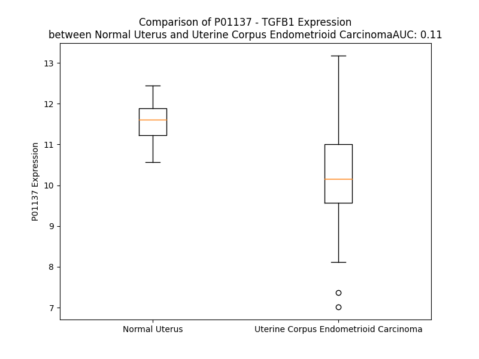

# Detailed Data for P01137

## Introduction to the Detailed Summary

### How to Interpret the Results

- **Summary & Metrics**: This section provides a quick reference to essential protein attributes, including expression changes, family classification, and biomarker applications. Regulation status (upregulated/downregulated) indicates the protein's behavior in a disease context. Some information comes from the original excel file with the proteins selected from literature, while others are derived from the analyses.
- **Expression Comparison**: A visual representation comparing protein expression between normal and disease states. It highlights significant changes in expression levels that might indicate diagnostic or therapeutic relevance. This is data coming from transcriptomics experiments and could not translate similarly to protein levels.
- **Isoform Alignment**: An interactive view of isoform alignments, revealing structural and functional differences between variants of the protein.
- **Interactors & Homologs**: Tables listing known interaction partners and homologous proteins, the more interactors and homologs, the more complex the protein is to design an antibody for.
- **Biological Assemblies**: Information about the structural arrangement of the protein in different assemblies, providing insights into its functional state but also the complexity of the protein to develop antibodies.
- **Combined Per-Residue Information**: A detailed table summarizing residue-level data. This includes predictions for epitope regions, aggregation tendencies, and modifications that might impact the protein's function. Each row corresponds to a residue in the protein, providing insights into specific sites that may be important for research or drug development.
## Summary & Metrics

- **UniProt Accession**: P01137
- **Gene Name**: TGFB1 
- **Protein Name**: Transforming growth factor beta-1
- **Swiss Prot**: TGFB1_HUMAN
- **Family**: growth factor
- **Biomarker Application**: diagnosis,disease progression,efficacy,prognosis,safety,unspecified application
- **Number of Isoforms**: 0
- **Regulation**: -1
- **(transcriptomics) AUC**: 0.29
- **(transcriptomics) Fold Change**: 1.06
- **(transcriptomics) Regulation**: Downregulated
- **Discotope Epitope Count**: 94
- **Max n_uniprots (Homo)**: 2
- **Max n_uniprots (Hetero)**: 10

## Expression Comparison

## Interactors

| preferredName_A   | preferredName_B   |   score |
|:------------------|:------------------|--------:|
| TGFB1             | DCN               |   0.999 |
| TGFB1             | TGFBR1            |   0.999 |
| TGFB1             | LTBP1             |   0.999 |
| TGFB1             | TGFBR2            |   0.999 |
| TGFB1             | ENG               |   0.998 |
| TGFB1             | TGFBR3            |   0.997 |
| TGFB1             | LTBP4             |   0.997 |
| TGFB1             | LTBP3             |   0.996 |
| TGFB1             | LRRC32            |   0.995 |
| TGFB1             | ITGAV             |   0.994 |
| TGFB1             | SMAD3             |   0.99  |
| TGFB1             | SMAD7             |   0.989 |
| TGFB1             | TGFB3             |   0.988 |
| TGFB1             | ITGB6             |   0.986 |
| TGFB1             | THBS1             |   0.985 |
| TGFB1             | ITGB8             |   0.983 |
| TGFB1             | SMAD2             |   0.983 |
| TGFB1             | FGF2              |   0.982 |
| TGFB1             | BGN               |   0.978 |
| TGFB1             | FMOD              |   0.976 |
| TGFB1             | IGF1              |   0.976 |
| TGFB1             | EGFR              |   0.975 |
| TGFB1             | CCN2              |   0.969 |
| TGFB1             | FN1               |   0.969 |
| TGFB1             | MMP9              |   0.968 |
| TGFB1             | MMP2              |   0.962 |
| TGFB1             | NRROS             |   0.961 |
| TGFB1             | IL6               |   0.96  |
| TGFB1             | SMAD4             |   0.959 |
| TGFB1             | LTBP2             |   0.959 |
| TGFB1             | ACVRL1            |   0.958 |
| TGFB1             | TGFB2             |   0.957 |
| TGFB1             | CXCL11            |   0.947 |
| TGFB1             | NRP1              |   0.944 |
| TGFB1             | TNF               |   0.941 |
| TGFB1             | LEFTY2            |   0.932 |
| TGFB1             | IL1B              |   0.932 |
| TGFB1             | IL10              |   0.932 |
| TGFB1             | PPARG             |   0.922 |
| TGFB1             | HGF               |   0.921 |
| TGFB1             | INHBA             |   0.92  |
| TGFB1             | LEFTY1            |   0.919 |
| TGFB1             | ASPN              |   0.917 |
| TGFB1             | INHBB             |   0.912 |
| TGFB1             | A2M               |   0.91  |
| TGFB1             | INHBE             |   0.905 |
| TGFB1             | INHBC             |   0.905 |
| TGFB1             | EGF               |   0.904 |
| TGFB1             | IL17A             |   0.903 |

## Homologs

| uniprot_id   | gene_id   |
|:-------------|:----------|
| Q9UK05       | GDF2      |
| P22004       | BMP6      |
| Q96S42       | NODAL     |
| Q7Z4P5       | GDF7      |
| C8C060       | BMP2      |
| P55103       | INHBC     |
| B4DXG3       | GDF9      |
| P34820       | BMP8B     |
| Q7Z5Y6       | BMP8A     |
| Q53S46       | GDF8      |
| A4D1W7       | INHBA     |
| P55107       | GDF10     |
| P05111       | INHA      |
| A0A0S2A5D6   | GDF6      |
| Q99988       | GDF15     |
| P12645       | BMP3      |
| P27539       | GDF1      |
| P61812       | TGFB2     |
| O95390       | GDF11     |
| P09529       | INHBB     |
| O95972       | BMP15     |
| V9GYF1       | BMP4      |
| F1T0J1       | GDF5      |
| Q9NR23       | GDF3      |
| P10600       | TGFB3     |
| O95393       | BMP10     |
| P18075       | BMP7      |
| M9VUD0       | BMP5      |
| O00292       | LEFTY2    |
| O75610       | LEFTY1    |
| P58166       | INHBE     |

## Biological Assemblies

|   Unnamed: 0 |   assembly |   n_uniprots | composition   | crystal_id   |
|-------------:|-----------:|-------------:|:--------------|:-------------|
|            0 |          1 |            1 | Homo          | 6p7j         |
|            0 |          1 |            3 | Hetero        | 7y1t         |
|            0 |          1 |            2 | Homo          | 1kla         |
|            0 |          1 |            3 | Hetero        | 7y1r         |
|            0 |          1 |            2 | Homo          | 1klc         |
|            0 |          1 |            6 | Hetero        | 3kfd         |
|            1 |          2 |            6 | Hetero        | 3kfd         |
|            2 |          3 |           10 | Hetero        | 3kfd         |
|            0 |          1 |            2 | Homo          | 4kv5         |
|            1 |          2 |            2 | Homo          | 4kv5         |
|            2 |          3 |            0 | Hetero        | 4kv5         |
|            3 |          4 |            0 | Hetero        | 4kv5         |
|            4 |          5 |            0 | Hetero        | 4kv5         |
|            5 |          6 |            0 | Hetero        | 4kv5         |
|            0 |          1 |            8 | Hetero        | 5ffo         |
|            0 |          1 |            1 | Homo          | 5vqp         |
|            0 |          1 |            4 | Hetero        | 6om2         |
|            0 |          1 |            2 | Homo          | 1kld         |

## Combined Per-Residue Information

|   res | aa   |   epitope_score | epitope   |   relative_surface_accessibility |   modeling_confidence |   Aggregation | modification   | glycosylation                   |
|------:|:-----|----------------:|:----------|---------------------------------:|----------------------:|--------------:|:---------------|:--------------------------------|
|     1 | M    |         0.09793 | False     |                          1.19781 |                 34.62 |         0     | N/A            | N/A                             |
|     2 | P    |         0.15251 | False     |                          0.9707  |                 43.64 |         0     | N/A            | N/A                             |
|     3 | P    |         0.1454  | False     |                          0.7807  |                 44.84 |         0     | N/A            | N/A                             |
|     4 | S    |         0.15276 | False     |                          0.96432 |                 45.81 |         0     | N/A            | N/A                             |
|     5 | G    |         0.25263 | True      |                          0.74853 |                 42.28 |         0     | N/A            | N/A                             |
|     6 | L    |         0.18375 | False     |                          0.96976 |                 46.13 |         0     | N/A            | N/A                             |
|     7 | R    |         0.18649 | False     |                          0.88475 |                 49.59 |         0     | N/A            | N/A                             |
|     8 | L    |         0.12    | False     |                          0.866   |                 48.72 |        23.231 | N/A            | N/A                             |
|     9 | L    |         0.12844 | False     |                          0.8293  |                 48.46 |        23.24  | N/A            | N/A                             |
|    10 | L    |         0.14687 | False     |                          0.90013 |                 50.76 |        23.241 | N/A            | N/A                             |
|    11 | L    |         0.17405 | False     |                          0.80181 |                 52.9  |        23.241 | N/A            | N/A                             |
|    12 | L    |         0.18505 | False     |                          0.72903 |                 50.27 |        23.241 | N/A            | N/A                             |
|    13 | L    |         0.13102 | False     |                          0.73252 |                 51.61 |         0.061 | N/A            | N/A                             |
|    14 | P    |         0.13908 | False     |                          0.55313 |                 50.97 |         1.029 | N/A            | N/A                             |
|    15 | L    |         0.12422 | False     |                          0.71582 |                 50.55 |        82.342 | N/A            | N/A                             |
|    16 | L    |         0.1505  | False     |                          0.77431 |                 49.32 |        97.06  | N/A            | N/A                             |
|    17 | W    |         0.16092 | False     |                          0.82213 |                 47.62 |        99.341 | N/A            | N/A                             |
|    18 | L    |         0.12689 | False     |                          0.8198  |                 47.49 |        99.343 | N/A            | N/A                             |
|    19 | L    |         0.11247 | False     |                          0.85264 |                 50.78 |        99.341 | N/A            | N/A                             |
|    20 | V    |         0.12178 | False     |                          0.85532 |                 51.33 |        98.277 | N/A            | N/A                             |
|    21 | L    |         0.15959 | False     |                          0.84793 |                 44.16 |        83.485 | N/A            | N/A                             |
|    22 | T    |         0.13575 | False     |                          0.79462 |                 42.12 |         0.44  | N/A            | N/A                             |
|    23 | P    |         0.14106 | False     |                          0.896   |                 43.87 |         0.098 | N/A            | N/A                             |
|    24 | G    |         0.22938 | True      |                          0.91195 |                 42.73 |         0     | N/A            | N/A                             |
|    25 | R    |         0.17024 | False     |                          0.91496 |                 39.14 |         0     | N/A            | N/A                             |
|    26 | P    |         0.12355 | False     |                          0.90716 |                 43.47 |         0     | N/A            | N/A                             |
|    27 | A    |         0.13609 | False     |                          1.01308 |                 46.36 |         0     | N/A            | N/A                             |
|    28 | A    |         0.13693 | False     |                          0.80665 |                 41.93 |         0     | N/A            | N/A                             |
|    29 | G    |         0.1776  | False     |                          0.90796 |                 41.05 |         0     | N/A            | N/A                             |
|    30 | L    |         0.18765 | False     |                          0.98207 |                 39.23 |         0     | N/A            | N/A                             |
|    31 | S    |         0.20035 | True      |                          0.79745 |                 42.35 |         0     | N/A            | N/A                             |
|    32 | T    |         0.14264 | False     |                          0.89402 |                 41.21 |         0     | N/A            | N/A                             |
|    33 | C    |         0.16255 | False     |                          0.88679 |                 46.87 |         0     | N/A            | N/A                             |
|    34 | K    |         0.18876 | False     |                          0.90917 |                 47.14 |         0     | N/A            | N/A                             |
|    35 | T    |         0.17906 | False     |                          0.89463 |                 57.29 |         0     | N/A            | N/A                             |
|    36 | I    |         0.20351 | True      |                          0.6303  |                 69.05 |         0     | N/A            | N/A                             |
|    37 | D    |         0.14539 | False     |                          0.50742 |                 82.08 |         0     | N/A            | N/A                             |
|    38 | M    |         0.18264 | False     |                          0.37689 |                 79.17 |         0     | N/A            | N/A                             |
|    39 | E    |         0.20416 | True      |                          0.5699  |                 84.5  |         0     | N/A            | N/A                             |
|    40 | L    |         0.10992 | False     |                          0.54126 |                 86.56 |         0     | N/A            | N/A                             |
|    41 | V    |         0.11651 | False     |                          0.31957 |                 83.29 |         0     | N/A            | N/A                             |
|    42 | K    |         0.10368 | False     |                          0.32637 |                 86.28 |         0     | N/A            | N/A                             |
|    43 | R    |         0.2254  | True      |                          0.71786 |                 89.34 |         0     | N/A            | N/A                             |
|    44 | K    |         0.13527 | False     |                          0.62335 |                 90.62 |         0     | N/A            | N/A                             |
|    45 | R    |         0.10331 | False     |                          0.29837 |                 88.71 |         0     | N/A            | N/A                             |
|    46 | I    |         0.07478 | False     |                          0.19839 |                 92.05 |         0     | N/A            | N/A                             |
|    47 | E    |         0.18152 | False     |                          0.60483 |                 92.92 |         0     | N/A            | N/A                             |
|    48 | A    |         0.10137 | False     |                          0.5569  |                 92.37 |         0     | N/A            | N/A                             |
|    49 | I    |         0.019   | False     |                          0.0136  |                 92.72 |         0     | N/A            | N/A                             |
|    50 | R    |         0.16135 | False     |                          0.40833 |                 93.94 |         0     | N/A            | N/A                             |
|    51 | G    |         0.14128 | False     |                          0.46834 |                 94.15 |         0     | N/A            | N/A                             |
|    52 | Q    |         0.12561 | False     |                          0.32206 |                 94.84 |         0     | N/A            | N/A                             |
|    53 | I    |         0.00448 | False     |                          0       |                 94.82 |         0     | N/A            | N/A                             |
|    54 | L    |         0.05653 | False     |                          0.12283 |                 94.48 |         0     | N/A            | N/A                             |
|    55 | S    |         0.09146 | False     |                          0.62473 |                 95.78 |         0     | N/A            | N/A                             |
|    56 | K    |         0.07153 | False     |                          0.34543 |                 94.78 |         0     | N/A            | N/A                             |
|    57 | L    |         0.03648 | False     |                          0.09675 |                 92.9  |         0     | N/A            | N/A                             |
|    58 | R    |         0.23234 | True      |                          0.89367 |                 93.36 |         0     | N/A            | N/A                             |
|    59 | L    |         0.11401 | False     |                          0.25729 |                 90.06 |         0     | N/A            | N/A                             |
|    60 | A    |         0.09482 | False     |                          1.07048 |                 89.2  |         0     | N/A            | N/A                             |
|    61 | S    |         0.165   | False     |                          0.55061 |                 89.7  |         0     | N/A            | N/A                             |
|    62 | P    |         0.09832 | False     |                          0.39297 |                 88.12 |         0     | N/A            | N/A                             |
|    63 | P    |         0.09383 | False     |                          0.18879 |                 84.93 |         0     | N/A            | N/A                             |
|    64 | S    |         0.25109 | True      |                          0.49805 |                 78.01 |         0     | N/A            | N/A                             |
|    65 | Q    |         0.14907 | False     |                          0.35002 |                 69.26 |         0     | N/A            | N/A                             |
|    66 | G    |         0.28601 | True      |                          0.97694 |                 65.82 |         0     | N/A            | N/A                             |
|    67 | E    |         0.23576 | True      |                          0.44075 |                 64.71 |         0     | N/A            | N/A                             |
|    68 | V    |         0.10609 | False     |                          0.23837 |                 70.04 |         0     | N/A            | N/A                             |
|    69 | P    |         0.2935  | True      |                          0.38588 |                 71.87 |         0     | N/A            | N/A                             |
|    70 | P    |         0.29026 | True      |                          1.02084 |                 73.18 |         0     | N/A            | N/A                             |
|    71 | G    |         0.25068 | True      |                          0.58006 |                 80.94 |         0     | N/A            | N/A                             |
|    72 | P    |         0.37394 | True      |                          0.93989 |                 84.62 |         0     | N/A            | N/A                             |
|    73 | L    |         0.06595 | False     |                          0.07592 |                 86.73 |         0     | N/A            | N/A                             |
|    74 | P    |         0.2199  | True      |                          0.50897 |                 91.23 |         0     | N/A            | N/A                             |
|    75 | E    |         0.21837 | True      |                          0.79501 |                 91.2  |         0     | N/A            | N/A                             |
|    76 | A    |         0.20819 | True      |                          0.76373 |                 93.41 |        17.323 | N/A            | N/A                             |
|    77 | V    |         0.06531 | False     |                          0.16852 |                 93.3  |        33.481 | N/A            | N/A                             |
|    78 | L    |         0.08749 | False     |                          0.44845 |                 92.5  |        33.616 | N/A            | N/A                             |
|    79 | A    |         0.05704 | False     |                          0.55881 |                 94.96 |        33.616 | N/A            | N/A                             |
|    80 | L    |         0.12389 | False     |                          0.62475 |                 95.51 |        33.616 | N/A            | N/A                             |
|    81 | Y    |         0.04362 | False     |                          0.0654  |                 95.12 |        29.956 | N/A            | N/A                             |
|    82 | N    |         0.06123 | False     |                          0.29927 |                 94.88 |         2.415 | N/A            | N-linked (GlcNAc...) asparagine |
|    83 | S    |         0.10862 | False     |                          0.53909 |                 94.99 |         1.208 | N/A            | N/A                             |
|    84 | T    |         0.04892 | False     |                          0.16401 |                 93.83 |         0.216 | N/A            | N/A                             |
|    85 | R    |         0.06715 | False     |                          0.43104 |                 92.4  |         0     | N/A            | N/A                             |
|    86 | D    |         0.07706 | False     |                          0.48262 |                 92.51 |         0     | N/A            | N/A                             |
|    87 | R    |         0.07111 | False     |                          0.4486  |                 92.15 |         0     | N/A            | N/A                             |
|    88 | V    |         0.05467 | False     |                          0.09111 |                 87.95 |         0     | N/A            | N/A                             |
|    89 | A    |         0.0851  | False     |                          0.5151  |                 86.66 |         0     | N/A            | N/A                             |
|    90 | G    |         0.11079 | False     |                          0.49006 |                 85.8  |         0     | N/A            | N/A                             |
|    91 | E    |         0.10035 | False     |                          0.49291 |                 81.4  |         0     | N/A            | N/A                             |
|    92 | S    |         0.07127 | False     |                          0.19591 |                 75.39 |         0     | N/A            | N/A                             |
|    93 | A    |         0.1362  | False     |                          0.76163 |                 74.82 |         0     | N/A            | N/A                             |
|    94 | E    |         0.18786 | False     |                          0.62892 |                 67.8  |         0     | N/A            | N/A                             |
|    95 | P    |         0.21435 | True      |                          0.93549 |                 63.32 |         0     | N/A            | N/A                             |
|    96 | E    |         0.14549 | False     |                          0.55604 |                 61.75 |         0     | N/A            | N/A                             |
|    97 | P    |         0.22493 | True      |                          0.70471 |                 58.47 |         0     | N/A            | N/A                             |
|    98 | E    |         0.16714 | False     |                          0.65735 |                 58.51 |         0     | N/A            | N/A                             |
|    99 | P    |         0.15482 | False     |                          0.72425 |                 57.9  |         0     | N/A            | N/A                             |
|   100 | E    |         0.13085 | False     |                          0.70254 |                 59.86 |         0     | N/A            | N/A                             |
|   101 | A    |         0.05757 | False     |                          0.38833 |                 62.06 |         0     | N/A            | N/A                             |
|   102 | D    |         0.1259  | False     |                          0.58893 |                 66.41 |         0     | N/A            | N/A                             |
|   103 | Y    |         0.16763 | False     |                          0.78917 |                 70.52 |         0     | N/A            | N/A                             |
|   104 | Y    |         0.1753  | False     |                          0.36468 |                 76.59 |         0     | N/A            | N/A                             |
|   105 | A    |         0.11662 | False     |                          0.69103 |                 83.65 |         0     | N/A            | N/A                             |
|   106 | K    |         0.10871 | False     |                          0.23166 |                 88.76 |         0     | N/A            | N/A                             |
|   107 | E    |         0.09122 | False     |                          0.52361 |                 92.55 |         0.815 | N/A            | N/A                             |
|   108 | V    |         0.12473 | False     |                          0.63306 |                 94.65 |         2.113 | N/A            | N/A                             |
|   109 | T    |         0.08377 | False     |                          0.30095 |                 96.08 |         2.113 | N/A            | N/A                             |
|   110 | R    |         0.12439 | False     |                          0.42735 |                 95.07 |         2.113 | N/A            | N/A                             |
|   111 | V    |         0.02333 | False     |                          0.05522 |                 95.33 |         2.113 | N/A            | N/A                             |
|   112 | L    |         0.07583 | False     |                          0.25582 |                 93.36 |         2.113 | N/A            | N/A                             |
|   113 | M    |         0.00904 | False     |                          0.00463 |                 92.92 |         2.113 | N/A            | N/A                             |
|   114 | V    |         0.07942 | False     |                          0.17124 |                 91.56 |         2.113 | N/A            | N/A                             |
|   115 | E    |         0.1214  | False     |                          0.37084 |                 86.94 |         1.298 | N/A            | N/A                             |
|   116 | T    |         0.11506 | False     |                          0.28284 |                 81.2  |         0.483 | N/A            | N/A                             |
|   117 | H    |         0.28373 | True      |                          0.76075 |                 79.83 |         0     | N/A            | N/A                             |
|   118 | N    |         0.19717 | True      |                          0.34587 |                 85.01 |         0     | N/A            | N/A                             |
|   119 | E    |         0.22291 | True      |                          0.74619 |                 85.26 |         0     | N/A            | N/A                             |
|   120 | I    |         0.15194 | False     |                          0.28014 |                 83.79 |         0     | N/A            | N/A                             |
|   121 | Y    |         0.03284 | False     |                          0.03735 |                 84.74 |         0     | N/A            | N/A                             |
|   122 | D    |         0.33745 | True      |                          0.52013 |                 83.87 |         0     | N/A            | N/A                             |
|   123 | K    |         0.40533 | True      |                          0.86982 |                 77.9  |         0     | N/A            | N/A                             |
|   124 | F    |         0.19636 | True      |                          0.19197 |                 78.18 |         0     | N/A            | N/A                             |
|   125 | K    |         0.48016 | True      |                          0.59322 |                 66.88 |         0     | N/A            | N/A                             |
|   126 | Q    |         0.34729 | True      |                          0.87205 |                 67.35 |         0     | N/A            | N/A                             |
|   127 | S    |         0.22577 | True      |                          0.24819 |                 77.47 |         0     | N/A            | N/A                             |
|   128 | T    |         0.40454 | True      |                          0.73153 |                 83.26 |         0.112 | N/A            | N/A                             |
|   129 | H    |         0.24446 | True      |                          0.3675  |                 86.37 |         0.299 | N/A            | N/A                             |
|   130 | S    |         0.03963 | False     |                          0.04571 |                 90.34 |         9.782 | N/A            | N/A                             |
|   131 | I    |         0.14298 | False     |                          0.16479 |                 91.04 |        80.821 | N/A            | N/A                             |
|   132 | Y    |         0.05625 | False     |                          0.10034 |                 92.01 |        81.149 | N/A            | N/A                             |
|   133 | M    |         0.00317 | False     |                          0       |                 93.78 |        81.149 | N/A            | N/A                             |
|   134 | F    |         0.01158 | False     |                          0.00637 |                 93.69 |        81.149 | N/A            | N/A                             |
|   135 | F    |         0.00219 | False     |                          0       |                 95.36 |        80.465 | N/A            | N/A                             |
|   136 | N    |         0.05441 | False     |                          0.2941  |                 94.04 |         4.281 | N/A            | N-linked (GlcNAc...) asparagine |
|   137 | T    |         0.00723 | False     |                          0.00571 |                 92.46 |         1.057 | N/A            | N/A                             |
|   138 | S    |         0.08833 | False     |                          0.4425  |                 93.78 |         0.099 | N/A            | N/A                             |
|   139 | E    |         0.05939 | False     |                          0.4044  |                 93.84 |         0     | N/A            | N/A                             |
|   140 | L    |         0.00334 | False     |                          0.00082 |                 94.36 |         0     | N/A            | N/A                             |
|   141 | R    |         0.10928 | False     |                          0.35054 |                 92.75 |         0     | N/A            | N/A                             |
|   142 | E    |         0.12706 | False     |                          0.76464 |                 92.71 |         0     | N/A            | N/A                             |
|   143 | A    |         0.03043 | False     |                          0.23778 |                 91.37 |         0     | N/A            | N/A                             |
|   144 | V    |         0.00761 | False     |                          0.00286 |                 93.47 |         0     | N/A            | N/A                             |
|   145 | P    |         0.11884 | False     |                          0.58051 |                 89.93 |         0     | N/A            | N/A                             |
|   146 | E    |         0.12122 | False     |                          0.39701 |                 90.17 |         0     | N/A            | N/A                             |
|   147 | P    |         0.05132 | False     |                          0.29681 |                 91.02 |         0     | N/A            | N/A                             |
|   148 | V    |         0.12706 | False     |                          0.93453 |                 87.59 |         0     | N/A            | N/A                             |
|   149 | L    |         0.04502 | False     |                          0.06563 |                 89.63 |         0     | N/A            | N/A                             |
|   150 | L    |         0.01859 | False     |                          0.01837 |                 91.57 |         0     | N/A            | N/A                             |
|   151 | S    |         0.06841 | False     |                          0.3517  |                 89.66 |         0     | N/A            | N/A                             |
|   152 | R    |         0.09391 | False     |                          0.36523 |                 93.4  |         0     | N/A            | N/A                             |
|   153 | A    |         0.00151 | False     |                          0       |                 97.28 |         0     | N/A            | N/A                             |
|   154 | E    |         0.0515  | False     |                          0.07461 |                 97.84 |         0     | N/A            | N/A                             |
|   155 | L    |         0.00223 | False     |                          0       |                 97.9  |         0     | N/A            | N/A                             |
|   156 | R    |         0.14374 | False     |                          0.28203 |                 96.39 |         0     | N/A            | N/A                             |
|   157 | L    |         0.0044  | False     |                          0.00082 |                 93.95 |         0     | N/A            | N/A                             |
|   158 | L    |         0.09815 | False     |                          0.12601 |                 92.43 |         0     | N/A            | N/A                             |
|   159 | R    |         0.05184 | False     |                          0.01124 |                 90.66 |         0     | N/A            | N/A                             |
|   160 | L    |         0.15136 | False     |                          0.14477 |                 87.83 |         0     | N/A            | N/A                             |
|   161 | K    |         0.25637 | True      |                          0.5417  |                 84.26 |         0     | N/A            | N/A                             |
|   162 | L    |         0.06453 | False     |                          0.02377 |                 88.3  |         0     | N/A            | N/A                             |
|   163 | K    |         0.28134 | True      |                          0.84956 |                 87.94 |         0     | N/A            | N/A                             |
|   164 | V    |         0.2675  | True      |                          0.58267 |                 87.92 |         0     | N/A            | N/A                             |
|   165 | E    |         0.20436 | True      |                          0.58947 |                 89.77 |         0     | N/A            | N/A                             |
|   166 | Q    |         0.12589 | False     |                          0.11324 |                 88.47 |         0     | N/A            | N/A                             |
|   167 | H    |         0.2345  | True      |                          0.30472 |                 91.25 |         0     | N/A            | N/A                             |
|   168 | V    |         0.005   | False     |                          0       |                 92.96 |         0     | N/A            | N/A                             |
|   169 | E    |         0.09358 | False     |                          0.11054 |                 94.83 |         0     | N/A            | N/A                             |
|   170 | L    |         0.0104  | False     |                          0.0033  |                 96.49 |         0     | N/A            | N/A                             |
|   171 | Y    |         0.08422 | False     |                          0.19485 |                 95.38 |         0     | N/A            | N/A                             |
|   172 | Q    |         0.01706 | False     |                          0.03515 |                 94.73 |         0     | N/A            | N/A                             |
|   173 | K    |         0.13329 | False     |                          0.31532 |                 91.12 |         0     | N/A            | N/A                             |
|   174 | Y    |         0.27096 | True      |                          0.59073 |                 86.56 |         0     | N/A            | N/A                             |
|   175 | S    |         0.26575 | True      |                          0.43728 |                 81.37 |         0     | N/A            | N/A                             |
|   176 | N    |         0.33426 | True      |                          0.86796 |                 76.22 |         0     | N/A            | N-linked (GlcNAc...) asparagine |
|   177 | N    |         0.25899 | True      |                          0.75104 |                 74.65 |         0     | N/A            | N/A                             |
|   178 | S    |         0.24921 | True      |                          0.32263 |                 88.08 |         0     | N/A            | N/A                             |
|   179 | W    |         0.14684 | False     |                          0.21401 |                 91.61 |         0     | N/A            | N/A                             |
|   180 | R    |         0.24109 | True      |                          0.5893  |                 94.47 |         0     | N/A            | N/A                             |
|   181 | Y    |         0.21789 | True      |                          0.46625 |                 94.81 |         0     | N/A            | N/A                             |
|   182 | L    |         0.07673 | False     |                          0.32982 |                 95.4  |         0     | N/A            | N/A                             |
|   183 | S    |         0.16601 | False     |                          0.29323 |                 95.84 |         0     | N/A            | N/A                             |
|   184 | N    |         0.32912 | True      |                          0.52771 |                 93.57 |         0     | N/A            | N/A                             |
|   185 | R    |         0.23431 | True      |                          0.29964 |                 93.46 |         0     | N/A            | N/A                             |
|   186 | L    |         0.20071 | True      |                          0.74374 |                 93.07 |         0     | N/A            | N/A                             |
|   187 | L    |         0.03101 | False     |                          0.02638 |                 92.47 |         0     | N/A            | N/A                             |
|   188 | A    |         0.1045  | False     |                          0.63047 |                 92.87 |         0     | N/A            | N/A                             |
|   189 | P    |         0.24865 | True      |                          0.5591  |                 92.68 |         0     | N/A            | N/A                             |
|   190 | S    |         0.17142 | False     |                          0.24637 |                 90.63 |         0     | N/A            | N/A                             |
|   191 | D    |         0.33596 | True      |                          0.83295 |                 88.24 |         0     | N/A            | N/A                             |
|   192 | S    |         0.27008 | True      |                          0.51723 |                 90.08 |         0     | N/A            | N/A                             |
|   193 | P    |         0.2911  | True      |                          0.65679 |                 89.01 |         0     | N/A            | N/A                             |
|   194 | E    |         0.30698 | True      |                          0.36636 |                 91.54 |         0     | N/A            | N/A                             |
|   195 | W    |         0.23856 | True      |                          0.44418 |                 93.63 |         0.204 | N/A            | N/A                             |
|   196 | L    |         0.01028 | False     |                          0.00247 |                 94.51 |         0.204 | N/A            | N/A                             |
|   197 | S    |         0.08934 | False     |                          0.33301 |                 94.98 |         0.204 | N/A            | N/A                             |
|   198 | F    |         0.03053 | False     |                          0.05592 |                 96.92 |         0.204 | N/A            | N/A                             |
|   199 | D    |         0.0675  | False     |                          0.52935 |                 96.28 |         0.204 | N/A            | N/A                             |
|   200 | V    |         0.01309 | False     |                          0.01619 |                 96.96 |        13.263 | N/A            | N/A                             |
|   201 | T    |         0.04053 | False     |                          0.09543 |                 95.39 |        13.263 | N/A            | N/A                             |
|   202 | G    |         0.09595 | False     |                          0.58869 |                 94.79 |        13.263 | N/A            | N/A                             |
|   203 | V    |         0.04178 | False     |                          0.10514 |                 95.72 |        13.263 | N/A            | N/A                             |
|   204 | V    |         0.00254 | False     |                          0       |                 95.51 |        13.263 | N/A            | N/A                             |
|   205 | R    |         0.11905 | False     |                          0.39245 |                 94.49 |         0.204 | N/A            | N/A                             |
|   206 | Q    |         0.08238 | False     |                          0.28137 |                 93.02 |         0.204 | N/A            | N/A                             |
|   207 | W    |         0.02384 | False     |                          0.01137 |                 93.44 |         0.204 | N/A            | N/A                             |
|   208 | L    |         0.0408  | False     |                          0.09395 |                 92.65 |         0.204 | N/A            | N/A                             |
|   209 | S    |         0.07762 | False     |                          0.6098  |                 91.83 |         0     | N/A            | N/A                             |
|   210 | R    |         0.261   | True      |                          0.56123 |                 86.44 |         0     | N/A            | N/A                             |
|   211 | G    |         0.25841 | True      |                          0.50028 |                 79.57 |         0     | N/A            | N/A                             |
|   212 | G    |         0.22542 | True      |                          0.33801 |                 85.82 |         0     | N/A            | N/A                             |
|   213 | E    |         0.20796 | True      |                          0.69927 |                 89.47 |         0     | N/A            | N/A                             |
|   214 | I    |         0.20844 | True      |                          0.31499 |                 90.87 |         0     | N/A            | N/A                             |
|   215 | E    |         0.11796 | False     |                          0.1288  |                 92.95 |         0     | N/A            | N/A                             |
|   216 | G    |         0.01222 | False     |                          0       |                 93.43 |         0     | N/A            | N/A                             |
|   217 | F    |         0.00255 | False     |                          0       |                 95.88 |         0     | N/A            | N/A                             |
|   218 | R    |         0.10763 | False     |                          0.21676 |                 93.84 |         0     | N/A            | N/A                             |
|   219 | L    |         0.00621 | False     |                          0       |                 94.23 |         0     | N/A            | N/A                             |
|   220 | S    |         0.06543 | False     |                          0.04036 |                 92.43 |         0     | N/A            | N/A                             |
|   221 | A    |         0.04161 | False     |                          0.07792 |                 91.03 |         0     | N/A            | N/A                             |
|   222 | H    |         0.23522 | True      |                          0.39742 |                 88.06 |         0     | N/A            | N/A                             |
|   223 | C    |         0.27151 | True      |                          0.6286  |                 80.97 |         0     | N/A            | N/A                             |
|   224 | S    |         0.22885 | True      |                          0.31145 |                 75.36 |         0     | N/A            | N/A                             |
|   225 | C    |         0.45589 | True      |                          1.02732 |                 76.9  |         0     | N/A            | N/A                             |
|   226 | D    |         0.32385 | True      |                          0.88611 |                 76.24 |         0     | N/A            | N/A                             |
|   227 | S    |         0.34001 | True      |                          0.41658 |                 70.04 |         0     | N/A            | N/A                             |
|   228 | R    |         0.56526 | True      |                          0.96771 |                 69.9  |         0     | N/A            | N/A                             |
|   229 | D    |         0.52632 | True      |                          0.51217 |                 71.3  |         0     | N/A            | N/A                             |
|   230 | N    |         0.27085 | True      |                          0.27201 |                 77.71 |         0     | N/A            | N/A                             |
|   231 | T    |         0.23844 | True      |                          0.43092 |                 86.16 |         0     | N/A            | N/A                             |
|   232 | L    |         0.08578 | False     |                          0.15699 |                 87.54 |         0     | N/A            | N/A                             |
|   233 | Q    |         0.22753 | True      |                          0.42779 |                 86.94 |         0     | N/A            | N/A                             |
|   234 | V    |         0.07433 | False     |                          0.0761  |                 86.96 |         0     | N/A            | N/A                             |
|   235 | D    |         0.10667 | False     |                          0.15102 |                 86.78 |         0     | N/A            | N/A                             |
|   236 | I    |         0.03356 | False     |                          0.02598 |                 87.15 |         0     | N/A            | N/A                             |
|   237 | N    |         0.04251 | False     |                          0.01483 |                 85.95 |         0     | N/A            | N/A                             |
|   238 | G    |         0.03399 | False     |                          0.28837 |                 81    |         0     | N/A            | N/A                             |
|   239 | F    |         0.12619 | False     |                          0.23873 |                 78.19 |         0     | N/A            | N/A                             |
|   240 | T    |         0.1697  | False     |                          0.50807 |                 62.95 |         0     | N/A            | N/A                             |
|   241 | T    |         0.2376  | True      |                          0.96843 |                 55.74 |         0     | N/A            | N/A                             |
|   242 | G    |         0.40124 | True      |                          0.9091  |                 51.61 |         0     | N/A            | N/A                             |
|   243 | R    |         0.26964 | True      |                          0.50937 |                 54.53 |         0     | N/A            | N/A                             |
|   244 | R    |         0.28108 | True      |                          0.75378 |                 53.93 |         0     | N/A            | N/A                             |
|   245 | G    |         0.28411 | True      |                          0.72052 |                 55.95 |         0     | N/A            | N/A                             |
|   246 | D    |         0.18815 | False     |                          0.57216 |                 58.02 |         0     | N/A            | N/A                             |
|   247 | L    |         0.24396 | True      |                          0.48225 |                 58.01 |         0     | N/A            | N/A                             |
|   248 | A    |         0.09698 | False     |                          0.50039 |                 59.64 |         0     | N/A            | N/A                             |
|   249 | T    |         0.17019 | False     |                          0.71562 |                 61.32 |         0     | N/A            | N/A                             |
|   250 | I    |         0.22328 | True      |                          0.59657 |                 58.87 |         0     | N/A            | N/A                             |
|   251 | H    |         0.12609 | False     |                          0.20749 |                 62.35 |         0     | N/A            | N/A                             |
|   252 | G    |         0.07684 | False     |                          0.27914 |                 68.24 |         0     | N/A            | N/A                             |
|   253 | M    |         0.21237 | True      |                          0.55384 |                 75.61 |         0     | N/A            | N/A                             |
|   254 | N    |         0.15896 | False     |                          0.30161 |                 85.14 |         0     | N/A            | N/A                             |
|   255 | R    |         0.07559 | False     |                          0.17133 |                 90.59 |         0     | N/A            | N/A                             |
|   256 | P    |         0.00331 | False     |                          0.00199 |                 94.69 |         0.832 | N/A            | N/A                             |
|   257 | F    |         0.16084 | False     |                          0.08854 |                 95.7  |        47.204 | N/A            | N/A                             |
|   258 | L    |         0.00315 | False     |                          0       |                 97.76 |        51.888 | N/A            | N/A                             |
|   259 | L    |         0.06436 | False     |                          0.22093 |                 97.42 |        51.888 | N/A            | N/A                             |
|   260 | L    |         0.00631 | False     |                          0.00348 |                 97.27 |        51.888 | N/A            | N/A                             |
|   261 | M    |         0.06738 | False     |                          0.20657 |                 94.8  |        51.618 | N/A            | N/A                             |
|   262 | A    |         0.02976 | False     |                          0.07109 |                 92.64 |        26.505 | N/A            | N/A                             |
|   263 | T    |         0.0483  | False     |                          0.11002 |                 88.45 |         0.586 | N/A            | N/A                             |
|   264 | P    |         0.10047 | False     |                          0.2143  |                 88.12 |         0.5   | N/A            | N/A                             |
|   265 | L    |         0.13137 | False     |                          0.38184 |                 84.9  |         0     | N/A            | N/A                             |
|   266 | E    |         0.13363 | False     |                          0.68251 |                 83.49 |         0     | N/A            | N/A                             |
|   267 | R    |         0.1807  | False     |                          0.35659 |                 80.48 |         0     | N/A            | N/A                             |
|   268 | A    |         0.06052 | False     |                          0.06995 |                 75.92 |         0     | N/A            | N/A                             |
|   269 | Q    |         0.12469 | False     |                          0.55226 |                 72.77 |         0     | N/A            | N/A                             |
|   270 | H    |         0.08526 | False     |                          0.76187 |                 67.12 |         0     | N/A            | N/A                             |
|   271 | L    |         0.12266 | False     |                          0.36863 |                 63.14 |         0     | N/A            | N/A                             |
|   272 | Q    |         0.15206 | False     |                          0.66908 |                 58.94 |         0     | N/A            | N/A                             |
|   273 | S    |         0.1223  | False     |                          0.64493 |                 53.18 |         0     | N/A            | N/A                             |
|   274 | S    |         0.1391  | False     |                          0.6116  |                 51.42 |         0     | N/A            | N/A                             |
|   275 | R    |         0.24245 | True      |                          0.86342 |                 47.37 |         0     | N/A            | N/A                             |
|   276 | H    |         0.2403  | True      |                          0.82685 |                 43.05 |         0     | N/A            | N/A                             |
|   277 | R    |         0.19131 | False     |                          0.62986 |                 43.67 |         0     | N/A            | N/A                             |
|   278 | R    |         0.23923 | True      |                          0.67138 |                 42.27 |         0     | N/A            | N/A                             |
|   279 | A    |         0.17267 | False     |                          0.92317 |                 40.98 |         0     | N/A            | N/A                             |
|   280 | L    |         0.13969 | False     |                          0.67464 |                 42.1  |         0     | N/A            | N/A                             |
|   281 | D    |         0.15542 | False     |                          0.48058 |                 43.85 |         0     | N/A            | N/A                             |
|   282 | T    |         0.13314 | False     |                          0.63722 |                 50.22 |         0     | N/A            | N/A                             |
|   283 | N    |         0.1352  | False     |                          0.30911 |                 59.03 |         0     | N/A            | N/A                             |
|   284 | Y    |         0.05761 | False     |                          0.2438  |                 61.29 |         0     | N/A            | N/A                             |
|   285 | C    |         0.05035 | False     |                          0.17125 |                 65.15 |         0     | N/A            | N/A                             |
|   286 | F    |         0.2211  | True      |                          0.78964 |                 54.42 |         0     | N/A            | N/A                             |
|   287 | S    |         0.18557 | False     |                          0.30923 |                 53.18 |         0     | N/A            | N/A                             |
|   288 | S    |         0.18143 | False     |                          0.83686 |                 54.35 |         0     | N/A            | N/A                             |
|   289 | T    |         0.23402 | True      |                          0.74091 |                 53.58 |         0     | N/A            | N/A                             |
|   290 | E    |         0.16535 | False     |                          0.42061 |                 57.88 |         0     | N/A            | N/A                             |
|   291 | K    |         0.20931 | True      |                          0.78978 |                 64.36 |         0     | N/A            | N/A                             |
|   292 | N    |         0.12689 | False     |                          0.2935  |                 74.62 |         0     | N/A            | N/A                             |
|   293 | C    |         0.03011 | False     |                          0.19266 |                 78.83 |         0     | N/A            | N/A                             |
|   294 | C    |         0.01587 | False     |                          0.03906 |                 80.73 |         0     | N/A            | N/A                             |
|   295 | V    |         0.0108  | False     |                          0.00493 |                 86.21 |         0     | N/A            | N/A                             |
|   296 | R    |         0.1882  | False     |                          0.18913 |                 85.68 |         0     | N/A            | N/A                             |
|   297 | Q    |         0.18748 | False     |                          0.61842 |                 88.12 |         0     | N/A            | N/A                             |
|   298 | L    |         0.1305  | False     |                          0.07914 |                 90.05 |         0     | N/A            | N/A                             |
|   299 | Y    |         0.25137 | True      |                          0.46882 |                 94.14 |         0     | N/A            | N/A                             |
|   300 | I    |         0.0041  | False     |                          0       |                 94.25 |         0     | N/A            | N/A                             |
|   301 | D    |         0.09955 | False     |                          0.21134 |                 95.47 |         0     | N/A            | N/A                             |
|   302 | F    |         0.00497 | False     |                          0.00412 |                 93.74 |         0     | N/A            | N/A                             |
|   303 | R    |         0.18411 | False     |                          0.51369 |                 91.89 |         0     | N/A            | N/A                             |
|   304 | K    |         0.27122 | True      |                          0.8623  |                 92.81 |         0     | N/A            | N/A                             |
|   305 | D    |         0.1879  | False     |                          0.33675 |                 93.09 |         0     | N/A            | N/A                             |
|   306 | L    |         0.03161 | False     |                          0.01193 |                 91.11 |         0     | N/A            | N/A                             |
|   307 | G    |         0.11728 | False     |                          0.53216 |                 89.51 |         0     | N/A            | N/A                             |
|   308 | W    |         0.04618 | False     |                          0.01544 |                 89.47 |         0     | N/A            | N/A                             |
|   309 | K    |         0.13969 | False     |                          0.66004 |                 86.94 |         0     | N/A            | N/A                             |
|   310 | W    |         0.01449 | False     |                          0.00267 |                 88.18 |         0     | N/A            | N/A                             |
|   311 | I    |         0.01594 | False     |                          0.03193 |                 90.91 |         0     | N/A            | N/A                             |
|   312 | H    |         0.12524 | False     |                          0.2006  |                 89.53 |         0     | N/A            | N/A                             |
|   313 | E    |         0.06499 | False     |                          0.18284 |                 92.29 |         0     | N/A            | N/A                             |
|   314 | P    |         0.10922 | False     |                          0.17893 |                 94.62 |         0     | N/A            | N/A                             |
|   315 | K    |         0.10239 | False     |                          0.35533 |                 93.12 |         0     | N/A            | N/A                             |
|   316 | G    |         0.09078 | False     |                          0.11379 |                 94.59 |         0     | N/A            | N/A                             |
|   317 | Y    |         0.0452  | False     |                          0.04872 |                 95.14 |         0     | N/A            | N/A                             |
|   318 | H    |         0.1457  | False     |                          0.54781 |                 93.43 |         0     | N/A            | N/A                             |
|   319 | A    |         0.0036  | False     |                          0       |                 91.91 |         0     | N/A            | N/A                             |
|   320 | N    |         0.01147 | False     |                          0.02759 |                 91.67 |         0     | N/A            | N/A                             |
|   321 | F    |         0.0855  | False     |                          0.06635 |                 89.45 |         0     | N/A            | N/A                             |
|   322 | C    |         0.03093 | False     |                          0.12787 |                 87.01 |         0     | N/A            | N/A                             |
|   323 | L    |         0.11614 | False     |                          0.26956 |                 84.45 |         0     | N/A            | N/A                             |
|   324 | G    |         0.03028 | False     |                          0.23388 |                 79.81 |         0     | N/A            | N/A                             |
|   325 | P    |         0.11418 | False     |                          0.61051 |                 77.31 |         0     | N/A            | N/A                             |
|   326 | C    |         0.06506 | False     |                          0.07797 |                 76.75 |         0     | N/A            | N/A                             |
|   327 | P    |         0.18383 | False     |                          0.35957 |                 71.77 |         0     | N/A            | N/A                             |
|   328 | Y    |         0.24808 | True      |                          0.37645 |                 67.2  |         4.866 | N/A            | N/A                             |
|   329 | I    |         0.25877 | True      |                          0.71374 |                 62.13 |         4.971 | N/A            | N/A                             |
|   330 | W    |         0.12117 | False     |                          0.44305 |                 59.99 |         4.971 | N/A            | N/A                             |
|   331 | S    |         0.01787 | False     |                          0.00104 |                 58.12 |         4.971 | N/A            | N/A                             |
|   332 | L    |         0.16274 | False     |                          0.64507 |                 59.3  |         4.971 | N/A            | N/A                             |
|   333 | D    |         0.26254 | True      |                          0.49398 |                 62.45 |         0.541 | N/A            | N/A                             |
|   334 | T    |         0.16281 | False     |                          0.38506 |                 65.65 |         0.541 | N/A            | N/A                             |
|   335 | Q    |         0.11817 | False     |                          0.68049 |                 71.9  |         0.541 | N/A            | N/A                             |
|   336 | Y    |         0.15083 | False     |                          0.7041  |                 74.17 |         0.541 | N/A            | N/A                             |
|   337 | S    |         0.01742 | False     |                          0.00553 |                 71.94 |         0.541 | N/A            | N/A                             |
|   338 | K    |         0.07732 | False     |                          0.23851 |                 72.78 |         0.541 | N/A            | N/A                             |
|   339 | V    |         0.07289 | False     |                          0.6645  |                 76.95 |        19.645 | N/A            | N/A                             |
|   340 | L    |         0.07018 | False     |                          0.16205 |                 76.55 |        19.645 | N/A            | N/A                             |
|   341 | A    |         0.02652 | False     |                          0.04104 |                 73.58 |        19.645 | N/A            | N/A                             |
|   342 | L    |         0.15487 | False     |                          0.37013 |                 76.15 |        19.645 | N/A            | N/A                             |
|   343 | Y    |         0.15983 | False     |                          0.50027 |                 78.37 |        19.547 | N/A            | N/A                             |
|   344 | N    |         0.11558 | False     |                          0.22913 |                 76.58 |         0.716 | N/A            | N/A                             |
|   345 | Q    |         0.18711 | False     |                          0.61101 |                 75.56 |         0     | N/A            | N/A                             |
|   346 | H    |         0.32478 | True      |                          0.76013 |                 79.57 |         0     | N/A            | N/A                             |
|   347 | N    |         0.20941 | True      |                          0.43161 |                 78.4  |         0     | N/A            | N/A                             |
|   348 | P    |         0.19654 | True      |                          0.84988 |                 70.04 |         0     | N/A            | N/A                             |
|   349 | G    |         0.25689 | True      |                          0.97233 |                 68.87 |         0     | N/A            | N/A                             |
|   350 | A    |         0.25728 | True      |                          0.23568 |                 66.3  |         0     | N/A            | N/A                             |
|   351 | S    |         0.2586  | True      |                          0.95834 |                 69.1  |         0     | N/A            | N/A                             |
|   352 | A    |         0.14776 | False     |                          0.41178 |                 72.19 |         0     | N/A            | N/A                             |
|   353 | A    |         0.0642  | False     |                          0.45137 |                 75.62 |         0     | N/A            | N/A                             |
|   354 | P    |         0.0342  | False     |                          0.10028 |                 78.29 |         0     | N/A            | N/A                             |
|   355 | C    |         0.08281 | False     |                          0.56908 |                 81.75 |         0     | N/A            | N/A                             |
|   356 | C    |         0.02494 | False     |                          0.1648  |                 82.96 |         0     | N/A            | N/A                             |
|   357 | V    |         0.07043 | False     |                          0.3218  |                 86.79 |         0     | N/A            | N/A                             |
|   358 | P    |         0.03552 | False     |                          0.35005 |                 89.06 |         0     | N/A            | N/A                             |
|   359 | Q    |         0.13905 | False     |                          0.51448 |                 85.01 |         0     | N/A            | N/A                             |
|   360 | A    |         0.11542 | False     |                          0.21299 |                 86.62 |         0     | N/A            | N/A                             |
|   361 | L    |         0.08313 | False     |                          0.41307 |                 90.28 |         0     | N/A            | N/A                             |
|   362 | E    |         0.05778 | False     |                          0.19233 |                 90.93 |         0     | N/A            | N/A                             |
|   363 | P    |         0.06072 | False     |                          0.20167 |                 94.49 |         0     | N/A            | N/A                             |
|   364 | L    |         0.02075 | False     |                          0.05276 |                 95.32 |         0     | N/A            | N/A                             |
|   365 | P    |         0.03861 | False     |                          0.06461 |                 96.12 |         1.198 | N/A            | N/A                             |
|   366 | I    |         0.0028  | False     |                          0.0008  |                 95.24 |        80.91  | N/A            | N/A                             |
|   367 | V    |         0.00715 | False     |                          0       |                 94.22 |        81.143 | N/A            | N/A                             |
|   368 | Y    |         0.03259 | False     |                          0.01852 |                 91.13 |        81.143 | N/A            | N/A                             |
|   369 | Y    |         0.04579 | False     |                          0.05342 |                 86.39 |        81.143 | N/A            | N/A                             |
|   370 | V    |         0.10301 | False     |                          0.42252 |                 82.71 |        80.923 | N/A            | N/A                             |
|   371 | G    |         0.08247 | False     |                          0.24643 |                 81.33 |         2.805 | N/A            | N/A                             |
|   372 | R    |         0.29119 | True      |                          0.81873 |                 80.48 |         0     | N/A            | N/A                             |
|   373 | K    |         0.17767 | False     |                          0.76844 |                 86.25 |         0     | N/A            | N/A                             |
|   374 | P    |         0.09969 | False     |                          0.32654 |                 89.8  |         0     | N/A            | N/A                             |
|   375 | K    |         0.19661 | True      |                          0.4274  |                 91.58 |         0     | N/A            | N/A                             |
|   376 | V    |         0.06662 | False     |                          0.22779 |                 93.78 |         0     | N/A            | N/A                             |
|   377 | E    |         0.12929 | False     |                          0.32393 |                 94.04 |         0     | N/A            | N/A                             |
|   378 | Q    |         0.04816 | False     |                          0.37701 |                 93.86 |         0     | N/A            | N/A                             |
|   379 | L    |         0.01758 | False     |                          0.0305  |                 93.97 |         0.664 | N/A            | N/A                             |
|   380 | S    |         0.07044 | False     |                          0.47626 |                 93.53 |         0.664 | N/A            | N/A                             |
|   381 | N    |         0.05658 | False     |                          0.49615 |                 91.61 |         0.664 | N/A            | N/A                             |
|   382 | M    |         0.01444 | False     |                          0.02936 |                 94.06 |         0.664 | N/A            | N/A                             |
|   383 | I    |         0.04068 | False     |                          0.19359 |                 93.75 |         0.664 | N/A            | N/A                             |
|   384 | V    |         0.00307 | False     |                          0.00381 |                 91.14 |         0.664 | N/A            | N/A                             |
|   385 | R    |         0.06897 | False     |                          0.28687 |                 86.55 |         0     | N/A            | N/A                             |
|   386 | S    |         0.03361 | False     |                          0.10667 |                 84.83 |         0     | N/A            | N/A                             |
|   387 | C    |         0.05559 | False     |                          0.13641 |                 84.63 |         0     | N/A            | N/A                             |
|   388 | K    |         0.12515 | False     |                          0.3026  |                 80.14 |         0     | N/A            | N/A                             |
|   389 | C    |         0.04449 | False     |                          0.06163 |                 78.5  |         0     | N/A            | N/A                             |
|   390 | S    |         0.07574 | False     |                          0.37712 |                 74.96 |         0     | N/A            | N/A                             |

