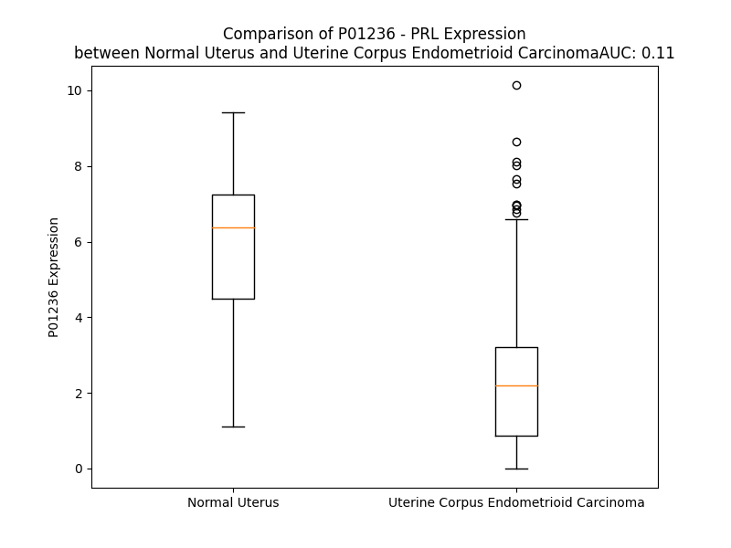

# Detailed Data for P01236

## Introduction to the Detailed Summary

### How to Interpret the Results

- **Summary & Metrics**: This section provides a quick reference to essential protein attributes, including expression changes, family classification, and biomarker applications. Regulation status (upregulated/downregulated) indicates the protein's behavior in a disease context. Some information comes from the original excel file with the proteins selected from literature, while others are derived from the analyses.
- **Expression Comparison**: A visual representation comparing protein expression between normal and disease states. It highlights significant changes in expression levels that might indicate diagnostic or therapeutic relevance. This is data coming from transcriptomics experiments and could not translate similarly to protein levels.
- **Isoform Alignment**: An interactive view of isoform alignments, revealing structural and functional differences between variants of the protein.
- **Interactors & Homologs**: Tables listing known interaction partners and homologous proteins, the more interactors and homologs, the more complex the protein is to design an antibody for.
- **Biological Assemblies**: Information about the structural arrangement of the protein in different assemblies, providing insights into its functional state but also the complexity of the protein to develop antibodies.
- **Combined Per-Residue Information**: A detailed table summarizing residue-level data. This includes predictions for epitope regions, aggregation tendencies, and modifications that might impact the protein's function. Each row corresponds to a residue in the protein, providing insights into specific sites that may be important for research or drug development.
## Summary & Metrics

- **UniProt Accession**: P01236
- **Gene Name**: PRL
- **Protein Name**: prolactin
- **Swiss Prot**: PRL_HUMAN
- **Family**: cytokine
- **Biomarker Application**: diagnosis,efficacy,safety
- **Number of Isoforms**: 0
- **Regulation**: 1
- **(transcriptomics) AUC**: 0.4
- **(transcriptomics) Fold Change**: 1.17
- **(transcriptomics) Regulation**: Downregulated
- **Discotope Epitope Count**: 55
- **Max n_uniprots (Homo)**: 1
- **Max n_uniprots (Hetero)**: 3

## Expression Comparison

## Interactors

| preferredName_A   | preferredName_B   |   score |
|:------------------|:------------------|--------:|
| PRL               | PRLR              |   0.999 |
| PRL               | GH2               |   0.989 |
| PRL               | LEP               |   0.985 |
| PRL               | POMC              |   0.971 |
| PRL               | GHR               |   0.97  |
| PRL               | CSH2              |   0.965 |
| PRL               | CSH1              |   0.965 |
| PRL               | INS               |   0.962 |
| PRL               | TRH               |   0.951 |
| PRL               | JAK2              |   0.951 |
| PRL               | EPO               |   0.949 |
| PRL               | SEC61A1           |   0.944 |
| PRL               | GH1               |   0.944 |
| PRL               | THPO              |   0.934 |
| PRL               | CSF3              |   0.93  |
| PRL               | CNTF              |   0.926 |
| PRL               | POU1F1            |   0.921 |
| PRL               | TSHB              |   0.918 |
| PRL               | EGFR              |   0.912 |
| PRL               | STAT5B            |   0.907 |
| PRL               | STAT5A            |   0.905 |

## Homologs

| uniprot_id   | gene_id   |
|:-------------|:----------|
| B1A4H9       | CSH2      |
| I6L999       | CSHL1     |
| P01242       | GH2       |
| A6NFB4       | CSH1      |
| B1A4H0       | GH1       |

## Biological Assemblies

|   Unnamed: 0 |   assembly |   n_uniprots | composition   | crystal_id   |
|-------------:|-----------:|-------------:|:--------------|:-------------|
|            0 |          1 |            2 | Hetero        | 3n06         |
|            0 |          1 |            3 | Hetero        | 3npz         |
|            0 |          1 |            1 | Homo          | 2q98         |
|            0 |          1 |            2 | Hetero        | 3d48         |
|            0 |          1 |            2 | Hetero        | 3ncb         |
|            0 |          1 |            1 | Homo          | 1rw5         |
|            0 |          1 |            2 | Hetero        | 3n0p         |
|            0 |          1 |            2 | Hetero        | 3mzg         |
|            0 |          1 |            2 | Hetero        | 3ncc         |
|            0 |          1 |            2 | Hetero        | 3ncf         |
|            0 |          1 |            2 | Hetero        | 3nce         |
|            0 |          1 |            3 | Hetero        | 3ew3         |

## Combined Per-Residue Information

|   res | aa   |   epitope_score | epitope   |   relative_surface_accessibility |   modeling_confidence |   Aggregation | modification   | glycosylation                            |
|------:|:-----|----------------:|:----------|---------------------------------:|----------------------:|--------------:|:---------------|:-----------------------------------------|
|     1 | M    |         0.19636 | False     |                          1.29129 |                 40.35 |         0     | N/A            | N/A                                      |
|     2 | N    |         0.22529 | False     |                          0.86553 |                 41.92 |         0     | N/A            | N/A                                      |
|     3 | I    |         0.28899 | False     |                          0.85673 |                 43.16 |         0     | N/A            | N/A                                      |
|     4 | K    |         0.33488 | True      |                          0.9668  |                 45.98 |         0     | N/A            | N/A                                      |
|     5 | G    |         0.29226 | False     |                          0.96898 |                 47.56 |         0     | N/A            | N/A                                      |
|     6 | S    |         0.19733 | False     |                          0.83207 |                 52.89 |         0     | N/A            | N/A                                      |
|     7 | P    |         0.22497 | False     |                          0.75979 |                 50.79 |         0     | N/A            | N/A                                      |
|     8 | W    |         0.24287 | False     |                          1.14924 |                 47.12 |         0     | N/A            | N/A                                      |
|     9 | K    |         0.25024 | False     |                          0.993   |                 45.96 |         0     | N/A            | N/A                                      |
|    10 | G    |         0.37436 | True      |                          0.93493 |                 49.51 |         0.353 | N/A            | N/A                                      |
|    11 | S    |         0.26244 | False     |                          0.75245 |                 43.08 |         4.289 | N/A            | N/A                                      |
|    12 | L    |         0.30947 | False     |                          1.01116 |                 51.46 |        83.397 | N/A            | N/A                                      |
|    13 | L    |         0.2259  | False     |                          0.97657 |                 43.47 |        97.338 | N/A            | N/A                                      |
|    14 | L    |         0.2898  | False     |                          0.88452 |                 56.79 |        98.725 | N/A            | N/A                                      |
|    15 | L    |         0.31861 | True      |                          0.90339 |                 54.49 |        98.951 | N/A            | N/A                                      |
|    16 | L    |         0.20077 | False     |                          0.92427 |                 48.85 |        98.965 | N/A            | N/A                                      |
|    17 | V    |         0.27692 | False     |                          1.02125 |                 57.73 |        95.872 | N/A            | N/A                                      |
|    18 | S    |         0.22909 | False     |                          0.62255 |                 50.84 |        53.044 | N/A            | N/A                                      |
|    19 | N    |         0.29068 | False     |                          0.91125 |                 47.88 |        47.585 | N/A            | N/A                                      |
|    20 | L    |         0.27191 | False     |                          0.96565 |                 46.06 |        47.373 | N/A            | N/A                                      |
|    21 | L    |         0.32568 | True      |                          0.93398 |                 52.17 |        46.205 | N/A            | N/A                                      |
|    22 | L    |         0.23434 | False     |                          1.03915 |                 43.47 |        40.22  | N/A            | N/A                                      |
|    23 | C    |         0.22457 | False     |                          0.79016 |                 46.2  |         7.519 | N/A            | N/A                                      |
|    24 | Q    |         0.21281 | False     |                          0.79337 |                 39.53 |         0.692 | N/A            | N/A                                      |
|    25 | S    |         0.25735 | False     |                          0.8116  |                 42.5  |         0.425 | N/A            | N/A                                      |
|    26 | V    |         0.25695 | False     |                          0.91556 |                 49.71 |         0.394 | N/A            | N/A                                      |
|    27 | A    |         0.2996  | False     |                          0.75967 |                 50.82 |         0.004 | N/A            | N/A                                      |
|    28 | P    |         0.27744 | False     |                          0.89908 |                 49.11 |         0.002 | N/A            | N/A                                      |
|    29 | L    |         0.27314 | False     |                          0.9293  |                 51.16 |         0     | N/A            | N/A                                      |
|    30 | P    |         0.29871 | False     |                          0.71915 |                 50.11 |         0     | N/A            | N/A                                      |
|    31 | I    |         0.30726 | False     |                          1.03122 |                 53.38 |         0     | N/A            | N/A                                      |
|    32 | C    |         0.14583 | False     |                          0.15787 |                 58.92 |         0     | N/A            | N/A                                      |
|    33 | P    |         0.24098 | False     |                          1.0093  |                 56.36 |         0     | N/A            | N/A                                      |
|    34 | G    |         0.30789 | False     |                          0.99434 |                 60.23 |         0     | N/A            | N/A                                      |
|    35 | G    |         0.3187  | True      |                          0.93703 |                 51.02 |         0     | N/A            | N/A                                      |
|    36 | A    |         0.19266 | False     |                          0.57452 |                 53.38 |         0     | N/A            | N/A                                      |
|    37 | A    |         0.25687 | False     |                          1.04155 |                 56.24 |         0     | N/A            | N/A                                      |
|    38 | R    |         0.38742 | True      |                          0.78503 |                 56.02 |         0     | N/A            | N/A                                      |
|    39 | C    |         0.3166  | True      |                          0.41757 |                 61.44 |         0     | N/A            | N/A                                      |
|    40 | Q    |         0.35974 | True      |                          0.78934 |                 71.43 |         0     | N/A            | N/A                                      |
|    41 | V    |         0.24325 | False     |                          0.41539 |                 84.32 |         0.192 | N/A            | N/A                                      |
|    42 | T    |         0.30708 | False     |                          0.50864 |                 92.12 |         0.192 | N/A            | N/A                                      |
|    43 | L    |         0.28491 | False     |                          0.26668 |                 94.09 |         0.192 | N/A            | N/A                                      |
|    44 | R    |         0.46247 | True      |                          0.46659 |                 95.18 |         0.192 | N/A            | N/A                                      |
|    45 | D    |         0.27245 | False     |                          0.33825 |                 95.61 |         0.192 | N/A            | N/A                                      |
|    46 | L    |         0.15124 | False     |                          0.06867 |                 96.95 |         4.081 | N/A            | N/A                                      |
|    47 | F    |         0.00913 | False     |                          0.00069 |                 97.7  |         4.081 | N/A            | N/A                                      |
|    48 | D    |         0.34178 | True      |                          0.32574 |                 97.76 |         3.889 | N/A            | N/A                                      |
|    49 | R    |         0.38916 | True      |                          0.58571 |                 97.95 |         3.889 | N/A            | N/A                                      |
|    50 | A    |         0.01875 | False     |                          0.02351 |                 98.51 |        22.034 | N/A            | N/A                                      |
|    51 | V    |         0.07763 | False     |                          0.15138 |                 98.63 |        23.338 | N/A            | N/A                                      |
|    52 | V    |         0.31572 | True      |                          0.72271 |                 98.59 |        23.618 | N/A            | N/A                                      |
|    53 | L    |         0.12708 | False     |                          0.24071 |                 98.67 |        23.109 | N/A            | N/A                                      |
|    54 | S    |         0.02479 | False     |                          0.01063 |                 98.81 |        20.328 | Phosphoserine  | N/A                                      |
|    55 | H    |         0.17038 | False     |                          0.44271 |                 98.81 |        10.017 | N/A            | N/A                                      |
|    56 | Y    |         0.2689  | False     |                          0.41746 |                 98.81 |        10.017 | N/A            | N/A                                      |
|    57 | I    |         0.11302 | False     |                          0.0504  |                 98.87 |         9.22  | N/A            | N/A                                      |
|    58 | H    |         0.20476 | False     |                          0.16671 |                 98.84 |         0     | N/A            | N/A                                      |
|    59 | N    |         0.28785 | False     |                          0.36667 |                 98.73 |         0     | N/A            | N-linked (GlcNAc...) asparagine; partial |
|    60 | L    |         0.20103 | False     |                          0.11623 |                 98.77 |         0     | N/A            | N/A                                      |
|    61 | S    |         0.01081 | False     |                          0.00488 |                 98.75 |         0     | N/A            | N/A                                      |
|    62 | S    |         0.15674 | False     |                          0.26185 |                 98.58 |         0     | Phosphoserine  | N/A                                      |
|    63 | E    |         0.2587  | False     |                          0.45866 |                 98.23 |         0     | N/A            | N/A                                      |
|    64 | M    |         0.0062  | False     |                          0.00144 |                 97.75 |         0     | N/A            | N/A                                      |
|    65 | F    |         0.13635 | False     |                          0.06561 |                 95.96 |         0     | N/A            | N/A                                      |
|    66 | S    |         0.37912 | True      |                          0.49798 |                 94.69 |         0     | N/A            | N/A                                      |
|    67 | E    |         0.32433 | True      |                          0.31067 |                 94.38 |         0     | N/A            | N/A                                      |
|    68 | F    |         0.0792  | False     |                          0.04777 |                 93.75 |         0     | N/A            | N/A                                      |
|    69 | D    |         0.29626 | False     |                          0.31023 |                 92.3  |         0     | N/A            | N/A                                      |
|    70 | K    |         0.37227 | True      |                          0.72844 |                 91.3  |         0     | N/A            | N/A                                      |
|    71 | R    |         0.56753 | True      |                          0.60494 |                 90.16 |         0     | N/A            | N/A                                      |
|    72 | Y    |         0.35656 | True      |                          0.25316 |                 89.67 |         0     | N/A            | N/A                                      |
|    73 | T    |         0.39271 | True      |                          0.08226 |                 82.63 |         0     | N/A            | N/A                                      |
|    74 | H    |         0.33568 | True      |                          0.78011 |                 74.11 |         0     | N/A            | N/A                                      |
|    75 | G    |         0.42542 | True      |                          1.02458 |                 69.29 |         0     | N/A            | N/A                                      |
|    76 | R    |         0.62143 | True      |                          0.47335 |                 79.31 |         0     | N/A            | N/A                                      |
|    77 | G    |         0.42118 | True      |                          0.46036 |                 82.69 |         0     | N/A            | N/A                                      |
|    78 | F    |         0.17385 | False     |                          0.018   |                 85.45 |         0     | N/A            | N/A                                      |
|    79 | I    |         0.35888 | True      |                          0.6867  |                 81.47 |         0     | N/A            | N/A                                      |
|    80 | T    |         0.3374  | True      |                          0.6631  |                 81.59 |         0     | N/A            | N/A                                      |
|    81 | K    |         0.51748 | True      |                          0.53995 |                 80.36 |         0     | N/A            | N/A                                      |
|    82 | A    |         0.08964 | False     |                          0.03111 |                 80.55 |         0     | N/A            | N/A                                      |
|    83 | I    |         0.32246 | True      |                          0.72178 |                 78.49 |         0     | N/A            | N/A                                      |
|    84 | N    |         0.35073 | True      |                          0.84266 |                 80.47 |         0     | N/A            | N/A                                      |
|    85 | S    |         0.28575 | False     |                          0.36562 |                 90.57 |         0     | N/A            | N/A                                      |
|    86 | C    |         0.151   | False     |                          0.07128 |                 96.6  |         0     | N/A            | N/A                                      |
|    87 | H    |         0.22434 | False     |                          0.18578 |                 96.71 |         0     | N/A            | N/A                                      |
|    88 | T    |         0.04386 | False     |                          0.0291  |                 96.3  |         0     | N/A            | N/A                                      |
|    89 | S    |         0.22558 | False     |                          0.44248 |                 93.86 |         0     | N/A            | N/A                                      |
|    90 | S    |         0.28513 | False     |                          0.753   |                 92    |         0     | N/A            | N/A                                      |
|    91 | L    |         0.24974 | False     |                          0.22149 |                 93.26 |         0     | N/A            | N/A                                      |
|    92 | A    |         0.20453 | False     |                          0.82336 |                 92.25 |         0     | N/A            | N/A                                      |
|    93 | T    |         0.16682 | False     |                          0.16984 |                 92.32 |         0     | N/A            | N/A                                      |
|    94 | P    |         0.06389 | False     |                          0.07254 |                 93.58 |         0     | N/A            | N/A                                      |
|    95 | E    |         0.42925 | True      |                          0.81647 |                 90.07 |         0     | N/A            | N/A                                      |
|    96 | D    |         0.3353  | True      |                          0.39458 |                 89    |         0     | N/A            | N/A                                      |
|    97 | K    |         0.28467 | False     |                          0.62049 |                 84.66 |         0     | N/A            | N/A                                      |
|    98 | E    |         0.2476  | False     |                          0.56759 |                 89.5  |         0     | N/A            | N/A                                      |
|    99 | Q    |         0.23763 | False     |                          0.41464 |                 93.12 |         0     | N/A            | N/A                                      |
|   100 | A    |         0.03377 | False     |                          0.03805 |                 90.77 |         0     | N/A            | N/A                                      |
|   101 | Q    |         0.33855 | True      |                          0.46973 |                 86.53 |         0     | N/A            | N/A                                      |
|   102 | Q    |         0.23479 | False     |                          0.78625 |                 91.32 |         0     | N/A            | N/A                                      |
|   103 | M    |         0.14227 | False     |                          0.23464 |                 93.42 |         0     | N/A            | N/A                                      |
|   104 | N    |         0.18014 | False     |                          0.45945 |                 92.55 |         0     | N/A            | N/A                                      |
|   105 | Q    |         0.22633 | False     |                          0.22888 |                 92.47 |         0     | N/A            | N/A                                      |
|   106 | K    |         0.12156 | False     |                          0.45214 |                 92.31 |         0.046 | N/A            | N/A                                      |
|   107 | D    |         0.16258 | False     |                          0.45156 |                 92.39 |         0.092 | N/A            | N/A                                      |
|   108 | F    |         0.01931 | False     |                          0.01147 |                 94.8  |        81.355 | N/A            | N/A                                      |
|   109 | L    |         0.02044 | False     |                          0.00495 |                 94.83 |        94.781 | N/A            | N/A                                      |
|   110 | S    |         0.08345 | False     |                          0.20991 |                 93.67 |        95.117 | N/A            | N/A                                      |
|   111 | L    |         0.03638 | False     |                          0.09422 |                 95.01 |        97.721 | N/A            | N/A                                      |
|   112 | I    |         0.00241 | False     |                          0       |                 96.52 |        98.124 | N/A            | N/A                                      |
|   113 | V    |         0.04692 | False     |                          0.01999 |                 96.29 |        96.556 | N/A            | N/A                                      |
|   114 | S    |         0.04402 | False     |                          0.05335 |                 96.17 |        77.882 | N/A            | N/A                                      |
|   115 | I    |         0.00751 | False     |                          0.0056  |                 97.49 |        75.553 | N/A            | N/A                                      |
|   116 | L    |         0.03071 | False     |                          0.01978 |                 97.97 |        63.93  | N/A            | N/A                                      |
|   117 | R    |         0.22559 | False     |                          0.1582  |                 97.1  |         0.046 | N/A            | N/A                                      |
|   118 | S    |         0.02916 | False     |                          0.02817 |                 97.31 |         0.036 | Phosphoserine  | N/A                                      |
|   119 | W    |         0.03515 | False     |                          0.02616 |                 98.55 |         0.036 | N/A            | N/A                                      |
|   120 | N    |         0.14791 | False     |                          0.34825 |                 97.26 |         0     | N/A            | N/A                                      |
|   121 | E    |         0.23949 | False     |                          0.45387 |                 97.38 |         0     | N/A            | N/A                                      |
|   122 | P    |         0.01    | False     |                          0.00257 |                 98.35 |         0     | N/A            | N/A                                      |
|   123 | L    |         0.05432 | False     |                          0.01484 |                 98.65 |         0.204 | N/A            | N/A                                      |
|   124 | Y    |         0.44589 | True      |                          0.54564 |                 98.2  |         0.204 | N/A            | N/A                                      |
|   125 | H    |         0.40248 | True      |                          0.17457 |                 97.96 |         0.204 | N/A            | N/A                                      |
|   126 | L    |         0.0152  | False     |                          0.00824 |                 97.62 |         0.204 | N/A            | N/A                                      |
|   127 | V    |         0.08056 | False     |                          0.04951 |                 97.68 |         0.204 | N/A            | N/A                                      |
|   128 | T    |         0.46528 | True      |                          0.43622 |                 96.41 |         0     | N/A            | N/A                                      |
|   129 | E    |         0.31995 | True      |                          0.19732 |                 95.02 |         0     | N/A            | N/A                                      |
|   130 | V    |         0.06234 | False     |                          0.03332 |                 92.67 |         0     | N/A            | N/A                                      |
|   131 | R    |         0.48164 | True      |                          0.59915 |                 92.22 |         0     | N/A            | N/A                                      |
|   132 | G    |         0.42744 | True      |                          0.78977 |                 87.18 |         0     | N/A            | N/A                                      |
|   133 | M    |         0.26948 | False     |                          0.31115 |                 86.18 |         0     | N/A            | N/A                                      |
|   134 | Q    |         0.29973 | False     |                          0.96946 |                 75.65 |         0     | N/A            | N/A                                      |
|   135 | E    |         0.5121  | True      |                          0.7782  |                 80.26 |         0     | N/A            | N/A                                      |
|   136 | A    |         0.26649 | False     |                          0.28613 |                 79.1  |         0     | N/A            | N/A                                      |
|   137 | P    |         0.25917 | False     |                          0.14016 |                 90.2  |         0     | N/A            | N/A                                      |
|   138 | E    |         0.4819  | True      |                          0.64524 |                 92.46 |         0     | N/A            | N/A                                      |
|   139 | A    |         0.2282  | False     |                          0.47578 |                 94.1  |         0     | N/A            | N/A                                      |
|   140 | I    |         0.08506 | False     |                          0.032   |                 95.41 |         0     | N/A            | N/A                                      |
|   141 | L    |         0.19937 | False     |                          0.14344 |                 96.69 |         0     | N/A            | N/A                                      |
|   142 | S    |         0.28038 | False     |                          0.4258  |                 97.52 |         0     | N/A            | N/A                                      |
|   143 | K    |         0.14792 | False     |                          0.12787 |                 98.41 |         0     | N/A            | N/A                                      |
|   144 | A    |         0.00569 | False     |                          0       |                 98.36 |         0     | N/A            | N/A                                      |
|   145 | V    |         0.24513 | False     |                          0.26848 |                 98.4  |         0     | N/A            | N/A                                      |
|   146 | E    |         0.19582 | False     |                          0.26683 |                 98.62 |         0     | N/A            | N/A                                      |
|   147 | I    |         0.00762 | False     |                          0       |                 98.81 |         0     | N/A            | N/A                                      |
|   148 | E    |         0.11119 | False     |                          0.10459 |                 98.76 |         0     | N/A            | N/A                                      |
|   149 | E    |         0.34797 | True      |                          0.40166 |                 98.62 |         0     | N/A            | N/A                                      |
|   150 | Q    |         0.12412 | False     |                          0.0693  |                 98.72 |         0     | N/A            | N/A                                      |
|   151 | T    |         0.08357 | False     |                          0.03637 |                 98.75 |         0     | N/A            | N/A                                      |
|   152 | K    |         0.26878 | False     |                          0.46282 |                 98.46 |         0     | N/A            | N/A                                      |
|   153 | R    |         0.26655 | False     |                          0.52349 |                 98.44 |         0     | N/A            | N/A                                      |
|   154 | L    |         0.01481 | False     |                          0.01072 |                 98.65 |         0     | N/A            | N/A                                      |
|   155 | L    |         0.15919 | False     |                          0.10634 |                 97.93 |         0     | N/A            | N/A                                      |
|   156 | E    |         0.37227 | True      |                          0.5406  |                 96.65 |         0     | N/A            | N/A                                      |
|   157 | G    |         0.13627 | False     |                          0.19844 |                 96.82 |         0     | N/A            | N/A                                      |
|   158 | M    |         0.00592 | False     |                          0       |                 96.52 |         0     | N/A            | N/A                                      |
|   159 | E    |         0.15554 | False     |                          0.33475 |                 94.16 |         0     | N/A            | N/A                                      |
|   160 | L    |         0.23755 | False     |                          0.60343 |                 94.3  |         0.911 | N/A            | N/A                                      |
|   161 | I    |         0.00855 | False     |                          0       |                 95.32 |         1.08  | N/A            | N/A                                      |
|   162 | V    |         0.11196 | False     |                          0.14281 |                 93.93 |         1.08  | N/A            | N/A                                      |
|   163 | S    |         0.28244 | False     |                          0.4661  |                 91.7  |         1.08  | Phosphoserine  | N/A                                      |
|   164 | Q    |         0.4215  | True      |                          0.46806 |                 92.07 |         1.08  | N/A            | N/A                                      |
|   165 | V    |         0.1905  | False     |                          0.20901 |                 91.67 |         1.08  | N/A            | N/A                                      |
|   166 | H    |         0.25701 | False     |                          0.23843 |                 90.92 |         0     | N/A            | N/A                                      |
|   167 | P    |         0.3036  | False     |                          0.70098 |                 87.64 |         0     | N/A            | N/A                                      |
|   168 | E    |         0.36388 | True      |                          0.78427 |                 85.01 |         0     | N/A            | N/A                                      |
|   169 | T    |         0.16875 | False     |                          0.24372 |                 78.76 |         0     | N/A            | N/A                                      |
|   170 | K    |         0.29129 | False     |                          0.81123 |                 67.42 |         0     | N/A            | N/A                                      |
|   171 | E    |         0.16721 | False     |                          0.76655 |                 64.47 |         0     | N/A            | N/A                                      |
|   172 | N    |         0.26875 | False     |                          0.81584 |                 62.09 |         0     | N/A            | N/A                                      |
|   173 | E    |         0.2514  | False     |                          0.16582 |                 67.87 |         0     | N/A            | N/A                                      |
|   174 | I    |         0.24669 | False     |                          0.96064 |                 85.82 |         0     | N/A            | N/A                                      |
|   175 | Y    |         0.26996 | False     |                          0.43624 |                 93.05 |         0     | N/A            | N/A                                      |
|   176 | P    |         0.16966 | False     |                          0.15294 |                 94.45 |         0     | N/A            | N/A                                      |
|   177 | V    |         0.27551 | False     |                          0.79552 |                 95.13 |         0     | N/A            | N/A                                      |
|   178 | W    |         0.13435 | False     |                          0.10386 |                 96.88 |         0     | N/A            | N/A                                      |
|   179 | S    |         0.44762 | True      |                          0.75224 |                 94.12 |         0     | N/A            | N/A                                      |
|   180 | G    |         0.32236 | True      |                          0.25314 |                 95.17 |         0     | N/A            | N/A                                      |
|   181 | L    |         0.37624 | True      |                          0.28193 |                 96.96 |         0     | N/A            | N/A                                      |
|   182 | P    |         0.39316 | True      |                          0.70932 |                 97.1  |         0     | N/A            | N/A                                      |
|   183 | S    |         0.26717 | False     |                          0.35625 |                 95.25 |         0     | N/A            | N/A                                      |
|   184 | L    |         0.05695 | False     |                          0.02276 |                 95.57 |         0     | N/A            | N/A                                      |
|   185 | Q    |         0.44051 | True      |                          0.51695 |                 95.24 |         0     | N/A            | N/A                                      |
|   186 | M    |         0.27033 | False     |                          0.42877 |                 94.23 |         0     | N/A            | N/A                                      |
|   187 | A    |         0.3762  | True      |                          1.02268 |                 93.83 |         0     | N/A            | N/A                                      |
|   188 | D    |         0.3004  | False     |                          0.45103 |                 93.42 |         0     | N/A            | N/A                                      |
|   189 | E    |         0.3695  | True      |                          0.49615 |                 90.52 |         0     | N/A            | N/A                                      |
|   190 | E    |         0.45131 | True      |                          0.43507 |                 90.89 |         0     | N/A            | N/A                                      |
|   191 | S    |         0.2154  | False     |                          0.29375 |                 92.37 |         0     | N/A            | N/A                                      |
|   192 | R    |         0.28292 | False     |                          0.30212 |                 92.76 |         0     | N/A            | N/A                                      |
|   193 | L    |         0.29072 | False     |                          0.10469 |                 92.59 |         0.343 | N/A            | N/A                                      |
|   194 | S    |         0.17697 | False     |                          0.10939 |                 92.99 |         0.343 | Phosphoserine  | N/A                                      |
|   195 | A    |         0.11076 | False     |                          0.17074 |                 94.62 |         1.111 | N/A            | N/A                                      |
|   196 | Y    |         0.05026 | False     |                          0.03361 |                 94.79 |         1.872 | N/A            | N/A                                      |
|   197 | Y    |         0.14655 | False     |                          0.04773 |                 94.87 |         1.872 | N/A            | N/A                                      |
|   198 | N    |         0.19025 | False     |                          0.20937 |                 95.76 |         1.726 | N/A            | N/A                                      |
|   199 | L    |         0.05451 | False     |                          0.05182 |                 97.48 |         1.726 | N/A            | N/A                                      |
|   200 | L    |         0.034   | False     |                          0.01151 |                 96.8  |         1.599 | N/A            | N/A                                      |
|   201 | H    |         0.3429  | True      |                          0.22661 |                 95.99 |         0     | N/A            | N/A                                      |
|   202 | C    |         0.02315 | False     |                          0.02237 |                 97.97 |         0     | N/A            | N/A                                      |
|   203 | L    |         0.04901 | False     |                          0.03627 |                 98.58 |         0     | N/A            | N/A                                      |
|   204 | R    |         0.23897 | False     |                          0.32821 |                 98.14 |         0     | N/A            | N/A                                      |
|   205 | R    |         0.28228 | False     |                          0.30466 |                 97.23 |         0     | N/A            | N/A                                      |
|   206 | D    |         0.03954 | False     |                          0.0108  |                 98.21 |         0     | N/A            | N/A                                      |
|   207 | S    |         0.09694 | False     |                          0.04011 |                 98.68 |         0     | N/A            | N/A                                      |
|   208 | H    |         0.41016 | True      |                          0.47074 |                 98.21 |         0     | N/A            | N/A                                      |
|   209 | K    |         0.153   | False     |                          0.21792 |                 97.07 |         0     | N/A            | N/A                                      |
|   210 | I    |         0.05964 | False     |                          0.0488  |                 98.11 |         0     | N/A            | N/A                                      |
|   211 | D    |         0.02822 | False     |                          0.01955 |                 98.51 |         0     | N/A            | N/A                                      |
|   212 | N    |         0.39674 | True      |                          0.34333 |                 97.01 |         0     | N/A            | N/A                                      |
|   213 | Y    |         0.06609 | False     |                          0.0517  |                 97.03 |         0     | N/A            | N/A                                      |
|   214 | L    |         0.005   | False     |                          0       |                 97.56 |         0     | N/A            | N/A                                      |
|   215 | K    |         0.27703 | False     |                          0.41078 |                 97.09 |         0     | N/A            | N/A                                      |
|   216 | L    |         0.23032 | False     |                          0.3688  |                 95.59 |         0     | N/A            | N/A                                      |
|   217 | L    |         0.00847 | False     |                          0.00165 |                 95.45 |         0     | N/A            | N/A                                      |
|   218 | K    |         0.16822 | False     |                          0.24659 |                 96.42 |         0     | N/A            | N/A                                      |
|   219 | C    |         0.14983 | False     |                          0.14745 |                 95.82 |         0     | N/A            | N/A                                      |
|   220 | R    |         0.29915 | False     |                          0.2716  |                 94.43 |         0     | N/A            | N/A                                      |
|   221 | I    |         0.30578 | False     |                          0.23283 |                 93.63 |         0     | N/A            | N/A                                      |
|   222 | I    |         0.30168 | False     |                          0.21118 |                 95.51 |         0     | N/A            | N/A                                      |
|   223 | H    |         0.33609 | True      |                          0.34045 |                 94.11 |         0     | N/A            | N/A                                      |
|   224 | N    |         0.29497 | False     |                          0.74941 |                 92.41 |         0     | N/A            | N/A                                      |
|   225 | N    |         0.33437 | True      |                          0.55285 |                 90.86 |         0     | N/A            | N/A                                      |
|   226 | N    |         0.23299 | False     |                          0.71664 |                 93.01 |         0     | N/A            | N/A                                      |
|   227 | C    |         0.15562 | False     |                          0.95231 |                 89.17 |         0     | N/A            | N/A                                      |

