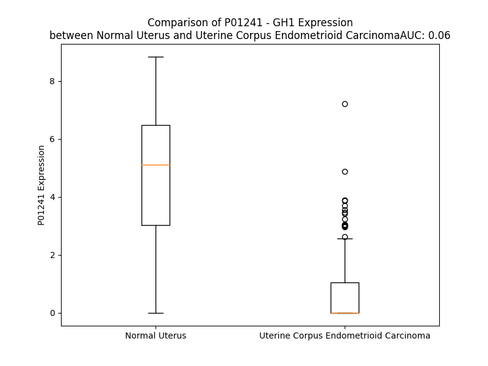

# Detailed Data for P01241

## Introduction to the Detailed Summary

### How to Interpret the Results

- **Summary & Metrics**: This section provides a quick reference to essential protein attributes, including expression changes, family classification, and biomarker applications. Regulation status (upregulated/downregulated) indicates the protein's behavior in a disease context. Some information comes from the original excel file with the proteins selected from literature, while others are derived from the analyses.
- **Expression Comparison**: A visual representation comparing protein expression between normal and disease states. It highlights significant changes in expression levels that might indicate diagnostic or therapeutic relevance. This is data coming from transcriptomics experiments and could not translate similarly to protein levels.
- **Isoform Alignment**: An interactive view of isoform alignments, revealing structural and functional differences between variants of the protein.
- **Interactors & Homologs**: Tables listing known interaction partners and homologous proteins, the more interactors and homologs, the more complex the protein is to design an antibody for.
- **Biological Assemblies**: Information about the structural arrangement of the protein in different assemblies, providing insights into its functional state but also the complexity of the protein to develop antibodies.
- **Combined Per-Residue Information**: A detailed table summarizing residue-level data. This includes predictions for epitope regions, aggregation tendencies, and modifications that might impact the protein's function. Each row corresponds to a residue in the protein, providing insights into specific sites that may be important for research or drug development.
## Summary & Metrics

- **UniProt Accession**: P01241
- **Gene Name**: GH
- **Protein Name**: Somatotropin / Growth hormone
- **Swiss Prot**: SOMA_HUMAN
- **Family**: growth factor
- **Biomarker Application**: efficacy
- **Number of Isoforms**: 5
- **Regulation**: 1
- **(transcriptomics) AUC**: 0.1
- **(transcriptomics) Fold Change**: 3.77
- **(transcriptomics) Regulation**: Downregulated
- **Discotope Epitope Count**: 48
- **Max n_uniprots (Homo)**: 2
- **Max n_uniprots (Hetero)**: 3

## Expression Comparison

## Isoform Alignment

<pre style='font-size:14px; font-family:monospace;'>P01241-1 MATGSRTSLLLAFGLLCLPWLQEGSAFPTIPLSRLFDNAMLRAHRLHQLAFDTYQEFEEAYIPKEQKYSFLQNPQTSLCFSESIPTPSNREETQQKSNLELLRISLLLIQSWLEPVQFLRSVFANSLVYGASDSNVYDLLKDLEEGIQTLMGRLEDGSPRTGQIFKQTYSKFDTNSHNDDALLKNYGLLYCFRKDMDKVETFLRIVQCRSVEGSCGF
P01241-2 MATGSRTSLLLAFGLLCLPWLQEGSAFPTIPLSRLFDNAMLRAHRLHQLAFDTYQEF---------------NPQTSLCFSESIPTPSNREETQQKSNLELLRISLLLIQSWLEPVQFLRSVFANSLVYGASDSNVYDLLKDLEEGIQTLMGRLEDGSPRTGQIFKQTYSKFDTNSHNDDALLKNYGLLYCFRKDMDKVETFLRIVQCRSVEGSCGF
P01241-3 MATGSRTSLLLAFGLLCLPWLQEGSAFPTIPLSRLFDNAMLRAHRLHQLAFDTYQEFEEAYIPKEQKYSFLQNPQTSLCFSESIPTPSNREETQQKSNLELLRISLLLI--------------------------------------QTLMGRLEDGSPRTGQIFKQTYSKFDTNSHNDDALLKNYGLLYCFRKDMDKVETFLRIVQCRSVEGSCGF
P01241-4 MATGSRTSLLLAFGLLCLPWLQEGSAFPTIPLSRLFDNAMLRAHRLHQLAFDTYQEFEEAYIPKEQKYSFLQNPQTSLCFSESIPTPSNREETQQKSNLELLRISLLLIQSWLEPVQ----------------------------------------------IFKQTYSKFDTNSHNDDALLKNYGLLYCFRKDMDKVETFLRIVQCRSVEGSCGF
P01241-5 MATGSRTSLLLAFGLLCLPWLQEGSAFPTIPLSRLFDNAMLRAHRLHQLAFDTYQEF----------------------------------------NLELLRISLLLIQSWLEPVQFLRSVFANSLVYGASDSNVYDLLKDLEEGIQTLMGRLEDGSPRTGQIFKQTYSKFDTNSHNDDALLKNYGLLYCFRKDMDKVETFLRIVQCRSVEGSCGF
</pre>

## Interactors

| preferredName_A   | preferredName_B   |   score |
|:------------------|:------------------|--------:|
| GH1               | GHR               |   0.999 |
| GH1               | PRLR              |   0.993 |
| GH1               | CSH1              |   0.99  |
| GH1               | CSH2              |   0.989 |
| GH1               | GHRH              |   0.964 |
| GH1               | EPO               |   0.959 |
| GH1               | GHRL              |   0.956 |
| GH1               | LEP               |   0.949 |
| GH1               | PRL               |   0.944 |
| GH1               | ALB               |   0.936 |
| GH1               | GH2               |   0.925 |
| GH1               | GHRHR             |   0.918 |
| GH1               | CSF3              |   0.915 |
| GH1               | IGF1              |   0.91  |
| GH1               | THPO              |   0.91  |
| GH1               | CNTF              |   0.907 |

## Homologs

| uniprot_id   | gene_id   |
|:-------------|:----------|
| P01242       | GH2       |
| B1A4H9       | CSH2      |
| I6L999       | CSHL1     |
| A6NFB4       | CSH1      |
| Q5THQ0       | PRL       |

## Biological Assemblies

|   Unnamed: 0 |   assembly |   n_uniprots | composition   | crystal_id   |
|-------------:|-----------:|-------------:|:--------------|:-------------|
|            0 |          1 |            3 | Hetero        | 3hhr         |
|            0 |          1 |            2 | Hetero        | 1hwh         |
|            0 |          1 |            2 | Hetero        | 1axi         |
|            0 |          1 |            2 | Hetero        | 1bp3         |
|            0 |          1 |            1 | Homo          | 1huw         |
|            0 |          1 |            3 | Hetero        | 1hwg         |
|            0 |          1 |            3 | Hetero        | 6qio         |
|            0 |          1 |            2 | Hetero        | 1a22         |
|            1 |          2 |            2 | Hetero        | 1a22         |
|            0 |          1 |            1 | Homo          | 1hgu         |
|            0 |          1 |            2 | Homo          | 1kf9         |
|            1 |          2 |            2 | Homo          | 1kf9         |

## Combined Per-Residue Information

|   res | aa   |   epitope_score | epitope   |   relative_surface_accessibility |   modeling_confidence |   Aggregation | modification                            |
|------:|:-----|----------------:|:----------|---------------------------------:|----------------------:|--------------:|:----------------------------------------|
|     1 | M    |         0.14122 | False     |                          1.33517 |                 44.72 |         0     | N/A                                     |
|     2 | A    |         0.16434 | False     |                          0.86364 |                 54.72 |         0     | N/A                                     |
|     3 | T    |         0.24608 | False     |                          0.89909 |                 57.09 |         0     | N/A                                     |
|     4 | G    |         0.21176 | False     |                          0.6655  |                 58.63 |         0     | N/A                                     |
|     5 | S    |         0.10886 | False     |                          0.55327 |                 70.29 |         0     | N/A                                     |
|     6 | R    |         0.17309 | False     |                          0.78721 |                 64.62 |         0     | N/A                                     |
|     7 | T    |         0.10208 | False     |                          0.56118 |                 68.5  |         2.177 | N/A                                     |
|     8 | S    |         0.09774 | False     |                          0.53139 |                 72.33 |         5.77  | N/A                                     |
|     9 | L    |         0.13973 | False     |                          0.67418 |                 74.8  |        73.952 | N/A                                     |
|    10 | L    |         0.16992 | False     |                          0.81237 |                 74.97 |        83.726 | N/A                                     |
|    11 | L    |         0.1981  | False     |                          0.74414 |                 73.98 |        85.451 | N/A                                     |
|    12 | A    |         0.10735 | False     |                          0.41088 |                 72.22 |        85.687 | N/A                                     |
|    13 | F    |         0.15282 | False     |                          0.72088 |                 70.42 |        85.656 | N/A                                     |
|    14 | G    |         0.16122 | False     |                          0.3502  |                 69.44 |        69.791 | N/A                                     |
|    15 | L    |         0.2144  | False     |                          0.75959 |                 71.65 |        68.119 | N/A                                     |
|    16 | L    |         0.12689 | False     |                          0.76471 |                 69.18 |        59.29  | N/A                                     |
|    17 | C    |         0.16964 | False     |                          0.41343 |                 67.07 |        10.838 | N/A                                     |
|    18 | L    |         0.24642 | False     |                          0.58214 |                 62.78 |         0.706 | N/A                                     |
|    19 | P    |         0.18537 | False     |                          0.56525 |                 62.28 |         0.36  | N/A                                     |
|    20 | W    |         0.18053 | False     |                          0.92816 |                 59.4  |         0     | N/A                                     |
|    21 | L    |         0.06361 | False     |                          0.79878 |                 58.65 |         0     | N/A                                     |
|    22 | Q    |         0.11047 | False     |                          0.76898 |                 57.32 |         0     | N/A                                     |
|    23 | E    |         0.14124 | False     |                          0.80649 |                 52.57 |         0     | N/A                                     |
|    24 | G    |         0.19091 | False     |                          0.41003 |                 47.28 |         0     | N/A                                     |
|    25 | S    |         0.18703 | False     |                          0.72526 |                 52.66 |         0     | N/A                                     |
|    26 | A    |         0.19758 | False     |                          0.89914 |                 57.4  |         0     | N/A                                     |
|    27 | F    |         0.16872 | False     |                          0.85681 |                 57.43 |         0     | N/A                                     |
|    28 | P    |         0.22473 | False     |                          0.90275 |                 65.56 |         0     | N/A                                     |
|    29 | T    |         0.21424 | False     |                          0.69862 |                 80.97 |         0     | N/A                                     |
|    30 | I    |         0.17315 | False     |                          0.55475 |                 88.09 |         0     | N/A                                     |
|    31 | P    |         0.27305 | False     |                          0.52885 |                 92.19 |         0     | N/A                                     |
|    32 | L    |         0.2324  | False     |                          0.27519 |                 92.97 |         0     | N/A                                     |
|    33 | S    |         0.18445 | False     |                          0.31847 |                 94.68 |         0     | N/A                                     |
|    34 | R    |         0.37555 | True      |                          0.63841 |                 95.08 |         0     | N/A                                     |
|    35 | L    |         0.18217 | False     |                          0.12817 |                 95.73 |         0     | N/A                                     |
|    36 | F    |         0.01236 | False     |                          0       |                 97.02 |         0     | N/A                                     |
|    37 | D    |         0.31124 | True      |                          0.48428 |                 96.01 |         0     | N/A                                     |
|    38 | N    |         0.16015 | False     |                          0.57003 |                 96.44 |         0     | N/A                                     |
|    39 | A    |         0.0269  | False     |                          0.02606 |                 97.78 |         0     | N/A                                     |
|    40 | M    |         0.12301 | False     |                          0.14557 |                 97.16 |         0     | N/A                                     |
|    41 | L    |         0.22617 | False     |                          0.67995 |                 96.26 |         0     | N/A                                     |
|    42 | R    |         0.20291 | False     |                          0.31104 |                 96.81 |         0     | N/A                                     |
|    43 | A    |         0.01775 | False     |                          0.00921 |                 97.75 |         0     | N/A                                     |
|    44 | H    |         0.20249 | False     |                          0.43003 |                 96.34 |         0     | N/A                                     |
|    45 | R    |         0.31935 | True      |                          0.38813 |                 95.56 |         0     | N/A                                     |
|    46 | L    |         0.01122 | False     |                          0.0033  |                 96.15 |         0     | N/A                                     |
|    47 | H    |         0.19387 | False     |                          0.21825 |                 96.08 |         0     | N/A                                     |
|    48 | Q    |         0.25458 | False     |                          0.37578 |                 95.21 |         0     | N/A                                     |
|    49 | L    |         0.058   | False     |                          0.02768 |                 93.64 |         0     | N/A                                     |
|    50 | A    |         0.01164 | False     |                          0.00377 |                 94.52 |         0     | N/A                                     |
|    51 | F    |         0.22358 | False     |                          0.39693 |                 94.23 |         0     | N/A                                     |
|    52 | D    |         0.23177 | False     |                          0.4171  |                 91.88 |         0     | N/A                                     |
|    53 | T    |         0.03857 | False     |                          0.03331 |                 89.89 |         0     | N/A                                     |
|    54 | Y    |         0.12725 | False     |                          0.04951 |                 90.9  |         0     | N/A                                     |
|    55 | Q    |         0.38061 | True      |                          0.38935 |                 89.95 |         0     | N/A                                     |
|    56 | E    |         0.24193 | False     |                          0.24412 |                 87.97 |         0     | N/A                                     |
|    57 | F    |         0.01121 | False     |                          0.00064 |                 87.9  |         0     | N/A                                     |
|    58 | E    |         0.13738 | False     |                          0.10876 |                 87.31 |         0     | N/A                                     |
|    59 | E    |         0.32124 | True      |                          0.6651  |                 87.28 |         0     | N/A                                     |
|    60 | A    |         0.32073 | True      |                          0.49668 |                 85.53 |         0     | N/A                                     |
|    61 | Y    |         0.47134 | True      |                          0.24064 |                 84.92 |         0     | N/A                                     |
|    62 | I    |         0.25681 | False     |                          0.07456 |                 84.13 |         0     | N/A                                     |
|    63 | P    |         0.32221 | True      |                          0.4259  |                 83.3  |         0     | N/A                                     |
|    64 | K    |         0.31253 | True      |                          0.87966 |                 81.87 |         0     | N/A                                     |
|    65 | E    |         0.37385 | True      |                          0.7575  |                 80.43 |         0     | N/A                                     |
|    66 | Q    |         0.56186 | True      |                          0.43616 |                 77.05 |         0     | N/A                                     |
|    67 | K    |         0.4136  | True      |                          0.3715  |                 75.2  |         0     | N/A                                     |
|    68 | Y    |         0.36479 | True      |                          0.77367 |                 74.01 |         0     | N/A                                     |
|    69 | S    |         0.42658 | True      |                          0.56617 |                 77.48 |         0     | N/A                                     |
|    70 | F    |         0.38805 | True      |                          0.11006 |                 73.55 |         0     | N/A                                     |
|    71 | L    |         0.3356  | True      |                          0.34788 |                 68.1  |         0     | N/A                                     |
|    72 | Q    |         0.48251 | True      |                          0.76325 |                 72.68 |         0     | N/A                                     |
|    73 | N    |         0.57639 | True      |                          0.27282 |                 71.71 |         0     | N/A                                     |
|    74 | P    |         0.35761 | True      |                          0.71882 |                 63.53 |         0     | N/A                                     |
|    75 | Q    |         0.58812 | True      |                          0.77382 |                 68.22 |         0     | N/A                                     |
|    76 | T    |         0.18234 | False     |                          0.0197  |                 65.45 |         0     | N/A                                     |
|    77 | S    |         0.21849 | False     |                          0.27361 |                 66.31 |         0     | N/A                                     |
|    78 | L    |         0.4167  | True      |                          0.80619 |                 77.91 |         0     | N/A                                     |
|    79 | C    |         0.03533 | False     |                          0.0037  |                 85.77 |         0     | N/A                                     |
|    80 | F    |         0.25135 | False     |                          0.22656 |                 79.13 |         0     | N/A                                     |
|    81 | S    |         0.01226 | False     |                          0       |                 79.48 |         0     | N/A                                     |
|    82 | E    |         0.31502 | True      |                          0.4564  |                 76.38 |         0     | N/A                                     |
|    83 | S    |         0.33009 | True      |                          0.70132 |                 67.75 |         0     | N/A                                     |
|    84 | I    |         0.17247 | False     |                          0.11412 |                 66.9  |         0     | N/A                                     |
|    85 | P    |         0.17998 | False     |                          0.75529 |                 60.2  |         0     | N/A                                     |
|    86 | T    |         0.12198 | False     |                          0.17525 |                 58.4  |         0     | N/A                                     |
|    87 | P    |         0.17133 | False     |                          0.13205 |                 60.69 |         0     | N/A                                     |
|    88 | S    |         0.40246 | True      |                          0.76466 |                 56.92 |         0     | N/A                                     |
|    89 | N    |         0.30742 | True      |                          0.43095 |                 59.53 |         0     | N/A                                     |
|    90 | R    |         0.23634 | False     |                          0.81919 |                 60.54 |         0     | N/A                                     |
|    91 | E    |         0.23222 | False     |                          0.67017 |                 60.33 |         0     | N/A                                     |
|    92 | E    |         0.1913  | False     |                          0.34944 |                 62.04 |         0     | N/A                                     |
|    93 | T    |         0.14279 | False     |                          0.09775 |                 60.9  |         0     | N/A                                     |
|    94 | Q    |         0.29878 | False     |                          0.64241 |                 65.44 |         0     | N/A                                     |
|    95 | Q    |         0.25587 | False     |                          0.76507 |                 77.64 |         0     | N/A                                     |
|    96 | K    |         0.20671 | False     |                          0.21    |                 83.41 |         0     | N/A                                     |
|    97 | S    |         0.20271 | False     |                          0.38674 |                 88.57 |         0     | N/A                                     |
|    98 | N    |         0.21511 | False     |                          0.22416 |                 90.75 |         0.176 | N/A                                     |
|    99 | L    |         0.09337 | False     |                          0.05112 |                 91.02 |         8.326 | N/A                                     |
|   100 | E    |         0.12321 | False     |                          0.26956 |                 89.73 |         9.789 | N/A                                     |
|   101 | L    |         0.00773 | False     |                          0       |                 91.05 |         9.789 | N/A                                     |
|   102 | L    |         0.00449 | False     |                          0       |                 93.74 |         9.789 | N/A                                     |
|   103 | R    |         0.10942 | False     |                          0.13868 |                 91.59 |         9.789 | N/A                                     |
|   104 | I    |         0.0211  | False     |                          0.0376  |                 91.05 |        50.28  | N/A                                     |
|   105 | S    |         0.0023  | False     |                          0       |                 94.12 |        53.822 | N/A                                     |
|   106 | L    |         0.11244 | False     |                          0.14261 |                 94.92 |        57.419 | N/A                                     |
|   107 | L    |         0.09148 | False     |                          0.167   |                 92.56 |        57.761 | N/A                                     |
|   108 | L    |         0.00382 | False     |                          0       |                 94.1  |        57.7   | N/A                                     |
|   109 | I    |         0.00587 | False     |                          0       |                 95.55 |        55.202 | N/A                                     |
|   110 | Q    |         0.19151 | False     |                          0.14826 |                 94.34 |        26.044 | N/A                                     |
|   111 | S    |         0.0398  | False     |                          0.02293 |                 93.46 |        23.367 | N/A                                     |
|   112 | W    |         0.00657 | False     |                          0       |                 95.27 |        23.082 | N/A                                     |
|   113 | L    |         0.18786 | False     |                          0.13355 |                 93.99 |        19.538 | N/A                                     |
|   114 | E    |         0.34455 | True      |                          0.37238 |                 92.68 |         0     | N/A                                     |
|   115 | P    |         0.01693 | False     |                          0       |                 92.1  |         0     | N/A                                     |
|   116 | V    |         0.07241 | False     |                          0.06263 |                 92.88 |         0     | N/A                                     |
|   117 | Q    |         0.40729 | True      |                          0.53944 |                 90.4  |         0     | N/A                                     |
|   118 | F    |         0.48688 | True      |                          0.34686 |                 89.43 |         0     | N/A                                     |
|   119 | L    |         0.0275  | False     |                          0.01072 |                 88.51 |         0     | N/A                                     |
|   120 | R    |         0.28303 | False     |                          0.5844  |                 84.34 |         0     | N/A                                     |
|   121 | S    |         0.29133 | False     |                          0.26655 |                 83.3  |         0.526 | N/A                                     |
|   122 | V    |         0.05665 | False     |                          0.02182 |                 82.67 |         6.013 | N/A                                     |
|   123 | F    |         0.04166 | False     |                          0.01654 |                 80.28 |         6.832 | N/A                                     |
|   124 | A    |         0.44721 | True      |                          0.79465 |                 68.96 |         6.832 | N/A                                     |
|   125 | N    |         0.53227 | True      |                          0.81373 |                 63.25 |         6.832 | N/A                                     |
|   126 | S    |         0.20758 | False     |                          0.19548 |                 63.12 |         6.973 | N/A                                     |
|   127 | L    |         0.28599 | False     |                          1.12658 |                 57.46 |         7.319 | N/A                                     |
|   128 | V    |         0.23212 | False     |                          0.50402 |                 56.76 |         7.319 | N/A                                     |
|   129 | Y    |         0.10304 | False     |                          0.11775 |                 56.93 |         6.32  | N/A                                     |
|   130 | G    |         0.34531 | True      |                          0.79544 |                 52.33 |         2.628 | N/A                                     |
|   131 | A    |         0.32499 | True      |                          0.8755  |                 48.01 |         2.244 | N/A                                     |
|   132 | S    |         0.16438 | False     |                          0.23007 |                 52.62 |         0.189 | Phosphoserine                           |
|   133 | D    |         0.32627 | True      |                          0.80056 |                 56.72 |         0     | N/A                                     |
|   134 | S    |         0.24081 | False     |                          0.24095 |                 65.76 |         0     | N/A                                     |
|   135 | N    |         0.30164 | False     |                          0.42737 |                 83.88 |         0     | N/A                                     |
|   136 | V    |         0.08104 | False     |                          0.08668 |                 92.53 |         0     | N/A                                     |
|   137 | Y    |         0.32175 | True      |                          0.31244 |                 94.04 |         0     | N/A                                     |
|   138 | D    |         0.29916 | False     |                          0.43862 |                 94.47 |         0     | N/A                                     |
|   139 | L    |         0.15437 | False     |                          0.15298 |                 95.31 |         0     | N/A                                     |
|   140 | L    |         0.01185 | False     |                          0       |                 97.35 |         0     | N/A                                     |
|   141 | K    |         0.25155 | False     |                          0.33752 |                 97.14 |         0     | N/A                                     |
|   142 | D    |         0.26259 | False     |                          0.39283 |                 96.98 |         0     | N/A                                     |
|   143 | L    |         0.0103  | False     |                          0.00412 |                 98.16 |         0     | N/A                                     |
|   144 | E    |         0.12591 | False     |                          0.07771 |                 97.91 |         0     | N/A                                     |
|   145 | E    |         0.4161  | True      |                          0.57209 |                 97.19 |         0     | N/A                                     |
|   146 | G    |         0.14917 | False     |                          0.25115 |                 97.23 |         0     | N/A                                     |
|   147 | I    |         0.00991 | False     |                          0       |                 97.48 |         0.264 | N/A                                     |
|   148 | Q    |         0.29228 | False     |                          0.41856 |                 96.19 |         0.264 | N/A                                     |
|   149 | T    |         0.18931 | False     |                          0.43448 |                 94.86 |         0.264 | N/A                                     |
|   150 | L    |         0.00649 | False     |                          0.00165 |                 95.56 |         0.264 | N/A                                     |
|   151 | M    |         0.17439 | False     |                          0.12656 |                 94.39 |         0.264 | N/A                                     |
|   152 | G    |         0.21945 | False     |                          0.59632 |                 91.7  |         0     | N/A                                     |
|   153 | R    |         0.3351  | True      |                          0.4063  |                 90.53 |         0     | N/A                                     |
|   154 | L    |         0.18244 | False     |                          0.26184 |                 89.7  |         0     | N/A                                     |
|   155 | E    |         0.21671 | False     |                          0.53691 |                 80.96 |         0     | N/A                                     |
|   156 | D    |         0.31669 | True      |                          0.88491 |                 62.7  |         0     | N/A                                     |
|   157 | G    |         0.34597 | True      |                          0.90499 |                 56.87 |         0     | N/A                                     |
|   158 | S    |         0.23436 | False     |                          0.4329  |                 54.35 |         0     | N/A                                     |
|   159 | P    |         0.22422 | False     |                          0.77339 |                 51.55 |         0     | N/A                                     |
|   160 | R    |         0.24272 | False     |                          0.91325 |                 56.86 |         0     | N/A                                     |
|   161 | T    |         0.22176 | False     |                          0.56992 |                 51.17 |         0     | N/A                                     |
|   162 | G    |         0.18142 | False     |                          0.6871  |                 51.76 |         0     | N/A                                     |
|   163 | Q    |         0.16293 | False     |                          0.97725 |                 51.47 |         0     | Deamidated glutamine; by deterioration  |
|   164 | I    |         0.18113 | False     |                          0.48091 |                 56.03 |         0     | N/A                                     |
|   165 | F    |         0.30996 | True      |                          0.81116 |                 59.62 |         0     | N/A                                     |
|   166 | K    |         0.25904 | False     |                          0.58338 |                 68.01 |         0     | N/A                                     |
|   167 | Q    |         0.45795 | True      |                          0.39175 |                 74.34 |         0     | N/A                                     |
|   168 | T    |         0.30113 | False     |                          0.42314 |                 83.37 |         0     | N/A                                     |
|   169 | Y    |         0.14608 | False     |                          0.08611 |                 84.93 |         0     | N/A                                     |
|   170 | S    |         0.25724 | False     |                          0.46008 |                 85.31 |         0     | N/A                                     |
|   171 | K    |         0.29592 | False     |                          0.42161 |                 87.77 |         0     | N/A                                     |
|   172 | F    |         0.05822 | False     |                          0.03716 |                 83.2  |         0     | N/A                                     |
|   173 | D    |         0.31273 | True      |                          0.2806  |                 83.16 |         0     | N/A                                     |
|   174 | T    |         0.24738 | False     |                          0.63542 |                 76.86 |         0     | N/A                                     |
|   175 | N    |         0.38689 | True      |                          0.48948 |                 75.58 |         0     | N/A                                     |
|   176 | S    |         0.27549 | False     |                          0.12099 |                 66.87 |         0     | Phosphoserine                           |
|   177 | H    |         0.51303 | True      |                          0.87427 |                 68.73 |         0     | N/A                                     |
|   178 | N    |         0.54609 | True      |                          0.4147  |                 79.04 |         0     | Deamidated asparagine; by deterioration |
|   179 | D    |         0.34754 | True      |                          0.64402 |                 80.01 |         0     | N/A                                     |
|   180 | D    |         0.40368 | True      |                          0.631   |                 83.15 |         0     | N/A                                     |
|   181 | A    |         0.12086 | False     |                          0.02989 |                 85.71 |         0     | N/A                                     |
|   182 | L    |         0.20702 | False     |                          0.11871 |                 85.34 |         0     | N/A                                     |
|   183 | L    |         0.17389 | False     |                          0.2083  |                 85.01 |         0     | N/A                                     |
|   184 | K    |         0.19177 | False     |                          0.36733 |                 87.45 |         0     | N/A                                     |
|   185 | N    |         0.0105  | False     |                          0.00074 |                 88.93 |         0     | N/A                                     |
|   186 | Y    |         0.01076 | False     |                          0.0017  |                 88.88 |         0.923 | N/A                                     |
|   187 | G    |         0.11131 | False     |                          0.04769 |                 90.2  |         1.087 | N/A                                     |
|   188 | L    |         0.13677 | False     |                          0.07868 |                 91.94 |         3     | N/A                                     |
|   189 | L    |         0.00719 | False     |                          0.00204 |                 92.35 |         3     | N/A                                     |
|   190 | Y    |         0.34734 | True      |                          0.22863 |                 91.77 |         3     | N/A                                     |
|   191 | C    |         0.04559 | False     |                          0.03554 |                 92.95 |         2.276 | N/A                                     |
|   192 | F    |         0.00803 | False     |                          0.00446 |                 94.64 |         2.276 | N/A                                     |
|   193 | R    |         0.243   | False     |                          0.31671 |                 94.17 |         0     | N/A                                     |
|   194 | K    |         0.2512  | False     |                          0.25203 |                 92.72 |         0     | N/A                                     |
|   195 | D    |         0.00912 | False     |                          0       |                 94.46 |         0     | N/A                                     |
|   196 | M    |         0.02392 | False     |                          0.00822 |                 96.7  |         0     | N/A                                     |
|   197 | D    |         0.24673 | False     |                          0.3822  |                 94.79 |         0     | N/A                                     |
|   198 | K    |         0.10039 | False     |                          0.17489 |                 93.21 |         0.178 | N/A                                     |
|   199 | V    |         0.00739 | False     |                          0.00666 |                 95.81 |         7.682 | N/A                                     |
|   200 | E    |         0.04698 | False     |                          0.03662 |                 96.17 |         7.682 | N/A                                     |
|   201 | T    |         0.29824 | False     |                          0.40791 |                 93.3  |         7.682 | N/A                                     |
|   202 | F    |         0.06343 | False     |                          0.03631 |                 93.24 |         7.682 | N/A                                     |
|   203 | L    |         0.0042  | False     |                          0       |                 95.66 |         7.682 | N/A                                     |
|   204 | R    |         0.24351 | False     |                          0.42891 |                 94.11 |         7.504 | N/A                                     |
|   205 | I    |         0.23568 | False     |                          0.25978 |                 91.61 |         7.504 | N/A                                     |
|   206 | V    |         0.00475 | False     |                          0       |                 93.39 |         6.884 | N/A                                     |
|   207 | Q    |         0.13445 | False     |                          0.11947 |                 94.64 |         0.121 | N/A                                     |
|   208 | C    |         0.17449 | False     |                          0.34882 |                 91.74 |         0     | N/A                                     |
|   209 | R    |         0.33971 | True      |                          0.37923 |                 90.77 |         0     | N/A                                     |
|   210 | S    |         0.26261 | False     |                          0.25103 |                 91.47 |         0     | N/A                                     |
|   211 | V    |         0.15655 | False     |                          0.15545 |                 92.21 |         0     | N/A                                     |
|   212 | E    |         0.26744 | False     |                          0.92343 |                 89.39 |         0     | N/A                                     |
|   213 | G    |         0.28124 | False     |                          0.98261 |                 87.66 |         0     | N/A                                     |
|   214 | S    |         0.10155 | False     |                          0.19087 |                 87    |         0     | N/A                                     |
|   215 | C    |         0.18865 | False     |                          0.60443 |                 84.7  |         0     | N/A                                     |
|   216 | G    |         0.20698 | False     |                          0.67635 |                 67.44 |         0     | N/A                                     |
|   217 | F    |         0.20873 | False     |                          1.22382 |                 50.91 |         0     | N/A                                     |

