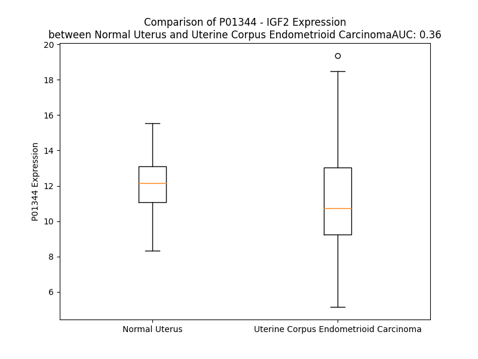

# Detailed Data for P01344

## Introduction to the Detailed Summary

### How to Interpret the Results

- **Summary & Metrics**: This section provides a quick reference to essential protein attributes, including expression changes, family classification, and biomarker applications. Regulation status (upregulated/downregulated) indicates the protein's behavior in a disease context. Some information comes from the original excel file with the proteins selected from literature, while others are derived from the analyses.
- **Expression Comparison**: A visual representation comparing protein expression between normal and disease states. It highlights significant changes in expression levels that might indicate diagnostic or therapeutic relevance. This is data coming from transcriptomics experiments and could not translate similarly to protein levels.
- **Isoform Alignment**: An interactive view of isoform alignments, revealing structural and functional differences between variants of the protein.
- **Interactors & Homologs**: Tables listing known interaction partners and homologous proteins, the more interactors and homologs, the more complex the protein is to design an antibody for.
- **Biological Assemblies**: Information about the structural arrangement of the protein in different assemblies, providing insights into its functional state but also the complexity of the protein to develop antibodies.
- **Combined Per-Residue Information**: A detailed table summarizing residue-level data. This includes predictions for epitope regions, aggregation tendencies, and modifications that might impact the protein's function. Each row corresponds to a residue in the protein, providing insights into specific sites that may be important for research or drug development.
## Summary & Metrics

- **UniProt Accession**: P01344
- **Gene Name**: IGF2
- **Protein Name**: Insulin-like growth factor II
- **Swiss Prot**: IGF2_HUMAN
- **Family**: growth factor
- **Biomarker Application**: diagnosis,efficacy,prognosis
- **Number of Isoforms**: 3
- **Regulation**: 1
- **(transcriptomics) AUC**: 0.8
- **(transcriptomics) Fold Change**: 1.32
- **(transcriptomics) Regulation**: Upregulated
- **Discotope Epitope Count**: 37
- **Max n_uniprots (Homo)**: 1
- **Max n_uniprots (Hetero)**: 6

## Expression Comparison

## Isoform Alignment

<pre style='font-size:14px; font-family:monospace;'>P01344-1 --------------------------------------------------------MGIPMGKSMLVLLTFLAFASCCIAAYRPSETLCGGELVDTLQFVCGDRGFYFS---RPASRVSRRSRGIVEECCFRSCDLALLETYCATPAKSERDVSTPPTVLPDNFPRYPVGKFFQYDTWKQSTQRLRRGLPALLRARRGHVLAKELEAFREAKRHRPLIALPTQDPAHGGAPPEMASNRK
P01344-2 --------------------------------------------------------MGIPMGKSMLVLLTFLAFASCCIAAYRPSETLCGGELVDTLQFVCGDRGFYFRLPGRPASRVSRRSRGIVEECCFRSCDLALLETYCATPAKSERDVSTPPTVLPDNFPRYPVGKFFQYDTWKQSTQRLRRGLPALLRARRGHVLAKELEAFREAKRHRPLIALPTQDPAHGGAPPEMASNRK
P01344-3 MVSPDPQIIVVAPETELASMQVQRTEDGVTIIQIFWVGRKGELLRRTPVSSAMQTPMGIPMGKSMLVLLTFLAFASCCIAAYRPSETLCGGELVDTLQFVCGDRGFYFS---RPASRVSRRSRGIVEECCFRSCDLALLETYCATPAKSERDVSTPPTVLPDNFPRYPVGKFFQYDTWKQSTQRLRRGLPALLRARRGHVLAKELEAFREAKRHRPLIALPTQDPAHGGAPPEMASNRK
</pre>

## Interactors

| preferredName_A   | preferredName_B   |   score |
|:------------------|:------------------|--------:|
| IGF2              | IGFBP1            |   0.999 |
| IGF2              | IGFBP6            |   0.999 |
| IGF2              | IGFBP2            |   0.999 |
| IGF2              | IGF2R             |   0.999 |
| IGF2              | IGF1R             |   0.999 |
| IGF2              | IGFBP3            |   0.999 |
| IGF2              | IGF1              |   0.998 |
| IGF2              | IGFBP5            |   0.998 |
| IGF2              | IGF2BP2           |   0.994 |
| IGF2              | GPC3              |   0.993 |
| IGF2              | IGFBP4            |   0.993 |
| IGF2              | IGF2BP1           |   0.992 |
| IGF2              | INSR              |   0.991 |
| IGF2              | IGFBP7            |   0.99  |
| IGF2              | IGF2BP3           |   0.989 |
| IGF2              | HSPB3             |   0.984 |
| IGF2              | INS               |   0.981 |
| IGF2              | IDE               |   0.95  |
| IGF2              | FCGR1A            |   0.943 |
| IGF2              | CTCF              |   0.935 |
| IGF2              | IRS1              |   0.928 |
| IGF2              | NTRK1             |   0.925 |
| IGF2              | DLK1              |   0.916 |
| IGF2              | VTN               |   0.916 |
| IGF2              | CDKN1C            |   0.907 |

## Homologs

| uniprot_id   | gene_id   |
|:-------------|:----------|
| C9JNR5       | INS       |
| Q5U743       | IGF1      |

## Biological Assemblies

|   Unnamed: 0 |   assembly |   n_uniprots | composition   | crystal_id   |
|-------------:|-----------:|-------------:|:--------------|:-------------|
|            0 |          1 |            3 | Hetero        | 6vwg         |
|            0 |          1 |            6 | Hetero        | 8vjb         |
|            0 |          1 |            1 | Homo          | 5l3n         |
|            0 |          1 |            2 | Hetero        | 6um2         |
|            0 |          1 |            1 | Homo          | 5l3m         |
|            0 |          1 |            5 | Hetero        | 8u4e         |
|            0 |          1 |            2 | Hetero        | 3e4z         |
|            1 |          2 |            2 | Hetero        | 3e4z         |
|            0 |          1 |            6 | Hetero        | 8u4c         |
|            0 |          1 |            1 | Homo          | 5l3l         |
|            0 |          1 |            2 | Hetero        | 2v5p         |
|            1 |          2 |            2 | Hetero        | 2v5p         |
|            0 |          1 |            1 | Homo          | 1igl         |
|            0 |          1 |            2 | Hetero        | 2l29         |
|            0 |          1 |            3 | Hetero        | 6vwi         |
|            0 |          1 |            1 | Homo          | 3kr3         |
|            0 |          1 |            5 | Hetero        | 8vjc         |

## Combined Per-Residue Information

|   res | aa   |   epitope_score | epitope   |   relative_surface_accessibility |   modeling_confidence |   Aggregation | modification   | glycosylation                  |
|------:|:-----|----------------:|:----------|---------------------------------:|----------------------:|--------------:|:---------------|:-------------------------------|
|     1 | M    |         0.20313 | False     |                          1.33804 |                 50.9  |         0     | N/A            | N/A                            |
|     2 | G    |         0.33924 | True      |                          0.90344 |                 64.41 |         0     | N/A            | N/A                            |
|     3 | I    |         0.19695 | False     |                          0.84532 |                 63.17 |         0     | N/A            | N/A                            |
|     4 | P    |         0.27191 | False     |                          0.51891 |                 73.26 |         0     | N/A            | N/A                            |
|     5 | M    |         0.29201 | False     |                          0.89618 |                 67.5  |         0     | N/A            | N/A                            |
|     6 | G    |         0.19866 | False     |                          0.63189 |                 77.09 |         0     | N/A            | N/A                            |
|     7 | K    |         0.15868 | False     |                          0.71459 |                 81.46 |         0     | N/A            | N/A                            |
|     8 | S    |         0.1172  | False     |                          0.48396 |                 83.14 |         3.295 | N/A            | N/A                            |
|     9 | M    |         0.09412 | False     |                          0.56608 |                 85.99 |        30.264 | N/A            | N/A                            |
|    10 | L    |         0.13077 | False     |                          0.73169 |                 88.3  |        88.24  | N/A            | N/A                            |
|    11 | V    |         0.07726 | False     |                          0.71641 |                 89.64 |        98.846 | N/A            | N/A                            |
|    12 | L    |         0.06909 | False     |                          0.58659 |                 89.83 |        99.739 | N/A            | N/A                            |
|    13 | L    |         0.06503 | False     |                          0.55463 |                 89.12 |        99.895 | N/A            | N/A                            |
|    14 | T    |         0.08279 | False     |                          0.56484 |                 88.53 |        99.893 | N/A            | N/A                            |
|    15 | F    |         0.07499 | False     |                          0.67173 |                 90.55 |        99.862 | N/A            | N/A                            |
|    16 | L    |         0.07761 | False     |                          0.57766 |                 88.08 |        99.103 | N/A            | N/A                            |
|    17 | A    |         0.05828 | False     |                          0.58368 |                 88.4  |        94.919 | N/A            | N/A                            |
|    18 | F    |         0.09621 | False     |                          0.71407 |                 86.72 |        91.374 | N/A            | N/A                            |
|    19 | A    |         0.03863 | False     |                          0.25253 |                 86.1  |        47.874 | N/A            | N/A                            |
|    20 | S    |         0.05631 | False     |                          0.49947 |                 82.69 |        11.315 | N/A            | N/A                            |
|    21 | C    |         0.03605 | False     |                          0.62764 |                 78.1  |         6.76  | N/A            | N/A                            |
|    22 | C    |         0.09375 | False     |                          0.38895 |                 75.84 |         5.873 | N/A            | N/A                            |
|    23 | I    |         0.05022 | False     |                          0.55586 |                 69.7  |         5.698 | N/A            | N/A                            |
|    24 | A    |         0.04111 | False     |                          0.67038 |                 66.42 |         3.784 | N/A            | N/A                            |
|    25 | A    |         0.09339 | False     |                          0.75126 |                 62.77 |         2.168 | N/A            | N/A                            |
|    26 | Y    |         0.12995 | False     |                          0.86495 |                 58.55 |         1.658 | N/A            | N/A                            |
|    27 | R    |         0.10436 | False     |                          0.60025 |                 46.46 |         0     | N/A            | N/A                            |
|    28 | P    |         0.10328 | False     |                          0.58102 |                 48.04 |         0     | N/A            | N/A                            |
|    29 | S    |         0.16857 | False     |                          0.48397 |                 43.2  |         0     | N/A            | N/A                            |
|    30 | E    |         0.18306 | False     |                          0.69758 |                 48.59 |         0     | N/A            | N/A                            |
|    31 | T    |         0.26989 | False     |                          0.7512  |                 45.81 |         0     | N/A            | N/A                            |
|    32 | L    |         0.13475 | False     |                          0.19844 |                 48.64 |         0     | N/A            | N/A                            |
|    33 | C    |         0.19405 | False     |                          0.49808 |                 46.54 |         0     | N/A            | N/A                            |
|    34 | G    |         0.22389 | False     |                          0.60737 |                 59.98 |         0     | N/A            | N/A                            |
|    35 | G    |         0.24284 | False     |                          0.73121 |                 53.49 |         0     | N/A            | N/A                            |
|    36 | E    |         0.1591  | False     |                          0.43226 |                 59.39 |         0     | N/A            | N/A                            |
|    37 | L    |         0.25043 | False     |                          0.09233 |                 57.69 |         0     | N/A            | N/A                            |
|    38 | V    |         0.34152 | True      |                          0.32846 |                 58.29 |         0     | N/A            | N/A                            |
|    39 | D    |         0.31108 | False     |                          0.62594 |                 64.85 |         0     | N/A            | N/A                            |
|    40 | T    |         0.35535 | True      |                          0.38269 |                 65.07 |         0.387 | N/A            | N/A                            |
|    41 | L    |         0.04609 | False     |                          0.0033  |                 61.27 |         0.387 | N/A            | N/A                            |
|    42 | Q    |         0.23357 | False     |                          0.56493 |                 63.46 |         0.387 | N/A            | N/A                            |
|    43 | F    |         0.33766 | True      |                          0.92494 |                 67.8  |         0.387 | N/A            | N/A                            |
|    44 | V    |         0.31251 | False     |                          0.38514 |                 63.26 |         0.387 | N/A            | N/A                            |
|    45 | C    |         0.06534 | False     |                          0.01479 |                 64.04 |         0     | N/A            | N/A                            |
|    46 | G    |         0.19865 | False     |                          0.55667 |                 66.36 |         0     | N/A            | N/A                            |
|    47 | D    |         0.33219 | True      |                          0.99368 |                 56.88 |         0     | N/A            | N/A                            |
|    48 | R    |         0.28365 | False     |                          0.43776 |                 60.87 |         0     | N/A            | N/A                            |
|    49 | G    |         0.25777 | False     |                          0.38815 |                 60.31 |         0.355 | N/A            | N/A                            |
|    50 | F    |         0.17165 | False     |                          0.22497 |                 60.7  |         0.355 | N/A            | N/A                            |
|    51 | Y    |         0.36763 | True      |                          0.56986 |                 57.26 |         0.355 | N/A            | N/A                            |
|    52 | F    |         0.25584 | False     |                          0.55292 |                 55.5  |         0.355 | N/A            | N/A                            |
|    53 | S    |         0.30535 | False     |                          0.56405 |                 52.15 |         0.355 | N/A            | N/A                            |
|    54 | R    |         0.21091 | False     |                          0.55673 |                 54.05 |         0     | N/A            | N/A                            |
|    55 | P    |         0.29572 | False     |                          0.78588 |                 49.85 |         0     | N/A            | N/A                            |
|    56 | A    |         0.2362  | False     |                          0.86996 |                 44.16 |         0     | N/A            | N/A                            |
|    57 | S    |         0.19058 | False     |                          0.755   |                 45.24 |         0     | N/A            | N/A                            |
|    58 | R    |         0.32337 | True      |                          0.95999 |                 49.11 |         0     | N/A            | N/A                            |
|    59 | V    |         0.19439 | False     |                          0.98629 |                 51.19 |         0     | N/A            | N/A                            |
|    60 | S    |         0.19818 | False     |                          0.63052 |                 46.61 |         0     | N/A            | N/A                            |
|    61 | R    |         0.32356 | True      |                          0.99171 |                 48.59 |         0     | N/A            | N/A                            |
|    62 | R    |         0.28931 | False     |                          0.88617 |                 47.52 |         0     | N/A            | N/A                            |
|    63 | S    |         0.27962 | False     |                          0.77547 |                 48.62 |         0     | N/A            | N/A                            |
|    64 | R    |         0.41871 | True      |                          0.71178 |                 52.65 |         0     | N/A            | N/A                            |
|    65 | G    |         0.26101 | False     |                          0.23918 |                 55.68 |         0     | N/A            | N/A                            |
|    66 | I    |         0.07569 | False     |                          0.0095  |                 56.64 |         0     | N/A            | N/A                            |
|    67 | V    |         0.35495 | True      |                          0.46461 |                 54.8  |         0     | N/A            | N/A                            |
|    68 | E    |         0.29803 | False     |                          0.43342 |                 56.24 |         0     | N/A            | N/A                            |
|    69 | E    |         0.21085 | False     |                          0.4064  |                 56.7  |         0     | N/A            | N/A                            |
|    70 | C    |         0.15672 | False     |                          0.14132 |                 59.29 |         0     | N/A            | N/A                            |
|    71 | C    |         0.09637 | False     |                          0.02368 |                 56.57 |         0     | N/A            | N/A                            |
|    72 | F    |         0.34995 | True      |                          0.76288 |                 52.98 |         0     | N/A            | N/A                            |
|    73 | R    |         0.36027 | True      |                          0.75026 |                 53    |         0     | N/A            | N/A                            |
|    74 | S    |         0.41471 | True      |                          0.93991 |                 48.47 |         0     | N/A            | N/A                            |
|    75 | C    |         0.25441 | False     |                          0.28317 |                 61.47 |         0     | N/A            | N/A                            |
|    76 | D    |         0.3068  | False     |                          0.69137 |                 58.19 |         0     | N/A            | N/A                            |
|    77 | L    |         0.32468 | True      |                          0.96353 |                 57.57 |         0     | N/A            | N/A                            |
|    78 | A    |         0.18822 | False     |                          0.67552 |                 59.43 |         0     | N/A            | N/A                            |
|    79 | L    |         0.33383 | True      |                          0.3526  |                 61.76 |         0     | N/A            | N/A                            |
|    80 | L    |         0.19939 | False     |                          0.14426 |                 61.35 |         0     | N/A            | N/A                            |
|    81 | E    |         0.34876 | True      |                          0.63743 |                 62.42 |         0     | N/A            | N/A                            |
|    82 | T    |         0.33052 | True      |                          0.60524 |                 63.04 |         0     | N/A            | N/A                            |
|    83 | Y    |         0.15457 | False     |                          0.06936 |                 58.93 |         0     | N/A            | N/A                            |
|    84 | C    |         0.15966 | False     |                          0.15106 |                 62.73 |         0     | N/A            | N/A                            |
|    85 | A    |         0.19839 | False     |                          0.21061 |                 62    |         0     | N/A            | N/A                            |
|    86 | T    |         0.29764 | False     |                          0.87626 |                 57.95 |         0     | N/A            | N/A                            |
|    87 | P    |         0.2414  | False     |                          0.62299 |                 52.42 |         0     | N/A            | N/A                            |
|    88 | A    |         0.23714 | False     |                          0.96956 |                 45.67 |         0     | N/A            | N/A                            |
|    89 | K    |         0.21486 | False     |                          0.94174 |                 42.78 |         0     | N/A            | N/A                            |
|    90 | S    |         0.18054 | False     |                          0.71183 |                 44.09 |         0     | N/A            | N/A                            |
|    91 | E    |         0.28159 | False     |                          0.94305 |                 48.41 |         0     | N/A            | N/A                            |
|    92 | R    |         0.33839 | True      |                          0.83225 |                 48.34 |         0     | N/A            | N/A                            |
|    93 | D    |         0.25849 | False     |                          0.87876 |                 44.58 |         0     | N/A            | N/A                            |
|    94 | V    |         0.23377 | False     |                          0.9475  |                 46.74 |         0     | N/A            | N/A                            |
|    95 | S    |         0.3262  | True      |                          0.92791 |                 41.78 |         0     | N/A            | N/A                            |
|    96 | T    |         0.23938 | False     |                          0.77374 |                 45.77 |         0     | N/A            | O-linked (GalNAc...) threonine |
|    97 | P    |         0.28989 | False     |                          0.88211 |                 43.05 |         0     | N/A            | N/A                            |
|    98 | P    |         0.25268 | False     |                          0.91346 |                 46.24 |         0     | N/A            | N/A                            |
|    99 | T    |         0.42187 | True      |                          0.92712 |                 45.54 |         0     | N/A            | O-linked (GalNAc...) threonine |
|   100 | V    |         0.3098  | False     |                          0.97755 |                 47.43 |         0     | N/A            | N/A                            |
|   101 | L    |         0.22552 | False     |                          0.88752 |                 45.45 |         0     | N/A            | N/A                            |
|   102 | P    |         0.29181 | False     |                          0.83417 |                 46.69 |         0     | N/A            | N/A                            |
|   103 | D    |         0.30506 | False     |                          0.72107 |                 42.11 |         0     | N/A            | N/A                            |
|   104 | N    |         0.32036 | True      |                          0.84814 |                 45.19 |         0     | N/A            | N/A                            |
|   105 | F    |         0.26593 | False     |                          0.95727 |                 44.12 |         0     | N/A            | N/A                            |
|   106 | P    |         0.2622  | False     |                          0.95955 |                 52.98 |         0     | N/A            | N/A                            |
|   107 | R    |         0.33659 | True      |                          0.91838 |                 49.61 |         0     | N/A            | N/A                            |
|   108 | Y    |         0.3294  | True      |                          0.87815 |                 47.65 |         0     | N/A            | N/A                            |
|   109 | P    |         0.30556 | False     |                          0.87207 |                 56.56 |         0     | N/A            | N/A                            |
|   110 | V    |         0.28092 | False     |                          1.03078 |                 52.33 |         0     | N/A            | N/A                            |
|   111 | G    |         0.35173 | True      |                          0.77746 |                 51.23 |         0     | N/A            | N/A                            |
|   112 | K    |         0.28866 | False     |                          0.87974 |                 48.25 |         0     | N/A            | N/A                            |
|   113 | F    |         0.3109  | False     |                          0.9432  |                 50.62 |         0     | N/A            | N/A                            |
|   114 | F    |         0.38111 | True      |                          1.11382 |                 50.97 |         0     | N/A            | N/A                            |
|   115 | Q    |         0.32025 | True      |                          0.57479 |                 53.63 |         0     | N/A            | N/A                            |
|   116 | Y    |         0.35694 | True      |                          0.76968 |                 52.19 |         0     | N/A            | N/A                            |
|   117 | D    |         0.28573 | False     |                          0.63078 |                 57.08 |         0     | N/A            | N/A                            |
|   118 | T    |         0.22539 | False     |                          0.47958 |                 62.27 |         0     | N/A            | N/A                            |
|   119 | W    |         0.45402 | True      |                          0.82196 |                 60.26 |         0     | N/A            | N/A                            |
|   120 | K    |         0.31349 | False     |                          0.5955  |                 62.5  |         0     | N/A            | N/A                            |
|   121 | Q    |         0.29145 | False     |                          0.51953 |                 59.23 |         0     | N/A            | N/A                            |
|   122 | S    |         0.25011 | False     |                          0.38356 |                 56.76 |         0     | N/A            | N/A                            |
|   123 | T    |         0.30884 | False     |                          0.36402 |                 59.99 |         0     | N/A            | N/A                            |
|   124 | Q    |         0.21628 | False     |                          0.53231 |                 60.92 |         0     | N/A            | N/A                            |
|   125 | R    |         0.36517 | True      |                          0.59159 |                 60.1  |         0     | N/A            | N/A                            |
|   126 | L    |         0.35674 | True      |                          0.75869 |                 58.23 |         0     | N/A            | N/A                            |
|   127 | R    |         0.40958 | True      |                          0.78169 |                 61.04 |         0     | N/A            | N/A                            |
|   128 | R    |         0.37563 | True      |                          0.81162 |                 64.03 |         0     | N/A            | N/A                            |
|   129 | G    |         0.3276  | True      |                          0.33942 |                 62.35 |         0     | N/A            | N/A                            |
|   130 | L    |         0.29641 | False     |                          0.59766 |                 64.99 |         0     | N/A            | N/A                            |
|   131 | P    |         0.21436 | False     |                          0.47283 |                 62.46 |         0     | N/A            | N/A                            |
|   132 | A    |         0.21319 | False     |                          0.57467 |                 62.78 |         0     | N/A            | N/A                            |
|   133 | L    |         0.2826  | False     |                          0.73165 |                 61.08 |         0     | N/A            | N/A                            |
|   134 | L    |         0.26765 | False     |                          0.63517 |                 65.71 |         0     | N/A            | N/A                            |
|   135 | R    |         0.2706  | False     |                          0.72924 |                 65.78 |         0     | N/A            | N/A                            |
|   136 | A    |         0.17628 | False     |                          0.51466 |                 66.91 |         0     | N/A            | N/A                            |
|   137 | R    |         0.16849 | False     |                          0.69004 |                 68.78 |         0     | N/A            | N/A                            |
|   138 | R    |         0.14285 | False     |                          0.75357 |                 73.77 |         0     | N/A            | N/A                            |
|   139 | G    |         0.1916  | False     |                          0.443   |                 73.08 |         0     | N/A            | N/A                            |
|   140 | H    |         0.18404 | False     |                          0.76071 |                 71.88 |         0     | N/A            | N/A                            |
|   141 | V    |         0.15298 | False     |                          0.67367 |                 75.68 |         0     | N/A            | N/A                            |
|   142 | L    |         0.1745  | False     |                          0.67003 |                 77.51 |         0     | N/A            | N/A                            |
|   143 | A    |         0.1309  | False     |                          0.57129 |                 77.41 |         0     | N/A            | N/A                            |
|   144 | K    |         0.09413 | False     |                          0.75721 |                 79.25 |         0     | N/A            | N/A                            |
|   145 | E    |         0.121   | False     |                          0.45752 |                 79.33 |         0     | N/A            | N/A                            |
|   146 | L    |         0.15826 | False     |                          0.61313 |                 78.61 |         0     | N/A            | N/A                            |
|   147 | E    |         0.09546 | False     |                          0.54394 |                 80.71 |         0     | N/A            | N/A                            |
|   148 | A    |         0.07891 | False     |                          0.51967 |                 78.56 |         0     | N/A            | N/A                            |
|   149 | F    |         0.19984 | False     |                          0.71142 |                 76.31 |         0     | N/A            | N/A                            |
|   150 | R    |         0.24037 | False     |                          0.65869 |                 77.93 |         0     | N/A            | N/A                            |
|   151 | E    |         0.12786 | False     |                          0.5333  |                 75.81 |         0     | N/A            | N/A                            |
|   152 | A    |         0.12174 | False     |                          0.63505 |                 67.94 |         0     | N/A            | N/A                            |
|   153 | K    |         0.18223 | False     |                          0.76751 |                 67.93 |         0     | N/A            | N/A                            |
|   154 | R    |         0.32495 | True      |                          0.86554 |                 61.75 |         0     | N/A            | N/A                            |
|   155 | H    |         0.29769 | False     |                          0.84312 |                 52.04 |         0     | N/A            | N/A                            |
|   156 | R    |         0.2473  | False     |                          0.7441  |                 51.11 |         0     | N/A            | N/A                            |
|   157 | P    |         0.26989 | False     |                          0.75278 |                 46.85 |         0     | N/A            | N/A                            |
|   158 | L    |         0.29646 | False     |                          1.08967 |                 44.23 |         0     | N/A            | N/A                            |
|   159 | I    |         0.31542 | False     |                          0.97755 |                 48.97 |         0     | N/A            | N/A                            |
|   160 | A    |         0.24797 | False     |                          0.80652 |                 45.8  |         0     | N/A            | N/A                            |
|   161 | L    |         0.2212  | False     |                          0.9715  |                 50.06 |         0     | N/A            | N/A                            |
|   162 | P    |         0.29846 | False     |                          0.90392 |                 51.54 |         0     | N/A            | N/A                            |
|   163 | T    |         0.31698 | False     |                          0.9035  |                 46.57 |         0     | N/A            | O-linked (GalNAc...) threonine |
|   164 | Q    |         0.31886 | True      |                          0.9187  |                 48.68 |         0     | N/A            | N/A                            |
|   165 | D    |         0.30449 | False     |                          0.79152 |                 46.49 |         0     | N/A            | N/A                            |
|   166 | P    |         0.23851 | False     |                          0.91945 |                 46.32 |         0     | N/A            | N/A                            |
|   167 | A    |         0.22218 | False     |                          0.98376 |                 49.95 |         0     | N/A            | N/A                            |
|   168 | H    |         0.27959 | False     |                          1.04352 |                 51.71 |         0     | N/A            | N/A                            |
|   169 | G    |         0.3652  | True      |                          0.93802 |                 46.06 |         0     | N/A            | N/A                            |
|   170 | G    |         0.33302 | True      |                          0.98619 |                 45.21 |         0     | N/A            | N/A                            |
|   171 | A    |         0.254   | False     |                          0.93908 |                 50.89 |         0     | N/A            | N/A                            |
|   172 | P    |         0.24712 | False     |                          0.92083 |                 51.7  |         0     | N/A            | N/A                            |
|   173 | P    |         0.28331 | False     |                          0.92102 |                 49.3  |         0     | N/A            | N/A                            |
|   174 | E    |         0.22786 | False     |                          0.94095 |                 50.12 |         0     | N/A            | N/A                            |
|   175 | M    |         0.26831 | False     |                          0.9972  |                 51.45 |         0     | N/A            | N/A                            |
|   176 | A    |         0.28378 | False     |                          0.91103 |                 52.09 |         0     | N/A            | N/A                            |
|   177 | S    |         0.26249 | False     |                          0.79287 |                 54.5  |         0     | N/A            | N/A                            |
|   178 | N    |         0.20564 | False     |                          0.85272 |                 51.91 |         0     | N/A            | N/A                            |
|   179 | R    |         0.20577 | False     |                          0.95461 |                 54.43 |         0     | N/A            | N/A                            |
|   180 | K    |         0.14106 | False     |                          1.30226 |                 46.59 |         0     | N/A            | N/A                            |

