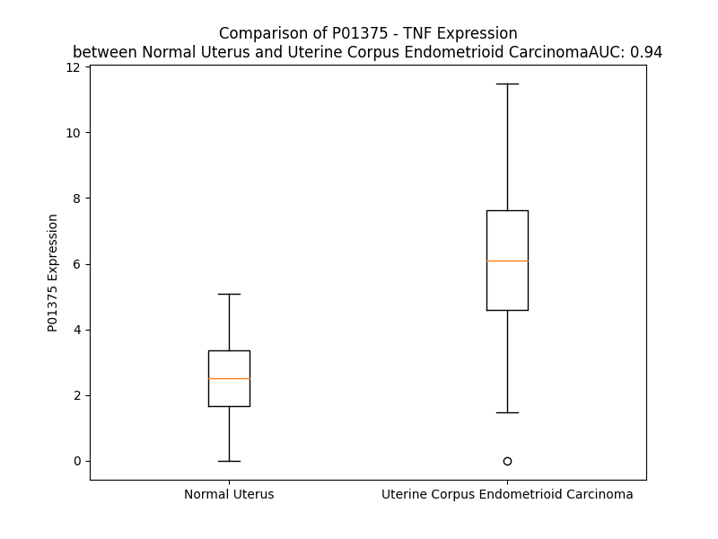

# Detailed Data for P01375

## Introduction to the Detailed Summary

### How to Interpret the Results

- **Summary & Metrics**: This section provides a quick reference to essential protein attributes, including expression changes, family classification, and biomarker applications. Regulation status (upregulated/downregulated) indicates the protein's behavior in a disease context. Some information comes from the original excel file with the proteins selected from literature, while others are derived from the analyses.
- **Expression Comparison**: A visual representation comparing protein expression between normal and disease states. It highlights significant changes in expression levels that might indicate diagnostic or therapeutic relevance. This is data coming from transcriptomics experiments and could not translate similarly to protein levels.
- **Isoform Alignment**: An interactive view of isoform alignments, revealing structural and functional differences between variants of the protein.
- **Interactors & Homologs**: Tables listing known interaction partners and homologous proteins, the more interactors and homologs, the more complex the protein is to design an antibody for.
- **Biological Assemblies**: Information about the structural arrangement of the protein in different assemblies, providing insights into its functional state but also the complexity of the protein to develop antibodies.
- **Combined Per-Residue Information**: A detailed table summarizing residue-level data. This includes predictions for epitope regions, aggregation tendencies, and modifications that might impact the protein's function. Each row corresponds to a residue in the protein, providing insights into specific sites that may be important for research or drug development.
## Summary & Metrics

- **UniProt Accession**: P01375
- **Gene Name**: TNF
- **Protein Name**: Tumor necrosis factor
- **Swiss Prot**: TNFA_HUMAN
- **Family**: cytokine
- **Biomarker Application**: diagnosis,disease progression,efficacy,prognosis,safety,unspecified application
- **Number of Isoforms**: 0
- **Regulation**: 2
- **(transcriptomics) AUC**: 0.94
- **(transcriptomics) Fold Change**: 2.52
- **(transcriptomics) Regulation**: Upregulated
- **Discotope Epitope Count**: 52
- **Max n_uniprots (Homo)**: 6
- **Max n_uniprots (Hetero)**: 6

## Expression Comparison

## Interactors

| preferredName_A   | preferredName_B   |   score |
|:------------------|:------------------|--------:|
| TNF               | TAB2              |   0.999 |
| TNF               | NFKB1             |   0.999 |
| TNF               | TRAF2             |   0.999 |
| TNF               | RIPK1             |   0.999 |
| TNF               | CHUK              |   0.999 |
| TNF               | TRADD             |   0.999 |
| TNF               | IKBKB             |   0.999 |
| TNF               | BIRC2             |   0.999 |
| TNF               | CASP8             |   0.999 |
| TNF               | MAP3K7            |   0.999 |
| TNF               | TNFRSF1A          |   0.999 |
| TNF               | IKBKG             |   0.999 |
| TNF               | TNFRSF1B          |   0.999 |
| TNF               | TNFAIP3           |   0.999 |
| TNF               | MLKL              |   0.998 |
| TNF               | IL1B              |   0.998 |
| TNF               | TRAF6             |   0.998 |
| TNF               | RIPK3             |   0.998 |
| TNF               | TAB1              |   0.998 |
| TNF               | RNF31             |   0.998 |
| TNF               | IKBKE             |   0.998 |
| TNF               | TBK1              |   0.998 |
| TNF               | UBC               |   0.998 |
| TNF               | SHARPIN           |   0.998 |
| TNF               | TNFRSF10B         |   0.997 |
| TNF               | TNIP1             |   0.997 |
| TNF               | RELA              |   0.997 |
| TNF               | TNFRSF10A         |   0.997 |
| TNF               | FAS               |   0.997 |
| TNF               | RBCK1             |   0.997 |
| TNF               | TBKBP1            |   0.996 |
| TNF               | IL1R1             |   0.996 |
| TNF               | TANK              |   0.996 |
| TNF               | IL1A              |   0.994 |
| TNF               | IL6               |   0.994 |
| TNF               | AZI2              |   0.994 |
| TNF               | IL10              |   0.992 |
| TNF               | CD40              |   0.992 |
| TNF               | IFNG              |   0.991 |
| TNF               | FADD              |   0.99  |
| TNF               | JUN               |   0.989 |
| TNF               | CCL3              |   0.988 |
| TNF               | TNFRSF25          |   0.987 |
| TNF               | CYLD              |   0.985 |
| TNF               | LTA               |   0.984 |
| TNF               | FASLG             |   0.984 |
| TNF               | CXCL8             |   0.983 |
| TNF               | IL6R              |   0.982 |
| TNF               | CCL2              |   0.978 |
| TNF               | IL4               |   0.977 |

## Homologs

| uniprot_id   | gene_id   |
|:-------------|:----------|
| Q5STB3       | TNF       |
| Q5STB3       | TNF       |
| Q5STB3       | TNF       |
| Q5STB3       | TNF       |
| Q5STB3       | TNF       |
| Q5STB3       | TNF       |
| Q5STB3       | TNF       |
| Q5STV3       | LTA       |
| X6R8I9       | TNFSF15   |
| P48023       | FASLG     |
| O43557       | TNFSF14   |
| Q06643       | LTB       |
| Q3L8U2       | CD40LG    |
| O14788       | TNFSF11   |
| P50591       | TNFSF10   |

## Biological Assemblies

|   Unnamed: 0 |   assembly |   n_uniprots | composition   | crystal_id   |
|-------------:|-----------:|-------------:|:--------------|:-------------|
|            0 |          1 |            1 | Homo          | 5wux         |
|            1 |          2 |            1 | Homo          | 5wux         |
|            2 |          3 |            1 | Homo          | 5wux         |
|            0 |          1 |            3 | Homo          | 6x82         |
|            1 |          2 |            3 | Homo          | 6x82         |
|            0 |          1 |            3 | Homo          | 5yoy         |
|            1 |          2 |            3 | Homo          | 5yoy         |
|            0 |          1 |            3 | Homo          | 5m2m         |
|            1 |          2 |            3 | Homo          | 5m2m         |
|            0 |          1 |            3 | Homo          | 5m2i         |
|            1 |          2 |            3 | Homo          | 5m2i         |
|            0 |          1 |            3 | Homo          | 6x86         |
|            1 |          2 |            3 | Homo          | 6x86         |
|            0 |          1 |            1 | Homo          | 5m2j         |
|            1 |          2 |            0 | Hetero        | 5m2j         |
|            0 |          1 |            1 | Homo          | 7at7         |
|            0 |          1 |            3 | Homo          | 6x83         |
|            1 |          2 |            3 | Homo          | 6x83         |
|            0 |          1 |            3 | Homo          | 1tnf         |
|            0 |          1 |            3 | Homo          | 6x81         |
|            1 |          2 |            3 | Homo          | 6x81         |
|            0 |          1 |            6 | Hetero        | 3alq         |
|            1 |          2 |            6 | Hetero        | 3alq         |
|            0 |          1 |            1 | Homo          | 3wd5         |
|            0 |          1 |            3 | Homo          | 7jra         |
|            0 |          1 |            3 | Homo          | 2zjc         |
|            0 |          1 |            1 | Homo          | 7qlf         |
|            0 |          1 |            1 | Homo          | 4g3y         |
|            1 |          2 |            1 | Homo          | 4g3y         |
|            0 |          1 |            2 | Homo          | 5mu8         |
|            1 |          2 |            2 | Homo          | 5mu8         |
|            2 |          3 |            2 | Homo          | 5mu8         |
|            3 |          4 |            2 | Homo          | 5mu8         |
|            4 |          5 |            2 | Homo          | 5mu8         |
|            5 |          6 |            2 | Homo          | 5mu8         |
|            6 |          7 |            2 | Homo          | 5mu8         |
|            7 |          8 |            2 | Homo          | 5mu8         |
|            8 |          9 |            2 | Homo          | 5mu8         |
|            9 |         10 |            2 | Homo          | 5mu8         |
|           10 |         11 |            2 | Homo          | 5mu8         |
|           11 |         12 |            2 | Homo          | 5mu8         |
|           12 |         13 |            2 | Homo          | 5mu8         |
|           13 |         14 |            2 | Homo          | 5mu8         |
|           14 |         15 |            2 | Homo          | 5mu8         |
|           15 |         16 |            2 | Homo          | 5mu8         |
|           16 |         17 |            2 | Homo          | 5mu8         |
|           17 |         18 |            2 | Homo          | 5mu8         |
|           18 |         19 |            2 | Homo          | 5mu8         |
|           19 |         20 |            2 | Homo          | 5mu8         |
|           20 |         21 |            2 | Homo          | 5mu8         |
|           21 |         22 |            2 | Homo          | 5mu8         |
|           22 |         23 |            2 | Homo          | 5mu8         |
|           23 |         24 |            2 | Homo          | 5mu8         |
|            0 |          1 |            1 | Homo          | 5uui         |
|            0 |          1 |            6 | Hetero        | 3it8         |
|            1 |          2 |            6 | Hetero        | 3it8         |
|            0 |          1 |            3 | Homo          | 2zpx         |
|            0 |          1 |            1 | Homo          | 4tsv         |
|            0 |          1 |            2 | Homo          | 4twt         |
|            1 |          2 |            2 | Homo          | 4twt         |
|            0 |          1 |            1 | Homo          | 3l9j         |
|            0 |          1 |            3 | Homo          | 7kpa         |
|            0 |          1 |            3 | Homo          | 6ooy         |
|            0 |          1 |            3 | Homo          | 1a8m         |
|            0 |          1 |            1 | Homo          | 7ta6         |
|            1 |          2 |            1 | Homo          | 7ta6         |
|            2 |          3 |            1 | Homo          | 7ta6         |
|            3 |          4 |            1 | Homo          | 7ta6         |
|            4 |          5 |            1 | Homo          | 7ta6         |
|            5 |          6 |            1 | Homo          | 7ta6         |
|            6 |          7 |            1 | Homo          | 7ta6         |
|            7 |          8 |            1 | Homo          | 7ta6         |
|            0 |          1 |            3 | Homo          | 6x85         |
|            1 |          2 |            3 | Homo          | 6x85         |
|            0 |          1 |            3 | Homo          | 6ooz         |
|            0 |          1 |            3 | Homo          | 5tsw         |
|            1 |          2 |            3 | Homo          | 5tsw         |
|            0 |          1 |            3 | Homo          | 6rmj         |
|            0 |          1 |            6 | Homo          | 2tun         |
|            1 |          2 |            3 | Homo          | 2tun         |
|            2 |          3 |            3 | Homo          | 2tun         |
|            0 |          1 |            1 | Homo          | 7ta3         |
|            1 |          2 |            1 | Homo          | 7ta3         |
|            0 |          1 |            1 | Homo          | 4y6o         |
|            1 |          2 |            1 | Homo          | 4y6o         |
|            0 |          1 |            3 | Homo          | 7kp9         |
|            0 |          1 |            1 | Homo          | 7asy         |
|            0 |          1 |            3 | Homo          | 6op0         |
|            0 |          1 |            1 | Homo          | 7atb         |
|            0 |          1 |            3 | Homo          | 2e7a         |
|            0 |          1 |            4 | Homo          | 2az5         |
|            0 |          1 |            5 | Hetero        | 7kpb         |

## Combined Per-Residue Information

|   res | aa   |   epitope_score | epitope   |   relative_surface_accessibility |   modeling_confidence |   Aggregation | modification          | glycosylation                                |
|------:|:-----|----------------:|:----------|---------------------------------:|----------------------:|--------------:|:----------------------|:---------------------------------------------|
|     1 | M    |         0.19762 | False     |                          1.3176  |                 49.64 |         0     | N/A                   | N/A                                          |
|     2 | S    |         0.19207 | False     |                          0.56538 |                 49.04 |         0     | Phosphoserine; by CK1 | N/A                                          |
|     3 | T    |         0.17496 | False     |                          0.75636 |                 58.33 |         0     | N/A                   | N/A                                          |
|     4 | E    |         0.20365 | False     |                          0.71464 |                 64.05 |         0     | N/A                   | N/A                                          |
|     5 | S    |         0.11596 | False     |                          0.52145 |                 61.56 |         0     | N/A                   | N/A                                          |
|     6 | M    |         0.12369 | False     |                          0.702   |                 58.9  |         0     | N/A                   | N/A                                          |
|     7 | I    |         0.10898 | False     |                          0.68234 |                 62.26 |         0     | N/A                   | N/A                                          |
|     8 | R    |         0.15961 | False     |                          0.69864 |                 64.41 |         0     | N/A                   | N/A                                          |
|     9 | D    |         0.08223 | False     |                          0.59961 |                 60.14 |         0     | N/A                   | N/A                                          |
|    10 | V    |         0.10423 | False     |                          0.69774 |                 61.29 |         0     | N/A                   | N/A                                          |
|    11 | E    |         0.11434 | False     |                          0.57839 |                 62.41 |         0     | N/A                   | N/A                                          |
|    12 | L    |         0.1368  | False     |                          0.68415 |                 60.85 |         0     | N/A                   | N/A                                          |
|    13 | A    |         0.09042 | False     |                          0.63779 |                 57.45 |         0     | N/A                   | N/A                                          |
|    14 | E    |         0.09803 | False     |                          0.6767  |                 55.9  |         0     | N/A                   | N/A                                          |
|    15 | E    |         0.20024 | False     |                          0.7623  |                 56.48 |         0     | N/A                   | N/A                                          |
|    16 | A    |         0.15459 | False     |                          0.75113 |                 55.88 |         0     | N/A                   | N/A                                          |
|    17 | L    |         0.20371 | False     |                          0.87114 |                 52.65 |         0     | N/A                   | N/A                                          |
|    18 | P    |         0.18594 | False     |                          0.82843 |                 53.76 |         0     | N/A                   | N/A                                          |
|    19 | K    |         0.23549 | False     |                          0.99766 |                 46.99 |         0     | N/A                   | N/A                                          |
|    20 | K    |         0.14097 | False     |                          0.93773 |                 50.54 |         0     | N/A                   | N/A                                          |
|    21 | T    |         0.2208  | False     |                          0.94509 |                 43.59 |         0     | N/A                   | N/A                                          |
|    22 | G    |         0.2494  | False     |                          0.84944 |                 45.8  |         0     | N/A                   | N/A                                          |
|    23 | G    |         0.21977 | False     |                          0.66955 |                 49.15 |         0     | N/A                   | N/A                                          |
|    24 | P    |         0.26291 | False     |                          1.01252 |                 54.09 |         0     | N/A                   | N/A                                          |
|    25 | Q    |         0.18035 | False     |                          0.66486 |                 54.29 |         0     | N/A                   | N/A                                          |
|    26 | G    |         0.18716 | False     |                          0.59798 |                 57.28 |         0     | N/A                   | N/A                                          |
|    27 | S    |         0.15634 | False     |                          0.61089 |                 63.33 |         0     | N/A                   | N/A                                          |
|    28 | R    |         0.10427 | False     |                          0.69122 |                 65.5  |         0     | N/A                   | N/A                                          |
|    29 | R    |         0.13017 | False     |                          0.66876 |                 67.21 |         0     | N/A                   | N/A                                          |
|    30 | C    |         0.121   | False     |                          0.64034 |                 73.1  |         1.75  | N/A                   | N/A                                          |
|    31 | L    |         0.10225 | False     |                          0.66173 |                 74.25 |        52.24  | N/A                   | N/A                                          |
|    32 | F    |         0.11411 | False     |                          0.57247 |                 78.98 |        72.167 | N/A                   | N/A                                          |
|    33 | L    |         0.10395 | False     |                          0.75465 |                 81.11 |        74.635 | N/A                   | N/A                                          |
|    34 | S    |         0.08358 | False     |                          0.55639 |                 83.38 |        75.804 | N/A                   | N/A                                          |
|    35 | L    |         0.06058 | False     |                          0.57363 |                 87.75 |        86.518 | N/A                   | N/A                                          |
|    36 | F    |         0.09547 | False     |                          0.67177 |                 89.46 |        91.378 | N/A                   | N/A                                          |
|    37 | S    |         0.10011 | False     |                          0.50309 |                 87.81 |        91.778 | N/A                   | N/A                                          |
|    38 | F    |         0.08675 | False     |                          0.74644 |                 91.86 |        97.076 | N/A                   | N/A                                          |
|    39 | L    |         0.09753 | False     |                          0.6891  |                 93.54 |        99.277 | N/A                   | N/A                                          |
|    40 | I    |         0.08103 | False     |                          0.69551 |                 93.87 |        99.534 | N/A                   | N/A                                          |
|    41 | V    |         0.03833 | False     |                          0.66359 |                 94.23 |        97.911 | N/A                   | N/A                                          |
|    42 | A    |         0.07287 | False     |                          0.38212 |                 94.21 |        78.365 | N/A                   | N/A                                          |
|    43 | G    |         0.078   | False     |                          0.47817 |                 93.02 |        61.776 | N/A                   | N/A                                          |
|    44 | A    |         0.10067 | False     |                          0.5512  |                 92.66 |        60.335 | N/A                   | N/A                                          |
|    45 | T    |         0.07577 | False     |                          0.52971 |                 92.72 |        59.152 | N/A                   | N/A                                          |
|    46 | T    |         0.05809 | False     |                          0.52724 |                 91.49 |        58.537 | N/A                   | N/A                                          |
|    47 | L    |         0.07503 | False     |                          0.56493 |                 89.67 |        58.323 | N/A                   | N/A                                          |
|    48 | F    |         0.12727 | False     |                          0.68238 |                 89.07 |        55.722 | N/A                   | N/A                                          |
|    49 | C    |         0.0892  | False     |                          0.43086 |                 89    |        24.664 | N/A                   | N/A                                          |
|    50 | L    |         0.07523 | False     |                          0.29429 |                 88.67 |        22.754 | N/A                   | N/A                                          |
|    51 | L    |         0.11355 | False     |                          0.55987 |                 84.55 |        20.496 | N/A                   | N/A                                          |
|    52 | H    |         0.12651 | False     |                          0.71596 |                 80.04 |        12.072 | N/A                   | N/A                                          |
|    53 | F    |         0.0975  | False     |                          0.77107 |                 79.82 |        10.351 | N/A                   | N/A                                          |
|    54 | G    |         0.16908 | False     |                          0.67641 |                 71.2  |         5.083 | N/A                   | N/A                                          |
|    55 | V    |         0.14273 | False     |                          0.72897 |                 74.01 |         4.87  | N/A                   | N/A                                          |
|    56 | I    |         0.25113 | False     |                          0.57653 |                 65.29 |         2.611 | N/A                   | N/A                                          |
|    57 | G    |         0.15618 | False     |                          0.27256 |                 60.83 |         0     | N/A                   | N/A                                          |
|    58 | P    |         0.1924  | False     |                          0.99422 |                 59.03 |         0     | N/A                   | N/A                                          |
|    59 | Q    |         0.13482 | False     |                          0.80419 |                 45.92 |         0     | N/A                   | N/A                                          |
|    60 | R    |         0.18933 | False     |                          0.89066 |                 46.42 |         0     | N/A                   | N/A                                          |
|    61 | E    |         0.11123 | False     |                          0.76002 |                 46.72 |         0     | N/A                   | N/A                                          |
|    62 | E    |         0.1633  | False     |                          0.82177 |                 42.81 |         0     | N/A                   | N/A                                          |
|    63 | F    |         0.16132 | False     |                          0.62037 |                 39.76 |         0     | N/A                   | N/A                                          |
|    64 | P    |         0.15557 | False     |                          0.68755 |                 39.55 |         0     | N/A                   | N/A                                          |
|    65 | R    |         0.25849 | False     |                          0.99105 |                 41.48 |         0     | N/A                   | N/A                                          |
|    66 | D    |         0.20192 | False     |                          0.84344 |                 43.45 |         0     | N/A                   | N/A                                          |
|    67 | L    |         0.16986 | False     |                          0.5971  |                 42.15 |         0     | N/A                   | N/A                                          |
|    68 | S    |         0.19775 | False     |                          0.94478 |                 42.97 |         0     | N/A                   | N/A                                          |
|    69 | L    |         0.1914  | False     |                          0.86064 |                 47.79 |         0     | N/A                   | N/A                                          |
|    70 | I    |         0.17137 | False     |                          0.77422 |                 52.91 |         0     | N/A                   | N/A                                          |
|    71 | S    |         0.23724 | False     |                          0.29515 |                 55.09 |         0     | N/A                   | N/A                                          |
|    72 | P    |         0.16632 | False     |                          0.76085 |                 53.98 |         0     | N/A                   | N/A                                          |
|    73 | L    |         0.12258 | False     |                          0.81978 |                 53.97 |         0     | N/A                   | N/A                                          |
|    74 | A    |         0.11708 | False     |                          0.40491 |                 57.19 |         0     | N/A                   | N/A                                          |
|    75 | Q    |         0.17034 | False     |                          0.66821 |                 57.83 |         0     | N/A                   | N/A                                          |
|    76 | A    |         0.10391 | False     |                          0.49736 |                 59.33 |         0     | N/A                   | N/A                                          |
|    77 | V    |         0.10283 | False     |                          0.69136 |                 59.55 |         0     | N/A                   | N/A                                          |
|    78 | R    |         0.19715 | False     |                          0.71154 |                 54.82 |         0     | N/A                   | N/A                                          |
|    79 | S    |         0.08542 | False     |                          0.52013 |                 53.43 |         0     | N/A                   | N/A                                          |
|    80 | S    |         0.10607 | False     |                          0.59946 |                 56    |         0     | N/A                   | O-linked (GalNAc...) serine; in soluble form |
|    81 | S    |         0.21082 | False     |                          0.71953 |                 56.14 |         0     | N/A                   | N/A                                          |
|    82 | R    |         0.20981 | False     |                          0.86674 |                 53.27 |         0     | N/A                   | N/A                                          |
|    83 | T    |         0.14868 | False     |                          0.63825 |                 55.98 |         0     | N/A                   | N/A                                          |
|    84 | P    |         0.21909 | False     |                          0.87648 |                 66.25 |         0     | N/A                   | N/A                                          |
|    85 | S    |         0.1872  | False     |                          0.50754 |                 77.23 |         0     | N/A                   | N/A                                          |
|    86 | D    |         0.16532 | False     |                          0.75592 |                 91.05 |         0     | N/A                   | N/A                                          |
|    87 | K    |         0.19244 | False     |                          0.4313  |                 96.22 |         0     | N/A                   | N/A                                          |
|    88 | P    |         0.04505 | False     |                          0.14513 |                 98.18 |         0     | N/A                   | N/A                                          |
|    89 | V    |         0.19547 | False     |                          0.16376 |                 98.43 |         0.426 | N/A                   | N/A                                          |
|    90 | A    |         0.00138 | False     |                          0       |                 98.76 |         0.426 | N/A                   | N/A                                          |
|    91 | H    |         0.18437 | False     |                          0.20201 |                 98.78 |         0.426 | N/A                   | N/A                                          |
|    92 | V    |         0.00432 | False     |                          0       |                 98.77 |         0.426 | N/A                   | N/A                                          |
|    93 | V    |         0.17159 | False     |                          0.18565 |                 98.43 |         0.426 | N/A                   | N/A                                          |
|    94 | A    |         0.11239 | False     |                          0.09716 |                 97.67 |         0.195 | N/A                   | N/A                                          |
|    95 | N    |         0.20466 | False     |                          0.12429 |                 96.89 |         0     | N/A                   | N/A                                          |
|    96 | P    |         0.37767 | True      |                          0.49216 |                 94.08 |         0     | N/A                   | N/A                                          |
|    97 | Q    |         0.36888 | True      |                          0.75564 |                 93.82 |         0     | N/A                   | N/A                                          |
|    98 | A    |         0.2044  | False     |                          0.13774 |                 92.72 |         0     | N/A                   | N/A                                          |
|    99 | E    |         0.38937 | True      |                          0.80429 |                 86.24 |         0     | N/A                   | N/A                                          |
|   100 | G    |         0.35922 | True      |                          0.40725 |                 92.17 |         0     | N/A                   | N/A                                          |
|   101 | Q    |         0.39571 | True      |                          0.59296 |                 96.05 |         0     | N/A                   | N/A                                          |
|   102 | L    |         0.08249 | False     |                          0.13433 |                 97.75 |         0     | N/A                   | N/A                                          |
|   103 | Q    |         0.23511 | False     |                          0.41491 |                 97.88 |         0     | N/A                   | N/A                                          |
|   104 | W    |         0.0503  | False     |                          0.02528 |                 98.46 |         0     | N/A                   | N/A                                          |
|   105 | L    |         0.35182 | True      |                          0.2572  |                 98.09 |         0     | N/A                   | N/A                                          |
|   106 | N    |         0.21955 | False     |                          0.27829 |                 96.96 |         0     | N/A                   | N/A                                          |
|   107 | R    |         0.40505 | True      |                          0.88715 |                 94.6  |         0     | N/A                   | N/A                                          |
|   108 | R    |         0.24193 | False     |                          0.46199 |                 94.12 |         0     | N/A                   | N/A                                          |
|   109 | A    |         0.37419 | True      |                          0.89064 |                 94.05 |         0     | N/A                   | N/A                                          |
|   110 | N    |         0.46874 | True      |                          0.8967  |                 95.27 |         0     | N/A                   | N/A                                          |
|   111 | A    |         0.23036 | False     |                          0.14047 |                 97.37 |         0     | N/A                   | N/A                                          |
|   112 | L    |         0.30986 | True      |                          0.5482  |                 97.79 |         0     | N/A                   | N/A                                          |
|   113 | L    |         0.19643 | False     |                          0.34537 |                 98.27 |         0     | N/A                   | N/A                                          |
|   114 | A    |         0.26019 | False     |                          0.3686  |                 97.44 |         0     | N/A                   | N/A                                          |
|   115 | N    |         0.14014 | False     |                          0.39184 |                 96.91 |         0     | N/A                   | N/A                                          |
|   116 | G    |         0.18954 | False     |                          0.58128 |                 97.75 |         0     | N/A                   | N/A                                          |
|   117 | V    |         0.04087 | False     |                          0.05278 |                 98.58 |         0     | N/A                   | N/A                                          |
|   118 | E    |         0.25025 | False     |                          0.46515 |                 98.58 |         0     | N/A                   | N/A                                          |
|   119 | L    |         0.20797 | False     |                          0.28547 |                 98.71 |         0     | N/A                   | N/A                                          |
|   120 | R    |         0.29174 | True      |                          0.47409 |                 98.27 |         0     | N/A                   | N/A                                          |
|   121 | D    |         0.31427 | True      |                          0.75738 |                 97.56 |         0     | N/A                   | N/A                                          |
|   122 | N    |         0.10835 | False     |                          0.35501 |                 98.43 |         0     | N/A                   | N/A                                          |
|   123 | Q    |         0.191   | False     |                          0.14333 |                 98.77 |         0     | N/A                   | N/A                                          |
|   124 | L    |         0.00359 | False     |                          0       |                 98.83 |         0     | N/A                   | N/A                                          |
|   125 | V    |         0.12199 | False     |                          0.09637 |                 98.75 |         0     | N/A                   | N/A                                          |
|   126 | V    |         0.01025 | False     |                          0.01056 |                 98.7  |         0     | N/A                   | N/A                                          |
|   127 | P    |         0.08699 | False     |                          0.24385 |                 98.33 |         0     | N/A                   | N/A                                          |
|   128 | S    |         0.11564 | False     |                          0.35573 |                 97.96 |         0     | N/A                   | N/A                                          |
|   129 | E    |         0.14125 | False     |                          0.64258 |                 98.05 |         0.006 | N/A                   | N/A                                          |
|   130 | G    |         0.05283 | False     |                          0.25107 |                 98.03 |         7.814 | N/A                   | N/A                                          |
|   131 | L    |         0.21664 | False     |                          0.57527 |                 98.67 |        93.776 | N/A                   | N/A                                          |
|   132 | Y    |         0.01594 | False     |                          0.0056  |                 98.77 |        96.054 | N/A                   | N/A                                          |
|   133 | L    |         0.12423 | False     |                          0.37508 |                 98.85 |        96.683 | N/A                   | N/A                                          |
|   134 | I    |         0.00269 | False     |                          0       |                 98.85 |        96.798 | N/A                   | N/A                                          |
|   135 | Y    |         0.1591  | False     |                          0.17384 |                 98.92 |        96.737 | N/A                   | N/A                                          |
|   136 | S    |         0.00436 | False     |                          0       |                 98.9  |        93.809 | N/A                   | N/A                                          |
|   137 | Q    |         0.14653 | False     |                          0.19621 |                 98.78 |        93.279 | N/A                   | N/A                                          |
|   138 | V    |         0.00348 | False     |                          0       |                 98.64 |        93.259 | N/A                   | N/A                                          |
|   139 | L    |         0.26779 | False     |                          0.14426 |                 98.39 |        92.988 | N/A                   | N/A                                          |
|   140 | F    |         0.00601 | False     |                          0       |                 98.1  |        85.978 | N/A                   | N/A                                          |
|   141 | K    |         0.39871 | True      |                          0.43435 |                 96.99 |         0.006 | N/A                   | N/A                                          |
|   142 | G    |         0.17924 | False     |                          0.12886 |                 96.07 |         0     | N/A                   | N/A                                          |
|   143 | Q    |         0.4956  | True      |                          0.6836  |                 95.3  |         0     | N/A                   | N/A                                          |
|   144 | G    |         0.22986 | False     |                          0.09594 |                 94.76 |         0     | N/A                   | N/A                                          |
|   145 | C    |         0.41114 | True      |                          0.15263 |                 94.53 |         0     | N/A                   | N/A                                          |
|   146 | P    |         0.3421  | True      |                          0.43011 |                 91.85 |         0     | N/A                   | N/A                                          |
|   147 | S    |         0.39539 | True      |                          0.62332 |                 87.76 |         0     | N/A                   | N/A                                          |
|   148 | T    |         0.25204 | False     |                          0.66646 |                 90.4  |         0     | N/A                   | N/A                                          |
|   149 | H    |         0.30361 | True      |                          0.88565 |                 90.55 |         0     | N/A                   | N/A                                          |
|   150 | V    |         0.13069 | False     |                          0.03368 |                 94.71 |         0.203 | N/A                   | N/A                                          |
|   151 | L    |         0.34649 | True      |                          0.60787 |                 96.53 |         0.203 | N/A                   | N/A                                          |
|   152 | L    |         0.00774 | False     |                          0       |                 98.23 |         0.203 | N/A                   | N/A                                          |
|   153 | T    |         0.21412 | False     |                          0.25293 |                 98.51 |         0.203 | N/A                   | N/A                                          |
|   154 | H    |         0.00641 | False     |                          0       |                 98.78 |         0.203 | N/A                   | N/A                                          |
|   155 | T    |         0.11911 | False     |                          0.15161 |                 98.86 |         0.203 | N/A                   | N/A                                          |
|   156 | I    |         0.00417 | False     |                          0       |                 98.9  |         0.203 | N/A                   | N/A                                          |
|   157 | S    |         0.03614 | False     |                          0.01258 |                 98.8  |         0     | N/A                   | N/A                                          |
|   158 | R    |         0.10499 | False     |                          0.2005  |                 98.71 |         0     | N/A                   | N/A                                          |
|   159 | I    |         0.16965 | False     |                          0.12399 |                 98.65 |         0.964 | N/A                   | N/A                                          |
|   160 | A    |         0.05743 | False     |                          0.10113 |                 97.73 |         0.964 | N/A                   | N/A                                          |
|   161 | V    |         0.17482 | False     |                          0.55759 |                 94.26 |         0.964 | N/A                   | N/A                                          |
|   162 | S    |         0.24268 | False     |                          0.71428 |                 94.5  |         0.964 | N/A                   | N/A                                          |
|   163 | Y    |         0.40358 | True      |                          0.57944 |                 94.18 |         0.964 | N/A                   | N/A                                          |
|   164 | Q    |         0.34174 | True      |                          0.6712  |                 94.01 |         0     | N/A                   | N/A                                          |
|   165 | T    |         0.29086 | True      |                          0.50617 |                 97.28 |         0     | N/A                   | N/A                                          |
|   166 | K    |         0.29094 | True      |                          0.459   |                 97.61 |         0     | N/A                   | N/A                                          |
|   167 | V    |         0.23189 | False     |                          0.51221 |                 98.41 |         0.118 | N/A                   | N/A                                          |
|   168 | N    |         0.17553 | False     |                          0.59388 |                 98.54 |         0.118 | N/A                   | N/A                                          |
|   169 | L    |         0.19611 | False     |                          0.23921 |                 98.67 |         0.827 | N/A                   | N/A                                          |
|   170 | L    |         0.1946  | False     |                          0.19455 |                 98.84 |         0.827 | N/A                   | N/A                                          |
|   171 | S    |         0.23274 | False     |                          0.47812 |                 98.75 |         0.827 | N/A                   | N/A                                          |
|   172 | A    |         0.21723 | False     |                          0.30865 |                 98.74 |         0.827 | N/A                   | N/A                                          |
|   173 | I    |         0.38546 | True      |                          0.66021 |                 98.34 |         0.827 | N/A                   | N/A                                          |
|   174 | K    |         0.35551 | True      |                          0.4065  |                 97.92 |         0     | N/A                   | N/A                                          |
|   175 | S    |         0.38661 | True      |                          0.48647 |                 96.09 |         0     | N/A                   | N/A                                          |
|   176 | P    |         0.26997 | False     |                          0.1741  |                 95.54 |         0     | N/A                   | N/A                                          |
|   177 | C    |         0.0839  | False     |                          0.07459 |                 91.37 |         0     | N/A                   | N/A                                          |
|   178 | Q    |         0.50977 | True      |                          0.84245 |                 87.17 |         0     | N/A                   | N/A                                          |
|   179 | R    |         0.55384 | True      |                          0.85343 |                 88.69 |         0     | N/A                   | N/A                                          |
|   180 | E    |         0.45433 | True      |                          0.50224 |                 92.16 |         0     | N/A                   | N/A                                          |
|   181 | T    |         0.35059 | True      |                          0.27332 |                 91.91 |         0     | N/A                   | N/A                                          |
|   182 | P    |         0.32972 | True      |                          0.69214 |                 91.56 |         0     | N/A                   | N/A                                          |
|   183 | E    |         0.63406 | True      |                          0.96465 |                 89.43 |         0     | N/A                   | N/A                                          |
|   184 | G    |         0.57376 | True      |                          1.0257  |                 89.59 |         0     | N/A                   | N/A                                          |
|   185 | A    |         0.52107 | True      |                          0.48603 |                 91.5  |         0     | N/A                   | N/A                                          |
|   186 | E    |         0.41946 | True      |                          0.70659 |                 92.27 |         0     | N/A                   | N/A                                          |
|   187 | A    |         0.47287 | True      |                          0.3851  |                 93.03 |         0     | N/A                   | N/A                                          |
|   188 | K    |         0.50731 | True      |                          0.67811 |                 93.63 |         0     | N/A                   | N/A                                          |
|   189 | P    |         0.6373  | True      |                          0.66051 |                 95.81 |         0     | N/A                   | N/A                                          |
|   190 | W    |         0.30193 | True      |                          0.15336 |                 96.37 |         0     | N/A                   | N/A                                          |
|   191 | Y    |         0.46313 | True      |                          0.50781 |                 97.71 |         0     | N/A                   | N/A                                          |
|   192 | E    |         0.19385 | False     |                          0.19213 |                 98.13 |         0     | N/A                   | N/A                                          |
|   193 | P    |         0.41588 | True      |                          0.55052 |                 98.37 |         0     | N/A                   | N/A                                          |
|   194 | I    |         0.12024 | False     |                          0.04    |                 98.74 |         7.995 | N/A                   | N/A                                          |
|   195 | Y    |         0.36062 | True      |                          0.56659 |                 98.83 |         9.896 | N/A                   | N/A                                          |
|   196 | L    |         0.12451 | False     |                          0.09068 |                 98.91 |        10.447 | N/A                   | N/A                                          |
|   197 | G    |         0.17392 | False     |                          0.43848 |                 98.81 |        10.447 | N/A                   | N/A                                          |
|   198 | G    |         0.17557 | False     |                          0.22303 |                 98.72 |        10.86  | N/A                   | N/A                                          |
|   199 | V    |         0.18718 | False     |                          0.55233 |                 98.79 |        10.86  | N/A                   | N/A                                          |
|   200 | F    |         0.17209 | False     |                          0.23589 |                 98.72 |        10.466 | N/A                   | N/A                                          |
|   201 | Q    |         0.18196 | False     |                          0.45628 |                 98.23 |         4.082 | N/A                   | N/A                                          |
|   202 | L    |         0.00241 | False     |                          0.00165 |                 98.2  |         4.082 | N/A                   | N/A                                          |
|   203 | E    |         0.07824 | False     |                          0.36673 |                 98.11 |         0     | N/A                   | N/A                                          |
|   204 | K    |         0.07171 | False     |                          0.71677 |                 98.26 |         0     | N/A                   | N/A                                          |
|   205 | G    |         0.12305 | False     |                          0.25975 |                 98.24 |         0     | N/A                   | N/A                                          |
|   206 | D    |         0.0066  | False     |                          0       |                 98.52 |         0     | N/A                   | N/A                                          |
|   207 | R    |         0.30567 | True      |                          0.19863 |                 98.68 |         0     | N/A                   | N/A                                          |
|   208 | L    |         0.00299 | False     |                          0       |                 98.89 |         0     | N/A                   | N/A                                          |
|   209 | S    |         0.05748 | False     |                          0.02957 |                 98.78 |         0     | N/A                   | N/A                                          |
|   210 | A    |         0.02043 | False     |                          0.01429 |                 98.83 |         0     | N/A                   | N/A                                          |
|   211 | E    |         0.27224 | False     |                          0.3416  |                 98.51 |         0     | N/A                   | N/A                                          |
|   212 | I    |         0.34205 | True      |                          0.15107 |                 98.49 |         0     | N/A                   | N/A                                          |
|   213 | N    |         0.39673 | True      |                          0.43322 |                 97.82 |         0     | N/A                   | N/A                                          |
|   214 | R    |         0.54276 | True      |                          0.37972 |                 96.77 |         0     | N/A                   | N/A                                          |
|   215 | P    |         0.35231 | True      |                          0.24701 |                 97.13 |         0     | N/A                   | N/A                                          |
|   216 | D    |         0.37613 | True      |                          0.61684 |                 95.52 |         0     | N/A                   | N/A                                          |
|   217 | Y    |         0.2688  | False     |                          0.18815 |                 96.61 |         0     | N/A                   | N/A                                          |
|   218 | L    |         0.16485 | False     |                          0.10724 |                 97.56 |         0     | N/A                   | N/A                                          |
|   219 | D    |         0.12904 | False     |                          0.03028 |                 96.99 |         0     | N/A                   | N/A                                          |
|   220 | F    |         0.26047 | False     |                          0.23644 |                 93.54 |         0     | N/A                   | N/A                                          |
|   221 | A    |         0.57064 | True      |                          0.71265 |                 93.07 |         0     | N/A                   | N/A                                          |
|   222 | E    |         0.59249 | True      |                          0.62688 |                 94.31 |         0     | N/A                   | N/A                                          |
|   223 | S    |         0.43912 | True      |                          0.92349 |                 93.65 |         0     | N/A                   | N/A                                          |
|   224 | G    |         0.31313 | True      |                          0.55484 |                 94.98 |         0.086 | N/A                   | N/A                                          |
|   225 | Q    |         0.2167  | False     |                          0.15409 |                 97.33 |         2.928 | N/A                   | N/A                                          |
|   226 | V    |         0.06082 | False     |                          0.05034 |                 98.3  |        75.466 | N/A                   | N/A                                          |
|   227 | Y    |         0.19891 | False     |                          0.15515 |                 98.73 |        81.177 | N/A                   | N/A                                          |
|   228 | F    |         0.00423 | False     |                          0.00064 |                 98.88 |        82.305 | N/A                   | N/A                                          |
|   229 | G    |         0.00678 | False     |                          0       |                 98.87 |        82.305 | N/A                   | N/A                                          |
|   230 | I    |         0.00601 | False     |                          0.00177 |                 98.8  |        82.305 | N/A                   | N/A                                          |
|   231 | I    |         0.1695  | False     |                          0.34798 |                 98.54 |        76.734 | N/A                   | N/A                                          |
|   232 | A    |         0.04365 | False     |                          0.11695 |                 98.21 |        52.619 | N/A                   | N/A                                          |
|   233 | L    |         0.08193 | False     |                          0.71643 |                 96.08 |         0     | N/A                   | N/A                                          |

