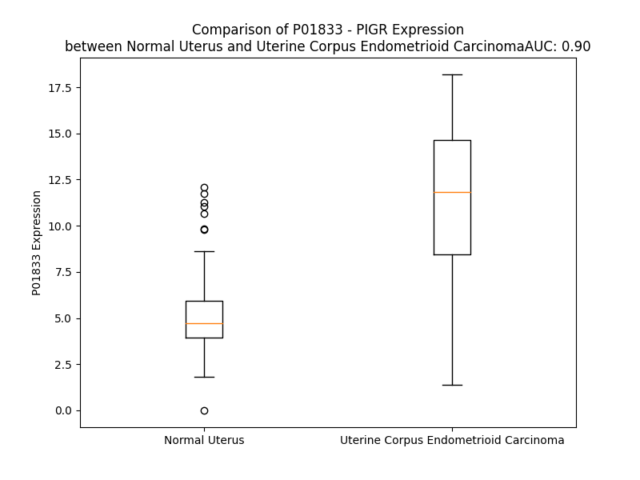

# Detailed Data for P01833

## Introduction to the Detailed Summary

### How to Interpret the Results

- **Summary & Metrics**: This section provides a quick reference to essential protein attributes, including expression changes, family classification, and biomarker applications. Regulation status (upregulated/downregulated) indicates the protein's behavior in a disease context. Some information comes from the original excel file with the proteins selected from literature, while others are derived from the analyses.
- **Expression Comparison**: A visual representation comparing protein expression between normal and disease states. It highlights significant changes in expression levels that might indicate diagnostic or therapeutic relevance. This is data coming from transcriptomics experiments and could not translate similarly to protein levels.
- **Isoform Alignment**: An interactive view of isoform alignments, revealing structural and functional differences between variants of the protein.
- **Interactors & Homologs**: Tables listing known interaction partners and homologous proteins, the more interactors and homologs, the more complex the protein is to design an antibody for.
- **Biological Assemblies**: Information about the structural arrangement of the protein in different assemblies, providing insights into its functional state but also the complexity of the protein to develop antibodies.
- **Combined Per-Residue Information**: A detailed table summarizing residue-level data. This includes predictions for epitope regions, aggregation tendencies, and modifications that might impact the protein's function. Each row corresponds to a residue in the protein, providing insights into specific sites that may be important for research or drug development.
## Summary & Metrics

- **UniProt Accession**: P01833
- **Gene Name**: PIGR
- **Protein Name**: polymeric immunoglobulin receptor
- **Swiss Prot**: PIGR_HUMAN
- **Family**: transporter
- **Biomarker Application**: unspecified application
- **Number of Isoforms**: 0
- **Regulation**: 1
- **(transcriptomics) AUC**: 0.9
- **(transcriptomics) Fold Change**: 2.16
- **(transcriptomics) Regulation**: Upregulated
- **Discotope Epitope Count**: 147
- **Max n_uniprots (Homo)**: 10.0
- **Max n_uniprots (Hetero)**: 10.0

## Expression Comparison

## Interactors

| preferredName_A   | preferredName_B   |   score |
|:------------------|:------------------|--------:|
| PIGR              | JCHAIN            |   0.999 |
| PIGR              | PIGA              |   0.991 |
| PIGR              | LOC102723407      |   0.969 |
| PIGR              | RAB3B             |   0.934 |
| PIGR              | IL2               |   0.927 |
| PIGR              | SFTPC             |   0.905 |
| PIGR              | FCAR              |   0.905 |

## Homologs

| uniprot_id   | gene_id   |
|:-------------|:----------|
| Q6UXZ3       | CD300LD   |
| A0A0K2S4Q6   | CD300H    |
| Q08708       | CD300C    |
| J9JID3       | CD300LB   |
| F8W7R9       | FCAMR     |
| J3QKQ4       | CD300A    |
| E9PMT7       | FCMR      |
| Q9NZC2       | TREM2     |
| Q496F6       | CD300E    |
| Q86YW5       | TREML1    |
| Q6UXG3       | CD300LG   |
| J3KS52       | CD300LF   |
| P0DMS9       | TMIGD3    |

## Biological Assemblies

|   Unnamed: 0 |   assembly |   n_uniprots | composition   | crystal_id   |
|-------------:|-----------:|-------------:|:--------------|:-------------|
|            0 |          1 |            7 | Hetero        | 6lxw         |
|            0 |          1 |           10 | Hetero        | 6uea         |
|            0 |          1 |            8 | Hetero        | 8skv         |
|            0 |          1 |           10 | Hetero        | 7ysg         |
|            0 |          1 |            6 | Hetero        | 6ue7         |
|            0 |          1 |           10 | Hetero        | 6ue9         |
|            0 |          1 |            6 | Hetero        | 3chn         |
|            0 |          1 |            1 | Homo          | 2ocw         |
|            0 |          1 |           10 | Hetero        | 6ue8         |
|            0 |          1 |            2 | Homo          | 3cm9         |
|            0 |          1 |           10 | Hetero        | 7k0c         |
|            0 |          1 |           10 | Homo          | 6kxs         |
|            0 |          1 |            6 | Hetero        | 6lx3         |
|            0 |          1 |            1 | Homo          | 1xed         |
|            1 |          2 |            1 | Homo          | 1xed         |
|            2 |          3 |            1 | Homo          | 1xed         |
|            3 |          4 |            1 | Homo          | 1xed         |
|            4 |          5 |            1 | Homo          | 1xed         |
|            5 |          6 |            1 | Homo          | 1xed         |
|            6 |          7 |            4 | Homo          | 1xed         |
|            7 |          8 |            2 | Homo          | 1xed         |
|            8 |          9 |            2 | Homo          | 1xed         |
|            0 |          1 |            1 | Homo          | 5d4k         |
|            1 |          2 |            1 | Homo          | 5d4k         |

## Combined Per-Residue Information

|   res | aa   |   epitope_score | epitope   |   relative_surface_accessibility |   modeling_confidence |   Aggregation | modification   | glycosylation                             |
|------:|:-----|----------------:|:----------|---------------------------------:|----------------------:|--------------:|:---------------|:------------------------------------------|
|     1 | M    |         0.03517 | False     |                          1.11191 |                 52.94 |         0.104 | N/A            | N/A                                       |
|     2 | L    |         0.05694 | False     |                          0.94927 |                 50.97 |        90.864 | N/A            | N/A                                       |
|     3 | L    |         0.07824 | False     |                          0.91072 |                 50.18 |        97.291 | N/A            | N/A                                       |
|     4 | F    |         0.05723 | False     |                          0.83049 |                 53.25 |        99.676 | N/A            | N/A                                       |
|     5 | V    |         0.03329 | False     |                          0.58743 |                 54.36 |        99.87  | N/A            | N/A                                       |
|     6 | L    |         0.10566 | False     |                          0.7133  |                 48.73 |        99.886 | N/A            | N/A                                       |
|     7 | T    |         0.05636 | False     |                          0.6254  |                 51.47 |        97.724 | N/A            | N/A                                       |
|     8 | C    |         0.04383 | False     |                          0.56769 |                 51.19 |        96.347 | N/A            | N/A                                       |
|     9 | L    |         0.03071 | False     |                          0.61758 |                 48.84 |        96.111 | N/A            | N/A                                       |
|    10 | L    |         0.09259 | False     |                          0.83556 |                 48.59 |        94.802 | N/A            | N/A                                       |
|    11 | A    |         0.0807  | False     |                          0.81609 |                 50.34 |        87.654 | N/A            | N/A                                       |
|    12 | V    |         0.0945  | False     |                          0.82749 |                 48.84 |        81.611 | N/A            | N/A                                       |
|    13 | F    |         0.03679 | False     |                          0.6913  |                 43.53 |        10.483 | N/A            | N/A                                       |
|    14 | P    |         0.05036 | False     |                          0.82687 |                 37.86 |         4.486 | N/A            | N/A                                       |
|    15 | A    |         0.0579  | False     |                          0.87625 |                 33.98 |         0     | N/A            | N/A                                       |
|    16 | I    |         0.06931 | False     |                          0.92439 |                 32.85 |         0     | N/A            | N/A                                       |
|    17 | S    |         0.06719 | False     |                          0.73947 |                 34.34 |         0     | N/A            | N/A                                       |
|    18 | T    |         0.09682 | False     |                          0.79196 |                 46.81 |         0     | N/A            | N/A                                       |
|    19 | K    |         0.06535 | False     |                          0.83773 |                 62.1  |         0     | N/A            | N/A                                       |
|    20 | S    |         0.04957 | False     |                          0.17987 |                 75.58 |         0     | N/A            | N/A                                       |
|    21 | P    |         0.01852 | False     |                          0.17876 |                 83.13 |         0     | N/A            | N/A                                       |
|    22 | I    |         0.00852 | False     |                          0.00657 |                 88.73 |         0     | N/A            | N/A                                       |
|    23 | F    |         0.03025 | False     |                          0.13376 |                 87.33 |         0     | N/A            | N/A                                       |
|    24 | G    |         0.00227 | False     |                          0.00119 |                 87.93 |         0     | N/A            | N/A                                       |
|    25 | P    |         0.02769 | False     |                          0.15905 |                 88.24 |         0     | N/A            | N/A                                       |
|    26 | E    |         0.06592 | False     |                          0.64068 |                 86.43 |         0     | N/A            | N/A                                       |
|    27 | E    |         0.09435 | False     |                          0.67758 |                 85.82 |         0     | N/A            | N/A                                       |
|    28 | V    |         0.01505 | False     |                          0.13344 |                 88.29 |         0     | N/A            | N/A                                       |
|    29 | N    |         0.07749 | False     |                          0.71126 |                 85.37 |         0     | N/A            | N/A                                       |
|    30 | S    |         0.01595 | False     |                          0.1366  |                 85.68 |         0     | N/A            | N/A                                       |
|    31 | V    |         0.03177 | False     |                          0.36464 |                 83.47 |         0     | N/A            | N/A                                       |
|    32 | E    |         0.06368 | False     |                          0.41163 |                 86.25 |         0     | N/A            | N/A                                       |
|    33 | G    |         0.04815 | False     |                          0.64575 |                 84.46 |         0     | N/A            | N/A                                       |
|    34 | N    |         0.06708 | False     |                          0.45609 |                 87.87 |         0     | N/A            | N/A                                       |
|    35 | S    |         0.10852 | True      |                          0.64458 |                 91.7  |         0     | N/A            | N/A                                       |
|    36 | V    |         0.03803 | False     |                          0.15876 |                 92.52 |         0.388 | N/A            | N/A                                       |
|    37 | S    |         0.14793 | True      |                          0.57518 |                 94.02 |         0.388 | N/A            | N/A                                       |
|    38 | I    |         0.00579 | False     |                          0.008   |                 94.32 |         0.388 | N/A            | N/A                                       |
|    39 | T    |         0.0635  | False     |                          0.23608 |                 93.96 |         0.388 | N/A            | N/A                                       |
|    40 | C    |         0.00746 | False     |                          0       |                 93.73 |         0.388 | N/A            | N/A                                       |
|    41 | Y    |         0.03497 | False     |                          0.20737 |                 91.39 |         0.388 | N/A            | N/A                                       |
|    42 | Y    |         0.01858 | False     |                          0.03977 |                 89.54 |         0     | N/A            | N/A                                       |
|    43 | P    |         0.01719 | False     |                          0.05071 |                 85.98 |         0     | N/A            | N/A                                       |
|    44 | P    |         0.06943 | False     |                          0.46691 |                 83.98 |         0     | N/A            | N/A                                       |
|    45 | T    |         0.06072 | False     |                          0.43801 |                 84.52 |         0     | N/A            | N/A                                       |
|    46 | S    |         0.08528 | False     |                          0.69878 |                 85.36 |         0     | N/A            | N/A                                       |
|    47 | V    |         0.11996 | True      |                          0.7347  |                 88.18 |         0     | N/A            | N/A                                       |
|    48 | N    |         0.02955 | False     |                          0.1209  |                 89.79 |         0     | N/A            | N/A                                       |
|    49 | R    |         0.06222 | False     |                          0.22031 |                 90.31 |         0     | N/A            | N/A                                       |
|    50 | H    |         0.10899 | True      |                          0.7705  |                 88.96 |         0     | N/A            | N/A                                       |
|    51 | T    |         0.05633 | False     |                          0.25876 |                 92.88 |         0     | N/A            | N/A                                       |
|    52 | R    |         0.04922 | False     |                          0.19575 |                 95    |         0     | N/A            | N/A                                       |
|    53 | K    |         0.01146 | False     |                          0.00746 |                 96.23 |         0     | N/A            | N/A                                       |
|    54 | Y    |         0.01132 | False     |                          0       |                 95.8  |         0     | N/A            | N/A                                       |
|    55 | W    |         0.00466 | False     |                          0       |                 96.89 |         0     | N/A            | N/A                                       |
|    56 | C    |         0.00348 | False     |                          0.00094 |                 94.94 |         0     | N/A            | N/A                                       |
|    57 | R    |         0.06068 | False     |                          0.24212 |                 94.54 |         0     | N/A            | N/A                                       |
|    58 | Q    |         0.0733  | False     |                          0.29476 |                 90.05 |         0     | N/A            | N/A                                       |
|    59 | G    |         0.08336 | False     |                          0.37023 |                 81.91 |         0     | N/A            | N/A                                       |
|    60 | A    |         0.20981 | True      |                          0.91668 |                 77.12 |         0     | N/A            | N/A                                       |
|    61 | R    |         0.27196 | True      |                          1.02015 |                 76.6  |         0     | N/A            | N/A                                       |
|    62 | G    |         0.09476 | False     |                          0.8837  |                 74.53 |         0     | N/A            | N/A                                       |
|    63 | G    |         0.17043 | True      |                          0.48622 |                 84.66 |         0.283 | N/A            | N/A                                       |
|    64 | C    |         0.04492 | False     |                          0.15753 |                 90.55 |         4.965 | N/A            | N/A                                       |
|    65 | I    |         0.14407 | True      |                          0.68637 |                 92.2  |         5.933 | N/A            | N/A                                       |
|    66 | T    |         0.08155 | False     |                          0.16148 |                 94.47 |         5.933 | N/A            | N/A                                       |
|    67 | L    |         0.0908  | False     |                          0.07089 |                 95.99 |         5.933 | N/A            | N/A                                       |
|    68 | I    |         0.05421 | False     |                          0.0416  |                 96.9  |         5.933 | N/A            | N/A                                       |
|    69 | S    |         0.06939 | False     |                          0.02998 |                 96.28 |         1.307 | N/A            | N/A                                       |
|    70 | S    |         0.09467 | False     |                          0.42625 |                 94.84 |         0     | N/A            | N/A                                       |
|    71 | E    |         0.16892 | True      |                          0.61394 |                 92.33 |         0     | N/A            | N/A                                       |
|    72 | G    |         0.11132 | True      |                          0.78525 |                 90.91 |         0     | N/A            | N/A                                       |
|    73 | Y    |         0.32702 | True      |                          0.496   |                 94.76 |         0     | N/A            | N/A                                       |
|    74 | V    |         0.09425 | False     |                          0.45187 |                 96.29 |         0     | N/A            | N/A                                       |
|    75 | S    |         0.0841  | False     |                          0.12862 |                 95.85 |         0     | N/A            | N/A                                       |
|    76 | S    |         0.17281 | True      |                          0.83885 |                 94.77 |         0     | N/A            | N/A                                       |
|    77 | K    |         0.14439 | True      |                          0.60706 |                 93.79 |         0     | N/A            | N/A                                       |
|    78 | Y    |         0.0197  | False     |                          0.00791 |                 95.44 |         0     | N/A            | N/A                                       |
|    79 | A    |         0.16181 | True      |                          0.59669 |                 92.79 |         0     | N/A            | N/A                                       |
|    80 | G    |         0.13158 | True      |                          1.13683 |                 92.24 |         0     | N/A            | N/A                                       |
|    81 | R    |         0.15053 | True      |                          0.17652 |                 95.35 |         0     | N/A            | N/A                                       |
|    82 | A    |         0.01922 | False     |                          0.16049 |                 96.02 |         0     | N/A            | N/A                                       |
|    83 | N    |         0.18736 | True      |                          0.48421 |                 96.57 |         0     | N/A            | N-linked (GlcNAc...) asparagine           |
|    84 | L    |         0.06363 | False     |                          0.16794 |                 96.82 |         0     | N/A            | N/A                                       |
|    85 | T    |         0.09367 | False     |                          0.40499 |                 95.86 |         0     | N/A            | N/A                                       |
|    86 | N    |         0.05733 | False     |                          0.29409 |                 95.47 |         0     | N/A            | N/A                                       |
|    87 | F    |         0.08745 | False     |                          0.43794 |                 93.33 |         0     | N/A            | N/A                                       |
|    88 | P    |         0.11007 | True      |                          0.33103 |                 89.26 |         0     | N/A            | N/A                                       |
|    89 | E    |         0.09765 | False     |                          0.5892  |                 83.52 |         0     | N/A            | N/A                                       |
|    90 | N    |         0.15103 | True      |                          0.72166 |                 82.03 |         0     | N/A            | N-linked (GlcNAc...) asparagine           |
|    91 | G    |         0.01118 | False     |                          0.02519 |                 87.85 |         1.486 | N/A            | N/A                                       |
|    92 | T    |         0.02531 | False     |                          0.07298 |                 93.28 |        23.742 | N/A            | N/A                                       |
|    93 | F    |         0.00211 | False     |                          0       |                 95.64 |        59.601 | N/A            | N/A                                       |
|    94 | V    |         0.05454 | False     |                          0.1628  |                 96.6  |        61.058 | N/A            | N/A                                       |
|    95 | V    |         0.00715 | False     |                          0       |                 96.98 |        61.058 | N/A            | N/A                                       |
|    96 | N    |         0.05577 | False     |                          0.27364 |                 97.03 |        60.26  | N/A            | N/A                                       |
|    97 | I    |         0.03782 | False     |                          0.00889 |                 96.74 |        59.316 | N/A            | N/A                                       |
|    98 | A    |         0.07775 | False     |                          0.35895 |                 95.21 |        31.297 | N/A            | N/A                                       |
|    99 | Q    |         0.08392 | False     |                          0.6498  |                 92.65 |         6.413 | N/A            | N/A                                       |
|   100 | L    |         0.00971 | False     |                          0.01219 |                 92.94 |         5.503 | N/A            | N/A                                       |
|   101 | S    |         0.04688 | False     |                          0.30022 |                 91.74 |         0.222 | N/A            | N/A                                       |
|   102 | Q    |         0.07258 | False     |                          0.4853  |                 88.76 |         0     | N/A            | N/A                                       |
|   103 | D    |         0.07379 | False     |                          0.61195 |                 91.57 |         0     | N/A            | N/A                                       |
|   104 | D    |         0.02353 | False     |                          0.04399 |                 93.58 |         0     | N/A            | N/A                                       |
|   105 | S    |         0.0295  | False     |                          0.19128 |                 91.33 |         0     | N/A            | N/A                                       |
|   106 | G    |         0.02974 | False     |                          0.29936 |                 90.52 |         0     | N/A            | N/A                                       |
|   107 | R    |         0.16816 | True      |                          0.67693 |                 93.51 |         0     | N/A            | N/A                                       |
|   108 | Y    |         0.01225 | False     |                          0       |                 95.09 |         0     | N/A            | N/A                                       |
|   109 | K    |         0.05989 | False     |                          0.20206 |                 94.61 |         0     | N/A            | N/A                                       |
|   110 | C    |         0.00344 | False     |                          0       |                 94.68 |         0     | N/A            | N/A                                       |
|   111 | G    |         0.00463 | False     |                          0       |                 94.63 |         0     | N/A            | N/A                                       |
|   112 | L    |         0.02427 | False     |                          0.01577 |                 94.09 |         0     | N/A            | N/A                                       |
|   113 | G    |         0.07773 | False     |                          0.209   |                 91.78 |         0     | N/A            | N/A                                       |
|   114 | I    |         0.1516  | True      |                          0.55358 |                 88.11 |         0     | N/A            | N/A                                       |
|   115 | N    |         0.09623 | False     |                          0.22151 |                 84.75 |         0     | N/A            | N/A                                       |
|   116 | S    |         0.16069 | True      |                          0.79632 |                 75.39 |         0     | N/A            | N/A                                       |
|   117 | R    |         0.10998 | True      |                          0.63783 |                 72.19 |         0     | N/A            | N/A                                       |
|   118 | G    |         0.09356 | False     |                          0.74403 |                 76.62 |         0     | N/A            | N/A                                       |
|   119 | L    |         0.06661 | False     |                          0.44586 |                 87.38 |         0     | N/A            | N/A                                       |
|   120 | S    |         0.04072 | False     |                          0.10351 |                 92.25 |         0     | N/A            | N/A                                       |
|   121 | F    |         0.04062 | False     |                          0.15263 |                 91.54 |         0     | N/A            | N/A                                       |
|   122 | D    |         0.10156 | False     |                          0.41538 |                 92.16 |         0     | N/A            | N/A                                       |
|   123 | V    |         0.00923 | False     |                          0.01393 |                 92.8  |         0     | N/A            | N/A                                       |
|   124 | S    |         0.06485 | False     |                          0.31692 |                 92.35 |         0     | N/A            | N/A                                       |
|   125 | L    |         0.00563 | False     |                          0.00226 |                 92.51 |         0     | N/A            | N/A                                       |
|   126 | E    |         0.05273 | False     |                          0.47186 |                 90.05 |         0     | N/A            | N/A                                       |
|   127 | V    |         0.01016 | False     |                          0.01337 |                 88.65 |         0     | N/A            | N/A                                       |
|   128 | S    |         0.05375 | False     |                          0.45351 |                 82.45 |         0     | N/A            | N/A                                       |
|   129 | Q    |         0.09324 | False     |                          0.60907 |                 77.03 |         0     | N/A            | N/A                                       |
|   130 | G    |         0.10581 | False     |                          0.45734 |                 64.44 |         0     | N/A            | N/A                                       |
|   131 | P    |         0.09007 | False     |                          0.61581 |                 59.27 |         0     | N/A            | N/A                                       |
|   132 | G    |         0.13838 | True      |                          0.8685  |                 52.97 |         0     | N/A            | N/A                                       |
|   133 | L    |         0.14526 | True      |                          0.81713 |                 50.71 |         0     | N/A            | N/A                                       |
|   134 | L    |         0.14296 | True      |                          0.81799 |                 52.71 |         0     | N/A            | N/A                                       |
|   135 | N    |         0.15642 | True      |                          0.99046 |                 53.28 |         0     | N/A            | N-linked (GlcNAc...) asparagine           |
|   136 | D    |         0.08325 | False     |                          0.64463 |                 67.94 |         0     | N/A            | N/A                                       |
|   137 | T    |         0.04765 | False     |                          0.17651 |                 72.89 |         0.254 | N/A            | N/A                                       |
|   138 | K    |         0.0351  | False     |                          0.5442  |                 82.59 |         0.682 | N/A            | N/A                                       |
|   139 | V    |         0.03876 | False     |                          0.29406 |                 81.95 |         0.682 | N/A            | N/A                                       |
|   140 | Y    |         0.02771 | False     |                          0.14046 |                 85.37 |         0.682 | N/A            | N/A                                       |
|   141 | T    |         0.05054 | False     |                          0.52212 |                 83.37 |         0.682 | N/A            | N/A                                       |
|   142 | V    |         0.02441 | False     |                          0.20565 |                 85.92 |         0.682 | N/A            | N/A                                       |
|   143 | D    |         0.03128 | False     |                          0.42607 |                 83.91 |         0.682 | N/A            | N/A                                       |
|   144 | L    |         0.01213 | False     |                          0.11157 |                 84.69 |         0.682 | N/A            | N/A                                       |
|   145 | G    |         0.00933 | False     |                          0.10945 |                 84.08 |         0     | N/A            | N/A                                       |
|   146 | R    |         0.03188 | False     |                          0.30907 |                 86.75 |         0     | N/A            | N/A                                       |
|   147 | T    |         0.05137 | False     |                          0.42231 |                 90.14 |         0     | N/A            | N/A                                       |
|   148 | V    |         0.0199  | False     |                          0.04284 |                 93.06 |         0     | N/A            | N/A                                       |
|   149 | T    |         0.07736 | False     |                          0.42414 |                 94.22 |         0     | N/A            | N/A                                       |
|   150 | I    |         0.00719 | False     |                          0.004   |                 93.33 |         0     | N/A            | N/A                                       |
|   151 | N    |         0.10373 | False     |                          0.39951 |                 91.68 |         0     | N/A            | N/A                                       |
|   152 | C    |         0.0164  | False     |                          0.01102 |                 91.4  |         0     | N/A            | N/A                                       |
|   153 | P    |         0.05599 | False     |                          0.53638 |                 90.12 |         0     | N/A            | N/A                                       |
|   154 | F    |         0.04428 | False     |                          0.10264 |                 89.89 |         0     | N/A            | N/A                                       |
|   155 | K    |         0.12937 | True      |                          0.5296  |                 88.29 |         0     | N/A            | N/A                                       |
|   156 | T    |         0.18033 | True      |                          0.71126 |                 87.54 |         0     | N/A            | N/A                                       |
|   157 | E    |         0.12915 | True      |                          0.40538 |                 88.05 |         0     | N/A            | N/A                                       |
|   158 | N    |         0.01264 | False     |                          0       |                 89.1  |         0     | N/A            | N/A                                       |
|   159 | A    |         0.09618 | False     |                          0.3818  |                 86.28 |         0     | N/A            | N/A                                       |
|   160 | Q    |         0.19882 | True      |                          0.89953 |                 86.18 |         0     | N/A            | N/A                                       |
|   161 | K    |         0.14997 | True      |                          0.37284 |                 90.64 |         0     | N/A            | N/A                                       |
|   162 | R    |         0.12406 | True      |                          0.28222 |                 93.19 |         0     | N/A            | N/A                                       |
|   163 | K    |         0.04351 | False     |                          0.01935 |                 94.03 |         0     | N/A            | N/A                                       |
|   164 | S    |         0.00657 | False     |                          0.00474 |                 95.3  |         0     | N/A            | N/A                                       |
|   165 | L    |         0.00386 | False     |                          0       |                 96.11 |         0     | N/A            | N/A                                       |
|   166 | Y    |         0.06775 | False     |                          0.20594 |                 94.74 |         0     | N/A            | N/A                                       |
|   167 | K    |         0.02575 | False     |                          0.05437 |                 94.66 |         0     | N/A            | N/A                                       |
|   168 | Q    |         0.10721 | True      |                          0.40117 |                 90.64 |         0     | N/A            | N/A                                       |
|   169 | I    |         0.08081 | False     |                          0.53508 |                 88.1  |         0     | N/A            | N/A                                       |
|   170 | G    |         0.169   | True      |                          0.7914  |                 85.82 |         0     | N/A            | N/A                                       |
|   171 | L    |         0.23195 | True      |                          0.97171 |                 85.49 |         0     | N/A            | N/A                                       |
|   172 | Y    |         0.17595 | True      |                          0.72759 |                 88.04 |         0     | N/A            | N/A                                       |
|   173 | P    |         0.27159 | True      |                          0.59814 |                 92.11 |         2.163 | N/A            | N/A                                       |
|   174 | V    |         0.15005 | True      |                          0.35988 |                 95.01 |         2.163 | N/A            | N/A                                       |
|   175 | L    |         0.06119 | False     |                          0.21571 |                 95.75 |         2.163 | N/A            | N/A                                       |
|   176 | V    |         0.00488 | False     |                          0.00952 |                 96.14 |         2.163 | N/A            | N/A                                       |
|   177 | I    |         0.04799 | False     |                          0.048   |                 96.74 |         2.163 | N/A            | N/A                                       |
|   178 | D    |         0.05058 | False     |                          0.05337 |                 94.46 |         0     | N/A            | N/A                                       |
|   179 | S    |         0.1213  | True      |                          0.42408 |                 93.21 |         0     | N/A            | N/A                                       |
|   180 | S    |         0.23079 | True      |                          0.7134  |                 90.39 |         0     | N/A            | N/A                                       |
|   181 | G    |         0.1816  | True      |                          0.76888 |                 90.73 |         0     | N/A            | N/A                                       |
|   182 | Y    |         0.33181 | True      |                          0.42915 |                 95.09 |         0     | N/A            | N/A                                       |
|   183 | V    |         0.06904 | False     |                          0.36581 |                 96.15 |         0     | N/A            | N/A                                       |
|   184 | N    |         0.06768 | False     |                          0.10332 |                 95.38 |         0     | N/A            | N/A                                       |
|   185 | P    |         0.20354 | True      |                          0.79258 |                 94.39 |         0     | N/A            | N/A                                       |
|   186 | N    |         0.09143 | False     |                          0.63423 |                 92.82 |         0     | N/A            | N-linked (GlcNAc...) asparagine           |
|   187 | Y    |         0.02483 | False     |                          0.04179 |                 94.23 |         0     | N/A            | N/A                                       |
|   188 | T    |         0.16568 | True      |                          0.68294 |                 91.62 |         0     | N/A            | N/A                                       |
|   189 | G    |         0.17582 | True      |                          0.99089 |                 90.69 |         0     | N/A            | N/A                                       |
|   190 | R    |         0.10765 | True      |                          0.0542  |                 92.83 |         0     | N/A            | N/A                                       |
|   191 | I    |         0.08675 | False     |                          0.11229 |                 95.81 |         0     | N/A            | N/A                                       |
|   192 | R    |         0.20549 | True      |                          0.5479  |                 95.19 |         0     | N/A            | N/A                                       |
|   193 | L    |         0.09301 | False     |                          0.19928 |                 93.85 |         0     | N/A            | N/A                                       |
|   194 | D    |         0.10194 | False     |                          0.23291 |                 91.38 |         0     | N/A            | N/A                                       |
|   195 | I    |         0.09878 | False     |                          0.63445 |                 84.53 |         0     | N/A            | N/A                                       |
|   196 | Q    |         0.16226 | True      |                          0.3563  |                 73.53 |         0     | N/A            | N/A                                       |
|   197 | G    |         0.22181 | True      |                          0.68411 |                 64.88 |         0.013 | N/A            | N/A                                       |
|   198 | T    |         0.24887 | True      |                          0.9881  |                 55.84 |         0.175 | N/A            | N/A                                       |
|   199 | G    |         0.27204 | True      |                          0.94395 |                 64.47 |         0.448 | N/A            | N/A                                       |
|   200 | Q    |         0.27819 | True      |                          0.52311 |                 68.41 |         3.512 | N/A            | N/A                                       |
|   201 | L    |         0.12603 | True      |                          0.42744 |                 86.68 |        81.776 | N/A            | N/A                                       |
|   202 | L    |         0.09781 | False     |                          0.28605 |                 90.75 |        96.013 | N/A            | N/A                                       |
|   203 | F    |         0.02102 | False     |                          0.00637 |                 91.98 |        98.409 | N/A            | N/A                                       |
|   204 | S    |         0.03019 | False     |                          0.04065 |                 93.6  |        98.416 | N/A            | N/A                                       |
|   205 | V    |         0.00333 | False     |                          0       |                 95.19 |        98.421 | N/A            | N/A                                       |
|   206 | V    |         0.03751 | False     |                          0.08945 |                 95.94 |        97.867 | N/A            | N/A                                       |
|   207 | I    |         0.00416 | False     |                          0       |                 95    |        90.164 | N/A            | N/A                                       |
|   208 | N    |         0.05052 | False     |                          0.33633 |                 91.56 |         3.687 | N/A            | N/A                                       |
|   209 | Q    |         0.04607 | False     |                          0.52774 |                 86.98 |         0.312 | N/A            | N/A                                       |
|   210 | L    |         0.00313 | False     |                          0       |                 91.06 |         0.266 | N/A            | N/A                                       |
|   211 | R    |         0.04594 | False     |                          0.28564 |                 91.84 |         0     | N/A            | N/A                                       |
|   212 | L    |         0.0403  | False     |                          0.45758 |                 87.24 |         0     | N/A            | N/A                                       |
|   213 | S    |         0.04509 | False     |                          0.57663 |                 90.78 |         0     | N/A            | N/A                                       |
|   214 | D    |         0.01651 | False     |                          0.0141  |                 92.99 |         0     | N/A            | N/A                                       |
|   215 | A    |         0.03138 | False     |                          0.38461 |                 90.66 |         0     | N/A            | N/A                                       |
|   216 | G    |         0.03441 | False     |                          0.32422 |                 90.71 |         0     | N/A            | N/A                                       |
|   217 | Q    |         0.04315 | False     |                          0.37086 |                 90.91 |         0     | N/A            | N/A                                       |
|   218 | Y    |         0.02074 | False     |                          0.00898 |                 93.11 |         0     | N/A            | N/A                                       |
|   219 | L    |         0.12214 | True      |                          0.30242 |                 93.13 |         0     | N/A            | N/A                                       |
|   220 | C    |         0.00969 | False     |                          0.01852 |                 91.9  |         0     | N/A            | N/A                                       |
|   221 | Q    |         0.08124 | False     |                          0.09197 |                 92.9  |         0     | N/A            | N/A                                       |
|   222 | A    |         0.01273 | False     |                          0.00857 |                 92.55 |         0     | N/A            | N/A                                       |
|   223 | G    |         0.02295 | False     |                          0.00817 |                 91.61 |         0     | N/A            | N/A                                       |
|   224 | D    |         0.28177 | True      |                          0.52542 |                 88.4  |         0     | N/A            | N/A                                       |
|   225 | D    |         0.16631 | True      |                          0.48322 |                 86.8  |         0     | N/A            | N/A                                       |
|   226 | S    |         0.18966 | True      |                          1.00159 |                 84.13 |         0     | N/A            | N/A                                       |
|   227 | N    |         0.11516 | True      |                          0.44429 |                 85.19 |         0     | N/A            | N/A                                       |
|   228 | S    |         0.11734 | True      |                          0.13565 |                 87.03 |         0     | N/A            | N/A                                       |
|   229 | N    |         0.17717 | True      |                          0.13967 |                 89.32 |         0     | N/A            | N/A                                       |
|   230 | K    |         0.27445 | True      |                          0.57606 |                 89.95 |         0     | N/A            | N/A                                       |
|   231 | K    |         0.06064 | False     |                          0.17715 |                 88.81 |         0     | N/A            | N/A                                       |
|   232 | N    |         0.08381 | False     |                          0.34527 |                 88.47 |         0     | N/A            | N/A                                       |
|   233 | A    |         0.01067 | False     |                          0.00383 |                 89.37 |         0     | N/A            | N/A                                       |
|   234 | D    |         0.03248 | False     |                          0.1116  |                 87.08 |         0     | N/A            | N/A                                       |
|   235 | L    |         0.00392 | False     |                          0.00609 |                 89.74 |         0     | N/A            | N/A                                       |
|   236 | Q    |         0.03647 | False     |                          0.27599 |                 87.32 |         0     | N/A            | N/A                                       |
|   237 | V    |         0.01182 | False     |                          0.08993 |                 86.27 |         0     | N/A            | N/A                                       |
|   238 | L    |         0.0607  | False     |                          0.52017 |                 82.32 |         0     | N/A            | N/A                                       |
|   239 | K    |         0.07142 | False     |                          0.59025 |                 81.71 |         0     | N/A            | N/A                                       |
|   240 | P    |         0.0249  | False     |                          0.18671 |                 81.78 |         0     | N/A            | N/A                                       |
|   241 | E    |         0.0636  | False     |                          0.81349 |                 79.05 |         0     | N/A            | N/A                                       |
|   242 | P    |         0.05086 | False     |                          0.34442 |                 86.01 |         0     | N/A            | N/A                                       |
|   243 | E    |         0.05489 | False     |                          0.49783 |                 88.91 |         0     | N/A            | N/A                                       |
|   244 | L    |         0.01982 | False     |                          0.24482 |                 85.39 |         0     | N/A            | N/A                                       |
|   245 | V    |         0.01857 | False     |                          0.17232 |                 87.37 |         0     | N/A            | N/A                                       |
|   246 | Y    |         0.02375 | False     |                          0.2106  |                 83.69 |         0     | N/A            | N/A                                       |
|   247 | E    |         0.01396 | False     |                          0.07598 |                 88.48 |         0     | N/A            | N/A                                       |
|   248 | D    |         0.01887 | False     |                          0.1952  |                 86.16 |         0     | N/A            | N/A                                       |
|   249 | L    |         0.02321 | False     |                          0.21763 |                 88.56 |         0     | N/A            | N/A                                       |
|   250 | R    |         0.02972 | False     |                          0.21745 |                 89.44 |         0     | N/A            | N/A                                       |
|   251 | G    |         0.00892 | False     |                          0.00966 |                 88.68 |         0     | N/A            | N/A                                       |
|   252 | S    |         0.00364 | False     |                          0.00592 |                 91.96 |         0     | N/A            | N/A                                       |
|   253 | V    |         0.00733 | False     |                          0.00476 |                 92.75 |         1.495 | N/A            | N/A                                       |
|   254 | T    |         0.04892 | False     |                          0.27532 |                 92.28 |         1.495 | N/A            | N/A                                       |
|   255 | F    |         0.00771 | False     |                          0.00855 |                 93.03 |         1.647 | N/A            | N/A                                       |
|   256 | H    |         0.12781 | True      |                          0.66035 |                 92.44 |         1.647 | N/A            | N/A                                       |
|   257 | C    |         0.00573 | False     |                          0.00843 |                 92.74 |         1.647 | N/A            | N/A                                       |
|   258 | A    |         0.08638 | False     |                          0.60955 |                 90.63 |         1.414 | N/A            | N/A                                       |
|   259 | L    |         0.01714 | False     |                          0.01237 |                 85.54 |         1.219 | N/A            | N/A                                       |
|   260 | G    |         0.06137 | False     |                          0.22349 |                 83.48 |         0     | N/A            | N/A                                       |
|   261 | P    |         0.37124 | True      |                          0.68516 |                 85.64 |         0     | N/A            | N/A                                       |
|   262 | E    |         0.06877 | False     |                          0.73237 |                 82.95 |         0     | N/A            | N/A                                       |
|   263 | V    |         0.07822 | False     |                          0.15043 |                 84.85 |         0.654 | N/A            | N/A                                       |
|   264 | A    |         0.11188 | True      |                          0.22102 |                 85.27 |         0.654 | N/A            | N/A                                       |
|   265 | N    |         0.23622 | True      |                          1.013   |                 85.56 |         0.654 | N/A            | N/A                                       |
|   266 | V    |         0.09282 | False     |                          0.36317 |                 88.52 |         0.654 | N/A            | N/A                                       |
|   267 | A    |         0.03159 | False     |                          0.17192 |                 91.08 |         0.654 | N/A            | N/A                                       |
|   268 | K    |         0.0291  | False     |                          0.01124 |                 91.5  |         0     | N/A            | N/A                                       |
|   269 | F    |         0.00873 | False     |                          0.00618 |                 93.08 |         0     | N/A            | N/A                                       |
|   270 | L    |         0.00523 | False     |                          0.00448 |                 95.3  |         0     | N/A            | N/A                                       |
|   271 | C    |         0.00247 | False     |                          0       |                 95.34 |         0     | N/A            | N/A                                       |
|   272 | R    |         0.03269 | False     |                          0.27963 |                 94.99 |         0     | N/A            | N/A                                       |
|   273 | Q    |         0.03799 | False     |                          0.2711  |                 90.13 |         0     | N/A            | N/A                                       |
|   274 | S    |         0.08069 | False     |                          0.33853 |                 80.97 |         0     | N/A            | N/A                                       |
|   275 | S    |         0.0954  | False     |                          0.9523  |                 66.41 |         0     | N/A            | N/A                                       |
|   276 | G    |         0.13849 | True      |                          0.67472 |                 68.32 |         0     | N/A            | N/A                                       |
|   277 | E    |         0.16827 | True      |                          0.79708 |                 68.38 |         0     | N/A            | N/A                                       |
|   278 | N    |         0.12575 | True      |                          0.69774 |                 84.85 |         0     | N/A            | N/A                                       |
|   279 | C    |         0.04476 | False     |                          0.1462  |                 91.19 |         0     | N/A            | N/A                                       |
|   280 | D    |         0.08256 | False     |                          0.50823 |                 93.27 |         0     | N/A            | N/A                                       |
|   281 | V    |         0.023   | False     |                          0.09053 |                 94.12 |        25.389 | N/A            | N/A                                       |
|   282 | V    |         0.00642 | False     |                          0.02571 |                 94.43 |        27.579 | N/A            | N/A                                       |
|   283 | V    |         0.01715 | False     |                          0.07116 |                 92.99 |        27.579 | N/A            | N/A                                       |
|   284 | N    |         0.03157 | False     |                          0.03633 |                 91.57 |        27.579 | N/A            | N/A                                       |
|   285 | T    |         0.06559 | False     |                          0.40058 |                 88.72 |        27.579 | N/A            | N/A                                       |
|   286 | L    |         0.14368 | True      |                          0.66798 |                 87.59 |        26.994 | N/A            | N/A                                       |
|   287 | G    |         0.08267 | False     |                          0.68946 |                 85.16 |         0.979 | N/A            | N/A                                       |
|   288 | K    |         0.07959 | False     |                          0.46601 |                 89.16 |         0     | N/A            | N/A                                       |
|   289 | R    |         0.04379 | False     |                          0.28045 |                 90.3  |         0     | N/A            | N/A                                       |
|   290 | A    |         0.0515  | False     |                          0.22192 |                 92.83 |         0     | N/A            | N/A                                       |
|   291 | P    |         0.11015 | True      |                          0.86203 |                 92.02 |         0     | N/A            | N/A                                       |
|   292 | A    |         0.05321 | False     |                          0.5215  |                 92.26 |         0     | N/A            | N/A                                       |
|   293 | F    |         0.01864 | False     |                          0.06433 |                 92.27 |         0     | N/A            | N/A                                       |
|   294 | E    |         0.02441 | False     |                          0.38248 |                 90.19 |         0     | N/A            | N/A                                       |
|   295 | G    |         0.00272 | False     |                          0       |                 88.99 |         0     | N/A            | N/A                                       |
|   296 | R    |         0.02549 | False     |                          0.03411 |                 92.11 |         0     | N/A            | N/A                                       |
|   297 | I    |         0.01098 | False     |                          0.02264 |                 92.28 |         0     | N/A            | N/A                                       |
|   298 | L    |         0.02975 | False     |                          0.15168 |                 89.34 |         0     | N/A            | N/A                                       |
|   299 | L    |         0.03121 | False     |                          0.0625  |                 88.67 |         0     | N/A            | N/A                                       |
|   300 | N    |         0.08608 | False     |                          0.26786 |                 83.63 |         0     | N/A            | N/A                                       |
|   301 | P    |         0.18333 | True      |                          0.88309 |                 70.71 |         0     | N/A            | N/A                                       |
|   302 | Q    |         0.16783 | True      |                          0.39379 |                 70.64 |         0     | N/A            | N/A                                       |
|   303 | D    |         0.21493 | True      |                          0.53597 |                 71.38 |         0     | N/A            | N/A                                       |
|   304 | K    |         0.20607 | True      |                          0.99667 |                 70.52 |         0     | N/A            | N/A                                       |
|   305 | D    |         0.16225 | True      |                          0.56916 |                 75.15 |         0     | N/A            | N/A                                       |
|   306 | G    |         0.0083  | False     |                          0       |                 76    |         1.947 | N/A            | N/A                                       |
|   307 | S    |         0.04718 | False     |                          0.20811 |                 86.42 |         6.791 | N/A            | N/A                                       |
|   308 | F    |         0.03181 | False     |                          0.0346  |                 89.4  |        68.137 | N/A            | N/A                                       |
|   309 | S    |         0.0758  | False     |                          0.13545 |                 90.24 |        70.174 | N/A            | N/A                                       |
|   310 | V    |         0.00414 | False     |                          0.00571 |                 92.32 |        71.644 | N/A            | N/A                                       |
|   311 | V    |         0.01679 | False     |                          0.01714 |                 91.87 |        71.727 | N/A            | N/A                                       |
|   312 | I    |         0.00198 | False     |                          0       |                 93.5  |        71.47  | N/A            | N/A                                       |
|   313 | T    |         0.00186 | False     |                          0       |                 91.89 |        31.557 | N/A            | N/A                                       |
|   314 | G    |         0.02276 | False     |                          0.20546 |                 89.09 |         5.959 | N/A            | N/A                                       |
|   315 | L    |         0.0044  | False     |                          0.01341 |                 92.59 |         4.01  | N/A            | N/A                                       |
|   316 | R    |         0.04549 | False     |                          0.39538 |                 92.33 |         0     | N/A            | N/A                                       |
|   317 | K    |         0.04123 | False     |                          0.59811 |                 90.58 |         0     | N/A            | N/A                                       |
|   318 | E    |         0.05438 | False     |                          0.53767 |                 91.93 |         0     | N/A            | N/A                                       |
|   319 | D    |         0.00643 | False     |                          0.01107 |                 93.97 |         0     | N/A            | N/A                                       |
|   320 | A    |         0.01945 | False     |                          0.30935 |                 92.57 |         0     | N/A            | N/A                                       |
|   321 | G    |         0.01325 | False     |                          0.23042 |                 92.19 |         0     | N/A            | N/A                                       |
|   322 | R    |         0.05671 | False     |                          0.27049 |                 92.8  |         0     | N/A            | N/A                                       |
|   323 | Y    |         0.00293 | False     |                          0       |                 95.19 |         0     | N/A            | N/A                                       |
|   324 | L    |         0.02467 | False     |                          0.06183 |                 94.49 |         0     | N/A            | N/A                                       |
|   325 | C    |         0.00336 | False     |                          0.00401 |                 94.48 |         0     | N/A            | N/A                                       |
|   326 | G    |         0.00164 | False     |                          0       |                 92.29 |         0     | N/A            | N/A                                       |
|   327 | A    |         0.00971 | False     |                          0.02357 |                 90.96 |         0     | N/A            | N/A                                       |
|   328 | H    |         0.05125 | False     |                          0.29519 |                 91.38 |         0     | N/A            | N/A                                       |
|   329 | S    |         0.09027 | False     |                          0.60911 |                 89.66 |         0     | N/A            | N/A                                       |
|   330 | D    |         0.07826 | False     |                          0.35438 |                 90.45 |         0     | N/A            | N/A                                       |
|   331 | G    |         0.00376 | False     |                          0       |                 90.37 |         0     | N/A            | N/A                                       |
|   332 | Q    |         0.07997 | False     |                          0.3565  |                 92.25 |         0     | N/A            | N/A                                       |
|   333 | L    |         0.03135 | False     |                          0.32446 |                 91.08 |         0     | N/A            | N/A                                       |
|   334 | Q    |         0.11487 | True      |                          0.43302 |                 88.2  |         0     | N/A            | N/A                                       |
|   335 | E    |         0.06975 | False     |                          0.52954 |                 83.67 |         0     | N/A            | N/A                                       |
|   336 | G    |         0.01074 | False     |                          0.0528  |                 80.36 |         0     | N/A            | N/A                                       |
|   337 | S    |         0.02747 | False     |                          0.01921 |                 86.67 |         0     | N/A            | N/A                                       |
|   338 | P    |         0.0199  | False     |                          0.08251 |                 89.52 |         0     | N/A            | N/A                                       |
|   339 | I    |         0.03806 | False     |                          0.1673  |                 91.34 |         1.227 | N/A            | N/A                                       |
|   340 | Q    |         0.03959 | False     |                          0.21902 |                 91.93 |         1.227 | N/A            | N/A                                       |
|   341 | A    |         0.00318 | False     |                          0.00581 |                 92.64 |         4.107 | N/A            | N/A                                       |
|   342 | W    |         0.01091 | False     |                          0.02153 |                 94.02 |         6.871 | N/A            | N/A                                       |
|   343 | Q    |         0.022   | False     |                          0.2332  |                 92.3  |         6.871 | N/A            | N/A                                       |
|   344 | L    |         0.00374 | False     |                          0.00609 |                 92.95 |         6.871 | N/A            | N/A                                       |
|   345 | F    |         0.02207 | False     |                          0.13473 |                 89.29 |         6.871 | N/A            | N/A                                       |
|   346 | V    |         0.01111 | False     |                          0.07951 |                 90.16 |         6.096 | N/A            | N/A                                       |
|   347 | N    |         0.03392 | False     |                          0.09112 |                 84.12 |         0     | N/A            | N/A                                       |
|   348 | E    |         0.04166 | False     |                          0.49254 |                 85.88 |         0     | N/A            | N/A                                       |
|   349 | E    |         0.1971  | True      |                          0.54506 |                 79.37 |         0     | N/A            | N/A                                       |
|   350 | S    |         0.07001 | False     |                          0.19303 |                 80.65 |         0     | N/A            | N/A                                       |
|   351 | T    |         0.1684  | True      |                          0.70419 |                 79.81 |         0     | N/A            | N/A                                       |
|   352 | I    |         0.02022 | False     |                          0.03845 |                 82.26 |         0     | N/A            | N/A                                       |
|   353 | P    |         0.07927 | False     |                          0.46743 |                 81.66 |         0     | N/A            | N/A                                       |
|   354 | R    |         0.09478 | False     |                          0.84713 |                 81.47 |         0     | N/A            | N/A                                       |
|   355 | S    |         0.05069 | False     |                          0.13716 |                 77.35 |         0     | N/A            | N/A                                       |
|   356 | P    |         0.05465 | False     |                          0.41332 |                 84.99 |         0     | N/A            | N/A                                       |
|   357 | T    |         0.03157 | False     |                          0.51999 |                 85.9  |         0     | N/A            | N/A                                       |
|   358 | V    |         0.04835 | False     |                          0.44359 |                 93.28 |         0     | N/A            | N/A                                       |
|   359 | V    |         0.01043 | False     |                          0.139   |                 94.27 |         0     | N/A            | N/A                                       |
|   360 | K    |         0.03928 | False     |                          0.39798 |                 94.6  |         0     | N/A            | N/A                                       |
|   361 | G    |         0.00584 | False     |                          0.02414 |                 94.09 |         0     | N/A            | N/A                                       |
|   362 | V    |         0.02216 | False     |                          0.08637 |                 95.89 |         0.16  | N/A            | N/A                                       |
|   363 | A    |         0.02699 | False     |                          0.52247 |                 94.81 |         0.16  | N/A            | N/A                                       |
|   364 | G    |         0.03186 | False     |                          0.52551 |                 92.92 |         0.16  | N/A            | N/A                                       |
|   365 | G    |         0.0031  | False     |                          0.00483 |                 94.73 |         0.555 | N/A            | N/A                                       |
|   366 | S    |         0.00709 | False     |                          0.10467 |                 97.01 |         4.945 | N/A            | N/A                                       |
|   367 | V    |         0.00648 | False     |                          0.05141 |                 96.69 |         4.945 | N/A            | N/A                                       |
|   368 | A    |         0.00993 | False     |                          0.13874 |                 95.64 |         4.945 | N/A            | N/A                                       |
|   369 | V    |         0.00456 | False     |                          0.02475 |                 95.65 |         4.945 | N/A            | N/A                                       |
|   370 | L    |         0.01832 | False     |                          0.25158 |                 94.32 |         4.945 | N/A            | N/A                                       |
|   371 | C    |         0.00174 | False     |                          0       |                 93.65 |         0     | N/A            | N/A                                       |
|   372 | P    |         0.00735 | False     |                          0.01802 |                 92.35 |         0     | N/A            | N/A                                       |
|   373 | Y    |         0.02195 | False     |                          0.01529 |                 90.74 |         0     | N/A            | N/A                                       |
|   374 | N    |         0.03151 | False     |                          0.21132 |                 88.06 |         0     | N/A            | N/A                                       |
|   375 | R    |         0.13997 | True      |                          0.6504  |                 87.05 |         0     | N/A            | N/A                                       |
|   376 | K    |         0.2518  | True      |                          0.86786 |                 84.51 |         0     | N/A            | N/A                                       |
|   377 | E    |         0.14055 | True      |                          0.23915 |                 85.08 |         0     | N/A            | N/A                                       |
|   378 | S    |         0.14489 | True      |                          0.45485 |                 87.04 |         0     | N/A            | N/A                                       |
|   379 | K    |         0.26597 | True      |                          0.99427 |                 88.44 |         0     | N/A            | N/A                                       |
|   380 | S    |         0.07711 | False     |                          0.17453 |                 91.05 |         0     | N/A            | N/A                                       |
|   381 | I    |         0.11648 | True      |                          0.27999 |                 93.04 |         0.25  | N/A            | N/A                                       |
|   382 | K    |         0.03118 | False     |                          0.00906 |                 94.1  |         0.313 | N/A            | N/A                                       |
|   383 | Y    |         0.102   | False     |                          0.20033 |                 94.49 |        68.498 | N/A            | N/A                                       |
|   384 | W    |         0.00565 | False     |                          0.00426 |                 95.83 |        68.498 | N/A            | N/A                                       |
|   385 | C    |         0.00485 | False     |                          0       |                 94.44 |        68.498 | N/A            | N/A                                       |
|   386 | L    |         0.03572 | False     |                          0.2605  |                 93.57 |        68.498 | N/A            | N/A                                       |
|   387 | W    |         0.02519 | False     |                          0.07978 |                 91.72 |        68.498 | N/A            | N/A                                       |
|   388 | E    |         0.048   | False     |                          0.34757 |                 84.8  |         0.313 | N/A            | N/A                                       |
|   389 | G    |         0.03416 | False     |                          0.29825 |                 69.8  |         0     | N/A            | N/A                                       |
|   390 | A    |         0.05846 | False     |                          0.75536 |                 55.86 |         0     | N/A            | N/A                                       |
|   391 | Q    |         0.09158 | False     |                          0.7986  |                 54.08 |         0     | N/A            | N/A                                       |
|   392 | N    |         0.03511 | False     |                          0.59644 |                 57.03 |         0     | N/A            | N/A                                       |
|   393 | G    |         0.03044 | False     |                          0.09292 |                 62.37 |         0     | N/A            | N/A                                       |
|   394 | R    |         0.10494 | False     |                          0.62717 |                 80.48 |         0     | N/A            | N/A                                       |
|   395 | C    |         0.03309 | False     |                          0.16606 |                 86.78 |         0     | N/A            | N/A                                       |
|   396 | P    |         0.09029 | False     |                          0.27935 |                 89.69 |         0     | N/A            | N/A                                       |
|   397 | L    |         0.07906 | False     |                          0.40002 |                 93.68 |         0     | N/A            | N/A                                       |
|   398 | L    |         0.00636 | False     |                          0.00742 |                 95.72 |         0     | N/A            | N/A                                       |
|   399 | V    |         0.0045  | False     |                          0.00476 |                 95.77 |         0     | N/A            | N/A                                       |
|   400 | D    |         0.11196 | True      |                          0.11176 |                 95.09 |         0     | N/A            | N/A                                       |
|   401 | S    |         0.05832 | False     |                          0.30439 |                 93.42 |         0     | N/A            | N/A                                       |
|   402 | E    |         0.17948 | True      |                          0.62636 |                 92.94 |         0     | N/A            | N/A                                       |
|   403 | G    |         0.01808 | False     |                          0.07949 |                 89.8  |         0     | N/A            | N/A                                       |
|   404 | W    |         0.21265 | True      |                          0.5385  |                 94.61 |         0     | N/A            | N/A                                       |
|   405 | V    |         0.02879 | False     |                          0.12347 |                 95    |         0     | N/A            | N/A                                       |
|   406 | K    |         0.05859 | False     |                          0.31045 |                 94.32 |         0     | N/A            | N/A                                       |
|   407 | A    |         0.21352 | True      |                          0.67958 |                 93.46 |         0     | N/A            | N/A                                       |
|   408 | Q    |         0.09394 | False     |                          0.65855 |                 92.44 |         0     | N/A            | N/A                                       |
|   409 | Y    |         0.03858 | False     |                          0.11003 |                 94.65 |         0     | N/A            | N/A                                       |
|   410 | E    |         0.04531 | False     |                          0.47691 |                 93.27 |         0     | N/A            | N/A                                       |
|   411 | G    |         0.00275 | False     |                          0       |                 92.02 |         0     | N/A            | N/A                                       |
|   412 | R    |         0.06062 | False     |                          0.13676 |                 95.23 |         0     | N/A            | N/A                                       |
|   413 | L    |         0.00265 | False     |                          0.00061 |                 96.05 |         0     | N/A            | N/A                                       |
|   414 | S    |         0.00659 | False     |                          0.00915 |                 95.07 |         0     | N/A            | N/A                                       |
|   415 | L    |         0.03765 | False     |                          0.09545 |                 95    |         0     | N/A            | N/A                                       |
|   416 | L    |         0.02274 | False     |                          0.122   |                 92.99 |         0     | N/A            | N/A                                       |
|   417 | E    |         0.05069 | False     |                          0.36961 |                 91.3  |         0     | N/A            | N/A                                       |
|   418 | E    |         0.09129 | False     |                          0.31177 |                 89.33 |         0     | N/A            | N/A                                       |
|   419 | P    |         0.14366 | True      |                          0.1763  |                 90.03 |         0     | N/A            | N/A                                       |
|   420 | G    |         0.04979 | False     |                          0.24842 |                 87.09 |         0     | N/A            | N/A                                       |
|   421 | N    |         0.08179 | False     |                          0.68722 |                 85.72 |         0.096 | N/A            | N-linked (GlcNAc...) asparagine           |
|   422 | G    |         0.01916 | False     |                          0.08443 |                 88.24 |         3.163 | N/A            | N/A                                       |
|   423 | T    |         0.01801 | False     |                          0.16146 |                 92.36 |        36.92  | N/A            | N/A                                       |
|   424 | F    |         0.00585 | False     |                          0.00191 |                 93.34 |        85.28  | N/A            | N/A                                       |
|   425 | T    |         0.00325 | False     |                          0       |                 94.88 |        85.457 | N/A            | N/A                                       |
|   426 | V    |         0.00945 | False     |                          0.00642 |                 95.76 |        85.51  | N/A            | N/A                                       |
|   427 | I    |         0.00543 | False     |                          0.008   |                 96.27 |        85.469 | N/A            | N/A                                       |
|   428 | L    |         0.00884 | False     |                          0.01319 |                 96.97 |        80.014 | N/A            | N/A                                       |
|   429 | N    |         0.00231 | False     |                          0.00258 |                 95.6  |         4.174 | N/A            | N/A                                       |
|   430 | Q    |         0.0219  | False     |                          0.26603 |                 95.09 |         1.077 | N/A            | N/A                                       |
|   431 | L    |         0.00982 | False     |                          0.01584 |                 97.02 |         0.966 | N/A            | N/A                                       |
|   432 | T    |         0.03611 | False     |                          0.40985 |                 96.3  |         0.254 | N/A            | N/A                                       |
|   433 | S    |         0.12374 | True      |                          0.70268 |                 94.5  |         0.122 | N/A            | N/A                                       |
|   434 | R    |         0.08765 | False     |                          0.89014 |                 93.9  |         0     | N/A            | N/A                                       |
|   435 | D    |         0.02108 | False     |                          0.02391 |                 95.14 |         0     | N/A            | N/A                                       |
|   436 | A    |         0.02487 | False     |                          0.49196 |                 95.04 |        10.94  | N/A            | N/A                                       |
|   437 | G    |         0.01114 | False     |                          0.25894 |                 93.3  |        12.346 | N/A            | N/A                                       |
|   438 | F    |         0.02614 | False     |                          0.2277  |                 94.35 |        50.858 | N/A            | N/A                                       |
|   439 | Y    |         0.01267 | False     |                          0.00417 |                 95.07 |        52.031 | N/A            | N/A                                       |
|   440 | W    |         0.0201  | False     |                          0.00884 |                 94.29 |        52.031 | N/A            | N/A                                       |
|   441 | C    |         0.00645 | False     |                          0.01282 |                 93.66 |        49.956 | N/A            | N/A                                       |
|   442 | L    |         0.04482 | False     |                          0.17311 |                 92.08 |        48.887 | N/A            | N/A                                       |
|   443 | T    |         0.0436  | False     |                          0.09409 |                 89.99 |        19.095 | N/A            | N/A                                       |
|   444 | N    |         0.15611 | True      |                          0.55293 |                 86.18 |         0.204 | N/A            | N/A                                       |
|   445 | G    |         0.10113 | False     |                          0.2342  |                 79.14 |         0     | N/A            | N/A                                       |
|   446 | D    |         0.11145 | True      |                          0.22041 |                 76.84 |         0     | N/A            | N/A                                       |
|   447 | T    |         0.08527 | False     |                          0.39945 |                 78.98 |         0     | N/A            | N/A                                       |
|   448 | L    |         0.0893  | False     |                          0.47648 |                 80.06 |         0.127 | N/A            | N/A                                       |
|   449 | W    |         0.0396  | False     |                          0.15403 |                 84.65 |         0.127 | N/A            | N/A                                       |
|   450 | R    |         0.03604 | False     |                          0.1927  |                 89.79 |         0.127 | N/A            | N/A                                       |
|   451 | T    |         0.01535 | False     |                          0.05    |                 90.53 |         2.497 | N/A            | N/A                                       |
|   452 | T    |         0.0153  | False     |                          0.10327 |                 92.82 |         6.479 | N/A            | N/A                                       |
|   453 | V    |         0.00479 | False     |                          0.01047 |                 94.25 |         7.302 | N/A            | N/A                                       |
|   454 | E    |         0.02388 | False     |                          0.17023 |                 95.32 |         7.302 | N/A            | N/A                                       |
|   455 | I    |         0.00901 | False     |                          0.01304 |                 96.32 |         7.302 | N/A            | N/A                                       |
|   456 | K    |         0.02792 | False     |                          0.44351 |                 96.31 |         7.174 | N/A            | N/A                                       |
|   457 | I    |         0.02871 | False     |                          0.23038 |                 96.03 |         7.174 | N/A            | N/A                                       |
|   458 | I    |         0.08599 | False     |                          0.26024 |                 95.66 |         6.642 | N/A            | N/A                                       |
|   459 | E    |         0.1026  | False     |                          0.76603 |                 92.92 |         0     | N/A            | N/A                                       |
|   460 | G    |         0.06765 | False     |                          0.50817 |                 91.15 |         0     | N/A            | N/A                                       |
|   461 | E    |         0.09998 | False     |                          0.71131 |                 91.84 |         0     | N/A            | N/A                                       |
|   462 | P    |         0.01823 | False     |                          0.28915 |                 93.49 |         0     | N/A            | N/A                                       |
|   463 | N    |         0.03157 | False     |                          0.23694 |                 93.5  |         0     | N/A            | N/A                                       |
|   464 | L    |         0.00726 | False     |                          0.01444 |                 94.71 |         0     | N/A            | N/A                                       |
|   465 | K    |         0.04431 | False     |                          0.38679 |                 94.28 |         0     | N/A            | N/A                                       |
|   466 | V    |         0.06596 | False     |                          0.23383 |                 94.61 |         0     | N/A            | N/A                                       |
|   467 | P    |         0.07516 | False     |                          0.34376 |                 92.02 |         0     | N/A            | N/A                                       |
|   468 | G    |         0.0909  | False     |                          0.71944 |                 82.25 |         0     | N/A            | N/A                                       |
|   469 | N    |         0.0932  | False     |                          0.95831 |                 85.15 |         0.465 | N/A            | N-linked (GlcNAc...) (complex) asparagine |
|   470 | V    |         0.01956 | False     |                          0.12376 |                 93.24 |         9.144 | N/A            | N/A                                       |
|   471 | T    |         0.10763 | True      |                          0.52519 |                 92.78 |         9.144 | N/A            | N/A                                       |
|   472 | A    |         0.00423 | False     |                          0.0153  |                 91.98 |         9.144 | N/A            | N/A                                       |
|   473 | V    |         0.03592 | False     |                          0.32609 |                 92.57 |         9.144 | N/A            | N/A                                       |
|   474 | L    |         0.14822 | True      |                          0.44229 |                 92.1  |         8.989 | N/A            | N/A                                       |
|   475 | G    |         0.05418 | False     |                          0.45993 |                 89.65 |         0.717 | N/A            | N/A                                       |
|   476 | E    |         0.06993 | False     |                          0.36137 |                 92.14 |         0     | N/A            | N/A                                       |
|   477 | T    |         0.06178 | False     |                          0.55279 |                 92.91 |         0     | N/A            | N/A                                       |
|   478 | L    |         0.05037 | False     |                          0.17526 |                 92.84 |         0     | N/A            | N/A                                       |
|   479 | K    |         0.09586 | False     |                          0.47975 |                 94.13 |         0     | N/A            | N/A                                       |
|   480 | V    |         0.00406 | False     |                          0.00666 |                 95.11 |         0     | N/A            | N/A                                       |
|   481 | P    |         0.0862  | False     |                          0.32407 |                 96.09 |         0     | N/A            | N/A                                       |
|   482 | C    |         0.00165 | False     |                          0       |                 96.67 |         0     | N/A            | N/A                                       |
|   483 | H    |         0.04678 | False     |                          0.22291 |                 96.09 |         0     | N/A            | N/A                                       |
|   484 | F    |         0.00272 | False     |                          0.00137 |                 95.17 |         0     | N/A            | N/A                                       |
|   485 | P    |         0.04341 | False     |                          0.11177 |                 94.75 |         0     | N/A            | N/A                                       |
|   486 | C    |         0.03921 | False     |                          0.27427 |                 92.56 |         0     | N/A            | N/A                                       |
|   487 | K    |         0.07696 | False     |                          0.56378 |                 91.42 |         0     | N/A            | N/A                                       |
|   488 | F    |         0.02333 | False     |                          0.0388  |                 93.45 |         0     | N/A            | N/A                                       |
|   489 | S    |         0.12432 | True      |                          0.36517 |                 90.01 |         0     | N/A            | N/A                                       |
|   490 | S    |         0.12054 | True      |                          0.80012 |                 91.92 |         0     | N/A            | N/A                                       |
|   491 | Y    |         0.07176 | False     |                          0.245   |                 94.72 |         0     | N/A            | N/A                                       |
|   492 | E    |         0.06498 | False     |                          0.43483 |                 94.54 |         0     | N/A            | N/A                                       |
|   493 | K    |         0.06349 | False     |                          0.24152 |                 95.27 |         0     | N/A            | N/A                                       |
|   494 | Y    |         0.0552  | False     |                          0.12402 |                 95.34 |         0     | N/A            | N/A                                       |
|   495 | W    |         0.00824 | False     |                          0.00055 |                 96.98 |         0     | N/A            | N/A                                       |
|   496 | C    |         0.00405 | False     |                          0.00588 |                 95.56 |         0     | N/A            | N/A                                       |
|   497 | K    |         0.03486 | False     |                          0.24632 |                 94.77 |         0     | N/A            | N/A                                       |
|   498 | W    |         0.03873 | False     |                          0.15639 |                 95.27 |         0     | N/A            | N/A                                       |
|   499 | N    |         0.04236 | False     |                          0.49813 |                 91.59 |         0     | N/A            | N-linked (GlcNAc...) asparagine           |
|   500 | N    |         0.06221 | False     |                          0.40648 |                 88.4  |         0     | N/A            | N/A                                       |
|   501 | T    |         0.052   | False     |                          0.67738 |                 85.79 |         0     | N/A            | N/A                                       |
|   502 | G    |         0.03311 | False     |                          0.18898 |                 84.26 |         0     | N/A            | N/A                                       |
|   503 | C    |         0.02172 | False     |                          0.18776 |                 87.94 |         0     | N/A            | N/A                                       |
|   504 | Q    |         0.05372 | False     |                          0.72307 |                 82.58 |         0     | N/A            | N/A                                       |
|   505 | A    |         0.05838 | False     |                          0.7001  |                 89.95 |         0     | N/A            | N/A                                       |
|   506 | L    |         0.02453 | False     |                          0.30351 |                 93.17 |         0     | N/A            | N/A                                       |
|   507 | P    |         0.06765 | False     |                          0.88416 |                 90.18 |         0     | N/A            | N/A                                       |
|   508 | S    |         0.0242  | False     |                          0.34886 |                 91.99 |         0     | N/A            | N/A                                       |
|   509 | Q    |         0.08059 | False     |                          0.47589 |                 91.43 |         0     | N/A            | N/A                                       |
|   510 | D    |         0.0721  | False     |                          0.51148 |                 92.11 |         0     | N/A            | N/A                                       |
|   511 | E    |         0.10027 | False     |                          0.42168 |                 91.38 |         0     | N/A            | N/A                                       |
|   512 | G    |         0.03822 | False     |                          0.21755 |                 90.15 |         0     | N/A            | N/A                                       |
|   513 | P    |         0.0495  | False     |                          0.62373 |                 90.84 |         0     | N/A            | N/A                                       |
|   514 | S    |         0.03705 | False     |                          0.06222 |                 88.45 |         0     | N/A            | N/A                                       |
|   515 | K    |         0.10882 | True      |                          0.94231 |                 87.71 |         0     | N/A            | N/A                                       |
|   516 | A    |         0.06205 | False     |                          0.31636 |                 87.17 |         0     | N/A            | N/A                                       |
|   517 | F    |         0.02512 | False     |                          0.18263 |                 89.5  |         0     | N/A            | N/A                                       |
|   518 | V    |         0.09769 | False     |                          0.98443 |                 84.97 |         0     | N/A            | N/A                                       |
|   519 | N    |         0.12784 | True      |                          1.00049 |                 83.32 |         0     | N/A            | N/A                                       |
|   520 | C    |         0.05115 | False     |                          0.12253 |                 85.15 |         0     | N/A            | N/A                                       |
|   521 | D    |         0.08433 | False     |                          0.54796 |                 81.64 |         0     | N/A            | N/A                                       |
|   522 | E    |         0.10545 | False     |                          0.69729 |                 83.78 |         0     | N/A            | N/A                                       |
|   523 | N    |         0.14672 | True      |                          0.56872 |                 87.87 |         0     | N/A            | N/A                                       |
|   524 | S    |         0.01453 | False     |                          0       |                 91.98 |         0     | N/A            | N/A                                       |
|   525 | R    |         0.03844 | False     |                          0.28415 |                 91.73 |         0     | N/A            | N/A                                       |
|   526 | L    |         0.04493 | False     |                          0.19784 |                 94.02 |         7.885 | N/A            | N/A                                       |
|   527 | V    |         0.01543 | False     |                          0.05617 |                 94.74 |         9.165 | N/A            | N/A                                       |
|   528 | S    |         0.02703 | False     |                          0.0166  |                 94.64 |         9.165 | N/A            | N/A                                       |
|   529 | L    |         0.0061  | False     |                          0.00885 |                 95.01 |        10.799 | N/A            | N/A                                       |
|   530 | T    |         0.03197 | False     |                          0.28268 |                 94.14 |        10.963 | N/A            | N/A                                       |
|   531 | L    |         0.02994 | False     |                          0.12036 |                 91.68 |        10.619 | N/A            | N/A                                       |
|   532 | N    |         0.06604 | False     |                          0.7072  |                 89.78 |         7.326 | N/A            | N/A                                       |
|   533 | L    |         0.0611  | False     |                          0.79482 |                 90.28 |         7.326 | N/A            | N/A                                       |
|   534 | V    |         0.00428 | False     |                          0.01134 |                 92.74 |         6.527 | N/A            | N/A                                       |
|   535 | T    |         0.07432 | False     |                          0.4685  |                 94.06 |         2.475 | N/A            | N/A                                       |
|   536 | R    |         0.16891 | True      |                          0.58576 |                 91.68 |         0     | N/A            | N/A                                       |
|   537 | A    |         0.09624 | False     |                          0.84747 |                 91.81 |         0     | N/A            | N/A                                       |
|   538 | D    |         0.03079 | False     |                          0.21324 |                 92.43 |         0     | N/A            | N/A                                       |
|   539 | E    |         0.05085 | False     |                          0.35291 |                 93.39 |         0     | N/A            | N/A                                       |
|   540 | G    |         0.01131 | False     |                          0.14807 |                 93.33 |         1.057 | N/A            | N/A                                       |
|   541 | W    |         0.03706 | False     |                          0.30345 |                 94.42 |        32.058 | N/A            | N/A                                       |
|   542 | Y    |         0.01997 | False     |                          0.01028 |                 95.5  |        32.264 | N/A            | N/A                                       |
|   543 | W    |         0.02227 | False     |                          0.00442 |                 96.6  |        32.264 | N/A            | N/A                                       |
|   544 | C    |         0.00128 | False     |                          0       |                 96.74 |        32.264 | N/A            | N/A                                       |
|   545 | G    |         0.00297 | False     |                          0       |                 96.6  |        32.145 | N/A            | N/A                                       |
|   546 | V    |         0.00433 | False     |                          0.0019  |                 96.36 |        29.716 | N/A            | N/A                                       |
|   547 | K    |         0.03337 | False     |                          0.22197 |                 94.63 |         0     | N/A            | N/A                                       |
|   548 | Q    |         0.12903 | True      |                          0.48014 |                 93.59 |         0     | N/A            | N/A                                       |
|   549 | G    |         0.08321 | False     |                          0.4558  |                 91.69 |         0     | N/A            | N/A                                       |
|   550 | H    |         0.08168 | False     |                          0.59434 |                 91.03 |         0     | N/A            | N/A                                       |
|   551 | F    |         0.04351 | False     |                          0.50785 |                 92.84 |         0     | N/A            | N/A                                       |
|   552 | Y    |         0.03353 | False     |                          0.15509 |                 93.94 |         0     | N/A            | N/A                                       |
|   553 | G    |         0.02907 | False     |                          0.14697 |                 94.13 |         0     | N/A            | N/A                                       |
|   554 | E    |         0.02956 | False     |                          0.14038 |                 95.84 |         0     | N/A            | N/A                                       |
|   555 | T    |         0.00564 | False     |                          0.00774 |                 96.96 |         5.843 | N/A            | N/A                                       |
|   556 | A    |         0.0152  | False     |                          0.09821 |                 96.62 |        15.356 | N/A            | N/A                                       |
|   557 | A    |         0.0189  | False     |                          0.1803  |                 95.26 |        34.397 | N/A            | N/A                                       |
|   558 | V    |         0.01225 | False     |                          0.00857 |                 95.67 |        52.728 | N/A            | N/A                                       |
|   559 | Y    |         0.07141 | False     |                          0.38263 |                 95.16 |        52.728 | N/A            | N/A                                       |
|   560 | V    |         0.00167 | False     |                          0       |                 94.85 |        52.545 | N/A            | N/A                                       |
|   561 | A    |         0.03219 | False     |                          0.29207 |                 94.66 |        46.766 | N/A            | N/A                                       |
|   562 | V    |         0.01474 | False     |                          0.10112 |                 93.52 |        41.394 | N/A            | N/A                                       |
|   563 | E    |         0.10495 | False     |                          0.54216 |                 91.39 |         0     | N/A            | N/A                                       |
|   564 | E    |         0.1222  | True      |                          0.48553 |                 86.61 |         0     | N/A            | N/A                                       |
|   565 | R    |         0.09466 | False     |                          0.71295 |                 75.23 |         0     | N/A            | N/A                                       |
|   566 | K    |         0.1115  | True      |                          0.97022 |                 61.02 |         0     | N/A            | N/A                                       |
|   567 | A    |         0.08735 | False     |                          0.93774 |                 48.89 |         0     | N/A            | N/A                                       |
|   568 | A    |         0.11561 | True      |                          1.10404 |                 43.31 |         0     | N/A            | N/A                                       |
|   569 | G    |         0.09587 | False     |                          0.87957 |                 38.59 |         0     | N/A            | N/A                                       |
|   570 | S    |         0.06948 | False     |                          0.87057 |                 35.98 |         0     | N/A            | N/A                                       |
|   571 | R    |         0.11339 | True      |                          0.90411 |                 40.83 |         0     | N/A            | N/A                                       |
|   572 | D    |         0.07953 | False     |                          0.8612  |                 35.8  |         0     | N/A            | N/A                                       |
|   573 | V    |         0.07205 | False     |                          0.88122 |                 43.6  |         0     | N/A            | N/A                                       |
|   574 | S    |         0.0725  | False     |                          0.87274 |                 36.74 |         0     | N/A            | N/A                                       |
|   575 | L    |         0.06278 | False     |                          1.00609 |                 41.95 |         0     | N/A            | N/A                                       |
|   576 | A    |         0.1     | False     |                          0.92026 |                 38.37 |         0     | N/A            | N/A                                       |
|   577 | K    |         0.10439 | False     |                          0.94792 |                 34.74 |         0     | N/A            | N/A                                       |
|   578 | A    |         0.05672 | False     |                          0.98712 |                 39.2  |         0     | N/A            | N/A                                       |
|   579 | D    |         0.0586  | False     |                          0.83668 |                 36.39 |         0     | N/A            | N/A                                       |
|   580 | A    |         0.11165 | True      |                          0.9607  |                 37.24 |         0     | N/A            | N/A                                       |
|   581 | A    |         0.05032 | False     |                          0.96807 |                 40.82 |         0     | N/A            | N/A                                       |
|   582 | P    |         0.09815 | False     |                          0.94023 |                 40    |         0     | N/A            | N/A                                       |
|   583 | D    |         0.07311 | False     |                          0.8944  |                 37.76 |         0     | N/A            | N/A                                       |
|   584 | E    |         0.10437 | False     |                          0.69091 |                 37.9  |         0     | N/A            | N/A                                       |
|   585 | K    |         0.12554 | True      |                          0.90061 |                 38.32 |         0     | N/A            | N/A                                       |
|   586 | V    |         0.04423 | False     |                          0.88104 |                 36.27 |         0     | N/A            | N/A                                       |
|   587 | L    |         0.05019 | False     |                          1.11897 |                 36.93 |         0     | N/A            | N/A                                       |
|   588 | D    |         0.05935 | False     |                          0.72903 |                 32.64 |         0     | N/A            | N/A                                       |
|   589 | S    |         0.09205 | False     |                          0.88847 |                 36.11 |         0     | N/A            | N/A                                       |
|   590 | G    |         0.06668 | False     |                          0.7664  |                 33.1  |         0     | N/A            | N/A                                       |
|   591 | F    |         0.06074 | False     |                          1.06956 |                 28.47 |         0     | N/A            | N/A                                       |
|   592 | R    |         0.09305 | False     |                          0.88146 |                 31.6  |         0     | N/A            | N/A                                       |
|   593 | E    |         0.03581 | False     |                          0.87652 |                 28.84 |         0     | N/A            | N/A                                       |
|   594 | I    |         0.07771 | False     |                          0.93696 |                 32.18 |         0     | N/A            | N/A                                       |
|   595 | E    |         0.05942 | False     |                          0.69814 |                 27.52 |         0     | N/A            | N/A                                       |
|   596 | N    |         0.09461 | False     |                          0.90849 |                 26.22 |         0     | N/A            | N/A                                       |
|   597 | K    |         0.10161 | False     |                          0.88557 |                 30.31 |         0     | N/A            | N/A                                       |
|   598 | A    |         0.10207 | False     |                          0.92814 |                 25.98 |         0     | N/A            | N/A                                       |
|   599 | I    |         0.08137 | False     |                          1.01505 |                 30.67 |         0     | N/A            | N/A                                       |
|   600 | Q    |         0.06008 | False     |                          0.8237  |                 28.41 |         0     | N/A            | N/A                                       |
|   601 | D    |         0.09647 | False     |                          0.63204 |                 30.35 |         0     | N/A            | N/A                                       |
|   602 | P    |         0.05925 | False     |                          0.99473 |                 33.76 |         0     | N/A            | N/A                                       |
|   603 | R    |         0.10472 | False     |                          0.81972 |                 31.71 |         0     | N/A            | N/A                                       |
|   604 | L    |         0.0607  | False     |                          0.90474 |                 31.18 |         0     | N/A            | N/A                                       |
|   605 | F    |         0.12335 | True      |                          0.8909  |                 35.37 |         0     | N/A            | N/A                                       |
|   606 | A    |         0.05538 | False     |                          0.88519 |                 33.68 |         0     | N/A            | N/A                                       |
|   607 | E    |         0.10629 | True      |                          0.92423 |                 34.92 |         0     | N/A            | N/A                                       |
|   608 | E    |         0.06593 | False     |                          0.75542 |                 30.22 |         0     | N/A            | N/A                                       |
|   609 | K    |         0.07681 | False     |                          1.0246  |                 33.45 |         0     | N/A            | N/A                                       |
|   610 | A    |         0.05936 | False     |                          0.79954 |                 30.13 |         0     | N/A            | N/A                                       |
|   611 | V    |         0.04035 | False     |                          1.07836 |                 37.02 |         0     | N/A            | N/A                                       |
|   612 | A    |         0.07888 | False     |                          0.86133 |                 32.1  |         0     | N/A            | N/A                                       |
|   613 | D    |         0.05511 | False     |                          0.8011  |                 31.08 |         0     | N/A            | N/A                                       |
|   614 | T    |         0.12032 | True      |                          0.85065 |                 34.29 |         0     | N/A            | N/A                                       |
|   615 | R    |         0.09736 | False     |                          0.84495 |                 30.51 |         0     | N/A            | N/A                                       |
|   616 | D    |         0.08755 | False     |                          0.88048 |                 34.81 |         0     | N/A            | N/A                                       |
|   617 | Q    |         0.07378 | False     |                          0.89644 |                 33.73 |         0     | N/A            | N/A                                       |
|   618 | A    |         0.06998 | False     |                          0.96461 |                 35.59 |         0     | N/A            | N/A                                       |
|   619 | D    |         0.06319 | False     |                          0.91212 |                 34.71 |         0     | N/A            | N/A                                       |
|   620 | G    |         0.11294 | True      |                          0.70679 |                 35.99 |         0     | N/A            | N/A                                       |
|   621 | S    |         0.07858 | False     |                          0.79989 |                 37.14 |         0     | N/A            | N/A                                       |
|   622 | R    |         0.15241 | True      |                          0.93935 |                 33.79 |         0     | N/A            | N/A                                       |
|   623 | A    |         0.07429 | False     |                          0.88223 |                 33.19 |         0     | N/A            | N/A                                       |
|   624 | S    |         0.06851 | False     |                          0.70406 |                 36.2  |         0     | N/A            | N/A                                       |
|   625 | V    |         0.06425 | False     |                          0.9905  |                 36.65 |         0     | N/A            | N/A                                       |
|   626 | D    |         0.05777 | False     |                          0.80142 |                 35.7  |         0     | N/A            | N/A                                       |
|   627 | S    |         0.05135 | False     |                          0.83792 |                 33.81 |         0     | N/A            | N/A                                       |
|   628 | G    |         0.0873  | False     |                          0.86596 |                 34.67 |         0     | N/A            | N/A                                       |
|   629 | S    |         0.06131 | False     |                          0.83391 |                 36.05 |         0     | N/A            | N/A                                       |
|   630 | S    |         0.08433 | False     |                          0.78043 |                 36.2  |         0     | N/A            | N/A                                       |
|   631 | E    |         0.12943 | True      |                          0.93289 |                 36.51 |         0     | N/A            | N/A                                       |
|   632 | E    |         0.11056 | True      |                          0.84625 |                 32.16 |         0     | N/A            | N/A                                       |
|   633 | Q    |         0.07464 | False     |                          0.9519  |                 35.63 |         0     | N/A            | N/A                                       |
|   634 | G    |         0.15509 | True      |                          1.00249 |                 30.64 |         0     | N/A            | N/A                                       |
|   635 | G    |         0.17938 | True      |                          0.91636 |                 34.47 |         0     | N/A            | N/A                                       |
|   636 | S    |         0.11489 | True      |                          0.95541 |                 35.17 |         0     | N/A            | N/A                                       |
|   637 | S    |         0.1375  | True      |                          0.78487 |                 36.12 |         0     | N/A            | N/A                                       |
|   638 | R    |         0.16578 | True      |                          0.98432 |                 38.27 |         0     | N/A            | N/A                                       |
|   639 | A    |         0.13314 | True      |                          0.77572 |                 41.09 |         0.398 | N/A            | N/A                                       |
|   640 | L    |         0.15242 | True      |                          0.92008 |                 46.23 |         0.87  | N/A            | N/A                                       |
|   641 | V    |         0.11018 | True      |                          0.82591 |                 48.64 |         0.87  | N/A            | N/A                                       |
|   642 | S    |         0.08475 | False     |                          0.68458 |                 53.38 |         0.87  | N/A            | N/A                                       |
|   643 | T    |         0.11193 | True      |                          0.70666 |                 53.35 |         0.87  | N/A            | N/A                                       |
|   644 | L    |         0.14827 | True      |                          0.75311 |                 57.14 |         0.87  | N/A            | N/A                                       |
|   645 | V    |         0.04525 | False     |                          0.6518  |                 62.79 |         0     | N/A            | N/A                                       |
|   646 | P    |         0.0556  | False     |                          0.5366  |                 67.43 |         0.331 | N/A            | N/A                                       |
|   647 | L    |         0.10258 | False     |                          0.64924 |                 70.79 |        27.691 | N/A            | N/A                                       |
|   648 | G    |         0.1108  | True      |                          0.46286 |                 74.74 |        32.675 | N/A            | N/A                                       |
|   649 | L    |         0.09356 | False     |                          0.68185 |                 75.94 |        87.813 | N/A            | N/A                                       |
|   650 | V    |         0.03253 | False     |                          0.72766 |                 78.2  |        97.376 | N/A            | N/A                                       |
|   651 | L    |         0.09643 | False     |                          0.74804 |                 78.56 |        98.184 | N/A            | N/A                                       |
|   652 | A    |         0.05137 | False     |                          0.49588 |                 78.02 |        98.186 | N/A            | N/A                                       |
|   653 | V    |         0.02983 | False     |                          0.70721 |                 81.76 |        98.207 | N/A            | N/A                                       |
|   654 | G    |         0.03938 | False     |                          0.3929  |                 79.53 |        93.582 | N/A            | N/A                                       |
|   655 | A    |         0.0727  | False     |                          0.64483 |                 81.32 |        93.185 | N/A            | N/A                                       |
|   656 | V    |         0.0842  | False     |                          0.71719 |                 82.91 |        92.863 | N/A            | N/A                                       |
|   657 | A    |         0.01444 | False     |                          0.32419 |                 80.66 |        88.189 | N/A            | N/A                                       |
|   658 | V    |         0.05212 | False     |                          0.58539 |                 79.55 |        84.228 | N/A            | N/A                                       |
|   659 | G    |         0.06337 | False     |                          0.43996 |                 78.86 |        37.607 | N/A            | N/A                                       |
|   660 | V    |         0.03071 | False     |                          0.51236 |                 81.33 |        33.404 | N/A            | N/A                                       |
|   661 | A    |         0.02156 | False     |                          0.55057 |                 74.52 |        15.305 | N/A            | N/A                                       |
|   662 | R    |         0.09917 | False     |                          0.70785 |                 74.46 |         0     | N/A            | N/A                                       |
|   663 | A    |         0.03587 | False     |                          0.49166 |                 70.49 |         0     | N/A            | N/A                                       |
|   664 | R    |         0.09442 | False     |                          0.69525 |                 71.74 |         0     | N/A            | N/A                                       |
|   665 | H    |         0.05144 | False     |                          0.69019 |                 63.35 |         0     | N/A            | N/A                                       |
|   666 | R    |         0.09807 | False     |                          0.71384 |                 59.82 |         0     | N/A            | N/A                                       |
|   667 | K    |         0.12989 | True      |                          0.73167 |                 55.58 |         0     | N/A            | N/A                                       |
|   668 | N    |         0.08099 | False     |                          0.7253  |                 53.46 |         0     | N/A            | N/A                                       |
|   669 | V    |         0.03119 | False     |                          0.62381 |                 50.62 |         0     | N/A            | N/A                                       |
|   670 | D    |         0.20694 | True      |                          0.61609 |                 41.32 |         0     | N/A            | N/A                                       |
|   671 | R    |         0.14065 | True      |                          0.82125 |                 41.45 |         0     | N/A            | N/A                                       |
|   672 | V    |         0.07992 | False     |                          0.91753 |                 40.32 |         0     | N/A            | N/A                                       |
|   673 | S    |         0.05087 | False     |                          0.5707  |                 37.05 |         0     | Phosphoserine  | N/A                                       |
|   674 | I    |         0.09738 | False     |                          0.94156 |                 36.06 |         0     | N/A            | N/A                                       |
|   675 | R    |         0.18234 | True      |                          0.89922 |                 33.68 |         0     | N/A            | N/A                                       |
|   676 | S    |         0.09165 | False     |                          0.7952  |                 40.41 |         0     | N/A            | N/A                                       |
|   677 | Y    |         0.10303 | False     |                          0.89912 |                 34.69 |         0     | N/A            | N/A                                       |
|   678 | R    |         0.10164 | False     |                          0.94069 |                 33.81 |         0     | N/A            | N/A                                       |
|   679 | T    |         0.08913 | False     |                          0.88099 |                 42.3  |         0     | N/A            | N/A                                       |
|   680 | D    |         0.09378 | False     |                          0.94103 |                 37.88 |         0     | N/A            | N/A                                       |
|   681 | I    |         0.11978 | True      |                          0.80198 |                 40.41 |         0     | N/A            | N/A                                       |
|   682 | S    |         0.07797 | False     |                          0.55074 |                 38.68 |         0     | Phosphoserine  | N/A                                       |
|   683 | M    |         0.08074 | False     |                          0.86311 |                 40.1  |         0     | N/A            | N/A                                       |
|   684 | S    |         0.17947 | True      |                          0.59841 |                 44.45 |         0     | N/A            | N/A                                       |
|   685 | D    |         0.11126 | True      |                          0.66547 |                 47.87 |         0     | N/A            | N/A                                       |
|   686 | F    |         0.09387 | False     |                          0.69173 |                 45.58 |         0     | N/A            | N/A                                       |
|   687 | E    |         0.14844 | True      |                          0.82334 |                 40.72 |         0     | N/A            | N/A                                       |
|   688 | N    |         0.12078 | True      |                          1.00069 |                 40.62 |         0     | N/A            | N/A                                       |
|   689 | S    |         0.09758 | False     |                          0.6916  |                 35.19 |         0     | Phosphoserine  | N/A                                       |
|   690 | R    |         0.12126 | True      |                          0.95319 |                 38.45 |         0     | N/A            | N/A                                       |
|   691 | E    |         0.13206 | True      |                          0.81986 |                 40.21 |         0     | N/A            | N/A                                       |
|   692 | F    |         0.10419 | False     |                          0.96906 |                 41.66 |         0     | N/A            | N/A                                       |
|   693 | G    |         0.08279 | False     |                          0.92703 |                 31.88 |         0     | N/A            | N/A                                       |
|   694 | A    |         0.10315 | False     |                          0.98791 |                 31.64 |         0     | N/A            | N/A                                       |
|   695 | N    |         0.07369 | False     |                          0.90886 |                 36.82 |         0     | N/A            | N/A                                       |
|   696 | D    |         0.13149 | True      |                          0.73349 |                 33.34 |         0     | N/A            | N/A                                       |
|   697 | N    |         0.06087 | False     |                          0.92383 |                 38.18 |         0     | N/A            | N/A                                       |
|   698 | M    |         0.10108 | False     |                          0.98738 |                 31.19 |         0     | N/A            | N/A                                       |
|   699 | G    |         0.12154 | True      |                          0.82416 |                 31.9  |         0     | N/A            | N/A                                       |
|   700 | A    |         0.11121 | True      |                          1.14482 |                 28.73 |         0     | N/A            | N/A                                       |
|   701 | S    |         0.08193 | False     |                          0.69033 |                 31.91 |         0     | N/A            | N/A                                       |
|   702 | S    |         0.07135 | False     |                          0.7901  |                 29.82 |         0     | N/A            | N/A                                       |
|   703 | I    |         0.09784 | False     |                          0.64918 |                 31.46 |         0     | N/A            | N/A                                       |
|   704 | T    |         0.05765 | False     |                          0.7196  |                 28.66 |         0     | N/A            | N/A                                       |
|   705 | Q    |         0.06953 | False     |                          0.60345 |                 31.57 |         0     | N/A            | N/A                                       |
|   706 | E    |         0.05291 | False     |                          0.55521 |                 30.76 |         0     | N/A            | N/A                                       |
|   707 | T    |         0.054   | False     |                          0.33302 |                 34.67 |         0     | N/A            | N/A                                       |
|   708 | S    |         0.07628 | False     |                          0.78563 |                 32.46 |         0     | N/A            | N/A                                       |
|   709 | L    |         0.05479 | False     |                          0.77522 |                 35.83 |         0     | N/A            | N/A                                       |
|   710 | G    |         0.10876 | True      |                          0.99905 |                 29.13 |         0     | N/A            | N/A                                       |
|   711 | G    |         0.0562  | False     |                          0.85599 |                 31.09 |         0     | N/A            | N/A                                       |
|   712 | K    |         0.04901 | False     |                          0.96152 |                 34.39 |         0     | N/A            | N/A                                       |
|   713 | E    |         0.07637 | False     |                          0.95777 |                 32.01 |         0     | N/A            | N/A                                       |
|   714 | E    |         0.07002 | False     |                          0.7494  |                 32.76 |         0     | N/A            | N/A                                       |
|   715 | F    |         0.07069 | False     |                          1.00581 |                 32.85 |         0.134 | N/A            | N/A                                       |
|   716 | V    |         0.05052 | False     |                          1.01035 |                 28.69 |         0.134 | N/A            | N/A                                       |
|   717 | A    |         0.07804 | False     |                          0.91548 |                 31.95 |         0.134 | N/A            | N/A                                       |
|   718 | T    |         0.05177 | False     |                          0.83818 |                 31.26 |         0.134 | N/A            | N/A                                       |
|   719 | T    |         0.09234 | False     |                          0.93315 |                 27.54 |         0.134 | N/A            | N/A                                       |
|   720 | E    |         0.04169 | False     |                          0.88802 |                 35.19 |         0     | N/A            | N/A                                       |
|   721 | S    |         0.08879 | False     |                          0.82159 |                 27.08 |         0     | N/A            | N/A                                       |
|   722 | T    |         0.06337 | False     |                          0.97597 |                 33.33 |         0     | N/A            | N/A                                       |
|   723 | T    |         0.07134 | False     |                          0.88968 |                 32.69 |         0     | N/A            | N/A                                       |
|   724 | E    |         0.05574 | False     |                          0.90463 |                 35.14 |         0     | N/A            | N/A                                       |
|   725 | T    |         0.07737 | False     |                          0.9173  |                 31.24 |         0     | N/A            | N/A                                       |
|   726 | K    |         0.12161 | True      |                          0.98538 |                 38.21 |         0     | N/A            | N/A                                       |
|   727 | E    |         0.12082 | True      |                          0.81117 |                 34.65 |         0     | N/A            | N/A                                       |
|   728 | P    |         0.08938 | False     |                          0.98274 |                 32.94 |         0     | N/A            | N/A                                       |
|   729 | K    |         0.06238 | False     |                          0.97368 |                 38.06 |         0     | N/A            | N/A                                       |
|   730 | K    |         0.10977 | True      |                          0.99467 |                 35.12 |         0     | N/A            | N/A                                       |
|   731 | A    |         0.06449 | False     |                          0.97262 |                 36.5  |         0     | N/A            | N/A                                       |
|   732 | K    |         0.07348 | False     |                          0.9801  |                 41.75 |         0     | N/A            | N/A                                       |
|   733 | R    |         0.09735 | False     |                          0.59826 |                 38.71 |         0     | N/A            | N/A                                       |
|   734 | S    |         0.06695 | False     |                          0.45257 |                 47.86 |         0     | N/A            | N/A                                       |
|   735 | S    |         0.06134 | False     |                          0.72536 |                 62.05 |         0     | Phosphoserine  | N/A                                       |
|   736 | K    |         0.06251 | False     |                          0.65465 |                 64.08 |         0     | N/A            | N/A                                       |
|   737 | E    |         0.07785 | False     |                          0.45215 |                 68.05 |         0     | N/A            | N/A                                       |
|   738 | E    |         0.0397  | False     |                          0.49147 |                 67.28 |         0     | N/A            | N/A                                       |
|   739 | A    |         0.03705 | False     |                          0.57465 |                 70.7  |         0     | N/A            | N/A                                       |
|   740 | E    |         0.05847 | False     |                          0.46708 |                 70.35 |         0     | N/A            | N/A                                       |
|   741 | M    |         0.0388  | False     |                          0.54436 |                 75.01 |         0     | N/A            | N/A                                       |
|   742 | A    |         0.0774  | False     |                          0.57829 |                 76.87 |         0     | N/A            | N/A                                       |
|   743 | Y    |         0.07431 | False     |                          0.54107 |                 74.66 |         0     | N/A            | N/A                                       |
|   744 | K    |         0.10984 | True      |                          0.703   |                 76.75 |         0     | N/A            | N/A                                       |
|   745 | D    |         0.05779 | False     |                          0.49171 |                 76.54 |         0     | N/A            | N/A                                       |
|   746 | F    |         0.081   | False     |                          0.65684 |                 77.69 |         0.551 | N/A            | N/A                                       |
|   747 | L    |         0.05123 | False     |                          0.46926 |                 70.02 |         0.551 | N/A            | N/A                                       |
|   748 | L    |         0.0475  | False     |                          0.70773 |                 70.34 |         0.551 | N/A            | N/A                                       |
|   749 | Q    |         0.08254 | False     |                          0.63331 |                 70.88 |         0.551 | N/A            | N/A                                       |
|   750 | S    |         0.06319 | False     |                          0.39252 |                 66.57 |         0.551 | N/A            | N/A                                       |
|   751 | S    |         0.08128 | False     |                          0.49793 |                 60.23 |         0.256 | N/A            | N/A                                       |
|   752 | T    |         0.04283 | False     |                          0.55175 |                 63.26 |         0.256 | N/A            | N/A                                       |
|   753 | V    |         0.04523 | False     |                          0.70064 |                 63.23 |         0.256 | N/A            | N/A                                       |
|   754 | A    |         0.06556 | False     |                          0.56958 |                 56.5  |         0     | N/A            | N/A                                       |
|   755 | A    |         0.04771 | False     |                          0.63891 |                 54.44 |         0     | N/A            | N/A                                       |
|   756 | E    |         0.08711 | False     |                          0.71834 |                 53.86 |         0     | N/A            | N/A                                       |
|   757 | A    |         0.10316 | False     |                          0.81025 |                 53.1  |         0     | N/A            | N/A                                       |
|   758 | Q    |         0.11896 | True      |                          0.83227 |                 52.03 |         0     | N/A            | N/A                                       |
|   759 | D    |         0.09051 | False     |                          0.8598  |                 46.17 |         0     | N/A            | N/A                                       |
|   760 | G    |         0.08132 | False     |                          0.70801 |                 38.88 |         0     | N/A            | N/A                                       |
|   761 | P    |         0.08538 | False     |                          1.04918 |                 43.88 |         0     | N/A            | N/A                                       |
|   762 | Q    |         0.05337 | False     |                          0.90731 |                 39.71 |         0     | N/A            | N/A                                       |
|   763 | E    |         0.10864 | True      |                          0.91467 |                 47.24 |         0     | N/A            | N/A                                       |
|   764 | A    |         0.06684 | False     |                          1.6534  |                 43.08 |         0     | N/A            | N/A                                       |

