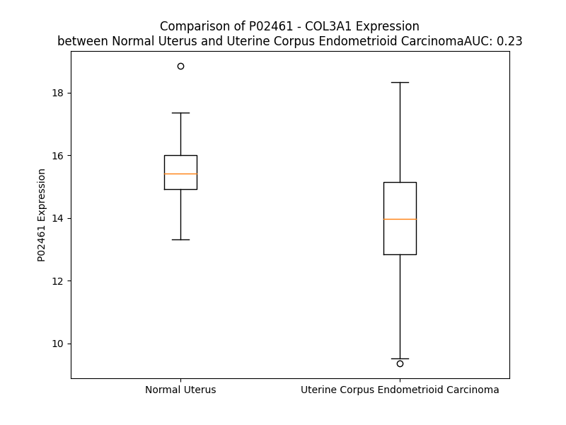

# Detailed Data for P02461

## Introduction to the Detailed Summary

### How to Interpret the Results

- **Summary & Metrics**: This section provides a quick reference to essential protein attributes, including expression changes, family classification, and biomarker applications. Regulation status (upregulated/downregulated) indicates the protein's behavior in a disease context. Some information comes from the original excel file with the proteins selected from literature, while others are derived from the analyses.
- **Expression Comparison**: A visual representation comparing protein expression between normal and disease states. It highlights significant changes in expression levels that might indicate diagnostic or therapeutic relevance. This is data coming from transcriptomics experiments and could not translate similarly to protein levels.
- **Isoform Alignment**: An interactive view of isoform alignments, revealing structural and functional differences between variants of the protein.
- **Interactors & Homologs**: Tables listing known interaction partners and homologous proteins, the more interactors and homologs, the more complex the protein is to design an antibody for.
- **Biological Assemblies**: Information about the structural arrangement of the protein in different assemblies, providing insights into its functional state but also the complexity of the protein to develop antibodies.
- **Combined Per-Residue Information**: A detailed table summarizing residue-level data. This includes predictions for epitope regions, aggregation tendencies, and modifications that might impact the protein's function. Each row corresponds to a residue in the protein, providing insights into specific sites that may be important for research or drug development.
## Summary & Metrics

- **UniProt Accession**: P02461
- **Gene Name**: COL3A1
- **Protein Name**: collagen, type III, alpha 1
- **Swiss Prot**: CO3A1_HUMAN
- **Family**: other
- **Biomarker Application**: diagnosis,efficacy,prognosis
- **Number of Isoforms**: 2
- **Regulation**: 2
- **(transcriptomics) AUC**: 0.23
- **(transcriptomics) Fold Change**: 1.10
- **(transcriptomics) Regulation**: Downregulated
- **Discotope Epitope Count**: 242
- **Max n_uniprots (Homo)**: 3
- **Max n_uniprots (Hetero)**: 4

## Expression Comparison

## Isoform Alignment

<pre style='font-size:14px; font-family:monospace;'>P02461-1 MMSFVQKGSWLLLALLHPTIILAQQEAVEGGCSHLGQSYADRDVWKPEPCQICVCDSGSVLCDDIICDDQELDCPNPEIPFGECCAVCPQPPTAPTRPPNGQGPQGPKGDPGPPGIPGRNGDPGIPGQPGSPGSPGPPGICESCPTGPQNYSPQYDSYDVKSGVAVGGLAGYPGPAGPPGPPGPPGTSGHPGSPGSPGYQGPPGEPGQAGPSGPPGPPGAIGPSGPAGKDGESGRPGRPGERGLPGPPGIKGPAGIPGFPGMKGHRGFDGRNGEKGETGAPGLKGENGLPGENGAPGPMGPRGAPGERGRPGLPGAAGARGNDGARGSDGQPGPPGPPGTAGFPGSPGAKGEVGPAGSPGSNGAPGQRGEPGPQGHAGAQGPPGPPGINGSPGGKGEMGPAGIPGAPGLMGARGPPGPAGANGAPGLRGGAGEPGKNGAKGEPGPRGERGEAGIPGVPGAKGEDGKDGSPGEPGANGLPGAAGERGAPGFRGPAGPNGIPGEKGPAGERGAPGPAGPRGAAGEPGRDGVPGGPGMRGMPGSPGGPGSDGKPGPPGSQGESGRPGPPGPSGPRGQPGVMGFPGPKGNDGAPGKNGERGGPGGPGPQGPPGKNGETGPQGPPGPTGPGGDKGDTGPPGPQGLQGLPGTGGPPGENGKPGEPGPKGDAGAPGAPGGKGDAGAPGERGPPGLAGAPGLRGGAGPPGPEGGKGAAGPPGPPGAAGTPGLQGMPGERGGLGSPGPKGDKGEPGGPGADGVPGKDGPRGPTGPIGPPGPAGQPGDKGEGGAPGLPGIAGPRGSPGERGETGPPGPAGFPGAPGQNGEPGGKGERGAPGEKGEGGPPGVAGPPGGSGPAGPPGPQGVKGERGSPGGPGAAGFPGARGLPGPPGSNGNPGPPGPSGSPGKDGPPGPAGNTGAPGSPGVSGPKGDAGQPGEKGSPGAQGPPGAPGPLGIAGITGARGLAGPPGMPGPRGSPGPQGVKGESGKPGANGLSGERGPPGPQGLPGLAGTAGEPGRDGNPGSDGLPGRDGSPGGKGDRGENGSPGAPGAPGHPGPPGPVGPAGKSGDRGESGPAGPAGAPGPAGSRGAPGPQGPRGDKGETGERGAAGIKGHRGFPGNPGAPGSPGPAGQQGAIGSPGPAGPRGPVGPSGPPGKDGTSGHPGPIGPPGPRGNRGERGSEGSPGHPGQPGPPGPPGAPGPCCGGVGAAAIAGIGGEKAGGFAPYYGDEPMDFKINTDEIMTSLKSVNGQIESLISPDGSRKNPARNCRDLKFCHPELKSGEYWVDPNQGCKLDAIKVFCNMETGETCISANPLNVPRKHWWTDSSAEKKHVWFGESMDGGFQFSYGNPELPEDVLDVHLAFLRLLSSRASQNITYHCKNSIAYMDQASGNVKKALKLMGSNEGEFKAEGNSKFTYTVLEDGCTKHTGEWSKTVFEYRTRKAVRLPIVDIAPYDIGGPDQEFGVDVGPVCFL
P02461-2 MMSFVQKGSWLLLALLHPTIILAQQEAVEGGCSHLGQSYADRDVWKPEPCQICVCDSGSVLCDDIICDDQELDCPNPEIPFGECCAVCPQPPTAPTRPPNGQGPQGPKGDPGPPGIPGRNGDPGIPGQPGSPGSPGPPGICESCPTGPQNYSPQYDSYDVKSGVAVGGLAGYPGPAGPPGPPGPPGTSGHPGSPGSPGYQGPPGEPGQAGPSGPPGPPGAIGPSGPAGKDGESGRPGRPGERGLPGPPGIKGPAGIPGFPGMKGHRGFDGRNGEKGETGAPGLKGENGLPGENGAPGPMGPRGAPGERGRPGLPGAAGARGNDGARGSDGQPGPPGPPGTAGFPGSPGAKGEVGPAGSPGSNGAPGQRGEPGPQGHAGAQGPPGPPGINGSPGGKGEMGPAGIPGAPGLMGARGPPGPAGANGAPGLRGGAGEPGKNGAKGEPGPRGERGEAGIPGVPGAKGEDGKDGSPGEPGANGLPGAAGERGAPGFRGPAGPNGIPGEKGPAGERGAPGPAGPRGAAGEPGRDGVPGGPGMRGMPGSPGGPGSDGKPGPPGSQGESGRPGPPGPSGPRGQPGVMGFPGPKGNDGAPGKNGERGGPGGPGPQGPPGKNGETGPQGPPGPTGPGGDKGDTGPPGPQGLQGLPGTGGPPGENGKPGEPGPKGDAGAPGAPGGKGDAGAPGERGPPGLAGAPGLRGGAGPPGPEGGKGAAGPPGPPGAAGTPGLQGMPGERGGLGSPGPKGDKGEPGGPGADGVPGKDGPRGPTGPIGPPGPAGQPGDKGEGGAPGLPGIAGPRGSPGERGETGPPGPAGFPGAPGQNGEPGGKGERGAPGEKGEGGPPGVAG---------------------------------------------------------------------------------------------------------------------------------------------------------------------------------------------------------------------------------------------------------------------------------------------------------------PPGKDGTSGHPGPIGPPGPRGNRGERGSEGSPGHPGQPGPPGPPGAPGPCCGGVGAAAIAGIGGEKAGGFAPYYGDEPMDFKINTDEIMTSLKSVNGQIESLISPDGSRKNPARNCRDLKFCHPELKSGEYWVDPNQGCKLDAIKVFCNMETGETCISANPLNVPRKHWWTDSSAEKKHVWFGESMDGGFQFSYGNPELPEDVLDVHLAFLRLLSSRASQNITYHCKNSIAYMDQASGNVKKALKLMGSNEGEFKAEGNSKFTYTVLEDGCTKHTGEWSKTVFEYRTRKAVRLPIVDIAPYDIGGPDQEFGVDVGPVCFL
</pre>

## Interactors

| preferredName_A   | preferredName_B   |   score |
|:------------------|:------------------|--------:|
| COL3A1            | COL1A2            |   0.999 |
| COL3A1            | COL1A1            |   0.999 |
| COL3A1            | COL5A2            |   0.998 |
| COL3A1            | LUM               |   0.986 |
| COL3A1            | COL5A1            |   0.983 |
| COL3A1            | POSTN             |   0.976 |
| COL3A1            | ITGA2             |   0.976 |
| COL3A1            | PCOLCE            |   0.976 |
| COL3A1            | FBN1              |   0.97  |
| COL3A1            | COL11A1           |   0.965 |
| COL3A1            | COL6A3            |   0.952 |
| COL3A1            | ITGB1             |   0.942 |
| COL3A1            | GP6               |   0.936 |
| COL3A1            | DCN               |   0.935 |
| COL3A1            | FN1               |   0.928 |
| COL3A1            | COL6A1            |   0.926 |
| COL3A1            | SPARC             |   0.911 |

## Homologs

| uniprot_id   | gene_id   |
|:-------------|:----------|
| H7C435       | COL3A1    |
| Q02388       | COL7A1    |
| A0A669KB28   | COL13A1   |
| A0A2R8YG47   | COL9A1    |
| P39059       | COL15A1   |
| Q8IZC6       | COL27A1   |
| A0A2R8Y760   | COL25A1   |
| Q9UMD9       | COL17A1   |
| P02458       | COL2A1    |
| A0A3B3ITQ8   | COL4A2    |
| H7BXV5       | COL18A1   |
| Q49AM6       | COL4A5    |
| D6RA95       | EDA       |
| Q07092       | COL16A1   |
| F8WDX7       | EMID1     |
| P08123       | COL1A2    |
| P02452       | COL1A1    |
| A0A384P5H7   | COL6A1    |
| A0A804HI71   | COL4A4    |
| A8MXH5       | COL4A6    |
| A6PVD9       | COL21A1   |
| P20908       | COL5A1    |
| Q14055       | COL9A2    |
| C9JMN2       | COL11A1   |
| F8WDM8       | COL24A1   |
| H7C0M5       | COL6A2    |
| Q96A83       | COL26A1   |
| P25940       | COL5A3    |
| L8EAS4       | COL23A1   |
| Q9P218       | COL20A1   |
| Q8NFW1       | COL22A1   |
| Q9Y215       | COLQ      |
| A0A0C4DFS1   | COL11A2   |
| A0A0C4DG66   | COL28A1   |
| A0A3B3IRH9   | COL5A2    |
| H7BXM4       | COL4A3    |
| Q14050       | COL9A3    |
| P02462       | COL4A1    |

## Biological Assemblies

|   Unnamed: 0 |   assembly |   n_uniprots | composition   | crystal_id   |
|-------------:|-----------:|-------------:|:--------------|:-------------|
|            0 |          1 |            3 | Homo          | 7wws         |
|            0 |          1 |            4 | Hetero        | 6fzw         |
|            0 |          1 |            3 | Homo          | 3dmw         |
|            0 |          1 |            3 | Homo          | 7xan         |
|            0 |          1 |            3 | Homo          | 7wwr         |
|            0 |          1 |            0 | Hetero        | 4gyx         |
|            0 |          1 |            4 | Hetero        | 2v53         |
|            0 |          1 |            3 | Homo          | 4ae2         |
|            0 |          1 |            3 | Homo          | 4aej         |
|            0 |          1 |            4 | Hetero        | 6fzv         |
|            0 |          1 |            1 | Homo          | 4ak3         |

## Combined Per-Residue Information

|   res | aa   |   epitope_score | epitope   |   relative_surface_accessibility |   modeling_confidence |   Aggregation | modification               | glycosylation                              |
|------:|:-----|----------------:|:----------|---------------------------------:|----------------------:|--------------:|:---------------------------|:-------------------------------------------|
|     1 | M    |         0.01681 | False     |                          0.61966 |                 35.98 |         0     | N/A                        | N/A                                        |
|     2 | M    |         0.02434 | False     |                          0.74139 |                 37.23 |         0     | N/A                        | N/A                                        |
|     3 | S    |         0.01679 | False     |                          0.22902 |                 45.35 |         0     | N/A                        | N/A                                        |
|     4 | F    |         0.03693 | False     |                          0.92691 |                 48.52 |         0     | N/A                        | N/A                                        |
|     5 | V    |         0.04902 | False     |                          0.87504 |                 54.67 |         0     | N/A                        | N/A                                        |
|     6 | Q    |         0.04576 | False     |                          0.6447  |                 49.36 |         0     | N/A                        | N/A                                        |
|     7 | K    |         0.0387  | False     |                          0.6502  |                 49.07 |         0     | N/A                        | N/A                                        |
|     8 | G    |         0.03833 | False     |                          0.35785 |                 51.46 |         0.299 | N/A                        | N/A                                        |
|     9 | S    |         0.02036 | False     |                          0.44017 |                 54.39 |         3.624 | N/A                        | N/A                                        |
|    10 | W    |         0.07349 | False     |                          0.78513 |                 50.86 |        74.63  | N/A                        | N/A                                        |
|    11 | L    |         0.04325 | False     |                          0.69565 |                 52.48 |        91.34  | N/A                        | N/A                                        |
|    12 | L    |         0.02852 | False     |                          0.70296 |                 52.64 |        93.927 | N/A                        | N/A                                        |
|    13 | L    |         0.03414 | False     |                          0.54603 |                 55.08 |        93.927 | N/A                        | N/A                                        |
|    14 | A    |         0.03052 | False     |                          0.56697 |                 58.05 |        93.813 | N/A                        | N/A                                        |
|    15 | L    |         0.01396 | False     |                          0.65545 |                 55.11 |        91.757 | N/A                        | N/A                                        |
|    16 | L    |         0.02324 | False     |                          0.50698 |                 50.87 |        77.95  | N/A                        | N/A                                        |
|    17 | H    |         0.04038 | False     |                          0.54756 |                 46.66 |         0     | N/A                        | N/A                                        |
|    18 | P    |         0.04432 | False     |                          0.44805 |                 48.53 |         0.032 | N/A                        | N/A                                        |
|    19 | T    |         0.02493 | False     |                          0.53748 |                 47.69 |        14.575 | N/A                        | N/A                                        |
|    20 | I    |         0.02633 | False     |                          0.53678 |                 46.84 |        14.983 | N/A                        | N/A                                        |
|    21 | I    |         0.03844 | False     |                          0.60596 |                 44.89 |        14.983 | N/A                        | N/A                                        |
|    22 | L    |         0.03491 | False     |                          0.73028 |                 42.24 |        14.983 | N/A                        | N/A                                        |
|    23 | A    |         0.02427 | False     |                          0.70062 |                 44.09 |        14.965 | N/A                        | N/A                                        |
|    24 | Q    |         0.04349 | False     |                          0.77665 |                 37.11 |         0.694 | N/A                        | N/A                                        |
|    25 | Q    |         0.03622 | False     |                          0.59384 |                 37.72 |         0     | N/A                        | N/A                                        |
|    26 | E    |         0.04357 | False     |                          0.77001 |                 42.44 |         0     | N/A                        | N/A                                        |
|    27 | A    |         0.03478 | False     |                          0.67119 |                 44.77 |         0     | N/A                        | N/A                                        |
|    28 | V    |         0.06868 | False     |                          0.61338 |                 49.41 |         0     | N/A                        | N/A                                        |
|    29 | E    |         0.08324 | True      |                          0.95311 |                 52.97 |         0     | N/A                        | N/A                                        |
|    30 | G    |         0.03355 | False     |                          0.17151 |                 63.2  |         0     | N/A                        | N/A                                        |
|    31 | G    |         0.04834 | False     |                          0.32916 |                 73.55 |         0     | N/A                        | N/A                                        |
|    32 | C    |         0.01533 | False     |                          0.05535 |                 89.06 |         0     | N/A                        | N/A                                        |
|    33 | S    |         0.03412 | False     |                          0.60895 |                 89.39 |         0     | N/A                        | N/A                                        |
|    34 | H    |         0.05643 | False     |                          0.20742 |                 86.72 |         0     | N/A                        | N/A                                        |
|    35 | L    |         0.11085 | True      |                          0.90307 |                 86.15 |         0     | N/A                        | N/A                                        |
|    36 | G    |         0.04835 | False     |                          0.93465 |                 84.14 |         0     | N/A                        | N/A                                        |
|    37 | Q    |         0.07764 | False     |                          0.58068 |                 85.09 |         0     | N/A                        | N/A                                        |
|    38 | S    |         0.07154 | False     |                          0.77314 |                 89.14 |         0     | N/A                        | N/A                                        |
|    39 | Y    |         0.02497 | False     |                          0.17471 |                 89.83 |         0     | N/A                        | N/A                                        |
|    40 | A    |         0.02459 | False     |                          0.44319 |                 88.9  |         0     | N/A                        | N/A                                        |
|    41 | D    |         0.08242 | True      |                          0.33085 |                 87.39 |         0     | N/A                        | N/A                                        |
|    42 | R    |         0.08849 | True      |                          0.761   |                 87.94 |         0     | N/A                        | N/A                                        |
|    43 | D    |         0.06033 | False     |                          0.37349 |                 87.51 |         0     | N/A                        | N/A                                        |
|    44 | V    |         0.03721 | False     |                          0.51245 |                 90.84 |         0     | N/A                        | N/A                                        |
|    45 | W    |         0.06636 | False     |                          0.11897 |                 92.28 |         0     | N/A                        | N/A                                        |
|    46 | K    |         0.05903 | False     |                          0.3995  |                 89.11 |         0     | N/A                        | N/A                                        |
|    47 | P    |         0.04191 | False     |                          0.29387 |                 86.72 |         0     | N/A                        | N/A                                        |
|    48 | E    |         0.07793 | False     |                          0.56145 |                 87.72 |         0     | N/A                        | N/A                                        |
|    49 | P    |         0.069   | False     |                          0.47148 |                 83.99 |         0     | N/A                        | N/A                                        |
|    50 | C    |         0.04416 | False     |                          0.40815 |                 87.93 |         0     | N/A                        | N/A                                        |
|    51 | Q    |         0.0559  | False     |                          0.23836 |                 89.74 |         0     | N/A                        | N/A                                        |
|    52 | I    |         0.02932 | False     |                          0.40403 |                 91.97 |         0     | N/A                        | N/A                                        |
|    53 | C    |         0.00704 | False     |                          0.00253 |                 93.31 |         0     | N/A                        | N/A                                        |
|    54 | V    |         0.03371 | False     |                          0.34384 |                 94.27 |         0     | N/A                        | N/A                                        |
|    55 | C    |         0.0039  | False     |                          0.00074 |                 92.45 |         0     | N/A                        | N/A                                        |
|    56 | D    |         0.0304  | False     |                          0.39262 |                 90.73 |         0     | N/A                        | N/A                                        |
|    57 | S    |         0.06702 | False     |                          0.67748 |                 85.89 |         0     | N/A                        | N/A                                        |
|    58 | G    |         0.05349 | False     |                          0.47421 |                 82.62 |         0     | N/A                        | N/A                                        |
|    59 | S    |         0.04846 | False     |                          0.48685 |                 85.36 |         0     | N/A                        | N/A                                        |
|    60 | V    |         0.04913 | False     |                          0.356   |                 92.07 |         0     | N/A                        | N/A                                        |
|    61 | L    |         0.06376 | False     |                          0.63909 |                 91.56 |         0     | N/A                        | N/A                                        |
|    62 | C    |         0.04456 | False     |                          0.39938 |                 91.62 |         0     | N/A                        | N/A                                        |
|    63 | D    |         0.08279 | True      |                          0.52641 |                 90.55 |         0     | N/A                        | N/A                                        |
|    64 | D    |         0.08223 | True      |                          0.61277 |                 88.19 |         0     | N/A                        | N/A                                        |
|    65 | I    |         0.05187 | False     |                          0.2889  |                 80.58 |         0     | N/A                        | N/A                                        |
|    66 | I    |         0.08827 | True      |                          0.90505 |                 79.38 |         0     | N/A                        | N/A                                        |
|    67 | C    |         0.03907 | False     |                          0.31674 |                 80.63 |         0     | N/A                        | N/A                                        |
|    68 | D    |         0.07665 | False     |                          0.80512 |                 69.16 |         0     | N/A                        | N/A                                        |
|    69 | D    |         0.10023 | True      |                          0.94069 |                 62.88 |         0     | N/A                        | N/A                                        |
|    70 | Q    |         0.07021 | False     |                          0.77625 |                 60.07 |         0     | N/A                        | N/A                                        |
|    71 | E    |         0.12025 | True      |                          0.9016  |                 59.95 |         0     | N/A                        | N/A                                        |
|    72 | L    |         0.09326 | True      |                          0.51002 |                 68.83 |         0     | N/A                        | N/A                                        |
|    73 | D    |         0.1123  | True      |                          0.94164 |                 71.05 |         0     | N/A                        | N/A                                        |
|    74 | C    |         0.06034 | False     |                          0.22631 |                 80.89 |         0     | N/A                        | N/A                                        |
|    75 | P    |         0.10348 | True      |                          1.08225 |                 72.76 |         0     | N/A                        | N/A                                        |
|    76 | N    |         0.08987 | True      |                          0.57864 |                 77    |         0     | N/A                        | N/A                                        |
|    77 | P    |         0.03517 | False     |                          0.44207 |                 78.88 |         0     | N/A                        | N/A                                        |
|    78 | E    |         0.09415 | True      |                          0.4794  |                 82.24 |         0     | N/A                        | N/A                                        |
|    79 | I    |         0.10678 | True      |                          0.65286 |                 82.56 |         0     | N/A                        | N/A                                        |
|    80 | P    |         0.03562 | False     |                          0.41444 |                 78.43 |         0     | N/A                        | N/A                                        |
|    81 | F    |         0.06533 | False     |                          1.13233 |                 77.3  |         0     | N/A                        | N/A                                        |
|    82 | G    |         0.0302  | False     |                          0.47649 |                 75.66 |         0     | N/A                        | N/A                                        |
|    83 | E    |         0.06464 | False     |                          0.46215 |                 83.26 |         0     | N/A                        | N/A                                        |
|    84 | C    |         0.02168 | False     |                          0.11579 |                 85.56 |         0     | N/A                        | N/A                                        |
|    85 | C    |         0.06016 | False     |                          0.29123 |                 87.14 |         0     | N/A                        | N/A                                        |
|    86 | A    |         0.06151 | False     |                          0.28547 |                 83.06 |         0     | N/A                        | N/A                                        |
|    87 | V    |         0.08509 | True      |                          0.52364 |                 84.33 |         0     | N/A                        | N/A                                        |
|    88 | C    |         0.05511 | False     |                          0.39    |                 83.3  |         0     | N/A                        | N/A                                        |
|    89 | P    |         0.14667 | True      |                          0.49333 |                 69.43 |         0     | N/A                        | N/A                                        |
|    90 | Q    |         0.08608 | True      |                          0.8259  |                 55.4  |         0     | N/A                        | N/A                                        |
|    91 | P    |         0.07508 | False     |                          0.86403 |                 46.42 |         0     | N/A                        | N/A                                        |
|    92 | P    |         0.06685 | False     |                          0.93573 |                 40.9  |         0     | N/A                        | N/A                                        |
|    93 | T    |         0.09686 | True      |                          0.97904 |                 35.21 |         0     | N/A                        | N/A                                        |
|    94 | A    |         0.06065 | False     |                          0.78741 |                 32.28 |         0     | N/A                        | N/A                                        |
|    95 | P    |         0.06408 | False     |                          0.92735 |                 34.14 |         0     | N/A                        | N/A                                        |
|    96 | T    |         0.11311 | True      |                          0.99308 |                 35.65 |         0     | N/A                        | N/A                                        |
|    97 | R    |         0.0989  | True      |                          0.87269 |                 34.28 |         0     | N/A                        | N/A                                        |
|    98 | P    |         0.09526 | True      |                          0.83243 |                 54.91 |         0     | N/A                        | N/A                                        |
|    99 | P    |         0.11069 | True      |                          0.91925 |                 42.98 |         0     | N/A                        | N/A                                        |
|   100 | N    |         0.09898 | True      |                          0.97673 |                 40    |         0     | N/A                        | N/A                                        |
|   101 | G    |         0.08086 | False     |                          0.81099 |                 39.05 |         0     | N/A                        | N/A                                        |
|   102 | Q    |         0.10318 | True      |                          0.95044 |                 33.86 |         0     | N/A                        | N/A                                        |
|   103 | G    |         0.08126 | True      |                          0.81616 |                 38.6  |         0     | N/A                        | N/A                                        |
|   104 | P    |         0.10171 | True      |                          0.96043 |                 37.7  |         0     | N/A                        | N/A                                        |
|   105 | Q    |         0.11246 | True      |                          0.94448 |                 37.94 |         0     | N/A                        | N/A                                        |
|   106 | G    |         0.11337 | True      |                          0.60883 |                 45.37 |         0     | N/A                        | N/A                                        |
|   107 | P    |         0.07325 | False     |                          0.9879  |                 44.88 |         0     | N/A                        | N/A                                        |
|   108 | K    |         0.10531 | True      |                          1.00998 |                 44.38 |         0     | N/A                        | N/A                                        |
|   109 | G    |         0.10364 | True      |                          0.72114 |                 46.92 |         0     | N/A                        | N/A                                        |
|   110 | D    |         0.11654 | True      |                          0.82286 |                 45.82 |         0     | N/A                        | N/A                                        |
|   111 | P    |         0.13527 | True      |                          0.96335 |                 56.1  |         0     | N/A                        | N/A                                        |
|   112 | G    |         0.13409 | True      |                          0.71954 |                 54.13 |         0     | N/A                        | N/A                                        |
|   113 | P    |         0.1266  | True      |                          0.90907 |                 48.37 |         0     | N/A                        | N/A                                        |
|   114 | P    |         0.10955 | True      |                          0.93504 |                 63.17 |         0     | N/A                        | N/A                                        |
|   115 | G    |         0.11684 | True      |                          0.82656 |                 56.06 |         0     | N/A                        | N/A                                        |
|   116 | I    |         0.1045  | True      |                          0.99693 |                 52.85 |         0     | N/A                        | N/A                                        |
|   117 | P    |         0.12997 | True      |                          0.84501 |                 61.73 |         0     | N/A                        | N/A                                        |
|   118 | G    |         0.09948 | True      |                          0.85042 |                 53.9  |         0     | N/A                        | N/A                                        |
|   119 | R    |         0.11879 | True      |                          0.81322 |                 52.56 |         0     | N/A                        | N/A                                        |
|   120 | N    |         0.11514 | True      |                          0.85643 |                 55.63 |         0     | N/A                        | N/A                                        |
|   121 | G    |         0.12063 | True      |                          0.83533 |                 53.47 |         0     | N/A                        | N/A                                        |
|   122 | D    |         0.10303 | True      |                          0.63307 |                 52.8  |         0     | N/A                        | N/A                                        |
|   123 | P    |         0.10586 | True      |                          0.88797 |                 56.49 |         0     | N/A                        | N/A                                        |
|   124 | G    |         0.10976 | True      |                          0.84119 |                 54.49 |         0     | N/A                        | N/A                                        |
|   125 | I    |         0.09587 | True      |                          1.00278 |                 57.14 |         0     | N/A                        | N/A                                        |
|   126 | P    |         0.12206 | True      |                          0.84302 |                 54.16 |         0     | N/A                        | N/A                                        |
|   127 | G    |         0.11882 | True      |                          0.83619 |                 51.95 |         0     | N/A                        | N/A                                        |
|   128 | Q    |         0.0977  | True      |                          0.87914 |                 53.41 |         0     | N/A                        | N/A                                        |
|   129 | P    |         0.10585 | True      |                          0.89938 |                 52.53 |         0     | N/A                        | N/A                                        |
|   130 | G    |         0.1138  | True      |                          0.8293  |                 48.63 |         0     | N/A                        | N/A                                        |
|   131 | S    |         0.07414 | False     |                          0.81351 |                 47.73 |         0     | N/A                        | N/A                                        |
|   132 | P    |         0.10168 | True      |                          0.9806  |                 53.37 |         0     | N/A                        | N/A                                        |
|   133 | G    |         0.1172  | True      |                          0.82401 |                 45.52 |         0     | N/A                        | N/A                                        |
|   134 | S    |         0.08135 | True      |                          0.81283 |                 45.08 |         0     | N/A                        | N/A                                        |
|   135 | P    |         0.0965  | True      |                          0.98358 |                 49.81 |         0     | N/A                        | N/A                                        |
|   136 | G    |         0.0719  | False     |                          0.67967 |                 43.55 |         0     | N/A                        | N/A                                        |
|   137 | P    |         0.05014 | False     |                          0.96305 |                 41.1  |         0     | N/A                        | N/A                                        |
|   138 | P    |         0.05208 | False     |                          0.99042 |                 47.12 |         0     | N/A                        | N/A                                        |
|   139 | G    |         0.04261 | False     |                          0.85992 |                 36.1  |         0     | N/A                        | N/A                                        |
|   140 | I    |         0.05938 | False     |                          1.00017 |                 35.42 |         0     | N/A                        | N/A                                        |
|   141 | C    |         0.04559 | False     |                          0.92441 |                 35.06 |         0     | N/A                        | N/A                                        |
|   142 | E    |         0.08934 | True      |                          0.82145 |                 36.19 |         0     | N/A                        | N/A                                        |
|   143 | S    |         0.06047 | False     |                          0.75719 |                 39.41 |         0     | N/A                        | N/A                                        |
|   144 | C    |         0.05122 | False     |                          0.8711  |                 32.87 |         0     | N/A                        | N/A                                        |
|   145 | P    |         0.09245 | True      |                          0.83019 |                 40.87 |         0     | N/A                        | N/A                                        |
|   146 | T    |         0.04269 | False     |                          1.00338 |                 38.08 |         0     | N/A                        | N/A                                        |
|   147 | G    |         0.04149 | False     |                          0.75673 |                 37.15 |         0     | N/A                        | N/A                                        |
|   148 | P    |         0.04584 | False     |                          0.52593 |                 40.54 |         0     | N/A                        | N/A                                        |
|   149 | Q    |         0.04974 | False     |                          0.48414 |                 34.32 |         0     | N/A                        | N/A                                        |
|   150 | N    |         0.05003 | False     |                          0.78298 |                 29.59 |         0     | N/A                        | N/A                                        |
|   151 | Y    |         0.06856 | False     |                          1.00482 |                 34.59 |         0     | N/A                        | N/A                                        |
|   152 | S    |         0.0477  | False     |                          0.73175 |                 29.44 |         0     | N/A                        | N/A                                        |
|   153 | P    |         0.04674 | False     |                          0.90049 |                 35.51 |         0     | N/A                        | N/A                                        |
|   154 | Q    |         0.04733 | False     |                          0.74612 |                 28.62 |         0     | N/A                        | N/A                                        |
|   155 | Y    |         0.07226 | False     |                          0.9467  |                 35.47 |         0     | N/A                        | N/A                                        |
|   156 | D    |         0.08233 | True      |                          0.78843 |                 29.22 |         0     | N/A                        | N/A                                        |
|   157 | S    |         0.04955 | False     |                          0.70506 |                 35.34 |         0     | N/A                        | N/A                                        |
|   158 | Y    |         0.0507  | False     |                          0.9675  |                 35.35 |         0     | N/A                        | N/A                                        |
|   159 | D    |         0.04698 | False     |                          0.85114 |                 36.67 |         0     | N/A                        | N/A                                        |
|   160 | V    |         0.0377  | False     |                          1.03119 |                 38.12 |         0     | N/A                        | N/A                                        |
|   161 | K    |         0.04636 | False     |                          0.94096 |                 32.44 |         0     | N/A                        | N/A                                        |
|   162 | S    |         0.09111 | True      |                          0.88843 |                 38.22 |         0     | N/A                        | N/A                                        |
|   163 | G    |         0.07287 | False     |                          0.8502  |                 35.74 |         0     | N/A                        | N/A                                        |
|   164 | V    |         0.07717 | False     |                          1.00719 |                 35.49 |         0.574 | N/A                        | N/A                                        |
|   165 | A    |         0.14821 | True      |                          0.86851 |                 34.07 |         0.574 | N/A                        | N/A                                        |
|   166 | V    |         0.0858  | True      |                          1.0429  |                 36.62 |         0.574 | N/A                        | N/A                                        |
|   167 | G    |         0.0495  | False     |                          0.88046 |                 37.39 |         0.574 | N/A                        | N/A                                        |
|   168 | G    |         0.05013 | False     |                          0.85758 |                 36.15 |         0.574 | N/A                        | N/A                                        |
|   169 | L    |         0.05449 | False     |                          1.16646 |                 38.42 |         0.574 | N/A                        | N/A                                        |
|   170 | A    |         0.05372 | False     |                          0.93996 |                 42.31 |         0.262 | N/A                        | N/A                                        |
|   171 | G    |         0.05274 | False     |                          0.74756 |                 35.85 |         0     | N/A                        | N/A                                        |
|   172 | Y    |         0.05469 | False     |                          1.03106 |                 42.06 |         0     | N/A                        | N/A                                        |
|   173 | P    |         0.1224  | True      |                          0.9625  |                 44.18 |         0     | 4-hydroxyproline           | N/A                                        |
|   174 | G    |         0.20192 | True      |                          0.84295 |                 39.62 |         0     | N/A                        | N/A                                        |
|   175 | P    |         0.13488 | True      |                          1.00214 |                 46.99 |         0     | N/A                        | N/A                                        |
|   176 | A    |         0.07858 | False     |                          0.98042 |                 37.98 |         0     | N/A                        | N/A                                        |
|   177 | G    |         0.09779 | True      |                          0.70049 |                 57.52 |         0     | N/A                        | N/A                                        |
|   178 | P    |         0.12055 | True      |                          0.93256 |                 52.55 |         0     | N/A                        | N/A                                        |
|   179 | P    |         0.11007 | True      |                          0.95997 |                 53.81 |         0     | 4-hydroxyproline           | N/A                                        |
|   180 | G    |         0.08791 | True      |                          0.67562 |                 56.41 |         0     | N/A                        | N/A                                        |
|   181 | P    |         0.12696 | True      |                          0.91461 |                 53.36 |         0     | N/A                        | N/A                                        |
|   182 | P    |         0.11568 | True      |                          0.9567  |                 54.55 |         0     | 4-hydroxyproline           | N/A                                        |
|   183 | G    |         0.07803 | False     |                          0.66475 |                 50.11 |         0     | N/A                        | N/A                                        |
|   184 | P    |         0.10206 | True      |                          0.92379 |                 51.79 |         0     | N/A                        | N/A                                        |
|   185 | P    |         0.09663 | True      |                          0.95657 |                 50.7  |         0     | 4-hydroxyproline           | N/A                                        |
|   186 | G    |         0.07069 | False     |                          0.82421 |                 46.08 |         0     | N/A                        | N/A                                        |
|   187 | T    |         0.07824 | False     |                          0.96644 |                 40.78 |         0     | N/A                        | N/A                                        |
|   188 | S    |         0.08593 | True      |                          0.8241  |                 44.72 |         0     | N/A                        | N/A                                        |
|   189 | G    |         0.08162 | True      |                          0.78771 |                 42.18 |         0     | N/A                        | N/A                                        |
|   190 | H    |         0.06558 | False     |                          0.97261 |                 40.57 |         0     | N/A                        | N/A                                        |
|   191 | P    |         0.12692 | True      |                          0.92622 |                 48.67 |         0     | 4-hydroxyproline           | N/A                                        |
|   192 | G    |         0.07935 | False     |                          0.77466 |                 48.13 |         0     | N/A                        | N/A                                        |
|   193 | S    |         0.06257 | False     |                          0.80878 |                 46.24 |         0     | N/A                        | N/A                                        |
|   194 | P    |         0.11373 | True      |                          0.97558 |                 49.48 |         0     | 4-hydroxyproline           | N/A                                        |
|   195 | G    |         0.08476 | True      |                          0.8252  |                 43.69 |         0     | N/A                        | N/A                                        |
|   196 | S    |         0.05522 | False     |                          0.79472 |                 41.71 |         0     | N/A                        | N/A                                        |
|   197 | P    |         0.12985 | True      |                          0.88879 |                 47.5  |         0     | 4-hydroxyproline           | N/A                                        |
|   198 | G    |         0.10286 | True      |                          0.93098 |                 36.72 |         0     | N/A                        | N/A                                        |
|   199 | Y    |         0.14576 | True      |                          1.00205 |                 39.14 |         0     | N/A                        | N/A                                        |
|   200 | Q    |         0.16638 | True      |                          0.90845 |                 46.11 |         0     | N/A                        | N/A                                        |
|   201 | G    |         0.07636 | False     |                          0.64204 |                 46.46 |         0     | N/A                        | N/A                                        |
|   202 | P    |         0.14404 | True      |                          0.89576 |                 44.26 |         0     | N/A                        | N/A                                        |
|   203 | P    |         0.16457 | True      |                          1.00529 |                 49.13 |         0     | 4-hydroxyproline           | N/A                                        |
|   204 | G    |         0.11514 | True      |                          0.88057 |                 40.19 |         0     | N/A                        | N/A                                        |
|   205 | E    |         0.12893 | True      |                          0.86927 |                 44.83 |         0     | N/A                        | N/A                                        |
|   206 | P    |         0.1962  | True      |                          0.9789  |                 49.82 |         0     | 4-hydroxyproline           | N/A                                        |
|   207 | G    |         0.09285 | True      |                          0.86799 |                 45.01 |         0     | N/A                        | N/A                                        |
|   208 | Q    |         0.12392 | True      |                          0.9045  |                 43.09 |         0     | N/A                        | N/A                                        |
|   209 | A    |         0.11806 | True      |                          1.00432 |                 50.11 |         0     | N/A                        | N/A                                        |
|   210 | G    |         0.10199 | True      |                          0.68827 |                 50.34 |         0     | N/A                        | N/A                                        |
|   211 | P    |         0.11154 | True      |                          0.98629 |                 44.01 |         0     | N/A                        | N/A                                        |
|   212 | S    |         0.13972 | True      |                          0.88454 |                 56.27 |         0     | N/A                        | N/A                                        |
|   213 | G    |         0.11152 | True      |                          0.65938 |                 49.51 |         0     | N/A                        | N/A                                        |
|   214 | P    |         0.11618 | True      |                          0.90513 |                 48.35 |         0     | N/A                        | N/A                                        |
|   215 | P    |         0.15902 | True      |                          0.97117 |                 55.52 |         0     | 4-hydroxyproline           | N/A                                        |
|   216 | G    |         0.1058  | True      |                          0.67833 |                 51.53 |         0     | N/A                        | N/A                                        |
|   217 | P    |         0.09861 | True      |                          0.89661 |                 47.29 |         0     | N/A                        | N/A                                        |
|   218 | P    |         0.1098  | True      |                          0.97528 |                 52.36 |         0     | 4-hydroxyproline           | N/A                                        |
|   219 | G    |         0.07903 | False     |                          0.81471 |                 47.91 |         0     | N/A                        | N/A                                        |
|   220 | A    |         0.05726 | False     |                          0.95089 |                 40.73 |         0     | N/A                        | N/A                                        |
|   221 | I    |         0.07114 | False     |                          0.97811 |                 46.68 |         0     | N/A                        | N/A                                        |
|   222 | G    |         0.07075 | False     |                          0.59004 |                 50.52 |         0     | N/A                        | N/A                                        |
|   223 | P    |         0.09131 | True      |                          0.96395 |                 47.11 |         0     | N/A                        | N/A                                        |
|   224 | S    |         0.06221 | False     |                          0.81171 |                 48.64 |         0     | N/A                        | N/A                                        |
|   225 | G    |         0.05961 | False     |                          0.73238 |                 49.91 |         0     | N/A                        | N/A                                        |
|   226 | P    |         0.09676 | True      |                          0.97269 |                 48.73 |         0     | N/A                        | N/A                                        |
|   227 | A    |         0.05033 | False     |                          0.91167 |                 47    |         0     | N/A                        | N/A                                        |
|   228 | G    |         0.05934 | False     |                          0.76505 |                 47.04 |         0     | N/A                        | N/A                                        |
|   229 | K    |         0.10807 | True      |                          1.02695 |                 37.69 |         0     | N/A                        | N/A                                        |
|   230 | D    |         0.11786 | True      |                          0.86297 |                 43.46 |         0     | N/A                        | N/A                                        |
|   231 | G    |         0.08084 | False     |                          0.72526 |                 47.59 |         0     | N/A                        | N/A                                        |
|   232 | E    |         0.07414 | False     |                          0.94204 |                 37.61 |         0     | N/A                        | N/A                                        |
|   233 | S    |         0.10409 | True      |                          0.84444 |                 52.15 |         0     | N/A                        | N/A                                        |
|   234 | G    |         0.08245 | True      |                          0.76431 |                 51.6  |         0     | N/A                        | N/A                                        |
|   235 | R    |         0.08586 | True      |                          0.84451 |                 43.56 |         0     | N/A                        | N/A                                        |
|   236 | P    |         0.08254 | True      |                          0.95847 |                 50.98 |         0     | 4-hydroxyproline           | N/A                                        |
|   237 | G    |         0.06971 | False     |                          0.77315 |                 45.5  |         0     | N/A                        | N/A                                        |
|   238 | R    |         0.08312 | True      |                          0.63923 |                 43.9  |         0     | N/A                        | N/A                                        |
|   239 | P    |         0.08476 | True      |                          0.99987 |                 49.18 |         0     | 4-hydroxyproline           | N/A                                        |
|   240 | G    |         0.08567 | True      |                          0.78339 |                 42.03 |         0     | N/A                        | N/A                                        |
|   241 | E    |         0.06195 | False     |                          0.60144 |                 39.98 |         0     | N/A                        | N/A                                        |
|   242 | R    |         0.11821 | True      |                          0.86727 |                 41.63 |         0     | N/A                        | N/A                                        |
|   243 | G    |         0.06077 | False     |                          0.66782 |                 43.89 |         0     | N/A                        | N/A                                        |
|   244 | L    |         0.06709 | False     |                          1.00187 |                 39.74 |         0     | N/A                        | N/A                                        |
|   245 | P    |         0.08566 | True      |                          0.70065 |                 49.32 |         0     | 4-hydroxyproline           | N/A                                        |
|   246 | G    |         0.10757 | True      |                          0.66383 |                 46.85 |         0     | N/A                        | N/A                                        |
|   247 | P    |         0.08827 | True      |                          0.84059 |                 43.44 |         0     | N/A                        | N/A                                        |
|   248 | P    |         0.08808 | True      |                          0.80089 |                 47.22 |         0     | 4-hydroxyproline           | N/A                                        |
|   249 | G    |         0.08865 | True      |                          0.85383 |                 47.59 |         0     | N/A                        | N/A                                        |
|   250 | I    |         0.08238 | True      |                          1.01439 |                 44.42 |         0     | N/A                        | N/A                                        |
|   251 | K    |         0.05963 | False     |                          0.8012  |                 42.41 |         0     | N/A                        | N/A                                        |
|   252 | G    |         0.08064 | False     |                          0.57719 |                 53.69 |         0     | N/A                        | N/A                                        |
|   253 | P    |         0.10654 | True      |                          0.9385  |                 47.21 |         0     | N/A                        | N/A                                        |
|   254 | A    |         0.0759  | False     |                          0.67427 |                 46.96 |         0     | N/A                        | N/A                                        |
|   255 | G    |         0.12207 | True      |                          0.82218 |                 46.44 |         0     | N/A                        | N/A                                        |
|   256 | I    |         0.08306 | True      |                          0.7879  |                 46.97 |         0     | N/A                        | N/A                                        |
|   257 | P    |         0.0903  | True      |                          0.86103 |                 47.35 |         0     | 4-hydroxyproline           | N/A                                        |
|   258 | G    |         0.07546 | False     |                          0.74506 |                 38.88 |         0     | N/A                        | N/A                                        |
|   259 | F    |         0.06343 | False     |                          0.83766 |                 41.68 |         0     | N/A                        | N/A                                        |
|   260 | P    |         0.11169 | True      |                          0.95656 |                 49.32 |         0     | 4-hydroxyproline           | N/A                                        |
|   261 | G    |         0.07231 | False     |                          0.78139 |                 36.7  |         0     | N/A                        | N/A                                        |
|   262 | M    |         0.10107 | True      |                          0.92397 |                 36.33 |         0     | N/A                        | N/A                                        |
|   263 | K    |         0.11392 | True      |                          0.96554 |                 42.91 |         0     | 5-hydroxylysine; alternate | O-linked (Gal...) hydroxylysine; alternate |
|   264 | G    |         0.05337 | False     |                          0.67027 |                 37.9  |         0     | N/A                        | N/A                                        |
|   265 | H    |         0.07558 | False     |                          1.01631 |                 39.17 |         0     | N/A                        | N/A                                        |
|   266 | R    |         0.07003 | False     |                          0.85005 |                 43.15 |         0     | N/A                        | N/A                                        |
|   267 | G    |         0.04994 | False     |                          0.58988 |                 37.82 |         0     | N/A                        | N/A                                        |
|   268 | F    |         0.06351 | False     |                          1.02783 |                 37.01 |         0     | N/A                        | N/A                                        |
|   269 | D    |         0.08038 | False     |                          0.77843 |                 43.84 |         0     | N/A                        | N/A                                        |
|   270 | G    |         0.08181 | True      |                          0.82809 |                 39.02 |         0     | N/A                        | N/A                                        |
|   271 | R    |         0.07421 | False     |                          0.96184 |                 36.37 |         0     | N/A                        | N/A                                        |
|   272 | N    |         0.08572 | True      |                          0.91963 |                 44.9  |         0     | N/A                        | N/A                                        |
|   273 | G    |         0.06396 | False     |                          0.78701 |                 39.48 |         0     | N/A                        | N/A                                        |
|   274 | E    |         0.06962 | False     |                          0.87092 |                 39.45 |         0     | N/A                        | N/A                                        |
|   275 | K    |         0.08695 | True      |                          1.01084 |                 39.03 |         0     | N/A                        | N/A                                        |
|   276 | G    |         0.05139 | False     |                          0.93387 |                 45.18 |         0     | N/A                        | N/A                                        |
|   277 | E    |         0.05127 | False     |                          0.88637 |                 35.71 |         0     | N/A                        | N/A                                        |
|   278 | T    |         0.05677 | False     |                          1.01384 |                 38.88 |         0     | N/A                        | N/A                                        |
|   279 | G    |         0.06119 | False     |                          0.90432 |                 39.83 |         0     | N/A                        | N/A                                        |
|   280 | A    |         0.04103 | False     |                          0.93691 |                 41.91 |         0     | N/A                        | N/A                                        |
|   281 | P    |         0.06909 | False     |                          1.01205 |                 45.14 |         0     | 4-hydroxyproline           | N/A                                        |
|   282 | G    |         0.07326 | False     |                          0.81731 |                 40.02 |         0     | N/A                        | N/A                                        |
|   283 | L    |         0.03468 | False     |                          1.17091 |                 36.85 |         0     | N/A                        | N/A                                        |
|   284 | K    |         0.06528 | False     |                          1.0327  |                 41.83 |         0     | 5-hydroxylysine            | N/A                                        |
|   285 | G    |         0.05827 | False     |                          0.79539 |                 46.68 |         0     | N/A                        | N/A                                        |
|   286 | E    |         0.05406 | False     |                          0.83466 |                 45.34 |         0     | N/A                        | N/A                                        |
|   287 | N    |         0.05217 | False     |                          0.92802 |                 43.4  |         0     | N/A                        | N/A                                        |
|   288 | G    |         0.06437 | False     |                          0.87974 |                 44.29 |         0     | N/A                        | N/A                                        |
|   289 | L    |         0.08487 | True      |                          1.03499 |                 40.59 |         0     | N/A                        | N/A                                        |
|   290 | P    |         0.09302 | True      |                          0.9961  |                 54.61 |         0     | 4-hydroxyproline           | N/A                                        |
|   291 | G    |         0.04084 | False     |                          0.84433 |                 48.58 |         0     | N/A                        | N/A                                        |
|   292 | E    |         0.08109 | True      |                          0.93986 |                 39.41 |         0     | N/A                        | N/A                                        |
|   293 | N    |         0.07413 | False     |                          0.99886 |                 44.09 |         0     | N/A                        | N/A                                        |
|   294 | G    |         0.06347 | False     |                          0.78574 |                 46.47 |         0     | N/A                        | N/A                                        |
|   295 | A    |         0.0483  | False     |                          0.95958 |                 37.93 |         0     | N/A                        | N/A                                        |
|   296 | P    |         0.08391 | True      |                          0.95538 |                 55.4  |         0     | 4-hydroxyproline           | N/A                                        |
|   297 | G    |         0.06748 | False     |                          0.74478 |                 51.5  |         0     | N/A                        | N/A                                        |
|   298 | P    |         0.07306 | False     |                          1.0836  |                 52.83 |         0     | N/A                        | N/A                                        |
|   299 | M    |         0.08415 | True      |                          1.00042 |                 41.43 |         0     | N/A                        | N/A                                        |
|   300 | G    |         0.07318 | False     |                          0.72177 |                 47.59 |         0     | N/A                        | N/A                                        |
|   301 | P    |         0.05501 | False     |                          1.05748 |                 53.93 |         0     | N/A                        | N/A                                        |
|   302 | R    |         0.09444 | True      |                          0.98952 |                 42.71 |         0     | N/A                        | N/A                                        |
|   303 | G    |         0.09022 | True      |                          0.75182 |                 43.22 |         0     | N/A                        | N/A                                        |
|   304 | A    |         0.04597 | False     |                          1.00985 |                 44.6  |         0     | N/A                        | N/A                                        |
|   305 | P    |         0.07402 | False     |                          0.99818 |                 47.74 |         0     | 4-hydroxyproline           | N/A                                        |
|   306 | G    |         0.04987 | False     |                          0.87519 |                 44.62 |         0     | N/A                        | N/A                                        |
|   307 | E    |         0.05428 | False     |                          0.92999 |                 40.4  |         0     | N/A                        | N/A                                        |
|   308 | R    |         0.07196 | False     |                          0.97731 |                 42.21 |         0     | N/A                        | N/A                                        |
|   309 | G    |         0.02846 | False     |                          0.41438 |                 49.29 |         0     | N/A                        | N/A                                        |
|   310 | R    |         0.04119 | False     |                          0.90414 |                 40.09 |         0     | N/A                        | N/A                                        |
|   311 | P    |         0.05454 | False     |                          0.45708 |                 42.12 |         0     | 4-hydroxyproline           | N/A                                        |
|   312 | G    |         0.03656 | False     |                          0.51421 |                 36.23 |         0     | N/A                        | N/A                                        |
|   313 | L    |         0.06066 | False     |                          1.07072 |                 35.06 |         0     | N/A                        | N/A                                        |
|   314 | P    |         0.03138 | False     |                          0.77638 |                 50.74 |         0     | 4-hydroxyproline           | N/A                                        |
|   315 | G    |         0.05325 | False     |                          0.92468 |                 43.87 |         0     | N/A                        | N/A                                        |
|   316 | A    |         0.03457 | False     |                          1.0126  |                 43.58 |         0     | N/A                        | N/A                                        |
|   317 | A    |         0.04577 | False     |                          1.06079 |                 48.57 |         0     | N/A                        | N/A                                        |
|   318 | G    |         0.04386 | False     |                          0.92516 |                 41.94 |         0     | N/A                        | N/A                                        |
|   319 | A    |         0.07451 | False     |                          0.95482 |                 35.17 |         0     | N/A                        | N/A                                        |
|   320 | R    |         0.10444 | True      |                          0.98409 |                 41.35 |         0     | N/A                        | N/A                                        |
|   321 | G    |         0.06285 | False     |                          0.76416 |                 42.93 |         0     | N/A                        | N/A                                        |
|   322 | N    |         0.06211 | False     |                          0.85061 |                 34.24 |         0     | N/A                        | N/A                                        |
|   323 | D    |         0.05286 | False     |                          0.89139 |                 40.08 |         0     | N/A                        | N/A                                        |
|   324 | G    |         0.05065 | False     |                          1.00148 |                 44.47 |         0     | N/A                        | N/A                                        |
|   325 | A    |         0.06595 | False     |                          0.93415 |                 33.21 |         0     | N/A                        | N/A                                        |
|   326 | R    |         0.10018 | True      |                          0.87477 |                 41.38 |         0     | N/A                        | N/A                                        |
|   327 | G    |         0.0555  | False     |                          0.80911 |                 42.05 |         0     | N/A                        | N/A                                        |
|   328 | S    |         0.04595 | False     |                          0.817   |                 34.49 |         0     | N/A                        | N/A                                        |
|   329 | D    |         0.04271 | False     |                          0.907   |                 32.7  |         0     | N/A                        | N/A                                        |
|   330 | G    |         0.05391 | False     |                          0.82717 |                 33.53 |         0     | N/A                        | N/A                                        |
|   331 | Q    |         0.07173 | False     |                          0.92307 |                 34.24 |         0     | N/A                        | N/A                                        |
|   332 | P    |         0.05796 | False     |                          0.96232 |                 40.05 |         0     | 4-hydroxyproline           | N/A                                        |
|   333 | G    |         0.06062 | False     |                          0.75418 |                 42.34 |         0     | N/A                        | N/A                                        |
|   334 | P    |         0.08558 | True      |                          0.98953 |                 42.09 |         0     | N/A                        | N/A                                        |
|   335 | P    |         0.11518 | True      |                          0.95866 |                 48.04 |         0     | 4-hydroxyproline           | N/A                                        |
|   336 | G    |         0.08968 | True      |                          0.71858 |                 45.49 |         0     | N/A                        | N/A                                        |
|   337 | P    |         0.08962 | True      |                          0.98241 |                 46.56 |         0     | N/A                        | N/A                                        |
|   338 | P    |         0.05915 | False     |                          0.91462 |                 59.84 |         0     | 4-hydroxyproline           | N/A                                        |
|   339 | G    |         0.03871 | False     |                          0.56275 |                 44.37 |         0     | N/A                        | N/A                                        |
|   340 | T    |         0.06638 | False     |                          1.01255 |                 36.25 |         0     | N/A                        | N/A                                        |
|   341 | A    |         0.04271 | False     |                          0.57965 |                 43.85 |         0     | N/A                        | N/A                                        |
|   342 | G    |         0.04793 | False     |                          0.88757 |                 42.21 |         0     | N/A                        | N/A                                        |
|   343 | F    |         0.0673  | False     |                          1.09147 |                 30.97 |         0     | N/A                        | N/A                                        |
|   344 | P    |         0.08744 | True      |                          0.92912 |                 50.88 |         0     | 4-hydroxyproline           | N/A                                        |
|   345 | G    |         0.06787 | False     |                          0.88924 |                 41.15 |         0     | N/A                        | N/A                                        |
|   346 | S    |         0.07234 | False     |                          0.83589 |                 35.43 |         0     | N/A                        | N/A                                        |
|   347 | P    |         0.06738 | False     |                          1.00811 |                 52.94 |         0     | 4-hydroxyproline           | N/A                                        |
|   348 | G    |         0.0628  | False     |                          0.95779 |                 42.9  |         0     | N/A                        | N/A                                        |
|   349 | A    |         0.04588 | False     |                          1.04226 |                 38.58 |         0     | N/A                        | N/A                                        |
|   350 | K    |         0.06845 | False     |                          0.99349 |                 35.61 |         0     | N/A                        | N/A                                        |
|   351 | G    |         0.06809 | False     |                          0.75362 |                 39.59 |         0     | N/A                        | N/A                                        |
|   352 | E    |         0.078   | False     |                          0.81721 |                 34.32 |         0     | N/A                        | N/A                                        |
|   353 | V    |         0.05386 | False     |                          0.99175 |                 33.88 |         0     | N/A                        | N/A                                        |
|   354 | G    |         0.07708 | False     |                          0.76798 |                 40.68 |         0     | N/A                        | N/A                                        |
|   355 | P    |         0.10518 | True      |                          1.04387 |                 40.09 |         0     | N/A                        | N/A                                        |
|   356 | A    |         0.04271 | False     |                          1.00015 |                 34.55 |         0     | N/A                        | N/A                                        |
|   357 | G    |         0.05002 | False     |                          0.78415 |                 36.29 |         0     | N/A                        | N/A                                        |
|   358 | S    |         0.05812 | False     |                          0.85931 |                 35.59 |         0     | N/A                        | N/A                                        |
|   359 | P    |         0.06509 | False     |                          0.95802 |                 40.9  |         0     | 4-hydroxyproline           | N/A                                        |
|   360 | G    |         0.04425 | False     |                          0.9141  |                 36.63 |         0     | N/A                        | N/A                                        |
|   361 | S    |         0.08275 | True      |                          0.89625 |                 40.36 |         0     | N/A                        | N/A                                        |
|   362 | N    |         0.05054 | False     |                          0.99797 |                 31.62 |         0     | N/A                        | N/A                                        |
|   363 | G    |         0.05462 | False     |                          0.78036 |                 38.26 |         0     | N/A                        | N/A                                        |
|   364 | A    |         0.06398 | False     |                          0.95831 |                 32.41 |         0     | N/A                        | N/A                                        |
|   365 | P    |         0.07507 | False     |                          1.01578 |                 45.45 |         0     | 4-hydroxyproline           | N/A                                        |
|   366 | G    |         0.06789 | False     |                          0.85788 |                 38.21 |         0     | N/A                        | N/A                                        |
|   367 | Q    |         0.06722 | False     |                          0.87042 |                 39.11 |         0     | N/A                        | N/A                                        |
|   368 | R    |         0.09345 | True      |                          0.94482 |                 36.06 |         0     | N/A                        | N/A                                        |
|   369 | G    |         0.04649 | False     |                          0.86249 |                 39.67 |         0     | N/A                        | N/A                                        |
|   370 | E    |         0.03836 | False     |                          0.88814 |                 39.34 |         0     | N/A                        | N/A                                        |
|   371 | P    |         0.05723 | False     |                          0.98733 |                 40.62 |         0     | 4-hydroxyproline           | N/A                                        |
|   372 | G    |         0.05055 | False     |                          0.83789 |                 45.64 |         0     | N/A                        | N/A                                        |
|   373 | P    |         0.04861 | False     |                          0.92849 |                 43.19 |         0     | N/A                        | N/A                                        |
|   374 | Q    |         0.06099 | False     |                          0.75673 |                 37.99 |         0     | N/A                        | N/A                                        |
|   375 | G    |         0.04053 | False     |                          0.72308 |                 41.38 |         0     | N/A                        | N/A                                        |
|   376 | H    |         0.05603 | False     |                          1.02181 |                 35.84 |         0     | N/A                        | N/A                                        |
|   377 | A    |         0.03889 | False     |                          1.00205 |                 35.26 |         0     | N/A                        | N/A                                        |
|   378 | G    |         0.07819 | False     |                          0.90545 |                 39.78 |         0     | N/A                        | N/A                                        |
|   379 | A    |         0.0539  | False     |                          0.96791 |                 33.37 |         0     | N/A                        | N/A                                        |
|   380 | Q    |         0.05444 | False     |                          0.97451 |                 37.78 |         0     | N/A                        | N/A                                        |
|   381 | G    |         0.0572  | False     |                          0.74418 |                 40.95 |         0     | N/A                        | N/A                                        |
|   382 | P    |         0.03721 | False     |                          0.96371 |                 47.2  |         0     | N/A                        | N/A                                        |
|   383 | P    |         0.05231 | False     |                          0.99709 |                 40.22 |         0     | 4-hydroxyproline           | N/A                                        |
|   384 | G    |         0.06044 | False     |                          0.78166 |                 37.19 |         0     | N/A                        | N/A                                        |
|   385 | P    |         0.04316 | False     |                          0.947   |                 44.87 |         0     | N/A                        | N/A                                        |
|   386 | P    |         0.0533  | False     |                          0.98166 |                 44.59 |         0     | 4-hydroxyproline           | N/A                                        |
|   387 | G    |         0.04563 | False     |                          0.85544 |                 42.57 |         0     | N/A                        | N/A                                        |
|   388 | I    |         0.04462 | False     |                          0.96206 |                 33.89 |         0     | N/A                        | N/A                                        |
|   389 | N    |         0.04765 | False     |                          0.96781 |                 33.2  |         0     | N/A                        | N/A                                        |
|   390 | G    |         0.04108 | False     |                          0.99062 |                 41.04 |         0     | N/A                        | N/A                                        |
|   391 | S    |         0.02627 | False     |                          0.77023 |                 32.57 |         0     | N/A                        | N/A                                        |
|   392 | P    |         0.03241 | False     |                          0.5847  |                 48.5  |         0     | 4-hydroxyproline           | N/A                                        |
|   393 | G    |         0.03596 | False     |                          0.76515 |                 38.11 |         0     | N/A                        | N/A                                        |
|   394 | G    |         0.0412  | False     |                          0.77073 |                 39.98 |         0     | N/A                        | N/A                                        |
|   395 | K    |         0.04919 | False     |                          0.96385 |                 36.36 |         0     | N/A                        | N/A                                        |
|   396 | G    |         0.06646 | False     |                          0.77088 |                 40.44 |         0     | N/A                        | N/A                                        |
|   397 | E    |         0.05454 | False     |                          0.94131 |                 33.78 |         0     | N/A                        | N/A                                        |
|   398 | M    |         0.10795 | True      |                          1.02111 |                 44.5  |         0     | N/A                        | N/A                                        |
|   399 | G    |         0.06373 | False     |                          0.69751 |                 48.96 |         0     | N/A                        | N/A                                        |
|   400 | P    |         0.0572  | False     |                          1.01793 |                 37.61 |         0     | N/A                        | N/A                                        |
|   401 | A    |         0.0789  | False     |                          0.96594 |                 43.55 |         0     | N/A                        | N/A                                        |
|   402 | G    |         0.04661 | False     |                          0.71692 |                 45    |         0     | N/A                        | N/A                                        |
|   403 | I    |         0.07691 | False     |                          1.01045 |                 32.35 |         0     | N/A                        | N/A                                        |
|   404 | P    |         0.08189 | True      |                          0.90937 |                 46.31 |         0     | 4-hydroxyproline           | N/A                                        |
|   405 | G    |         0.06194 | False     |                          0.64474 |                 42.63 |         0     | N/A                        | N/A                                        |
|   406 | A    |         0.05347 | False     |                          1.00558 |                 33.14 |         0     | N/A                        | N/A                                        |
|   407 | P    |         0.08549 | True      |                          0.9678  |                 42.54 |         0     | 4-hydroxyproline           | N/A                                        |
|   408 | G    |         0.09238 | True      |                          0.85095 |                 43.82 |         0     | N/A                        | N/A                                        |
|   409 | L    |         0.08077 | False     |                          1.14338 |                 32.93 |         0     | N/A                        | N/A                                        |
|   410 | M    |         0.06079 | False     |                          1.01927 |                 36.9  |         0     | N/A                        | N/A                                        |
|   411 | G    |         0.0737  | False     |                          0.81868 |                 39.27 |         0     | N/A                        | N/A                                        |
|   412 | A    |         0.04729 | False     |                          1.02664 |                 35.22 |         0     | N/A                        | N/A                                        |
|   413 | R    |         0.1156  | True      |                          0.99054 |                 40.81 |         0     | N/A                        | N/A                                        |
|   414 | G    |         0.09504 | True      |                          0.62216 |                 46.12 |         0     | N/A                        | N/A                                        |
|   415 | P    |         0.07175 | False     |                          0.9582  |                 39.95 |         0     | N/A                        | N/A                                        |
|   416 | P    |         0.08507 | True      |                          1.01525 |                 42.17 |         0     | 4-hydroxyproline           | N/A                                        |
|   417 | G    |         0.06524 | False     |                          0.69467 |                 47.78 |         0     | N/A                        | N/A                                        |
|   418 | P    |         0.07495 | False     |                          0.96245 |                 39.15 |         0     | N/A                        | N/A                                        |
|   419 | A    |         0.04134 | False     |                          0.95575 |                 36.83 |         0     | N/A                        | N/A                                        |
|   420 | G    |         0.04604 | False     |                          0.916   |                 37.4  |         0     | N/A                        | N/A                                        |
|   421 | A    |         0.04451 | False     |                          0.91199 |                 37.11 |         0     | N/A                        | N/A                                        |
|   422 | N    |         0.0864  | True      |                          0.99076 |                 32.94 |         0     | N/A                        | N/A                                        |
|   423 | G    |         0.06213 | False     |                          0.95072 |                 36.56 |         0     | N/A                        | N/A                                        |
|   424 | A    |         0.07128 | False     |                          0.97524 |                 37.16 |         0     | N/A                        | N/A                                        |
|   425 | P    |         0.0518  | False     |                          1.0086  |                 40.95 |         0     | 4-hydroxyproline           | N/A                                        |
|   426 | G    |         0.05634 | False     |                          0.78952 |                 37.57 |         0     | N/A                        | N/A                                        |
|   427 | L    |         0.06783 | False     |                          0.97772 |                 40.84 |         0     | N/A                        | N/A                                        |
|   428 | R    |         0.08591 | True      |                          0.93304 |                 37.73 |         0     | N/A                        | N/A                                        |
|   429 | G    |         0.05342 | False     |                          0.93138 |                 41.11 |         0     | N/A                        | N/A                                        |
|   430 | G    |         0.05332 | False     |                          0.90382 |                 40.11 |         0     | N/A                        | N/A                                        |
|   431 | A    |         0.04975 | False     |                          1.1364  |                 37.78 |         0     | N/A                        | N/A                                        |
|   432 | G    |         0.06167 | False     |                          0.97731 |                 44.79 |         0     | N/A                        | N/A                                        |
|   433 | E    |         0.05186 | False     |                          0.87002 |                 38.47 |         0     | N/A                        | N/A                                        |
|   434 | P    |         0.07451 | False     |                          0.97304 |                 42.37 |         0     | 4-hydroxyproline           | N/A                                        |
|   435 | G    |         0.05526 | False     |                          0.89001 |                 45.81 |         0     | N/A                        | N/A                                        |
|   436 | K    |         0.04752 | False     |                          0.94458 |                 36.99 |         0     | N/A                        | N/A                                        |
|   437 | N    |         0.06542 | False     |                          1.01105 |                 36.32 |         0     | N/A                        | N/A                                        |
|   438 | G    |         0.06293 | False     |                          1.01137 |                 43.54 |         0     | N/A                        | N/A                                        |
|   439 | A    |         0.03665 | False     |                          1.01945 |                 36.88 |         0     | N/A                        | N/A                                        |
|   440 | K    |         0.06172 | False     |                          1.01904 |                 38.36 |         0     | N/A                        | N/A                                        |
|   441 | G    |         0.06213 | False     |                          0.82949 |                 37.99 |         0     | N/A                        | N/A                                        |
|   442 | E    |         0.07119 | False     |                          0.87135 |                 41.22 |         0     | N/A                        | N/A                                        |
|   443 | P    |         0.07629 | False     |                          1.00257 |                 44.78 |         0     | 4-hydroxyproline           | N/A                                        |
|   444 | G    |         0.07846 | False     |                          0.7757  |                 38.51 |         0     | N/A                        | N/A                                        |
|   445 | P    |         0.08701 | True      |                          0.94784 |                 44.68 |         0     | N/A                        | N/A                                        |
|   446 | R    |         0.09907 | True      |                          0.88985 |                 33.17 |         0     | N/A                        | N/A                                        |
|   447 | G    |         0.07308 | False     |                          0.92414 |                 41.52 |         0     | N/A                        | N/A                                        |
|   448 | E    |         0.09084 | True      |                          0.78006 |                 32.87 |         0     | N/A                        | N/A                                        |
|   449 | R    |         0.07875 | False     |                          0.99415 |                 34.14 |         0     | N/A                        | N/A                                        |
|   450 | G    |         0.06097 | False     |                          0.89981 |                 38.44 |         0     | N/A                        | N/A                                        |
|   451 | E    |         0.06969 | False     |                          0.92023 |                 35.21 |         0     | N/A                        | N/A                                        |
|   452 | A    |         0.0518  | False     |                          1.0653  |                 33.44 |         0     | N/A                        | N/A                                        |
|   453 | G    |         0.05748 | False     |                          0.96434 |                 37.29 |         0     | N/A                        | N/A                                        |
|   454 | I    |         0.06664 | False     |                          1.0137  |                 42.63 |         0     | N/A                        | N/A                                        |
|   455 | P    |         0.06684 | False     |                          0.96937 |                 42.23 |         0     | 4-hydroxyproline           | N/A                                        |
|   456 | G    |         0.06599 | False     |                          0.87436 |                 40.28 |         0     | N/A                        | N/A                                        |
|   457 | V    |         0.02474 | False     |                          1.01904 |                 47.63 |         0     | N/A                        | N/A                                        |
|   458 | P    |         0.04918 | False     |                          0.94769 |                 48.72 |         0     | 4-hydroxyproline           | N/A                                        |
|   459 | G    |         0.05606 | False     |                          0.84887 |                 42.57 |         0     | N/A                        | N/A                                        |
|   460 | A    |         0.04957 | False     |                          0.98301 |                 38.8  |         0     | N/A                        | N/A                                        |
|   461 | K    |         0.0446  | False     |                          0.89731 |                 44.13 |         0     | N/A                        | N/A                                        |
|   462 | G    |         0.04868 | False     |                          0.79752 |                 45.37 |         0     | N/A                        | N/A                                        |
|   463 | E    |         0.04882 | False     |                          0.68906 |                 37.15 |         0     | N/A                        | N/A                                        |
|   464 | D    |         0.04589 | False     |                          0.94098 |                 44.55 |         0     | N/A                        | N/A                                        |
|   465 | G    |         0.05585 | False     |                          0.86991 |                 44.93 |         0     | N/A                        | N/A                                        |
|   466 | K    |         0.05439 | False     |                          0.91204 |                 33.16 |         0     | N/A                        | N/A                                        |
|   467 | D    |         0.06011 | False     |                          0.86531 |                 32.21 |         0     | N/A                        | N/A                                        |
|   468 | G    |         0.05144 | False     |                          1.00554 |                 39.77 |         0     | N/A                        | N/A                                        |
|   469 | S    |         0.04645 | False     |                          0.84175 |                 44.06 |         0     | N/A                        | N/A                                        |
|   470 | P    |         0.04946 | False     |                          0.99724 |                 43.68 |         0     | 4-hydroxyproline           | N/A                                        |
|   471 | G    |         0.05012 | False     |                          0.89466 |                 38.59 |         0     | N/A                        | N/A                                        |
|   472 | E    |         0.05068 | False     |                          0.8918  |                 48.04 |         0     | N/A                        | N/A                                        |
|   473 | P    |         0.03826 | False     |                          0.99882 |                 44.74 |         0     | 4-hydroxyproline           | N/A                                        |
|   474 | G    |         0.05103 | False     |                          0.91862 |                 41.49 |         0     | N/A                        | N/A                                        |
|   475 | A    |         0.02717 | False     |                          0.92731 |                 36.72 |         0     | N/A                        | N/A                                        |
|   476 | N    |         0.05109 | False     |                          1.0359  |                 38.63 |         0     | N/A                        | N/A                                        |
|   477 | G    |         0.05848 | False     |                          0.82167 |                 40.36 |         0     | N/A                        | N/A                                        |
|   478 | L    |         0.03389 | False     |                          1.07941 |                 33.85 |         0     | N/A                        | N/A                                        |
|   479 | P    |         0.05875 | False     |                          0.99576 |                 45.2  |         0     | 4-hydroxyproline           | N/A                                        |
|   480 | G    |         0.05658 | False     |                          0.91084 |                 42.12 |         0     | N/A                        | N/A                                        |
|   481 | A    |         0.04483 | False     |                          1.02161 |                 37.25 |         0     | N/A                        | N/A                                        |
|   482 | A    |         0.03987 | False     |                          1.05142 |                 34.58 |         0     | N/A                        | N/A                                        |
|   483 | G    |         0.04792 | False     |                          0.91432 |                 44.19 |         0     | N/A                        | N/A                                        |
|   484 | E    |         0.05066 | False     |                          0.74616 |                 34.26 |         0     | N/A                        | N/A                                        |
|   485 | R    |         0.06449 | False     |                          0.89022 |                 30.54 |         0     | N/A                        | N/A                                        |
|   486 | G    |         0.0687  | False     |                          0.78735 |                 38.63 |         0     | N/A                        | N/A                                        |
|   487 | A    |         0.05771 | False     |                          1.03839 |                 48.95 |         0     | N/A                        | N/A                                        |
|   488 | P    |         0.06984 | False     |                          0.9684  |                 42.04 |         0     | 4-hydroxyproline           | N/A                                        |
|   489 | G    |         0.07132 | False     |                          0.90393 |                 37.57 |         0     | N/A                        | N/A                                        |
|   490 | F    |         0.06758 | False     |                          1.09218 |                 32.15 |         0     | N/A                        | N/A                                        |
|   491 | R    |         0.10072 | True      |                          0.9588  |                 39    |         0     | N/A                        | N/A                                        |
|   492 | G    |         0.05077 | False     |                          0.66929 |                 48.02 |         0     | N/A                        | N/A                                        |
|   493 | P    |         0.06893 | False     |                          1.0138  |                 44.93 |         0     | N/A                        | N/A                                        |
|   494 | A    |         0.04769 | False     |                          1.02603 |                 42.67 |         0     | N/A                        | N/A                                        |
|   495 | G    |         0.07496 | False     |                          0.82436 |                 43.42 |         0     | N/A                        | N/A                                        |
|   496 | P    |         0.09895 | True      |                          0.9979  |                 46.29 |         0     | N/A                        | N/A                                        |
|   497 | N    |         0.05626 | False     |                          0.99606 |                 38.88 |         0     | N/A                        | N/A                                        |
|   498 | G    |         0.05689 | False     |                          0.81061 |                 38.11 |         0     | N/A                        | N/A                                        |
|   499 | I    |         0.06327 | False     |                          1.01532 |                 44.17 |         0     | N/A                        | N/A                                        |
|   500 | P    |         0.04901 | False     |                          0.98149 |                 49.53 |         0     | 4-hydroxyproline           | N/A                                        |
|   501 | G    |         0.03891 | False     |                          0.83798 |                 41.02 |         0     | N/A                        | N/A                                        |
|   502 | E    |         0.04688 | False     |                          0.95347 |                 44.1  |         0     | N/A                        | N/A                                        |
|   503 | K    |         0.05195 | False     |                          0.97342 |                 39.72 |         0     | N/A                        | N/A                                        |
|   504 | G    |         0.04804 | False     |                          0.87355 |                 46.87 |         0     | N/A                        | N/A                                        |
|   505 | P    |         0.06412 | False     |                          0.93607 |                 46.69 |         0     | N/A                        | N/A                                        |
|   506 | A    |         0.03506 | False     |                          1.0256  |                 42.35 |         0     | N/A                        | N/A                                        |
|   507 | G    |         0.04136 | False     |                          0.92608 |                 43.22 |         0     | N/A                        | N/A                                        |
|   508 | E    |         0.06888 | False     |                          0.73351 |                 35.54 |         0     | N/A                        | N/A                                        |
|   509 | R    |         0.05014 | False     |                          0.88413 |                 35.41 |         0     | N/A                        | N/A                                        |
|   510 | G    |         0.05679 | False     |                          0.77278 |                 39.9  |         0     | N/A                        | N/A                                        |
|   511 | A    |         0.03661 | False     |                          0.9786  |                 36.36 |         0     | N/A                        | N/A                                        |
|   512 | P    |         0.06338 | False     |                          1.00564 |                 41.41 |         0     | 4-hydroxyproline           | N/A                                        |
|   513 | G    |         0.04488 | False     |                          0.83821 |                 49.67 |         0     | N/A                        | N/A                                        |
|   514 | P    |         0.05614 | False     |                          0.95538 |                 46.41 |         0     | N/A                        | N/A                                        |
|   515 | A    |         0.05615 | False     |                          0.95505 |                 39.84 |         0     | N/A                        | N/A                                        |
|   516 | G    |         0.06331 | False     |                          0.81958 |                 50.42 |         0     | N/A                        | N/A                                        |
|   517 | P    |         0.05137 | False     |                          0.93905 |                 46.18 |         0     | N/A                        | N/A                                        |
|   518 | R    |         0.06066 | False     |                          0.95685 |                 36.34 |         0     | N/A                        | N/A                                        |
|   519 | G    |         0.06181 | False     |                          0.72874 |                 43.35 |         0     | N/A                        | N/A                                        |
|   520 | A    |         0.05549 | False     |                          1.0002  |                 39.53 |         0     | N/A                        | N/A                                        |
|   521 | A    |         0.0496  | False     |                          1.02036 |                 38.52 |         0     | N/A                        | N/A                                        |
|   522 | G    |         0.05429 | False     |                          0.9158  |                 42.8  |         0     | N/A                        | N/A                                        |
|   523 | E    |         0.04908 | False     |                          0.87381 |                 34.59 |         0     | N/A                        | N/A                                        |
|   524 | P    |         0.0454  | False     |                          0.93353 |                 44.81 |         0     | 4-hydroxyproline           | N/A                                        |
|   525 | G    |         0.06809 | False     |                          0.94241 |                 43.77 |         0     | N/A                        | N/A                                        |
|   526 | R    |         0.06452 | False     |                          0.885   |                 39.01 |         0     | N/A                        | N/A                                        |
|   527 | D    |         0.06234 | False     |                          0.80354 |                 36.43 |         0     | N/A                        | N/A                                        |
|   528 | G    |         0.07657 | False     |                          0.98526 |                 40.55 |         0     | N/A                        | N/A                                        |
|   529 | V    |         0.05388 | False     |                          1.03811 |                 39    |         0     | N/A                        | N/A                                        |
|   530 | P    |         0.06557 | False     |                          0.96693 |                 44.95 |         0     | 4-hydroxyproline           | N/A                                        |
|   531 | G    |         0.05371 | False     |                          0.95858 |                 40.86 |         0     | N/A                        | N/A                                        |
|   532 | G    |         0.04608 | False     |                          0.88771 |                 40.07 |         0     | N/A                        | N/A                                        |
|   533 | P    |         0.06467 | False     |                          1.07067 |                 43.69 |         0     | 4-hydroxyproline           | N/A                                        |
|   534 | G    |         0.0638  | False     |                          0.87883 |                 38.88 |         0     | N/A                        | N/A                                        |
|   535 | M    |         0.05675 | False     |                          0.98378 |                 37.27 |         0     | N/A                        | N/A                                        |
|   536 | R    |         0.09213 | True      |                          0.9555  |                 36.82 |         0     | N/A                        | N/A                                        |
|   537 | G    |         0.04143 | False     |                          0.7223  |                 44.81 |         0     | N/A                        | N/A                                        |
|   538 | M    |         0.05032 | False     |                          0.98078 |                 38.34 |         0     | N/A                        | N/A                                        |
|   539 | P    |         0.04626 | False     |                          0.94088 |                 45.59 |         0     | 4-hydroxyproline           | N/A                                        |
|   540 | G    |         0.05084 | False     |                          0.9139  |                 36.94 |         0     | N/A                        | N/A                                        |
|   541 | S    |         0.03847 | False     |                          0.86658 |                 33.21 |         0     | N/A                        | N/A                                        |
|   542 | P    |         0.07562 | False     |                          0.99491 |                 45.25 |         0     | 4-hydroxyproline           | N/A                                        |
|   543 | G    |         0.04915 | False     |                          0.89463 |                 35.92 |         0     | N/A                        | N/A                                        |
|   544 | G    |         0.05134 | False     |                          0.79788 |                 38.41 |         0     | N/A                        | N/A                                        |
|   545 | P    |         0.05502 | False     |                          0.78588 |                 46.07 |         0     | 4-hydroxyproline           | N/A                                        |
|   546 | G    |         0.03688 | False     |                          0.43759 |                 41.07 |         0     | N/A                        | N/A                                        |
|   547 | S    |         0.02504 | False     |                          0.14301 |                 40.21 |         0     | N/A                        | N/A                                        |
|   548 | D    |         0.02401 | False     |                          0.24036 |                 39.91 |         0     | N/A                        | N/A                                        |
|   549 | G    |         0.03582 | False     |                          0.70517 |                 41.29 |         0     | N/A                        | N/A                                        |
|   550 | K    |         0.04903 | False     |                          1.01315 |                 40.23 |         0     | N/A                        | N/A                                        |
|   551 | P    |         0.05157 | False     |                          0.96651 |                 43.55 |         0     | 4-hydroxyproline           | N/A                                        |
|   552 | G    |         0.04449 | False     |                          0.79801 |                 46.62 |         0     | N/A                        | N/A                                        |
|   553 | P    |         0.06294 | False     |                          1.00692 |                 44.22 |         0     | N/A                        | N/A                                        |
|   554 | P    |         0.04271 | False     |                          0.94738 |                 44.97 |         0     | 4-hydroxyproline           | N/A                                        |
|   555 | G    |         0.05542 | False     |                          0.79059 |                 40.45 |         0     | N/A                        | N/A                                        |
|   556 | S    |         0.06295 | False     |                          0.91467 |                 35.3  |         0     | N/A                        | N/A                                        |
|   557 | Q    |         0.06297 | False     |                          0.92443 |                 39.01 |         0     | N/A                        | N/A                                        |
|   558 | G    |         0.04524 | False     |                          0.82242 |                 39.68 |         0     | N/A                        | N/A                                        |
|   559 | E    |         0.05809 | False     |                          0.90799 |                 31.18 |         0     | N/A                        | N/A                                        |
|   560 | S    |         0.03908 | False     |                          0.81101 |                 31.88 |         0     | N/A                        | N/A                                        |
|   561 | G    |         0.05373 | False     |                          0.96714 |                 33.56 |         0     | N/A                        | N/A                                        |
|   562 | R    |         0.05389 | False     |                          0.96182 |                 36.72 |         0     | N/A                        | N/A                                        |
|   563 | P    |         0.06986 | False     |                          0.97711 |                 39.53 |         0     | 4-hydroxyproline           | N/A                                        |
|   564 | G    |         0.03748 | False     |                          0.80562 |                 47.74 |         0     | N/A                        | N/A                                        |
|   565 | P    |         0.04843 | False     |                          0.98758 |                 43.45 |         0     | N/A                        | N/A                                        |
|   566 | P    |         0.04634 | False     |                          0.98633 |                 41.1  |         0     | 4-hydroxyproline           | N/A                                        |
|   567 | G    |         0.05371 | False     |                          0.79463 |                 45.63 |         0     | N/A                        | N/A                                        |
|   568 | P    |         0.07718 | False     |                          0.94349 |                 51.67 |         0     | N/A                        | N/A                                        |
|   569 | S    |         0.05892 | False     |                          0.89564 |                 39.65 |         0     | N/A                        | N/A                                        |
|   570 | G    |         0.07331 | False     |                          0.89416 |                 46.93 |         0     | N/A                        | N/A                                        |
|   571 | P    |         0.05104 | False     |                          0.95706 |                 41.94 |         0     | N/A                        | N/A                                        |
|   572 | R    |         0.06812 | False     |                          0.94648 |                 38.61 |         0     | N/A                        | N/A                                        |
|   573 | G    |         0.0357  | False     |                          0.80817 |                 42.49 |         0     | N/A                        | N/A                                        |
|   574 | Q    |         0.05924 | False     |                          0.89071 |                 33.97 |         0     | N/A                        | N/A                                        |
|   575 | P    |         0.03658 | False     |                          0.68996 |                 40.48 |         0     | 4-hydroxyproline           | N/A                                        |
|   576 | G    |         0.04041 | False     |                          0.51121 |                 37.09 |         0     | N/A                        | N/A                                        |
|   577 | V    |         0.02587 | False     |                          0.81114 |                 33.82 |         0     | N/A                        | N/A                                        |
|   578 | M    |         0.03803 | False     |                          1.00142 |                 32.5  |         0     | N/A                        | N/A                                        |
|   579 | G    |         0.03338 | False     |                          0.54004 |                 34.67 |         0     | N/A                        | N/A                                        |
|   580 | F    |         0.05865 | False     |                          1.03502 |                 30.87 |         0     | N/A                        | N/A                                        |
|   581 | P    |         0.0469  | False     |                          0.91406 |                 40.76 |         0     | 4-hydroxyproline           | N/A                                        |
|   582 | G    |         0.04054 | False     |                          0.75655 |                 46.04 |         0     | N/A                        | N/A                                        |
|   583 | P    |         0.04384 | False     |                          0.92541 |                 41.2  |         0     | N/A                        | N/A                                        |
|   584 | K    |         0.03932 | False     |                          0.91009 |                 36.63 |         0     | N/A                        | N/A                                        |
|   585 | G    |         0.06882 | False     |                          0.81605 |                 39.66 |         0     | N/A                        | N/A                                        |
|   586 | N    |         0.10863 | True      |                          0.89932 |                 28.08 |         0     | N/A                        | N/A                                        |
|   587 | D    |         0.03656 | False     |                          0.80805 |                 38.29 |         0     | N/A                        | N/A                                        |
|   588 | G    |         0.0569  | False     |                          0.68016 |                 37.95 |         0     | N/A                        | N/A                                        |
|   589 | A    |         0.04787 | False     |                          0.93544 |                 42.26 |         0     | N/A                        | N/A                                        |
|   590 | P    |         0.04559 | False     |                          0.90947 |                 44.54 |         0     | 4-hydroxyproline           | N/A                                        |
|   591 | G    |         0.05795 | False     |                          0.70814 |                 38.53 |         0     | N/A                        | N/A                                        |
|   592 | K    |         0.07191 | False     |                          1.00624 |                 46.64 |         0     | N/A                        | N/A                                        |
|   593 | N    |         0.04623 | False     |                          1.0195  |                 31.91 |         0     | N/A                        | N/A                                        |
|   594 | G    |         0.04581 | False     |                          0.74455 |                 35.6  |         0     | N/A                        | N/A                                        |
|   595 | E    |         0.05694 | False     |                          0.91442 |                 29.2  |         0     | N/A                        | N/A                                        |
|   596 | R    |         0.06796 | False     |                          0.96983 |                 39.52 |         0     | N/A                        | N/A                                        |
|   597 | G    |         0.06339 | False     |                          0.86533 |                 34.74 |         0     | N/A                        | N/A                                        |
|   598 | G    |         0.102   | True      |                          0.87176 |                 37.14 |         0     | N/A                        | N/A                                        |
|   599 | P    |         0.07241 | False     |                          1.07669 |                 39.11 |         0     | 4-hydroxyproline           | N/A                                        |
|   600 | G    |         0.05424 | False     |                          0.93121 |                 32.31 |         0     | N/A                        | N/A                                        |
|   601 | G    |         0.04588 | False     |                          0.55245 |                 35.35 |         0     | N/A                        | N/A                                        |
|   602 | P    |         0.04877 | False     |                          0.75836 |                 39.9  |         0     | 4-hydroxyproline           | N/A                                        |
|   603 | G    |         0.02467 | False     |                          0.35776 |                 48.15 |         0     | N/A                        | N/A                                        |
|   604 | P    |         0.02691 | False     |                          0.65099 |                 40.59 |         0     | N/A                        | N/A                                        |
|   605 | Q    |         0.04907 | False     |                          0.70925 |                 36.58 |         0     | N/A                        | N/A                                        |
|   606 | G    |         0.05376 | False     |                          0.74607 |                 52.25 |         0     | N/A                        | N/A                                        |
|   607 | P    |         0.04315 | False     |                          0.97466 |                 36.78 |         0     | N/A                        | N/A                                        |
|   608 | P    |         0.04681 | False     |                          0.98279 |                 39.81 |         0     | 4-hydroxyproline           | N/A                                        |
|   609 | G    |         0.07411 | False     |                          0.78615 |                 36.09 |         0     | N/A                        | N/A                                        |
|   610 | K    |         0.06223 | False     |                          0.96438 |                 29.06 |         0     | N/A                        | N/A                                        |
|   611 | N    |         0.05349 | False     |                          1.00727 |                 31.57 |         0     | N/A                        | N/A                                        |
|   612 | G    |         0.05343 | False     |                          0.77626 |                 34.91 |         0     | N/A                        | N/A                                        |
|   613 | E    |         0.07223 | False     |                          0.91257 |                 32.8  |         0     | N/A                        | N/A                                        |
|   614 | T    |         0.04525 | False     |                          0.97306 |                 38.78 |         0     | N/A                        | N/A                                        |
|   615 | G    |         0.04132 | False     |                          0.72157 |                 48.3  |         0     | N/A                        | N/A                                        |
|   616 | P    |         0.0706  | False     |                          0.96962 |                 41.25 |         0     | N/A                        | N/A                                        |
|   617 | Q    |         0.06969 | False     |                          0.88151 |                 37.97 |         0     | N/A                        | N/A                                        |
|   618 | G    |         0.07707 | False     |                          0.6957  |                 41.86 |         0     | N/A                        | N/A                                        |
|   619 | P    |         0.05833 | False     |                          0.97194 |                 35.99 |         0     | N/A                        | N/A                                        |
|   620 | P    |         0.05359 | False     |                          0.90817 |                 40.24 |         0     | 4-hydroxyproline           | N/A                                        |
|   621 | G    |         0.03632 | False     |                          0.53139 |                 50.26 |         0     | N/A                        | N/A                                        |
|   622 | P    |         0.03735 | False     |                          0.45213 |                 36.29 |         0     | N/A                        | N/A                                        |
|   623 | T    |         0.02775 | False     |                          0.56895 |                 34.74 |         0     | N/A                        | N/A                                        |
|   624 | G    |         0.05062 | False     |                          0.85805 |                 34.94 |         0     | N/A                        | N/A                                        |
|   625 | P    |         0.05609 | False     |                          1.03735 |                 36.88 |         0     | N/A                        | N/A                                        |
|   626 | G    |         0.03468 | False     |                          0.89615 |                 42.24 |         0     | N/A                        | N/A                                        |
|   627 | G    |         0.0442  | False     |                          0.79229 |                 39.09 |         0     | N/A                        | N/A                                        |
|   628 | D    |         0.06212 | False     |                          0.85714 |                 29.7  |         0     | N/A                        | N/A                                        |
|   629 | K    |         0.04365 | False     |                          0.92303 |                 31.25 |         0     | N/A                        | N/A                                        |
|   630 | G    |         0.0658  | False     |                          0.72415 |                 38.6  |         0     | N/A                        | N/A                                        |
|   631 | D    |         0.05279 | False     |                          0.8559  |                 33.24 |         0     | N/A                        | N/A                                        |
|   632 | T    |         0.05155 | False     |                          0.95199 |                 39.74 |         0     | N/A                        | N/A                                        |
|   633 | G    |         0.05536 | False     |                          0.69773 |                 38.99 |         0     | N/A                        | N/A                                        |
|   634 | P    |         0.07886 | False     |                          0.95171 |                 45.74 |         0     | N/A                        | N/A                                        |
|   635 | P    |         0.06423 | False     |                          0.8928  |                 37.88 |         0     | 4-hydroxyproline           | N/A                                        |
|   636 | G    |         0.04448 | False     |                          0.96745 |                 38.69 |         0     | N/A                        | N/A                                        |
|   637 | P    |         0.0491  | False     |                          0.85963 |                 39.36 |         0     | N/A                        | N/A                                        |
|   638 | Q    |         0.03926 | False     |                          0.74561 |                 32.47 |         0     | N/A                        | N/A                                        |
|   639 | G    |         0.04765 | False     |                          0.8024  |                 34.94 |         0     | N/A                        | N/A                                        |
|   640 | L    |         0.05077 | False     |                          1.12313 |                 30.22 |         0     | N/A                        | N/A                                        |
|   641 | Q    |         0.05433 | False     |                          0.94597 |                 36.31 |         0     | N/A                        | N/A                                        |
|   642 | G    |         0.05418 | False     |                          0.80165 |                 37.08 |         0     | N/A                        | N/A                                        |
|   643 | L    |         0.0348  | False     |                          0.81397 |                 32.6  |         0     | N/A                        | N/A                                        |
|   644 | P    |         0.0658  | False     |                          0.84163 |                 41.5  |         0     | 4-hydroxyproline           | N/A                                        |
|   645 | G    |         0.02917 | False     |                          0.52741 |                 39.55 |         0     | N/A                        | N/A                                        |
|   646 | T    |         0.03999 | False     |                          0.98341 |                 32.62 |         0     | N/A                        | N/A                                        |
|   647 | G    |         0.05702 | False     |                          1.00318 |                 46.26 |         0     | N/A                        | N/A                                        |
|   648 | G    |         0.04219 | False     |                          0.86187 |                 38.98 |         0     | N/A                        | N/A                                        |
|   649 | P    |         0.07111 | False     |                          0.99603 |                 39.93 |         0     | N/A                        | N/A                                        |
|   650 | P    |         0.04138 | False     |                          0.98113 |                 52.29 |         0     | 4-hydroxyproline           | N/A                                        |
|   651 | G    |         0.0459  | False     |                          0.82225 |                 39.48 |         0     | N/A                        | N/A                                        |
|   652 | E    |         0.05893 | False     |                          0.89878 |                 36.47 |         0     | N/A                        | N/A                                        |
|   653 | N    |         0.03148 | False     |                          0.66569 |                 35.85 |         0     | N/A                        | N/A                                        |
|   654 | G    |         0.04116 | False     |                          0.79957 |                 40.37 |         0     | N/A                        | N/A                                        |
|   655 | K    |         0.05669 | False     |                          1.0244  |                 33.38 |         0     | N/A                        | N/A                                        |
|   656 | P    |         0.05501 | False     |                          0.98945 |                 48.27 |         0     | 4-hydroxyproline           | N/A                                        |
|   657 | G    |         0.05806 | False     |                          0.76461 |                 35.47 |         0     | N/A                        | N/A                                        |
|   658 | E    |         0.05944 | False     |                          0.88925 |                 33.09 |         0     | N/A                        | N/A                                        |
|   659 | P    |         0.06254 | False     |                          0.92408 |                 39.67 |         0     | 4-hydroxyproline           | N/A                                        |
|   660 | G    |         0.049   | False     |                          0.83402 |                 45.05 |         0     | N/A                        | N/A                                        |
|   661 | P    |         0.05077 | False     |                          1.06058 |                 39.97 |         0     | 4-hydroxyproline           | N/A                                        |
|   662 | K    |         0.04763 | False     |                          0.94457 |                 46.75 |         0     | N/A                        | N/A                                        |
|   663 | G    |         0.05764 | False     |                          0.75796 |                 43.62 |         0     | N/A                        | N/A                                        |
|   664 | D    |         0.06334 | False     |                          0.80986 |                 36.61 |         0     | N/A                        | N/A                                        |
|   665 | A    |         0.03793 | False     |                          0.96469 |                 40.34 |         0     | N/A                        | N/A                                        |
|   666 | G    |         0.05072 | False     |                          0.88927 |                 37.61 |         0     | N/A                        | N/A                                        |
|   667 | A    |         0.06517 | False     |                          0.95878 |                 38.87 |         0     | N/A                        | N/A                                        |
|   668 | P    |         0.05749 | False     |                          1.00158 |                 44.19 |         0     | 4-hydroxyproline           | N/A                                        |
|   669 | G    |         0.06371 | False     |                          0.89006 |                 37.09 |         0     | N/A                        | N/A                                        |
|   670 | A    |         0.06056 | False     |                          0.98115 |                 35.37 |         0     | N/A                        | N/A                                        |
|   671 | P    |         0.05946 | False     |                          0.9961  |                 43.04 |         0     | 4-hydroxyproline           | N/A                                        |
|   672 | G    |         0.05277 | False     |                          0.96658 |                 33.28 |         0     | N/A                        | N/A                                        |
|   673 | G    |         0.05932 | False     |                          1.03669 |                 38.04 |         0     | N/A                        | N/A                                        |
|   674 | K    |         0.04537 | False     |                          0.98919 |                 37.55 |         0     | N/A                        | N/A                                        |
|   675 | G    |         0.05186 | False     |                          0.71213 |                 38.63 |         0     | N/A                        | N/A                                        |
|   676 | D    |         0.06602 | False     |                          0.89482 |                 32.63 |         0     | N/A                        | N/A                                        |
|   677 | A    |         0.05272 | False     |                          1.05323 |                 42.56 |         0     | N/A                        | N/A                                        |
|   678 | G    |         0.0652  | False     |                          0.92761 |                 36.15 |         0     | N/A                        | N/A                                        |
|   679 | A    |         0.04775 | False     |                          0.97886 |                 31.34 |         0     | N/A                        | N/A                                        |
|   680 | P    |         0.04323 | False     |                          1.0331  |                 52.52 |         0     | 4-hydroxyproline           | N/A                                        |
|   681 | G    |         0.04868 | False     |                          0.81059 |                 33.48 |         0     | N/A                        | N/A                                        |
|   682 | E    |         0.06426 | False     |                          0.96392 |                 36.33 |         0     | N/A                        | N/A                                        |
|   683 | R    |         0.04088 | False     |                          0.92515 |                 30.64 |         0     | N/A                        | N/A                                        |
|   684 | G    |         0.04893 | False     |                          0.77671 |                 37.78 |         0     | N/A                        | N/A                                        |
|   685 | P    |         0.04662 | False     |                          0.96417 |                 40.72 |         0     | N/A                        | N/A                                        |
|   686 | P    |         0.06989 | False     |                          0.9168  |                 42.63 |         0     | 4-hydroxyproline           | N/A                                        |
|   687 | G    |         0.03686 | False     |                          0.84057 |                 34.59 |         0     | N/A                        | N/A                                        |
|   688 | L    |         0.07482 | False     |                          1.10518 |                 34.89 |         0     | N/A                        | N/A                                        |
|   689 | A    |         0.04883 | False     |                          0.97795 |                 36.81 |         0     | N/A                        | N/A                                        |
|   690 | G    |         0.04711 | False     |                          0.90229 |                 41.81 |         0     | N/A                        | N/A                                        |
|   691 | A    |         0.05764 | False     |                          0.94352 |                 36.68 |         0     | N/A                        | N/A                                        |
|   692 | P    |         0.05611 | False     |                          0.99682 |                 48.93 |         0     | 4-hydroxyproline           | N/A                                        |
|   693 | G    |         0.04304 | False     |                          0.69026 |                 39.87 |         0     | N/A                        | N/A                                        |
|   694 | L    |         0.03845 | False     |                          0.80731 |                 37.49 |         0     | N/A                        | N/A                                        |
|   695 | R    |         0.04264 | False     |                          0.54826 |                 36.94 |         0     | N/A                        | N/A                                        |
|   696 | G    |         0.02937 | False     |                          0.45519 |                 40.77 |         0     | N/A                        | N/A                                        |
|   697 | G    |         0.05639 | False     |                          0.9642  |                 38.29 |         0     | N/A                        | N/A                                        |
|   698 | A    |         0.04554 | False     |                          1.07662 |                 38.36 |         0     | N/A                        | N/A                                        |
|   699 | G    |         0.06631 | False     |                          0.85015 |                 46.01 |         0     | N/A                        | N/A                                        |
|   700 | P    |         0.07158 | False     |                          0.92569 |                 38.51 |         0     | N/A                        | N/A                                        |
|   701 | P    |         0.05362 | False     |                          0.97194 |                 48.17 |         0     | 4-hydroxyproline           | N/A                                        |
|   702 | G    |         0.057   | False     |                          0.87615 |                 48.53 |         0     | N/A                        | N/A                                        |
|   703 | P    |         0.08682 | True      |                          0.98242 |                 38.16 |         0     | 4-hydroxyproline           | N/A                                        |
|   704 | E    |         0.10695 | True      |                          0.88365 |                 36.49 |         0     | N/A                        | N/A                                        |
|   705 | G    |         0.05467 | False     |                          1.01896 |                 44.24 |         0     | N/A                        | N/A                                        |
|   706 | G    |         0.05592 | False     |                          0.73721 |                 39.61 |         0     | N/A                        | N/A                                        |
|   707 | K    |         0.04412 | False     |                          1.04438 |                 33.1  |         0     | N/A                        | N/A                                        |
|   708 | G    |         0.04222 | False     |                          0.83971 |                 37.05 |         0     | N/A                        | N/A                                        |
|   709 | A    |         0.04445 | False     |                          1.06358 |                 32.52 |         0     | N/A                        | N/A                                        |
|   710 | A    |         0.04181 | False     |                          0.93798 |                 34.08 |         0     | N/A                        | N/A                                        |
|   711 | G    |         0.03841 | False     |                          0.84051 |                 52.5  |         0     | N/A                        | N/A                                        |
|   712 | P    |         0.04832 | False     |                          0.98929 |                 47.1  |         0     | N/A                        | N/A                                        |
|   713 | P    |         0.04977 | False     |                          0.96124 |                 37.87 |         0     | 4-hydroxyproline           | N/A                                        |
|   714 | G    |         0.06542 | False     |                          0.74566 |                 49.53 |         0     | N/A                        | N/A                                        |
|   715 | P    |         0.09174 | True      |                          1.04458 |                 43.4  |         0     | N/A                        | N/A                                        |
|   716 | P    |         0.04675 | False     |                          0.93542 |                 37.9  |         0     | 4-hydroxyproline           | N/A                                        |
|   717 | G    |         0.04082 | False     |                          0.91916 |                 34.38 |         0     | N/A                        | N/A                                        |
|   718 | A    |         0.06321 | False     |                          0.96067 |                 35.22 |         0     | N/A                        | N/A                                        |
|   719 | A    |         0.04411 | False     |                          0.99208 |                 34.18 |         0     | N/A                        | N/A                                        |
|   720 | G    |         0.0458  | False     |                          0.82968 |                 33.22 |         0     | N/A                        | N/A                                        |
|   721 | T    |         0.06873 | False     |                          0.95049 |                 34.96 |         0     | N/A                        | N/A                                        |
|   722 | P    |         0.05365 | False     |                          0.99324 |                 48.58 |         0     | 4-hydroxyproline           | N/A                                        |
|   723 | G    |         0.04047 | False     |                          0.80391 |                 33.07 |         0     | N/A                        | N/A                                        |
|   724 | L    |         0.05703 | False     |                          1.02234 |                 34.2  |         0     | N/A                        | N/A                                        |
|   725 | Q    |         0.05742 | False     |                          0.89583 |                 34.84 |         0     | N/A                        | N/A                                        |
|   726 | G    |         0.04    | False     |                          0.85662 |                 36.14 |         0     | N/A                        | N/A                                        |
|   727 | M    |         0.09934 | True      |                          0.9897  |                 37.65 |         0     | N/A                        | N/A                                        |
|   728 | P    |         0.06404 | False     |                          0.99136 |                 41.5  |         0     | 4-hydroxyproline           | N/A                                        |
|   729 | G    |         0.05475 | False     |                          0.92841 |                 35.98 |         0     | N/A                        | N/A                                        |
|   730 | E    |         0.04492 | False     |                          0.75631 |                 31.83 |         0     | N/A                        | N/A                                        |
|   731 | R    |         0.03634 | False     |                          0.62566 |                 38.22 |         0     | N/A                        | N/A                                        |
|   732 | G    |         0.03996 | False     |                          0.97797 |                 41.54 |         0     | N/A                        | N/A                                        |
|   733 | G    |         0.03482 | False     |                          0.53038 |                 36.17 |         0     | N/A                        | N/A                                        |
|   734 | L    |         0.0443  | False     |                          0.68901 |                 44.91 |         0     | N/A                        | N/A                                        |
|   735 | G    |         0.03996 | False     |                          1.0153  |                 38.37 |         0     | N/A                        | N/A                                        |
|   736 | S    |         0.0427  | False     |                          0.59437 |                 42.9  |         0     | N/A                        | N/A                                        |
|   737 | P    |         0.05384 | False     |                          0.94355 |                 44.22 |         0     | 4-hydroxyproline           | N/A                                        |
|   738 | G    |         0.03278 | False     |                          0.87085 |                 35.18 |         0     | N/A                        | N/A                                        |
|   739 | P    |         0.0583  | False     |                          1.01281 |                 40.17 |         0     | N/A                        | N/A                                        |
|   740 | K    |         0.04121 | False     |                          0.8337  |                 41.98 |         0     | N/A                        | N/A                                        |
|   741 | G    |         0.04774 | False     |                          0.91524 |                 46.66 |         0     | N/A                        | N/A                                        |
|   742 | D    |         0.05067 | False     |                          0.65717 |                 32.73 |         0     | N/A                        | N/A                                        |
|   743 | K    |         0.06094 | False     |                          1.03089 |                 34.05 |         0     | N/A                        | N/A                                        |
|   744 | G    |         0.04674 | False     |                          0.94579 |                 42.4  |         0     | N/A                        | N/A                                        |
|   745 | E    |         0.04289 | False     |                          0.85835 |                 36.56 |         0     | N/A                        | N/A                                        |
|   746 | P    |         0.06451 | False     |                          0.93564 |                 41.4  |         0     | 4-hydroxyproline           | N/A                                        |
|   747 | G    |         0.03789 | False     |                          0.96989 |                 41.14 |         0     | N/A                        | N/A                                        |
|   748 | G    |         0.05534 | False     |                          0.73349 |                 42.66 |         0     | N/A                        | N/A                                        |
|   749 | P    |         0.04682 | False     |                          0.76932 |                 48.83 |         0     | 4-hydroxyproline           | N/A                                        |
|   750 | G    |         0.03699 | False     |                          0.57299 |                 40.63 |         0     | N/A                        | N/A                                        |
|   751 | A    |         0.04925 | False     |                          0.78628 |                 42.47 |         0     | N/A                        | N/A                                        |
|   752 | D    |         0.05119 | False     |                          0.7085  |                 44.69 |         0     | N/A                        | N/A                                        |
|   753 | G    |         0.03766 | False     |                          0.76936 |                 40.84 |         0     | N/A                        | N/A                                        |
|   754 | V    |         0.067   | False     |                          0.89711 |                 36.41 |         0     | N/A                        | N/A                                        |
|   755 | P    |         0.06937 | False     |                          0.90272 |                 40.92 |         0     | 4-hydroxyproline           | N/A                                        |
|   756 | G    |         0.04278 | False     |                          0.75828 |                 39.79 |         0     | N/A                        | N/A                                        |
|   757 | K    |         0.05315 | False     |                          0.89623 |                 30.47 |         0     | N/A                        | N/A                                        |
|   758 | D    |         0.06073 | False     |                          0.83752 |                 38.64 |         0     | N/A                        | N/A                                        |
|   759 | G    |         0.05545 | False     |                          0.80079 |                 36.77 |         0     | N/A                        | N/A                                        |
|   760 | P    |         0.05842 | False     |                          0.99867 |                 49.37 |         0     | N/A                        | N/A                                        |
|   761 | R    |         0.06583 | False     |                          0.96715 |                 40.06 |         0     | N/A                        | N/A                                        |
|   762 | G    |         0.06734 | False     |                          0.71056 |                 40.73 |         0     | N/A                        | N/A                                        |
|   763 | P    |         0.09926 | True      |                          0.97141 |                 48.6  |         0     | N/A                        | N/A                                        |
|   764 | T    |         0.04995 | False     |                          0.95227 |                 32.98 |         0     | N/A                        | N/A                                        |
|   765 | G    |         0.05175 | False     |                          0.74281 |                 39.87 |         0     | N/A                        | N/A                                        |
|   766 | P    |         0.08358 | True      |                          0.91308 |                 48.62 |         0     | N/A                        | N/A                                        |
|   767 | I    |         0.03235 | False     |                          1.00235 |                 34.35 |         0     | N/A                        | N/A                                        |
|   768 | G    |         0.04621 | False     |                          0.71713 |                 50.27 |         0     | N/A                        | N/A                                        |
|   769 | P    |         0.04777 | False     |                          0.95363 |                 46.52 |         0     | N/A                        | N/A                                        |
|   770 | P    |         0.07011 | False     |                          0.93614 |                 43.75 |         0     | 4-hydroxyproline           | N/A                                        |
|   771 | G    |         0.05714 | False     |                          0.75623 |                 35.67 |         0     | N/A                        | N/A                                        |
|   772 | P    |         0.101   | True      |                          0.98296 |                 34.88 |         0     | N/A                        | N/A                                        |
|   773 | A    |         0.04538 | False     |                          0.94062 |                 40.11 |         0     | N/A                        | N/A                                        |
|   774 | G    |         0.07625 | False     |                          0.91565 |                 35.7  |         0     | N/A                        | N/A                                        |
|   775 | Q    |         0.03669 | False     |                          0.9154  |                 37.53 |         0     | N/A                        | N/A                                        |
|   776 | P    |         0.06787 | False     |                          0.99692 |                 39.89 |         0     | 4-hydroxyproline           | N/A                                        |
|   777 | G    |         0.04877 | False     |                          0.87323 |                 43.26 |         0     | N/A                        | N/A                                        |
|   778 | D    |         0.05837 | False     |                          0.85558 |                 33.61 |         0     | N/A                        | N/A                                        |
|   779 | K    |         0.04745 | False     |                          1.02051 |                 40.97 |         0     | N/A                        | N/A                                        |
|   780 | G    |         0.07284 | False     |                          0.86405 |                 45.71 |         0     | N/A                        | N/A                                        |
|   781 | E    |         0.03817 | False     |                          0.96914 |                 30.03 |         0     | N/A                        | N/A                                        |
|   782 | G    |         0.05811 | False     |                          0.99246 |                 41.99 |         0     | N/A                        | N/A                                        |
|   783 | G    |         0.05343 | False     |                          0.8194  |                 38.69 |         0     | N/A                        | N/A                                        |
|   784 | A    |         0.04131 | False     |                          0.91983 |                 38.11 |         0     | N/A                        | N/A                                        |
|   785 | P    |         0.04873 | False     |                          0.97442 |                 39.97 |         0     | 4-hydroxyproline           | N/A                                        |
|   786 | G    |         0.04058 | False     |                          0.9222  |                 39.63 |         0     | N/A                        | N/A                                        |
|   787 | L    |         0.06057 | False     |                          1.03555 |                 29.96 |         0     | N/A                        | N/A                                        |
|   788 | P    |         0.06071 | False     |                          0.95852 |                 45.58 |         0     | 4-hydroxyproline           | N/A                                        |
|   789 | G    |         0.04414 | False     |                          0.84688 |                 39.12 |         0     | N/A                        | N/A                                        |
|   790 | I    |         0.0515  | False     |                          1.04754 |                 39.25 |         0     | N/A                        | N/A                                        |
|   791 | A    |         0.03122 | False     |                          1.03012 |                 36.91 |         0     | N/A                        | N/A                                        |
|   792 | G    |         0.033   | False     |                          0.82707 |                 41.22 |         0     | N/A                        | N/A                                        |
|   793 | P    |         0.06515 | False     |                          0.94208 |                 47.17 |         0     | N/A                        | N/A                                        |
|   794 | R    |         0.06619 | False     |                          0.97552 |                 41.61 |         0     | N/A                        | N/A                                        |
|   795 | G    |         0.03924 | False     |                          0.89788 |                 47.05 |         0     | N/A                        | N/A                                        |
|   796 | S    |         0.07743 | False     |                          0.86036 |                 41.61 |         0     | N/A                        | N/A                                        |
|   797 | P    |         0.04296 | False     |                          1.0286  |                 47.38 |         0     | 4-hydroxyproline           | N/A                                        |
|   798 | G    |         0.04274 | False     |                          0.86847 |                 36.55 |         0     | N/A                        | N/A                                        |
|   799 | E    |         0.06677 | False     |                          0.9462  |                 39.76 |         0     | N/A                        | N/A                                        |
|   800 | R    |         0.05899 | False     |                          0.87849 |                 41.85 |         0     | N/A                        | N/A                                        |
|   801 | G    |         0.05892 | False     |                          0.89848 |                 45.25 |         0     | N/A                        | N/A                                        |
|   802 | E    |         0.08047 | False     |                          0.87261 |                 39.91 |         0     | N/A                        | N/A                                        |
|   803 | T    |         0.09343 | True      |                          0.90353 |                 41.29 |         0     | N/A                        | N/A                                        |
|   804 | G    |         0.06822 | False     |                          0.66953 |                 49.41 |         0     | N/A                        | N/A                                        |
|   805 | P    |         0.06639 | False     |                          0.91918 |                 50.03 |         0     | N/A                        | N/A                                        |
|   806 | P    |         0.08051 | False     |                          0.92553 |                 66.49 |         0     | 4-hydroxyproline           | N/A                                        |
|   807 | G    |         0.08095 | True      |                          0.75735 |                 50.61 |         0     | N/A                        | N/A                                        |
|   808 | P    |         0.06105 | False     |                          0.99646 |                 48.15 |         0     | N/A                        | N/A                                        |
|   809 | A    |         0.06611 | False     |                          0.91646 |                 49.83 |         0     | N/A                        | N/A                                        |
|   810 | G    |         0.07821 | False     |                          0.8246  |                 45.66 |         0     | N/A                        | N/A                                        |
|   811 | F    |         0.07357 | False     |                          1.04849 |                 35.39 |         0     | N/A                        | N/A                                        |
|   812 | P    |         0.07402 | False     |                          0.90846 |                 56.28 |         0     | 4-hydroxyproline           | N/A                                        |
|   813 | G    |         0.06732 | False     |                          0.80649 |                 44.35 |         0     | N/A                        | N/A                                        |
|   814 | A    |         0.04259 | False     |                          0.99075 |                 38.24 |         0     | N/A                        | N/A                                        |
|   815 | P    |         0.07224 | False     |                          0.95059 |                 49.66 |         0     | 4-hydroxyproline           | N/A                                        |
|   816 | G    |         0.04592 | False     |                          0.91354 |                 47.53 |         0     | N/A                        | N/A                                        |
|   817 | Q    |         0.05837 | False     |                          0.87039 |                 30.2  |         0     | N/A                        | N/A                                        |
|   818 | N    |         0.05232 | False     |                          0.95916 |                 30.23 |         0     | N/A                        | N/A                                        |
|   819 | G    |         0.047   | False     |                          0.95673 |                 41.24 |         0     | N/A                        | N/A                                        |
|   820 | E    |         0.05265 | False     |                          0.86356 |                 30.32 |         0     | N/A                        | N/A                                        |
|   821 | P    |         0.05671 | False     |                          0.9352  |                 46.16 |         0     | 4-hydroxyproline           | N/A                                        |
|   822 | G    |         0.06045 | False     |                          0.97592 |                 33.57 |         0     | N/A                        | N/A                                        |
|   823 | G    |         0.06325 | False     |                          1.01138 |                 37.11 |         0     | N/A                        | N/A                                        |
|   824 | K    |         0.02803 | False     |                          1.03589 |                 39.06 |         0     | N/A                        | N/A                                        |
|   825 | G    |         0.03908 | False     |                          0.75986 |                 41.36 |         0     | N/A                        | N/A                                        |
|   826 | E    |         0.04103 | False     |                          0.69985 |                 35.5  |         0     | N/A                        | N/A                                        |
|   827 | R    |         0.04985 | False     |                          0.79937 |                 39.85 |         0     | N/A                        | N/A                                        |
|   828 | G    |         0.05033 | False     |                          0.83074 |                 40.45 |         0     | N/A                        | N/A                                        |
|   829 | A    |         0.05035 | False     |                          0.95257 |                 39.11 |         0     | N/A                        | N/A                                        |
|   830 | P    |         0.05445 | False     |                          0.95307 |                 44.06 |         0     | 4-hydroxyproline           | N/A                                        |
|   831 | G    |         0.0478  | False     |                          0.89143 |                 38.21 |         0     | N/A                        | N/A                                        |
|   832 | E    |         0.06857 | False     |                          0.95826 |                 39.59 |         0     | N/A                        | N/A                                        |
|   833 | K    |         0.0481  | False     |                          0.97706 |                 37.54 |         0     | N/A                        | N/A                                        |
|   834 | G    |         0.05205 | False     |                          0.79274 |                 38.74 |         0     | N/A                        | N/A                                        |
|   835 | E    |         0.07168 | False     |                          0.96944 |                 36.11 |         0     | N/A                        | N/A                                        |
|   836 | G    |         0.05097 | False     |                          1.00664 |                 38.54 |         0     | N/A                        | N/A                                        |
|   837 | G    |         0.07368 | False     |                          0.80622 |                 40.57 |         0     | N/A                        | N/A                                        |
|   838 | P    |         0.09142 | True      |                          0.98286 |                 44.2  |         0     | N/A                        | N/A                                        |
|   839 | P    |         0.05036 | False     |                          0.92291 |                 48.88 |         0     | 4-hydroxyproline           | N/A                                        |
|   840 | G    |         0.07744 | False     |                          0.89953 |                 43.83 |         0     | N/A                        | N/A                                        |
|   841 | V    |         0.04009 | False     |                          1.13318 |                 42.82 |         0     | N/A                        | N/A                                        |
|   842 | A    |         0.03701 | False     |                          0.98225 |                 39.39 |         0     | N/A                        | N/A                                        |
|   843 | G    |         0.06041 | False     |                          0.83465 |                 40.53 |         0     | N/A                        | N/A                                        |
|   844 | P    |         0.10748 | True      |                          0.9649  |                 43.29 |         0     | N/A                        | N/A                                        |
|   845 | P    |         0.06363 | False     |                          1.0226  |                 46.36 |         0     | 4-hydroxyproline           | N/A                                        |
|   846 | G    |         0.05349 | False     |                          1.01702 |                 35.22 |         0     | N/A                        | N/A                                        |
|   847 | G    |         0.06779 | False     |                          1.03545 |                 43.16 |         0     | N/A                        | N/A                                        |
|   848 | S    |         0.04471 | False     |                          0.89334 |                 40.25 |         0     | N/A                        | N/A                                        |
|   849 | G    |         0.05494 | False     |                          0.88774 |                 40.95 |         0     | N/A                        | N/A                                        |
|   850 | P    |         0.06855 | False     |                          1.03454 |                 47.73 |         0     | N/A                        | N/A                                        |
|   851 | A    |         0.04624 | False     |                          0.94274 |                 43.32 |         0     | N/A                        | N/A                                        |
|   852 | G    |         0.04539 | False     |                          0.81068 |                 47.06 |         0     | N/A                        | N/A                                        |
|   853 | P    |         0.04965 | False     |                          0.93968 |                 55.59 |         0     | N/A                        | N/A                                        |
|   854 | P    |         0.04728 | False     |                          0.97001 |                 40.78 |         0     | 4-hydroxyproline           | N/A                                        |
|   855 | G    |         0.06317 | False     |                          0.80201 |                 43.53 |         0     | N/A                        | N/A                                        |
|   856 | P    |         0.05998 | False     |                          0.91788 |                 42.55 |         0     | N/A                        | N/A                                        |
|   857 | Q    |         0.0479  | False     |                          0.79679 |                 41.92 |         0     | N/A                        | N/A                                        |
|   858 | G    |         0.05733 | False     |                          0.81215 |                 41.67 |         0     | N/A                        | N/A                                        |
|   859 | V    |         0.05566 | False     |                          0.906   |                 37.71 |         0     | N/A                        | N/A                                        |
|   860 | K    |         0.03946 | False     |                          0.89706 |                 42.11 |         0     | 5-hydroxylysine            | N/A                                        |
|   861 | G    |         0.03646 | False     |                          0.83206 |                 42.09 |         0     | N/A                        | N/A                                        |
|   862 | E    |         0.07054 | False     |                          0.5708  |                 36.87 |         0     | N/A                        | N/A                                        |
|   863 | R    |         0.04238 | False     |                          0.89056 |                 36.98 |         0     | N/A                        | N/A                                        |
|   864 | G    |         0.04863 | False     |                          0.75233 |                 40.51 |         0     | N/A                        | N/A                                        |
|   865 | S    |         0.06472 | False     |                          0.86581 |                 35.47 |         0     | N/A                        | N/A                                        |
|   866 | P    |         0.06104 | False     |                          0.95474 |                 51.03 |         0     | 4-hydroxyproline           | N/A                                        |
|   867 | G    |         0.03781 | False     |                          0.99239 |                 35.19 |         0     | N/A                        | N/A                                        |
|   868 | G    |         0.06725 | False     |                          0.89874 |                 38.73 |         0     | N/A                        | N/A                                        |
|   869 | P    |         0.05634 | False     |                          1.06424 |                 43.47 |         0     | 4-hydroxyproline           | N/A                                        |
|   870 | G    |         0.04607 | False     |                          0.91857 |                 35.94 |         0     | N/A                        | N/A                                        |
|   871 | A    |         0.06033 | False     |                          1.04531 |                 35.92 |         0     | N/A                        | N/A                                        |
|   872 | A    |         0.03522 | False     |                          0.99052 |                 38.62 |         0     | N/A                        | N/A                                        |
|   873 | G    |         0.05641 | False     |                          0.75371 |                 37.91 |         0     | N/A                        | N/A                                        |
|   874 | F    |         0.05117 | False     |                          1.0352  |                 28.34 |         0     | N/A                        | N/A                                        |
|   875 | P    |         0.04738 | False     |                          0.87974 |                 50.52 |         0     | 4-hydroxyproline           | N/A                                        |
|   876 | G    |         0.04334 | False     |                          0.90415 |                 36.68 |         0     | N/A                        | N/A                                        |
|   877 | A    |         0.04158 | False     |                          1.00428 |                 33.9  |         0     | N/A                        | N/A                                        |
|   878 | R    |         0.04605 | False     |                          0.97286 |                 40.92 |         0     | N/A                        | N/A                                        |
|   879 | G    |         0.04117 | False     |                          0.7216  |                 41.85 |         0     | N/A                        | N/A                                        |
|   880 | L    |         0.04858 | False     |                          1.11217 |                 34.41 |         0     | N/A                        | N/A                                        |
|   881 | P    |         0.07042 | False     |                          0.96837 |                 45.97 |         0     | 4-hydroxyproline           | N/A                                        |
|   882 | G    |         0.09417 | True      |                          0.78872 |                 32.44 |         0     | N/A                        | N/A                                        |
|   883 | P    |         0.08416 | True      |                          0.48041 |                 35.75 |         0     | N/A                        | N/A                                        |
|   884 | P    |         0.07331 | False     |                          0.82745 |                 44.32 |         0     | 4-hydroxyproline           | N/A                                        |
|   885 | G    |         0.05961 | False     |                          0.86511 |                 47.75 |         0     | N/A                        | N/A                                        |
|   886 | S    |         0.05394 | False     |                          0.86152 |                 42.15 |         0     | N/A                        | N/A                                        |
|   887 | N    |         0.09085 | True      |                          0.93593 |                 41.01 |         0     | N/A                        | N/A                                        |
|   888 | G    |         0.08474 | True      |                          0.8139  |                 48.83 |         0     | N/A                        | N/A                                        |
|   889 | N    |         0.1011  | True      |                          0.90946 |                 38.65 |         0     | N/A                        | N/A                                        |
|   890 | P    |         0.07644 | False     |                          0.91391 |                 57.55 |         0     | 4-hydroxyproline           | N/A                                        |
|   891 | G    |         0.06208 | False     |                          0.70587 |                 55.99 |         0     | N/A                        | N/A                                        |
|   892 | P    |         0.06948 | False     |                          0.92432 |                 53.77 |         0     | 4-hydroxyproline           | N/A                                        |
|   893 | P    |         0.07126 | False     |                          0.94036 |                 56.35 |         0     | N/A                        | N/A                                        |
|   894 | G    |         0.08766 | True      |                          0.7551  |                 55.29 |         0     | N/A                        | N/A                                        |
|   895 | P    |         0.07847 | False     |                          0.99702 |                 53.94 |         0     | N/A                        | N/A                                        |
|   896 | S    |         0.0661  | False     |                          0.85834 |                 49.57 |         0     | N/A                        | N/A                                        |
|   897 | G    |         0.06815 | False     |                          0.82785 |                 50.4  |         0     | N/A                        | N/A                                        |
|   898 | S    |         0.07246 | False     |                          0.82082 |                 51.81 |         0     | N/A                        | N/A                                        |
|   899 | P    |         0.10103 | True      |                          0.86843 |                 50.5  |         0     | 4-hydroxyproline           | N/A                                        |
|   900 | G    |         0.07785 | False     |                          0.95457 |                 46.68 |         0     | N/A                        | N/A                                        |
|   901 | K    |         0.07425 | False     |                          0.97315 |                 43.32 |         0     | N/A                        | N/A                                        |
|   902 | D    |         0.09865 | True      |                          0.90788 |                 45.89 |         0     | N/A                        | N/A                                        |
|   903 | G    |         0.0711  | False     |                          0.74189 |                 57.54 |         0     | N/A                        | N/A                                        |
|   904 | P    |         0.08664 | True      |                          0.9271  |                 50.41 |         0     | N/A                        | N/A                                        |
|   905 | P    |         0.06224 | False     |                          1.00364 |                 43.85 |         0     | 4-hydroxyproline           | N/A                                        |
|   906 | G    |         0.06938 | False     |                          0.77469 |                 49.47 |         0     | N/A                        | N/A                                        |
|   907 | P    |         0.05269 | False     |                          1.0369  |                 44.57 |         0     | N/A                        | N/A                                        |
|   908 | A    |         0.05631 | False     |                          0.98625 |                 40.25 |         0     | N/A                        | N/A                                        |
|   909 | G    |         0.05965 | False     |                          0.90194 |                 47.7  |         0     | N/A                        | N/A                                        |
|   910 | N    |         0.04964 | False     |                          0.99113 |                 41.84 |         0     | N/A                        | N/A                                        |
|   911 | T    |         0.09563 | True      |                          1.01696 |                 41.92 |         0     | N/A                        | N/A                                        |
|   912 | G    |         0.05213 | False     |                          0.83084 |                 38    |         0     | N/A                        | N/A                                        |
|   913 | A    |         0.05476 | False     |                          0.9693  |                 43.87 |         0     | N/A                        | N/A                                        |
|   914 | P    |         0.0413  | False     |                          1.02409 |                 53.53 |         0     | 4-hydroxyproline           | N/A                                        |
|   915 | G    |         0.04021 | False     |                          0.83104 |                 38.59 |         0     | N/A                        | N/A                                        |
|   916 | S    |         0.03092 | False     |                          0.89375 |                 41.21 |         0     | N/A                        | N/A                                        |
|   917 | P    |         0.04355 | False     |                          0.99802 |                 50.32 |         0     | 4-hydroxyproline           | N/A                                        |
|   918 | G    |         0.03854 | False     |                          0.89211 |                 37.63 |         0     | N/A                        | N/A                                        |
|   919 | V    |         0.05026 | False     |                          1.14076 |                 43.93 |         0     | N/A                        | N/A                                        |
|   920 | S    |         0.04593 | False     |                          0.90012 |                 46.29 |         0     | N/A                        | N/A                                        |
|   921 | G    |         0.07197 | False     |                          0.82933 |                 42.35 |         0     | N/A                        | N/A                                        |
|   922 | P    |         0.11741 | True      |                          1.00101 |                 48.14 |         0     | N/A                        | N/A                                        |
|   923 | K    |         0.06786 | False     |                          0.92736 |                 42.73 |         0     | N/A                        | N/A                                        |
|   924 | G    |         0.04804 | False     |                          0.74388 |                 51.26 |         0     | N/A                        | N/A                                        |
|   925 | D    |         0.07196 | False     |                          0.91279 |                 46.16 |         0     | N/A                        | N/A                                        |
|   926 | A    |         0.05813 | False     |                          0.84129 |                 52.2  |         0     | N/A                        | N/A                                        |
|   927 | G    |         0.06455 | False     |                          0.82236 |                 49.73 |         0     | N/A                        | N/A                                        |
|   928 | Q    |         0.0889  | True      |                          0.8854  |                 46.74 |         0     | N/A                        | N/A                                        |
|   929 | P    |         0.0993  | True      |                          0.93993 |                 63.24 |         0     | 4-hydroxyproline           | N/A                                        |
|   930 | G    |         0.07545 | False     |                          0.8555  |                 52.04 |         0     | N/A                        | N/A                                        |
|   931 | E    |         0.08384 | True      |                          0.91924 |                 48.5  |         0     | N/A                        | N/A                                        |
|   932 | K    |         0.08622 | True      |                          0.91626 |                 49.53 |         0     | N/A                        | N/A                                        |
|   933 | G    |         0.06017 | False     |                          0.74208 |                 50.92 |         0     | N/A                        | N/A                                        |
|   934 | S    |         0.07793 | False     |                          0.79366 |                 48.91 |         0     | N/A                        | N/A                                        |
|   935 | P    |         0.07041 | False     |                          0.88434 |                 61.33 |         0     | 4-hydroxyproline           | N/A                                        |
|   936 | G    |         0.07118 | False     |                          0.8742  |                 50.53 |         0     | N/A                        | N/A                                        |
|   937 | A    |         0.06132 | False     |                          0.97503 |                 45.24 |         0     | N/A                        | N/A                                        |
|   938 | Q    |         0.07465 | False     |                          0.82665 |                 54.21 |         0     | N/A                        | N/A                                        |
|   939 | G    |         0.08146 | True      |                          0.64208 |                 53.39 |         0     | N/A                        | N/A                                        |
|   940 | P    |         0.05597 | False     |                          0.67792 |                 53.4  |         0     | N/A                        | N/A                                        |
|   941 | P    |         0.0769  | False     |                          0.77054 |                 61.43 |         0     | 4-hydroxyproline           | N/A                                        |
|   942 | G    |         0.07135 | False     |                          0.76933 |                 51.24 |         0     | N/A                        | N/A                                        |
|   943 | A    |         0.03777 | False     |                          0.58029 |                 47.37 |         0     | N/A                        | N/A                                        |
|   944 | P    |         0.05384 | False     |                          0.82552 |                 52.1  |         0     | 4-hydroxyproline           | N/A                                        |
|   945 | G    |         0.07551 | False     |                          0.73034 |                 51.02 |         0     | N/A                        | N/A                                        |
|   946 | P    |         0.07919 | False     |                          0.99508 |                 43.46 |         0     | N/A                        | N/A                                        |
|   947 | L    |         0.0796  | False     |                          1.05662 |                 39.92 |         0.433 | N/A                        | N/A                                        |
|   948 | G    |         0.07005 | False     |                          0.85744 |                 38.49 |         0.433 | N/A                        | N/A                                        |
|   949 | I    |         0.0572  | False     |                          1.00654 |                 37.37 |         0.762 | N/A                        | N/A                                        |
|   950 | A    |         0.04336 | False     |                          0.95568 |                 47.12 |         0.762 | N/A                        | N/A                                        |
|   951 | G    |         0.06123 | False     |                          0.84595 |                 35.59 |         0.762 | N/A                        | N/A                                        |
|   952 | I    |         0.05643 | False     |                          1.01652 |                 34.61 |         0.762 | N/A                        | N/A                                        |
|   953 | T    |         0.06657 | False     |                          0.97151 |                 38.35 |         0.49  | N/A                        | N/A                                        |
|   954 | G    |         0.05824 | False     |                          0.89286 |                 39.76 |         0     | N/A                        | N/A                                        |
|   955 | A    |         0.053   | False     |                          0.88532 |                 35.94 |         0     | N/A                        | N/A                                        |
|   956 | R    |         0.04648 | False     |                          0.96992 |                 31.79 |         0     | N/A                        | N/A                                        |
|   957 | G    |         0.04293 | False     |                          0.76767 |                 33.81 |         0     | N/A                        | N/A                                        |
|   958 | L    |         0.04167 | False     |                          1.17076 |                 34.26 |         0     | N/A                        | N/A                                        |
|   959 | A    |         0.03328 | False     |                          0.95712 |                 35.86 |         0     | N/A                        | N/A                                        |
|   960 | G    |         0.06701 | False     |                          0.74361 |                 36.67 |         0     | N/A                        | N/A                                        |
|   961 | P    |         0.05344 | False     |                          0.61669 |                 39.24 |         0     | N/A                        | N/A                                        |
|   962 | P    |         0.07582 | False     |                          0.89033 |                 50.1  |         0     | 4-hydroxyproline           | N/A                                        |
|   963 | G    |         0.08175 | True      |                          0.79223 |                 39.69 |         0     | N/A                        | N/A                                        |
|   964 | M    |         0.07674 | False     |                          0.99429 |                 37.14 |         0     | N/A                        | N/A                                        |
|   965 | P    |         0.08853 | True      |                          0.93865 |                 42.47 |         0     | 4-hydroxyproline           | N/A                                        |
|   966 | G    |         0.07635 | False     |                          0.85575 |                 47.2  |         0     | N/A                        | N/A                                        |
|   967 | P    |         0.06071 | False     |                          0.96319 |                 39.91 |         0     | N/A                        | N/A                                        |
|   968 | R    |         0.07749 | False     |                          0.94915 |                 36.65 |         0     | N/A                        | N/A                                        |
|   969 | G    |         0.05918 | False     |                          0.88427 |                 41.55 |         0     | N/A                        | N/A                                        |
|   970 | S    |         0.03545 | False     |                          0.81728 |                 33.02 |         0     | N/A                        | N/A                                        |
|   971 | P    |         0.06032 | False     |                          0.98806 |                 39.74 |         0     | 4-hydroxyproline           | N/A                                        |
|   972 | G    |         0.06497 | False     |                          0.68897 |                 43.63 |         0     | N/A                        | N/A                                        |
|   973 | P    |         0.03024 | False     |                          0.44768 |                 31.57 |         0     | N/A                        | N/A                                        |
|   974 | Q    |         0.0449  | False     |                          0.78275 |                 40.7  |         0     | N/A                        | N/A                                        |
|   975 | G    |         0.03756 | False     |                          0.71632 |                 43.8  |         0     | N/A                        | N/A                                        |
|   976 | V    |         0.03787 | False     |                          1.03634 |                 31.4  |         0     | N/A                        | N/A                                        |
|   977 | K    |         0.07073 | False     |                          1.01173 |                 36.8  |         0     | 5-hydroxylysine            | N/A                                        |
|   978 | G    |         0.04429 | False     |                          0.81907 |                 37.4  |         0     | N/A                        | N/A                                        |
|   979 | E    |         0.06606 | False     |                          0.94281 |                 30.39 |         0     | N/A                        | N/A                                        |
|   980 | S    |         0.04746 | False     |                          0.90262 |                 37.69 |         0     | N/A                        | N/A                                        |
|   981 | G    |         0.0444  | False     |                          0.93537 |                 39.17 |         0     | N/A                        | N/A                                        |
|   982 | K    |         0.04069 | False     |                          0.97587 |                 32.41 |         0     | N/A                        | N/A                                        |
|   983 | P    |         0.06631 | False     |                          0.95225 |                 45.82 |         0     | 4-hydroxyproline           | N/A                                        |
|   984 | G    |         0.03505 | False     |                          0.9037  |                 33.18 |         0     | N/A                        | N/A                                        |
|   985 | A    |         0.04258 | False     |                          1.05086 |                 33.07 |         0     | N/A                        | N/A                                        |
|   986 | N    |         0.04752 | False     |                          1.01241 |                 34.38 |         0     | N/A                        | N/A                                        |
|   987 | G    |         0.04309 | False     |                          0.79195 |                 35.64 |         0     | N/A                        | N/A                                        |
|   988 | L    |         0.05673 | False     |                          1.10756 |                 32.92 |         0     | N/A                        | N/A                                        |
|   989 | S    |         0.03195 | False     |                          0.8773  |                 36.32 |         0     | N/A                        | N/A                                        |
|   990 | G    |         0.05382 | False     |                          0.88014 |                 38.43 |         0     | N/A                        | N/A                                        |
|   991 | E    |         0.0473  | False     |                          0.96668 |                 35.81 |         0     | N/A                        | N/A                                        |
|   992 | R    |         0.07299 | False     |                          0.85874 |                 36.95 |         0     | N/A                        | N/A                                        |
|   993 | G    |         0.0531  | False     |                          0.66546 |                 42.77 |         0     | N/A                        | N/A                                        |
|   994 | P    |         0.06251 | False     |                          0.92201 |                 40.47 |         0     | N/A                        | N/A                                        |
|   995 | P    |         0.09221 | True      |                          0.8897  |                 44.89 |         0     | 4-hydroxyproline           | N/A                                        |
|   996 | G    |         0.07328 | False     |                          0.66292 |                 45.66 |         0     | N/A                        | N/A                                        |
|   997 | P    |         0.08128 | True      |                          1.00928 |                 45.13 |         0     | N/A                        | N/A                                        |
|   998 | Q    |         0.08588 | True      |                          0.83527 |                 39.86 |         0     | N/A                        | N/A                                        |
|   999 | G    |         0.05981 | False     |                          0.71928 |                 45.3  |         0     | N/A                        | N/A                                        |
|  1000 | L    |         0.07414 | False     |                          1.05372 |                 38.1  |         0     | N/A                        | N/A                                        |
|  1001 | P    |         0.08174 | True      |                          0.77633 |                 46.2  |         0     | 4-hydroxyproline           | N/A                                        |
|  1002 | G    |         0.07585 | False     |                          0.87978 |                 40.71 |         0     | N/A                        | N/A                                        |
|  1003 | L    |         0.07318 | False     |                          1.11187 |                 37.75 |         0     | N/A                        | N/A                                        |
|  1004 | A    |         0.07671 | False     |                          0.90369 |                 41.68 |         0     | N/A                        | N/A                                        |
|  1005 | G    |         0.08378 | True      |                          0.94616 |                 42.07 |         0     | N/A                        | N/A                                        |
|  1006 | T    |         0.07054 | False     |                          0.72618 |                 43.73 |         0     | N/A                        | N/A                                        |
|  1007 | A    |         0.06657 | False     |                          0.8321  |                 44.36 |         0     | N/A                        | N/A                                        |
|  1008 | G    |         0.07253 | False     |                          0.7624  |                 44.74 |         0     | N/A                        | N/A                                        |
|  1009 | E    |         0.0679  | False     |                          0.44978 |                 41.83 |         0     | N/A                        | N/A                                        |
|  1010 | P    |         0.09456 | True      |                          0.9114  |                 48.27 |         0     | 4-hydroxyproline           | N/A                                        |
|  1011 | G    |         0.08858 | True      |                          0.91851 |                 41.82 |         0     | N/A                        | N/A                                        |
|  1012 | R    |         0.08828 | True      |                          0.95022 |                 41.19 |         0     | N/A                        | N/A                                        |
|  1013 | D    |         0.07297 | False     |                          0.89265 |                 42.87 |         0     | N/A                        | N/A                                        |
|  1014 | G    |         0.06533 | False     |                          0.77243 |                 43.02 |         0     | N/A                        | N/A                                        |
|  1015 | N    |         0.07065 | False     |                          0.9556  |                 32.49 |         0     | N/A                        | N/A                                        |
|  1016 | P    |         0.06836 | False     |                          0.96768 |                 57.74 |         0     | 4-hydroxyproline           | N/A                                        |
|  1017 | G    |         0.08055 | False     |                          0.90656 |                 45.41 |         0     | N/A                        | N/A                                        |
|  1018 | S    |         0.07656 | False     |                          0.77423 |                 33.3  |         0     | N/A                        | N/A                                        |
|  1019 | D    |         0.05952 | False     |                          0.88156 |                 33.74 |         0     | N/A                        | N/A                                        |
|  1020 | G    |         0.0509  | False     |                          0.93461 |                 37.1  |         0     | N/A                        | N/A                                        |
|  1021 | L    |         0.05001 | False     |                          1.05918 |                 38.62 |         0     | N/A                        | N/A                                        |
|  1022 | P    |         0.05604 | False     |                          0.96509 |                 48.41 |         0     | 4-hydroxyproline           | N/A                                        |
|  1023 | G    |         0.04348 | False     |                          0.84847 |                 36.23 |         0     | N/A                        | N/A                                        |
|  1024 | R    |         0.05025 | False     |                          0.87301 |                 33.79 |         0     | N/A                        | N/A                                        |
|  1025 | D    |         0.03142 | False     |                          0.75419 |                 36.24 |         0     | N/A                        | N/A                                        |
|  1026 | G    |         0.04234 | False     |                          1.02102 |                 38.8  |         0     | N/A                        | N/A                                        |
|  1027 | S    |         0.03248 | False     |                          0.83573 |                 45.56 |         0     | N/A                        | N/A                                        |
|  1028 | P    |         0.06613 | False     |                          0.96162 |                 48.1  |         0     | 4-hydroxyproline           | N/A                                        |
|  1029 | G    |         0.04798 | False     |                          1.02139 |                 35.25 |         0     | N/A                        | N/A                                        |
|  1030 | G    |         0.04622 | False     |                          0.86246 |                 44.53 |         0     | N/A                        | N/A                                        |
|  1031 | K    |         0.05042 | False     |                          1.02849 |                 38.79 |         0     | N/A                        | N/A                                        |
|  1032 | G    |         0.06094 | False     |                          0.78669 |                 38.69 |         0     | N/A                        | N/A                                        |
|  1033 | D    |         0.05287 | False     |                          0.84621 |                 40.94 |         0     | N/A                        | N/A                                        |
|  1034 | R    |         0.07974 | False     |                          0.98158 |                 39.84 |         0     | N/A                        | N/A                                        |
|  1035 | G    |         0.05673 | False     |                          0.92265 |                 43.94 |         0     | N/A                        | N/A                                        |
|  1036 | E    |         0.05143 | False     |                          0.95039 |                 34.94 |         0     | N/A                        | N/A                                        |
|  1037 | N    |         0.04478 | False     |                          1.0146  |                 40.92 |         0     | N/A                        | N/A                                        |
|  1038 | G    |         0.05379 | False     |                          0.79361 |                 44.19 |         0     | N/A                        | N/A                                        |
|  1039 | S    |         0.05642 | False     |                          0.86167 |                 44.36 |         0     | N/A                        | N/A                                        |
|  1040 | P    |         0.0808  | False     |                          0.99596 |                 56.83 |         0     | 4-hydroxyproline           | N/A                                        |
|  1041 | G    |         0.0811  | True      |                          0.86088 |                 49.07 |         0     | N/A                        | N/A                                        |
|  1042 | A    |         0.05935 | False     |                          0.93234 |                 45.6  |         0     | N/A                        | N/A                                        |
|  1043 | P    |         0.10898 | True      |                          1.01849 |                 53.01 |         0     | 4-hydroxyproline           | N/A                                        |
|  1044 | G    |         0.06932 | False     |                          0.85651 |                 49.47 |         0     | N/A                        | N/A                                        |
|  1045 | A    |         0.06711 | False     |                          0.91206 |                 43.61 |         0     | N/A                        | N/A                                        |
|  1046 | P    |         0.09932 | True      |                          0.98474 |                 56.39 |         0     | 4-hydroxyproline           | N/A                                        |
|  1047 | G    |         0.06905 | False     |                          0.85376 |                 50.18 |         0     | N/A                        | N/A                                        |
|  1048 | H    |         0.07747 | False     |                          0.96974 |                 40.41 |         0     | N/A                        | N/A                                        |
|  1049 | P    |         0.08607 | True      |                          0.97694 |                 57.74 |         0     | 4-hydroxyproline           | N/A                                        |
|  1050 | G    |         0.07381 | False     |                          0.73742 |                 56.41 |         0     | N/A                        | N/A                                        |
|  1051 | P    |         0.06951 | False     |                          0.93543 |                 44.57 |         0     | N/A                        | N/A                                        |
|  1052 | P    |         0.06837 | False     |                          0.98695 |                 58.31 |         0     | 4-hydroxyproline           | N/A                                        |
|  1053 | G    |         0.06177 | False     |                          0.71444 |                 58.58 |         0     | N/A                        | N/A                                        |
|  1054 | P    |         0.07446 | False     |                          1.04787 |                 43.16 |         0     | N/A                        | N/A                                        |
|  1055 | V    |         0.04863 | False     |                          1.0075  |                 56.36 |         0     | N/A                        | N/A                                        |
|  1056 | G    |         0.05677 | False     |                          0.78343 |                 53.25 |         0     | N/A                        | N/A                                        |
|  1057 | P    |         0.06619 | False     |                          0.93199 |                 47.94 |         0     | N/A                        | N/A                                        |
|  1058 | A    |         0.03865 | False     |                          0.97204 |                 42.88 |         0     | N/A                        | N/A                                        |
|  1059 | G    |         0.03929 | False     |                          0.82903 |                 41.25 |         0     | N/A                        | N/A                                        |
|  1060 | K    |         0.05801 | False     |                          0.96143 |                 38.62 |         0     | N/A                        | N/A                                        |
|  1061 | S    |         0.07055 | False     |                          0.78477 |                 38.81 |         0     | N/A                        | N/A                                        |
|  1062 | G    |         0.06156 | False     |                          0.89688 |                 43.58 |         0     | N/A                        | N/A                                        |
|  1063 | D    |         0.07009 | False     |                          0.82091 |                 35.45 |         0     | N/A                        | N/A                                        |
|  1064 | R    |         0.05296 | False     |                          0.99165 |                 41.07 |         0     | N/A                        | N/A                                        |
|  1065 | G    |         0.06518 | False     |                          0.82975 |                 44.98 |         0     | N/A                        | N/A                                        |
|  1066 | E    |         0.03372 | False     |                          0.91114 |                 33.85 |         0     | N/A                        | N/A                                        |
|  1067 | S    |         0.04885 | False     |                          0.89301 |                 42.33 |         0     | N/A                        | N/A                                        |
|  1068 | G    |         0.04625 | False     |                          0.74156 |                 46.64 |         0     | N/A                        | N/A                                        |
|  1069 | P    |         0.04805 | False     |                          1.07688 |                 53.95 |         0     | N/A                        | N/A                                        |
|  1070 | A    |         0.04048 | False     |                          1.02478 |                 35.38 |         0     | N/A                        | N/A                                        |
|  1071 | G    |         0.09773 | True      |                          0.77242 |                 39.83 |         0     | N/A                        | N/A                                        |
|  1072 | P    |         0.07322 | False     |                          1.02988 |                 38.3  |         0     | N/A                        | N/A                                        |
|  1073 | A    |         0.06456 | False     |                          1.05169 |                 51.61 |         0     | N/A                        | N/A                                        |
|  1074 | G    |         0.04768 | False     |                          0.88675 |                 41.26 |         0     | N/A                        | N/A                                        |
|  1075 | A    |         0.04055 | False     |                          1.00776 |                 35.87 |         0     | N/A                        | N/A                                        |
|  1076 | P    |         0.05451 | False     |                          1.01185 |                 56.85 |         0     | 4-hydroxyproline           | N/A                                        |
|  1077 | G    |         0.06022 | False     |                          0.83297 |                 38.74 |         0     | N/A                        | N/A                                        |
|  1078 | P    |         0.07339 | False     |                          1.05643 |                 42.86 |         0     | N/A                        | N/A                                        |
|  1079 | A    |         0.03993 | False     |                          0.98708 |                 42.28 |         0     | N/A                        | N/A                                        |
|  1080 | G    |         0.03478 | False     |                          0.96929 |                 47.63 |         0     | N/A                        | N/A                                        |
|  1081 | S    |         0.04332 | False     |                          0.95002 |                 43.37 |         0     | N/A                        | N/A                                        |
|  1082 | R    |         0.06828 | False     |                          0.93599 |                 48.11 |         0     | N/A                        | N/A                                        |
|  1083 | G    |         0.07045 | False     |                          0.8857  |                 49.56 |         0     | N/A                        | N/A                                        |
|  1084 | A    |         0.05983 | False     |                          0.89232 |                 45.93 |         0     | N/A                        | N/A                                        |
|  1085 | P    |         0.06553 | False     |                          1.00277 |                 45.48 |         0     | 4-hydroxyproline           | N/A                                        |
|  1086 | G    |         0.07026 | False     |                          0.7648  |                 47.66 |         0     | N/A                        | N/A                                        |
|  1087 | P    |         0.06624 | False     |                          1.06488 |                 49    |         0     | N/A                        | N/A                                        |
|  1088 | Q    |         0.053   | False     |                          0.8744  |                 45.47 |         0     | N/A                        | N/A                                        |
|  1089 | G    |         0.05137 | False     |                          0.61302 |                 54.44 |         0     | N/A                        | N/A                                        |
|  1090 | P    |         0.07395 | False     |                          0.98064 |                 53.26 |         0     | N/A                        | N/A                                        |
|  1091 | R    |         0.05639 | False     |                          0.9016  |                 41.37 |         0     | N/A                        | N/A                                        |
|  1092 | G    |         0.0541  | False     |                          0.73133 |                 45.35 |         0     | N/A                        | N/A                                        |
|  1093 | D    |         0.04873 | False     |                          0.82762 |                 42.49 |         0     | N/A                        | N/A                                        |
|  1094 | K    |         0.04415 | False     |                          0.819   |                 44.4  |         0     | N/A                        | N/A                                        |
|  1095 | G    |         0.03221 | False     |                          0.75372 |                 41.25 |         0     | N/A                        | N/A                                        |
|  1096 | E    |         0.04464 | False     |                          0.75469 |                 44.08 |         0     | N/A                        | N/A                                        |
|  1097 | T    |         0.06288 | False     |                          0.94591 |                 39.82 |         0     | N/A                        | N/A                                        |
|  1098 | G    |         0.04592 | False     |                          0.81683 |                 40.2  |         0     | N/A                        | N/A                                        |
|  1099 | E    |         0.04981 | False     |                          0.97515 |                 43.89 |         0     | N/A                        | N/A                                        |
|  1100 | R    |         0.05062 | False     |                          0.97171 |                 38.68 |         0     | N/A                        | N/A                                        |
|  1101 | G    |         0.05071 | False     |                          0.82922 |                 42.9  |         0     | N/A                        | N/A                                        |
|  1102 | A    |         0.04237 | False     |                          0.97038 |                 38.24 |         0     | N/A                        | N/A                                        |
|  1103 | A    |         0.03192 | False     |                          1.08567 |                 38.64 |         0     | N/A                        | N/A                                        |
|  1104 | G    |         0.04128 | False     |                          0.853   |                 37.42 |         0     | N/A                        | N/A                                        |
|  1105 | I    |         0.0562  | False     |                          1.03211 |                 40.87 |         0     | N/A                        | N/A                                        |
|  1106 | K    |         0.04929 | False     |                          0.96193 |                 38.1  |         0     | 5-hydroxylysine            | N/A                                        |
|  1107 | G    |         0.04853 | False     |                          0.86864 |                 40.49 |         0     | N/A                        | N/A                                        |
|  1108 | H    |         0.03378 | False     |                          0.9312  |                 41.5  |         0     | N/A                        | N/A                                        |
|  1109 | R    |         0.07222 | False     |                          0.86101 |                 40.92 |         0     | N/A                        | N/A                                        |
|  1110 | G    |         0.05736 | False     |                          0.79671 |                 35.45 |         0     | N/A                        | N/A                                        |
|  1111 | F    |         0.04657 | False     |                          0.92294 |                 36.53 |         0     | N/A                        | N/A                                        |
|  1112 | P    |         0.06581 | False     |                          0.92594 |                 55.96 |         0     | 4-hydroxyproline           | N/A                                        |
|  1113 | G    |         0.05717 | False     |                          0.88302 |                 43.13 |         0     | N/A                        | N/A                                        |
|  1114 | N    |         0.08297 | True      |                          0.94828 |                 36.82 |         0     | N/A                        | N/A                                        |
|  1115 | P    |         0.06629 | False     |                          1.01534 |                 43.73 |         0     | 4-hydroxyproline           | N/A                                        |
|  1116 | G    |         0.05777 | False     |                          0.88111 |                 47.68 |         0     | N/A                        | N/A                                        |
|  1117 | A    |         0.05248 | False     |                          0.94345 |                 39.28 |         0     | N/A                        | N/A                                        |
|  1118 | P    |         0.06218 | False     |                          1.00885 |                 45.5  |         0     | 4-hydroxyproline           | N/A                                        |
|  1119 | G    |         0.04625 | False     |                          0.87856 |                 46.99 |         0     | N/A                        | N/A                                        |
|  1120 | S    |         0.05277 | False     |                          0.84922 |                 40.86 |         0     | N/A                        | N/A                                        |
|  1121 | P    |         0.06437 | False     |                          0.97757 |                 46.63 |         0     | 4-hydroxyproline           | N/A                                        |
|  1122 | G    |         0.04436 | False     |                          0.79747 |                 50.48 |         0     | N/A                        | N/A                                        |
|  1123 | P    |         0.04518 | False     |                          1.07042 |                 41.73 |         0     | N/A                        | N/A                                        |
|  1124 | A    |         0.03058 | False     |                          1.06364 |                 46.56 |         0     | N/A                        | N/A                                        |
|  1125 | G    |         0.04271 | False     |                          0.82749 |                 41.46 |         0     | N/A                        | N/A                                        |
|  1126 | Q    |         0.04009 | False     |                          0.96015 |                 34.89 |         0     | N/A                        | N/A                                        |
|  1127 | Q    |         0.02699 | False     |                          0.75595 |                 35.42 |         0     | N/A                        | N/A                                        |
|  1128 | G    |         0.02042 | False     |                          0.46074 |                 39.6  |         0     | N/A                        | N/A                                        |
|  1129 | A    |         0.03207 | False     |                          0.71867 |                 34.23 |         0     | N/A                        | N/A                                        |
|  1130 | I    |         0.04214 | False     |                          0.8285  |                 40.03 |         0     | N/A                        | N/A                                        |
|  1131 | G    |         0.03117 | False     |                          0.62706 |                 37.5  |         0     | N/A                        | N/A                                        |
|  1132 | S    |         0.0413  | False     |                          0.79852 |                 36.45 |         0     | N/A                        | N/A                                        |
|  1133 | P    |         0.0382  | False     |                          0.8566  |                 50.7  |         0     | 4-hydroxyproline           | N/A                                        |
|  1134 | G    |         0.05984 | False     |                          0.84109 |                 37.44 |         0     | N/A                        | N/A                                        |
|  1135 | P    |         0.06788 | False     |                          1.06666 |                 38.01 |         0     | N/A                        | N/A                                        |
|  1136 | A    |         0.05047 | False     |                          1.04292 |                 49.39 |         0     | N/A                        | N/A                                        |
|  1137 | G    |         0.06971 | False     |                          0.84698 |                 39.99 |         0     | N/A                        | N/A                                        |
|  1138 | P    |         0.07287 | False     |                          1.02035 |                 36.59 |         0     | N/A                        | N/A                                        |
|  1139 | R    |         0.06778 | False     |                          0.91518 |                 48.9  |         0     | N/A                        | N/A                                        |
|  1140 | G    |         0.04715 | False     |                          0.64561 |                 44.45 |         0     | N/A                        | N/A                                        |
|  1141 | P    |         0.08817 | True      |                          1.02529 |                 37.25 |         0     | N/A                        | N/A                                        |
|  1142 | V    |         0.062   | False     |                          0.95762 |                 51.39 |         0     | N/A                        | N/A                                        |
|  1143 | G    |         0.07505 | False     |                          0.69324 |                 45.02 |         0     | N/A                        | N/A                                        |
|  1144 | P    |         0.08011 | False     |                          1.00923 |                 40.04 |         0     | N/A                        | N/A                                        |
|  1145 | S    |         0.06983 | False     |                          0.86773 |                 47.07 |         0     | N/A                        | N/A                                        |
|  1146 | G    |         0.07153 | False     |                          0.74709 |                 50.61 |         0     | N/A                        | N/A                                        |
|  1147 | P    |         0.08434 | True      |                          0.94794 |                 48.35 |         0     | N/A                        | N/A                                        |
|  1148 | P    |         0.04539 | False     |                          0.40793 |                 52.12 |         0     | 4-hydroxyproline           | N/A                                        |
|  1149 | G    |         0.0669  | False     |                          0.838   |                 53.82 |         0     | N/A                        | N/A                                        |
|  1150 | K    |         0.03938 | False     |                          0.55712 |                 39.02 |         0     | N/A                        | N/A                                        |
|  1151 | D    |         0.07081 | False     |                          0.87408 |                 43.88 |         0     | N/A                        | N/A                                        |
|  1152 | G    |         0.05773 | False     |                          0.96201 |                 42.01 |         0     | N/A                        | N/A                                        |
|  1153 | T    |         0.05639 | False     |                          1.00421 |                 41.31 |         0     | N/A                        | N/A                                        |
|  1154 | S    |         0.06584 | False     |                          0.87566 |                 44.28 |         0     | N/A                        | N/A                                        |
|  1155 | G    |         0.06223 | False     |                          0.88855 |                 45.89 |         0     | N/A                        | N/A                                        |
|  1156 | H    |         0.08045 | False     |                          0.95467 |                 43.34 |         0     | N/A                        | N/A                                        |
|  1157 | P    |         0.07871 | False     |                          0.9793  |                 58.35 |         0     | 4-hydroxyproline           | N/A                                        |
|  1158 | G    |         0.07706 | False     |                          0.71868 |                 51.89 |         0     | N/A                        | N/A                                        |
|  1159 | P    |         0.07777 | False     |                          1.00574 |                 48.5  |         0     | N/A                        | N/A                                        |
|  1160 | I    |         0.06372 | False     |                          1.04368 |                 60.4  |         0     | N/A                        | N/A                                        |
|  1161 | G    |         0.05941 | False     |                          0.61561 |                 59.26 |         0     | N/A                        | N/A                                        |
|  1162 | P    |         0.09504 | True      |                          0.9215  |                 55.73 |         0     | N/A                        | N/A                                        |
|  1163 | P    |         0.08684 | True      |                          0.99469 |                 67.26 |         0     | 4-hydroxyproline           | N/A                                        |
|  1164 | G    |         0.09292 | True      |                          0.74609 |                 59.07 |         0     | N/A                        | N/A                                        |
|  1165 | P    |         0.09789 | True      |                          1.00678 |                 53.77 |         0     | N/A                        | N/A                                        |
|  1166 | R    |         0.07588 | False     |                          0.96121 |                 55.29 |         0     | N/A                        | N/A                                        |
|  1167 | G    |         0.04899 | False     |                          0.78515 |                 57.31 |         0     | N/A                        | N/A                                        |
|  1168 | N    |         0.06874 | False     |                          1.00569 |                 43.19 |         0     | N/A                        | N/A                                        |
|  1169 | R    |         0.079   | False     |                          0.92512 |                 52.02 |         0     | N/A                        | N/A                                        |
|  1170 | G    |         0.06111 | False     |                          0.78053 |                 52.46 |         0     | N/A                        | N/A                                        |
|  1171 | E    |         0.08823 | True      |                          0.92568 |                 45.52 |         0     | N/A                        | N/A                                        |
|  1172 | R    |         0.11155 | True      |                          0.85036 |                 48.59 |         0     | N/A                        | N/A                                        |
|  1173 | G    |         0.07129 | False     |                          0.74534 |                 54.91 |         0     | N/A                        | N/A                                        |
|  1174 | S    |         0.0675  | False     |                          0.90058 |                 50.47 |         0     | N/A                        | N/A                                        |
|  1175 | E    |         0.06393 | False     |                          0.76016 |                 53.4  |         0     | N/A                        | N/A                                        |
|  1176 | G    |         0.04523 | False     |                          0.73398 |                 52.6  |         0     | N/A                        | N/A                                        |
|  1177 | S    |         0.05432 | False     |                          0.83799 |                 52.54 |         0     | N/A                        | N/A                                        |
|  1178 | P    |         0.09498 | True      |                          0.90821 |                 61.44 |         0     | 4-hydroxyproline           | N/A                                        |
|  1179 | G    |         0.07621 | False     |                          0.80667 |                 52.37 |         0     | N/A                        | N/A                                        |
|  1180 | H    |         0.08715 | True      |                          0.99469 |                 55.96 |         0     | N/A                        | N/A                                        |
|  1181 | P    |         0.08999 | True      |                          0.94663 |                 64.84 |         0     | 4-hydroxyproline           | N/A                                        |
|  1182 | G    |         0.08756 | True      |                          0.80916 |                 54.58 |         0     | N/A                        | N/A                                        |
|  1183 | Q    |         0.07055 | False     |                          0.87131 |                 57.58 |         0     | N/A                        | N/A                                        |
|  1184 | P    |         0.10968 | True      |                          0.90345 |                 66.65 |         0     | 4-hydroxyproline           | N/A                                        |
|  1185 | G    |         0.07928 | False     |                          0.70026 |                 56.66 |         0     | N/A                        | N/A                                        |
|  1186 | P    |         0.04484 | False     |                          0.47548 |                 60.46 |         0     | N/A                        | N/A                                        |
|  1187 | P    |         0.0987  | True      |                          0.97129 |                 60.94 |         0     | 4-hydroxyproline           | N/A                                        |
|  1188 | G    |         0.08383 | True      |                          0.70174 |                 59.61 |         0     | N/A                        | N/A                                        |
|  1189 | P    |         0.07623 | False     |                          0.91666 |                 59.25 |         0     | N/A                        | N/A                                        |
|  1190 | P    |         0.07473 | False     |                          0.98419 |                 53.87 |         0     | 4-hydroxyproline           | N/A                                        |
|  1191 | G    |         0.08691 | True      |                          0.80715 |                 46.25 |         0     | N/A                        | N/A                                        |
|  1192 | A    |         0.05997 | False     |                          0.9283  |                 45.03 |         0     | N/A                        | N/A                                        |
|  1193 | P    |         0.08654 | True      |                          1.00368 |                 44.13 |         0     | 4-hydroxyproline           | N/A                                        |
|  1194 | G    |         0.05637 | False     |                          0.59096 |                 39.51 |         0     | N/A                        | N/A                                        |
|  1195 | P    |         0.07964 | False     |                          1.06712 |                 42.02 |         0     | N/A                        | N/A                                        |
|  1196 | C    |         0.05385 | False     |                          0.80083 |                 33.02 |         0     | N/A                        | N/A                                        |
|  1197 | C    |         0.06456 | False     |                          0.97812 |                 37.91 |         0     | N/A                        | N/A                                        |
|  1198 | G    |         0.09236 | True      |                          0.944   |                 32.47 |         0     | N/A                        | N/A                                        |
|  1199 | G    |         0.04364 | False     |                          0.5798  |                 34.83 |         0     | N/A                        | N/A                                        |
|  1200 | V    |         0.0669  | False     |                          0.92934 |                 37.76 |         1.091 | N/A                        | N/A                                        |
|  1201 | G    |         0.09276 | True      |                          0.82482 |                 32.86 |         1.091 | N/A                        | N/A                                        |
|  1202 | A    |         0.06875 | False     |                          0.91399 |                 35.83 |         1.733 | N/A                        | N/A                                        |
|  1203 | A    |         0.07681 | False     |                          1.10662 |                 34.34 |         2.116 | N/A                        | N/A                                        |
|  1204 | A    |         0.0932  | True      |                          0.8666  |                 35.37 |         2.569 | N/A                        | N/A                                        |
|  1205 | I    |         0.07067 | False     |                          0.99068 |                 38.18 |         2.569 | N/A                        | N/A                                        |
|  1206 | A    |         0.04751 | False     |                          1.07262 |                 38.01 |         2.159 | N/A                        | N/A                                        |
|  1207 | G    |         0.06714 | False     |                          0.92666 |                 31.32 |         1.491 | N/A                        | N/A                                        |
|  1208 | I    |         0.06171 | False     |                          1.06042 |                 39.09 |         1.491 | N/A                        | N/A                                        |
|  1209 | G    |         0.06528 | False     |                          0.90984 |                 35.13 |         0     | N/A                        | N/A                                        |
|  1210 | G    |         0.07839 | False     |                          0.9884  |                 36.56 |         0     | N/A                        | N/A                                        |
|  1211 | E    |         0.06198 | False     |                          0.73724 |                 36.58 |         0     | N/A                        | N/A                                        |
|  1212 | K    |         0.03848 | False     |                          0.83076 |                 37.96 |         0     | N/A                        | N/A                                        |
|  1213 | A    |         0.06226 | False     |                          1.03079 |                 34.62 |         0     | N/A                        | N/A                                        |
|  1214 | G    |         0.07048 | False     |                          0.97373 |                 31.4  |         0     | N/A                        | N/A                                        |
|  1215 | G    |         0.07358 | False     |                          0.86973 |                 34.02 |         0     | N/A                        | N/A                                        |
|  1216 | F    |         0.05141 | False     |                          1.04128 |                 35.07 |         0     | N/A                        | N/A                                        |
|  1217 | A    |         0.04636 | False     |                          0.97322 |                 46.8  |         0     | N/A                        | N/A                                        |
|  1218 | P    |         0.05193 | False     |                          0.79473 |                 47.16 |         0     | N/A                        | N/A                                        |
|  1219 | Y    |         0.05877 | False     |                          0.88959 |                 43.82 |         0     | N/A                        | N/A                                        |
|  1220 | Y    |         0.06091 | False     |                          0.93802 |                 43.85 |         0     | N/A                        | N/A                                        |
|  1221 | G    |         0.04575 | False     |                          0.81122 |                 41.7  |         0     | N/A                        | N/A                                        |
|  1222 | D    |         0.06835 | False     |                          0.93936 |                 42.74 |         0     | N/A                        | N/A                                        |
|  1223 | E    |         0.04363 | False     |                          0.79843 |                 50.84 |         0     | N/A                        | N/A                                        |
|  1224 | P    |         0.07437 | False     |                          0.89018 |                 50.45 |         0     | N/A                        | N/A                                        |
|  1225 | M    |         0.07263 | False     |                          0.76383 |                 54    |         0     | N/A                        | N/A                                        |
|  1226 | D    |         0.05855 | False     |                          0.87352 |                 60.22 |         0     | N/A                        | N/A                                        |
|  1227 | F    |         0.09506 | True      |                          0.85233 |                 62.91 |         0     | N/A                        | N/A                                        |
|  1228 | K    |         0.07501 | False     |                          0.91598 |                 65.1  |         0     | N/A                        | N/A                                        |
|  1229 | I    |         0.06363 | False     |                          0.71938 |                 75.93 |         0     | N/A                        | N/A                                        |
|  1230 | N    |         0.04134 | False     |                          0.46267 |                 84.74 |         0     | N/A                        | N/A                                        |
|  1231 | T    |         0.03799 | False     |                          0.69893 |                 87.97 |         0     | N/A                        | N/A                                        |
|  1232 | D    |         0.04704 | False     |                          0.57005 |                 90.88 |         0     | N/A                        | N/A                                        |
|  1233 | E    |         0.03161 | False     |                          0.46938 |                 88.91 |         0     | N/A                        | N/A                                        |
|  1234 | I    |         0.03614 | False     |                          0.48398 |                 91.36 |         0.301 | N/A                        | N/A                                        |
|  1235 | M    |         0.02699 | False     |                          0.57199 |                 93.19 |         0.301 | N/A                        | N/A                                        |
|  1236 | T    |         0.02406 | False     |                          0.60108 |                 93.43 |         0.301 | N/A                        | N/A                                        |
|  1237 | S    |         0.03327 | False     |                          0.47398 |                 93.54 |         0.301 | N/A                        | N/A                                        |
|  1238 | L    |         0.03066 | False     |                          0.56526 |                 93.98 |         0.301 | N/A                        | N/A                                        |
|  1239 | K    |         0.03959 | False     |                          0.70818 |                 94.36 |         0     | N/A                        | N/A                                        |
|  1240 | S    |         0.02582 | False     |                          0.35192 |                 93.98 |         0     | N/A                        | N/A                                        |
|  1241 | V    |         0.0451  | False     |                          0.51793 |                 94.47 |         0     | N/A                        | N/A                                        |
|  1242 | N    |         0.03708 | False     |                          0.59078 |                 94.38 |         0     | N/A                        | N/A                                        |
|  1243 | G    |         0.02428 | False     |                          0.3572  |                 92.61 |         0     | N/A                        | N/A                                        |
|  1244 | Q    |         0.04719 | False     |                          0.42715 |                 91.42 |         0     | N/A                        | N/A                                        |
|  1245 | I    |         0.02975 | False     |                          0.51038 |                 94.7  |         0     | N/A                        | N/A                                        |
|  1246 | E    |         0.05832 | False     |                          0.60913 |                 92.21 |         0     | N/A                        | N/A                                        |
|  1247 | S    |         0.02413 | False     |                          0.26985 |                 92.04 |         0     | N/A                        | N/A                                        |
|  1248 | L    |         0.04628 | False     |                          0.76216 |                 90.65 |         0     | N/A                        | N/A                                        |
|  1249 | I    |         0.04688 | False     |                          0.79531 |                 93.26 |         0     | N/A                        | N/A                                        |
|  1250 | S    |         0.04888 | False     |                          0.22291 |                 94.21 |         0     | N/A                        | N/A                                        |
|  1251 | P    |         0.01685 | False     |                          0.22159 |                 95.24 |         0     | N/A                        | N/A                                        |
|  1252 | D    |         0.04196 | False     |                          0.42713 |                 94.94 |         0     | N/A                        | N/A                                        |
|  1253 | G    |         0.00689 | False     |                          0.02396 |                 96.43 |         0     | N/A                        | N/A                                        |
|  1254 | S    |         0.02361 | False     |                          0.31944 |                 96.79 |         0     | N/A                        | N/A                                        |
|  1255 | R    |         0.0518  | False     |                          0.51476 |                 95.86 |         0     | N/A                        | N/A                                        |
|  1256 | K    |         0.0369  | False     |                          0.65991 |                 95.3  |         0     | N/A                        | N/A                                        |
|  1257 | N    |         0.03638 | False     |                          0.18338 |                 96.23 |         0     | N/A                        | N/A                                        |
|  1258 | P    |         0.00818 | False     |                          0.04188 |                 97.71 |         0     | N/A                        | N/A                                        |
|  1259 | A    |         0.00537 | False     |                          0.02766 |                 97.45 |         0     | N/A                        | N/A                                        |
|  1260 | R    |         0.0476  | False     |                          0.38073 |                 97.07 |         0     | N/A                        | N/A                                        |
|  1261 | N    |         0.00907 | False     |                          0.05509 |                 97.38 |         0     | N/A                        | N/A                                        |
|  1262 | C    |         0.00292 | False     |                          0       |                 98.3  |         0     | N/A                        | N/A                                        |
|  1263 | R    |         0.01931 | False     |                          0.35296 |                 97.71 |         0     | N/A                        | N/A                                        |
|  1264 | D    |         0.04521 | False     |                          0.34716 |                 96.95 |         0     | N/A                        | N/A                                        |
|  1265 | L    |         0.00903 | False     |                          0.00659 |                 97.26 |         0     | N/A                        | N/A                                        |
|  1266 | K    |         0.05146 | False     |                          0.29125 |                 97.15 |         0     | N/A                        | N/A                                        |
|  1267 | F    |         0.0675  | False     |                          0.71667 |                 96.05 |         0     | N/A                        | N/A                                        |
|  1268 | C    |         0.06185 | False     |                          0.51399 |                 95.06 |         0     | N/A                        | N/A                                        |
|  1269 | H    |         0.09414 | True      |                          0.19825 |                 95.69 |         0     | N/A                        | N/A                                        |
|  1270 | P    |         0.06274 | False     |                          0.79714 |                 94.77 |         0     | N/A                        | N/A                                        |
|  1271 | E    |         0.09671 | True      |                          0.62383 |                 95.18 |         0     | N/A                        | N/A                                        |
|  1272 | L    |         0.04167 | False     |                          0.31942 |                 95.84 |         0     | N/A                        | N/A                                        |
|  1273 | K    |         0.04471 | False     |                          0.8145  |                 97.71 |         0     | N/A                        | N/A                                        |
|  1274 | S    |         0.04329 | False     |                          0.34405 |                 98.18 |         0     | N/A                        | N/A                                        |
|  1275 | G    |         0.01798 | False     |                          0.23498 |                 97.46 |         0     | N/A                        | N/A                                        |
|  1276 | E    |         0.03269 | False     |                          0.51944 |                 98.1  |         0     | N/A                        | N/A                                        |
|  1277 | Y    |         0.03184 | False     |                          0.15015 |                 98.24 |         0     | N/A                        | N/A                                        |
|  1278 | W    |         0.01849 | False     |                          0.1761  |                 98.19 |         0     | N/A                        | N/A                                        |
|  1279 | V    |         0.00173 | False     |                          0       |                 98.15 |         0     | N/A                        | N/A                                        |
|  1280 | D    |         0.02178 | False     |                          0.04677 |                 97.78 |         0     | N/A                        | N/A                                        |
|  1281 | P    |         0.00232 | False     |                          0.0022  |                 97.61 |         0     | N/A                        | N/A                                        |
|  1282 | N    |         0.03188 | False     |                          0.20395 |                 96.06 |         0     | N/A                        | N/A                                        |
|  1283 | Q    |         0.04779 | False     |                          0.49272 |                 94.57 |         0     | N/A                        | N/A                                        |
|  1284 | G    |         0.05011 | False     |                          0.89434 |                 93.11 |         0     | N/A                        | N/A                                        |
|  1285 | C    |         0.04062 | False     |                          0.59039 |                 92.3  |         0     | N/A                        | N/A                                        |
|  1286 | K    |         0.05095 | False     |                          0.29701 |                 93.59 |         0     | N/A                        | N/A                                        |
|  1287 | L    |         0.0619  | False     |                          0.94295 |                 92.79 |         0.349 | N/A                        | N/A                                        |
|  1288 | D    |         0.02893 | False     |                          0.17165 |                 95.45 |         0.349 | N/A                        | N/A                                        |
|  1289 | A    |         0.00844 | False     |                          0.03438 |                 96.88 |         0.349 | N/A                        | N/A                                        |
|  1290 | I    |         0.00665 | False     |                          0.0104  |                 97.35 |         0.349 | N/A                        | N/A                                        |
|  1291 | K    |         0.03217 | False     |                          0.36377 |                 97.92 |         0.349 | N/A                        | N/A                                        |
|  1292 | V    |         0.00805 | False     |                          0.02546 |                 98.18 |         0.557 | N/A                        | N/A                                        |
|  1293 | F    |         0.03246 | False     |                          0.46354 |                 98.45 |         0.557 | N/A                        | N/A                                        |
|  1294 | C    |         0.00289 | False     |                          0       |                 98.58 |         0.207 | N/A                        | N/A                                        |
|  1295 | N    |         0.01496 | False     |                          0.20617 |                 97.85 |         0.207 | N/A                        | N/A                                        |
|  1296 | M    |         0.01954 | False     |                          0.08029 |                 97.23 |         0.207 | N/A                        | N/A                                        |
|  1297 | E    |         0.03727 | False     |                          0.70097 |                 96.25 |         0     | N/A                        | N/A                                        |
|  1298 | T    |         0.03227 | False     |                          0.41585 |                 96.15 |         0     | N/A                        | N/A                                        |
|  1299 | G    |         0.00323 | False     |                          0.00518 |                 96.46 |         0     | N/A                        | N/A                                        |
|  1300 | E    |         0.01089 | False     |                          0.19264 |                 98.21 |         0     | N/A                        | N/A                                        |
|  1301 | T    |         0.00454 | False     |                          0.01615 |                 98.67 |         0     | N/A                        | N/A                                        |
|  1302 | C    |         0.01879 | False     |                          0.07223 |                 98.43 |         0     | N/A                        | N/A                                        |
|  1303 | I    |         0.005   | False     |                          0.016   |                 98.09 |         0     | N/A                        | N/A                                        |
|  1304 | S    |         0.03197 | False     |                          0.42347 |                 96.95 |         0     | N/A                        | N/A                                        |
|  1305 | A    |         0.00681 | False     |                          0.04997 |                 96.39 |         0     | N/A                        | N/A                                        |
|  1306 | N    |         0.03014 | False     |                          0.36094 |                 94.31 |         0     | N/A                        | N/A                                        |
|  1307 | P    |         0.08988 | True      |                          0.44504 |                 94.66 |         0     | N/A                        | N/A                                        |
|  1308 | L    |         0.03459 | False     |                          0.64772 |                 95.07 |         0     | N/A                        | N/A                                        |
|  1309 | N    |         0.05769 | False     |                          0.50034 |                 95.57 |         0     | N/A                        | N/A                                        |
|  1310 | V    |         0.02001 | False     |                          0.0202  |                 97.85 |         0     | N/A                        | N/A                                        |
|  1311 | P    |         0.04774 | False     |                          0.5865  |                 97.51 |         0     | N/A                        | N/A                                        |
|  1312 | R    |         0.06201 | False     |                          0.50567 |                 97.91 |         0     | N/A                        | N/A                                        |
|  1313 | K    |         0.06552 | False     |                          0.39477 |                 96.53 |         0     | N/A                        | N/A                                        |
|  1314 | H    |         0.07614 | False     |                          0.32521 |                 97.19 |         0     | N/A                        | N/A                                        |
|  1315 | W    |         0.05234 | False     |                          0.08883 |                 97.19 |         0     | N/A                        | N/A                                        |
|  1316 | W    |         0.05885 | False     |                          0.33474 |                 96.35 |         0     | N/A                        | N/A                                        |
|  1317 | T    |         0.0615  | False     |                          0.64195 |                 94.11 |         0     | N/A                        | N/A                                        |
|  1318 | D    |         0.04268 | False     |                          0.41555 |                 91.3  |         0     | N/A                        | N/A                                        |
|  1319 | S    |         0.08156 | True      |                          0.96367 |                 83.1  |         0     | N/A                        | N/A                                        |
|  1320 | S    |         0.05059 | False     |                          0.41847 |                 81.97 |         0     | N/A                        | N/A                                        |
|  1321 | A    |         0.07206 | False     |                          1.05869 |                 79.14 |         0     | N/A                        | N/A                                        |
|  1322 | E    |         0.05741 | False     |                          0.58357 |                 85.85 |         0     | N/A                        | N/A                                        |
|  1323 | K    |         0.06736 | False     |                          0.31616 |                 91.1  |         0     | N/A                        | N/A                                        |
|  1324 | K    |         0.07872 | False     |                          0.58177 |                 95.09 |         0     | N/A                        | N/A                                        |
|  1325 | H    |         0.07488 | False     |                          0.34572 |                 97.41 |         0     | N/A                        | N/A                                        |
|  1326 | V    |         0.02854 | False     |                          0.15138 |                 97.34 |         0     | N/A                        | N/A                                        |
|  1327 | W    |         0.01676 | False     |                          0.14897 |                 97.94 |         0     | N/A                        | N/A                                        |
|  1328 | F    |         0.00433 | False     |                          0       |                 98.22 |         0     | N/A                        | N/A                                        |
|  1329 | G    |         0.01493 | False     |                          0.27244 |                 95.94 |         0     | N/A                        | N/A                                        |
|  1330 | E    |         0.06484 | False     |                          0.68763 |                 95.32 |         0     | N/A                        | N/A                                        |
|  1331 | S    |         0.06087 | False     |                          0.4325  |                 96.23 |         0     | N/A                        | N/A                                        |
|  1332 | M    |         0.01958 | False     |                          0.06988 |                 97.02 |         0     | N/A                        | N/A                                        |
|  1333 | D    |         0.08023 | False     |                          0.80501 |                 94.82 |         0     | N/A                        | N/A                                        |
|  1334 | G    |         0.0515  | False     |                          0.73032 |                 94.66 |         0     | N/A                        | N/A                                        |
|  1335 | G    |         0.02387 | False     |                          0.26591 |                 95.35 |         0     | N/A                        | N/A                                        |
|  1336 | F    |         0.04778 | False     |                          0.29256 |                 96.73 |         0.149 | N/A                        | N/A                                        |
|  1337 | Q    |         0.08658 | True      |                          0.53313 |                 96.16 |         0.149 | N/A                        | N/A                                        |
|  1338 | F    |         0.00709 | False     |                          0.03788 |                 96.2  |         0.149 | N/A                        | N/A                                        |
|  1339 | S    |         0.02857 | False     |                          0.30258 |                 95.89 |         0.149 | N/A                        | N/A                                        |
|  1340 | Y    |         0.02586 | False     |                          0.03921 |                 96.78 |         0.149 | N/A                        | N/A                                        |
|  1341 | G    |         0.02404 | False     |                          0.15828 |                 93.92 |         0     | N/A                        | N/A                                        |
|  1342 | N    |         0.019   | False     |                          0.09286 |                 93.52 |         0     | N/A                        | N/A                                        |
|  1343 | P    |         0.09402 | True      |                          0.77211 |                 92.41 |         0     | N/A                        | N/A                                        |
|  1344 | E    |         0.13921 | True      |                          0.59099 |                 94.09 |         0     | N/A                        | N/A                                        |
|  1345 | L    |         0.02512 | False     |                          0.18495 |                 93.96 |         0     | N/A                        | N/A                                        |
|  1346 | P    |         0.06158 | False     |                          0.55399 |                 94.59 |         0     | N/A                        | N/A                                        |
|  1347 | E    |         0.04107 | False     |                          0.64658 |                 92.58 |         0     | N/A                        | N/A                                        |
|  1348 | D    |         0.04762 | False     |                          0.62866 |                 92.22 |         0     | N/A                        | N/A                                        |
|  1349 | V    |         0.04027 | False     |                          0.27204 |                 95.16 |         0.392 | N/A                        | N/A                                        |
|  1350 | L    |         0.01727 | False     |                          0.08674 |                 94.84 |         0.392 | N/A                        | N/A                                        |
|  1351 | D    |         0.03138 | False     |                          0.52444 |                 94.5  |         0.392 | N/A                        | N/A                                        |
|  1352 | V    |         0.02822 | False     |                          0.4827  |                 96.59 |         5.36  | N/A                        | N/A                                        |
|  1353 | H    |         0.0036  | False     |                          0.00294 |                 96.59 |         5.716 | N/A                        | N/A                                        |
|  1354 | L    |         0.01506 | False     |                          0.08408 |                 96.42 |         5.716 | N/A                        | N/A                                        |
|  1355 | A    |         0.02244 | False     |                          0.50536 |                 96.77 |         5.716 | N/A                        | N/A                                        |
|  1356 | F    |         0.04803 | False     |                          0.37356 |                 98    |         5.716 | N/A                        | N/A                                        |
|  1357 | L    |         0.00226 | False     |                          0.00247 |                 97.49 |         4.947 | N/A                        | N/A                                        |
|  1358 | R    |         0.06069 | False     |                          0.17765 |                 97.22 |         0.392 | N/A                        | N/A                                        |
|  1359 | L    |         0.05952 | False     |                          0.87624 |                 96.68 |         0.392 | N/A                        | N/A                                        |
|  1360 | L    |         0.02893 | False     |                          0.28021 |                 96.35 |         0.392 | N/A                        | N/A                                        |
|  1361 | S    |         0.01247 | False     |                          0.15596 |                 97.25 |         0.188 | N/A                        | N/A                                        |
|  1362 | S    |         0.03218 | False     |                          0.54259 |                 95.87 |         0     | N/A                        | N/A                                        |
|  1363 | R    |         0.04319 | False     |                          0.53913 |                 96.78 |         0     | N/A                        | N/A                                        |
|  1364 | A    |         0.00401 | False     |                          0.02567 |                 98    |         0     | N/A                        | N/A                                        |
|  1365 | S    |         0.01255 | False     |                          0.18232 |                 98.13 |         0     | N/A                        | N/A                                        |
|  1366 | Q    |         0.01346 | False     |                          0.01467 |                 98.22 |         0     | N/A                        | N/A                                        |
|  1367 | N    |         0.03294 | False     |                          0.35848 |                 97.03 |         0     | N/A                        | N/A                                        |
|  1368 | I    |         0.00325 | False     |                          0.0096  |                 98.12 |         0     | N/A                        | N/A                                        |
|  1369 | T    |         0.01895 | False     |                          0.16362 |                 98.55 |         0     | N/A                        | N/A                                        |
|  1370 | Y    |         0.00262 | False     |                          0.00221 |                 98.7  |         0     | N/A                        | N/A                                        |
|  1371 | H    |         0.02751 | False     |                          0.08567 |                 98.71 |         0     | N/A                        | N/A                                        |
|  1372 | C    |         0.00945 | False     |                          0.03367 |                 98.48 |         0     | N/A                        | N/A                                        |
|  1373 | K    |         0.06807 | False     |                          0.24966 |                 98.55 |         0     | N/A                        | N/A                                        |
|  1374 | N    |         0.03028 | False     |                          0.14093 |                 97.55 |         0     | N/A                        | N/A                                        |
|  1375 | S    |         0.00563 | False     |                          0.01407 |                 98.2  |         0.737 | N/A                        | N/A                                        |
|  1376 | I    |         0.01    | False     |                          0.02435 |                 98.2  |         0.737 | N/A                        | N/A                                        |
|  1377 | A    |         0.00174 | False     |                          0       |                 98.16 |         0.737 | N/A                        | N/A                                        |
|  1378 | Y    |         0.02921 | False     |                          0.23775 |                 98.45 |         0.737 | N/A                        | N/A                                        |
|  1379 | M    |         0.04691 | False     |                          0.36657 |                 97.71 |         0.737 | N/A                        | N/A                                        |
|  1380 | D    |         0.019   | False     |                          0.03512 |                 97.8  |         0     | N/A                        | N/A                                        |
|  1381 | Q    |         0.10257 | True      |                          0.61078 |                 96.01 |         0     | N/A                        | N/A                                        |
|  1382 | A    |         0.056   | False     |                          0.95249 |                 95.66 |         0     | N/A                        | N/A                                        |
|  1383 | S    |         0.06718 | False     |                          0.50838 |                 95.68 |         0     | N/A                        | N/A                                        |
|  1384 | G    |         0.09074 | True      |                          0.72962 |                 95.43 |         0     | N/A                        | N/A                                        |
|  1385 | N    |         0.04532 | False     |                          0.27521 |                 96.49 |         0     | N/A                        | N/A                                        |
|  1386 | V    |         0.05473 | False     |                          0.11019 |                 97.68 |         0     | N/A                        | N/A                                        |
|  1387 | K    |         0.08875 | True      |                          0.77396 |                 96.64 |         0     | N/A                        | N/A                                        |
|  1388 | K    |         0.06016 | False     |                          0.30534 |                 97.23 |         0     | N/A                        | N/A                                        |
|  1389 | A    |         0.01118 | False     |                          0.06199 |                 98.26 |         0     | N/A                        | N/A                                        |
|  1390 | L    |         0.00669 | False     |                          0.00857 |                 98.3  |         0     | N/A                        | N/A                                        |
|  1391 | K    |         0.04215 | False     |                          0.18855 |                 98.47 |         0     | N/A                        | N/A                                        |
|  1392 | L    |         0.00256 | False     |                          0.00247 |                 98.47 |         0     | N/A                        | N/A                                        |
|  1393 | M    |         0.01516 | False     |                          0.20279 |                 98.13 |         0     | N/A                        | N/A                                        |
|  1394 | G    |         0.00539 | False     |                          0.00476 |                 96.73 |         0     | N/A                        | N/A                                        |
|  1395 | S    |         0.01139 | False     |                          0.3257  |                 95.84 |         0     | N/A                        | N/A                                        |
|  1396 | N    |         0.04328 | False     |                          0.3997  |                 93.94 |         0     | N/A                        | N/A                                        |
|  1397 | E    |         0.05527 | False     |                          0.80747 |                 93.83 |         0     | N/A                        | N/A                                        |
|  1398 | G    |         0.03516 | False     |                          0.09657 |                 94.54 |         0     | N/A                        | N/A                                        |
|  1399 | E    |         0.03495 | False     |                          0.2422  |                 97.68 |         0     | N/A                        | N/A                                        |
|  1400 | F    |         0.00127 | False     |                          0       |                 98.14 |         0     | N/A                        | N/A                                        |
|  1401 | K    |         0.07808 | False     |                          0.34679 |                 97.81 |         0     | N/A                        | N/A                                        |
|  1402 | A    |         0.01546 | False     |                          0.18219 |                 97.45 |         0     | N/A                        | N/A                                        |
|  1403 | E    |         0.08258 | True      |                          0.58342 |                 96.24 |         0     | N/A                        | N/A                                        |
|  1404 | G    |         0.09295 | True      |                          0.79098 |                 95.11 |         0     | N/A                        | N/A                                        |
|  1405 | N    |         0.07239 | False     |                          0.5833  |                 94.61 |         0     | N/A                        | N/A                                        |
|  1406 | S    |         0.07892 | False     |                          0.71915 |                 93.41 |         0     | N/A                        | N/A                                        |
|  1407 | K    |         0.08953 | True      |                          0.72621 |                 93.82 |         0     | N/A                        | N/A                                        |
|  1408 | F    |         0.06708 | False     |                          0.30572 |                 96.51 |        44.826 | N/A                        | N/A                                        |
|  1409 | T    |         0.06195 | False     |                          0.28173 |                 97.79 |        47.283 | N/A                        | N/A                                        |
|  1410 | Y    |         0.05416 | False     |                          0.05688 |                 98.04 |        47.283 | N/A                        | N/A                                        |
|  1411 | T    |         0.03641 | False     |                          0.53885 |                 97.82 |        47.283 | N/A                        | N/A                                        |
|  1412 | V    |         0.02267 | False     |                          0.28047 |                 97.98 |        47.283 | N/A                        | N/A                                        |
|  1413 | L    |         0.05925 | False     |                          0.62711 |                 97.17 |        32.25  | N/A                        | N/A                                        |
|  1414 | E    |         0.03153 | False     |                          0.37788 |                 97.25 |         0     | N/A                        | N/A                                        |
|  1415 | D    |         0.03627 | False     |                          0.25297 |                 97.87 |         0     | N/A                        | N/A                                        |
|  1416 | G    |         0.07487 | False     |                          0.43916 |                 97.54 |         0     | N/A                        | N/A                                        |
|  1417 | C    |         0.00364 | False     |                          0.00401 |                 98.11 |         0     | N/A                        | N/A                                        |
|  1418 | T    |         0.06654 | False     |                          0.24043 |                 97.8  |         0     | N/A                        | N/A                                        |
|  1419 | K    |         0.08672 | True      |                          0.61616 |                 97.59 |         0     | N/A                        | N/A                                        |
|  1420 | H    |         0.06561 | False     |                          0.44326 |                 97.68 |         0     | N/A                        | N/A                                        |
|  1421 | T    |         0.05187 | False     |                          0.64792 |                 96.22 |         0     | N/A                        | N/A                                        |
|  1422 | G    |         0.06412 | False     |                          0.4601  |                 95.5  |         0     | N/A                        | N/A                                        |
|  1423 | E    |         0.03823 | False     |                          0.65756 |                 97.24 |         0     | N/A                        | N/A                                        |
|  1424 | W    |         0.05072 | False     |                          0.4173  |                 98.23 |         0.136 | N/A                        | N/A                                        |
|  1425 | S    |         0.01962 | False     |                          0.29884 |                 98.21 |         0.136 | N/A                        | N/A                                        |
|  1426 | K    |         0.04704 | False     |                          0.39642 |                 98.35 |         0.136 | N/A                        | N/A                                        |
|  1427 | T    |         0.00104 | False     |                          0       |                 98.62 |         0.136 | N/A                        | N/A                                        |
|  1428 | V    |         0.01909 | False     |                          0.15804 |                 98.57 |         0.136 | N/A                        | N/A                                        |
|  1429 | F    |         0.00157 | False     |                          0.00064 |                 98.55 |         0.136 | N/A                        | N/A                                        |
|  1430 | E    |         0.01796 | False     |                          0.07359 |                 98.26 |         0.136 | N/A                        | N/A                                        |
|  1431 | Y    |         0.03347 | False     |                          0.02497 |                 98.3  |         0.136 | N/A                        | N/A                                        |
|  1432 | R    |         0.06385 | False     |                          0.71109 |                 97.68 |         0     | N/A                        | N/A                                        |
|  1433 | T    |         0.05374 | False     |                          0.07915 |                 97.33 |         0     | N/A                        | N/A                                        |
|  1434 | R    |         0.14359 | True      |                          0.79922 |                 96.89 |         0     | N/A                        | N/A                                        |
|  1435 | K    |         0.05271 | False     |                          0.69336 |                 96.68 |         0     | N/A                        | N/A                                        |
|  1436 | A    |         0.01033 | False     |                          0.05619 |                 96.41 |         0     | N/A                        | N/A                                        |
|  1437 | V    |         0.06553 | False     |                          0.67513 |                 96.5  |         0     | N/A                        | N/A                                        |
|  1438 | R    |         0.03942 | False     |                          0.10167 |                 97.25 |         0     | N/A                        | N/A                                        |
|  1439 | L    |         0.00155 | False     |                          0       |                 98.09 |         0     | N/A                        | N/A                                        |
|  1440 | P    |         0.02305 | False     |                          0.02485 |                 97.99 |         0     | N/A                        | N/A                                        |
|  1441 | I    |         0.00443 | False     |                          0.0032  |                 98.14 |         0     | N/A                        | N/A                                        |
|  1442 | V    |         0.04041 | False     |                          0.22659 |                 97.59 |         0     | N/A                        | N/A                                        |
|  1443 | D    |         0.03961 | False     |                          0.01507 |                 98.14 |         0     | N/A                        | N/A                                        |
|  1444 | I    |         0.00271 | False     |                          0.0008  |                 98.48 |         0     | N/A                        | N/A                                        |
|  1445 | A    |         0.00266 | False     |                          0       |                 98.44 |         0     | N/A                        | N/A                                        |
|  1446 | P    |         0.00581 | False     |                          0.00398 |                 98.18 |         0     | N/A                        | N/A                                        |
|  1447 | Y    |         0.09488 | True      |                          0.25826 |                 97.65 |         0     | N/A                        | N/A                                        |
|  1448 | D    |         0.02876 | False     |                          0.02514 |                 96.73 |         0     | N/A                        | N/A                                        |
|  1449 | I    |         0.01901 | False     |                          0.05555 |                 96.86 |         0     | N/A                        | N/A                                        |
|  1450 | G    |         0.03089 | False     |                          0.052   |                 95.04 |         0     | N/A                        | N/A                                        |
|  1451 | G    |         0.02998 | False     |                          0.2187  |                 94.72 |         0     | N/A                        | N/A                                        |
|  1452 | P    |         0.0822  | True      |                          0.88579 |                 93.57 |         0     | N/A                        | N/A                                        |
|  1453 | D    |         0.06711 | False     |                          0.45356 |                 95.24 |         0     | N/A                        | N/A                                        |
|  1454 | Q    |         0.04427 | False     |                          0.05334 |                 97.14 |         0     | N/A                        | N/A                                        |
|  1455 | E    |         0.05638 | False     |                          0.19134 |                 98.34 |         0     | N/A                        | N/A                                        |
|  1456 | F    |         0.0077  | False     |                          0.01019 |                 98.61 |         0     | N/A                        | N/A                                        |
|  1457 | G    |         0.00148 | False     |                          0       |                 98.33 |         0     | N/A                        | N/A                                        |
|  1458 | V    |         0.00141 | False     |                          0.00245 |                 98.54 |         0     | N/A                        | N/A                                        |
|  1459 | D    |         0.04743 | False     |                          0.34835 |                 98.27 |         0     | N/A                        | N/A                                        |
|  1460 | V    |         0.00496 | False     |                          0.02573 |                 97.88 |         0     | N/A                        | N/A                                        |
|  1461 | G    |         0.0133  | False     |                          0.19408 |                 96.68 |         0     | N/A                        | N/A                                        |
|  1462 | P    |         0.02717 | False     |                          0.41475 |                 97.95 |         0     | N/A                        | N/A                                        |
|  1463 | V    |         0.00208 | False     |                          0       |                 98.21 |         0     | N/A                        | N/A                                        |
|  1464 | C    |         0.01116 | False     |                          0.13045 |                 98.55 |         0     | N/A                        | N/A                                        |
|  1465 | F    |         0.00413 | False     |                          0.01071 |                 98.6  |         0     | N/A                        | N/A                                        |
|  1466 | L    |         0.01176 | False     |                          0.06225 |                 96.98 |         0     | N/A                        | N/A                                        |

