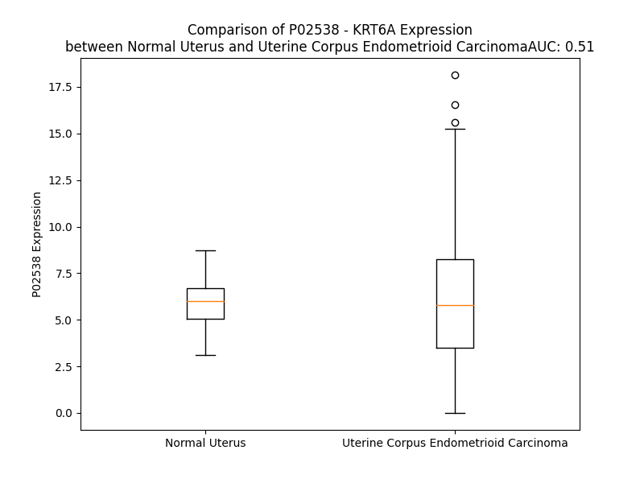

# Detailed Data for P02538

## Introduction to the Detailed Summary

### How to Interpret the Results

- **Summary & Metrics**: This section provides a quick reference to essential protein attributes, including expression changes, family classification, and biomarker applications. Regulation status (upregulated/downregulated) indicates the protein's behavior in a disease context. Some information comes from the original excel file with the proteins selected from literature, while others are derived from the analyses.
- **Expression Comparison**: A visual representation comparing protein expression between normal and disease states. It highlights significant changes in expression levels that might indicate diagnostic or therapeutic relevance. This is data coming from transcriptomics experiments and could not translate similarly to protein levels.
- **Isoform Alignment**: An interactive view of isoform alignments, revealing structural and functional differences between variants of the protein.
- **Interactors & Homologs**: Tables listing known interaction partners and homologous proteins, the more interactors and homologs, the more complex the protein is to design an antibody for.
- **Biological Assemblies**: Information about the structural arrangement of the protein in different assemblies, providing insights into its functional state but also the complexity of the protein to develop antibodies.
- **Combined Per-Residue Information**: A detailed table summarizing residue-level data. This includes predictions for epitope regions, aggregation tendencies, and modifications that might impact the protein's function. Each row corresponds to a residue in the protein, providing insights into specific sites that may be important for research or drug development.
## Summary & Metrics

- **UniProt Accession**: P02538
- **Gene Name**: KRT6A
- **Protein Name**: Keratin, type II cytoskeletal 6A
- **Swiss Prot**: K2C6A_HUMAN
- **Family**: other
- **Biomarker Application**: diagnosis
- **Number of Isoforms**: 0
- **Regulation**: -1
- **(transcriptomics) AUC**: 0.5
- **(transcriptomics) Fold Change**: 1.05
- **(transcriptomics) Regulation**: Upregulated
- **Discotope Epitope Count**: 109
- **Max n_uniprots (Homo)**: N/A
- **Max n_uniprots (Hetero)**: 1

## Expression Comparison

## Interactors

| preferredName_A   | preferredName_B   |   score |
|:------------------|:------------------|--------:|
| KRT6A             | KRT16             |   0.928 |
| KRT6A             | KRT5              |   0.915 |

## Homologs

| uniprot_id   | gene_id      |
|:-------------|:-------------|
| P05783       | KRT18        |
| Q7RTS7       | KRT74        |
| A0A1B0GVI3   | KRT10        |
| Q7Z3Z0       | KRT25        |
| P08727       | KRT19        |
| P19012       | KRT15        |
| Q03252       | LMNB2        |
| Q2M2I5       | KRT24        |
| P35908       | KRT2         |
| P02533       | KRT14        |
| P08779       | KRT16        |
| A0A0D9SFE5   | LMNB1        |
| Q7Z3Y7       | KRT28        |
| P35527       | KRT9         |
| H0YFE3       | LMNTD1       |
| Q8N1A0       | KRT222       |
| Q14CN4       | KRT72        |
| O76013       | KRT36        |
| Q92764       | KRT35        |
| Q5XKE5       | KRT79        |
| P78386       | KRT85        |
| F8VUG2       | KRT8         |
| O76009       | KRT33A       |
| A0A1X7SCE1   | GFAP         |
| O76011       | KRT34        |
| Q7Z3Y9       | KRT26        |
| P08729       | KRT7         |
| B0YJC4       | VIM          |
| O76015       | KRT38        |
| O76014       | KRT37        |
| O43790       | KRT86        |
| P78385       | KRT83        |
| Q14533       | KRT81        |
| Q7Z3Y8       | KRT27        |
| E7ESP9       | NEFM         |
| Q16352       | INA          |
| Q6KB66       | KRT80        |
| P48681       | NES          |
| P35900       | KRT20        |
| K7EMJ2       | KRT13        |
| O95678       | KRT75        |
| Q04695       | KRT17        |
| Q13515       | BFSP2        |
| J3QR55       | KRT23        |
| Q53SB5       | tmp_locus_29 |
| F8W0C6       | KRT5         |
| Q01546       | KRT76        |
| Q7Z794       | KRT77        |
| Q9NSB2       | KRT84        |
| Q9NSB4       | KRT82        |
| P04264       | KRT1         |
| P07196       | NEFL         |
| Q14532       | KRT32        |
| Q6A162       | KRT40        |
| O15061       | SYNM         |
| Q8N1N4       | KRT78        |
| Q6A163       | KRT39        |
| F8VZR6       | KRT4         |
| Q3SY84       | KRT71        |
| Q14525       | KRT33B       |
| Q15323       | KRT31        |
| A0A6Q8PHQ9   | LMNA         |
| Q99456       | KRT12        |
| P12035       | KRT3         |
| Q86Y46       | KRT73        |
| P41219       | PRPH         |
| P04259       | KRT6B        |
| P48668       | KRT6C        |

## Biological Assemblies

|   Unnamed: 0 |   assembly |   n_uniprots | composition   | crystal_id   |
|-------------:|-----------:|-------------:|:--------------|:-------------|
|            0 |          1 |            1 | Hetero        | 5ki0         |

## Combined Per-Residue Information

|   res | aa   |   epitope_score | epitope   |   relative_surface_accessibility |   modeling_confidence |   Aggregation | modification    |
|------:|:-----|----------------:|:----------|---------------------------------:|----------------------:|--------------:|:----------------|
|     1 | M    |         0.09432 | False     |                          1.31721 |                 36.01 |         0     | N/A             |
|     2 | A    |         0.08733 | False     |                          1.00238 |                 39.22 |         0     | N-acetylalanine |
|     3 | S    |         0.08865 | False     |                          0.88438 |                 42.75 |         0     | N/A             |
|     4 | T    |         0.11841 | True      |                          0.8921  |                 49.72 |         0     | N/A             |
|     5 | S    |         0.09397 | False     |                          0.8422  |                 37.92 |         0     | N/A             |
|     6 | T    |         0.14311 | True      |                          0.81939 |                 47.26 |         0     | N/A             |
|     7 | T    |         0.12611 | True      |                          0.85425 |                 39.43 |         0     | N/A             |
|     8 | I    |         0.10439 | False     |                          0.91669 |                 42.99 |         0     | N/A             |
|     9 | R    |         0.15973 | True      |                          0.84231 |                 33.76 |         0     | N/A             |
|    10 | S    |         0.09739 | False     |                          0.8324  |                 41.23 |         0     | N/A             |
|    11 | H    |         0.10463 | False     |                          0.92872 |                 38.64 |         0     | N/A             |
|    12 | S    |         0.09715 | False     |                          0.90824 |                 35.03 |         0     | N/A             |
|    13 | S    |         0.06899 | False     |                          0.85114 |                 43.57 |         0     | N/A             |
|    14 | S    |         0.11496 | True      |                          0.77296 |                 36.8  |         0     | N/A             |
|    15 | R    |         0.12228 | True      |                          0.97307 |                 44.45 |         0     | N/A             |
|    16 | R    |         0.16624 | True      |                          0.9509  |                 46.28 |         0     | N/A             |
|    17 | G    |         0.09079 | False     |                          0.71988 |                 36.94 |         0     | N/A             |
|    18 | F    |         0.08698 | False     |                          1.05566 |                 31.83 |         0     | N/A             |
|    19 | S    |         0.11675 | True      |                          0.81934 |                 36.24 |         0     | N/A             |
|    20 | A    |         0.07889 | False     |                          0.80422 |                 34.94 |         0     | N/A             |
|    21 | N    |         0.06701 | False     |                          0.92322 |                 33.11 |         0     | N/A             |
|    22 | S    |         0.07474 | False     |                          0.81934 |                 33.98 |         0     | N/A             |
|    23 | A    |         0.10099 | False     |                          1.04644 |                 38.73 |         0     | N/A             |
|    24 | R    |         0.10758 | False     |                          0.88476 |                 34.62 |         0     | N/A             |
|    25 | L    |         0.09673 | False     |                          0.96246 |                 29.84 |         0     | N/A             |
|    26 | P    |         0.09044 | False     |                          0.93518 |                 44.64 |         0     | N/A             |
|    27 | G    |         0.08137 | False     |                          0.81532 |                 36.98 |         0     | N/A             |
|    28 | V    |         0.0733  | False     |                          1.02581 |                 39.66 |         0     | N/A             |
|    29 | S    |         0.13839 | True      |                          0.73079 |                 37.4  |         0     | N/A             |
|    30 | R    |         0.14546 | True      |                          0.90957 |                 37.88 |         0     | N/A             |
|    31 | S    |         0.09979 | False     |                          0.8296  |                 34.33 |         0     | N/A             |
|    32 | G    |         0.1222  | True      |                          0.87156 |                 38.17 |         0     | N/A             |
|    33 | F    |         0.09362 | False     |                          1.00993 |                 35.12 |         0     | N/A             |
|    34 | S    |         0.08435 | False     |                          0.78414 |                 34.17 |         0     | N/A             |
|    35 | S    |         0.09417 | False     |                          0.92347 |                 39.68 |         0     | N/A             |
|    36 | V    |         0.06228 | False     |                          0.95684 |                 36.24 |         0     | N/A             |
|    37 | S    |         0.15655 | True      |                          0.76226 |                 37.97 |         0     | N/A             |
|    38 | V    |         0.10678 | False     |                          0.91822 |                 40.57 |         0     | N/A             |
|    39 | S    |         0.10233 | False     |                          0.70006 |                 36.51 |         0     | N/A             |
|    40 | R    |         0.16216 | True      |                          0.92615 |                 37.17 |         0     | N/A             |
|    41 | S    |         0.1384  | True      |                          0.74813 |                 37.4  |         0     | N/A             |
|    42 | R    |         0.12528 | True      |                          0.95854 |                 38.39 |         0     | N/A             |
|    43 | G    |         0.11906 | True      |                          0.82983 |                 35.12 |         0     | N/A             |
|    44 | S    |         0.07717 | False     |                          0.95826 |                 39.11 |         0     | N/A             |
|    45 | G    |         0.17521 | True      |                          0.94728 |                 34.25 |         0     | N/A             |
|    46 | G    |         0.13046 | True      |                          1.0113  |                 32.66 |         0     | N/A             |
|    47 | L    |         0.1321  | True      |                          1.14276 |                 27.29 |         0     | N/A             |
|    48 | G    |         0.09575 | False     |                          0.87664 |                 36.18 |         0     | N/A             |
|    49 | G    |         0.11143 | False     |                          1.0341  |                 32.56 |         0     | N/A             |
|    50 | A    |         0.12392 | True      |                          0.95575 |                 35.7  |         0     | N/A             |
|    51 | C    |         0.08653 | False     |                          1.01268 |                 29.76 |         0     | N/A             |
|    52 | G    |         0.11723 | True      |                          1.00496 |                 33.88 |         0     | N/A             |
|    53 | G    |         0.09716 | False     |                          0.90954 |                 34.32 |         0     | N/A             |
|    54 | A    |         0.13783 | True      |                          1.08406 |                 36.02 |         0     | N/A             |
|    55 | G    |         0.08931 | False     |                          0.7706  |                 34.93 |         0     | N/A             |
|    56 | F    |         0.10357 | False     |                          1.10609 |                 30.94 |         0     | N/A             |
|    57 | G    |         0.12092 | True      |                          0.98024 |                 31.17 |         0     | N/A             |
|    58 | S    |         0.06976 | False     |                          0.82952 |                 34.01 |         0     | N/A             |
|    59 | R    |         0.17526 | True      |                          0.95472 |                 38.56 |         0     | N/A             |
|    60 | S    |         0.1062  | False     |                          0.70221 |                 34.71 |         0     | N/A             |
|    61 | L    |         0.11338 | False     |                          1.09952 |                 36.84 |         0     | N/A             |
|    62 | Y    |         0.12778 | True      |                          0.91215 |                 33.21 |         0     | N/A             |
|    63 | G    |         0.1354  | True      |                          0.95775 |                 35.24 |         0     | N/A             |
|    64 | L    |         0.17669 | True      |                          1.10322 |                 37.91 |         0     | N/A             |
|    65 | G    |         0.12504 | True      |                          0.95333 |                 35.14 |         0     | N/A             |
|    66 | G    |         0.17107 | True      |                          1.01378 |                 34.08 |         0     | N/A             |
|    67 | S    |         0.13853 | True      |                          0.85413 |                 35.26 |         0     | N/A             |
|    68 | K    |         0.13029 | True      |                          0.98747 |                 38.1  |         0     | N/A             |
|    69 | R    |         0.14177 | True      |                          0.9505  |                 30.38 |         0     | N/A             |
|    70 | I    |         0.12026 | True      |                          1.05338 |                 34.7  |         0     | N/A             |
|    71 | S    |         0.10717 | False     |                          0.7417  |                 29.07 |         0     | N/A             |
|    72 | I    |         0.1283  | True      |                          1.06949 |                 34.74 |         0     | N/A             |
|    73 | G    |         0.12815 | True      |                          0.81189 |                 31.37 |         0     | N/A             |
|    74 | G    |         0.08618 | False     |                          1.00635 |                 29.01 |         0     | N/A             |
|    75 | G    |         0.13978 | True      |                          0.98541 |                 29.08 |         0     | N/A             |
|    76 | S    |         0.073   | False     |                          0.92806 |                 29.79 |         0     | N/A             |
|    77 | C    |         0.09724 | False     |                          1.003   |                 34.38 |         0     | N/A             |
|    78 | A    |         0.06518 | False     |                          0.88229 |                 30.73 |         0     | N/A             |
|    79 | I    |         0.12111 | True      |                          1.08216 |                 38.35 |         0     | N/A             |
|    80 | S    |         0.11478 | True      |                          0.87596 |                 34.41 |         0     | N/A             |
|    81 | G    |         0.10182 | False     |                          0.98781 |                 37.01 |         0     | N/A             |
|    82 | G    |         0.14679 | True      |                          0.86767 |                 38.58 |         0     | N/A             |
|    83 | Y    |         0.13322 | True      |                          1.08383 |                 33.79 |         0     | N/A             |
|    84 | G    |         0.1486  | True      |                          0.91556 |                 38.29 |         0     | N/A             |
|    85 | S    |         0.08514 | False     |                          0.81346 |                 36.14 |         0     | N/A             |
|    86 | R    |         0.1598  | True      |                          0.95018 |                 37.12 |         0     | N/A             |
|    87 | A    |         0.12619 | True      |                          0.9815  |                 34.53 |         0     | N/A             |
|    88 | G    |         0.09652 | False     |                          1.02509 |                 34.72 |         0     | N/A             |
|    89 | G    |         0.15769 | True      |                          0.98495 |                 34.37 |         0     | N/A             |
|    90 | S    |         0.10597 | False     |                          0.79891 |                 33.65 |         0     | N/A             |
|    91 | Y    |         0.0831  | False     |                          0.9918  |                 34.64 |         0     | N/A             |
|    92 | G    |         0.12215 | True      |                          0.7442  |                 32.53 |         0     | N/A             |
|    93 | F    |         0.1019  | False     |                          1.13288 |                 34.31 |         0     | N/A             |
|    94 | G    |         0.1116  | False     |                          0.88055 |                 32.03 |         0     | N/A             |
|    95 | G    |         0.12679 | True      |                          1.02107 |                 33.37 |         0     | N/A             |
|    96 | A    |         0.10522 | False     |                          1.09935 |                 31.56 |         0     | N/A             |
|    97 | G    |         0.13028 | True      |                          0.97916 |                 32.73 |         0     | N/A             |
|    98 | S    |         0.07914 | False     |                          0.95644 |                 32.6  |         0     | N/A             |
|    99 | G    |         0.15747 | True      |                          0.81913 |                 30.22 |         0     | N/A             |
|   100 | F    |         0.10661 | False     |                          1.05501 |                 25.35 |         0     | N/A             |
|   101 | G    |         0.14238 | True      |                          0.89469 |                 32.32 |         0     | N/A             |
|   102 | F    |         0.10074 | False     |                          1.07828 |                 29.13 |         0     | N/A             |
|   103 | G    |         0.07046 | False     |                          0.80966 |                 32.94 |         0     | N/A             |
|   104 | G    |         0.05975 | False     |                          1.01005 |                 32.29 |         0     | N/A             |
|   105 | G    |         0.07613 | False     |                          0.95526 |                 32.56 |         0     | N/A             |
|   106 | A    |         0.07614 | False     |                          1.07906 |                 28.65 |         0     | N/A             |
|   107 | G    |         0.10336 | False     |                          0.76241 |                 31.22 |         0     | N/A             |
|   108 | I    |         0.13282 | True      |                          1.06076 |                 26.56 |         0.372 | N/A             |
|   109 | G    |         0.10129 | False     |                          0.7869  |                 33.58 |         0.372 | N/A             |
|   110 | F    |         0.10593 | False     |                          1.01565 |                 30.77 |         0.372 | N/A             |
|   111 | G    |         0.08635 | False     |                          0.87657 |                 34.47 |         0.372 | N/A             |
|   112 | L    |         0.13176 | True      |                          1.00437 |                 30.52 |         0.372 | N/A             |
|   113 | G    |         0.07903 | False     |                          0.91705 |                 35.72 |         0     | N/A             |
|   114 | G    |         0.10821 | False     |                          1.006   |                 32.95 |         0     | N/A             |
|   115 | G    |         0.13128 | True      |                          1.02577 |                 33.39 |         0     | N/A             |
|   116 | A    |         0.06879 | False     |                          1.03431 |                 29.82 |         0     | N/A             |
|   117 | G    |         0.10094 | False     |                          0.88479 |                 34.91 |         0     | N/A             |
|   118 | L    |         0.09195 | False     |                          1.08635 |                 32.35 |         0     | N/A             |
|   119 | A    |         0.08325 | False     |                          0.91629 |                 28.65 |         0     | N/A             |
|   120 | G    |         0.13814 | True      |                          0.9652  |                 28.39 |         0     | N/A             |
|   121 | G    |         0.12103 | True      |                          0.82298 |                 29.7  |         0     | N/A             |
|   122 | F    |         0.10215 | False     |                          1.11332 |                 27.99 |         0     | N/A             |
|   123 | G    |         0.11344 | False     |                          0.9749  |                 37.5  |         0     | N/A             |
|   124 | G    |         0.10573 | False     |                          0.87491 |                 31.74 |         0     | N/A             |
|   125 | P    |         0.09623 | False     |                          1.06857 |                 44.59 |         0     | N/A             |
|   126 | G    |         0.14809 | True      |                          0.94002 |                 33.93 |         0     | N/A             |
|   127 | F    |         0.08171 | False     |                          0.90297 |                 36.61 |         0     | N/A             |
|   128 | P    |         0.11862 | True      |                          0.90934 |                 42.18 |         0     | N/A             |
|   129 | V    |         0.05497 | False     |                          0.71412 |                 33.29 |         0     | N/A             |
|   130 | C    |         0.157   | True      |                          0.75369 |                 32.79 |         0     | N/A             |
|   131 | P    |         0.18279 | True      |                          0.95469 |                 44.61 |         0     | N/A             |
|   132 | P    |         0.0956  | False     |                          0.88003 |                 39.2  |         0     | N/A             |
|   133 | G    |         0.14178 | True      |                          0.93452 |                 37.26 |         0     | N/A             |
|   134 | G    |         0.11095 | False     |                          0.84895 |                 32.6  |         0     | N/A             |
|   135 | I    |         0.1502  | True      |                          0.98044 |                 34.1  |         0     | N/A             |
|   136 | Q    |         0.09581 | False     |                          0.75384 |                 32.75 |         0     | N/A             |
|   137 | E    |         0.0984  | False     |                          0.74912 |                 40.95 |         0     | N/A             |
|   138 | V    |         0.09447 | False     |                          1.00032 |                 39.99 |         0     | N/A             |
|   139 | T    |         0.09576 | False     |                          0.74428 |                 45.13 |         0     | N/A             |
|   140 | V    |         0.08899 | False     |                          0.7866  |                 42.29 |         0     | N/A             |
|   141 | N    |         0.08877 | False     |                          0.62325 |                 40.1  |         0     | N/A             |
|   142 | Q    |         0.17535 | True      |                          0.75073 |                 53.85 |         0     | N/A             |
|   143 | S    |         0.08983 | False     |                          0.52166 |                 57.35 |         0     | N/A             |
|   144 | L    |         0.1091  | False     |                          0.95343 |                 46.64 |         0     | N/A             |
|   145 | L    |         0.11162 | False     |                          0.86004 |                 45.76 |         0     | N/A             |
|   146 | T    |         0.07697 | False     |                          0.62027 |                 48.08 |         0     | N/A             |
|   147 | P    |         0.12129 | True      |                          0.93881 |                 46.03 |         0     | N/A             |
|   148 | L    |         0.09994 | False     |                          0.90356 |                 37.06 |         0     | N/A             |
|   149 | N    |         0.08095 | False     |                          0.83695 |                 47.31 |         0     | N/A             |
|   150 | L    |         0.07786 | False     |                          0.75446 |                 47.02 |         0     | N/A             |
|   151 | Q    |         0.11962 | True      |                          0.85191 |                 45.82 |         0     | N/A             |
|   152 | I    |         0.05629 | False     |                          0.45406 |                 49.07 |         0     | N/A             |
|   153 | D    |         0.13253 | True      |                          0.39827 |                 51.85 |         0     | N/A             |
|   154 | P    |         0.08089 | False     |                          0.82586 |                 63.05 |         0     | N/A             |
|   155 | T    |         0.07634 | False     |                          0.51811 |                 66.08 |         0     | N/A             |
|   156 | I    |         0.05551 | False     |                          0.52718 |                 62.51 |         0     | N/A             |
|   157 | Q    |         0.05108 | False     |                          0.50561 |                 63.79 |         0     | N/A             |
|   158 | R    |         0.10921 | False     |                          0.5578  |                 69.68 |         0     | N/A             |
|   159 | V    |         0.0287  | False     |                          0.5046  |                 74.7  |         0     | N/A             |
|   160 | R    |         0.07305 | False     |                          0.66365 |                 70.48 |         0     | N/A             |
|   161 | A    |         0.04035 | False     |                          0.55677 |                 73.23 |         0     | N/A             |
|   162 | E    |         0.05775 | False     |                          0.37452 |                 78.21 |         0     | N/A             |
|   163 | E    |         0.03773 | False     |                          0.46367 |                 78.23 |         0     | N/A             |
|   164 | R    |         0.07314 | False     |                          0.68976 |                 78.77 |         0     | N/A             |
|   165 | E    |         0.05362 | False     |                          0.58814 |                 77.94 |         0     | N/A             |
|   166 | Q    |         0.03922 | False     |                          0.62805 |                 77.27 |         0     | N/A             |
|   167 | I    |         0.04183 | False     |                          0.59426 |                 77.66 |         0     | N/A             |
|   168 | K    |         0.04675 | False     |                          0.60731 |                 80.87 |         0     | N/A             |
|   169 | T    |         0.03974 | False     |                          0.47749 |                 81.47 |         0     | N/A             |
|   170 | L    |         0.03117 | False     |                          0.56976 |                 80.95 |         0     | N/A             |
|   171 | N    |         0.03016 | False     |                          0.5304  |                 83.26 |         0     | N/A             |
|   172 | N    |         0.04697 | False     |                          0.65998 |                 84.58 |         0     | N/A             |
|   173 | K    |         0.03856 | False     |                          0.56623 |                 84.77 |         0     | N/A             |
|   174 | F    |         0.03176 | False     |                          0.55299 |                 86.61 |         9.673 | N/A             |
|   175 | A    |         0.03501 | False     |                          0.46524 |                 82.59 |         9.673 | N/A             |
|   176 | S    |         0.03642 | False     |                          0.4976  |                 84.98 |         9.673 | N/A             |
|   177 | F    |         0.03258 | False     |                          0.6603  |                 88.46 |         9.673 | N/A             |
|   178 | I    |         0.04348 | False     |                          0.61944 |                 87.42 |         9.673 | N/A             |
|   179 | D    |         0.03051 | False     |                          0.56811 |                 87.34 |         0     | N/A             |
|   180 | K    |         0.03176 | False     |                          0.54822 |                 89.49 |         0     | N/A             |
|   181 | V    |         0.02527 | False     |                          0.57861 |                 91.35 |         0     | N/A             |
|   182 | R    |         0.06955 | False     |                          0.65929 |                 89.02 |         0     | N/A             |
|   183 | F    |         0.04677 | False     |                          0.54194 |                 91.72 |         0     | N/A             |
|   184 | L    |         0.02569 | False     |                          0.49873 |                 91.05 |         0     | N/A             |
|   185 | E    |         0.07555 | False     |                          0.54697 |                 90    |         0     | N/A             |
|   186 | Q    |         0.04586 | False     |                          0.64519 |                 92.45 |         0     | N/A             |
|   187 | Q    |         0.02962 | False     |                          0.41615 |                 92.42 |         0     | N/A             |
|   188 | N    |         0.05671 | False     |                          0.59035 |                 91.36 |         0     | N/A             |
|   189 | K    |         0.0572  | False     |                          0.68992 |                 93.33 |         0     | N/A             |
|   190 | V    |         0.03867 | False     |                          0.68255 |                 92.28 |         1.2   | N/A             |
|   191 | L    |         0.03339 | False     |                          0.67296 |                 92.07 |         1.2   | N/A             |
|   192 | E    |         0.06376 | False     |                          0.58376 |                 90.88 |         1.2   | N/A             |
|   193 | T    |         0.0374  | False     |                          0.51843 |                 90.1  |         1.2   | N/A             |
|   194 | K    |         0.03384 | False     |                          0.59395 |                 88.78 |         1.2   | N/A             |
|   195 | W    |         0.06354 | False     |                          0.72006 |                 85.18 |         1.692 | N/A             |
|   196 | T    |         0.02575 | False     |                          0.49036 |                 86.34 |         1.692 | N/A             |
|   197 | L    |         0.05035 | False     |                          0.748   |                 84.42 |         1.692 | N/A             |
|   198 | L    |         0.04013 | False     |                          0.59059 |                 81.26 |         1.692 | N/A             |
|   199 | Q    |         0.06141 | False     |                          0.5338  |                 78.64 |         0.492 | N/A             |
|   200 | E    |         0.07824 | False     |                          0.42216 |                 76.09 |         0     | N/A             |
|   201 | Q    |         0.08473 | False     |                          0.59532 |                 66.57 |         0     | N/A             |
|   202 | G    |         0.07604 | False     |                          0.66582 |                 60.64 |         0     | N/A             |
|   203 | T    |         0.10449 | False     |                          0.72335 |                 59.16 |         0     | N/A             |
|   204 | K    |         0.07869 | False     |                          0.69506 |                 56.03 |         0     | N/A             |
|   205 | T    |         0.11759 | True      |                          0.67619 |                 55.18 |         0     | N/A             |
|   206 | V    |         0.09276 | False     |                          0.80321 |                 53.29 |         0     | N/A             |
|   207 | R    |         0.14086 | True      |                          0.89052 |                 56.85 |         0     | N/A             |
|   208 | Q    |         0.1106  | False     |                          0.76857 |                 62.32 |         0     | N/A             |
|   209 | N    |         0.09634 | False     |                          0.58763 |                 70.3  |         0     | N/A             |
|   210 | L    |         0.07858 | False     |                          0.55624 |                 80.53 |         0     | N/A             |
|   211 | E    |         0.06006 | False     |                          0.59659 |                 83.95 |         0     | N/A             |
|   212 | P    |         0.05674 | False     |                          0.58355 |                 88.58 |         0     | N/A             |
|   213 | L    |         0.03942 | False     |                          0.68567 |                 89.65 |         0     | N/A             |
|   214 | F    |         0.03971 | False     |                          0.62264 |                 90.96 |         0     | N/A             |
|   215 | E    |         0.04721 | False     |                          0.43009 |                 94.07 |         0     | N/A             |
|   216 | Q    |         0.07518 | False     |                          0.64407 |                 94.83 |         0     | N/A             |
|   217 | Y    |         0.06483 | False     |                          0.62699 |                 94.4  |         0     | N/A             |
|   218 | I    |         0.03575 | False     |                          0.42857 |                 95.75 |         0     | N/A             |
|   219 | N    |         0.04396 | False     |                          0.38848 |                 96.63 |         0     | N/A             |
|   220 | N    |         0.04152 | False     |                          0.47798 |                 96.5  |         0     | N/A             |
|   221 | L    |         0.04408 | False     |                          0.5071  |                 95.96 |         0     | N/A             |
|   222 | R    |         0.05702 | False     |                          0.58335 |                 96.75 |         0     | N/A             |
|   223 | R    |         0.04757 | False     |                          0.50563 |                 96.72 |         0     | N/A             |
|   224 | Q    |         0.02279 | False     |                          0.47391 |                 97.31 |         0     | N/A             |
|   225 | L    |         0.03709 | False     |                          0.66456 |                 96.6  |         0     | N/A             |
|   226 | D    |         0.03453 | False     |                          0.59968 |                 96.48 |         0     | N/A             |
|   227 | S    |         0.03    | False     |                          0.34716 |                 97.16 |         0     | N/A             |
|   228 | I    |         0.02574 | False     |                          0.66571 |                 96.43 |         0     | N/A             |
|   229 | V    |         0.04262 | False     |                          0.4772  |                 97.15 |         0     | N/A             |
|   230 | G    |         0.04912 | False     |                          0.54112 |                 96.65 |         0     | N/A             |
|   231 | E    |         0.02334 | False     |                          0.45251 |                 97.18 |         0     | N/A             |
|   232 | R    |         0.10205 | False     |                          0.57528 |                 96.61 |         0     | N/A             |
|   233 | G    |         0.05733 | False     |                          0.45483 |                 95.37 |         0     | N/A             |
|   234 | R    |         0.06823 | False     |                          0.54448 |                 97.32 |         0     | N/A             |
|   235 | L    |         0.03533 | False     |                          0.58802 |                 96.85 |         0     | N/A             |
|   236 | D    |         0.0802  | False     |                          0.39879 |                 96.94 |         0     | N/A             |
|   237 | S    |         0.0597  | False     |                          0.53347 |                 95.86 |         0     | N/A             |
|   238 | E    |         0.03269 | False     |                          0.48426 |                 97.42 |         0     | N/A             |
|   239 | L    |         0.05665 | False     |                          0.63206 |                 96.79 |         0     | N/A             |
|   240 | R    |         0.06339 | False     |                          0.65307 |                 96.88 |         0     | N/A             |
|   241 | G    |         0.08505 | False     |                          0.47938 |                 97.19 |         0     | N/A             |
|   242 | M    |         0.06351 | False     |                          0.58367 |                 97.29 |         0     | N/A             |
|   243 | Q    |         0.07856 | False     |                          0.51387 |                 97.26 |         0     | N/A             |
|   244 | D    |         0.05    | False     |                          0.6017  |                 97.11 |         0     | N/A             |
|   245 | L    |         0.04856 | False     |                          0.50369 |                 97.53 |         0     | N/A             |
|   246 | V    |         0.03358 | False     |                          0.62253 |                 97.9  |         0     | N/A             |
|   247 | E    |         0.03013 | False     |                          0.40158 |                 97.22 |         0     | N/A             |
|   248 | D    |         0.06188 | False     |                          0.4184  |                 97.31 |         0     | N/A             |
|   249 | F    |         0.03596 | False     |                          0.52025 |                 97.18 |         0     | N/A             |
|   250 | K    |         0.07606 | False     |                          0.47177 |                 97.34 |         0     | N/A             |
|   251 | N    |         0.05579 | False     |                          0.46357 |                 96.18 |         0     | N/A             |
|   252 | K    |         0.06551 | False     |                          0.52347 |                 97.66 |         0     | N/A             |
|   253 | Y    |         0.058   | False     |                          0.66909 |                 97.24 |         0     | N/A             |
|   254 | E    |         0.02137 | False     |                          0.43489 |                 97.02 |         0     | N/A             |
|   255 | D    |         0.06514 | False     |                          0.48301 |                 95.85 |         0     | N/A             |
|   256 | E    |         0.05301 | False     |                          0.51674 |                 96.8  |         0     | N/A             |
|   257 | I    |         0.09068 | False     |                          0.65622 |                 95.69 |         0     | N/A             |
|   258 | N    |         0.0548  | False     |                          0.61168 |                 95.36 |         0     | N/A             |
|   259 | K    |         0.036   | False     |                          0.59761 |                 96.51 |         0     | N/A             |
|   260 | R    |         0.05887 | False     |                          0.72887 |                 97.16 |         0     | N/A             |
|   261 | T    |         0.06038 | False     |                          0.52    |                 95.27 |         0     | N/A             |
|   262 | A    |         0.0426  | False     |                          0.48574 |                 95.02 |         0     | N/A             |
|   263 | A    |         0.0638  | False     |                          0.54733 |                 92.95 |         0     | N/A             |
|   264 | E    |         0.05207 | False     |                          0.48255 |                 95.01 |         0     | N/A             |
|   265 | N    |         0.05384 | False     |                          0.57127 |                 95.31 |         0     | N/A             |
|   266 | E    |         0.05827 | False     |                          0.6295  |                 96.69 |         0     | N/A             |
|   267 | F    |         0.06804 | False     |                          0.62878 |                 96.47 |         0     | N/A             |
|   268 | V    |         0.06513 | False     |                          0.48717 |                 97.84 |         0     | N/A             |
|   269 | T    |         0.04915 | False     |                          0.54258 |                 95.74 |         0     | N/A             |
|   270 | L    |         0.06423 | False     |                          0.66302 |                 96.7  |         0     | N/A             |
|   271 | K    |         0.06583 | False     |                          0.57898 |                 97.59 |         0     | N/A             |
|   272 | K    |         0.06649 | False     |                          0.64991 |                 97.65 |         0     | N/A             |
|   273 | D    |         0.06628 | False     |                          0.57118 |                 96.71 |         0     | N/A             |
|   274 | V    |         0.03678 | False     |                          0.62328 |                 98.19 |         0     | N/A             |
|   275 | D    |         0.05124 | False     |                          0.44773 |                 97.92 |         0     | N/A             |
|   276 | A    |         0.03805 | False     |                          0.49911 |                 96.78 |         0     | N/A             |
|   277 | A    |         0.03493 | False     |                          0.5912  |                 96.8  |         0     | N/A             |
|   278 | Y    |         0.04848 | False     |                          0.60283 |                 97.63 |         0     | N/A             |
|   279 | M    |         0.04929 | False     |                          0.59606 |                 97.53 |         0     | N/A             |
|   280 | N    |         0.03951 | False     |                          0.5533  |                 97.3  |         0     | N/A             |
|   281 | K    |         0.05868 | False     |                          0.65433 |                 98.01 |         0     | N/A             |
|   282 | V    |         0.04252 | False     |                          0.48833 |                 98.13 |         0     | N/A             |
|   283 | E    |         0.04647 | False     |                          0.45984 |                 97.08 |         0     | N/A             |
|   284 | L    |         0.04106 | False     |                          0.70993 |                 97.07 |         0     | N/A             |
|   285 | Q    |         0.05271 | False     |                          0.48305 |                 97.51 |         0     | N/A             |
|   286 | A    |         0.04325 | False     |                          0.52042 |                 97.57 |         0     | N/A             |
|   287 | K    |         0.0508  | False     |                          0.57132 |                 97.61 |         0     | N/A             |
|   288 | A    |         0.03012 | False     |                          0.45495 |                 97.86 |         0     | N/A             |
|   289 | D    |         0.0563  | False     |                          0.43538 |                 97.85 |         0     | N/A             |
|   290 | T    |         0.0557  | False     |                          0.64213 |                 97.57 |         0     | N/A             |
|   291 | L    |         0.05397 | False     |                          0.62629 |                 97.65 |         0     | N/A             |
|   292 | T    |         0.0281  | False     |                          0.51399 |                 97.88 |         0     | N/A             |
|   293 | D    |         0.05182 | False     |                          0.59626 |                 97.65 |         0     | N/A             |
|   294 | E    |         0.04642 | False     |                          0.47754 |                 97.38 |         0     | N/A             |
|   295 | I    |         0.03663 | False     |                          0.51497 |                 96.92 |         0     | N/A             |
|   296 | N    |         0.04257 | False     |                          0.46834 |                 97.37 |         0     | N/A             |
|   297 | F    |         0.05976 | False     |                          0.67974 |                 97.89 |         0     | N/A             |
|   298 | L    |         0.04464 | False     |                          0.4163  |                 97.63 |         0     | N/A             |
|   299 | R    |         0.08903 | False     |                          0.61641 |                 96.91 |         0     | N/A             |
|   300 | A    |         0.04749 | False     |                          0.60069 |                 96.9  |         0     | N/A             |
|   301 | L    |         0.08425 | False     |                          0.53223 |                 96.77 |         0     | N/A             |
|   302 | Y    |         0.04714 | False     |                          0.55228 |                 95.64 |         0     | N/A             |
|   303 | D    |         0.04707 | False     |                          0.5958  |                 95.88 |         0     | N/A             |
|   304 | A    |         0.03997 | False     |                          0.53168 |                 93.67 |         0     | N/A             |
|   305 | E    |         0.03041 | False     |                          0.47551 |                 92.51 |         0     | N/A             |
|   306 | L    |         0.07038 | False     |                          0.68724 |                 91.3  |         0     | N/A             |
|   307 | S    |         0.05959 | False     |                          0.51251 |                 91.16 |         0     | N/A             |
|   308 | Q    |         0.0344  | False     |                          0.56182 |                 88.87 |         0     | N/A             |
|   309 | M    |         0.06472 | False     |                          0.56498 |                 87.38 |         0     | N/A             |
|   310 | Q    |         0.08186 | False     |                          0.65397 |                 85.24 |         0     | N/A             |
|   311 | T    |         0.07143 | False     |                          0.562   |                 82.05 |         0     | N/A             |
|   312 | H    |         0.05852 | False     |                          0.59438 |                 80.08 |         0     | N/A             |
|   313 | I    |         0.11235 | False     |                          0.65173 |                 71.35 |         0     | N/A             |
|   314 | S    |         0.08155 | False     |                          0.56224 |                 65.48 |         0     | N/A             |
|   315 | D    |         0.12623 | True      |                          0.67469 |                 58.21 |         0     | N/A             |
|   316 | T    |         0.08437 | False     |                          0.76189 |                 60.13 |         1.238 | N/A             |
|   317 | S    |         0.1866  | True      |                          0.66169 |                 42.18 |         1.238 | N/A             |
|   318 | V    |         0.13579 | True      |                          0.71946 |                 51.25 |         3.592 | N/A             |
|   319 | V    |         0.18622 | True      |                          1.07128 |                 43.84 |         3.592 | N/A             |
|   320 | L    |         0.12797 | True      |                          0.72193 |                 42.51 |         3.592 | N/A             |
|   321 | S    |         0.10125 | False     |                          0.89309 |                 39.53 |         2.354 | N/A             |
|   322 | M    |         0.11027 | False     |                          0.72124 |                 50.08 |         2.354 | N/A             |
|   323 | D    |         0.11262 | False     |                          0.89684 |                 35.04 |         0     | N/A             |
|   324 | N    |         0.22062 | True      |                          1.02513 |                 46.09 |         0     | N/A             |
|   325 | N    |         0.19507 | True      |                          0.92207 |                 47.59 |         0     | N/A             |
|   326 | R    |         0.14949 | True      |                          0.81633 |                 51.8  |         0     | N/A             |
|   327 | N    |         0.10792 | False     |                          0.9786  |                 58.7  |         0     | N/A             |
|   328 | L    |         0.09117 | False     |                          0.78009 |                 62.73 |         0     | N/A             |
|   329 | D    |         0.08558 | False     |                          0.55874 |                 70.62 |         0     | N/A             |
|   330 | L    |         0.13209 | True      |                          0.67659 |                 75.15 |         0     | N/A             |
|   331 | D    |         0.08229 | False     |                          0.69272 |                 84.61 |         0     | N/A             |
|   332 | S    |         0.06535 | False     |                          0.48962 |                 85.03 |         0     | N/A             |
|   333 | I    |         0.05689 | False     |                          0.45438 |                 84.05 |         0     | N/A             |
|   334 | I    |         0.11279 | False     |                          0.51674 |                 86.99 |         0     | N/A             |
|   335 | A    |         0.06391 | False     |                          0.56084 |                 91.69 |         0     | N/A             |
|   336 | E    |         0.02589 | False     |                          0.5767  |                 90.75 |         0     | N/A             |
|   337 | V    |         0.03212 | False     |                          0.51602 |                 92.61 |         0     | N/A             |
|   338 | K    |         0.06954 | False     |                          0.67158 |                 92.02 |         0     | N/A             |
|   339 | A    |         0.04094 | False     |                          0.57799 |                 93.51 |         0     | N/A             |
|   340 | Q    |         0.07382 | False     |                          0.53309 |                 92.35 |         0     | N/A             |
|   341 | Y    |         0.08642 | False     |                          0.69954 |                 92.34 |         0     | N/A             |
|   342 | E    |         0.08107 | False     |                          0.54357 |                 94.28 |         0     | N/A             |
|   343 | E    |         0.0251  | False     |                          0.45872 |                 94.56 |         0     | N/A             |
|   344 | I    |         0.048   | False     |                          0.60714 |                 92.85 |         0     | N/A             |
|   345 | A    |         0.05265 | False     |                          0.55869 |                 92.02 |         0     | N/A             |
|   346 | Q    |         0.04402 | False     |                          0.55841 |                 94.87 |         0     | N/A             |
|   347 | R    |         0.04846 | False     |                          0.54053 |                 95.14 |         0     | N/A             |
|   348 | S    |         0.06131 | False     |                          0.49917 |                 93.34 |         0     | N/A             |
|   349 | R    |         0.10233 | False     |                          0.67316 |                 94.03 |         0     | N/A             |
|   350 | A    |         0.02088 | False     |                          0.55378 |                 95.17 |         0     | N/A             |
|   351 | E    |         0.03462 | False     |                          0.55509 |                 94.22 |         0     | N/A             |
|   352 | A    |         0.03531 | False     |                          0.42728 |                 93.08 |         0     | N/A             |
|   353 | E    |         0.03543 | False     |                          0.52756 |                 94.95 |         0     | N/A             |
|   354 | S    |         0.02744 | False     |                          0.5112  |                 93.83 |         0     | N/A             |
|   355 | W    |         0.038   | False     |                          0.67034 |                 94.61 |         0     | N/A             |
|   356 | Y    |         0.08167 | False     |                          0.6688  |                 94.36 |         0     | N/A             |
|   357 | Q    |         0.04356 | False     |                          0.50907 |                 95.77 |         0     | N/A             |
|   358 | T    |         0.04761 | False     |                          0.57312 |                 96.06 |         0     | N/A             |
|   359 | K    |         0.06603 | False     |                          0.42937 |                 94.85 |         0     | N/A             |
|   360 | Y    |         0.05586 | False     |                          0.66484 |                 94.48 |         0     | N/A             |
|   361 | E    |         0.02418 | False     |                          0.43567 |                 95.87 |         0     | N/A             |
|   362 | E    |         0.0362  | False     |                          0.44562 |                 94.99 |         0     | N/A             |
|   363 | L    |         0.04623 | False     |                          0.76493 |                 94.35 |         0     | N/A             |
|   364 | Q    |         0.03973 | False     |                          0.57521 |                 94.52 |         0     | N/A             |
|   365 | V    |         0.03643 | False     |                          0.66633 |                 95    |         0     | N/A             |
|   366 | T    |         0.04143 | False     |                          0.40732 |                 93.76 |         0     | N/A             |
|   367 | A    |         0.046   | False     |                          0.60557 |                 92.69 |         0     | N/A             |
|   368 | G    |         0.0492  | False     |                          0.45696 |                 94.01 |         0     | N/A             |
|   369 | R    |         0.07846 | False     |                          0.675   |                 94.36 |         0     | N/A             |
|   370 | H    |         0.07728 | False     |                          0.68386 |                 94.36 |         0     | N/A             |
|   371 | G    |         0.04728 | False     |                          0.48482 |                 95.52 |         0     | N/A             |
|   372 | D    |         0.02493 | False     |                          0.451   |                 94.82 |         0     | N/A             |
|   373 | D    |         0.03881 | False     |                          0.47237 |                 95.66 |         0     | N/A             |
|   374 | L    |         0.0434  | False     |                          0.79271 |                 95.46 |         0     | N/A             |
|   375 | R    |         0.10205 | False     |                          0.58072 |                 95.74 |         0     | N/A             |
|   376 | N    |         0.04647 | False     |                          0.44385 |                 95.73 |         0     | N/A             |
|   377 | T    |         0.04201 | False     |                          0.4527  |                 94.09 |         0     | N/A             |
|   378 | K    |         0.06091 | False     |                          0.7199  |                 96.99 |         0     | N/A             |
|   379 | Q    |         0.0328  | False     |                          0.49133 |                 94.78 |         0     | N/A             |
|   380 | E    |         0.04834 | False     |                          0.53809 |                 94.32 |         0     | N/A             |
|   381 | I    |         0.04989 | False     |                          0.61997 |                 95.33 |         0     | N/A             |
|   382 | A    |         0.05365 | False     |                          0.38705 |                 95.84 |         0     | N/A             |
|   383 | E    |         0.05093 | False     |                          0.54462 |                 94.93 |         0     | N/A             |
|   384 | I    |         0.05069 | False     |                          0.59872 |                 93.5  |         0     | N/A             |
|   385 | N    |         0.05464 | False     |                          0.48292 |                 95.9  |         0     | N/A             |
|   386 | R    |         0.06969 | False     |                          0.59451 |                 95.74 |         0     | N/A             |
|   387 | M    |         0.06042 | False     |                          0.57524 |                 95.37 |         0     | N/A             |
|   388 | I    |         0.07055 | False     |                          0.40756 |                 95.28 |         0     | N/A             |
|   389 | Q    |         0.08962 | False     |                          0.55263 |                 95.9  |         0     | N/A             |
|   390 | R    |         0.07832 | False     |                          0.63835 |                 96.07 |         0     | N/A             |
|   391 | L    |         0.05936 | False     |                          0.56199 |                 95.47 |         0     | N/A             |
|   392 | R    |         0.10168 | False     |                          0.5712  |                 96.16 |         0     | N/A             |
|   393 | S    |         0.07028 | False     |                          0.54876 |                 95.6  |         0     | N/A             |
|   394 | E    |         0.049   | False     |                          0.53222 |                 95.96 |         0     | N/A             |
|   395 | I    |         0.06189 | False     |                          0.55173 |                 94.62 |         0     | N/A             |
|   396 | D    |         0.15372 | True      |                          0.42824 |                 96.77 |         0     | N/A             |
|   397 | H    |         0.05609 | False     |                          0.57761 |                 95.49 |         0     | N/A             |
|   398 | V    |         0.03406 | False     |                          0.52364 |                 95.13 |         0     | N/A             |
|   399 | K    |         0.07017 | False     |                          0.60499 |                 96.9  |         0     | N/A             |
|   400 | K    |         0.05211 | False     |                          0.68532 |                 96.31 |         0     | N/A             |
|   401 | Q    |         0.04004 | False     |                          0.44087 |                 96.36 |         0     | N/A             |
|   402 | C    |         0.04954 | False     |                          0.48735 |                 93.77 |         0     | N/A             |
|   403 | A    |         0.04978 | False     |                          0.53326 |                 95.46 |         0     | N/A             |
|   404 | N    |         0.06091 | False     |                          0.66493 |                 96.2  |         0     | N/A             |
|   405 | L    |         0.05168 | False     |                          0.69389 |                 94.8  |         0     | N/A             |
|   406 | Q    |         0.08016 | False     |                          0.64513 |                 96.09 |         0     | N/A             |
|   407 | A    |         0.05691 | False     |                          0.55469 |                 96.02 |         0     | N/A             |
|   408 | A    |         0.04227 | False     |                          0.51854 |                 94.54 |         0     | N/A             |
|   409 | I    |         0.10508 | False     |                          0.58525 |                 93.36 |         0     | N/A             |
|   410 | A    |         0.06975 | False     |                          0.5151  |                 96.07 |         0     | N/A             |
|   411 | D    |         0.06591 | False     |                          0.46386 |                 96.37 |         0     | N/A             |
|   412 | A    |         0.03521 | False     |                          0.47342 |                 92.4  |         0     | N/A             |
|   413 | E    |         0.07588 | False     |                          0.60636 |                 94.98 |         0     | N/A             |
|   414 | Q    |         0.0869  | False     |                          0.59353 |                 97.05 |         0     | N/A             |
|   415 | R    |         0.08903 | False     |                          0.61597 |                 94.83 |         0     | N/A             |
|   416 | G    |         0.07299 | False     |                          0.40212 |                 92.19 |         0     | N/A             |
|   417 | E    |         0.10663 | False     |                          0.47909 |                 96.19 |         0     | N/A             |
|   418 | M    |         0.0756  | False     |                          0.64692 |                 96.1  |         0     | N/A             |
|   419 | A    |         0.04254 | False     |                          0.59076 |                 94.93 |         0     | N/A             |
|   420 | L    |         0.07352 | False     |                          0.69625 |                 95.16 |         0     | N/A             |
|   421 | K    |         0.07709 | False     |                          0.50569 |                 97.42 |         0     | N/A             |
|   422 | D    |         0.06358 | False     |                          0.43431 |                 96.82 |         0     | N/A             |
|   423 | A    |         0.05995 | False     |                          0.51464 |                 95.44 |         0     | N/A             |
|   424 | K    |         0.09669 | False     |                          0.69392 |                 96.62 |         0     | N/A             |
|   425 | N    |         0.08868 | False     |                          0.63068 |                 96.97 |         0     | N/A             |
|   426 | K    |         0.07921 | False     |                          0.60931 |                 96.08 |         0     | N/A             |
|   427 | L    |         0.06083 | False     |                          0.64654 |                 95.08 |         0     | N/A             |
|   428 | E    |         0.05656 | False     |                          0.572   |                 96.65 |         0     | N/A             |
|   429 | G    |         0.14229 | True      |                          0.4968  |                 96.67 |         0     | N/A             |
|   430 | L    |         0.07152 | False     |                          0.78193 |                 95.21 |         0     | N/A             |
|   431 | E    |         0.08038 | False     |                          0.5215  |                 96.39 |         0     | N/A             |
|   432 | D    |         0.09669 | False     |                          0.59739 |                 97.21 |         0     | N/A             |
|   433 | A    |         0.07095 | False     |                          0.53127 |                 96.32 |         0     | N/A             |
|   434 | L    |         0.09227 | False     |                          0.62442 |                 95.6  |         0     | N/A             |
|   435 | Q    |         0.09614 | False     |                          0.5145  |                 97.19 |         0     | N/A             |
|   436 | K    |         0.0765  | False     |                          0.68629 |                 97.21 |         0     | N/A             |
|   437 | A    |         0.08978 | False     |                          0.58068 |                 95.81 |         0     | N/A             |
|   438 | K    |         0.08495 | False     |                          0.56394 |                 96.38 |         0     | N/A             |
|   439 | Q    |         0.08557 | False     |                          0.59762 |                 97.41 |         0     | N/A             |
|   440 | D    |         0.07848 | False     |                          0.39107 |                 96.97 |         0     | N/A             |
|   441 | L    |         0.07258 | False     |                          0.64854 |                 95.78 |         0     | N/A             |
|   442 | A    |         0.06886 | False     |                          0.57398 |                 96.01 |         0     | N/A             |
|   443 | R    |         0.1421  | True      |                          0.53759 |                 96.89 |         0     | N/A             |
|   444 | L    |         0.062   | False     |                          0.51934 |                 95.3  |         0     | N/A             |
|   445 | L    |         0.10061 | False     |                          0.69251 |                 96.38 |         0     | N/A             |
|   446 | K    |         0.07915 | False     |                          0.65377 |                 96.38 |         0     | N/A             |
|   447 | E    |         0.06417 | False     |                          0.38103 |                 96.5  |         0     | N/A             |
|   448 | Y    |         0.09739 | False     |                          0.61692 |                 95.79 |         0     | N/A             |
|   449 | Q    |         0.08666 | False     |                          0.5113  |                 95.42 |         0     | N/A             |
|   450 | E    |         0.06316 | False     |                          0.42418 |                 95.51 |         0     | N/A             |
|   451 | L    |         0.05861 | False     |                          0.69824 |                 96.53 |         0     | N/A             |
|   452 | M    |         0.11388 | False     |                          0.54534 |                 95.18 |         0     | N/A             |
|   453 | N    |         0.08854 | False     |                          0.50353 |                 94.81 |         0     | N/A             |
|   454 | V    |         0.05373 | False     |                          0.59573 |                 96.2  |         0.058 | N/A             |
|   455 | K    |         0.06547 | False     |                          0.52255 |                 96.2  |         0.058 | N/A             |
|   456 | L    |         0.09037 | False     |                          0.58075 |                 95.77 |         0.058 | N/A             |
|   457 | A    |         0.05386 | False     |                          0.5205  |                 95.1  |         0.058 | N/A             |
|   458 | L    |         0.05915 | False     |                          0.55809 |                 95.89 |         0.058 | N/A             |
|   459 | D    |         0.04731 | False     |                          0.33256 |                 95.11 |         0.058 | N/A             |
|   460 | V    |         0.06195 | False     |                          0.68073 |                 93.46 |         0.058 | N/A             |
|   461 | E    |         0.06011 | False     |                          0.44968 |                 93.27 |         0     | N/A             |
|   462 | I    |         0.05508 | False     |                          0.51017 |                 92.64 |         0     | N/A             |
|   463 | A    |         0.06047 | False     |                          0.52491 |                 92.41 |         0     | N/A             |
|   464 | T    |         0.07874 | False     |                          0.49272 |                 89.11 |         0     | N/A             |
|   465 | Y    |         0.0656  | False     |                          0.6326  |                 93.06 |         0     | N/A             |
|   466 | R    |         0.07028 | False     |                          0.61649 |                 89.81 |         0     | N/A             |
|   467 | K    |         0.1277  | True      |                          0.74784 |                 87.91 |         0     | N/A             |
|   468 | L    |         0.09697 | False     |                          0.7573  |                 86.54 |         0     | N/A             |
|   469 | L    |         0.04512 | False     |                          0.67851 |                 83.32 |         0     | N/A             |
|   470 | E    |         0.03989 | False     |                          0.51562 |                 80.68 |         0     | N/A             |
|   471 | G    |         0.04442 | False     |                          0.42629 |                 71.74 |         0     | N/A             |
|   472 | E    |         0.08472 | False     |                          0.4591  |                 66.46 |         0     | N/A             |
|   473 | E    |         0.04566 | False     |                          0.53865 |                 62.33 |         0     | N/A             |
|   474 | C    |         0.06103 | False     |                          0.73238 |                 54.43 |         0     | N/A             |
|   475 | R    |         0.09127 | False     |                          0.77116 |                 57.79 |         0     | N/A             |
|   476 | L    |         0.06601 | False     |                          0.86823 |                 53.84 |         0     | N/A             |
|   477 | N    |         0.08645 | False     |                          0.78404 |                 48.53 |         0     | N/A             |
|   478 | G    |         0.08846 | False     |                          0.66275 |                 42.44 |         0     | N/A             |
|   479 | E    |         0.11079 | False     |                          0.95189 |                 38.35 |         0     | N/A             |
|   480 | G    |         0.11987 | True      |                          0.79309 |                 37.14 |         0     | N/A             |
|   481 | V    |         0.09223 | False     |                          1.14805 |                 34.92 |         0     | N/A             |
|   482 | G    |         0.05541 | False     |                          0.76933 |                 34.52 |         0     | N/A             |
|   483 | Q    |         0.09087 | False     |                          0.85809 |                 40.8  |         0.198 | N/A             |
|   484 | V    |         0.12825 | True      |                          0.90893 |                 36.09 |         6.087 | N/A             |
|   485 | N    |         0.09674 | False     |                          0.84422 |                 36.24 |         6.519 | N/A             |
|   486 | I    |         0.18963 | True      |                          0.92774 |                 39.97 |         7.331 | N/A             |
|   487 | S    |         0.13692 | True      |                          0.77614 |                 44.75 |         7.331 | N/A             |
|   488 | V    |         0.12276 | True      |                          0.97806 |                 39.44 |         7.608 | N/A             |
|   489 | V    |         0.13859 | True      |                          0.98156 |                 37.03 |         7.176 | N/A             |
|   490 | Q    |         0.161   | True      |                          0.82879 |                 32.92 |         1.461 | N/A             |
|   491 | S    |         0.08755 | False     |                          0.66198 |                 32.97 |         0.826 | N/A             |
|   492 | T    |         0.075   | False     |                          0.85382 |                 36.31 |         0.826 | N/A             |
|   493 | V    |         0.10331 | False     |                          1.05922 |                 35.02 |         0.826 | N/A             |
|   494 | S    |         0.09282 | False     |                          0.86034 |                 36.12 |         0     | N/A             |
|   495 | S    |         0.14678 | True      |                          0.89019 |                 36.06 |         0     | N/A             |
|   496 | G    |         0.13996 | True      |                          0.95982 |                 34.81 |         0     | N/A             |
|   497 | Y    |         0.16657 | True      |                          1.02385 |                 35.62 |         0     | N/A             |
|   498 | G    |         0.13889 | True      |                          1.02128 |                 36.7  |         0     | N/A             |
|   499 | G    |         0.12134 | True      |                          0.98116 |                 34.87 |         0     | N/A             |
|   500 | A    |         0.11876 | True      |                          0.89364 |                 39.15 |         0     | N/A             |
|   501 | S    |         0.11693 | True      |                          0.90641 |                 35.46 |         0     | N/A             |
|   502 | G    |         0.13001 | True      |                          0.93755 |                 36.36 |         0     | N/A             |
|   503 | V    |         0.09097 | False     |                          1.11744 |                 31.51 |         0     | N/A             |
|   504 | G    |         0.15247 | True      |                          0.88469 |                 36.84 |         0     | N/A             |
|   505 | S    |         0.13245 | True      |                          0.95018 |                 32.1  |         0     | N/A             |
|   506 | G    |         0.1611  | True      |                          0.93196 |                 36.87 |         0     | N/A             |
|   507 | L    |         0.16273 | True      |                          1.2017  |                 28.07 |         0     | N/A             |
|   508 | G    |         0.19459 | True      |                          0.87615 |                 34.71 |         0     | N/A             |
|   509 | L    |         0.1895  | True      |                          1.1811  |                 29.16 |         0     | N/A             |
|   510 | G    |         0.10975 | False     |                          0.92312 |                 34.48 |         0     | N/A             |
|   511 | G    |         0.14653 | True      |                          1.0586  |                 32.19 |         0     | N/A             |
|   512 | G    |         0.12969 | True      |                          0.99391 |                 33.5  |         0     | N/A             |
|   513 | S    |         0.07081 | False     |                          0.82915 |                 30.54 |         0     | N/A             |
|   514 | S    |         0.0897  | False     |                          0.80078 |                 28.87 |         0     | N/A             |
|   515 | Y    |         0.0915  | False     |                          1.00148 |                 30.01 |         0     | N/A             |
|   516 | S    |         0.0893  | False     |                          0.67917 |                 30.8  |         0     | N/A             |
|   517 | Y    |         0.0487  | False     |                          0.99657 |                 29.3  |         0     | N/A             |
|   518 | G    |         0.08304 | False     |                          0.91599 |                 33.92 |         0     | N/A             |
|   519 | S    |         0.06692 | False     |                          0.84686 |                 30.45 |         0     | N/A             |
|   520 | G    |         0.08014 | False     |                          0.48065 |                 32.77 |         0     | N/A             |
|   521 | L    |         0.07175 | False     |                          1.06063 |                 29.77 |         0     | N/A             |
|   522 | G    |         0.05867 | False     |                          0.72362 |                 31.32 |         0     | N/A             |
|   523 | V    |         0.092   | False     |                          1.08094 |                 30.21 |         0     | N/A             |
|   524 | G    |         0.04665 | False     |                          0.71178 |                 30.49 |         0     | N/A             |
|   525 | G    |         0.08719 | False     |                          0.92046 |                 30.34 |         0     | N/A             |
|   526 | G    |         0.09225 | False     |                          0.63845 |                 33.01 |         0     | N/A             |
|   527 | F    |         0.05655 | False     |                          1.04892 |                 31.1  |         0     | N/A             |
|   528 | S    |         0.11428 | False     |                          0.77611 |                 32.19 |         0     | N/A             |
|   529 | S    |         0.05758 | False     |                          0.85447 |                 35.52 |         0     | N/A             |
|   530 | S    |         0.05231 | False     |                          0.8034  |                 33.03 |         0     | N/A             |
|   531 | S    |         0.04785 | False     |                          0.90678 |                 37.82 |         0     | N/A             |
|   532 | G    |         0.08769 | False     |                          0.8416  |                 34.38 |         0     | N/A             |
|   533 | R    |         0.17223 | True      |                          0.94881 |                 35.94 |         0     | N/A             |
|   534 | A    |         0.13582 | True      |                          0.9756  |                 28.75 |         0     | N/A             |
|   535 | I    |         0.15449 | True      |                          0.97042 |                 37.56 |         0     | N/A             |
|   536 | G    |         0.10135 | False     |                          0.93513 |                 32.95 |         0     | N/A             |
|   537 | G    |         0.09431 | False     |                          1.0366  |                 31.03 |         0     | N/A             |
|   538 | G    |         0.0713  | False     |                          0.78769 |                 32.67 |         0     | N/A             |
|   539 | L    |         0.06822 | False     |                          1.14461 |                 32.41 |         0     | N/A             |
|   540 | S    |         0.0617  | False     |                          0.807   |                 34.13 |         0     | N/A             |
|   541 | S    |         0.11096 | False     |                          0.70534 |                 34.16 |         0     | N/A             |
|   542 | V    |         0.05109 | False     |                          1.07453 |                 34.72 |         0     | N/A             |
|   543 | G    |         0.09649 | False     |                          0.79855 |                 32.43 |         0     | N/A             |
|   544 | G    |         0.06892 | False     |                          1.07198 |                 31.13 |         0     | N/A             |
|   545 | G    |         0.09776 | False     |                          0.95449 |                 32.56 |         0     | N/A             |
|   546 | S    |         0.08344 | False     |                          0.91066 |                 30    |         0     | N/A             |
|   547 | S    |         0.1295  | True      |                          0.8193  |                 37.85 |         0     | N/A             |
|   548 | T    |         0.12911 | True      |                          0.76341 |                 33.45 |         0     | N/A             |
|   549 | I    |         0.09554 | False     |                          0.84365 |                 39.3  |         0     | N/A             |
|   550 | K    |         0.10705 | False     |                          0.83827 |                 33.54 |         0     | N/A             |
|   551 | Y    |         0.07947 | False     |                          0.89815 |                 37.97 |         0     | N/A             |
|   552 | T    |         0.14009 | True      |                          0.81396 |                 34.69 |         0     | N/A             |
|   553 | T    |         0.11247 | False     |                          0.88725 |                 39.65 |         0     | N/A             |
|   554 | T    |         0.15209 | True      |                          0.84942 |                 37.38 |         0     | N/A             |
|   555 | S    |         0.07195 | False     |                          0.7515  |                 38.65 |         0     | N/A             |
|   556 | S    |         0.05035 | False     |                          0.86091 |                 37.54 |         0     | N/A             |
|   557 | S    |         0.07766 | False     |                          0.86144 |                 35.24 |         0     | N/A             |
|   558 | S    |         0.09005 | False     |                          0.81687 |                 42.53 |         0     | N/A             |
|   559 | R    |         0.10725 | False     |                          0.92678 |                 38.99 |         0     | N/A             |
|   560 | K    |         0.10167 | False     |                          0.8959  |                 43.9  |         0     | N/A             |
|   561 | S    |         0.07996 | False     |                          0.74698 |                 38.98 |         0     | N/A             |
|   562 | Y    |         0.11251 | False     |                          0.88728 |                 48.36 |         0     | N/A             |
|   563 | K    |         0.05965 | False     |                          0.8991  |                 46.02 |         0     | N/A             |
|   564 | H    |         0.04846 | False     |                          1.36076 |                 47.34 |         0     | N/A             |

