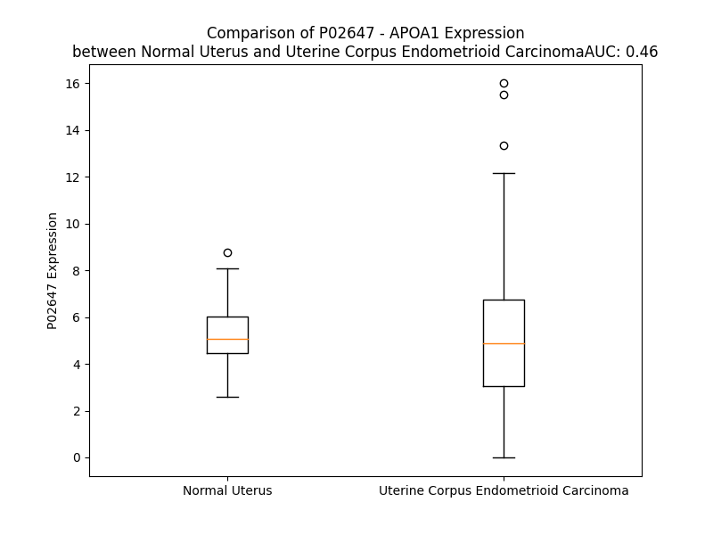

# Detailed Data for P02647

## Introduction to the Detailed Summary

### How to Interpret the Results

- **Summary & Metrics**: This section provides a quick reference to essential protein attributes, including expression changes, family classification, and biomarker applications. Regulation status (upregulated/downregulated) indicates the protein's behavior in a disease context. Some information comes from the original excel file with the proteins selected from literature, while others are derived from the analyses.
- **Expression Comparison**: A visual representation comparing protein expression between normal and disease states. It highlights significant changes in expression levels that might indicate diagnostic or therapeutic relevance. This is data coming from transcriptomics experiments and could not translate similarly to protein levels.
- **Isoform Alignment**: An interactive view of isoform alignments, revealing structural and functional differences between variants of the protein.
- **Interactors & Homologs**: Tables listing known interaction partners and homologous proteins, the more interactors and homologs, the more complex the protein is to design an antibody for.
- **Biological Assemblies**: Information about the structural arrangement of the protein in different assemblies, providing insights into its functional state but also the complexity of the protein to develop antibodies.
- **Combined Per-Residue Information**: A detailed table summarizing residue-level data. This includes predictions for epitope regions, aggregation tendencies, and modifications that might impact the protein's function. Each row corresponds to a residue in the protein, providing insights into specific sites that may be important for research or drug development.
## Summary & Metrics

- **UniProt Accession**: P02647
- **Gene Name**: APOA1
- **Protein Name**: apolipoprotein A-I
- **Swiss Prot**: APOA1_HUMAN
- **Family**: transporter
- **Biomarker Application**: diagnosis,efficacy,safety,unspecified application
- **Number of Isoforms**: 0
- **Regulation**: -1
- **(transcriptomics) AUC**: 0.46
- **(transcriptomics) Fold Change**: 1.05
- **(transcriptomics) Regulation**: Upregulated
- **Discotope Epitope Count**: 26
- **Max n_uniprots (Homo)**: 4.0
- **Max n_uniprots (Hetero)**: 4.0

## Expression Comparison

## Interactors

| preferredName_A   | preferredName_B   |   score |
|:------------------|:------------------|--------:|
| APOA1             | APOA2             |   0.999 |
| APOA1             | APOE              |   0.999 |
| APOA1             | APOB              |   0.999 |
| APOA1             | APOC3             |   0.999 |
| APOA1             | SCARB1            |   0.999 |
| APOA1             | ABCA1             |   0.999 |
| APOA1             | LCAT              |   0.999 |
| APOA1             | APOL1             |   0.998 |
| APOA1             | ALB               |   0.998 |
| APOA1             | PON1              |   0.998 |
| APOA1             | HP                |   0.998 |
| APOA1             | CLU               |   0.998 |
| APOA1             | A2M               |   0.998 |
| APOA1             | APOC1             |   0.998 |
| APOA1             | ABCG1             |   0.997 |
| APOA1             | APOC2             |   0.997 |
| APOA1             | HPR               |   0.997 |
| APOA1             | TTR               |   0.994 |
| APOA1             | ABCA7             |   0.992 |
| APOA1             | APOA4             |   0.989 |
| APOA1             | CETP              |   0.989 |
| APOA1             | CUBN              |   0.985 |
| APOA1             | APOH              |   0.985 |
| APOA1             | APP               |   0.982 |
| APOA1             | LPA               |   0.976 |
| APOA1             | NAXE              |   0.975 |
| APOA1             | PLTP              |   0.973 |
| APOA1             | APOM              |   0.972 |
| APOA1             | APOD              |   0.96  |
| APOA1             | C3                |   0.957 |
| APOA1             | APOA5             |   0.951 |
| APOA1             | LBP               |   0.949 |
| APOA1             | AHSG              |   0.944 |
| APOA1             | LIPC              |   0.94  |
| APOA1             | SAA4              |   0.931 |
| APOA1             | SERPINA1          |   0.927 |
| APOA1             | F2                |   0.927 |
| APOA1             | PLA2G7            |   0.924 |
| APOA1             | MPO               |   0.924 |
| APOA1             | TF                |   0.919 |
| APOA1             | CD36              |   0.917 |
| APOA1             | B2M               |   0.913 |
| APOA1             | MMP14             |   0.913 |
| APOA1             | APOF              |   0.912 |
| APOA1             | SAA2-SAA4         |   0.907 |
| APOA1             | INS               |   0.906 |
| APOA1             | FGA               |   0.902 |
| APOA1             | APOC4             |   0.901 |

## Homologs

| uniprot_id   | gene_id   |
|:-------------|:----------|
| E7ERP7       | APOE      |
| A0A0B4RUS7   | APOA5     |
| P06727       | APOA4     |

## Biological Assemblies

|   Unnamed: 0 |   assembly |   n_uniprots | composition   | crystal_id   |
|-------------:|-----------:|-------------:|:--------------|:-------------|
|            0 |          1 |            3 | Hetero        | 6cm1         |
|            0 |          1 |            1 | Homo          | 1odr         |
|            0 |          1 |            4 | Hetero        | 6pts         |
|            0 |          1 |            2 | Homo          | 3k2s         |
|            0 |          1 |            4 | Hetero        | 7rse         |
|            0 |          1 |            1 | Homo          | 1odq         |
|            0 |          1 |            4 | Homo          | 1av1         |
|            0 |          1 |            4 | Hetero        | 6w4f         |
|            0 |          1 |            3 | Hetero        | 6cch         |
|            0 |          1 |            4 | Hetero        | 6ptw         |
|            0 |          1 |            4 | Hetero        | 2mse         |
|            0 |          1 |            1 | Homo          | 1gw4         |
|            0 |          1 |            1 | Homo          | 1gw3         |
|            0 |          1 |            3 | Hetero        | 6cc9         |
|            0 |          1 |            3 | Hetero        | 2msc         |
|            0 |          1 |            1 | Homo          | 3r2p         |
|            0 |          1 |            3 | Hetero        | 6ccx         |
|            0 |          1 |            2 | Homo          | 2n5e         |
|            0 |          1 |            4 | Hetero        | 6w4e         |
|            0 |          1 |            3 | Hetero        | 2msd         |
|            0 |          1 |            4 | Hetero        | 8eqs         |
|            0 |          1 |            4 | Hetero        | 7kjr         |
|            0 |          1 |            1 | Homo          | 1odp         |
|            0 |          1 |            3 | Hetero        | 6clz         |
|            0 |          1 |            4 | Hetero        | 7rsc         |

## Combined Per-Residue Information

|   res | aa   |   epitope_score | epitope   |   relative_surface_accessibility |   modeling_confidence |   Aggregation | modification         | glycosylation                     |
|------:|:-----|----------------:|:----------|---------------------------------:|----------------------:|--------------:|:---------------------|:----------------------------------|
|     1 | M    |         0.05211 | False     |                          0.74122 |                 49.2  |         0     | N/A                  | N/A                               |
|     2 | K    |         0.0593  | False     |                          0.59141 |                 41.88 |         0     | N/A                  | N/A                               |
|     3 | A    |         0.04421 | False     |                          0.70671 |                 53.52 |         8.071 | N/A                  | N/A                               |
|     4 | A    |         0.07087 | False     |                          0.59807 |                 56.46 |        27.724 | N/A                  | N/A                               |
|     5 | V    |         0.07335 | False     |                          0.76542 |                 55.46 |        91.478 | N/A                  | N/A                               |
|     6 | L    |         0.04743 | False     |                          0.72409 |                 54.97 |        96.892 | N/A                  | N/A                               |
|     7 | T    |         0.03954 | False     |                          0.59765 |                 60.45 |        97.882 | N/A                  | N/A                               |
|     8 | L    |         0.08007 | False     |                          0.66466 |                 55.24 |        99.531 | N/A                  | N/A                               |
|     9 | A    |         0.044   | False     |                          0.43248 |                 60.21 |        99.798 | N/A                  | N/A                               |
|    10 | V    |         0.02882 | False     |                          0.61789 |                 60.68 |        99.914 | N/A                  | N/A                               |
|    11 | L    |         0.08722 | False     |                          0.76861 |                 58.43 |        99.773 | N/A                  | N/A                               |
|    12 | F    |         0.05204 | False     |                          0.7894  |                 58.82 |        98.986 | N/A                  | N/A                               |
|    13 | L    |         0.05461 | False     |                          0.77261 |                 55.15 |        89.17  | N/A                  | N/A                               |
|    14 | T    |         0.05803 | False     |                          0.6095  |                 58.26 |        35.388 | N/A                  | N/A                               |
|    15 | G    |         0.08442 | False     |                          0.6641  |                 44.47 |         3.262 | N/A                  | N/A                               |
|    16 | S    |         0.08205 | False     |                          0.66405 |                 53.93 |         0.368 | N/A                  | N/A                               |
|    17 | Q    |         0.10061 | False     |                          0.6529  |                 47.88 |         0.009 | N/A                  | N/A                               |
|    18 | A    |         0.08891 | False     |                          0.65829 |                 47.69 |         0.004 | N/A                  | N/A                               |
|    19 | R    |         0.2718  | True      |                          0.92097 |                 48.37 |         0     | N/A                  | N/A                               |
|    20 | H    |         0.21373 | False     |                          0.92056 |                 50.6  |         0     | N/A                  | N/A                               |
|    21 | F    |         0.19914 | False     |                          0.9615  |                 47.01 |         0     | N/A                  | N/A                               |
|    22 | W    |         0.35577 | True      |                          1.00124 |                 47.7  |         0     | N/A                  | N/A                               |
|    23 | Q    |         0.3511  | True      |                          0.8561  |                 48.89 |         0     | N/A                  | N/A                               |
|    24 | Q    |         0.32296 | True      |                          0.89721 |                 43.93 |         0     | N/A                  | N/A                               |
|    25 | D    |         0.26021 | True      |                          0.87873 |                 42.35 |         0     | N/A                  | N/A                               |
|    26 | E    |         0.27423 | True      |                          0.86192 |                 52.15 |         0     | N/A                  | N/A                               |
|    27 | P    |         0.26869 | True      |                          0.86982 |                 54.29 |         0     | N/A                  | N/A                               |
|    28 | P    |         0.24742 | True      |                          0.95599 |                 48.74 |         0     | N/A                  | N/A                               |
|    29 | Q    |         0.28365 | True      |                          0.67784 |                 52.09 |         0     | N/A                  | N/A                               |
|    30 | S    |         0.21037 | False     |                          0.44919 |                 55.88 |         0     | N/A                  | N/A                               |
|    31 | P    |         0.2242  | True      |                          0.76561 |                 56.68 |         0     | N/A                  | N/A                               |
|    32 | W    |         0.24188 | True      |                          0.73497 |                 56.58 |         0     | N/A                  | N/A                               |
|    33 | D    |         0.16371 | False     |                          0.61285 |                 68.19 |         0     | N/A                  | N/A                               |
|    34 | R    |         0.13017 | False     |                          0.59935 |                 60.29 |         0     | N/A                  | N/A                               |
|    35 | V    |         0.08388 | False     |                          0.50861 |                 67.75 |         0.916 | N/A                  | N/A                               |
|    36 | K    |         0.15366 | False     |                          0.62116 |                 70.84 |         1.095 | N/A                  | N/A                               |
|    37 | D    |         0.17252 | False     |                          0.61367 |                 68.9  |         1.095 | N/A                  | N/A                               |
|    38 | L    |         0.11858 | False     |                          0.75823 |                 66.58 |        49.029 | N/A                  | N/A                               |
|    39 | A    |         0.09792 | False     |                          0.47129 |                 70.68 |        50.125 | N/A                  | N/A                               |
|    40 | T    |         0.1401  | False     |                          0.59777 |                 67.65 |        50.457 | N/A                  | N/A                               |
|    41 | V    |         0.07663 | False     |                          0.63573 |                 70.04 |        51.016 | N/A                  | N/A                               |
|    42 | Y    |         0.10666 | False     |                          0.75253 |                 58.75 |        51.016 | N/A                  | N/A                               |
|    43 | V    |         0.13765 | False     |                          0.6578  |                 63.21 |        47.525 | N/A                  | N/A                               |
|    44 | D    |         0.15533 | False     |                          0.50841 |                 66.68 |         5.25  | N/A                  | N/A                               |
|    45 | V    |         0.06161 | False     |                          0.67439 |                 62.4  |         5.25  | N/A                  | N/A                               |
|    46 | L    |         0.12798 | False     |                          0.73492 |                 59.77 |         5.25  | N/A                  | N/A                               |
|    47 | K    |         0.1375  | False     |                          0.77799 |                 59.66 |         5.25  | N/A                  | N/A                               |
|    48 | D    |         0.09761 | False     |                          0.6738  |                 61.59 |         0     | N/A                  | N/A                               |
|    49 | S    |         0.04104 | False     |                          0.36696 |                 59.62 |         0     | N/A                  | N/A                               |
|    50 | G    |         0.0848  | False     |                          0.37863 |                 55.05 |         0     | N/A                  | N/A                               |
|    51 | R    |         0.14657 | False     |                          0.8034  |                 56.15 |         0     | N/A                  | N/A                               |
|    52 | D    |         0.11633 | False     |                          0.70351 |                 61.15 |         0     | N/A                  | N/A                               |
|    53 | Y    |         0.09195 | False     |                          0.67822 |                 55.14 |         0.153 | N/A                  | N/A                               |
|    54 | V    |         0.1186  | False     |                          0.63655 |                 53.39 |         0.153 | N/A                  | N/A                               |
|    55 | S    |         0.11965 | False     |                          0.65529 |                 57.79 |         0.153 | N/A                  | N/A                               |
|    56 | Q    |         0.10589 | False     |                          0.70393 |                 54.59 |         0.153 | N/A                  | N/A                               |
|    57 | F    |         0.1428  | False     |                          0.62383 |                 52.75 |         0.153 | N/A                  | N/A                               |
|    58 | E    |         0.22784 | True      |                          0.8022  |                 50.08 |         0     | N/A                  | N/A                               |
|    59 | G    |         0.23977 | True      |                          0.92305 |                 55.13 |         0     | N/A                  | N/A                               |
|    60 | S    |         0.13629 | False     |                          0.43891 |                 48.32 |         0     | N/A                  | N/A                               |
|    61 | A    |         0.21572 | False     |                          0.62249 |                 50.58 |         0     | N/A                  | N/A                               |
|    62 | L    |         0.12525 | False     |                          0.36423 |                 48.75 |         0     | N/A                  | N/A                               |
|    63 | G    |         0.21033 | False     |                          0.85331 |                 50.61 |         0     | N/A                  | N/A                               |
|    64 | K    |         0.23985 | True      |                          0.82523 |                 54.01 |         0     | N/A                  | N/A                               |
|    65 | Q    |         0.15588 | False     |                          0.46367 |                 50.17 |         0     | N/A                  | N/A                               |
|    66 | L    |         0.12331 | False     |                          0.35825 |                 54.1  |         0     | N/A                  | N/A                               |
|    67 | N    |         0.22664 | True      |                          0.78988 |                 45.01 |         0     | N/A                  | N/A                               |
|    68 | L    |         0.18109 | False     |                          0.78737 |                 50.33 |         0     | N/A                  | N/A                               |
|    69 | K    |         0.05688 | False     |                          0.53759 |                 55.74 |         0     | N/A                  | N/A                               |
|    70 | L    |         0.08417 | False     |                          0.4572  |                 55.78 |         0     | N/A                  | N/A                               |
|    71 | L    |         0.18788 | False     |                          0.87627 |                 53.37 |         0     | N/A                  | N/A                               |
|    72 | D    |         0.11673 | False     |                          0.64789 |                 60.34 |         0     | N/A                  | N/A                               |
|    73 | N    |         0.06047 | False     |                          0.38099 |                 59.14 |         0     | N/A                  | N/A                               |
|    74 | W    |         0.12276 | False     |                          0.80322 |                 57.23 |         0     | N/A                  | N/A                               |
|    75 | D    |         0.16906 | False     |                          0.67961 |                 64.88 |         0     | N/A                  | N/A                               |
|    76 | S    |         0.06282 | False     |                          0.39918 |                 65.76 |         0.137 | N/A                  | N/A                               |
|    77 | V    |         0.05442 | False     |                          0.5616  |                 63.32 |         1.385 | N/A                  | N/A                               |
|    78 | T    |         0.13735 | False     |                          0.51587 |                 64.87 |         1.385 | N/A                  | N/A                               |
|    79 | S    |         0.14009 | False     |                          0.42049 |                 66.99 |         1.385 | N/A                  | N/A                               |
|    80 | T    |         0.07221 | False     |                          0.5375  |                 62.94 |         1.385 | N/A                  | N/A                               |
|    81 | F    |         0.07253 | False     |                          0.56421 |                 65.65 |         1.385 | N/A                  | N/A                               |
|    82 | S    |         0.16987 | False     |                          0.43543 |                 65.71 |         0.138 | N/A                  | N/A                               |
|    83 | K    |         0.13017 | False     |                          0.68726 |                 68.34 |         0     | N/A                  | N/A                               |
|    84 | L    |         0.11039 | False     |                          0.58494 |                 66.57 |         0     | N/A                  | N/A                               |
|    85 | R    |         0.19923 | False     |                          0.69101 |                 62.93 |         0     | N/A                  | N/A                               |
|    86 | E    |         0.23842 | True      |                          0.76174 |                 65.79 |         0     | N/A                  | N/A                               |
|    87 | Q    |         0.3368  | True      |                          0.81641 |                 63.85 |         0     | N/A                  | N/A                               |
|    88 | L    |         0.14542 | False     |                          0.44182 |                 57.23 |         0     | N/A                  | N/A                               |
|    89 | G    |         0.15684 | False     |                          0.44132 |                 64.85 |         0     | N/A                  | N/A                               |
|    90 | P    |         0.24154 | True      |                          0.83104 |                 64.38 |         0     | N/A                  | N/A                               |
|    91 | V    |         0.2425  | True      |                          0.91992 |                 57.72 |         0     | N/A                  | N/A                               |
|    92 | T    |         0.13714 | False     |                          0.13368 |                 61.85 |         0     | N/A                  | N/A                               |
|    93 | Q    |         0.22902 | True      |                          0.68826 |                 64.62 |         0     | N/A                  | N/A                               |
|    94 | E    |         0.16579 | False     |                          0.7189  |                 69.9  |         0     | N/A                  | N/A                               |
|    95 | F    |         0.14339 | False     |                          0.61668 |                 75.98 |         0     | N/A                  | N/A                               |
|    96 | W    |         0.15224 | False     |                          0.37845 |                 66.55 |         0     | N/A                  | N/A                               |
|    97 | D    |         0.15549 | False     |                          0.4619  |                 75.85 |         0     | N/A                  | N/A                               |
|    98 | N    |         0.1448  | False     |                          0.62464 |                 78.26 |         0     | N/A                  | N/A                               |
|    99 | L    |         0.07351 | False     |                          0.40688 |                 76.97 |         0     | N/A                  | N/A                               |
|   100 | E    |         0.1144  | False     |                          0.60485 |                 75.74 |         0     | N/A                  | N/A                               |
|   101 | K    |         0.13293 | False     |                          0.66465 |                 78.26 |         0     | N/A                  | N/A                               |
|   102 | E    |         0.06947 | False     |                          0.66762 |                 76.41 |         0     | N/A                  | N/A                               |
|   103 | T    |         0.05894 | False     |                          0.48088 |                 74.16 |         0     | N/A                  | N/A                               |
|   104 | E    |         0.07645 | False     |                          0.55668 |                 78.08 |         0     | N/A                  | N/A                               |
|   105 | G    |         0.1731  | False     |                          0.43251 |                 81.06 |         0     | N/A                  | N/A                               |
|   106 | L    |         0.09499 | False     |                          0.65174 |                 80.26 |         0     | N/A                  | N/A                               |
|   107 | R    |         0.09414 | False     |                          0.73439 |                 74.68 |         0     | N/A                  | N/A                               |
|   108 | Q    |         0.14138 | False     |                          0.63545 |                 82.6  |         0     | N/A                  | N/A                               |
|   109 | E    |         0.13534 | False     |                          0.61938 |                 81.7  |         0     | N/A                  | N/A                               |
|   110 | M    |         0.05649 | False     |                          0.5799  |                 76.57 |         0     | Methionine sulfoxide | N/A                               |
|   111 | S    |         0.06486 | False     |                          0.45645 |                 79.41 |         0     | N/A                  | N/A                               |
|   112 | K    |         0.17457 | False     |                          0.71383 |                 84.16 |         0     | N/A                  | N/A                               |
|   113 | D    |         0.06032 | False     |                          0.54582 |                 82.16 |         0     | N/A                  | N/A                               |
|   114 | L    |         0.06988 | False     |                          0.70111 |                 78.6  |         0     | N/A                  | N/A                               |
|   115 | E    |         0.16605 | False     |                          0.62047 |                 83.73 |         0     | N/A                  | N/A                               |
|   116 | E    |         0.1421  | False     |                          0.47713 |                 84.14 |         0     | N/A                  | N/A                               |
|   117 | V    |         0.07068 | False     |                          0.59219 |                 83.96 |         0     | N/A                  | N/A                               |
|   118 | K    |         0.10084 | False     |                          0.68594 |                 79.4  |         0     | N/A                  | N/A                               |
|   119 | A    |         0.10672 | False     |                          0.63537 |                 85.86 |         0     | N/A                  | N/A                               |
|   120 | K    |         0.23024 | True      |                          0.61678 |                 85.92 |         0     | N/A                  | N/A                               |
|   121 | V    |         0.09555 | False     |                          0.4351  |                 83.01 |         0     | N/A                  | N/A                               |
|   122 | Q    |         0.12459 | False     |                          0.50178 |                 80.42 |         0     | N/A                  | N/A                               |
|   123 | P    |         0.24221 | True      |                          0.56915 |                 87.59 |         0     | N/A                  | N/A                               |
|   124 | Y    |         0.19892 | False     |                          0.73732 |                 85.03 |         0     | N/A                  | N/A                               |
|   125 | L    |         0.06747 | False     |                          0.68164 |                 80.79 |         0     | N/A                  | N/A                               |
|   126 | D    |         0.13384 | False     |                          0.47634 |                 87.34 |         0     | N/A                  | N/A                               |
|   127 | D    |         0.10777 | False     |                          0.39654 |                 89.1  |         0     | N/A                  | N/A                               |
|   128 | F    |         0.07105 | False     |                          0.65016 |                 87.88 |         0     | N/A                  | N/A                               |
|   129 | Q    |         0.11066 | False     |                          0.56845 |                 84.28 |         0     | N/A                  | N/A                               |
|   130 | K    |         0.1843  | False     |                          0.67307 |                 89.37 |         0     | N/A                  | N/A                               |
|   131 | K    |         0.11444 | False     |                          0.56603 |                 89.64 |         0     | N/A                  | N/A                               |
|   132 | W    |         0.05892 | False     |                          0.60012 |                 86.5  |         0     | N/A                  | N/A                               |
|   133 | Q    |         0.08781 | False     |                          0.50884 |                 87.45 |         0     | N/A                  | N/A                               |
|   134 | E    |         0.13252 | False     |                          0.55552 |                 89.91 |         0     | N/A                  | N/A                               |
|   135 | E    |         0.04523 | False     |                          0.58479 |                 87.41 |         0     | N/A                  | N/A                               |
|   136 | M    |         0.0577  | False     |                          0.57657 |                 85.57 |         0     | Methionine sulfoxide | N/A                               |
|   137 | E    |         0.11487 | False     |                          0.55727 |                 88.1  |         0     | N/A                  | N/A                               |
|   138 | L    |         0.09043 | False     |                          0.62844 |                 86.96 |         0     | N/A                  | N/A                               |
|   139 | Y    |         0.07281 | False     |                          0.66608 |                 84.79 |         0     | N/A                  | N/A                               |
|   140 | R    |         0.10562 | False     |                          0.70726 |                 84.43 |         0     | N/A                  | N/A                               |
|   141 | Q    |         0.16557 | False     |                          0.63867 |                 85.8  |         0     | N/A                  | N/A                               |
|   142 | K    |         0.13828 | False     |                          0.67779 |                 85.1  |         0     | N/A                  | N/A                               |
|   143 | V    |         0.08185 | False     |                          0.44652 |                 86.53 |         0     | N/A                  | N/A                               |
|   144 | E    |         0.1031  | False     |                          0.62353 |                 81.72 |         0     | N/A                  | N/A                               |
|   145 | P    |         0.15118 | False     |                          0.45501 |                 85.61 |         0     | N/A                  | N/A                               |
|   146 | L    |         0.05039 | False     |                          0.63597 |                 82    |         0     | N/A                  | N/A                               |
|   147 | R    |         0.06553 | False     |                          0.71789 |                 81.97 |         0     | N/A                  | N/A                               |
|   148 | A    |         0.07262 | False     |                          0.50092 |                 86.71 |         0     | N/A                  | N/A                               |
|   149 | E    |         0.10174 | False     |                          0.58786 |                 87.49 |         0     | N/A                  | N/A                               |
|   150 | L    |         0.04913 | False     |                          0.80357 |                 88.04 |         0     | N/A                  | N/A                               |
|   151 | Q    |         0.04654 | False     |                          0.46472 |                 87.4  |         0     | N/A                  | N/A                               |
|   152 | E    |         0.10221 | False     |                          0.57521 |                 88.96 |         0     | N/A                  | N/A                               |
|   153 | G    |         0.05712 | False     |                          0.35721 |                 89.07 |         0     | N/A                  | N/A                               |
|   154 | A    |         0.03438 | False     |                          0.49682 |                 89.59 |         0     | N/A                  | N/A                               |
|   155 | R    |         0.13518 | False     |                          0.63305 |                 88.54 |         0     | N/A                  | N/A                               |
|   156 | Q    |         0.14178 | False     |                          0.63225 |                 90.41 |         0     | N/A                  | N/A                               |
|   157 | K    |         0.04363 | False     |                          0.60418 |                 87.9  |         0     | N/A                  | N/A                               |
|   158 | L    |         0.05289 | False     |                          0.72461 |                 88.59 |         0     | N/A                  | N/A                               |
|   159 | H    |         0.12729 | False     |                          0.61462 |                 87.25 |         0     | N/A                  | N/A                               |
|   160 | E    |         0.09329 | False     |                          0.3787  |                 87.85 |         0     | N/A                  | N/A                               |
|   161 | L    |         0.04854 | False     |                          0.55974 |                 88.02 |         0     | N/A                  | N/A                               |
|   162 | Q    |         0.07726 | False     |                          0.619   |                 82.97 |         0     | N/A                  | N/A                               |
|   163 | E    |         0.12411 | False     |                          0.57929 |                 85.4  |         0     | N/A                  | N/A                               |
|   164 | K    |         0.23442 | True      |                          0.70954 |                 85    |         0     | N/A                  | N/A                               |
|   165 | L    |         0.11211 | False     |                          0.6144  |                 84.31 |         0     | N/A                  | N/A                               |
|   166 | S    |         0.07976 | False     |                          0.5649  |                 80.69 |         0     | N/A                  | N/A                               |
|   167 | P    |         0.13958 | False     |                          0.55561 |                 84.97 |         0     | N/A                  | N/A                               |
|   168 | L    |         0.05905 | False     |                          0.60025 |                 81.04 |         0     | N/A                  | N/A                               |
|   169 | G    |         0.05484 | False     |                          0.4657  |                 83.29 |         0     | N/A                  | N/A                               |
|   170 | E    |         0.09609 | False     |                          0.61242 |                 84.48 |         0     | N/A                  | N/A                               |
|   171 | E    |         0.06305 | False     |                          0.51424 |                 85.46 |         0     | N/A                  | N/A                               |
|   172 | M    |         0.0549  | False     |                          0.63255 |                 86.95 |         0     | N/A                  | N/A                               |
|   173 | R    |         0.06163 | False     |                          0.60374 |                 86.07 |         0     | N/A                  | N/A                               |
|   174 | D    |         0.13641 | False     |                          0.54911 |                 88.85 |         0     | N/A                  | N/A                               |
|   175 | R    |         0.08197 | False     |                          0.52647 |                 87.56 |         0     | N/A                  | N/A                               |
|   176 | A    |         0.03795 | False     |                          0.51238 |                 88.97 |         0     | N/A                  | N/A                               |
|   177 | R    |         0.13036 | False     |                          0.54481 |                 85.87 |         0     | N/A                  | N/A                               |
|   178 | A    |         0.06642 | False     |                          0.56009 |                 88.56 |         0     | N/A                  | N/A                               |
|   179 | H    |         0.05403 | False     |                          0.63447 |                 87.41 |         0     | N/A                  | N/A                               |
|   180 | V    |         0.03303 | False     |                          0.66235 |                 89.07 |         0     | N/A                  | N/A                               |
|   181 | D    |         0.11191 | False     |                          0.5452  |                 86.75 |         0     | N/A                  | N/A                               |
|   182 | A    |         0.09008 | False     |                          0.47442 |                 86.52 |         0     | N/A                  | N/A                               |
|   183 | L    |         0.08735 | False     |                          0.62153 |                 85.67 |         0     | N/A                  | N/A                               |
|   184 | R    |         0.10101 | False     |                          0.7217  |                 82.82 |         0     | N/A                  | N/A                               |
|   185 | T    |         0.17748 | False     |                          0.66827 |                 83.13 |         0     | N/A                  | N/A                               |
|   186 | H    |         0.15852 | False     |                          0.71492 |                 81.25 |         0     | N/A                  | N/A                               |
|   187 | L    |         0.10856 | False     |                          0.53652 |                 80.54 |         0     | N/A                  | N/A                               |
|   188 | A    |         0.09955 | False     |                          0.46587 |                 77.08 |         0     | N/A                  | N/A                               |
|   189 | P    |         0.17462 | False     |                          0.59889 |                 77.62 |         0     | N/A                  | N/A                               |
|   190 | Y    |         0.15511 | False     |                          0.62633 |                 77.42 |         0     | N/A                  | N/A                               |
|   191 | S    |         0.04375 | False     |                          0.36027 |                 76.55 |         0     | N/A                  | N/A                               |
|   192 | D    |         0.12247 | False     |                          0.52061 |                 81.37 |         0     | N/A                  | N/A                               |
|   193 | E    |         0.13175 | False     |                          0.4383  |                 83.81 |         0     | N/A                  | N/A                               |
|   194 | L    |         0.04515 | False     |                          0.58682 |                 84.94 |         0     | N/A                  | N/A                               |
|   195 | R    |         0.06475 | False     |                          0.70426 |                 83.68 |         0     | N/A                  | N/A                               |
|   196 | Q    |         0.12868 | False     |                          0.65116 |                 87.24 |         0     | N/A                  | N/A                               |
|   197 | R    |         0.07784 | False     |                          0.65602 |                 86.7  |         0     | N/A                  | N/A                               |
|   198 | L    |         0.06329 | False     |                          0.70141 |                 88.83 |         0     | N/A                  | N/A                               |
|   199 | A    |         0.10571 | False     |                          0.52234 |                 89.15 |         0     | N/A                  | N/A                               |
|   200 | A    |         0.08724 | False     |                          0.55627 |                 89.18 |         0     | N/A                  | N/A                               |
|   201 | R    |         0.06601 | False     |                          0.75826 |                 86.56 |         0     | N/A                  | N/A                               |
|   202 | L    |         0.10414 | False     |                          0.75464 |                 87.91 |         0     | N/A                  | N/A                               |
|   203 | E    |         0.13677 | False     |                          0.60453 |                 87.4  |         0     | N/A                  | N/A                               |
|   204 | A    |         0.04125 | False     |                          0.40159 |                 85.58 |         0     | N/A                  | N/A                               |
|   205 | L    |         0.06016 | False     |                          0.75857 |                 83.43 |         0     | N/A                  | N/A                               |
|   206 | K    |         0.10396 | False     |                          0.78604 |                 81.57 |         0     | N/A                  | N/A                               |
|   207 | E    |         0.20187 | False     |                          0.71702 |                 82.36 |         0     | N/A                  | N/A                               |
|   208 | N    |         0.10648 | False     |                          0.5239  |                 79.79 |         0     | N/A                  | N/A                               |
|   209 | G    |         0.08614 | False     |                          0.22832 |                 77.88 |         0     | N/A                  | N/A                               |
|   210 | G    |         0.14731 | False     |                          0.49447 |                 76.91 |         0     | N/A                  | N/A                               |
|   211 | A    |         0.11254 | False     |                          0.57765 |                 76.98 |         0     | N/A                  | N/A                               |
|   212 | R    |         0.0914  | False     |                          0.61973 |                 73.75 |         0     | N/A                  | N/A                               |
|   213 | L    |         0.11906 | False     |                          0.72293 |                 76.49 |         0     | N/A                  | N/A                               |
|   214 | A    |         0.11942 | False     |                          0.62251 |                 79.43 |         0     | N/A                  | N/A                               |
|   215 | E    |         0.16743 | False     |                          0.53695 |                 81.14 |         0     | N/A                  | N/A                               |
|   216 | Y    |         0.10451 | False     |                          0.71316 |                 80.89 |         0     | N/A                  | N/A                               |
|   217 | H    |         0.13695 | False     |                          0.74592 |                 76.45 |         0     | N/A                  | N/A                               |
|   218 | A    |         0.19131 | False     |                          0.60755 |                 84.85 |         0     | N/A                  | N/A                               |
|   219 | K    |         0.0737  | False     |                          0.6154  |                 81.57 |         0     | N/A                  | N/A                               |
|   220 | A    |         0.05235 | False     |                          0.48341 |                 83.04 |         0     | N/A                  | N/A                               |
|   221 | T    |         0.1146  | False     |                          0.59827 |                 83.07 |         0     | N/A                  | N/A                               |
|   222 | E    |         0.11253 | False     |                          0.62705 |                 86.1  |         0     | N/A                  | N/A                               |
|   223 | H    |         0.04815 | False     |                          0.66534 |                 81.11 |         0     | N/A                  | N/A                               |
|   224 | L    |         0.09457 | False     |                          0.76973 |                 79.16 |         0     | N/A                  | N/A                               |
|   225 | S    |         0.12497 | False     |                          0.4902  |                 78    |         0     | N/A                  | N/A                               |
|   226 | T    |         0.07384 | False     |                          0.44505 |                 81.07 |         0     | N/A                  | N/A                               |
|   227 | L    |         0.08263 | False     |                          0.75061 |                 78.31 |         0     | N/A                  | N/A                               |
|   228 | S    |         0.15975 | False     |                          0.55189 |                 76.04 |         0     | N/A                  | N/A                               |
|   229 | E    |         0.16775 | False     |                          0.70008 |                 80.24 |         0     | N/A                  | N/A                               |
|   230 | K    |         0.19885 | False     |                          0.72702 |                 76.75 |         0     | N/A                  | N/A                               |
|   231 | A    |         0.09208 | False     |                          0.44436 |                 71.7  |         0     | N/A                  | N/A                               |
|   232 | K    |         0.16227 | False     |                          0.79348 |                 72.58 |         0     | N/A                  | N/A                               |
|   233 | P    |         0.24256 | True      |                          0.52622 |                 79.69 |         0     | N/A                  | N/A                               |
|   234 | A    |         0.0536  | False     |                          0.5257  |                 76.31 |         0     | N/A                  | N/A                               |
|   235 | L    |         0.12899 | False     |                          0.7901  |                 73.29 |         0     | N/A                  | N/A                               |
|   236 | E    |         0.16993 | False     |                          0.62447 |                 74.7  |         0     | N/A                  | N/A                               |
|   237 | D    |         0.10005 | False     |                          0.65028 |                 79    |         0     | N/A                  | N/A                               |
|   238 | L    |         0.05985 | False     |                          0.70894 |                 81.19 |         0     | N/A                  | N/A                               |
|   239 | R    |         0.17036 | False     |                          0.75253 |                 76.16 |         0     | N/A                  | N/A                               |
|   240 | Q    |         0.17126 | False     |                          0.69126 |                 77.58 |         0     | N/A                  | N/A                               |
|   241 | G    |         0.13602 | False     |                          0.47546 |                 80.7  |         0     | N/A                  | N/A                               |
|   242 | L    |         0.1255  | False     |                          0.51758 |                 79.98 |         0     | N/A                  | N/A                               |
|   243 | L    |         0.15004 | False     |                          0.74836 |                 77.14 |         0     | N/A                  | N/A                               |
|   244 | P    |         0.16406 | False     |                          0.55895 |                 80.55 |         0     | N/A                  | N/A                               |
|   245 | V    |         0.04966 | False     |                          0.60908 |                 80.83 |         2.065 | N/A                  | N/A                               |
|   246 | L    |         0.07409 | False     |                          0.69778 |                 78.28 |         2.188 | N/A                  | N/A                               |
|   247 | E    |         0.11073 | False     |                          0.65047 |                 80.47 |         2.188 | N/A                  | N/A                               |
|   248 | S    |         0.09392 | False     |                          0.50528 |                 81.81 |         2.188 | N/A                  | N/A                               |
|   249 | F    |         0.09084 | False     |                          0.70922 |                 85.87 |         2.188 | N/A                  | N/A                               |
|   250 | K    |         0.09809 | False     |                          0.67377 |                 81.48 |         2.188 | N/A                  | N/A                               |
|   251 | V    |         0.09175 | False     |                          0.73848 |                 84.31 |         7.459 | N/A                  | N/A                               |
|   252 | S    |         0.07783 | False     |                          0.55727 |                 82.25 |         7.709 | N/A                  | N/A                               |
|   253 | F    |         0.11775 | False     |                          0.59949 |                 87.61 |         8.017 | N/A                  | N/A                               |
|   254 | L    |         0.11753 | False     |                          0.65758 |                 83.79 |         7.752 | N/A                  | N/A                               |
|   255 | S    |         0.1098  | False     |                          0.46378 |                 83.42 |         6.183 | N/A                  | N/A                               |
|   256 | A    |         0.07423 | False     |                          0.44093 |                 84.83 |         5.738 | N/A                  | N/A                               |
|   257 | L    |         0.11394 | False     |                          0.5682  |                 81.77 |         3.924 | N/A                  | N/A                               |
|   258 | E    |         0.144   | False     |                          0.63001 |                 82.31 |         0     | N/A                  | N/A                               |
|   259 | E    |         0.09819 | False     |                          0.49516 |                 83.26 |         0     | N/A                  | N/A                               |
|   260 | Y    |         0.12404 | False     |                          0.71222 |                 78.68 |         0     | N/A                  | N/A                               |
|   261 | T    |         0.11491 | False     |                          0.56944 |                 81.9  |         0     | N/A                  | N/A                               |
|   262 | K    |         0.13252 | False     |                          0.75039 |                 78.86 |         0     | N/A                  | N/A                               |
|   263 | K    |         0.12813 | False     |                          0.67837 |                 77.16 |         0     | N/A                  | N-linked (Glc) (glycation) lysine |
|   264 | L    |         0.19298 | False     |                          0.85867 |                 68.58 |         0     | N/A                  | N/A                               |
|   265 | N    |         0.22838 | True      |                          0.86504 |                 68.51 |         0     | N/A                  | N/A                               |
|   266 | T    |         0.23084 | True      |                          0.85189 |                 63.16 |         0     | N/A                  | N/A                               |
|   267 | Q    |         0.14594 | False     |                          1.12908 |                 46.22 |         0     | N/A                  | N/A                               |

