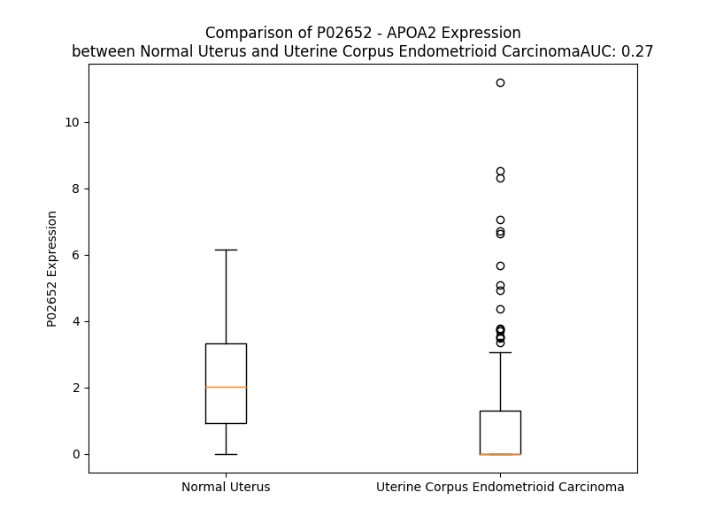

# Detailed Data for P02652

## Introduction to the Detailed Summary

### How to Interpret the Results

- **Summary & Metrics**: This section provides a quick reference to essential protein attributes, including expression changes, family classification, and biomarker applications. Regulation status (upregulated/downregulated) indicates the protein's behavior in a disease context. Some information comes from the original excel file with the proteins selected from literature, while others are derived from the analyses.
- **Expression Comparison**: A visual representation comparing protein expression between normal and disease states. It highlights significant changes in expression levels that might indicate diagnostic or therapeutic relevance. This is data coming from transcriptomics experiments and could not translate similarly to protein levels.
- **Isoform Alignment**: An interactive view of isoform alignments, revealing structural and functional differences between variants of the protein.
- **Interactors & Homologs**: Tables listing known interaction partners and homologous proteins, the more interactors and homologs, the more complex the protein is to design an antibody for.
- **Biological Assemblies**: Information about the structural arrangement of the protein in different assemblies, providing insights into its functional state but also the complexity of the protein to develop antibodies.
- **Combined Per-Residue Information**: A detailed table summarizing residue-level data. This includes predictions for epitope regions, aggregation tendencies, and modifications that might impact the protein's function. Each row corresponds to a residue in the protein, providing insights into specific sites that may be important for research or drug development.
## Summary & Metrics

- **UniProt Accession**: P02652
- **Gene Name**: APOA2
- **Protein Name**: apolipoprotein A-II
- **Swiss Prot**: APOA2_HUMAN
- **Family**: transporter
- **Biomarker Application**: prognosis
- **Number of Isoforms**: 0
- **Regulation**: -1
- **(transcriptomics) AUC**: 0.31
- **(transcriptomics) Fold Change**: 1.45
- **(transcriptomics) Regulation**: Downregulated
- **Discotope Epitope Count**: 3
- **Max n_uniprots (Homo)**: N/A
- **Max n_uniprots (Hetero)**: N/A

## Expression Comparison

## Interactors

| preferredName_A   | preferredName_B   |   score |
|:------------------|:------------------|--------:|
| APOA2             | APOC3             |   0.999 |
| APOA2             | APOB              |   0.999 |
| APOA2             | APOE              |   0.999 |
| APOA2             | APOA1             |   0.999 |
| APOA2             | APOC2             |   0.995 |
| APOA2             | APOA4             |   0.994 |
| APOA2             | APOD              |   0.993 |
| APOA2             | APOC1             |   0.991 |
| APOA2             | APOH              |   0.989 |
| APOA2             | LCAT              |   0.982 |
| APOA2             | APOM              |   0.98  |
| APOA2             | LPA               |   0.977 |
| APOA2             | APOA5             |   0.972 |
| APOA2             | CETP              |   0.97  |
| APOA2             | CLU               |   0.967 |
| APOA2             | PON1              |   0.967 |
| APOA2             | PLTP              |   0.962 |
| APOA2             | ALB               |   0.962 |
| APOA2             | APOC4             |   0.947 |
| APOA2             | AHSG              |   0.943 |
| APOA2             | HPR               |   0.932 |
| APOA2             | APOL1             |   0.926 |
| APOA2             | APOF              |   0.921 |
| APOA2             | AFP               |   0.905 |
| APOA2             | APP               |   0.902 |

## Homologs

| uniprot_id   | gene_id   |
|--------------|-----------|

## Combined Per-Residue Information

|   res | aa   |   epitope_score | epitope   |   relative_surface_accessibility |   modeling_confidence |   Aggregation | modification                |
|------:|:-----|----------------:|:----------|---------------------------------:|----------------------:|--------------:|:----------------------------|
|     1 | M    |         0.28593 | False     |                          1.12533 |                 64.59 |         0     | N/A                         |
|     2 | K    |         0.32478 | False     |                          0.9258  |                 76.79 |         0.049 | N/A                         |
|     3 | L    |         0.18925 | False     |                          0.90419 |                 81.75 |        50.916 | N/A                         |
|     4 | L    |         0.27374 | False     |                          0.80032 |                 81.54 |        70.18  | N/A                         |
|     5 | A    |         0.22413 | False     |                          0.60105 |                 79.57 |        75.189 | N/A                         |
|     6 | A    |         0.09566 | False     |                          0.5572  |                 79.02 |        81.086 | N/A                         |
|     7 | T    |         0.09414 | False     |                          0.4813  |                 77.91 |        87.916 | N/A                         |
|     8 | V    |         0.21168 | False     |                          0.62551 |                 80.78 |        98.143 | N/A                         |
|     9 | L    |         0.19181 | False     |                          0.71272 |                 79.35 |        98.929 | N/A                         |
|    10 | L    |         0.1343  | False     |                          0.72014 |                 77.81 |        98.814 | N/A                         |
|    11 | L    |         0.252   | False     |                          0.65502 |                 78.21 |        97.906 | N/A                         |
|    12 | T    |         0.1933  | False     |                          0.52861 |                 78.97 |        92.204 | N/A                         |
|    13 | I    |         0.14396 | False     |                          0.58341 |                 76.09 |        87.841 | N/A                         |
|    14 | C    |         0.10146 | False     |                          0.4787  |                 70.72 |        39.471 | N/A                         |
|    15 | S    |         0.14239 | False     |                          0.57768 |                 69.9  |        30.451 | N/A                         |
|    16 | L    |         0.17297 | False     |                          0.77023 |                 65.36 |        25.75  | N/A                         |
|    17 | E    |         0.16928 | False     |                          0.52936 |                 60.56 |         0.05  | N/A                         |
|    18 | G    |         0.1185  | False     |                          0.45743 |                 60.22 |         0.008 | N/A                         |
|    19 | A    |         0.20833 | False     |                          0.58201 |                 62.51 |         0.005 | N/A                         |
|    20 | L    |         0.27342 | False     |                          0.60685 |                 54.68 |         0.002 | N/A                         |
|    21 | V    |         0.16828 | False     |                          0.60334 |                 58    |         0.002 | N/A                         |
|    22 | R    |         0.28477 | False     |                          0.86872 |                 58.41 |         0.002 | N/A                         |
|    23 | R    |         0.42223 | True      |                          0.82942 |                 57.27 |         0     | N/A                         |
|    24 | Q    |         0.21211 | False     |                          0.33083 |                 47.6  |         0     | Pyrrolidone carboxylic acid |
|    25 | A    |         0.26579 | False     |                          0.78405 |                 53.21 |         0     | N/A                         |
|    26 | K    |         0.35119 | False     |                          0.89435 |                 52.21 |         0     | N/A                         |
|    27 | E    |         0.37888 | False     |                          0.52202 |                 54.56 |         0     | N/A                         |
|    28 | P    |         0.42097 | True      |                          0.85533 |                 58.34 |         0     | N/A                         |
|    29 | C    |         0.35781 | False     |                          0.50915 |                 64.06 |         0     | N/A                         |
|    30 | V    |         0.20901 | False     |                          0.36449 |                 66.92 |         0     | N/A                         |
|    31 | E    |         0.35106 | False     |                          0.68609 |                 70.79 |         0     | N/A                         |
|    32 | S    |         0.27328 | False     |                          0.51815 |                 76.03 |         0     | N/A                         |
|    33 | L    |         0.22199 | False     |                          0.62278 |                 77.66 |         0.307 | N/A                         |
|    34 | V    |         0.13381 | False     |                          0.57206 |                 80.44 |         0.461 | N/A                         |
|    35 | S    |         0.20723 | False     |                          0.42801 |                 82.17 |         0.461 | N/A                         |
|    36 | Q    |         0.28658 | False     |                          0.55748 |                 83.34 |         0.461 | N/A                         |
|    37 | Y    |         0.19641 | False     |                          0.66658 |                 81.88 |         0.883 | N/A                         |
|    38 | F    |         0.13773 | False     |                          0.65721 |                 84.95 |         0.883 | N/A                         |
|    39 | Q    |         0.3115  | False     |                          0.6151  |                 85.95 |         0.422 | N/A                         |
|    40 | T    |         0.2769  | False     |                          0.59872 |                 86.63 |         0.422 | N/A                         |
|    41 | V    |         0.07893 | False     |                          0.52443 |                 86.71 |         0.422 | N/A                         |
|    42 | T    |         0.12381 | False     |                          0.48553 |                 87.67 |         0.156 | N/A                         |
|    43 | D    |         0.29879 | False     |                          0.50163 |                 87.9  |         0     | N/A                         |
|    44 | Y    |         0.29727 | False     |                          0.64497 |                 83.29 |         0     | N/A                         |
|    45 | G    |         0.08934 | False     |                          0.36909 |                 83.43 |         0     | N/A                         |
|    46 | K    |         0.26193 | False     |                          0.60095 |                 82.93 |         0     | N/A                         |
|    47 | D    |         0.24205 | False     |                          0.37084 |                 82.51 |         0     | N/A                         |
|    48 | L    |         0.19204 | False     |                          0.44997 |                 79.15 |         0     | N/A                         |
|    49 | M    |         0.12253 | False     |                          0.71052 |                 75.86 |         0     | Methionine sulfoxide        |
|    50 | E    |         0.33481 | False     |                          0.71579 |                 76.14 |         0     | N/A                         |
|    51 | K    |         0.37731 | False     |                          0.70586 |                 73.74 |         0     | N/A                         |
|    52 | V    |         0.15766 | False     |                          0.45693 |                 68.67 |         0     | N/A                         |
|    53 | K    |         0.35328 | False     |                          0.82429 |                 65.2  |         0     | N/A                         |
|    54 | S    |         0.34628 | False     |                          0.29779 |                 70.02 |         0     | Phosphoserine; by FAM20C    |
|    55 | P    |         0.36341 | False     |                          0.76999 |                 72.84 |         0     | N/A                         |
|    56 | E    |         0.30625 | False     |                          0.71291 |                 76.42 |         0     | N/A                         |
|    57 | L    |         0.2504  | False     |                          0.49605 |                 76.23 |         0     | N/A                         |
|    58 | Q    |         0.20367 | False     |                          0.6907  |                 80.31 |         0     | N/A                         |
|    59 | A    |         0.20762 | False     |                          0.5864  |                 83.34 |         0     | N/A                         |
|    60 | E    |         0.21182 | False     |                          0.59395 |                 83.32 |         0     | N/A                         |
|    61 | A    |         0.09802 | False     |                          0.58332 |                 85.02 |         0     | N/A                         |
|    62 | K    |         0.18745 | False     |                          0.6844  |                 86.21 |         0     | N/A                         |
|    63 | S    |         0.32665 | False     |                          0.56829 |                 89.2  |         0     | N/A                         |
|    64 | Y    |         0.28358 | False     |                          0.73013 |                 89.36 |         0     | N/A                         |
|    65 | F    |         0.12872 | False     |                          0.63833 |                 89.03 |         0     | N/A                         |
|    66 | E    |         0.28762 | False     |                          0.41949 |                 90.5  |         0     | N/A                         |
|    67 | K    |         0.44793 | True      |                          0.64598 |                 89.83 |         0     | N/A                         |
|    68 | S    |         0.12009 | False     |                          0.23997 |                 87.32 |         0     | Phosphoserine; by FAM20C    |
|    69 | K    |         0.1419  | False     |                          0.48175 |                 84.63 |         0     | N/A                         |
|    70 | E    |         0.37402 | False     |                          0.67557 |                 87.32 |         0     | N/A                         |
|    71 | Q    |         0.37705 | False     |                          0.60347 |                 85.85 |         0     | N/A                         |
|    72 | L    |         0.26663 | False     |                          0.5383  |                 87.9  |         0     | N/A                         |
|    73 | T    |         0.233   | False     |                          0.41664 |                 87.49 |         0     | N/A                         |
|    74 | P    |         0.40423 | False     |                          0.57024 |                 88.54 |         0     | N/A                         |
|    75 | L    |         0.30261 | False     |                          0.66694 |                 87.42 |         0     | N/A                         |
|    76 | I    |         0.12294 | False     |                          0.64755 |                 88.05 |         0     | N/A                         |
|    77 | K    |         0.19963 | False     |                          0.69538 |                 87.53 |         0     | N/A                         |
|    78 | K    |         0.38039 | False     |                          0.63862 |                 88.5  |         0.061 | N/A                         |
|    79 | A    |         0.16379 | False     |                          0.56179 |                 88.82 |         0.061 | N/A                         |
|    80 | G    |         0.12125 | False     |                          0.37418 |                 87.01 |         0.061 | N/A                         |
|    81 | T    |         0.24951 | False     |                          0.57052 |                 90.41 |         0.061 | N/A                         |
|    82 | E    |         0.29144 | False     |                          0.51013 |                 88.94 |         0.061 | N/A                         |
|    83 | L    |         0.1406  | False     |                          0.66774 |                 89.85 |        30.213 | N/A                         |
|    84 | V    |         0.20454 | False     |                          0.67448 |                 88.11 |        35.492 | N/A                         |
|    85 | N    |         0.32978 | False     |                          0.47851 |                 88.34 |        36.709 | N/A                         |
|    86 | F    |         0.22666 | False     |                          0.58962 |                 88.13 |        67.911 | N/A                         |
|    87 | L    |         0.1402  | False     |                          0.57124 |                 87.97 |        70.255 | N/A                         |
|    88 | S    |         0.22483 | False     |                          0.4161  |                 84.36 |        69.09  | N/A                         |
|    89 | Y    |         0.34561 | False     |                          0.66844 |                 80.45 |        68.945 | N/A                         |
|    90 | F    |         0.31013 | False     |                          0.63973 |                 82.71 |        68.355 | N/A                         |
|    91 | V    |         0.20757 | False     |                          0.75669 |                 82.16 |        63.194 | N/A                         |
|    92 | E    |         0.30291 | False     |                          0.5506  |                 77.06 |         0     | N/A                         |
|    93 | L    |         0.25602 | False     |                          0.81285 |                 70.36 |         0     | N/A                         |
|    94 | G    |         0.33094 | False     |                          0.84081 |                 64.96 |         0     | N/A                         |
|    95 | T    |         0.34984 | False     |                          0.70815 |                 61.91 |         0     | N/A                         |
|    96 | Q    |         0.29978 | False     |                          0.71669 |                 55.03 |         0     | N/A                         |
|    97 | P    |         0.34062 | False     |                          0.8036  |                 53.64 |         0     | N/A                         |
|    98 | A    |         0.32284 | False     |                          1.00067 |                 57.05 |         0     | N/A                         |
|    99 | T    |         0.29054 | False     |                          0.9103  |                 47.17 |         0     | N/A                         |
|   100 | Q    |         0.22636 | False     |                          1.20654 |                 41.76 |         0     | N/A                         |

