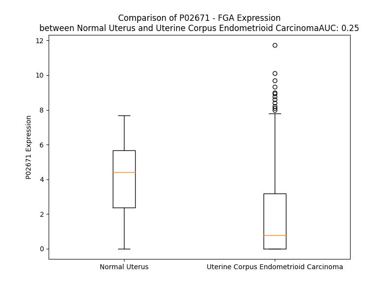

# Detailed Data for P02671

## Introduction to the Detailed Summary

### How to Interpret the Results

- **Summary & Metrics**: This section provides a quick reference to essential protein attributes, including expression changes, family classification, and biomarker applications. Regulation status (upregulated/downregulated) indicates the protein's behavior in a disease context. Some information comes from the original excel file with the proteins selected from literature, while others are derived from the analyses.
- **Expression Comparison**: A visual representation comparing protein expression between normal and disease states. It highlights significant changes in expression levels that might indicate diagnostic or therapeutic relevance. This is data coming from transcriptomics experiments and could not translate similarly to protein levels.
- **Isoform Alignment**: An interactive view of isoform alignments, revealing structural and functional differences between variants of the protein.
- **Interactors & Homologs**: Tables listing known interaction partners and homologous proteins, the more interactors and homologs, the more complex the protein is to design an antibody for.
- **Biological Assemblies**: Information about the structural arrangement of the protein in different assemblies, providing insights into its functional state but also the complexity of the protein to develop antibodies.
- **Combined Per-Residue Information**: A detailed table summarizing residue-level data. This includes predictions for epitope regions, aggregation tendencies, and modifications that might impact the protein's function. Each row corresponds to a residue in the protein, providing insights into specific sites that may be important for research or drug development.
## Summary & Metrics

- **UniProt Accession**: P02671
- **Gene Name**: FGA
- **Protein Name**: fibrinogen alpha chain
- **Swiss Prot**: nan
- **Family**: other
- **Biomarker Application**: diagnosis
- **Number of Isoforms**: 2
- **Regulation**: -1
- **(transcriptomics) AUC**: 0.27
- **(transcriptomics) Fold Change**: 1.93
- **(transcriptomics) Regulation**: Downregulated
- **Discotope Epitope Count**: 284
- **Max n_uniprots (Homo)**: 4.0
- **Max n_uniprots (Hetero)**: 10.0

## Expression Comparison

## Isoform Alignment

<pre style='font-size:14px; font-family:monospace;'>P02671-1 MFSMRIVCLVLSVVGTAWTADSGEGDFLAEGGGVRGPRVVERHQSACKDSDWPFCSDEDWNYKCPSGCRMKGLIDEVNQDFTNRINKLKNSLFEYQKNNKDSHSLTTNIMEILRGDFSSANNRDNTYNRVSEDLRSRIEVLKRKVIEKVQHIQLLQKNVRAQLVDMKRLEVDIDIKIRSCRGSCSRALAREVDLKDYEDQQKQLEQVIAKDLLPSRDRQHLPLIKMKPVPDLVPGNFKSQLQKVPPEWKALTDMPQMRMELERPGGNEITRGGSTSYGTGSETESPRNPSSAGSWNSGSSGPGSTGNRNPGSSGTGGTATWKPGSSGPGSTGSWNSGSSGTGSTGNQNPGSPRPGSTGTWNPGSSERGSAGHWTSESSVSGSTGQWHSESGSFRPDSPGSGNARPNNPDWGTFEEVSGNVSPGTRREYHTEKLVTSKGDKELRTGKEKVTSGSTTTTRRSCSKTVTKTVIGPDGHKEVTKEVVTSEDGSDCPEAMDLGTLSGIGTLDGFRHRHPDEAAFFDTASTGKTFPGFFSPMLGEFVSETESRGSESGIFTNTKESSSHHPGIAEFPSRGKSSSYSKQFTSSTSYNRGDSTFESKSYKMADEAGSEADHEGTHSTKRGHAKSRPVRDCDDVLQTHPSGTQSGIFNIKLPGSSKIFSVYCDQETSLGGWLLIQQRMDGSLNFNRTWQDYKRGFGSLNDEGEGEFWLGNDYLHLLTQRGSVLRVELEDWAGNEAYAEYHFRVGSEAEGYALQVSSYEGTAGDALIEGSVEEGAEYTSHNNMQFSTFDRDADQWEENCAEVYGGGWWYNNCQAANLNGIYYPGGSYDPRNNSPYEIENGVVWVSFRGADYSLRAVRMKIRPLVTQ
P02671-2 MFSMRIVCLVLSVVGTAWTADSGEGDFLAEGGGVRGPRVVERHQSACKDSDWPFCSDEDWNYKCPSGCRMKGLIDEVNQDFTNRINKLKNSLFEYQKNNKDSHSLTTNIMEILRGDFSSANNRDNTYNRVSEDLRSRIEVLKRKVIEKVQHIQLLQKNVRAQLVDMKRLEVDIDIKIRSCRGSCSRALAREVDLKDYEDQQKQLEQVIAKDLLPSRDRQHLPLIKMKPVPDLVPGNFKSQLQKVPPEWKALTDMPQMRMELERPGGNEITRGGSTSYGTGSETESPRNPSSAGSWNSGSSGPGSTGNRNPGSSGTGGTATWKPGSSGPGSTGSWNSGSSGTGSTGNQNPGSPRPGSTGTWNPGSSERGSAGHWTSESSVSGSTGQWHSESGSFRPDSPGSGNARPNNPDWGTFEEVSGNVSPGTRREYHTEKLVTSKGDKELRTGKEKVTSGSTTTTRRSCSKTVTKTVIGPDGHKEVTKEVVTSEDGSDCPEAMDLGTLSGIGTLDGFRHRHPDEAAFFDTASTGKTFPGFFSPMLGEFVSETESRGSESGIFTNTKESSSHHPGIAEFPSRGKSSSYSKQFTSSTSYNRGDSTFESKSYKMADEAGSEADHEGTHSTKRGHAKSRPVRGIHTSPLGKPSLSP------------------------------------------------------------------------------------------------------------------------------------------------------------------------------------------------------------------------------
</pre>

## Interactors

| preferredName_A   | preferredName_B   |   score |
|:------------------|:------------------|--------:|
| FGA               | F2                |   0.999 |
| FGA               | FGB               |   0.999 |
| FGA               | FGG               |   0.999 |
| FGA               | AHSG              |   0.984 |
| FGA               | SERPINC1          |   0.98  |
| FGA               | ITGB3             |   0.978 |
| FGA               | ALB               |   0.975 |
| FGA               | SERPINF2          |   0.967 |
| FGA               | PLG               |   0.965 |
| FGA               | F13B              |   0.96  |
| FGA               | SERPIND1          |   0.96  |
| FGA               | AMBP              |   0.945 |
| FGA               | HRG               |   0.936 |
| FGA               | FN1               |   0.932 |
| FGA               | ITGA2B            |   0.928 |
| FGA               | FGL1              |   0.922 |
| FGA               | F13A1             |   0.91  |
| FGA               | KNG1              |   0.908 |
| FGA               | THBS1             |   0.903 |
| FGA               | APOA1             |   0.902 |

## Homologs

| uniprot_id   | gene_id   |
|:-------------|:----------|
| Q6UXM4       | FCN3      |
| Q9Y5C1       | ANGPTL3   |
| A0A0A0MSK1   | ANGPTL1   |
| Q92752       | TNR       |
| A0A3B3ISX9   | TNXB      |
| P02751       | FN1       |
| O00602       | FCN1      |
| Q15485       | FCN2      |
| Q8NI99       | ANGPTL6   |
| D6REL8       | FGB       |
| E9PKF7       | ANGPTL5   |
| A0A994J7R0   | TNC       |
| O43827       | ANGPTL7   |
| P55083       | MFAP4     |
| Q08830       | FGL1      |
| Q9UQP3       | TNN       |
| X6RDH7       | FIBCD1    |
| C9JPQ9       | FGG       |
| M0R369       | ANGPTL4   |
| Q9Y264       | ANGPT4    |
| Q5VTL7       | FNDC7     |
| A4D1B8       | FGL2      |
| B4DTQ9       | ANGPT1    |
| O15123       | ANGPT2    |
| Q9UKU9       | ANGPTL2   |

## Biological Assemblies

|   Unnamed: 0 |   assembly |   n_uniprots | composition   | crystal_id   |
|-------------:|-----------:|-------------:|:--------------|:-------------|
|            0 |          1 |           10 | Hetero        | 2xnx         |
|            0 |          1 |            2 | Homo          | 1fph         |
|            0 |          1 |            3 | Hetero        | 2h43         |
|            1 |          2 |            3 | Hetero        | 2h43         |
|            0 |          1 |            3 | Hetero        | 1re3         |
|            1 |          2 |            3 | Hetero        | 1re3         |
|            0 |          1 |            4 | Homo          | 1fzd         |
|            1 |          2 |            4 | Homo          | 1fzd         |
|            0 |          1 |            6 | Hetero        | 1fze         |
|            1 |          2 |            3 | Hetero        | 1fze         |
|            2 |          3 |            3 | Hetero        | 1fze         |
|            0 |          1 |            3 | Hetero        | 2oyi         |
|            1 |          2 |            3 | Hetero        | 2oyi         |
|            0 |          1 |            4 | Hetero        | 1bbr         |
|            1 |          2 |            3 | Hetero        | 1bbr         |
|            2 |          3 |            3 | Hetero        | 1bbr         |
|            3 |          4 |            6 | Hetero        | 1bbr         |
|            0 |          1 |            8 | Hetero        | 1n86         |
|            0 |          1 |            6 | Hetero        | 1fzg         |
|            0 |          1 |            3 | Hetero        | 1re4         |
|            1 |          2 |            3 | Hetero        | 1re4         |
|            0 |          1 |            6 | Hetero        | 1fzc         |
|            0 |          1 |            6 | Hetero        | 2z4e         |
|            1 |          2 |            3 | Hetero        | 2z4e         |
|            2 |          3 |            3 | Hetero        | 2z4e         |
|            0 |          1 |            3 | Hetero        | 2ffd         |
|            1 |          2 |            3 | Hetero        | 2ffd         |
|            0 |          1 |            3 | Hetero        | 1ycp         |
|            1 |          2 |            4 | Hetero        | 1ycp         |
|            0 |          1 |            3 | Hetero        | 3e1i         |
|            1 |          2 |            3 | Hetero        | 3e1i         |
|            0 |          1 |            3 | Hetero        | 1rf0         |
|            1 |          2 |            3 | Hetero        | 1rf0         |
|            0 |          1 |            2 | Homo          | 1dm4         |
|            1 |          2 |            2 | Homo          | 1dm4         |
|            0 |          1 |            6 | Hetero        | 1fza         |
|            0 |          1 |            6 | Hetero        | 1fzb         |
|            0 |          1 |            3 | Hetero        | 1rf1         |
|            1 |          2 |            3 | Hetero        | 1rf1         |
|            0 |          1 |            3 | Hetero        | 3hus         |
|            1 |          2 |            3 | Hetero        | 3hus         |
|            0 |          1 |            3 | Hetero        | 1lt9         |
|            1 |          2 |            3 | Hetero        | 1lt9         |
|            0 |          1 |            3 | Hetero        | 2xny         |
|            1 |          2 |            3 | Hetero        | 2xny         |
|            2 |          3 |            2 | Homo          | 2xny         |
|            0 |          1 |            3 | Hetero        | 2hod         |
|            1 |          2 |            3 | Hetero        | 2hod         |
|            2 |          3 |            3 | Hetero        | 2hod         |
|            3 |          4 |            3 | Hetero        | 2hod         |
|            0 |          1 |            3 | Hetero        | 2hpc         |
|            1 |          2 |            3 | Hetero        | 2hpc         |
|            2 |          3 |            3 | Hetero        | 2hpc         |
|            3 |          4 |            3 | Hetero        | 2hpc         |
|            0 |          1 |           10 | Hetero        | 1fzf         |
|            0 |          1 |            3 | Hetero        | 2q9i         |
|            1 |          2 |            3 | Hetero        | 2q9i         |
|            0 |          1 |            3 | Hetero        | 2hlo         |
|            1 |          2 |            3 | Hetero        | 2hlo         |
|            0 |          1 |            8 | Hetero        | 3h32         |
|            0 |          1 |            2 | Hetero        | 4f27         |
|            0 |          1 |            6 | Hetero        | 3ghg         |
|            1 |          2 |            6 | Hetero        | 3ghg         |
|            0 |          1 |           10 | Hetero        | 2a45         |
|            0 |          1 |            2 | Hetero        | 3at0         |
|            0 |          1 |            3 | Hetero        | 2oyh         |
|            1 |          2 |            3 | Hetero        | 2oyh         |
|            0 |          1 |            3 | Hetero        | 1ltj         |
|            1 |          2 |            3 | Hetero        | 1ltj         |
|            0 |          1 |            6 | Hetero        | 1n8e         |
|            0 |          1 |            2 | Hetero        | 5cfa         |
|            1 |          2 |            2 | Hetero        | 5cfa         |

## Combined Per-Residue Information

|   res | aa   |   epitope_score | epitope   |   relative_surface_accessibility |   modeling_confidence |   Aggregation | modification               | glycosylation                                         |
|------:|:-----|----------------:|:----------|---------------------------------:|----------------------:|--------------:|:---------------------------|:------------------------------------------------------|
|     1 | M    |         0.04723 | False     |                          1.28064 |                 39.85 |         0     | N/A                        | N/A                                                   |
|     2 | F    |         0.05189 | False     |                          1.04733 |                 35.33 |         0     | N/A                        | N/A                                                   |
|     3 | S    |         0.06581 | False     |                          0.63089 |                 43.46 |         0     | N/A                        | N/A                                                   |
|     4 | M    |         0.06611 | False     |                          0.96849 |                 44.08 |         0.007 | N/A                        | N/A                                                   |
|     5 | R    |         0.09709 | False     |                          0.84918 |                 46.49 |         0.013 | N/A                        | N/A                                                   |
|     6 | I    |         0.0994  | True      |                          0.68237 |                 52.43 |        89.258 | N/A                        | N/A                                                   |
|     7 | V    |         0.06995 | False     |                          0.72174 |                 47.35 |        97.416 | N/A                        | N/A                                                   |
|     8 | C    |         0.05913 | False     |                          0.75714 |                 44.65 |        97.929 | N/A                        | N/A                                                   |
|     9 | L    |         0.06285 | False     |                          0.76183 |                 42.74 |        99.442 | N/A                        | N/A                                                   |
|    10 | V    |         0.05589 | False     |                          0.7581  |                 46    |        99.704 | N/A                        | N/A                                                   |
|    11 | L    |         0.06728 | False     |                          0.99372 |                 46.29 |        99.608 | N/A                        | N/A                                                   |
|    12 | S    |         0.05092 | False     |                          0.61796 |                 43.01 |        98.989 | N/A                        | N/A                                                   |
|    13 | V    |         0.06458 | False     |                          0.83151 |                 42.59 |        98.918 | N/A                        | N/A                                                   |
|    14 | V    |         0.07382 | False     |                          1.08981 |                 44.24 |        97.912 | N/A                        | N/A                                                   |
|    15 | G    |         0.10864 | True      |                          0.83916 |                 39.45 |        85.895 | N/A                        | N/A                                                   |
|    16 | T    |         0.09554 | False     |                          0.99256 |                 42.4  |        84.812 | N/A                        | N/A                                                   |
|    17 | A    |         0.07886 | False     |                          0.86881 |                 39.71 |        84.168 | N/A                        | N/A                                                   |
|    18 | W    |         0.1239  | True      |                          1.05635 |                 38.46 |        83.622 | N/A                        | N/A                                                   |
|    19 | T    |         0.08751 | False     |                          1.00072 |                 36.48 |        74.203 | N/A                        | N/A                                                   |
|    20 | A    |         0.05461 | False     |                          0.93729 |                 39.74 |        34.001 | N/A                        | N/A                                                   |
|    21 | D    |         0.102   | True      |                          0.80153 |                 35.57 |         0.013 | N/A                        | N/A                                                   |
|    22 | S    |         0.08777 | False     |                          0.85778 |                 37.76 |         0     | Phosphoserine              | N/A                                                   |
|    23 | G    |         0.13684 | True      |                          0.95281 |                 36.83 |         0     | N/A                        | N/A                                                   |
|    24 | E    |         0.09724 | False     |                          0.9731  |                 38.17 |         0     | N/A                        | N/A                                                   |
|    25 | G    |         0.10975 | True      |                          0.92876 |                 37.26 |         0     | N/A                        | N/A                                                   |
|    26 | D    |         0.12792 | True      |                          0.92067 |                 34.53 |         0     | N/A                        | N/A                                                   |
|    27 | F    |         0.14823 | True      |                          0.96864 |                 34.08 |         0     | N/A                        | N/A                                                   |
|    28 | L    |         0.10114 | True      |                          0.93577 |                 35.56 |         0     | N/A                        | N/A                                                   |
|    29 | A    |         0.11309 | True      |                          0.9583  |                 33.98 |         0     | N/A                        | N/A                                                   |
|    30 | E    |         0.1968  | True      |                          0.89392 |                 41.24 |         0     | N/A                        | N/A                                                   |
|    31 | G    |         0.10537 | True      |                          0.94463 |                 35.85 |         0     | N/A                        | N/A                                                   |
|    32 | G    |         0.13575 | True      |                          0.93911 |                 36.8  |         0     | N/A                        | N/A                                                   |
|    33 | G    |         0.11854 | True      |                          0.9908  |                 34.03 |         0     | N/A                        | N/A                                                   |
|    34 | V    |         0.08455 | False     |                          1.079   |                 44.4  |         0     | N/A                        | N/A                                                   |
|    35 | R    |         0.14608 | True      |                          0.96521 |                 39.31 |         0     | N/A                        | N/A                                                   |
|    36 | G    |         0.2334  | True      |                          0.85449 |                 40.37 |         0     | N/A                        | N/A                                                   |
|    37 | P    |         0.07634 | False     |                          0.96383 |                 42.61 |         0     | N/A                        | N/A                                                   |
|    38 | R    |         0.14456 | True      |                          0.88075 |                 33.23 |         0     | N/A                        | N/A                                                   |
|    39 | V    |         0.07819 | False     |                          1.03725 |                 38.89 |         0     | N/A                        | N/A                                                   |
|    40 | V    |         0.13158 | True      |                          0.74981 |                 42.15 |         0     | N/A                        | N/A                                                   |
|    41 | E    |         0.10858 | True      |                          0.78657 |                 31.59 |         0     | N/A                        | N/A                                                   |
|    42 | R    |         0.17403 | True      |                          0.86366 |                 32.92 |         0     | N/A                        | N/A                                                   |
|    43 | H    |         0.12453 | True      |                          0.8327  |                 37.73 |         0     | N/A                        | N/A                                                   |
|    44 | Q    |         0.09837 | False     |                          0.89966 |                 34.06 |         0     | N/A                        | N/A                                                   |
|    45 | S    |         0.11639 | True      |                          0.80048 |                 43.74 |         0     | Phosphoserine; by FAM20C   | N/A                                                   |
|    46 | A    |         0.11953 | True      |                          0.87522 |                 38.97 |         0     | N/A                        | N/A                                                   |
|    47 | C    |         0.0845  | False     |                          0.9276  |                 41.4  |         0     | N/A                        | N/A                                                   |
|    48 | K    |         0.08947 | False     |                          0.89204 |                 46.45 |         0     | N/A                        | N/A                                                   |
|    49 | D    |         0.12082 | True      |                          0.90004 |                 45.88 |         0     | N/A                        | N/A                                                   |
|    50 | S    |         0.11094 | True      |                          0.64242 |                 47.88 |         0     | Phosphoserine              | N/A                                                   |
|    51 | D    |         0.09591 | False     |                          0.85865 |                 43.91 |         0     | N/A                        | N/A                                                   |
|    52 | W    |         0.174   | True      |                          1.04527 |                 49.12 |         0     | N/A                        | N/A                                                   |
|    53 | P    |         0.11229 | True      |                          0.80964 |                 54.47 |         0     | N/A                        | N/A                                                   |
|    54 | F    |         0.24292 | True      |                          1.07442 |                 47.38 |         0     | N/A                        | N/A                                                   |
|    55 | C    |         0.08656 | False     |                          0.58651 |                 51.83 |         0     | N/A                        | N/A                                                   |
|    56 | S    |         0.11137 | True      |                          0.61832 |                 55.24 |         0     | Phosphoserine; by FAM20C   | N/A                                                   |
|    57 | D    |         0.15053 | True      |                          0.74912 |                 58.74 |         0     | N/A                        | N/A                                                   |
|    58 | E    |         0.1317  | True      |                          0.91388 |                 58.76 |         0     | N/A                        | N/A                                                   |
|    59 | D    |         0.08552 | False     |                          0.3117  |                 58.17 |         0     | N/A                        | N/A                                                   |
|    60 | W    |         0.15621 | True      |                          0.49464 |                 57.79 |         0     | N/A                        | N/A                                                   |
|    61 | N    |         0.1751  | True      |                          0.88551 |                 55.19 |         0     | N/A                        | N/A                                                   |
|    62 | Y    |         0.29552 | True      |                          0.93694 |                 58.66 |         0     | N/A                        | N/A                                                   |
|    63 | K    |         0.11173 | True      |                          0.67317 |                 57.11 |         0     | N/A                        | N/A                                                   |
|    64 | C    |         0.12307 | True      |                          0.35458 |                 56.67 |         0     | N/A                        | N/A                                                   |
|    65 | P    |         0.1182  | True      |                          0.87444 |                 54.58 |         0     | N/A                        | N/A                                                   |
|    66 | S    |         0.1486  | True      |                          0.61715 |                 59.29 |         0     | N/A                        | N/A                                                   |
|    67 | G    |         0.15155 | True      |                          0.56364 |                 65.85 |         0     | N/A                        | N/A                                                   |
|    68 | C    |         0.10078 | True      |                          0.80915 |                 62.18 |         0     | N/A                        | N/A                                                   |
|    69 | R    |         0.21169 | True      |                          0.6246  |                 67.87 |         0     | N/A                        | N/A                                                   |
|    70 | M    |         0.17965 | True      |                          0.62697 |                 74.01 |         0     | N/A                        | N/A                                                   |
|    71 | K    |         0.10736 | True      |                          0.6187  |                 76.57 |         0     | N/A                        | N/A                                                   |
|    72 | G    |         0.15677 | True      |                          0.47188 |                 77.96 |         0     | N/A                        | N/A                                                   |
|    73 | L    |         0.11726 | True      |                          0.55637 |                 80.21 |         0     | N/A                        | N/A                                                   |
|    74 | I    |         0.0822  | False     |                          0.57263 |                 83.18 |         0     | N/A                        | N/A                                                   |
|    75 | D    |         0.06981 | False     |                          0.38599 |                 84    |         0     | N/A                        | N/A                                                   |
|    76 | E    |         0.14721 | True      |                          0.5834  |                 83.66 |         0     | N/A                        | N/A                                                   |
|    77 | V    |         0.0588  | False     |                          0.56267 |                 88.54 |         0     | N/A                        | N/A                                                   |
|    78 | N    |         0.05602 | False     |                          0.49835 |                 87.95 |         0     | N/A                        | N/A                                                   |
|    79 | Q    |         0.07594 | False     |                          0.60351 |                 89.61 |         0     | N/A                        | N/A                                                   |
|    80 | D    |         0.06616 | False     |                          0.39721 |                 90.81 |         0     | N/A                        | N/A                                                   |
|    81 | F    |         0.06453 | False     |                          0.55305 |                 91.53 |         0     | N/A                        | N/A                                                   |
|    82 | T    |         0.06369 | False     |                          0.52132 |                 90.17 |         0     | N/A                        | N/A                                                   |
|    83 | N    |         0.12763 | True      |                          0.55931 |                 90.04 |         0     | N/A                        | N/A                                                   |
|    84 | R    |         0.16826 | True      |                          0.54262 |                 91.81 |         0     | N/A                        | N/A                                                   |
|    85 | I    |         0.0702  | False     |                          0.67249 |                 90.65 |         0     | N/A                        | N/A                                                   |
|    86 | N    |         0.0679  | False     |                          0.47542 |                 88.83 |         0     | N/A                        | N/A                                                   |
|    87 | K    |         0.11355 | True      |                          0.74919 |                 91.62 |         0     | N/A                        | N/A                                                   |
|    88 | L    |         0.08448 | False     |                          0.78642 |                 90.25 |         0     | N/A                        | N/A                                                   |
|    89 | K    |         0.0917  | False     |                          0.70591 |                 88.81 |         0     | N/A                        | N/A                                                   |
|    90 | N    |         0.09636 | False     |                          0.63558 |                 87.98 |         0     | N/A                        | N/A                                                   |
|    91 | S    |         0.06538 | False     |                          0.35364 |                 84.05 |         0     | N/A                        | N/A                                                   |
|    92 | L    |         0.07456 | False     |                          0.79871 |                 83.96 |         0     | N/A                        | N/A                                                   |
|    93 | F    |         0.07436 | False     |                          0.74469 |                 84.53 |         0     | N/A                        | N/A                                                   |
|    94 | E    |         0.08938 | False     |                          0.5875  |                 79.83 |         0     | N/A                        | N/A                                                   |
|    95 | Y    |         0.08219 | False     |                          0.74347 |                 76.52 |         0     | N/A                        | N/A                                                   |
|    96 | Q    |         0.06882 | False     |                          0.53171 |                 77.53 |         0     | N/A                        | N/A                                                   |
|    97 | K    |         0.10709 | True      |                          0.59312 |                 76.95 |         0     | N/A                        | N/A                                                   |
|    98 | N    |         0.09835 | False     |                          0.57445 |                 73.07 |         0     | N/A                        | N/A                                                   |
|    99 | N    |         0.07823 | False     |                          0.67769 |                 73.05 |         0     | N/A                        | N/A                                                   |
|   100 | K    |         0.07044 | False     |                          0.67302 |                 67.4  |         0     | N/A                        | N/A                                                   |
|   101 | D    |         0.0956  | False     |                          0.45115 |                 71.36 |         0     | N/A                        | N/A                                                   |
|   102 | S    |         0.06011 | False     |                          0.46889 |                 68.9  |         0     | N/A                        | N/A                                                   |
|   103 | H    |         0.04723 | False     |                          0.58973 |                 72.94 |         0     | N/A                        | N/A                                                   |
|   104 | S    |         0.0704  | False     |                          0.44626 |                 71.4  |         0     | N/A                        | N/A                                                   |
|   105 | L    |         0.05641 | False     |                          0.65961 |                 75.74 |         0     | N/A                        | N/A                                                   |
|   106 | T    |         0.04655 | False     |                          0.3659  |                 72.32 |         0     | N/A                        | N/A                                                   |
|   107 | T    |         0.06785 | False     |                          0.3306  |                 72.88 |         0     | N/A                        | N/A                                                   |
|   108 | N    |         0.06506 | False     |                          0.51982 |                 73.82 |         0     | N/A                        | N/A                                                   |
|   109 | I    |         0.05527 | False     |                          0.50558 |                 75.26 |         0     | N/A                        | N/A                                                   |
|   110 | M    |         0.02332 | False     |                          0.15583 |                 67.5  |         0     | N/A                        | N/A                                                   |
|   111 | E    |         0.09129 | False     |                          0.58022 |                 69.94 |         0     | N/A                        | N/A                                                   |
|   112 | I    |         0.06874 | False     |                          0.68921 |                 72.09 |         0     | N/A                        | N/A                                                   |
|   113 | L    |         0.04473 | False     |                          0.36766 |                 72.36 |         0     | N/A                        | N/A                                                   |
|   114 | R    |         0.09005 | False     |                          0.65122 |                 69.77 |         0     | N/A                        | N/A                                                   |
|   115 | G    |         0.04799 | False     |                          0.4853  |                 68.16 |         0     | N/A                        | N/A                                                   |
|   116 | D    |         0.06625 | False     |                          0.51857 |                 69.93 |         0     | N/A                        | N/A                                                   |
|   117 | F    |         0.03155 | False     |                          0.40694 |                 62.97 |         0     | N/A                        | N/A                                                   |
|   118 | S    |         0.02538 | False     |                          0.47449 |                 62.07 |         0     | N/A                        | N/A                                                   |
|   119 | S    |         0.0352  | False     |                          0.3494  |                 62.69 |         0     | N/A                        | N/A                                                   |
|   120 | A    |         0.03617 | False     |                          0.44661 |                 62.01 |         0     | N/A                        | N/A                                                   |
|   121 | N    |         0.0947  | False     |                          0.55392 |                 61.86 |         0     | N/A                        | N/A                                                   |
|   122 | N    |         0.0338  | False     |                          0.56251 |                 63.24 |         0     | N/A                        | N/A                                                   |
|   123 | R    |         0.07603 | False     |                          0.64139 |                 61.37 |         0     | N/A                        | N/A                                                   |
|   124 | D    |         0.02553 | False     |                          0.33137 |                 62.93 |         0     | N/A                        | N/A                                                   |
|   125 | N    |         0.04197 | False     |                          0.53929 |                 67.72 |         0     | N/A                        | N/A                                                   |
|   126 | T    |         0.03563 | False     |                          0.50557 |                 72.69 |         0     | N/A                        | N/A                                                   |
|   127 | Y    |         0.03386 | False     |                          0.64712 |                 68.62 |         0     | N/A                        | N/A                                                   |
|   128 | N    |         0.07056 | False     |                          0.3282  |                 66.73 |         0     | N/A                        | N/A                                                   |
|   129 | R    |         0.06463 | False     |                          0.51266 |                 71.78 |         0     | N/A                        | N/A                                                   |
|   130 | V    |         0.039   | False     |                          0.65614 |                 74.66 |         0     | N/A                        | N/A                                                   |
|   131 | S    |         0.01591 | False     |                          0.2872  |                 68.87 |         0     | N/A                        | N/A                                                   |
|   132 | E    |         0.11124 | True      |                          0.44675 |                 72.62 |         0     | N/A                        | N/A                                                   |
|   133 | D    |         0.03192 | False     |                          0.39212 |                 76.54 |         0     | N/A                        | N/A                                                   |
|   134 | L    |         0.02698 | False     |                          0.62817 |                 77.89 |         0     | N/A                        | N/A                                                   |
|   135 | R    |         0.03834 | False     |                          0.26804 |                 72.43 |         0     | N/A                        | N/A                                                   |
|   136 | S    |         0.06984 | False     |                          0.47502 |                 73.78 |         0     | N/A                        | N/A                                                   |
|   137 | R    |         0.04187 | False     |                          0.64015 |                 81.54 |         0     | N/A                        | N/A                                                   |
|   138 | I    |         0.03414 | False     |                          0.39006 |                 76.51 |         0     | N/A                        | N/A                                                   |
|   139 | E    |         0.08647 | False     |                          0.25749 |                 73.73 |         0     | N/A                        | N/A                                                   |
|   140 | V    |         0.04602 | False     |                          0.40343 |                 77.23 |         0     | N/A                        | N/A                                                   |
|   141 | L    |         0.03649 | False     |                          0.6702  |                 79.96 |         0     | N/A                        | N/A                                                   |
|   142 | K    |         0.03761 | False     |                          0.27398 |                 76.58 |         0     | N/A                        | N/A                                                   |
|   143 | R    |         0.11194 | True      |                          0.59465 |                 77.73 |         0     | N/A                        | N/A                                                   |
|   144 | K    |         0.05772 | False     |                          0.58795 |                 84.64 |         0     | N/A                        | N/A                                                   |
|   145 | V    |         0.02629 | False     |                          0.4259  |                 83.02 |         0     | N/A                        | N/A                                                   |
|   146 | I    |         0.07214 | False     |                          0.40238 |                 79.76 |         0     | N/A                        | N/A                                                   |
|   147 | E    |         0.0906  | False     |                          0.4555  |                 83.71 |         0     | N/A                        | N/A                                                   |
|   148 | K    |         0.04482 | False     |                          0.5771  |                 86.94 |         0     | N/A                        | N/A                                                   |
|   149 | V    |         0.01912 | False     |                          0.05808 |                 85.16 |         0     | N/A                        | N/A                                                   |
|   150 | Q    |         0.1041  | True      |                          0.56061 |                 85.34 |         0     | N/A                        | N/A                                                   |
|   151 | H    |         0.07317 | False     |                          0.65168 |                 88.97 |         0     | N/A                        | N/A                                                   |
|   152 | I    |         0.04613 | False     |                          0.42078 |                 87.73 |         0     | N/A                        | N/A                                                   |
|   153 | Q    |         0.08842 | False     |                          0.45694 |                 85.45 |         0     | N/A                        | N/A                                                   |
|   154 | L    |         0.0982  | False     |                          0.6224  |                 89.07 |         0     | N/A                        | N/A                                                   |
|   155 | L    |         0.04183 | False     |                          0.64241 |                 89.82 |         0     | N/A                        | N/A                                                   |
|   156 | Q    |         0.02389 | False     |                          0.1151  |                 87.36 |         0     | N/A                        | N/A                                                   |
|   157 | K    |         0.13341 | True      |                          0.69648 |                 87.67 |         0     | N/A                        | N/A                                                   |
|   158 | N    |         0.05708 | False     |                          0.44102 |                 91.48 |         0     | N/A                        | N/A                                                   |
|   159 | V    |         0.02463 | False     |                          0.42317 |                 91.01 |         0     | N/A                        | N/A                                                   |
|   160 | R    |         0.06239 | False     |                          0.39091 |                 88.68 |         0     | N/A                        | N/A                                                   |
|   161 | A    |         0.10473 | True      |                          0.49904 |                 91.07 |         0     | N/A                        | N/A                                                   |
|   162 | Q    |         0.06302 | False     |                          0.61997 |                 91.99 |         0     | N/A                        | N/A                                                   |
|   163 | L    |         0.03337 | False     |                          0.11565 |                 90.94 |         0     | N/A                        | N/A                                                   |
|   164 | V    |         0.11547 | True      |                          0.60564 |                 89.92 |         0     | N/A                        | N/A                                                   |
|   165 | D    |         0.11324 | True      |                          0.54011 |                 91.76 |         0     | N/A                        | N/A                                                   |
|   166 | M    |         0.05375 | False     |                          0.51781 |                 89.81 |         0     | N/A                        | N/A                                                   |
|   167 | K    |         0.04901 | False     |                          0.24661 |                 90.3  |         0     | N/A                        | N/A                                                   |
|   168 | R    |         0.18515 | True      |                          0.7353  |                 91.46 |         0     | N/A                        | N/A                                                   |
|   169 | L    |         0.0519  | False     |                          0.64182 |                 91.73 |         0     | N/A                        | N/A                                                   |
|   170 | E    |         0.0235  | False     |                          0.1596  |                 89.1  |         0     | N/A                        | N/A                                                   |
|   171 | V    |         0.07039 | False     |                          0.37702 |                 90.42 |         0     | N/A                        | N/A                                                   |
|   172 | D    |         0.05232 | False     |                          0.31056 |                 91.3  |         0     | N/A                        | N/A                                                   |
|   173 | I    |         0.02703 | False     |                          0.31359 |                 87.72 |         0.351 | N/A                        | N/A                                                   |
|   174 | D    |         0.05128 | False     |                          0.11169 |                 86.27 |         0.351 | N/A                        | N/A                                                   |
|   175 | I    |         0.08237 | False     |                          0.58112 |                 86.16 |         0.351 | N/A                        | N/A                                                   |
|   176 | K    |         0.07831 | False     |                          0.57952 |                 86.03 |         0.351 | N/A                        | N/A                                                   |
|   177 | I    |         0.04107 | False     |                          0.24745 |                 83.32 |         0.351 | N/A                        | N/A                                                   |
|   178 | R    |         0.13144 | True      |                          0.54444 |                 81.44 |         0     | N/A                        | N/A                                                   |
|   179 | S    |         0.0681  | False     |                          0.61258 |                 83.68 |         0     | N/A                        | N/A                                                   |
|   180 | C    |         0.08108 | False     |                          0.51007 |                 79.78 |         0     | N/A                        | N/A                                                   |
|   181 | R    |         0.19942 | True      |                          0.49438 |                 72.95 |         0     | N/A                        | N/A                                                   |
|   182 | G    |         0.16955 | True      |                          0.93089 |                 68.18 |         0     | N/A                        | N/A                                                   |
|   183 | S    |         0.2116  | True      |                          0.8074  |                 71.36 |         0     | N/A                        | N/A                                                   |
|   184 | C    |         0.15097 | True      |                          0.49783 |                 71.25 |         0     | N/A                        | N/A                                                   |
|   185 | S    |         0.17818 | True      |                          0.96991 |                 75.31 |         0     | N/A                        | N/A                                                   |
|   186 | R    |         0.21309 | True      |                          0.89393 |                 73.94 |         0     | N/A                        | N/A                                                   |
|   187 | A    |         0.12227 | True      |                          0.57254 |                 67.42 |         0     | N/A                        | N/A                                                   |
|   188 | L    |         0.18612 | True      |                          0.75014 |                 71.64 |         0     | N/A                        | N/A                                                   |
|   189 | A    |         0.14233 | True      |                          0.91871 |                 73.8  |         0     | N/A                        | N/A                                                   |
|   190 | R    |         0.12626 | True      |                          0.35975 |                 73.86 |         0     | N/A                        | N/A                                                   |
|   191 | E    |         0.12354 | True      |                          0.85504 |                 76.99 |         0     | N/A                        | N/A                                                   |
|   192 | V    |         0.082   | False     |                          0.18231 |                 80.1  |         0     | N/A                        | N/A                                                   |
|   193 | D    |         0.08179 | False     |                          0.55006 |                 82.3  |         0     | N/A                        | N/A                                                   |
|   194 | L    |         0.08077 | False     |                          0.49877 |                 86.58 |         0     | N/A                        | N/A                                                   |
|   195 | K    |         0.13889 | True      |                          0.67989 |                 88.33 |         0     | N/A                        | N/A                                                   |
|   196 | D    |         0.06418 | False     |                          0.40655 |                 88.39 |         0     | N/A                        | N/A                                                   |
|   197 | Y    |         0.05274 | False     |                          0.10532 |                 87.95 |         0     | N/A                        | N/A                                                   |
|   198 | E    |         0.15531 | True      |                          0.41959 |                 87.77 |         0     | N/A                        | N/A                                                   |
|   199 | D    |         0.04454 | False     |                          0.32934 |                 90.24 |         0     | N/A                        | N/A                                                   |
|   200 | Q    |         0.02279 | False     |                          0.30552 |                 88.22 |         0     | N/A                        | N/A                                                   |
|   201 | Q    |         0.07767 | False     |                          0.37361 |                 88.69 |         0     | N/A                        | N/A                                                   |
|   202 | K    |         0.1026  | True      |                          0.48113 |                 89.59 |         0     | N/A                        | N/A                                                   |
|   203 | Q    |         0.06163 | False     |                          0.57655 |                 88.66 |         0     | N/A                        | N/A                                                   |
|   204 | L    |         0.03654 | False     |                          0.15334 |                 87.29 |         0     | N/A                        | N/A                                                   |
|   205 | E    |         0.12652 | True      |                          0.38557 |                 86.2  |         0     | N/A                        | N/A                                                   |
|   206 | Q    |         0.16592 | True      |                          0.62534 |                 86.16 |         0     | N/A                        | N/A                                                   |
|   207 | V    |         0.04816 | False     |                          0.56131 |                 83.67 |         0     | N/A                        | N/A                                                   |
|   208 | I    |         0.12054 | True      |                          0.32942 |                 82.75 |         0     | N/A                        | N/A                                                   |
|   209 | A    |         0.07508 | False     |                          0.80681 |                 81.68 |         0     | N/A                        | N/A                                                   |
|   210 | K    |         0.13351 | True      |                          0.70615 |                 78.37 |         0     | N/A                        | N/A                                                   |
|   211 | D    |         0.15405 | True      |                          0.73174 |                 72.5  |         0     | N/A                        | N/A                                                   |
|   212 | L    |         0.05266 | False     |                          0.45163 |                 73.63 |         0     | N/A                        | N/A                                                   |
|   213 | L    |         0.08883 | False     |                          0.51015 |                 69.18 |         0     | N/A                        | N/A                                                   |
|   214 | P    |         0.08388 | False     |                          0.49471 |                 61.06 |         0     | N/A                        | N/A                                                   |
|   215 | S    |         0.14964 | True      |                          0.59955 |                 59.28 |         0     | N/A                        | N/A                                                   |
|   216 | R    |         0.22425 | True      |                          0.80054 |                 56    |         0     | N/A                        | N/A                                                   |
|   217 | D    |         0.15914 | True      |                          0.87249 |                 51.43 |         0     | N/A                        | N/A                                                   |
|   218 | R    |         0.17608 | True      |                          0.79765 |                 53    |         0     | N/A                        | N/A                                                   |
|   219 | Q    |         0.2252  | True      |                          0.44285 |                 50.52 |         0     | N/A                        | N/A                                                   |
|   220 | H    |         0.15348 | True      |                          0.63884 |                 54.93 |         0     | N/A                        | N/A                                                   |
|   221 | L    |         0.07904 | False     |                          0.31618 |                 57.58 |         0     | N/A                        | N/A                                                   |
|   222 | P    |         0.04912 | False     |                          0.45784 |                 62.85 |         0     | N/A                        | N/A                                                   |
|   223 | L    |         0.04299 | False     |                          0.23329 |                 59.39 |         0     | N/A                        | N/A                                                   |
|   224 | I    |         0.05561 | False     |                          0.3979  |                 63.24 |         0     | N/A                        | N/A                                                   |
|   225 | K    |         0.10969 | True      |                          0.39522 |                 63.08 |         0     | N/A                        | N/A                                                   |
|   226 | M    |         0.04674 | False     |                          0.17712 |                 59.99 |         0     | N/A                        | N/A                                                   |
|   227 | K    |         0.11082 | True      |                          0.42505 |                 64.32 |         0     | N/A                        | N/A                                                   |
|   228 | P    |         0.07989 | False     |                          0.64395 |                 64.24 |         0     | N/A                        | N/A                                                   |
|   229 | V    |         0.09454 | False     |                          0.30813 |                 65.28 |         0     | N/A                        | N/A                                                   |
|   230 | P    |         0.15842 | True      |                          0.88532 |                 57.09 |         0     | N/A                        | N/A                                                   |
|   231 | D    |         0.11938 | True      |                          0.69325 |                 55.19 |         0     | N/A                        | N/A                                                   |
|   232 | L    |         0.08321 | False     |                          0.5425  |                 53.61 |         0     | N/A                        | N/A                                                   |
|   233 | V    |         0.0555  | False     |                          0.35764 |                 52.97 |         0     | N/A                        | N/A                                                   |
|   234 | P    |         0.17413 | True      |                          0.5875  |                 53.47 |         0     | N/A                        | N/A                                                   |
|   235 | G    |         0.23368 | True      |                          0.72732 |                 54.95 |         0     | N/A                        | N/A                                                   |
|   236 | N    |         0.08303 | False     |                          0.59051 |                 58.24 |         0     | N/A                        | N/A                                                   |
|   237 | F    |         0.12311 | True      |                          0.51137 |                 54.64 |         0     | N/A                        | N/A                                                   |
|   238 | K    |         0.13129 | True      |                          0.45943 |                 56.24 |         0     | N/A                        | N/A                                                   |
|   239 | S    |         0.09077 | False     |                          0.51941 |                 62.84 |         0     | N/A                        | N/A                                                   |
|   240 | Q    |         0.12469 | True      |                          0.56266 |                 58.33 |         0     | N/A                        | N/A                                                   |
|   241 | L    |         0.06598 | False     |                          0.32427 |                 54.9  |         0     | N/A                        | N/A                                                   |
|   242 | Q    |         0.16974 | True      |                          0.78951 |                 59.47 |         0     | N/A                        | N/A                                                   |
|   243 | K    |         0.18039 | True      |                          0.88836 |                 62.44 |         0     | N/A                        | N/A                                                   |
|   244 | V    |         0.0683  | False     |                          0.31488 |                 60.04 |         0     | N/A                        | N/A                                                   |
|   245 | P    |         0.18756 | True      |                          0.526   |                 65.56 |         0     | N/A                        | N/A                                                   |
|   246 | P    |         0.2036  | True      |                          0.74557 |                 65.48 |         0     | N/A                        | N/A                                                   |
|   247 | E    |         0.14691 | True      |                          0.36502 |                 61.53 |         0     | N/A                        | N/A                                                   |
|   248 | W    |         0.09625 | False     |                          0.44012 |                 63.43 |         0     | N/A                        | N/A                                                   |
|   249 | K    |         0.22278 | True      |                          0.62286 |                 63.15 |         0     | N/A                        | N/A                                                   |
|   250 | A    |         0.1028  | True      |                          0.38732 |                 58.6  |         0     | N/A                        | N/A                                                   |
|   251 | L    |         0.06283 | False     |                          0.38487 |                 57.15 |         0     | N/A                        | N/A                                                   |
|   252 | T    |         0.1324  | True      |                          0.45351 |                 59.87 |         0     | N/A                        | N/A                                                   |
|   253 | D    |         0.13705 | True      |                          0.6655  |                 62.25 |         0     | N/A                        | N/A                                                   |
|   254 | M    |         0.06435 | False     |                          0.39442 |                 58.82 |         0     | N/A                        | N/A                                                   |
|   255 | P    |         0.16025 | True      |                          0.73489 |                 60.95 |         0     | N/A                        | N/A                                                   |
|   256 | Q    |         0.06702 | False     |                          0.48721 |                 61.08 |         0     | N/A                        | N/A                                                   |
|   257 | M    |         0.11432 | True      |                          0.45317 |                 63.72 |         0     | N/A                        | N/A                                                   |
|   258 | R    |         0.1512  | True      |                          0.52838 |                 63.24 |         0     | N/A                        | N/A                                                   |
|   259 | M    |         0.08026 | False     |                          0.51152 |                 63.09 |         0     | N/A                        | N/A                                                   |
|   260 | E    |         0.07637 | False     |                          0.28761 |                 65.93 |         0     | N/A                        | N/A                                                   |
|   261 | L    |         0.04623 | False     |                          0.50585 |                 64.36 |         0     | N/A                        | N/A                                                   |
|   262 | E    |         0.11224 | True      |                          0.38317 |                 61.4  |         0     | N/A                        | N/A                                                   |
|   263 | R    |         0.059   | False     |                          0.63536 |                 57.83 |         0     | N/A                        | N/A                                                   |
|   264 | P    |         0.16163 | True      |                          0.44488 |                 46.29 |         0     | N/A                        | N/A                                                   |
|   265 | G    |         0.12749 | True      |                          0.91168 |                 42.53 |         0     | N/A                        | N/A                                                   |
|   266 | G    |         0.14524 | True      |                          0.89356 |                 36.13 |         0     | N/A                        | N/A                                                   |
|   267 | N    |         0.15545 | True      |                          0.81671 |                 33.83 |         0     | N/A                        | N/A                                                   |
|   268 | E    |         0.1267  | True      |                          0.81275 |                 33.02 |         0     | N/A                        | N/A                                                   |
|   269 | I    |         0.1516  | True      |                          0.87802 |                 31.97 |         0     | N/A                        | N/A                                                   |
|   270 | T    |         0.09989 | True      |                          0.8275  |                 35.04 |         0     | N/A                        | N/A                                                   |
|   271 | R    |         0.16533 | True      |                          0.91544 |                 33.25 |         0     | N/A                        | N/A                                                   |
|   272 | G    |         0.14424 | True      |                          0.90411 |                 29.37 |         0     | N/A                        | N/A                                                   |
|   273 | G    |         0.17341 | True      |                          0.97877 |                 30.45 |         0     | N/A                        | N/A                                                   |
|   274 | S    |         0.15358 | True      |                          0.9192  |                 34.68 |         0     | N/A                        | N/A                                                   |
|   275 | T    |         0.13179 | True      |                          0.91797 |                 28.2  |         0     | N/A                        | N/A                                                   |
|   276 | S    |         0.13305 | True      |                          0.83086 |                 34.02 |         0     | N/A                        | N/A                                                   |
|   277 | Y    |         0.14792 | True      |                          0.95812 |                 29.64 |         0     | N/A                        | N/A                                                   |
|   278 | G    |         0.16055 | True      |                          0.85772 |                 32.09 |         0     | N/A                        | N/A                                                   |
|   279 | T    |         0.22001 | True      |                          0.99501 |                 30.99 |         0     | N/A                        | N/A                                                   |
|   280 | G    |         0.14733 | True      |                          0.75599 |                 30.28 |         0     | N/A                        | N/A                                                   |
|   281 | S    |         0.09835 | False     |                          0.85785 |                 31.89 |         0     | Phosphoserine              | N/A                                                   |
|   282 | E    |         0.1655  | True      |                          0.79539 |                 32.1  |         0     | N/A                        | N/A                                                   |
|   283 | T    |         0.12313 | True      |                          0.80848 |                 30.97 |         0     | N/A                        | N/A                                                   |
|   284 | E    |         0.15175 | True      |                          0.88625 |                 31.6  |         0     | N/A                        | N/A                                                   |
|   285 | S    |         0.05072 | False     |                          0.76862 |                 32.26 |         0     | N/A                        | N/A                                                   |
|   286 | P    |         0.11755 | True      |                          0.78759 |                 43.75 |         0     | N/A                        | N/A                                                   |
|   287 | R    |         0.18417 | True      |                          0.92117 |                 34.44 |         0     | N/A                        | N/A                                                   |
|   288 | N    |         0.08534 | False     |                          0.90252 |                 34.88 |         0     | N/A                        | N/A                                                   |
|   289 | P    |         0.15168 | True      |                          0.83301 |                 45.69 |         0     | N/A                        | N/A                                                   |
|   290 | S    |         0.11654 | True      |                          0.85011 |                 35.32 |         0     | N/A                        | N/A                                                   |
|   291 | S    |         0.08738 | False     |                          0.89951 |                 36.93 |         0     | Phosphoserine              | N/A                                                   |
|   292 | A    |         0.10845 | True      |                          1.04295 |                 35.36 |         0     | N/A                        | N/A                                                   |
|   293 | G    |         0.11613 | True      |                          0.83675 |                 34.75 |         0     | N/A                        | N/A                                                   |
|   294 | S    |         0.09589 | False     |                          0.72095 |                 36.53 |         0     | Phosphoserine              | N/A                                                   |
|   295 | W    |         0.15143 | True      |                          0.99315 |                 34.28 |         0     | N/A                        | N/A                                                   |
|   296 | N    |         0.11305 | True      |                          0.8313  |                 34.92 |         0     | N/A                        | N/A                                                   |
|   297 | S    |         0.16545 | True      |                          0.81068 |                 35.54 |         0     | N/A                        | N/A                                                   |
|   298 | G    |         0.11791 | True      |                          0.88375 |                 35.51 |         0     | N/A                        | N/A                                                   |
|   299 | S    |         0.14698 | True      |                          0.8684  |                 38.79 |         0     | N/A                        | N/A                                                   |
|   300 | S    |         0.106   | True      |                          0.84168 |                 35.97 |         0     | N/A                        | N/A                                                   |
|   301 | G    |         0.14494 | True      |                          0.90472 |                 36.43 |         0     | N/A                        | N/A                                                   |
|   302 | P    |         0.11847 | True      |                          1.03015 |                 41.96 |         0     | N/A                        | N/A                                                   |
|   303 | G    |         0.13842 | True      |                          0.91845 |                 33.19 |         0     | N/A                        | N/A                                                   |
|   304 | S    |         0.08225 | False     |                          0.90959 |                 38.27 |         0     | N/A                        | N/A                                                   |
|   305 | T    |         0.07274 | False     |                          1.01509 |                 32    |         0     | N/A                        | N/A                                                   |
|   306 | G    |         0.08481 | False     |                          0.92246 |                 36.34 |         0     | N/A                        | N/A                                                   |
|   307 | N    |         0.16226 | True      |                          0.90172 |                 34.41 |         0     | N/A                        | N/A                                                   |
|   308 | R    |         0.14432 | True      |                          0.92432 |                 35.07 |         0     | N/A                        | N/A                                                   |
|   309 | N    |         0.08067 | False     |                          0.90102 |                 32.72 |         0     | N/A                        | N/A                                                   |
|   310 | P    |         0.11639 | True      |                          1.00524 |                 45.64 |         0     | N/A                        | N/A                                                   |
|   311 | G    |         0.09933 | False     |                          0.92927 |                 33.81 |         0     | N/A                        | N/A                                                   |
|   312 | S    |         0.06231 | False     |                          0.88735 |                 35.09 |         0     | N/A                        | N/A                                                   |
|   313 | S    |         0.07153 | False     |                          0.94546 |                 36.79 |         0     | N/A                        | N/A                                                   |
|   314 | G    |         0.14916 | True      |                          0.7444  |                 37.16 |         0     | N/A                        | N/A                                                   |
|   315 | T    |         0.09437 | False     |                          1.08352 |                 38.57 |         0     | N/A                        | N/A                                                   |
|   316 | G    |         0.12351 | True      |                          0.96793 |                 35.35 |         0     | N/A                        | N/A                                                   |
|   317 | G    |         0.17305 | True      |                          0.88854 |                 36.89 |         0     | N/A                        | N/A                                                   |
|   318 | T    |         0.09983 | True      |                          0.98547 |                 32.78 |         0     | N/A                        | N/A                                                   |
|   319 | A    |         0.08925 | False     |                          0.99314 |                 34.97 |         0     | N/A                        | N/A                                                   |
|   320 | T    |         0.14169 | True      |                          0.77266 |                 34.3  |         0     | N/A                        | O-linked (GalNAc...) threonine                        |
|   321 | W    |         0.16395 | True      |                          1.02088 |                 32.89 |         0     | N/A                        | N/A                                                   |
|   322 | K    |         0.04597 | False     |                          0.90972 |                 36.6  |         0     | N/A                        | N/A                                                   |
|   323 | P    |         0.08944 | False     |                          0.97012 |                 41.65 |         0     | N/A                        | N/A                                                   |
|   324 | G    |         0.13383 | True      |                          0.82841 |                 31.02 |         0     | N/A                        | N/A                                                   |
|   325 | S    |         0.07597 | False     |                          0.85386 |                 37.26 |         0     | N/A                        | N/A                                                   |
|   326 | S    |         0.12093 | True      |                          0.8778  |                 34.8  |         0     | N/A                        | N/A                                                   |
|   327 | G    |         0.14689 | True      |                          0.89476 |                 36.1  |         0     | N/A                        | N/A                                                   |
|   328 | P    |         0.08869 | False     |                          1.0842  |                 42.58 |         0     | N/A                        | N/A                                                   |
|   329 | G    |         0.06184 | False     |                          0.82488 |                 32.93 |         0     | N/A                        | N/A                                                   |
|   330 | S    |         0.07637 | False     |                          0.82816 |                 37.58 |         0     | N/A                        | N/A                                                   |
|   331 | T    |         0.10373 | True      |                          0.9986  |                 32.91 |         0     | N/A                        | N/A                                                   |
|   332 | G    |         0.1146  | True      |                          0.93874 |                 32.32 |         0     | N/A                        | N/A                                                   |
|   333 | S    |         0.08704 | False     |                          0.79391 |                 31.37 |         0     | N/A                        | N/A                                                   |
|   334 | W    |         0.10902 | True      |                          1.06661 |                 29.77 |         0     | N/A                        | N/A                                                   |
|   335 | N    |         0.13319 | True      |                          0.90105 |                 29.54 |         0     | N/A                        | N/A                                                   |
|   336 | S    |         0.06603 | False     |                          0.92741 |                 33.59 |         0     | N/A                        | N/A                                                   |
|   337 | G    |         0.10833 | True      |                          0.90374 |                 31.21 |         0     | N/A                        | N/A                                                   |
|   338 | S    |         0.05995 | False     |                          0.89006 |                 34.69 |         0     | N/A                        | N/A                                                   |
|   339 | S    |         0.16159 | True      |                          0.87318 |                 35.63 |         0     | N/A                        | N/A                                                   |
|   340 | G    |         0.08875 | False     |                          0.80826 |                 34.73 |         0     | N/A                        | N/A                                                   |
|   341 | T    |         0.13758 | True      |                          1.02441 |                 37.34 |         0     | N/A                        | N/A                                                   |
|   342 | G    |         0.07967 | False     |                          0.87995 |                 33.2  |         0     | N/A                        | N/A                                                   |
|   343 | S    |         0.09468 | False     |                          0.81572 |                 38.28 |         0     | N/A                        | N/A                                                   |
|   344 | T    |         0.11581 | True      |                          0.94452 |                 34.24 |         0     | N/A                        | N/A                                                   |
|   345 | G    |         0.05915 | False     |                          0.95978 |                 34.17 |         0     | N/A                        | N/A                                                   |
|   346 | N    |         0.14635 | True      |                          0.90113 |                 34.1  |         0     | N/A                        | N/A                                                   |
|   347 | Q    |         0.11507 | True      |                          0.83455 |                 33.79 |         0     | N/A                        | N/A                                                   |
|   348 | N    |         0.05091 | False     |                          0.89305 |                 31.38 |         0     | N/A                        | N/A                                                   |
|   349 | P    |         0.09072 | False     |                          0.91079 |                 40.25 |         0     | N/A                        | N/A                                                   |
|   350 | G    |         0.1001  | True      |                          0.91951 |                 33.18 |         0     | N/A                        | N/A                                                   |
|   351 | S    |         0.05538 | False     |                          0.85459 |                 34.52 |         0     | N/A                        | O-linked (GalNAc...) serine                           |
|   352 | P    |         0.13701 | True      |                          0.9928  |                 37.98 |         0     | N/A                        | N/A                                                   |
|   353 | R    |         0.08045 | False     |                          0.89542 |                 31.67 |         0     | N/A                        | N/A                                                   |
|   354 | P    |         0.16164 | True      |                          0.91803 |                 42.19 |         0     | N/A                        | N/A                                                   |
|   355 | G    |         0.08728 | False     |                          0.81308 |                 35.12 |         0     | N/A                        | N/A                                                   |
|   356 | S    |         0.1     | True      |                          0.85645 |                 36.02 |         0     | N/A                        | N/A                                                   |
|   357 | T    |         0.12874 | True      |                          1.01954 |                 32.05 |         0     | N/A                        | N/A                                                   |
|   358 | G    |         0.10254 | True      |                          0.93604 |                 33.24 |         0     | N/A                        | N/A                                                   |
|   359 | T    |         0.08002 | False     |                          0.90991 |                 30.61 |         0     | N/A                        | N/A                                                   |
|   360 | W    |         0.07754 | False     |                          1.08641 |                 31.89 |         0     | N/A                        | N/A                                                   |
|   361 | N    |         0.05129 | False     |                          0.84899 |                 33.83 |         0     | N/A                        | N/A                                                   |
|   362 | P    |         0.10467 | True      |                          0.95218 |                 36.25 |         0     | N/A                        | N/A                                                   |
|   363 | G    |         0.15114 | True      |                          0.78836 |                 29.64 |         0     | N/A                        | N/A                                                   |
|   364 | S    |         0.14869 | True      |                          0.83055 |                 35.7  |         0     | Phosphoserine; by FAM20C   | N/A                                                   |
|   365 | S    |         0.10305 | True      |                          0.77755 |                 31.27 |         0     | N/A                        | N/A                                                   |
|   366 | E    |         0.13856 | True      |                          0.89227 |                 32.74 |         0     | N/A                        | N/A                                                   |
|   367 | R    |         0.14417 | True      |                          0.98023 |                 29.54 |         0     | N/A                        | N/A                                                   |
|   368 | G    |         0.11592 | True      |                          0.94138 |                 31.8  |         0     | N/A                        | N/A                                                   |
|   369 | S    |         0.06503 | False     |                          0.90536 |                 33.36 |         0     | N/A                        | N/A                                                   |
|   370 | A    |         0.06696 | False     |                          1.01835 |                 29.33 |         0     | N/A                        | N/A                                                   |
|   371 | G    |         0.08724 | False     |                          0.89384 |                 33.55 |         0     | N/A                        | N/A                                                   |
|   372 | H    |         0.07726 | False     |                          0.83348 |                 29.47 |         0     | N/A                        | N/A                                                   |
|   373 | W    |         0.07971 | False     |                          1.05482 |                 29.78 |         0     | N/A                        | N/A                                                   |
|   374 | T    |         0.06325 | False     |                          0.65163 |                 28.15 |         0     | N/A                        | N/A                                                   |
|   375 | S    |         0.0982  | False     |                          0.84627 |                 32.21 |         0     | N/A                        | N/A                                                   |
|   376 | E    |         0.06756 | False     |                          0.85229 |                 26.1  |         0     | N/A                        | N/A                                                   |
|   377 | S    |         0.06319 | False     |                          0.87085 |                 33.88 |         0     | N/A                        | N/A                                                   |
|   378 | S    |         0.07939 | False     |                          0.84051 |                 30.16 |         0     | N/A                        | N/A                                                   |
|   379 | V    |         0.06278 | False     |                          1.04945 |                 35.49 |         0     | N/A                        | N/A                                                   |
|   380 | S    |         0.1245  | True      |                          0.89526 |                 32.15 |         0     | N/A                        | N/A                                                   |
|   381 | G    |         0.12981 | True      |                          0.89884 |                 32.55 |         0     | N/A                        | N/A                                                   |
|   382 | S    |         0.07692 | False     |                          0.78124 |                 35.74 |         0     | N/A                        | N/A                                                   |
|   383 | T    |         0.11246 | True      |                          0.95786 |                 31.11 |         0     | N/A                        | N/A                                                   |
|   384 | G    |         0.07071 | False     |                          0.97558 |                 32.76 |         0     | N/A                        | N/A                                                   |
|   385 | Q    |         0.0626  | False     |                          0.67916 |                 28.61 |         0     | N/A                        | N/A                                                   |
|   386 | W    |         0.05462 | False     |                          1.11723 |                 29.38 |         0     | N/A                        | N/A                                                   |
|   387 | H    |         0.1104  | True      |                          0.79143 |                 28.15 |         0     | N/A                        | N/A                                                   |
|   388 | S    |         0.0638  | False     |                          0.92795 |                 32.17 |         0     | N/A                        | N/A                                                   |
|   389 | E    |         0.0656  | False     |                          0.80738 |                 29.54 |         0     | N/A                        | N/A                                                   |
|   390 | S    |         0.11018 | True      |                          0.92549 |                 30.01 |         0     | N/A                        | N/A                                                   |
|   391 | G    |         0.10963 | True      |                          0.9595  |                 32.46 |         0     | N/A                        | N/A                                                   |
|   392 | S    |         0.09456 | False     |                          0.77044 |                 29.79 |         0     | N/A                        | N/A                                                   |
|   393 | F    |         0.07454 | False     |                          1.05491 |                 31.77 |         0     | N/A                        | N/A                                                   |
|   394 | R    |         0.10438 | True      |                          0.90701 |                 29.09 |         0     | N/A                        | N/A                                                   |
|   395 | P    |         0.14376 | True      |                          0.81481 |                 36.34 |         0     | N/A                        | N/A                                                   |
|   396 | D    |         0.10052 | True      |                          0.75011 |                 33.65 |         0     | N/A                        | N/A                                                   |
|   397 | S    |         0.11732 | True      |                          0.82689 |                 36.11 |         0     | N/A                        | N/A                                                   |
|   398 | P    |         0.0922  | False     |                          1.00348 |                 38.3  |         0     | N/A                        | N/A                                                   |
|   399 | G    |         0.10193 | True      |                          0.95629 |                 32.53 |         0     | N/A                        | N/A                                                   |
|   400 | S    |         0.12624 | True      |                          0.98768 |                 32.28 |         0     | N/A                        | N/A                                                   |
|   401 | G    |         0.14858 | True      |                          0.85629 |                 31.06 |         0     | N/A                        | N/A                                                   |
|   402 | N    |         0.08738 | False     |                          1.05745 |                 27.98 |         0     | N/A                        | N/A                                                   |
|   403 | A    |         0.10348 | True      |                          0.89729 |                 32.62 |         0     | N/A                        | N/A                                                   |
|   404 | R    |         0.13259 | True      |                          0.93672 |                 27.64 |         0     | N/A                        | N/A                                                   |
|   405 | P    |         0.10599 | True      |                          0.89805 |                 34.59 |         0     | N/A                        | N/A                                                   |
|   406 | N    |         0.1307  | True      |                          0.92469 |                 34.68 |         0     | N/A                        | N/A                                                   |
|   407 | N    |         0.11494 | True      |                          0.86521 |                 30.01 |         0     | N/A                        | N/A                                                   |
|   408 | P    |         0.09029 | False     |                          0.7317  |                 43.19 |         0     | N/A                        | N/A                                                   |
|   409 | D    |         0.10611 | True      |                          0.9094  |                 33.19 |         0     | N/A                        | N/A                                                   |
|   410 | W    |         0.10694 | True      |                          1.00702 |                 27.85 |         0     | N/A                        | N/A                                                   |
|   411 | G    |         0.16848 | True      |                          0.82989 |                 29.69 |         0     | N/A                        | N/A                                                   |
|   412 | T    |         0.08944 | False     |                          1.02063 |                 28.48 |         0     | Phosphothreonine           | N/A                                                   |
|   413 | F    |         0.09324 | False     |                          0.98108 |                 25.06 |         0     | N/A                        | N/A                                                   |
|   414 | E    |         0.09493 | False     |                          0.81403 |                 30.54 |         0     | N/A                        | N/A                                                   |
|   415 | E    |         0.12172 | True      |                          0.88253 |                 27.58 |         0     | N/A                        | N/A                                                   |
|   416 | V    |         0.11816 | True      |                          0.99785 |                 29.57 |         0     | N/A                        | N/A                                                   |
|   417 | S    |         0.14656 | True      |                          0.87794 |                 27.01 |         0     | N/A                        | N/A                                                   |
|   418 | G    |         0.10491 | True      |                          0.73623 |                 30.54 |         0     | N/A                        | N/A                                                   |
|   419 | N    |         0.138   | True      |                          1.06195 |                 28.24 |         0     | N/A                        | N/A                                                   |
|   420 | V    |         0.08154 | False     |                          0.83312 |                 30.74 |         0     | N/A                        | N/A                                                   |
|   421 | S    |         0.10246 | True      |                          0.71681 |                 38.64 |         0     | N/A                        | N/A                                                   |
|   422 | P    |         0.08951 | False     |                          1.01116 |                 43.51 |         0     | N/A                        | N/A                                                   |
|   423 | G    |         0.05873 | False     |                          0.6299  |                 42.84 |         0     | N/A                        | N/A                                                   |
|   424 | T    |         0.0509  | False     |                          0.63625 |                 44.45 |         0     | N/A                        | N/A                                                   |
|   425 | R    |         0.08769 | False     |                          0.67204 |                 41.64 |         0     | N/A                        | N/A                                                   |
|   426 | R    |         0.05233 | False     |                          0.52707 |                 44.92 |         0     | N/A                        | N/A                                                   |
|   427 | E    |         0.03302 | False     |                          0.34449 |                 44.7  |         0     | N/A                        | N/A                                                   |
|   428 | Y    |         0.03531 | False     |                          0.52712 |                 41.62 |         0     | N/A                        | N/A                                                   |
|   429 | H    |         0.0613  | False     |                          0.53895 |                 52.17 |         0     | N/A                        | N/A                                                   |
|   430 | T    |         0.03553 | False     |                          0.61707 |                 46.85 |         0     | N/A                        | N/A                                                   |
|   431 | E    |         0.04618 | False     |                          0.46724 |                 46.95 |         0     | N/A                        | N/A                                                   |
|   432 | K    |         0.04708 | False     |                          0.71597 |                 50.56 |         0     | N/A                        | N/A                                                   |
|   433 | L    |         0.07183 | False     |                          0.72206 |                 44.71 |         0     | N/A                        | N/A                                                   |
|   434 | V    |         0.05981 | False     |                          0.52335 |                 49.25 |         0     | N/A                        | N/A                                                   |
|   435 | T    |         0.06773 | False     |                          0.56682 |                 40.81 |         0     | N/A                        | N/A                                                   |
|   436 | S    |         0.06923 | False     |                          0.47169 |                 48.6  |         0     | N/A                        | N/A                                                   |
|   437 | K    |         0.06735 | False     |                          0.62109 |                 41.83 |         0     | N/A                        | N/A                                                   |
|   438 | G    |         0.0917  | False     |                          0.53993 |                 42.29 |         0     | N/A                        | N/A                                                   |
|   439 | D    |         0.09372 | False     |                          0.62305 |                 35.22 |         0     | N/A                        | N/A                                                   |
|   440 | K    |         0.08964 | False     |                          0.94735 |                 44.37 |         0     | N/A                        | N/A                                                   |
|   441 | E    |         0.10881 | True      |                          0.68939 |                 34.79 |         0     | N/A                        | N/A                                                   |
|   442 | L    |         0.2098  | True      |                          0.99548 |                 34.1  |         0     | N/A                        | N/A                                                   |
|   443 | R    |         0.29321 | True      |                          0.93948 |                 34.64 |         0     | N/A                        | N/A                                                   |
|   444 | T    |         0.16757 | True      |                          0.85688 |                 34.98 |         0     | N/A                        | N/A                                                   |
|   445 | G    |         0.25082 | True      |                          0.90956 |                 38.42 |         0     | N/A                        | N/A                                                   |
|   446 | K    |         0.27924 | True      |                          1.06767 |                 40.84 |         0     | N/A                        | N/A                                                   |
|   447 | E    |         0.12692 | True      |                          0.78285 |                 38.01 |         0     | N/A                        | N/A                                                   |
|   448 | K    |         0.18036 | True      |                          0.84044 |                 34.97 |         0     | N/A                        | N/A                                                   |
|   449 | V    |         0.13167 | True      |                          0.93129 |                 37.1  |         0     | N/A                        | N/A                                                   |
|   450 | T    |         0.20573 | True      |                          0.87527 |                 34.79 |         0     | N/A                        | N/A                                                   |
|   451 | S    |         0.15874 | True      |                          0.76165 |                 38.89 |         0     | Phosphoserine              | N/A                                                   |
|   452 | G    |         0.12078 | True      |                          0.89244 |                 34.37 |         0     | N/A                        | N/A                                                   |
|   453 | S    |         0.17183 | True      |                          0.41786 |                 36.05 |         0     | N/A                        | N-linked (GlcNAc...) asparagine; in variant Caracas-2 |
|   454 | T    |         0.0968  | False     |                          0.72905 |                 35.04 |         0     | N/A                        | N/A                                                   |
|   455 | T    |         0.11978 | True      |                          0.5826  |                 34.71 |         0     | N/A                        | N/A                                                   |
|   456 | T    |         0.09595 | False     |                          0.60359 |                 44.02 |         0     | N/A                        | N/A                                                   |
|   457 | T    |         0.07738 | False     |                          0.57181 |                 46.3  |         0     | N/A                        | N/A                                                   |
|   458 | R    |         0.08139 | False     |                          0.51216 |                 56.94 |         0     | N/A                        | N/A                                                   |
|   459 | R    |         0.08447 | False     |                          0.47146 |                 62.97 |         0     | N/A                        | N/A                                                   |
|   460 | S    |         0.04887 | False     |                          0.16571 |                 65.15 |         0     | N/A                        | N/A                                                   |
|   461 | C    |         0.00853 | False     |                          0.09559 |                 70.42 |         0     | N/A                        | N/A                                                   |
|   462 | S    |         0.03483 | False     |                          0.24626 |                 70.25 |         0     | N/A                        | N/A                                                   |
|   463 | K    |         0.0337  | False     |                          0.27032 |                 69.05 |         0     | N/A                        | N/A                                                   |
|   464 | T    |         0.03249 | False     |                          0.25197 |                 70.64 |         0     | N/A                        | N/A                                                   |
|   465 | V    |         0.019   | False     |                          0.1318  |                 70.1  |         0     | N/A                        | N/A                                                   |
|   466 | T    |         0.04277 | False     |                          0.21341 |                 70.21 |         0     | N/A                        | N/A                                                   |
|   467 | K    |         0.03662 | False     |                          0.57244 |                 69.88 |         0     | N/A                        | N/A                                                   |
|   468 | T    |         0.07114 | False     |                          0.17704 |                 75.76 |         0     | N/A                        | N/A                                                   |
|   469 | V    |         0.02688 | False     |                          0.33132 |                 68.87 |         0     | N/A                        | N/A                                                   |
|   470 | I    |         0.09095 | False     |                          0.61123 |                 70.91 |         0     | N/A                        | N/A                                                   |
|   471 | G    |         0.06966 | False     |                          0.25775 |                 69.82 |         0     | N/A                        | N/A                                                   |
|   472 | P    |         0.09617 | False     |                          1.13489 |                 59.53 |         0     | N/A                        | N/A                                                   |
|   473 | D    |         0.08124 | False     |                          0.67108 |                 71.77 |         0     | N/A                        | N/A                                                   |
|   474 | G    |         0.08773 | False     |                          0.64809 |                 62.91 |         0     | N/A                        | N/A                                                   |
|   475 | H    |         0.10544 | True      |                          0.74589 |                 51.97 |         0     | N/A                        | N/A                                                   |
|   476 | K    |         0.07411 | False     |                          0.70688 |                 71.09 |         0     | N/A                        | N/A                                                   |
|   477 | E    |         0.05921 | False     |                          0.58242 |                 62.01 |         0     | N/A                        | N/A                                                   |
|   478 | V    |         0.0434  | False     |                          0.5825  |                 72.08 |         0.396 | N/A                        | N/A                                                   |
|   479 | T    |         0.06119 | False     |                          0.49127 |                 68.44 |         0.396 | N/A                        | N/A                                                   |
|   480 | K    |         0.03512 | False     |                          0.49743 |                 71.28 |         0.396 | N/A                        | N/A                                                   |
|   481 | E    |         0.05091 | False     |                          0.54145 |                 71.3  |         0.396 | N/A                        | N/A                                                   |
|   482 | V    |         0.03931 | False     |                          0.58156 |                 70.17 |         0.396 | N/A                        | N/A                                                   |
|   483 | V    |         0.03694 | False     |                          0.4678  |                 71.56 |         0.396 | N/A                        | N/A                                                   |
|   484 | T    |         0.05525 | False     |                          0.59119 |                 66.68 |         0     | N/A                        | N/A                                                   |
|   485 | S    |         0.04803 | False     |                          0.04948 |                 68.7  |         0     | N/A                        | N/A                                                   |
|   486 | E    |         0.0556  | False     |                          0.5927  |                 66.71 |         0     | N/A                        | N/A                                                   |
|   487 | D    |         0.04867 | False     |                          0.67396 |                 64.96 |         0     | N/A                        | N/A                                                   |
|   488 | G    |         0.02791 | False     |                          0.21907 |                 61.86 |         0     | N/A                        | N/A                                                   |
|   489 | S    |         0.10986 | True      |                          0.62828 |                 67.92 |         0     | N/A                        | N/A                                                   |
|   490 | D    |         0.05926 | False     |                          0.4823  |                 65.73 |         0     | N/A                        | N/A                                                   |
|   491 | C    |         0.02902 | False     |                          0.12525 |                 62.06 |         0     | N/A                        | N/A                                                   |
|   492 | P    |         0.09497 | False     |                          0.70247 |                 59.53 |         0     | N/A                        | N/A                                                   |
|   493 | E    |         0.1426  | True      |                          0.91416 |                 51.98 |         0     | N/A                        | N/A                                                   |
|   494 | A    |         0.12403 | True      |                          0.84962 |                 36.43 |         0     | N/A                        | N/A                                                   |
|   495 | M    |         0.12704 | True      |                          1.05631 |                 33.86 |         0     | N/A                        | N/A                                                   |
|   496 | D    |         0.13377 | True      |                          0.7846  |                 27.9  |         0     | N/A                        | N/A                                                   |
|   497 | L    |         0.13901 | True      |                          0.9651  |                 24.5  |         0     | N/A                        | N/A                                                   |
|   498 | G    |         0.09424 | False     |                          0.87137 |                 23.23 |         0     | N/A                        | N/A                                                   |
|   499 | T    |         0.09031 | False     |                          0.8058  |                 25.82 |         0     | N/A                        | N/A                                                   |
|   500 | L    |         0.118   | True      |                          1.02728 |                 27.09 |         0     | N/A                        | N/A                                                   |
|   501 | S    |         0.09426 | False     |                          0.84914 |                 24.95 |         0     | Phosphoserine              | N/A                                                   |
|   502 | G    |         0.09367 | False     |                          0.68647 |                 28.28 |         0     | N/A                        | N/A                                                   |
|   503 | I    |         0.07203 | False     |                          1.08339 |                 30.82 |         0     | N/A                        | N/A                                                   |
|   504 | G    |         0.07108 | False     |                          0.94438 |                 29.1  |         0     | N/A                        | N/A                                                   |
|   505 | T    |         0.153   | True      |                          0.61787 |                 30.15 |         0     | Phosphothreonine           | N/A                                                   |
|   506 | L    |         0.04885 | False     |                          0.64843 |                 33.6  |         0     | N/A                        | N/A                                                   |
|   507 | D    |         0.08824 | False     |                          0.47507 |                 38.29 |         0     | N/A                        | N/A                                                   |
|   508 | G    |         0.05208 | False     |                          0.39954 |                 38.25 |         0     | N/A                        | N/A                                                   |
|   509 | F    |         0.0373  | False     |                          0.49077 |                 34.67 |         0     | N/A                        | N/A                                                   |
|   510 | R    |         0.12123 | True      |                          0.42375 |                 41.99 |         0     | N/A                        | N/A                                                   |
|   511 | H    |         0.07363 | False     |                          0.88956 |                 43.72 |         0     | N/A                        | N/A                                                   |
|   512 | R    |         0.11468 | True      |                          0.78379 |                 39.6  |         0     | N/A                        | N/A                                                   |
|   513 | H    |         0.08952 | False     |                          0.38075 |                 42.86 |         0     | N/A                        | N/A                                                   |
|   514 | P    |         0.07523 | False     |                          0.66425 |                 41.83 |         0     | N/A                        | N/A                                                   |
|   515 | D    |         0.2025  | True      |                          0.83638 |                 45.99 |         0     | N/A                        | N/A                                                   |
|   516 | E    |         0.07063 | False     |                          0.42857 |                 48.47 |         0     | N/A                        | N/A                                                   |
|   517 | A    |         0.03667 | False     |                          0.16762 |                 38.03 |         0     | N/A                        | N/A                                                   |
|   518 | A    |         0.06875 | False     |                          0.81802 |                 40.73 |         0     | N/A                        | N/A                                                   |
|   519 | F    |         0.07915 | False     |                          0.60993 |                 35.42 |         0     | N/A                        | N/A                                                   |
|   520 | F    |         0.10225 | True      |                          0.54177 |                 34.03 |         0     | N/A                        | N/A                                                   |
|   521 | D    |         0.15216 | True      |                          0.46128 |                 35.33 |         0     | N/A                        | N/A                                                   |
|   522 | T    |         0.08944 | False     |                          0.6432  |                 32.73 |         0     | N/A                        | N/A                                                   |
|   523 | A    |         0.07219 | False     |                          0.87625 |                 32.07 |         0     | N/A                        | N/A                                                   |
|   524 | S    |         0.11051 | True      |                          0.82313 |                 27.57 |         0     | Phosphoserine; by FAM20C   | N/A                                                   |
|   525 | T    |         0.04919 | False     |                          0.71971 |                 31.88 |         0     | N/A                        | N/A                                                   |
|   526 | G    |         0.03666 | False     |                          0.5535  |                 26.32 |         0     | N/A                        | N/A                                                   |
|   527 | K    |         0.04947 | False     |                          0.50401 |                 32.23 |         0     | N/A                        | N/A                                                   |
|   528 | T    |         0.07784 | False     |                          0.90909 |                 27.76 |         0     | N/A                        | N/A                                                   |
|   529 | F    |         0.05736 | False     |                          0.94363 |                 27.7  |         0     | N/A                        | N/A                                                   |
|   530 | P    |         0.08411 | False     |                          0.84741 |                 29.82 |         0     | N/A                        | N/A                                                   |
|   531 | G    |         0.06738 | False     |                          0.93963 |                 27.54 |         0     | N/A                        | N/A                                                   |
|   532 | F    |         0.07321 | False     |                          1.03592 |                 26.63 |         0     | N/A                        | N/A                                                   |
|   533 | F    |         0.08994 | False     |                          0.98042 |                 26.77 |         0     | N/A                        | N/A                                                   |
|   534 | S    |         0.08458 | False     |                          0.8278  |                 30.55 |         0     | N/A                        | N/A                                                   |
|   535 | P    |         0.13936 | True      |                          0.84847 |                 31.85 |         0     | N/A                        | N/A                                                   |
|   536 | M    |         0.11174 | True      |                          1.06402 |                 26.65 |         0     | N/A                        | N/A                                                   |
|   537 | L    |         0.08254 | False     |                          1.00539 |                 30.41 |         0     | N/A                        | N/A                                                   |
|   538 | G    |         0.09522 | False     |                          0.97438 |                 28.02 |         0     | N/A                        | N/A                                                   |
|   539 | E    |         0.08066 | False     |                          0.85214 |                 28.69 |         0     | N/A                        | N/A                                                   |
|   540 | F    |         0.11287 | True      |                          1.05619 |                 26.46 |         0     | N/A                        | N/A                                                   |
|   541 | V    |         0.0864  | False     |                          1.01325 |                 27.38 |         0     | N/A                        | N/A                                                   |
|   542 | S    |         0.09248 | False     |                          0.87773 |                 26.66 |         0     | N/A                        | N/A                                                   |
|   543 | E    |         0.06694 | False     |                          0.83839 |                 29.06 |         0     | N/A                        | N/A                                                   |
|   544 | T    |         0.11947 | True      |                          0.82384 |                 30.92 |         0     | N/A                        | N/A                                                   |
|   545 | E    |         0.07866 | False     |                          0.85352 |                 28.17 |         0     | N/A                        | N/A                                                   |
|   546 | S    |         0.10476 | True      |                          0.7556  |                 30.54 |         0     | N/A                        | N/A                                                   |
|   547 | R    |         0.09544 | False     |                          0.98746 |                 29.76 |         0     | N/A                        | N/A                                                   |
|   548 | G    |         0.07173 | False     |                          0.87035 |                 28.68 |         0     | N/A                        | N/A                                                   |
|   549 | S    |         0.0482  | False     |                          0.80903 |                 31.25 |         0     | N/A                        | N/A                                                   |
|   550 | E    |         0.10616 | True      |                          0.80053 |                 33.09 |         0     | N/A                        | N/A                                                   |
|   551 | S    |         0.04906 | False     |                          0.89168 |                 34.2  |         0     | N/A                        | N/A                                                   |
|   552 | G    |         0.06255 | False     |                          0.77012 |                 30.74 |         0     | N/A                        | N/A                                                   |
|   553 | I    |         0.10046 | True      |                          0.91847 |                 32.51 |         0.31  | N/A                        | N/A                                                   |
|   554 | F    |         0.05778 | False     |                          0.89942 |                 30.92 |         0.31  | N/A                        | N/A                                                   |
|   555 | T    |         0.10616 | True      |                          0.75488 |                 30.96 |         0.31  | N/A                        | N/A                                                   |
|   556 | N    |         0.06387 | False     |                          0.82445 |                 30.64 |         0.31  | N/A                        | N/A                                                   |
|   557 | T    |         0.08589 | False     |                          0.69674 |                 31.43 |         0.31  | N/A                        | N/A                                                   |
|   558 | K    |         0.0694  | False     |                          0.79938 |                 31.4  |         0     | N/A                        | N/A                                                   |
|   559 | E    |         0.0937  | False     |                          0.66819 |                 31.2  |         0     | N/A                        | N/A                                                   |
|   560 | S    |         0.07671 | False     |                          0.76505 |                 28.76 |         0     | Phosphoserine; by FAM20C   | N/A                                                   |
|   561 | S    |         0.05773 | False     |                          0.82698 |                 29.58 |         0     | N/A                        | N/A                                                   |
|   562 | S    |         0.09983 | True      |                          0.65632 |                 30.57 |         0     | N/A                        | N/A                                                   |
|   563 | H    |         0.09529 | False     |                          0.89219 |                 31.79 |         0     | N/A                        | N/A                                                   |
|   564 | H    |         0.0679  | False     |                          0.98657 |                 30.16 |         0     | N/A                        | N/A                                                   |
|   565 | P    |         0.06349 | False     |                          0.91109 |                 31.86 |         0     | 4-hydroxyproline; by P4HA1 | N/A                                                   |
|   566 | G    |         0.05525 | False     |                          0.86189 |                 29.47 |         0     | N/A                        | N/A                                                   |
|   567 | I    |         0.04427 | False     |                          0.72052 |                 29.27 |         0     | N/A                        | N/A                                                   |
|   568 | A    |         0.04903 | False     |                          0.73119 |                 29.05 |         0     | N/A                        | N/A                                                   |
|   569 | E    |         0.04101 | False     |                          0.48081 |                 29.61 |         0     | N/A                        | N/A                                                   |
|   570 | F    |         0.07085 | False     |                          0.92817 |                 26.31 |         0     | N/A                        | N/A                                                   |
|   571 | P    |         0.05941 | False     |                          0.99322 |                 31.92 |         0     | N/A                        | N/A                                                   |
|   572 | S    |         0.05384 | False     |                          0.79707 |                 29.2  |         0     | N/A                        | N/A                                                   |
|   573 | R    |         0.09628 | False     |                          1.01532 |                 30.22 |         0     | N/A                        | N/A                                                   |
|   574 | G    |         0.06891 | False     |                          0.94507 |                 30.68 |         0     | N/A                        | N/A                                                   |
|   575 | K    |         0.08046 | False     |                          1.00859 |                 28.49 |         0     | N/A                        | N/A                                                   |
|   576 | S    |         0.06551 | False     |                          0.8923  |                 29.4  |         0     | N/A                        | N/A                                                   |
|   577 | S    |         0.11712 | True      |                          0.8524  |                 31.78 |         0     | N/A                        | N/A                                                   |
|   578 | S    |         0.05937 | False     |                          0.77349 |                 29.35 |         0     | N/A                        | N/A                                                   |
|   579 | Y    |         0.09105 | False     |                          0.96387 |                 31.48 |         0     | N/A                        | N/A                                                   |
|   580 | S    |         0.08037 | False     |                          0.65989 |                 27.34 |         0     | N/A                        | N/A                                                   |
|   581 | K    |         0.07147 | False     |                          0.95636 |                 31.25 |         0     | N/A                        | N/A                                                   |
|   582 | Q    |         0.07309 | False     |                          0.69781 |                 27.54 |         0     | N/A                        | N/A                                                   |
|   583 | F    |         0.05852 | False     |                          1.10156 |                 28.11 |         0     | N/A                        | N/A                                                   |
|   584 | T    |         0.08341 | False     |                          0.68823 |                 25.05 |         0     | N/A                        | N/A                                                   |
|   585 | S    |         0.06985 | False     |                          0.95036 |                 28.55 |         0     | N/A                        | N/A                                                   |
|   586 | S    |         0.10067 | True      |                          0.82022 |                 27.12 |         0     | N/A                        | N/A                                                   |
|   587 | T    |         0.06796 | False     |                          1.03047 |                 31.6  |         0     | N/A                        | N/A                                                   |
|   588 | S    |         0.07187 | False     |                          0.68225 |                 28.82 |         0     | N/A                        | N/A                                                   |
|   589 | Y    |         0.08164 | False     |                          0.94183 |                 26.94 |         0     | N/A                        | N/A                                                   |
|   590 | N    |         0.06939 | False     |                          1.01284 |                 32.89 |         0     | N/A                        | N/A                                                   |
|   591 | R    |         0.10999 | True      |                          1.00273 |                 29.67 |         0     | N/A                        | N/A                                                   |
|   592 | G    |         0.11615 | True      |                          0.88213 |                 27.98 |         0     | N/A                        | N/A                                                   |
|   593 | D    |         0.14395 | True      |                          0.95629 |                 25.48 |         0     | N/A                        | N/A                                                   |
|   594 | S    |         0.10193 | True      |                          0.78138 |                 27.64 |         0     | N/A                        | N/A                                                   |
|   595 | T    |         0.09511 | False     |                          0.89578 |                 27.57 |         0     | N/A                        | N/A                                                   |
|   596 | F    |         0.10612 | True      |                          0.94411 |                 26.29 |         0     | N/A                        | N/A                                                   |
|   597 | E    |         0.07076 | False     |                          0.63091 |                 27.24 |         0     | N/A                        | N/A                                                   |
|   598 | S    |         0.11198 | True      |                          0.7554  |                 27.62 |         0     | N/A                        | N/A                                                   |
|   599 | K    |         0.12884 | True      |                          0.60904 |                 29.06 |         0     | N/A                        | N/A                                                   |
|   600 | S    |         0.09233 | False     |                          0.71139 |                 27.7  |         0     | N/A                        | N/A                                                   |
|   601 | Y    |         0.11327 | True      |                          0.50067 |                 35.44 |         0     | N/A                        | N/A                                                   |
|   602 | K    |         0.1182  | True      |                          0.80915 |                 37.73 |         0     | N/A                        | N/A                                                   |
|   603 | M    |         0.04822 | False     |                          0.17008 |                 44.96 |         0     | N/A                        | N/A                                                   |
|   604 | A    |         0.04223 | False     |                          0.51046 |                 40.63 |         0     | N/A                        | N/A                                                   |
|   605 | D    |         0.10756 | True      |                          0.854   |                 34.95 |         0     | N/A                        | N/A                                                   |
|   606 | E    |         0.07756 | False     |                          0.85061 |                 36.57 |         0     | N/A                        | N/A                                                   |
|   607 | A    |         0.07064 | False     |                          1.00564 |                 34.42 |         0     | N/A                        | N/A                                                   |
|   608 | G    |         0.08058 | False     |                          0.84808 |                 28.55 |         0     | N/A                        | N/A                                                   |
|   609 | S    |         0.09916 | False     |                          0.85904 |                 33.64 |         0     | Phosphoserine; by FAM20C   | N/A                                                   |
|   610 | E    |         0.09824 | False     |                          0.84776 |                 29.45 |         0     | N/A                        | N/A                                                   |
|   611 | A    |         0.09851 | False     |                          0.9377  |                 35.75 |         0     | N/A                        | N/A                                                   |
|   612 | D    |         0.13312 | True      |                          0.87987 |                 30.21 |         0     | N/A                        | N/A                                                   |
|   613 | H    |         0.08128 | False     |                          1.04236 |                 37.77 |         0     | N/A                        | N/A                                                   |
|   614 | E    |         0.15819 | True      |                          0.86654 |                 30.23 |         0     | N/A                        | N/A                                                   |
|   615 | G    |         0.09043 | False     |                          0.78777 |                 28.6  |         0     | N/A                        | N/A                                                   |
|   616 | T    |         0.10146 | True      |                          0.97848 |                 34.85 |         0     | N/A                        | N/A                                                   |
|   617 | H    |         0.09897 | False     |                          0.99628 |                 31.71 |         0     | N/A                        | N/A                                                   |
|   618 | S    |         0.12097 | True      |                          0.87103 |                 36.42 |         0     | N/A                        | N/A                                                   |
|   619 | T    |         0.08527 | False     |                          0.89278 |                 31.94 |         0     | N/A                        | N/A                                                   |
|   620 | K    |         0.08278 | False     |                          0.99759 |                 37.58 |         0     | N/A                        | N/A                                                   |
|   621 | R    |         0.10484 | True      |                          1.0079  |                 34.59 |         0     | N/A                        | N/A                                                   |
|   622 | G    |         0.09558 | False     |                          0.86871 |                 28.77 |         0     | N/A                        | N/A                                                   |
|   623 | H    |         0.12316 | True      |                          0.99732 |                 35.18 |         0     | N/A                        | N/A                                                   |
|   624 | A    |         0.07609 | False     |                          0.99193 |                 35.8  |         0     | N/A                        | N/A                                                   |
|   625 | K    |         0.1141  | True      |                          0.98417 |                 41.95 |         0     | N/A                        | N/A                                                   |
|   626 | S    |         0.06232 | False     |                          0.8044  |                 57.08 |         0     | N/A                        | N/A                                                   |
|   627 | R    |         0.0936  | False     |                          0.53094 |                 67.2  |         0     | N/A                        | N/A                                                   |
|   628 | P    |         0.09838 | False     |                          0.57976 |                 70.77 |         0     | N/A                        | N/A                                                   |
|   629 | V    |         0.03072 | False     |                          0.19612 |                 78.79 |         0     | N/A                        | N/A                                                   |
|   630 | R    |         0.05207 | False     |                          0.44835 |                 81.17 |         0     | N/A                        | N/A                                                   |
|   631 | D    |         0.02346 | False     |                          0.14708 |                 84.36 |         0     | N/A                        | N/A                                                   |
|   632 | C    |         0.00388 | False     |                          0.00258 |                 88.73 |         0     | N/A                        | N/A                                                   |
|   633 | D    |         0.02749 | False     |                          0.10786 |                 85.99 |         0     | N/A                        | N/A                                                   |
|   634 | D    |         0.02759 | False     |                          0.0202  |                 84.37 |         0     | N/A                        | N/A                                                   |
|   635 | V    |         0.01664 | False     |                          0.01333 |                 81.83 |         0     | N/A                        | N/A                                                   |
|   636 | L    |         0.03999 | False     |                          0.31376 |                 81.37 |         0     | N/A                        | N/A                                                   |
|   637 | Q    |         0.06395 | False     |                          0.69539 |                 80.44 |         0     | N/A                        | N/A                                                   |
|   638 | T    |         0.06733 | False     |                          0.46165 |                 73.08 |         0     | N/A                        | N/A                                                   |
|   639 | H    |         0.0818  | False     |                          0.39714 |                 65.39 |         0     | N/A                        | N/A                                                   |
|   640 | P    |         0.17204 | True      |                          1.02313 |                 49.35 |         0     | N/A                        | N/A                                                   |
|   641 | S    |         0.1413  | True      |                          0.74458 |                 43.56 |         0     | N/A                        | N/A                                                   |
|   642 | G    |         0.12299 | True      |                          0.72834 |                 54.64 |         0     | N/A                        | N/A                                                   |
|   643 | T    |         0.05656 | False     |                          0.22995 |                 65.11 |         0     | N/A                        | N/A                                                   |
|   644 | Q    |         0.07212 | False     |                          0.73097 |                 78.45 |         0     | N/A                        | N/A                                                   |
|   645 | S    |         0.06501 | False     |                          0.23053 |                 88.86 |         0     | N/A                        | N/A                                                   |
|   646 | G    |         0.02069 | False     |                          0.09013 |                 88.32 |         0     | N/A                        | N/A                                                   |
|   647 | I    |         0.02069 | False     |                          0.27031 |                 88.25 |         0     | N/A                        | N/A                                                   |
|   648 | F    |         0.02822 | False     |                          0.17018 |                 86.56 |         0     | N/A                        | N/A                                                   |
|   649 | N    |         0.08301 | False     |                          0.62377 |                 86.53 |         0     | N/A                        | N/A                                                   |
|   650 | I    |         0.00672 | False     |                          0.00147 |                 85.59 |         0     | N/A                        | N/A                                                   |
|   651 | K    |         0.06962 | False     |                          0.3524  |                 85.27 |         0     | N/A                        | N/A                                                   |
|   652 | L    |         0.0183  | False     |                          0.03025 |                 79.75 |         0     | N/A                        | N/A                                                   |
|   653 | P    |         0.03333 | False     |                          0.28606 |                 73.35 |         0     | N/A                        | N/A                                                   |
|   654 | G    |         0.10161 | True      |                          1.14047 |                 70.37 |         0     | N/A                        | N/A                                                   |
|   655 | S    |         0.10232 | True      |                          0.21281 |                 71.32 |         0     | N/A                        | N/A                                                   |
|   656 | S    |         0.07198 | False     |                          0.61009 |                 69.2  |         0     | N/A                        | N/A                                                   |
|   657 | K    |         0.04286 | False     |                          0.492   |                 71.49 |         0     | N/A                        | N/A                                                   |
|   658 | I    |         0.06053 | False     |                          0.70233 |                 77.5  |        55.957 | N/A                        | N/A                                                   |
|   659 | F    |         0.02897 | False     |                          0.18636 |                 81.81 |        56.85  | N/A                        | N/A                                                   |
|   660 | S    |         0.04752 | False     |                          0.32113 |                 86.2  |        56.85  | N/A                        | N/A                                                   |
|   661 | V    |         0.00444 | False     |                          0.02095 |                 90.89 |        56.85  | N/A                        | N/A                                                   |
|   662 | Y    |         0.02675 | False     |                          0.09252 |                 92.98 |        56.85  | N/A                        | N/A                                                   |
|   663 | C    |         0.00291 | False     |                          0       |                 92.47 |        10.63  | N/A                        | N/A                                                   |
|   664 | D    |         0.01794 | False     |                          0.09663 |                 91.09 |         0     | N/A                        | N/A                                                   |
|   665 | Q    |         0.02657 | False     |                          0.08616 |                 86.62 |         0     | N/A                        | N/A                                                   |
|   666 | E    |         0.09109 | False     |                          0.66554 |                 83.72 |         0     | N/A                        | N/A                                                   |
|   667 | T    |         0.0536  | False     |                          0.23433 |                 79.17 |         0     | N/A                        | N/A                                                   |
|   668 | S    |         0.10214 | True      |                          0.71058 |                 77.55 |         0.148 | N/A                        | N/A                                                   |
|   669 | L    |         0.17203 | True      |                          0.81894 |                 79.28 |         3.713 | N/A                        | N/A                                                   |
|   670 | G    |         0.01586 | False     |                          0.01682 |                 85.27 |         4.312 | N/A                        | N/A                                                   |
|   671 | G    |         0.00418 | False     |                          0.00357 |                 88.61 |        10.968 | N/A                        | N/A                                                   |
|   672 | W    |         0.0118  | False     |                          0.04967 |                 93.23 |        12.02  | N/A                        | N/A                                                   |
|   673 | L    |         0.00918 | False     |                          0.0272  |                 94.2  |        12.02  | N/A                        | N/A                                                   |
|   674 | L    |         0.02581 | False     |                          0.05247 |                 95.69 |        12.02  | N/A                        | N/A                                                   |
|   675 | I    |         0.0016  | False     |                          0       |                 96.95 |        11.721 | N/A                        | N/A                                                   |
|   676 | Q    |         0.00316 | False     |                          0       |                 97.88 |         1.052 | N/A                        | N/A                                                   |
|   677 | Q    |         0.01089 | False     |                          0.02088 |                 97.55 |         0     | N/A                        | N/A                                                   |
|   678 | R    |         0.03802 | False     |                          0.01468 |                 97.26 |         0     | N/A                        | N/A                                                   |
|   679 | M    |         0.09698 | False     |                          0.33547 |                 94.31 |         0     | N/A                        | N/A                                                   |
|   680 | D    |         0.05045 | False     |                          0.46695 |                 92.48 |         0     | N/A                        | N/A                                                   |
|   681 | G    |         0.02632 | False     |                          0.39095 |                 93.18 |         0     | N/A                        | N/A                                                   |
|   682 | S    |         0.04338 | False     |                          0.46127 |                 93    |         0     | N/A                        | N/A                                                   |
|   683 | L    |         0.03631 | False     |                          0.12116 |                 95.25 |         0     | N/A                        | N/A                                                   |
|   684 | N    |         0.06688 | False     |                          0.497   |                 94.57 |         0     | N/A                        | N/A                                                   |
|   685 | F    |         0.01416 | False     |                          0.01807 |                 97.28 |         0     | N/A                        | N/A                                                   |
|   686 | N    |         0.03248 | False     |                          0.21689 |                 95.84 |         0     | N/A                        | N-linked (GlcNAc...) asparagine                       |
|   687 | R    |         0.10314 | True      |                          0.26623 |                 96.99 |         0     | N/A                        | N/A                                                   |
|   688 | T    |         0.04246 | False     |                          0.29201 |                 97.91 |         0     | N/A                        | N/A                                                   |
|   689 | W    |         0.02006 | False     |                          0.08477 |                 98.01 |         0     | N/A                        | N/A                                                   |
|   690 | Q    |         0.07587 | False     |                          0.41364 |                 97.95 |         0     | N/A                        | N/A                                                   |
|   691 | D    |         0.05473 | False     |                          0.21652 |                 97.81 |         0     | N/A                        | N/A                                                   |
|   692 | Y    |         0.00273 | False     |                          0.00061 |                 98.41 |         0     | N/A                        | N/A                                                   |
|   693 | K    |         0.0587  | False     |                          0.19512 |                 97.82 |         0     | N/A                        | N/A                                                   |
|   694 | R    |         0.06712 | False     |                          0.47189 |                 95.33 |         0     | N/A                        | N/A                                                   |
|   695 | G    |         0.01891 | False     |                          0.15208 |                 96    |         0     | N/A                        | N/A                                                   |
|   696 | F    |         0.07303 | False     |                          0.12996 |                 97.18 |         0     | N/A                        | N/A                                                   |
|   697 | G    |         0.01913 | False     |                          0.35624 |                 94.09 |         0     | N/A                        | N/A                                                   |
|   698 | S    |         0.02936 | False     |                          0.28149 |                 90.48 |         0     | N/A                        | N/A                                                   |
|   699 | L    |         0.01082 | False     |                          0.02852 |                 90.22 |         0     | N/A                        | N/A                                                   |
|   700 | N    |         0.05428 | False     |                          0.39372 |                 88.38 |         0     | N/A                        | N/A                                                   |
|   701 | D    |         0.10133 | True      |                          0.55946 |                 83.58 |         0     | N/A                        | N/A                                                   |
|   702 | E    |         0.0595  | False     |                          0.73062 |                 85.99 |         0     | N/A                        | N/A                                                   |
|   703 | G    |         0.01992 | False     |                          0.15695 |                 85.66 |         0     | N/A                        | N/A                                                   |
|   704 | E    |         0.04545 | False     |                          0.49474 |                 90.47 |         0     | N/A                        | N/A                                                   |
|   705 | G    |         0.01701 | False     |                          0.22144 |                 92.87 |         0     | N/A                        | N/A                                                   |
|   706 | E    |         0.01169 | False     |                          0.02623 |                 97.06 |         0     | N/A                        | N/A                                                   |
|   707 | F    |         0.02753 | False     |                          0.02347 |                 97.22 |         0     | N/A                        | N/A                                                   |
|   708 | W    |         0.00719 | False     |                          0.0098  |                 97.91 |         0     | N/A                        | N/A                                                   |
|   709 | L    |         0.01334 | False     |                          0.0662  |                 95.84 |         0     | N/A                        | N/A                                                   |
|   710 | G    |         0.00202 | False     |                          0       |                 96.58 |         0     | N/A                        | N/A                                                   |
|   711 | N    |         0.00401 | False     |                          0.00367 |                 97.61 |         0     | N/A                        | N/A                                                   |
|   712 | D    |         0.06513 | False     |                          0.29095 |                 94.6  |         0     | N/A                        | N/A                                                   |
|   713 | Y    |         0.02643 | False     |                          0.20741 |                 92.73 |         1.379 | N/A                        | N/A                                                   |
|   714 | L    |         0.00135 | False     |                          0       |                 94.98 |         1.379 | N/A                        | N/A                                                   |
|   715 | H    |         0.07162 | False     |                          0.18196 |                 94.91 |         1.379 | N/A                        | N/A                                                   |
|   716 | L    |         0.03378 | False     |                          0.29508 |                 92.29 |         1.379 | N/A                        | N/A                                                   |
|   717 | L    |         0.01243 | False     |                          0.14033 |                 91.47 |         1.379 | N/A                        | N/A                                                   |
|   718 | T    |         0.00728 | False     |                          0       |                 93.72 |         1.125 | N/A                        | N/A                                                   |
|   719 | Q    |         0.07858 | False     |                          0.40572 |                 90.72 |         0     | N/A                        | N/A                                                   |
|   720 | R    |         0.06076 | False     |                          0.76348 |                 88.36 |         0     | N/A                        | N/A                                                   |
|   721 | G    |         0.04124 | False     |                          0.1777  |                 90.42 |         0     | N/A                        | N/A                                                   |
|   722 | S    |         0.00797 | False     |                          0.01977 |                 94.25 |         0     | N/A                        | N/A                                                   |
|   723 | V    |         0.03831 | False     |                          0.22374 |                 95.79 |         0     | N/A                        | N/A                                                   |
|   724 | L    |         0.0063  | False     |                          0.0033  |                 97.22 |         0     | N/A                        | N/A                                                   |
|   725 | R    |         0.04477 | False     |                          0.10638 |                 96.89 |         0     | N/A                        | N/A                                                   |
|   726 | V    |         0.00208 | False     |                          0       |                 97.92 |         0     | N/A                        | N/A                                                   |
|   727 | E    |         0.03021 | False     |                          0.15185 |                 97.59 |         0     | N/A                        | N/A                                                   |
|   728 | L    |         0.01021 | False     |                          0.02096 |                 98.02 |         0     | N/A                        | N/A                                                   |
|   729 | E    |         0.06123 | False     |                          0.13986 |                 97.95 |         0     | N/A                        | N/A                                                   |
|   730 | D    |         0.00917 | False     |                          0.01135 |                 97.11 |         0     | N/A                        | N/A                                                   |
|   731 | W    |         0.06137 | False     |                          0.36252 |                 96.36 |         0     | N/A                        | N/A                                                   |
|   732 | A    |         0.06966 | False     |                          0.84219 |                 95.69 |         0     | N/A                        | N/A                                                   |
|   733 | G    |         0.05601 | False     |                          0.51871 |                 94.61 |         0     | N/A                        | N/A                                                   |
|   734 | N    |         0.08536 | False     |                          0.4383  |                 96.85 |         0     | N/A                        | N/A                                                   |
|   735 | E    |         0.08509 | False     |                          0.73421 |                 96.52 |         0     | N/A                        | N/A                                                   |
|   736 | A    |         0.02479 | False     |                          0.06987 |                 97.41 |         0     | N/A                        | N/A                                                   |
|   737 | Y    |         0.06556 | False     |                          0.31341 |                 97.17 |         0     | N/A                        | N/A                                                   |
|   738 | A    |         0.00304 | False     |                          0       |                 97.57 |         0     | N/A                        | N/A                                                   |
|   739 | E    |         0.05414 | False     |                          0.20366 |                 97.17 |         0     | N/A                        | N/A                                                   |
|   740 | Y    |         0.01163 | False     |                          0.00666 |                 97.5  |         0     | N/A                        | N/A                                                   |
|   741 | H    |         0.08055 | False     |                          0.42479 |                 97.43 |         0     | N/A                        | N/A                                                   |
|   742 | F    |         0.00787 | False     |                          0.01466 |                 96.98 |         0     | N/A                        | N/A                                                   |
|   743 | R    |         0.06963 | False     |                          0.44788 |                 97.07 |         0     | N/A                        | N/A                                                   |
|   744 | V    |         0.00446 | False     |                          0.00472 |                 97.71 |         0     | N/A                        | N/A                                                   |
|   745 | G    |         0.01846 | False     |                          0.12531 |                 97.06 |         0     | N/A                        | N/A                                                   |
|   746 | S    |         0.03369 | False     |                          0.22602 |                 96.72 |         0     | N/A                        | N/A                                                   |
|   747 | E    |         0.07032 | False     |                          0.32433 |                 97.58 |         0     | N/A                        | N/A                                                   |
|   748 | A    |         0.07255 | False     |                          0.97985 |                 96.98 |         0     | N/A                        | N/A                                                   |
|   749 | E    |         0.10996 | True      |                          0.5216  |                 96.1  |         0     | N/A                        | N/A                                                   |
|   750 | G    |         0.01131 | False     |                          0.01405 |                 96.96 |         0     | N/A                        | N/A                                                   |
|   751 | Y    |         0.00751 | False     |                          0.00622 |                 98.46 |         0.168 | N/A                        | N/A                                                   |
|   752 | A    |         0.03645 | False     |                          0.16769 |                 97.98 |         0.168 | N/A                        | N/A                                                   |
|   753 | L    |         0.00509 | False     |                          0.00577 |                 98.12 |         0.168 | N/A                        | N/A                                                   |
|   754 | Q    |         0.04331 | False     |                          0.42148 |                 97.77 |         0.168 | N/A                        | N/A                                                   |
|   755 | V    |         0.02596 | False     |                          0.05692 |                 97.41 |         0.168 | N/A                        | N/A                                                   |
|   756 | S    |         0.05047 | False     |                          0.40895 |                 96.77 |         0     | N/A                        | N/A                                                   |
|   757 | S    |         0.11805 | True      |                          0.49893 |                 95.92 |         0     | N/A                        | N/A                                                   |
|   758 | Y    |         0.06298 | False     |                          0.30999 |                 96.7  |         0     | N/A                        | N/A                                                   |
|   759 | E    |         0.07045 | False     |                          0.63106 |                 96.11 |         0     | N/A                        | N/A                                                   |
|   760 | G    |         0.0418  | False     |                          0.33372 |                 95.22 |         0     | N/A                        | N/A                                                   |
|   761 | T    |         0.06291 | False     |                          0.67179 |                 96.87 |         0     | N/A                        | N/A                                                   |
|   762 | A    |         0.0041  | False     |                          0.0045  |                 96.21 |         0     | N/A                        | N/A                                                   |
|   763 | G    |         0.03178 | False     |                          0.26308 |                 95.1  |         0     | N/A                        | N/A                                                   |
|   764 | D    |         0.02504 | False     |                          0.09815 |                 95.76 |         0     | N/A                        | N/A                                                   |
|   765 | A    |         0.00252 | False     |                          0       |                 95.42 |         0     | N/A                        | N/A                                                   |
|   766 | L    |         0.00632 | False     |                          0.01401 |                 96.93 |         0     | N/A                        | N/A                                                   |
|   767 | I    |         0.08522 | False     |                          0.3275  |                 96.09 |         0     | N/A                        | N/A                                                   |
|   768 | E    |         0.07628 | False     |                          0.56808 |                 93.51 |         0     | N/A                        | N/A                                                   |
|   769 | G    |         0.01472 | False     |                          0.06543 |                 92.37 |         0     | N/A                        | N/A                                                   |
|   770 | S    |         0.01667 | False     |                          0.02018 |                 90.13 |         0     | N/A                        | N/A                                                   |
|   771 | V    |         0.12376 | True      |                          0.95893 |                 82.46 |         0     | N/A                        | N/A                                                   |
|   772 | E    |         0.07964 | False     |                          0.91148 |                 82.05 |         0     | N/A                        | N/A                                                   |
|   773 | E    |         0.05596 | False     |                          0.51178 |                 80.58 |         0     | N/A                        | N/A                                                   |
|   774 | G    |         0.05152 | False     |                          0.27293 |                 84.08 |         0     | N/A                        | N/A                                                   |
|   775 | A    |         0.07516 | False     |                          0.46036 |                 86.02 |         0     | N/A                        | N/A                                                   |
|   776 | E    |         0.12104 | True      |                          0.74059 |                 88.66 |         0     | N/A                        | N/A                                                   |
|   777 | Y    |         0.13484 | True      |                          0.49786 |                 91.74 |         0     | N/A                        | N/A                                                   |
|   778 | T    |         0.03068 | False     |                          0.02571 |                 94.93 |         0     | N/A                        | N/A                                                   |
|   779 | S    |         0.03764 | False     |                          0.132   |                 95.83 |         0     | N/A                        | N/A                                                   |
|   780 | H    |         0.00429 | False     |                          0       |                 97.48 |         0     | N/A                        | N/A                                                   |
|   781 | N    |         0.05611 | False     |                          0.19278 |                 96.86 |         0     | N/A                        | N/A                                                   |
|   782 | N    |         0.07631 | False     |                          0.62704 |                 96.39 |         0     | N/A                        | N/A                                                   |
|   783 | M    |         0.02825 | False     |                          0.20492 |                 97.63 |         0     | N/A                        | N/A                                                   |
|   784 | Q    |         0.04815 | False     |                          0.36076 |                 98.08 |         0     | N/A                        | N/A                                                   |
|   785 | F    |         0.00307 | False     |                          0       |                 98.52 |         0     | N/A                        | N/A                                                   |
|   786 | S    |         0.00241 | False     |                          0       |                 98.21 |         0     | N/A                        | N/A                                                   |
|   787 | T    |         0.00297 | False     |                          0.0019  |                 98.17 |         0     | N/A                        | N/A                                                   |
|   788 | F    |         0.07666 | False     |                          0.43173 |                 95.94 |         0     | N/A                        | N/A                                                   |
|   789 | D    |         0.10425 | True      |                          0.48911 |                 97.27 |         0     | N/A                        | N/A                                                   |
|   790 | R    |         0.09007 | False     |                          0.35545 |                 96.84 |         0     | N/A                        | N/A                                                   |
|   791 | D    |         0.06002 | False     |                          0.47253 |                 97.75 |         0     | N/A                        | N/A                                                   |
|   792 | A    |         0.02327 | False     |                          0.20193 |                 96.6  |         0     | N/A                        | N/A                                                   |
|   793 | D    |         0.03314 | False     |                          0.08748 |                 96.47 |         0     | N/A                        | N/A                                                   |
|   794 | Q    |         0.07318 | False     |                          0.5866  |                 94.65 |         0     | N/A                        | N/A                                                   |
|   795 | W    |         0.06399 | False     |                          0.34589 |                 93.33 |         0     | N/A                        | N/A                                                   |
|   796 | E    |         0.07071 | False     |                          0.91945 |                 92.02 |         0     | N/A                        | N/A                                                   |
|   797 | E    |         0.02116 | False     |                          0.31551 |                 90.88 |         0     | N/A                        | N/A                                                   |
|   798 | N    |         0.0179  | False     |                          0.13341 |                 94.12 |         0     | N/A                        | N/A                                                   |
|   799 | C    |         0.00238 | False     |                          0       |                 96.77 |         0     | N/A                        | N/A                                                   |
|   800 | A    |         0.00168 | False     |                          0.00283 |                 96.69 |         0     | N/A                        | N/A                                                   |
|   801 | E    |         0.0358  | False     |                          0.53615 |                 93.84 |         0     | N/A                        | N/A                                                   |
|   802 | V    |         0.02218 | False     |                          0.23516 |                 92.57 |         0.181 | N/A                        | N/A                                                   |
|   803 | Y    |         0.03048 | False     |                          0.06816 |                 94.32 |         0.181 | N/A                        | N/A                                                   |
|   804 | G    |         0.0056  | False     |                          0.00119 |                 91.84 |         0.181 | N/A                        | N/A                                                   |
|   805 | G    |         0.00657 | False     |                          0.02412 |                 95.26 |         0.181 | N/A                        | N/A                                                   |
|   806 | G    |         0.00212 | False     |                          0       |                 97.94 |         0.181 | N/A                        | N/A                                                   |
|   807 | W    |         0.003   | False     |                          0.00387 |                 98.28 |         0.181 | N/A                        | N/A                                                   |
|   808 | W    |         0.01119 | False     |                          0.00774 |                 98.24 |         0.181 | N/A                        | N/A                                                   |
|   809 | Y    |         0.00208 | False     |                          0.00045 |                 97.67 |         0.181 | N/A                        | N/A                                                   |
|   810 | N    |         0.01212 | False     |                          0.04629 |                 95.91 |         0     | N/A                        | N/A                                                   |
|   811 | N    |         0.04753 | False     |                          0.2934  |                 94.54 |         0     | N/A                        | N/A                                                   |
|   812 | C    |         0.0756  | False     |                          0.1734  |                 84.49 |         0     | N/A                        | N/A                                                   |
|   813 | Q    |         0.05053 | False     |                          0.03331 |                 94.25 |         0     | N/A                        | N/A                                                   |
|   814 | A    |         0.00126 | False     |                          0       |                 95.98 |         0     | N/A                        | N/A                                                   |
|   815 | A    |         0.00123 | False     |                          0       |                 97.27 |         0     | N/A                        | N/A                                                   |
|   816 | N    |         0.00272 | False     |                          0       |                 97.22 |         0     | N/A                        | N/A                                                   |
|   817 | L    |         0.00209 | False     |                          0.00247 |                 98.15 |         0     | N/A                        | N/A                                                   |
|   818 | N    |         0.00159 | False     |                          0       |                 98.11 |         0     | N/A                        | N/A                                                   |
|   819 | G    |         0.00272 | False     |                          0.00714 |                 96.14 |         0     | N/A                        | N/A                                                   |
|   820 | I    |         0.05072 | False     |                          0.24159 |                 94.95 |         0     | N/A                        | N/A                                                   |
|   821 | Y    |         0.03556 | False     |                          0.12705 |                 94.98 |         0     | N/A                        | N/A                                                   |
|   822 | Y    |         0.03964 | False     |                          0.17685 |                 94.81 |         0     | N/A                        | N/A                                                   |
|   823 | P    |         0.05189 | False     |                          0.73991 |                 93.31 |         0     | N/A                        | N/A                                                   |
|   824 | G    |         0.05669 | False     |                          0.61432 |                 92.19 |         0     | N/A                        | N/A                                                   |
|   825 | G    |         0.00513 | False     |                          0.00257 |                 91.04 |         0     | N/A                        | N/A                                                   |
|   826 | S    |         0.14468 | True      |                          0.62223 |                 92.15 |         0     | N/A                        | N/A                                                   |
|   827 | Y    |         0.0379  | False     |                          0.10654 |                 92.2  |         0     | N/A                        | N/A                                                   |
|   828 | D    |         0.05384 | False     |                          0.26921 |                 89.02 |         0     | N/A                        | N/A                                                   |
|   829 | P    |         0.04137 | False     |                          0.17396 |                 86.15 |         0     | N/A                        | N/A                                                   |
|   830 | R    |         0.12161 | True      |                          0.80002 |                 84.99 |         0     | N/A                        | N/A                                                   |
|   831 | N    |         0.08485 | False     |                          0.75177 |                 82.48 |         0     | N/A                        | N/A                                                   |
|   832 | N    |         0.04887 | False     |                          0.11596 |                 78.24 |         0     | N/A                        | N/A                                                   |
|   833 | S    |         0.16158 | True      |                          0.68494 |                 72.46 |         0     | N/A                        | N/A                                                   |
|   834 | P    |         0.25829 | True      |                          0.83598 |                 78.62 |         0     | N/A                        | N/A                                                   |
|   835 | Y    |         0.09656 | False     |                          0.27864 |                 77.93 |         0     | N/A                        | N/A                                                   |
|   836 | E    |         0.09807 | False     |                          0.52518 |                 85.09 |         0     | N/A                        | N/A                                                   |
|   837 | I    |         0.0608  | False     |                          0.27839 |                 89.86 |         0     | N/A                        | N/A                                                   |
|   838 | E    |         0.13031 | True      |                          0.30436 |                 91.34 |         0     | N/A                        | N/A                                                   |
|   839 | N    |         0.00419 | False     |                          0       |                 93.7  |         1.264 | N/A                        | N/A                                                   |
|   840 | G    |         0.00203 | False     |                          0       |                 95.06 |        33.707 | N/A                        | N/A                                                   |
|   841 | V    |         0.00245 | False     |                          0.00095 |                 97.43 |        78.35  | N/A                        | N/A                                                   |
|   842 | V    |         0.0045  | False     |                          0       |                 96.71 |        81.856 | N/A                        | N/A                                                   |
|   843 | W    |         0.0043  | False     |                          0       |                 97.2  |        81.856 | N/A                        | N/A                                                   |
|   844 | V    |         0.05755 | False     |                          0.28645 |                 94.81 |        81.856 | N/A                        | N/A                                                   |
|   845 | S    |         0.04296 | False     |                          0.46424 |                 94.01 |        79.313 | N/A                        | N/A                                                   |
|   846 | F    |         0.0444  | False     |                          0.16351 |                 95.42 |        73.593 | N/A                        | N/A                                                   |
|   847 | R    |         0.08606 | False     |                          0.31642 |                 93.39 |         0.033 | N/A                        | N/A                                                   |
|   848 | G    |         0.09496 | False     |                          0.39484 |                 91.88 |         0.033 | N/A                        | N/A                                                   |
|   849 | A    |         0.03415 | False     |                          0.18667 |                 92.57 |         0.033 | N/A                        | N/A                                                   |
|   850 | D    |         0.11776 | True      |                          0.41286 |                 92    |         0.033 | N/A                        | N/A                                                   |
|   851 | Y    |         0.13418 | True      |                          0.15318 |                 95.83 |         0.033 | N/A                        | N/A                                                   |
|   852 | S    |         0.00528 | False     |                          0       |                 96.95 |         0     | N/A                        | N/A                                                   |
|   853 | L    |         0.00237 | False     |                          0.00305 |                 98.07 |         0     | N/A                        | N/A                                                   |
|   854 | R    |         0.03174 | False     |                          0.32225 |                 97.66 |         0     | N/A                        | N/A                                                   |
|   855 | A    |         0.01858 | False     |                          0.04102 |                 97.34 |         0     | N/A                        | N/A                                                   |
|   856 | V    |         0.00213 | False     |                          0.0019  |                 97.58 |         0     | N/A                        | N/A                                                   |
|   857 | R    |         0.04072 | False     |                          0.33609 |                 97.09 |         0     | N/A                        | N/A                                                   |
|   858 | M    |         0.00425 | False     |                          0.00431 |                 97.95 |         0     | N/A                        | N/A                                                   |
|   859 | K    |         0.01694 | False     |                          0.02152 |                 96.15 |         0     | N/A                        | N/A                                                   |
|   860 | I    |         0.00853 | False     |                          0.02918 |                 95.72 |         0     | N/A                        | N/A                                                   |
|   861 | R    |         0.06845 | False     |                          0.19562 |                 92.29 |         0     | N/A                        | N/A                                                   |
|   862 | P    |         0.03583 | False     |                          0.39779 |                 90.13 |         0     | N/A                        | N/A                                                   |
|   863 | L    |         0.03765 | False     |                          0.32593 |                 85.18 |         0     | N/A                        | N/A                                                   |
|   864 | V    |         0.07176 | False     |                          0.88805 |                 70.78 |         0     | N/A                        | N/A                                                   |
|   865 | T    |         0.10867 | True      |                          0.81933 |                 47.59 |         0     | N/A                        | N/A                                                   |
|   866 | Q    |         0.11293 | True      |                          1.19279 |                 27.02 |         0     | N/A                        | N/A                                                   |

