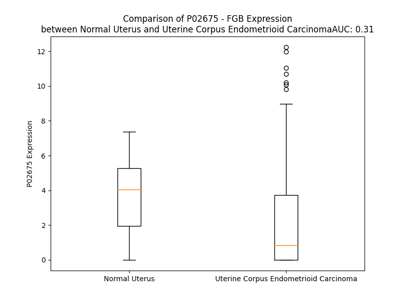

# Detailed Data for P02675

## Introduction to the Detailed Summary

### How to Interpret the Results

- **Summary & Metrics**: This section provides a quick reference to essential protein attributes, including expression changes, family classification, and biomarker applications. Regulation status (upregulated/downregulated) indicates the protein's behavior in a disease context. Some information comes from the original excel file with the proteins selected from literature, while others are derived from the analyses.
- **Expression Comparison**: A visual representation comparing protein expression between normal and disease states. It highlights significant changes in expression levels that might indicate diagnostic or therapeutic relevance. This is data coming from transcriptomics experiments and could not translate similarly to protein levels.
- **Isoform Alignment**: An interactive view of isoform alignments, revealing structural and functional differences between variants of the protein.
- **Interactors & Homologs**: Tables listing known interaction partners and homologous proteins, the more interactors and homologs, the more complex the protein is to design an antibody for.
- **Biological Assemblies**: Information about the structural arrangement of the protein in different assemblies, providing insights into its functional state but also the complexity of the protein to develop antibodies.
- **Combined Per-Residue Information**: A detailed table summarizing residue-level data. This includes predictions for epitope regions, aggregation tendencies, and modifications that might impact the protein's function. Each row corresponds to a residue in the protein, providing insights into specific sites that may be important for research or drug development.
## Summary & Metrics

- **UniProt Accession**: P02675
- **Gene Name**: FGG
- **Protein Name**: fibrinogen gamma chain
- **Swiss Prot**: nan
- **Family**: other
- **Biomarker Application**: unspecified application
- **Number of Isoforms**: 0
- **Regulation**: -1
- **(transcriptomics) AUC**: 0.31
- **(transcriptomics) Fold Change**: 1.69
- **(transcriptomics) Regulation**: Downregulated
- **Discotope Epitope Count**: 104
- **Max n_uniprots (Homo)**: 2.0
- **Max n_uniprots (Hetero)**: 10.0

## Expression Comparison

## Interactors

| preferredName_A   | preferredName_B   |   score |
|:------------------|:------------------|--------:|
| FGB               | FGA               |   0.999 |
| FGB               | FGG               |   0.999 |
| FGB               | F2                |   0.999 |
| FGB               | SERPINC1          |   0.954 |
| FGB               | ITGB3             |   0.952 |
| FGB               | SERPIND1          |   0.951 |
| FGB               | PLG               |   0.948 |
| FGB               | AMBP              |   0.931 |
| FGB               | GC                |   0.931 |
| FGB               | ITGA2B            |   0.925 |
| FGB               | FN1               |   0.922 |
| FGB               | SERPINF2          |   0.914 |
| FGB               | AHSG              |   0.909 |
| FGB               | F13B              |   0.905 |

## Homologs

| uniprot_id   | gene_id   |
|:-------------|:----------|
| Q6UXM4       | FCN3      |
| P02671       | FGA       |
| Q9UKU9       | ANGPTL2   |
| Q9Y5C1       | ANGPTL3   |
| A0A0A0MSK1   | ANGPTL1   |
| Q92752       | TNR       |
| A0A3B3ISX9   | TNXB      |
| P02751       | FN1       |
| O00602       | FCN1      |
| Q15485       | FCN2      |
| Q8NI99       | ANGPTL6   |
| E9PKF7       | ANGPTL5   |
| A0A994J7R0   | TNC       |
| O43827       | ANGPTL7   |
| P55083       | MFAP4     |
| Q08830       | FGL1      |
| Q9UQP3       | TNN       |
| X6RDH7       | FIBCD1    |
| C9JPQ9       | FGG       |
| M0R369       | ANGPTL4   |
| Q9Y264       | ANGPT4    |
| Q5VTL7       | FNDC7     |
| A4D1B8       | FGL2      |
| B4DTQ9       | ANGPT1    |
| O15123       | ANGPT2    |

## Biological Assemblies

|   Unnamed: 0 |   assembly |   n_uniprots | composition   | crystal_id   |
|-------------:|-----------:|-------------:|:--------------|:-------------|
|            0 |          1 |           10 | Hetero        | 2xnx         |
|            0 |          1 |            2 | Hetero        | 6atz         |
|            1 |          2 |            2 | Hetero        | 6atz         |
|            0 |          1 |            2 | Hetero        | 6v19         |
|            0 |          1 |            3 | Hetero        | 2h43         |
|            1 |          2 |            3 | Hetero        | 2h43         |
|            0 |          1 |            3 | Hetero        | 1re3         |
|            1 |          2 |            3 | Hetero        | 1re3         |
|            0 |          1 |            6 | Hetero        | 1fze         |
|            1 |          2 |            3 | Hetero        | 1fze         |
|            2 |          3 |            3 | Hetero        | 1fze         |
|            0 |          1 |            3 | Hetero        | 2oyi         |
|            1 |          2 |            3 | Hetero        | 2oyi         |
|            0 |          1 |            8 | Hetero        | 1n86         |
|            0 |          1 |            2 | Hetero        | 6bil         |
|            0 |          1 |            6 | Hetero        | 1fzg         |
|            0 |          1 |            2 | Hetero        | 6v15         |
|            0 |          1 |            3 | Hetero        | 1re4         |
|            1 |          2 |            3 | Hetero        | 1re4         |
|            0 |          1 |            6 | Hetero        | 1fzc         |
|            0 |          1 |            2 | Hetero        | 6v0y         |
|            0 |          1 |            6 | Hetero        | 2z4e         |
|            1 |          2 |            3 | Hetero        | 2z4e         |
|            2 |          3 |            3 | Hetero        | 2z4e         |
|            0 |          1 |            3 | Hetero        | 2ffd         |
|            1 |          2 |            3 | Hetero        | 2ffd         |
|            0 |          1 |            3 | Hetero        | 3e1i         |
|            1 |          2 |            3 | Hetero        | 3e1i         |
|            0 |          1 |            3 | Hetero        | 1rf0         |
|            1 |          2 |            3 | Hetero        | 1rf0         |
|            0 |          1 |            2 | Hetero        | 6bij         |
|            0 |          1 |            6 | Hetero        | 1fza         |
|            0 |          1 |            6 | Hetero        | 1fzb         |
|            0 |          1 |            3 | Hetero        | 1rf1         |
|            1 |          2 |            3 | Hetero        | 1rf1         |
|            0 |          1 |            3 | Hetero        | 3hus         |
|            1 |          2 |            3 | Hetero        | 3hus         |
|            0 |          1 |            3 | Hetero        | 1lt9         |
|            1 |          2 |            3 | Hetero        | 1lt9         |
|            0 |          1 |            2 | Hetero        | 6v13         |
|            0 |          1 |            3 | Hetero        | 2xny         |
|            1 |          2 |            3 | Hetero        | 2xny         |
|            2 |          3 |            2 | Homo          | 2xny         |
|            0 |          1 |            3 | Hetero        | 2hod         |
|            1 |          2 |            3 | Hetero        | 2hod         |
|            2 |          3 |            3 | Hetero        | 2hod         |
|            3 |          4 |            3 | Hetero        | 2hod         |
|            0 |          1 |            3 | Hetero        | 2hpc         |
|            1 |          2 |            3 | Hetero        | 2hpc         |
|            2 |          3 |            3 | Hetero        | 2hpc         |
|            3 |          4 |            3 | Hetero        | 2hpc         |
|            0 |          1 |           10 | Hetero        | 1fzf         |
|            0 |          1 |            3 | Hetero        | 2q9i         |
|            1 |          2 |            3 | Hetero        | 2q9i         |
|            0 |          1 |            2 | Hetero        | 6v1a         |
|            0 |          1 |            3 | Hetero        | 2hlo         |
|            1 |          2 |            3 | Hetero        | 2hlo         |
|            0 |          1 |            8 | Hetero        | 3h32         |
|            0 |          1 |            6 | Hetero        | 3ghg         |
|            1 |          2 |            6 | Hetero        | 3ghg         |
|            0 |          1 |            2 | Hetero        | 6v18         |
|            0 |          1 |           10 | Hetero        | 2a45         |
|            0 |          1 |            3 | Hetero        | 2oyh         |
|            1 |          2 |            3 | Hetero        | 2oyh         |
|            0 |          1 |            3 | Hetero        | 1ltj         |
|            1 |          2 |            3 | Hetero        | 1ltj         |
|            0 |          1 |            6 | Hetero        | 1n8e         |

## Combined Per-Residue Information

|   res | aa   |   epitope_score | epitope   |   relative_surface_accessibility |   modeling_confidence |   Aggregation | modification                | glycosylation                   |
|------:|:-----|----------------:|:----------|---------------------------------:|----------------------:|--------------:|:----------------------------|:--------------------------------|
|     1 | M    |         0.08201 | False     |                          1.34371 |                 41.78 |         0     | N/A                         | N/A                             |
|     2 | K    |         0.07194 | False     |                          0.99165 |                 36.63 |         0     | N/A                         | N/A                             |
|     3 | R    |         0.11059 | False     |                          0.96749 |                 35.88 |         0     | N/A                         | N/A                             |
|     4 | M    |         0.10967 | False     |                          1.03831 |                 38.12 |         0     | N/A                         | N/A                             |
|     5 | V    |         0.0686  | False     |                          1.08014 |                 42.51 |         0     | N/A                         | N/A                             |
|     6 | S    |         0.11449 | False     |                          0.83605 |                 39.03 |         0     | N/A                         | N/A                             |
|     7 | W    |         0.13076 | False     |                          1.05741 |                 35.53 |         0     | N/A                         | N/A                             |
|     8 | S    |         0.11551 | False     |                          0.73928 |                 42.72 |         0     | N/A                         | N/A                             |
|     9 | F    |         0.06564 | False     |                          0.94013 |                 42.14 |         0     | N/A                         | N/A                             |
|    10 | H    |         0.05022 | False     |                          0.87863 |                 46.21 |         0     | N/A                         | N/A                             |
|    11 | K    |         0.06395 | False     |                          0.763   |                 45.43 |         0     | N/A                         | N/A                             |
|    12 | L    |         0.05889 | False     |                          0.81166 |                 45.4  |         0     | N/A                         | N/A                             |
|    13 | K    |         0.04091 | False     |                          0.73009 |                 51.57 |         0     | N/A                         | N/A                             |
|    14 | T    |         0.03861 | False     |                          0.62051 |                 53.45 |         0     | N/A                         | N/A                             |
|    15 | M    |         0.05637 | False     |                          0.72638 |                 50.89 |         0     | N/A                         | N/A                             |
|    16 | K    |         0.02971 | False     |                          0.7384  |                 57.67 |         0     | N/A                         | N/A                             |
|    17 | H    |         0.04765 | False     |                          0.63248 |                 59.67 |        13.305 | N/A                         | N/A                             |
|    18 | L    |         0.04393 | False     |                          0.71768 |                 58.55 |        66.621 | N/A                         | N/A                             |
|    19 | L    |         0.05229 | False     |                          0.73023 |                 56.18 |        93.303 | N/A                         | N/A                             |
|    20 | L    |         0.03981 | False     |                          0.69986 |                 58.92 |        98.763 | N/A                         | N/A                             |
|    21 | L    |         0.02731 | False     |                          0.67486 |                 56.68 |        99.762 | N/A                         | N/A                             |
|    22 | L    |         0.05375 | False     |                          0.63867 |                 53.64 |        99.945 | N/A                         | N/A                             |
|    23 | L    |         0.0382  | False     |                          0.72337 |                 50.17 |        99.962 | N/A                         | N/A                             |
|    24 | C    |         0.03552 | False     |                          0.58121 |                 47.76 |        99.843 | N/A                         | N/A                             |
|    25 | V    |         0.05043 | False     |                          0.61189 |                 49.57 |        99.818 | N/A                         | N/A                             |
|    26 | F    |         0.09488 | False     |                          0.86132 |                 43.38 |        99.512 | N/A                         | N/A                             |
|    27 | L    |         0.10294 | False     |                          0.93325 |                 41.28 |        95.76  | N/A                         | N/A                             |
|    28 | V    |         0.0771  | False     |                          0.8779  |                 41.63 |        88.261 | N/A                         | N/A                             |
|    29 | K    |         0.06436 | False     |                          0.95814 |                 34.11 |         0.002 | N/A                         | N/A                             |
|    30 | S    |         0.07633 | False     |                          0.75131 |                 30.98 |         0     | N/A                         | N/A                             |
|    31 | Q    |         0.1005  | False     |                          0.94636 |                 31.32 |         0     | Pyrrolidone carboxylic acid | N/A                             |
|    32 | G    |         0.11402 | False     |                          0.93134 |                 32.37 |         0     | N/A                         | N/A                             |
|    33 | V    |         0.09727 | False     |                          0.91645 |                 29.53 |         0     | N/A                         | N/A                             |
|    34 | N    |         0.0882  | False     |                          0.98837 |                 31.67 |         0     | N/A                         | N/A                             |
|    35 | D    |         0.08812 | False     |                          0.75114 |                 29.41 |         0     | N/A                         | N/A                             |
|    36 | N    |         0.14387 | True      |                          0.92459 |                 28.41 |         0     | N/A                         | N/A                             |
|    37 | E    |         0.145   | True      |                          0.92381 |                 32.86 |         0     | N/A                         | N/A                             |
|    38 | E    |         0.10087 | False     |                          0.90552 |                 28.66 |         0     | N/A                         | N/A                             |
|    39 | G    |         0.12044 | False     |                          0.80564 |                 28.1  |         0     | N/A                         | N/A                             |
|    40 | F    |         0.09517 | False     |                          0.99487 |                 28.69 |         0     | N/A                         | N/A                             |
|    41 | F    |         0.16939 | True      |                          0.87631 |                 33.81 |         0     | N/A                         | N/A                             |
|    42 | S    |         0.08517 | False     |                          0.57926 |                 36.25 |         0     | N/A                         | N/A                             |
|    43 | A    |         0.13152 | False     |                          0.39551 |                 43.98 |         0     | N/A                         | N/A                             |
|    44 | R    |         0.12501 | False     |                          0.43037 |                 47.8  |         0     | N/A                         | N/A                             |
|    45 | G    |         0.16579 | True      |                          0.76651 |                 35.82 |         0     | N/A                         | N/A                             |
|    46 | H    |         0.20361 | True      |                          0.6289  |                 36.06 |         0     | N/A                         | N/A                             |
|    47 | R    |         0.13814 | False     |                          0.85828 |                 43.63 |         0     | N/A                         | N/A                             |
|    48 | P    |         0.14495 | True      |                          0.93369 |                 35.14 |         0     | N/A                         | N/A                             |
|    49 | L    |         0.12295 | False     |                          0.9862  |                 43.24 |         0     | N/A                         | N/A                             |
|    50 | D    |         0.17073 | True      |                          0.80969 |                 33.08 |         0     | N/A                         | N/A                             |
|    51 | K    |         0.10092 | False     |                          0.94407 |                 36.28 |         0     | N/A                         | N/A                             |
|    52 | K    |         0.13124 | False     |                          0.91888 |                 32.07 |         0     | N/A                         | N/A                             |
|    53 | R    |         0.13577 | False     |                          0.94854 |                 33.36 |         0     | N/A                         | N/A                             |
|    54 | E    |         0.15871 | True      |                          0.8549  |                 29.65 |         0     | N/A                         | N/A                             |
|    55 | E    |         0.12875 | False     |                          0.90554 |                 32.11 |         0     | N/A                         | N/A                             |
|    56 | A    |         0.09133 | False     |                          0.94746 |                 37.21 |         0     | N/A                         | N/A                             |
|    57 | P    |         0.10337 | False     |                          0.9417  |                 38.89 |         0     | N/A                         | N/A                             |
|    58 | S    |         0.12802 | False     |                          0.73692 |                 35.63 |         0     | N/A                         | N/A                             |
|    59 | L    |         0.10892 | False     |                          1.02887 |                 32.7  |         0     | N/A                         | N/A                             |
|    60 | R    |         0.10616 | False     |                          0.97305 |                 38.36 |         0     | N/A                         | N/A                             |
|    61 | P    |         0.06706 | False     |                          0.93679 |                 36.63 |         0     | N/A                         | N/A                             |
|    62 | A    |         0.08861 | False     |                          0.87129 |                 36.31 |         0     | N/A                         | N/A                             |
|    63 | P    |         0.11363 | False     |                          0.88066 |                 46.01 |         0     | N/A                         | N/A                             |
|    64 | P    |         0.08071 | False     |                          0.94971 |                 37.91 |         0     | N/A                         | N/A                             |
|    65 | P    |         0.11754 | False     |                          0.81841 |                 36.14 |         0     | N/A                         | N/A                             |
|    66 | I    |         0.09372 | False     |                          0.99764 |                 32.46 |         0     | N/A                         | N/A                             |
|    67 | S    |         0.12581 | False     |                          0.84629 |                 30.38 |         0     | N/A                         | N/A                             |
|    68 | G    |         0.07436 | False     |                          0.96559 |                 31.18 |         0     | N/A                         | N/A                             |
|    69 | G    |         0.11953 | False     |                          0.98862 |                 31.79 |         0     | N/A                         | N/A                             |
|    70 | G    |         0.13836 | False     |                          0.98403 |                 35.16 |         0     | N/A                         | N/A                             |
|    71 | Y    |         0.10875 | False     |                          1.00298 |                 31.8  |         0     | N/A                         | N/A                             |
|    72 | R    |         0.14509 | True      |                          0.98207 |                 36.6  |         0     | N/A                         | N/A                             |
|    73 | A    |         0.07381 | False     |                          1.00357 |                 35.13 |         0     | N/A                         | N/A                             |
|    74 | R    |         0.17522 | True      |                          0.9467  |                 42.41 |         0     | N/A                         | N/A                             |
|    75 | P    |         0.0937  | False     |                          0.92144 |                 40.24 |         0     | N/A                         | N/A                             |
|    76 | A    |         0.12493 | False     |                          1.02608 |                 32.09 |         0     | N/A                         | N/A                             |
|    77 | K    |         0.13121 | False     |                          1.01972 |                 40.33 |         0     | N/A                         | N/A                             |
|    78 | A    |         0.11571 | False     |                          0.96119 |                 36.82 |         0     | N/A                         | N/A                             |
|    79 | A    |         0.10372 | False     |                          1.0161  |                 37.79 |         0     | N/A                         | N/A                             |
|    80 | A    |         0.09667 | False     |                          0.87155 |                 43.74 |         0     | N/A                         | N/A                             |
|    81 | T    |         0.12671 | False     |                          0.96577 |                 35.88 |         0     | N/A                         | N/A                             |
|    82 | Q    |         0.10003 | False     |                          0.91467 |                 42.97 |         0     | N/A                         | N/A                             |
|    83 | K    |         0.1287  | False     |                          0.93784 |                 41.55 |         0     | N/A                         | N/A                             |
|    84 | K    |         0.17546 | True      |                          1.02731 |                 38.7  |         0     | N/A                         | N/A                             |
|    85 | V    |         0.07806 | False     |                          0.87902 |                 45.58 |         0     | N/A                         | N/A                             |
|    86 | E    |         0.2012  | True      |                          0.85377 |                 39.72 |         0     | N/A                         | N/A                             |
|    87 | R    |         0.17218 | True      |                          0.93646 |                 43.2  |         0     | N/A                         | N/A                             |
|    88 | K    |         0.1111  | False     |                          0.94035 |                 49.05 |         0     | N/A                         | N/A                             |
|    89 | A    |         0.14913 | True      |                          0.84653 |                 49.48 |         0     | N/A                         | N/A                             |
|    90 | P    |         0.17316 | True      |                          0.91054 |                 70.7  |         0     | N/A                         | N/A                             |
|    91 | D    |         0.15638 | True      |                          0.92323 |                 66.84 |         0     | N/A                         | N/A                             |
|    92 | A    |         0.16794 | True      |                          0.9064  |                 70.85 |         0     | N/A                         | N/A                             |
|    93 | G    |         0.07589 | False     |                          0.71394 |                 73.26 |         0     | N/A                         | N/A                             |
|    94 | G    |         0.10482 | False     |                          0.45698 |                 78.93 |         0     | N/A                         | N/A                             |
|    95 | C    |         0.10521 | False     |                          0.6184  |                 78.7  |         0     | N/A                         | N/A                             |
|    96 | L    |         0.21408 | True      |                          0.85321 |                 81    |         0     | N/A                         | N/A                             |
|    97 | H    |         0.15285 | True      |                          0.42136 |                 81.11 |         0     | N/A                         | N/A                             |
|    98 | A    |         0.18094 | True      |                          1.02233 |                 79.45 |         0     | N/A                         | N/A                             |
|    99 | D    |         0.25157 | True      |                          0.37589 |                 75.34 |         0     | N/A                         | N/A                             |
|   100 | P    |         0.24597 | True      |                          0.94297 |                 75.53 |         0     | N/A                         | N/A                             |
|   101 | D    |         0.32864 | True      |                          0.86711 |                 77.97 |         0     | N/A                         | N/A                             |
|   102 | L    |         0.23506 | True      |                          0.59659 |                 75.76 |         0     | N/A                         | N/A                             |
|   103 | G    |         0.11789 | False     |                          0.30879 |                 83.5  |         0     | N/A                         | N/A                             |
|   104 | V    |         0.18502 | True      |                          0.65067 |                 82.53 |         0     | N/A                         | N/A                             |
|   105 | L    |         0.09609 | False     |                          0.49225 |                 81.4  |         0     | N/A                         | N/A                             |
|   106 | C    |         0.16996 | True      |                          0.66558 |                 82.03 |         0     | N/A                         | N/A                             |
|   107 | P    |         0.04383 | False     |                          0.30634 |                 81.88 |         0     | N/A                         | N/A                             |
|   108 | T    |         0.12424 | False     |                          0.59558 |                 83.04 |         0     | N/A                         | N/A                             |
|   109 | G    |         0.0857  | False     |                          0.66501 |                 84.85 |         0     | N/A                         | N/A                             |
|   110 | C    |         0.07743 | False     |                          0.7412  |                 84.56 |         0     | N/A                         | N/A                             |
|   111 | Q    |         0.11763 | False     |                          0.55346 |                 83    |         0     | N/A                         | N/A                             |
|   112 | L    |         0.06204 | False     |                          0.60938 |                 83.87 |         0     | N/A                         | N/A                             |
|   113 | Q    |         0.06444 | False     |                          0.57875 |                 86.62 |         0     | N/A                         | N/A                             |
|   114 | E    |         0.08097 | False     |                          0.54457 |                 86.51 |         0     | N/A                         | N/A                             |
|   115 | A    |         0.03507 | False     |                          0.42619 |                 84.06 |         0     | N/A                         | N/A                             |
|   116 | L    |         0.06681 | False     |                          0.76267 |                 84.28 |         0     | N/A                         | N/A                             |
|   117 | L    |         0.07992 | False     |                          0.50261 |                 84.35 |         0     | N/A                         | N/A                             |
|   118 | Q    |         0.10123 | False     |                          0.66233 |                 82.27 |         0     | N/A                         | N/A                             |
|   119 | Q    |         0.05219 | False     |                          0.54363 |                 82.27 |         0     | N/A                         | N/A                             |
|   120 | E    |         0.10335 | False     |                          0.47592 |                 85.62 |         0     | N/A                         | N/A                             |
|   121 | R    |         0.09964 | False     |                          0.69304 |                 80.13 |         0     | N/A                         | N/A                             |
|   122 | P    |         0.0672  | False     |                          0.56309 |                 84.06 |         0     | N/A                         | N/A                             |
|   123 | I    |         0.03498 | False     |                          0.60797 |                 84.99 |         0     | N/A                         | N/A                             |
|   124 | R    |         0.07045 | False     |                          0.61125 |                 85.56 |         0     | N/A                         | N/A                             |
|   125 | N    |         0.0663  | False     |                          0.66708 |                 84.77 |         0     | N/A                         | N/A                             |
|   126 | S    |         0.02599 | False     |                          0.50734 |                 85.67 |         0     | N/A                         | N/A                             |
|   127 | V    |         0.01601 | False     |                          0.5705  |                 85.35 |         0     | N/A                         | N/A                             |
|   128 | D    |         0.02715 | False     |                          0.43352 |                 84.96 |         0     | N/A                         | N/A                             |
|   129 | E    |         0.04228 | False     |                          0.58233 |                 85.33 |         0     | N/A                         | N/A                             |
|   130 | L    |         0.01436 | False     |                          0.73826 |                 85.27 |         0     | N/A                         | N/A                             |
|   131 | N    |         0.03511 | False     |                          0.60368 |                 83.54 |         0     | N/A                         | N/A                             |
|   132 | N    |         0.03865 | False     |                          0.66155 |                 82.37 |         0     | N/A                         | N/A                             |
|   133 | N    |         0.02413 | False     |                          0.51938 |                 85.05 |         0     | N/A                         | N/A                             |
|   134 | V    |         0.01725 | False     |                          0.62141 |                 83.06 |         0     | N/A                         | N/A                             |
|   135 | E    |         0.0433  | False     |                          0.64375 |                 82.73 |         0     | N/A                         | N/A                             |
|   136 | A    |         0.02509 | False     |                          0.54508 |                 79.53 |         0     | N/A                         | N/A                             |
|   137 | V    |         0.01876 | False     |                          0.72117 |                 82.66 |         0     | N/A                         | N/A                             |
|   138 | S    |         0.0301  | False     |                          0.4171  |                 83.22 |         0     | N/A                         | N/A                             |
|   139 | Q    |         0.07314 | False     |                          0.67096 |                 83.97 |         0     | N/A                         | N/A                             |
|   140 | T    |         0.03801 | False     |                          0.63194 |                 85.49 |         0     | N/A                         | N/A                             |
|   141 | S    |         0.02239 | False     |                          0.35504 |                 85.75 |         0     | N/A                         | N/A                             |
|   142 | S    |         0.02766 | False     |                          0.51663 |                 83.23 |         0     | N/A                         | N/A                             |
|   143 | S    |         0.05595 | False     |                          0.5473  |                 86.49 |         0.236 | N/A                         | N/A                             |
|   144 | S    |         0.02828 | False     |                          0.49826 |                 86.74 |         2.137 | N/A                         | N/A                             |
|   145 | F    |         0.02632 | False     |                          0.67161 |                 86.54 |        18.373 | N/A                         | N/A                             |
|   146 | Q    |         0.05974 | False     |                          0.68485 |                 88.19 |        19.624 | N/A                         | N/A                             |
|   147 | Y    |         0.0653  | False     |                          0.56809 |                 89.26 |        52.511 | N/A                         | N/A                             |
|   148 | M    |         0.03703 | False     |                          0.60692 |                 88.98 |        52.612 | N/A                         | N/A                             |
|   149 | Y    |         0.05002 | False     |                          0.6936  |                 88.05 |        52.701 | N/A                         | N/A                             |
|   150 | L    |         0.05958 | False     |                          0.6675  |                 91.42 |        52.513 | N/A                         | N/A                             |
|   151 | L    |         0.03624 | False     |                          0.42215 |                 93.11 |        52.136 | N/A                         | N/A                             |
|   152 | K    |         0.02247 | False     |                          0.63633 |                 92.97 |         1.351 | N/A                         | N/A                             |
|   153 | D    |         0.02559 | False     |                          0.40126 |                 92.32 |         1.351 | N/A                         | N/A                             |
|   154 | L    |         0.06201 | False     |                          0.6905  |                 94.09 |         1.351 | N/A                         | N/A                             |
|   155 | W    |         0.03674 | False     |                          0.70094 |                 93.26 |         1.247 | N/A                         | N/A                             |
|   156 | Q    |         0.05837 | False     |                          0.55318 |                 93.42 |         0     | N/A                         | N/A                             |
|   157 | K    |         0.05336 | False     |                          0.62757 |                 93.4  |         0     | N/A                         | N/A                             |
|   158 | R    |         0.05456 | False     |                          0.66633 |                 93.02 |         0     | N/A                         | N/A                             |
|   159 | Q    |         0.0338  | False     |                          0.47619 |                 93.74 |         0     | N/A                         | N/A                             |
|   160 | K    |         0.06363 | False     |                          0.6796  |                 93.78 |         0     | N/A                         | N/A                             |
|   161 | Q    |         0.06639 | False     |                          0.49002 |                 93.29 |         0     | N/A                         | N/A                             |
|   162 | V    |         0.04247 | False     |                          0.61947 |                 93.83 |         0     | N/A                         | N/A                             |
|   163 | K    |         0.08638 | False     |                          0.69737 |                 91.66 |         0     | N/A                         | N/A                             |
|   164 | D    |         0.04971 | False     |                          0.45387 |                 90.86 |         0     | N/A                         | N/A                             |
|   165 | N    |         0.04022 | False     |                          0.45119 |                 91.71 |         0     | N/A                         | N/A                             |
|   166 | E    |         0.06496 | False     |                          0.54334 |                 90.27 |         0     | N/A                         | N/A                             |
|   167 | N    |         0.03801 | False     |                          0.59142 |                 89.39 |         0     | N/A                         | N/A                             |
|   168 | V    |         0.06445 | False     |                          0.5046  |                 92.2  |         0     | N/A                         | N/A                             |
|   169 | V    |         0.03595 | False     |                          0.65643 |                 93.18 |         0     | N/A                         | N/A                             |
|   170 | N    |         0.05951 | False     |                          0.55019 |                 90.95 |         0     | N/A                         | N/A                             |
|   171 | E    |         0.04114 | False     |                          0.63722 |                 92.45 |         0     | N/A                         | N/A                             |
|   172 | Y    |         0.06736 | False     |                          0.73908 |                 93.69 |         0     | N/A                         | N/A                             |
|   173 | S    |         0.03012 | False     |                          0.39844 |                 94.23 |         0     | N/A                         | N/A                             |
|   174 | S    |         0.05664 | False     |                          0.40523 |                 94.45 |         0     | N/A                         | N/A                             |
|   175 | E    |         0.09537 | False     |                          0.52473 |                 94.43 |         0     | N/A                         | N/A                             |
|   176 | L    |         0.06199 | False     |                          0.77185 |                 95.68 |         0     | N/A                         | N/A                             |
|   177 | E    |         0.06494 | False     |                          0.64154 |                 95.81 |         0     | N/A                         | N/A                             |
|   178 | K    |         0.06139 | False     |                          0.59912 |                 95    |         0     | N/A                         | N/A                             |
|   179 | H    |         0.0585  | False     |                          0.63493 |                 94.63 |         0     | N/A                         | N/A                             |
|   180 | Q    |         0.06052 | False     |                          0.56033 |                 95.45 |         0     | N/A                         | N/A                             |
|   181 | L    |         0.05863 | False     |                          0.6138  |                 95.93 |         0     | N/A                         | N/A                             |
|   182 | Y    |         0.08881 | False     |                          0.63893 |                 96.16 |         0     | N/A                         | N/A                             |
|   183 | I    |         0.04489 | False     |                          0.44558 |                 96.4  |         0     | N/A                         | N/A                             |
|   184 | D    |         0.0643  | False     |                          0.42696 |                 96.09 |         0     | N/A                         | N/A                             |
|   185 | E    |         0.05161 | False     |                          0.46221 |                 95.94 |         0     | N/A                         | N/A                             |
|   186 | T    |         0.02217 | False     |                          0.25726 |                 96.59 |         0     | N/A                         | N/A                             |
|   187 | V    |         0.08788 | False     |                          0.5948  |                 96.98 |         0     | N/A                         | N/A                             |
|   188 | N    |         0.15133 | True      |                          0.64749 |                 94.67 |         0     | N/A                         | N/A                             |
|   189 | S    |         0.12018 | False     |                          0.43336 |                 93.9  |         0     | N/A                         | N/A                             |
|   190 | N    |         0.04046 | False     |                          0.4448  |                 96.08 |         0     | N/A                         | N/A                             |
|   191 | I    |         0.03925 | False     |                          0.50558 |                 96.78 |         0     | N/A                         | N/A                             |
|   192 | P    |         0.03606 | False     |                          0.3985  |                 97.44 |         0     | N/A                         | N/A                             |
|   193 | T    |         0.03337 | False     |                          0.4183  |                 96.66 |         0     | N/A                         | N/A                             |
|   194 | N    |         0.0283  | False     |                          0.50982 |                 97.2  |         0     | N/A                         | N/A                             |
|   195 | L    |         0.04926 | False     |                          0.57942 |                 97.3  |         0     | N/A                         | N/A                             |
|   196 | R    |         0.06956 | False     |                          0.59672 |                 96.86 |         0     | N/A                         | N/A                             |
|   197 | V    |         0.04252 | False     |                          0.63217 |                 97.39 |         0     | N/A                         | N/A                             |
|   198 | L    |         0.02156 | False     |                          0.49015 |                 97.61 |         0     | N/A                         | N/A                             |
|   199 | R    |         0.05402 | False     |                          0.64896 |                 97.63 |         0     | N/A                         | N/A                             |
|   200 | S    |         0.04947 | False     |                          0.52155 |                 97.95 |         0     | N/A                         | N/A                             |
|   201 | I    |         0.08126 | False     |                          0.54318 |                 98.18 |         0     | N/A                         | N/A                             |
|   202 | L    |         0.05218 | False     |                          0.74185 |                 97.69 |         0     | N/A                         | N/A                             |
|   203 | E    |         0.07327 | False     |                          0.51198 |                 97.84 |         0     | N/A                         | N/A                             |
|   204 | N    |         0.04552 | False     |                          0.50034 |                 98.06 |         0     | N/A                         | N/A                             |
|   205 | L    |         0.0526  | False     |                          0.60135 |                 98.21 |         0     | N/A                         | N/A                             |
|   206 | R    |         0.15194 | True      |                          0.71362 |                 98.05 |         0     | N/A                         | N/A                             |
|   207 | S    |         0.10029 | False     |                          0.50397 |                 98.38 |         0     | N/A                         | N/A                             |
|   208 | K    |         0.0628  | False     |                          0.5964  |                 98.23 |         0     | N/A                         | N/A                             |
|   209 | I    |         0.12768 | False     |                          0.60855 |                 98.48 |         0     | N/A                         | N/A                             |
|   210 | Q    |         0.07229 | False     |                          0.62144 |                 98.2  |         0     | N/A                         | N/A                             |
|   211 | K    |         0.06714 | False     |                          0.59573 |                 98.39 |         0     | N/A                         | N/A                             |
|   212 | L    |         0.0677  | False     |                          0.68717 |                 98.24 |         0     | N/A                         | N/A                             |
|   213 | E    |         0.11787 | False     |                          0.56553 |                 98.2  |         0     | N/A                         | N/A                             |
|   214 | S    |         0.09627 | False     |                          0.49562 |                 98.28 |         0     | N/A                         | N/A                             |
|   215 | D    |         0.12946 | False     |                          0.40225 |                 98.05 |         0     | N/A                         | N/A                             |
|   216 | V    |         0.07057 | False     |                          0.5899  |                 98.03 |         0     | N/A                         | N/A                             |
|   217 | S    |         0.05035 | False     |                          0.5242  |                 98.22 |         0     | N/A                         | N/A                             |
|   218 | A    |         0.05511 | False     |                          0.4261  |                 98.33 |         0     | N/A                         | N/A                             |
|   219 | Q    |         0.08861 | False     |                          0.51946 |                 97.22 |         0     | N/A                         | N/A                             |
|   220 | M    |         0.18595 | True      |                          0.71414 |                 97.72 |         0     | N/A                         | N/A                             |
|   221 | E    |         0.09668 | False     |                          0.46731 |                 97.61 |         0     | N/A                         | N/A                             |
|   222 | Y    |         0.22581 | True      |                          0.70746 |                 96.36 |         0     | N/A                         | N/A                             |
|   223 | C    |         0.1783  | True      |                          0.64738 |                 97.38 |         0     | N/A                         | N/A                             |
|   224 | R    |         0.35435 | True      |                          0.72822 |                 97.42 |         0     | N/A                         | N/A                             |
|   225 | T    |         0.15493 | True      |                          0.74628 |                 97.13 |         0     | N/A                         | N/A                             |
|   226 | P    |         0.21678 | True      |                          0.821   |                 96.32 |         0     | N/A                         | N/A                             |
|   227 | C    |         0.20083 | True      |                          0.87917 |                 94.92 |         0     | N/A                         | N/A                             |
|   228 | T    |         0.2541  | True      |                          0.8572  |                 93.63 |         0     | N/A                         | N/A                             |
|   229 | V    |         0.26646 | True      |                          0.59116 |                 93.17 |         0     | N/A                         | N/A                             |
|   230 | S    |         0.31325 | True      |                          0.63027 |                 92.18 |         0     | N/A                         | N/A                             |
|   231 | C    |         0.06339 | False     |                          0.2502  |                 92.4  |         0     | N/A                         | N/A                             |
|   232 | N    |         0.15464 | True      |                          0.56352 |                 93.23 |         0     | N/A                         | N/A                             |
|   233 | I    |         0.11133 | False     |                          0.46419 |                 93.35 |         0     | N/A                         | N/A                             |
|   234 | P    |         0.10913 | False     |                          0.21633 |                 94.4  |         0     | N/A                         | N/A                             |
|   235 | V    |         0.1422  | True      |                          1.09814 |                 95.8  |         0     | N/A                         | N/A                             |
|   236 | V    |         0.10344 | False     |                          0.26824 |                 96.74 |         0     | N/A                         | N/A                             |
|   237 | S    |         0.09158 | False     |                          0.326   |                 96.98 |         0     | N/A                         | N/A                             |
|   238 | G    |         0.06047 | False     |                          0.10648 |                 96.27 |         0     | N/A                         | N/A                             |
|   239 | K    |         0.09491 | False     |                          0.53602 |                 96.53 |         0     | N/A                         | N/A                             |
|   240 | E    |         0.02332 | False     |                          0.06872 |                 96.63 |         0     | N/A                         | N/A                             |
|   241 | C    |         0.00253 | False     |                          0       |                 98.22 |         0     | N/A                         | N/A                             |
|   242 | E    |         0.04649 | False     |                          0.14284 |                 97.41 |         0     | N/A                         | N/A                             |
|   243 | E    |         0.05848 | False     |                          0.22371 |                 96.81 |         0     | N/A                         | N/A                             |
|   244 | I    |         0.01491 | False     |                          0       |                 98.11 |         0     | N/A                         | N/A                             |
|   245 | I    |         0.19889 | True      |                          0.23087 |                 97.37 |         0     | N/A                         | N/A                             |
|   246 | R    |         0.21425 | True      |                          0.72722 |                 96.35 |         0     | N/A                         | N/A                             |
|   247 | K    |         0.1986  | True      |                          0.5459  |                 97.45 |         0     | N/A                         | N/A                             |
|   248 | G    |         0.21289 | True      |                          0.63896 |                 95.69 |         0     | N/A                         | N/A                             |
|   249 | G    |         0.06906 | False     |                          0.04185 |                 95.98 |         0     | N/A                         | N/A                             |
|   250 | E    |         0.19939 | True      |                          0.68496 |                 94.08 |         0     | N/A                         | N/A                             |
|   251 | T    |         0.16459 | True      |                          0.52793 |                 95.89 |         0     | N/A                         | N/A                             |
|   252 | S    |         0.08519 | False     |                          0.19558 |                 97.31 |         0     | N/A                         | N/A                             |
|   253 | E    |         0.06737 | False     |                          0.07424 |                 97.01 |         0     | N/A                         | N/A                             |
|   254 | M    |         0.0308  | False     |                          0.01901 |                 97.72 |         0     | N/A                         | N/A                             |
|   255 | Y    |         0.04999 | False     |                          0.01394 |                 98.05 |         0     | N/A                         | N/A                             |
|   256 | L    |         0.07539 | False     |                          0.25802 |                 97.58 |         0     | N/A                         | N/A                             |
|   257 | I    |         0.01037 | False     |                          0       |                 98.02 |         0     | N/A                         | N/A                             |
|   258 | Q    |         0.16822 | True      |                          0.32411 |                 97.36 |         0     | N/A                         | N/A                             |
|   259 | P    |         0.03269 | False     |                          0.10538 |                 95.28 |         0     | N/A                         | N/A                             |
|   260 | D    |         0.12818 | False     |                          0.34827 |                 92.63 |         0     | N/A                         | N/A                             |
|   261 | S    |         0.18425 | True      |                          0.82198 |                 92.28 |         0     | N/A                         | N/A                             |
|   262 | S    |         0.15591 | True      |                          0.78696 |                 92.19 |         0     | N/A                         | N/A                             |
|   263 | V    |         0.15669 | True      |                          0.43752 |                 91.7  |         0     | N/A                         | N/A                             |
|   264 | K    |         0.16941 | True      |                          0.87512 |                 95.18 |         0     | N/A                         | N/A                             |
|   265 | P    |         0.20518 | True      |                          0.45633 |                 96.9  |         0     | N/A                         | N/A                             |
|   266 | Y    |         0.0888  | False     |                          0.09382 |                 97.66 |         0     | N/A                         | N/A                             |
|   267 | R    |         0.11502 | False     |                          0.5257  |                 97.82 |         0     | N/A                         | N/A                             |
|   268 | V    |         0.00171 | False     |                          0       |                 98.33 |         0     | N/A                         | N/A                             |
|   269 | Y    |         0.02637 | False     |                          0.06422 |                 98.55 |         0     | N/A                         | N/A                             |
|   270 | C    |         0.00355 | False     |                          0       |                 98.63 |         0     | N/A                         | N/A                             |
|   271 | D    |         0.0404  | False     |                          0.08731 |                 98.42 |         0     | N/A                         | N/A                             |
|   272 | M    |         0.03651 | False     |                          0.05741 |                 97.79 |         0     | N/A                         | N/A                             |
|   273 | N    |         0.11016 | False     |                          0.71432 |                 96.54 |         0     | N/A                         | N/A                             |
|   274 | T    |         0.08816 | False     |                          0.26598 |                 95.39 |         0     | N/A                         | N/A                             |
|   275 | E    |         0.1843  | True      |                          0.32441 |                 93.89 |         0     | N/A                         | N/A                             |
|   276 | N    |         0.1306  | False     |                          0.89578 |                 94.85 |         0     | N/A                         | N/A                             |
|   277 | G    |         0.00819 | False     |                          0       |                 96.11 |         0     | N/A                         | N/A                             |
|   278 | G    |         0.00188 | False     |                          0       |                 97.22 |         1.762 | N/A                         | N/A                             |
|   279 | W    |         0.00557 | False     |                          0       |                 98.53 |         2.04  | N/A                         | N/A                             |
|   280 | T    |         0.00169 | False     |                          0.00747 |                 98.67 |         2.04  | N/A                         | N/A                             |
|   281 | V    |         0.00946 | False     |                          0.0457  |                 98.73 |         2.04  | N/A                         | N/A                             |
|   282 | I    |         0.00406 | False     |                          0       |                 98.74 |         2.04  | N/A                         | N/A                             |
|   283 | Q    |         0.0037  | False     |                          0       |                 98.75 |         0.278 | N/A                         | N/A                             |
|   284 | N    |         0.02251 | False     |                          0.06994 |                 98.74 |         0     | N/A                         | N/A                             |
|   285 | R    |         0.03808 | False     |                          0.01905 |                 98.55 |         0     | N/A                         | N/A                             |
|   286 | Q    |         0.05198 | False     |                          0.25812 |                 97.78 |         0     | N/A                         | N/A                             |
|   287 | D    |         0.08583 | False     |                          0.37205 |                 97.61 |         0     | N/A                         | N/A                             |
|   288 | G    |         0.10414 | False     |                          0.42042 |                 97.59 |         0     | N/A                         | N/A                             |
|   289 | S    |         0.15674 | True      |                          0.59987 |                 97.49 |         0     | N/A                         | N/A                             |
|   290 | V    |         0.04197 | False     |                          0.09669 |                 98.3  |         0     | N/A                         | N/A                             |
|   291 | D    |         0.16517 | True      |                          0.55692 |                 98.31 |         0     | N/A                         | N/A                             |
|   292 | F    |         0.02421 | False     |                          0.02111 |                 98.61 |         0     | N/A                         | N/A                             |
|   293 | G    |         0.15586 | True      |                          0.37108 |                 98.13 |         0     | N/A                         | N/A                             |
|   294 | R    |         0.2193  | True      |                          0.31258 |                 98.49 |         0     | N/A                         | N/A                             |
|   295 | K    |         0.17823 | True      |                          0.51492 |                 98.6  |         0     | N/A                         | N/A                             |
|   296 | W    |         0.04714 | False     |                          0.05176 |                 98.72 |         0     | N/A                         | N/A                             |
|   297 | D    |         0.23866 | True      |                          0.53869 |                 98.68 |         0     | N/A                         | N/A                             |
|   298 | P    |         0.1455  | True      |                          0.32279 |                 98.7  |         0     | N/A                         | N/A                             |
|   299 | Y    |         0.004   | False     |                          0       |                 98.8  |         0     | N/A                         | N/A                             |
|   300 | K    |         0.08375 | False     |                          0.21004 |                 98.64 |         0     | N/A                         | N/A                             |
|   301 | Q    |         0.18629 | True      |                          0.55496 |                 98.3  |         0     | N/A                         | N/A                             |
|   302 | G    |         0.06344 | False     |                          0.26362 |                 98.48 |         0     | N/A                         | N/A                             |
|   303 | F    |         0.1226  | False     |                          0.11136 |                 98.8  |         0     | N/A                         | N/A                             |
|   304 | G    |         0.04679 | False     |                          0.43014 |                 98.21 |         0     | N/A                         | N/A                             |
|   305 | N    |         0.10465 | False     |                          0.41576 |                 97.94 |         0     | N/A                         | N/A                             |
|   306 | V    |         0.0277  | False     |                          0.23155 |                 98.02 |         0     | N/A                         | N/A                             |
|   307 | A    |         0.022   | False     |                          0.05609 |                 97.5  |         0     | N/A                         | N/A                             |
|   308 | T    |         0.10493 | False     |                          0.34067 |                 95.66 |         0     | N/A                         | N/A                             |
|   309 | N    |         0.1004  | False     |                          0.35752 |                 92.07 |         0     | N/A                         | N/A                             |
|   310 | T    |         0.13266 | False     |                          0.2838  |                 86.5  |         0     | N/A                         | N/A                             |
|   311 | D    |         0.35    | True      |                          0.90262 |                 83.64 |         0     | N/A                         | N/A                             |
|   312 | G    |         0.2899  | True      |                          1.05258 |                 80.98 |         0     | N/A                         | N/A                             |
|   313 | K    |         0.36722 | True      |                          0.5305  |                 89.19 |         0     | N/A                         | N/A                             |
|   314 | N    |         0.21749 | True      |                          0.68753 |                 89.51 |         0     | N/A                         | N/A                             |
|   315 | Y    |         0.20746 | True      |                          0.2784  |                 91.68 |         0     | N/A                         | N/A                             |
|   316 | C    |         0.01215 | False     |                          0.00602 |                 95.66 |         0     | N/A                         | N/A                             |
|   317 | G    |         0.13405 | False     |                          0.17663 |                 95.1  |         0     | N/A                         | N/A                             |
|   318 | L    |         0.1438  | True      |                          0.53418 |                 95.83 |         0     | N/A                         | N/A                             |
|   319 | P    |         0.04163 | False     |                          0.26213 |                 97    |         0     | N/A                         | N/A                             |
|   320 | G    |         0.01434 | False     |                          0.03863 |                 97.67 |         0     | N/A                         | N/A                             |
|   321 | E    |         0.00702 | False     |                          0.00419 |                 98.77 |         0     | N/A                         | N/A                             |
|   322 | Y    |         0.00905 | False     |                          0.00752 |                 98.81 |         0     | N/A                         | N/A                             |
|   323 | W    |         0.02013 | False     |                          0.00727 |                 98.86 |         0     | N/A                         | N/A                             |
|   324 | L    |         0.01289 | False     |                          0.03778 |                 98.65 |         0     | N/A                         | N/A                             |
|   325 | G    |         0.00273 | False     |                          0       |                 98.57 |         0     | N/A                         | N/A                             |
|   326 | N    |         0.01552 | False     |                          0.0113  |                 98.72 |         0     | N/A                         | N/A                             |
|   327 | D    |         0.09478 | False     |                          0.33938 |                 97.7  |         0     | N/A                         | N/A                             |
|   328 | K    |         0.04524 | False     |                          0.2765  |                 98.1  |         0     | N/A                         | N/A                             |
|   329 | I    |         0.00395 | False     |                          0.0064  |                 98.48 |         0     | N/A                         | N/A                             |
|   330 | S    |         0.00762 | False     |                          0.00832 |                 97.84 |         0     | N/A                         | N/A                             |
|   331 | Q    |         0.05645 | False     |                          0.15232 |                 96.19 |         0     | N/A                         | N/A                             |
|   332 | L    |         0.02194 | False     |                          0.05043 |                 97.11 |         0     | N/A                         | N/A                             |
|   333 | T    |         0.03078 | False     |                          0.01337 |                 97.05 |         0     | N/A                         | N/A                             |
|   334 | R    |         0.12085 | False     |                          0.57251 |                 93.93 |         0     | N/A                         | N/A                             |
|   335 | M    |         0.12522 | False     |                          0.44997 |                 93.12 |         0     | N/A                         | N/A                             |
|   336 | G    |         0.05563 | False     |                          0.37214 |                 93.65 |         0     | N/A                         | N/A                             |
|   337 | P    |         0.09579 | False     |                          0.67475 |                 96.97 |         0     | N/A                         | N/A                             |
|   338 | T    |         0.01226 | False     |                          0.05899 |                 97.93 |         0     | N/A                         | N/A                             |
|   339 | E    |         0.02187 | False     |                          0.03649 |                 97.97 |         0     | N/A                         | N/A                             |
|   340 | L    |         0.00234 | False     |                          0       |                 98.51 |         0     | N/A                         | N/A                             |
|   341 | L    |         0.01385 | False     |                          0.00412 |                 98.61 |         0     | N/A                         | N/A                             |
|   342 | I    |         0.00393 | False     |                          0       |                 98.75 |         0     | N/A                         | N/A                             |
|   343 | E    |         0.04399 | False     |                          0.27508 |                 98.56 |         0     | N/A                         | N/A                             |
|   344 | M    |         0.02541 | False     |                          0.01636 |                 98.39 |         0     | N/A                         | N/A                             |
|   345 | E    |         0.03808 | False     |                          0.07786 |                 98.65 |         0     | N/A                         | N/A                             |
|   346 | D    |         0.01028 | False     |                          0.00315 |                 98.34 |         0     | N/A                         | N/A                             |
|   347 | W    |         0.11906 | False     |                          0.2185  |                 98.17 |         0     | N/A                         | N/A                             |
|   348 | K    |         0.16359 | True      |                          0.88773 |                 97.76 |         0     | N/A                         | N/A                             |
|   349 | G    |         0.07066 | False     |                          0.39039 |                 97.51 |         0     | N/A                         | N/A                             |
|   350 | D    |         0.21333 | True      |                          0.49645 |                 98.45 |         0     | N/A                         | N/A                             |
|   351 | K    |         0.1321  | False     |                          0.72012 |                 98.32 |         0     | N/A                         | N/A                             |
|   352 | V    |         0.06902 | False     |                          0.13688 |                 98.5  |         0     | N/A                         | N/A                             |
|   353 | K    |         0.10219 | False     |                          0.42132 |                 98.14 |         0     | N/A                         | N/A                             |
|   354 | A    |         0.00431 | False     |                          0       |                 98.51 |         0     | N/A                         | N/A                             |
|   355 | H    |         0.02271 | False     |                          0.02435 |                 98.42 |         0     | N/A                         | N/A                             |
|   356 | Y    |         0.00613 | False     |                          0       |                 98.26 |         0.133 | N/A                         | N/A                             |
|   357 | G    |         0.02221 | False     |                          0.07047 |                 96.92 |         0.133 | N/A                         | N/A                             |
|   358 | G    |         0.03513 | False     |                          0.17772 |                 96.65 |         0.133 | N/A                         | N/A                             |
|   359 | F    |         0.00616 | False     |                          0.00658 |                 98.37 |         0.133 | N/A                         | N/A                             |
|   360 | T    |         0.04917 | False     |                          0.3456  |                 98.39 |         0.133 | N/A                         | N/A                             |
|   361 | V    |         0.00725 | False     |                          0.00832 |                 98.62 |         0.133 | N/A                         | N/A                             |
|   362 | Q    |         0.04799 | False     |                          0.32869 |                 98.29 |         0     | N/A                         | N/A                             |
|   363 | N    |         0.04707 | False     |                          0.41184 |                 97.47 |         0     | N/A                         | N/A                             |
|   364 | E    |         0.10268 | False     |                          0.32936 |                 98.24 |         0     | N/A                         | N/A                             |
|   365 | A    |         0.15053 | True      |                          0.81292 |                 97.91 |         0     | N/A                         | N/A                             |
|   366 | N    |         0.16805 | True      |                          0.44901 |                 98.17 |         0     | N/A                         | N/A                             |
|   367 | K    |         0.09565 | False     |                          0.40294 |                 98.35 |         0     | N/A                         | N/A                             |
|   368 | Y    |         0.01037 | False     |                          0.00117 |                 98.72 |         0     | N/A                         | N/A                             |
|   369 | Q    |         0.07888 | False     |                          0.28793 |                 98.65 |         0     | N/A                         | N/A                             |
|   370 | I    |         0.01398 | False     |                          0.00346 |                 98.61 |         0     | N/A                         | N/A                             |
|   371 | S    |         0.07067 | False     |                          0.39758 |                 98.52 |         0     | N/A                         | N/A                             |
|   372 | V    |         0.01017 | False     |                          0.00965 |                 98.33 |         0     | N/A                         | N/A                             |
|   373 | N    |         0.0746  | False     |                          0.41128 |                 97.71 |         0     | N/A                         | N/A                             |
|   374 | K    |         0.13442 | False     |                          0.642   |                 96.48 |         0     | N/A                         | N/A                             |
|   375 | Y    |         0.06194 | False     |                          0.27196 |                 98.24 |         0     | N/A                         | N/A                             |
|   376 | R    |         0.25134 | True      |                          0.57112 |                 97.67 |         0     | N/A                         | N/A                             |
|   377 | G    |         0.07275 | False     |                          0.442   |                 97.07 |         0     | N/A                         | N/A                             |
|   378 | T    |         0.09734 | False     |                          0.68836 |                 97.74 |         0     | N/A                         | N/A                             |
|   379 | A    |         0.01933 | False     |                          0.00644 |                 97.44 |         0     | N/A                         | N/A                             |
|   380 | G    |         0.07667 | False     |                          0.28376 |                 96.98 |         0     | N/A                         | N/A                             |
|   381 | N    |         0.02473 | False     |                          0.12148 |                 97.54 |         0     | N/A                         | N/A                             |
|   382 | A    |         0.00269 | False     |                          0       |                 98.05 |         0     | N/A                         | N/A                             |
|   383 | L    |         0.00556 | False     |                          0.00165 |                 98.38 |         0     | N/A                         | N/A                             |
|   384 | M    |         0.12942 | False     |                          0.28174 |                 98.32 |         0     | N/A                         | N/A                             |
|   385 | D    |         0.22055 | True      |                          0.47077 |                 97.48 |         0     | N/A                         | N/A                             |
|   386 | G    |         0.02158 | False     |                          0.01309 |                 96.75 |         0     | N/A                         | N/A                             |
|   387 | A    |         0.01023 | False     |                          0       |                 97.33 |         0     | N/A                         | N/A                             |
|   388 | S    |         0.12585 | False     |                          0.47834 |                 95.69 |         0     | N/A                         | N/A                             |
|   389 | Q    |         0.14771 | True      |                          0.43033 |                 93.11 |         0     | N/A                         | N/A                             |
|   390 | L    |         0.17065 | True      |                          0.09398 |                 93.92 |         0     | N/A                         | N/A                             |
|   391 | M    |         0.16581 | True      |                          0.80593 |                 93.01 |         0     | N/A                         | N/A                             |
|   392 | G    |         0.32478 | True      |                          0.65506 |                 95.01 |         0     | N/A                         | N/A                             |
|   393 | E    |         0.19968 | True      |                          0.63822 |                 93.33 |         0     | N/A                         | N/A                             |
|   394 | N    |         0.16415 | True      |                          0.34085 |                 92.96 |         0     | N/A                         | N-linked (GlcNAc...) asparagine |
|   395 | R    |         0.17541 | True      |                          0.3136  |                 94.32 |         0     | N/A                         | N/A                             |
|   396 | T    |         0.19377 | True      |                          0.5422  |                 94.91 |         0     | N/A                         | N/A                             |
|   397 | M    |         0.09492 | False     |                          0.1874  |                 95.67 |         0     | N/A                         | N/A                             |
|   398 | T    |         0.07529 | False     |                          0.05903 |                 97.18 |         0     | N/A                         | N/A                             |
|   399 | I    |         0.07866 | False     |                          0.23776 |                 98.45 |         0     | N/A                         | N/A                             |
|   400 | H    |         0.00904 | False     |                          0       |                 98.57 |         0     | N/A                         | N/A                             |
|   401 | N    |         0.06764 | False     |                          0.32254 |                 98.41 |         0     | N/A                         | N/A                             |
|   402 | G    |         0.0501  | False     |                          0.39053 |                 97.79 |         0.511 | N/A                         | N/A                             |
|   403 | M    |         0.06021 | False     |                          0.16638 |                 98.46 |         7.11  | N/A                         | N/A                             |
|   404 | F    |         0.0758  | False     |                          0.34842 |                 98.79 |        12.678 | N/A                         | N/A                             |
|   405 | F    |         0.00252 | False     |                          0.00064 |                 98.77 |        12.678 | N/A                         | N/A                             |
|   406 | S    |         0.02458 | False     |                          0.0052  |                 98.64 |        12.678 | N/A                         | N/A                             |
|   407 | T    |         0.02936 | False     |                          0.0183  |                 98.51 |        12.678 | N/A                         | N/A                             |
|   408 | Y    |         0.09935 | False     |                          0.3666  |                 97.5  |        12.431 | N/A                         | N/A                             |
|   409 | D    |         0.13317 | False     |                          0.43639 |                 97.98 |         0     | N/A                         | N/A                             |
|   410 | R    |         0.20534 | True      |                          0.48153 |                 97.5  |         0     | N/A                         | N/A                             |
|   411 | D    |         0.04777 | False     |                          0.38105 |                 97.89 |         0     | N/A                         | N/A                             |
|   412 | N    |         0.06598 | False     |                          0.14429 |                 97.84 |         0     | N/A                         | N/A                             |
|   413 | D    |         0.06548 | False     |                          0.0842  |                 96.8  |         0     | N/A                         | N/A                             |
|   414 | G    |         0.08842 | False     |                          0.33373 |                 94.94 |         0     | N/A                         | N/A                             |
|   415 | W    |         0.13646 | False     |                          0.20126 |                 93.5  |         0     | N/A                         | N/A                             |
|   416 | L    |         0.24887 | True      |                          1.04728 |                 93.73 |         0     | N/A                         | N/A                             |
|   417 | T    |         0.21901 | True      |                          0.37343 |                 93.27 |         0     | N/A                         | N/A                             |
|   418 | S    |         0.26161 | True      |                          0.89373 |                 93.43 |         0     | N/A                         | N/A                             |
|   419 | D    |         0.22884 | True      |                          0.18437 |                 94.44 |         0     | N/A                         | N/A                             |
|   420 | P    |         0.2343  | True      |                          0.6593  |                 92.76 |         0     | N/A                         | N/A                             |
|   421 | R    |         0.37316 | True      |                          0.72491 |                 90.54 |         0     | N/A                         | N/A                             |
|   422 | K    |         0.21983 | True      |                          0.40393 |                 94.51 |         0     | N/A                         | N/A                             |
|   423 | Q    |         0.13594 | False     |                          0.15178 |                 96.1  |         0     | N/A                         | N/A                             |
|   424 | C    |         0.00533 | False     |                          0       |                 97.93 |         0     | N/A                         | N/A                             |
|   425 | S    |         0.01333 | False     |                          0.03335 |                 97.86 |         0     | N/A                         | N/A                             |
|   426 | K    |         0.10021 | False     |                          0.33722 |                 97.21 |         0     | N/A                         | N/A                             |
|   427 | E    |         0.22731 | True      |                          0.1208  |                 97.19 |         0     | N/A                         | N/A                             |
|   428 | D    |         0.0173  | False     |                          0       |                 97.55 |         0     | N/A                         | N/A                             |
|   429 | G    |         0.08808 | False     |                          0.22043 |                 95.45 |         0     | N/A                         | N/A                             |
|   430 | G    |         0.01104 | False     |                          0.03797 |                 96.66 |         0.174 | N/A                         | N/A                             |
|   431 | G    |         0.00346 | False     |                          0       |                 98.6  |         0.174 | N/A                         | N/A                             |
|   432 | W    |         0.01043 | False     |                          0.00055 |                 98.76 |         0.174 | N/A                         | N/A                             |
|   433 | W    |         0.02737 | False     |                          0.00663 |                 98.73 |         0.174 | N/A                         | N/A                             |
|   434 | Y    |         0.00605 | False     |                          0       |                 98.53 |         0.174 | N/A                         | N/A                             |
|   435 | N    |         0.0448  | False     |                          0.14769 |                 96.67 |         0     | N/A                         | N/A                             |
|   436 | R    |         0.25863 | True      |                          0.41322 |                 96.3  |         0     | N/A                         | N/A                             |
|   437 | C    |         0.03548 | False     |                          0.01302 |                 96.86 |         0     | N/A                         | N/A                             |
|   438 | H    |         0.05713 | False     |                          0.03558 |                 98.3  |         0     | N/A                         | N/A                             |
|   439 | A    |         0.0054  | False     |                          0       |                 98.16 |         0     | N/A                         | N/A                             |
|   440 | A    |         0.00446 | False     |                          0       |                 98.57 |         0     | N/A                         | N/A                             |
|   441 | N    |         0.00395 | False     |                          0       |                 98.64 |         0     | N/A                         | N/A                             |
|   442 | P    |         0.00785 | False     |                          0       |                 98.51 |         0     | N/A                         | N/A                             |
|   443 | N    |         0.00408 | False     |                          0       |                 98.67 |         0     | N/A                         | N/A                             |
|   444 | G    |         0.00427 | False     |                          0.0073  |                 98.15 |         0     | N/A                         | N/A                             |
|   445 | R    |         0.08108 | False     |                          0.46244 |                 98.47 |         0     | N/A                         | N/A                             |
|   446 | Y    |         0.06221 | False     |                          0.16717 |                 98.56 |         0.172 | N/A                         | N/A                             |
|   447 | Y    |         0.09304 | False     |                          0.12081 |                 98.57 |         0.172 | N/A                         | N/A                             |
|   448 | W    |         0.22566 | True      |                          0.85322 |                 98.1  |         0.172 | N/A                         | N/A                             |
|   449 | G    |         0.11511 | False     |                          0.44823 |                 97.7  |         0.172 | N/A                         | N/A                             |
|   450 | G    |         0.01378 | False     |                          0       |                 97.79 |         0.172 | N/A                         | N/A                             |
|   451 | Q    |         0.24836 | True      |                          0.73384 |                 97.72 |         0.172 | N/A                         | N/A                             |
|   452 | Y    |         0.04493 | False     |                          0.01556 |                 98.15 |         0.172 | N/A                         | N/A                             |
|   453 | T    |         0.29681 | True      |                          0.47544 |                 97.58 |         0.172 | N/A                         | N/A                             |
|   454 | W    |         0.20414 | True      |                          0.58726 |                 96.16 |         0.172 | N/A                         | N/A                             |
|   455 | D    |         0.16884 | True      |                          0.62616 |                 94.98 |         0     | N/A                         | N/A                             |
|   456 | M    |         0.26435 | True      |                          0.59668 |                 96.84 |         0     | N/A                         | N/A                             |
|   457 | A    |         0.06117 | False     |                          0.09838 |                 96.36 |         0     | N/A                         | N/A                             |
|   458 | K    |         0.17519 | True      |                          0.76746 |                 94.91 |         0     | N/A                         | N/A                             |
|   459 | H    |         0.23283 | True      |                          0.5428  |                 95.14 |         0     | N/A                         | N/A                             |
|   460 | G    |         0.18064 | True      |                          0.31068 |                 94.45 |         0     | N/A                         | N/A                             |
|   461 | T    |         0.12521 | False     |                          0.10355 |                 94.74 |         0     | N/A                         | N/A                             |
|   462 | D    |         0.10685 | False     |                          0.09578 |                 96.52 |         0     | N/A                         | N/A                             |
|   463 | D    |         0.01676 | False     |                          0.00504 |                 98.03 |         0     | N/A                         | N/A                             |
|   464 | G    |         0.00326 | False     |                          0       |                 98.15 |         0.995 | N/A                         | N/A                             |
|   465 | V    |         0.00235 | False     |                          0.0019  |                 98.61 |        19.195 | N/A                         | N/A                             |
|   466 | V    |         0.00764 | False     |                          0       |                 98.42 |        19.362 | N/A                         | N/A                             |
|   467 | W    |         0.00339 | False     |                          0       |                 98.53 |        19.362 | N/A                         | N/A                             |
|   468 | M    |         0.04364 | False     |                          0.08838 |                 98.23 |        19.362 | N/A                         | N/A                             |
|   469 | N    |         0.05929 | False     |                          0.20574 |                 97.93 |        18.963 | N/A                         | N/A                             |
|   470 | W    |         0.14107 | True      |                          0.24471 |                 98    |        15.301 | N/A                         | N/A                             |
|   471 | K    |         0.2569  | True      |                          0.33138 |                 97.55 |         0     | N/A                         | N/A                             |
|   472 | G    |         0.04381 | False     |                          0.18449 |                 95.7  |         0     | N/A                         | N/A                             |
|   473 | S    |         0.09797 | False     |                          0.13008 |                 96.67 |         0     | N/A                         | N/A                             |
|   474 | W    |         0.12521 | False     |                          0.47285 |                 97.62 |         0     | N/A                         | N/A                             |
|   475 | Y    |         0.1054  | False     |                          0.12161 |                 98.52 |         0     | N/A                         | N/A                             |
|   476 | S    |         0.00391 | False     |                          0       |                 98.56 |         0     | N/A                         | N/A                             |
|   477 | M    |         0.00397 | False     |                          0.00213 |                 98.67 |         0     | N/A                         | N/A                             |
|   478 | R    |         0.04544 | False     |                          0.27376 |                 98.59 |         0     | N/A                         | N/A                             |
|   479 | K    |         0.07093 | False     |                          0.45366 |                 98.64 |         0     | N/A                         | N/A                             |
|   480 | M    |         0.0015  | False     |                          0.00072 |                 98.57 |         0     | N/A                         | N/A                             |
|   481 | S    |         0.01462 | False     |                          0.12903 |                 98.59 |         0     | N/A                         | N/A                             |
|   482 | M    |         0.00241 | False     |                          0.00072 |                 98.81 |         0     | N/A                         | N/A                             |
|   483 | K    |         0.01379 | False     |                          0.05881 |                 98.6  |         0     | N/A                         | N/A                             |
|   484 | I    |         0.0173  | False     |                          0.03078 |                 98.54 |         0     | N/A                         | N/A                             |
|   485 | R    |         0.05212 | False     |                          0.15105 |                 97.13 |         0     | N/A                         | N/A                             |
|   486 | P    |         0.03611 | False     |                          0.25837 |                 95.86 |         0     | N/A                         | N/A                             |
|   487 | F    |         0.06102 | False     |                          0.24208 |                 90.39 |         0     | N/A                         | N/A                             |
|   488 | F    |         0.1341  | False     |                          0.68637 |                 83.1  |         0     | N/A                         | N/A                             |
|   489 | P    |         0.20504 | True      |                          0.6181  |                 70.26 |         0     | N/A                         | N/A                             |
|   490 | Q    |         0.11271 | False     |                          0.93445 |                 62.12 |         0     | N/A                         | N/A                             |
|   491 | Q    |         0.15673 | True      |                          1.2166  |                 34.89 |         0     | N/A                         | N/A                             |

