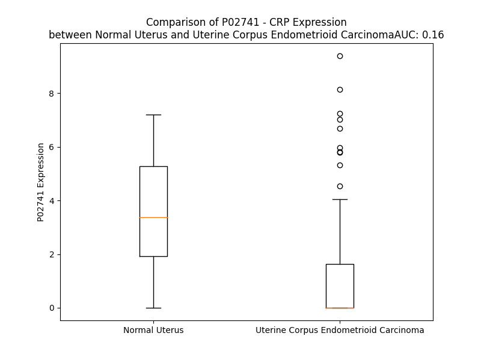

# Detailed Data for P02741

## Introduction to the Detailed Summary

### How to Interpret the Results

- **Summary & Metrics**: This section provides a quick reference to essential protein attributes, including expression changes, family classification, and biomarker applications. Regulation status (upregulated/downregulated) indicates the protein's behavior in a disease context. Some information comes from the original excel file with the proteins selected from literature, while others are derived from the analyses.
- **Expression Comparison**: A visual representation comparing protein expression between normal and disease states. It highlights significant changes in expression levels that might indicate diagnostic or therapeutic relevance. This is data coming from transcriptomics experiments and could not translate similarly to protein levels.
- **Isoform Alignment**: An interactive view of isoform alignments, revealing structural and functional differences between variants of the protein.
- **Interactors & Homologs**: Tables listing known interaction partners and homologous proteins, the more interactors and homologs, the more complex the protein is to design an antibody for.
- **Biological Assemblies**: Information about the structural arrangement of the protein in different assemblies, providing insights into its functional state but also the complexity of the protein to develop antibodies.
- **Combined Per-Residue Information**: A detailed table summarizing residue-level data. This includes predictions for epitope regions, aggregation tendencies, and modifications that might impact the protein's function. Each row corresponds to a residue in the protein, providing insights into specific sites that may be important for research or drug development.
## Summary & Metrics

- **UniProt Accession**: P02741
- **Gene Name**: CRP
- **Protein Name**: C-reactive protein 
- **Swiss Prot**: CRP_HUMAN
- **Family**: other
- **Biomarker Application**: diagnosis,disease progression,efficacy,prognosis,safety,unspecified application
- **Number of Isoforms**: 2
- **Regulation**: 1
- **(transcriptomics) AUC**: 0.1
- **(transcriptomics) Fold Change**: 6.12
- **(transcriptomics) Regulation**: Downregulated
- **Discotope Epitope Count**: 51
- **Max n_uniprots (Homo)**: 10
- **Max n_uniprots (Hetero)**: N/A

## Expression Comparison

## Isoform Alignment

<pre style='font-size:14px; font-family:monospace;'>P02741-1 MEKLLCFLVLTSLSHAFGQTDMSRKAFVFPKESDTSYVSLKAPLTKPLKAFTVCLHFYTELSSTRGYSIFSYATKRQDNEILIFWSKDIGYSFTVGGSEILFEVPEVTVAPVHICTSWESASGIVEFWVDGKPRVRKSLKKGYTVGAEASIILGQEQDSFGGNFEGSQSLVGDIGNVNMWDFVLSPDEINTIYLGGPFSPNVLNWRALKYEVQGEVFTKPQLWP
P02741-2 MEKLLCFLVLTSLSHAFGQTDMSRKAFVFPKESDTSYVSLKAPLTKPLKAFTVCLHFYTELSSTRG-------------------------------------------------------------------------------------------------------------------------------------PNVLNWRALKYEVQGEVFTKPQLWP
</pre>

## Interactors

| preferredName_A   | preferredName_B   |   score |
|:------------------|:------------------|--------:|
| CRP               | CFH               |   0.996 |
| CRP               | FCGR2A            |   0.992 |
| CRP               | CFHR4             |   0.985 |
| CRP               | C3                |   0.985 |
| CRP               | IL6               |   0.968 |
| CRP               | OLR1              |   0.965 |
| CRP               | TNF               |   0.938 |
| CRP               | ALB               |   0.928 |
| CRP               | GPT               |   0.919 |
| CRP               | LEP               |   0.914 |
| CRP               | APCS              |   0.907 |
| CRP               | F2                |   0.906 |
| CRP               | MBL2              |   0.906 |
| CRP               | HP                |   0.902 |

## Homologs

| uniprot_id   | gene_id   |
|:-------------|:----------|
| P47972       | NPTX2     |
| Q15818       | NPTX1     |
| H3BSQ8       | PTX4      |
| V9HWP0       | HEL-S-92n |
| P26022       | PTX3      |

## Biological Assemblies

|   Unnamed: 0 |   assembly |   n_uniprots | composition   | crystal_id   |
|-------------:|-----------:|-------------:|:--------------|:-------------|
|            0 |          1 |            5 | Homo          | 7pkg         |
|            0 |          1 |            5 | Homo          | 7tba         |
|            1 |          2 |            5 | Homo          | 7tba         |
|            2 |          3 |            5 | Homo          | 7tba         |
|            3 |          4 |            5 | Homo          | 7tba         |
|            0 |          1 |           10 | Homo          | 7pkh         |
|            0 |          1 |            5 | Homo          | 1lj7         |
|            1 |          2 |            5 | Homo          | 1lj7         |
|            0 |          1 |            5 | Homo          | 1gnh         |
|            1 |          2 |            5 | Homo          | 1gnh         |
|            0 |          1 |            5 | Homo          | 7pkb         |
|            0 |          1 |           10 | Homo          | 7pkf         |
|            0 |          1 |            5 | Homo          | 7pkd         |
|            1 |          2 |            5 | Homo          | 7pkd         |
|            0 |          1 |            5 | Homo          | 1b09         |
|            0 |          1 |            5 | Homo          | 7pke         |
|            0 |          1 |            5 | Homo          | 3l2y         |
|            1 |          2 |            5 | Homo          | 3l2y         |
|            2 |          3 |            5 | Homo          | 3l2y         |
|            3 |          4 |            5 | Homo          | 3l2y         |
|            0 |          1 |            5 | Homo          | 3pvn         |
|            1 |          2 |            5 | Homo          | 3pvn         |
|            2 |          3 |            5 | Homo          | 3pvn         |
|            3 |          4 |            5 | Homo          | 3pvn         |
|            0 |          1 |            5 | Homo          | 3pvo         |
|            1 |          2 |            5 | Homo          | 3pvo         |
|            2 |          3 |            5 | Homo          | 3pvo         |
|            3 |          4 |            5 | Homo          | 3pvo         |
|            0 |          1 |           10 | Homo          | 7pk9         |

## Combined Per-Residue Information

|   res | aa   |   epitope_score | epitope   |   relative_surface_accessibility |   modeling_confidence |   Aggregation | modification                |
|------:|:-----|----------------:|:----------|---------------------------------:|----------------------:|--------------:|:----------------------------|
|     1 | M    |         0.26828 | False     |                          1.306   |                 49.52 |         0     | N/A                         |
|     2 | E    |         0.36364 | True      |                          0.90502 |                 42.03 |         0.103 | N/A                         |
|     3 | K    |         0.30231 | False     |                          1.01803 |                 44.47 |         0.103 | N/A                         |
|     4 | L    |         0.30121 | False     |                          1.03953 |                 42.17 |        93.196 | N/A                         |
|     5 | L    |         0.28216 | False     |                          0.88405 |                 43.93 |        95.467 | N/A                         |
|     6 | C    |         0.22038 | False     |                          0.86495 |                 45.86 |        96.522 | N/A                         |
|     7 | F    |         0.26401 | False     |                          0.89028 |                 48.37 |        99.005 | N/A                         |
|     8 | L    |         0.26401 | False     |                          1.0158  |                 47.38 |        99.1   | N/A                         |
|     9 | V    |         0.21326 | False     |                          0.86206 |                 49.96 |        98.529 | N/A                         |
|    10 | L    |         0.24967 | False     |                          1.06677 |                 47.41 |        91.445 | N/A                         |
|    11 | T    |         0.24008 | False     |                          0.76779 |                 46.76 |        52.295 | N/A                         |
|    12 | S    |         0.2396  | False     |                          0.7962  |                 48.61 |        27.685 | N/A                         |
|    13 | L    |         0.2174  | False     |                          0.92115 |                 48.42 |        24.618 | N/A                         |
|    14 | S    |         0.26658 | False     |                          0.80204 |                 44.16 |         7.854 | N/A                         |
|    15 | H    |         0.27467 | False     |                          0.87224 |                 52.13 |         5.774 | N/A                         |
|    16 | A    |         0.26165 | False     |                          0.90226 |                 47.4  |         5.337 | N/A                         |
|    17 | F    |         0.22129 | False     |                          0.73289 |                 58.94 |         4.967 | N/A                         |
|    18 | G    |         0.16668 | False     |                          0.58074 |                 77.48 |         0.421 | N/A                         |
|    19 | Q    |         0.21115 | False     |                          0.68358 |                 88.04 |         0.013 | Pyrrolidone carboxylic acid |
|    20 | T    |         0.18422 | False     |                          0.35179 |                 94.05 |         0.005 | N/A                         |
|    21 | D    |         0.27691 | False     |                          0.49883 |                 97.46 |         0     | N/A                         |
|    22 | M    |         0.02616 | False     |                          0.00672 |                 98.28 |         0     | N/A                         |
|    23 | S    |         0.21525 | False     |                          0.34061 |                 97.77 |         0     | N/A                         |
|    24 | R    |         0.34728 | True      |                          0.72605 |                 98.17 |         0     | N/A                         |
|    25 | K    |         0.3073  | False     |                          0.40431 |                 98.67 |         0     | N/A                         |
|    26 | A    |         0.00339 | False     |                          0       |                 98.87 |         0.166 | N/A                         |
|    27 | F    |         0.00569 | False     |                          0.00191 |                 98.88 |         0.166 | N/A                         |
|    28 | V    |         0.20445 | False     |                          0.16756 |                 98.93 |         0.166 | N/A                         |
|    29 | F    |         0.01512 | False     |                          0.00657 |                 98.86 |         0.166 | N/A                         |
|    30 | P    |         0.43422 | True      |                          0.49943 |                 98.58 |         0.166 | N/A                         |
|    31 | K    |         0.29877 | False     |                          0.5156  |                 98.5  |         0     | N/A                         |
|    32 | E    |         0.45388 | True      |                          0.49271 |                 98.71 |         0     | N/A                         |
|    33 | S    |         0.15587 | False     |                          0.15256 |                 98.63 |         0     | N/A                         |
|    34 | D    |         0.44641 | True      |                          0.46527 |                 98.52 |         0     | N/A                         |
|    35 | T    |         0.37238 | True      |                          0.58427 |                 98.68 |         0.338 | N/A                         |
|    36 | S    |         0.03563 | False     |                          0.02929 |                 98.77 |         0.906 | N/A                         |
|    37 | Y    |         0.25967 | False     |                          0.19682 |                 98.88 |         0.906 | N/A                         |
|    38 | V    |         0.00476 | False     |                          0       |                 98.81 |         0.906 | N/A                         |
|    39 | S    |         0.13579 | False     |                          0.08646 |                 98.71 |         0.906 | N/A                         |
|    40 | L    |         0.0266  | False     |                          0.02194 |                 98.56 |         0.906 | N/A                         |
|    41 | K    |         0.22786 | False     |                          0.33921 |                 97.53 |         0     | N/A                         |
|    42 | A    |         0.13807 | False     |                          0.25767 |                 93.96 |         0     | N/A                         |
|    43 | P    |         0.19781 | False     |                          0.79086 |                 90.13 |         0     | N/A                         |
|    44 | L    |         0.1874  | False     |                          0.21265 |                 91.88 |         0     | N/A                         |
|    45 | T    |         0.26543 | False     |                          0.85276 |                 91.57 |         0     | N/A                         |
|    46 | K    |         0.21255 | False     |                          0.76007 |                 96.06 |         0     | N/A                         |
|    47 | P    |         0.31608 | True      |                          0.60047 |                 97.69 |         0     | N/A                         |
|    48 | L    |         0.0606  | False     |                          0.0371  |                 98.62 |         0.163 | N/A                         |
|    49 | K    |         0.19418 | False     |                          0.54892 |                 98.75 |         0.233 | N/A                         |
|    50 | A    |         0.05114 | False     |                          0.13302 |                 98.87 |        38.321 | N/A                         |
|    51 | F    |         0.00489 | False     |                          0       |                 98.9  |        83.301 | N/A                         |
|    52 | T    |         0.00455 | False     |                          0.00095 |                 98.94 |        83.969 | N/A                         |
|    53 | V    |         0.00474 | False     |                          0.00141 |                 98.92 |        85.092 | N/A                         |
|    54 | C    |         0.00517 | False     |                          0.003   |                 98.92 |        85.16  | N/A                         |
|    55 | L    |         0.00426 | False     |                          0       |                 98.92 |        85.112 | N/A                         |
|    56 | H    |         0.15998 | False     |                          0.16354 |                 98.84 |        84.538 | N/A                         |
|    57 | F    |         0.06428 | False     |                          0.03427 |                 98.82 |        84.407 | N/A                         |
|    58 | Y    |         0.25083 | False     |                          0.25791 |                 98.78 |        82.298 | N/A                         |
|    59 | T    |         0.15428 | False     |                          0.08924 |                 98.67 |        30.847 | N/A                         |
|    60 | E    |         0.21291 | False     |                          0.6593  |                 98.02 |         0.233 | N/A                         |
|    61 | L    |         0.28955 | False     |                          0.15227 |                 98.23 |         0.207 | N/A                         |
|    62 | S    |         0.11354 | False     |                          0.07854 |                 96.97 |         0     | N/A                         |
|    63 | S    |         0.3141  | True      |                          0.57098 |                 95.48 |         0     | N/A                         |
|    64 | T    |         0.41032 | True      |                          0.6491  |                 97.33 |         0     | N/A                         |
|    65 | R    |         0.36081 | True      |                          0.14914 |                 98.14 |         0     | N/A                         |
|    66 | G    |         0.52956 | True      |                          0.16162 |                 98.5  |         0     | N/A                         |
|    67 | Y    |         0.01329 | False     |                          0.00232 |                 98.88 |         0.811 | N/A                         |
|    68 | S    |         0.02075 | False     |                          0.0063  |                 98.89 |         1.342 | N/A                         |
|    69 | I    |         0.00298 | False     |                          0.00135 |                 98.92 |         2.594 | N/A                         |
|    70 | F    |         0.00241 | False     |                          0       |                 98.94 |         2.594 | N/A                         |
|    71 | S    |         0.02766 | False     |                          0.00395 |                 98.93 |         2.594 | N/A                         |
|    72 | Y    |         0.00718 | False     |                          0.0015  |                 98.85 |         2.443 | N/A                         |
|    73 | A    |         0.00683 | False     |                          0       |                 98.79 |         1.536 | N/A                         |
|    74 | T    |         0.34734 | True      |                          0.09087 |                 98.6  |         0.222 | N/A                         |
|    75 | K    |         0.49318 | True      |                          0.67708 |                 97.99 |         0     | N/A                         |
|    76 | R    |         0.47115 | True      |                          0.90676 |                 98.19 |         0     | N/A                         |
|    77 | Q    |         0.48697 | True      |                          0.22292 |                 98.61 |         0     | N/A                         |
|    78 | D    |         0.43564 | True      |                          0.28523 |                 98.51 |         0     | N/A                         |
|    79 | N    |         0.42179 | True      |                          0.21795 |                 98.76 |         0     | N/A                         |
|    80 | E    |         0.04075 | False     |                          0.02524 |                 98.83 |         0     | N/A                         |
|    81 | I    |         0.00776 | False     |                          0.00059 |                 98.91 |        97.872 | N/A                         |
|    82 | L    |         0.26165 | False     |                          0.09129 |                 98.94 |        98.282 | N/A                         |
|    83 | I    |         0.01083 | False     |                          0.0008  |                 98.94 |        98.291 | N/A                         |
|    84 | F    |         0.33979 | True      |                          0.13962 |                 98.92 |        98.291 | N/A                         |
|    85 | W    |         0.14917 | False     |                          0.04091 |                 98.79 |        98.291 | N/A                         |
|    86 | S    |         0.40276 | True      |                          0.13472 |                 98.52 |         4.963 | N/A                         |
|    87 | K    |         0.36663 | True      |                          0.41515 |                 97.22 |         0.34  | N/A                         |
|    88 | D    |         0.4915  | True      |                          0.74482 |                 96.1  |         0.34  | N/A                         |
|    89 | I    |         0.58808 | True      |                          0.42091 |                 97.81 |         6.363 | N/A                         |
|    90 | G    |         0.01424 | False     |                          0.00415 |                 98.23 |         6.333 | N/A                         |
|    91 | Y    |         0.07113 | False     |                          0.0395  |                 98.78 |         8.196 | N/A                         |
|    92 | S    |         0.12242 | False     |                          0.01448 |                 98.82 |         8.178 | N/A                         |
|    93 | F    |         0.01017 | False     |                          0       |                 98.9  |         8.175 | N/A                         |
|    94 | T    |         0.26827 | False     |                          0.06894 |                 98.93 |         7.491 | N/A                         |
|    95 | V    |         0.00488 | False     |                          0       |                 98.9  |         7.086 | N/A                         |
|    96 | G    |         0.10396 | False     |                          0.09279 |                 98.76 |         0.583 | N/A                         |
|    97 | G    |         0.48041 | True      |                          0.51821 |                 98.67 |         0     | N/A                         |
|    98 | S    |         0.31975 | True      |                          0.31414 |                 98.77 |         0     | N/A                         |
|    99 | E    |         0.43318 | True      |                          0.51805 |                 98.74 |         0     | N/A                         |
|   100 | I    |         0.59982 | True      |                          0.18079 |                 98.61 |         0     | N/A                         |
|   101 | L    |         0.3514  | True      |                          0.35983 |                 98.67 |         0     | N/A                         |
|   102 | F    |         0.03571 | False     |                          0.00843 |                 98.62 |         0     | N/A                         |
|   103 | E    |         0.31885 | True      |                          0.60704 |                 97.87 |         0     | N/A                         |
|   104 | V    |         0.20598 | False     |                          0.24308 |                 96.73 |         0     | N/A                         |
|   105 | P    |         0.31946 | True      |                          0.99469 |                 92.19 |         0     | N/A                         |
|   106 | E    |         0.32963 | True      |                          0.73961 |                 91.4  |         0     | N/A                         |
|   107 | V    |         0.22898 | False     |                          0.40483 |                 91.34 |         0     | N/A                         |
|   108 | T    |         0.28161 | False     |                          0.66928 |                 90.29 |         0     | N/A                         |
|   109 | V    |         0.19813 | False     |                          0.68594 |                 93.7  |         0     | N/A                         |
|   110 | A    |         0.12212 | False     |                          0.44379 |                 97.64 |         0     | N/A                         |
|   111 | P    |         0.1391  | False     |                          0.3472  |                 98.29 |         0     | N/A                         |
|   112 | V    |         0.09736 | False     |                          0.07045 |                 98.53 |         0.354 | N/A                         |
|   113 | H    |         0.03707 | False     |                          0.03586 |                 98.7  |         0.354 | N/A                         |
|   114 | I    |         0.01292 | False     |                          0.0016  |                 98.81 |         0.354 | N/A                         |
|   115 | C    |         0.00514 | False     |                          0.00186 |                 98.91 |         0.354 | N/A                         |
|   116 | T    |         0.00932 | False     |                          0.0019  |                 98.92 |         0.354 | N/A                         |
|   117 | S    |         0.01648 | False     |                          0.00876 |                 98.93 |         0.145 | N/A                         |
|   118 | W    |         0.01441 | False     |                          0.0006  |                 98.91 |         0.145 | N/A                         |
|   119 | E    |         0.17875 | False     |                          0.32891 |                 98.9  |         0     | N/A                         |
|   120 | S    |         0.089   | False     |                          0.03957 |                 98.85 |         0     | N/A                         |
|   121 | A    |         0.25891 | False     |                          0.74576 |                 98.76 |         0     | N/A                         |
|   122 | S    |         0.2333  | False     |                          0.29349 |                 98.66 |         0     | N/A                         |
|   123 | G    |         0.01053 | False     |                          0       |                 98.76 |         0     | N/A                         |
|   124 | I    |         0.24203 | False     |                          0.39066 |                 98.87 |         0     | N/A                         |
|   125 | V    |         0.01956 | False     |                          0       |                 98.92 |         0     | N/A                         |
|   126 | E    |         0.15809 | False     |                          0.06175 |                 98.9  |         0     | N/A                         |
|   127 | F    |         0.00477 | False     |                          0.00051 |                 98.86 |         0     | N/A                         |
|   128 | W    |         0.22329 | False     |                          0.09747 |                 98.76 |         0     | N/A                         |
|   129 | V    |         0.09331 | False     |                          0.22444 |                 98.54 |         0     | N/A                         |
|   130 | D    |         0.15451 | False     |                          0.27297 |                 98.01 |         0     | N/A                         |
|   131 | G    |         0.11748 | False     |                          0.21663 |                 97.93 |         0     | N/A                         |
|   132 | K    |         0.20952 | False     |                          0.67674 |                 98.27 |         0     | N/A                         |
|   133 | P    |         0.20381 | False     |                          0.62623 |                 98.53 |         0     | N/A                         |
|   134 | R    |         0.36558 | True      |                          0.29281 |                 98.51 |         0     | N/A                         |
|   135 | V    |         0.34489 | True      |                          0.86072 |                 98.46 |         0     | N/A                         |
|   136 | R    |         0.35364 | True      |                          0.5915  |                 98.83 |         0     | N/A                         |
|   137 | K    |         0.34469 | True      |                          0.35877 |                 98.81 |         0     | N/A                         |
|   138 | S    |         0.33677 | True      |                          0.59935 |                 98.72 |         0     | N/A                         |
|   139 | L    |         0.19079 | False     |                          0.08573 |                 98.66 |         0     | N/A                         |
|   140 | K    |         0.36715 | True      |                          0.28959 |                 98.64 |         0     | N/A                         |
|   141 | K    |         0.29714 | False     |                          0.72286 |                 98.76 |         0     | N/A                         |
|   142 | G    |         0.24752 | False     |                          0.63182 |                 98.65 |         0     | N/A                         |
|   143 | Y    |         0.3431  | True      |                          0.30083 |                 98.77 |         0.302 | N/A                         |
|   144 | T    |         0.21187 | False     |                          0.3603  |                 98.75 |         0.302 | N/A                         |
|   145 | V    |         0.00756 | False     |                          0       |                 98.8  |         0.302 | N/A                         |
|   146 | G    |         0.16779 | False     |                          0.20349 |                 98.22 |         0.302 | N/A                         |
|   147 | A    |         0.27402 | False     |                          0.16672 |                 97.83 |         0.302 | N/A                         |
|   148 | E    |         0.30591 | False     |                          0.55129 |                 97.08 |         0     | N/A                         |
|   149 | A    |         0.16245 | False     |                          0.28861 |                 97.97 |         1.532 | N/A                         |
|   150 | S    |         0.13263 | False     |                          0.09685 |                 98.43 |         1.532 | N/A                         |
|   151 | I    |         0.05141 | False     |                          0.01417 |                 98.8  |         1.532 | N/A                         |
|   152 | I    |         0.07107 | False     |                          0.01259 |                 98.87 |         1.532 | N/A                         |
|   153 | L    |         0.00591 | False     |                          0.00165 |                 98.92 |         1.532 | N/A                         |
|   154 | G    |         0.00895 | False     |                          0.00929 |                 98.8  |         0     | N/A                         |
|   155 | Q    |         0.02912 | False     |                          0.00687 |                 98.88 |         0     | N/A                         |
|   156 | E    |         0.15399 | False     |                          0.03072 |                 98.82 |         0     | N/A                         |
|   157 | Q    |         0.01873 | False     |                          0       |                 98.85 |         0     | N/A                         |
|   158 | D    |         0.53332 | True      |                          0.39128 |                 98.54 |         0     | N/A                         |
|   159 | S    |         0.58422 | True      |                          0.28039 |                 98.45 |         0     | N/A                         |
|   160 | F    |         0.32166 | True      |                          0.42264 |                 98.39 |         0     | N/A                         |
|   161 | G    |         0.23169 | False     |                          0.39642 |                 98.05 |         0     | N/A                         |
|   162 | G    |         0.43009 | True      |                          0.18164 |                 98.26 |         0     | N/A                         |
|   163 | N    |         0.75957 | True      |                          0.63569 |                 98.48 |         0     | N/A                         |
|   164 | F    |         0.29643 | False     |                          0.18829 |                 98.77 |         0     | N/A                         |
|   165 | E    |         0.7149  | True      |                          0.43328 |                 98.69 |         0     | N/A                         |
|   166 | G    |         0.38501 | True      |                          0.22599 |                 98.32 |         0     | N/A                         |
|   167 | S    |         0.5411  | True      |                          0.48748 |                 98.54 |         0     | N/A                         |
|   168 | Q    |         0.54569 | True      |                          0.22959 |                 98.81 |         0     | N/A                         |
|   169 | S    |         0.03567 | False     |                          0.00832 |                 98.86 |         0     | N/A                         |
|   170 | L    |         0.00865 | False     |                          0.01097 |                 98.89 |         0     | N/A                         |
|   171 | V    |         0.19756 | False     |                          0.2244  |                 98.85 |         0     | N/A                         |
|   172 | G    |         0.07704 | False     |                          0.18509 |                 98.73 |         0     | N/A                         |
|   173 | D    |         0.12827 | False     |                          0.07467 |                 98.89 |         0     | N/A                         |
|   174 | I    |         0.00602 | False     |                          0       |                 98.91 |         0     | N/A                         |
|   175 | G    |         0.00322 | False     |                          0       |                 98.8  |         0     | N/A                         |
|   176 | N    |         0.11799 | False     |                          0.21795 |                 98.68 |         0     | N/A                         |
|   177 | V    |         0.00847 | False     |                          0       |                 98.82 |         0     | N/A                         |
|   178 | N    |         0.04021 | False     |                          0.01596 |                 98.8  |         0     | N/A                         |
|   179 | M    |         0.00681 | False     |                          0       |                 98.84 |         0     | N/A                         |
|   180 | W    |         0.0472  | False     |                          0.02425 |                 98.72 |         0     | N/A                         |
|   181 | D    |         0.13164 | False     |                          0.39375 |                 98.51 |         0     | N/A                         |
|   182 | F    |         0.215   | False     |                          0.42925 |                 98.7  |         0     | N/A                         |
|   183 | V    |         0.20887 | False     |                          0.36811 |                 98.85 |         0     | N/A                         |
|   184 | L    |         0.07184 | False     |                          0.03777 |                 98.84 |         0     | N/A                         |
|   185 | S    |         0.23904 | False     |                          0.3537  |                 98.62 |         0     | N/A                         |
|   186 | P    |         0.21808 | False     |                          0.51456 |                 98.6  |         0     | N/A                         |
|   187 | D    |         0.28469 | False     |                          0.6974  |                 98.47 |         0     | N/A                         |
|   188 | E    |         0.29307 | False     |                          0.37358 |                 98.66 |         0     | N/A                         |
|   189 | I    |         0.00669 | False     |                          0.0048  |                 98.63 |         0.402 | N/A                         |
|   190 | N    |         0.19772 | False     |                          0.44777 |                 98.08 |         0.402 | N/A                         |
|   191 | T    |         0.2063  | False     |                          0.35808 |                 98.43 |         1.074 | N/A                         |
|   192 | I    |         0.13832 | False     |                          0.08195 |                 98.28 |         1.074 | N/A                         |
|   193 | Y    |         0.20697 | False     |                          0.37944 |                 98.37 |         1.074 | N/A                         |
|   194 | L    |         0.24191 | False     |                          0.78056 |                 97.96 |         1.074 | N/A                         |
|   195 | G    |         0.17988 | False     |                          0.70209 |                 96.76 |         0.672 | N/A                         |
|   196 | G    |         0.19591 | False     |                          0.19534 |                 97.12 |         0     | N/A                         |
|   197 | P    |         0.23645 | False     |                          0.88138 |                 95.55 |         0     | N/A                         |
|   198 | F    |         0.26349 | False     |                          0.27208 |                 97.61 |         0     | N/A                         |
|   199 | S    |         0.23486 | False     |                          0.71406 |                 97.57 |         0     | N/A                         |
|   200 | P    |         0.08781 | False     |                          0.08007 |                 98.16 |         0     | N/A                         |
|   201 | N    |         0.23251 | False     |                          0.52078 |                 97.46 |         0     | N/A                         |
|   202 | V    |         0.06458 | False     |                          0.06361 |                 98.13 |         0     | N/A                         |
|   203 | L    |         0.03038 | False     |                          0.01896 |                 98.4  |         0     | N/A                         |
|   204 | N    |         0.15642 | False     |                          0.25704 |                 98.27 |         0     | N/A                         |
|   205 | W    |         0.03842 | False     |                          0.02471 |                 98.36 |         0     | N/A                         |
|   206 | R    |         0.14849 | False     |                          0.47483 |                 97.66 |         0     | N/A                         |
|   207 | A    |         0.09928 | False     |                          0.30843 |                 97.36 |         0     | N/A                         |
|   208 | L    |         0.00747 | False     |                          0.00824 |                 98.08 |         0     | N/A                         |
|   209 | K    |         0.29771 | False     |                          0.35126 |                 97.78 |         0     | N/A                         |
|   210 | Y    |         0.36596 | True      |                          0.25807 |                 98.12 |         0     | N/A                         |
|   211 | E    |         0.25156 | False     |                          0.37908 |                 98.02 |         0     | N/A                         |
|   212 | V    |         0.27923 | False     |                          0.46721 |                 98.19 |         0     | N/A                         |
|   213 | Q    |         0.32445 | True      |                          0.50067 |                 98.5  |         0     | N/A                         |
|   214 | G    |         0.15098 | False     |                          0.60888 |                 98.08 |         0     | N/A                         |
|   215 | E    |         0.26729 | False     |                          0.39281 |                 98.27 |         0     | N/A                         |
|   216 | V    |         0.09633 | False     |                          0.1239  |                 98.7  |         0     | N/A                         |
|   217 | F    |         0.32175 | True      |                          0.4969  |                 98.61 |         0     | N/A                         |
|   218 | T    |         0.21206 | False     |                          0.41956 |                 98.66 |         0     | N/A                         |
|   219 | K    |         0.43463 | True      |                          0.54287 |                 98.71 |         0     | N/A                         |
|   220 | P    |         0.29896 | False     |                          0.74279 |                 98.67 |         0     | N/A                         |
|   221 | Q    |         0.18073 | False     |                          0.15265 |                 98.54 |         0     | N/A                         |
|   222 | L    |         0.33624 | True      |                          0.69615 |                 98.61 |         0     | N/A                         |
|   223 | W    |         0.15646 | False     |                          0.04872 |                 98.15 |         0     | N/A                         |
|   224 | P    |         0.10533 | False     |                          1.22903 |                 94.88 |         0     | N/A                         |

