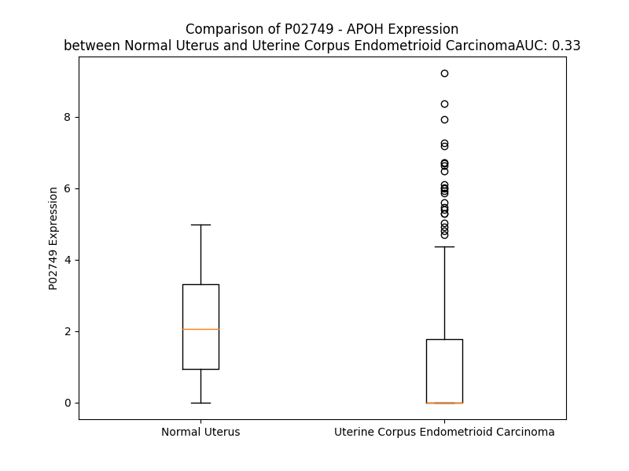

# Detailed Data for P02749

## Introduction to the Detailed Summary

### How to Interpret the Results

- **Summary & Metrics**: This section provides a quick reference to essential protein attributes, including expression changes, family classification, and biomarker applications. Regulation status (upregulated/downregulated) indicates the protein's behavior in a disease context. Some information comes from the original excel file with the proteins selected from literature, while others are derived from the analyses.
- **Expression Comparison**: A visual representation comparing protein expression between normal and disease states. It highlights significant changes in expression levels that might indicate diagnostic or therapeutic relevance. This is data coming from transcriptomics experiments and could not translate similarly to protein levels.
- **Isoform Alignment**: An interactive view of isoform alignments, revealing structural and functional differences between variants of the protein.
- **Interactors & Homologs**: Tables listing known interaction partners and homologous proteins, the more interactors and homologs, the more complex the protein is to design an antibody for.
- **Biological Assemblies**: Information about the structural arrangement of the protein in different assemblies, providing insights into its functional state but also the complexity of the protein to develop antibodies.
- **Combined Per-Residue Information**: A detailed table summarizing residue-level data. This includes predictions for epitope regions, aggregation tendencies, and modifications that might impact the protein's function. Each row corresponds to a residue in the protein, providing insights into specific sites that may be important for research or drug development.
## Summary & Metrics

- **UniProt Accession**: P02749
- **Gene Name**: APOH
- **Protein Name**: apolipoprotein H (beta-2-glycoprotein I)
- **Swiss Prot**: APOH_HUMAN
- **Family**: transporter
- **Biomarker Application**: unspecified application
- **Number of Isoforms**: 0
- **Regulation**: -1
- **(transcriptomics) AUC**: 0.33
- **(transcriptomics) Fold Change**: 1.55
- **(transcriptomics) Regulation**: Downregulated
- **Discotope Epitope Count**: 70
- **Max n_uniprots (Homo)**: 1.0
- **Max n_uniprots (Hetero)**: 2.0

## Expression Comparison

## Interactors

| preferredName_A   | preferredName_B   |   score |
|:------------------|:------------------|--------:|
| APOH              | APOA2             |   0.989 |
| APOH              | APOC3             |   0.987 |
| APOH              | APOB              |   0.985 |
| APOH              | APOA1             |   0.985 |
| APOH              | F2                |   0.984 |
| APOH              | APOM              |   0.981 |
| APOH              | AHSG              |   0.957 |
| APOH              | APOC2             |   0.946 |
| APOH              | SERPINC1          |   0.944 |
| APOH              | ANXA2             |   0.943 |
| APOH              | AMBP              |   0.942 |
| APOH              | LPA               |   0.941 |
| APOH              | PLG               |   0.94  |
| APOH              | APOA4             |   0.938 |
| APOH              | LRP8              |   0.937 |
| APOH              | ALB               |   0.933 |
| APOH              | APOC1             |   0.931 |
| APOH              | LPL               |   0.923 |
| APOH              | APOE              |   0.921 |
| APOH              | APOA5             |   0.918 |
| APOH              | APOF              |   0.914 |
| APOH              | CLU               |   0.911 |
| APOH              | FGG               |   0.91  |
| APOH              | APOL1             |   0.904 |

## Homologs

| uniprot_id   | gene_id   |
|:-------------|:----------|
| Q92537       | SUSD6     |
| Q6UXD5       | SEZ6L2    |
| Q5TI72       | SELE      |
| A0A8Q3WL76   | C7        |
| A0A8I5KWH5   | CSMD2     |
| Q9BYH1       | SEZ6L     |
| P20851       | C4BPB     |
| P14222       | PRF1      |
| Q4LDE5       | SVEP1     |
| P78539       | SRPX      |
| Q96L08       | SUSD3     |
| P14151       | SELL      |
| A0A8Q3WKM6   | C2        |
| A0A1W2PPV2   | CR2       |
| E5RIG2       | CSMD1     |
| A0A8Q3WKN4   | C8A       |
| Q5SR44       | CR1       |
| Q6NSD3       | CFHR3     |
| A0A8Q3SIC3   | CFH       |
| A6PVY5       | C4BPA     |
| P13671       | C6        |
| Q13219       | PAPPA     |
| K7ELJ4       | SEZ6      |
| Q2VPA4       | CR1L      |
| Q9BXP8       | PAPPA2    |
| Q5R349       | SELP      |
| P05160       | F13B      |
| A0A1W2PNZ6   | SRPX2     |
| A0A8Q3WLA6   | CD46      |
| A0A8V8TNF4   | CFHR5     |
| Q92496       | CFHR4     |
| Q03591       | CFHR1     |
| A0A8V8TPL2   | CFHR2     |
| A0A8Q3SI51   | CD55      |
| A0A8Q3SIA7   | C8B       |
| H7BXX0       | CSMD3     |
| A0A8Q3SI37   | C9        |
| A0A0G2JH38   | CFB       |
| A0A7P0T8V7   | SUSD4     |

## Biological Assemblies

|   Unnamed: 0 |   assembly |   n_uniprots | composition   | crystal_id   |
|-------------:|-----------:|-------------:|:--------------|:-------------|
|            0 |          1 |            1 | Homo          | 7jik         |
|            0 |          1 |            1 | Homo          | 1qub         |
|            0 |          1 |            1 | Homo          | 6v09         |
|            0 |          1 |            1 | Homo          | 6v08         |
|            0 |          1 |            1 | Homo          | 6v06         |
|            0 |          1 |            1 | Homo          | 1g4f         |
|            0 |          1 |            1 | Homo          | 6xst         |
|            0 |          1 |            2 | Hetero        | 2kri         |
|            0 |          1 |            0 | Hetero        | 1c1z         |
|            0 |          1 |            1 | Homo          | 6xsd         |
|            0 |          1 |            1 | Homo          | 1g4g         |
|            0 |          1 |            1 | Homo          | 4jhs         |
|            0 |          1 |            1 | Homo          | 7kg4         |
|            1 |          2 |            1 | Homo          | 7kg4         |

## Combined Per-Residue Information

|   res | aa   |   epitope_score | epitope   |   relative_surface_accessibility |   modeling_confidence |   Aggregation | modification   | glycosylation                             |
|------:|:-----|----------------:|:----------|---------------------------------:|----------------------:|--------------:|:---------------|:------------------------------------------|
|     1 | M    |         0.23912 | True      |                          1.19609 |                 45.97 |         0     | N/A            | N/A                                       |
|     2 | I    |         0.20197 | False     |                          0.97198 |                 39.9  |         0     | N/A            | N/A                                       |
|     3 | S    |         0.23166 | True      |                          0.69961 |                 39.87 |         0     | N/A            | N/A                                       |
|     4 | P    |         0.15025 | False     |                          0.84172 |                 45.42 |         1.116 | N/A            | N/A                                       |
|     5 | V    |         0.14943 | False     |                          0.95722 |                 47.03 |        91.312 | N/A            | N/A                                       |
|     6 | L    |         0.19963 | False     |                          0.90681 |                 41.42 |        98.211 | N/A            | N/A                                       |
|     7 | I    |         0.1584  | False     |                          0.90407 |                 51.71 |        99.458 | N/A            | N/A                                       |
|     8 | L    |         0.24293 | True      |                          0.90622 |                 41.42 |        99.571 | N/A            | N/A                                       |
|     9 | F    |         0.22566 | True      |                          0.99266 |                 45.52 |        99.582 | N/A            | N/A                                       |
|    10 | S    |         0.25195 | True      |                          0.71298 |                 41.06 |        90.492 | N/A            | N/A                                       |
|    11 | S    |         0.1701  | False     |                          0.78243 |                 42.89 |        89.282 | N/A            | N/A                                       |
|    12 | F    |         0.16255 | False     |                          0.98681 |                 47.99 |        89.231 | N/A            | N/A                                       |
|    13 | L    |         0.18738 | False     |                          0.90975 |                 47.97 |        87.487 | N/A            | N/A                                       |
|    14 | C    |         0.17036 | False     |                          0.7738  |                 44.96 |        77.919 | N/A            | N/A                                       |
|    15 | H    |         0.23837 | True      |                          0.97542 |                 39.94 |        75.902 | N/A            | N/A                                       |
|    16 | V    |         0.19887 | False     |                          0.84437 |                 47.35 |        75.452 | N/A            | N/A                                       |
|    17 | A    |         0.17814 | False     |                          0.88191 |                 43.47 |        70.14  | N/A            | N/A                                       |
|    18 | I    |         0.18767 | False     |                          0.9353  |                 50.61 |        65.647 | N/A            | N/A                                       |
|    19 | A    |         0.19212 | False     |                          0.84782 |                 57.04 |        16.546 | N/A            | N/A                                       |
|    20 | G    |         0.1786  | False     |                          0.62422 |                 67.27 |         1.366 | N/A            | N/A                                       |
|    21 | R    |         0.18267 | False     |                          0.6629  |                 86.05 |         0     | N/A            | N/A                                       |
|    22 | T    |         0.18429 | False     |                          0.36951 |                 94.51 |         0     | N/A            | N/A                                       |
|    23 | C    |         0.009   | False     |                          0       |                 96.02 |         0     | N/A            | N/A                                       |
|    24 | P    |         0.11694 | False     |                          0.55768 |                 96.97 |         0     | N/A            | N/A                                       |
|    25 | K    |         0.13    | False     |                          0.57726 |                 97.22 |         0     | N/A            | N/A                                       |
|    26 | P    |         0.03207 | False     |                          0.04642 |                 96.26 |         0     | N/A            | N/A                                       |
|    27 | D    |         0.14109 | False     |                          0.66635 |                 95.98 |         0     | N/A            | N/A                                       |
|    28 | D    |         0.23787 | True      |                          0.80666 |                 95.47 |         0     | N/A            | N/A                                       |
|    29 | L    |         0.11303 | False     |                          0.21685 |                 95.53 |         0     | N/A            | N/A                                       |
|    30 | P    |         0.18648 | False     |                          0.71852 |                 96.87 |         0     | N/A            | N/A                                       |
|    31 | F    |         0.08944 | False     |                          0.4733  |                 97.03 |         0     | N/A            | N/A                                       |
|    32 | S    |         0.04632 | False     |                          0.03341 |                 97.36 |         0     | N/A            | N/A                                       |
|    33 | T    |         0.08388 | False     |                          0.43636 |                 97.45 |         0     | N/A            | O-linked (GalNAc...) threonine            |
|    34 | V    |         0.11585 | False     |                          0.13024 |                 97.48 |         0     | N/A            | N/A                                       |
|    35 | V    |         0.12719 | False     |                          0.71559 |                 97.54 |         0     | N/A            | N/A                                       |
|    36 | P    |         0.24736 | True      |                          0.47219 |                 97.26 |         0     | N/A            | N/A                                       |
|    37 | L    |         0.16906 | False     |                          0.63236 |                 97.28 |         0     | N/A            | N/A                                       |
|    38 | K    |         0.20573 | False     |                          0.36108 |                 97.15 |         0     | N/A            | N/A                                       |
|    39 | T    |         0.20061 | False     |                          0.74091 |                 96.39 |         0     | N/A            | N/A                                       |
|    40 | F    |         0.23494 | True      |                          0.58003 |                 96.05 |         0     | N/A            | N/A                                       |
|    41 | Y    |         0.01324 | False     |                          0       |                 96.88 |         0     | N/A            | N/A                                       |
|    42 | E    |         0.11964 | False     |                          0.42853 |                 95.74 |         0     | N/A            | N/A                                       |
|    43 | P    |         0.12575 | False     |                          0.34895 |                 95.51 |         0     | N/A            | N/A                                       |
|    44 | G    |         0.15262 | False     |                          0.64825 |                 94.83 |         0     | N/A            | N/A                                       |
|    45 | E    |         0.12756 | False     |                          0.26926 |                 97.51 |         0     | N/A            | N/A                                       |
|    46 | E    |         0.18568 | False     |                          0.38302 |                 97.8  |         0     | N/A            | N/A                                       |
|    47 | I    |         0.0235  | False     |                          0.0064  |                 97.72 |         0     | N/A            | N/A                                       |
|    48 | T    |         0.07776 | False     |                          0.17948 |                 97.85 |         0     | N/A            | N/A                                       |
|    49 | Y    |         0.04346 | False     |                          0.03008 |                 97.79 |         0     | N/A            | N/A                                       |
|    50 | S    |         0.12225 | False     |                          0.2046  |                 97.5  |         0     | N/A            | N/A                                       |
|    51 | C    |         0.11483 | False     |                          0.23631 |                 97.37 |         0     | N/A            | N/A                                       |
|    52 | K    |         0.07183 | False     |                          0.46392 |                 97.79 |         0     | N/A            | N/A                                       |
|    53 | P    |         0.19353 | False     |                          0.70375 |                 97.22 |         0     | N/A            | N/A                                       |
|    54 | G    |         0.01726 | False     |                          0.02074 |                 97.49 |         0     | N/A            | N/A                                       |
|    55 | Y    |         0.08651 | False     |                          0.15133 |                 97.99 |         0     | N/A            | N/A                                       |
|    56 | V    |         0.1446  | False     |                          0.40699 |                 96.47 |         0     | N/A            | N/A                                       |
|    57 | S    |         0.11055 | False     |                          0.15724 |                 95.84 |         0     | N/A            | N/A                                       |
|    58 | R    |         0.26097 | True      |                          0.93257 |                 91.63 |         0     | N/A            | N/A                                       |
|    59 | G    |         0.18688 | False     |                          0.81803 |                 88.87 |         0     | N/A            | N/A                                       |
|    60 | G    |         0.13602 | False     |                          0.47506 |                 92.81 |         0     | N/A            | N/A                                       |
|    61 | M    |         0.23337 | True      |                          0.69487 |                 95.46 |         0     | N/A            | N/A                                       |
|    62 | R    |         0.19807 | False     |                          0.21132 |                 96.15 |         0     | N/A            | N/A                                       |
|    63 | K    |         0.24976 | True      |                          0.63155 |                 96.64 |         0     | N/A            | N/A                                       |
|    64 | F    |         0.09699 | False     |                          0.14411 |                 96.9  |         0     | N/A            | N/A                                       |
|    65 | I    |         0.19743 | False     |                          0.6243  |                 97.54 |         0     | N/A            | N/A                                       |
|    66 | C    |         0.04714 | False     |                          0.01406 |                 96.63 |         0     | N/A            | N/A                                       |
|    67 | P    |         0.13525 | False     |                          0.33799 |                 95.62 |         0     | N/A            | N/A                                       |
|    68 | L    |         0.22123 | True      |                          0.93428 |                 94.5  |         0     | N/A            | N/A                                       |
|    69 | T    |         0.15298 | False     |                          0.51692 |                 94.94 |         0     | N/A            | N/A                                       |
|    70 | G    |         0.07981 | False     |                          0.06375 |                 94.22 |         0     | N/A            | N/A                                       |
|    71 | L    |         0.1645  | False     |                          0.76791 |                 95.84 |         0     | N/A            | N/A                                       |
|    72 | W    |         0.11029 | False     |                          0.22878 |                 96.09 |         0     | N/A            | N/A                                       |
|    73 | P    |         0.22619 | True      |                          0.49668 |                 94.72 |         0     | N/A            | N/A                                       |
|    74 | I    |         0.28024 | True      |                          0.95427 |                 94.1  |         0     | N/A            | N/A                                       |
|    75 | N    |         0.12679 | False     |                          0.24429 |                 93.6  |         0     | N/A            | N/A                                       |
|    76 | T    |         0.16002 | False     |                          0.69719 |                 93.8  |         0     | N/A            | N/A                                       |
|    77 | L    |         0.09479 | False     |                          0.05954 |                 95.65 |         0     | N/A            | N/A                                       |
|    78 | K    |         0.2489  | True      |                          0.80718 |                 96.1  |         0     | N/A            | N/A                                       |
|    79 | C    |         0.08231 | False     |                          0.08252 |                 97.29 |         0     | N/A            | N/A                                       |
|    80 | T    |         0.14628 | False     |                          0.53599 |                 97.57 |         0     | N/A            | N/A                                       |
|    81 | P    |         0.1024  | False     |                          0.23836 |                 97.99 |         0     | N/A            | N/A                                       |
|    82 | R    |         0.16122 | False     |                          0.34872 |                 97.88 |         0     | N/A            | N/A                                       |
|    83 | V    |         0.12611 | False     |                          0.76903 |                 98.08 |         0     | N/A            | N/A                                       |
|    84 | C    |         0.02745 | False     |                          0.0276  |                 98.15 |         0     | N/A            | N/A                                       |
|    85 | P    |         0.18225 | False     |                          0.6267  |                 98.2  |         0     | N/A            | N/A                                       |
|    86 | F    |         0.19755 | False     |                          0.68909 |                 98.14 |         1.146 | N/A            | N/A                                       |
|    87 | A    |         0.0887  | False     |                          0.05695 |                 97.63 |         1.146 | N/A            | N/A                                       |
|    88 | G    |         0.25089 | True      |                          0.24787 |                 97.24 |         1.146 | N/A            | N/A                                       |
|    89 | I    |         0.24635 | True      |                          0.81597 |                 97.77 |         1.146 | N/A            | N/A                                       |
|    90 | L    |         0.09015 | False     |                          0.14101 |                 98.25 |         1.146 | N/A            | N/A                                       |
|    91 | E    |         0.18818 | False     |                          0.70157 |                 98.13 |         0     | N/A            | N/A                                       |
|    92 | N    |         0.07696 | False     |                          0.42852 |                 97.44 |         0     | N/A            | N/A                                       |
|    93 | G    |         0.04697 | False     |                          0.24112 |                 97.87 |         0     | N/A            | N/A                                       |
|    94 | A    |         0.08987 | False     |                          0.47057 |                 98.38 |         0     | N/A            | N/A                                       |
|    95 | V    |         0.0869  | False     |                          0.16337 |                 98.53 |         0     | N/A            | N/A                                       |
|    96 | R    |         0.23349 | True      |                          0.72832 |                 98.51 |         0     | N/A            | N/A                                       |
|    97 | Y    |         0.36885 | True      |                          0.47601 |                 98.11 |         0     | N/A            | N/A                                       |
|    98 | T    |         0.39926 | True      |                          0.80617 |                 97.91 |         0     | N/A            | N/A                                       |
|    99 | T    |         0.263   | True      |                          0.44856 |                 97.83 |         0     | N/A            | N/A                                       |
|   100 | F    |         0.1282  | False     |                          0.14048 |                 98.42 |         0     | N/A            | N/A                                       |
|   101 | E    |         0.15674 | False     |                          0.27201 |                 98.21 |         0     | N/A            | N/A                                       |
|   102 | Y    |         0.19106 | False     |                          0.24002 |                 98.43 |         0     | N/A            | N/A                                       |
|   103 | P    |         0.32268 | True      |                          0.50625 |                 97.89 |         0     | N/A            | N/A                                       |
|   104 | N    |         0.12761 | False     |                          0.24259 |                 98.27 |         0     | N/A            | N/A                                       |
|   105 | T    |         0.22406 | True      |                          0.50797 |                 98.58 |         0     | N/A            | N/A                                       |
|   106 | I    |         0.00946 | False     |                          0.0016  |                 98.51 |         0     | N/A            | N/A                                       |
|   107 | S    |         0.12724 | False     |                          0.31508 |                 98.55 |         0     | N/A            | N/A                                       |
|   108 | F    |         0.05248 | False     |                          0.07851 |                 98.65 |         0     | N/A            | N/A                                       |
|   109 | S    |         0.11869 | False     |                          0.45973 |                 98.35 |         0     | N/A            | N/A                                       |
|   110 | C    |         0.09637 | False     |                          0.23961 |                 97.98 |         0     | N/A            | N/A                                       |
|   111 | N    |         0.11312 | False     |                          0.51412 |                 97.59 |         0     | N/A            | N/A                                       |
|   112 | T    |         0.23499 | True      |                          0.71603 |                 95.86 |         0.691 | N/A            | N/A                                       |
|   113 | G    |         0.05113 | False     |                          0.18479 |                 95.46 |         0.691 | N/A            | N/A                                       |
|   114 | F    |         0.13784 | False     |                          0.28675 |                 97.07 |         0.691 | N/A            | N/A                                       |
|   115 | Y    |         0.09971 | False     |                          0.47977 |                 96.34 |         0.691 | N/A            | N/A                                       |
|   116 | L    |         0.08558 | False     |                          0.26474 |                 97.69 |         0.691 | N/A            | N/A                                       |
|   117 | N    |         0.22584 | True      |                          0.56124 |                 97.39 |         0     | N/A            | N/A                                       |
|   118 | G    |         0.1164  | False     |                          0.63649 |                 97.42 |         0     | N/A            | N/A                                       |
|   119 | A    |         0.07177 | False     |                          0.32788 |                 98.1  |         0     | N/A            | N/A                                       |
|   120 | D    |         0.17386 | False     |                          0.59225 |                 98.18 |         0     | N/A            | N/A                                       |
|   121 | S    |         0.20407 | False     |                          0.3     |                 98.4  |         0     | N/A            | N/A                                       |
|   122 | A    |         0.02722 | False     |                          0.02021 |                 98.53 |         0     | N/A            | N/A                                       |
|   123 | K    |         0.17308 | False     |                          0.52642 |                 98.57 |         0     | N/A            | N/A                                       |
|   124 | C    |         0.00711 | False     |                          0.00074 |                 98.56 |         0     | N/A            | N/A                                       |
|   125 | T    |         0.13878 | False     |                          0.27336 |                 98.39 |         0     | N/A            | N/A                                       |
|   126 | E    |         0.23829 | True      |                          0.48385 |                 97.81 |         0     | N/A            | N/A                                       |
|   127 | E    |         0.14389 | False     |                          0.55948 |                 97.41 |         0     | N/A            | N/A                                       |
|   128 | G    |         0.072   | False     |                          0.15004 |                 97.23 |         0     | N/A            | N/A                                       |
|   129 | K    |         0.19257 | False     |                          0.60186 |                 98.22 |         0     | N/A            | N/A                                       |
|   130 | W    |         0.11366 | False     |                          0.10941 |                 98.36 |         0     | N/A            | N/A                                       |
|   131 | S    |         0.14969 | False     |                          0.43472 |                 98.22 |         0     | N/A            | N/A                                       |
|   132 | P    |         0.3374  | True      |                          0.53481 |                 98.07 |         0     | N/A            | N/A                                       |
|   133 | E    |         0.22481 | True      |                          0.79789 |                 97.55 |         0     | N/A            | N/A                                       |
|   134 | L    |         0.09637 | False     |                          0.44508 |                 98.1  |         0     | N/A            | N/A                                       |
|   135 | P    |         0.02233 | False     |                          0.05295 |                 98.41 |         0     | N/A            | N/A                                       |
|   136 | V    |         0.09181 | False     |                          0.65788 |                 98.36 |         0     | N/A            | N/A                                       |
|   137 | C    |         0.05981 | False     |                          0.06526 |                 98.13 |         0     | N/A            | N/A                                       |
|   138 | A    |         0.07825 | False     |                          0.21427 |                 96.81 |         0     | N/A            | N/A                                       |
|   139 | P    |         0.13276 | False     |                          0.4772  |                 96.78 |         0     | N/A            | N/A                                       |
|   140 | I    |         0.03798 | False     |                          0.0592  |                 97.28 |         0     | N/A            | N/A                                       |
|   141 | I    |         0.12994 | False     |                          0.48223 |                 97.23 |         0     | N/A            | N/A                                       |
|   142 | C    |         0.00472 | False     |                          0       |                 97.76 |         0     | N/A            | N/A                                       |
|   143 | P    |         0.14808 | False     |                          0.55343 |                 97.62 |         0     | N/A            | N/A                                       |
|   144 | P    |         0.1094  | False     |                          0.52877 |                 97.1  |         0     | N/A            | N/A                                       |
|   145 | P    |         0.04697 | False     |                          0.08692 |                 97    |         0     | N/A            | N/A                                       |
|   146 | S    |         0.11754 | False     |                          0.58774 |                 97.06 |         0     | N/A            | N/A                                       |
|   147 | I    |         0.0792  | False     |                          0.60682 |                 97.42 |         0     | N/A            | N/A                                       |
|   148 | P    |         0.04183 | False     |                          0.13468 |                 97.49 |         0     | N/A            | N/A                                       |
|   149 | T    |         0.11983 | False     |                          0.69882 |                 97.87 |         0.459 | N/A            | O-linked (GalNAc...) threonine            |
|   150 | F    |         0.08154 | False     |                          0.53098 |                 98.1  |         0.459 | N/A            | N/A                                       |
|   151 | A    |         0.05241 | False     |                          0.09805 |                 98.22 |         0.459 | N/A            | N/A                                       |
|   152 | T    |         0.0863  | False     |                          0.39211 |                 97.7  |         0.459 | N/A            | N/A                                       |
|   153 | L    |         0.14696 | False     |                          0.32898 |                 96.79 |         0.459 | N/A            | N/A                                       |
|   154 | R    |         0.28285 | True      |                          0.58869 |                 96.72 |         0     | N/A            | N/A                                       |
|   155 | V    |         0.19468 | False     |                          0.47794 |                 96.25 |         0     | N/A            | N/A                                       |
|   156 | Y    |         0.17914 | False     |                          0.25432 |                 96.19 |         0     | N/A            | N/A                                       |
|   157 | K    |         0.17987 | False     |                          0.85853 |                 93.92 |         0     | N/A            | N/A                                       |
|   158 | P    |         0.17842 | False     |                          0.39029 |                 95.6  |         0     | N/A            | N/A                                       |
|   159 | S    |         0.20423 | False     |                          0.47576 |                 95.44 |         0     | N/A            | N/A                                       |
|   160 | A    |         0.20023 | False     |                          0.31835 |                 93.71 |         0     | N/A            | N/A                                       |
|   161 | G    |         0.23482 | True      |                          0.87236 |                 94.14 |         0     | N/A            | N/A                                       |
|   162 | N    |         0.23193 | True      |                          0.7566  |                 95.07 |         0     | N/A            | N-linked (GlcNAc...) (complex) asparagine |
|   163 | N    |         0.16674 | False     |                          0.27442 |                 97.02 |         0     | N/A            | N/A                                       |
|   164 | S    |         0.00822 | False     |                          0.00208 |                 97.46 |         0     | N/A            | N/A                                       |
|   165 | L    |         0.15824 | False     |                          0.40228 |                 97.19 |         0     | N/A            | N/A                                       |
|   166 | Y    |         0.18596 | False     |                          0.27026 |                 97.08 |         0     | N/A            | N/A                                       |
|   167 | R    |         0.23926 | True      |                          0.60935 |                 97.1  |         0     | N/A            | N/A                                       |
|   168 | D    |         0.14991 | False     |                          0.23395 |                 97.57 |         0     | N/A            | N/A                                       |
|   169 | T    |         0.17387 | False     |                          0.45567 |                 98.1  |         0     | N/A            | N/A                                       |
|   170 | A    |         0.00253 | False     |                          0       |                 98.13 |         0     | N/A            | N/A                                       |
|   171 | V    |         0.11116 | False     |                          0.13043 |                 98.44 |         0     | N/A            | N/A                                       |
|   172 | F    |         0.01939 | False     |                          0.01522 |                 98.33 |         0     | N/A            | N/A                                       |
|   173 | E    |         0.11548 | False     |                          0.39583 |                 97.94 |         0     | N/A            | N/A                                       |
|   174 | C    |         0.08982 | False     |                          0.19948 |                 98.2  |         0     | N/A            | N/A                                       |
|   175 | L    |         0.0683  | False     |                          0.42318 |                 98.18 |         0     | N/A            | N/A                                       |
|   176 | P    |         0.25433 | True      |                          0.82762 |                 97.19 |         0     | N/A            | N/A                                       |
|   177 | Q    |         0.24126 | True      |                          0.38413 |                 96.65 |         0     | N/A            | N/A                                       |
|   178 | H    |         0.13095 | False     |                          0.14028 |                 98.21 |         0     | N/A            | N/A                                       |
|   179 | A    |         0.00312 | False     |                          0       |                 98.09 |         0     | N/A            | N/A                                       |
|   180 | M    |         0.12685 | False     |                          0.22148 |                 98.18 |         0     | N/A            | N/A                                       |
|   181 | F    |         0.12869 | False     |                          0.31516 |                 97.99 |         0     | N/A            | N/A                                       |
|   182 | G    |         0.16866 | False     |                          0.88125 |                 96.44 |         0     | N/A            | N/A                                       |
|   183 | N    |         0.30073 | True      |                          0.58953 |                 96.54 |         0     | N/A            | N-linked (GlcNAc...) asparagine           |
|   184 | D    |         0.11259 | False     |                          0.36128 |                 97.77 |         0     | N/A            | N/A                                       |
|   185 | T    |         0.10573 | False     |                          0.32174 |                 98.32 |         0     | N/A            | N/A                                       |
|   186 | I    |         0.00689 | False     |                          0       |                 98.21 |         0     | N/A            | N/A                                       |
|   187 | T    |         0.11852 | False     |                          0.28997 |                 98.18 |         0     | N/A            | N/A                                       |
|   188 | C    |         0.01204 | False     |                          0.00444 |                 97.99 |         0     | N/A            | N/A                                       |
|   189 | T    |         0.11543 | False     |                          0.21326 |                 97.45 |         0     | N/A            | N/A                                       |
|   190 | T    |         0.11094 | False     |                          0.53951 |                 95.44 |         0     | N/A            | N/A                                       |
|   191 | H    |         0.21471 | True      |                          0.81776 |                 94.73 |         0     | N/A            | N/A                                       |
|   192 | G    |         0.07112 | False     |                          0.25724 |                 95.12 |         0     | N/A            | N/A                                       |
|   193 | N    |         0.17767 | False     |                          0.507   |                 96.83 |         0     | N/A            | N-linked (GlcNAc...) asparagine           |
|   194 | W    |         0.11975 | False     |                          0.13778 |                 97.57 |         0     | N/A            | N/A                                       |
|   195 | T    |         0.09957 | False     |                          0.39557 |                 98.2  |         0     | N/A            | N/A                                       |
|   196 | K    |         0.2057  | False     |                          0.87471 |                 97.82 |         0     | N/A            | N/A                                       |
|   197 | L    |         0.14506 | False     |                          0.35093 |                 97.83 |         0     | N/A            | N/A                                       |
|   198 | P    |         0.02743 | False     |                          0.02282 |                 98.03 |         0     | N/A            | N/A                                       |
|   199 | E    |         0.10468 | False     |                          0.4066  |                 98.22 |         0     | N/A            | N/A                                       |
|   200 | C    |         0.07073 | False     |                          0.06756 |                 98.45 |         0     | N/A            | N/A                                       |
|   201 | R    |         0.2469  | True      |                          0.50672 |                 98.28 |         0     | N/A            | N/A                                       |
|   202 | E    |         0.24176 | True      |                          0.42659 |                 98.17 |         0     | N/A            | N/A                                       |
|   203 | V    |         0.06042 | False     |                          0.11425 |                 98.3  |         0     | N/A            | N/A                                       |
|   204 | K    |         0.21214 | False     |                          0.53935 |                 98.19 |         0     | N/A            | N/A                                       |
|   205 | C    |         0.07548 | False     |                          0.07234 |                 98    |         0     | N/A            | N/A                                       |
|   206 | P    |         0.21445 | True      |                          0.65355 |                 98    |         0     | N/A            | N/A                                       |
|   207 | F    |         0.13169 | False     |                          0.51665 |                 97.84 |         0     | N/A            | N/A                                       |
|   208 | P    |         0.04152 | False     |                          0.05321 |                 97.5  |         0     | N/A            | N/A                                       |
|   209 | S    |         0.10391 | False     |                          0.54827 |                 97.15 |         0     | N/A            | N/A                                       |
|   210 | R    |         0.13743 | False     |                          0.64204 |                 97.58 |         0     | N/A            | N/A                                       |
|   211 | P    |         0.09237 | False     |                          0.09313 |                 97.68 |         0     | N/A            | N/A                                       |
|   212 | D    |         0.17973 | False     |                          0.69544 |                 97.76 |         0     | N/A            | N/A                                       |
|   213 | N    |         0.13183 | False     |                          0.37463 |                 97.62 |         0     | N/A            | N/A                                       |
|   214 | G    |         0.01723 | False     |                          0.01785 |                 97.78 |         0     | N/A            | N/A                                       |
|   215 | F    |         0.14955 | False     |                          0.47362 |                 98.23 |         0     | N/A            | N/A                                       |
|   216 | V    |         0.11932 | False     |                          0.16115 |                 98.27 |         0     | N/A            | N/A                                       |
|   217 | N    |         0.16164 | False     |                          0.53789 |                 98.11 |         0     | N/A            | N/A                                       |
|   218 | Y    |         0.16564 | False     |                          0.39318 |                 97.61 |         0     | N/A            | N/A                                       |
|   219 | P    |         0.19964 | False     |                          0.4161  |                 96.63 |         0     | N/A            | N/A                                       |
|   220 | A    |         0.268   | True      |                          1.09292 |                 96.49 |         0     | N/A            | N/A                                       |
|   221 | K    |         0.26486 | True      |                          0.32639 |                 95.71 |         0     | N/A            | N/A                                       |
|   222 | P    |         0.25768 | True      |                          0.93987 |                 96.99 |         0     | N/A            | N/A                                       |
|   223 | T    |         0.12756 | False     |                          0.28184 |                 97.13 |         0     | N/A            | N/A                                       |
|   224 | L    |         0.00921 | False     |                          0.00507 |                 97.93 |         0     | N/A            | N/A                                       |
|   225 | Y    |         0.16381 | False     |                          0.16571 |                 98.31 |         0     | N/A            | N/A                                       |
|   226 | Y    |         0.08581 | False     |                          0.24059 |                 98.07 |         0     | N/A            | N/A                                       |
|   227 | K    |         0.12586 | False     |                          0.55614 |                 97.55 |         0     | N/A            | N/A                                       |
|   228 | D    |         0.0896  | False     |                          0.13823 |                 97.99 |         0     | N/A            | N/A                                       |
|   229 | K    |         0.17723 | False     |                          0.48069 |                 98.21 |         0     | N/A            | N/A                                       |
|   230 | A    |         0.00825 | False     |                          0.00765 |                 98.26 |         0     | N/A            | N/A                                       |
|   231 | T    |         0.17068 | False     |                          0.35525 |                 98.6  |         0     | N/A            | N/A                                       |
|   232 | F    |         0.04587 | False     |                          0.03477 |                 98.5  |         0     | N/A            | N/A                                       |
|   233 | G    |         0.06057 | False     |                          0.1368  |                 97.85 |         0     | N/A            | N/A                                       |
|   234 | C    |         0.09274 | False     |                          0.23214 |                 97.9  |         0     | N/A            | N/A                                       |
|   235 | H    |         0.12875 | False     |                          0.53193 |                 97.57 |         0     | N/A            | N/A                                       |
|   236 | D    |         0.23354 | True      |                          0.91319 |                 94.89 |         0     | N/A            | N/A                                       |
|   237 | G    |         0.05557 | False     |                          0.57435 |                 94.81 |         0     | N/A            | N/A                                       |
|   238 | Y    |         0.20451 | False     |                          0.33446 |                 97.15 |         0     | N/A            | N/A                                       |
|   239 | S    |         0.07166 | False     |                          0.13549 |                 96.16 |         0     | N/A            | N/A                                       |
|   240 | L    |         0.06568 | False     |                          0.26197 |                 97.61 |         0     | N/A            | N/A                                       |
|   241 | D    |         0.13357 | False     |                          0.43314 |                 96.81 |         0     | N/A            | N/A                                       |
|   242 | G    |         0.12824 | False     |                          0.40816 |                 96.36 |         0     | N/A            | N/A                                       |
|   243 | P    |         0.25938 | True      |                          0.49095 |                 97.77 |         0     | N/A            | N/A                                       |
|   244 | E    |         0.27363 | True      |                          0.61091 |                 98.07 |         0     | N/A            | N/A                                       |
|   245 | E    |         0.19404 | False     |                          0.43843 |                 98.44 |         0     | N/A            | N/A                                       |
|   246 | I    |         0.01833 | False     |                          0.00867 |                 98.34 |         0     | N/A            | N/A                                       |
|   247 | E    |         0.11354 | False     |                          0.19249 |                 98.26 |         0     | N/A            | N/A                                       |
|   248 | C    |         0.00691 | False     |                          0       |                 98.24 |         0     | N/A            | N/A                                       |
|   249 | T    |         0.10834 | False     |                          0.24826 |                 98.25 |         0     | N/A            | N/A                                       |
|   250 | K    |         0.16201 | False     |                          0.50526 |                 97.71 |         0     | N/A            | N/A                                       |
|   251 | L    |         0.15678 | False     |                          0.81487 |                 97.57 |         0     | N/A            | N/A                                       |
|   252 | G    |         0.06741 | False     |                          0.24839 |                 97.18 |         0     | N/A            | N/A                                       |
|   253 | N    |         0.15525 | False     |                          0.49357 |                 97.75 |         0     | N/A            | N-linked (GlcNAc...) asparagine           |
|   254 | W    |         0.06375 | False     |                          0.09677 |                 97.81 |         0     | N/A            | N/A                                       |
|   255 | S    |         0.10873 | False     |                          0.54002 |                 97.89 |         0     | N/A            | N/A                                       |
|   256 | A    |         0.07736 | False     |                          0.30449 |                 97.63 |         0     | N/A            | N/A                                       |
|   257 | M    |         0.08157 | False     |                          0.47978 |                 97.26 |         0     | N/A            | N/A                                       |
|   258 | P    |         0.0254  | False     |                          0.04517 |                 97.85 |         0     | N/A            | N/A                                       |
|   259 | S    |         0.06426 | False     |                          0.33898 |                 97.97 |         0     | N/A            | N/A                                       |
|   260 | C    |         0.07829 | False     |                          0.07376 |                 98.12 |         0     | N/A            | N/A                                       |
|   261 | K    |         0.15536 | False     |                          0.283   |                 98.17 |         0     | N/A            | N/A                                       |
|   262 | A    |         0.07449 | False     |                          0.21682 |                 97.6  |         0     | N/A            | N/A                                       |
|   263 | S    |         0.13491 | False     |                          0.19682 |                 96.3  |         0     | N/A            | N/A                                       |
|   264 | C    |         0.01802 | False     |                          0.01055 |                 96.61 |         0     | N/A            | N/A                                       |
|   265 | K    |         0.18867 | False     |                          0.89134 |                 94.98 |         0     | N/A            | N/A                                       |
|   266 | V    |         0.07388 | False     |                          0.29256 |                 94.94 |         0     | N/A            | N/A                                       |
|   267 | P    |         0.12199 | False     |                          0.34588 |                 93.97 |         0     | N/A            | N/A                                       |
|   268 | V    |         0.08083 | False     |                          0.11489 |                 93.66 |         0     | N/A            | N/A                                       |
|   269 | K    |         0.16952 | False     |                          0.86966 |                 91.62 |         0     | N/A            | N/A                                       |
|   270 | K    |         0.16125 | False     |                          0.73005 |                 91.69 |         0     | N/A            | N/A                                       |
|   271 | A    |         0.0283  | False     |                          0.10749 |                 93.77 |         2.471 | N/A            | N/A                                       |
|   272 | T    |         0.06925 | False     |                          0.1164  |                 95.5  |         4.275 | N/A            | N/A                                       |
|   273 | V    |         0.00291 | False     |                          0       |                 96.9  |         4.547 | N/A            | N/A                                       |
|   274 | V    |         0.1251  | False     |                          0.2393  |                 97.6  |         4.547 | N/A            | N/A                                       |
|   275 | Y    |         0.22096 | True      |                          0.14182 |                 97.59 |         4.547 | N/A            | N/A                                       |
|   276 | Q    |         0.26511 | True      |                          0.75889 |                 95.88 |         2.635 | N/A            | N/A                                       |
|   277 | G    |         0.30913 | True      |                          0.84339 |                 95.56 |         0.273 | N/A            | N/A                                       |
|   278 | E    |         0.21132 | False     |                          0.6314  |                 97.04 |         0     | N/A            | N/A                                       |
|   279 | R    |         0.2548  | True      |                          0.50688 |                 96.73 |         0     | N/A            | N/A                                       |
|   280 | V    |         0.1099  | False     |                          0.19026 |                 97.13 |         0     | N/A            | N/A                                       |
|   281 | K    |         0.20773 | False     |                          0.46368 |                 96.03 |         0     | N/A            | N/A                                       |
|   282 | I    |         0.01475 | False     |                          0       |                 95.5  |         0     | N/A            | N/A                                       |
|   283 | Q    |         0.14197 | False     |                          0.26688 |                 93.76 |         0     | N/A            | N/A                                       |
|   284 | E    |         0.33751 | True      |                          0.58736 |                 95.39 |         0     | N/A            | N/A                                       |
|   285 | K    |         0.23995 | True      |                          0.52866 |                 96.21 |         0     | N/A            | N/A                                       |
|   286 | F    |         0.03763 | False     |                          0.05091 |                 95.9  |         0     | N/A            | N/A                                       |
|   287 | K    |         0.31581 | True      |                          0.78283 |                 93.98 |         0     | N/A            | N/A                                       |
|   288 | N    |         0.22091 | True      |                          0.88644 |                 92.43 |         0     | N/A            | N/A                                       |
|   289 | G    |         0.08686 | False     |                          0.25362 |                 93.08 |         0     | N/A            | N/A                                       |
|   290 | M    |         0.00497 | False     |                          0       |                 96.37 |         0     | N/A            | N/A                                       |
|   291 | L    |         0.11107 | False     |                          0.59931 |                 95.85 |         0     | N/A            | N/A                                       |
|   292 | H    |         0.07822 | False     |                          0.25353 |                 96.42 |         0     | N/A            | N/A                                       |
|   293 | G    |         0.07449 | False     |                          0.39945 |                 95.6  |         0     | N/A            | N/A                                       |
|   294 | D    |         0.1157  | False     |                          0.13935 |                 96.49 |         0     | N/A            | N/A                                       |
|   295 | K    |         0.09209 | False     |                          0.52153 |                 97.38 |         0     | N/A            | N/A                                       |
|   296 | V    |         0.0065  | False     |                          0.00476 |                 97.64 |         2.58  | N/A            | N/A                                       |
|   297 | S    |         0.09686 | False     |                          0.13686 |                 97.99 |         2.58  | N/A            | N/A                                       |
|   298 | F    |         0.00256 | False     |                          0       |                 97.29 |         2.58  | N/A            | N/A                                       |
|   299 | F    |         0.03461 | False     |                          0.10327 |                 96.57 |         2.58  | N/A            | N/A                                       |
|   300 | C    |         0.01631 | False     |                          0.00501 |                 95.24 |         2.58  | N/A            | N/A                                       |
|   301 | K    |         0.19699 | False     |                          0.39496 |                 93.74 |         0     | N/A            | N/A                                       |
|   302 | N    |         0.13806 | False     |                          0.27981 |                 94.43 |         0     | N/A            | N/A                                       |
|   303 | K    |         0.31564 | True      |                          0.83131 |                 89.81 |         0     | N/A            | N/A                                       |
|   304 | E    |         0.24014 | True      |                          0.81823 |                 92.94 |         0     | N/A            | N/A                                       |
|   305 | K    |         0.17803 | False     |                          0.63914 |                 93.95 |         0     | N/A            | N/A                                       |
|   306 | K    |         0.21566 | True      |                          0.80037 |                 91.36 |         0     | N/A            | N/A                                       |
|   307 | C    |         0.03003 | False     |                          0.01634 |                 95.31 |         0     | N/A            | N/A                                       |
|   308 | S    |         0.0544  | False     |                          0.06088 |                 95.58 |         0     | N/A            | N/A                                       |
|   309 | Y    |         0.18366 | False     |                          0.37172 |                 96.39 |         0     | N/A            | N/A                                       |
|   310 | T    |         0.19057 | False     |                          0.44446 |                 96.98 |         0     | N/A            | N/A                                       |
|   311 | E    |         0.11606 | False     |                          0.35749 |                 97.6  |         0     | N/A            | N/A                                       |
|   312 | D    |         0.21347 | True      |                          0.48538 |                 97.61 |         0     | N/A            | N/A                                       |
|   313 | A    |         0.09019 | False     |                          0.05592 |                 97.45 |         0     | N/A            | N/A                                       |
|   314 | Q    |         0.23607 | True      |                          0.37666 |                 97.69 |         0     | N/A            | N/A                                       |
|   315 | C    |         0.00504 | False     |                          0       |                 97.57 |         0     | N/A            | N/A                                       |
|   316 | I    |         0.1149  | False     |                          0.54791 |                 97.33 |         0     | N/A            | N/A                                       |
|   317 | D    |         0.21229 | False     |                          0.43615 |                 96.39 |         0     | N/A            | N/A                                       |
|   318 | G    |         0.08927 | False     |                          0.39859 |                 95.99 |         0     | N/A            | N/A                                       |
|   319 | T    |         0.12099 | False     |                          0.59336 |                 96.88 |         0     | N/A            | N/A                                       |
|   320 | I    |         0.10901 | False     |                          0.12734 |                 96.86 |         0     | N/A            | N/A                                       |
|   321 | E    |         0.16609 | False     |                          0.73454 |                 96.51 |         0     | N/A            | N/A                                       |
|   322 | V    |         0.08756 | False     |                          0.30506 |                 95.41 |         0     | N/A            | N/A                                       |
|   323 | P    |         0.04646 | False     |                          0.10758 |                 96.47 |         0     | N/A            | N/A                                       |
|   324 | K    |         0.26638 | True      |                          1.02759 |                 95.1  |         0     | N/A            | N/A                                       |
|   325 | C    |         0.07891 | False     |                          0.26197 |                 94.14 |         0     | N/A            | N/A                                       |
|   326 | F    |         0.07309 | False     |                          0.18451 |                 94.32 |         0     | N/A            | N/A                                       |
|   327 | K    |         0.28157 | True      |                          0.65254 |                 89.66 |         0     | N/A            | N/A                                       |
|   328 | E    |         0.14916 | False     |                          0.44094 |                 84.18 |         0     | N/A            | N/A                                       |
|   329 | H    |         0.35018 | True      |                          0.31637 |                 78.06 |         0     | N/A            | N/A                                       |
|   330 | S    |         0.27959 | True      |                          0.54132 |                 64.12 |         0.677 | N/A            | N/A                                       |
|   331 | S    |         0.35305 | True      |                          0.72491 |                 60.52 |         1.266 | N/A            | N/A                                       |
|   332 | L    |         0.40635 | True      |                          0.90921 |                 56.83 |         1.266 | N/A            | N/A                                       |
|   333 | A    |         0.24394 | True      |                          0.17949 |                 62.68 |         1.266 | N/A            | N/A                                       |
|   334 | F    |         0.49079 | True      |                          0.98059 |                 54.93 |         1.266 | N/A            | N/A                                       |
|   335 | W    |         0.39194 | True      |                          0.87246 |                 62.73 |         1.134 | N/A            | N/A                                       |
|   336 | K    |         0.35818 | True      |                          0.55327 |                 71.52 |         0     | N/A            | N/A                                       |
|   337 | T    |         0.16779 | False     |                          0.60271 |                 81.5  |         0     | N/A            | N/A                                       |
|   338 | D    |         0.1421  | False     |                          0.38521 |                 87.29 |         0     | N/A            | N/A                                       |
|   339 | A    |         0.10179 | False     |                          0.15166 |                 91    |         0     | N/A            | N/A                                       |
|   340 | S    |         0.04575 | False     |                          0.08533 |                 91.8  |         0     | N/A            | N/A                                       |
|   341 | D    |         0.22789 | True      |                          0.58997 |                 91.93 |         0     | N/A            | N/A                                       |
|   342 | V    |         0.16801 | False     |                          0.23228 |                 92.29 |         0     | N/A            | N/A                                       |
|   343 | K    |         0.14127 | False     |                          0.67474 |                 93.92 |         0     | N/A            | N/A                                       |
|   344 | P    |         0.10319 | False     |                          0.83113 |                 95.6  |         0     | N/A            | N/A                                       |
|   345 | C    |         0.11444 | False     |                          0.73119 |                 93.53 |         0     | N/A            | N/A                                       |

