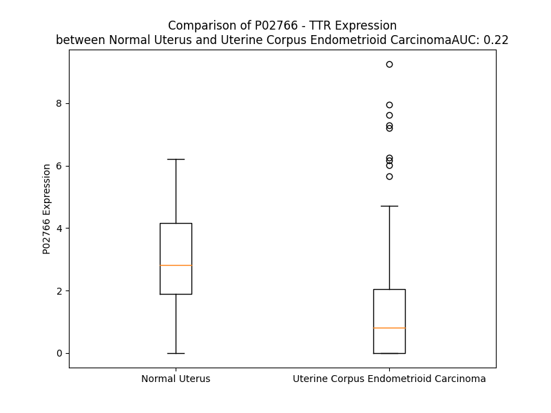

# Detailed Data for P02766

## Introduction to the Detailed Summary

### How to Interpret the Results

- **Summary & Metrics**: This section provides a quick reference to essential protein attributes, including expression changes, family classification, and biomarker applications. Regulation status (upregulated/downregulated) indicates the protein's behavior in a disease context. Some information comes from the original excel file with the proteins selected from literature, while others are derived from the analyses.
- **Expression Comparison**: A visual representation comparing protein expression between normal and disease states. It highlights significant changes in expression levels that might indicate diagnostic or therapeutic relevance. This is data coming from transcriptomics experiments and could not translate similarly to protein levels.
- **Isoform Alignment**: An interactive view of isoform alignments, revealing structural and functional differences between variants of the protein.
- **Interactors & Homologs**: Tables listing known interaction partners and homologous proteins, the more interactors and homologs, the more complex the protein is to design an antibody for.
- **Biological Assemblies**: Information about the structural arrangement of the protein in different assemblies, providing insights into its functional state but also the complexity of the protein to develop antibodies.
- **Combined Per-Residue Information**: A detailed table summarizing residue-level data. This includes predictions for epitope regions, aggregation tendencies, and modifications that might impact the protein's function. Each row corresponds to a residue in the protein, providing insights into specific sites that may be important for research or drug development.
## Summary & Metrics

- **UniProt Accession**: P02766
- **Gene Name**: TTR
- **Protein Name**: Transthyretin
- **Swiss Prot**: TTHY_HUMAN
- **Family**: transporter
- **Biomarker Application**: diagnosis,efficacy,prognosis,unspecified application
- **Number of Isoforms**: 0
- **Regulation**: -1
- **(transcriptomics) AUC**: 0.22
- **(transcriptomics) Fold Change**: 2.14
- **(transcriptomics) Regulation**: Downregulated
- **Discotope Epitope Count**: 35
- **Max n_uniprots (Homo)**: 10.0
- **Max n_uniprots (Hetero)**: 6.0

## Expression Comparison

## Interactors

| preferredName_A   | preferredName_B   |   score |
|:------------------|:------------------|--------:|
| TTR               | RBP4              |   0.999 |
| TTR               | ALB               |   0.994 |
| TTR               | APOA1             |   0.994 |
| TTR               | APP               |   0.982 |
| TTR               | SERPINA7          |   0.98  |
| TTR               | B2M               |   0.968 |
| TTR               | SERPINA1          |   0.961 |
| TTR               | APOE              |   0.952 |
| TTR               | APCS              |   0.949 |
| TTR               | A2M               |   0.905 |
| TTR               | LRP2              |   0.905 |

## Homologs

| uniprot_id   | gene_id   |
|:-------------|:----------|
| A6NGE7       | URAD      |

## Biological Assemblies

|   Unnamed: 0 |   assembly |   n_uniprots | composition   | crystal_id   |
|-------------:|-----------:|-------------:|:--------------|:-------------|
|            0 |          1 |            2 | Homo          | 2h4e         |
|            0 |          1 |            1 | Homo          | 5h0w         |
|            0 |          1 |            2 | Homo          | 3i9a         |
|            0 |          1 |            2 | Homo          | 5ayt         |
|            0 |          1 |            2 | Homo          | 6txw         |
|            0 |          1 |            2 | Homo          | 1x7t         |
|            0 |          1 |            2 | Homo          | 4tne         |
|            0 |          1 |            2 | Homo          | 4y9b         |
|            0 |          1 |            2 | Homo          | 1iik         |
|            0 |          1 |            2 | Homo          | 3cn2         |
|            1 |          2 |            2 | Homo          | 3cn2         |
|            0 |          1 |            2 | Homo          | 5clz         |
|            0 |          1 |            2 | Homo          | 5aks         |
|            0 |          1 |            2 | Homo          | 5ihh         |
|            0 |          1 |            2 | Homo          | 5fw7         |
|            0 |          1 |            2 | Homo          | 4tq8         |
|            0 |          1 |            2 | Homo          | 1dvy         |
|            0 |          1 |            2 | Homo          | 5jiq         |
|            0 |          1 |            2 | Homo          | 5u4e         |
|            0 |          1 |            5 | Homo          | 8e7i         |
|            0 |          1 |            2 | Homo          | 8jqw         |
|            0 |          1 |            2 | Homo          | 1sok         |
|            0 |          1 |            2 | Homo          | 3i9p         |
|            1 |          2 |            2 | Homo          | 3i9p         |
|            0 |          1 |            2 | Homo          | 7dt6         |
|            0 |          1 |            2 | Homo          | 1fh2         |
|            0 |          1 |            2 | Homo          | 3p3t         |
|            0 |          1 |            2 | Homo          | 4tl5         |
|            0 |          1 |            4 | Homo          | 8ve5         |
|            0 |          1 |            2 | Homo          | 3d7p         |
|            0 |          1 |            2 | Homo          | 4wns         |
|            0 |          1 |            2 | Homo          | 4pmf         |
|            0 |          1 |            8 | Homo          | 7y1i         |
|            1 |          2 |            8 | Homo          | 7y1i         |
|            2 |          3 |            8 | Homo          | 7y1i         |
|            0 |          1 |            2 | Homo          | 3a4d         |
|            0 |          1 |            2 | Homo          | 2b16         |
|            0 |          1 |            2 | Homo          | 1tt6         |
|            0 |          1 |            2 | Homo          | 3djr         |
|            0 |          1 |            2 | Homo          | 4y9f         |
|            0 |          1 |            2 | Homo          | 1dvq         |
|            0 |          1 |            6 | Hetero        | 1rlb         |
|            0 |          1 |            4 | Homo          | 1g1o         |
|            0 |          1 |            2 | Homo          | 3cn0         |
|            1 |          2 |            2 | Homo          | 3cn0         |
|            0 |          1 |            2 | Homo          | 4pvm         |
|            0 |          1 |            2 | Homo          | 2b77         |
|            0 |          1 |            2 | Homo          | 3w3b         |
|            0 |          1 |            2 | Homo          | 3cn1         |
|            1 |          2 |            2 | Homo          | 3cn1         |
|            0 |          1 |            2 | Homo          | 5u4a         |
|            0 |          1 |            6 | Homo          | 8pke         |
|            0 |          1 |            5 | Homo          | 8g9r         |
|            0 |          1 |            4 | Homo          | 8ve4         |
|            0 |          1 |            5 | Homo          | 8e7d         |
|            0 |          1 |            2 | Homo          | 8awi         |
|            0 |          1 |            2 | Homo          | 4tng         |
|            0 |          1 |            2 | Homo          | 1zd6         |
|            0 |          1 |            2 | Homo          | 5u4d         |
|            0 |          1 |            2 | Homo          | 1y1d         |
|            0 |          1 |            2 | Homo          | 8w45         |
|            0 |          1 |            2 | Homo          | 6d0w         |
|            0 |          1 |            2 | Homo          | 2qgd         |
|            0 |          1 |            2 | Homo          | 3gs7         |
|            1 |          2 |            2 | Homo          | 3gs7         |
|            0 |          1 |            5 | Homo          | 8e7e         |
|            0 |          1 |            2 | Homo          | 3kgs         |
|            0 |          1 |            2 | Homo          | 4abv         |
|            0 |          1 |            2 | Homo          | 7wl6         |
|            0 |          1 |            2 | Homo          | 4abw         |
|            0 |          1 |            2 | Homo          | 4y9e         |
|            0 |          1 |            4 | Homo          | 5ezp         |
|            1 |          2 |            4 | Homo          | 5ezp         |
|            0 |          1 |            2 | Homo          | 3imw         |
|            0 |          1 |            2 | Homo          | 4des         |
|            0 |          1 |            2 | Homo          | 4n86         |
|            0 |          1 |            2 | Homo          | 3bt0         |
|            0 |          1 |            2 | Homo          | 5u4f         |
|            0 |          1 |            2 | Homo          | 3a4e         |
|            0 |          1 |            2 | Homo          | 6fxu         |
|            0 |          1 |            2 | Homo          | 4y9c         |
|            0 |          1 |            2 | Homo          | 4pme         |
|            1 |          2 |            2 | Homo          | 4pme         |
|            0 |          1 |            2 | Homo          | 1thc         |
|            0 |          1 |            2 | Homo          | 1z7j         |
|            0 |          1 |            2 | Homo          | 8pm8         |
|            0 |          1 |            2 | Homo          | 7eri         |
|            0 |          1 |            1 | Homo          | 5oq0         |
|            0 |          1 |            2 | Homo          | 6e72         |
|            0 |          1 |            2 | Homo          | 4pwj         |
|            0 |          1 |            2 | Homo          | 6imy         |
|            0 |          1 |            2 | Homo          | 5cm1         |
|            0 |          1 |            2 | Homo          | 3ng5         |
|            0 |          1 |            2 | Homo          | 5lll         |
|            0 |          1 |            2 | Homo          | 1bm7         |
|            0 |          1 |            2 | Homo          | 1f41         |
|            0 |          1 |            2 | Homo          | 1dvu         |
|            0 |          1 |            2 | Homo          | 3nex         |
|            0 |          1 |            2 | Homo          | 3cfm         |
|            1 |          2 |            2 | Homo          | 3cfm         |
|            0 |          1 |            2 | Homo          | 1e5a         |
|            0 |          1 |            2 | Homo          | 3ozl         |
|            0 |          1 |            5 | Homo          | 8e7j         |
|            0 |          1 |            2 | Homo          | 8w48         |
|            0 |          1 |            2 | Homo          | 4abq         |
|            0 |          1 |            4 | Homo          | 8ve2         |
|            0 |          1 |            2 | Homo          | 4wnj         |
|            0 |          1 |            2 | Homo          | 7dt3         |
|            0 |          1 |            2 | Homo          | 4tlu         |
|            0 |          1 |            6 | Homo          | 8pkg         |
|            0 |          1 |            2 | Homo          | 5ttr         |
|            1 |          2 |            4 | Homo          | 5ttr         |
|            2 |          3 |            2 | Homo          | 5ttr         |
|            0 |          1 |            2 | Homo          | 4ydn         |
|            0 |          1 |            2 | Homo          | 5u4g         |
|            0 |          1 |            2 | Homo          | 3gs4         |
|            1 |          2 |            2 | Homo          | 3gs4         |
|            0 |          1 |            2 | Homo          | 2trh         |
|            0 |          1 |            2 | Homo          | 1ijn         |
|            1 |          2 |            2 | Homo          | 1ijn         |
|            0 |          1 |            2 | Homo          | 4ik7         |
|            0 |          1 |            2 | Homo          | 3esp         |
|            0 |          1 |            2 | Homo          | 6e6z         |
|            0 |          1 |            2 | Homo          | 4pwe         |
|            0 |          1 |            2 | Homo          | 8pmo         |
|            0 |          1 |            2 | Homo          | 3nee         |
|            0 |          1 |            2 | Homo          | 6grp         |
|            0 |          1 |            2 | Homo          | 8ii2         |
|            0 |          1 |            2 | Homo          | 1tha         |
|            0 |          1 |            2 | Homo          | 4n87         |
|            0 |          1 |            2 | Homo          | 4pwi         |
|            0 |          1 |            4 | Homo          | 3dgd         |
|            0 |          1 |            2 | Homo          | 5fw8         |
|            1 |          2 |            2 | Homo          | 5fw8         |
|            0 |          1 |            2 | Homo          | 1bmz         |
|            1 |          2 |            2 | Homo          | 1bmz         |
|            0 |          1 |            2 | Homo          | 5n5q         |
|            0 |          1 |            2 | Homo          | 2g3x         |
|            0 |          1 |            2 | Homo          | 4tm9         |
|            0 |          1 |            2 | Homo          | 5en3         |
|            0 |          1 |            2 | Homo          | 6tjn         |
|            0 |          1 |            2 | Homo          | 3cn4         |
|            1 |          2 |            2 | Homo          | 3cn4         |
|            0 |          1 |            2 | Homo          | 6gr7         |
|            0 |          1 |            2 | Homo          | 4ikj         |
|            0 |          1 |            2 | Homo          | 3dk0         |
|            0 |          1 |            2 | Homo          | 1bz8         |
|            0 |          1 |            2 | Homo          | 6kgb         |
|            0 |          1 |            2 | Homo          | 7ejq         |
|            0 |          1 |            2 | Homo          | 6e70         |
|            0 |          1 |            2 | Homo          | 3tfb         |
|            0 |          1 |            2 | Homo          | 3cxf         |
|            1 |          2 |            2 | Homo          | 3cxf         |
|            0 |          1 |            2 | Homo          | 8c85         |
|            0 |          1 |            2 | Homo          | 8t5x         |
|            0 |          1 |            2 | Homo          | 4ydm         |
|            0 |          1 |            2 | Homo          | 5l4j         |
|            0 |          1 |            2 | Homo          | 2b14         |
|            0 |          1 |            2 | Homo          | 8hy4         |
|            0 |          1 |            2 | Homo          | 2rox         |
|            0 |          1 |            2 | Homo          | 8w47         |
|            0 |          1 |            2 | Homo          | 4y9g         |
|            0 |          1 |            2 | Homo          | 2pab         |
|            1 |          2 |            2 | Homo          | 2pab         |
|            0 |          1 |            2 | Homo          | 8ig1         |
|            0 |          1 |            2 | Homo          | 5dwp         |
|            0 |          1 |            2 | Homo          | 2f8i         |
|            1 |          2 |            2 | Homo          | 2f8i         |
|            0 |          1 |            2 | Homo          | 8w43         |
|            0 |          1 |            2 | Homo          | 5e4o         |
|            0 |          1 |            2 | Homo          | 6fwd         |
|            0 |          1 |           10 | Homo          | 6sdz         |
|            0 |          1 |            4 | Homo          | 3gps         |
|            0 |          1 |            2 | Homo          | 3b56         |
|            0 |          1 |            2 | Homo          | 8w42         |
|            0 |          1 |            2 | Homo          | 3cbr         |
|            0 |          1 |            2 | Homo          | 4tqp         |
|            0 |          1 |            2 | Homo          | 4hiq         |
|            0 |          1 |            2 | Homo          | 4tl4         |
|            0 |          1 |            4 | Homo          | 1ict         |
|            1 |          2 |            4 | Homo          | 1ict         |
|            0 |          1 |            2 | Homo          | 5n62         |
|            0 |          1 |            2 | Homo          | 2try         |
|            0 |          1 |            2 | Homo          | 6ep1         |
|            0 |          1 |            2 | Homo          | 5clx         |
|            0 |          1 |            2 | Homo          | 4n85         |
|            0 |          1 |            2 | Homo          | 4tlt         |
|            0 |          1 |            2 | Homo          | 3p3s         |
|            0 |          1 |            2 | Homo          | 6e78         |
|            0 |          1 |            2 | Homo          | 1u21         |
|            0 |          1 |            2 | Homo          | 4pwk         |
|            0 |          1 |            2 | Homo          | 4his         |
|            0 |          1 |            2 | Homo          | 4qrf         |
|            0 |          1 |            6 | Hetero        | 2wqa         |
|            0 |          1 |            4 | Homo          | 3grg         |
|            0 |          1 |            2 | Homo          | 6r67         |
|            0 |          1 |            2 | Homo          | 1tta         |
|            0 |          1 |            4 | Homo          | 5llv         |
|            0 |          1 |            2 | Homo          | 7q9o         |
|            0 |          1 |            2 | Homo          | 3nes         |
|            0 |          1 |            2 | Homo          | 1tsh         |
|            0 |          1 |            2 | Homo          | 1ttr         |
|            1 |          2 |            2 | Homo          | 1ttr         |
|            0 |          1 |            2 | Homo          | 1fhn         |
|            0 |          1 |            2 | Homo          | 6imx         |
|            0 |          1 |            2 | Homo          | 2b15         |
|            0 |          1 |            2 | Homo          | 3fcb         |
|            0 |          1 |            4 | Homo          | 1gko         |
|            0 |          1 |            2 | Homo          | 4dew         |
|            0 |          1 |            2 | Homo          | 6e77         |
|            0 |          1 |            2 | Homo          | 7z60         |
|            0 |          1 |            2 | Homo          | 6e74         |
|            0 |          1 |            2 | Homo          | 3cfq         |
|            1 |          2 |            2 | Homo          | 3cfq         |
|            0 |          1 |            4 | Homo          | 8tdo         |
|            0 |          1 |            2 | Homo          | 3a4f         |
|            0 |          1 |            2 | Homo          | 7ycq         |
|            0 |          1 |            2 | Homo          | 5n7c         |
|            0 |          1 |            2 | Homo          | 2b9a         |
|            0 |          1 |            2 | Homo          | 5boj         |
|            0 |          1 |            2 | Homo          | 5cly         |
|            0 |          1 |            2 | Homo          | 2qgb         |
|            0 |          1 |            2 | Homo          | 6e76         |
|            0 |          1 |            2 | Homo          | 3eso         |
|            0 |          1 |            2 | Homo          | 4iki         |
|            0 |          1 |            2 | Homo          | 8wgs         |
|            0 |          1 |            2 | Homo          | 4tqh         |
|            0 |          1 |            2 | Homo          | 4ank         |
|            0 |          1 |            2 | Homo          | 5l4m         |
|            0 |          1 |            2 | Homo          | 3djs         |
|            0 |          1 |            1 | Homo          | 3ssg         |
|            0 |          1 |            2 | Homo          | 4pvn         |
|            0 |          1 |            4 | Homo          | 8i0o         |
|            0 |          1 |            4 | Homo          | 8ve0         |
|            0 |          1 |            2 | Homo          | 3djt         |
|            0 |          1 |            2 | Homo          | 5u48         |
|            0 |          1 |           10 | Homo          | 7ob4         |
|            0 |          1 |            2 | Homo          | 6e75         |
|            0 |          1 |            2 | Homo          | 5akt         |
|            0 |          1 |            2 | Homo          | 1ttb         |
|            0 |          1 |            2 | Homo          | 4wo0         |
|            0 |          1 |            2 | Homo          | 4deu         |
|            0 |          1 |            2 | Homo          | 3dk2         |
|            0 |          1 |            2 | Homo          | 3glz         |
|            1 |          2 |            2 | Homo          | 3glz         |
|            0 |          1 |            2 | Homo          | 3fc8         |
|            0 |          1 |            2 | Homo          | 1tlm         |
|            0 |          1 |            2 | Homo          | 5tzl         |
|            0 |          1 |            2 | Homo          | 1dvz         |
|            0 |          1 |            1 | Homo          | 8w2w         |
|            0 |          1 |            2 | Homo          | 7q9l         |
|            0 |          1 |            6 | Hetero        | 1qab         |
|            0 |          1 |            2 | Homo          | 4l1t         |
|            0 |          1 |            2 | Homo          | 5dej         |
|            1 |          2 |            2 | Homo          | 5dej         |
|            0 |          1 |            2 | Homo          | 8ii4         |
|            0 |          1 |            2 | Homo          | 1bzd         |
|            0 |          1 |            2 | Homo          | 3imu         |
|            0 |          1 |            2 | Homo          | 4pm1         |
|            0 |          1 |            2 | Homo          | 3neo         |
|            0 |          1 |            2 | Homo          | 8jok         |
|            0 |          1 |            4 | Homo          | 3did         |
|            0 |          1 |            2 | Homo          | 4ikk         |
|            0 |          1 |            2 | Homo          | 2qgc         |
|            0 |          1 |            2 | Homo          | 5l4i         |
|            0 |          1 |            2 | Homo          | 4pwg         |
|            0 |          1 |            2 | Homo          | 8i00         |
|            0 |          1 |            4 | Homo          | 8ve3         |
|            0 |          1 |            2 | Homo          | 4qya         |
|            0 |          1 |            2 | Homo          | 1ttc         |
|            0 |          1 |            2 | Homo          | 4tnf         |
|            0 |          1 |            2 | Homo          | 5al8         |
|            0 |          1 |            2 | Homo          | 3djz         |
|            0 |          1 |            2 | Homo          | 2g9k         |
|            0 |          1 |            2 | Homo          | 4hjt         |
|            0 |          1 |            2 | Homo          | 8pm9         |
|            0 |          1 |            2 | Homo          | 4hju         |
|            0 |          1 |            2 | Homo          | 8wgt         |
|            0 |          1 |            2 | Homo          | 2qge         |
|            0 |          1 |            2 | Homo          | 1soq         |
|            1 |          2 |            2 | Homo          | 1soq         |
|            2 |          3 |            2 | Homo          | 1soq         |
|            0 |          1 |            2 | Homo          | 2g4e         |
|            0 |          1 |            2 | Homo          | 5cnh         |
|            0 |          1 |            2 | Homo          | 5u4b         |
|            0 |          1 |            2 | Homo          | 4det         |
|            0 |          1 |            2 | Homo          | 2noy         |
|            0 |          1 |            2 | Homo          | 7w9r         |
|            0 |          1 |            2 | Homo          | 8ii3         |
|            0 |          1 |            2 | Homo          | 7tha         |
|            0 |          1 |            2 | Homo          | 4tls         |
|            0 |          1 |            2 | Homo          | 8hej         |
|            0 |          1 |            2 | Homo          | 8pma         |
|            0 |          1 |            2 | Homo          | 5jim         |
|            0 |          1 |            2 | Homo          | 3hj0         |
|            0 |          1 |            2 | Homo          | 1e3f         |
|            0 |          1 |            2 | Homo          | 3cfn         |
|            1 |          2 |            2 | Homo          | 3cfn         |
|            0 |          1 |            1 | Homo          | 5u49         |
|            0 |          1 |            2 | Homo          | 4pwf         |
|            0 |          1 |            2 | Homo          | 6suh         |
|            0 |          1 |            2 | Homo          | 4tqi         |
|            0 |          1 |            2 | Homo          | 7erk         |
|            0 |          1 |            2 | Homo          | 1iii         |
|            0 |          1 |            4 | Homo          | 8ve1         |
|            0 |          1 |            2 | Homo          | 7w9q         |
|            0 |          1 |            2 | Homo          | 4iiz         |
|            0 |          1 |            2 | Homo          | 5akv         |
|            0 |          1 |            2 | Homo          | 3cn3         |
|            1 |          2 |            2 | Homo          | 3cn3         |
|            0 |          1 |            2 | Homo          | 1eta         |
|            1 |          2 |            2 | Homo          | 1eta         |
|            0 |          1 |            2 | Homo          | 3ipb         |
|            0 |          1 |            2 | Homo          | 3d2t         |
|            0 |          1 |            2 | Homo          | 2gab         |
|            0 |          1 |            4 | Homo          | 8ve6         |
|            0 |          1 |            2 | Homo          | 1dvx         |
|            0 |          1 |            2 | Homo          | 1qwh         |
|            0 |          1 |            2 | Homo          | 4pwh         |
|            0 |          1 |            2 | Homo          | 1e4h         |
|            0 |          1 |            2 | Homo          | 7erh         |
|            0 |          1 |            2 | Homo          | 2g5u         |
|            0 |          1 |            2 | Homo          | 3p3u         |
|            0 |          1 |            6 | Homo          | 8pkf         |
|            0 |          1 |            2 | Homo          | 5nfw         |
|            0 |          1 |            2 | Homo          | 4hjs         |
|            0 |          1 |            2 | Homo          | 3i9i         |
|            1 |          2 |            2 | Homo          | 3i9i         |
|            0 |          1 |            2 | Homo          | 5fw6         |
|            1 |          2 |            2 | Homo          | 5fw6         |
|            0 |          1 |            2 | Homo          | 4fi6         |
|            0 |          1 |            2 | Homo          | 3imv         |
|            0 |          1 |            2 | Homo          | 4i85         |
|            0 |          1 |            2 | Homo          | 4ik6         |
|            0 |          1 |            1 | Homo          | 5a6i         |
|            0 |          1 |            1 | Homo          | 5h0y         |
|            0 |          1 |            2 | Homo          | 2flm         |
|            0 |          1 |            2 | Homo          | 3kgu         |
|            0 |          1 |            2 | Homo          | 3imr         |
|            0 |          1 |            2 | Homo          | 3p3r         |
|            0 |          1 |            2 | Homo          | 2roy         |
|            0 |          1 |            2 | Homo          | 4fi7         |
|            0 |          1 |            2 | Homo          | 3cft         |
|            1 |          2 |            2 | Homo          | 3cft         |
|            0 |          1 |            2 | Homo          | 4ikl         |
|            0 |          1 |            2 | Homo          | 7q9n         |
|            0 |          1 |            6 | Hetero        | 3bsz         |
|            0 |          1 |            1 | Homo          | 5h0z         |
|            0 |          1 |            2 | Homo          | 2g4g         |
|            0 |          1 |            2 | Homo          | 3gs0         |
|            1 |          2 |            2 | Homo          | 3gs0         |
|            0 |          1 |            2 | Homo          | 7qc5         |
|            0 |          1 |            2 | Homo          | 3ims         |
|            0 |          1 |            2 | Homo          | 5hjg         |
|            0 |          1 |            2 | Homo          | 4tlk         |
|            0 |          1 |            2 | Homo          | 1tyr         |
|            1 |          2 |            2 | Homo          | 1tyr         |
|            0 |          1 |            4 | Homo          | 5h0v         |
|            0 |          1 |            5 | Homo          | 8e7h         |
|            0 |          1 |            2 | Homo          | 6e73         |
|            0 |          1 |            2 | Homo          | 6sug         |
|            0 |          1 |            2 | Homo          | 7y6j         |
|            0 |          1 |            2 | Homo          | 6r66         |
|            0 |          1 |            2 | Homo          | 2f7i         |
|            0 |          1 |            2 | Homo          | 5e23         |
|            0 |          1 |            2 | Homo          | 6fft         |
|            0 |          1 |            2 | Homo          | 3kgt         |
|            0 |          1 |            2 | Homo          | 3u2i         |
|            0 |          1 |            2 | Homo          | 6r6i         |
|            0 |          1 |            2 | Homo          | 7dt5         |
|            0 |          1 |            2 | Homo          | 3ipe         |
|            0 |          1 |            2 | Homo          | 7erj         |
|            0 |          1 |            2 | Homo          | 8ii1         |
|            0 |          1 |            2 | Homo          | 5al0         |
|            0 |          1 |            2 | Homo          | 4tkw         |
|            0 |          1 |            5 | Homo          | 8gbr         |
|            0 |          1 |            2 | Homo          | 1tz8         |
|            1 |          2 |            2 | Homo          | 1tz8         |
|            2 |          3 |            2 | Homo          | 1tz8         |
|            0 |          1 |            4 | Homo          | 3grb         |
|            0 |          1 |            2 | Homo          | 5nfe         |
|            0 |          1 |            2 | Homo          | 7ybr         |
|            0 |          1 |           10 | Homo          | 2m5n         |
|            0 |          1 |            2 | Homo          | 8w1n         |
|            0 |          1 |            2 | Homo          | 3ozk         |
|            0 |          1 |            5 | Homo          | 8tdn         |
|            0 |          1 |            2 | Homo          | 4abu         |
|            0 |          1 |            2 | Homo          | 6xtk         |
|            0 |          1 |            2 | Homo          | 4mas         |
|            0 |          1 |            2 | Homo          | 5u4c         |
|            0 |          1 |            2 | Homo          | 6fzl         |
|            0 |          1 |            2 | Homo          | 8wgu         |
|            0 |          1 |            2 | Homo          | 4l1s         |
|            0 |          1 |            2 | Homo          | 8w46         |
|            0 |          1 |            2 | Homo          | 7dt8         |
|            0 |          1 |            2 | Homo          | 2g3z         |
|            0 |          1 |            2 | Homo          | 1bze         |
|            0 |          1 |            2 | Homo          | 4act         |
|            0 |          1 |            2 | Homo          | 6txv         |
|            0 |          1 |            2 | Homo          | 3m1o         |
|            0 |          1 |            2 | Homo          | 8jnu         |
|            0 |          1 |            2 | Homo          | 8w44         |
|            0 |          1 |            2 | Homo          | 3esn         |
|            0 |          1 |            2 | Homo          | 5e4a         |
|            0 |          1 |            2 | Homo          | 5h0x         |
|            0 |          1 |            2 | Homo          | 8aww         |
|            0 |          1 |            2 | Homo          | 6u0q         |
|            0 |          1 |            2 | Homo          | 1etb         |
|            1 |          2 |            2 | Homo          | 1etb         |
|            0 |          1 |            2 | Homo          | 6ti9         |
|            0 |          1 |            2 | Homo          | 4mrb         |
|            0 |          1 |            2 | Homo          | 1f86         |
|            1 |          2 |            2 | Homo          | 1f86         |
|            0 |          1 |            2 | Homo          | 1dvt         |
|            0 |          1 |            2 | Homo          | 3imt         |
|            0 |          1 |            2 | Homo          | 4ky2         |
|            0 |          1 |            2 | Homo          | 5cr1         |
|            0 |          1 |            2 | Homo          | 3u2j         |
|            0 |          1 |            2 | Homo          | 6eoy         |
|            0 |          1 |            4 | Homo          | 3do4         |
|            1 |          2 |            4 | Homo          | 3do4         |
|            0 |          1 |            2 | Homo          | 7ejr         |
|            0 |          1 |            2 | Homo          | 5fo2         |
|            0 |          1 |            2 | Homo          | 5k1j         |
|            0 |          1 |            4 | Homo          | 2qel         |
|            0 |          1 |            2 | Homo          | 2fbr         |
|            0 |          1 |            2 | Homo          | 5cn3         |
|            0 |          1 |            2 | Homo          | 4ac2         |
|            0 |          1 |            2 | Homo          | 5jid         |
|            0 |          1 |            2 | Homo          | 6e71         |
|            0 |          1 |            2 | Homo          | 4der         |
|            0 |          1 |            1 | Homo          | 2nbp         |
|            0 |          1 |            2 | Homo          | 4ac4         |
|            0 |          1 |            2 | Homo          | 4mrc         |
|            0 |          1 |            2 | Homo          | 3tct         |
|            0 |          1 |            2 | Homo          | 4d7b         |
|            0 |          1 |            2 | Homo          | 4fi8         |
|            0 |          1 |            2 | Homo          | 5k1n         |
|            0 |          1 |            2 | Homo          | 6r68         |
|            0 |          1 |            2 | Homo          | 8c86         |
|            0 |          1 |            2 | Homo          | 7acu         |
|            0 |          1 |            2 | Homo          | 4i87         |
|            0 |          1 |            2 | Homo          | 4qxv         |
|            0 |          1 |            2 | Homo          | 4i89         |
|            0 |          1 |            2 | Homo          | 4pvl         |
|            0 |          1 |            7 | Homo          | 8ade         |
|            0 |          1 |            2 | Homo          | 1x7s         |
|            0 |          1 |            2 | Homo          | 5l4f         |
|            0 |          1 |            2 | Homo          | 1zcr         |
|            0 |          1 |            2 | Homo          | 1dvs         |
|            0 |          1 |            1 | Homo          | 2nbo         |

## Combined Per-Residue Information

|   res | aa   |   epitope_score | epitope   |   relative_surface_accessibility |   modeling_confidence |   Aggregation | modification                                           | glycosylation                   |
|------:|:-----|----------------:|:----------|---------------------------------:|----------------------:|--------------:|:-------------------------------------------------------|:--------------------------------|
|     1 | M    |         0.25809 | False     |                          1.34377 |                 43.35 |         0     | N/A                                                    | N/A                             |
|     2 | A    |         0.27806 | False     |                          0.87067 |                 42.63 |         0     | N/A                                                    | N/A                             |
|     3 | S    |         0.37725 | False     |                          0.75717 |                 48.83 |         0     | N/A                                                    | N/A                             |
|     4 | H    |         0.4335  | True      |                          0.79874 |                 45.81 |         0.001 | N/A                                                    | N/A                             |
|     5 | R    |         0.39969 | True      |                          0.83565 |                 49.78 |         0.006 | N/A                                                    | N/A                             |
|     6 | L    |         0.33263 | False     |                          0.9466  |                 52.52 |        82.31  | N/A                                                    | N/A                             |
|     7 | L    |         0.31346 | False     |                          0.94453 |                 50.55 |        99.183 | N/A                                                    | N/A                             |
|     8 | L    |         0.24173 | False     |                          0.82088 |                 51.22 |        99.689 | N/A                                                    | N/A                             |
|     9 | L    |         0.31721 | False     |                          0.83715 |                 48.67 |        99.781 | N/A                                                    | N/A                             |
|    10 | C    |         0.24304 | False     |                          0.84406 |                 51.76 |        99.798 | N/A                                                    | N/A                             |
|    11 | L    |         0.29699 | False     |                          1.01518 |                 51.78 |        99.876 | N/A                                                    | N/A                             |
|    12 | A    |         0.28339 | False     |                          0.8521  |                 58.8  |        99.874 | N/A                                                    | N/A                             |
|    13 | G    |         0.25907 | False     |                          0.88258 |                 51.53 |        99.874 | N/A                                                    | N/A                             |
|    14 | L    |         0.22808 | False     |                          0.9014  |                 63.82 |        99.891 | N/A                                                    | N/A                             |
|    15 | V    |         0.19366 | False     |                          0.88428 |                 58.06 |        99.884 | N/A                                                    | N/A                             |
|    16 | F    |         0.23237 | False     |                          0.87675 |                 57.51 |        99.793 | N/A                                                    | N/A                             |
|    17 | V    |         0.20908 | False     |                          0.81627 |                 56.63 |        98.682 | N/A                                                    | N/A                             |
|    18 | S    |         0.21129 | False     |                          0.81396 |                 59.25 |        10.918 | N/A                                                    | N/A                             |
|    19 | E    |         0.26808 | False     |                          0.81055 |                 57.78 |         0.006 | N/A                                                    | N/A                             |
|    20 | A    |         0.24269 | False     |                          0.90579 |                 52.07 |         0.003 | N/A                                                    | N/A                             |
|    21 | G    |         0.28491 | False     |                          0.60057 |                 47.51 |         0     | N/A                                                    | N/A                             |
|    22 | P    |         0.26775 | False     |                          1.00199 |                 48.48 |         0     | N/A                                                    | N/A                             |
|    23 | T    |         0.34266 | False     |                          0.90225 |                 43.01 |         0     | N/A                                                    | N/A                             |
|    24 | G    |         0.36124 | False     |                          0.77687 |                 43.47 |         0     | N/A                                                    | N/A                             |
|    25 | T    |         0.36402 | False     |                          0.94895 |                 42.24 |         0     | N/A                                                    | N/A                             |
|    26 | G    |         0.31571 | False     |                          0.75003 |                 44.12 |         0     | N/A                                                    | N/A                             |
|    27 | E    |         0.4401  | True      |                          0.69127 |                 52.13 |         0     | N/A                                                    | N/A                             |
|    28 | S    |         0.21974 | False     |                          0.51381 |                 57.06 |         0     | N/A                                                    | N/A                             |
|    29 | K    |         0.31489 | False     |                          0.77811 |                 76.35 |         0     | N/A                                                    | N/A                             |
|    30 | C    |         0.2076  | False     |                          0.1275  |                 88.83 |         0     | Sulfocysteine                                          | N/A                             |
|    31 | P    |         0.05583 | False     |                          0.02585 |                 96.03 |         0     | N/A                                                    | N/A                             |
|    32 | L    |         0.00354 | False     |                          0       |                 98.26 |         2.532 | N/A                                                    | N/A                             |
|    33 | M    |         0.25527 | False     |                          0.13807 |                 98.35 |         2.838 | N/A                                                    | N/A                             |
|    34 | V    |         0.00364 | False     |                          0       |                 98.77 |         3.106 | N/A                                                    | N/A                             |
|    35 | K    |         0.35982 | False     |                          0.29208 |                 98.68 |         3.106 | N/A                                                    | N/A                             |
|    36 | V    |         0.00347 | False     |                          0       |                 98.91 |         3.106 | N/A                                                    | N/A                             |
|    37 | L    |         0.43405 | True      |                          0.35695 |                 98.88 |         3.106 | N/A                                                    | N/A                             |
|    38 | D    |         0.02657 | False     |                          0.00797 |                 98.73 |         3.106 | N/A                                                    | N/A                             |
|    39 | A    |         0.3837  | False     |                          0.50706 |                 98.33 |         2.677 | N/A                                                    | N/A                             |
|    40 | V    |         0.57436 | True      |                          0.64121 |                 97.84 |         2.512 | N/A                                                    | N/A                             |
|    41 | R    |         0.49415 | True      |                          0.49205 |                 96.84 |         0     | N/A                                                    | N/A                             |
|    42 | G    |         0.45844 | True      |                          0.87453 |                 97.82 |         0     | N/A                                                    | N/A                             |
|    43 | S    |         0.44294 | True      |                          0.29094 |                 98.17 |         0     | N/A                                                    | N/A                             |
|    44 | P    |         0.14873 | False     |                          0.33539 |                 98.72 |         0     | N/A                                                    | N/A                             |
|    45 | A    |         0.00636 | False     |                          0       |                 98.72 |         3.001 | N/A                                                    | N/A                             |
|    46 | I    |         0.33874 | False     |                          0.43505 |                 98.53 |         6.315 | N/A                                                    | N/A                             |
|    47 | N    |         0.30251 | False     |                          0.66898 |                 98.44 |         6.315 | N/A                                                    | N/A                             |
|    48 | V    |         0.01724 | False     |                          0.00762 |                 98.85 |         7.49  | N/A                                                    | N/A                             |
|    49 | A    |         0.22934 | False     |                          0.19318 |                 98.84 |         7.49  | N/A                                                    | N/A                             |
|    50 | V    |         0.00718 | False     |                          0       |                 98.89 |         7.282 | N/A                                                    | N/A                             |
|    51 | H    |         0.48386 | True      |                          0.40067 |                 98.87 |         1.929 | N/A                                                    | N/A                             |
|    52 | V    |         0.02118 | False     |                          0.00704 |                 98.86 |         1.929 | N/A                                                    | N/A                             |
|    53 | F    |         0.39645 | False     |                          0.20001 |                 98.84 |         1.714 | N/A                                                    | N/A                             |
|    54 | R    |         0.34777 | False     |                          0.32338 |                 98.64 |         0     | N/A                                                    | N/A                             |
|    55 | K    |         0.32283 | False     |                          0.31587 |                 98.63 |         0     | N/A                                                    | N/A                             |
|    56 | A    |         0.19583 | False     |                          0.21728 |                 97.91 |         0     | N/A                                                    | N/A                             |
|    57 | A    |         0.309   | False     |                          1.11579 |                 96.56 |         0     | N/A                                                    | N/A                             |
|    58 | D    |         0.34339 | False     |                          0.62795 |                 97.64 |         0     | N/A                                                    | N/A                             |
|    59 | D    |         0.4142  | True      |                          0.61315 |                 96.62 |         0     | N/A                                                    | N/A                             |
|    60 | T    |         0.44953 | True      |                          0.49537 |                 98.33 |         0     | N/A                                                    | N/A                             |
|    61 | W    |         0.55929 | True      |                          0.39499 |                 98.56 |         0     | N/A                                                    | N/A                             |
|    62 | E    |         0.39834 | False     |                          0.46924 |                 98.45 |         0     | 4-carboxyglutamate; in a patient with Moyamoya disease | N/A                             |
|    63 | P    |         0.436   | True      |                          0.87963 |                 98.55 |         0     | N/A                                                    | N/A                             |
|    64 | F    |         0.30018 | False     |                          0.28549 |                 98.5  |         0     | N/A                                                    | N/A                             |
|    65 | A    |         0.19581 | False     |                          0.19682 |                 98.46 |         0     | N/A                                                    | N/A                             |
|    66 | S    |         0.35053 | False     |                          0.58555 |                 98.62 |         0     | N/A                                                    | N/A                             |
|    67 | G    |         0.24414 | False     |                          0.2867  |                 98.51 |         0     | N/A                                                    | N/A                             |
|    68 | K    |         0.46423 | True      |                          0.64506 |                 98.78 |         0     | N/A                                                    | N/A                             |
|    69 | T    |         0.02287 | False     |                          0.00915 |                 98.8  |         0     | N/A                                                    | N/A                             |
|    70 | S    |         0.25491 | False     |                          0.43293 |                 98.52 |         0     | N/A                                                    | N/A                             |
|    71 | E    |         0.36339 | False     |                          0.75199 |                 98.34 |         0     | N/A                                                    | N/A                             |
|    72 | S    |         0.36547 | False     |                          0.4305  |                 98.19 |         0     | Phosphoserine                                          | N/A                             |
|    73 | G    |         0.00581 | False     |                          0       |                 98.62 |         0     | N/A                                                    | N/A                             |
|    74 | E    |         0.39646 | False     |                          0.18868 |                 98.54 |         0     | N/A                                                    | N/A                             |
|    75 | L    |         0.24118 | False     |                          0.09233 |                 98.55 |         0     | N/A                                                    | N/A                             |
|    76 | H    |         0.18405 | False     |                          0.44383 |                 97.26 |         0     | N/A                                                    | N/A                             |
|    77 | G    |         0.30944 | False     |                          0.81202 |                 95.22 |         0     | N/A                                                    | N/A                             |
|    78 | L    |         0.13302 | False     |                          0.07724 |                 97.55 |         0     | N/A                                                    | N/A                             |
|    79 | T    |         0.16978 | False     |                          0.10058 |                 96.74 |         0     | N/A                                                    | N/A                             |
|    80 | T    |         0.33012 | False     |                          0.46389 |                 95.48 |         0     | N/A                                                    | N/A                             |
|    81 | E    |         0.28728 | False     |                          0.28091 |                 92.98 |         0     | N/A                                                    | N/A                             |
|    82 | E    |         0.37005 | False     |                          0.72228 |                 93.72 |         0     | N/A                                                    | N/A                             |
|    83 | E    |         0.33315 | False     |                          0.53444 |                 95.87 |         0     | N/A                                                    | N/A                             |
|    84 | F    |         0.08074 | False     |                          0.0349  |                 96.81 |         0     | N/A                                                    | N/A                             |
|    85 | V    |         0.3368  | False     |                          0.49889 |                 96.08 |         0     | N/A                                                    | N/A                             |
|    86 | E    |         0.29186 | False     |                          0.56082 |                 97.48 |         0     | N/A                                                    | N/A                             |
|    87 | G    |         0.14087 | False     |                          0.21084 |                 97.95 |         0     | N/A                                                    | N/A                             |
|    88 | I    |         0.54221 | True      |                          0.39499 |                 98.66 |         0     | N/A                                                    | N/A                             |
|    89 | Y    |         0.02234 | False     |                          0       |                 98.78 |         0     | N/A                                                    | N/A                             |
|    90 | K    |         0.23933 | False     |                          0.11922 |                 98.84 |         0     | N/A                                                    | N/A                             |
|    91 | V    |         0.00538 | False     |                          0       |                 98.84 |         0     | N/A                                                    | N/A                             |
|    92 | E    |         0.44873 | True      |                          0.19296 |                 98.85 |         0     | N/A                                                    | N/A                             |
|    93 | I    |         0.00819 | False     |                          0.0024  |                 98.88 |         0     | N/A                                                    | N/A                             |
|    94 | D    |         0.14358 | False     |                          0.21381 |                 98.73 |         0     | N/A                                                    | N/A                             |
|    95 | T    |         0.06664 | False     |                          0.02715 |                 98.56 |         0     | N/A                                                    | N/A                             |
|    96 | K    |         0.3298  | False     |                          0.27467 |                 98.48 |         0     | N/A                                                    | N/A                             |
|    97 | S    |         0.30215 | False     |                          0.47625 |                 98.49 |         0     | N/A                                                    | N/A                             |
|    98 | Y    |         0.24623 | False     |                          0.07511 |                 98.68 |         0     | N/A                                                    | N/A                             |
|    99 | W    |         0.07172 | False     |                          0.01197 |                 98.53 |         0     | N/A                                                    | N/A                             |
|   100 | K    |         0.46836 | True      |                          0.60654 |                 98.1  |         0     | N/A                                                    | N/A                             |
|   101 | A    |         0.39251 | False     |                          0.859   |                 98.02 |         0     | N/A                                                    | N/A                             |
|   102 | L    |         0.48682 | True      |                          0.4273  |                 97.21 |         0     | N/A                                                    | N/A                             |
|   103 | G    |         0.5594  | True      |                          0.88536 |                 98.04 |         0     | N/A                                                    | N/A                             |
|   104 | I    |         0.62742 | True      |                          0.35377 |                 97.8  |         0     | N/A                                                    | N/A                             |
|   105 | S    |         0.45833 | True      |                          0.70576 |                 97.5  |         0     | N/A                                                    | N/A                             |
|   106 | P    |         0.37781 | False     |                          0.17799 |                 97.84 |         0     | N/A                                                    | N/A                             |
|   107 | F    |         0.67225 | True      |                          0.7168  |                 98.48 |         0     | N/A                                                    | N/A                             |
|   108 | H    |         0.48862 | True      |                          0.26525 |                 98.26 |         0     | N/A                                                    | N/A                             |
|   109 | E    |         0.53712 | True      |                          0.53032 |                 98.09 |         0     | N/A                                                    | N/A                             |
|   110 | H    |         0.44931 | True      |                          0.38274 |                 98.66 |         0     | N/A                                                    | N/A                             |
|   111 | A    |         0.01134 | False     |                          0.00235 |                 98.46 |         0     | N/A                                                    | N/A                             |
|   112 | E    |         0.49943 | True      |                          0.34874 |                 98.09 |         0     | N/A                                                    | N/A                             |
|   113 | V    |         0.37126 | False     |                          0.17137 |                 98.68 |         6.756 | N/A                                                    | N/A                             |
|   114 | V    |         0.55245 | True      |                          0.57679 |                 98.66 |         6.756 | N/A                                                    | N/A                             |
|   115 | F    |         0.34518 | False     |                          0.17655 |                 98.39 |         6.756 | N/A                                                    | N/A                             |
|   116 | T    |         0.31235 | False     |                          0.51879 |                 98.06 |         6.756 | N/A                                                    | N/A                             |
|   117 | A    |         0.00407 | False     |                          0       |                 97.85 |         6.756 | N/A                                                    | N/A                             |
|   118 | N    |         0.13754 | False     |                          0.0625  |                 96.43 |         0.253 | N/A                                                    | N-linked (GlcNAc...) asparagine |
|   119 | D    |         0.47679 | True      |                          0.57303 |                 92.35 |         0     | N/A                                                    | N/A                             |
|   120 | S    |         0.33769 | False     |                          0.48198 |                 92.3  |         0     | N/A                                                    | N/A                             |
|   121 | G    |         0.22244 | False     |                          0.31191 |                 93.4  |         0     | N/A                                                    | N/A                             |
|   122 | P    |         0.22492 | False     |                          0.53382 |                 94.59 |         0     | N/A                                                    | N/A                             |
|   123 | R    |         0.36811 | False     |                          0.20735 |                 95.37 |         0     | N/A                                                    | N/A                             |
|   124 | R    |         0.33981 | False     |                          0.23808 |                 95.19 |         0     | N/A                                                    | N/A                             |
|   125 | Y    |         0.20784 | False     |                          0.05296 |                 97.78 |         3.82  | N/A                                                    | N/A                             |
|   126 | T    |         0.24122 | False     |                          0.26569 |                 97.95 |         6.88  | N/A                                                    | N/A                             |
|   127 | I    |         0.04954 | False     |                          0.0144  |                 98.56 |        18.521 | N/A                                                    | N/A                             |
|   128 | A    |         0.21671 | False     |                          0.29043 |                 98.62 |        18.521 | N/A                                                    | N/A                             |
|   129 | A    |         0.01049 | False     |                          0.00833 |                 98.82 |        18.521 | N/A                                                    | N/A                             |
|   130 | L    |         0.40592 | True      |                          0.49516 |                 98.81 |        18.416 | N/A                                                    | N/A                             |
|   131 | L    |         0.02362 | False     |                          0.00564 |                 98.72 |        17.367 | N/A                                                    | N/A                             |
|   132 | S    |         0.4676  | True      |                          0.24614 |                 98.31 |         0     | N/A                                                    | N/A                             |
|   133 | P    |         0.27709 | False     |                          0.14583 |                 97.81 |         0     | N/A                                                    | N/A                             |
|   134 | Y    |         0.50858 | True      |                          0.69339 |                 98.06 |         0.671 | N/A                                                    | N/A                             |
|   135 | S    |         0.45622 | True      |                          0.50684 |                 98.34 |         0.794 | N/A                                                    | N/A                             |
|   136 | Y    |         0.34806 | False     |                          0.3541  |                 98.35 |         2.375 | N/A                                                    | N/A                             |
|   137 | S    |         0.50219 | True      |                          0.48402 |                 98.54 |         2.838 | N/A                                                    | N/A                             |
|   138 | T    |         0.49049 | True      |                          0.36208 |                 98.59 |         6.575 | N/A                                                    | N/A                             |
|   139 | T    |         0.39118 | False     |                          0.6159  |                 98.47 |         8.942 | N/A                                                    | N/A                             |
|   140 | A    |         0.36648 | False     |                          0.5346  |                 98.18 |         8.942 | N/A                                                    | N/A                             |
|   141 | V    |         0.42342 | True      |                          0.71786 |                 97.34 |         8.942 | N/A                                                    | N/A                             |
|   142 | V    |         0.33912 | False     |                          0.45738 |                 96.38 |         8.942 | N/A                                                    | N/A                             |
|   143 | T    |         0.26344 | False     |                          0.43056 |                 94.48 |         4.774 | N/A                                                    | N/A                             |
|   144 | N    |         0.28638 | False     |                          0.80042 |                 93.64 |         0     | N/A                                                    | N/A                             |
|   145 | P    |         0.24507 | False     |                          0.35766 |                 88.62 |         0     | N/A                                                    | N/A                             |
|   146 | K    |         0.12735 | False     |                          0.46529 |                 79.22 |         0     | N/A                                                    | N/A                             |
|   147 | E    |         0.14299 | False     |                          1.22691 |                 63.46 |         0     | N/A                                                    | N/A                             |

