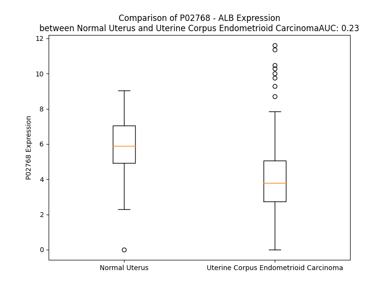

# Detailed Data for P02768

## Introduction to the Detailed Summary

### How to Interpret the Results

- **Summary & Metrics**: This section provides a quick reference to essential protein attributes, including expression changes, family classification, and biomarker applications. Regulation status (upregulated/downregulated) indicates the protein's behavior in a disease context. Some information comes from the original excel file with the proteins selected from literature, while others are derived from the analyses.
- **Expression Comparison**: A visual representation comparing protein expression between normal and disease states. It highlights significant changes in expression levels that might indicate diagnostic or therapeutic relevance. This is data coming from transcriptomics experiments and could not translate similarly to protein levels.
- **Isoform Alignment**: An interactive view of isoform alignments, revealing structural and functional differences between variants of the protein.
- **Interactors & Homologs**: Tables listing known interaction partners and homologous proteins, the more interactors and homologs, the more complex the protein is to design an antibody for.
- **Biological Assemblies**: Information about the structural arrangement of the protein in different assemblies, providing insights into its functional state but also the complexity of the protein to develop antibodies.
- **Combined Per-Residue Information**: A detailed table summarizing residue-level data. This includes predictions for epitope regions, aggregation tendencies, and modifications that might impact the protein's function. Each row corresponds to a residue in the protein, providing insights into specific sites that may be important for research or drug development.
## Summary & Metrics

- **UniProt Accession**: P02768
- **Gene Name**: ALB
- **Protein Name**: human serum albumin precursor
- **Swiss Prot**: ALBU_HUMAN
- **Family**: transporter
- **Biomarker Application**: diagnosis,efficacy,prognosis,safety,unspecified application
- **Number of Isoforms**: 3
- **Regulation**: 1
- **(transcriptomics) AUC**: 0.26
- **(transcriptomics) Fold Change**: 1.45
- **(transcriptomics) Regulation**: Downregulated
- **Discotope Epitope Count**: 125
- **Max n_uniprots (Homo)**: 3.0
- **Max n_uniprots (Hetero)**: 6.0

## Expression Comparison

## Isoform Alignment

<pre style='font-size:14px; font-family:monospace;'>P02768-1 MKWVTFISLLFLFSSAYSRGVFRRDAHKSEVAHRFKDLGEENFKALVLIAFAQYLQQCPFEDHVKLVNEVTEFAKTCVADESAENCDKSLHTLFGDKLCTVATLRETYGEMADCCAKQEPERNECFLQHKDDNPNLPRLVRPEVDVMCTAFHDNEETFLKKYLYEIARRHPYFYAPELLFFAKRYKAAFTECCQAADKAACLLPKLDELRDEGKASSAKQRLKCASLQKFGERAFKAWAVARLSQRFPKAEFAEVSKLVTDLTKVHTECCHGDLLECADDRADLAKYICENQDSISSKLKECCEKPLLEKSHCIAEVENDEMPADLPSLAADFVESKDVCKNYAEAKDVFLGMFLYEYARRHPDYSVVLLLRLAKTYETTLEKCCAAADPHECYAKVFDEFKPLVEEPQNLIKQNCELFEQLGEYKFQNALLVRYTKKVPQVSTPTLVEVSRNLGKVGSKCCKHPEAKRMPCAEDYLSVVLNQLCVLHEKTPVSDRVTKCCTESLVNRRPCFSALEVDETYVPKEFNAETFTFHADICTLSEKERQIKKQTALVELVKHKPKATKEQLKAVMDDFAAFVEKCCKADDKETCFAEEGKKLVAASQAALGL
P02768-2 MKWVTFISLLFLFSSAYSRGVFRRDAHKSEVAHRFKDLGEEN------------------------------------------------------------------------------------------------------------------------------------------------------------------------------------------------FKAWAVARLSQRFPKAEFAEVSKLVTDLTKVHTECCHGDLLECADDRADLAKYICENQDSISSKLKECCEKPLLEKSHCIAEVENDEMPADLPSLAADFVESKDVCKNYAEAKDVFLGMFLYEYARRHPDYSVVLLLRLAKTYETTLEKCCAAADPHECYAKVFDEFKPLVEEPQNLIKQNCELFEQLGEYKFQNALLVRYTKKVPQVSTPTLVEVSRNLGKVGSKCCKHPEAKRMPCAEDYLSVVLNQLCVLHEKTPVSDRVTKCCTESLVNRRPCFSALEVDETYVPKEFNAETFTFHADICTLSEKERQIKKQTALVELVKHKPKATKEQLKAVMDDFAAFVEKCCKADDKETCFAEEGKKLVAASQAALGL
P02768-3 MKWVTFISLLFLFSSAYSRGVFRRDAHKSEVAHRFKDLGEENFKALVLIAFAQYLQQCPFEDHVKLVNEVTEFAKTCVADESAENCDKSLHTLFGDKLCTVATLRETYGEMADCCAKQEPERNECFLQHKDDNPNLPRLVRPEVDVMCTAFHDNEETFLKKYLYE---------------------------------------------------------------------------------------------------------------------------------------------------------------------------------------------------------------------TTLEKCCAAADPHECYAKVFDEFKPLVEEPQNLIKQNCELFEQLGEYKFQNALLVRYTKKVPQVSTPTLVEVSRNLGKVGSKCCKHPEAKRMPCAEDYLSVVLNQLCVLHEKTPVSDRVTKCCTESLVNRRPCFSALEVDETYVPKEFNAETFTFHADICTLSEKERQIKKQTALVELVKHKPKATKEQLKAVMDDFAAFVEKCCKADDKETCFAEEGKKLVAASQAALGL
</pre>

## Interactors

| preferredName_A   | preferredName_B   |   score |
|:------------------|:------------------|--------:|
| ALB               | FCGRT             |   0.999 |
| ALB               | INS               |   0.999 |
| ALB               | AHSG              |   0.999 |
| ALB               | ORM1              |   0.998 |
| ALB               | APOA1             |   0.998 |
| ALB               | SERPINA1          |   0.998 |
| ALB               | ORM2              |   0.998 |
| ALB               | FN1               |   0.998 |
| ALB               | LALBA             |   0.997 |
| ALB               | SHBG              |   0.996 |
| ALB               | LTF               |   0.996 |
| ALB               | HP                |   0.995 |
| ALB               | TTR               |   0.994 |
| ALB               | LRP2              |   0.994 |
| ALB               | CUBN              |   0.992 |
| ALB               | MB                |   0.992 |
| ALB               | SPARC             |   0.991 |
| ALB               | F2                |   0.99  |
| ALB               | VTN               |   0.988 |
| ALB               | B2M               |   0.987 |
| ALB               | CYCS              |   0.986 |
| ALB               | HPX               |   0.981 |
| ALB               | A2M               |   0.98  |
| ALB               | GC                |   0.98  |
| ALB               | MYOM2             |   0.98  |
| ALB               | FGA               |   0.975 |
| ALB               | AMBP              |   0.97  |
| ALB               | PLG               |   0.963 |
| ALB               | APOA2             |   0.962 |
| ALB               | KNG1              |   0.962 |
| ALB               | C3                |   0.959 |
| ALB               | APOE              |   0.953 |
| ALB               | APOB              |   0.951 |
| ALB               | FGG               |   0.945 |
| ALB               | SERPINA7          |   0.945 |
| ALB               | PXDN              |   0.938 |
| ALB               | PXDNL             |   0.937 |
| ALB               | CP                |   0.936 |
| ALB               | GH1               |   0.936 |
| ALB               | APOH              |   0.933 |
| ALB               | SERPINC1          |   0.933 |
| ALB               | GPT               |   0.928 |
| ALB               | CRP               |   0.928 |
| ALB               | AFP               |   0.927 |
| ALB               | IL6               |   0.926 |
| ALB               | SERPINA3          |   0.914 |
| ALB               | ACE               |   0.912 |
| ALB               | BCHE              |   0.912 |
| ALB               | APOC3             |   0.912 |
| ALB               | TG                |   0.912 |

## Homologs

| uniprot_id   | gene_id   |
|:-------------|:----------|
| P43652       | AFM       |
| J3KMX3       | AFP       |
| P02774       | GC        |

## Biological Assemblies

|   Unnamed: 0 |   assembly |   n_uniprots | composition   | crystal_id   |
|-------------:|-----------:|-------------:|:--------------|:-------------|
|            0 |          1 |            1 | Homo          | 4g03         |
|            1 |          2 |            1 | Homo          | 4g03         |
|            2 |          3 |            2 | Homo          | 4g03         |
|            0 |          1 |            1 | Homo          | 5ijf         |
|            0 |          1 |            1 | Homo          | 2bxh         |
|            1 |          2 |            1 | Homo          | 2bxh         |
|            0 |          1 |            1 | Homo          | 7wkz         |
|            1 |          2 |            1 | Homo          | 7wkz         |
|            0 |          1 |            1 | Homo          | 2xvv         |
|            0 |          1 |            1 | Homo          | 1uor         |
|            0 |          1 |            1 | Homo          | 2xvw         |
|            0 |          1 |            1 | Homo          | 5giy         |
|            0 |          1 |            1 | Homo          | 1e7i         |
|            0 |          1 |            1 | Homo          | 1ha2         |
|            0 |          1 |            1 | Homo          | 2bxk         |
|            0 |          1 |            1 | Homo          | 1hk2         |
|            0 |          1 |            1 | Homo          | 8rgl         |
|            1 |          2 |            1 | Homo          | 8rgl         |
|            0 |          1 |            1 | Homo          | 1e7a         |
|            1 |          2 |            1 | Homo          | 1e7a         |
|            0 |          1 |            1 | Homo          | 5yoq         |
|            1 |          2 |            1 | Homo          | 5yoq         |
|            0 |          1 |            1 | Homo          | 3b9m         |
|            0 |          1 |            1 | Homo          | 4la0         |
|            1 |          2 |            1 | Homo          | 4la0         |
|            0 |          1 |            1 | Homo          | 5yb1         |
|            1 |          2 |            1 | Homo          | 5yb1         |
|            0 |          1 |            1 | Homo          | 8cks         |
|            0 |          1 |            1 | Homo          | 1hk3         |
|            0 |          1 |            1 | Homo          | 6a7p         |
|            1 |          2 |            1 | Homo          | 6a7p         |
|            0 |          1 |            1 | Homo          | 2vuf         |
|            1 |          2 |            1 | Homo          | 2vuf         |
|            0 |          1 |            1 | Homo          | 1ysx         |
|            0 |          1 |            1 | Homo          | 2bxb         |
|            1 |          2 |            1 | Homo          | 2bxb         |
|            0 |          1 |            1 | Homo          | 4s1y         |
|            0 |          1 |            1 | Homo          | 7ffr         |
|            0 |          1 |            3 | Hetero        | 4n0f         |
|            1 |          2 |            3 | Hetero        | 4n0f         |
|            2 |          3 |            3 | Hetero        | 4n0f         |
|            3 |          4 |            3 | Hetero        | 4n0f         |
|            0 |          1 |            1 | Homo          | 2n0x         |
|            0 |          1 |            1 | Homo          | 6ezq         |
|            0 |          1 |            1 | Homo          | 8q3f         |
|            0 |          1 |            1 | Homo          | 3jry         |
|            1 |          2 |            1 | Homo          | 3jry         |
|            0 |          1 |            1 | Homo          | 6r7s         |
|            0 |          1 |            2 | Hetero        | 1tf0         |
|            0 |          1 |            1 | Homo          | 7eek         |
|            1 |          2 |            1 | Homo          | 7eek         |
|            0 |          1 |            1 | Homo          | 7dl4         |
|            0 |          1 |            1 | Homo          | 7djn         |
|            1 |          2 |            1 | Homo          | 7djn         |
|            0 |          1 |            1 | Homo          | 4bke         |
|            0 |          1 |            1 | Homo          | 1e7f         |
|            0 |          1 |            1 | Homo          | 4lb9         |
|            0 |          1 |            1 | Homo          | 2bxi         |
|            0 |          1 |            4 | Hetero        | 4n0u         |
|            0 |          1 |            1 | Homo          | 2xvu         |
|            1 |          2 |            1 | Homo          | 2xvu         |
|            0 |          1 |            1 | Homo          | 6m5d         |
|            0 |          1 |            1 | Homo          | 3a73         |
|            1 |          2 |            1 | Homo          | 3a73         |
|            0 |          1 |            1 | Homo          | 3lu6         |
|            1 |          2 |            1 | Homo          | 3lu6         |
|            0 |          1 |            1 | Homo          | 2xw1         |
|            1 |          2 |            1 | Homo          | 2xw1         |
|            0 |          1 |            1 | Homo          | 1e78         |
|            1 |          2 |            1 | Homo          | 1e78         |
|            0 |          1 |            1 | Homo          | 6zl1         |
|            1 |          2 |            1 | Homo          | 6zl1         |
|            0 |          1 |            1 | Homo          | 8ey5         |
|            0 |          1 |            1 | Homo          | 1h9z         |
|            0 |          1 |            1 | Homo          | 2i2z         |
|            0 |          1 |            1 | Homo          | 4z69         |
|            1 |          2 |            1 | Homo          | 4z69         |
|            0 |          1 |            1 | Homo          | 4e99         |
|            0 |          1 |            1 | Homo          | 8itr         |
|            0 |          1 |            1 | Homo          | 1hk4         |
|            0 |          1 |            1 | Homo          | 2bxm         |
|            0 |          1 |            1 | Homo          | 1e7b         |
|            1 |          2 |            1 | Homo          | 1e7b         |
|            0 |          1 |            1 | Homo          | 1bm0         |
|            1 |          2 |            1 | Homo          | 1bm0         |
|            0 |          1 |            1 | Homo          | 1bke         |
|            0 |          1 |            3 | Hetero        | 6qip         |
|            0 |          1 |            1 | Homo          | 1bj5         |
|            0 |          1 |            1 | Homo          | 6wuw         |
|            1 |          2 |            1 | Homo          | 6wuw         |
|            0 |          1 |            1 | Homo          | 4l9k         |
|            1 |          2 |            1 | Homo          | 4l9k         |
|            0 |          1 |            1 | Homo          | 2bxl         |
|            0 |          1 |            1 | Homo          | 2bxp         |
|            0 |          1 |            1 | Homo          | 2vue         |
|            1 |          2 |            1 | Homo          | 2vue         |
|            0 |          1 |            1 | Homo          | 3lu8         |
|            1 |          2 |            1 | Homo          | 3lu8         |
|            0 |          1 |            1 | Homo          | 1e7c         |
|            0 |          1 |            1 | Homo          | 8h0o         |
|            0 |          1 |            1 | Homo          | 4iw1         |
|            0 |          1 |            1 | Homo          | 1o9x         |
|            0 |          1 |            1 | Homo          | 6m5e         |
|            1 |          2 |            1 | Homo          | 6m5e         |
|            2 |          3 |            1 | Homo          | 6m5e         |
|            0 |          1 |            1 | Homo          | 3b9l         |
|            0 |          1 |            1 | Homo          | 4k2c         |
|            1 |          2 |            1 | Homo          | 4k2c         |
|            0 |          1 |            1 | Homo          | 8j8e         |
|            1 |          2 |            1 | Homo          | 8j8e         |
|            0 |          1 |            1 | Homo          | 3uiv         |
|            1 |          2 |            1 | Homo          | 3uiv         |
|            0 |          1 |            1 | Homo          | 6yg9         |
|            0 |          1 |            1 | Homo          | 7d6j         |
|            1 |          2 |            1 | Homo          | 7d6j         |
|            0 |          1 |            1 | Homo          | 2bxd         |
|            1 |          2 |            1 | Homo          | 2bxd         |
|            0 |          1 |            1 | Homo          | 1gnj         |
|            0 |          1 |            3 | Hetero        | 4k71         |
|            1 |          2 |            3 | Hetero        | 4k71         |
|            2 |          3 |            6 | Hetero        | 4k71         |
|            0 |          1 |            1 | Homo          | 2i30         |
|            0 |          1 |            1 | Homo          | 2bxq         |
|            0 |          1 |            1 | Homo          | 2esg         |
|            0 |          1 |            1 | Homo          | 2bxg         |
|            1 |          2 |            1 | Homo          | 2bxg         |
|            0 |          1 |            1 | Homo          | 4hgk         |
|            1 |          2 |            1 | Homo          | 4hgk         |
|            0 |          1 |            1 | Homo          | 7x7x         |
|            1 |          2 |            1 | Homo          | 7x7x         |
|            0 |          1 |            1 | Homo          | 8itt         |
|            1 |          2 |            1 | Homo          | 8itt         |
|            0 |          1 |            1 | Homo          | 2bxo         |
|            0 |          1 |            1 | Homo          | 1hk1         |
|            0 |          1 |            1 | Homo          | 2bxa         |
|            1 |          2 |            1 | Homo          | 2bxa         |
|            0 |          1 |            1 | Homo          | 3tdl         |
|            0 |          1 |            1 | Homo          | 6l4k         |
|            1 |          2 |            1 | Homo          | 6l4k         |
|            0 |          1 |            1 | Homo          | 2bxc         |
|            1 |          2 |            1 | Homo          | 2bxc         |
|            0 |          1 |            1 | Homo          | 6xv0         |
|            0 |          1 |            1 | Homo          | 8ew7         |
|            0 |          1 |            1 | Homo          | 8rco         |
|            1 |          2 |            1 | Homo          | 8rco         |
|            0 |          1 |            1 | Homo          | 6m4r         |
|            1 |          2 |            1 | Homo          | 6m4r         |
|            0 |          1 |            2 | Hetero        | 2vdb         |
|            0 |          1 |            2 | Homo          | 3jqz         |
|            0 |          1 |            1 | Homo          | 1e7g         |
|            0 |          1 |            1 | Homo          | 7qfe         |
|            0 |          1 |            1 | Homo          | 4emx         |
|            1 |          2 |            1 | Homo          | 4emx         |
|            0 |          1 |            1 | Homo          | 1hk5         |
|            0 |          1 |            1 | Homo          | 4hgm         |
|            0 |          1 |            1 | Homo          | 1e7h         |
|            0 |          1 |            1 | Homo          | 7vr0         |
|            0 |          1 |            1 | Homo          | 7wz9         |
|            0 |          1 |            1 | Homo          | 1ao6         |
|            1 |          2 |            1 | Homo          | 1ao6         |
|            0 |          1 |            1 | Homo          | 1e7e         |
|            0 |          1 |            1 | Homo          | 7wlf         |
|            0 |          1 |            1 | Homo          | 1n5u         |
|            0 |          1 |            1 | Homo          | 5ujb         |
|            1 |          2 |            1 | Homo          | 5ujb         |
|            0 |          1 |            1 | Homo          | 3lu7         |
|            1 |          2 |            1 | Homo          | 3lu7         |
|            0 |          1 |            1 | Homo          | 5vnw         |
|            1 |          2 |            1 | Homo          | 5vnw         |
|            0 |          1 |            1 | Homo          | 7jwn         |
|            0 |          1 |            1 | Homo          | 7y2d         |
|            0 |          1 |            3 | Hetero        | 6qio         |
|            0 |          1 |            1 | Homo          | 2bxe         |
|            1 |          2 |            1 | Homo          | 2bxe         |
|            0 |          1 |            1 | Homo          | 2bx8         |
|            1 |          2 |            1 | Homo          | 2bx8         |
|            0 |          1 |            1 | Homo          | 8rgk         |
|            1 |          2 |            1 | Homo          | 8rgk         |
|            0 |          1 |            1 | Homo          | 4g04         |
|            1 |          2 |            1 | Homo          | 4g04         |
|            2 |          3 |            2 | Homo          | 4g04         |
|            0 |          1 |            1 | Homo          | 3sqj         |
|            1 |          2 |            1 | Homo          | 3sqj         |
|            0 |          1 |            1 | Homo          | 2xw0         |
|            1 |          2 |            1 | Homo          | 2xw0         |
|            0 |          1 |            1 | Homo          | 4lb2         |
|            1 |          2 |            1 | Homo          | 4lb2         |
|            0 |          1 |            1 | Homo          | 6je7         |
|            0 |          1 |            1 | Homo          | 2bxn         |
|            0 |          1 |            1 | Homo          | 7vr9         |
|            1 |          2 |            1 | Homo          | 7vr9         |
|            0 |          1 |            1 | Homo          | 4l9q         |
|            1 |          2 |            1 | Homo          | 4l9q         |
|            0 |          1 |            1 | Homo          | 5x52         |
|            1 |          2 |            1 | Homo          | 5x52         |
|            0 |          1 |            1 | Homo          | 8ism         |
|            0 |          1 |            1 | Homo          | 8a9q         |
|            1 |          2 |            1 | Homo          | 8a9q         |
|            0 |          1 |            1 | Homo          | 1gni         |
|            0 |          1 |            1 | Homo          | 8rcp         |
|            1 |          2 |            1 | Homo          | 8rcp         |
|            0 |          1 |            1 | Homo          | 5id7         |
|            1 |          2 |            1 | Homo          | 5id7         |
|            0 |          1 |            1 | Homo          | 8oi2         |
|            0 |          1 |            1 | Homo          | 4l8u         |
|            0 |          1 |            1 | Homo          | 7z57         |
|            0 |          1 |            1 | Homo          | 2xsi         |
|            0 |          1 |            1 | Homo          | 7ffs         |
|            0 |          1 |            1 | Homo          | 5ifo         |
|            0 |          1 |            3 | Homo          | 5z0b         |
|            0 |          1 |            1 | Homo          | 2xvq         |
|            1 |          2 |            1 | Homo          | 2xvq         |
|            0 |          1 |            1 | Homo          | 2bxf         |
|            1 |          2 |            1 | Homo          | 2bxf         |
|            0 |          1 |            1 | Homo          | 2ydf         |
|            1 |          2 |            1 | Homo          | 2ydf         |
|            0 |          1 |            1 | Homo          | 5fuo         |
|            0 |          1 |            1 | Homo          | 8ew4         |
|            0 |          1 |            1 | Homo          | 6m58         |
|            1 |          2 |            1 | Homo          | 6m58         |
|            0 |          1 |            1 | Homo          | 7wok         |
|            1 |          2 |            1 | Homo          | 7wok         |
|            0 |          1 |            1 | Homo          | 7woj         |
|            0 |          1 |            1 | Homo          | 5gix         |
|            1 |          2 |            1 | Homo          | 5gix         |
|            0 |          1 |            1 | Homo          | 3cx9         |
|            0 |          1 |            1 | Homo          | 4iw2         |

## Combined Per-Residue Information

|   res | aa   |   epitope_score | epitope   |   relative_surface_accessibility |   modeling_confidence |   Aggregation | modification                | glycosylation                                         |
|------:|:-----|----------------:|:----------|---------------------------------:|----------------------:|--------------:|:----------------------------|:------------------------------------------------------|
|     1 | M    |         0.11977 | False     |                          1.14472 |                 41.32 |         0     | N/A                         | N/A                                                   |
|     2 | K    |         0.14869 | True      |                          0.91759 |                 46.28 |         0     | N/A                         | N/A                                                   |
|     3 | W    |         0.15441 | True      |                          0.72565 |                 38.45 |        54.86  | N/A                         | N/A                                                   |
|     4 | V    |         0.13197 | True      |                          0.73951 |                 43.49 |        81.708 | N/A                         | N/A                                                   |
|     5 | T    |         0.11352 | False     |                          0.6039  |                 45.31 |        87.95  | N/A                         | N/A                                                   |
|     6 | F    |         0.09895 | False     |                          0.5939  |                 44.47 |        98.438 | N/A                         | N/A                                                   |
|     7 | I    |         0.1523  | True      |                          0.34218 |                 48.9  |        99.293 | N/A                         | N/A                                                   |
|     8 | S    |         0.06888 | False     |                          0.44481 |                 42.33 |        99.356 | N/A                         | N/A                                                   |
|     9 | L    |         0.08976 | False     |                          0.62638 |                 45.95 |        99.936 | N/A                         | N/A                                                   |
|    10 | L    |         0.06017 | False     |                          0.34342 |                 49.08 |        99.936 | N/A                         | N/A                                                   |
|    11 | F    |         0.12499 | False     |                          0.43859 |                 44    |        99.843 | N/A                         | N/A                                                   |
|    12 | L    |         0.14703 | True      |                          0.78749 |                 40.17 |        98.685 | N/A                         | N/A                                                   |
|    13 | F    |         0.11813 | False     |                          0.73123 |                 38.98 |        92.357 | N/A                         | N/A                                                   |
|    14 | S    |         0.08067 | False     |                          0.49919 |                 40.75 |        14.265 | N/A                         | N/A                                                   |
|    15 | S    |         0.14684 | True      |                          0.69397 |                 40.83 |         4.566 | N/A                         | N/A                                                   |
|    16 | A    |         0.11485 | False     |                          0.51046 |                 35.04 |         3.345 | N/A                         | N/A                                                   |
|    17 | Y    |         0.10705 | False     |                          0.53637 |                 39.19 |         2.312 | N/A                         | N/A                                                   |
|    18 | S    |         0.07307 | False     |                          0.67342 |                 32.31 |         0.255 | N/A                         | N/A                                                   |
|    19 | R    |         0.15289 | True      |                          0.97338 |                 32.51 |         0     | N/A                         | N/A                                                   |
|    20 | G    |         0.22357 | True      |                          0.97956 |                 34.5  |         0     | N/A                         | N/A                                                   |
|    21 | V    |         0.06502 | False     |                          0.49237 |                 30.13 |         0     | N/A                         | N/A                                                   |
|    22 | F    |         0.11062 | False     |                          0.6401  |                 31.54 |         0     | N/A                         | N/A                                                   |
|    23 | R    |         0.14465 | True      |                          0.85243 |                 35.67 |         0     | N/A                         | N/A                                                   |
|    24 | R    |         0.15222 | True      |                          0.82037 |                 33.09 |         0     | N/A                         | N/A                                                   |
|    25 | D    |         0.15749 | True      |                          0.83183 |                 41.49 |         0     | N/A                         | N/A                                                   |
|    26 | A    |         0.10674 | False     |                          0.52344 |                 57.84 |         0     | N/A                         | N/A                                                   |
|    27 | H    |         0.14647 | True      |                          0.52007 |                 72.2  |         0     | N/A                         | N/A                                                   |
|    28 | K    |         0.12407 | False     |                          0.81151 |                 82.06 |         0     | N/A                         | N/A                                                   |
|    29 | S    |         0.02523 | False     |                          0.00538 |                 91.38 |         0     | Phosphoserine; by FAM20C    | N/A                                                   |
|    30 | E    |         0.04574 | False     |                          0.22562 |                 92.59 |         0     | N/A                         | N/A                                                   |
|    31 | V    |         0.00649 | False     |                          0.00286 |                 93.93 |         0     | N/A                         | N/A                                                   |
|    32 | A    |         0.00366 | False     |                          0       |                 95.13 |         0     | N/A                         | N/A                                                   |
|    33 | H    |         0.09031 | False     |                          0.19584 |                 94.69 |         0     | N/A                         | N/A                                                   |
|    34 | R    |         0.03808 | False     |                          0.0768  |                 94.97 |         0     | N/A                         | N/A                                                   |
|    35 | F    |         0.04372 | False     |                          0.11463 |                 95.61 |         0     | N/A                         | N/A                                                   |
|    36 | K    |         0.22002 | True      |                          0.53661 |                 94.97 |         0     | N/A                         | N-linked (Glc) (glycation) lysine                     |
|    37 | D    |         0.18009 | True      |                          0.50199 |                 93.68 |         0     | N/A                         | N/A                                                   |
|    38 | L    |         0.04016 | False     |                          0.11937 |                 94.05 |         0     | N/A                         | N/A                                                   |
|    39 | G    |         0.13013 | True      |                          0.3626  |                 95.21 |         0     | N/A                         | N/A                                                   |
|    40 | E    |         0.05575 | False     |                          0.33456 |                 96    |         0     | N/A                         | N/A                                                   |
|    41 | E    |         0.11863 | False     |                          0.76215 |                 94.64 |         0.038 | N/A                         | N/A                                                   |
|    42 | N    |         0.02504 | False     |                          0.2733  |                 95.47 |         0.038 | N/A                         | N/A                                                   |
|    43 | F    |         0.00186 | False     |                          0       |                 97.55 |         0.038 | N/A                         | N/A                                                   |
|    44 | K    |         0.04644 | False     |                          0.20675 |                 97.64 |         0.038 | N/A                         | N/A                                                   |
|    45 | A    |         0.0161  | False     |                          0.13119 |                 97.83 |        36.134 | N/A                         | N/A                                                   |
|    46 | L    |         0.00205 | False     |                          0.00365 |                 98.24 |        77.375 | N/A                         | N/A                                                   |
|    47 | V    |         0.00284 | False     |                          0.00381 |                 98.03 |        97.198 | N/A                         | N/A                                                   |
|    48 | L    |         0.00586 | False     |                          0.01237 |                 98.6  |        98.24  | N/A                         | N/A                                                   |
|    49 | I    |         0.00158 | False     |                          0       |                 98.63 |        98.332 | N/A                         | N/A                                                   |
|    50 | A    |         0.00624 | False     |                          0.01275 |                 98.19 |        97.11  | N/A                         | N/A                                                   |
|    51 | F    |         0.00515 | False     |                          0.00828 |                 98.01 |        94.85  | N/A                         | N/A                                                   |
|    52 | A    |         0.00089 | False     |                          0       |                 98.2  |        59.479 | N/A                         | N/A                                                   |
|    53 | Q    |         0.0027  | False     |                          0.00555 |                 98.45 |        28.623 | N/A                         | N/A                                                   |
|    54 | Y    |         0.03796 | False     |                          0.05626 |                 97.62 |        27.411 | N/A                         | N/A                                                   |
|    55 | L    |         0.003   | False     |                          0.00165 |                 97.19 |        23.327 | N/A                         | N/A                                                   |
|    56 | Q    |         0.01839 | False     |                          0.02764 |                 97.83 |         1.004 | N/A                         | N/A                                                   |
|    57 | Q    |         0.04178 | False     |                          0.39512 |                 96.24 |         0.037 | N/A                         | N/A                                                   |
|    58 | C    |         0.02759 | False     |                          0.02705 |                 94.41 |         0     | N/A                         | N/A                                                   |
|    59 | P    |         0.0825  | False     |                          0.49207 |                 95.01 |         0     | N/A                         | N/A                                                   |
|    60 | F    |         0.03397 | False     |                          0.09211 |                 96.63 |         0     | N/A                         | N/A                                                   |
|    61 | E    |         0.15661 | True      |                          0.57894 |                 95.85 |         0     | N/A                         | N/A                                                   |
|    62 | D    |         0.09959 | False     |                          0.39855 |                 95.23 |         0     | N/A                         | N/A                                                   |
|    63 | H    |         0.00575 | False     |                          0.00136 |                 96.92 |         0     | N/A                         | N/A                                                   |
|    64 | V    |         0.0369  | False     |                          0.24563 |                 96.58 |         0     | N/A                         | N/A                                                   |
|    65 | K    |         0.20651 | True      |                          0.65129 |                 95.89 |         0     | N/A                         | N/A                                                   |
|    66 | L    |         0.03882 | False     |                          0.08244 |                 96.21 |         0     | N/A                         | N/A                                                   |
|    67 | V    |         0.01174 | False     |                          0.02856 |                 97.15 |         0     | N/A                         | N/A                                                   |
|    68 | N    |         0.14519 | True      |                          0.41183 |                 96.69 |         0     | N/A                         | N/A                                                   |
|    69 | E    |         0.10926 | False     |                          0.31874 |                 95.97 |         0     | N/A                         | N/A                                                   |
|    70 | V    |         0.0228  | False     |                          0.04094 |                 96.45 |         0     | N/A                         | N/A                                                   |
|    71 | T    |         0.01363 | False     |                          0.00381 |                 96.92 |         0     | N/A                         | N/A                                                   |
|    72 | E    |         0.18503 | True      |                          0.49729 |                 97    |         0     | N/A                         | N/A                                                   |
|    73 | F    |         0.11465 | False     |                          0.26962 |                 96.52 |         0     | N/A                         | N/A                                                   |
|    74 | A    |         0.00271 | False     |                          0       |                 96.79 |         0     | N/A                         | N/A                                                   |
|    75 | K    |         0.11749 | False     |                          0.33975 |                 97.17 |         0     | N/A                         | N-linked (Glc) (glycation) lysine; in vitro           |
|    76 | T    |         0.1753  | True      |                          0.50289 |                 96.82 |         0     | N/A                         | N/A                                                   |
|    77 | C    |         0.00412 | False     |                          0       |                 96.65 |         0     | N/A                         | N/A                                                   |
|    78 | V    |         0.09241 | False     |                          0.35501 |                 95.93 |         0     | N/A                         | N/A                                                   |
|    79 | A    |         0.2049  | True      |                          0.86769 |                 96.18 |         0     | N/A                         | N/A                                                   |
|    80 | D    |         0.26843 | True      |                          0.43309 |                 94.98 |         0     | N/A                         | N/A                                                   |
|    81 | E    |         0.16814 | True      |                          0.3108  |                 93.18 |         0     | N/A                         | N/A                                                   |
|    82 | S    |         0.28916 | True      |                          0.78768 |                 92.25 |         0     | Phosphoserine; by FAM20C    | N/A                                                   |
|    83 | A    |         0.10528 | False     |                          0.26729 |                 93.22 |         0     | N/A                         | N/A                                                   |
|    84 | E    |         0.40542 | True      |                          0.76266 |                 92.11 |         0     | N/A                         | N/A                                                   |
|    85 | N    |         0.12337 | False     |                          0.30872 |                 93.07 |         0     | N/A                         | N/A                                                   |
|    86 | C    |         0.00586 | False     |                          0.00187 |                 94.23 |         0     | N/A                         | N/A                                                   |
|    87 | D    |         0.27445 | True      |                          0.70464 |                 92.85 |         0     | N/A                         | N/A                                                   |
|    88 | K    |         0.15364 | True      |                          0.32935 |                 92.9  |         0     | N/A                         | N/A                                                   |
|    89 | S    |         0.13702 | True      |                          0.32123 |                 91.88 |         0     | Phosphoserine; by FAM20C    | N/A                                                   |
|    90 | L    |         0.05033 | False     |                          0.09259 |                 92.42 |         0.276 | N/A                         | N/A                                                   |
|    91 | H    |         0.0494  | False     |                          0.25073 |                 92.07 |         0.276 | N/A                         | N/A                                                   |
|    92 | T    |         0.10797 | False     |                          0.23794 |                 93.77 |         0.276 | N/A                         | N/A                                                   |
|    93 | L    |         0.07131 | False     |                          0.11835 |                 93.9  |         0.276 | N/A                         | N/A                                                   |
|    94 | F    |         0.00963 | False     |                          0.09003 |                 93.95 |         0.276 | N/A                         | N/A                                                   |
|    95 | G    |         0.02067 | False     |                          0.04785 |                 94.51 |         0     | N/A                         | N/A                                                   |
|    96 | D    |         0.11044 | False     |                          0.30561 |                 95.26 |         0     | N/A                         | N/A                                                   |
|    97 | K    |         0.06429 | False     |                          0.2612  |                 94.48 |         0     | N/A                         | N/A                                                   |
|    98 | L    |         0.01909 | False     |                          0.0272  |                 94.6  |         9.768 | N/A                         | N/A                                                   |
|    99 | C    |         0.05331 | False     |                          0.32373 |                 96.01 |         9.979 | N/A                         | N/A                                                   |
|   100 | T    |         0.21826 | True      |                          0.62355 |                 94.26 |        12.771 | N/A                         | N/A                                                   |
|   101 | V    |         0.10707 | False     |                          0.15976 |                 93.2  |        12.771 | N/A                         | N/A                                                   |
|   102 | A    |         0.16211 | True      |                          1.01305 |                 91.22 |        12.771 | N/A                         | N/A                                                   |
|   103 | T    |         0.11242 | False     |                          0.42636 |                 93.29 |        11.801 | N/A                         | N/A                                                   |
|   104 | L    |         0.02387 | False     |                          0.05111 |                 94.93 |        11.591 | N/A                         | N/A                                                   |
|   105 | R    |         0.26513 | True      |                          0.61701 |                 96.27 |         0     | N/A                         | N/A                                                   |
|   106 | E    |         0.25862 | True      |                          0.79176 |                 95.17 |         0     | N/A                         | N/A                                                   |
|   107 | T    |         0.13603 | True      |                          0.42525 |                 94.29 |         0     | Phosphothreonine; by FAM20C | N/A                                                   |
|   108 | Y    |         0.12446 | False     |                          0.17062 |                 95.1  |         0     | N/A                         | N/A                                                   |
|   109 | G    |         0.12983 | True      |                          0.43199 |                 95.47 |         0     | N/A                         | N/A                                                   |
|   110 | E    |         0.10309 | False     |                          0.69876 |                 94.59 |         0     | N/A                         | N/A                                                   |
|   111 | M    |         0.00824 | False     |                          0.00552 |                 96.31 |         0     | N/A                         | N/A                                                   |
|   112 | A    |         0.041   | False     |                          0.10792 |                 97.1  |         0     | N/A                         | N/A                                                   |
|   113 | D    |         0.28388 | True      |                          0.41623 |                 97.25 |         0     | N/A                         | N/A                                                   |
|   114 | C    |         0.0034  | False     |                          0       |                 97.87 |         0     | N/A                         | N/A                                                   |
|   115 | C    |         0.07185 | False     |                          0.31764 |                 97.52 |         0     | N/A                         | N/A                                                   |
|   116 | A    |         0.22468 | True      |                          0.90765 |                 96.61 |         0     | N/A                         | N/A                                                   |
|   117 | K    |         0.17226 | True      |                          0.47131 |                 97.35 |         0     | N/A                         | N/A                                                   |
|   118 | Q    |         0.21486 | True      |                          0.7605  |                 95.07 |         0     | N/A                         | N/A                                                   |
|   119 | E    |         0.13437 | True      |                          0.24883 |                 94.99 |         0     | N/A                         | N/A                                                   |
|   120 | P    |         0.17169 | True      |                          0.63223 |                 94.67 |         0     | N/A                         | N/A                                                   |
|   121 | E    |         0.211   | True      |                          0.48459 |                 96.44 |         0     | N/A                         | N/A                                                   |
|   122 | R    |         0.12132 | False     |                          0.08048 |                 97.6  |         0     | N/A                         | N/A                                                   |
|   123 | N    |         0.03499 | False     |                          0.07973 |                 96.76 |         0     | N/A                         | N/A                                                   |
|   124 | E    |         0.07451 | False     |                          0.46513 |                 96.1  |         0     | N/A                         | N/A                                                   |
|   125 | C    |         0.03665 | False     |                          0.11258 |                 97.71 |         0     | N/A                         | N/A                                                   |
|   126 | F    |         0.00792 | False     |                          0.01019 |                 97.79 |         0     | N/A                         | N/A                                                   |
|   127 | L    |         0.03586 | False     |                          0.08749 |                 96.39 |         0     | N/A                         | N/A                                                   |
|   128 | Q    |         0.12659 | False     |                          0.76132 |                 95.12 |         0     | N/A                         | N/A                                                   |
|   129 | H    |         0.10203 | False     |                          0.35546 |                 96.29 |         0     | N/A                         | N/A                                                   |
|   130 | K    |         0.01986 | False     |                          0.0718  |                 97.25 |         0     | N/A                         | N/A                                                   |
|   131 | D    |         0.05592 | False     |                          0.22631 |                 95.8  |         0     | N/A                         | N/A                                                   |
|   132 | D    |         0.01879 | False     |                          0.22718 |                 93.88 |         0     | N/A                         | N/A                                                   |
|   133 | N    |         0.05954 | False     |                          0.54915 |                 90.9  |         0     | N/A                         | N/A                                                   |
|   134 | P    |         0.03314 | False     |                          0.11873 |                 90.62 |         0     | N/A                         | N/A                                                   |
|   135 | N    |         0.08525 | False     |                          0.96711 |                 86.31 |         0     | N/A                         | N/A                                                   |
|   136 | L    |         0.06929 | False     |                          0.16454 |                 93.63 |         0     | N/A                         | N/A                                                   |
|   137 | P    |         0.10143 | False     |                          0.78002 |                 90.86 |         0     | N/A                         | N/A                                                   |
|   138 | R    |         0.13466 | True      |                          0.76216 |                 86.23 |         0     | N/A                         | N/A                                                   |
|   139 | L    |         0.12318 | False     |                          0.54726 |                 87.9  |         0     | N/A                         | N/A                                                   |
|   140 | V    |         0.12281 | False     |                          0.89047 |                 86.81 |         0     | N/A                         | N/A                                                   |
|   141 | R    |         0.13555 | True      |                          0.39818 |                 89.48 |         0     | N/A                         | N/A                                                   |
|   142 | P    |         0.13217 | True      |                          0.4958  |                 91.96 |         0     | N/A                         | N/A                                                   |
|   143 | E    |         0.16026 | True      |                          0.69846 |                 94.06 |         0     | N/A                         | N/A                                                   |
|   144 | V    |         0.04613 | False     |                          0.10788 |                 96.18 |         0     | N/A                         | N/A                                                   |
|   145 | D    |         0.19277 | True      |                          0.53295 |                 96.13 |         0     | N/A                         | N/A                                                   |
|   146 | V    |         0.14405 | True      |                          0.63139 |                 96.58 |         0.138 | N/A                         | N/A                                                   |
|   147 | M    |         0.08642 | False     |                          0.06168 |                 96.66 |         0.138 | N/A                         | N/A                                                   |
|   148 | C    |         0.01971 | False     |                          0.01702 |                 97.61 |         0.138 | N/A                         | N/A                                                   |
|   149 | T    |         0.22881 | True      |                          0.53391 |                 97.4  |         0.138 | N/A                         | N/A                                                   |
|   150 | A    |         0.06786 | False     |                          0.40516 |                 96.77 |         0.138 | N/A                         | N/A                                                   |
|   151 | F    |         0.03177 | False     |                          0.04559 |                 97.55 |         0.138 | N/A                         | N/A                                                   |
|   152 | H    |         0.18759 | True      |                          0.59778 |                 96.66 |         0     | N/A                         | N/A                                                   |
|   153 | D    |         0.27053 | True      |                          0.68647 |                 96.68 |         0     | N/A                         | N/A                                                   |
|   154 | N    |         0.17886 | True      |                          0.4815  |                 95.85 |         0     | N/A                         | N/A                                                   |
|   155 | E    |         0.09484 | False     |                          0.32399 |                 96.42 |         0     | N/A                         | N/A                                                   |
|   156 | E    |         0.10884 | False     |                          0.53014 |                 94.68 |         0     | N/A                         | N/A                                                   |
|   157 | T    |         0.08017 | False     |                          0.32669 |                 95.92 |         0     | N/A                         | N/A                                                   |
|   158 | F    |         0.07672 | False     |                          0.14125 |                 96.96 |         0     | N/A                         | N/A                                                   |
|   159 | L    |         0.03533 | False     |                          0.16982 |                 97.6  |         0     | N/A                         | N/A                                                   |
|   160 | K    |         0.0166  | False     |                          0.18435 |                 97.51 |         0     | N/A                         | N/A                                                   |
|   161 | K    |         0.04939 | False     |                          0.4618  |                 97.12 |         0     | N/A                         | N-linked (Glc) (glycation) lysine; in vitro           |
|   162 | Y    |         0.08884 | False     |                          0.16002 |                 97.1  |         0     | N/A                         | N/A                                                   |
|   163 | L    |         0.0085  | False     |                          0.04781 |                 98.46 |         0     | N/A                         | N/A                                                   |
|   164 | Y    |         0.02713 | False     |                          0.03167 |                 98.45 |         0     | N/A                         | N/A                                                   |
|   165 | E    |         0.03038 | False     |                          0.23635 |                 97.77 |         0     | N/A                         | N/A                                                   |
|   166 | I    |         0.02026 | False     |                          0.21039 |                 97.76 |         0     | N/A                         | N/A                                                   |
|   167 | A    |         0.00073 | False     |                          0       |                 98.52 |         0     | N/A                         | N/A                                                   |
|   168 | R    |         0.03561 | False     |                          0.10208 |                 97.99 |         0     | N/A                         | N/A                                                   |
|   169 | R    |         0.07695 | False     |                          0.16567 |                 97.55 |         0     | N/A                         | N/A                                                   |
|   170 | H    |         0.0256  | False     |                          0.27793 |                 97.64 |         0     | N/A                         | N/A                                                   |
|   171 | P    |         0.01078 | False     |                          0.01591 |                 98.08 |         0     | N/A                         | N/A                                                   |
|   172 | Y    |         0.01557 | False     |                          0.07693 |                 98.41 |         0     | N/A                         | N/A                                                   |
|   173 | F    |         0.01092 | False     |                          0.02943 |                 98.61 |         0     | N/A                         | N/A                                                   |
|   174 | Y    |         0.00985 | False     |                          0.07488 |                 98.29 |         0     | N/A                         | N/A                                                   |
|   175 | A    |         0.001   | False     |                          0       |                 98.19 |         0     | N/A                         | N/A                                                   |
|   176 | P    |         0.01187 | False     |                          0.02386 |                 97.59 |         0     | N/A                         | N/A                                                   |
|   177 | E    |         0.01409 | False     |                          0.05813 |                 98.2  |         0.067 | N/A                         | N/A                                                   |
|   178 | L    |         0.00234 | False     |                          0.00247 |                 98.44 |        71.242 | N/A                         | N/A                                                   |
|   179 | L    |         0.03276 | False     |                          0.07355 |                 98.17 |        71.242 | N/A                         | N/A                                                   |
|   180 | F    |         0.03783 | False     |                          0.0586  |                 97.82 |        71.242 | N/A                         | N/A                                                   |
|   181 | F    |         0.01005 | False     |                          0.02058 |                 98.15 |        71.242 | N/A                         | N/A                                                   |
|   182 | A    |         0.02084 | False     |                          0.08572 |                 97.96 |        71.242 | N/A                         | N/A                                                   |
|   183 | K    |         0.0564  | False     |                          0.43136 |                 96.98 |         0.067 | N/A                         | N/A                                                   |
|   184 | R    |         0.09123 | False     |                          0.29249 |                 97.35 |         0     | N/A                         | N/A                                                   |
|   185 | Y    |         0.05196 | False     |                          0.1408  |                 97.56 |         0     | N/A                         | N/A                                                   |
|   186 | K    |         0.07552 | False     |                          0.36945 |                 97.86 |         0     | N/A                         | N-linked (Glc) (glycation) lysine; in vitro           |
|   187 | A    |         0.10571 | False     |                          0.52471 |                 97.24 |         0     | N/A                         | N/A                                                   |
|   188 | A    |         0.02142 | False     |                          0.05103 |                 97.85 |         0     | N/A                         | N/A                                                   |
|   189 | F    |         0.00552 | False     |                          0       |                 98.3  |         0     | N/A                         | N/A                                                   |
|   190 | T    |         0.13424 | True      |                          0.44777 |                 97.69 |         0     | N/A                         | N/A                                                   |
|   191 | E    |         0.14298 | True      |                          0.49838 |                 97.27 |         0     | N/A                         | N/A                                                   |
|   192 | C    |         0.00661 | False     |                          0       |                 98.2  |         0     | N/A                         | N/A                                                   |
|   193 | C    |         0.02921 | False     |                          0.06514 |                 97.33 |         0     | N/A                         | N/A                                                   |
|   194 | Q    |         0.20257 | True      |                          0.72012 |                 94.57 |         0     | N/A                         | N/A                                                   |
|   195 | A    |         0.08979 | False     |                          0.31197 |                 95.61 |         0     | N/A                         | N/A                                                   |
|   196 | A    |         0.23277 | True      |                          1.14732 |                 94.86 |         0     | N/A                         | N/A                                                   |
|   197 | D    |         0.20904 | True      |                          0.52293 |                 96.07 |         0     | N/A                         | N/A                                                   |
|   198 | K    |         0.13583 | True      |                          0.3123  |                 97.44 |         0     | N/A                         | N/A                                                   |
|   199 | A    |         0.12166 | False     |                          0.37124 |                 96.1  |         0     | N/A                         | N/A                                                   |
|   200 | A    |         0.13893 | True      |                          0.63077 |                 96.88 |         0     | N/A                         | N/A                                                   |
|   201 | C    |         0.05742 | False     |                          0.21548 |                 97.94 |         0     | N/A                         | N/A                                                   |
|   202 | L    |         0.00442 | False     |                          0       |                 97.78 |         0     | N/A                         | N/A                                                   |
|   203 | L    |         0.11495 | False     |                          0.33469 |                 96.17 |         0     | N/A                         | N/A                                                   |
|   204 | P    |         0.18231 | True      |                          0.58636 |                 96.07 |         0     | N/A                         | N/A                                                   |
|   205 | K    |         0.08253 | False     |                          0.35088 |                 97.43 |         0     | N/A                         | N/A                                                   |
|   206 | L    |         0.09621 | False     |                          0.08702 |                 96.53 |         0     | N/A                         | N/A                                                   |
|   207 | D    |         0.12858 | True      |                          0.2802  |                 94.68 |         0     | N/A                         | N/A                                                   |
|   208 | E    |         0.15446 | True      |                          0.5059  |                 95.76 |         0     | N/A                         | N/A                                                   |
|   209 | L    |         0.03477 | False     |                          0.07219 |                 96.22 |         0     | N/A                         | N/A                                                   |
|   210 | R    |         0.10295 | False     |                          0.41926 |                 94.65 |         0     | N/A                         | N/A                                                   |
|   211 | D    |         0.10599 | False     |                          0.46709 |                 92.74 |         0     | N/A                         | N/A                                                   |
|   212 | E    |         0.03809 | False     |                          0.3306  |                 94.89 |         0     | N/A                         | N/A                                                   |
|   213 | G    |         0.01169 | False     |                          0.12571 |                 95.79 |         0     | N/A                         | N/A                                                   |
|   214 | K    |         0.04761 | False     |                          0.56349 |                 94.33 |         0     | N/A                         | N/A                                                   |
|   215 | A    |         0.02852 | False     |                          0.22589 |                 93.89 |         0     | N/A                         | N/A                                                   |
|   216 | S    |         0.0245  | False     |                          0.14173 |                 96.72 |         0     | N/A                         | N/A                                                   |
|   217 | S    |         0.00954 | False     |                          0.08649 |                 97.37 |         0     | N/A                         | N/A                                                   |
|   218 | A    |         0.01047 | False     |                          0.25813 |                 96.45 |         0     | N/A                         | N/A                                                   |
|   219 | K    |         0.03003 | False     |                          0.42908 |                 96.99 |         0     | N/A                         | N/A                                                   |
|   220 | Q    |         0.00467 | False     |                          0.02742 |                 98.05 |         0     | N/A                         | N/A                                                   |
|   221 | R    |         0.01521 | False     |                          0.09888 |                 98.04 |         0     | N/A                         | N/A                                                   |
|   222 | L    |         0.01405 | False     |                          0.15415 |                 97.52 |         0     | N/A                         | N/A                                                   |
|   223 | K    |         0.0256  | False     |                          0.2055  |                 97.84 |         0     | N/A                         | N-linked (Glc) (glycation) lysine; in vitro           |
|   224 | C    |         0.00234 | False     |                          0.00187 |                 98.04 |         0     | N/A                         | N/A                                                   |
|   225 | A    |         0.02003 | False     |                          0.05974 |                 96.2  |         0     | N/A                         | N/A                                                   |
|   226 | S    |         0.00761 | False     |                          0.0453  |                 95.4  |         0     | N/A                         | N/A                                                   |
|   227 | L    |         0.01979 | False     |                          0.10537 |                 96.12 |         0     | N/A                         | N/A                                                   |
|   228 | Q    |         0.0747  | False     |                          0.40168 |                 94.14 |         0     | N/A                         | N/A                                                   |
|   229 | K    |         0.10888 | False     |                          0.55122 |                 94.07 |         0     | N6-succinyllysine           | N/A                                                   |
|   230 | F    |         0.06677 | False     |                          0.25989 |                 94.88 |         0     | N/A                         | N/A                                                   |
|   231 | G    |         0.09942 | False     |                          0.37323 |                 94.22 |         0     | N/A                         | N/A                                                   |
|   232 | E    |         0.04447 | False     |                          0.44529 |                 95.6  |         0     | N/A                         | N/A                                                   |
|   233 | R    |         0.07681 | False     |                          0.5174  |                 94.3  |         0     | N/A                         | N/A                                                   |
|   234 | A    |         0.01428 | False     |                          0.22538 |                 94.43 |         0     | N/A                         | N/A                                                   |
|   235 | F    |         0.00331 | False     |                          0.01024 |                 96.42 |         0     | N/A                         | N/A                                                   |
|   236 | K    |         0.03465 | False     |                          0.33087 |                 97.68 |         0     | N/A                         | N/A                                                   |
|   237 | A    |         0.00734 | False     |                          0.2899  |                 97.77 |         0.252 | N/A                         | N/A                                                   |
|   238 | W    |         0.01952 | False     |                          0.2621  |                 97.84 |         0.252 | N/A                         | N/A                                                   |
|   239 | A    |         0.00196 | False     |                          0.00128 |                 97.96 |         0.252 | N/A                         | N/A                                                   |
|   240 | V    |         0.01591 | False     |                          0.09616 |                 98.59 |         0.252 | N/A                         | N/A                                                   |
|   241 | A    |         0.00102 | False     |                          0       |                 98.42 |         0.252 | N/A                         | N/A                                                   |
|   242 | R    |         0.02522 | False     |                          0.22323 |                 97.96 |         0     | N/A                         | N/A                                                   |
|   243 | L    |         0.01739 | False     |                          0.08408 |                 98.35 |         0     | N/A                         | N/A                                                   |
|   244 | S    |         0.00107 | False     |                          0       |                 98.48 |         0     | N/A                         | N/A                                                   |
|   245 | Q    |         0.00641 | False     |                          0.02003 |                 97.79 |         0     | N/A                         | N/A                                                   |
|   246 | R    |         0.0238  | False     |                          0.10255 |                 97.09 |         0     | N/A                         | N/A                                                   |
|   247 | F    |         0.00501 | False     |                          0.00892 |                 98.02 |         0     | N/A                         | N/A                                                   |
|   248 | P    |         0.02043 | False     |                          0.01591 |                 97.39 |         0     | N/A                         | N/A                                                   |
|   249 | K    |         0.09696 | False     |                          0.41425 |                 96    |         0     | N/A                         | N-linked (Glc) (glycation) lysine; in vitro           |
|   250 | A    |         0.00411 | False     |                          0.0051  |                 97.39 |         0     | N/A                         | N/A                                                   |
|   251 | E    |         0.1076  | False     |                          0.64042 |                 96.76 |         0     | N/A                         | N/A                                                   |
|   252 | F    |         0.02421 | False     |                          0.16065 |                 97.3  |         0     | N/A                         | N/A                                                   |
|   253 | A    |         0.06194 | False     |                          0.47015 |                 97.36 |         0     | N/A                         | N/A                                                   |
|   254 | E    |         0.02754 | False     |                          0.18588 |                 98.12 |         0     | N/A                         | N/A                                                   |
|   255 | V    |         0.00158 | False     |                          0       |                 98.33 |         0     | N/A                         | N/A                                                   |
|   256 | S    |         0.03078 | False     |                          0.2414  |                 97.84 |         0     | N/A                         | N/A                                                   |
|   257 | K    |         0.19025 | True      |                          0.38335 |                 98.06 |         0     | N/A                         | N-linked (Glc) (glycation) lysine                     |
|   258 | L    |         0.00675 | False     |                          0.00824 |                 98.4  |         0     | N/A                         | N/A                                                   |
|   259 | V    |         0.01014 | False     |                          0.03618 |                 98.42 |         0     | N/A                         | N/A                                                   |
|   260 | T    |         0.08027 | False     |                          0.50549 |                 98.34 |         0     | N/A                         | N/A                                                   |
|   261 | D    |         0.04714 | False     |                          0.2595  |                 98.19 |         0     | N/A                         | N/A                                                   |
|   262 | L    |         0.02256 | False     |                          0.1896  |                 98.19 |         0     | N/A                         | N/A                                                   |
|   263 | T    |         0.00301 | False     |                          0.00571 |                 98.25 |         0     | N/A                         | N/A                                                   |
|   264 | K    |         0.06264 | False     |                          0.49163 |                 98.09 |         0     | N/A                         | N/A                                                   |
|   265 | V    |         0.00623 | False     |                          0.00762 |                 98.28 |         0     | N/A                         | N/A                                                   |
|   266 | H    |         0.00427 | False     |                          0.01578 |                 98.33 |         0     | N/A                         | N/A                                                   |
|   267 | T    |         0.01185 | False     |                          0.2852  |                 97.74 |         0     | N/A                         | N/A                                                   |
|   268 | E    |         0.01742 | False     |                          0.07657 |                 97.37 |         0     | N/A                         | N/A                                                   |
|   269 | C    |         0.00718 | False     |                          0.04376 |                 97.85 |         0     | N/A                         | N/A                                                   |
|   270 | C    |         0.00519 | False     |                          0.01626 |                 97.62 |         0     | N/A                         | N/A                                                   |
|   271 | H    |         0.03849 | False     |                          0.38237 |                 96.28 |         0     | N/A                         | N/A                                                   |
|   272 | G    |         0.01548 | False     |                          0.04647 |                 94.95 |         0     | N/A                         | N/A                                                   |
|   273 | D    |         0.03806 | False     |                          0.14566 |                 95.46 |         0     | N/A                         | N/A                                                   |
|   274 | L    |         0.00424 | False     |                          0.0086  |                 97.43 |         0     | N/A                         | N/A                                                   |
|   275 | L    |         0.00646 | False     |                          0.00931 |                 97.13 |         0     | N/A                         | N/A                                                   |
|   276 | E    |         0.06129 | False     |                          0.23428 |                 95.9  |         0     | N/A                         | N/A                                                   |
|   277 | C    |         0.00136 | False     |                          0       |                 97.37 |         0     | N/A                         | N/A                                                   |
|   278 | A    |         0.0113  | False     |                          0.09139 |                 97.79 |         0     | N/A                         | N/A                                                   |
|   279 | D    |         0.06634 | False     |                          0.08298 |                 96.44 |         0     | N/A                         | N/A                                                   |
|   280 | D    |         0.01586 | False     |                          0.15004 |                 97.39 |         0     | N/A                         | N/A                                                   |
|   281 | R    |         0.025   | False     |                          0.06544 |                 98.16 |         0     | N/A                         | N/A                                                   |
|   282 | A    |         0.02158 | False     |                          0.16548 |                 97.34 |         0     | N/A                         | N/A                                                   |
|   283 | D    |         0.16125 | True      |                          0.54453 |                 97.31 |         0     | N/A                         | N/A                                                   |
|   284 | L    |         0.03549 | False     |                          0.08975 |                 98.18 |         0     | N/A                         | N/A                                                   |
|   285 | A    |         0.00886 | False     |                          0.03681 |                 98.18 |         0     | N/A                         | N/A                                                   |
|   286 | K    |         0.17172 | True      |                          0.58077 |                 97.92 |         0     | N/A                         | N/A                                                   |
|   287 | Y    |         0.17338 | True      |                          0.23157 |                 98.4  |         0     | N/A                         | N/A                                                   |
|   288 | I    |         0.02244 | False     |                          0.056   |                 98.32 |         0     | N/A                         | N/A                                                   |
|   289 | C    |         0.04393 | False     |                          0.11519 |                 98.33 |         0     | N/A                         | N/A                                                   |
|   290 | E    |         0.17309 | True      |                          0.62005 |                 97.91 |         0     | N/A                         | N/A                                                   |
|   291 | N    |         0.08345 | False     |                          0.29647 |                 97.95 |         0     | N/A                         | N/A                                                   |
|   292 | Q    |         0.12669 | False     |                          0.19467 |                 97.31 |         0     | N/A                         | N/A                                                   |
|   293 | D    |         0.13184 | True      |                          0.8168  |                 95.91 |         0     | N/A                         | N/A                                                   |
|   294 | S    |         0.1275  | False     |                          0.51174 |                 95.91 |         0     | N/A                         | N/A                                                   |
|   295 | I    |         0.00309 | False     |                          0.00067 |                 97.45 |         0     | N/A                         | N/A                                                   |
|   296 | S    |         0.02204 | False     |                          0.02162 |                 97.21 |         0     | N/A                         | N/A                                                   |
|   297 | S    |         0.08012 | False     |                          0.46639 |                 95.82 |         0     | Phosphoserine               | N/A                                                   |
|   298 | K    |         0.06206 | False     |                          0.42923 |                 96.99 |         0     | N/A                         | N/A                                                   |
|   299 | L    |         0.00295 | False     |                          0       |                 97.67 |         0     | N/A                         | N/A                                                   |
|   300 | K    |         0.12192 | False     |                          0.62566 |                 96.67 |         0     | N/A                         | N-linked (Glc) (glycation) lysine; in vitro           |
|   301 | E    |         0.11434 | False     |                          0.59683 |                 95.88 |         0     | N/A                         | N/A                                                   |
|   302 | C    |         0.01576 | False     |                          0.02245 |                 97.96 |         0     | N/A                         | N/A                                                   |
|   303 | C    |         0.04851 | False     |                          0.15523 |                 98.11 |         0     | N/A                         | N/A                                                   |
|   304 | E    |         0.19677 | True      |                          0.78325 |                 97.31 |         0     | N/A                         | N/A                                                   |
|   305 | K    |         0.07025 | False     |                          0.31863 |                 97.47 |         0     | N/A                         | N-linked (Glc) (glycation) lysine                     |
|   306 | P    |         0.12601 | False     |                          0.60767 |                 95.96 |         0     | N/A                         | N/A                                                   |
|   307 | L    |         0.07411 | False     |                          0.51543 |                 95.28 |         0     | N/A                         | N/A                                                   |
|   308 | L    |         0.03801 | False     |                          0.19927 |                 94.64 |         0     | N/A                         | N/A                                                   |
|   309 | E    |         0.04316 | False     |                          0.19532 |                 96.82 |         0     | N/A                         | N/A                                                   |
|   310 | K    |         0.03689 | False     |                          0.19863 |                 98.13 |         0     | N/A                         | N/A                                                   |
|   311 | S    |         0.00964 | False     |                          0.05941 |                 97.64 |         0     | N/A                         | N/A                                                   |
|   312 | H    |         0.03083 | False     |                          0.20276 |                 97.53 |         0     | N/A                         | N/A                                                   |
|   313 | C    |         0.04106 | False     |                          0.19477 |                 98.16 |         0     | N/A                         | N/A                                                   |
|   314 | I    |         0.02865 | False     |                          0.08469 |                 98.11 |         0     | N/A                         | N/A                                                   |
|   315 | A    |         0.06956 | False     |                          0.36709 |                 96.18 |         0     | N/A                         | N/A                                                   |
|   316 | E    |         0.13988 | True      |                          0.47505 |                 95.58 |         0     | N/A                         | N/A                                                   |
|   317 | V    |         0.05381 | False     |                          0.09628 |                 96.41 |         0     | N/A                         | N/A                                                   |
|   318 | E    |         0.14066 | True      |                          0.67529 |                 94.29 |         0     | N/A                         | N/A                                                   |
|   319 | N    |         0.13116 | True      |                          0.34294 |                 95.32 |         0     | N/A                         | N/A                                                   |
|   320 | D    |         0.07179 | False     |                          0.05412 |                 96.15 |         0     | N/A                         | N/A                                                   |
|   321 | E    |         0.11242 | False     |                          0.62755 |                 94    |         0     | N/A                         | N/A                                                   |
|   322 | M    |         0.11486 | False     |                          0.52803 |                 93.32 |         0     | N/A                         | N/A                                                   |
|   323 | P    |         0.0676  | False     |                          0.16489 |                 92.39 |         0     | N/A                         | N/A                                                   |
|   324 | A    |         0.10373 | False     |                          1.07165 |                 90.16 |         0     | N/A                         | N/A                                                   |
|   325 | D    |         0.22046 | True      |                          0.7858  |                 89.95 |         0     | N/A                         | N/A                                                   |
|   326 | L    |         0.06024 | False     |                          0.24389 |                 92.65 |         0     | N/A                         | N/A                                                   |
|   327 | P    |         0.07303 | False     |                          0.61646 |                 91.23 |         0     | N/A                         | N/A                                                   |
|   328 | S    |         0.16223 | True      |                          0.5552  |                 92.66 |         0     | N/A                         | N/A                                                   |
|   329 | L    |         0.07496 | False     |                          0.13088 |                 93.65 |         0     | N/A                         | N/A                                                   |
|   330 | A    |         0.09971 | False     |                          0.22704 |                 93.94 |         0     | N/A                         | N/A                                                   |
|   331 | A    |         0.20682 | True      |                          0.42821 |                 94.37 |         0     | N/A                         | N/A                                                   |
|   332 | D    |         0.14893 | True      |                          0.46839 |                 94.17 |         0     | N/A                         | N/A                                                   |
|   333 | F    |         0.02255 | False     |                          0.02357 |                 96.79 |         0     | N/A                         | N/A                                                   |
|   334 | V    |         0.10054 | False     |                          0.09471 |                 95.55 |         0     | N/A                         | N/A                                                   |
|   335 | E    |         0.35711 | True      |                          0.57787 |                 95.03 |         0     | N/A                         | N/A                                                   |
|   336 | S    |         0.0771  | False     |                          0.22978 |                 94.03 |         0     | N/A                         | N/A                                                   |
|   337 | K    |         0.18711 | True      |                          0.83727 |                 94.24 |         0     | N/A                         | N-linked (Glc) (glycation) lysine; in vitro           |
|   338 | D    |         0.18655 | True      |                          0.46927 |                 95.28 |         0     | N/A                         | N/A                                                   |
|   339 | V    |         0.00345 | False     |                          0       |                 97.04 |         0     | N/A                         | N/A                                                   |
|   340 | C    |         0.04974 | False     |                          0.16802 |                 97.21 |         0     | N/A                         | N/A                                                   |
|   341 | K    |         0.24889 | True      |                          0.55995 |                 96.81 |         0     | N/A                         | N-linked (Glc) (glycation) lysine                     |
|   342 | N    |         0.20456 | True      |                          0.15826 |                 96.7  |         0     | N/A                         | N-linked (GlcNAc...) asparagine; in variant Redhill   |
|   343 | Y    |         0.05469 | False     |                          0.07964 |                 97.13 |         0     | N/A                         | N/A                                                   |
|   344 | A    |         0.23324 | True      |                          0.80207 |                 96.54 |         0     | N/A                         | N/A                                                   |
|   345 | E    |         0.31591 | True      |                          0.53997 |                 96.39 |         0     | N/A                         | N/A                                                   |
|   346 | A    |         0.16085 | True      |                          0.19259 |                 94.94 |         0.012 | N/A                         | N/A                                                   |
|   347 | K    |         0.12949 | True      |                          0.33953 |                 95.82 |         0.026 | N/A                         | N-linked (Glc) (glycation) lysine; in vitro           |
|   348 | D    |         0.04926 | False     |                          0.51646 |                 94.86 |         0.026 | N/A                         | N/A                                                   |
|   349 | V    |         0.08984 | False     |                          0.41864 |                 95.44 |        92.811 | N/A                         | N/A                                                   |
|   350 | F    |         0.02746 | False     |                          0.08267 |                 97.39 |        93.892 | N/A                         | N/A                                                   |
|   351 | L    |         0.02961 | False     |                          0.09582 |                 98.02 |        94.102 | N/A                         | N/A                                                   |
|   352 | G    |         0.02042 | False     |                          0.17339 |                 97.7  |        94.132 | N/A                         | N/A                                                   |
|   353 | M    |         0.06164 | False     |                          0.3345  |                 97.6  |        94.132 | N/A                         | N/A                                                   |
|   354 | F    |         0.00424 | False     |                          0.00191 |                 98.2  |        93.359 | N/A                         | N/A                                                   |
|   355 | L    |         0.00484 | False     |                          0.03627 |                 98.39 |        83.892 | N/A                         | N/A                                                   |
|   356 | Y    |         0.01152 | False     |                          0.00714 |                 98.5  |        64.943 | N/A                         | N/A                                                   |
|   357 | E    |         0.02179 | False     |                          0.0794  |                 98.22 |         0.186 | N/A                         | N/A                                                   |
|   358 | Y    |         0.03418 | False     |                          0.08692 |                 97.92 |         0.186 | N/A                         | N/A                                                   |
|   359 | A    |         0.00097 | False     |                          0       |                 98.01 |         0.186 | N/A                         | N/A                                                   |
|   360 | R    |         0.02735 | False     |                          0.08886 |                 97.3  |         0.186 | N/A                         | N/A                                                   |
|   361 | R    |         0.07252 | False     |                          0.14767 |                 96.76 |         0     | N/A                         | N/A                                                   |
|   362 | H    |         0.06768 | False     |                          0.22775 |                 96.24 |         0     | N/A                         | N/A                                                   |
|   363 | P    |         0.04841 | False     |                          0.41739 |                 94.84 |         0     | N/A                         | N/A                                                   |
|   364 | D    |         0.07425 | False     |                          0.30838 |                 95.5  |         0.042 | N/A                         | N/A                                                   |
|   365 | Y    |         0.05079 | False     |                          0.1129  |                 97.76 |        61.615 | N/A                         | N/A                                                   |
|   366 | S    |         0.00267 | False     |                          0       |                 97.38 |        79.416 | N/A                         | N/A                                                   |
|   367 | V    |         0.00547 | False     |                          0.01348 |                 97.3  |        96.113 | N/A                         | N/A                                                   |
|   368 | V    |         0.01622 | False     |                          0.11139 |                 96.7  |        96.113 | N/A                         | N/A                                                   |
|   369 | L    |         0.00462 | False     |                          0       |                 97.93 |        96.113 | N/A                         | N/A                                                   |
|   370 | L    |         0.00223 | False     |                          0.00713 |                 98.29 |        95.88  | N/A                         | N/A                                                   |
|   371 | L    |         0.00681 | False     |                          0.08007 |                 98    |        83.63  | N/A                         | N/A                                                   |
|   372 | R    |         0.04343 | False     |                          0.04852 |                 97.41 |         0.042 | N/A                         | N/A                                                   |
|   373 | L    |         0.00355 | False     |                          0.00247 |                 98.01 |         0.033 | N/A                         | N/A                                                   |
|   374 | A    |         0.01129 | False     |                          0.12462 |                 97.78 |         0.015 | N/A                         | N/A                                                   |
|   375 | K    |         0.05941 | False     |                          0.45538 |                 96.37 |         0     | N/A                         | N-linked (Glc) (glycation) lysine                     |
|   376 | T    |         0.04952 | False     |                          0.23642 |                 96.91 |         0     | N/A                         | N/A                                                   |
|   377 | Y    |         0.00335 | False     |                          0       |                 97.96 |         0     | N/A                         | N/A                                                   |
|   378 | E    |         0.04082 | False     |                          0.20572 |                 97.44 |         0     | N/A                         | N/A                                                   |
|   379 | T    |         0.10242 | False     |                          0.5514  |                 96.47 |         0     | N/A                         | N/A                                                   |
|   380 | T    |         0.06482 | False     |                          0.04766 |                 97.5  |         0     | N/A                         | N/A                                                   |
|   381 | L    |         0.00484 | False     |                          0       |                 97.69 |         0     | N/A                         | N/A                                                   |
|   382 | E    |         0.1481  | True      |                          0.47386 |                 96.72 |         0     | N/A                         | N/A                                                   |
|   383 | K    |         0.23296 | True      |                          0.59724 |                 97    |         0     | N/A                         | N/A                                                   |
|   384 | C    |         0.01009 | False     |                          0       |                 97.83 |         0     | N/A                         | N/A                                                   |
|   385 | C    |         0.03803 | False     |                          0.30476 |                 97.2  |         0     | N/A                         | N/A                                                   |
|   386 | A    |         0.19486 | True      |                          0.86682 |                 95.6  |         0     | N/A                         | N/A                                                   |
|   387 | A    |         0.19695 | True      |                          0.41352 |                 95.12 |         0     | N/A                         | N/A                                                   |
|   388 | A    |         0.2382  | True      |                          1.11559 |                 95.07 |         0     | N/A                         | N/A                                                   |
|   389 | D    |         0.17591 | True      |                          0.45098 |                 95.23 |         0     | N/A                         | N/A                                                   |
|   390 | P    |         0.07747 | False     |                          0.28132 |                 96.13 |         0     | N/A                         | N/A                                                   |
|   391 | H    |         0.12673 | False     |                          0.3171  |                 96.09 |         0     | N/A                         | N/A                                                   |
|   392 | E    |         0.2228  | True      |                          0.61422 |                 95.16 |         0     | N/A                         | N/A                                                   |
|   393 | C    |         0.08302 | False     |                          0.29714 |                 96.37 |         0     | N/A                         | N/A                                                   |
|   394 | Y    |         0.04009 | False     |                          0.00797 |                 96.34 |         0     | N/A                         | N/A                                                   |
|   395 | A    |         0.11658 | False     |                          0.394   |                 95.4  |         0     | N/A                         | N/A                                                   |
|   396 | K    |         0.23701 | True      |                          0.66205 |                 93    |         0     | N/A                         | N/A                                                   |
|   397 | V    |         0.01035 | False     |                          0.00272 |                 95.31 |         0     | N/A                         | N/A                                                   |
|   398 | F    |         0.09787 | False     |                          0.28745 |                 95.57 |         0     | N/A                         | N/A                                                   |
|   399 | D    |         0.27424 | True      |                          0.64256 |                 94.13 |         0     | N/A                         | N/A                                                   |
|   400 | E    |         0.10534 | False     |                          0.34118 |                 93.56 |         0     | N/A                         | N/A                                                   |
|   401 | F    |         0.01616 | False     |                          0.01848 |                 96.69 |         0     | N/A                         | N/A                                                   |
|   402 | K    |         0.20857 | True      |                          0.634   |                 95.76 |         0     | N/A                         | N-linked (Glc) (glycation) lysine; in vitro           |
|   403 | P    |         0.2261  | True      |                          0.59472 |                 96.3  |         0     | N/A                         | N/A                                                   |
|   404 | L    |         0.06221 | False     |                          0.29347 |                 96.09 |         0     | N/A                         | N/A                                                   |
|   405 | V    |         0.04725 | False     |                          0.09806 |                 96.96 |         0     | N/A                         | N/A                                                   |
|   406 | E    |         0.19655 | True      |                          0.36723 |                 96.38 |         0     | N/A                         | N/A                                                   |
|   407 | E    |         0.11539 | False     |                          0.33736 |                 96.79 |         0     | N/A                         | N/A                                                   |
|   408 | P    |         0.0061  | False     |                          0.00099 |                 96.65 |         0     | N/A                         | N/A                                                   |
|   409 | Q    |         0.15419 | True      |                          0.40847 |                 95.18 |         0     | N/A                         | N/A                                                   |
|   410 | N    |         0.21429 | True      |                          0.50629 |                 96.36 |         0     | N/A                         | N/A                                                   |
|   411 | L    |         0.09168 | False     |                          0.31232 |                 96.32 |         0     | N/A                         | N/A                                                   |
|   412 | I    |         0.03862 | False     |                          0.07499 |                 96.97 |         0     | N/A                         | N/A                                                   |
|   413 | K    |         0.20466 | True      |                          0.53283 |                 96.33 |         0     | N/A                         | N/A                                                   |
|   414 | Q    |         0.25763 | True      |                          0.5802  |                 96.75 |         0     | N/A                         | N/A                                                   |
|   415 | N    |         0.06416 | False     |                          0.185   |                 97.51 |         0     | N/A                         | N/A                                                   |
|   416 | C    |         0.03815 | False     |                          0.02913 |                 97.47 |         0     | N/A                         | N/A                                                   |
|   417 | E    |         0.16109 | True      |                          0.45924 |                 96.98 |         0     | N/A                         | N/A                                                   |
|   418 | L    |         0.04796 | False     |                          0.27947 |                 96.61 |         0     | N/A                         | N/A                                                   |
|   419 | F    |         0.03454 | False     |                          0.14981 |                 97.66 |         0     | N/A                         | N/A                                                   |
|   420 | E    |         0.18121 | True      |                          0.57143 |                 96.41 |         0     | N/A                         | N/A                                                   |
|   421 | Q    |         0.24617 | True      |                          0.7376  |                 96.6  |         0     | N/A                         | N/A                                                   |
|   422 | L    |         0.10064 | False     |                          0.30811 |                 94.77 |         0     | N/A                         | N/A                                                   |
|   423 | G    |         0.11121 | False     |                          0.39526 |                 95.78 |         0     | N/A                         | N/A                                                   |
|   424 | E    |         0.05886 | False     |                          0.32734 |                 95.99 |         0     | N/A                         | N/A                                                   |
|   425 | Y    |         0.0662  | False     |                          0.28244 |                 95.14 |         0     | N/A                         | N/A                                                   |
|   426 | K    |         0.08694 | False     |                          0.61251 |                 94.59 |         0     | N/A                         | N/A                                                   |
|   427 | F    |         0.02504 | False     |                          0.04522 |                 96.92 |         0     | N/A                         | N/A                                                   |
|   428 | Q    |         0.02636 | False     |                          0.0126  |                 97.39 |         0     | N/A                         | N/A                                                   |
|   429 | N    |         0.03281 | False     |                          0.18592 |                 96.1  |         0.281 | N/A                         | N/A                                                   |
|   430 | A    |         0.06429 | False     |                          0.29063 |                 95.72 |         0.281 | N/A                         | N/A                                                   |
|   431 | L    |         0.02275 | False     |                          0.05688 |                 96.81 |         0.281 | N/A                         | N/A                                                   |
|   432 | L    |         0.00495 | False     |                          0.00208 |                 96.8  |         0.281 | N/A                         | N/A                                                   |
|   433 | V    |         0.02084 | False     |                          0.2066  |                 96.54 |         0.281 | N/A                         | N/A                                                   |
|   434 | R    |         0.09896 | False     |                          0.35673 |                 96.03 |         0     | N/A                         | N/A                                                   |
|   435 | Y    |         0.02361 | False     |                          0.08799 |                 97.08 |         0     | N/A                         | N/A                                                   |
|   436 | T    |         0.00144 | False     |                          0.00072 |                 97.56 |         0     | N/A                         | N/A                                                   |
|   437 | K    |         0.02902 | False     |                          0.19244 |                 96.63 |         0     | N/A                         | N-linked (Glc) (glycation) lysine; in vitro           |
|   438 | K    |         0.04099 | False     |                          0.08182 |                 96.75 |         0     | N/A                         | N/A                                                   |
|   439 | V    |         0.00458 | False     |                          0.0019  |                 97.16 |         0     | N/A                         | N/A                                                   |
|   440 | P    |         0.03108 | False     |                          0.02243 |                 96.96 |         0     | N/A                         | N/A                                                   |
|   441 | Q    |         0.04954 | False     |                          0.27967 |                 96.74 |         0     | N/A                         | N/A                                                   |
|   442 | V    |         0.0176  | False     |                          0.03903 |                 96.48 |         0     | N/A                         | N/A                                                   |
|   443 | S    |         0.07494 | False     |                          0.44227 |                 95.46 |         0     | Phosphoserine               | N/A                                                   |
|   444 | T    |         0.02247 | False     |                          0.08394 |                 95.82 |         0     | Phosphothreonine            | N/A                                                   |
|   445 | P    |         0.07983 | False     |                          0.73601 |                 94.3  |         0     | N/A                         | N/A                                                   |
|   446 | T    |         0.02415 | False     |                          0.1355  |                 95.18 |         0     | Phosphothreonine            | N/A                                                   |
|   447 | L    |         0.00355 | False     |                          0.01319 |                 97.49 |         0     | N/A                         | N/A                                                   |
|   448 | V    |         0.01288 | False     |                          0.05236 |                 97.17 |         0     | N/A                         | N/A                                                   |
|   449 | E    |         0.04649 | False     |                          0.41152 |                 94.15 |         0     | N/A                         | N/A                                                   |
|   450 | V    |         0.02314 | False     |                          0.01333 |                 95.32 |         0     | N/A                         | N/A                                                   |
|   451 | S    |         0.00315 | False     |                          0.00158 |                 96.95 |         0     | N/A                         | N/A                                                   |
|   452 | R    |         0.05991 | False     |                          0.10116 |                 96.58 |         0     | N/A                         | N/A                                                   |
|   453 | N    |         0.02888 | False     |                          0.28096 |                 95.02 |         0     | N/A                         | N/A                                                   |
|   454 | L    |         0.04638 | False     |                          0.0286  |                 95.65 |         0     | N/A                         | N/A                                                   |
|   455 | G    |         0.00282 | False     |                          0       |                 96.2  |         0     | N/A                         | N/A                                                   |
|   456 | K    |         0.0644  | False     |                          0.38811 |                 94.99 |         0     | N/A                         | N/A                                                   |
|   457 | V    |         0.04765 | False     |                          0.08612 |                 95.9  |         0     | N/A                         | N/A                                                   |
|   458 | G    |         0.01971 | False     |                          0.05165 |                 96.27 |         0     | N/A                         | N/A                                                   |
|   459 | S    |         0.11446 | False     |                          0.295   |                 95.01 |         0     | N/A                         | N/A                                                   |
|   460 | K    |         0.07992 | False     |                          0.37233 |                 94.2  |         0     | N6-succinyllysine           | N/A                                                   |
|   461 | C    |         0.01027 | False     |                          0.00601 |                 97.19 |         0     | N/A                         | N/A                                                   |
|   462 | C    |         0.03349 | False     |                          0.06688 |                 97.02 |         0     | N/A                         | N/A                                                   |
|   463 | K    |         0.20425 | True      |                          0.79558 |                 94.68 |         0     | N/A                         | N-linked (Glc) (glycation) lysine                     |
|   464 | H    |         0.13416 | True      |                          0.3745  |                 93.82 |         0     | N/A                         | N/A                                                   |
|   465 | P    |         0.21745 | True      |                          0.66449 |                 92.97 |         0     | N/A                         | N/A                                                   |
|   466 | E    |         0.1689  | True      |                          0.68533 |                 91.14 |         0     | N/A                         | N/A                                                   |
|   467 | A    |         0.10821 | False     |                          0.60933 |                 90.78 |         0     | N/A                         | N/A                                                   |
|   468 | K    |         0.07775 | False     |                          0.60168 |                 93.74 |         0     | N/A                         | N-linked (Glc) (glycation) lysine; in vitro           |
|   469 | R    |         0.04444 | False     |                          0.21793 |                 96.29 |         0     | N/A                         | N/A                                                   |
|   470 | M    |         0.04346 | False     |                          0.05281 |                 96.68 |         0     | N/A                         | N/A                                                   |
|   471 | P    |         0.02074 | False     |                          0.14268 |                 96.16 |         0     | N/A                         | N/A                                                   |
|   472 | C    |         0.0213  | False     |                          0.1798  |                 96.66 |         0     | N/A                         | N/A                                                   |
|   473 | A    |         0.01086 | False     |                          0.06632 |                 97.34 |         0     | N/A                         | N/A                                                   |
|   474 | E    |         0.01013 | False     |                          0.00588 |                 97.13 |         0     | N/A                         | N/A                                                   |
|   475 | D    |         0.02885 | False     |                          0.286   |                 94.63 |         0     | N/A                         | N/A                                                   |
|   476 | Y    |         0.03191 | False     |                          0.28702 |                 96.03 |        14.573 | N/A                         | N/A                                                   |
|   477 | L    |         0.0291  | False     |                          0.16817 |                 96.93 |        24.424 | N/A                         | N/A                                                   |
|   478 | S    |         0.01337 | False     |                          0.11234 |                 97.23 |        25.015 | N/A                         | N/A                                                   |
|   479 | V    |         0.02052 | False     |                          0.12886 |                 96.91 |        29.428 | N/A                         | N/A                                                   |
|   480 | V    |         0.00642 | False     |                          0.09235 |                 96.82 |        29.725 | N/A                         | N/A                                                   |
|   481 | L    |         0.00694 | False     |                          0.01237 |                 97.62 |        27.758 | N/A                         | N/A                                                   |
|   482 | N    |         0.00836 | False     |                          0.01557 |                 97.76 |         8.505 | N/A                         | N/A                                                   |
|   483 | Q    |         0.01552 | False     |                          0.20599 |                 95.85 |         7.605 | N/A                         | N/A                                                   |
|   484 | L    |         0.0039  | False     |                          0.01072 |                 96.86 |         9.995 | N/A                         | N/A                                                   |
|   485 | C    |         0.0161  | False     |                          0.08319 |                 97.73 |         9.73  | N/A                         | N/A                                                   |
|   486 | V    |         0.01347 | False     |                          0.0705  |                 95.83 |         9.73  | N/A                         | N/A                                                   |
|   487 | L    |         0.02049 | False     |                          0.17028 |                 94.44 |         8.712 | N/A                         | N/A                                                   |
|   488 | H    |         0.03507 | False     |                          0.06546 |                 96.28 |         6.407 | N/A                         | N/A                                                   |
|   489 | E    |         0.09103 | False     |                          0.47656 |                 93.46 |         0     | N/A                         | N/A                                                   |
|   490 | K    |         0.08557 | False     |                          0.63013 |                 91.06 |         0     | N/A                         | N/A                                                   |
|   491 | T    |         0.06489 | False     |                          0.59887 |                 93.06 |         0     | N/A                         | N/A                                                   |
|   492 | P    |         0.10868 | False     |                          0.68443 |                 95.99 |         0     | N/A                         | N/A                                                   |
|   493 | V    |         0.05904 | False     |                          0.43685 |                 96.61 |         0     | N/A                         | N/A                                                   |
|   494 | S    |         0.05399 | False     |                          0.07668 |                 96.35 |         0     | N/A                         | N/A                                                   |
|   495 | D    |         0.07274 | False     |                          0.76163 |                 95.95 |         0     | N/A                         | N/A                                                   |
|   496 | R    |         0.04854 | False     |                          0.24093 |                 97.1  |         0     | N/A                         | N/A                                                   |
|   497 | V    |         0.00179 | False     |                          0       |                 97.45 |         0     | N/A                         | N/A                                                   |
|   498 | T    |         0.0698  | False     |                          0.40175 |                 97.8  |         0     | N/A                         | N/A                                                   |
|   499 | K    |         0.14049 | True      |                          0.57982 |                 97.65 |         0     | N/A                         | N/A                                                   |
|   500 | C    |         0.01337 | False     |                          0.01099 |                 98.09 |         0     | N/A                         | N/A                                                   |
|   501 | C    |         0.02193 | False     |                          0.08521 |                 97.7  |         0     | N/A                         | N/A                                                   |
|   502 | T    |         0.07773 | False     |                          0.60595 |                 96.14 |         0     | N/A                         | N/A                                                   |
|   503 | E    |         0.17555 | True      |                          0.58771 |                 94.82 |         0     | N/A                         | N/A                                                   |
|   504 | S    |         0.05072 | False     |                          0.09863 |                 94.62 |         0     | N/A                         | N/A                                                   |
|   505 | L    |         0.01887 | False     |                          0.15927 |                 93.36 |         0     | N/A                         | N/A                                                   |
|   506 | V    |         0.0194  | False     |                          0.16049 |                 94.51 |         0     | N/A                         | N/A                                                   |
|   507 | N    |         0.09488 | False     |                          0.3478  |                 96.26 |         0     | N/A                         | N/A                                                   |
|   508 | R    |         0.01569 | False     |                          0.04249 |                 97.47 |         0     | N/A                         | N/A                                                   |
|   509 | R    |         0.02945 | False     |                          0.03945 |                 97.41 |         0     | N/A                         | N/A                                                   |
|   510 | P    |         0.04507 | False     |                          0.2281  |                 97.41 |         0     | N/A                         | N/A                                                   |
|   511 | C    |         0.05489 | False     |                          0.19784 |                 98.26 |         0.242 | N/A                         | N/A                                                   |
|   512 | F    |         0.00294 | False     |                          0.00865 |                 97.95 |         0.242 | N/A                         | N/A                                                   |
|   513 | S    |         0.09931 | False     |                          0.34774 |                 96.71 |         0.242 | Phosphoserine               | N/A                                                   |
|   514 | A    |         0.15088 | True      |                          0.73796 |                 97.11 |         0.242 | N/A                         | N/A                                                   |
|   515 | L    |         0.031   | False     |                          0.15623 |                 97.18 |         0.242 | N/A                         | N/A                                                   |
|   516 | E    |         0.15515 | True      |                          0.70022 |                 94.72 |         0     | N/A                         | N/A                                                   |
|   517 | V    |         0.08144 | False     |                          0.37746 |                 95.1  |         0     | N/A                         | N/A                                                   |
|   518 | D    |         0.0412  | False     |                          0.04535 |                 96.35 |         0     | N/A                         | N-linked (GlcNAc...) asparagine; in variant Casebrook |
|   519 | E    |         0.19887 | True      |                          0.62525 |                 94.55 |         0     | N/A                         | N/A                                                   |
|   520 | T    |         0.13846 | True      |                          0.83895 |                 93.53 |         0     | N/A                         | N/A                                                   |
|   521 | Y    |         0.07884 | False     |                          0.16108 |                 96.03 |         0     | N/A                         | N/A                                                   |
|   522 | V    |         0.08143 | False     |                          0.88087 |                 95.24 |         0     | N/A                         | N/A                                                   |
|   523 | P    |         0.05972 | False     |                          0.49138 |                 93.7  |         0     | N/A                         | N/A                                                   |
|   524 | K    |         0.09001 | False     |                          0.44033 |                 91.12 |         0     | N/A                         | N/A                                                   |
|   525 | E    |         0.10202 | False     |                          0.80884 |                 88.03 |         0     | N/A                         | N/A                                                   |
|   526 | F    |         0.0463  | False     |                          0.25986 |                 83.83 |         0     | N/A                         | N/A                                                   |
|   527 | N    |         0.09041 | False     |                          0.4086  |                 80.29 |         0     | N/A                         | N/A                                                   |
|   528 | A    |         0.05636 | False     |                          0.44901 |                 80.74 |         0     | N/A                         | N/A                                                   |
|   529 | E    |         0.15272 | True      |                          0.69483 |                 78.12 |         0     | N/A                         | N/A                                                   |
|   530 | T    |         0.06784 | False     |                          0.25836 |                 72.85 |         0     | N/A                         | N/A                                                   |
|   531 | F    |         0.02455 | False     |                          0.05825 |                 75.03 |         0     | N/A                         | N/A                                                   |
|   532 | T    |         0.10043 | False     |                          0.47578 |                 80.73 |         0     | N/A                         | N/A                                                   |
|   533 | F    |         0.03825 | False     |                          0.10927 |                 84.71 |         0     | N/A                         | N/A                                                   |
|   534 | H    |         0.16551 | True      |                          0.52835 |                 90.11 |         0     | N/A                         | N/A                                                   |
|   535 | A    |         0.05383 | False     |                          0.21127 |                 91.85 |         0     | N/A                         | N/A                                                   |
|   536 | D    |         0.09776 | False     |                          0.5266  |                 91.43 |         0     | N/A                         | N/A                                                   |
|   537 | I    |         0.04137 | False     |                          0.02    |                 90.81 |         0     | N/A                         | N/A                                                   |
|   538 | C    |         0.03914 | False     |                          0.1204  |                 91.71 |         0     | N/A                         | N/A                                                   |
|   539 | T    |         0.31147 | True      |                          0.83427 |                 91.71 |         0     | N/A                         | N/A                                                   |
|   540 | L    |         0.08656 | False     |                          0.26462 |                 89.94 |         0     | N/A                         | N/A                                                   |
|   541 | S    |         0.12422 | False     |                          0.45374 |                 87.79 |         0     | N/A                         | N/A                                                   |
|   542 | E    |         0.07832 | False     |                          0.57023 |                 88.91 |         0     | N/A                         | N/A                                                   |
|   543 | K    |         0.07891 | False     |                          0.57427 |                 87.75 |         0     | N6-succinyllysine           | N/A                                                   |
|   544 | E    |         0.07667 | False     |                          0.26003 |                 89.55 |         0     | N/A                         | N/A                                                   |
|   545 | R    |         0.03782 | False     |                          0.25934 |                 89.66 |         0     | N/A                         | N/A                                                   |
|   546 | Q    |         0.02356 | False     |                          0.19433 |                 92.25 |         0     | N/A                         | N/A                                                   |
|   547 | I    |         0.08816 | False     |                          0.35758 |                 92.79 |         0     | N/A                         | N/A                                                   |
|   548 | K    |         0.03499 | False     |                          0.45942 |                 90.49 |         0     | N/A                         | N/A                                                   |
|   549 | K    |         0.02337 | False     |                          0.22812 |                 90.39 |         0     | N/A                         | N-linked (Glc) (glycation) lysine                     |
|   550 | Q    |         0.00522 | False     |                          0.0041  |                 94.81 |         0     | N/A                         | N/A                                                   |
|   551 | T    |         0.02443 | False     |                          0.33653 |                 93.98 |         0     | N/A                         | N/A                                                   |
|   552 | A    |         0.00987 | False     |                          0.02461 |                 90.46 |         0.194 | N/A                         | N/A                                                   |
|   553 | L    |         0.00594 | False     |                          0.04204 |                 93.58 |         0.434 | N/A                         | N/A                                                   |
|   554 | V    |         0.00149 | False     |                          0.0019  |                 95.17 |         0.434 | N/A                         | N/A                                                   |
|   555 | E    |         0.022   | False     |                          0.07249 |                 93.31 |         0.434 | N/A                         | N/A                                                   |
|   556 | L    |         0.00339 | False     |                          0.00247 |                 91.72 |         0.434 | N/A                         | N/A                                                   |
|   557 | V    |         0.0049  | False     |                          0.00476 |                 94.33 |         0.434 | N/A                         | N/A                                                   |
|   558 | K    |         0.03293 | False     |                          0.07474 |                 94.94 |         0.434 | N6-methyllysine; alternate  | N-linked (Glc) (glycation) lysine; alternate          |
|   559 | H    |         0.02709 | False     |                          0.02121 |                 91.65 |         0     | N/A                         | N/A                                                   |
|   560 | K    |         0.05245 | False     |                          0.27397 |                 91.41 |         0     | N/A                         | N-linked (Glc) (glycation) lysine; in vitro           |
|   561 | P    |         0.02713 | False     |                          0.09292 |                 92.16 |         0     | N/A                         | N/A                                                   |
|   562 | K    |         0.08272 | False     |                          0.70646 |                 90.96 |         0     | N/A                         | N/A                                                   |
|   563 | A    |         0.00939 | False     |                          0.01081 |                 91.22 |         0     | N/A                         | N/A                                                   |
|   564 | T    |         0.10302 | False     |                          0.4749  |                 90.66 |         0     | N/A                         | N/A                                                   |
|   565 | K    |         0.09656 | False     |                          0.73084 |                 86.76 |         0     | N/A                         | N/A                                                   |
|   566 | E    |         0.14045 | True      |                          0.61735 |                 88.33 |         0     | N/A                         | N/A                                                   |
|   567 | Q    |         0.06534 | False     |                          0.28647 |                 91.19 |         0     | N/A                         | N/A                                                   |
|   568 | L    |         0.00892 | False     |                          0.0407  |                 91.28 |         0     | N/A                         | N/A                                                   |
|   569 | K    |         0.14599 | True      |                          0.64211 |                 88.51 |         0     | N/A                         | N-linked (Glc) (glycation) lysine; in vitro           |
|   570 | A    |         0.0525  | False     |                          0.44792 |                 89    |         0     | N/A                         | N/A                                                   |
|   571 | V    |         0.01309 | False     |                          0.03985 |                 89.38 |         0     | N/A                         | N/A                                                   |
|   572 | M    |         0.02955 | False     |                          0.16931 |                 88.49 |         0     | N/A                         | N/A                                                   |
|   573 | D    |         0.05925 | False     |                          0.47561 |                 89    |         0     | N/A                         | N/A                                                   |
|   574 | D    |         0.06463 | False     |                          0.44814 |                 89.68 |         0     | N/A                         | N/A                                                   |
|   575 | F    |         0.00998 | False     |                          0.02866 |                 88.47 |        22.806 | N/A                         | N/A                                                   |
|   576 | A    |         0.04002 | False     |                          0.35143 |                 86.37 |        22.806 | N/A                         | N/A                                                   |
|   577 | A    |         0.1027  | False     |                          0.57261 |                 91.3  |        22.806 | N/A                         | N/A                                                   |
|   578 | F    |         0.04586 | False     |                          0.06624 |                 92.01 |        22.806 | N/A                         | N/A                                                   |
|   579 | V    |         0.01439 | False     |                          0.05332 |                 90.06 |        22.806 | N/A                         | N/A                                                   |
|   580 | E    |         0.10313 | False     |                          0.49822 |                 91.39 |         0     | N/A                         | N/A                                                   |
|   581 | K    |         0.12107 | False     |                          0.54988 |                 94.25 |         0     | N/A                         | N/A                                                   |
|   582 | C    |         0.00369 | False     |                          0       |                 95.03 |         0     | N/A                         | N/A                                                   |
|   583 | C    |         0.03723 | False     |                          0.19258 |                 93.54 |         0     | N/A                         | N/A                                                   |
|   584 | K    |         0.15916 | True      |                          0.75225 |                 94.44 |         0     | N/A                         | N/A                                                   |
|   585 | A    |         0.03419 | False     |                          0.28488 |                 94.73 |         0     | N/A                         | N/A                                                   |
|   586 | D    |         0.09019 | False     |                          0.99269 |                 93.51 |         0     | N/A                         | N/A                                                   |
|   587 | D    |         0.15625 | True      |                          0.49991 |                 94.08 |         0     | N/A                         | N/A                                                   |
|   588 | K    |         0.13349 | True      |                          0.39515 |                 95.41 |         0     | N6-succinyllysine           | N/A                                                   |
|   589 | E    |         0.1046  | False     |                          0.4096  |                 93.01 |         0     | N/A                         | N/A                                                   |
|   590 | T    |         0.14495 | True      |                          0.46091 |                 93.38 |         0     | N/A                         | N/A                                                   |
|   591 | C    |         0.03047 | False     |                          0.11855 |                 95.41 |         0     | N/A                         | N/A                                                   |
|   592 | F    |         0.01341 | False     |                          0.01687 |                 93.81 |         0     | N/A                         | N/A                                                   |
|   593 | A    |         0.11991 | False     |                          0.55465 |                 90.89 |         0     | N/A                         | N/A                                                   |
|   594 | E    |         0.19583 | True      |                          0.55246 |                 91.66 |         0     | N/A                         | N/A                                                   |
|   595 | E    |         0.05652 | False     |                          0.17936 |                 92.08 |         0     | N/A                         | N/A                                                   |
|   596 | G    |         0.01939 | False     |                          0.09547 |                 88.23 |         0     | N/A                         | N/A                                                   |
|   597 | K    |         0.10229 | False     |                          0.78335 |                 87.71 |         0     | N/A                         | N-linked (Glc) (glycation) lysine; in vitro           |
|   598 | K    |         0.20718 | True      |                          0.6164  |                 90.38 |         0     | N/A                         | N/A                                                   |
|   599 | L    |         0.03252 | False     |                          0.08657 |                 88.39 |         0     | N/A                         | N/A                                                   |
|   600 | V    |         0.04236 | False     |                          0.13805 |                 87.14 |         0     | N/A                         | N/A                                                   |
|   601 | A    |         0.16128 | True      |                          0.54844 |                 87.32 |         0     | N/A                         | N/A                                                   |
|   602 | A    |         0.08967 | False     |                          0.46039 |                 87.28 |         0     | N/A                         | N/A                                                   |
|   603 | S    |         0.01199 | False     |                          0.05326 |                 85.77 |         0     | N/A                         | N/A                                                   |
|   604 | Q    |         0.05814 | False     |                          0.29122 |                 85.26 |         0     | N/A                         | N/A                                                   |
|   605 | A    |         0.12709 | False     |                          0.76401 |                 86.8  |         0     | N/A                         | N/A                                                   |
|   606 | A    |         0.03054 | False     |                          0.38725 |                 84.81 |         0     | N/A                         | N/A                                                   |
|   607 | L    |         0.0156  | False     |                          0.0198  |                 81.75 |         0     | N/A                         | N/A                                                   |
|   608 | G    |         0.10804 | False     |                          0.69041 |                 79.45 |         0     | N/A                         | N/A                                                   |
|   609 | L    |         0.05463 | False     |                          0.62701 |                 73.17 |         0     | N/A                         | N/A                                                   |

