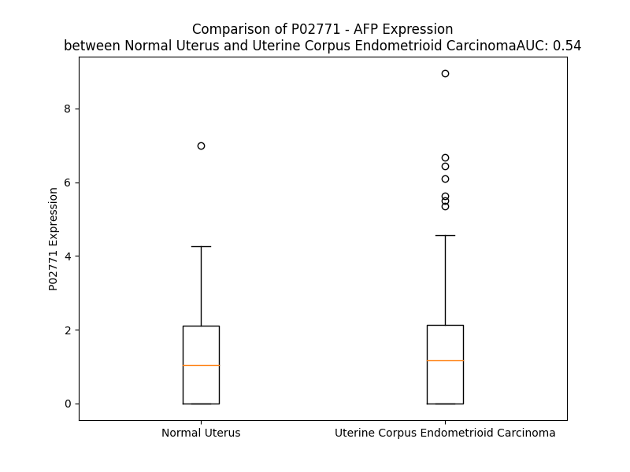

# Detailed Data for P02771

## Introduction to the Detailed Summary

### How to Interpret the Results

- **Summary & Metrics**: This section provides a quick reference to essential protein attributes, including expression changes, family classification, and biomarker applications. Regulation status (upregulated/downregulated) indicates the protein's behavior in a disease context. Some information comes from the original excel file with the proteins selected from literature, while others are derived from the analyses.
- **Expression Comparison**: A visual representation comparing protein expression between normal and disease states. It highlights significant changes in expression levels that might indicate diagnostic or therapeutic relevance. This is data coming from transcriptomics experiments and could not translate similarly to protein levels.
- **Isoform Alignment**: An interactive view of isoform alignments, revealing structural and functional differences between variants of the protein.
- **Interactors & Homologs**: Tables listing known interaction partners and homologous proteins, the more interactors and homologs, the more complex the protein is to design an antibody for.
- **Biological Assemblies**: Information about the structural arrangement of the protein in different assemblies, providing insights into its functional state but also the complexity of the protein to develop antibodies.
- **Combined Per-Residue Information**: A detailed table summarizing residue-level data. This includes predictions for epitope regions, aggregation tendencies, and modifications that might impact the protein's function. Each row corresponds to a residue in the protein, providing insights into specific sites that may be important for research or drug development.
## Summary & Metrics

- **UniProt Accession**: P02771
- **Gene Name**: AFP
- **Protein Name**: Alpha-fetoprotein
- **Swiss Prot**: FETA_HUMAN
- **Family**: transporter
- **Biomarker Application**: diagnosis,efficacy,prognosis
- **Number of Isoforms**: 0
- **Regulation**: -1
- **(transcriptomics) AUC**: 0.63
- **(transcriptomics) Fold Change**: 1.91
- **(transcriptomics) Regulation**: Upregulated
- **Discotope Epitope Count**: 130
- **Max n_uniprots (Homo)**: 1
- **Max n_uniprots (Hetero)**: 3

## Expression Comparison

## Interactors

| preferredName_A   | preferredName_B   |   score |
|:------------------|:------------------|--------:|
| AFP               | F2                |   0.973 |
| AFP               | CEACAM5           |   0.941 |
| AFP               | ALB               |   0.927 |
| AFP               | SERPINA1          |   0.927 |
| AFP               | GPC3              |   0.927 |
| AFP               | AHSG              |   0.92  |
| AFP               | APOA2             |   0.905 |

## Homologs

| uniprot_id   | gene_id   |
|:-------------|:----------|
| P43652       | AFM       |
| P02768       | ALB       |
| P02774       | GC        |

## Biological Assemblies

|   Unnamed: 0 |   assembly |   n_uniprots | composition   | crystal_id   |
|-------------:|-----------:|-------------:|:--------------|:-------------|
|            0 |          1 |            3 | Hetero        | 3mrk         |
|            0 |          1 |            2 | Hetero        | 7re7         |
|            1 |          2 |            2 | Hetero        | 7re7         |
|            0 |          1 |            1 | Homo          | 8x1n         |
|            0 |          1 |            1 | Homo          | 7yim         |
|            0 |          1 |            2 | Hetero        | 7re8         |
|            1 |          2 |            2 | Hetero        | 7re8         |

## Combined Per-Residue Information

|   res | aa   |   epitope_score | epitope   |   relative_surface_accessibility |   modeling_confidence |   Aggregation | modification             | glycosylation                   |
|------:|:-----|----------------:|:----------|---------------------------------:|----------------------:|--------------:|:-------------------------|:--------------------------------|
|     1 | M    |         0.12392 | False     |                          1.2748  |                 33.35 |         0.001 | N/A                      | N/A                             |
|     2 | K    |         0.19961 | True      |                          0.97837 |                 34.98 |         8.065 | N/A                      | N/A                             |
|     3 | W    |         0.16784 | True      |                          1.0291  |                 34.68 |         8.065 | N/A                      | N/A                             |
|     4 | V    |         0.13658 | True      |                          0.92849 |                 38.43 |         8.065 | N/A                      | N/A                             |
|     5 | E    |         0.19617 | True      |                          0.76275 |                 36.5  |         8.065 | N/A                      | N/A                             |
|     6 | S    |         0.12334 | False     |                          0.62438 |                 39.61 |        16.295 | N/A                      | N/A                             |
|     7 | I    |         0.17616 | True      |                          0.91526 |                 39.46 |        82.523 | N/A                      | N/A                             |
|     8 | F    |         0.14044 | True      |                          0.95933 |                 37.49 |        98.72  | N/A                      | N/A                             |
|     9 | L    |         0.15613 | True      |                          0.86601 |                 37.14 |        99.88  | N/A                      | N/A                             |
|    10 | I    |         0.11789 | False     |                          0.83565 |                 37.84 |        99.931 | N/A                      | N/A                             |
|    11 | F    |         0.10042 | False     |                          0.82742 |                 35.5  |        99.914 | N/A                      | N/A                             |
|    12 | L    |         0.11507 | False     |                          0.91642 |                 36.14 |        98.214 | N/A                      | N/A                             |
|    13 | L    |         0.13324 | True      |                          0.8084  |                 34.63 |        86.954 | N/A                      | N/A                             |
|    14 | N    |         0.09884 | False     |                          0.81228 |                 30.66 |        24.592 | N/A                      | N/A                             |
|    15 | F    |         0.1573  | True      |                          0.88459 |                 31.58 |        22.156 | N/A                      | N/A                             |
|    16 | T    |         0.10329 | False     |                          0.83104 |                 32.05 |         8.287 | N/A                      | N/A                             |
|    17 | E    |         0.13486 | True      |                          0.80601 |                 31.27 |         0.036 | N/A                      | N/A                             |
|    18 | S    |         0.13549 | True      |                          0.72594 |                 36.47 |         0.036 | N/A                      | N/A                             |
|    19 | R    |         0.09213 | False     |                          0.54013 |                 40.3  |         0.036 | N/A                      | N/A                             |
|    20 | T    |         0.15279 | True      |                          0.91283 |                 42.19 |         0.035 | N/A                      | N/A                             |
|    21 | L    |         0.09386 | False     |                          0.86617 |                 44.44 |         0.034 | N/A                      | N/A                             |
|    22 | H    |         0.11138 | False     |                          0.29101 |                 53.94 |         0     | N/A                      | N/A                             |
|    23 | R    |         0.18957 | True      |                          0.78865 |                 52.17 |         0     | N/A                      | N/A                             |
|    24 | N    |         0.09172 | False     |                          0.15067 |                 66.92 |         0     | N/A                      | N/A                             |
|    25 | E    |         0.22436 | True      |                          0.7387  |                 68.89 |         0     | N/A                      | N/A                             |
|    26 | Y    |         0.13746 | True      |                          0.19937 |                 72.57 |         0.173 | N/A                      | N/A                             |
|    27 | G    |         0.16075 | True      |                          0.53551 |                 73.07 |         0.173 | N/A                      | N/A                             |
|    28 | I    |         0.19924 | True      |                          0.2328  |                 75.86 |         1.704 | N/A                      | N/A                             |
|    29 | A    |         0.0919  | False     |                          0.74799 |                 79.63 |         1.704 | N/A                      | N/A                             |
|    30 | S    |         0.02438 | False     |                          0.09601 |                 82.02 |         1.704 | N/A                      | N/A                             |
|    31 | I    |         0.06063 | False     |                          0.0344  |                 79.78 |         1.704 | N/A                      | N/A                             |
|    32 | L    |         0.02248 | False     |                          0.09317 |                 76.08 |         1.704 | N/A                      | N/A                             |
|    33 | D    |         0.15179 | True      |                          0.40342 |                 72.41 |         0     | N/A                      | N/A                             |
|    34 | S    |         0.13532 | True      |                          0.66935 |                 65.58 |         0     | N/A                      | N/A                             |
|    35 | Y    |         0.11725 | False     |                          0.30103 |                 59.96 |         0     | N/A                      | N/A                             |
|    36 | Q    |         0.12838 | True      |                          0.75862 |                 63.2  |         0     | N/A                      | N/A                             |
|    37 | C    |         0.07772 | False     |                          0.17444 |                 63.86 |         0     | N/A                      | N/A                             |
|    38 | T    |         0.13288 | True      |                          0.73674 |                 54.96 |         0     | N/A                      | N/A                             |
|    39 | A    |         0.08219 | False     |                          0.33495 |                 53.97 |         0     | N/A                      | N/A                             |
|    40 | E    |         0.13871 | True      |                          0.95735 |                 62.02 |         0     | N/A                      | N/A                             |
|    41 | I    |         0.07183 | False     |                          0.2758  |                 69.84 |         0     | N/A                      | N/A                             |
|    42 | S    |         0.06889 | False     |                          0.38147 |                 85.15 |         0     | N/A                      | N/A                             |
|    43 | L    |         0.03997 | False     |                          0.19707 |                 88.66 |         0     | N/A                      | N/A                             |
|    44 | A    |         0.05999 | False     |                          0.2666  |                 93.48 |         0     | N/A                      | N/A                             |
|    45 | D    |         0.02636 | False     |                          0.17582 |                 95.31 |         0     | N/A                      | N/A                             |
|    46 | L    |         0.00251 | False     |                          0.00659 |                 94.93 |        40.464 | N/A                      | N/A                             |
|    47 | A    |         0.00061 | False     |                          0       |                 96.38 |        47.73  | N/A                      | N/A                             |
|    48 | T    |         0.00433 | False     |                          0.00891 |                 98.29 |        65.501 | N/A                      | N/A                             |
|    49 | I    |         0.00116 | False     |                          0       |                 98.02 |        87.232 | N/A                      | N/A                             |
|    50 | F    |         0.00252 | False     |                          0.00392 |                 97.86 |        89.195 | N/A                      | N/A                             |
|    51 | F    |         0.00134 | False     |                          0       |                 97.77 |        88.532 | N/A                      | N/A                             |
|    52 | A    |         0.00096 | False     |                          0.00255 |                 96.89 |        77.085 | N/A                      | N/A                             |
|    53 | Q    |         0.00447 | False     |                          0.02423 |                 96.78 |        62.562 | N/A                      | N/A                             |
|    54 | F    |         0.00422 | False     |                          0.00851 |                 95.88 |        61.674 | N/A                      | N/A                             |
|    55 | V    |         0.004   | False     |                          0.00211 |                 95.49 |        50.431 | N/A                      | N/A                             |
|    56 | Q    |         0.01321 | False     |                          0.01585 |                 94.82 |         1.896 | N/A                      | N/A                             |
|    57 | E    |         0.04722 | False     |                          0.1977  |                 93.71 |         0     | N/A                      | N/A                             |
|    58 | A    |         0.00275 | False     |                          0.00189 |                 94.86 |         0     | N/A                      | N/A                             |
|    59 | T    |         0.0658  | False     |                          0.43975 |                 95.15 |         0     | N/A                      | N/A                             |
|    60 | Y    |         0.02814 | False     |                          0.22603 |                 95.73 |         0     | N/A                      | N/A                             |
|    61 | K    |         0.16841 | True      |                          0.84934 |                 97.01 |         0     | N/A                      | N/A                             |
|    62 | E    |         0.11145 | False     |                          0.14771 |                 97.22 |         0     | N/A                      | N/A                             |
|    63 | V    |         0.00261 | False     |                          0.00286 |                 97.57 |         0     | N/A                      | N/A                             |
|    64 | S    |         0.03202 | False     |                          0.29875 |                 96.97 |         0     | N/A                      | N/A                             |
|    65 | K    |         0.11676 | False     |                          0.48599 |                 96.06 |         0     | N/A                      | N/A                             |
|    66 | M    |         0.00283 | False     |                          0       |                 96.23 |         0     | N/A                      | N/A                             |
|    67 | V    |         0.03108 | False     |                          0.07807 |                 96.15 |         0     | N/A                      | N/A                             |
|    68 | K    |         0.11919 | False     |                          0.69304 |                 94.77 |         0     | N/A                      | N/A                             |
|    69 | D    |         0.08386 | False     |                          0.27406 |                 93.14 |         0     | N/A                      | N/A                             |
|    70 | A    |         0.01372 | False     |                          0.01275 |                 92.37 |        10.576 | N/A                      | N/A                             |
|    71 | L    |         0.06538 | False     |                          0.2201  |                 91.05 |        10.576 | N/A                      | N/A                             |
|    72 | T    |         0.12709 | False     |                          0.54179 |                 89.69 |        10.576 | N/A                      | N/A                             |
|    73 | A    |         0.084   | False     |                          0.44001 |                 85.27 |        10.576 | N/A                      | N/A                             |
|    74 | I    |         0.10948 | False     |                          0.29832 |                 81.41 |        10.576 | N/A                      | N/A                             |
|    75 | E    |         0.15329 | True      |                          0.71361 |                 72.37 |         0     | N/A                      | N/A                             |
|    76 | K    |         0.1592  | True      |                          0.68992 |                 55.37 |         0     | N/A                      | N/A                             |
|    77 | P    |         0.11056 | False     |                          0.93043 |                 44.93 |         0     | N/A                      | N/A                             |
|    78 | T    |         0.12629 | False     |                          0.95518 |                 41.23 |         0     | N/A                      | N/A                             |
|    79 | G    |         0.27771 | True      |                          0.7956  |                 37.05 |         0     | N/A                      | N/A                             |
|    80 | D    |         0.20778 | True      |                          0.89322 |                 37.87 |         0     | N/A                      | N/A                             |
|    81 | E    |         0.17355 | True      |                          0.85319 |                 40.74 |         0     | N/A                      | N/A                             |
|    82 | Q    |         0.17622 | True      |                          0.90232 |                 41.91 |         0     | N/A                      | N/A                             |
|    83 | S    |         0.15839 | True      |                          0.65766 |                 40.29 |         0     | N/A                      | N/A                             |
|    84 | S    |         0.12297 | False     |                          0.91231 |                 48.41 |         0     | N/A                      | N/A                             |
|    85 | G    |         0.13327 | True      |                          0.52724 |                 55.42 |         0     | N/A                      | N/A                             |
|    86 | C    |         0.06652 | False     |                          0.22301 |                 65.8  |         0     | N/A                      | N/A                             |
|    87 | L    |         0.08794 | False     |                          0.43951 |                 72.81 |         0     | N/A                      | N/A                             |
|    88 | E    |         0.07978 | False     |                          0.70303 |                 76.28 |         0     | N/A                      | N/A                             |
|    89 | N    |         0.06166 | False     |                          0.39853 |                 79.82 |         0     | N/A                      | N/A                             |
|    90 | Q    |         0.05196 | False     |                          0.10265 |                 85.53 |         0     | N/A                      | N/A                             |
|    91 | L    |         0.03394 | False     |                          0.13321 |                 90.58 |         0     | N/A                      | N/A                             |
|    92 | P    |         0.08239 | False     |                          0.46284 |                 90.06 |         0     | N/A                      | N/A                             |
|    93 | A    |         0.06257 | False     |                          0.33358 |                 89.3  |         0     | N/A                      | N/A                             |
|    94 | F    |         0.00358 | False     |                          0.00637 |                 94.54 |         0     | N/A                      | N/A                             |
|    95 | L    |         0.01501 | False     |                          0.03215 |                 94.45 |         0     | N/A                      | N/A                             |
|    96 | E    |         0.14398 | True      |                          0.47696 |                 92.2  |         0     | N/A                      | N/A                             |
|    97 | E    |         0.04666 | False     |                          0.08127 |                 93.23 |         0     | N/A                      | N/A                             |
|    98 | L    |         0.00215 | False     |                          0       |                 94.07 |         0     | N/A                      | N/A                             |
|    99 | C    |         0.03892 | False     |                          0.12253 |                 94.84 |         0     | N/A                      | N/A                             |
|   100 | H    |         0.15753 | True      |                          0.60088 |                 93.42 |         0     | N/A                      | N/A                             |
|   101 | E    |         0.0468  | False     |                          0.07028 |                 93.22 |         0     | N/A                      | N/A                             |
|   102 | K    |         0.16844 | True      |                          0.73793 |                 92.52 |         0     | N/A                      | N/A                             |
|   103 | E    |         0.2092  | True      |                          0.74997 |                 93.67 |         0     | N/A                      | N/A                             |
|   104 | I    |         0.05157 | False     |                          0.064   |                 93.88 |         0     | N/A                      | N/A                             |
|   105 | L    |         0.02365 | False     |                          0.01154 |                 93.82 |         0     | N/A                      | N/A                             |
|   106 | E    |         0.17468 | True      |                          0.67576 |                 94.28 |         0     | N/A                      | N/A                             |
|   107 | K    |         0.20273 | True      |                          0.60563 |                 94.88 |         0     | N/A                      | N/A                             |
|   108 | Y    |         0.11746 | False     |                          0.21374 |                 92.98 |         0     | N/A                      | N/A                             |
|   109 | G    |         0.16618 | True      |                          0.56924 |                 91.79 |         0     | N/A                      | N/A                             |
|   110 | H    |         0.02985 | False     |                          0.03926 |                 93.12 |         0     | N/A                      | N/A                             |
|   111 | S    |         0.11227 | False     |                          0.4388  |                 92.66 |         0     | Phosphoserine; by FAM20C | N/A                             |
|   112 | D    |         0.13045 | True      |                          0.51903 |                 93.79 |         0     | N/A                      | N/A                             |
|   113 | C    |         0.00244 | False     |                          0       |                 96    |         0     | N/A                      | N/A                             |
|   114 | C    |         0.04554 | False     |                          0.23218 |                 95.64 |         0     | N/A                      | N/A                             |
|   115 | S    |         0.17045 | True      |                          0.74551 |                 91.84 |         0     | Phosphoserine; by FAM20C | N/A                             |
|   116 | Q    |         0.10747 | False     |                          0.45201 |                 91.63 |         0     | N/A                      | N/A                             |
|   117 | S    |         0.13096 | True      |                          0.6516  |                 89.62 |         0     | Phosphoserine; by FAM20C | N/A                             |
|   118 | E    |         0.10748 | False     |                          0.57085 |                 84.4  |         0     | N/A                      | N/A                             |
|   119 | E    |         0.1303  | True      |                          0.60224 |                 87.24 |         0     | N/A                      | N/A                             |
|   120 | G    |         0.07354 | False     |                          0.29102 |                 91.12 |         0     | N/A                      | N/A                             |
|   121 | R    |         0.0652  | False     |                          0.21618 |                 94.53 |         0     | N/A                      | N/A                             |
|   122 | H    |         0.03535 | False     |                          0.04142 |                 94.99 |         0     | N/A                      | N/A                             |
|   123 | N    |         0.10908 | False     |                          0.43487 |                 94.52 |         0     | N/A                      | N/A                             |
|   124 | C    |         0.05939 | False     |                          0.20038 |                 96.12 |         0     | N/A                      | N/A                             |
|   125 | F    |         0.00182 | False     |                          0       |                 96.25 |         0     | N/A                      | N/A                             |
|   126 | L    |         0.03264 | False     |                          0.20126 |                 94.33 |         0     | N/A                      | N/A                             |
|   127 | A    |         0.08036 | False     |                          0.83257 |                 92.32 |         0     | N/A                      | N/A                             |
|   128 | H    |         0.0659  | False     |                          0.2943  |                 91.59 |         0     | N/A                      | N/A                             |
|   129 | K    |         0.01606 | False     |                          0.03921 |                 92.3  |         0     | N/A                      | N/A                             |
|   130 | K    |         0.06872 | False     |                          0.40893 |                 89.46 |         0     | N/A                      | N/A                             |
|   131 | P    |         0.02044 | False     |                          0.23046 |                 84.91 |         0     | N/A                      | N/A                             |
|   132 | T    |         0.1041  | False     |                          0.70555 |                 76.46 |         0     | N/A                      | N/A                             |
|   133 | P    |         0.06993 | False     |                          0.11419 |                 69.11 |         0     | N/A                      | N/A                             |
|   134 | A    |         0.16245 | True      |                          0.99997 |                 71.53 |         0     | N/A                      | N/A                             |
|   135 | S    |         0.07523 | False     |                          0.53716 |                 76.27 |         0     | N/A                      | N/A                             |
|   136 | I    |         0.04733 | False     |                          0.09567 |                 81.09 |         0     | N/A                      | N/A                             |
|   137 | P    |         0.12033 | False     |                          0.75468 |                 77.03 |         0     | N/A                      | N/A                             |
|   138 | L    |         0.20151 | True      |                          0.99584 |                 72.94 |         0     | N/A                      | N/A                             |
|   139 | F    |         0.16219 | True      |                          0.3774  |                 73.08 |         0     | N/A                      | N/A                             |
|   140 | Q    |         0.20954 | True      |                          0.78356 |                 66.68 |         0     | N/A                      | N/A                             |
|   141 | V    |         0.13444 | True      |                          0.59089 |                 66.04 |         0     | N/A                      | N/A                             |
|   142 | P    |         0.09036 | False     |                          0.44172 |                 65.94 |         0     | N/A                      | N/A                             |
|   143 | E    |         0.20028 | True      |                          0.62569 |                 76.7  |         0     | N/A                      | N/A                             |
|   144 | P    |         0.06147 | False     |                          0.11714 |                 82.04 |         0     | N/A                      | N/A                             |
|   145 | V    |         0.16072 | True      |                          0.71451 |                 81.69 |         0     | N/A                      | N/A                             |
|   146 | T    |         0.16614 | True      |                          0.54834 |                 86.41 |         0     | N/A                      | N/A                             |
|   147 | S    |         0.02089 | False     |                          0.02059 |                 87.71 |         0     | N/A                      | N/A                             |
|   148 | C    |         0.05104 | False     |                          0.12154 |                 92.35 |         0     | N/A                      | N/A                             |
|   149 | E    |         0.30478 | True      |                          0.56593 |                 92.4  |         0     | N/A                      | N/A                             |
|   150 | A    |         0.06615 | False     |                          0.378   |                 91.97 |         0     | N/A                      | N/A                             |
|   151 | Y    |         0.05319 | False     |                          0.11653 |                 94.09 |         0     | N/A                      | N/A                             |
|   152 | E    |         0.27065 | True      |                          0.72565 |                 94.07 |         0     | N/A                      | N/A                             |
|   153 | E    |         0.29391 | True      |                          0.81152 |                 94.9  |         0     | N/A                      | N/A                             |
|   154 | D    |         0.15281 | True      |                          0.38324 |                 95.22 |         0     | N/A                      | N/A                             |
|   155 | R    |         0.16366 | True      |                          0.51191 |                 93.92 |         0     | N/A                      | N/A                             |
|   156 | E    |         0.11785 | False     |                          0.68806 |                 93.03 |         0     | N/A                      | N/A                             |
|   157 | T    |         0.08923 | False     |                          0.45268 |                 93.76 |         0.153 | N/A                      | N/A                             |
|   158 | F    |         0.0496  | False     |                          0.13994 |                 93.58 |         1.076 | N/A                      | N/A                             |
|   159 | M    |         0.03285 | False     |                          0.09564 |                 93.86 |         1.076 | N/A                      | N/A                             |
|   160 | N    |         0.01279 | False     |                          0.11546 |                 95.36 |         1.076 | N/A                      | N/A                             |
|   161 | K    |         0.03444 | False     |                          0.49635 |                 94.05 |         1.25  | N/A                      | N/A                             |
|   162 | F    |         0.03802 | False     |                          0.10463 |                 92.53 |         1.25  | N/A                      | N/A                             |
|   163 | I    |         0.00902 | False     |                          0.024   |                 95.66 |         1.25  | N/A                      | N/A                             |
|   164 | Y    |         0.01339 | False     |                          0.02083 |                 96.27 |         1.25  | N/A                      | N/A                             |
|   165 | E    |         0.01335 | False     |                          0.14524 |                 93.7  |         1.25  | N/A                      | N/A                             |
|   166 | I    |         0.01978 | False     |                          0.0736  |                 93.02 |         1.25  | N/A                      | N/A                             |
|   167 | A    |         0.00072 | False     |                          0       |                 95.9  |         0.218 | N/A                      | N/A                             |
|   168 | R    |         0.03584 | False     |                          0.11668 |                 94.92 |         0     | N/A                      | N/A                             |
|   169 | R    |         0.09615 | False     |                          0.18366 |                 92.78 |         0     | N/A                      | N/A                             |
|   170 | H    |         0.02291 | False     |                          0.20006 |                 93.69 |         0     | N/A                      | N/A                             |
|   171 | P    |         0.00636 | False     |                          0.02053 |                 94.37 |         0     | N/A                      | N/A                             |
|   172 | F    |         0.01765 | False     |                          0.19286 |                 95.37 |         0     | N/A                      | N/A                             |
|   173 | L    |         0.00626 | False     |                          0.01928 |                 96.16 |         0     | N/A                      | N/A                             |
|   174 | Y    |         0.00825 | False     |                          0.08157 |                 96.69 |         0     | N/A                      | N/A                             |
|   175 | A    |         0.00501 | False     |                          0.02867 |                 95.11 |         0     | N/A                      | N/A                             |
|   176 | P    |         0.02148 | False     |                          0.25148 |                 93.2  |         0.484 | N/A                      | N/A                             |
|   177 | T    |         0.01375 | False     |                          0.12586 |                 94.07 |        34.701 | N/A                      | N/A                             |
|   178 | I    |         0.00131 | False     |                          0       |                 95.31 |        55.683 | N/A                      | N/A                             |
|   179 | L    |         0.01277 | False     |                          0.09584 |                 94.56 |        56.572 | N/A                      | N/A                             |
|   180 | L    |         0.01326 | False     |                          0.02555 |                 92.75 |        56.572 | N/A                      | N/A                             |
|   181 | W    |         0.00747 | False     |                          0.0006  |                 89.75 |        56.508 | N/A                      | N/A                             |
|   182 | A    |         0.02573 | False     |                          0.05592 |                 91.99 |        34.51  | N/A                      | N/A                             |
|   183 | A    |         0.03493 | False     |                          0.36911 |                 91.37 |        16.456 | N/A                      | N/A                             |
|   184 | R    |         0.04266 | False     |                          0.25383 |                 91.07 |         0     | N/A                      | N/A                             |
|   185 | Y    |         0.0327  | False     |                          0.05058 |                 89.61 |         0     | N/A                      | N/A                             |
|   186 | D    |         0.06561 | False     |                          0.14237 |                 91.61 |         0     | N/A                      | N/A                             |
|   187 | K    |         0.12024 | False     |                          0.61986 |                 91.15 |         0     | N/A                      | N/A                             |
|   188 | I    |         0.10261 | False     |                          0.11599 |                 90.95 |         0     | N/A                      | N/A                             |
|   189 | I    |         0.01374 | False     |                          0       |                 91.08 |         0     | N/A                      | N/A                             |
|   190 | P    |         0.18347 | True      |                          0.36944 |                 92.8  |         0     | N/A                      | N/A                             |
|   191 | S    |         0.15022 | True      |                          0.38624 |                 91.99 |         0     | N/A                      | N/A                             |
|   192 | C    |         0.00659 | False     |                          0       |                 92.5  |         0     | N/A                      | N/A                             |
|   193 | C    |         0.06982 | False     |                          0.26663 |                 93.18 |         0     | N/A                      | N/A                             |
|   194 | K    |         0.2534  | True      |                          0.84316 |                 91.79 |         0     | N/A                      | N/A                             |
|   195 | A    |         0.09246 | False     |                          0.3514  |                 91.62 |         0     | N/A                      | N/A                             |
|   196 | E    |         0.18471 | True      |                          1.00542 |                 89.47 |         0     | N/A                      | N/A                             |
|   197 | N    |         0.2009  | True      |                          0.47433 |                 90.9  |         0     | N/A                      | N/A                             |
|   198 | A    |         0.07746 | False     |                          0.21362 |                 88.81 |         0     | N/A                      | N/A                             |
|   199 | V    |         0.19183 | True      |                          0.49814 |                 88.01 |         0     | N/A                      | N/A                             |
|   200 | E    |         0.21872 | True      |                          0.51699 |                 89.62 |         0     | N/A                      | N/A                             |
|   201 | C    |         0.04108 | False     |                          0.14313 |                 90.43 |         0     | N/A                      | N/A                             |
|   202 | F    |         0.02643 | False     |                          0.047   |                 88.82 |         0     | N/A                      | N/A                             |
|   203 | Q    |         0.16169 | True      |                          0.60878 |                 86.71 |         0     | N/A                      | N/A                             |
|   204 | T    |         0.14812 | True      |                          0.63176 |                 88.4  |         0     | N/A                      | N/A                             |
|   205 | K    |         0.15454 | True      |                          0.42295 |                 88.63 |         0     | N/A                      | N/A                             |
|   206 | A    |         0.03991 | False     |                          0.13097 |                 84.47 |         0.187 | N/A                      | N/A                             |
|   207 | A    |         0.12606 | False     |                          0.56012 |                 84.69 |         0.187 | N/A                      | N/A                             |
|   208 | T    |         0.12402 | False     |                          0.56971 |                 84.2  |         0.187 | N/A                      | N/A                             |
|   209 | V    |         0.04187 | False     |                          0.11234 |                 84.94 |         0.187 | N/A                      | N/A                             |
|   210 | T    |         0.03984 | False     |                          0.33515 |                 85.83 |         0.187 | N/A                      | N/A                             |
|   211 | K    |         0.14553 | True      |                          0.62216 |                 87.3  |         0     | N/A                      | N/A                             |
|   212 | E    |         0.03462 | False     |                          0.28316 |                 88.63 |         0     | N/A                      | N/A                             |
|   213 | L    |         0.01508 | False     |                          0.09645 |                 90.5  |         0     | N/A                      | N/A                             |
|   214 | R    |         0.07975 | False     |                          0.59714 |                 89.2  |         0     | N/A                      | N/A                             |
|   215 | E    |         0.05126 | False     |                          0.42075 |                 90.83 |         0     | N/A                      | N/A                             |
|   216 | S    |         0.01199 | False     |                          0.06796 |                 94    |         0     | N/A                      | N/A                             |
|   217 | S    |         0.01777 | False     |                          0.09548 |                 93.4  |         0     | N/A                      | N/A                             |
|   218 | L    |         0.03168 | False     |                          0.32562 |                 92.87 |         0     | N/A                      | N/A                             |
|   219 | L    |         0.03108 | False     |                          0.46482 |                 94.65 |         0     | N/A                      | N/A                             |
|   220 | N    |         0.0094  | False     |                          0.10777 |                 96.68 |         0     | N/A                      | N/A                             |
|   221 | Q    |         0.01518 | False     |                          0.09642 |                 95.75 |         0     | N/A                      | N/A                             |
|   222 | H    |         0.0178  | False     |                          0.07516 |                 96.19 |         0     | N/A                      | N/A                             |
|   223 | A    |         0.02077 | False     |                          0.11861 |                 96.66 |         0     | N/A                      | N/A                             |
|   224 | C    |         0.00995 | False     |                          0.07417 |                 96.43 |         0     | N/A                      | N/A                             |
|   225 | A    |         0.01913 | False     |                          0.1417  |                 95.42 |         0     | N/A                      | N/A                             |
|   226 | V    |         0.00398 | False     |                          0.01415 |                 96.21 |         0     | N/A                      | N/A                             |
|   227 | M    |         0.01251 | False     |                          0.10977 |                 94.43 |         0     | N/A                      | N/A                             |
|   228 | K    |         0.08877 | False     |                          0.75795 |                 92.62 |         0     | N/A                      | N/A                             |
|   229 | N    |         0.08083 | False     |                          0.34047 |                 93.13 |         0     | N/A                      | N/A                             |
|   230 | F    |         0.0627  | False     |                          0.17766 |                 94.99 |         0     | N/A                      | N/A                             |
|   231 | G    |         0.12262 | False     |                          0.37185 |                 92.98 |         0     | N/A                      | N/A                             |
|   232 | T    |         0.02863 | False     |                          0.36674 |                 91.91 |         0     | N/A                      | N/A                             |
|   233 | R    |         0.07332 | False     |                          0.49282 |                 92.25 |         0     | N/A                      | N/A                             |
|   234 | T    |         0.0223  | False     |                          0.21153 |                 95.82 |         0.153 | N/A                      | N/A                             |
|   235 | F    |         0.00933 | False     |                          0.05796 |                 96.35 |         0.563 | N/A                      | N/A                             |
|   236 | Q    |         0.02167 | False     |                          0.12809 |                 96.94 |         0.563 | N/A                      | N/A                             |
|   237 | A    |         0.00985 | False     |                          0.26038 |                 97.65 |         1.439 | N/A                      | N/A                             |
|   238 | I    |         0.02433 | False     |                          0.0744  |                 98.1  |         1.439 | N/A                      | N/A                             |
|   239 | T    |         0.01393 | False     |                          0.06174 |                 97.7  |         1.439 | N/A                      | N/A                             |
|   240 | V    |         0.0053  | False     |                          0.00857 |                 98.35 |         1.439 | N/A                      | N/A                             |
|   241 | T    |         0.00098 | False     |                          0       |                 98.36 |         1.029 | N/A                      | N/A                             |
|   242 | K    |         0.02876 | False     |                          0.52911 |                 97.1  |         0     | N/A                      | N/A                             |
|   243 | L    |         0.02489 | False     |                          0.12118 |                 97.66 |         0     | N/A                      | N/A                             |
|   244 | S    |         0.00271 | False     |                          0       |                 98.15 |         0     | N/A                      | N/A                             |
|   245 | Q    |         0.01504 | False     |                          0.0426  |                 96.38 |         0     | N/A                      | N/A                             |
|   246 | K    |         0.02241 | False     |                          0.10678 |                 95.59 |         0     | N/A                      | N/A                             |
|   247 | F    |         0.0025  | False     |                          0.00191 |                 96.37 |         0     | N/A                      | N/A                             |
|   248 | T    |         0.00336 | False     |                          0       |                 95.57 |         0     | N/A                      | N/A                             |
|   249 | K    |         0.13843 | True      |                          0.63071 |                 93.57 |         0     | N/A                      | N/A                             |
|   250 | V    |         0.02922 | False     |                          0.04856 |                 94.83 |         0.208 | N/A                      | N/A                             |
|   251 | N    |         0.08994 | False     |                          0.58644 |                 94.64 |         0.208 | N/A                      | N-linked (GlcNAc...) asparagine |
|   252 | F    |         0.03757 | False     |                          0.19945 |                 95.74 |         0.208 | N/A                      | N/A                             |
|   253 | T    |         0.1302  | True      |                          0.67915 |                 93.73 |         0.208 | N/A                      | N/A                             |
|   254 | E    |         0.05806 | False     |                          0.18604 |                 94.06 |         0.208 | N/A                      | N/A                             |
|   255 | I    |         0.0029  | False     |                          0       |                 96.08 |         0.208 | N/A                      | N/A                             |
|   256 | Q    |         0.01881 | False     |                          0.02659 |                 95.4  |         0.208 | N/A                      | N/A                             |
|   257 | K    |         0.04338 | False     |                          0.17541 |                 93.72 |         0.957 | N/A                      | N/A                             |
|   258 | L    |         0.004   | False     |                          0.00165 |                 95.1  |         0.957 | N/A                      | N/A                             |
|   259 | V    |         0.00172 | False     |                          0       |                 96.58 |         0.957 | N/A                      | N/A                             |
|   260 | L    |         0.02973 | False     |                          0.07849 |                 94.89 |         0.957 | N/A                      | N/A                             |
|   261 | D    |         0.01372 | False     |                          0.00797 |                 94.47 |         0.749 | N/A                      | N/A                             |
|   262 | V    |         0.01966 | False     |                          0.18946 |                 95.84 |         0.749 | N/A                      | N/A                             |
|   263 | A    |         0.00421 | False     |                          0.01383 |                 95.85 |         0.343 | N/A                      | N/A                             |
|   264 | H    |         0.03279 | False     |                          0.22667 |                 93.83 |         0     | N/A                      | N/A                             |
|   265 | V    |         0.01845 | False     |                          0.10758 |                 94.19 |         0     | N/A                      | N/A                             |
|   266 | H    |         0.00734 | False     |                          0.22143 |                 96.41 |         0     | N/A                      | N/A                             |
|   267 | E    |         0.03027 | False     |                          0.34425 |                 94.79 |         0     | N/A                      | N/A                             |
|   268 | H    |         0.05424 | False     |                          0.1754  |                 94.57 |         0     | N/A                      | N/A                             |
|   269 | C    |         0.00922 | False     |                          0.08466 |                 96.53 |         0     | N/A                      | N/A                             |
|   270 | C    |         0.01101 | False     |                          0.13651 |                 96.03 |         0     | N/A                      | N/A                             |
|   271 | R    |         0.06056 | False     |                          0.30991 |                 94.95 |         0     | N/A                      | N/A                             |
|   272 | G    |         0.0117  | False     |                          0.03821 |                 94.2  |         0     | N/A                      | N/A                             |
|   273 | D    |         0.01709 | False     |                          0.0199  |                 94.73 |         0     | N/A                      | N/A                             |
|   274 | V    |         0.00847 | False     |                          0.04585 |                 94.18 |         0     | N/A                      | N/A                             |
|   275 | L    |         0.01098 | False     |                          0.01814 |                 90.71 |         0     | N/A                      | N/A                             |
|   276 | D    |         0.02122 | False     |                          0.11434 |                 90.75 |         0     | N/A                      | N/A                             |
|   277 | C    |         0.00206 | False     |                          0.01325 |                 93.39 |         0     | N/A                      | N/A                             |
|   278 | L    |         0.01206 | False     |                          0.03064 |                 91.23 |         0     | N/A                      | N/A                             |
|   279 | Q    |         0.0185  | False     |                          0.03849 |                 89.17 |         0     | N/A                      | N/A                             |
|   280 | D    |         0.01674 | False     |                          0.08614 |                 89.78 |         0     | N/A                      | N/A                             |
|   281 | G    |         0.03399 | False     |                          0.1778  |                 91.82 |         0     | N/A                      | N/A                             |
|   282 | E    |         0.03166 | False     |                          0.03941 |                 89.68 |         0     | N/A                      | N/A                             |
|   283 | K    |         0.01488 | False     |                          0.02804 |                 90.08 |         0     | N/A                      | N/A                             |
|   284 | I    |         0.01217 | False     |                          0.024   |                 92.21 |        10.273 | N/A                      | N/A                             |
|   285 | M    |         0.0207  | False     |                          0.17259 |                 92.44 |        10.273 | N/A                      | N/A                             |
|   286 | S    |         0.04441 | False     |                          0.21349 |                 90.97 |        10.273 | N/A                      | N/A                             |
|   287 | Y    |         0.08515 | False     |                          0.09475 |                 92.26 |        10.273 | N/A                      | N/A                             |
|   288 | I    |         0.02492 | False     |                          0.0352  |                 94.26 |        10.273 | N/A                      | N/A                             |
|   289 | C    |         0.0401  | False     |                          0.1223  |                 94.26 |         1.965 | N/A                      | N/A                             |
|   290 | S    |         0.13932 | True      |                          0.52101 |                 92.76 |         0.217 | N/A                      | N/A                             |
|   291 | Q    |         0.10744 | False     |                          0.32213 |                 92.9  |         0     | N/A                      | N/A                             |
|   292 | Q    |         0.09126 | False     |                          0.23499 |                 93.58 |         0     | N/A                      | N/A                             |
|   293 | D    |         0.16159 | True      |                          0.88688 |                 90.93 |         0     | N/A                      | N/A                             |
|   294 | T    |         0.11016 | False     |                          0.68629 |                 91.3  |         0     | N/A                      | N/A                             |
|   295 | L    |         0.01393 | False     |                          0.01095 |                 93    |         0     | N/A                      | N/A                             |
|   296 | S    |         0.03803 | False     |                          0.05857 |                 94.51 |         0     | N/A                      | N/A                             |
|   297 | N    |         0.19391 | True      |                          0.70167 |                 93.01 |         0     | N/A                      | N/A                             |
|   298 | K    |         0.05933 | False     |                          0.37362 |                 95.44 |         0     | N/A                      | N/A                             |
|   299 | I    |         0.02687 | False     |                          0.0048  |                 96.31 |         0     | N/A                      | N/A                             |
|   300 | T    |         0.11947 | False     |                          0.35554 |                 95.99 |         0     | N/A                      | N/A                             |
|   301 | E    |         0.19147 | True      |                          0.58378 |                 95.97 |         0     | N/A                      | N/A                             |
|   302 | C    |         0.01792 | False     |                          0.03641 |                 96.89 |         0     | N/A                      | N/A                             |
|   303 | C    |         0.04076 | False     |                          0.15473 |                 96.22 |         0     | N/A                      | N/A                             |
|   304 | K    |         0.14436 | True      |                          0.68818 |                 95.3  |         0     | N/A                      | N/A                             |
|   305 | L    |         0.1356  | True      |                          0.41601 |                 92.83 |         0     | N/A                      | N/A                             |
|   306 | T    |         0.14497 | True      |                          0.59242 |                 89.16 |         0     | N/A                      | N/A                             |
|   307 | T    |         0.03212 | False     |                          0.25854 |                 85.55 |         0     | N/A                      | N/A                             |
|   308 | L    |         0.03639 | False     |                          0.28233 |                 87.14 |         0     | N/A                      | N/A                             |
|   309 | E    |         0.04532 | False     |                          0.17513 |                 90.94 |         0     | N/A                      | N/A                             |
|   310 | R    |         0.05617 | False     |                          0.19267 |                 93.06 |         0     | N/A                      | N/A                             |
|   311 | G    |         0.0264  | False     |                          0.12206 |                 90.17 |         0     | N/A                      | N/A                             |
|   312 | Q    |         0.02661 | False     |                          0.14566 |                 91.53 |         0     | N/A                      | N/A                             |
|   313 | C    |         0.05777 | False     |                          0.28579 |                 95.4  |         0     | N/A                      | N/A                             |
|   314 | I    |         0.01723 | False     |                          0.0272  |                 94.99 |         0     | N/A                      | N/A                             |
|   315 | I    |         0.07598 | False     |                          0.59469 |                 91.53 |         0     | N/A                      | N/A                             |
|   316 | H    |         0.05684 | False     |                          0.59563 |                 91.69 |         0     | N/A                      | N/A                             |
|   317 | A    |         0.04409 | False     |                          0.15998 |                 93.97 |         0     | N/A                      | N/A                             |
|   318 | E    |         0.12758 | True      |                          0.6494  |                 91.57 |         0     | N/A                      | N/A                             |
|   319 | N    |         0.11707 | False     |                          0.41402 |                 92.95 |         0     | N/A                      | N/A                             |
|   320 | D    |         0.02294 | False     |                          0.02534 |                 93.91 |         0     | N/A                      | N/A                             |
|   321 | E    |         0.10173 | False     |                          0.52533 |                 91.59 |         0     | N/A                      | N/A                             |
|   322 | K    |         0.0787  | False     |                          0.39041 |                 92.53 |         0     | N/A                      | N/A                             |
|   323 | P    |         0.05556 | False     |                          0.16713 |                 91.45 |         0     | N/A                      | N/A                             |
|   324 | E    |         0.21472 | True      |                          0.90315 |                 90.56 |         0     | N/A                      | N/A                             |
|   325 | G    |         0.20458 | True      |                          1.02955 |                 89.71 |         0     | N/A                      | N/A                             |
|   326 | L    |         0.09301 | False     |                          0.26234 |                 90.58 |         0     | N/A                      | N/A                             |
|   327 | S    |         0.10344 | False     |                          0.44722 |                 91.11 |         0     | N/A                      | N/A                             |
|   328 | P    |         0.09548 | False     |                          0.57259 |                 87.15 |         0     | N/A                      | N/A                             |
|   329 | N    |         0.09192 | False     |                          0.23255 |                 88.93 |         0     | N/A                      | N/A                             |
|   330 | L    |         0.04647 | False     |                          0.16456 |                 90.5  |         0     | N/A                      | N/A                             |
|   331 | N    |         0.13636 | True      |                          0.45618 |                 87.28 |         0     | N/A                      | N/A                             |
|   332 | R    |         0.31124 | True      |                          0.53902 |                 88.2  |         0     | N/A                      | N/A                             |
|   333 | F    |         0.13879 | True      |                          0.26179 |                 93.28 |         0     | N/A                      | N/A                             |
|   334 | L    |         0.02919 | False     |                          0.0074  |                 92.71 |         0     | N/A                      | N/A                             |
|   335 | G    |         0.07736 | False     |                          0.25062 |                 91.52 |         0     | N/A                      | N/A                             |
|   336 | D    |         0.20117 | True      |                          0.74643 |                 88.19 |         0     | N/A                      | N/A                             |
|   337 | R    |         0.18428 | True      |                          0.48388 |                 90.94 |         0     | N/A                      | N/A                             |
|   338 | D    |         0.11104 | False     |                          0.20524 |                 90.9  |         0     | N/A                      | N/A                             |
|   339 | F    |         0.00367 | False     |                          0       |                 92.89 |         0     | N/A                      | N/A                             |
|   340 | N    |         0.20441 | True      |                          0.4216  |                 91.84 |         0     | N/A                      | N/A                             |
|   341 | Q    |         0.29028 | True      |                          0.73186 |                 93.85 |         0     | N/A                      | N/A                             |
|   342 | F    |         0.12654 | False     |                          0.19098 |                 93.95 |         0     | N/A                      | N/A                             |
|   343 | S    |         0.16177 | True      |                          0.47352 |                 94.18 |         0     | N/A                      | N/A                             |
|   344 | S    |         0.1431  | True      |                          0.68875 |                 90.67 |         0     | Phosphoserine; by FAM20C | N/A                             |
|   345 | G    |         0.16184 | True      |                          0.29471 |                 90.63 |         0     | N/A                      | N/A                             |
|   346 | E    |         0.10801 | False     |                          0.47647 |                 93.46 |         0     | N/A                      | N/A                             |
|   347 | K    |         0.06915 | False     |                          0.23887 |                 94.41 |         0     | N/A                      | N/A                             |
|   348 | N    |         0.05695 | False     |                          0.18495 |                 93.49 |         1.814 | N/A                      | N/A                             |
|   349 | I    |         0.1345  | True      |                          0.36638 |                 94.16 |        93.744 | N/A                      | N/A                             |
|   350 | F    |         0.0259  | False     |                          0.07788 |                 95.93 |        95.115 | N/A                      | N/A                             |
|   351 | L    |         0.03156 | False     |                          0.09467 |                 96.81 |        95.205 | N/A                      | N/A                             |
|   352 | A    |         0.01428 | False     |                          0.15599 |                 97.5  |        95.205 | N/A                      | N/A                             |
|   353 | S    |         0.02878 | False     |                          0.17713 |                 97.62 |        95.009 | N/A                      | N/A                             |
|   354 | F    |         0.00349 | False     |                          0.00382 |                 97.35 |        94.901 | N/A                      | N/A                             |
|   355 | V    |         0.00597 | False     |                          0.02951 |                 98.07 |        93.32  | N/A                      | N/A                             |
|   356 | H    |         0.00206 | False     |                          0.00063 |                 98.34 |         0.678 | N/A                      | N/A                             |
|   357 | E    |         0.02049 | False     |                          0.16827 |                 97.52 |         0     | N/A                      | N/A                             |
|   358 | Y    |         0.01085 | False     |                          0.00899 |                 97.17 |         0     | N/A                      | N/A                             |
|   359 | S    |         0.00171 | False     |                          0       |                 97.5  |         0     | N/A                      | N/A                             |
|   360 | R    |         0.03615 | False     |                          0.13767 |                 96.27 |         0     | N/A                      | N/A                             |
|   361 | R    |         0.05388 | False     |                          0.10787 |                 95.17 |         0     | N/A                      | N/A                             |
|   362 | H    |         0.04483 | False     |                          0.08026 |                 94.23 |         0     | N/A                      | N/A                             |
|   363 | P    |         0.04063 | False     |                          0.21826 |                 92.3  |         0     | N/A                      | N/A                             |
|   364 | Q    |         0.07963 | False     |                          0.35725 |                 91.2  |         1.627 | N/A                      | N/A                             |
|   365 | L    |         0.02419 | False     |                          0.04165 |                 94.43 |        48.371 | N/A                      | N/A                             |
|   366 | A    |         0.00934 | False     |                          0.03699 |                 94.79 |        56.612 | N/A                      | N/A                             |
|   367 | V    |         0.0156  | False     |                          0.21182 |                 95.94 |        64.849 | N/A                      | N/A                             |
|   368 | S    |         0.01066 | False     |                          0.08488 |                 95.04 |        64.849 | N/A                      | N/A                             |
|   369 | V    |         0.00622 | False     |                          0.01333 |                 96.49 |        64.849 | N/A                      | N/A                             |
|   370 | I    |         0.00276 | False     |                          0.00459 |                 97.35 |        63.042 | N/A                      | N/A                             |
|   371 | L    |         0.01208 | False     |                          0.06885 |                 97.74 |        54.559 | N/A                      | N/A                             |
|   372 | R    |         0.03739 | False     |                          0.09801 |                 96.56 |         0     | N/A                      | N/A                             |
|   373 | V    |         0.00404 | False     |                          0.00286 |                 97.12 |         0     | N/A                      | N/A                             |
|   374 | A    |         0.00799 | False     |                          0.09132 |                 96.35 |         0     | N/A                      | N/A                             |
|   375 | K    |         0.04589 | False     |                          0.3626  |                 95.65 |         0     | N/A                      | N/A                             |
|   376 | G    |         0.02975 | False     |                          0.07142 |                 95.64 |         0     | N/A                      | N/A                             |
|   377 | Y    |         0.01207 | False     |                          0.01131 |                 95.65 |         0     | N/A                      | N/A                             |
|   378 | Q    |         0.06083 | False     |                          0.17978 |                 94.42 |         0     | N/A                      | N/A                             |
|   379 | E    |         0.10894 | False     |                          0.33995 |                 93.74 |         0     | N/A                      | N/A                             |
|   380 | L    |         0.06474 | False     |                          0.1723  |                 93.98 |         0     | N/A                      | N/A                             |
|   381 | L    |         0.00589 | False     |                          0       |                 93.19 |         0     | N/A                      | N/A                             |
|   382 | E    |         0.09106 | False     |                          0.30681 |                 91.32 |         0     | N/A                      | N/A                             |
|   383 | K    |         0.24034 | True      |                          0.62902 |                 90.68 |         0     | N/A                      | N/A                             |
|   384 | C    |         0.01836 | False     |                          0       |                 90.13 |         0     | N/A                      | N/A                             |
|   385 | F    |         0.19204 | True      |                          0.25913 |                 83.7  |         0     | N/A                      | N/A                             |
|   386 | Q    |         0.22846 | True      |                          0.74972 |                 86.08 |         0     | N/A                      | N/A                             |
|   387 | T    |         0.25726 | True      |                          0.43183 |                 86.93 |         0     | N/A                      | N/A                             |
|   388 | E    |         0.2355  | True      |                          0.9612  |                 88.27 |         0     | N/A                      | N/A                             |
|   389 | N    |         0.29837 | True      |                          0.4516  |                 91.49 |         0     | N/A                      | N/A                             |
|   390 | P    |         0.05745 | False     |                          0.23361 |                 90.18 |         0     | N/A                      | N/A                             |
|   391 | L    |         0.14929 | True      |                          0.36107 |                 91.6  |         0     | N/A                      | N/A                             |
|   392 | E    |         0.19385 | True      |                          0.37916 |                 91.8  |         0     | N/A                      | N/A                             |
|   393 | C    |         0.05583 | False     |                          0.19397 |                 91.94 |         0     | N/A                      | N/A                             |
|   394 | Q    |         0.02321 | False     |                          0.00727 |                 92.1  |         0     | N/A                      | N/A                             |
|   395 | D    |         0.16399 | True      |                          0.18242 |                 89.36 |         0     | N/A                      | N/A                             |
|   396 | K    |         0.30241 | True      |                          0.566   |                 90.48 |         0     | N/A                      | N/A                             |
|   397 | G    |         0.05609 | False     |                          0.03041 |                 89.02 |         0     | N/A                      | N/A                             |
|   398 | E    |         0.05012 | False     |                          0.01773 |                 89.51 |         0     | N/A                      | N/A                             |
|   399 | E    |         0.28071 | True      |                          0.5692  |                 90.15 |         0     | N/A                      | N/A                             |
|   400 | E    |         0.12165 | False     |                          0.57398 |                 92.02 |         0     | N/A                      | N/A                             |
|   401 | L    |         0.04998 | False     |                          0.06321 |                 94.5  |         0     | N/A                      | N/A                             |
|   402 | Q    |         0.09703 | False     |                          0.24225 |                 93.44 |         0     | N/A                      | N/A                             |
|   403 | K    |         0.16066 | True      |                          0.46677 |                 94.88 |         0     | N/A                      | N/A                             |
|   404 | Y    |         0.06567 | False     |                          0.16646 |                 94.74 |         0     | N/A                      | N/A                             |
|   405 | I    |         0.05175 | False     |                          0.0752  |                 94.04 |         0     | N/A                      | N/A                             |
|   406 | Q    |         0.26058 | True      |                          0.56582 |                 94.77 |         0     | N/A                      | N/A                             |
|   407 | E    |         0.08877 | False     |                          0.42543 |                 94.31 |         0     | N/A                      | N/A                             |
|   408 | S    |         0.01828 | False     |                          0.03757 |                 93.95 |         0     | N/A                      | N/A                             |
|   409 | Q    |         0.05913 | False     |                          0.34756 |                 93.98 |         0     | N/A                      | N/A                             |
|   410 | A    |         0.14195 | True      |                          0.56031 |                 93.72 |         0     | N/A                      | N/A                             |
|   411 | L    |         0.0625  | False     |                          0.35778 |                 92.13 |         0     | N/A                      | N/A                             |
|   412 | A    |         0.01707 | False     |                          0.17784 |                 93    |         0     | N/A                      | N/A                             |
|   413 | K    |         0.09613 | False     |                          0.57227 |                 94.06 |         0     | N/A                      | N/A                             |
|   414 | R    |         0.1442  | True      |                          0.7076  |                 92.85 |         0     | N/A                      | N/A                             |
|   415 | S    |         0.01948 | False     |                          0.24306 |                 93.05 |         0     | N/A                      | N/A                             |
|   416 | C    |         0.03351 | False     |                          0.09669 |                 95.75 |         0     | N/A                      | N/A                             |
|   417 | G    |         0.12194 | False     |                          0.43382 |                 96.1  |         0     | N/A                      | N/A                             |
|   418 | L    |         0.05222 | False     |                          0.4023  |                 94.64 |         0     | N/A                      | N/A                             |
|   419 | F    |         0.03676 | False     |                          0.17884 |                 97.04 |         0     | N/A                      | N/A                             |
|   420 | Q    |         0.14692 | True      |                          0.71993 |                 96.57 |         0     | N/A                      | N/A                             |
|   421 | K    |         0.28565 | True      |                          0.83115 |                 96.79 |         0     | N/A                      | N/A                             |
|   422 | L    |         0.10592 | False     |                          0.35647 |                 95.5  |         0     | N/A                      | N/A                             |
|   423 | G    |         0.0722  | False     |                          0.36151 |                 95.82 |         0     | N/A                      | N/A                             |
|   424 | E    |         0.10099 | False     |                          0.39711 |                 95.65 |         0     | N/A                      | N/A                             |
|   425 | Y    |         0.05544 | False     |                          0.20502 |                 95.84 |        13.307 | N/A                      | N/A                             |
|   426 | Y    |         0.08082 | False     |                          0.61135 |                 95.65 |        17.188 | N/A                      | N/A                             |
|   427 | L    |         0.00285 | False     |                          0.00082 |                 96.74 |        17.509 | N/A                      | N/A                             |
|   428 | Q    |         0.02607 | False     |                          0.05671 |                 97.61 |        17.509 | N/A                      | N/A                             |
|   429 | N    |         0.03223 | False     |                          0.16708 |                 97.01 |        19.131 | N/A                      | N/A                             |
|   430 | A    |         0.08926 | False     |                          0.41267 |                 95.57 |        47.503 | N/A                      | N/A                             |
|   431 | F    |         0.01507 | False     |                          0.18026 |                 96.33 |        67.821 | N/A                      | N/A                             |
|   432 | L    |         0.00354 | False     |                          0.00291 |                 97.68 |        68.117 | N/A                      | N/A                             |
|   433 | V    |         0.02084 | False     |                          0.17994 |                 97.11 |        68.117 | N/A                      | N/A                             |
|   434 | A    |         0.06584 | False     |                          0.34777 |                 95.94 |        66.886 | N/A                      | N/A                             |
|   435 | Y    |         0.02819 | False     |                          0.0976  |                 97.23 |        54.645 | N/A                      | N/A                             |
|   436 | T    |         0.00285 | False     |                          0.00381 |                 98.06 |         9.991 | N/A                      | N/A                             |
|   437 | K    |         0.02316 | False     |                          0.20389 |                 97.44 |         0     | N/A                      | N/A                             |
|   438 | K    |         0.03093 | False     |                          0.15421 |                 97.04 |         0     | N/A                      | N/A                             |
|   439 | A    |         0.01008 | False     |                          0.01658 |                 97.32 |         0     | N/A                      | N/A                             |
|   440 | P    |         0.02479 | False     |                          0.01323 |                 96.73 |         0     | N/A                      | N/A                             |
|   441 | Q    |         0.08238 | False     |                          0.34733 |                 95.91 |         0     | N/A                      | N/A                             |
|   442 | L    |         0.00767 | False     |                          0.00659 |                 96.8  |         0     | N/A                      | N/A                             |
|   443 | T    |         0.0484  | False     |                          0.49759 |                 95.43 |         0     | N/A                      | N/A                             |
|   444 | S    |         0.02118 | False     |                          0.17209 |                 95.7  |         0     | Phosphoserine; by FAM20C | N/A                             |
|   445 | S    |         0.10347 | False     |                          0.56598 |                 94.95 |         0     | Phosphoserine; by FAM20C | N/A                             |
|   446 | E    |         0.03982 | False     |                          0.20285 |                 95.73 |         0     | N/A                      | N/A                             |
|   447 | L    |         0.00245 | False     |                          0.00577 |                 98.11 |         1.995 | N/A                      | N/A                             |
|   448 | M    |         0.03034 | False     |                          0.08486 |                 97.6  |         1.995 | N/A                      | N/A                             |
|   449 | A    |         0.03545 | False     |                          0.42365 |                 94.9  |         1.995 | N/A                      | N/A                             |
|   450 | I    |         0.021   | False     |                          0.15188 |                 96.23 |         1.995 | N/A                      | N/A                             |
|   451 | T    |         0.00202 | False     |                          0.00095 |                 97.4  |         1.995 | N/A                      | N/A                             |
|   452 | R    |         0.09579 | False     |                          0.41778 |                 96.77 |         0     | N/A                      | N/A                             |
|   453 | K    |         0.08735 | False     |                          0.46583 |                 95.64 |         0     | N/A                      | N/A                             |
|   454 | M    |         0.01879 | False     |                          0.1669  |                 96.71 |         0     | N/A                      | N/A                             |
|   455 | A    |         0.00312 | False     |                          0.00765 |                 97.27 |         0     | N/A                      | N/A                             |
|   456 | A    |         0.06167 | False     |                          0.38661 |                 96.15 |         0     | N/A                      | N/A                             |
|   457 | T    |         0.02927 | False     |                          0.19921 |                 96.07 |         0     | N/A                      | N/A                             |
|   458 | A    |         0.00992 | False     |                          0.08382 |                 96.46 |         0     | N/A                      | N/A                             |
|   459 | A    |         0.04239 | False     |                          0.15796 |                 96.62 |         0     | N/A                      | N/A                             |
|   460 | T    |         0.14872 | True      |                          0.61595 |                 95.61 |         0     | N/A                      | N/A                             |
|   461 | C    |         0.01621 | False     |                          0.03112 |                 96.88 |         0     | N/A                      | N/A                             |
|   462 | C    |         0.02235 | False     |                          0.17986 |                 96.3  |         0     | N/A                      | N/A                             |
|   463 | Q    |         0.14602 | True      |                          0.73616 |                 94.84 |         0     | N/A                      | N/A                             |
|   464 | L    |         0.13923 | True      |                          0.44689 |                 94.01 |         0     | N/A                      | N/A                             |
|   465 | S    |         0.17124 | True      |                          0.46977 |                 91.24 |         0     | N/A                      | N/A                             |
|   466 | E    |         0.1149  | False     |                          0.59399 |                 84.73 |         0     | N/A                      | N/A                             |
|   467 | D    |         0.08583 | False     |                          0.47053 |                 84.06 |         0     | N/A                      | N/A                             |
|   468 | K    |         0.1101  | False     |                          0.57763 |                 90.59 |         0     | N/A                      | N/A                             |
|   469 | L    |         0.04866 | False     |                          0.14197 |                 92.58 |         0     | N/A                      | N/A                             |
|   470 | L    |         0.03622 | False     |                          0.05831 |                 91.93 |         0     | N/A                      | N/A                             |
|   471 | A    |         0.02798 | False     |                          0.36673 |                 93.25 |         0     | N/A                      | N/A                             |
|   472 | C    |         0.03098 | False     |                          0.26415 |                 95.12 |         0     | N/A                      | N/A                             |
|   473 | G    |         0.01012 | False     |                          0.27568 |                 95.08 |         0     | N/A                      | N/A                             |
|   474 | E    |         0.01945 | False     |                          0.08498 |                 95.36 |         0     | N/A                      | N/A                             |
|   475 | G    |         0.04725 | False     |                          0.39903 |                 94.31 |         0     | N/A                      | N/A                             |
|   476 | A    |         0.02544 | False     |                          0.27962 |                 95.12 |         0     | N/A                      | N/A                             |
|   477 | A    |         0.0158  | False     |                          0.1556  |                 95.63 |         0     | N/A                      | N/A                             |
|   478 | D    |         0.02269 | False     |                          0.11004 |                 96.22 |         0     | N/A                      | N/A                             |
|   479 | I    |         0.02406 | False     |                          0.19279 |                 95.99 |        35.423 | N/A                      | N/A                             |
|   480 | I    |         0.03348 | False     |                          0.13008 |                 96.47 |        38.668 | N/A                      | N/A                             |
|   481 | I    |         0.02355 | False     |                          0.052   |                 97.19 |        38.668 | N/A                      | N/A                             |
|   482 | G    |         0.00442 | False     |                          0.01043 |                 96.68 |        38.668 | N/A                      | N/A                             |
|   483 | H    |         0.03223 | False     |                          0.17552 |                 95.61 |        38.668 | N/A                      | N/A                             |
|   484 | L    |         0.01603 | False     |                          0.04076 |                 96.22 |        38.668 | N/A                      | N/A                             |
|   485 | C    |         0.01274 | False     |                          0.03699 |                 97.11 |        38.668 | N/A                      | N/A                             |
|   486 | I    |         0.02091 | False     |                          0.08636 |                 95.04 |        35.426 | N/A                      | N/A                             |
|   487 | R    |         0.03772 | False     |                          0.28536 |                 93.18 |         0     | N/A                      | N/A                             |
|   488 | H    |         0.03639 | False     |                          0.13514 |                 95.55 |         0     | N/A                      | N/A                             |
|   489 | E    |         0.08728 | False     |                          0.40381 |                 92.11 |         0     | N/A                      | N/A                             |
|   490 | M    |         0.07173 | False     |                          0.48057 |                 89.69 |         0     | N/A                      | N/A                             |
|   491 | T    |         0.07607 | False     |                          0.55089 |                 92.46 |         0     | N/A                      | N/A                             |
|   492 | P    |         0.11318 | False     |                          0.74889 |                 95.37 |         0     | N/A                      | N/A                             |
|   493 | V    |         0.01606 | False     |                          0.06608 |                 96.89 |         0     | N/A                      | N/A                             |
|   494 | N    |         0.02115 | False     |                          0.0722  |                 97.01 |         0     | N/A                      | N/A                             |
|   495 | P    |         0.11366 | False     |                          0.71535 |                 95.89 |         0     | N/A                      | N/A                             |
|   496 | G    |         0.03981 | False     |                          0.30647 |                 96.73 |         0     | N/A                      | N/A                             |
|   497 | V    |         0.00394 | False     |                          0.00381 |                 97.51 |         0     | N/A                      | N/A                             |
|   498 | G    |         0.0341  | False     |                          0.15232 |                 96.59 |         0     | N/A                      | N/A                             |
|   499 | Q    |         0.12774 | True      |                          0.5999  |                 96.58 |         0     | N/A                      | N/A                             |
|   500 | C    |         0.01211 | False     |                          0.01438 |                 97.36 |         0     | N/A                      | N/A                             |
|   501 | C    |         0.01876 | False     |                          0.04419 |                 97.13 |         0     | N/A                      | N/A                             |
|   502 | T    |         0.10691 | False     |                          0.68386 |                 95.14 |         0     | N/A                      | N/A                             |
|   503 | S    |         0.16916 | True      |                          0.58805 |                 93.06 |         0     | N/A                      | N/A                             |
|   504 | S    |         0.07259 | False     |                          0.24013 |                 94.76 |         0     | N/A                      | N/A                             |
|   505 | Y    |         0.02284 | False     |                          0.07768 |                 96.62 |         0     | N/A                      | N/A                             |
|   506 | A    |         0.01413 | False     |                          0.1128  |                 95.88 |         0     | N/A                      | N/A                             |
|   507 | N    |         0.06618 | False     |                          0.35638 |                 95.66 |         0     | N/A                      | N/A                             |
|   508 | R    |         0.00933 | False     |                          0.02356 |                 95.99 |         0     | N/A                      | N/A                             |
|   509 | R    |         0.02897 | False     |                          0.15962 |                 95.13 |         0     | N/A                      | N/A                             |
|   510 | P    |         0.04966 | False     |                          0.24449 |                 95.13 |         0.154 | N/A                      | N/A                             |
|   511 | C    |         0.04129 | False     |                          0.28507 |                 97.09 |         2.239 | N/A                      | N/A                             |
|   512 | F    |         0.0021  | False     |                          0.0028  |                 96.43 |         3.573 | N/A                      | N/A                             |
|   513 | S    |         0.08047 | False     |                          0.38312 |                 92.88 |         3.573 | N/A                      | N/A                             |
|   514 | S    |         0.12371 | False     |                          0.6283  |                 94.88 |         3.573 | N/A                      | N/A                             |
|   515 | L    |         0.02326 | False     |                          0.16636 |                 96.47 |         3.573 | N/A                      | N/A                             |
|   516 | V    |         0.11889 | False     |                          0.81528 |                 94.49 |         3.573 | N/A                      | N/A                             |
|   517 | V    |         0.06408 | False     |                          0.23254 |                 95.46 |         2.929 | N/A                      | N/A                             |
|   518 | D    |         0.05356 | False     |                          0.09855 |                 95.54 |         0     | N/A                      | N/A                             |
|   519 | E    |         0.11422 | False     |                          0.70499 |                 92.16 |         0     | N/A                      | N/A                             |
|   520 | T    |         0.12377 | False     |                          0.65288 |                 92.83 |         0     | N/A                      | N/A                             |
|   521 | Y    |         0.05001 | False     |                          0.1801  |                 96.2  |         0     | N/A                      | N/A                             |
|   522 | V    |         0.12435 | False     |                          0.89258 |                 94.39 |         0     | N/A                      | N/A                             |
|   523 | P    |         0.04196 | False     |                          0.40131 |                 93.82 |         0     | N/A                      | N/A                             |
|   524 | P    |         0.07343 | False     |                          0.51178 |                 91.09 |         0     | N/A                      | N/A                             |
|   525 | A    |         0.10736 | False     |                          0.86123 |                 91.23 |         0     | N/A                      | N/A                             |
|   526 | F    |         0.04954 | False     |                          0.20198 |                 90.29 |         0     | N/A                      | N/A                             |
|   527 | S    |         0.07433 | False     |                          0.30603 |                 89.08 |         0     | N/A                      | N/A                             |
|   528 | D    |         0.05461 | False     |                          0.34055 |                 87.29 |         0     | N/A                      | N/A                             |
|   529 | D    |         0.11449 | False     |                          0.67116 |                 86.75 |         0.45  | N/A                      | N/A                             |
|   530 | K    |         0.13622 | True      |                          0.55854 |                 84.65 |         0.45  | N/A                      | N/A                             |
|   531 | F    |         0.00436 | False     |                          0       |                 86.16 |         0.45  | N/A                      | N/A                             |
|   532 | I    |         0.12763 | True      |                          0.45206 |                 87.26 |         0.45  | N/A                      | N/A                             |
|   533 | F    |         0.02311 | False     |                          0.1342  |                 90    |         0.45  | N/A                      | N/A                             |
|   534 | H    |         0.14511 | True      |                          0.5117  |                 91.4  |         0     | N/A                      | N/A                             |
|   535 | K    |         0.16202 | True      |                          0.48871 |                 90.17 |         0     | N/A                      | N/A                             |
|   536 | D    |         0.11642 | False     |                          0.40766 |                 90.38 |         0     | N/A                      | N/A                             |
|   537 | L    |         0.01232 | False     |                          0.04559 |                 89.74 |         0     | N/A                      | N/A                             |
|   538 | C    |         0.04205 | False     |                          0.23901 |                 89.82 |         0     | N/A                      | N/A                             |
|   539 | Q    |         0.15131 | True      |                          0.59846 |                 89.43 |         0     | N/A                      | N/A                             |
|   540 | A    |         0.10015 | False     |                          0.13376 |                 88.62 |         0     | N/A                      | N/A                             |
|   541 | Q    |         0.22481 | True      |                          0.7476  |                 87.4  |         0     | N/A                      | N/A                             |
|   542 | G    |         0.20739 | True      |                          0.59925 |                 90.29 |         0     | N/A                      | N/A                             |
|   543 | V    |         0.16588 | True      |                          0.74838 |                 88.58 |         0     | N/A                      | N/A                             |
|   544 | A    |         0.05438 | False     |                          0.5095  |                 90.23 |         0     | N/A                      | N/A                             |
|   545 | L    |         0.04273 | False     |                          0.26214 |                 91.47 |         0     | N/A                      | N/A                             |
|   546 | Q    |         0.04332 | False     |                          0.33803 |                 93.19 |         0     | N/A                      | N/A                             |
|   547 | T    |         0.04188 | False     |                          0.28741 |                 93.28 |         0     | N/A                      | N/A                             |
|   548 | M    |         0.0449  | False     |                          0.36438 |                 92.53 |         0     | N/A                      | N/A                             |
|   549 | K    |         0.03843 | False     |                          0.32971 |                 93.71 |         0     | N/A                      | N/A                             |
|   550 | Q    |         0.00691 | False     |                          0.01467 |                 95.89 |         0     | N/A                      | N/A                             |
|   551 | E    |         0.02777 | False     |                          0.38433 |                 94.81 |         0     | N/A                      | N/A                             |
|   552 | F    |         0.02077 | False     |                          0.03466 |                 93.62 |        72.429 | N/A                      | N/A                             |
|   553 | L    |         0.02239 | False     |                          0.05606 |                 95.75 |        77.874 | N/A                      | N/A                             |
|   554 | I    |         0.0068  | False     |                          0.0032  |                 96.53 |        77.874 | N/A                      | N/A                             |
|   555 | N    |         0.01622 | False     |                          0.13639 |                 94.52 |        77.874 | N/A                      | N/A                             |
|   556 | L    |         0.00194 | False     |                          0       |                 94.97 |        77.874 | N/A                      | N/A                             |
|   557 | V    |         0.00464 | False     |                          0.00331 |                 96.3  |        72.201 | N/A                      | N/A                             |
|   558 | K    |         0.03666 | False     |                          0.15365 |                 95.6  |         0     | N/A                      | N/A                             |
|   559 | Q    |         0.02683 | False     |                          0.07963 |                 94.41 |         0     | N/A                      | N/A                             |
|   560 | K    |         0.05613 | False     |                          0.23934 |                 93.98 |         0     | N/A                      | N/A                             |
|   561 | P    |         0.03304 | False     |                          0.08648 |                 93.99 |         0     | N/A                      | N/A                             |
|   562 | Q    |         0.09459 | False     |                          0.49007 |                 92.95 |         0     | N/A                      | N/A                             |
|   563 | I    |         0.02126 | False     |                          0.00828 |                 94.1  |         0     | N/A                      | N/A                             |
|   564 | T    |         0.12202 | False     |                          0.45308 |                 93.28 |         0     | N/A                      | N/A                             |
|   565 | E    |         0.1302  | True      |                          0.64498 |                 91.46 |         0     | N/A                      | N/A                             |
|   566 | E    |         0.13746 | True      |                          0.65196 |                 92.6  |         0     | N/A                      | N/A                             |
|   567 | Q    |         0.07873 | False     |                          0.28171 |                 93.49 |         0     | N/A                      | N/A                             |
|   568 | L    |         0.01632 | False     |                          0.08656 |                 93.7  |         0     | N/A                      | N/A                             |
|   569 | E    |         0.11264 | False     |                          0.53699 |                 92.82 |         0     | N/A                      | N/A                             |
|   570 | A    |         0.04154 | False     |                          0.51157 |                 93.64 |         0     | N/A                      | N/A                             |
|   571 | V    |         0.00938 | False     |                          0.01523 |                 93.94 |         0     | N/A                      | N/A                             |
|   572 | I    |         0.03306 | False     |                          0.39598 |                 92.87 |         0     | N/A                      | N/A                             |
|   573 | A    |         0.09662 | False     |                          0.60976 |                 93.56 |         0     | N/A                      | N/A                             |
|   574 | D    |         0.05005 | False     |                          0.2662  |                 93.6  |         0     | N/A                      | N/A                             |
|   575 | F    |         0.0135  | False     |                          0.03503 |                 93.67 |         0.252 | N/A                      | N/A                             |
|   576 | S    |         0.06005 | False     |                          0.42873 |                 91.74 |         0.252 | N/A                      | N/A                             |
|   577 | G    |         0.09361 | False     |                          0.42039 |                 92.76 |         0.252 | N/A                      | N/A                             |
|   578 | L    |         0.01952 | False     |                          0.05985 |                 92.75 |         0.252 | N/A                      | N/A                             |
|   579 | L    |         0.03812 | False     |                          0.1129  |                 91.77 |         0.252 | N/A                      | N/A                             |
|   580 | E    |         0.07503 | False     |                          0.59132 |                 91.88 |         0     | N/A                      | N/A                             |
|   581 | K    |         0.13773 | True      |                          0.57018 |                 92.74 |         0     | N/A                      | N/A                             |
|   582 | C    |         0.00341 | False     |                          0       |                 93.65 |         0     | N/A                      | N/A                             |
|   583 | C    |         0.03588 | False     |                          0.33688 |                 92.15 |         0     | N/A                      | N/A                             |
|   584 | Q    |         0.13656 | True      |                          0.72916 |                 89.25 |         0     | N/A                      | N/A                             |
|   585 | G    |         0.0971  | False     |                          0.41188 |                 79.6  |         0     | N/A                      | N/A                             |
|   586 | Q    |         0.15586 | True      |                          0.95202 |                 80.21 |         0     | N/A                      | N/A                             |
|   587 | E    |         0.18444 | True      |                          0.64238 |                 89.61 |         0     | N/A                      | N/A                             |
|   588 | Q    |         0.07914 | False     |                          0.20621 |                 91.72 |         0     | N/A                      | N/A                             |
|   589 | E    |         0.0626  | False     |                          0.36967 |                 92.74 |         0     | N/A                      | N/A                             |
|   590 | V    |         0.13737 | True      |                          0.55683 |                 92.22 |         0     | N/A                      | N/A                             |
|   591 | C    |         0.04667 | False     |                          0.18319 |                 93.54 |         0     | N/A                      | N/A                             |
|   592 | F    |         0.00738 | False     |                          0.02304 |                 93.73 |         0     | N/A                      | N/A                             |
|   593 | A    |         0.07847 | False     |                          0.61654 |                 91.02 |         0     | N/A                      | N/A                             |
|   594 | E    |         0.17894 | True      |                          0.56732 |                 92.23 |         0     | N/A                      | N/A                             |
|   595 | E    |         0.04501 | False     |                          0.14981 |                 91.98 |         0     | N/A                      | N/A                             |
|   596 | G    |         0.01294 | False     |                          0.03515 |                 90.89 |         0     | N/A                      | N/A                             |
|   597 | Q    |         0.06178 | False     |                          0.50298 |                 91.35 |         0     | N/A                      | N/A                             |
|   598 | K    |         0.13964 | True      |                          0.54051 |                 93.22 |         0     | N/A                      | N/A                             |
|   599 | L    |         0.017   | False     |                          0.03546 |                 92.53 |         0     | N/A                      | N/A                             |
|   600 | I    |         0.04265 | False     |                          0.036   |                 92.91 |         0     | N/A                      | N/A                             |
|   601 | S    |         0.10753 | False     |                          0.52553 |                 92.75 |         0     | N/A                      | N/A                             |
|   602 | K    |         0.10119 | False     |                          0.52586 |                 91.58 |         0     | N/A                      | N/A                             |
|   603 | T    |         0.00252 | False     |                          0       |                 92.01 |         0     | N/A                      | N/A                             |
|   604 | R    |         0.07654 | False     |                          0.36959 |                 91.19 |         0     | N/A                      | N/A                             |
|   605 | A    |         0.12551 | False     |                          0.76503 |                 90.94 |         0     | N/A                      | N/A                             |
|   606 | A    |         0.03247 | False     |                          0.19915 |                 88.8  |         0     | N/A                      | N/A                             |
|   607 | L    |         0.01739 | False     |                          0.04692 |                 88.41 |         0     | N/A                      | N/A                             |
|   608 | G    |         0.13013 | True      |                          0.77147 |                 86.14 |         0     | N/A                      | N/A                             |
|   609 | V    |         0.04213 | False     |                          0.61596 |                 83.14 |         0     | N/A                      | N/A                             |

