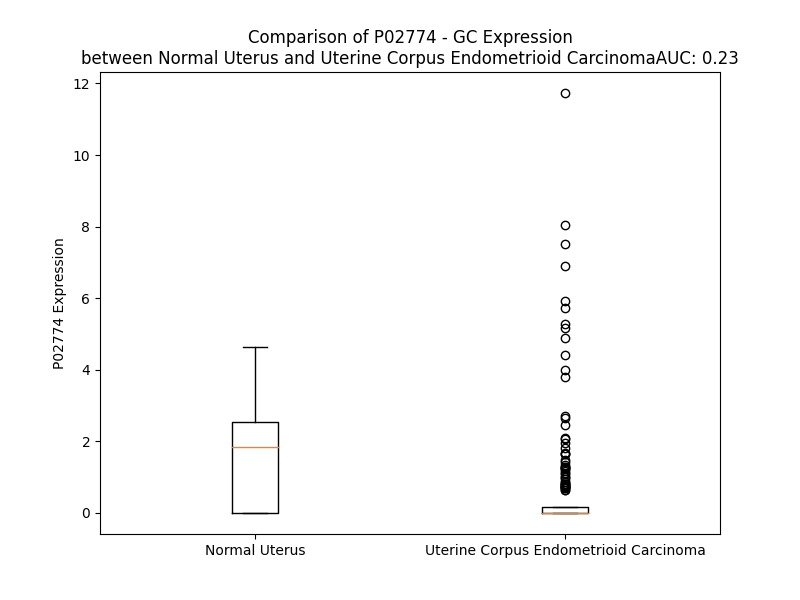

# Detailed Data for P02774

## Introduction to the Detailed Summary

### How to Interpret the Results

- **Summary & Metrics**: This section provides a quick reference to essential protein attributes, including expression changes, family classification, and biomarker applications. Regulation status (upregulated/downregulated) indicates the protein's behavior in a disease context. Some information comes from the original excel file with the proteins selected from literature, while others are derived from the analyses.
- **Expression Comparison**: A visual representation comparing protein expression between normal and disease states. It highlights significant changes in expression levels that might indicate diagnostic or therapeutic relevance. This is data coming from transcriptomics experiments and could not translate similarly to protein levels.
- **Isoform Alignment**: An interactive view of isoform alignments, revealing structural and functional differences between variants of the protein.
- **Interactors & Homologs**: Tables listing known interaction partners and homologous proteins, the more interactors and homologs, the more complex the protein is to design an antibody for.
- **Biological Assemblies**: Information about the structural arrangement of the protein in different assemblies, providing insights into its functional state but also the complexity of the protein to develop antibodies.
- **Combined Per-Residue Information**: A detailed table summarizing residue-level data. This includes predictions for epitope regions, aggregation tendencies, and modifications that might impact the protein's function. Each row corresponds to a residue in the protein, providing insights into specific sites that may be important for research or drug development.
## Summary & Metrics

- **UniProt Accession**: P02774
- **Gene Name**: GC
- **Protein Name**: group-specific component (vitamin D binding protein)
- **Swiss Prot**: nan
- **Family**: transporter
- **Biomarker Application**:  
- **Number of Isoforms**: 3
- **Regulation**: -1
- **(transcriptomics) AUC**: 0.23
- **(transcriptomics) Fold Change**: 2.80
- **(transcriptomics) Regulation**: Downregulated
- **Discotope Epitope Count**: 105
- **Max n_uniprots (Homo)**: 1.0
- **Max n_uniprots (Hetero)**: 2.0

## Expression Comparison

## Isoform Alignment

<pre style='font-size:14px; font-family:monospace;'>P02774-1 -------------------MKRVLVLLLAVAFGHALERGRDYEKNKVCKEFSHLGKEDFTSLSLVLYSRKFPSGTFEQVSQLVKEVVSLTEACCAEGADPDCYDTRTSALSAKSCESNSPFPVHPGTAECCTKEGLERKLCMAALKHQPQEFPTYVEPTNDEICEAFRKDPKEYANQFMWEYSTNYGQAPLSLLVSYTKSYLSMVGSCCTSASPTVCFLKERLQLKHLSLLTTLSNRVCSQYAAYGEKKSRLSNLIKLAQKVPTADLEDVLPLAEDITNILSKCCESASEDCMAKELPEHTVKLCDNLSTKNSKFEDCCQEKTAMDVFVCTYFMPAAQLPELPDVELPTNKDVCDPGNTKVMDKYTFELSRRTHLPEVFLSKVLEPTLKSLGECCDVEDSTTCFNAKGPLLKKELSSFIDKGQELCADYSENTFTEYKKKLAERLKAKLPDATPTELAKLVNKHSDFASNCCSINSPPLYCDSEIDAELKNIL
P02774-2 ---------------------------------------------------------------------------------------------------------------------------------------------MAALKHQPQEFPTYVEPTNDEICEAFRKDPKEYANQFMWEYSTNYGQAPLSLLVSYTKSYLSMVGSCCTSASPTVCFLKERLQLKHLSLLTTLSNRVCSQYAAYGEKKSRLSNLIKLAQKVPTADLEDVLPLAEDITNILSKCCESASEDCMAKELPEHTVKLCDNLSTKNSKFEDCCQEKTAMDVFVCTYFMPAAQLPELPDVELPTNKDVCDPGNTKVMDKYTFELSRRTHLPEVFLSKVLEPTLKSLGECCDVEDSTTCFNAKGPLLKKELSSFIDKGQELCADYSENTFTEYKKKLAERLKAKLPDATPTELAKLVNKHSDFASNCCSINSPPLYCDSEIDAELKNIL
P02774-3 MLWSWSEERGGAARLSGRKMKRVLVLLLAVAFGHALERGRDYEKNKVCKEFSHLGKEDFTSLSLVLYSRKFPSGTFEQVSQLVKEVVSLTEACCAEGADPDCYDTRTSALSAKSCESNSPFPVHPGTAECCTKEGLERKLCMAALKHQPQEFPTYVEPTNDEICEAFRKDPKEYANQFMWEYSTNYGQAPLSLLVSYTKSYLSMVGSCCTSASPTVCFLKERLQLKHLSLLTTLSNRVCSQYAAYGEKKSRLSNLIKLAQKVPTADLEDVLPLAEDITNILSKCCESASEDCMAKELPEHTVKLCDNLSTKNSKFEDCCQEKTAMDVFVCTYFMPAAQLPELPDVELPTNKDVCDPGNTKVMDKYTFELSRRTHLPEVFLSKVLEPTLKSLGECCDVEDSTTCFNAKGPLLKKELSSFIDKGQELCADYSENTFTEYKKKLAERLKAKLPDATPTELAKLVNKHSDFASNCCSINSPPLYCDSEIDAELKNIL
</pre>

## Interactors

| preferredName_A   | preferredName_B   |   score |
|:------------------|:------------------|--------:|
| GC                | CUBN              |   0.997 |
| GC                | LRP2              |   0.994 |
| GC                | ALB               |   0.98  |
| GC                | ACTA2             |   0.972 |
| GC                | ACTC1             |   0.967 |
| GC                | AHSG              |   0.959 |
| GC                | FGB               |   0.931 |
| GC                | AMBP              |   0.917 |
| GC                | SLC25A18          |   0.907 |
| GC                | HP                |   0.906 |

## Homologs

| uniprot_id   | gene_id   |
|:-------------|:----------|
| P02768       | ALB       |
| P43652       | AFM       |
| J3KMX3       | AFP       |

## Biological Assemblies

|   Unnamed: 0 |   assembly |   n_uniprots | composition   | crystal_id   |
|-------------:|-----------:|-------------:|:--------------|:-------------|
|            0 |          1 |            1 | Homo          | 1kw2         |
|            1 |          2 |            1 | Homo          | 1kw2         |
|            0 |          1 |            2 | Hetero        | 1lot         |
|            0 |          1 |            2 | Hetero        | 1kxp         |
|            0 |          1 |            1 | Homo          | 1j78         |
|            1 |          2 |            1 | Homo          | 1j78         |
|            0 |          1 |            1 | Homo          | 1j7e         |
|            1 |          2 |            1 | Homo          | 1j7e         |

## Combined Per-Residue Information

|   res | aa   |   epitope_score | epitope   |   relative_surface_accessibility |   modeling_confidence |   Aggregation | modification   |
|------:|:-----|----------------:|:----------|---------------------------------:|----------------------:|--------------:|:---------------|
|     1 | M    |         0.09539 | False     |                          1.30909 |                 33.65 |         0     | N/A            |
|     2 | K    |         0.17213 | True      |                          1.03666 |                 34.63 |         0     | N/A            |
|     3 | R    |         0.25904 | True      |                          0.932   |                 29.13 |         0     | N/A            |
|     4 | V    |         0.15059 | False     |                          0.89968 |                 32.54 |        73.513 | N/A            |
|     5 | L    |         0.14884 | False     |                          1.11368 |                 32.64 |        90.6   | N/A            |
|     6 | V    |         0.09271 | False     |                          0.83889 |                 30.02 |        99.088 | N/A            |
|     7 | L    |         0.20616 | True      |                          0.95232 |                 29.62 |        99.804 | N/A            |
|     8 | L    |         0.26451 | True      |                          1.07448 |                 28.77 |        99.926 | N/A            |
|     9 | L    |         0.25475 | True      |                          1.06381 |                 30.48 |        99.846 | N/A            |
|    10 | A    |         0.18605 | True      |                          0.73888 |                 27.15 |        99.171 | N/A            |
|    11 | V    |         0.14726 | False     |                          1.05633 |                 31.19 |        98.546 | N/A            |
|    12 | A    |         0.24048 | True      |                          0.87049 |                 31.97 |        91.137 | N/A            |
|    13 | F    |         0.19593 | True      |                          0.85921 |                 29.06 |        84.863 | N/A            |
|    14 | G    |         0.24392 | True      |                          0.8229  |                 29.16 |         7.917 | N/A            |
|    15 | H    |         0.20222 | True      |                          1.04503 |                 32.65 |         0.991 | N/A            |
|    16 | A    |         0.13479 | False     |                          0.60301 |                 35.95 |         0.94  | N/A            |
|    17 | L    |         0.14471 | False     |                          1.04828 |                 43.98 |         0.645 | N/A            |
|    18 | E    |         0.17276 | True      |                          0.7954  |                 54.32 |         0     | N/A            |
|    19 | R    |         0.17863 | True      |                          0.69056 |                 70.35 |         0     | N/A            |
|    20 | G    |         0.23636 | True      |                          0.60039 |                 78.79 |         0     | N/A            |
|    21 | R    |         0.18515 | True      |                          0.74781 |                 80.07 |         0     | N/A            |
|    22 | D    |         0.10337 | False     |                          0.2919  |                 87.61 |         0     | N/A            |
|    23 | Y    |         0.16289 | True      |                          0.35371 |                 91.51 |         0     | N/A            |
|    24 | E    |         0.09662 | False     |                          0.47389 |                 89.95 |         0     | N/A            |
|    25 | K    |         0.04928 | False     |                          0.1789  |                 92.51 |         0     | N/A            |
|    26 | N    |         0.2056  | True      |                          0.58777 |                 93.77 |         0     | N/A            |
|    27 | K    |         0.18343 | True      |                          0.46184 |                 93.87 |         0     | N/A            |
|    28 | V    |         0.02915 | False     |                          0.16661 |                 95.09 |         0     | N/A            |
|    29 | C    |         0.07006 | False     |                          0.19482 |                 96.14 |         0     | N/A            |
|    30 | K    |         0.18286 | True      |                          0.75245 |                 95.91 |         0     | N/A            |
|    31 | E    |         0.07075 | False     |                          0.29339 |                 93.82 |         0     | N/A            |
|    32 | F    |         0.04757 | False     |                          0.15273 |                 96.84 |         0     | N/A            |
|    33 | S    |         0.16087 | True      |                          0.67727 |                 96.73 |         0     | N/A            |
|    34 | H    |         0.2754  | True      |                          0.83147 |                 96.6  |         0     | N/A            |
|    35 | L    |         0.11809 | False     |                          0.40857 |                 95.62 |         0     | N/A            |
|    36 | G    |         0.08049 | False     |                          0.3718  |                 97.52 |         0     | N/A            |
|    37 | K    |         0.05896 | False     |                          0.49718 |                 97.99 |         0     | N/A            |
|    38 | E    |         0.15268 | False     |                          0.53588 |                 96.37 |         0     | N/A            |
|    39 | D    |         0.06738 | False     |                          0.45318 |                 96.65 |         0     | N/A            |
|    40 | F    |         0.01809 | False     |                          0.04714 |                 97.69 |        36.729 | N/A            |
|    41 | T    |         0.03242 | False     |                          0.2712  |                 98.36 |        41.232 | N/A            |
|    42 | S    |         0.02655 | False     |                          0.2761  |                 98.26 |        43.044 | N/A            |
|    43 | L    |         0.04855 | False     |                          0.20399 |                 97.58 |        56.93  | N/A            |
|    44 | S    |         0.01419 | False     |                          0.03653 |                 97.59 |        58.375 | N/A            |
|    45 | L    |         0.00788 | False     |                          0.03627 |                 98.76 |        58.879 | N/A            |
|    46 | V    |         0.00561 | False     |                          0.01428 |                 98.35 |        58.879 | N/A            |
|    47 | L    |         0.04083 | False     |                          0.39039 |                 96.69 |        58.61  | N/A            |
|    48 | Y    |         0.04623 | False     |                          0.1873  |                 97.75 |        50.984 | N/A            |
|    49 | S    |         0.00162 | False     |                          0       |                 98.5  |        18.325 | N/A            |
|    50 | R    |         0.07045 | False     |                          0.15338 |                 96.71 |         0     | N/A            |
|    51 | K    |         0.04262 | False     |                          0.42327 |                 95.83 |         0     | N/A            |
|    52 | F    |         0.01563 | False     |                          0.1032  |                 97.28 |         0     | N/A            |
|    53 | P    |         0.02421 | False     |                          0.19689 |                 96.64 |         0     | N/A            |
|    54 | S    |         0.0854  | False     |                          0.85273 |                 96.25 |         0     | N/A            |
|    55 | G    |         0.02328 | False     |                          0.0781  |                 97.32 |         0     | N/A            |
|    56 | T    |         0.07229 | False     |                          0.44698 |                 98.29 |         0     | N/A            |
|    57 | F    |         0.03221 | False     |                          0.17377 |                 98.58 |         0     | N/A            |
|    58 | E    |         0.12319 | False     |                          0.59886 |                 98.48 |         0     | N/A            |
|    59 | Q    |         0.06462 | False     |                          0.28035 |                 98.49 |         0     | N/A            |
|    60 | V    |         0.00107 | False     |                          0       |                 98.66 |         0.229 | N/A            |
|    61 | S    |         0.03405 | False     |                          0.27432 |                 98.48 |         0.229 | N/A            |
|    62 | Q    |         0.08943 | False     |                          0.29148 |                 98.47 |         0.229 | N/A            |
|    63 | L    |         0.02376 | False     |                          0.05853 |                 98.28 |         2.268 | N/A            |
|    64 | V    |         0.01446 | False     |                          0.03903 |                 98.47 |         2.514 | N/A            |
|    65 | K    |         0.15022 | False     |                          0.67867 |                 98.51 |         2.285 | N/A            |
|    66 | E    |         0.08372 | False     |                          0.22044 |                 98.23 |         2.285 | N/A            |
|    67 | V    |         0.03269 | False     |                          0.09426 |                 97.52 |         5.633 | N/A            |
|    68 | V    |         0.03001 | False     |                          0.05903 |                 98.29 |         5.633 | N/A            |
|    69 | S    |         0.11374 | False     |                          0.38659 |                 98.33 |         4.043 | N/A            |
|    70 | L    |         0.04717 | False     |                          0.04369 |                 97.58 |         3.877 | N/A            |
|    71 | T    |         0.00777 | False     |                          0.00362 |                 97.34 |         3.545 | N/A            |
|    72 | E    |         0.07144 | False     |                          0.37846 |                 97.98 |         0     | N/A            |
|    73 | A    |         0.13799 | False     |                          0.46319 |                 97.8  |         0     | N/A            |
|    74 | C    |         0.02429 | False     |                          0.01851 |                 97.54 |         0     | N/A            |
|    75 | C    |         0.04624 | False     |                          0.2725  |                 96.76 |         0     | N/A            |
|    76 | A    |         0.12786 | False     |                          0.51415 |                 96.41 |         0     | N/A            |
|    77 | E    |         0.20611 | True      |                          0.95014 |                 93.4  |         0     | N/A            |
|    78 | G    |         0.22339 | True      |                          1.04627 |                 93.97 |         0     | N/A            |
|    79 | A    |         0.12394 | False     |                          0.31439 |                 95.02 |         0     | N/A            |
|    80 | D    |         0.33815 | True      |                          0.5505  |                 94.24 |         0     | N/A            |
|    81 | P    |         0.18119 | True      |                          0.70324 |                 92.36 |         0     | N/A            |
|    82 | D    |         0.16738 | True      |                          0.41783 |                 93.97 |         0     | N/A            |
|    83 | C    |         0.06054 | False     |                          0.1696  |                 96.42 |         0     | N/A            |
|    84 | Y    |         0.05844 | False     |                          0.15565 |                 94.2  |         0     | N/A            |
|    85 | D    |         0.21555 | True      |                          0.40191 |                 90.27 |         0     | N/A            |
|    86 | T    |         0.30393 | True      |                          0.62835 |                 93.19 |         0     | N/A            |
|    87 | R    |         0.1172  | False     |                          0.38969 |                 95.23 |         0     | N/A            |
|    88 | T    |         0.08999 | False     |                          0.32881 |                 91.56 |         0     | N/A            |
|    89 | S    |         0.16682 | True      |                          0.5269  |                 90.67 |         0     | N/A            |
|    90 | A    |         0.20509 | True      |                          0.53495 |                 92.96 |         0     | N/A            |
|    91 | L    |         0.07264 | False     |                          0.16795 |                 93.49 |         0     | N/A            |
|    92 | S    |         0.05232 | False     |                          0.31018 |                 92.15 |         0     | N/A            |
|    93 | A    |         0.17908 | True      |                          0.5102  |                 93    |         0     | N/A            |
|    94 | K    |         0.14513 | False     |                          0.30792 |                 95.58 |         0     | N/A            |
|    95 | S    |         0.04572 | False     |                          0.17635 |                 95.31 |         0     | N/A            |
|    96 | C    |         0.08147 | False     |                          0.31537 |                 96.38 |         0     | N/A            |
|    97 | E    |         0.21176 | True      |                          0.5322  |                 95.22 |         0     | N/A            |
|    98 | S    |         0.17129 | True      |                          0.8304  |                 92.98 |         0     | N/A            |
|    99 | N    |         0.23152 | True      |                          0.96641 |                 93.02 |         0     | N/A            |
|   100 | S    |         0.10702 | False     |                          0.14015 |                 94.68 |         0     | N/A            |
|   101 | P    |         0.1448  | False     |                          0.36716 |                 96.21 |         0     | N/A            |
|   102 | F    |         0.02337 | False     |                          0.01543 |                 97.8  |         0     | N/A            |
|   103 | P    |         0.01672 | False     |                          0.0526  |                 97.34 |         0     | N/A            |
|   104 | V    |         0.08706 | False     |                          0.52651 |                 96.6  |         0     | N/A            |
|   105 | H    |         0.06094 | False     |                          0.08725 |                 95.72 |         0     | N/A            |
|   106 | P    |         0.13802 | False     |                          0.84603 |                 95.07 |         0     | N/A            |
|   107 | G    |         0.06317 | False     |                          0.39058 |                 95.13 |         0     | N/A            |
|   108 | T    |         0.03929 | False     |                          0.08281 |                 96.16 |         0     | N/A            |
|   109 | A    |         0.13805 | False     |                          0.71017 |                 95.75 |         0     | N/A            |
|   110 | E    |         0.29129 | True      |                          0.59292 |                 96.56 |         0     | N/A            |
|   111 | C    |         0.01674 | False     |                          0.00935 |                 96.83 |         0     | N/A            |
|   112 | C    |         0.07232 | False     |                          0.16705 |                 96.88 |         0     | N/A            |
|   113 | T    |         0.21402 | True      |                          0.80553 |                 96.3  |         0     | N/A            |
|   114 | K    |         0.19286 | True      |                          0.35198 |                 95.28 |         0     | N/A            |
|   115 | E    |         0.20608 | True      |                          0.68888 |                 90.54 |         0     | N/A            |
|   116 | G    |         0.21811 | True      |                          0.67331 |                 87.65 |         0     | N/A            |
|   117 | L    |         0.35351 | True      |                          0.75923 |                 85.94 |         0     | N/A            |
|   118 | E    |         0.17201 | True      |                          0.4801  |                 90.85 |         0     | N/A            |
|   119 | R    |         0.17348 | True      |                          0.25475 |                 91.5  |         0     | N/A            |
|   120 | K    |         0.17115 | True      |                          0.62002 |                 88.11 |         0     | N/A            |
|   121 | L    |         0.15302 | False     |                          0.65323 |                 91.47 |         0     | N/A            |
|   122 | C    |         0.0749  | False     |                          0.2194  |                 95.81 |         0     | N/A            |
|   123 | M    |         0.06963 | False     |                          0.18122 |                 93.68 |         0     | N/A            |
|   124 | A    |         0.10906 | False     |                          0.79672 |                 90.73 |         0     | N/A            |
|   125 | A    |         0.11544 | False     |                          0.67695 |                 93.39 |         0     | N/A            |
|   126 | L    |         0.05038 | False     |                          0.25348 |                 93.84 |         0     | N/A            |
|   127 | K    |         0.13001 | False     |                          0.86356 |                 89.08 |         0     | N/A            |
|   128 | H    |         0.06733 | False     |                          0.27733 |                 91.8  |         0     | N/A            |
|   129 | Q    |         0.11009 | False     |                          0.60752 |                 92.31 |         0     | N/A            |
|   130 | P    |         0.02292 | False     |                          0.09371 |                 95.14 |         0     | N/A            |
|   131 | Q    |         0.11646 | False     |                          0.30824 |                 95.41 |         0     | N/A            |
|   132 | E    |         0.05293 | False     |                          0.08958 |                 96.32 |         0     | N/A            |
|   133 | F    |         0.17942 | True      |                          0.45311 |                 97.01 |         0     | N/A            |
|   134 | P    |         0.05762 | False     |                          0.32209 |                 96.73 |         0     | N/A            |
|   135 | T    |         0.11657 | False     |                          0.76071 |                 97.47 |         0     | N/A            |
|   136 | Y    |         0.04174 | False     |                          0.13788 |                 97.87 |         0     | N/A            |
|   137 | V    |         0.17237 | True      |                          0.85682 |                 97.9  |         0     | N/A            |
|   138 | E    |         0.08605 | False     |                          0.28303 |                 97.85 |         0     | N/A            |
|   139 | P    |         0.10747 | False     |                          0.42015 |                 98.04 |         0     | N/A            |
|   140 | T    |         0.12343 | False     |                          0.59822 |                 98.4  |         0     | N/A            |
|   141 | N    |         0.09907 | False     |                          0.30056 |                 98.41 |         0     | N/A            |
|   142 | D    |         0.23701 | True      |                          0.73386 |                 97.72 |         0     | N/A            |
|   143 | E    |         0.13638 | False     |                          0.47737 |                 98.5  |         0     | N/A            |
|   144 | I    |         0.01227 | False     |                          0.0024  |                 98.66 |         0     | N/A            |
|   145 | C    |         0.05501 | False     |                          0.038   |                 98.59 |         0     | N/A            |
|   146 | E    |         0.31226 | True      |                          0.64646 |                 98.45 |         0     | N/A            |
|   147 | A    |         0.04464 | False     |                          0.42488 |                 98.35 |         0     | N/A            |
|   148 | F    |         0.03628 | False     |                          0.1809  |                 98.42 |         0     | N/A            |
|   149 | R    |         0.22869 | True      |                          0.5985  |                 98.07 |         0     | N/A            |
|   150 | K    |         0.29803 | True      |                          0.89753 |                 98.23 |         0     | N/A            |
|   151 | D    |         0.2788  | True      |                          0.39366 |                 98.25 |         0     | N/A            |
|   152 | P    |         0.10675 | False     |                          0.51635 |                 97.59 |         0     | N/A            |
|   153 | K    |         0.1187  | False     |                          0.58873 |                 97.35 |         0     | N/A            |
|   154 | E    |         0.10341 | False     |                          0.39525 |                 97.64 |         0     | N/A            |
|   155 | Y    |         0.05867 | False     |                          0.10726 |                 98.54 |         0     | N/A            |
|   156 | A    |         0.02006 | False     |                          0.18494 |                 98.67 |         0     | N/A            |
|   157 | N    |         0.01643 | False     |                          0.22641 |                 98.68 |         0     | N/A            |
|   158 | Q    |         0.05188 | False     |                          0.43587 |                 98.53 |         0     | N/A            |
|   159 | F    |         0.02833 | False     |                          0.05436 |                 98.74 |         0     | N/A            |
|   160 | M    |         0.02007 | False     |                          0.06676 |                 98.82 |         0     | N/A            |
|   161 | W    |         0.03451 | False     |                          0.22443 |                 98.82 |         0     | N/A            |
|   162 | E    |         0.02721 | False     |                          0.26195 |                 98.65 |         0     | N/A            |
|   163 | Y    |         0.01697 | False     |                          0.01336 |                 98.72 |         0     | N/A            |
|   164 | S    |         0.00177 | False     |                          0       |                 98.45 |         0     | N/A            |
|   165 | T    |         0.03251 | False     |                          0.05464 |                 98.21 |         0     | N/A            |
|   166 | N    |         0.03243 | False     |                          0.07316 |                 98.43 |         0     | N/A            |
|   167 | Y    |         0.02612 | False     |                          0.12513 |                 98.05 |         0     | N/A            |
|   168 | G    |         0.02244 | False     |                          0.06042 |                 96.56 |         0     | N/A            |
|   169 | Q    |         0.03036 | False     |                          0.10163 |                 96    |         0     | N/A            |
|   170 | A    |         0.00169 | False     |                          0       |                 94.71 |         0     | N/A            |
|   171 | P    |         0.01317 | False     |                          0.02485 |                 91.23 |         0.145 | N/A            |
|   172 | L    |         0.06399 | False     |                          0.34122 |                 91.58 |        16.386 | N/A            |
|   173 | S    |         0.04037 | False     |                          0.21715 |                 89.59 |        17.194 | N/A            |
|   174 | L    |         0.01312 | False     |                          0.02638 |                 92.17 |        21.542 | N/A            |
|   175 | L    |         0.0014  | False     |                          0       |                 95.51 |        21.839 | N/A            |
|   176 | V    |         0.01737 | False     |                          0.31439 |                 95.47 |        21.839 | N/A            |
|   177 | S    |         0.04774 | False     |                          0.31457 |                 95.11 |         9.863 | N/A            |
|   178 | Y    |         0.03429 | False     |                          0.05556 |                 97.17 |         8.129 | N/A            |
|   179 | T    |         0.01067 | False     |                          0.0181  |                 98.28 |         3.218 | N/A            |
|   180 | K    |         0.1295  | False     |                          0.69163 |                 97.98 |         0     | N/A            |
|   181 | S    |         0.04461 | False     |                          0.31029 |                 98.11 |         0     | N/A            |
|   182 | Y    |         0.02987 | False     |                          0.01203 |                 98.71 |         0.72  | N/A            |
|   183 | L    |         0.04098 | False     |                          0.19695 |                 98.62 |         0.72  | N/A            |
|   184 | S    |         0.1114  | False     |                          0.57566 |                 98.5  |         0.72  | N/A            |
|   185 | M    |         0.03482 | False     |                          0.03011 |                 98.66 |         0.72  | N/A            |
|   186 | V    |         0.00732 | False     |                          0       |                 98.69 |         0.72  | N/A            |
|   187 | G    |         0.07721 | False     |                          0.262   |                 98.21 |         0     | N/A            |
|   188 | S    |         0.12486 | False     |                          0.40528 |                 98.27 |         0     | N/A            |
|   189 | C    |         0.00478 | False     |                          0       |                 98.74 |         0     | N/A            |
|   190 | C    |         0.05098 | False     |                          0.0415  |                 98.49 |         0     | N/A            |
|   191 | T    |         0.17346 | True      |                          0.7789  |                 97.57 |         0     | N/A            |
|   192 | S    |         0.07946 | False     |                          0.30143 |                 98.03 |         0     | N/A            |
|   193 | A    |         0.17729 | True      |                          1.0625  |                 97.71 |         0     | N/A            |
|   194 | S    |         0.1972  | True      |                          0.45882 |                 97.93 |         0     | N/A            |
|   195 | P    |         0.12195 | False     |                          0.35687 |                 97.5  |         0.166 | N/A            |
|   196 | T    |         0.23849 | True      |                          0.72794 |                 98.01 |        13.676 | N/A            |
|   197 | V    |         0.1879  | True      |                          0.748   |                 98.52 |        13.676 | N/A            |
|   198 | C    |         0.06331 | False     |                          0.1722  |                 98.77 |        13.676 | N/A            |
|   199 | F    |         0.01373 | False     |                          0.00745 |                 98.7  |        13.676 | N/A            |
|   200 | L    |         0.2154  | True      |                          0.70543 |                 98.46 |        13.676 | N/A            |
|   201 | K    |         0.29434 | True      |                          0.60952 |                 98.48 |         0     | N/A            |
|   202 | E    |         0.06172 | False     |                          0.25849 |                 98.44 |         0     | N/A            |
|   203 | R    |         0.14625 | False     |                          0.33245 |                 98.22 |         0     | N/A            |
|   204 | L    |         0.21399 | True      |                          0.73247 |                 96.75 |         0     | N/A            |
|   205 | Q    |         0.20848 | True      |                          0.60651 |                 96.42 |         0     | N/A            |
|   206 | L    |         0.06895 | False     |                          0.12413 |                 96.1  |         0     | N/A            |
|   207 | K    |         0.13779 | False     |                          0.4647  |                 94.38 |         0     | N/A            |
|   208 | H    |         0.08817 | False     |                          0.51797 |                 92.21 |         0     | N/A            |
|   209 | L    |         0.02969 | False     |                          0.20998 |                 93.35 |         1.135 | N/A            |
|   210 | S    |         0.06335 | False     |                          0.25066 |                 95.48 |         1.521 | N/A            |
|   211 | L    |         0.02942 | False     |                          0.25473 |                 94.3  |         5.164 | N/A            |
|   212 | L    |         0.00803 | False     |                          0.02968 |                 93.2  |         5.164 | N/A            |
|   213 | T    |         0.00119 | False     |                          0       |                 94.44 |         5.164 | N/A            |
|   214 | T    |         0.04835 | False     |                          0.28017 |                 96.01 |         4.93  | N/A            |
|   215 | L    |         0.0313  | False     |                          0.05276 |                 93.59 |         4.791 | N/A            |
|   216 | S    |         0.00251 | False     |                          0.00283 |                 94.63 |         0.158 | N/A            |
|   217 | N    |         0.01707 | False     |                          0.01937 |                 96.41 |         0     | N/A            |
|   218 | R    |         0.05963 | False     |                          0.23194 |                 96.91 |         0     | N/A            |
|   219 | V    |         0.01937 | False     |                          0.05663 |                 96.98 |         0     | N/A            |
|   220 | C    |         0.02068 | False     |                          0.01145 |                 97.04 |         0     | N/A            |
|   221 | S    |         0.01296 | False     |                          0.02204 |                 97.59 |         0     | N/A            |
|   222 | Q    |         0.0233  | False     |                          0.11132 |                 97.79 |         0     | N/A            |
|   223 | Y    |         0.03523 | False     |                          0.11519 |                 97.85 |         0.13  | N/A            |
|   224 | A    |         0.03723 | False     |                          0.51523 |                 96.29 |         0.13  | N/A            |
|   225 | A    |         0.04354 | False     |                          0.22554 |                 96.78 |         0.13  | N/A            |
|   226 | Y    |         0.06443 | False     |                          0.1368  |                 97    |         0.13  | N/A            |
|   227 | G    |         0.09797 | False     |                          0.36881 |                 95.83 |         0.13  | N/A            |
|   228 | E    |         0.03836 | False     |                          0.48602 |                 95.44 |         0     | N/A            |
|   229 | K    |         0.14099 | False     |                          0.91404 |                 93.81 |         0     | N/A            |
|   230 | K    |         0.03071 | False     |                          0.17673 |                 96.48 |         0     | N/A            |
|   231 | S    |         0.00567 | False     |                          0.03897 |                 97.96 |         0     | N/A            |
|   232 | R    |         0.04247 | False     |                          0.20794 |                 97.68 |         0     | N/A            |
|   233 | L    |         0.016   | False     |                          0.13979 |                 97.44 |         0     | N/A            |
|   234 | S    |         0.00881 | False     |                          0.03583 |                 98.63 |         0     | N/A            |
|   235 | N    |         0.02357 | False     |                          0.15978 |                 98.66 |         0     | N/A            |
|   236 | L    |         0.00287 | False     |                          0.00495 |                 98.73 |         0     | N/A            |
|   237 | I    |         0.00156 | False     |                          0       |                 98.78 |         0     | N/A            |
|   238 | K    |         0.0199  | False     |                          0.07983 |                 98.75 |         0     | N/A            |
|   239 | L    |         0.01379 | False     |                          0.11294 |                 98.75 |         0     | N/A            |
|   240 | A    |         0.00086 | False     |                          0       |                 98.67 |         0     | N/A            |
|   241 | Q    |         0.00734 | False     |                          0.01627 |                 98.61 |         0     | N/A            |
|   242 | K    |         0.01434 | False     |                          0.06664 |                 98.57 |         0     | N/A            |
|   243 | V    |         0.00919 | False     |                          0       |                 98.38 |         0     | N/A            |
|   244 | P    |         0.02853 | False     |                          0.03773 |                 98.06 |         0     | N/A            |
|   245 | T    |         0.10676 | False     |                          0.6084  |                 96.9  |         0     | N/A            |
|   246 | A    |         0.0226  | False     |                          0.01148 |                 97.56 |         0     | N/A            |
|   247 | D    |         0.08571 | False     |                          0.5301  |                 97.88 |         0     | N/A            |
|   248 | L    |         0.02201 | False     |                          0.06798 |                 98.04 |         0     | N/A            |
|   249 | E    |         0.127   | False     |                          0.56423 |                 97.85 |         0     | N/A            |
|   250 | D    |         0.08024 | False     |                          0.1413  |                 98.36 |         0     | N/A            |
|   251 | V    |         0.0017  | False     |                          0       |                 98.58 |         0     | N/A            |
|   252 | L    |         0.01506 | False     |                          0.16652 |                 98.26 |         0     | N/A            |
|   253 | P    |         0.12777 | False     |                          0.48383 |                 98.28 |         0     | N/A            |
|   254 | L    |         0.01335 | False     |                          0.02143 |                 98.71 |         0     | N/A            |
|   255 | A    |         0.00159 | False     |                          0       |                 98.51 |         0     | N/A            |
|   256 | E    |         0.09725 | False     |                          0.33612 |                 97.95 |         0     | N/A            |
|   257 | D    |         0.08424 | False     |                          0.1576  |                 98.32 |         0     | N/A            |
|   258 | I    |         0.04457 | False     |                          0.0864  |                 98.04 |         0.948 | N/A            |
|   259 | T    |         0.00996 | False     |                          0.02475 |                 97.89 |         0.948 | N/A            |
|   260 | N    |         0.12819 | False     |                          0.56083 |                 97.49 |         0.948 | N/A            |
|   261 | I    |         0.06769 | False     |                          0.04469 |                 96.81 |         0.948 | N/A            |
|   262 | L    |         0.01162 | False     |                          0.03792 |                 96.64 |         0.948 | N/A            |
|   263 | S    |         0.07948 | False     |                          0.31576 |                 96.02 |         0     | N/A            |
|   264 | K    |         0.21086 | True      |                          0.59179 |                 95.09 |         0     | N/A            |
|   265 | C    |         0.0044  | False     |                          0       |                 95.09 |         0     | N/A            |
|   266 | C    |         0.03427 | False     |                          0.1251  |                 93.25 |         0     | N/A            |
|   267 | E    |         0.18321 | True      |                          0.80984 |                 81.7  |         0     | N/A            |
|   268 | S    |         0.09515 | False     |                          0.23923 |                 85.52 |         0     | N/A            |
|   269 | A    |         0.26914 | True      |                          0.94625 |                 79.06 |         0     | N/A            |
|   270 | S    |         0.19688 | True      |                          0.37442 |                 79.03 |         0     | N/A            |
|   271 | E    |         0.24375 | True      |                          0.54364 |                 70    |         0     | N/A            |
|   272 | D    |         0.19174 | True      |                          0.29155 |                 82.86 |         0     | N/A            |
|   273 | C    |         0.0418  | False     |                          0.07279 |                 92.06 |         0     | N/A            |
|   274 | M    |         0.0167  | False     |                          0.00946 |                 91.17 |         0     | N/A            |
|   275 | A    |         0.08284 | False     |                          0.29265 |                 88.31 |         0     | N/A            |
|   276 | K    |         0.28065 | True      |                          0.62978 |                 91.34 |         0     | N/A            |
|   277 | E    |         0.07192 | False     |                          0.20554 |                 94.57 |         0     | N/A            |
|   278 | L    |         0.00949 | False     |                          0.00247 |                 91.35 |         0     | N/A            |
|   279 | P    |         0.10333 | False     |                          0.34385 |                 91.96 |         0     | N/A            |
|   280 | E    |         0.16878 | True      |                          0.57203 |                 95.72 |         0     | N/A            |
|   281 | H    |         0.03022 | False     |                          0.03628 |                 97.62 |         0     | N/A            |
|   282 | T    |         0.03638 | False     |                          0.03732 |                 97.49 |         0     | N/A            |
|   283 | V    |         0.17321 | True      |                          0.63966 |                 98.15 |         0     | N/A            |
|   284 | K    |         0.07468 | False     |                          0.4544  |                 98.37 |         0     | N/A            |
|   285 | L    |         0.01068 | False     |                          0.04534 |                 98.59 |         0     | N/A            |
|   286 | C    |         0.03819 | False     |                          0.16039 |                 98.62 |         0     | N/A            |
|   287 | D    |         0.22406 | True      |                          0.68448 |                 98.41 |         0     | N/A            |
|   288 | N    |         0.07236 | False     |                          0.30061 |                 98.33 |         0     | N/A            |
|   289 | L    |         0.00371 | False     |                          0       |                 98.61 |         0     | N/A            |
|   290 | S    |         0.06634 | False     |                          0.2369  |                 98.01 |         0     | N/A            |
|   291 | T    |         0.20055 | True      |                          0.88874 |                 98.02 |         0     | N/A            |
|   292 | K    |         0.08222 | False     |                          0.34323 |                 97.76 |         0     | N/A            |
|   293 | N    |         0.08265 | False     |                          0.24527 |                 96.77 |         0     | N/A            |
|   294 | S    |         0.12605 | False     |                          0.56807 |                 97.53 |         0     | N/A            |
|   295 | K    |         0.09665 | False     |                          0.39383 |                 98.13 |         0     | N/A            |
|   296 | F    |         0.00512 | False     |                          0.00255 |                 98.43 |         0     | N/A            |
|   297 | E    |         0.13911 | False     |                          0.44653 |                 98.52 |         0     | N/A            |
|   298 | D    |         0.21523 | True      |                          0.54188 |                 98.55 |         0     | N/A            |
|   299 | C    |         0.01349 | False     |                          0.02813 |                 98.46 |         0     | N/A            |
|   300 | C    |         0.05148 | False     |                          0.2375  |                 98.53 |         0     | N/A            |
|   301 | Q    |         0.28206 | True      |                          0.58823 |                 98.31 |         0     | N/A            |
|   302 | E    |         0.12439 | False     |                          0.40987 |                 97.56 |         0     | N/A            |
|   303 | K    |         0.24574 | True      |                          0.91043 |                 95.42 |         0.053 | N/A            |
|   304 | T    |         0.18253 | True      |                          0.45998 |                 92.81 |         0.053 | N/A            |
|   305 | A    |         0.0602  | False     |                          0.2786  |                 93.82 |         0.053 | N/A            |
|   306 | M    |         0.02124 | False     |                          0.01796 |                 91.17 |         0.053 | N/A            |
|   307 | D    |         0.07188 | False     |                          0.12933 |                 94.11 |         0.053 | N/A            |
|   308 | V    |         0.02536 | False     |                          0.07712 |                 97.05 |        64.181 | N/A            |
|   309 | F    |         0.01982 | False     |                          0.06115 |                 96.12 |        69.438 | N/A            |
|   310 | V    |         0.07208 | False     |                          0.21707 |                 95.42 |        70.522 | N/A            |
|   311 | C    |         0.09889 | False     |                          0.29726 |                 98.06 |        70.522 | N/A            |
|   312 | T    |         0.02362 | False     |                          0.05616 |                 98.04 |        70.522 | N/A            |
|   313 | Y    |         0.09229 | False     |                          0.10122 |                 97.24 |        69.169 | N/A            |
|   314 | F    |         0.14344 | False     |                          0.66608 |                 97.22 |        64.107 | N/A            |
|   315 | M    |         0.03205 | False     |                          0.04711 |                 97.88 |         0.896 | N/A            |
|   316 | P    |         0.13034 | False     |                          0.57207 |                 96.35 |         0.448 | N/A            |
|   317 | A    |         0.0457  | False     |                          0.35396 |                 96.67 |         0     | N/A            |
|   318 | A    |         0.02389 | False     |                          0.16332 |                 95.61 |         0     | N/A            |
|   319 | Q    |         0.14436 | False     |                          0.90097 |                 92.5  |         0     | N/A            |
|   320 | L    |         0.04201 | False     |                          0.17936 |                 92.46 |         0     | N/A            |
|   321 | P    |         0.09435 | False     |                          0.33617 |                 92.22 |         0     | N/A            |
|   322 | E    |         0.14849 | False     |                          0.93961 |                 90.62 |         0     | N/A            |
|   323 | L    |         0.14854 | False     |                          0.4063  |                 92.85 |         0     | N/A            |
|   324 | P    |         0.17961 | True      |                          0.79897 |                 92.01 |         0     | N/A            |
|   325 | D    |         0.09176 | False     |                          0.82916 |                 90.86 |         0     | N/A            |
|   326 | V    |         0.04402 | False     |                          0.2621  |                 93.13 |         0     | N/A            |
|   327 | E    |         0.1175  | False     |                          0.54784 |                 92.59 |         0     | N/A            |
|   328 | L    |         0.02708 | False     |                          0.07216 |                 92.82 |         0     | N/A            |
|   329 | P    |         0.02227 | False     |                          0.12525 |                 91.96 |         0     | N/A            |
|   330 | T    |         0.05239 | False     |                          0.38284 |                 88.22 |         0     | N/A            |
|   331 | N    |         0.14256 | False     |                          0.42278 |                 85.29 |         0     | N/A            |
|   332 | K    |         0.23218 | True      |                          0.62195 |                 85.39 |         0     | N/A            |
|   333 | D    |         0.09907 | False     |                          0.52091 |                 85.01 |         0     | N/A            |
|   334 | V    |         0.0473  | False     |                          0.12817 |                 86.99 |         0     | N/A            |
|   335 | C    |         0.07375 | False     |                          0.26646 |                 87.13 |         0     | N/A            |
|   336 | D    |         0.25583 | True      |                          0.46344 |                 84.43 |         0     | N/A            |
|   337 | P    |         0.24579 | True      |                          0.99304 |                 73.72 |         0     | N/A            |
|   338 | G    |         0.41049 | True      |                          0.90577 |                 71.03 |         0     | N/A            |
|   339 | N    |         0.24645 | True      |                          0.41348 |                 76.1  |         0     | N/A            |
|   340 | T    |         0.15623 | True      |                          0.51284 |                 86.09 |         0     | N/A            |
|   341 | K    |         0.14696 | False     |                          0.56809 |                 89.85 |         0     | N/A            |
|   342 | V    |         0.03164 | False     |                          0.28761 |                 92.22 |         0     | N/A            |
|   343 | M    |         0.04696 | False     |                          0.16014 |                 92.44 |         0     | N/A            |
|   344 | D    |         0.0187  | False     |                          0.04808 |                 95.21 |         0     | N/A            |
|   345 | K    |         0.04446 | False     |                          0.55222 |                 96.12 |         0     | N/A            |
|   346 | Y    |         0.02944 | False     |                          0.03652 |                 95.75 |         0     | N/A            |
|   347 | T    |         0.0033  | False     |                          0.00579 |                 97.35 |         0     | N/A            |
|   348 | F    |         0.00614 | False     |                          0.00701 |                 98.36 |         0     | N/A            |
|   349 | E    |         0.01979 | False     |                          0.15892 |                 98.07 |         0     | N/A            |
|   350 | L    |         0.01999 | False     |                          0.07749 |                 97.5  |         0     | N/A            |
|   351 | S    |         0.00138 | False     |                          0       |                 98.2  |         0     | N/A            |
|   352 | R    |         0.03612 | False     |                          0.12408 |                 97.68 |         0     | N/A            |
|   353 | R    |         0.07506 | False     |                          0.21647 |                 96.5  |         0     | N/A            |
|   354 | T    |         0.03479 | False     |                          0.07705 |                 96.64 |         0     | N/A            |
|   355 | H    |         0.02763 | False     |                          0.53432 |                 96.04 |         0     | N/A            |
|   356 | L    |         0.01805 | False     |                          0.03886 |                 97.24 |         0     | N/A            |
|   357 | P    |         0.01483 | False     |                          0.11773 |                 98.32 |         0     | N/A            |
|   358 | E    |         0.00284 | False     |                          0.0053  |                 98.49 |         0.368 | N/A            |
|   359 | V    |         0.01105 | False     |                          0.04574 |                 98.37 |         0.368 | N/A            |
|   360 | F    |         0.00257 | False     |                          0       |                 98.53 |         0.368 | N/A            |
|   361 | L    |         0.00097 | False     |                          0       |                 98.35 |         0.368 | N/A            |
|   362 | S    |         0.0021  | False     |                          0.00104 |                 98.12 |         0.368 | N/A            |
|   363 | K    |         0.0213  | False     |                          0.1557  |                 97.78 |         0.368 | N/A            |
|   364 | V    |         0.04956 | False     |                          0.10758 |                 97.29 |         0.368 | N/A            |
|   365 | L    |         0.00311 | False     |                          0       |                 96.35 |         0.368 | N/A            |
|   366 | E    |         0.1171  | False     |                          0.40973 |                 91.15 |         0     | N/A            |
|   367 | P    |         0.1187  | False     |                          0.53398 |                 93.5  |         0     | N/A            |
|   368 | T    |         0.02157 | False     |                          0.06558 |                 94.56 |         0     | N/A            |
|   369 | L    |         0.03253 | False     |                          0.13508 |                 91.07 |         0     | N/A            |
|   370 | K    |         0.19074 | True      |                          0.71739 |                 90.53 |         0     | N/A            |
|   371 | S    |         0.03923 | False     |                          0.22175 |                 92.26 |         0     | N/A            |
|   372 | L    |         0.0055  | False     |                          0.00082 |                 90.34 |         0     | N/A            |
|   373 | G    |         0.09427 | False     |                          0.33298 |                 88.73 |         0     | N/A            |
|   374 | E    |         0.16088 | True      |                          0.47593 |                 91.54 |         0     | N/A            |
|   375 | C    |         0.00959 | False     |                          0       |                 93.28 |         0     | N/A            |
|   376 | C    |         0.08403 | False     |                          0.25674 |                 91.36 |         0     | N/A            |
|   377 | D    |         0.29548 | True      |                          0.85165 |                 89.34 |         0     | N/A            |
|   378 | V    |         0.26813 | True      |                          0.46441 |                 92.75 |         0     | N/A            |
|   379 | E    |         0.28428 | True      |                          0.97279 |                 91.43 |         0     | N/A            |
|   380 | D    |         0.23923 | True      |                          0.46589 |                 93.59 |         0     | N/A            |
|   381 | S    |         0.09099 | False     |                          0.08432 |                 92.89 |         0     | N/A            |
|   382 | T    |         0.19735 | True      |                          0.51445 |                 91.87 |         0     | N/A            |
|   383 | T    |         0.17785 | True      |                          0.57503 |                 94.15 |         0     | N/A            |
|   384 | C    |         0.06612 | False     |                          0.18202 |                 95.72 |         0     | N/A            |
|   385 | F    |         0.04005 | False     |                          0.01778 |                 94.5  |         0     | N/A            |
|   386 | N    |         0.2405  | True      |                          0.65584 |                 93.12 |         0     | N/A            |
|   387 | A    |         0.20749 | True      |                          0.57829 |                 93.92 |         0     | N/A            |
|   388 | K    |         0.17572 | True      |                          0.28005 |                 93.53 |         0     | N/A            |
|   389 | G    |         0.04516 | False     |                          0.05678 |                 91.78 |         0     | N/A            |
|   390 | P    |         0.15245 | False     |                          0.63143 |                 92.69 |         0     | N/A            |
|   391 | L    |         0.18083 | True      |                          0.67346 |                 94.63 |         0     | N/A            |
|   392 | L    |         0.04156 | False     |                          0.09559 |                 94.59 |         0     | N/A            |
|   393 | K    |         0.06415 | False     |                          0.47225 |                 93.41 |         0     | N/A            |
|   394 | K    |         0.14057 | False     |                          0.74095 |                 94.32 |         0     | N/A            |
|   395 | E    |         0.13566 | False     |                          0.58082 |                 95.38 |         0     | N/A            |
|   396 | L    |         0.00996 | False     |                          0.0563  |                 95.38 |         4.996 | N/A            |
|   397 | S    |         0.0794  | False     |                          0.4086  |                 94.63 |         4.996 | N/A            |
|   398 | S    |         0.06746 | False     |                          0.37611 |                 95.62 |         4.996 | N/A            |
|   399 | F    |         0.05104 | False     |                          0.15279 |                 97.05 |         4.996 | N/A            |
|   400 | I    |         0.0177  | False     |                          0.12559 |                 96.56 |         4.996 | N/A            |
|   401 | D    |         0.06338 | False     |                          0.54891 |                 95.74 |         0     | N/A            |
|   402 | K    |         0.045   | False     |                          0.37474 |                 96.59 |         0     | N/A            |
|   403 | G    |         0.0021  | False     |                          0       |                 97.28 |         0     | N/A            |
|   404 | Q    |         0.03097 | False     |                          0.32714 |                 96.21 |         0     | N/A            |
|   405 | E    |         0.06324 | False     |                          0.30791 |                 95.29 |         0     | N/A            |
|   406 | L    |         0.01182 | False     |                          0.03892 |                 96.49 |         0     | N/A            |
|   407 | C    |         0.02895 | False     |                          0.12079 |                 97.26 |         0     | N/A            |
|   408 | A    |         0.15158 | False     |                          0.35152 |                 95.75 |         0     | N/A            |
|   409 | D    |         0.06404 | False     |                          0.16046 |                 95.34 |         0     | N/A            |
|   410 | Y    |         0.0751  | False     |                          0.22177 |                 97.33 |         0     | N/A            |
|   411 | S    |         0.05339 | False     |                          0.58098 |                 93.18 |         0     | N/A            |
|   412 | E    |         0.25645 | True      |                          0.56521 |                 92.31 |         0     | N/A            |
|   413 | N    |         0.12979 | False     |                          0.21722 |                 95.26 |         0     | N/A            |
|   414 | T    |         0.14019 | False     |                          0.67503 |                 97.04 |         0     | N/A            |
|   415 | F    |         0.07975 | False     |                          0.48684 |                 97.68 |         0     | N/A            |
|   416 | T    |         0.16821 | True      |                          0.68439 |                 97.5  |         0     | N/A            |
|   417 | E    |         0.13297 | False     |                          0.32398 |                 98.17 |         0     | N/A            |
|   418 | Y    |         0.00937 | False     |                          0.00291 |                 98.05 |         0     | N/A            |
|   419 | K    |         0.10417 | False     |                          0.29002 |                 97.89 |         0     | N/A            |
|   420 | K    |         0.25953 | True      |                          0.59131 |                 97.54 |         0     | N/A            |
|   421 | K    |         0.13383 | False     |                          0.36266 |                 97.66 |         0     | N/A            |
|   422 | L    |         0.01392 | False     |                          0.01814 |                 96.89 |         0     | N/A            |
|   423 | A    |         0.05616 | False     |                          0.27651 |                 96.67 |         0     | N/A            |
|   424 | E    |         0.24925 | True      |                          0.63375 |                 96.43 |         0     | N/A            |
|   425 | R    |         0.13797 | False     |                          0.28356 |                 95.66 |         0     | N/A            |
|   426 | L    |         0.0301  | False     |                          0.11364 |                 94.92 |         0     | N/A            |
|   427 | K    |         0.19904 | True      |                          0.66157 |                 95.3  |         0     | N/A            |
|   428 | A    |         0.16524 | True      |                          0.75692 |                 95.22 |         0     | N/A            |
|   429 | K    |         0.14286 | False     |                          0.45427 |                 93.54 |         0     | N/A            |
|   430 | L    |         0.10226 | False     |                          0.28774 |                 94.22 |         0     | N/A            |
|   431 | P    |         0.19732 | True      |                          0.78697 |                 92.76 |         0     | N/A            |
|   432 | D    |         0.31851 | True      |                          0.87238 |                 94.75 |         0     | N/A            |
|   433 | A    |         0.1382  | False     |                          0.2973  |                 93.51 |         0     | N/A            |
|   434 | T    |         0.19564 | True      |                          0.48252 |                 95.43 |         0     | N/A            |
|   435 | P    |         0.14124 | False     |                          0.85924 |                 94.79 |         0     | N/A            |
|   436 | T    |         0.20956 | True      |                          0.76658 |                 95.99 |         0     | N/A            |
|   437 | E    |         0.17577 | True      |                          0.46789 |                 95.23 |         0     | N/A            |
|   438 | L    |         0.06647 | False     |                          0.16734 |                 95.28 |         0     | N/A            |
|   439 | A    |         0.09589 | False     |                          0.4999  |                 96.05 |         0     | N/A            |
|   440 | K    |         0.19538 | True      |                          0.76116 |                 96.32 |         0     | N/A            |
|   441 | L    |         0.08946 | False     |                          0.313   |                 95.35 |         0     | N/A            |
|   442 | V    |         0.05365 | False     |                          0.08949 |                 96.65 |         0     | N/A            |
|   443 | N    |         0.19138 | True      |                          0.523   |                 96.94 |         0     | N/A            |
|   444 | K    |         0.13739 | False     |                          0.48694 |                 96.02 |         0     | N/A            |
|   445 | H    |         0.03836 | False     |                          0.15162 |                 96.15 |         0     | N/A            |
|   446 | S    |         0.03731 | False     |                          0.0253  |                 97.21 |         0     | N/A            |
|   447 | D    |         0.14435 | False     |                          0.4875  |                 97.1  |         0     | N/A            |
|   448 | F    |         0.0453  | False     |                          0.03863 |                 97.91 |         0     | N/A            |
|   449 | A    |         0.00152 | False     |                          0       |                 97.75 |         0     | N/A            |
|   450 | S    |         0.09459 | False     |                          0.37318 |                 97.86 |         0     | N/A            |
|   451 | N    |         0.07495 | False     |                          0.21146 |                 98.12 |         0     | N/A            |
|   452 | C    |         0.00505 | False     |                          0       |                 98.53 |         0     | N/A            |
|   453 | C    |         0.03976 | False     |                          0.07729 |                 98.27 |         0     | N/A            |
|   454 | S    |         0.06446 | False     |                          0.35528 |                 97.31 |         0     | N/A            |
|   455 | I    |         0.01972 | False     |                          0.09756 |                 97.95 |         0     | N/A            |
|   456 | N    |         0.08371 | False     |                          0.20903 |                 97.49 |         0     | N/A            |
|   457 | S    |         0.02011 | False     |                          0.01863 |                 98.38 |         0     | N/A            |
|   458 | P    |         0.03236 | False     |                          0.11531 |                 98.14 |         0     | N/A            |
|   459 | P    |         0.02021 | False     |                          0.07329 |                 98.07 |         0     | N/A            |
|   460 | L    |         0.0636  | False     |                          0.36466 |                 97.02 |         0     | N/A            |
|   461 | Y    |         0.14094 | False     |                          0.28818 |                 97.97 |         0     | N/A            |
|   462 | C    |         0.00621 | False     |                          0       |                 98.42 |         0     | N/A            |
|   463 | D    |         0.06554 | False     |                          0.41221 |                 97.66 |         0     | N/A            |
|   464 | S    |         0.10883 | False     |                          0.51171 |                 95.84 |         0     | N/A            |
|   465 | E    |         0.10079 | False     |                          0.28621 |                 97.55 |         0     | N/A            |
|   466 | I    |         0.01009 | False     |                          0.0032  |                 97.6  |         0     | N/A            |
|   467 | D    |         0.10486 | False     |                          0.37003 |                 95.44 |         0     | N/A            |
|   468 | A    |         0.13441 | False     |                          0.42793 |                 95.08 |         0     | N/A            |
|   469 | E    |         0.04698 | False     |                          0.06185 |                 93.65 |         0     | N/A            |
|   470 | L    |         0.02923 | False     |                          0.15903 |                 90.57 |         0     | N/A            |
|   471 | K    |         0.09405 | False     |                          0.85636 |                 86.04 |         0     | N/A            |
|   472 | N    |         0.0995  | False     |                          0.46155 |                 73.56 |         0     | N/A            |
|   473 | I    |         0.0453  | False     |                          0.27327 |                 63.07 |         0     | N/A            |
|   474 | L    |         0.09266 | False     |                          0.83969 |                 45    |         0     | N/A            |

