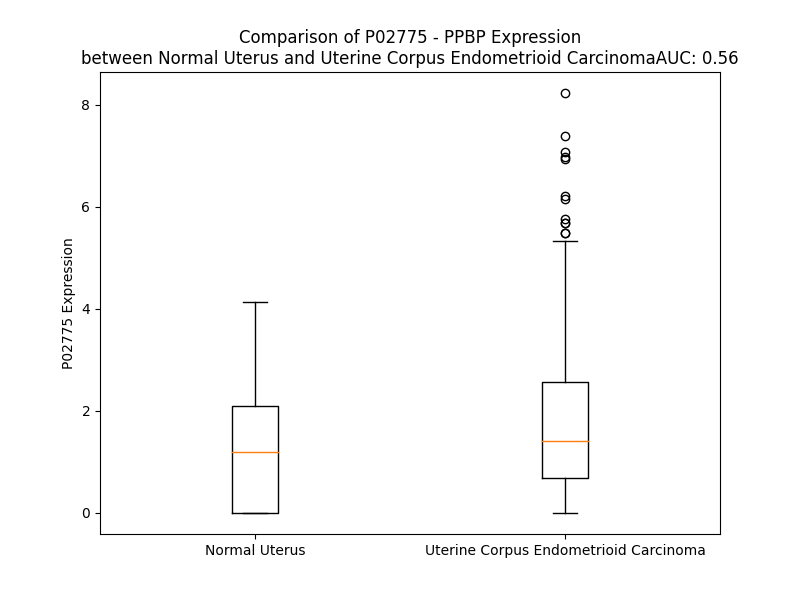

# Detailed Data for P02775

## Introduction to the Detailed Summary

### How to Interpret the Results

- **Summary & Metrics**: This section provides a quick reference to essential protein attributes, including expression changes, family classification, and biomarker applications. Regulation status (upregulated/downregulated) indicates the protein's behavior in a disease context. Some information comes from the original excel file with the proteins selected from literature, while others are derived from the analyses.
- **Expression Comparison**: A visual representation comparing protein expression between normal and disease states. It highlights significant changes in expression levels that might indicate diagnostic or therapeutic relevance. This is data coming from transcriptomics experiments and could not translate similarly to protein levels.
- **Isoform Alignment**: An interactive view of isoform alignments, revealing structural and functional differences between variants of the protein.
- **Interactors & Homologs**: Tables listing known interaction partners and homologous proteins, the more interactors and homologs, the more complex the protein is to design an antibody for.
- **Biological Assemblies**: Information about the structural arrangement of the protein in different assemblies, providing insights into its functional state but also the complexity of the protein to develop antibodies.
- **Combined Per-Residue Information**: A detailed table summarizing residue-level data. This includes predictions for epitope regions, aggregation tendencies, and modifications that might impact the protein's function. Each row corresponds to a residue in the protein, providing insights into specific sites that may be important for research or drug development.
## Summary & Metrics

- **UniProt Accession**: P02775
- **Gene Name**: PPBP
- **Protein Name**: Platelet basic protein
- **Swiss Prot**: CXCL7_HUMAN
- **Family**: cytokine
- **Biomarker Application**: diagnosis
- **Number of Isoforms**: 0
- **Regulation**: 1
- **(transcriptomics) AUC**: 0.56
- **(transcriptomics) Fold Change**: 1.39
- **(transcriptomics) Regulation**: Upregulated
- **Discotope Epitope Count**: 14
- **Max n_uniprots (Homo)**: 4.0
- **Max n_uniprots (Hetero)**: N/A

## Expression Comparison

## Interactors

| preferredName_A   | preferredName_B   |   score |
|:------------------|:------------------|--------:|
| PPBP              | CXCL10            |   0.999 |
| PPBP              | CXCR2             |   0.999 |
| PPBP              | CXCL11            |   0.999 |
| PPBP              | CXCL12            |   0.999 |
| PPBP              | CCL21             |   0.998 |
| PPBP              | CCL5              |   0.998 |
| PPBP              | CXCR1             |   0.998 |
| PPBP              | CCL13             |   0.998 |
| PPBP              | CXCL9             |   0.997 |
| PPBP              | CXCL6             |   0.997 |
| PPBP              | CCL8              |   0.997 |
| PPBP              | CCL28             |   0.997 |
| PPBP              | CXCL14            |   0.996 |
| PPBP              | CCL26             |   0.995 |
| PPBP              | CCR2              |   0.975 |
| PPBP              | CXCR4             |   0.963 |
| PPBP              | PF4               |   0.936 |
| PPBP              | CCR5              |   0.918 |
| PPBP              | CXCR3             |   0.906 |

## Homologs

| uniprot_id   | gene_id   |
|:-------------|:----------|
| O14625       | CXCL11    |
| P09341       | CXCL1     |
| P02776       | PF4       |
| P10720       | PF4V1     |
| P19876       | CXCL3     |
| P19875       | CXCL2     |
| A0A8Q3SIG6   | CXCL8     |
| P80162       | CXCL6     |
| Q53X90       | CXCL13    |
| Q07325       | CXCL9     |
| P02778       | CXCL10    |
| Q6I9S7       | CXCL5     |

## Biological Assemblies

|   Unnamed: 0 |   assembly |   n_uniprots | composition   | crystal_id   |
|-------------:|-----------:|-------------:|:--------------|:-------------|
|            0 |          1 |            4 | Homo          | 1tvx         |
|            0 |          1 |            1 | Homo          | 1f9p         |

## Combined Per-Residue Information

|   res | aa   |   epitope_score | epitope   |   relative_surface_accessibility |   modeling_confidence |   Aggregation | modification   |
|------:|:-----|----------------:|:----------|---------------------------------:|----------------------:|--------------:|:---------------|
|     1 | M    |         0.23822 | False     |                          1.33729 |                 42.74 |         0     | N/A            |
|     2 | S    |         0.30816 | False     |                          0.76072 |                 46.44 |         0     | N/A            |
|     3 | L    |         0.28183 | False     |                          0.91918 |                 38.27 |         0     | N/A            |
|     4 | R    |         0.35657 | False     |                          0.84299 |                 54.44 |         0     | N/A            |
|     5 | L    |         0.28973 | False     |                          1.08763 |                 51.16 |         0     | N/A            |
|     6 | D    |         0.26342 | False     |                          0.81111 |                 45.34 |         0     | N/A            |
|     7 | T    |         0.2789  | False     |                          0.75743 |                 51.8  |         0     | N/A            |
|     8 | T    |         0.32605 | False     |                          0.93235 |                 47.15 |         0     | N/A            |
|     9 | P    |         0.28088 | False     |                          0.79554 |                 52.93 |         0     | N/A            |
|    10 | S    |         0.22474 | False     |                          0.75992 |                 50.85 |         0     | N/A            |
|    11 | C    |         0.28148 | False     |                          0.90346 |                 49.99 |         0     | N/A            |
|    12 | N    |         0.28839 | False     |                          0.85159 |                 54.05 |         0     | N/A            |
|    13 | S    |         0.2401  | False     |                          0.56923 |                 58.59 |         0     | N/A            |
|    14 | A    |         0.27389 | False     |                          1.00191 |                 56.13 |         0     | N/A            |
|    15 | R    |         0.38103 | False     |                          0.73179 |                 63.26 |         0     | N/A            |
|    16 | P    |         0.25995 | False     |                          0.68918 |                 66.23 |         0.001 | N/A            |
|    17 | L    |         0.19964 | False     |                          0.83867 |                 72.89 |         0.173 | N/A            |
|    18 | H    |         0.14861 | False     |                          0.70987 |                 81.18 |         0.262 | N/A            |
|    19 | A    |         0.09678 | False     |                          0.61374 |                 86.35 |        11.054 | N/A            |
|    20 | L    |         0.15615 | False     |                          0.68242 |                 89.37 |        23.816 | N/A            |
|    21 | Q    |         0.16903 | False     |                          0.55384 |                 92.51 |        26.429 | N/A            |
|    22 | V    |         0.10747 | False     |                          0.64683 |                 94.24 |        93.001 | N/A            |
|    23 | L    |         0.17345 | False     |                          0.70438 |                 94.35 |        98.616 | N/A            |
|    24 | L    |         0.14695 | False     |                          0.69478 |                 94.85 |        99.643 | N/A            |
|    25 | L    |         0.16609 | False     |                          0.57533 |                 94.77 |        99.825 | N/A            |
|    26 | L    |         0.19931 | False     |                          0.59389 |                 94.39 |        99.827 | N/A            |
|    27 | S    |         0.11945 | False     |                          0.4257  |                 93.06 |        99.242 | N/A            |
|    28 | L    |         0.13945 | False     |                          0.71141 |                 91.85 |        99.203 | N/A            |
|    29 | L    |         0.15849 | False     |                          0.68378 |                 91.38 |        98.78  | N/A            |
|    30 | L    |         0.18835 | False     |                          0.65502 |                 90.07 |        96.428 | N/A            |
|    31 | T    |         0.18335 | False     |                          0.58211 |                 84.42 |        83.567 | N/A            |
|    32 | A    |         0.16803 | False     |                          0.61009 |                 79.2  |        75.908 | N/A            |
|    33 | L    |         0.24032 | False     |                          0.82912 |                 76.13 |        69.423 | N/A            |
|    34 | A    |         0.17595 | False     |                          0.78059 |                 73.57 |        33.976 | N/A            |
|    35 | S    |         0.16844 | False     |                          0.57076 |                 61.78 |         3.977 | N/A            |
|    36 | S    |         0.22399 | False     |                          0.74159 |                 56.44 |         0.258 | N/A            |
|    37 | T    |         0.21457 | False     |                          0.62159 |                 58.23 |         0.09  | N/A            |
|    38 | K    |         0.26696 | False     |                          1.017   |                 47.93 |         0     | N/A            |
|    39 | G    |         0.20554 | False     |                          0.63561 |                 54.43 |         0     | N/A            |
|    40 | Q    |         0.28317 | False     |                          0.97019 |                 50.6  |         0     | N/A            |
|    41 | T    |         0.24986 | False     |                          0.79722 |                 44.33 |         0     | N/A            |
|    42 | K    |         0.22755 | False     |                          0.94286 |                 46.77 |         0     | N/A            |
|    43 | R    |         0.27115 | False     |                          0.70672 |                 47.21 |         0     | N/A            |
|    44 | N    |         0.27156 | False     |                          0.85456 |                 48.3  |         0     | N/A            |
|    45 | L    |         0.38044 | False     |                          1.05498 |                 39.36 |         0     | N/A            |
|    46 | A    |         0.26878 | False     |                          0.84847 |                 44.34 |         0     | N/A            |
|    47 | K    |         0.23964 | False     |                          0.98532 |                 38.32 |         0     | N/A            |
|    48 | G    |         0.25368 | False     |                          0.81115 |                 38.43 |         0     | N/A            |
|    49 | K    |         0.29675 | False     |                          1.07049 |                 39.75 |         0     | N/A            |
|    50 | E    |         0.25653 | False     |                          0.85806 |                 37.78 |         0     | N/A            |
|    51 | E    |         0.26917 | False     |                          0.85434 |                 46.91 |         0     | N/A            |
|    52 | S    |         0.27911 | False     |                          0.79976 |                 45.68 |         0     | N/A            |
|    53 | L    |         0.39684 | True      |                          1.03132 |                 58.51 |         0     | N/A            |
|    54 | D    |         0.35249 | False     |                          0.5098  |                 46.32 |         0     | N/A            |
|    55 | S    |         0.21725 | False     |                          0.82778 |                 58.15 |         0     | N/A            |
|    56 | D    |         0.3     | False     |                          0.66242 |                 57.15 |         0     | N/A            |
|    57 | L    |         0.39066 | False     |                          0.84168 |                 58.23 |         0     | N/A            |
|    58 | Y    |         0.36393 | False     |                          0.96737 |                 55.23 |         0     | N/A            |
|    59 | A    |         0.26447 | False     |                          0.5787  |                 61.48 |         0     | N/A            |
|    60 | E    |         0.27685 | False     |                          0.55466 |                 67.54 |         0     | N/A            |
|    61 | L    |         0.40033 | True      |                          0.8406  |                 85.3  |         0     | N/A            |
|    62 | R    |         0.43171 | True      |                          0.56988 |                 90.42 |         0     | N/A            |
|    63 | C    |         0.29781 | False     |                          0.17804 |                 94.13 |         0     | N/A            |
|    64 | M    |         0.47627 | True      |                          0.65989 |                 93.42 |         0     | N/A            |
|    65 | C    |         0.18902 | False     |                          0.14948 |                 95.65 |         0     | N/A            |
|    66 | I    |         0.45776 | True      |                          0.80185 |                 94.19 |         0     | N/A            |
|    67 | K    |         0.47001 | True      |                          0.85547 |                 95.53 |         0     | N/A            |
|    68 | T    |         0.31671 | False     |                          0.53211 |                 97.1  |         0     | N/A            |
|    69 | T    |         0.28644 | False     |                          0.43235 |                 95    |         0     | N/A            |
|    70 | S    |         0.33338 | False     |                          0.39673 |                 90.75 |         0     | N/A            |
|    71 | G    |         0.29059 | False     |                          0.80725 |                 88.36 |         0     | N/A            |
|    72 | I    |         0.19874 | False     |                          0.11679 |                 92.43 |         0     | N/A            |
|    73 | H    |         0.33534 | False     |                          0.56724 |                 93.86 |         0     | N/A            |
|    74 | P    |         0.23355 | False     |                          0.26298 |                 93.12 |         0     | N/A            |
|    75 | K    |         0.27467 | False     |                          0.74428 |                 93.49 |         0     | N/A            |
|    76 | N    |         0.35776 | False     |                          0.45751 |                 95.02 |         0     | N/A            |
|    77 | I    |         0.07995 | False     |                          0.02247 |                 95.1  |         0     | N/A            |
|    78 | Q    |         0.22378 | False     |                          0.54552 |                 95.41 |         0     | N/A            |
|    79 | S    |         0.27779 | False     |                          0.43044 |                 95.09 |         0     | N/A            |
|    80 | L    |         0.22346 | False     |                          0.26785 |                 94.63 |         0     | N/A            |
|    81 | E    |         0.27517 | False     |                          0.4572  |                 94.99 |         0     | N/A            |
|    82 | V    |         0.34513 | False     |                          0.5929  |                 95.23 |         0     | N/A            |
|    83 | I    |         0.20076 | False     |                          0.29199 |                 93.79 |         0     | N/A            |
|    84 | G    |         0.33784 | False     |                          0.57547 |                 94.21 |         0     | N/A            |
|    85 | K    |         0.34759 | False     |                          0.72776 |                 93.85 |         0     | N/A            |
|    86 | G    |         0.36963 | False     |                          0.54233 |                 89.37 |         0     | N/A            |
|    87 | T    |         0.49359 | True      |                          0.94755 |                 90.85 |         0     | N/A            |
|    88 | H    |         0.4952  | True      |                          0.56743 |                 90.07 |         0     | N/A            |
|    89 | C    |         0.32088 | False     |                          0.12329 |                 93.46 |         0     | N/A            |
|    90 | N    |         0.46266 | True      |                          0.75013 |                 92.93 |         0     | N/A            |
|    91 | Q    |         0.31254 | False     |                          0.54814 |                 94.53 |         0     | N/A            |
|    92 | V    |         0.25808 | False     |                          0.3867  |                 95.86 |         0.195 | N/A            |
|    93 | E    |         0.05582 | False     |                          0.04545 |                 96.42 |         0.195 | N/A            |
|    94 | V    |         0.06359 | False     |                          0.04189 |                 96.98 |        18.158 | N/A            |
|    95 | I    |         0.20218 | False     |                          0.07909 |                 97.08 |        18.158 | N/A            |
|    96 | A    |         0.00641 | False     |                          0       |                 96.99 |        18.158 | N/A            |
|    97 | T    |         0.15391 | False     |                          0.20272 |                 97.32 |        18.158 | N/A            |
|    98 | L    |         0.12921 | False     |                          0.06348 |                 96.58 |        18.158 | N/A            |
|    99 | K    |         0.49713 | True      |                          0.65227 |                 97.01 |         0.195 | N/A            |
|   100 | D    |         0.21235 | False     |                          0.55177 |                 95.95 |         0     | N/A            |
|   101 | G    |         0.41863 | True      |                          0.63927 |                 95.51 |         0     | N/A            |
|   102 | R    |         0.50122 | True      |                          0.6178  |                 96.3  |         0     | N/A            |
|   103 | K    |         0.44047 | True      |                          0.71971 |                 96.96 |         0     | N/A            |
|   104 | I    |         0.27025 | False     |                          0.23199 |                 97.21 |         0     | N/A            |
|   105 | C    |         0.20712 | False     |                          0.16426 |                 98.21 |         0     | N/A            |
|   106 | L    |         0.0071  | False     |                          0.0067  |                 97.71 |         0     | N/A            |
|   107 | D    |         0.14764 | False     |                          0.23183 |                 96.87 |         0     | N/A            |
|   108 | P    |         0.17261 | False     |                          0.24895 |                 95.57 |         0     | N/A            |
|   109 | D    |         0.37072 | False     |                          0.66354 |                 94.81 |         0     | N/A            |
|   110 | A    |         0.1301  | False     |                          0.13356 |                 95.62 |         0     | N/A            |
|   111 | P    |         0.29944 | False     |                          0.73423 |                 94.97 |         0     | N/A            |
|   112 | R    |         0.30051 | False     |                          0.41095 |                 94.39 |         0     | N/A            |
|   113 | I    |         0.02515 | False     |                          0.0056  |                 94.68 |         0     | N/A            |
|   114 | K    |         0.30313 | False     |                          0.57161 |                 94.41 |         0     | N/A            |
|   115 | K    |         0.33867 | False     |                          0.64775 |                 93.82 |         0     | N/A            |
|   116 | I    |         0.0572  | False     |                          0.02057 |                 93.3  |         0     | N/A            |
|   117 | V    |         0.17268 | False     |                          0.17994 |                 92.75 |         0     | N/A            |
|   118 | Q    |         0.5168  | True      |                          0.63406 |                 92.12 |         0     | N/A            |
|   119 | K    |         0.33472 | False     |                          0.69933 |                 89.89 |         0     | N/A            |
|   120 | K    |         0.29727 | False     |                          0.31099 |                 86.16 |         0     | N/A            |
|   121 | L    |         0.31823 | False     |                          0.70074 |                 83.77 |         0     | N/A            |
|   122 | A    |         0.26542 | False     |                          0.55188 |                 82.78 |         0     | N/A            |
|   123 | G    |         0.20046 | False     |                          0.44755 |                 70.85 |         0     | N/A            |
|   124 | D    |         0.23543 | False     |                          0.69064 |                 62.1  |         0     | N/A            |
|   125 | E    |         0.30628 | False     |                          0.78376 |                 58.71 |         0     | N/A            |
|   126 | S    |         0.23802 | False     |                          0.74716 |                 51.66 |         0     | N/A            |
|   127 | A    |         0.1932  | False     |                          0.88686 |                 51.57 |         0     | N/A            |
|   128 | D    |         0.16674 | False     |                          1.23158 |                 42.65 |         0     | N/A            |

