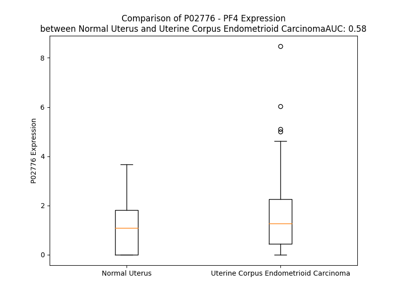

# Detailed Data for P02776

## Introduction to the Detailed Summary

### How to Interpret the Results

- **Summary & Metrics**: This section provides a quick reference to essential protein attributes, including expression changes, family classification, and biomarker applications. Regulation status (upregulated/downregulated) indicates the protein's behavior in a disease context. Some information comes from the original excel file with the proteins selected from literature, while others are derived from the analyses.
- **Expression Comparison**: A visual representation comparing protein expression between normal and disease states. It highlights significant changes in expression levels that might indicate diagnostic or therapeutic relevance. This is data coming from transcriptomics experiments and could not translate similarly to protein levels.
- **Isoform Alignment**: An interactive view of isoform alignments, revealing structural and functional differences between variants of the protein.
- **Interactors & Homologs**: Tables listing known interaction partners and homologous proteins, the more interactors and homologs, the more complex the protein is to design an antibody for.
- **Biological Assemblies**: Information about the structural arrangement of the protein in different assemblies, providing insights into its functional state but also the complexity of the protein to develop antibodies.
- **Combined Per-Residue Information**: A detailed table summarizing residue-level data. This includes predictions for epitope regions, aggregation tendencies, and modifications that might impact the protein's function. Each row corresponds to a residue in the protein, providing insights into specific sites that may be important for research or drug development.
## Summary & Metrics

- **UniProt Accession**: P02776
- **Gene Name**: PF4
- **Protein Name**: Platelet Factor 4
- **Swiss Prot**: nan
- **Family**: cytokine
- **Biomarker Application**: diagnosis
- **Number of Isoforms**: 0
- **Regulation**: 1
- **(transcriptomics) AUC**: 0.58
- **(transcriptomics) Fold Change**: 1.43
- **(transcriptomics) Regulation**: Upregulated
- **Discotope Epitope Count**: 11
- **Max n_uniprots (Homo)**: 4.0
- **Max n_uniprots (Hetero)**: N/A

## Expression Comparison

## Interactors

| preferredName_A   | preferredName_B   |   score |
|:------------------|:------------------|--------:|
| PF4               | CXCL12            |   0.999 |
| PF4               | CXCL8             |   0.999 |
| PF4               | CXCR3             |   0.999 |
| PF4               | CCL5              |   0.999 |
| PF4               | CXCL11            |   0.999 |
| PF4               | CXCL10            |   0.999 |
| PF4               | CXCL9             |   0.999 |
| PF4               | CCL21             |   0.998 |
| PF4               | CCL20             |   0.998 |
| PF4               | CCL2              |   0.998 |
| PF4               | CCL11             |   0.997 |
| PF4               | CCL13             |   0.997 |
| PF4               | CCL25             |   0.997 |
| PF4               | CCL28             |   0.997 |
| PF4               | CCL17             |   0.996 |
| PF4               | XCL1              |   0.996 |
| PF4               | CXCL6             |   0.996 |
| PF4               | CXCL14            |   0.996 |
| PF4               | CXCL2             |   0.996 |
| PF4               | CCL26             |   0.995 |
| PF4               | CXCL17            |   0.995 |
| PF4               | XCL2              |   0.995 |
| PF4               | PF4V1             |   0.965 |
| PF4               | CXCL13            |   0.946 |
| PF4               | CCR5              |   0.94  |
| PF4               | CXCR2             |   0.939 |
| PF4               | PPBP              |   0.936 |
| PF4               | VWF               |   0.932 |
| PF4               | SELP              |   0.921 |

## Homologs

| uniprot_id   | gene_id   |
|:-------------|:----------|
| O14625       | CXCL11    |
| P09341       | CXCL1     |
| P19876       | CXCL3     |
| P19875       | CXCL2     |
| P02775       | PPBP      |
| A0A8Q3SIG6   | CXCL8     |
| P80162       | CXCL6     |
| Q53X90       | CXCL13    |
| Q07325       | CXCL9     |
| P02778       | CXCL10    |
| Q6I9S7       | CXCL5     |
| P10720       | PF4V1     |

## Biological Assemblies

|   Unnamed: 0 |   assembly |   n_uniprots | composition   | crystal_id   |
|-------------:|-----------:|-------------:|:--------------|:-------------|
|            0 |          1 |            4 | Homo          | 1pfm         |
|            0 |          1 |            4 | Homo          | 1f9s         |
|            0 |          1 |            2 | Homo          | 4r9y         |
|            1 |          2 |            2 | Homo          | 4r9y         |
|            0 |          1 |            1 | Homo          | 4rau         |
|            1 |          2 |            1 | Homo          | 4rau         |
|            2 |          3 |            1 | Homo          | 4rau         |
|            3 |          4 |            1 | Homo          | 4rau         |
|            4 |          5 |            1 | Homo          | 4rau         |
|            5 |          6 |            1 | Homo          | 4rau         |
|            6 |          7 |            1 | Homo          | 4rau         |
|            7 |          8 |            1 | Homo          | 4rau         |
|            0 |          1 |            4 | Homo          | 1f9q         |
|            0 |          1 |            1 | Homo          | 1dn3         |
|            0 |          1 |            4 | Homo          | 1pfn         |
|            0 |          1 |            2 | Homo          | 4r9w         |
|            0 |          1 |            4 | Homo          | 1rhp         |

## Combined Per-Residue Information

|   res | aa   |   epitope_score | epitope   |   relative_surface_accessibility |   modeling_confidence |   Aggregation | modification   |
|------:|:-----|----------------:|:----------|---------------------------------:|----------------------:|--------------:|:---------------|
|     1 | M    |         0.3013  | False     |                          1.29254 |                 41.14 |         0     | N/A            |
|     2 | S    |         0.33964 | False     |                          0.87208 |                 38.16 |         0     | N/A            |
|     3 | S    |         0.26874 | False     |                          0.81171 |                 41.74 |         0     | N/A            |
|     4 | A    |         0.26596 | False     |                          1.02921 |                 44.13 |         0     | N/A            |
|     5 | A    |         0.33868 | False     |                          0.84307 |                 56.09 |         0     | N/A            |
|     6 | G    |         0.33996 | False     |                          0.84472 |                 42.18 |         0     | N/A            |
|     7 | F    |         0.43957 | False     |                          0.96267 |                 48.61 |         0     | N/A            |
|     8 | C    |         0.38131 | False     |                          1.02882 |                 43.5  |         0     | N/A            |
|     9 | A    |         0.38506 | False     |                          0.64348 |                 53.04 |         0     | N/A            |
|    10 | S    |         0.37535 | False     |                          0.91713 |                 52.2  |         0     | N/A            |
|    11 | R    |         0.3788  | False     |                          0.67563 |                 54.01 |         0     | N/A            |
|    12 | P    |         0.31963 | False     |                          0.70161 |                 57.81 |         0.028 | N/A            |
|    13 | G    |         0.23422 | False     |                          0.58121 |                 59.97 |         2.66  | N/A            |
|    14 | L    |         0.20598 | False     |                          0.75033 |                 57.75 |        78.564 | N/A            |
|    15 | L    |         0.19459 | False     |                          0.87541 |                 58.4  |        92.384 | N/A            |
|    16 | F    |         0.18324 | False     |                          0.74654 |                 58.2  |        94.845 | N/A            |
|    17 | L    |         0.20735 | False     |                          0.67551 |                 59.09 |        95.016 | N/A            |
|    18 | G    |         0.21333 | False     |                          0.36553 |                 63.07 |        94.883 | N/A            |
|    19 | L    |         0.30214 | False     |                          0.80853 |                 64.32 |        94.517 | N/A            |
|    20 | L    |         0.21329 | False     |                          0.79808 |                 61.8  |        92.097 | N/A            |
|    21 | L    |         0.19763 | False     |                          0.6222  |                 60.52 |        78.505 | N/A            |
|    22 | L    |         0.21934 | False     |                          0.76813 |                 61.26 |         4.366 | N/A            |
|    23 | P    |         0.27451 | False     |                          0.54968 |                 61.81 |         2.562 | N/A            |
|    24 | L    |         0.17269 | False     |                          0.64046 |                 57.87 |        71.91  | N/A            |
|    25 | V    |         0.13369 | False     |                          0.77764 |                 60.13 |        78.612 | N/A            |
|    26 | V    |         0.16442 | False     |                          0.72204 |                 59.96 |        78.659 | N/A            |
|    27 | A    |         0.24281 | False     |                          0.63663 |                 59.94 |        78.659 | N/A            |
|    28 | F    |         0.25791 | False     |                          0.8433  |                 56.79 |        78.646 | N/A            |
|    29 | A    |         0.31602 | False     |                          0.69729 |                 57.79 |        41.127 | N/A            |
|    30 | S    |         0.36264 | False     |                          0.63479 |                 52.81 |         3.193 | N/A            |
|    31 | A    |         0.37812 | False     |                          0.93163 |                 51.01 |         1.464 | N/A            |
|    32 | E    |         0.39993 | False     |                          0.78206 |                 46.02 |         0     | N/A            |
|    33 | A    |         0.4138  | False     |                          0.83933 |                 49.37 |         0     | N/A            |
|    34 | E    |         0.38795 | False     |                          0.87225 |                 48.7  |         0     | N/A            |
|    35 | E    |         0.40355 | False     |                          0.79977 |                 51.91 |         0     | N/A            |
|    36 | D    |         0.43933 | False     |                          0.85165 |                 49.41 |         0     | N/A            |
|    37 | G    |         0.23776 | False     |                          0.26785 |                 51.88 |         0     | N/A            |
|    38 | D    |         0.43661 | False     |                          0.90447 |                 55.79 |         0     | N/A            |
|    39 | L    |         0.51867 | True      |                          0.45855 |                 66.48 |         0     | N/A            |
|    40 | Q    |         0.34737 | False     |                          0.77305 |                 81.31 |         0     | N/A            |
|    41 | C    |         0.34598 | False     |                          0.16734 |                 88.79 |         0     | N/A            |
|    42 | L    |         0.55863 | True      |                          0.79056 |                 89.47 |         0     | N/A            |
|    43 | C    |         0.28124 | False     |                          0.1308  |                 90.93 |         0     | N/A            |
|    44 | V    |         0.41981 | False     |                          0.95826 |                 87.95 |         0     | N/A            |
|    45 | K    |         0.43503 | False     |                          0.85546 |                 87.2  |         0     | N/A            |
|    46 | T    |         0.44079 | False     |                          0.58163 |                 90.14 |         0     | N/A            |
|    47 | T    |         0.29895 | False     |                          0.37207 |                 88.32 |         0     | N/A            |
|    48 | S    |         0.45327 | True      |                          0.56317 |                 83.76 |         0     | N/A            |
|    49 | Q    |         0.44537 | False     |                          0.8486  |                 84.29 |         0     | N/A            |
|    50 | V    |         0.2757  | False     |                          0.15082 |                 88.13 |         0     | N/A            |
|    51 | R    |         0.48931 | True      |                          0.68977 |                 88.83 |         0     | N/A            |
|    52 | P    |         0.14242 | False     |                          0.24192 |                 87.98 |         0     | N/A            |
|    53 | R    |         0.37391 | False     |                          0.80627 |                 89.69 |         0     | N/A            |
|    54 | H    |         0.38013 | False     |                          0.49904 |                 91.38 |         0     | N/A            |
|    55 | I    |         0.14267 | False     |                          0.04021 |                 92.27 |         0     | N/A            |
|    56 | T    |         0.27096 | False     |                          0.59782 |                 92.78 |         0     | N/A            |
|    57 | S    |         0.20018 | False     |                          0.41051 |                 91.62 |         0     | Phosphoserine  |
|    58 | L    |         0.30283 | False     |                          0.27463 |                 91.52 |         0     | N/A            |
|    59 | E    |         0.2609  | False     |                          0.4661  |                 92.46 |         0     | N/A            |
|    60 | V    |         0.3005  | False     |                          0.62188 |                 91.64 |         0     | N/A            |
|    61 | I    |         0.23171 | False     |                          0.28479 |                 91.66 |         0     | N/A            |
|    62 | K    |         0.3618  | False     |                          0.85908 |                 92.19 |         0     | N/A            |
|    63 | A    |         0.31605 | False     |                          0.54765 |                 91.26 |         0     | N/A            |
|    64 | G    |         0.31219 | False     |                          0.36282 |                 88.79 |         0     | N/A            |
|    65 | P    |         0.60717 | True      |                          0.97139 |                 86.5  |         0     | N/A            |
|    66 | H    |         0.56742 | True      |                          0.71758 |                 85.68 |         0     | N/A            |
|    67 | C    |         0.30941 | False     |                          0.08528 |                 89.63 |         0     | N/A            |
|    68 | P    |         0.41268 | False     |                          0.59006 |                 88.38 |         0     | N/A            |
|    69 | T    |         0.44513 | False     |                          0.55057 |                 88.57 |         0     | N/A            |
|    70 | A    |         0.23722 | False     |                          0.46795 |                 90.29 |         0     | N/A            |
|    71 | Q    |         0.138   | False     |                          0.06832 |                 91.11 |         0.128 | N/A            |
|    72 | L    |         0.02829 | False     |                          0.00437 |                 91.99 |         3.392 | N/A            |
|    73 | I    |         0.22613 | False     |                          0.09735 |                 93.57 |         3.392 | N/A            |
|    74 | A    |         0.00724 | False     |                          0       |                 93.78 |         3.392 | N/A            |
|    75 | T    |         0.19447 | False     |                          0.23894 |                 94.47 |         3.392 | N/A            |
|    76 | L    |         0.20302 | False     |                          0.14903 |                 94.2  |         3.392 | N/A            |
|    77 | K    |         0.46051 | True      |                          0.73527 |                 93.75 |         0     | N/A            |
|    78 | N    |         0.27509 | False     |                          0.64875 |                 93.8  |         0     | N/A            |
|    79 | G    |         0.41294 | False     |                          0.63903 |                 93.33 |         0     | N/A            |
|    80 | R    |         0.68162 | True      |                          0.63736 |                 94.13 |         0     | N/A            |
|    81 | K    |         0.53015 | True      |                          0.68911 |                 94.2  |         0     | N/A            |
|    82 | I    |         0.33429 | False     |                          0.17747 |                 93.6  |         0     | N/A            |
|    83 | C    |         0.32855 | False     |                          0.1555  |                 93.61 |         0     | N/A            |
|    84 | L    |         0.051   | False     |                          0.03728 |                 92.4  |         0     | N/A            |
|    85 | D    |         0.17083 | False     |                          0.2631  |                 88.89 |         0     | N/A            |
|    86 | L    |         0.3683  | False     |                          0.31746 |                 84.57 |         0     | N/A            |
|    87 | Q    |         0.59782 | True      |                          0.86151 |                 82.13 |         0     | N/A            |
|    88 | A    |         0.24305 | False     |                          0.12449 |                 84.39 |         0     | N/A            |
|    89 | P    |         0.35445 | False     |                          0.75982 |                 83.75 |         0     | N/A            |
|    90 | L    |         0.18423 | False     |                          0.24166 |                 82.79 |         0     | N/A            |
|    91 | Y    |         0.34548 | False     |                          0.22796 |                 83.72 |         0     | N/A            |
|    92 | K    |         0.48564 | True      |                          0.72287 |                 85.95 |         0     | N/A            |
|    93 | K    |         0.30817 | False     |                          0.64403 |                 86.8  |         0     | N/A            |
|    94 | I    |         0.02155 | False     |                          0.0024  |                 86.68 |         0     | N/A            |
|    95 | I    |         0.2835  | False     |                          0.32959 |                 86.08 |         0     | N/A            |
|    96 | K    |         0.24744 | False     |                          0.63533 |                 89.11 |         0     | N/A            |
|    97 | K    |         0.3022  | False     |                          0.55602 |                 86.68 |         0     | N/A            |
|    98 | L    |         0.20288 | False     |                          0.34473 |                 83.65 |         0     | N/A            |
|    99 | L    |         0.39085 | False     |                          0.8875  |                 85.02 |         0     | N/A            |
|   100 | E    |         0.11921 | False     |                          0.53138 |                 81.71 |         0     | N/A            |
|   101 | S    |         0.12242 | False     |                          1.05721 |                 60.07 |         0     | N/A            |

