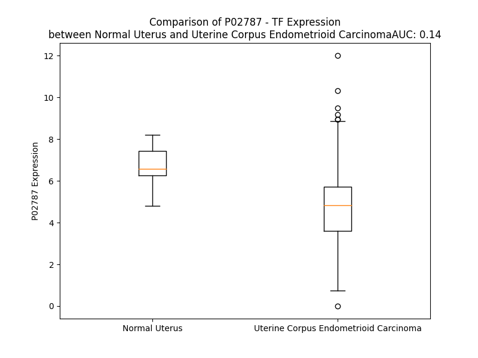

# Detailed Data for P02787

## Introduction to the Detailed Summary

### How to Interpret the Results

- **Summary & Metrics**: This section provides a quick reference to essential protein attributes, including expression changes, family classification, and biomarker applications. Regulation status (upregulated/downregulated) indicates the protein's behavior in a disease context. Some information comes from the original excel file with the proteins selected from literature, while others are derived from the analyses.
- **Expression Comparison**: A visual representation comparing protein expression between normal and disease states. It highlights significant changes in expression levels that might indicate diagnostic or therapeutic relevance. This is data coming from transcriptomics experiments and could not translate similarly to protein levels.
- **Isoform Alignment**: An interactive view of isoform alignments, revealing structural and functional differences between variants of the protein.
- **Interactors & Homologs**: Tables listing known interaction partners and homologous proteins, the more interactors and homologs, the more complex the protein is to design an antibody for.
- **Biological Assemblies**: Information about the structural arrangement of the protein in different assemblies, providing insights into its functional state but also the complexity of the protein to develop antibodies.
- **Combined Per-Residue Information**: A detailed table summarizing residue-level data. This includes predictions for epitope regions, aggregation tendencies, and modifications that might impact the protein's function. Each row corresponds to a residue in the protein, providing insights into specific sites that may be important for research or drug development.
## Summary & Metrics

- **UniProt Accession**: P02787
- **Gene Name**: TF
- **Protein Name**: transferrin
- **Swiss Prot**: TRFE_HUMAN
- **Family**: transporter
- **Biomarker Application**: diagnosis,efficacy,prognosis
- **Number of Isoforms**: 0
- **Regulation**: 2
- **(transcriptomics) AUC**: 0.14
- **(transcriptomics) Fold Change**: 1.41
- **(transcriptomics) Regulation**: Downregulated
- **Discotope Epitope Count**: 135
- **Max n_uniprots (Homo)**: 1
- **Max n_uniprots (Hetero)**: 6

## Expression Comparison

## Interactors

| preferredName_A   | preferredName_B   |   score |
|:------------------|:------------------|--------:|
| TF                | TFRC              |   0.999 |
| TF                | APOA1             |   0.919 |

## Homologs

| uniprot_id   | gene_id   |
|:-------------|:----------|
| Q8N6P7       | IL22RA1   |
| F8WAV8       | IL20RB    |
| E9PPU4       | IL10RA    |
| Q8IU57       | IFNLR1    |
| C9JCU0       | IFNAR2    |
| A0A8V8TQK8   | IFNAR1    |
| F8WF11       | IFNGR2    |
| H7C0Z5       | IL10RB    |
| Q969J5       | IL22RA2   |
| Q5TFC9       | IFNGR1    |
| A0A0U1RQS0   | IL20RA    |
| Q549N5       | SRPRB     |
| C9JVN1       | MELTF     |
| E7ER44       | LTF       |

## Biological Assemblies

|   Unnamed: 0 |   assembly |   n_uniprots | composition   | crystal_id   |
|-------------:|-----------:|-------------:|:--------------|:-------------|
|            0 |          1 |            1 | Homo          | 6jas         |
|            0 |          1 |            1 | Homo          | 8brc         |
|            0 |          1 |            3 | Hetero        | 6soz         |
|            0 |          1 |            1 | Homo          | 1d3k         |
|            0 |          1 |            1 | Homo          | 3fgs         |
|            0 |          1 |            1 | Homo          | 6ctc         |
|            0 |          1 |            1 | Homo          | 2hav         |
|            1 |          2 |            1 | Homo          | 2hav         |
|            0 |          1 |            1 | Homo          | 1btj         |
|            1 |          2 |            1 | Homo          | 1btj         |
|            0 |          1 |            1 | Homo          | 3v83         |
|            1 |          2 |            1 | Homo          | 3v83         |
|            2 |          3 |            1 | Homo          | 3v83         |
|            3 |          4 |            1 | Homo          | 3v83         |
|            4 |          5 |            1 | Homo          | 3v83         |
|            5 |          6 |            1 | Homo          | 3v83         |
|            0 |          1 |            1 | Homo          | 5dyh         |
|            1 |          2 |            1 | Homo          | 5dyh         |
|            0 |          1 |            1 | Homo          | 5h52         |
|            0 |          1 |            1 | Homo          | 1fqf         |
|            0 |          1 |            1 | Homo          | 1n84         |
|            0 |          1 |            1 | Homo          | 1dtg         |
|            0 |          1 |            2 | Hetero        | 3v8x         |
|            0 |          1 |            3 | Hetero        | 6soy         |
|            0 |          1 |            1 | Homo          | 2o7u         |
|            1 |          2 |            1 | Homo          | 2o7u         |
|            2 |          3 |            1 | Homo          | 2o7u         |
|            3 |          4 |            1 | Homo          | 2o7u         |
|            4 |          5 |            1 | Homo          | 2o7u         |
|            5 |          6 |            1 | Homo          | 2o7u         |
|            6 |          7 |            1 | Homo          | 2o7u         |
|            7 |          8 |            1 | Homo          | 2o7u         |
|            8 |          9 |            1 | Homo          | 2o7u         |
|            0 |          1 |            1 | Homo          | 1n7x         |
|            0 |          1 |            6 | Hetero        | 6d05         |
|            0 |          1 |            2 | Hetero        | 3v89         |
|            0 |          1 |            4 | Hetero        | 1suv         |
|            0 |          1 |            1 | Homo          | 2hau         |
|            1 |          2 |            1 | Homo          | 2hau         |
|            0 |          1 |            1 | Homo          | 1b3e         |
|            0 |          1 |            1 | Homo          | 1bp5         |
|            1 |          2 |            1 | Homo          | 1bp5         |
|            2 |          3 |            1 | Homo          | 1bp5         |
|            3 |          4 |            1 | Homo          | 1bp5         |
|            0 |          1 |            1 | Homo          | 1d4n         |
|            0 |          1 |            2 | Hetero        | 3s9l         |
|            1 |          2 |            2 | Hetero        | 3s9l         |
|            0 |          1 |            1 | Homo          | 1oqg         |
|            0 |          1 |            1 | Homo          | 7ffm         |
|            0 |          1 |            1 | Homo          | 4x1d         |
|            1 |          2 |            1 | Homo          | 4x1d         |
|            0 |          1 |            5 | Hetero        | 6d03         |
|            0 |          1 |            1 | Homo          | 1oqh         |
|            0 |          1 |            1 | Homo          | 1a8f         |
|            0 |          1 |            1 | Homo          | 4h0w         |
|            0 |          1 |            1 | Homo          | 7ffu         |
|            0 |          1 |            1 | Homo          | 1fqe         |
|            0 |          1 |            2 | Hetero        | 3s9m         |
|            1 |          2 |            2 | Hetero        | 3s9m         |
|            0 |          1 |            1 | Homo          | 1ryo         |
|            0 |          1 |            2 | Hetero        | 3s9n         |
|            1 |          2 |            2 | Hetero        | 3s9n         |
|            0 |          1 |            1 | Homo          | 6uj6         |
|            0 |          1 |            1 | Homo          | 1jqf         |
|            0 |          1 |            1 | Homo          | 3skp         |
|            1 |          2 |            1 | Homo          | 3skp         |
|            2 |          3 |            1 | Homo          | 3skp         |
|            0 |          1 |            2 | Hetero        | 3ve1         |
|            1 |          2 |            2 | Hetero        | 3ve1         |
|            0 |          1 |            1 | Homo          | 4x1b         |
|            0 |          1 |            1 | Homo          | 3qyt         |
|            0 |          1 |            1 | Homo          | 5wtd         |
|            0 |          1 |            1 | Homo          | 1a8e         |
|            0 |          1 |            1 | Homo          | 5x5p         |
|            0 |          1 |            1 | Homo          | 5y6k         |
|            0 |          1 |            1 | Homo          | 1n7w         |
|            0 |          1 |            1 | Homo          | 7q1l         |
|            1 |          2 |            1 | Homo          | 7q1l         |
|            0 |          1 |            6 | Hetero        | 6d04         |
|            0 |          1 |            1 | Homo          | 2o84         |

## Combined Per-Residue Information

|   res | aa   |   epitope_score | epitope   |   relative_surface_accessibility |   modeling_confidence |   Aggregation | modification             | glycosylation                                      |
|------:|:-----|----------------:|:----------|---------------------------------:|----------------------:|--------------:|:-------------------------|:---------------------------------------------------|
|     1 | M    |         0.09215 | False     |                          1.31054 |                 43.92 |         0     | N/A                      | N/A                                                |
|     2 | R    |         0.19985 | True      |                          0.94579 |                 44.52 |         0     | N/A                      | N/A                                                |
|     3 | L    |         0.21563 | True      |                          1.1318  |                 46.99 |        19.273 | N/A                      | N/A                                                |
|     4 | A    |         0.15751 | True      |                          0.8182  |                 49.05 |        26.683 | N/A                      | N/A                                                |
|     5 | V    |         0.12121 | False     |                          0.8146  |                 49.96 |        47.784 | N/A                      | N/A                                                |
|     6 | G    |         0.17831 | True      |                          0.76328 |                 44.59 |        49.572 | N/A                      | N/A                                                |
|     7 | A    |         0.1621  | True      |                          0.79214 |                 45.6  |        68.864 | N/A                      | N/A                                                |
|     8 | L    |         0.18543 | True      |                          0.9063  |                 42.49 |        91.537 | N/A                      | N/A                                                |
|     9 | L    |         0.17345 | True      |                          0.79748 |                 43    |        95.658 | N/A                      | N/A                                                |
|    10 | V    |         0.13694 | True      |                          0.72655 |                 44.03 |        96.237 | N/A                      | N/A                                                |
|    11 | C    |         0.14612 | True      |                          0.75421 |                 38.86 |        94.735 | N/A                      | N/A                                                |
|    12 | A    |         0.12264 | False     |                          0.74957 |                 39.4  |        94.496 | N/A                      | N/A                                                |
|    13 | V    |         0.14366 | True      |                          0.78766 |                 45.26 |        94.173 | N/A                      | N/A                                                |
|    14 | L    |         0.25415 | True      |                          0.98197 |                 40.37 |        88.42  | N/A                      | N/A                                                |
|    15 | G    |         0.16332 | True      |                          0.65727 |                 37.16 |        56.676 | N/A                      | N/A                                                |
|    16 | L    |         0.16909 | True      |                          0.94113 |                 40.81 |        53.859 | N/A                      | N/A                                                |
|    17 | C    |         0.12719 | True      |                          0.84431 |                 39.74 |        38.414 | N/A                      | N/A                                                |
|    18 | L    |         0.13506 | True      |                          1.03252 |                 42.75 |        35.339 | N/A                      | N/A                                                |
|    19 | A    |         0.12427 | True      |                          0.79205 |                 47.13 |        18.531 | N/A                      | N/A                                                |
|    20 | V    |         0.09576 | False     |                          0.8884  |                 54.99 |         4.32  | N/A                      | N/A                                                |
|    21 | P    |         0.07722 | False     |                          0.70415 |                 66.17 |         1.88  | N/A                      | N/A                                                |
|    22 | D    |         0.0763  | False     |                          0.55705 |                 79.26 |         0     | N/A                      | N/A                                                |
|    23 | K    |         0.06792 | False     |                          0.35039 |                 88.82 |         0     | N/A                      | N/A                                                |
|    24 | T    |         0.06815 | False     |                          0.26275 |                 95.38 |         0     | N/A                      | N/A                                                |
|    25 | V    |         0.00141 | False     |                          0       |                 98.01 |         0     | N/A                      | N/A                                                |
|    26 | R    |         0.07319 | False     |                          0.2729  |                 98.02 |         0     | N/A                      | N/A                                                |
|    27 | W    |         0.00697 | False     |                          0.00761 |                 98.61 |         0.784 | N/A                      | N/A                                                |
|    28 | C    |         0.00282 | False     |                          0.0037  |                 98.42 |         0.784 | N/A                      | N/A                                                |
|    29 | A    |         0.00254 | False     |                          0.00128 |                 96.44 |         0.784 | N/A                      | N/A                                                |
|    30 | V    |         0.01789 | False     |                          0.03738 |                 91.23 |         0.784 | N/A                      | N/A                                                |
|    31 | S    |         0.0465  | False     |                          0.09934 |                 86.57 |         0.784 | N/A                      | N/A                                                |
|    32 | E    |         0.17786 | True      |                          0.49861 |                 91.98 |         0     | N/A                      | N/A                                                |
|    33 | H    |         0.09647 | False     |                          0.31297 |                 92.13 |         0     | N/A                      | N/A                                                |
|    34 | E    |         0.02014 | False     |                          0.0341  |                 94.84 |         0     | N/A                      | N/A                                                |
|    35 | A    |         0.02909 | False     |                          0.11908 |                 95.89 |         0     | N/A                      | N/A                                                |
|    36 | T    |         0.18133 | True      |                          0.40121 |                 96.65 |         0     | N/A                      | N/A                                                |
|    37 | K    |         0.01592 | False     |                          0.0244  |                 97.16 |         0     | N/A                      | N/A                                                |
|    38 | C    |         0.0023  | False     |                          0       |                 98.05 |         0     | N/A                      | N/A                                                |
|    39 | Q    |         0.13962 | True      |                          0.3364  |                 97.82 |         0     | N/A                      | N/A                                                |
|    40 | S    |         0.07434 | False     |                          0.30717 |                 97.11 |         0     | N/A                      | N/A                                                |
|    41 | F    |         0.0044  | False     |                          0.00382 |                 97.52 |         0     | N/A                      | N/A                                                |
|    42 | R    |         0.08318 | False     |                          0.28956 |                 96.75 |         0     | Dimethylated arginine    | N/A                                                |
|    43 | D    |         0.10936 | False     |                          0.43747 |                 96.85 |         0     | N/A                      | N/A                                                |
|    44 | H    |         0.17252 | True      |                          0.22953 |                 96.48 |         0     | N/A                      | N/A                                                |
|    45 | M    |         0.01571 | False     |                          0.00799 |                 95.26 |         0     | N/A                      | N/A                                                |
|    46 | K    |         0.07489 | False     |                          0.65435 |                 94.41 |         0     | N/A                      | N/A                                                |
|    47 | S    |         0.16837 | True      |                          0.68018 |                 93.64 |         0     | N/A                      | N/A                                                |
|    48 | V    |         0.10184 | False     |                          0.44044 |                 93.76 |         0     | N/A                      | N/A                                                |
|    49 | I    |         0.06116 | False     |                          0.08895 |                 92.21 |         0     | N/A                      | N/A                                                |
|    50 | P    |         0.14009 | True      |                          0.6577  |                 90.42 |         0     | N/A                      | N/A                                                |
|    51 | S    |         0.07882 | False     |                          0.98734 |                 86.33 |         0     | N/A                      | O-linked (GalNAc...) serine                        |
|    52 | D    |         0.10544 | False     |                          0.60431 |                 88.38 |         0     | N/A                      | N/A                                                |
|    53 | G    |         0.08754 | False     |                          0.11952 |                 90.15 |         0     | N/A                      | N/A                                                |
|    54 | P    |         0.0209  | False     |                          0.01837 |                 94.47 |         0     | N/A                      | N/A                                                |
|    55 | S    |         0.04496 | False     |                          0.23847 |                 94.85 |         0     | N/A                      | N/A                                                |
|    56 | V    |         0.04553 | False     |                          0.02275 |                 96.59 |         0     | N/A                      | N/A                                                |
|    57 | A    |         0.0535  | False     |                          0.30482 |                 97.35 |         0     | N/A                      | N/A                                                |
|    58 | C    |         0.05605 | False     |                          0.22368 |                 98.2  |         0     | N/A                      | N/A                                                |
|    59 | V    |         0.04471 | False     |                          0.22469 |                 98.24 |         0     | N/A                      | N/A                                                |
|    60 | K    |         0.10211 | False     |                          0.57232 |                 96.71 |         0     | N/A                      | N/A                                                |
|    61 | K    |         0.06866 | False     |                          0.29165 |                 94.31 |         0     | N/A                      | N/A                                                |
|    62 | A    |         0.14623 | True      |                          0.78918 |                 88.49 |         0     | N/A                      | N/A                                                |
|    63 | S    |         0.08647 | False     |                          0.17335 |                 88.45 |         0     | N/A                      | N/A                                                |
|    64 | Y    |         0.0598  | False     |                          0.20499 |                 91.44 |         0     | N/A                      | N/A                                                |
|    65 | L    |         0.09367 | False     |                          0.48627 |                 91.7  |         0     | N/A                      | N/A                                                |
|    66 | D    |         0.05438 | False     |                          0.24722 |                 94.11 |         0     | N/A                      | N/A                                                |
|    67 | C    |         0.00261 | False     |                          0       |                 97.13 |         0     | N/A                      | N/A                                                |
|    68 | I    |         0.0072  | False     |                          0       |                 97.53 |         0     | N/A                      | N/A                                                |
|    69 | R    |         0.16366 | True      |                          0.54318 |                 97.75 |         0     | N/A                      | N/A                                                |
|    70 | A    |         0.01288 | False     |                          0.02588 |                 98.15 |         0     | N/A                      | N/A                                                |
|    71 | I    |         0.0039  | False     |                          0       |                 98.48 |         0     | N/A                      | N/A                                                |
|    72 | A    |         0.03999 | False     |                          0.31855 |                 97.74 |         0     | N/A                      | N/A                                                |
|    73 | A    |         0.0839  | False     |                          0.60951 |                 97.38 |         0     | N/A                      | N/A                                                |
|    74 | N    |         0.12708 | True      |                          0.54768 |                 96.75 |         0     | N/A                      | N/A                                                |
|    75 | E    |         0.14466 | True      |                          0.45501 |                 97.54 |         0     | N/A                      | N/A                                                |
|    76 | A    |         0.00325 | False     |                          0       |                 98.11 |         0     | N/A                      | N/A                                                |
|    77 | D    |         0.004   | False     |                          0       |                 98.38 |         0     | N/A                      | N/A                                                |
|    78 | A    |         0.00088 | False     |                          0       |                 98.59 |         0     | N/A                      | N/A                                                |
|    79 | V    |         0.01678 | False     |                          0.02095 |                 98.33 |         0     | N/A                      | N/A                                                |
|    80 | T    |         0.03506 | False     |                          0.0721  |                 98.34 |         0     | N/A                      | N/A                                                |
|    81 | L    |         0.0094  | False     |                          0.00907 |                 96.88 |         0     | N/A                      | N/A                                                |
|    82 | D    |         0.00822 | False     |                          0.02574 |                 94.88 |         0     | N/A                      | N/A                                                |
|    83 | A    |         0.00163 | False     |                          0       |                 92.88 |         0.142 | N/A                      | N/A                                                |
|    84 | G    |         0.00197 | False     |                          0.00238 |                 91.97 |         0.142 | N/A                      | N/A                                                |
|    85 | L    |         0.04671 | False     |                          0.15415 |                 93.54 |         0.142 | N/A                      | N/A                                                |
|    86 | V    |         0.00275 | False     |                          0.00762 |                 96.67 |         0.142 | N/A                      | N/A                                                |
|    87 | Y    |         0.05541 | False     |                          0.06199 |                 94.27 |         0.142 | N/A                      | N/A                                                |
|    88 | D    |         0.06634 | False     |                          0.15791 |                 93.15 |         0     | N/A                      | N/A                                                |
|    89 | A    |         0.00438 | False     |                          0.00383 |                 96.73 |         0     | N/A                      | N/A                                                |
|    90 | Y    |         0.08739 | False     |                          0.2015  |                 96.15 |         0     | N/A                      | N/A                                                |
|    91 | L    |         0.12802 | True      |                          0.37838 |                 95.03 |         0     | N/A                      | N/A                                                |
|    92 | A    |         0.20788 | True      |                          0.78621 |                 94.91 |         0     | N/A                      | N/A                                                |
|    93 | P    |         0.42691 | True      |                          0.88704 |                 96.33 |         0     | N/A                      | N/A                                                |
|    94 | N    |         0.06794 | False     |                          0.15453 |                 97.42 |         0     | N/A                      | N/A                                                |
|    95 | N    |         0.11692 | False     |                          0.49345 |                 96.96 |         0     | N/A                      | N/A                                                |
|    96 | L    |         0.01035 | False     |                          0.02446 |                 98.03 |         0     | N/A                      | N/A                                                |
|    97 | K    |         0.03085 | False     |                          0.2385  |                 97.61 |         0     | N/A                      | N/A                                                |
|    98 | P    |         0.00567 | False     |                          0.02719 |                 97.91 |         0     | N/A                      | N/A                                                |
|    99 | V    |         0.01711 | False     |                          0.05936 |                 98.04 |         0     | N/A                      | N/A                                                |
|   100 | V    |         0.00225 | False     |                          0.00095 |                 98.27 |         0     | N/A                      | N/A                                                |
|   101 | A    |         0.00166 | False     |                          0       |                 97.81 |         0     | N/A                      | N/A                                                |
|   102 | E    |         0.00335 | False     |                          0.0006  |                 97.4  |         0     | N/A                      | N/A                                                |
|   103 | F    |         0.03371 | False     |                          0.03631 |                 95.66 |         0     | N/A                      | N/A                                                |
|   104 | Y    |         0.03743 | False     |                          0.05498 |                 91.38 |         0     | N/A                      | N/A                                                |
|   105 | G    |         0.09894 | False     |                          0.42597 |                 87.11 |         0     | N/A                      | N/A                                                |
|   106 | S    |         0.11785 | False     |                          0.34879 |                 87.18 |         0     | N/A                      | N/A                                                |
|   107 | K    |         0.24333 | True      |                          0.68448 |                 86.7  |         0     | N/A                      | N/A                                                |
|   108 | E    |         0.14417 | True      |                          0.78644 |                 88.63 |         0     | N/A                      | N/A                                                |
|   109 | D    |         0.14715 | True      |                          0.54236 |                 87.77 |         0     | N/A                      | N/A                                                |
|   110 | P    |         0.06635 | False     |                          0.40749 |                 90.91 |         0.62  | N/A                      | N/A                                                |
|   111 | Q    |         0.11251 | False     |                          0.20997 |                 89.81 |         8.909 | N/A                      | N/A                                                |
|   112 | T    |         0.02392 | False     |                          0.08817 |                 91.89 |        39.91  | N/A                      | N/A                                                |
|   113 | F    |         0.05459 | False     |                          0.21488 |                 91.65 |        91.809 | N/A                      | N/A                                                |
|   114 | Y    |         0.00892 | False     |                          0.00853 |                 93.17 |        95.841 | N/A                      | N/A                                                |
|   115 | Y    |         0.03951 | False     |                          0.11279 |                 94.33 |        96.996 | N/A                      | N/A                                                |
|   116 | A    |         0.00237 | False     |                          0       |                 96.85 |        97.275 | N/A                      | N/A                                                |
|   117 | V    |         0.00482 | False     |                          0.01142 |                 98.3  |        97.151 | N/A                      | N/A                                                |
|   118 | A    |         0.00132 | False     |                          0       |                 98.65 |        93.208 | N/A                      | N/A                                                |
|   119 | V    |         0.00849 | False     |                          0.00952 |                 98.76 |        89.704 | N/A                      | N/A                                                |
|   120 | V    |         0.00194 | False     |                          0       |                 98.75 |        72.939 | N/A                      | N/A                                                |
|   121 | K    |         0.08769 | False     |                          0.35673 |                 98.43 |         0     | N/A                      | N/A                                                |
|   122 | K    |         0.15834 | True      |                          0.49394 |                 97    |         0     | N/A                      | N/A                                                |
|   123 | D    |         0.18376 | True      |                          0.78954 |                 94.17 |         0     | N/A                      | N/A                                                |
|   124 | S    |         0.18412 | True      |                          0.37259 |                 96.5  |         0     | N/A                      | N/A                                                |
|   125 | G    |         0.17522 | True      |                          0.85382 |                 94.42 |         0     | N/A                      | N/A                                                |
|   126 | F    |         0.08322 | False     |                          0.05176 |                 98.26 |         0     | N/A                      | N/A                                                |
|   127 | Q    |         0.09173 | False     |                          0.23916 |                 97.68 |         0     | N/A                      | N/A                                                |
|   128 | M    |         0.02274 | False     |                          0.06541 |                 95.7  |         0     | N/A                      | N/A                                                |
|   129 | N    |         0.09239 | False     |                          0.68516 |                 95.1  |         0     | N/A                      | N/A                                                |
|   130 | Q    |         0.12976 | True      |                          0.45802 |                 97.71 |         0     | N/A                      | N/A                                                |
|   131 | L    |         0.00404 | False     |                          0.00142 |                 97.83 |         0     | N/A                      | N/A                                                |
|   132 | R    |         0.09924 | False     |                          0.59694 |                 97.37 |         0     | N/A                      | N/A                                                |
|   133 | G    |         0.06925 | False     |                          0.50083 |                 97.49 |         0     | N/A                      | N/A                                                |
|   134 | K    |         0.05615 | False     |                          0.2694  |                 98.41 |         0     | N/A                      | N/A                                                |
|   135 | K    |         0.03685 | False     |                          0.39801 |                 98.72 |         0     | N/A                      | N/A                                                |
|   136 | S    |         0.00268 | False     |                          0       |                 98.69 |         0     | N/A                      | N/A                                                |
|   137 | C    |         0.00333 | False     |                          0.001   |                 98.8  |         0     | N/A                      | N/A                                                |
|   138 | H    |         0.00221 | False     |                          0.00117 |                 98.65 |         0     | N/A                      | N/A                                                |
|   139 | T    |         0.0027  | False     |                          0.00072 |                 97.07 |         0     | N/A                      | N/A                                                |
|   140 | G    |         0.00596 | False     |                          0       |                 94.77 |         0     | N/A                      | N/A                                                |
|   141 | L    |         0.04073 | False     |                          0.2922  |                 92.03 |         0     | N/A                      | N/A                                                |
|   142 | G    |         0.04709 | False     |                          0.14121 |                 89.82 |         0     | N/A                      | N/A                                                |
|   143 | R    |         0.04269 | False     |                          0.10898 |                 93.35 |         0     | N/A                      | N/A                                                |
|   144 | S    |         0.00177 | False     |                          0       |                 94.45 |         0     | N/A                      | N/A                                                |
|   145 | A    |         0.00217 | False     |                          0.00329 |                 95.94 |         0     | N/A                      | N/A                                                |
|   146 | G    |         0.00226 | False     |                          0.00138 |                 96.89 |         0     | N/A                      | N/A                                                |
|   147 | W    |         0.03247 | False     |                          0.02485 |                 95.53 |         0     | N/A                      | N/A                                                |
|   148 | N    |         0.0216  | False     |                          0.05695 |                 93.52 |         0     | N/A                      | N/A                                                |
|   149 | I    |         0.03246 | False     |                          0.08775 |                 93.6  |         0     | N/A                      | N/A                                                |
|   150 | P    |         0.00267 | False     |                          0       |                 95.29 |         0     | N/A                      | N/A                                                |
|   151 | I    |         0.00729 | False     |                          0       |                 94.72 |         2.592 | N/A                      | N/A                                                |
|   152 | G    |         0.03457 | False     |                          0.32322 |                 91.11 |         2.592 | N/A                      | N/A                                                |
|   153 | L    |         0.08209 | False     |                          0.51644 |                 89.55 |         2.592 | N/A                      | N/A                                                |
|   154 | L    |         0.0442  | False     |                          0.061   |                 91.6  |         2.592 | N/A                      | N/A                                                |
|   155 | Y    |         0.0976  | False     |                          0.04059 |                 90.73 |         2.592 | N/A                      | N/A                                                |
|   156 | C    |         0.07453 | False     |                          0.44453 |                 88.21 |         0.451 | N/A                      | N/A                                                |
|   157 | D    |         0.09489 | False     |                          0.54285 |                 89.96 |         0     | N/A                      | N/A                                                |
|   158 | L    |         0.0184  | False     |                          0.02742 |                 92.58 |         0     | N/A                      | N/A                                                |
|   159 | P    |         0.103   | False     |                          0.32524 |                 92.49 |         0     | N/A                      | N/A                                                |
|   160 | E    |         0.23497 | True      |                          0.62825 |                 91.45 |         0     | N/A                      | N/A                                                |
|   161 | P    |         0.21887 | True      |                          0.64446 |                 92.54 |         0     | N/A                      | N/A                                                |
|   162 | R    |         0.18315 | True      |                          0.21403 |                 90.38 |         0     | N/A                      | N/A                                                |
|   163 | K    |         0.19832 | True      |                          0.60477 |                 88.68 |         0     | N/A                      | N/A                                                |
|   164 | P    |         0.22165 | True      |                          0.4695  |                 91.4  |         0     | N/A                      | N/A                                                |
|   165 | L    |         0.08443 | False     |                          0.12205 |                 92.27 |         0     | N/A                      | N/A                                                |
|   166 | E    |         0.05995 | False     |                          0.20949 |                 93.7  |         0     | N/A                      | N/A                                                |
|   167 | K    |         0.16688 | True      |                          0.50586 |                 95.07 |         0     | N/A                      | N/A                                                |
|   168 | A    |         0.00578 | False     |                          0.0051  |                 95.01 |         9.214 | N/A                      | N/A                                                |
|   169 | V    |         0.0023  | False     |                          0       |                 96.4  |        10.574 | N/A                      | N/A                                                |
|   170 | A    |         0.02509 | False     |                          0.07237 |                 97.06 |        10.574 | N/A                      | N/A                                                |
|   171 | N    |         0.10237 | False     |                          0.58699 |                 97.22 |        10.574 | N/A                      | N/A                                                |
|   172 | F    |         0.04122 | False     |                          0.04893 |                 97.95 |        10.574 | N/A                      | N/A                                                |
|   173 | F    |         0.01567 | False     |                          0.01028 |                 98.31 |         9.95  | N/A                      | N/A                                                |
|   174 | S    |         0.07258 | False     |                          0.39069 |                 97.8  |         1.098 | N/A                      | N/A                                                |
|   175 | G    |         0.00588 | False     |                          0.00161 |                 97.93 |         0     | N/A                      | N/A                                                |
|   176 | S    |         0.00436 | False     |                          0.00553 |                 98.67 |         0     | N/A                      | N/A                                                |
|   177 | C    |         0.00544 | False     |                          0.002   |                 98.56 |         0     | N/A                      | N/A                                                |
|   178 | A    |         0.00347 | False     |                          0       |                 97.63 |         0     | N/A                      | N/A                                                |
|   179 | P    |         0.00357 | False     |                          0       |                 95.25 |         0     | N/A                      | N/A                                                |
|   180 | C    |         0.11353 | False     |                          0.3471  |                 93.01 |         0     | N/A                      | N/A                                                |
|   181 | A    |         0.02319 | False     |                          0.08603 |                 93.75 |         0     | N/A                      | N/A                                                |
|   182 | D    |         0.1644  | True      |                          0.42188 |                 93.25 |         0     | N/A                      | N/A                                                |
|   183 | G    |         0.13127 | True      |                          0.31008 |                 92.58 |         0     | N/A                      | N/A                                                |
|   184 | T    |         0.32958 | True      |                          0.84512 |                 93.64 |         0     | N/A                      | N/A                                                |
|   185 | D    |         0.31644 | True      |                          0.61351 |                 94.34 |         0     | N/A                      | N/A                                                |
|   186 | F    |         0.13411 | True      |                          0.14935 |                 95.57 |         0     | N/A                      | N/A                                                |
|   187 | P    |         0.15984 | True      |                          0.64406 |                 96.35 |         0     | N/A                      | N/A                                                |
|   188 | Q    |         0.05574 | False     |                          0.36332 |                 96.96 |         0     | N/A                      | N/A                                                |
|   189 | L    |         0.00433 | False     |                          0.00082 |                 97.76 |         0     | N/A                      | N/A                                                |
|   190 | C    |         0.03187 | False     |                          0.06398 |                 97.56 |         0     | N/A                      | N/A                                                |
|   191 | Q    |         0.09353 | False     |                          0.5286  |                 97.58 |         0     | N/A                      | N/A                                                |
|   192 | L    |         0.02303 | False     |                          0.14867 |                 97.55 |         0     | N/A                      | N/A                                                |
|   193 | C    |         0.03982 | False     |                          0.04707 |                 95.52 |         0     | N/A                      | N/A                                                |
|   194 | P    |         0.18471 | True      |                          0.92722 |                 88.38 |         0     | N/A                      | N/A                                                |
|   195 | G    |         0.1383  | True      |                          0.78338 |                 83.84 |         0     | N/A                      | N/A                                                |
|   196 | C    |         0.02474 | False     |                          0.02147 |                 91.76 |         0     | N/A                      | N/A                                                |
|   197 | G    |         0.14799 | True      |                          0.36815 |                 87.58 |         0     | N/A                      | N/A                                                |
|   198 | C    |         0.09595 | False     |                          0.28858 |                 86.96 |         0     | N/A                      | N/A                                                |
|   199 | S    |         0.05421 | False     |                          0.1509  |                 82.61 |         0     | N/A                      | N/A                                                |
|   200 | T    |         0.05589 | False     |                          0.34519 |                 81.48 |         0     | N/A                      | N/A                                                |
|   201 | L    |         0.19837 | True      |                          0.85553 |                 83.61 |         0     | N/A                      | N/A                                                |
|   202 | N    |         0.04916 | False     |                          0.15163 |                 88.99 |         0     | N/A                      | N/A                                                |
|   203 | Q    |         0.07119 | False     |                          0.55091 |                 93.24 |         0     | N/A                      | N/A                                                |
|   204 | Y    |         0.07911 | False     |                          0.07389 |                 96.61 |         0     | N/A                      | N/A                                                |
|   205 | F    |         0.07093 | False     |                          0.12069 |                 93.64 |         0     | N/A                      | N/A                                                |
|   206 | G    |         0.0403  | False     |                          0.09335 |                 94.47 |         0     | N/A                      | N/A                                                |
|   207 | Y    |         0.04203 | False     |                          0.01572 |                 96.77 |         0     | N/A                      | N/A                                                |
|   208 | S    |         0.0472  | False     |                          0.18047 |                 95.87 |         0     | N/A                      | N/A                                                |
|   209 | G    |         0.01796 | False     |                          0.0665  |                 96.2  |         0     | N/A                      | N/A                                                |
|   210 | A    |         0.00232 | False     |                          0.00383 |                 98.39 |         0     | N/A                      | N/A                                                |
|   211 | F    |         0.01204 | False     |                          0.0121  |                 98.41 |         0     | N/A                      | N/A                                                |
|   212 | K    |         0.05143 | False     |                          0.39271 |                 97.71 |         0     | N/A                      | N/A                                                |
|   213 | C    |         0.00165 | False     |                          0       |                 98.56 |         0     | N/A                      | N/A                                                |
|   214 | L    |         0.00364 | False     |                          0.00412 |                 98.59 |         0     | N/A                      | N/A                                                |
|   215 | K    |         0.23601 | True      |                          0.50295 |                 97.77 |         0     | N/A                      | N/A                                                |
|   216 | D    |         0.05903 | False     |                          0.45261 |                 97.65 |         0     | N/A                      | N/A                                                |
|   217 | G    |         0.07881 | False     |                          0.56011 |                 96.82 |         0     | N/A                      | N/A                                                |
|   218 | A    |         0.07673 | False     |                          0.23296 |                 97.61 |         0     | N/A                      | N/A                                                |
|   219 | G    |         0.02604 | False     |                          0.04502 |                 98.1  |         0     | N/A                      | N/A                                                |
|   220 | D    |         0.0715  | False     |                          0.31869 |                 98.65 |         0.148 | N/A                      | N/A                                                |
|   221 | V    |         0.00433 | False     |                          0       |                 98.8  |         0.148 | N/A                      | N/A                                                |
|   222 | A    |         0.00205 | False     |                          0       |                 98.84 |         0.148 | N/A                      | N/A                                                |
|   223 | F    |         0.00165 | False     |                          0       |                 98.73 |         0.148 | N/A                      | N/A                                                |
|   224 | V    |         0.00249 | False     |                          0.00095 |                 98.16 |         0.148 | N/A                      | N/A                                                |
|   225 | K    |         0.01846 | False     |                          0.0082  |                 96.46 |         0.148 | N/A                      | N/A                                                |
|   226 | H    |         0.09881 | False     |                          0.12122 |                 95.62 |         0     | N/A                      | N/A                                                |
|   227 | S    |         0.08649 | False     |                          0.16552 |                 94.2  |         0     | N/A                      | N/A                                                |
|   228 | T    |         0.00564 | False     |                          0.00286 |                 96.6  |         0     | N/A                      | N/A                                                |
|   229 | I    |         0.0487  | False     |                          0.01566 |                 96.45 |         0     | N/A                      | N/A                                                |
|   230 | F    |         0.1323  | True      |                          0.36718 |                 94.44 |         0     | N/A                      | N/A                                                |
|   231 | E    |         0.10723 | False     |                          0.31665 |                 91.41 |         0     | N/A                      | N/A                                                |
|   232 | N    |         0.14467 | True      |                          0.33918 |                 94.76 |         0     | N/A                      | N/A                                                |
|   233 | L    |         0.12595 | True      |                          0.08821 |                 95.44 |         0     | N/A                      | N/A                                                |
|   234 | A    |         0.1952  | True      |                          0.89038 |                 93.78 |         0     | N/A                      | N/A                                                |
|   235 | N    |         0.23899 | True      |                          0.59795 |                 95.66 |         0     | N/A                      | N/A                                                |
|   236 | K    |         0.16612 | True      |                          0.61075 |                 94.85 |         0     | N/A                      | N/A                                                |
|   237 | A    |         0.15015 | True      |                          0.70291 |                 96.01 |         0     | N/A                      | N/A                                                |
|   238 | D    |         0.12017 | False     |                          0.31062 |                 97.29 |         0     | N/A                      | N/A                                                |
|   239 | R    |         0.13914 | True      |                          0.15752 |                 97.73 |         0     | N/A                      | N/A                                                |
|   240 | D    |         0.18671 | True      |                          0.42032 |                 97.38 |         0     | N/A                      | N/A                                                |
|   241 | Q    |         0.13262 | True      |                          0.55303 |                 98.04 |         0     | N/A                      | N/A                                                |
|   242 | Y    |         0.07189 | False     |                          0.06268 |                 98.66 |         0     | N/A                      | N/A                                                |
|   243 | E    |         0.09437 | False     |                          0.16361 |                 98.48 |         0     | N/A                      | N/A                                                |
|   244 | L    |         0.01148 | False     |                          0.01401 |                 98.73 |         0     | N/A                      | N/A                                                |
|   245 | L    |         0.01093 | False     |                          0.00366 |                 98.53 |         0     | N/A                      | N/A                                                |
|   246 | C    |         0.01343 | False     |                          0.03004 |                 97.12 |         0     | N/A                      | N/A                                                |
|   247 | L    |         0.12766 | True      |                          0.5653  |                 93.64 |         0     | N/A                      | N/A                                                |
|   248 | D    |         0.14335 | True      |                          0.60448 |                 94.83 |         0     | N/A                      | N/A                                                |
|   249 | N    |         0.17457 | True      |                          0.34866 |                 96.94 |         0     | N/A                      | N/A                                                |
|   250 | T    |         0.11867 | False     |                          0.39831 |                 97.7  |         0     | N/A                      | N/A                                                |
|   251 | R    |         0.12572 | True      |                          0.19035 |                 98.33 |         0     | N/A                      | N/A                                                |
|   252 | K    |         0.12285 | False     |                          0.2921  |                 98.19 |         0     | N/A                      | N/A                                                |
|   253 | P    |         0.12299 | False     |                          0.49803 |                 98.17 |         0     | N/A                      | N/A                                                |
|   254 | V    |         0.02171 | False     |                          0.06467 |                 97.91 |         0     | N/A                      | N/A                                                |
|   255 | D    |         0.17915 | True      |                          0.52843 |                 96.5  |         0     | N/A                      | N/A                                                |
|   256 | E    |         0.13323 | True      |                          0.33107 |                 97.74 |         0     | N/A                      | N/A                                                |
|   257 | Y    |         0.17799 | True      |                          0.20479 |                 96.53 |         0     | N/A                      | N/A                                                |
|   258 | K    |         0.16208 | True      |                          0.61842 |                 94.5  |         0     | N/A                      | N/A                                                |
|   259 | D    |         0.15299 | True      |                          0.67246 |                 96.02 |         0     | N/A                      | N/A                                                |
|   260 | C    |         0.01003 | False     |                          0.00923 |                 97.44 |         0     | N/A                      | N/A                                                |
|   261 | H    |         0.08934 | False     |                          0.26144 |                 97.05 |         0     | N/A                      | N/A                                                |
|   262 | L    |         0.02175 | False     |                          0.05179 |                 93.67 |         0     | N/A                      | N/A                                                |
|   263 | A    |         0.0335  | False     |                          0.22447 |                 91.66 |         0     | N/A                      | N/A                                                |
|   264 | Q    |         0.07405 | False     |                          0.26408 |                 90.64 |         0     | N/A                      | N/A                                                |
|   265 | V    |         0.00515 | False     |                          0.00621 |                 92.19 |         0     | N/A                      | N/A                                                |
|   266 | P    |         0.00842 | False     |                          0.08294 |                 93.64 |         0     | N/A                      | N/A                                                |
|   267 | S    |         0.00221 | False     |                          0       |                 94.23 |         0     | N/A                      | N/A                                                |
|   268 | H    |         0.03782 | False     |                          0.07497 |                 96.47 |         0     | N/A                      | N/A                                                |
|   269 | T    |         0.0012  | False     |                          0       |                 98.01 |         0     | N/A                      | N/A                                                |
|   270 | V    |         0.00294 | False     |                          0       |                 98.59 |         0     | N/A                      | N/A                                                |
|   271 | V    |         0.00248 | False     |                          0.00095 |                 98.54 |         0     | N/A                      | N/A                                                |
|   272 | A    |         0.00105 | False     |                          0       |                 98.22 |         0     | N/A                      | N/A                                                |
|   273 | R    |         0.08563 | False     |                          0.08681 |                 97.69 |         0     | N/A                      | N/A                                                |
|   274 | S    |         0.03556 | False     |                          0.3409  |                 93.7  |         0     | N/A                      | N/A                                                |
|   275 | M    |         0.12144 | False     |                          0.89584 |                 89.92 |         0     | N/A                      | N/A                                                |
|   276 | G    |         0.12103 | False     |                          0.77145 |                 87.27 |         0     | N/A                      | N/A                                                |
|   277 | G    |         0.00876 | False     |                          0       |                 88.68 |         0     | N/A                      | N/A                                                |
|   278 | K    |         0.07467 | False     |                          0.29718 |                 94.62 |         0     | N/A                      | N/A                                                |
|   279 | E    |         0.03869 | False     |                          0.26491 |                 94.67 |         0     | N/A                      | N/A                                                |
|   280 | D    |         0.12049 | False     |                          0.57723 |                 95.25 |         0     | N/A                      | N/A                                                |
|   281 | L    |         0.03586 | False     |                          0.13193 |                 96.75 |         0     | N/A                      | N/A                                                |
|   282 | I    |         0.00141 | False     |                          0       |                 98.05 |         0     | N/A                      | N/A                                                |
|   283 | W    |         0.03754 | False     |                          0.24698 |                 98.06 |         0     | N/A                      | N/A                                                |
|   284 | E    |         0.06342 | False     |                          0.31147 |                 97.1  |         0     | N/A                      | N/A                                                |
|   285 | L    |         0.00276 | False     |                          0       |                 97.77 |         0     | N/A                      | N/A                                                |
|   286 | L    |         0.00172 | False     |                          0       |                 98.16 |         0     | N/A                      | N/A                                                |
|   287 | N    |         0.06629 | False     |                          0.35133 |                 97.71 |         0     | N/A                      | N/A                                                |
|   288 | Q    |         0.10618 | False     |                          0.26164 |                 96.67 |         0     | N/A                      | N/A                                                |
|   289 | A    |         0.00265 | False     |                          0       |                 97.19 |         0     | N/A                      | N/A                                                |
|   290 | Q    |         0.07971 | False     |                          0.1268  |                 96.15 |         0     | N/A                      | N/A                                                |
|   291 | E    |         0.11161 | False     |                          0.42052 |                 95.84 |         0     | N/A                      | N/A                                                |
|   292 | H    |         0.16512 | True      |                          0.42941 |                 96.59 |         0     | N/A                      | N/A                                                |
|   293 | F    |         0.02902 | False     |                          0.03758 |                 97.22 |         0     | N/A                      | N/A                                                |
|   294 | G    |         0.01207 | False     |                          0.02508 |                 94.32 |         0     | N/A                      | N/A                                                |
|   295 | K    |         0.14892 | True      |                          0.44626 |                 90.12 |         0     | N/A                      | N/A                                                |
|   296 | D    |         0.23149 | True      |                          0.79748 |                 87.15 |         0     | N/A                      | N/A                                                |
|   297 | K    |         0.14185 | True      |                          0.57065 |                 92.24 |         0     | N/A                      | N/A                                                |
|   298 | S    |         0.13113 | True      |                          0.17162 |                 91.32 |         0     | N/A                      | N/A                                                |
|   299 | K    |         0.29139 | True      |                          1.02896 |                 88.49 |         0     | N/A                      | N/A                                                |
|   300 | E    |         0.22882 | True      |                          0.75932 |                 90.95 |         0     | N/A                      | N/A                                                |
|   301 | F    |         0.04719 | False     |                          0.06292 |                 95.45 |         0.674 | N/A                      | N/A                                                |
|   302 | Q    |         0.12027 | False     |                          0.28215 |                 95.53 |         0.674 | N/A                      | N/A                                                |
|   303 | L    |         0.00154 | False     |                          0       |                 96.62 |         0.674 | N/A                      | N/A                                                |
|   304 | F    |         0.01522 | False     |                          0.0552  |                 96.09 |         0.674 | N/A                      | N/A                                                |
|   305 | S    |         0.08181 | False     |                          0.36667 |                 94.21 |         0.674 | N/A                      | N/A                                                |
|   306 | S    |         0.13325 | True      |                          0.18512 |                 92.95 |         0     | N/A                      | N/A                                                |
|   307 | P    |         0.36472 | True      |                          0.96292 |                 92.52 |         0     | N/A                      | N/A                                                |
|   308 | H    |         0.30126 | True      |                          0.44286 |                 91.23 |         0     | N/A                      | N/A                                                |
|   309 | G    |         0.12058 | False     |                          0.32345 |                 88.23 |         0     | N/A                      | N/A                                                |
|   310 | K    |         0.14329 | True      |                          0.5358  |                 90.14 |         0     | N/A                      | N/A                                                |
|   311 | D    |         0.06813 | False     |                          0.20329 |                 92.6  |         0     | N/A                      | N/A                                                |
|   312 | L    |         0.01266 | False     |                          0.00306 |                 93.54 |         0     | N/A                      | N/A                                                |
|   313 | L    |         0.02188 | False     |                          0.05673 |                 96.08 |         0     | N/A                      | N/A                                                |
|   314 | F    |         0.00675 | False     |                          0.01341 |                 97.15 |         0     | N/A                      | N/A                                                |
|   315 | K    |         0.04171 | False     |                          0.02027 |                 94.86 |         0     | N/A                      | N/A                                                |
|   316 | D    |         0.06973 | False     |                          0.13809 |                 93.49 |         0     | N/A                      | N/A                                                |
|   317 | S    |         0.04257 | False     |                          0.11276 |                 92.84 |         0     | N/A                      | N/A                                                |
|   318 | A    |         0.00329 | False     |                          0       |                 95.24 |         0     | N/A                      | N/A                                                |
|   319 | H    |         0.0641  | False     |                          0.32493 |                 95.12 |         0     | N/A                      | N/A                                                |
|   320 | G    |         0.00659 | False     |                          0.00966 |                 97.28 |         0     | N/A                      | N/A                                                |
|   321 | F    |         0.00652 | False     |                          0.01116 |                 97.68 |         0     | N/A                      | N/A                                                |
|   322 | L    |         0.04678 | False     |                          0.34458 |                 96.63 |         0     | N/A                      | N/A                                                |
|   323 | K    |         0.04313 | False     |                          0.39892 |                 97.21 |         0     | N/A                      | N/A                                                |
|   324 | V    |         0.00402 | False     |                          0.04367 |                 96.44 |         0     | N/A                      | N/A                                                |
|   325 | P    |         0.01382 | False     |                          0.05805 |                 95.55 |         0     | N/A                      | N/A                                                |
|   326 | P    |         0.10097 | False     |                          0.87696 |                 92.76 |         0     | N/A                      | N/A                                                |
|   327 | R    |         0.05141 | False     |                          0.28406 |                 93.81 |         0     | N/A                      | N/A                                                |
|   328 | M    |         0.02158 | False     |                          0.02209 |                 94.01 |         0     | N/A                      | N/A                                                |
|   329 | D    |         0.03002 | False     |                          0.34377 |                 92.8  |         0     | N/A                      | N/A                                                |
|   330 | A    |         0.00667 | False     |                          0.04722 |                 94.63 |         0.379 | N/A                      | N/A                                                |
|   331 | K    |         0.02445 | False     |                          0.28953 |                 92.29 |         0.829 | N/A                      | N/A                                                |
|   332 | M    |         0.01169 | False     |                          0.06041 |                 93.29 |         1.63  | N/A                      | N/A                                                |
|   333 | Y    |         0.00593 | False     |                          0.00904 |                 94.03 |         1.63  | N/A                      | N/A                                                |
|   334 | L    |         0.01013 | False     |                          0.01645 |                 92.68 |         1.63  | N/A                      | N/A                                                |
|   335 | G    |         0.00842 | False     |                          0.02897 |                 90.41 |         1.63  | N/A                      | N/A                                                |
|   336 | Y    |         0.02988 | False     |                          0.21982 |                 87.82 |         1.63  | N/A                      | N/A                                                |
|   337 | E    |         0.03925 | False     |                          0.67859 |                 84.92 |         0.829 | N/A                      | N/A                                                |
|   338 | Y    |         0.01984 | False     |                          0.07621 |                 88.92 |        28.16  | N/A                      | N/A                                                |
|   339 | V    |         0.01196 | False     |                          0.08378 |                 89.34 |        28.16  | N/A                      | N/A                                                |
|   340 | T    |         0.03358 | False     |                          0.20378 |                 85.76 |        28.16  | N/A                      | N/A                                                |
|   341 | A    |         0.02882 | False     |                          0.39287 |                 84.97 |        28.16  | N/A                      | N/A                                                |
|   342 | I    |         0.0259  | False     |                          0.0144  |                 87.1  |        28.16  | N/A                      | N/A                                                |
|   343 | R    |         0.08336 | False     |                          0.35886 |                 86.25 |         0     | N/A                      | N/A                                                |
|   344 | N    |         0.0768  | False     |                          0.16868 |                 83.79 |         0     | N/A                      | N/A                                                |
|   345 | L    |         0.04843 | False     |                          0.08638 |                 84.31 |         0     | N/A                      | N/A                                                |
|   346 | R    |         0.16035 | True      |                          0.43918 |                 81.69 |         0     | N/A                      | N/A                                                |
|   347 | E    |         0.09778 | False     |                          0.49281 |                 82.29 |         0     | N/A                      | N/A                                                |
|   348 | G    |         0.13813 | True      |                          0.29091 |                 78.66 |         0     | N/A                      | N/A                                                |
|   349 | T    |         0.11355 | False     |                          0.45076 |                 78.57 |         0     | N/A                      | N/A                                                |
|   350 | C    |         0.06195 | False     |                          0.29777 |                 78.19 |         0     | N/A                      | N/A                                                |
|   351 | P    |         0.15828 | True      |                          0.68609 |                 68.06 |         0     | N/A                      | N/A                                                |
|   352 | E    |         0.20028 | True      |                          0.78927 |                 58.51 |         0     | N/A                      | N/A                                                |
|   353 | A    |         0.08624 | False     |                          0.56382 |                 55.62 |         0     | N/A                      | N/A                                                |
|   354 | P    |         0.09304 | False     |                          0.72289 |                 51.62 |         0     | N/A                      | N/A                                                |
|   355 | T    |         0.27664 | True      |                          0.77882 |                 52.19 |         0     | N/A                      | N/A                                                |
|   356 | D    |         0.24595 | True      |                          0.73787 |                 56.67 |         0     | N/A                      | N/A                                                |
|   357 | E    |         0.19544 | True      |                          0.8018  |                 70.85 |         0     | N/A                      | N/A                                                |
|   358 | C    |         0.08302 | False     |                          0.29374 |                 83.81 |         0     | N/A                      | N/A                                                |
|   359 | K    |         0.0981  | False     |                          0.7468  |                 87.68 |         0     | N/A                      | N/A                                                |
|   360 | P    |         0.04171 | False     |                          0.34109 |                 93.99 |         0     | N/A                      | N/A                                                |
|   361 | V    |         0.00154 | False     |                          0       |                 97.48 |         0     | N/A                      | N/A                                                |
|   362 | K    |         0.06213 | False     |                          0.3537  |                 98.48 |         0     | N/A                      | N/A                                                |
|   363 | W    |         0.00822 | False     |                          0.0046  |                 98.81 |         0     | N/A                      | N/A                                                |
|   364 | C    |         0.00434 | False     |                          0.00444 |                 98.83 |         0     | N/A                      | N/A                                                |
|   365 | A    |         0.00213 | False     |                          0       |                 98.67 |         0     | N/A                      | N/A                                                |
|   366 | L    |         0.02016 | False     |                          0.03792 |                 98.17 |         0     | N/A                      | N/A                                                |
|   367 | S    |         0.03539 | False     |                          0.02181 |                 97.26 |         0     | N/A                      | N/A                                                |
|   368 | H    |         0.22207 | True      |                          0.47849 |                 96.29 |         0     | N/A                      | N/A                                                |
|   369 | H    |         0.09589 | False     |                          0.25224 |                 95.92 |         0     | N/A                      | N/A                                                |
|   370 | E    |         0.05128 | False     |                          0.08458 |                 98.28 |         0     | N/A                      | N/A                                                |
|   371 | R    |         0.05847 | False     |                          0.28975 |                 98.2  |         0     | N/A                      | N/A                                                |
|   372 | L    |         0.17108 | True      |                          0.75361 |                 97.64 |         0     | N/A                      | N/A                                                |
|   373 | K    |         0.03493 | False     |                          0.08735 |                 97.84 |         0     | N/A                      | N/A                                                |
|   374 | C    |         0.00273 | False     |                          0       |                 98.49 |         0     | N/A                      | N/A                                                |
|   375 | D    |         0.05295 | False     |                          0.30711 |                 98.19 |         0     | N/A                      | N/A                                                |
|   376 | E    |         0.10689 | False     |                          0.47424 |                 97.45 |         0     | N/A                      | N/A                                                |
|   377 | W    |         0.00343 | False     |                          0       |                 98.27 |         0     | N/A                      | N/A                                                |
|   378 | S    |         0.07112 | False     |                          0.21811 |                 98    |         0     | N/A                      | N/A                                                |
|   379 | V    |         0.13624 | True      |                          0.85074 |                 97.57 |         0     | N/A                      | N/A                                                |
|   380 | N    |         0.11914 | False     |                          0.35783 |                 97.34 |         0     | N/A                      | N/A                                                |
|   381 | S    |         0.04825 | False     |                          0.0388  |                 96.47 |         0     | N/A                      | N/A                                                |
|   382 | V    |         0.22327 | True      |                          0.94548 |                 94.5  |         0     | N/A                      | N/A                                                |
|   383 | G    |         0.0655  | False     |                          0.54417 |                 92.08 |         0     | N/A                      | N/A                                                |
|   384 | K    |         0.11317 | False     |                          0.44702 |                 96.32 |         0     | N/A                      | N/A                                                |
|   385 | I    |         0.01702 | False     |                          0.00414 |                 98.29 |         0     | N/A                      | N/A                                                |
|   386 | E    |         0.0622  | False     |                          0.36763 |                 98.21 |         0     | N/A                      | N/A                                                |
|   387 | C    |         0.03877 | False     |                          0.13935 |                 98.42 |         0     | N/A                      | N/A                                                |
|   388 | V    |         0.0469  | False     |                          0.22469 |                 98.46 |         0     | N/A                      | N/A                                                |
|   389 | S    |         0.14509 | True      |                          0.32007 |                 98.05 |         0     | Phosphoserine; by FAM20C | N/A                                                |
|   390 | A    |         0.02924 | False     |                          0.11526 |                 98.27 |         0     | N/A                      | N/A                                                |
|   391 | E    |         0.12849 | True      |                          0.42677 |                 97.37 |         0     | N/A                      | N/A                                                |
|   392 | T    |         0.11204 | False     |                          0.21853 |                 97.95 |         0     | N/A                      | N/A                                                |
|   393 | T    |         0.04082 | False     |                          0.09166 |                 98.39 |         0     | N/A                      | N/A                                                |
|   394 | E    |         0.03324 | False     |                          0.17119 |                 97.81 |         0     | N/A                      | N/A                                                |
|   395 | D    |         0.03299 | False     |                          0.24538 |                 97.68 |         0     | N/A                      | N/A                                                |
|   396 | C    |         0.00422 | False     |                          0       |                 98.51 |         0     | N/A                      | N/A                                                |
|   397 | I    |         0.0042  | False     |                          0       |                 98.28 |         0     | N/A                      | N/A                                                |
|   398 | A    |         0.02923 | False     |                          0.06843 |                 96.9  |         0     | N/A                      | N/A                                                |
|   399 | K    |         0.04711 | False     |                          0.25956 |                 97.72 |         0     | N/A                      | N/A                                                |
|   400 | I    |         0.00427 | False     |                          0       |                 97.91 |         0     | N/A                      | N/A                                                |
|   401 | M    |         0.02515 | False     |                          0.11951 |                 94.27 |         0     | N/A                      | N/A                                                |
|   402 | N    |         0.02632 | False     |                          0.21068 |                 91.95 |         0     | N/A                      | N/A                                                |
|   403 | G    |         0.01307 | False     |                          0.28038 |                 91.66 |         0     | N/A                      | N/A                                                |
|   404 | E    |         0.04975 | False     |                          0.35997 |                 95.57 |         0     | N/A                      | N/A                                                |
|   405 | A    |         0.00162 | False     |                          0       |                 98.06 |         0     | N/A                      | N/A                                                |
|   406 | D    |         0.00853 | False     |                          0.02156 |                 98.12 |         0     | N/A                      | N/A                                                |
|   407 | A    |         0.00106 | False     |                          0       |                 98.74 |         0     | N/A                      | N/A                                                |
|   408 | M    |         0.03036 | False     |                          0.0489  |                 98.83 |         0     | N/A                      | N/A                                                |
|   409 | S    |         0.03291 | False     |                          0.12359 |                 98.8  |         0     | N/A                      | N/A                                                |
|   410 | L    |         0.02233 | False     |                          0.0338  |                 98.74 |         0     | N/A                      | N/A                                                |
|   411 | D    |         0.0116  | False     |                          0.0467  |                 98.38 |         0     | N/A                      | N/A                                                |
|   412 | G    |         0.00191 | False     |                          0       |                 95.95 |         2.517 | N/A                      | N/A                                                |
|   413 | G    |         0.01559 | False     |                          0.01309 |                 96.39 |        30.486 | N/A                      | N/A                                                |
|   414 | F    |         0.01532 | False     |                          0.10765 |                 98.06 |        67.512 | N/A                      | N/A                                                |
|   415 | V    |         0.0034  | False     |                          0.00402 |                 98.25 |        67.799 | N/A                      | N/A                                                |
|   416 | Y    |         0.01954 | False     |                          0.0447  |                 96.55 |        67.799 | N/A                      | N/A                                                |
|   417 | I    |         0.02902 | False     |                          0.0616  |                 95.92 |        67.799 | N/A                      | N/A                                                |
|   418 | A    |         0.00222 | False     |                          0.00128 |                 97.33 |        63.909 | N/A                      | N/A                                                |
|   419 | G    |         0.02614 | False     |                          0.12196 |                 96.04 |         5.838 | N/A                      | N/A                                                |
|   420 | K    |         0.06455 | False     |                          0.24154 |                 93.69 |         0     | N/A                      | N/A                                                |
|   421 | C    |         0.04779 | False     |                          0.12845 |                 94.58 |         0     | N/A                      | N/A                                                |
|   422 | G    |         0.03546 | False     |                          0.57397 |                 92.81 |         0     | N/A                      | N/A                                                |
|   423 | L    |         0.01525 | False     |                          0.05047 |                 96.38 |         0     | N/A                      | N/A                                                |
|   424 | V    |         0.06773 | False     |                          0.0676  |                 97.55 |         0     | N/A                      | N/A                                                |
|   425 | P    |         0.00241 | False     |                          0.00398 |                 98.47 |         0     | N/A                      | N/A                                                |
|   426 | V    |         0.02584 | False     |                          0.04951 |                 98.04 |         0     | N/A                      | N/A                                                |
|   427 | L    |         0.00213 | False     |                          0       |                 98.51 |         0     | N/A                      | N/A                                                |
|   428 | A    |         0.01252 | False     |                          0.07525 |                 98.5  |         0     | N/A                      | N/A                                                |
|   429 | E    |         0.00475 | False     |                          0.00412 |                 98.56 |         0     | N/A                      | N/A                                                |
|   430 | N    |         0.02219 | False     |                          0.01376 |                 98.02 |         0     | N/A                      | N/A                                                |
|   431 | Y    |         0.07191 | False     |                          0.15839 |                 97    |         0     | N/A                      | N/A                                                |
|   432 | N    |         0.10858 | False     |                          0.65299 |                 93.71 |         0     | N/A                      | N-linked (GlcNAc...) (complex) asparagine          |
|   433 | K    |         0.30698 | True      |                          0.95878 |                 89.15 |         0     | N/A                      | N/A                                                |
|   434 | S    |         0.11365 | False     |                          0.38449 |                 87.04 |         0     | N/A                      | N/A                                                |
|   435 | D    |         0.18955 | True      |                          1.02312 |                 84.95 |         0     | N/A                      | N/A                                                |
|   436 | N    |         0.13178 | True      |                          0.5579  |                 91.96 |         0     | N/A                      | N/A                                                |
|   437 | C    |         0.02639 | False     |                          0.08738 |                 95.79 |         0     | N/A                      | N/A                                                |
|   438 | E    |         0.04968 | False     |                          0.1587  |                 95.7  |         0     | N/A                      | N/A                                                |
|   439 | D    |         0.08725 | False     |                          0.31568 |                 95.54 |         0     | N/A                      | N/A                                                |
|   440 | T    |         0.13378 | True      |                          0.37209 |                 94.45 |         0     | N/A                      | N/A                                                |
|   441 | P    |         0.10471 | False     |                          0.58584 |                 92.56 |         0     | N/A                      | N/A                                                |
|   442 | E    |         0.10771 | False     |                          0.15354 |                 93.72 |         0.015 | N/A                      | N/A                                                |
|   443 | A    |         0.09221 | False     |                          0.70409 |                 91.07 |        20.265 | N/A                      | N/A                                                |
|   444 | G    |         0.0328  | False     |                          0.19626 |                 94.22 |        44.215 | N/A                      | N/A                                                |
|   445 | Y    |         0.03898 | False     |                          0.02245 |                 96.71 |        81.222 | N/A                      | N/A                                                |
|   446 | F    |         0.04518 | False     |                          0.14841 |                 98.01 |        91.816 | N/A                      | N/A                                                |
|   447 | A    |         0.00211 | False     |                          0       |                 98.28 |        92.518 | N/A                      | N/A                                                |
|   448 | I    |         0.00425 | False     |                          0.0032  |                 98.65 |        92.518 | N/A                      | N/A                                                |
|   449 | A    |         0.00221 | False     |                          0.00219 |                 98.77 |        92.406 | N/A                      | N/A                                                |
|   450 | V    |         0.00287 | False     |                          0       |                 98.8  |        90.755 | N/A                      | N/A                                                |
|   451 | V    |         0.00254 | False     |                          0       |                 98.62 |        73.763 | N/A                      | N/A                                                |
|   452 | K    |         0.04484 | False     |                          0.26427 |                 98.56 |         0.015 | N/A                      | N/A                                                |
|   453 | K    |         0.11321 | False     |                          0.54156 |                 97.27 |         0     | N/A                      | N/A                                                |
|   454 | S    |         0.09645 | False     |                          0.80231 |                 95.44 |         0     | N/A                      | N/A                                                |
|   455 | A    |         0.05341 | False     |                          0.27039 |                 94.77 |         0     | N/A                      | N/A                                                |
|   456 | S    |         0.27659 | True      |                          0.714   |                 92.02 |         0     | N/A                      | N/A                                                |
|   457 | D    |         0.17636 | True      |                          0.55503 |                 93.61 |         0     | N/A                      | N/A                                                |
|   458 | L    |         0.02145 | False     |                          0.01154 |                 96.27 |         0     | N/A                      | N/A                                                |
|   459 | T    |         0.07549 | False     |                          0.26401 |                 97.11 |         0     | N/A                      | N/A                                                |
|   460 | W    |         0.03844 | False     |                          0.0676  |                 95.92 |         0     | N/A                      | N/A                                                |
|   461 | D    |         0.09302 | False     |                          0.60917 |                 94.69 |         0     | N/A                      | N/A                                                |
|   462 | N    |         0.12388 | True      |                          0.37448 |                 95.91 |         0     | N/A                      | N/A                                                |
|   463 | L    |         0.01122 | False     |                          0.03286 |                 96.48 |         0     | N/A                      | N/A                                                |
|   464 | K    |         0.10455 | False     |                          0.74663 |                 96.58 |         0     | N/A                      | N/A                                                |
|   465 | G    |         0.04729 | False     |                          0.51135 |                 97.14 |         0     | N/A                      | N/A                                                |
|   466 | K    |         0.14454 | True      |                          0.27384 |                 98.17 |         0     | N/A                      | N/A                                                |
|   467 | K    |         0.05624 | False     |                          0.34099 |                 98.67 |         0     | N/A                      | N/A                                                |
|   468 | S    |         0.00423 | False     |                          0       |                 98.75 |         0     | N/A                      | N/A                                                |
|   469 | C    |         0.00146 | False     |                          0       |                 98.92 |         0     | N/A                      | N/A                                                |
|   470 | H    |         0.00475 | False     |                          0.00298 |                 98.86 |         0     | N/A                      | N/A                                                |
|   471 | T    |         0.00462 | False     |                          0.00145 |                 98.65 |         0     | N/A                      | N/A                                                |
|   472 | A    |         0.0181  | False     |                          0.01786 |                 98.47 |         0     | N/A                      | N/A                                                |
|   473 | V    |         0.03001 | False     |                          0.18624 |                 97.57 |         0     | N/A                      | N/A                                                |
|   474 | G    |         0.01822 | False     |                          0.15605 |                 95.14 |         0     | N/A                      | N/A                                                |
|   475 | R    |         0.08666 | False     |                          0.08167 |                 97.59 |         0     | N/A                      | N/A                                                |
|   476 | T    |         0.00367 | False     |                          0       |                 96.94 |         0     | N/A                      | N/A                                                |
|   477 | A    |         0.00471 | False     |                          0.00329 |                 97.77 |         0     | N/A                      | N/A                                                |
|   478 | G    |         0.0026  | False     |                          0.00138 |                 98.03 |         0     | N/A                      | N/A                                                |
|   479 | W    |         0.03802 | False     |                          0.11991 |                 97.79 |         0     | N/A                      | N/A                                                |
|   480 | N    |         0.01969 | False     |                          0.07236 |                 95.88 |         0     | N/A                      | N/A                                                |
|   481 | I    |         0.03356 | False     |                          0.06695 |                 95.59 |         0     | N/A                      | N/A                                                |
|   482 | P    |         0.0041  | False     |                          0.0032  |                 96.31 |         0     | N/A                      | N/A                                                |
|   483 | M    |         0.00626 | False     |                          0.00633 |                 96.09 |         0.242 | N/A                      | N/A                                                |
|   484 | G    |         0.02635 | False     |                          0.11971 |                 94.32 |         0.242 | N/A                      | N/A                                                |
|   485 | L    |         0.12031 | False     |                          0.32291 |                 93.76 |         0.242 | N/A                      | N/A                                                |
|   486 | L    |         0.04518 | False     |                          0.07254 |                 94.25 |         0.242 | N/A                      | N/A                                                |
|   487 | Y    |         0.04856 | False     |                          0.17946 |                 93.77 |         0.242 | N/A                      | N/A                                                |
|   488 | N    |         0.09755 | False     |                          0.62429 |                 90.75 |         0     | N/A                      | N/A                                                |
|   489 | K    |         0.19534 | True      |                          0.57031 |                 90.89 |         0     | N/A                      | N/A                                                |
|   490 | I    |         0.27425 | True      |                          0.23014 |                 93.81 |         0     | N/A                      | N/A                                                |
|   491 | N    |         0.19536 | True      |                          0.74862 |                 93.07 |         0     | N/A                      | N-linked (GlcNAc...) asparagine; atypical; partial |
|   492 | H    |         0.15748 | True      |                          0.33031 |                 93.35 |         0     | N/A                      | N/A                                                |
|   493 | C    |         0.05748 | False     |                          0.36897 |                 94.92 |         0     | N/A                      | N/A                                                |
|   494 | R    |         0.18508 | True      |                          0.52914 |                 95.63 |         0     | N/A                      | N/A                                                |
|   495 | F    |         0.01962 | False     |                          0.03078 |                 95.84 |         0     | N/A                      | N/A                                                |
|   496 | D    |         0.06223 | False     |                          0.33585 |                 95.78 |         0     | N/A                      | N/A                                                |
|   497 | E    |         0.10642 | False     |                          0.53727 |                 96.51 |         0     | N/A                      | N/A                                                |
|   498 | F    |         0.05401 | False     |                          0.11787 |                 97.18 |         0     | N/A                      | N/A                                                |
|   499 | F    |         0.00984 | False     |                          0.01602 |                 98.17 |         0     | N/A                      | N/A                                                |
|   500 | S    |         0.07586 | False     |                          0.43548 |                 97.62 |         0     | N/A                      | N/A                                                |
|   501 | E    |         0.07453 | False     |                          0.20448 |                 98.22 |         0     | N/A                      | N/A                                                |
|   502 | G    |         0.00194 | False     |                          0       |                 98.62 |         0     | N/A                      | N/A                                                |
|   503 | C    |         0.00243 | False     |                          0.00274 |                 98.86 |         0     | N/A                      | N/A                                                |
|   504 | A    |         0.00285 | False     |                          0       |                 98.63 |         0     | N/A                      | N/A                                                |
|   505 | P    |         0.00293 | False     |                          0.00147 |                 98.63 |         0     | N/A                      | N/A                                                |
|   506 | G    |         0.04315 | False     |                          0.41498 |                 97.19 |         0     | N/A                      | N/A                                                |
|   507 | S    |         0.03782 | False     |                          0.12407 |                 97.27 |         0     | N/A                      | N/A                                                |
|   508 | K    |         0.14969 | True      |                          0.74154 |                 95.31 |         0     | N/A                      | N/A                                                |
|   509 | K    |         0.11707 | False     |                          0.53341 |                 94.47 |         0     | N/A                      | N/A                                                |
|   510 | D    |         0.15244 | True      |                          0.7999  |                 95.41 |         0     | N/A                      | N/A                                                |
|   511 | S    |         0.04703 | False     |                          0.14291 |                 96.98 |         0     | N/A                      | N/A                                                |
|   512 | S    |         0.01489 | False     |                          0.13736 |                 98.12 |         0     | N/A                      | N/A                                                |
|   513 | L    |         0.00552 | False     |                          0.03957 |                 98.43 |         0     | N/A                      | N/A                                                |
|   514 | C    |         0.00947 | False     |                          0.01477 |                 98.32 |         0     | N/A                      | N/A                                                |
|   515 | K    |         0.13597 | True      |                          0.66631 |                 98.12 |         0     | N/A                      | N/A                                                |
|   516 | L    |         0.03165 | False     |                          0.07831 |                 98.56 |         0     | N/A                      | N/A                                                |
|   517 | C    |         0.01246 | False     |                          0.05256 |                 98.65 |         0     | N/A                      | N/A                                                |
|   518 | M    |         0.08842 | False     |                          0.37123 |                 97.91 |         0     | N/A                      | N/A                                                |
|   519 | G    |         0.02629 | False     |                          0.12106 |                 95.56 |         0     | N/A                      | N/A                                                |
|   520 | S    |         0.11601 | False     |                          0.68873 |                 92.95 |         0     | N/A                      | N/A                                                |
|   521 | G    |         0.19536 | True      |                          0.82602 |                 94.56 |         0     | N/A                      | N/A                                                |
|   522 | L    |         0.19844 | True      |                          1.03198 |                 94.61 |         0     | N/A                      | N/A                                                |
|   523 | N    |         0.07045 | False     |                          0.33237 |                 96.78 |         0     | N/A                      | N/A                                                |
|   524 | L    |         0.04592 | False     |                          0.40203 |                 97.91 |         0     | N/A                      | N/A                                                |
|   525 | C    |         0.00186 | False     |                          0.00148 |                 98.14 |         0     | N/A                      | N/A                                                |
|   526 | E    |         0.04481 | False     |                          0.19988 |                 98.1  |         0     | N/A                      | N/A                                                |
|   527 | P    |         0.04027 | False     |                          0.19505 |                 97.87 |         0     | N/A                      | N/A                                                |
|   528 | N    |         0.0078  | False     |                          0.00888 |                 97.63 |         0     | N/A                      | N/A                                                |
|   529 | N    |         0.02233 | False     |                          0.10286 |                 96.9  |         0     | N/A                      | N/A                                                |
|   530 | K    |         0.07362 | False     |                          0.33244 |                 96.98 |         0     | N/A                      | N/A                                                |
|   531 | E    |         0.02651 | False     |                          0.01082 |                 97.91 |         0     | N/A                      | N/A                                                |
|   532 | G    |         0.08736 | False     |                          0.38954 |                 97.44 |         0     | N/A                      | N/A                                                |
|   533 | Y    |         0.00786 | False     |                          0.00244 |                 98.69 |         0.321 | N/A                      | N/A                                                |
|   534 | Y    |         0.06462 | False     |                          0.13487 |                 98.63 |         0.321 | N/A                      | N/A                                                |
|   535 | G    |         0.02634 | False     |                          0.08852 |                 98.26 |         0.321 | N/A                      | N/A                                                |
|   536 | Y    |         0.01324 | False     |                          0.01506 |                 98.72 |         0.321 | N/A                      | N/A                                                |
|   537 | T    |         0.03586 | False     |                          0.17468 |                 98.56 |         0.321 | N/A                      | N/A                                                |
|   538 | G    |         0.00955 | False     |                          0.03774 |                 98.42 |         0.321 | N/A                      | N/A                                                |
|   539 | A    |         0.00121 | False     |                          0.00128 |                 98.81 |         0.321 | N/A                      | N/A                                                |
|   540 | F    |         0.00352 | False     |                          0       |                 98.82 |         0.321 | N/A                      | N/A                                                |
|   541 | R    |         0.05993 | False     |                          0.22678 |                 98.7  |         0     | N/A                      | N/A                                                |
|   542 | C    |         0.00184 | False     |                          0.002   |                 98.8  |         0     | N/A                      | N/A                                                |
|   543 | L    |         0.00193 | False     |                          0       |                 98.72 |         0     | N/A                      | N/A                                                |
|   544 | V    |         0.04328 | False     |                          0.27449 |                 98.44 |         0     | N/A                      | N/A                                                |
|   545 | E    |         0.10256 | False     |                          0.40106 |                 98.22 |         0     | N/A                      | N/A                                                |
|   546 | K    |         0.11178 | False     |                          0.42789 |                 98.25 |         0     | N/A                      | N/A                                                |
|   547 | G    |         0.00615 | False     |                          0.00357 |                 98.12 |         0     | N/A                      | N/A                                                |
|   548 | D    |         0.02965 | False     |                          0.22775 |                 98.57 |         0     | N/A                      | N/A                                                |
|   549 | V    |         0.00341 | False     |                          0       |                 98.74 |         0     | N/A                      | N/A                                                |
|   550 | A    |         0.0009  | False     |                          0       |                 98.88 |         0     | N/A                      | N/A                                                |
|   551 | F    |         0.00295 | False     |                          0.00382 |                 98.87 |         0     | N/A                      | N/A                                                |
|   552 | V    |         0.00239 | False     |                          0       |                 98.8  |         0     | N/A                      | N/A                                                |
|   553 | K    |         0.03374 | False     |                          0.015   |                 98.46 |         0     | N/A                      | N/A                                                |
|   554 | H    |         0.05535 | False     |                          0.1125  |                 98.18 |         0     | N/A                      | N/A                                                |
|   555 | Q    |         0.07474 | False     |                          0.28187 |                 97.06 |         0     | N/A                      | N/A                                                |
|   556 | T    |         0.0032  | False     |                          0.00381 |                 98.42 |         0     | N/A                      | N/A                                                |
|   557 | V    |         0.00267 | False     |                          0       |                 98.4  |         0     | N/A                      | N/A                                                |
|   558 | P    |         0.02904 | False     |                          0.15864 |                 97.62 |         0     | N/A                      | N/A                                                |
|   559 | Q    |         0.08229 | False     |                          0.29292 |                 96.61 |         0     | N/A                      | N/A                                                |
|   560 | N    |         0.01437 | False     |                          0.01966 |                 98.27 |         0     | N/A                      | N/A                                                |
|   561 | T    |         0.02376 | False     |                          0.01979 |                 97.98 |         0     | N/A                      | N/A                                                |
|   562 | G    |         0.07171 | False     |                          0.77088 |                 95.86 |         0     | N/A                      | N/A                                                |
|   563 | G    |         0.05768 | False     |                          0.52262 |                 94.07 |         0     | N/A                      | N/A                                                |
|   564 | K    |         0.10597 | False     |                          0.67066 |                 94.88 |         0     | N/A                      | N/A                                                |
|   565 | N    |         0.00768 | False     |                          0.00286 |                 96.14 |         0     | N/A                      | N/A                                                |
|   566 | P    |         0.15172 | True      |                          0.72449 |                 94.97 |         0     | N/A                      | N/A                                                |
|   567 | D    |         0.10621 | False     |                          0.341   |                 95.54 |         0     | N/A                      | N/A                                                |
|   568 | P    |         0.12832 | True      |                          0.96447 |                 96.97 |         0     | N/A                      | N/A                                                |
|   569 | W    |         0.07078 | False     |                          0.15525 |                 97.37 |         0     | N/A                      | N/A                                                |
|   570 | A    |         0.00293 | False     |                          0.00189 |                 97.24 |         0     | N/A                      | N/A                                                |
|   571 | K    |         0.09802 | False     |                          0.6175  |                 95.47 |         0     | N/A                      | N/A                                                |
|   572 | N    |         0.12949 | True      |                          0.87817 |                 97.06 |         0     | N/A                      | N/A                                                |
|   573 | L    |         0.04963 | False     |                          0.20537 |                 97.79 |         0     | N/A                      | N/A                                                |
|   574 | N    |         0.09241 | False     |                          0.46997 |                 97.51 |         0     | N/A                      | N/A                                                |
|   575 | E    |         0.0698  | False     |                          0.28599 |                 97.56 |         0     | N/A                      | N/A                                                |
|   576 | K    |         0.1353  | True      |                          0.79807 |                 97.36 |         0     | N/A                      | N/A                                                |
|   577 | D    |         0.10887 | False     |                          0.46972 |                 98.11 |         0     | N/A                      | N/A                                                |
|   578 | Y    |         0.02163 | False     |                          0.051   |                 98.59 |         0     | N/A                      | N/A                                                |
|   579 | E    |         0.05611 | False     |                          0.15757 |                 98.52 |         0     | N/A                      | N/A                                                |
|   580 | L    |         0.003   | False     |                          0.00082 |                 98.76 |         0     | N/A                      | N/A                                                |
|   581 | L    |         0.00663 | False     |                          0.00366 |                 98.5  |         0     | N/A                      | N/A                                                |
|   582 | C    |         0.01317 | False     |                          0.03405 |                 98.12 |         0     | N/A                      | N/A                                                |
|   583 | L    |         0.07482 | False     |                          0.52105 |                 96.51 |         0     | N/A                      | N/A                                                |
|   584 | D    |         0.14878 | True      |                          0.67185 |                 96.35 |         0     | N/A                      | N/A                                                |
|   585 | G    |         0.02357 | False     |                          0.21081 |                 95.53 |         0     | N/A                      | N/A                                                |
|   586 | T    |         0.0784  | False     |                          0.45917 |                 97.26 |         0     | N/A                      | N/A                                                |
|   587 | R    |         0.08309 | False     |                          0.20602 |                 97.78 |         0     | N/A                      | N/A                                                |
|   588 | K    |         0.09515 | False     |                          0.30229 |                 98.11 |         0     | N/A                      | N/A                                                |
|   589 | P    |         0.06778 | False     |                          0.45529 |                 98.14 |         0     | N/A                      | N/A                                                |
|   590 | V    |         0.00599 | False     |                          0.02493 |                 97.92 |         0     | N/A                      | N/A                                                |
|   591 | E    |         0.07436 | False     |                          0.66929 |                 97.21 |         0     | N/A                      | N/A                                                |
|   592 | E    |         0.06747 | False     |                          0.29419 |                 98.09 |         0     | N/A                      | N/A                                                |
|   593 | Y    |         0.08749 | False     |                          0.26442 |                 97.98 |         0     | N/A                      | N/A                                                |
|   594 | A    |         0.14965 | True      |                          0.54184 |                 97.02 |         0     | N/A                      | N/A                                                |
|   595 | N    |         0.15327 | True      |                          0.72322 |                 97.92 |         0     | N/A                      | N/A                                                |
|   596 | C    |         0.00611 | False     |                          0.00949 |                 98.17 |         0     | N/A                      | N/A                                                |
|   597 | H    |         0.0612  | False     |                          0.26975 |                 98.28 |         0     | N/A                      | N/A                                                |
|   598 | L    |         0.01655 | False     |                          0.0447  |                 96.5  |         0     | N/A                      | N/A                                                |
|   599 | A    |         0.02819 | False     |                          0.26529 |                 95.21 |         0     | N/A                      | N/A                                                |
|   600 | R    |         0.08617 | False     |                          0.51596 |                 93.61 |         0     | N/A                      | N/A                                                |
|   601 | A    |         0.00336 | False     |                          0       |                 94.2  |         0     | N/A                      | N/A                                                |
|   602 | P    |         0.01152 | False     |                          0.09843 |                 96.72 |         0     | N/A                      | N/A                                                |
|   603 | N    |         0.0141  | False     |                          0.05209 |                 98.09 |         0     | N/A                      | N/A                                                |
|   604 | H    |         0.04105 | False     |                          0.05855 |                 98.62 |         0     | N/A                      | N/A                                                |
|   605 | A    |         0.00214 | False     |                          0       |                 98.66 |         0     | N/A                      | N/A                                                |
|   606 | V    |         0.00141 | False     |                          0       |                 98.85 |         0     | N/A                      | N/A                                                |
|   607 | V    |         0.00629 | False     |                          0.00762 |                 98.8  |         0     | N/A                      | N/A                                                |
|   608 | T    |         0.00297 | False     |                          0       |                 98.47 |         0     | N/A                      | N/A                                                |
|   609 | R    |         0.05202 | False     |                          0.05711 |                 94.78 |         0     | N/A                      | N/A                                                |
|   610 | K    |         0.09207 | False     |                          0.74493 |                 92    |         0     | N/A                      | N/A                                                |
|   611 | D    |         0.07584 | False     |                          0.42059 |                 88.63 |         0     | N/A                      | N/A                                                |
|   612 | K    |         0.02287 | False     |                          0.15466 |                 92.54 |         0     | N/A                      | N/A                                                |
|   613 | E    |         0.02039 | False     |                          0.24241 |                 94.46 |         0     | N/A                      | N/A                                                |
|   614 | A    |         0.04367 | False     |                          0.76657 |                 93.19 |         0     | N/A                      | N/A                                                |
|   615 | C    |         0.03744 | False     |                          0.0887  |                 94.16 |         0     | N/A                      | N/A                                                |
|   616 | V    |         0.00165 | False     |                          0       |                 97.07 |         0     | N/A                      | N/A                                                |
|   617 | H    |         0.02486 | False     |                          0.31553 |                 96.72 |         0     | N/A                      | N/A                                                |
|   618 | K    |         0.05587 | False     |                          0.68055 |                 95.73 |         0     | N/A                      | N/A                                                |
|   619 | I    |         0.02074 | False     |                          0.0464  |                 96.78 |         0     | N/A                      | N/A                                                |
|   620 | L    |         0.00148 | False     |                          0.00143 |                 98.22 |         0     | N/A                      | N/A                                                |
|   621 | R    |         0.04455 | False     |                          0.1876  |                 97.05 |         0     | N/A                      | N/A                                                |
|   622 | Q    |         0.08991 | False     |                          0.47175 |                 96.39 |         0     | N/A                      | N/A                                                |
|   623 | Q    |         0.01502 | False     |                          0.01232 |                 97.67 |         0     | N/A                      | N/A                                                |
|   624 | Q    |         0.06066 | False     |                          0.04368 |                 96.91 |         0     | N/A                      | N/A                                                |
|   625 | H    |         0.11197 | False     |                          0.56536 |                 96.08 |         0     | N/A                      | N/A                                                |
|   626 | L    |         0.15817 | True      |                          0.60107 |                 96.59 |         0     | N/A                      | N/A                                                |
|   627 | F    |         0.05677 | False     |                          0.13185 |                 97.23 |         0     | N/A                      | N/A                                                |
|   628 | G    |         0.01982 | False     |                          0.05048 |                 95.31 |         0     | N/A                      | N/A                                                |
|   629 | S    |         0.05773 | False     |                          0.54133 |                 93.35 |         0     | N/A                      | N/A                                                |
|   630 | N    |         0.08997 | False     |                          0.65686 |                 91.31 |         0     | N/A                      | N-linked (GlcNAc...) (complex) asparagine          |
|   631 | V    |         0.05484 | False     |                          0.23243 |                 92.28 |         0     | N/A                      | N/A                                                |
|   632 | T    |         0.13972 | True      |                          0.78913 |                 87.65 |         0     | N/A                      | N/A                                                |
|   633 | D    |         0.14119 | True      |                          0.60111 |                 88.99 |         0     | N/A                      | N/A                                                |
|   634 | C    |         0.08262 | False     |                          0.46451 |                 88.45 |         0     | N/A                      | N/A                                                |
|   635 | S    |         0.13035 | True      |                          0.90948 |                 86.49 |         0     | N/A                      | N/A                                                |
|   636 | G    |         0.1499  | True      |                          0.82831 |                 87.87 |         0     | N/A                      | N/A                                                |
|   637 | N    |         0.04289 | False     |                          0.48891 |                 92.26 |         0.141 | N/A                      | N/A                                                |
|   638 | F    |         0.04438 | False     |                          0.07537 |                 96.12 |         0.141 | N/A                      | N/A                                                |
|   639 | C    |         0.02849 | False     |                          0.07849 |                 96.89 |         0.141 | N/A                      | N/A                                                |
|   640 | L    |         0.00101 | False     |                          0       |                 97.33 |         0.141 | N/A                      | N/A                                                |
|   641 | F    |         0.01471 | False     |                          0.02663 |                 96.98 |         0.141 | N/A                      | N/A                                                |
|   642 | R    |         0.1764  | True      |                          0.62002 |                 94.18 |         0     | N/A                      | N/A                                                |
|   643 | S    |         0.03637 | False     |                          0.16393 |                 89.17 |         0     | N/A                      | N/A                                                |
|   644 | E    |         0.13104 | True      |                          0.80136 |                 84.67 |         0     | N/A                      | N/A                                                |
|   645 | T    |         0.05324 | False     |                          0.22547 |                 84.9  |         0     | N/A                      | N/A                                                |
|   646 | K    |         0.16169 | True      |                          0.45216 |                 92.3  |         0     | N/A                      | N/A                                                |
|   647 | D    |         0.03804 | False     |                          0.18395 |                 96.8  |         0     | N/A                      | N/A                                                |
|   648 | L    |         0.09698 | False     |                          0.12695 |                 97.69 |         0     | N/A                      | N/A                                                |
|   649 | L    |         0.01719 | False     |                          0.05546 |                 98.19 |         0     | N/A                      | N/A                                                |
|   650 | F    |         0.00597 | False     |                          0.01409 |                 98.59 |         0     | N/A                      | N/A                                                |
|   651 | R    |         0.03991 | False     |                          0.02261 |                 97.98 |         0     | N/A                      | N/A                                                |
|   652 | D    |         0.05088 | False     |                          0.14691 |                 96.44 |         0     | N/A                      | N/A                                                |
|   653 | D    |         0.03831 | False     |                          0.16866 |                 96.42 |         0     | N/A                      | N/A                                                |
|   654 | T    |         0.01162 | False     |                          0.04434 |                 97.76 |         0.395 | N/A                      | N/A                                                |
|   655 | V    |         0.04149 | False     |                          0.21513 |                 97.62 |         0.395 | N/A                      | N/A                                                |
|   656 | C    |         0.02017 | False     |                          0.0691  |                 98.02 |         0.395 | N/A                      | N/A                                                |
|   657 | L    |         0.00322 | False     |                          0       |                 98.41 |         0.395 | N/A                      | N/A                                                |
|   658 | A    |         0.01274 | False     |                          0.01148 |                 97.88 |         0.395 | N/A                      | N/A                                                |
|   659 | K    |         0.06498 | False     |                          0.2781  |                 97.23 |         0     | N/A                      | N/A                                                |
|   660 | L    |         0.02621 | False     |                          0.06025 |                 94.86 |         0     | N/A                      | N/A                                                |
|   661 | H    |         0.12629 | True      |                          0.61966 |                 90.62 |         0     | N/A                      | N/A                                                |
|   662 | D    |         0.17624 | True      |                          0.71593 |                 90.7  |         0     | N/A                      | N/A                                                |
|   663 | R    |         0.11798 | False     |                          0.29493 |                 92.69 |         0     | N/A                      | N/A                                                |
|   664 | N    |         0.07612 | False     |                          0.37912 |                 91.76 |         0     | N/A                      | N/A                                                |
|   665 | T    |         0.05013 | False     |                          0.3442  |                 95.19 |         0     | N/A                      | N/A                                                |
|   666 | Y    |         0.06412 | False     |                          0.1031  |                 96.37 |         0     | N/A                      | N/A                                                |
|   667 | E    |         0.04615 | False     |                          0.38992 |                 95.87 |         0     | N/A                      | N/A                                                |
|   668 | K    |         0.08718 | False     |                          0.59806 |                 96.17 |         0     | N/A                      | N/A                                                |
|   669 | Y    |         0.02455 | False     |                          0.02003 |                 97.43 |         0     | N/A                      | N/A                                                |
|   670 | L    |         0.0228  | False     |                          0.0585  |                 95.86 |         0     | N/A                      | N/A                                                |
|   671 | G    |         0.07471 | False     |                          0.33799 |                 93.75 |         0     | N/A                      | N/A                                                |
|   672 | E    |         0.14538 | True      |                          0.77078 |                 91.54 |         0     | N/A                      | N/A                                                |
|   673 | E    |         0.06792 | False     |                          0.8114  |                 88.95 |         0     | N/A                      | N/A                                                |
|   674 | Y    |         0.0152  | False     |                          0.04816 |                 92.6  |         0     | N/A                      | N/A                                                |
|   675 | V    |         0.0148  | False     |                          0.23317 |                 92.84 |         0     | N/A                      | N/A                                                |
|   676 | K    |         0.16015 | True      |                          0.68756 |                 89.26 |         0     | N/A                      | N/A                                                |
|   677 | A    |         0.02364 | False     |                          0.35516 |                 87.71 |         0     | N/A                      | N/A                                                |
|   678 | V    |         0.01926 | False     |                          0.1003  |                 88.82 |         0     | N/A                      | N/A                                                |
|   679 | G    |         0.04681 | False     |                          0.36051 |                 86.16 |         0     | N/A                      | N/A                                                |
|   680 | N    |         0.09614 | False     |                          0.52555 |                 83.92 |         0     | N/A                      | N/A                                                |
|   681 | L    |         0.02007 | False     |                          0.07635 |                 87.96 |         0     | N/A                      | N/A                                                |
|   682 | R    |         0.0536  | False     |                          0.29728 |                 85.05 |         0     | N/A                      | N/A                                                |
|   683 | K    |         0.18754 | True      |                          0.87062 |                 86.05 |         0     | N/A                      | N/A                                                |
|   684 | C    |         0.03668 | False     |                          0.12475 |                 91.43 |         0     | N/A                      | N/A                                                |
|   685 | S    |         0.02777 | False     |                          0.33512 |                 88.67 |         0     | Phosphoserine; by FAM20C | N/A                                                |
|   686 | T    |         0.09422 | False     |                          0.68317 |                 89.35 |         0     | N/A                      | N/A                                                |
|   687 | S    |         0.03212 | False     |                          0.16196 |                 93.67 |         0     | N/A                      | N/A                                                |
|   688 | S    |         0.03533 | False     |                          0.31617 |                 94.06 |         0     | N/A                      | N/A                                                |
|   689 | L    |         0.00167 | False     |                          0       |                 95.2  |         0     | N/A                      | N/A                                                |
|   690 | L    |         0.01561 | False     |                          0.04699 |                 93.69 |         0     | N/A                      | N/A                                                |
|   691 | E    |         0.03837 | False     |                          0.44689 |                 92.6  |         0     | N/A                      | N/A                                                |
|   692 | A    |         0.00156 | False     |                          0       |                 93.95 |         0     | N/A                      | N/A                                                |
|   693 | C    |         0.01263 | False     |                          0.06941 |                 92.33 |         0     | N/A                      | N/A                                                |
|   694 | T    |         0.06163 | False     |                          0.23453 |                 89.38 |         0     | N/A                      | N/A                                                |
|   695 | F    |         0.04732 | False     |                          0.16515 |                 88.72 |         0     | N/A                      | N/A                                                |
|   696 | R    |         0.04713 | False     |                          0.31055 |                 71.76 |         0     | N/A                      | N/A                                                |
|   697 | R    |         0.09436 | False     |                          0.59292 |                 68.4  |         0     | N/A                      | N/A                                                |
|   698 | P    |         0.10817 | False     |                          1.00837 |                 52.1  |         0     | N/A                      | N/A                                                |

