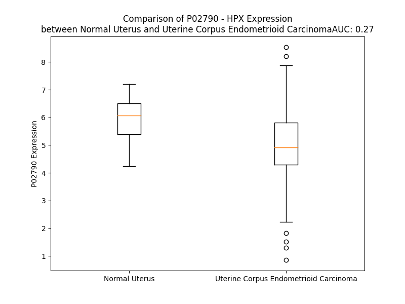

# Detailed Data for P02790

## Introduction to the Detailed Summary

### How to Interpret the Results

- **Summary & Metrics**: This section provides a quick reference to essential protein attributes, including expression changes, family classification, and biomarker applications. Regulation status (upregulated/downregulated) indicates the protein's behavior in a disease context. Some information comes from the original excel file with the proteins selected from literature, while others are derived from the analyses.
- **Expression Comparison**: A visual representation comparing protein expression between normal and disease states. It highlights significant changes in expression levels that might indicate diagnostic or therapeutic relevance. This is data coming from transcriptomics experiments and could not translate similarly to protein levels.
- **Isoform Alignment**: An interactive view of isoform alignments, revealing structural and functional differences between variants of the protein.
- **Interactors & Homologs**: Tables listing known interaction partners and homologous proteins, the more interactors and homologs, the more complex the protein is to design an antibody for.
- **Biological Assemblies**: Information about the structural arrangement of the protein in different assemblies, providing insights into its functional state but also the complexity of the protein to develop antibodies.
- **Combined Per-Residue Information**: A detailed table summarizing residue-level data. This includes predictions for epitope regions, aggregation tendencies, and modifications that might impact the protein's function. Each row corresponds to a residue in the protein, providing insights into specific sites that may be important for research or drug development.
## Summary & Metrics

- **UniProt Accession**: P02790
- **Gene Name**: HPX
- **Protein Name**: hemopexin
- **Swiss Prot**: nan
- **Family**: transporter
- **Biomarker Application**:  
- **Number of Isoforms**: 0
- **Regulation**: 2
- **(transcriptomics) AUC**: 0.27
- **(transcriptomics) Fold Change**: 1.18
- **(transcriptomics) Regulation**: Downregulated
- **Discotope Epitope Count**: 101
- **Max n_uniprots (Homo)**: N/A
- **Max n_uniprots (Hetero)**: N/A

## Expression Comparison

## Interactors

| preferredName_A   | preferredName_B   |   score |
|:------------------|:------------------|--------:|
| HPX               | LRP1              |   0.996 |
| HPX               | HP                |   0.994 |
| HPX               | ALB               |   0.981 |
| HPX               | TIMP2             |   0.94  |
| HPX               | CD163             |   0.931 |
| HPX               | AMBP              |   0.916 |

## Homologs

| uniprot_id   | gene_id   |
|:-------------|:----------|
| O60882       | MMP20     |
| P09238       | MMP10     |
| P09237       | MMP7      |
| E5RJA7       | MMP16     |
| P39900       | MMP12     |
| E9PJB3       | MMP8      |
| G5E971       | MMP13     |
| P51511       | MMP15     |
| P14780       | MMP9      |
| P50281       | MMP14     |
| Q9NRE1       | MMP26     |
| B4DNP3       | MMP19     |
| A0A087WZS5   | MMP25     |
| Q9ULZ9       | MMP17     |
| B4DMZ6       | MMP23B    |
| Q9Y5R2       | MMP24     |
| P08253       | MMP2      |
| P03956       | MMP1      |
| E9PED7       | MMP11     |
| A0A087X1Y9   | MMP28     |
| Q8N119       | MMP21     |
| P08254       | MMP3      |
| Q9H306       | MMP27     |

## Combined Per-Residue Information

|   res | aa   |   epitope_score | epitope   |   relative_surface_accessibility |   modeling_confidence |   Aggregation | modification   | glycosylation                             |
|------:|:-----|----------------:|:----------|---------------------------------:|----------------------:|--------------:|:---------------|:------------------------------------------|
|     1 | M    |         0.12668 | False     |                          1.30427 |                 45.15 |         0     | N/A            | N/A                                       |
|     2 | A    |         0.12339 | False     |                          0.89673 |                 44.89 |         0     | N/A            | N/A                                       |
|     3 | R    |         0.20183 | True      |                          0.92902 |                 43.42 |         0     | N/A            | N/A                                       |
|     4 | V    |         0.15417 | False     |                          0.78773 |                 46.35 |         0     | N/A            | N/A                                       |
|     5 | L    |         0.09184 | False     |                          1.02503 |                 43.5  |         0     | N/A            | N/A                                       |
|     6 | G    |         0.18872 | True      |                          0.92408 |                 41.52 |         0     | N/A            | N/A                                       |
|     7 | A    |         0.08712 | False     |                          0.92125 |                 36.04 |         0     | N/A            | N/A                                       |
|     8 | P    |         0.18698 | True      |                          0.89353 |                 49.02 |         0.762 | N/A            | N/A                                       |
|     9 | V    |         0.22009 | True      |                          1.00596 |                 42.74 |        64.686 | N/A            | N/A                                       |
|    10 | A    |         0.13004 | False     |                          0.78239 |                 38.87 |        70.098 | N/A            | N/A                                       |
|    11 | L    |         0.20453 | True      |                          1.1012  |                 40.24 |        76.466 | N/A            | N/A                                       |
|    12 | G    |         0.25342 | True      |                          0.94247 |                 39.99 |        77.62  | N/A            | N/A                                       |
|    13 | L    |         0.09412 | False     |                          0.9992  |                 40.3  |        90.527 | N/A            | N/A                                       |
|    14 | W    |         0.15719 | False     |                          0.99027 |                 42.56 |        92.776 | N/A            | N/A                                       |
|    15 | S    |         0.076   | False     |                          0.65463 |                 40.91 |        92.444 | N/A            | N/A                                       |
|    16 | L    |         0.15849 | False     |                          0.89368 |                 45.45 |        93.328 | N/A            | N/A                                       |
|    17 | C    |         0.10384 | False     |                          0.66129 |                 42.95 |        93.192 | N/A            | N/A                                       |
|    18 | W    |         0.22896 | True      |                          0.987   |                 42.37 |        93.019 | N/A            | N/A                                       |
|    19 | S    |         0.15699 | False     |                          0.56895 |                 42.26 |        86.472 | N/A            | N/A                                       |
|    20 | L    |         0.12642 | False     |                          1.03779 |                 42.35 |        85.664 | N/A            | N/A                                       |
|    21 | A    |         0.14323 | False     |                          0.79892 |                 42.98 |        81.168 | N/A            | N/A                                       |
|    22 | I    |         0.10622 | False     |                          0.98503 |                 44.03 |        77.358 | N/A            | N/A                                       |
|    23 | A    |         0.13621 | False     |                          0.92649 |                 41.89 |        35.579 | N/A            | N/A                                       |
|    24 | T    |         0.09356 | False     |                          0.94507 |                 44.02 |         0.235 | N/A            | O-linked (GalNAc...) threonine            |
|    25 | P    |         0.16512 | True      |                          0.97588 |                 41.26 |         0.099 | N/A            | N/A                                       |
|    26 | L    |         0.12853 | False     |                          1.05534 |                 41.35 |         0     | N/A            | N/A                                       |
|    27 | P    |         0.17287 | True      |                          0.81074 |                 57.16 |         0     | N/A            | N/A                                       |
|    28 | P    |         0.19832 | True      |                          0.86197 |                 40.57 |         0     | N/A            | N/A                                       |
|    29 | T    |         0.14064 | False     |                          0.85661 |                 37.02 |         0     | N/A            | O-linked (GalNAc...) threonine            |
|    30 | S    |         0.1384  | False     |                          0.84087 |                 37.84 |         0     | N/A            | N/A                                       |
|    31 | A    |         0.1113  | False     |                          0.9879  |                 37.82 |         0     | N/A            | N/A                                       |
|    32 | H    |         0.16773 | True      |                          0.98267 |                 35.94 |         0     | N/A            | N/A                                       |
|    33 | G    |         0.12934 | False     |                          0.85374 |                 34.59 |         0     | N/A            | N/A                                       |
|    34 | N    |         0.10563 | False     |                          0.85763 |                 32.97 |         0     | N/A            | N/A                                       |
|    35 | V    |         0.10608 | False     |                          0.97028 |                 40.41 |         0     | N/A            | N/A                                       |
|    36 | A    |         0.10119 | False     |                          0.86362 |                 34.73 |         0     | N/A            | N/A                                       |
|    37 | E    |         0.14836 | False     |                          0.82293 |                 38.87 |         0     | N/A            | N/A                                       |
|    38 | G    |         0.15259 | False     |                          0.82612 |                 34.23 |         0     | N/A            | N/A                                       |
|    39 | E    |         0.15623 | False     |                          0.88786 |                 40.26 |         0     | N/A            | N/A                                       |
|    40 | T    |         0.17133 | True      |                          0.92986 |                 55.13 |         0     | N/A            | N/A                                       |
|    41 | K    |         0.17011 | True      |                          0.89375 |                 60.13 |         0     | N/A            | N/A                                       |
|    42 | P    |         0.18951 | True      |                          0.61758 |                 69.59 |         0     | N/A            | N/A                                       |
|    43 | D    |         0.15062 | False     |                          0.48558 |                 85.02 |         0     | N/A            | N/A                                       |
|    44 | P    |         0.21173 | True      |                          0.75604 |                 87.54 |         0     | N/A            | N/A                                       |
|    45 | D    |         0.08531 | False     |                          0.13542 |                 88.52 |         0     | N/A            | N/A                                       |
|    46 | V    |         0.08618 | False     |                          0.23326 |                 89.19 |         0     | N/A            | N/A                                       |
|    47 | T    |         0.1196  | False     |                          0.51792 |                 90.49 |         0     | N/A            | N/A                                       |
|    48 | E    |         0.21135 | True      |                          0.52806 |                 90.2  |         0     | N/A            | N/A                                       |
|    49 | R    |         0.0691  | False     |                          0.04839 |                 92.45 |         0     | N/A            | N/A                                       |
|    50 | C    |         0.03486 | False     |                          0.1666  |                 92.97 |         0     | N/A            | N/A                                       |
|    51 | S    |         0.09449 | False     |                          0.40085 |                 93.69 |         0     | N/A            | N/A                                       |
|    52 | D    |         0.19144 | True      |                          0.7095  |                 90.94 |         0     | N/A            | N/A                                       |
|    53 | G    |         0.20284 | True      |                          0.92533 |                 90.41 |         0     | N/A            | N/A                                       |
|    54 | W    |         0.08665 | False     |                          0.10311 |                 94.82 |         0     | N/A            | N/A                                       |
|    55 | S    |         0.03931 | False     |                          0.20142 |                 96.05 |         0     | N/A            | N/A                                       |
|    56 | F    |         0.02218 | False     |                          0.0287  |                 97.01 |         0     | N/A            | N/A                                       |
|    57 | D    |         0.02986 | False     |                          0.20856 |                 98.37 |         0     | N/A            | N/A                                       |
|    58 | A    |         0.00309 | False     |                          0.00765 |                 98.71 |         0     | N/A            | N/A                                       |
|    59 | T    |         0.00398 | False     |                          0.00976 |                 98.37 |         0     | N/A            | N/A                                       |
|    60 | T    |         0.01115 | False     |                          0.02239 |                 98.3  |         0     | N/A            | N/A                                       |
|    61 | L    |         0.0064  | False     |                          0.00354 |                 97.02 |         0     | N/A            | N/A                                       |
|    62 | D    |         0.02782 | False     |                          0.01762 |                 95.04 |         0     | N/A            | N/A                                       |
|    63 | D    |         0.0661  | False     |                          0.2229  |                 93.05 |         0     | N/A            | N/A                                       |
|    64 | N    |         0.15758 | False     |                          0.57901 |                 93.12 |         0     | N/A            | N-linked (GlcNAc...) (complex) asparagine |
|    65 | G    |         0.03577 | False     |                          0.12727 |                 94.25 |         7.487 | N/A            | N/A                                       |
|    66 | T    |         0.06762 | False     |                          0.22438 |                 94.9  |        17.929 | N/A            | N/A                                       |
|    67 | M    |         0.05961 | False     |                          0.17464 |                 96.01 |        20.561 | N/A            | N/A                                       |
|    68 | L    |         0.00856 | False     |                          0.00491 |                 97.05 |        22.979 | N/A            | N/A                                       |
|    69 | F    |         0.012   | False     |                          0.01401 |                 97.44 |        23.327 | N/A            | N/A                                       |
|    70 | F    |         0.00196 | False     |                          0.00275 |                 98.13 |        22.838 | N/A            | N/A                                       |
|    71 | K    |         0.07396 | False     |                          0.31173 |                 97.57 |         7.896 | N/A            | N/A                                       |
|    72 | G    |         0.05606 | False     |                          0.34613 |                 97.19 |         7.896 | N/A            | N/A                                       |
|    73 | E    |         0.16122 | True      |                          0.58035 |                 97.15 |         7.896 | N/A            | N/A                                       |
|    74 | F    |         0.13311 | False     |                          0.36243 |                 96.98 |         7.896 | N/A            | N/A                                       |
|    75 | V    |         0.01551 | False     |                          0.00762 |                 97.25 |         7.677 | N/A            | N/A                                       |
|    76 | W    |         0.07287 | False     |                          0.03754 |                 96.34 |         6.249 | N/A            | N/A                                       |
|    77 | K    |         0.10035 | False     |                          0.2445  |                 92.9  |         0     | N/A            | N/A                                       |
|    78 | S    |         0.06089 | False     |                          0.25655 |                 80.05 |         0     | N/A            | N/A                                       |
|    79 | H    |         0.12747 | False     |                          0.84276 |                 74.69 |         0     | N/A            | N/A                                       |
|    80 | K    |         0.19957 | True      |                          0.69154 |                 79.87 |         0     | N/A            | N/A                                       |
|    81 | W    |         0.05005 | False     |                          0.06658 |                 88.62 |         0     | N/A            | N/A                                       |
|    82 | D    |         0.13923 | False     |                          0.36618 |                 89.44 |         0     | N/A            | N/A                                       |
|    83 | R    |         0.25387 | True      |                          0.47647 |                 94.14 |         0     | N/A            | N/A                                       |
|    84 | E    |         0.10531 | False     |                          0.26758 |                 93.95 |         0     | N/A            | N/A                                       |
|    85 | L    |         0.09352 | False     |                          0.41975 |                 96.04 |         0     | N/A            | N/A                                       |
|    86 | I    |         0.01068 | False     |                          0       |                 97.13 |         0     | N/A            | N/A                                       |
|    87 | S    |         0.09544 | False     |                          0.47772 |                 93.94 |         0     | N/A            | N/A                                       |
|    88 | E    |         0.28213 | True      |                          0.54331 |                 92.15 |         0     | N/A            | N/A                                       |
|    89 | R    |         0.21392 | True      |                          0.37708 |                 90.66 |         0     | N/A            | N/A                                       |
|    90 | W    |         0.04265 | False     |                          0.02761 |                 93.6  |         0     | N/A            | N/A                                       |
|    91 | K    |         0.21098 | True      |                          0.7141  |                 90.25 |         0     | N/A            | N/A                                       |
|    92 | N    |         0.19047 | True      |                          0.89618 |                 88.9  |         0     | N/A            | N/A                                       |
|    93 | F    |         0.03449 | False     |                          0.05609 |                 94.82 |         0     | N/A            | N/A                                       |
|    94 | P    |         0.10121 | False     |                          0.43015 |                 94.25 |         0     | N/A            | N/A                                       |
|    95 | S    |         0.04692 | False     |                          0.21817 |                 95.03 |         0     | N/A            | N/A                                       |
|    96 | P    |         0.04786 | False     |                          0.41254 |                 97.32 |         0     | N/A            | N/A                                       |
|    97 | V    |         0.01247 | False     |                          0.00679 |                 98.53 |         0     | N/A            | N/A                                       |
|    98 | D    |         0.02353 | False     |                          0.18223 |                 98.69 |         0     | N/A            | N/A                                       |
|    99 | A    |         0.00321 | False     |                          0.0051  |                 98.78 |         0     | N/A            | N/A                                       |
|   100 | A    |         0.00603 | False     |                          0.01756 |                 98.69 |         0     | N/A            | N/A                                       |
|   101 | F    |         0.01311 | False     |                          0.00338 |                 98.37 |         0     | N/A            | N/A                                       |
|   102 | R    |         0.01159 | False     |                          0.00931 |                 97.26 |         0     | N/A            | N/A                                       |
|   103 | Q    |         0.06976 | False     |                          0.19586 |                 92.03 |         0     | N/A            | N/A                                       |
|   104 | G    |         0.17627 | True      |                          0.59946 |                 86.8  |         0     | N/A            | N/A                                       |
|   105 | H    |         0.10872 | False     |                          0.40377 |                 85.95 |         0     | N/A            | N/A                                       |
|   106 | N    |         0.15539 | False     |                          0.43168 |                 89.32 |         0.685 | N/A            | N/A                                       |
|   107 | S    |         0.02804 | False     |                          0.02131 |                 93.31 |        18.331 | N/A            | N/A                                       |
|   108 | V    |         0.03073 | False     |                          0.05522 |                 96.38 |        18.331 | N/A            | N/A                                       |
|   109 | F    |         0.02683 | False     |                          0.0242  |                 97.18 |        18.331 | N/A            | N/A                                       |
|   110 | L    |         0.00182 | False     |                          0       |                 98.14 |        18.331 | N/A            | N/A                                       |
|   111 | I    |         0.00355 | False     |                          0.0008  |                 98.52 |        18.331 | N/A            | N/A                                       |
|   112 | K    |         0.03549 | False     |                          0.27379 |                 98.42 |         0     | N/A            | N/A                                       |
|   113 | G    |         0.05253 | False     |                          0.29733 |                 98.31 |         0     | N/A            | N/A                                       |
|   114 | D    |         0.10731 | False     |                          0.44186 |                 97.94 |         0     | N/A            | N/A                                       |
|   115 | K    |         0.10241 | False     |                          0.40968 |                 97.66 |         0     | N/A            | N/A                                       |
|   116 | V    |         0.00404 | False     |                          0       |                 97.16 |         0     | N/A            | N/A                                       |
|   117 | W    |         0.07964 | False     |                          0.088   |                 96.48 |         0     | N/A            | N/A                                       |
|   118 | V    |         0.03051 | False     |                          0.01067 |                 95    |         0     | N/A            | N/A                                       |
|   119 | Y    |         0.04292 | False     |                          0.11164 |                 94.33 |         0     | N/A            | N/A                                       |
|   120 | P    |         0.13603 | False     |                          0.32293 |                 91.63 |         0     | N/A            | N/A                                       |
|   121 | P    |         0.1284  | False     |                          0.55621 |                 83.21 |         0     | N/A            | N/A                                       |
|   122 | E    |         0.359   | True      |                          0.68308 |                 81.65 |         0     | N/A            | N/A                                       |
|   123 | K    |         0.22266 | True      |                          0.42805 |                 77.18 |         0     | N/A            | N/A                                       |
|   124 | K    |         0.17239 | True      |                          0.30908 |                 74.45 |         0     | N/A            | N/A                                       |
|   125 | E    |         0.25775 | True      |                          0.93828 |                 63.69 |         0     | N/A            | N/A                                       |
|   126 | K    |         0.23203 | True      |                          0.82865 |                 67.31 |         0     | N/A            | N/A                                       |
|   127 | G    |         0.13266 | False     |                          0.50591 |                 83.13 |         0     | N/A            | N/A                                       |
|   128 | Y    |         0.17571 | True      |                          0.20412 |                 89.69 |         0     | N/A            | N/A                                       |
|   129 | P    |         0.241   | True      |                          0.54678 |                 94.14 |         0     | N/A            | N/A                                       |
|   130 | K    |         0.16109 | True      |                          0.16178 |                 94.34 |         0     | N/A            | N/A                                       |
|   131 | L    |         0.11361 | False     |                          0.48049 |                 96.95 |         0     | N/A            | N/A                                       |
|   132 | L    |         0.00706 | False     |                          0.00247 |                 97.46 |         0     | N/A            | N/A                                       |
|   133 | Q    |         0.11558 | False     |                          0.41531 |                 97.22 |         0     | N/A            | N/A                                       |
|   134 | D    |         0.19648 | True      |                          0.58769 |                 95.69 |         0     | N/A            | N/A                                       |
|   135 | E    |         0.09091 | False     |                          0.24947 |                 95.2  |         0     | N/A            | N/A                                       |
|   136 | F    |         0.02572 | False     |                          0.03185 |                 97.36 |         0     | N/A            | N/A                                       |
|   137 | P    |         0.23675 | True      |                          0.55315 |                 97.62 |         0     | N/A            | N/A                                       |
|   138 | G    |         0.15804 | False     |                          0.54432 |                 97.01 |         0     | N/A            | N/A                                       |
|   139 | I    |         0.00504 | False     |                          0       |                 98.26 |         0     | N/A            | N/A                                       |
|   140 | P    |         0.05847 | False     |                          0.21969 |                 97.71 |         0     | N/A            | N/A                                       |
|   141 | S    |         0.07006 | False     |                          0.35492 |                 97.46 |         0     | N/A            | N/A                                       |
|   142 | P    |         0.22517 | True      |                          0.62053 |                 97.69 |         0     | N/A            | N/A                                       |
|   143 | L    |         0.01222 | False     |                          0.02698 |                 98.63 |         0     | N/A            | N/A                                       |
|   144 | D    |         0.05481 | False     |                          0.38752 |                 98.64 |         0     | N/A            | N/A                                       |
|   145 | A    |         0.00264 | False     |                          0.00893 |                 98.83 |         0     | N/A            | N/A                                       |
|   146 | A    |         0.00346 | False     |                          0.01034 |                 98.83 |         0     | N/A            | N/A                                       |
|   147 | V    |         0.00473 | False     |                          0.00762 |                 98.73 |         0     | N/A            | N/A                                       |
|   148 | E    |         0.01002 | False     |                          0.04089 |                 98.43 |         0     | N/A            | N/A                                       |
|   149 | C    |         0.00159 | False     |                          0       |                 98.18 |         0     | N/A            | N/A                                       |
|   150 | H    |         0.01612 | False     |                          0.159   |                 97.66 |         0     | N/A            | N/A                                       |
|   151 | R    |         0.13328 | False     |                          0.61188 |                 97.03 |         0     | N/A            | N/A                                       |
|   152 | G    |         0.0286  | False     |                          0.13492 |                 96.33 |         0     | N/A            | N/A                                       |
|   153 | E    |         0.0291  | False     |                          0.10438 |                 97.72 |         0     | N/A            | N/A                                       |
|   154 | C    |         0.01489 | False     |                          0.02339 |                 97.44 |         0     | N/A            | N/A                                       |
|   155 | Q    |         0.10381 | False     |                          0.58735 |                 94.96 |         0     | N/A            | N/A                                       |
|   156 | A    |         0.0504  | False     |                          0.21555 |                 97.05 |         0     | N/A            | N/A                                       |
|   157 | E    |         0.0728  | False     |                          0.34688 |                 97.73 |         0     | N/A            | N/A                                       |
|   158 | G    |         0.01014 | False     |                          0.00952 |                 97.99 |        16.117 | N/A            | N/A                                       |
|   159 | V    |         0.00459 | False     |                          0.00571 |                 98.59 |        20.305 | N/A            | N/A                                       |
|   160 | L    |         0.00263 | False     |                          0.00082 |                 98.7  |        20.696 | N/A            | N/A                                       |
|   161 | F    |         0.00269 | False     |                          0       |                 98.79 |        20.696 | N/A            | N/A                                       |
|   162 | F    |         0.00551 | False     |                          0.00662 |                 98.69 |        20.696 | N/A            | N/A                                       |
|   163 | Q    |         0.06672 | False     |                          0.1894  |                 98.24 |         4.955 | N/A            | N/A                                       |
|   164 | G    |         0.06466 | False     |                          0.33792 |                 96.76 |         2.225 | N/A            | N/A                                       |
|   165 | D    |         0.13896 | False     |                          0.65987 |                 95.23 |         0     | N/A            | N/A                                       |
|   166 | R    |         0.09143 | False     |                          0.41977 |                 97.54 |         0     | N/A            | N/A                                       |
|   167 | E    |         0.0225  | False     |                          0.01751 |                 98.18 |         0     | N/A            | N/A                                       |
|   168 | W    |         0.02775 | False     |                          0.01924 |                 98.48 |         0     | N/A            | N/A                                       |
|   169 | F    |         0.03893 | False     |                          0.02871 |                 98.51 |         0     | N/A            | N/A                                       |
|   170 | W    |         0.06487 | False     |                          0.04712 |                 98.56 |         0     | N/A            | N/A                                       |
|   171 | D    |         0.02781 | False     |                          0.04903 |                 98.13 |         0     | N/A            | N/A                                       |
|   172 | L    |         0.14669 | False     |                          0.36542 |                 96.7  |         0     | N/A            | N/A                                       |
|   173 | A    |         0.15936 | False     |                          0.888   |                 96.72 |         0     | N/A            | N/A                                       |
|   174 | T    |         0.21397 | True      |                          0.63336 |                 97.28 |         0     | N/A            | N/A                                       |
|   175 | G    |         0.19045 | True      |                          0.47843 |                 96.97 |         0     | N/A            | N/A                                       |
|   176 | T    |         0.19248 | True      |                          0.4441  |                 97.54 |         0     | N/A            | N/A                                       |
|   177 | M    |         0.17211 | True      |                          0.33878 |                 96.64 |         0     | N/A            | N/A                                       |
|   178 | K    |         0.0713  | False     |                          0.45532 |                 97.41 |         0     | N/A            | N/A                                       |
|   179 | E    |         0.1642  | True      |                          0.5455  |                 97.78 |         0     | N/A            | N/A                                       |
|   180 | R    |         0.16701 | True      |                          0.26163 |                 96.88 |         0     | N/A            | N/A                                       |
|   181 | S    |         0.29971 | True      |                          0.76297 |                 96.44 |         0     | N/A            | N/A                                       |
|   182 | W    |         0.12522 | False     |                          0.05608 |                 97.48 |         0     | N/A            | N/A                                       |
|   183 | P    |         0.4156  | True      |                          0.95907 |                 96.07 |         0     | N/A            | N/A                                       |
|   184 | A    |         0.17538 | True      |                          0.53696 |                 97.39 |         0     | N/A            | N/A                                       |
|   185 | V    |         0.00811 | False     |                          0.00854 |                 97.49 |         0     | N/A            | N/A                                       |
|   186 | G    |         0.05016 | False     |                          0.26693 |                 93.4  |         0     | N/A            | N/A                                       |
|   187 | N    |         0.08591 | False     |                          0.56725 |                 96.77 |         0     | N/A            | N-linked (GlcNAc...) (complex) asparagine |
|   188 | C    |         0.01774 | False     |                          0.01387 |                 98.41 |         0     | N/A            | N/A                                       |
|   189 | S    |         0.03126 | False     |                          0.28107 |                 98.23 |         0     | N/A            | N/A                                       |
|   190 | S    |         0.00352 | False     |                          0.00782 |                 98.72 |         0     | N/A            | N/A                                       |
|   191 | A    |         0.00558 | False     |                          0.01615 |                 98.76 |         0     | N/A            | N/A                                       |
|   192 | L    |         0.01842 | False     |                          0.01814 |                 97.82 |         0     | N/A            | N/A                                       |
|   193 | R    |         0.00982 | False     |                          0.00843 |                 98.29 |         0     | N/A            | N/A                                       |
|   194 | W    |         0.05797 | False     |                          0.15228 |                 97.5  |         0     | N/A            | N/A                                       |
|   195 | L    |         0.04121 | False     |                          0.05921 |                 96.96 |         0     | N/A            | N/A                                       |
|   196 | G    |         0.02043 | False     |                          0.11988 |                 96.71 |         0     | N/A            | N/A                                       |
|   197 | R    |         0.02587 | False     |                          0.04326 |                 98.13 |         0     | N/A            | N/A                                       |
|   198 | Y    |         0.02343 | False     |                          0.01675 |                 98.68 |         0     | N/A            | N/A                                       |
|   199 | Y    |         0.02885 | False     |                          0.03471 |                 98.67 |         0     | N/A            | N/A                                       |
|   200 | C    |         0.00214 | False     |                          0       |                 98.71 |         0     | N/A            | N/A                                       |
|   201 | F    |         0.00544 | False     |                          0.00814 |                 98.52 |         0     | N/A            | N/A                                       |
|   202 | Q    |         0.10543 | False     |                          0.30252 |                 97.22 |         0     | N/A            | N/A                                       |
|   203 | G    |         0.03845 | False     |                          0.2453  |                 94.52 |         0     | N/A            | N/A                                       |
|   204 | N    |         0.03042 | False     |                          0.08594 |                 95.26 |         0     | N/A            | N/A                                       |
|   205 | Q    |         0.11056 | False     |                          0.43046 |                 97.15 |         0     | N/A            | N/A                                       |
|   206 | F    |         0.0793  | False     |                          0.02612 |                 98.14 |         0     | N/A            | N/A                                       |
|   207 | L    |         0.04155 | False     |                          0.05358 |                 98.49 |         0     | N/A            | N/A                                       |
|   208 | R    |         0.0936  | False     |                          0.1301  |                 98.29 |         0     | N/A            | N/A                                       |
|   209 | F    |         0.01979 | False     |                          0.01775 |                 98.29 |         0     | N/A            | N/A                                       |
|   210 | D    |         0.04475 | False     |                          0.2154  |                 97.76 |         0     | N/A            | N/A                                       |
|   211 | P    |         0.02624 | False     |                          0.11315 |                 98.06 |         0     | N/A            | N/A                                       |
|   212 | V    |         0.05509 | False     |                          0.20147 |                 97.2  |         0     | N/A            | N/A                                       |
|   213 | R    |         0.15869 | False     |                          0.44019 |                 96.2  |         0     | N/A            | N/A                                       |
|   214 | G    |         0.03552 | False     |                          0.03489 |                 97.41 |         0     | N/A            | N/A                                       |
|   215 | E    |         0.11749 | False     |                          0.55338 |                 97.08 |         0     | N/A            | N/A                                       |
|   216 | V    |         0.0943  | False     |                          0.27914 |                 97.92 |         0     | N/A            | N/A                                       |
|   217 | P    |         0.08133 | False     |                          0.29903 |                 96.04 |         0     | N/A            | N/A                                       |
|   218 | P    |         0.26163 | True      |                          0.88838 |                 95.57 |         0     | N/A            | N/A                                       |
|   219 | R    |         0.33511 | True      |                          0.81686 |                 93.62 |         0     | N/A            | N/A                                       |
|   220 | Y    |         0.23516 | True      |                          0.23134 |                 97.28 |         0     | N/A            | N/A                                       |
|   221 | P    |         0.3087  | True      |                          0.52631 |                 97.26 |         0     | N/A            | N/A                                       |
|   222 | R    |         0.1995  | True      |                          0.30944 |                 96.82 |         0     | N/A            | N/A                                       |
|   223 | D    |         0.04567 | False     |                          0.17221 |                 96.2  |         0     | N/A            | N/A                                       |
|   224 | V    |         0.0048  | False     |                          0.00476 |                 95.22 |         0     | N/A            | N/A                                       |
|   225 | R    |         0.09703 | False     |                          0.0821  |                 93.45 |         0     | N/A            | N/A                                       |
|   226 | D    |         0.15049 | False     |                          0.20082 |                 93.71 |         0     | N/A            | N/A                                       |
|   227 | Y    |         0.33078 | True      |                          0.37507 |                 93.11 |         0     | N/A            | N/A                                       |
|   228 | F    |         0.07503 | False     |                          0.12443 |                 92.62 |         0     | N/A            | N/A                                       |
|   229 | M    |         0.03133 | False     |                          0.01677 |                 90.06 |         0     | N/A            | N/A                                       |
|   230 | P    |         0.22445 | True      |                          0.53233 |                 89.19 |         0     | N/A            | N/A                                       |
|   231 | C    |         0.08533 | False     |                          0.07876 |                 91.27 |         0     | N/A            | N/A                                       |
|   232 | P    |         0.28426 | True      |                          0.75432 |                 90.55 |         0     | N/A            | N/A                                       |
|   233 | G    |         0.22549 | True      |                          1.10712 |                 90.03 |         0     | N/A            | N/A                                       |
|   234 | R    |         0.27351 | True      |                          0.3966  |                 91.04 |         0     | N/A            | N/A                                       |
|   235 | G    |         0.22005 | True      |                          0.51028 |                 85.45 |         0     | N/A            | N/A                                       |
|   236 | H    |         0.23819 | True      |                          0.55809 |                 79.46 |         0     | N/A            | N/A                                       |
|   237 | G    |         0.23861 | True      |                          0.63767 |                 62.51 |         0     | N/A            | N/A                                       |
|   238 | H    |         0.27964 | True      |                          0.77023 |                 50.09 |         0     | N/A            | N/A                                       |
|   239 | R    |         0.25989 | True      |                          1.01115 |                 39.26 |         0     | N/A            | N/A                                       |
|   240 | N    |         0.18657 | True      |                          0.85452 |                 35.13 |         0     | N/A            | N-linked (GlcNAc...) asparagine           |
|   241 | G    |         0.24373 | True      |                          0.74861 |                 32.31 |         0     | N/A            | N/A                                       |
|   242 | T    |         0.27215 | True      |                          1.06246 |                 31.78 |         0     | N/A            | N/A                                       |
|   243 | G    |         0.18965 | True      |                          0.8906  |                 29.54 |         0     | N/A            | N/A                                       |
|   244 | H    |         0.26508 | True      |                          1.11927 |                 31.28 |         0     | N/A            | N/A                                       |
|   245 | G    |         0.2125  | True      |                          0.64944 |                 31.14 |         0     | N/A            | N/A                                       |
|   246 | N    |         0.24273 | True      |                          1.05781 |                 27.26 |         0     | N/A            | N-linked (GlcNAc...) asparagine           |
|   247 | S    |         0.21611 | True      |                          0.65913 |                 29.27 |         0     | N/A            | N/A                                       |
|   248 | T    |         0.21686 | True      |                          0.87162 |                 30.66 |         0     | N/A            | N/A                                       |
|   249 | H    |         0.27261 | True      |                          0.9493  |                 35.02 |         0     | N/A            | N/A                                       |
|   250 | H    |         0.25598 | True      |                          0.65348 |                 44.68 |         0     | N/A            | N/A                                       |
|   251 | G    |         0.19901 | True      |                          0.40573 |                 51.92 |         0     | N/A            | N/A                                       |
|   252 | P    |         0.15878 | False     |                          0.29311 |                 60.84 |         0     | N/A            | N/A                                       |
|   253 | E    |         0.13364 | False     |                          0.39303 |                 67.51 |         0     | N/A            | N/A                                       |
|   254 | Y    |         0.24931 | True      |                          0.63947 |                 69.07 |         0     | N/A            | N/A                                       |
|   255 | M    |         0.24705 | True      |                          0.52483 |                 81.81 |         0     | N/A            | N/A                                       |
|   256 | R    |         0.12884 | False     |                          0.22656 |                 90.72 |         0     | N/A            | N/A                                       |
|   257 | C    |         0.1226  | False     |                          0.36881 |                 91.5  |         0     | N/A            | N/A                                       |
|   258 | S    |         0.09496 | False     |                          0.20184 |                 89.41 |         0     | N/A            | N/A                                       |
|   259 | P    |         0.15999 | False     |                          0.68197 |                 85.46 |         0     | N/A            | N/A                                       |
|   260 | H    |         0.28176 | True      |                          0.86141 |                 86.86 |         0     | N/A            | N/A                                       |
|   261 | L    |         0.05488 | False     |                          0.05028 |                 91.3  |        14.203 | N/A            | N/A                                       |
|   262 | V    |         0.12052 | False     |                          0.59327 |                 93    |        16.425 | N/A            | N/A                                       |
|   263 | L    |         0.01376 | False     |                          0.00906 |                 96.51 |        16.425 | N/A            | N/A                                       |
|   264 | S    |         0.04336 | False     |                          0.22146 |                 97.37 |        16.425 | N/A            | N/A                                       |
|   265 | A    |         0.004   | False     |                          0.0051  |                 98.4  |        16.425 | N/A            | N/A                                       |
|   266 | L    |         0.00278 | False     |                          0.00456 |                 98.15 |        14.705 | N/A            | N/A                                       |
|   267 | T    |         0.00707 | False     |                          0.00648 |                 97.97 |         3.701 | N/A            | N/A                                       |
|   268 | S    |         0.01897 | False     |                          0.1224  |                 97.54 |         0.35  | N/A            | N/A                                       |
|   269 | D    |         0.01348 | False     |                          0.07621 |                 96.82 |         0     | N/A            | N/A                                       |
|   270 | N    |         0.07352 | False     |                          0.43499 |                 95.25 |         0     | N/A            | N/A                                       |
|   271 | H    |         0.0688  | False     |                          0.35372 |                 95.5  |         0     | N/A            | N/A                                       |
|   272 | G    |         0.05484 | False     |                          0.33254 |                 94.63 |         0     | N/A            | N/A                                       |
|   273 | A    |         0.01559 | False     |                          0.08822 |                 97.03 |         0.967 | N/A            | N/A                                       |
|   274 | T    |         0.01144 | False     |                          0.03714 |                 97.9  |         1.127 | N/A            | N/A                                       |
|   275 | Y    |         0.00623 | False     |                          0.01872 |                 98.06 |         1.127 | N/A            | N/A                                       |
|   276 | A    |         0.00731 | False     |                          0.00128 |                 97.74 |         1.127 | N/A            | N/A                                       |
|   277 | F    |         0.00145 | False     |                          0       |                 98.15 |         1.127 | N/A            | N/A                                       |
|   278 | S    |         0.05937 | False     |                          0.14517 |                 96.33 |         0.161 | N/A            | N/A                                       |
|   279 | G    |         0.08182 | False     |                          0.52048 |                 94.46 |         0     | N/A            | N/A                                       |
|   280 | T    |         0.1417  | False     |                          0.56354 |                 96.12 |         0     | N/A            | N/A                                       |
|   281 | H    |         0.06962 | False     |                          0.19095 |                 96.65 |         0     | N/A            | N/A                                       |
|   282 | Y    |         0.02726 | False     |                          0.02504 |                 97.56 |         0     | N/A            | N/A                                       |
|   283 | W    |         0.00793 | False     |                          0.00387 |                 97.27 |         0     | N/A            | N/A                                       |
|   284 | R    |         0.04212 | False     |                          0.1058  |                 97.17 |         0     | N/A            | N/A                                       |
|   285 | L    |         0.04127 | False     |                          0.09631 |                 95.89 |         0     | N/A            | N/A                                       |
|   286 | D    |         0.10057 | False     |                          0.40247 |                 94.59 |         0     | N/A            | N/A                                       |
|   287 | T    |         0.02798 | False     |                          0.0457  |                 95.09 |         0     | N/A            | N/A                                       |
|   288 | S    |         0.14373 | False     |                          0.3538  |                 93.72 |         0     | N/A            | N/A                                       |
|   289 | R    |         0.18287 | True      |                          0.4908  |                 92.62 |         0     | N/A            | N/A                                       |
|   290 | D    |         0.05813 | False     |                          0.04387 |                 94.99 |         0     | N/A            | N/A                                       |
|   291 | G    |         0.10091 | False     |                          0.3231  |                 92.98 |         0     | N/A            | N/A                                       |
|   292 | W    |         0.0557  | False     |                          0.24622 |                 92.84 |         0     | N/A            | N/A                                       |
|   293 | H    |         0.0893  | False     |                          0.1911  |                 93.86 |         0     | N/A            | N/A                                       |
|   294 | S    |         0.03865 | False     |                          0.04841 |                 95.71 |         0     | N/A            | N/A                                       |
|   295 | W    |         0.04335 | False     |                          0.13531 |                 95.31 |         0     | N/A            | N/A                                       |
|   296 | P    |         0.08944 | False     |                          0.31711 |                 96.25 |         0     | N/A            | N/A                                       |
|   297 | I    |         0.02003 | False     |                          0.01635 |                 97.99 |         0     | N/A            | N/A                                       |
|   298 | A    |         0.0888  | False     |                          0.60148 |                 96.3  |         0     | N/A            | N/A                                       |
|   299 | H    |         0.12382 | False     |                          0.40407 |                 95.15 |         0     | N/A            | N/A                                       |
|   300 | Q    |         0.06728 | False     |                          0.18492 |                 96.73 |         0     | N/A            | N/A                                       |
|   301 | W    |         0.0031  | False     |                          0.00396 |                 97.63 |         0     | N/A            | N/A                                       |
|   302 | P    |         0.16015 | False     |                          0.69222 |                 92.15 |         0     | N/A            | N/A                                       |
|   303 | Q    |         0.1617  | True      |                          0.61677 |                 95.1  |         0     | N/A            | N/A                                       |
|   304 | G    |         0.05208 | False     |                          0.26324 |                 97.68 |         0     | N/A            | N/A                                       |
|   305 | P    |         0.03227 | False     |                          0.04474 |                 98.04 |         0     | N/A            | N/A                                       |
|   306 | S    |         0.11461 | False     |                          0.59002 |                 97.06 |         0     | N/A            | N/A                                       |
|   307 | A    |         0.03673 | False     |                          0.23978 |                 97.33 |         0     | N/A            | N/A                                       |
|   308 | V    |         0.00311 | False     |                          0       |                 98.42 |         0     | N/A            | N/A                                       |
|   309 | D    |         0.05354 | False     |                          0.27811 |                 98.02 |         0     | N/A            | N/A                                       |
|   310 | A    |         0.00241 | False     |                          0.0051  |                 98.44 |         0     | N/A            | N/A                                       |
|   311 | A    |         0.00889 | False     |                          0.02008 |                 98.65 |         0     | N/A            | N/A                                       |
|   312 | F    |         0.02029 | False     |                          0.0443  |                 98.27 |         0     | N/A            | N/A                                       |
|   313 | S    |         0.02549 | False     |                          0.22807 |                 97.71 |         0     | N/A            | N/A                                       |
|   314 | W    |         0.07127 | False     |                          0.18629 |                 97.25 |         0     | N/A            | N/A                                       |
|   315 | E    |         0.16051 | False     |                          0.52137 |                 94.61 |         0     | N/A            | N/A                                       |
|   316 | E    |         0.05322 | False     |                          0.41351 |                 95.34 |         0.116 | N/A            | N/A                                       |
|   317 | K    |         0.06355 | False     |                          0.28362 |                 97.74 |         0.116 | N/A            | N/A                                       |
|   318 | L    |         0.00128 | False     |                          0       |                 98.47 |        24.204 | N/A            | N/A                                       |
|   319 | Y    |         0.01948 | False     |                          0.0481  |                 98.41 |        24.756 | N/A            | N/A                                       |
|   320 | L    |         0.00167 | False     |                          0       |                 98.71 |        25.205 | N/A            | N/A                                       |
|   321 | V    |         0.00527 | False     |                          0.01142 |                 98.32 |        25.286 | N/A            | N/A                                       |
|   322 | Q    |         0.04568 | False     |                          0.2442  |                 97.65 |        25.286 | N/A            | N/A                                       |
|   323 | G    |         0.07635 | False     |                          0.24099 |                 94.68 |        24.1   | N/A            | N/A                                       |
|   324 | T    |         0.05065 | False     |                          0.23248 |                 93.16 |        25.949 | N/A            | N/A                                       |
|   325 | Q    |         0.06632 | False     |                          0.41921 |                 97.29 |        29.173 | N/A            | N/A                                       |
|   326 | V    |         0.01474 | False     |                          0.01333 |                 98.1  |        92.28  | N/A            | N/A                                       |
|   327 | Y    |         0.01669 | False     |                          0.09665 |                 98.62 |        94.27  | N/A            | N/A                                       |
|   328 | V    |         0.01995 | False     |                          0.01809 |                 98.31 |        94.233 | N/A            | N/A                                       |
|   329 | F    |         0.00313 | False     |                          0.0051  |                 98.6  |        93.744 | N/A            | N/A                                       |
|   330 | L    |         0.06602 | False     |                          0.41752 |                 97.85 |        86.917 | N/A            | N/A                                       |
|   331 | T    |         0.00675 | False     |                          0.01074 |                 97.01 |        33.677 | N/A            | N/A                                       |
|   332 | K    |         0.10508 | False     |                          0.57085 |                 93.39 |         0     | N/A            | N/A                                       |
|   333 | G    |         0.03124 | False     |                          0.05392 |                 92.32 |         0     | N/A            | N/A                                       |
|   334 | G    |         0.04066 | False     |                          0.22526 |                 94.98 |         0.262 | N/A            | N/A                                       |
|   335 | Y    |         0.06048 | False     |                          0.0929  |                 97.51 |         1.239 | N/A            | N/A                                       |
|   336 | T    |         0.04279 | False     |                          0.40747 |                 96.87 |         1.239 | N/A            | N/A                                       |
|   337 | L    |         0.04958 | False     |                          0.21872 |                 98.05 |         1.239 | N/A            | N/A                                       |
|   338 | V    |         0.0862  | False     |                          0.28939 |                 97.81 |         1.239 | N/A            | N/A                                       |
|   339 | S    |         0.20192 | True      |                          0.8534  |                 97.46 |         0.977 | N/A            | N/A                                       |
|   340 | G    |         0.2525  | True      |                          0.71646 |                 97.01 |         0     | N/A            | N/A                                       |
|   341 | Y    |         0.1452  | False     |                          0.14427 |                 98.07 |         0     | N/A            | N/A                                       |
|   342 | P    |         0.30317 | True      |                          0.43752 |                 98.01 |         0     | N/A            | N/A                                       |
|   343 | K    |         0.123   | False     |                          0.33673 |                 97.04 |         0     | N/A            | N/A                                       |
|   344 | R    |         0.1877  | True      |                          0.56885 |                 95.66 |         0     | N/A            | N/A                                       |
|   345 | L    |         0.03047 | False     |                          0.05523 |                 94.04 |         0     | N/A            | N/A                                       |
|   346 | E    |         0.07795 | False     |                          0.44882 |                 92.92 |         0     | N/A            | N/A                                       |
|   347 | K    |         0.1783  | True      |                          0.69363 |                 93.43 |         0     | N/A            | N/A                                       |
|   348 | E    |         0.07424 | False     |                          0.1249  |                 93.81 |         0     | N/A            | N/A                                       |
|   349 | V    |         0.01129 | False     |                          0.01142 |                 94.57 |         0     | N/A            | N/A                                       |
|   350 | G    |         0.02497 | False     |                          0.09797 |                 93.4  |         0     | N/A            | N/A                                       |
|   351 | T    |         0.14741 | False     |                          0.55557 |                 92.95 |         0     | N/A            | N/A                                       |
|   352 | P    |         0.03376 | False     |                          0.01785 |                 94.32 |         0     | N/A            | N/A                                       |
|   353 | H    |         0.24814 | True      |                          0.99327 |                 90.74 |         0     | N/A            | N/A                                       |
|   354 | G    |         0.34438 | True      |                          0.95263 |                 90.19 |         0     | N/A            | N/A                                       |
|   355 | I    |         0.24264 | True      |                          0.27509 |                 90.69 |         0     | N/A            | N/A                                       |
|   356 | I    |         0.28798 | True      |                          0.94917 |                 88.71 |         0     | N/A            | N/A                                       |
|   357 | L    |         0.11006 | False     |                          0.1528  |                 91.81 |         0     | N/A            | N/A                                       |
|   358 | D    |         0.27975 | True      |                          0.7692  |                 89.29 |         0     | N/A            | N/A                                       |
|   359 | S    |         0.0881  | False     |                          0.38839 |                 92.73 |         0     | N/A            | N/A                                       |
|   360 | V    |         0.01881 | False     |                          0.01821 |                 95.4  |         0     | N/A            | N/A                                       |
|   361 | D    |         0.02445 | False     |                          0.10631 |                 97.61 |         0     | N/A            | N/A                                       |
|   362 | A    |         0.00094 | False     |                          0.00128 |                 98.33 |         0     | N/A            | N/A                                       |
|   363 | A    |         0.00584 | False     |                          0.02083 |                 98.41 |         0     | N/A            | N/A                                       |
|   364 | F    |         0.01168 | False     |                          0.01441 |                 98.24 |         0     | N/A            | N/A                                       |
|   365 | I    |         0.041   | False     |                          0.11204 |                 98.03 |         0     | N/A            | N/A                                       |
|   366 | C    |         0.02233 | False     |                          0.14896 |                 96.5  |         0     | N/A            | N/A                                       |
|   367 | P    |         0.10558 | False     |                          0.46581 |                 94.35 |         0     | N/A            | N/A                                       |
|   368 | G    |         0.11846 | False     |                          1.14594 |                 92.93 |         0     | N/A            | N/A                                       |
|   369 | S    |         0.06486 | False     |                          0.27927 |                 96.32 |         0     | N/A            | N/A                                       |
|   370 | S    |         0.04024 | False     |                          0.10178 |                 97.27 |         0     | N/A            | N/A                                       |
|   371 | R    |         0.06179 | False     |                          0.52374 |                 98.06 |         0     | N/A            | N/A                                       |
|   372 | L    |         0.00293 | False     |                          0.00165 |                 98.36 |         0     | N/A            | N/A                                       |
|   373 | H    |         0.01716 | False     |                          0.06101 |                 98.54 |         0     | N/A            | N/A                                       |
|   374 | I    |         0.00769 | False     |                          0.0096  |                 97.75 |         0     | N/A            | N/A                                       |
|   375 | M    |         0.0023  | False     |                          0       |                 98.02 |         0     | N/A            | N/A                                       |
|   376 | A    |         0.03563 | False     |                          0.16342 |                 96.67 |         0     | N/A            | N/A                                       |
|   377 | G    |         0.05036 | False     |                          0.37214 |                 95.27 |         0     | N/A            | N/A                                       |
|   378 | R    |         0.13631 | False     |                          0.6657  |                 96.02 |         0     | N/A            | N/A                                       |
|   379 | R    |         0.11779 | False     |                          0.3934  |                 97.06 |         0     | N/A            | N/A                                       |
|   380 | L    |         0.00382 | False     |                          0       |                 97.92 |         0     | N/A            | N/A                                       |
|   381 | W    |         0.04516 | False     |                          0.02753 |                 98.27 |         0     | N/A            | N/A                                       |
|   382 | W    |         0.06693 | False     |                          0.29783 |                 98.07 |         0     | N/A            | N/A                                       |
|   383 | L    |         0.0083  | False     |                          0       |                 98.09 |         0     | N/A            | N/A                                       |
|   384 | D    |         0.03878 | False     |                          0.27448 |                 97.82 |         0     | N/A            | N/A                                       |
|   385 | L    |         0.04598 | False     |                          0.08656 |                 96.54 |         0     | N/A            | N/A                                       |
|   386 | K    |         0.33151 | True      |                          0.75538 |                 96.5  |         0     | N/A            | N/A                                       |
|   387 | S    |         0.18092 | True      |                          0.42456 |                 96.63 |         0     | N/A            | N/A                                       |
|   388 | G    |         0.10843 | False     |                          0.26603 |                 94.35 |         0     | N/A            | N/A                                       |
|   389 | A    |         0.16068 | True      |                          0.54677 |                 94.06 |         0     | N/A            | N/A                                       |
|   390 | Q    |         0.31824 | True      |                          0.82829 |                 95.26 |         0     | N/A            | N/A                                       |
|   391 | A    |         0.07813 | False     |                          0.08967 |                 96.25 |         0     | N/A            | N/A                                       |
|   392 | T    |         0.14885 | False     |                          0.77538 |                 96.73 |         0     | N/A            | N/A                                       |
|   393 | W    |         0.12693 | False     |                          0.09573 |                 97.74 |         0     | N/A            | N/A                                       |
|   394 | T    |         0.08532 | False     |                          0.3985  |                 97.72 |         0     | N/A            | N/A                                       |
|   395 | E    |         0.15412 | False     |                          0.44309 |                 97.78 |         0     | N/A            | N/A                                       |
|   396 | L    |         0.09241 | False     |                          0.18748 |                 97.73 |         0     | N/A            | N/A                                       |
|   397 | P    |         0.15309 | False     |                          0.68196 |                 97.45 |         0     | N/A            | N/A                                       |
|   398 | W    |         0.08937 | False     |                          0.13007 |                 97.78 |         0     | N/A            | N/A                                       |
|   399 | P    |         0.12349 | False     |                          0.24636 |                 97.21 |         0     | N/A            | N/A                                       |
|   400 | H    |         0.04959 | False     |                          0.0449  |                 97.95 |         0     | N/A            | N/A                                       |
|   401 | E    |         0.17542 | True      |                          0.62449 |                 95.89 |         0     | N/A            | N/A                                       |
|   402 | K    |         0.09813 | False     |                          0.37914 |                 96.06 |         0     | N/A            | N/A                                       |
|   403 | V    |         0.00622 | False     |                          0       |                 97.88 |         0     | N/A            | N/A                                       |
|   404 | D    |         0.04028 | False     |                          0.14333 |                 97.65 |         0     | N/A            | N/A                                       |
|   405 | G    |         0.00322 | False     |                          0.00644 |                 98.09 |         0     | N/A            | N/A                                       |
|   406 | A    |         0.005   | False     |                          0.01536 |                 98.31 |         0     | N/A            | N/A                                       |
|   407 | L    |         0.01408 | False     |                          0.07172 |                 97.79 |         0     | N/A            | N/A                                       |
|   408 | C    |         0.00976 | False     |                          0.04699 |                 96.97 |         0     | N/A            | N/A                                       |
|   409 | M    |         0.04047 | False     |                          0.10787 |                 94.39 |         0     | N/A            | N/A                                       |
|   410 | E    |         0.1234  | False     |                          0.66159 |                 89.36 |         0     | N/A            | N/A                                       |
|   411 | K    |         0.08899 | False     |                          0.75915 |                 85.9  |         0     | N/A            | N/A                                       |
|   412 | S    |         0.08378 | False     |                          0.39095 |                 85.38 |         0     | N/A            | N/A                                       |
|   413 | L    |         0.02011 | False     |                          0.0391  |                 84.83 |         0     | N/A            | N/A                                       |
|   414 | G    |         0.04578 | False     |                          0.36878 |                 74.94 |         0     | N/A            | N/A                                       |
|   415 | P    |         0.10881 | False     |                          0.74703 |                 70.4  |         0     | N/A            | N/A                                       |
|   416 | N    |         0.113   | False     |                          0.53668 |                 76.15 |         0     | N/A            | N/A                                       |
|   417 | S    |         0.09349 | False     |                          0.45721 |                 81.86 |         0     | N/A            | N/A                                       |
|   418 | C    |         0.04952 | False     |                          0.37638 |                 85.07 |         0     | N/A            | N/A                                       |
|   419 | S    |         0.06842 | False     |                          0.13873 |                 83.16 |         0     | N/A            | N/A                                       |
|   420 | A    |         0.17974 | True      |                          0.9805  |                 78.85 |         0     | N/A            | N/A                                       |
|   421 | N    |         0.27135 | True      |                          0.99336 |                 75.58 |         0     | N/A            | N/A                                       |
|   422 | G    |         0.12132 | False     |                          0.3916  |                 80.23 |         0     | N/A            | N/A                                       |
|   423 | P    |         0.11286 | False     |                          0.27782 |                 87.55 |         0     | N/A            | N/A                                       |
|   424 | G    |         0.01888 | False     |                          0.02074 |                 93.34 |         5.409 | N/A            | N/A                                       |
|   425 | L    |         0.00314 | False     |                          0.00082 |                 96.27 |         6.688 | N/A            | N/A                                       |
|   426 | Y    |         0.00236 | False     |                          0.00232 |                 97.12 |         6.688 | N/A            | N/A                                       |
|   427 | L    |         0.00249 | False     |                          0       |                 97.63 |         6.688 | N/A            | N/A                                       |
|   428 | I    |         0.01402 | False     |                          0.0104  |                 97.01 |         6.688 | N/A            | N/A                                       |
|   429 | H    |         0.09056 | False     |                          0.38229 |                 97.01 |         1.279 | N/A            | N/A                                       |
|   430 | G    |         0.05335 | False     |                          0.19938 |                 94.31 |         0     | N/A            | N/A                                       |
|   431 | P    |         0.07806 | False     |                          0.47547 |                 93.7  |         0     | N/A            | N/A                                       |
|   432 | N    |         0.04187 | False     |                          0.27289 |                 94.63 |         0     | N/A            | N/A                                       |
|   433 | L    |         0.01994 | False     |                          0.01147 |                 94.61 |         0     | N/A            | N/A                                       |
|   434 | Y    |         0.03803 | False     |                          0.06908 |                 95.78 |         0     | N/A            | N/A                                       |
|   435 | C    |         0.01954 | False     |                          0.12487 |                 95.59 |         0     | N/A            | N/A                                       |
|   436 | Y    |         0.02737 | False     |                          0.0514  |                 95.52 |         0     | N/A            | N/A                                       |
|   437 | S    |         0.04654 | False     |                          0.23176 |                 93.52 |         0     | N/A            | N/A                                       |
|   438 | D    |         0.08957 | False     |                          0.2842  |                 93.83 |         0     | N/A            | N/A                                       |
|   439 | V    |         0.02501 | False     |                          0.16459 |                 95.55 |         0     | N/A            | N/A                                       |
|   440 | E    |         0.12233 | False     |                          0.65206 |                 94.76 |         0     | N/A            | N/A                                       |
|   441 | K    |         0.19839 | True      |                          0.59845 |                 95.47 |         0     | N/A            | N/A                                       |
|   442 | L    |         0.00499 | False     |                          0       |                 97.3  |         0     | N/A            | N/A                                       |
|   443 | N    |         0.07911 | False     |                          0.24931 |                 96.92 |         0     | N/A            | N/A                                       |
|   444 | A    |         0.22494 | True      |                          0.7154  |                 97.13 |         0     | N/A            | N/A                                       |
|   445 | A    |         0.14603 | False     |                          0.26979 |                 96.66 |         0     | N/A            | N/A                                       |
|   446 | K    |         0.22464 | True      |                          1.0185  |                 95.22 |         0     | N/A            | N/A                                       |
|   447 | A    |         0.30099 | True      |                          0.69312 |                 95.64 |         0     | N/A            | N/A                                       |
|   448 | L    |         0.17482 | True      |                          0.47803 |                 96.89 |         0     | N/A            | N/A                                       |
|   449 | P    |         0.16441 | True      |                          0.3171  |                 94.76 |         0     | N/A            | N/A                                       |
|   450 | Q    |         0.10416 | False     |                          0.81108 |                 93.84 |         0     | N/A            | N/A                                       |
|   451 | P    |         0.0749  | False     |                          0.35398 |                 93.39 |         0     | N/A            | N/A                                       |
|   452 | Q    |         0.04104 | False     |                          0.23312 |                 91.49 |         0     | N/A            | N/A                                       |
|   453 | N    |         0.0409  | False     |                          0.37791 |                 91.42 |         0     | N/A            | N-linked (GlcNAc...) (complex) asparagine |
|   454 | V    |         0.00497 | False     |                          0.00666 |                 92.58 |         1.609 | N/A            | N/A                                       |
|   455 | T    |         0.03412 | False     |                          0.02643 |                 91.28 |         1.609 | N/A            | N/A                                       |
|   456 | S    |         0.04343 | False     |                          0.2893  |                 89.81 |         1.609 | N/A            | N/A                                       |
|   457 | L    |         0.03665 | False     |                          0.04803 |                 90.77 |         1.609 | N/A            | N/A                                       |
|   458 | L    |         0.00464 | False     |                          0       |                 91.17 |         1.609 | N/A            | N/A                                       |
|   459 | G    |         0.05803 | False     |                          0.53977 |                 89.58 |         0.133 | N/A            | N/A                                       |
|   460 | C    |         0.04571 | False     |                          0.09095 |                 90.48 |         0     | N/A            | N/A                                       |
|   461 | T    |         0.12122 | False     |                          0.96186 |                 73.88 |         0     | N/A            | N/A                                       |
|   462 | H    |         0.09387 | False     |                          0.90425 |                 58.3  |         0     | N/A            | N/A                                       |

