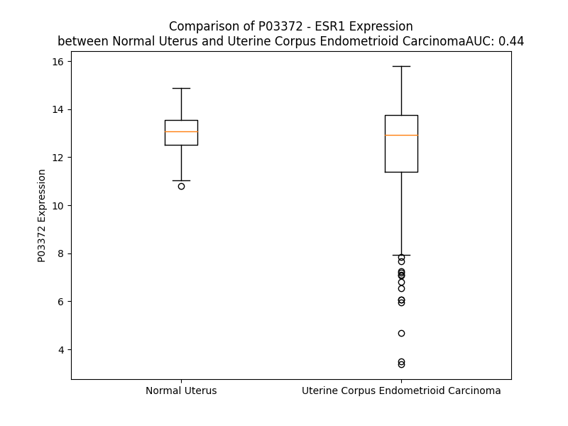

# Detailed Data for P03372

## Introduction to the Detailed Summary

### How to Interpret the Results

- **Summary & Metrics**: This section provides a quick reference to essential protein attributes, including expression changes, family classification, and biomarker applications. Regulation status (upregulated/downregulated) indicates the protein's behavior in a disease context. Some information comes from the original excel file with the proteins selected from literature, while others are derived from the analyses.
- **Expression Comparison**: A visual representation comparing protein expression between normal and disease states. It highlights significant changes in expression levels that might indicate diagnostic or therapeutic relevance. This is data coming from transcriptomics experiments and could not translate similarly to protein levels.
- **Isoform Alignment**: An interactive view of isoform alignments, revealing structural and functional differences between variants of the protein.
- **Interactors & Homologs**: Tables listing known interaction partners and homologous proteins, the more interactors and homologs, the more complex the protein is to design an antibody for.
- **Biological Assemblies**: Information about the structural arrangement of the protein in different assemblies, providing insights into its functional state but also the complexity of the protein to develop antibodies.
- **Combined Per-Residue Information**: A detailed table summarizing residue-level data. This includes predictions for epitope regions, aggregation tendencies, and modifications that might impact the protein's function. Each row corresponds to a residue in the protein, providing insights into specific sites that may be important for research or drug development.
## Summary & Metrics

- **UniProt Accession**: P03372
- **Gene Name**: ER (alpha)
- **Protein Name**: Estrogen receptor
- **Swiss Prot**: ESR1_HUMAN
- **Family**: ligand-dependent nuclear receptor
- **Biomarker Application**: diagnosis,disease progression,efficacy,prognosis,response to therapy
- **Number of Isoforms**: 0
- **Regulation**: 1
- **(transcriptomics) AUC**: 0.44
- **(transcriptomics) Fold Change**: 1.07
- **(transcriptomics) Regulation**: Downregulated
- **Discotope Epitope Count**: 141
- **Max n_uniprots (Homo)**: 8.0
- **Max n_uniprots (Hetero)**: 5.0

## Expression Comparison

## Interactors

| preferredName_A   | preferredName_B   |   score |
|:------------------|:------------------|--------:|
| ESR1              | SRC               |   0.999 |
| ESR1              | JUN               |   0.999 |
| ESR1              | HSP90AA1          |   0.999 |
| ESR1              | NCOA1             |   0.999 |
| ESR1              | IGF1R             |   0.999 |
| ESR1              | BRCA1             |   0.999 |
| ESR1              | NRIP1             |   0.999 |
| ESR1              | NCOA3             |   0.999 |
| ESR1              | NCOR1             |   0.999 |
| ESR1              | SP1               |   0.999 |
| ESR1              | FOS               |   0.999 |
| ESR1              | NCOA2             |   0.999 |
| ESR1              | HDAC1             |   0.998 |
| ESR1              | CAV1              |   0.998 |
| ESR1              | MED1              |   0.998 |
| ESR1              | ESR2              |   0.998 |
| ESR1              | FOXA1             |   0.998 |
| ESR1              | EP300             |   0.997 |
| ESR1              | CCND1             |   0.997 |
| ESR1              | CALM3             |   0.995 |
| ESR1              | PIK3R1            |   0.994 |
| ESR1              | HSP90AB1          |   0.993 |
| ESR1              | CREBBP            |   0.993 |
| ESR1              | NCOR2             |   0.993 |
| ESR1              | TP53              |   0.992 |
| ESR1              | DDX17             |   0.992 |
| ESR1              | SHC1              |   0.99  |
| ESR1              | EGFR              |   0.988 |
| ESR1              | MAPK1             |   0.987 |
| ESR1              | GNA13             |   0.985 |
| ESR1              | PHB2              |   0.985 |
| ESR1              | SFN               |   0.984 |
| ESR1              | GREB1             |   0.983 |
| ESR1              | GATA3             |   0.982 |
| ESR1              | MYC               |   0.982 |
| ESR1              | AR                |   0.981 |
| ESR1              | CALML3            |   0.981 |
| ESR1              | MAPK3             |   0.981 |
| ESR1              | PPARGC1A          |   0.98  |
| ESR1              | CALML4            |   0.979 |
| ESR1              | CALML6            |   0.979 |
| ESR1              | CALML5            |   0.979 |
| ESR1              | RELA              |   0.978 |
| ESR1              | TFF1              |   0.978 |
| ESR1              | ATAD2             |   0.977 |
| ESR1              | ERBB2             |   0.976 |
| ESR1              | PGR               |   0.974 |
| ESR1              | DDX5              |   0.973 |
| ESR1              | CARM1             |   0.972 |
| ESR1              | FN1               |   0.969 |

## Homologs

| uniprot_id   | gene_id   |
|:-------------|:----------|
| E5KQF5       | NR3C1     |
| Q8NG44       | PGR       |
| B0ZBF6       | NR3C2     |
| A0A2R8Y509   | ESRRB     |
| F1D8R5       | NR3B3     |
| G3V5S2       | ESR2      |
| A0A7I2PS51   | AR        |
| Q569H8       | ESRRA     |

## Biological Assemblies

|   Unnamed: 0 |   assembly |   n_uniprots | composition   | crystal_id   |
|-------------:|-----------:|-------------:|:--------------|:-------------|
|            0 |          1 |            2 | Hetero        | 8aqc         |
|            0 |          1 |            4 | Hetero        | 5dk9         |
|            0 |          1 |            4 | Hetero        | 5tn4         |
|            0 |          1 |            2 | Hetero        | 8arg         |
|            0 |          1 |            4 | Hetero        | 2qa8         |
|            0 |          1 |            2 | Homo          | 7y8g         |
|            1 |          2 |            0 | Hetero        | 7y8g         |
|            0 |          1 |            2 | Homo          | 5krf         |
|            0 |          1 |            2 | Homo          | 3uuc         |
|            1 |          2 |            2 | Homo          | 3uuc         |
|            0 |          1 |            2 | Homo          | 3erd         |
|            0 |          1 |            1 | Homo          | 5fqs         |
|            0 |          1 |            2 | Homo          | 9bqe         |
|            0 |          1 |            2 | Hetero        | 8aqz         |
|            0 |          1 |            4 | Hetero        | 5dxq         |
|            0 |          1 |            4 | Hetero        | 5tmm         |
|            0 |          1 |            2 | Hetero        | 1gwr         |
|            1 |          2 |            2 | Hetero        | 1gwr         |
|            0 |          1 |            2 | Homo          | 2i0j         |
|            1 |          2 |            2 | Homo          | 2i0j         |
|            0 |          1 |            2 | Homo          | 7rs4         |
|            1 |          2 |            2 | Homo          | 7rs4         |
|            0 |          1 |            2 | Hetero        | 8av8         |
|            0 |          1 |            2 | Homo          | 5egv         |
|            0 |          1 |            4 | Hetero        | 5tmz         |
|            0 |          1 |            2 | Homo          | 6wok         |
|            1 |          2 |            2 | Homo          | 6wok         |
|            0 |          1 |            2 | Homo          | 5t92         |
|            0 |          1 |            1 | Homo          | 7qvl         |
|            1 |          2 |            1 | Homo          | 7qvl         |
|            0 |          1 |            2 | Homo          | 5kct         |
|            0 |          1 |            1 | Homo          | 7r62         |
|            0 |          1 |            2 | Hetero        | 7ba3         |
|            0 |          1 |            4 | Hetero        | 5e0w         |
|            0 |          1 |            2 | Homo          | 7rs8         |
|            1 |          2 |            2 | Homo          | 7rs8         |
|            0 |          1 |            4 | Hetero        | 5did         |
|            0 |          1 |            2 | Hetero        | 8awg         |
|            0 |          1 |            1 | Homo          | 8bwx         |
|            0 |          1 |            4 | Hetero        | 5tlv         |
|            0 |          1 |            2 | Hetero        | 8alv         |
|            0 |          1 |            1 | Homo          | 5acc         |
|            0 |          1 |            2 | Hetero        | 7oq7         |
|            0 |          1 |            2 | Homo          | 2qe4         |
|            0 |          1 |            2 | Homo          | 6zos         |
|            0 |          1 |            2 | Homo          | 7uj8         |
|            0 |          1 |            1 | Homo          | 7te7         |
|            0 |          1 |            1 | Homo          | 8byy         |
|            0 |          1 |            2 | Hetero        | 7ba7         |
|            0 |          1 |            4 | Hetero        | 5kce         |
|            0 |          1 |            4 | Hetero        | 5tm5         |
|            0 |          1 |            2 | Homo          | 3osa         |
|            1 |          2 |            2 | Homo          | 3osa         |
|            0 |          1 |            2 | Homo          | 8dui         |
|            0 |          1 |            1 | Homo          | 8bza         |
|            0 |          1 |            2 | Hetero        | 6hmu         |
|            0 |          1 |            2 | Homo          | 5kcw         |
|            0 |          1 |            2 | Homo          | 8dug         |
|            0 |          1 |            1 | Homo          | 1qkt         |
|            0 |          1 |            2 | Homo          | 1pcg         |
|            0 |          1 |            2 | Homo          | 6d0f         |
|            0 |          1 |            2 | Hetero        | 6hkf         |
|            0 |          1 |            2 | Homo          | 6czn         |
|            0 |          1 |            2 | Homo          | 2r6y         |
|            0 |          1 |            2 | Hetero        | 8b39         |
|            0 |          1 |            4 | Hetero        | 5tmt         |
|            0 |          1 |            2 | Homo          | 5tlt         |
|            0 |          1 |            4 | Hetero        | 4znh         |
|            0 |          1 |            4 | Hetero        | 4iui         |
|            0 |          1 |            4 | Hetero        | 5duh         |
|            0 |          1 |            4 | Hetero        | 5u2d         |
|            0 |          1 |            2 | Homo          | 6zoq         |
|            0 |          1 |            2 | Hetero        | 8at9         |
|            0 |          1 |            4 | Hetero        | 4mgc         |
|            0 |          1 |            1 | Homo          | 8bxq         |
|            0 |          1 |            4 | Hetero        | 5dwg         |
|            0 |          1 |            2 | Homo          | 5eit         |
|            0 |          1 |            2 | Homo          | 5kri         |
|            0 |          1 |            4 | Hetero        | 5tm8         |
|            0 |          1 |            4 | Hetero        | 7jhd         |
|            0 |          1 |            2 | Homo          | 6df6         |
|            1 |          2 |            2 | Homo          | 6df6         |
|            0 |          1 |            1 | Homo          | 1sj0         |
|            0 |          1 |            2 | Hetero        | 8arx         |
|            0 |          1 |            2 | Homo          | 5tlu         |
|            0 |          1 |            2 | Homo          | 3os8         |
|            1 |          2 |            2 | Homo          | 3os8         |
|            0 |          1 |            2 | Hetero        | 7oq8         |
|            0 |          1 |            4 | Hetero        | 1l2i         |
|            1 |          2 |            4 | Hetero        | 1l2i         |
|            0 |          1 |            4 | Hetero        | 2fai         |
|            0 |          1 |            2 | Homo          | 3dt3         |
|            0 |          1 |            4 | Hetero        | 3uu7         |
|            1 |          2 |            2 | Hetero        | 3uu7         |
|            2 |          3 |            2 | Hetero        | 3uu7         |
|            0 |          1 |            4 | Hetero        | 5dks         |
|            0 |          1 |            2 | Homo          | 7rs1         |
|            1 |          2 |            2 | Homo          | 7rs1         |
|            0 |          1 |            2 | Homo          | 5kro         |
|            0 |          1 |            2 | Homo          | 5tlg         |
|            0 |          1 |            4 | Hetero        | 3uua         |
|            1 |          2 |            2 | Hetero        | 3uua         |
|            2 |          3 |            2 | Hetero        | 3uua         |
|            0 |          1 |            4 | Hetero        | 1zky         |
|            0 |          1 |            4 | Hetero        | 5dmf         |
|            0 |          1 |            2 | Homo          | 5tn9         |
|            1 |          2 |            2 | Homo          | 5tn9         |
|            0 |          1 |            2 | Hetero        | 8as1         |
|            0 |          1 |            4 | Hetero        | 5tn5         |
|            0 |          1 |            2 | Homo          | 2iok         |
|            0 |          1 |            2 | Hetero        | 8ev1         |
|            1 |          2 |            2 | Hetero        | 8ev1         |
|            0 |          1 |            2 | Homo          | 6owc         |
|            0 |          1 |            2 | Homo          | 7ndo         |
|            0 |          1 |            4 | Hetero        | 4mg7         |
|            0 |          1 |            2 | Homo          | 5tlm         |
|            0 |          1 |            4 | Hetero        | 5e1c         |
|            0 |          1 |            2 | Hetero        | 8am7         |
|            0 |          1 |            4 | Hetero        | 5dxe         |
|            0 |          1 |            2 | Homo          | 1err         |
|            0 |          1 |            4 | Hetero        | 5die         |
|            0 |          1 |            2 | Hetero        | 8axe         |
|            0 |          1 |            4 | Hetero        | 5tm6         |
|            0 |          1 |            2 | Hetero        | 8bzb         |
|            0 |          1 |            4 | Hetero        | 5dug         |
|            0 |          1 |            1 | Homo          | 1uom         |
|            0 |          1 |            4 | Hetero        | 5tms         |
|            0 |          1 |            2 | Homo          | 2qxs         |
|            0 |          1 |            2 | Hetero        | 8axu         |
|            0 |          1 |            4 | Hetero        | 3hlv         |
|            0 |          1 |            4 | Hetero        | 5dxm         |
|            0 |          1 |            2 | Homo          | 5krc         |
|            0 |          1 |            2 | Homo          | 8du9         |
|            0 |          1 |            4 | Hetero        | 2qh6         |
|            0 |          1 |            4 | Hetero        | 7nfb         |
|            0 |          1 |            1 | Homo          | 8bwj         |
|            0 |          1 |            2 | Homo          | 6vgh         |
|            0 |          1 |            4 | Hetero        | 7nel         |
|            0 |          1 |            2 | Homo          | 6cbz         |
|            0 |          1 |            1 | Homo          | 2ayr         |
|            0 |          1 |            2 | Homo          | 6suo         |
|            0 |          1 |            2 | Hetero        | 8ar4         |
|            0 |          1 |            2 | Homo          | 5krl         |
|            0 |          1 |            2 | Hetero        | 4ivw         |
|            1 |          2 |            2 | Hetero        | 4ivw         |
|            2 |          3 |            4 | Hetero        | 4ivw         |
|            0 |          1 |            2 | Homo          | 8du6         |
|            0 |          1 |            4 | Hetero        | 5dxp         |
|            0 |          1 |            2 | Homo          | 7rry         |
|            1 |          2 |            2 | Homo          | 7rry         |
|            0 |          1 |            4 | Hetero        | 5dl4         |
|            0 |          1 |            4 | Hetero        | 7sfo         |
|            0 |          1 |            1 | Homo          | 7ymk         |
|            1 |          2 |            1 | Homo          | 7ymk         |
|            0 |          1 |            4 | Hetero        | 2qgw         |
|            0 |          1 |            1 | Homo          | 5fqp         |
|            0 |          1 |            2 | Hetero        | 8aro         |
|            0 |          1 |            2 | Hetero        | 7b9m         |
|            0 |          1 |            4 | Hetero        | 5dx3         |
|            0 |          1 |            4 | Hetero        | 5tlx         |
|            0 |          1 |            4 | Hetero        | 5dvv         |
|            0 |          1 |            2 | Homo          | 5dp0         |
|            0 |          1 |            2 | Homo          | 5tll         |
|            0 |          1 |            2 | Hetero        | 8ary         |
|            0 |          1 |            1 | Homo          | 8bx4         |
|            0 |          1 |            2 | Hetero        | 8av4         |
|            0 |          1 |            4 | Hetero        | 5dxb         |
|            0 |          1 |            2 | Homo          | 5krj         |
|            0 |          1 |            2 | Homo          | 5drj         |
|            0 |          1 |            2 | Hetero        | 8auy         |
|            0 |          1 |            4 | Hetero        | 5jmm         |
|            0 |          1 |            2 | Homo          | 5e15         |
|            0 |          1 |            4 | Hetero        | 2qse         |
|            0 |          1 |            2 | Homo          | 5ak2         |
|            0 |          1 |            2 | Homo          | 5kd9         |
|            0 |          1 |            4 | Hetero        | 5tm9         |
|            0 |          1 |            2 | Hetero        | 8aqe         |
|            0 |          1 |            4 | Hetero        | 2p15         |
|            0 |          1 |            4 | Hetero        | 4iw8         |
|            0 |          1 |            2 | Hetero        | 8atp         |
|            0 |          1 |            4 | Hetero        | 4ppp         |
|            0 |          1 |            1 | Homo          | 8bxs         |
|            0 |          1 |            4 | Hetero        | 5dzi         |
|            0 |          1 |            1 | Homo          | 1xp9         |
|            0 |          1 |            1 | Homo          | 8c4g         |
|            0 |          1 |            2 | Homo          | 8dv8         |
|            0 |          1 |            2 | Homo          | 7rrz         |
|            1 |          2 |            2 | Homo          | 7rrz         |
|            0 |          1 |            4 | Hetero        | 3hm1         |
|            0 |          1 |            4 | Hetero        | 7rnm         |
|            0 |          1 |            4 | Hetero        | 5tn7         |
|            0 |          1 |            2 | Homo          | 2bj4         |
|            0 |          1 |            2 | Hetero        | 7b9r         |
|            0 |          1 |            2 | Homo          | 6pfm         |
|            0 |          1 |            2 | Hetero        | 8arq         |
|            0 |          1 |            2 | Homo          | 6vpf         |
|            1 |          2 |            2 | Homo          | 6vpf         |
|            0 |          1 |            2 | Homo          | 5kcd         |
|            0 |          1 |            1 | Homo          | 8bz9         |
|            0 |          1 |            2 | Homo          | 7n9o         |
|            1 |          2 |            2 | Homo          | 7n9o         |
|            0 |          1 |            4 | Hetero        | 2q6j         |
|            0 |          1 |            1 | Homo          | 7y8f         |
|            1 |          2 |            1 | Homo          | 7y8f         |
|            0 |          1 |            4 | Hetero        | 5t1z         |
|            0 |          1 |            4 | Hetero        | 5tm4         |
|            0 |          1 |            2 | Homo          | 6pet         |
|            1 |          2 |            2 | Homo          | 6pet         |
|            0 |          1 |            1 | Homo          | 8byd         |
|            0 |          1 |            2 | Homo          | 5ei1         |
|            0 |          1 |            1 | Homo          | 1xpc         |
|            0 |          1 |            2 | Homo          | 5krk         |
|            0 |          1 |            4 | Hetero        | 5tmo         |
|            0 |          1 |            2 | Homo          | 5kcu         |
|            0 |          1 |            1 | Homo          | 8bxm         |
|            0 |          1 |            4 | Hetero        | 3uud         |
|            1 |          2 |            2 | Hetero        | 3uud         |
|            2 |          3 |            2 | Hetero        | 3uud         |
|            0 |          1 |            2 | Homo          | 5w9d         |
|            0 |          1 |            2 | Homo          | 5ehj         |
|            0 |          1 |            4 | Hetero        | 4iv4         |
|            0 |          1 |            4 | Hetero        | 5due         |
|            0 |          1 |            2 | Hetero        | 2llq         |
|            0 |          1 |            1 | Homo          | 1hcp         |
|            0 |          1 |            2 | Homo          | 5wgd         |
|            0 |          1 |            2 | Homo          | 6vjd         |
|            1 |          2 |            2 | Homo          | 6vjd         |
|            0 |          1 |            2 | Hetero        | 4o6f         |
|            0 |          1 |            2 | Hetero        | 4iu7         |
|            1 |          2 |            2 | Hetero        | 4iu7         |
|            2 |          3 |            4 | Hetero        | 4iu7         |
|            0 |          1 |            1 | Homo          | 1qku         |
|            1 |          2 |            2 | Homo          | 1qku         |
|            0 |          1 |            4 | Hetero        | 5tmr         |
|            0 |          1 |            5 | Hetero        | 5n10         |
|            0 |          1 |            4 | Hetero        | 5tml         |
|            0 |          1 |            2 | Homo          | 5tld         |
|            0 |          1 |            2 | Homo          | 4tv1         |
|            0 |          1 |            2 | Homo          | 5aau         |
|            0 |          1 |            4 | Hetero        | 5dtv         |
|            0 |          1 |            1 | Homo          | 5fqr         |
|            0 |          1 |            1 | Homo          | 1xp6         |
|            0 |          1 |            2 | Homo          | 5krm         |
|            0 |          1 |            2 | Homo          | 7msa         |
|            1 |          2 |            2 | Homo          | 7msa         |
|            0 |          1 |            2 | Hetero        | 8av7         |
|            0 |          1 |            2 | Homo          | 6v8t         |
|            0 |          1 |            2 | Homo          | 6b0f         |
|            0 |          1 |            1 | Homo          | 8byo         |
|            0 |          1 |            4 | Hetero        | 4pps         |
|            0 |          1 |            2 | Homo          | 7rs9         |
|            1 |          2 |            2 | Homo          | 7rs9         |
|            0 |          1 |            2 | Hetero        | 3q95         |
|            1 |          2 |            2 | Hetero        | 3q95         |
|            0 |          1 |            2 | Homo          | 6pit         |
|            0 |          1 |            1 | Homo          | 8bxo         |
|            0 |          1 |            2 | Homo          | 2r6w         |
|            0 |          1 |            4 | Hetero        | 1gwq         |
|            0 |          1 |            2 | Hetero        | 4jc3         |
|            0 |          1 |            2 | Hetero        | 7rke         |
|            1 |          2 |            2 | Hetero        | 7rke         |
|            0 |          1 |            2 | Hetero        | 3cbp         |
|            0 |          1 |            4 | Hetero        | 4mgb         |
|            0 |          1 |            1 | Homo          | 7pwt         |
|            0 |          1 |            1 | Homo          | 8c4f         |
|            0 |          1 |            2 | Homo          | 6v87         |
|            0 |          1 |            4 | Hetero        | 2qr9         |
|            0 |          1 |            2 | Homo          | 4aa6         |
|            1 |          2 |            2 | Homo          | 4aa6         |
|            0 |          1 |            2 | Homo          | 1r5k         |
|            1 |          2 |            1 | Homo          | 1r5k         |
|            0 |          1 |            4 | Hetero        | 4iv2         |
|            0 |          1 |            2 | Homo          | 5t97         |
|            0 |          1 |            4 | Hetero        | 2qzo         |
|            0 |          1 |            1 | Homo          | 8by9         |
|            0 |          1 |            2 | Hetero        | 8arz         |
|            0 |          1 |            4 | Hetero        | 2b1v         |
|            0 |          1 |            4 | Hetero        | 5dy8         |
|            0 |          1 |            4 | Hetero        | 5dz3         |
|            0 |          1 |            2 | Homo          | 8w03         |
|            1 |          2 |            2 | Homo          | 8w03         |
|            0 |          1 |            4 | Hetero        | 5tn3         |
|            0 |          1 |            2 | Homo          | 8du8         |
|            0 |          1 |            1 | Homo          | 1yin         |
|            0 |          1 |            4 | Hetero        | 4pxm         |
|            0 |          1 |            1 | Homo          | 3ert         |
|            0 |          1 |            2 | Homo          | 1xqc         |
|            1 |          2 |            2 | Homo          | 1xqc         |
|            0 |          1 |            4 | Hetero        | 5tn1         |
|            0 |          1 |            1 | Homo          | 8bx0         |
|            0 |          1 |            2 | Hetero        | 7ba9         |
|            0 |          1 |            1 | Homo          | 2ouz         |
|            0 |          1 |            2 | Homo          | 5kra         |
|            1 |          2 |            2 | Homo          | 5kra         |
|            0 |          1 |            2 | Hetero        | 7ba6         |
|            0 |          1 |            2 | Hetero        | 2llo         |
|            0 |          1 |            4 | Hetero        | 5dwj         |
|            0 |          1 |            4 | Hetero        | 5dzh         |
|            0 |          1 |            4 | Hetero        | 5dyb         |
|            0 |          1 |            4 | Hetero        | 4zn9         |
|            0 |          1 |            2 | Hetero        | 8av3         |
|            0 |          1 |            2 | Hetero        | 2ocf         |
|            0 |          1 |            1 | Homo          | 6chz         |
|            0 |          1 |            4 | Hetero        | 2g44         |
|            0 |          1 |            1 | Homo          | 8bx3         |
|            0 |          1 |            1 | Homo          | 1yim         |
|            0 |          1 |            4 | Hetero        | 4mga         |
|            0 |          1 |            1 | Homo          | 8bxn         |
|            0 |          1 |            2 | Homo          | 1ere         |
|            1 |          2 |            2 | Homo          | 1ere         |
|            2 |          3 |            2 | Homo          | 1ere         |
|            0 |          1 |            4 | Hetero        | 2qgt         |
|            0 |          1 |            2 | Homo          | 5u2b         |
|            1 |          2 |            2 | Homo          | 5u2b         |
|            2 |          3 |            2 | Homo          | 5u2b         |
|            0 |          1 |            4 | Hetero        | 4mg5         |
|            0 |          1 |            2 | Homo          | 3os9         |
|            1 |          2 |            2 | Homo          | 3os9         |
|            0 |          1 |            2 | Homo          | 5tlo         |
|            0 |          1 |            4 | Hetero        | 4zns         |
|            0 |          1 |            1 | Homo          | 5gtr         |
|            0 |          1 |            2 | Hetero        | 8au2         |
|            0 |          1 |            2 | Homo          | 8dv5         |
|            0 |          1 |            2 | Homo          | 6psj         |
|            0 |          1 |            2 | Hetero        | 8aoy         |
|            0 |          1 |            4 | Hetero        | 5dwe         |
|            0 |          1 |            4 | Hetero        | 5dz1         |
|            0 |          1 |            2 | Hetero        | 8ev2         |
|            1 |          2 |            2 | Hetero        | 8ev2         |
|            0 |          1 |            4 | Hetero        | 2qab         |
|            0 |          1 |            1 | Homo          | 2yat         |
|            0 |          1 |            4 | Hetero        | 5di7         |
|            0 |          1 |            1 | Homo          | 8byf         |
|            0 |          1 |            2 | Homo          | 7rs7         |
|            1 |          2 |            2 | Homo          | 7rs7         |
|            0 |          1 |            2 | Homo          | 5w9c         |
|            1 |          2 |            2 | Homo          | 5w9c         |
|            0 |          1 |            2 | Homo          | 6dfn         |
|            1 |          2 |            2 | Homo          | 6dfn         |
|            0 |          1 |            2 | Homo          | 5kcf         |
|            0 |          1 |            1 | Homo          | 6iar         |
|            0 |          1 |            4 | Hetero        | 4znv         |
|            0 |          1 |            2 | Hetero        | 8c42         |
|            0 |          1 |            1 | Homo          | 1x7r         |
|            0 |          1 |            2 | Hetero        | 8aq1         |
|            0 |          1 |            2 | Homo          | 5wgq         |
|            0 |          1 |            2 | Hetero        | 6hkb         |
|            0 |          1 |            4 | Hetero        | 2qxm         |
|            0 |          1 |            2 | Homo          | 7rs3         |
|            1 |          2 |            2 | Homo          | 7rs3         |
|            0 |          1 |            4 | Hetero        | 5dmc         |
|            0 |          1 |            1 | Homo          | 8bwz         |
|            0 |          1 |            2 | Hetero        | 6hhp         |
|            0 |          1 |            2 | Homo          | 7rrx         |
|            1 |          2 |            2 | Homo          | 7rrx         |
|            0 |          1 |            2 | Hetero        | 7bab         |
|            0 |          1 |            2 | Hetero        | 8arw         |
|            0 |          1 |            4 | Hetero        | 2g5o         |
|            0 |          1 |            4 | Hetero        | 4zn7         |
|            0 |          1 |            2 | Homo          | 8duk         |
|            1 |          2 |            2 | Homo          | 8duk         |
|            0 |          1 |            2 | Homo          | 5kcc         |
|            0 |          1 |            1 | Homo          | 8c0k         |
|            0 |          1 |            1 | Homo          | 8bzw         |
|            0 |          1 |            2 | Homo          | 8dub         |
|            0 |          1 |            3 | Hetero        | 5t0x         |
|            0 |          1 |            4 | Hetero        | 5drm         |
|            0 |          1 |            2 | Homo          | 6c42         |
|            0 |          1 |            2 | Homo          | 4q13         |
|            0 |          1 |            2 | Hetero        | 8alr         |
|            0 |          1 |            4 | Hetero        | 5dxr         |
|            0 |          1 |            4 | Hetero        | 4ivy         |
|            0 |          1 |            2 | Hetero        | 3cbo         |
|            1 |          2 |            2 | Hetero        | 3cbo         |
|            0 |          1 |            2 | Homo          | 5dyd         |
|            0 |          1 |            2 | Homo          | 5dz0         |
|            0 |          1 |            2 | Homo          | 4tuz         |
|            0 |          1 |            2 | Hetero        | 8arr         |
|            0 |          1 |            1 | Homo          | 1xp1         |
|            0 |          1 |            4 | Hetero        | 4mg9         |
|            0 |          1 |            4 | Hetero        | 4znt         |
|            0 |          1 |            4 | Hetero        | 4iwc         |
|            0 |          1 |            1 | Homo          | 8bye         |
|            0 |          1 |            2 | Hetero        | 8ai0         |
|            0 |          1 |            2 | Hetero        | 4jdd         |
|            0 |          1 |            2 | Hetero        | 7niz         |
|            0 |          1 |            2 | Homo          | 4xi3         |
|            1 |          2 |            2 | Homo          | 4xi3         |
|            0 |          1 |            2 | Homo          | 7ujw         |
|            1 |          2 |            2 | Homo          | 7ujw         |
|            0 |          1 |            4 | Hetero        | 5tn8         |
|            0 |          1 |            1 | Homo          | 7pwz         |
|            0 |          1 |            4 | Hetero        | 5tm7         |
|            0 |          1 |            2 | Homo          | 7ujm         |
|            1 |          2 |            2 | Homo          | 7ujm         |
|            0 |          1 |            2 | Hetero        | 7nfw         |
|            0 |          1 |            2 | Homo          | 7wnv         |
|            1 |          2 |            2 | Homo          | 7wnv         |
|            0 |          1 |            1 | Homo          | 5fqv         |
|            0 |          1 |            2 | Homo          | 5ufx         |
|            0 |          1 |            2 | Homo          | 5ufw         |
|            0 |          1 |            1 | Homo          | 3cbm         |
|            0 |          1 |            2 | Homo          | 5hyr         |
|            0 |          1 |            2 | Homo          | 7ujy         |
|            1 |          2 |            2 | Homo          | 7ujy         |
|            0 |          1 |            4 | Hetero        | 4znu         |
|            0 |          1 |            4 | Hetero        | 2qa6         |
|            0 |          1 |            4 | Hetero        | 4mgd         |
|            0 |          1 |            2 | Homo          | 8dv7         |
|            0 |          1 |            2 | Homo          | 1a52         |
|            1 |          2 |            2 | Homo          | 1a52         |
|            2 |          3 |            2 | Homo          | 1a52         |
|            3 |          4 |            2 | Homo          | 1a52         |
|            0 |          1 |            1 | Homo          | 8bzf         |
|            0 |          1 |            2 | Hetero        | 7opw         |
|            0 |          1 |            1 | Homo          | 8duc         |
|            0 |          1 |            2 | Hetero        | 8afn         |
|            0 |          1 |            4 | Hetero        | 5e19         |
|            0 |          1 |            1 | Homo          | 8byb         |
|            0 |          1 |            2 | Hetero        | 8aps         |
|            0 |          1 |            2 | Homo          | 7rs2         |
|            1 |          2 |            2 | Homo          | 7rs2         |
|            0 |          1 |            4 | Hetero        | 3l03         |
|            0 |          1 |            4 | Hetero        | 5tly         |
|            0 |          1 |            1 | Homo          | 5gs4         |
|            0 |          1 |            1 | Homo          | 2yja         |
|            0 |          1 |            2 | Homo          | 2q70         |
|            0 |          1 |            1 | Homo          | 8byc         |
|            0 |          1 |            4 | Hetero        | 2b1z         |
|            0 |          1 |            4 | Hetero        | 5tm1         |
|            0 |          1 |            2 | Homo          | 4q50         |
|            1 |          2 |            2 | Homo          | 4q50         |
|            2 |          3 |            2 | Homo          | 4q50         |
|            3 |          4 |            2 | Homo          | 4q50         |
|            4 |          5 |            8 | Homo          | 4q50         |
|            0 |          1 |            2 | Homo          | 5tlf         |
|            0 |          1 |            2 | Homo          | 7uj7         |
|            1 |          2 |            2 | Homo          | 7uj7         |
|            0 |          1 |            1 | Homo          | 6tjm         |
|            0 |          1 |            4 | Hetero        | 5dwi         |
|            0 |          1 |            2 | Hetero        | 7ba5         |
|            0 |          1 |            4 | Hetero        | 5tmu         |
|            0 |          1 |            2 | Homo          | 7ujo         |
|            1 |          2 |            2 | Homo          | 7ujo         |
|            0 |          1 |            2 | Homo          | 8dvb         |
|            0 |          1 |            2 | Hetero        | 6tl3         |
|            0 |          1 |            2 | Hetero        | 8alw         |
|            0 |          1 |            2 | Hetero        | 7ba8         |
|            0 |          1 |            1 | Homo          | 8aze         |
|            0 |          1 |            1 | Homo          | 8c04         |
|            0 |          1 |            4 | Hetero        | 5e0x         |
|            0 |          1 |            2 | Hetero        | 8ar5         |
|            0 |          1 |            2 | Hetero        | 8anf         |
|            0 |          1 |            2 | Hetero        | 7t2x         |
|            1 |          2 |            2 | Hetero        | 7t2x         |
|            0 |          1 |            2 | Homo          | 1hcq         |
|            1 |          2 |            2 | Homo          | 1hcq         |
|            0 |          1 |            4 | Hetero        | 5dxk         |
|            0 |          1 |            1 | Homo          | 8dud         |
|            0 |          1 |            4 | Hetero        | 5tm2         |
|            0 |          1 |            1 | Homo          | 8bz0         |
|            0 |          1 |            2 | Homo          | 2pog         |
|            0 |          1 |            2 | Homo          | 8dus         |
|            1 |          2 |            2 | Homo          | 8dus         |
|            2 |          3 |            2 | Homo          | 8dus         |
|            0 |          1 |            2 | Homo          | 6sbo         |
|            0 |          1 |            4 | Hetero        | 5tmw         |
|            0 |          1 |            2 | Hetero        | 8aus         |
|            0 |          1 |            4 | Hetero        | 4pp6         |
|            0 |          1 |            4 | Hetero        | 5tn6         |
|            0 |          1 |            2 | Homo          | 6zor         |
|            0 |          1 |            1 | Homo          | 8bzc         |
|            0 |          1 |            4 | Hetero        | 4dma         |
|            0 |          1 |            2 | Homo          | 5tnb         |
|            1 |          2 |            2 | Homo          | 5tnb         |
|            0 |          1 |            4 | Hetero        | 5tmq         |
|            0 |          1 |            4 | Hetero        | 5dig         |
|            0 |          1 |            4 | Hetero        | 4znw         |
|            0 |          1 |            2 | Homo          | 7rs0         |
|            1 |          2 |            2 | Homo          | 7rs0         |
|            0 |          1 |            2 | Hetero        | 7b9t         |
|            0 |          1 |            2 | Homo          | 7ujf         |
|            1 |          2 |            2 | Homo          | 7ujf         |
|            0 |          1 |            1 | Homo          | 5fqt         |
|            0 |          1 |            1 | Homo          | 8bxi         |
|            0 |          1 |            2 | Homo          | 7kbs         |
|            0 |          1 |            4 | Hetero        | 4mg8         |
|            0 |          1 |            2 | Hetero        | 7baa         |
|            0 |          1 |            1 | Homo          | 1g50         |
|            1 |          2 |            2 | Homo          | 1g50         |
|            0 |          1 |            2 | Homo          | 2jfa         |
|            0 |          1 |            1 | Homo          | 8byg         |
|            0 |          1 |            4 | Hetero        | 5tm3         |
|            0 |          1 |            2 | Homo          | 1x7e         |
|            0 |          1 |            4 | Hetero        | 5du5         |
|            0 |          1 |            4 | Hetero        | 4mg6         |
|            0 |          1 |            4 | Hetero        | 5dkb         |
|            0 |          1 |            4 | Hetero        | 5dkg         |
|            0 |          1 |            2 | Homo          | 5dke         |
|            0 |          1 |            4 | Hetero        | 5tmv         |
|            0 |          1 |            2 | Homo          | 8duh         |
|            0 |          1 |            3 | Homo          | 2jf9         |
|            0 |          1 |            4 | Hetero        | 2b23         |
|            0 |          1 |            4 | Hetero        | 4iw6         |
|            0 |          1 |            2 | Hetero        | 8alt         |
|            0 |          1 |            1 | Homo          | 6chw         |
|            0 |          1 |            2 | Homo          | 7ujc         |
|            0 |          1 |            2 | Homo          | 5dxg         |
|            0 |          1 |            1 | Homo          | 7qvj         |
|            1 |          2 |            1 | Homo          | 7qvj         |
|            0 |          1 |            2 | Homo          | 5krh         |
|            0 |          1 |            4 | Hetero        | 4iwf         |
|            0 |          1 |            2 | Homo          | 5kr9         |
|            0 |          1 |            4 | Hetero        | 5e14         |
|            0 |          1 |            1 | Homo          | 2iog         |
|            0 |          1 |            2 | Homo          | 6sq0         |
|            0 |          1 |            1 | Homo          | 8byz         |
|            0 |          1 |            4 | Hetero        | 5dvs         |
|            0 |          1 |            2 | Homo          | 5aav         |
|            0 |          1 |            4 | Hetero        | 5dlr         |

## Combined Per-Residue Information

|   res | aa   |   epitope_score | epitope   |   relative_surface_accessibility |   modeling_confidence |   Aggregation | modification                          | glycosylation            |
|------:|:-----|----------------:|:----------|---------------------------------:|----------------------:|--------------:|:--------------------------------------|:-------------------------|
|     1 | M    |         0.08298 | False     |                          1.2471  |                 35.33 |         0     | N/A                                   | N/A                      |
|     2 | T    |         0.08957 | False     |                          0.97557 |                 25.94 |         0     | N/A                                   | N/A                      |
|     3 | M    |         0.11219 | False     |                          0.93322 |                 30.84 |         0     | N/A                                   | N/A                      |
|     4 | T    |         0.14117 | True      |                          0.89051 |                 30.42 |         0     | N/A                                   | N/A                      |
|     5 | L    |         0.09815 | False     |                          1.09982 |                 29.22 |         0     | N/A                                   | N/A                      |
|     6 | H    |         0.09796 | False     |                          0.93971 |                 38.45 |         0     | N/A                                   | N/A                      |
|     7 | T    |         0.08045 | False     |                          0.92433 |                 33.48 |         0     | N/A                                   | N/A                      |
|     8 | K    |         0.08803 | False     |                          0.99736 |                 31.3  |         0     | N/A                                   | N/A                      |
|     9 | A    |         0.06091 | False     |                          0.84427 |                 32.69 |         0     | N/A                                   | N/A                      |
|    10 | S    |         0.03571 | False     |                          0.50609 |                 41.3  |         0     | N/A                                   | O-linked (GlcNAc) serine |
|    11 | G    |         0.02404 | False     |                          0.16712 |                 36.34 |         0.161 | N/A                                   | N/A                      |
|    12 | M    |         0.06575 | False     |                          0.52402 |                 39.65 |         0.161 | N/A                                   | N/A                      |
|    13 | A    |         0.02919 | False     |                          0.49663 |                 42.89 |         0.161 | N/A                                   | N/A                      |
|    14 | L    |         0.06101 | False     |                          0.43739 |                 42.51 |         0.161 | N/A                                   | N/A                      |
|    15 | L    |         0.02553 | False     |                          0.17989 |                 38.01 |         0.161 | N/A                                   | N/A                      |
|    16 | H    |         0.03597 | False     |                          0.54587 |                 43.24 |         0     | N/A                                   | N/A                      |
|    17 | Q    |         0.05673 | False     |                          0.66622 |                 45.15 |         0     | N/A                                   | N/A                      |
|    18 | I    |         0.03112 | False     |                          0.27241 |                 40.56 |         0     | N/A                                   | N/A                      |
|    19 | Q    |         0.04271 | False     |                          0.44886 |                 43.57 |         0     | N/A                                   | N/A                      |
|    20 | G    |         0.07607 | False     |                          0.7608  |                 37.52 |         0     | N/A                                   | N/A                      |
|    21 | N    |         0.06587 | False     |                          0.73989 |                 36.31 |         0     | N/A                                   | N/A                      |
|    22 | E    |         0.05524 | False     |                          0.84242 |                 36.13 |         0     | N/A                                   | N/A                      |
|    23 | L    |         0.08454 | False     |                          1.0763  |                 27.98 |         0     | N/A                                   | N/A                      |
|    24 | E    |         0.0713  | False     |                          0.78952 |                 30.43 |         0     | N/A                                   | N/A                      |
|    25 | P    |         0.05918 | False     |                          0.94286 |                 30.44 |         0     | N/A                                   | N/A                      |
|    26 | L    |         0.11995 | False     |                          1.05509 |                 30.35 |         0     | N/A                                   | N/A                      |
|    27 | N    |         0.11789 | False     |                          0.94065 |                 25.93 |         0     | N/A                                   | N/A                      |
|    28 | R    |         0.1443  | True      |                          0.89466 |                 29.13 |         0     | N/A                                   | N/A                      |
|    29 | P    |         0.11836 | False     |                          0.87625 |                 29.73 |         0     | N/A                                   | N/A                      |
|    30 | Q    |         0.06432 | False     |                          0.80603 |                 27.49 |         0     | N/A                                   | N/A                      |
|    31 | L    |         0.07678 | False     |                          0.98575 |                 29.01 |         0     | N/A                                   | N/A                      |
|    32 | K    |         0.08852 | False     |                          0.86419 |                 28.8  |         0     | N/A                                   | N/A                      |
|    33 | I    |         0.11582 | False     |                          0.90139 |                 31.64 |         0     | N/A                                   | N/A                      |
|    34 | P    |         0.08462 | False     |                          0.82414 |                 31.76 |         0     | N/A                                   | N/A                      |
|    35 | L    |         0.06943 | False     |                          1.06721 |                 31.92 |         0     | N/A                                   | N/A                      |
|    36 | E    |         0.09673 | False     |                          0.77351 |                 31.31 |         0     | N/A                                   | N/A                      |
|    37 | R    |         0.10634 | False     |                          0.8603  |                 31.06 |         0     | N/A                                   | N/A                      |
|    38 | P    |         0.0895  | False     |                          0.94839 |                 29.48 |         0     | N/A                                   | N/A                      |
|    39 | L    |         0.1045  | False     |                          0.9318  |                 35.18 |         0     | N/A                                   | N/A                      |
|    40 | G    |         0.12319 | True      |                          0.79108 |                 31.51 |         0     | N/A                                   | N/A                      |
|    41 | E    |         0.12531 | True      |                          0.85076 |                 29.13 |         0     | N/A                                   | N/A                      |
|    42 | V    |         0.10605 | False     |                          0.84317 |                 33.83 |         0     | N/A                                   | N/A                      |
|    43 | Y    |         0.06926 | False     |                          0.96576 |                 34.7  |         0     | N/A                                   | N/A                      |
|    44 | L    |         0.11399 | False     |                          0.91765 |                 31.35 |         0     | N/A                                   | N/A                      |
|    45 | D    |         0.10745 | False     |                          0.78589 |                 31.09 |         0     | N/A                                   | N/A                      |
|    46 | S    |         0.08592 | False     |                          0.70742 |                 33.64 |         0     | N/A                                   | N/A                      |
|    47 | S    |         0.11224 | False     |                          0.7772  |                 31.9  |         0     | N/A                                   | N/A                      |
|    48 | K    |         0.08177 | False     |                          0.97454 |                 32.78 |         0     | N/A                                   | N/A                      |
|    49 | P    |         0.07767 | False     |                          0.95501 |                 30.63 |         0     | N/A                                   | N/A                      |
|    50 | A    |         0.11352 | False     |                          0.94885 |                 33.01 |         0     | N/A                                   | N/A                      |
|    51 | V    |         0.09718 | False     |                          0.86235 |                 29.12 |         0     | N/A                                   | N/A                      |
|    52 | Y    |         0.1716  | True      |                          0.94047 |                 29.22 |         0     | N/A                                   | N/A                      |
|    53 | N    |         0.12847 | True      |                          0.8213  |                 27.82 |         0     | N/A                                   | N/A                      |
|    54 | Y    |         0.14655 | True      |                          0.9473  |                 30.85 |         0     | N/A                                   | N/A                      |
|    55 | P    |         0.09484 | False     |                          0.89607 |                 34.03 |         0     | N/A                                   | N/A                      |
|    56 | E    |         0.15072 | True      |                          0.91429 |                 29.04 |         0     | N/A                                   | N/A                      |
|    57 | G    |         0.13408 | True      |                          0.96534 |                 29.1  |         0     | N/A                                   | N/A                      |
|    58 | A    |         0.08965 | False     |                          0.75091 |                 31.46 |         0     | N/A                                   | N/A                      |
|    59 | A    |         0.06205 | False     |                          1.00392 |                 27.24 |         0     | N/A                                   | N/A                      |
|    60 | Y    |         0.12179 | True      |                          0.86741 |                 29.89 |         0     | N/A                                   | N/A                      |
|    61 | E    |         0.1034  | False     |                          0.88346 |                 26.35 |         0     | N/A                                   | N/A                      |
|    62 | F    |         0.10288 | False     |                          1.03835 |                 30.9  |         0     | N/A                                   | N/A                      |
|    63 | N    |         0.12846 | True      |                          0.87789 |                 27.96 |         0     | N/A                                   | N/A                      |
|    64 | A    |         0.082   | False     |                          0.90533 |                 29.6  |         0     | N/A                                   | N/A                      |
|    65 | A    |         0.07721 | False     |                          1.0166  |                 30.75 |         0     | N/A                                   | N/A                      |
|    66 | A    |         0.08977 | False     |                          0.98256 |                 28.81 |         0     | N/A                                   | N/A                      |
|    67 | A    |         0.09855 | False     |                          1.01011 |                 30.36 |         0     | N/A                                   | N/A                      |
|    68 | A    |         0.11453 | False     |                          1.02288 |                 35.22 |         0     | N/A                                   | N/A                      |
|    69 | N    |         0.10682 | False     |                          1.00439 |                 34.5  |         0     | N/A                                   | N/A                      |
|    70 | A    |         0.08987 | False     |                          0.9059  |                 31.14 |         0     | N/A                                   | N/A                      |
|    71 | Q    |         0.14408 | True      |                          0.93002 |                 36.65 |         0     | N/A                                   | N/A                      |
|    72 | V    |         0.12971 | True      |                          0.88367 |                 33.69 |         0     | N/A                                   | N/A                      |
|    73 | Y    |         0.12974 | True      |                          0.99279 |                 35.68 |         0     | N/A                                   | N/A                      |
|    74 | G    |         0.07607 | False     |                          0.86143 |                 35.45 |         0     | N/A                                   | N/A                      |
|    75 | Q    |         0.1626  | True      |                          0.86749 |                 33.92 |         0     | N/A                                   | N/A                      |
|    76 | T    |         0.17186 | True      |                          0.99303 |                 35.98 |         0     | N/A                                   | N/A                      |
|    77 | G    |         0.13594 | True      |                          0.95438 |                 38.58 |         0     | N/A                                   | N/A                      |
|    78 | L    |         0.10176 | False     |                          1.06914 |                 33.84 |         0     | N/A                                   | N/A                      |
|    79 | P    |         0.15927 | True      |                          0.78658 |                 47.62 |         0     | N/A                                   | N/A                      |
|    80 | Y    |         0.14148 | True      |                          0.95226 |                 38.22 |         0     | N/A                                   | N/A                      |
|    81 | G    |         0.06601 | False     |                          0.75878 |                 40.38 |         0     | N/A                                   | N/A                      |
|    82 | P    |         0.07875 | False     |                          1.03041 |                 49.15 |         0     | N/A                                   | N/A                      |
|    83 | G    |         0.11869 | False     |                          0.85586 |                 39.06 |         0     | N/A                                   | N/A                      |
|    84 | S    |         0.12535 | True      |                          0.77549 |                 41.18 |         0     | N/A                                   | N/A                      |
|    85 | E    |         0.11514 | False     |                          0.80057 |                 40.31 |         0     | N/A                                   | N/A                      |
|    86 | A    |         0.1101  | False     |                          0.86558 |                 41.18 |         0     | N/A                                   | N/A                      |
|    87 | A    |         0.10916 | False     |                          0.94384 |                 40.44 |         0     | N/A                                   | N/A                      |
|    88 | A    |         0.14206 | True      |                          0.674   |                 40.57 |         0     | N/A                                   | N/A                      |
|    89 | F    |         0.1285  | True      |                          1.082   |                 39.95 |         0     | N/A                                   | N/A                      |
|    90 | G    |         0.12198 | True      |                          0.84785 |                 36.45 |         0     | N/A                                   | N/A                      |
|    91 | S    |         0.12148 | True      |                          0.79545 |                 37.78 |         0     | N/A                                   | N/A                      |
|    92 | N    |         0.12765 | True      |                          1.01912 |                 38.05 |         0     | N/A                                   | N/A                      |
|    93 | G    |         0.17573 | True      |                          0.89412 |                 41.71 |         0     | N/A                                   | N/A                      |
|    94 | L    |         0.11072 | False     |                          1.16355 |                 41.49 |         0     | N/A                                   | N/A                      |
|    95 | G    |         0.13329 | True      |                          1.01549 |                 37.71 |         0     | N/A                                   | N/A                      |
|    96 | G    |         0.16674 | True      |                          0.91389 |                 38.92 |         0     | N/A                                   | N/A                      |
|    97 | F    |         0.0887  | False     |                          1.05851 |                 40.39 |         0     | N/A                                   | N/A                      |
|    98 | P    |         0.10677 | False     |                          0.8232  |                 49.53 |         0     | N/A                                   | N/A                      |
|    99 | P    |         0.14811 | True      |                          0.76965 |                 43.35 |         0     | N/A                                   | N/A                      |
|   100 | L    |         0.1471  | True      |                          0.97411 |                 38.69 |         0     | N/A                                   | N/A                      |
|   101 | N    |         0.13289 | True      |                          0.94542 |                 34.2  |         0     | N/A                                   | N/A                      |
|   102 | S    |         0.10777 | False     |                          0.71636 |                 32.96 |         0     | N/A                                   | N/A                      |
|   103 | V    |         0.08574 | False     |                          1.01314 |                 36.43 |         0     | N/A                                   | N/A                      |
|   104 | S    |         0.13781 | True      |                          0.69487 |                 34.16 |         0     | Phosphoserine; by CDK2                | N/A                      |
|   105 | P    |         0.06544 | False     |                          0.92186 |                 34.33 |         0     | N/A                                   | N/A                      |
|   106 | S    |         0.1233  | True      |                          0.69954 |                 32.02 |         0     | Phosphoserine; by CDK2                | N/A                      |
|   107 | P    |         0.12289 | True      |                          0.99492 |                 39.15 |         0.143 | N/A                                   | N/A                      |
|   108 | L    |         0.14397 | True      |                          1.03404 |                 38.08 |         0.143 | N/A                                   | N/A                      |
|   109 | M    |         0.17172 | True      |                          0.80249 |                 30.61 |         0.143 | N/A                                   | N/A                      |
|   110 | L    |         0.13064 | True      |                          1.02502 |                 31.21 |         0.143 | N/A                                   | N/A                      |
|   111 | L    |         0.14857 | True      |                          0.88497 |                 33.98 |         0.143 | N/A                                   | N/A                      |
|   112 | H    |         0.13171 | True      |                          0.89275 |                 32.77 |         0     | N/A                                   | N/A                      |
|   113 | P    |         0.12079 | False     |                          0.70986 |                 40.3  |         0     | N/A                                   | N/A                      |
|   114 | P    |         0.10924 | False     |                          0.81232 |                 41.48 |         0     | N/A                                   | N/A                      |
|   115 | P    |         0.08918 | False     |                          0.92363 |                 39.3  |         0     | N/A                                   | N/A                      |
|   116 | Q    |         0.0891  | False     |                          0.78556 |                 34.15 |         0     | N/A                                   | N/A                      |
|   117 | L    |         0.12194 | True      |                          1.07654 |                 32.44 |         0     | N/A                                   | N/A                      |
|   118 | S    |         0.08854 | False     |                          0.52373 |                 30.64 |         0     | Phosphoserine                         | N/A                      |
|   119 | P    |         0.10276 | False     |                          0.89677 |                 30.47 |         0     | N/A                                   | N/A                      |
|   120 | F    |         0.16558 | True      |                          0.95333 |                 33.31 |         0     | N/A                                   | N/A                      |
|   121 | L    |         0.2116  | True      |                          0.96644 |                 33.15 |         0     | N/A                                   | N/A                      |
|   122 | Q    |         0.11159 | False     |                          0.88502 |                 28.42 |         0     | N/A                                   | N/A                      |
|   123 | P    |         0.11141 | False     |                          0.90397 |                 35.7  |         0     | N/A                                   | N/A                      |
|   124 | H    |         0.19779 | True      |                          1.05522 |                 33.68 |         0     | N/A                                   | N/A                      |
|   125 | G    |         0.10175 | False     |                          0.84267 |                 31.52 |         0     | N/A                                   | N/A                      |
|   126 | Q    |         0.13139 | True      |                          0.90582 |                 34.03 |         0     | N/A                                   | N/A                      |
|   127 | Q    |         0.12666 | True      |                          0.85957 |                 30.82 |         0     | N/A                                   | N/A                      |
|   128 | V    |         0.13573 | True      |                          0.96873 |                 31.5  |         0     | N/A                                   | N/A                      |
|   129 | P    |         0.09784 | False     |                          0.79851 |                 35.61 |         0     | N/A                                   | N/A                      |
|   130 | Y    |         0.10524 | False     |                          0.82617 |                 31.97 |         0     | N/A                                   | N/A                      |
|   131 | Y    |         0.10862 | False     |                          0.96566 |                 32.75 |         0     | N/A                                   | N/A                      |
|   132 | L    |         0.10468 | False     |                          1.04089 |                 39.2  |         0     | N/A                                   | N/A                      |
|   133 | E    |         0.15021 | True      |                          0.82283 |                 36.08 |         0     | N/A                                   | N/A                      |
|   134 | N    |         0.1184  | False     |                          0.83853 |                 32.63 |         0     | N/A                                   | N/A                      |
|   135 | E    |         0.10766 | False     |                          0.82722 |                 38.13 |         0     | N/A                                   | N/A                      |
|   136 | P    |         0.08551 | False     |                          0.79742 |                 35.48 |         0     | N/A                                   | N/A                      |
|   137 | S    |         0.10385 | False     |                          0.92506 |                 38.24 |         0     | N/A                                   | N/A                      |
|   138 | G    |         0.09565 | False     |                          0.70251 |                 37.7  |         0     | N/A                                   | N/A                      |
|   139 | Y    |         0.13465 | True      |                          0.94055 |                 33.55 |         0     | N/A                                   | N/A                      |
|   140 | T    |         0.07965 | False     |                          0.88695 |                 36.39 |         0     | N/A                                   | N/A                      |
|   141 | V    |         0.14387 | True      |                          1.01034 |                 39.06 |         0     | N/A                                   | N/A                      |
|   142 | R    |         0.15285 | True      |                          0.872   |                 34.87 |         0     | N/A                                   | N/A                      |
|   143 | E    |         0.0778  | False     |                          0.89771 |                 37.43 |         0     | N/A                                   | N/A                      |
|   144 | A    |         0.14483 | True      |                          0.95111 |                 39.07 |         0     | N/A                                   | N/A                      |
|   145 | G    |         0.13598 | True      |                          0.85089 |                 39.61 |         0     | N/A                                   | N/A                      |
|   146 | P    |         0.08115 | False     |                          0.96796 |                 40.86 |         0     | N/A                                   | N/A                      |
|   147 | P    |         0.07941 | False     |                          0.83769 |                 39.85 |         0     | N/A                                   | N/A                      |
|   148 | A    |         0.08332 | False     |                          1.02111 |                 41.9  |         0     | N/A                                   | N/A                      |
|   149 | F    |         0.07863 | False     |                          0.91797 |                 35.06 |         0     | N/A                                   | N/A                      |
|   150 | Y    |         0.1442  | True      |                          1.00743 |                 30.02 |         0     | N/A                                   | N/A                      |
|   151 | R    |         0.10317 | False     |                          0.87744 |                 37.51 |         0     | N/A                                   | N/A                      |
|   152 | P    |         0.09786 | False     |                          0.81665 |                 44.57 |         0     | N/A                                   | N/A                      |
|   153 | N    |         0.08266 | False     |                          0.94277 |                 37.23 |         0     | N/A                                   | N/A                      |
|   154 | S    |         0.10978 | False     |                          0.67962 |                 40.93 |         0     | N/A                                   | N/A                      |
|   155 | D    |         0.11552 | False     |                          0.83163 |                 40.18 |         0     | N/A                                   | N/A                      |
|   156 | N    |         0.07762 | False     |                          0.76178 |                 46.05 |         0     | N/A                                   | N/A                      |
|   157 | R    |         0.11797 | False     |                          0.87001 |                 38.47 |         0     | N/A                                   | N/A                      |
|   158 | R    |         0.15233 | True      |                          0.83951 |                 39.79 |         0     | N/A                                   | N/A                      |
|   159 | Q    |         0.0812  | False     |                          0.90735 |                 41.21 |         0     | N/A                                   | N/A                      |
|   160 | G    |         0.12427 | True      |                          0.97857 |                 35.14 |         0     | N/A                                   | N/A                      |
|   161 | G    |         0.072   | False     |                          0.99278 |                 41.92 |         0     | N/A                                   | N/A                      |
|   162 | R    |         0.09727 | False     |                          0.84489 |                 37.46 |         0     | N/A                                   | N/A                      |
|   163 | E    |         0.08602 | False     |                          0.86487 |                 46.08 |         0     | N/A                                   | N/A                      |
|   164 | R    |         0.12807 | True      |                          0.76324 |                 40.32 |         0     | N/A                                   | N/A                      |
|   165 | L    |         0.09484 | False     |                          0.84211 |                 41.78 |         0     | N/A                                   | N/A                      |
|   166 | A    |         0.07362 | False     |                          0.96319 |                 44.08 |         0     | N/A                                   | N/A                      |
|   167 | S    |         0.0845  | False     |                          0.79566 |                 38.44 |         0     | Phosphoserine; by CK2                 | N/A                      |
|   168 | T    |         0.13694 | True      |                          1.00998 |                 51.84 |         0     | N/A                                   | N/A                      |
|   169 | N    |         0.09877 | False     |                          0.95604 |                 38.06 |         0     | N/A                                   | N/A                      |
|   170 | D    |         0.13932 | True      |                          0.90908 |                 49.84 |         0     | N/A                                   | N/A                      |
|   171 | K    |         0.12791 | True      |                          0.99243 |                 40.77 |         0     | N/A                                   | N/A                      |
|   172 | G    |         0.09431 | False     |                          0.96176 |                 41.34 |         0     | N/A                                   | N/A                      |
|   173 | S    |         0.1224  | True      |                          0.86754 |                 35.69 |         0     | N/A                                   | N/A                      |
|   174 | M    |         0.14427 | True      |                          1.03196 |                 44.11 |         0     | N/A                                   | N/A                      |
|   175 | A    |         0.1025  | False     |                          0.92341 |                 37.61 |         0     | N/A                                   | N/A                      |
|   176 | M    |         0.09597 | False     |                          0.95346 |                 35.81 |         0     | N/A                                   | N/A                      |
|   177 | E    |         0.11443 | False     |                          0.8806  |                 36.33 |         0     | N/A                                   | N/A                      |
|   178 | S    |         0.07794 | False     |                          0.53568 |                 44.47 |         0     | N/A                                   | N/A                      |
|   179 | A    |         0.11393 | False     |                          1.00577 |                 48.63 |         0     | N/A                                   | N/A                      |
|   180 | K    |         0.10161 | False     |                          0.84687 |                 57.84 |         0     | N/A                                   | N/A                      |
|   181 | E    |         0.12438 | True      |                          0.62904 |                 72.22 |         0     | N/A                                   | N/A                      |
|   182 | T    |         0.11051 | False     |                          0.67848 |                 81.9  |         0     | N/A                                   | N/A                      |
|   183 | R    |         0.13228 | True      |                          0.45361 |                 91.91 |         0     | N/A                                   | N/A                      |
|   184 | Y    |         0.11437 | False     |                          0.53621 |                 96.84 |         0.223 | N/A                                   | N/A                      |
|   185 | C    |         0.01273 | False     |                          0       |                 98.15 |         0.223 | N/A                                   | N/A                      |
|   186 | A    |         0.05492 | False     |                          0.47535 |                 96.82 |         0.223 | N/A                                   | N/A                      |
|   187 | V    |         0.00848 | False     |                          0.01969 |                 97.9  |         0.223 | N/A                                   | N/A                      |
|   188 | C    |         0.0289  | False     |                          0.01776 |                 97.85 |         0.223 | N/A                                   | N/A                      |
|   189 | N    |         0.13173 | True      |                          0.73475 |                 96.38 |         0     | N/A                                   | N/A                      |
|   190 | D    |         0.03938 | False     |                          0.10848 |                 96.81 |         0     | N/A                                   | N/A                      |
|   191 | Y    |         0.09656 | False     |                          0.62163 |                 97.09 |         0     | N/A                                   | N/A                      |
|   192 | A    |         0.04774 | False     |                          0.221   |                 97.13 |         0     | N/A                                   | N/A                      |
|   193 | S    |         0.1251  | True      |                          0.4973  |                 95.11 |         0     | N/A                                   | N/A                      |
|   194 | G    |         0.05284 | False     |                          0.19429 |                 93.54 |         0     | N/A                                   | N/A                      |
|   195 | Y    |         0.16907 | True      |                          0.48355 |                 94.74 |         0.157 | N/A                                   | N/A                      |
|   196 | H    |         0.09549 | False     |                          0.18663 |                 95.13 |         0.157 | N/A                                   | N/A                      |
|   197 | Y    |         0.03175 | False     |                          0.25768 |                 94.61 |         0.157 | N/A                                   | N/A                      |
|   198 | G    |         0.027   | False     |                          0.29945 |                 91.52 |         0.157 | N/A                                   | N/A                      |
|   199 | V    |         0.01559 | False     |                          0.07045 |                 94.56 |         0.157 | N/A                                   | N/A                      |
|   200 | W    |         0.08566 | False     |                          0.49791 |                 97.01 |         0.157 | N/A                                   | N/A                      |
|   201 | S    |         0.0031  | False     |                          0       |                 97.26 |         0     | N/A                                   | N/A                      |
|   202 | C    |         0.06257 | False     |                          0.03906 |                 98.2  |         0     | N/A                                   | N/A                      |
|   203 | E    |         0.14802 | True      |                          0.43742 |                 97.52 |         0     | N/A                                   | N/A                      |
|   204 | G    |         0.08557 | False     |                          0.43066 |                 97.46 |         0     | N/A                                   | N/A                      |
|   205 | C    |         0.00456 | False     |                          0       |                 98.23 |         0     | N/A                                   | N/A                      |
|   206 | K    |         0.10811 | False     |                          0.30403 |                 96.92 |         0     | N/A                                   | N/A                      |
|   207 | A    |         0.11    | False     |                          0.38351 |                 95.66 |         0     | N/A                                   | N/A                      |
|   208 | F    |         0.04316 | False     |                          0.05561 |                 97.37 |         0     | N/A                                   | N/A                      |
|   209 | F    |         0.00325 | False     |                          0.00127 |                 96.07 |         0     | N/A                                   | N/A                      |
|   210 | K    |         0.13467 | True      |                          0.50116 |                 94.06 |         0     | N/A                                   | N/A                      |
|   211 | R    |         0.1783  | True      |                          0.60402 |                 94.41 |         0     | N/A                                   | N/A                      |
|   212 | S    |         0.02381 | False     |                          0.07918 |                 93.82 |         0     | N/A                                   | N/A                      |
|   213 | I    |         0.07191 | False     |                          0.1465  |                 89.28 |         0     | N/A                                   | N/A                      |
|   214 | Q    |         0.06958 | False     |                          0.63643 |                 82.48 |         0     | N/A                                   | N/A                      |
|   215 | G    |         0.16114 | True      |                          0.5214  |                 74.73 |         0     | N/A                                   | N/A                      |
|   216 | H    |         0.12477 | True      |                          0.87643 |                 64.4  |         0     | N/A                                   | N/A                      |
|   217 | N    |         0.06699 | False     |                          0.30988 |                 76.29 |         0     | N/A                                   | N/A                      |
|   218 | D    |         0.13351 | True      |                          0.64888 |                 83.43 |         0     | N/A                                   | N/A                      |
|   219 | Y    |         0.13394 | True      |                          0.24165 |                 92.75 |         0     | N/A                                   | N/A                      |
|   220 | M    |         0.08892 | False     |                          0.91579 |                 91.62 |         0     | N/A                                   | N/A                      |
|   221 | C    |         0.03397 | False     |                          0.18208 |                 95.31 |         0     | N/A                                   | N/A                      |
|   222 | P    |         0.11158 | False     |                          0.8335  |                 91.85 |         0     | N/A                                   | N/A                      |
|   223 | A    |         0.10798 | False     |                          0.5677  |                 89.95 |         0     | N/A                                   | N/A                      |
|   224 | T    |         0.11911 | False     |                          0.86716 |                 91.93 |         0     | N/A                                   | N/A                      |
|   225 | N    |         0.08623 | False     |                          0.48808 |                 90.73 |         0     | N/A                                   | N/A                      |
|   226 | Q    |         0.17293 | True      |                          0.73403 |                 93.06 |         0     | N/A                                   | N/A                      |
|   227 | C    |         0.06814 | False     |                          0.30738 |                 95.25 |         0     | N/A                                   | N/A                      |
|   228 | T    |         0.13164 | True      |                          0.70512 |                 95.06 |         0     | N/A                                   | N/A                      |
|   229 | I    |         0.0532  | False     |                          0.16837 |                 96.49 |         0     | N/A                                   | N/A                      |
|   230 | D    |         0.08024 | False     |                          0.32178 |                 96.39 |         0     | N/A                                   | N/A                      |
|   231 | K    |         0.1412  | True      |                          0.52438 |                 95.97 |         0     | N/A                                   | N/A                      |
|   232 | N    |         0.26722 | True      |                          0.80826 |                 95.28 |         0     | N/A                                   | N/A                      |
|   233 | R    |         0.19507 | True      |                          0.60751 |                 94.12 |         0     | N/A                                   | N/A                      |
|   234 | R    |         0.10655 | False     |                          0.15045 |                 95.77 |         0     | N/A                                   | N/A                      |
|   235 | K    |         0.24592 | True      |                          0.89071 |                 95.58 |         0     | N/A                                   | N/A                      |
|   236 | S    |         0.18199 | True      |                          0.65945 |                 95.18 |         0     | N/A                                   | N/A                      |
|   237 | C    |         0.0259  | False     |                          0.0286  |                 96.56 |         0     | N/A                                   | N/A                      |
|   238 | Q    |         0.1045  | False     |                          0.48949 |                 96.34 |         0     | N/A                                   | N/A                      |
|   239 | A    |         0.01954 | False     |                          0.12773 |                 96.06 |         0     | N/A                                   | N/A                      |
|   240 | C    |         0.01895 | False     |                          0.03009 |                 97.28 |         0     | N/A                                   | N/A                      |
|   241 | R    |         0.03154 | False     |                          0.07562 |                 97.87 |         0     | N/A                                   | N/A                      |
|   242 | L    |         0.02864 | False     |                          0.15251 |                 96.33 |         0     | N/A                                   | N/A                      |
|   243 | R    |         0.0788  | False     |                          0.37108 |                 95.31 |         0     | N/A                                   | N/A                      |
|   244 | K    |         0.07483 | False     |                          0.35681 |                 97.07 |         0     | N/A                                   | N/A                      |
|   245 | C    |         0.0032  | False     |                          0       |                 96.79 |         0     | N/A                                   | N/A                      |
|   246 | Y    |         0.12141 | True      |                          0.53196 |                 95.11 |         0     | N/A                                   | N/A                      |
|   247 | E    |         0.14007 | True      |                          0.51713 |                 95.05 |         0     | N/A                                   | N/A                      |
|   248 | V    |         0.05134 | False     |                          0.30187 |                 95.34 |         0     | N/A                                   | N/A                      |
|   249 | G    |         0.04575 | False     |                          0.32554 |                 92.49 |         0     | N/A                                   | N/A                      |
|   250 | M    |         0.03635 | False     |                          0.02179 |                 94.66 |         0     | N/A                                   | N/A                      |
|   251 | M    |         0.06688 | False     |                          0.54131 |                 88.04 |         0     | N/A                                   | N/A                      |
|   252 | K    |         0.09921 | False     |                          0.70016 |                 76.61 |         0     | N/A                                   | N/A                      |
|   253 | G    |         0.099   | False     |                          0.57026 |                 70.52 |         0     | N/A                                   | N/A                      |
|   254 | G    |         0.15181 | True      |                          0.63348 |                 53.13 |         0     | N/A                                   | N/A                      |
|   255 | I    |         0.14995 | True      |                          0.90841 |                 43.73 |         0     | N/A                                   | N/A                      |
|   256 | R    |         0.14701 | True      |                          0.67083 |                 49.63 |         0     | N/A                                   | N/A                      |
|   257 | K    |         0.13943 | True      |                          1.01817 |                 47.75 |         0     | N/A                                   | N/A                      |
|   258 | D    |         0.10986 | False     |                          0.58465 |                 41.03 |         0     | N/A                                   | N/A                      |
|   259 | R    |         0.16685 | True      |                          0.86967 |                 41.64 |         0     | N/A                                   | N/A                      |
|   260 | R    |         0.14398 | True      |                          0.76245 |                 37.43 |         0     | Asymmetric dimethylarginine; by PRMT1 | N/A                      |
|   261 | G    |         0.11496 | False     |                          0.99337 |                 33.97 |         0     | N/A                                   | N/A                      |
|   262 | G    |         0.18663 | True      |                          0.92179 |                 36.31 |         0     | N/A                                   | N/A                      |
|   263 | R    |         0.19994 | True      |                          0.9586  |                 35.46 |         0     | N/A                                   | N/A                      |
|   264 | M    |         0.13301 | True      |                          0.98231 |                 36.47 |         0     | N/A                                   | N/A                      |
|   265 | L    |         0.1641  | True      |                          1.09766 |                 45.99 |         0     | N/A                                   | N/A                      |
|   266 | K    |         0.17759 | True      |                          0.9578  |                 38.35 |         0     | N/A                                   | N/A                      |
|   267 | H    |         0.1469  | True      |                          1.02983 |                 37.21 |         0     | N/A                                   | N/A                      |
|   268 | K    |         0.10618 | False     |                          0.99427 |                 34.83 |         0     | N/A                                   | N/A                      |
|   269 | R    |         0.11391 | False     |                          0.94145 |                 37.47 |         0     | N/A                                   | N/A                      |
|   270 | Q    |         0.10938 | False     |                          0.94174 |                 35.62 |         0     | N/A                                   | N/A                      |
|   271 | R    |         0.20298 | True      |                          0.93857 |                 35.23 |         0     | N/A                                   | N/A                      |
|   272 | D    |         0.14648 | True      |                          0.84439 |                 43.55 |         0     | N/A                                   | N/A                      |
|   273 | D    |         0.08022 | False     |                          0.9366  |                 46.1  |         0     | N/A                                   | N/A                      |
|   274 | G    |         0.11779 | False     |                          0.86771 |                 41.32 |         0     | N/A                                   | N/A                      |
|   275 | E    |         0.08578 | False     |                          0.99904 |                 38.34 |         0     | N/A                                   | N/A                      |
|   276 | G    |         0.13863 | True      |                          0.95671 |                 43.7  |         0     | N/A                                   | N/A                      |
|   277 | R    |         0.12689 | True      |                          0.99738 |                 38.78 |         0     | N/A                                   | N/A                      |
|   278 | G    |         0.12464 | True      |                          0.82259 |                 37.91 |         0     | N/A                                   | N/A                      |
|   279 | E    |         0.1243  | True      |                          0.84237 |                 37.73 |         0     | N/A                                   | N/A                      |
|   280 | V    |         0.12061 | False     |                          1.01819 |                 41.47 |         0     | N/A                                   | N/A                      |
|   281 | G    |         0.22837 | True      |                          0.8192  |                 36.31 |         0     | N/A                                   | N/A                      |
|   282 | S    |         0.11404 | False     |                          0.86536 |                 42.61 |         0     | N/A                                   | N/A                      |
|   283 | A    |         0.14307 | True      |                          1.04583 |                 36.74 |         0     | N/A                                   | N/A                      |
|   284 | G    |         0.16693 | True      |                          0.95723 |                 40.56 |         0     | N/A                                   | N/A                      |
|   285 | D    |         0.10506 | False     |                          0.83033 |                 40.28 |         0     | N/A                                   | N/A                      |
|   286 | M    |         0.11733 | False     |                          0.84369 |                 43.88 |         0     | N/A                                   | N/A                      |
|   287 | R    |         0.16144 | True      |                          0.88321 |                 38.59 |         0     | N/A                                   | N/A                      |
|   288 | A    |         0.13636 | True      |                          0.96604 |                 36.61 |         0     | N/A                                   | N/A                      |
|   289 | A    |         0.15227 | True      |                          0.77455 |                 37    |         0     | N/A                                   | N/A                      |
|   290 | N    |         0.11861 | False     |                          0.95311 |                 39.66 |         0     | N/A                                   | N/A                      |
|   291 | L    |         0.19947 | True      |                          1.08622 |                 32.31 |         0     | N/A                                   | N/A                      |
|   292 | W    |         0.21081 | True      |                          1.03074 |                 33.67 |         0     | N/A                                   | N/A                      |
|   293 | P    |         0.13643 | True      |                          0.77524 |                 37.32 |         0     | N/A                                   | N/A                      |
|   294 | S    |         0.14392 | True      |                          0.76253 |                 31.26 |         0     | N/A                                   | N/A                      |
|   295 | P    |         0.1086  | False     |                          0.9285  |                 41.75 |         0     | N/A                                   | N/A                      |
|   296 | L    |         0.14943 | True      |                          1.01841 |                 39.14 |         0     | N/A                                   | N/A                      |
|   297 | M    |         0.15862 | True      |                          0.99878 |                 33.71 |         0     | N/A                                   | N/A                      |
|   298 | I    |         0.1231  | True      |                          0.86609 |                 38.47 |         0     | N/A                                   | N/A                      |
|   299 | K    |         0.10967 | False     |                          0.9723  |                 31.96 |         0     | N/A                                   | N/A                      |
|   300 | R    |         0.14914 | True      |                          0.79315 |                 37.1  |         0     | N/A                                   | N/A                      |
|   301 | S    |         0.09511 | False     |                          0.77966 |                 37.26 |         0     | N/A                                   | N/A                      |
|   302 | K    |         0.13443 | True      |                          0.91024 |                 44.74 |         0     | N/A                                   | N/A                      |
|   303 | K    |         0.12336 | True      |                          0.93736 |                 53.47 |         0     | N/A                                   | N/A                      |
|   304 | N    |         0.14231 | True      |                          0.75835 |                 59.19 |         0     | N/A                                   | N/A                      |
|   305 | S    |         0.04669 | False     |                          0.11468 |                 71.7  |         0.391 | N/A                                   | N/A                      |
|   306 | L    |         0.07603 | False     |                          0.82498 |                 84.25 |         1.865 | N/A                                   | N/A                      |
|   307 | A    |         0.01007 | False     |                          0.01315 |                 85.39 |         1.865 | N/A                                   | N/A                      |
|   308 | L    |         0.07293 | False     |                          0.38276 |                 90.98 |         1.865 | N/A                                   | N/A                      |
|   309 | S    |         0.05159 | False     |                          0.5892  |                 93.61 |         1.865 | N/A                                   | N/A                      |
|   310 | L    |         0.03633 | False     |                          0.1741  |                 95.01 |         1.865 | N/A                                   | N/A                      |
|   311 | T    |         0.11515 | False     |                          0.52767 |                 96.92 |         0.813 | N/A                                   | N/A                      |
|   312 | A    |         0.03462 | False     |                          0.14293 |                 97.1  |         0.372 | N/A                                   | N/A                      |
|   313 | D    |         0.09334 | False     |                          0.43035 |                 97    |         0     | N/A                                   | N/A                      |
|   314 | Q    |         0.08209 | False     |                          0.47569 |                 97.59 |         0     | N/A                                   | N/A                      |
|   315 | M    |         0.00191 | False     |                          0       |                 97.69 |         0.349 | N/A                                   | N/A                      |
|   316 | V    |         0.01807 | False     |                          0.08664 |                 98.12 |         1.188 | N/A                                   | N/A                      |
|   317 | S    |         0.07297 | False     |                          0.42767 |                 98    |         1.188 | N/A                                   | N/A                      |
|   318 | A    |         0.02359 | False     |                          0.31547 |                 97.64 |         1.188 | N/A                                   | N/A                      |
|   319 | L    |         0.00286 | False     |                          0.00595 |                 98.14 |         1.188 | N/A                                   | N/A                      |
|   320 | L    |         0.02317 | False     |                          0.50097 |                 98    |         1.188 | N/A                                   | N/A                      |
|   321 | D    |         0.10539 | False     |                          0.54484 |                 97.28 |         0     | N/A                                   | N/A                      |
|   322 | A    |         0.00419 | False     |                          0.01575 |                 97.41 |         0     | N/A                                   | N/A                      |
|   323 | E    |         0.01461 | False     |                          0.27803 |                 97.81 |         0     | N/A                                   | N/A                      |
|   324 | P    |         0.02785 | False     |                          0.33421 |                 96.9  |         0     | N/A                                   | N/A                      |
|   325 | P    |         0.09141 | False     |                          0.56925 |                 96.25 |         0     | N/A                                   | N/A                      |
|   326 | I    |         0.06369 | False     |                          0.77828 |                 95.49 |         0     | N/A                                   | N/A                      |
|   327 | L    |         0.03103 | False     |                          0.16001 |                 97.06 |         0     | N/A                                   | N/A                      |
|   328 | Y    |         0.11798 | False     |                          0.63533 |                 97.14 |         0     | N/A                                   | N/A                      |
|   329 | S    |         0.01412 | False     |                          0.06468 |                 96.15 |         0     | N/A                                   | N/A                      |
|   330 | E    |         0.09362 | False     |                          0.59463 |                 94.5  |         0     | N/A                                   | N/A                      |
|   331 | Y    |         0.11743 | False     |                          0.32467 |                 94.91 |         0     | N/A                                   | N/A                      |
|   332 | D    |         0.09561 | False     |                          0.30116 |                 92.16 |         0     | N/A                                   | N/A                      |
|   333 | P    |         0.30132 | True      |                          0.76161 |                 88.86 |         0     | N/A                                   | N/A                      |
|   334 | T    |         0.17976 | True      |                          0.84921 |                 91.81 |         0     | N/A                                   | N/A                      |
|   335 | R    |         0.17384 | True      |                          0.66906 |                 89.29 |         0     | N/A                                   | N/A                      |
|   336 | P    |         0.2024  | True      |                          0.8617  |                 89.1  |         0     | N/A                                   | N/A                      |
|   337 | F    |         0.0483  | False     |                          0.29781 |                 91.84 |         0     | N/A                                   | N/A                      |
|   338 | S    |         0.07199 | False     |                          0.42067 |                 91.97 |         0     | N/A                                   | N/A                      |
|   339 | E    |         0.04729 | False     |                          0.2691  |                 93.13 |         0     | N/A                                   | N/A                      |
|   340 | A    |         0.06503 | False     |                          0.45947 |                 92.45 |         0     | N/A                                   | N/A                      |
|   341 | S    |         0.05445 | False     |                          0.36141 |                 93.2  |         0     | N/A                                   | N/A                      |
|   342 | M    |         0.00236 | False     |                          0.00216 |                 93.82 |         0.342 | N/A                                   | N/A                      |
|   343 | M    |         0.0117  | False     |                          0.04814 |                 94.58 |         0.342 | N/A                                   | N/A                      |
|   344 | G    |         0.05162 | False     |                          0.28882 |                 94.21 |         0.342 | N/A                                   | N/A                      |
|   345 | L    |         0.01378 | False     |                          0.10484 |                 95.01 |         0.864 | N/A                                   | N/A                      |
|   346 | L    |         0.01251 | False     |                          0.13441 |                 96.07 |         0.864 | N/A                                   | N/A                      |
|   347 | T    |         0.00996 | False     |                          0.03077 |                 96.13 |         0.65  | N/A                                   | N/A                      |
|   348 | N    |         0.02018 | False     |                          0.06163 |                 95.91 |         0.522 | N/A                                   | N/A                      |
|   349 | L    |         0.00668 | False     |                          0.04452 |                 97.3  |         0.522 | N/A                                   | N/A                      |
|   350 | A    |         0.00721 | False     |                          0.18404 |                 97.51 |         0.522 | N/A                                   | N/A                      |
|   351 | D    |         0.02017 | False     |                          0.11324 |                 96.45 |         0     | N/A                                   | N/A                      |
|   352 | R    |         0.03447 | False     |                          0.30398 |                 96.71 |         0     | N/A                                   | N/A                      |
|   353 | E    |         0.00983 | False     |                          0.1726  |                 97.8  |         0     | N/A                                   | N/A                      |
|   354 | L    |         0.00488 | False     |                          0.00824 |                 97.56 |         0.977 | N/A                                   | N/A                      |
|   355 | V    |         0.04214 | False     |                          0.40939 |                 96.73 |         0.977 | N/A                                   | N/A                      |
|   356 | H    |         0.02253 | False     |                          0.33564 |                 97.84 |         0.977 | N/A                                   | N/A                      |
|   357 | M    |         0.00673 | False     |                          0.03083 |                 98.22 |         0.977 | N/A                                   | N/A                      |
|   358 | I    |         0.02356 | False     |                          0.04775 |                 96.68 |         0.977 | N/A                                   | N/A                      |
|   359 | N    |         0.02497 | False     |                          0.34515 |                 95.85 |         0     | N/A                                   | N/A                      |
|   360 | W    |         0.01591 | False     |                          0.02615 |                 98.37 |         0     | N/A                                   | N/A                      |
|   361 | A    |         0.00099 | False     |                          0       |                 97.65 |         0     | N/A                                   | N/A                      |
|   362 | K    |         0.01973 | False     |                          0.30948 |                 96.57 |         0     | N/A                                   | N/A                      |
|   363 | R    |         0.02796 | False     |                          0.51593 |                 97.03 |         0     | N/A                                   | N/A                      |
|   364 | V    |         0.00265 | False     |                          0.00633 |                 97.06 |         0     | N/A                                   | N/A                      |
|   365 | P    |         0.02265 | False     |                          0.13022 |                 95.75 |         0     | N/A                                   | N/A                      |
|   366 | G    |         0.01246 | False     |                          0.06579 |                 91.63 |         0     | N/A                                   | N/A                      |
|   367 | F    |         0.0039  | False     |                          0.01019 |                 93.49 |         0     | N/A                                   | N/A                      |
|   368 | V    |         0.03395 | False     |                          0.60615 |                 93.36 |         0     | N/A                                   | N/A                      |
|   369 | D    |         0.05775 | False     |                          0.45718 |                 88.79 |         0     | N/A                                   | N/A                      |
|   370 | L    |         0.01953 | False     |                          0.06524 |                 87.95 |         0     | N/A                                   | N/A                      |
|   371 | T    |         0.08614 | False     |                          0.4084  |                 87.23 |         0     | N/A                                   | N/A                      |
|   372 | L    |         0.05028 | False     |                          0.36552 |                 88.75 |         0     | N/A                                   | N/A                      |
|   373 | H    |         0.07848 | False     |                          0.58241 |                 86.13 |         0     | N/A                                   | N/A                      |
|   374 | D    |         0.01741 | False     |                          0.07499 |                 85.36 |         0     | N/A                                   | N/A                      |
|   375 | Q    |         0.01462 | False     |                          0.13865 |                 91.59 |         0     | N/A                                   | N/A                      |
|   376 | V    |         0.02921 | False     |                          0.15766 |                 91.03 |         0     | N/A                                   | N/A                      |
|   377 | H    |         0.04021 | False     |                          0.10797 |                 88.35 |         0     | N/A                                   | N/A                      |
|   378 | L    |         0.00686 | False     |                          0.0371  |                 91.89 |         0     | N/A                                   | N/A                      |
|   379 | L    |         0.00785 | False     |                          0.07337 |                 94.2  |         0     | N/A                                   | N/A                      |
|   380 | E    |         0.05364 | False     |                          0.20105 |                 92.27 |         0     | N/A                                   | N/A                      |
|   381 | C    |         0.01186 | False     |                          0.12902 |                 91.25 |         0.644 | N/A                                   | N/A                      |
|   382 | A    |         0.00081 | False     |                          0       |                 94.76 |         0.791 | N/A                                   | N/A                      |
|   383 | W    |         0.0046  | False     |                          0.00442 |                 96.85 |         1.266 | N/A                                   | N/A                      |
|   384 | L    |         0.00663 | False     |                          0.12437 |                 97.15 |         1.389 | N/A                                   | N/A                      |
|   385 | E    |         0.00324 | False     |                          0.02543 |                 97.54 |         1.41  | N/A                                   | N/A                      |
|   386 | I    |         0.00287 | False     |                          0.03085 |                 98.16 |        89.26  | N/A                                   | N/A                      |
|   387 | L    |         0.0157  | False     |                          0.12536 |                 98.3  |        97.296 | N/A                                   | N/A                      |
|   388 | M    |         0.0098  | False     |                          0.06688 |                 98.25 |        97.493 | N/A                                   | N/A                      |
|   389 | I    |         0.00339 | False     |                          0       |                 98.35 |        97.632 | N/A                                   | N/A                      |
|   390 | G    |         0.01013 | False     |                          0.13757 |                 98.37 |        97.632 | N/A                                   | N/A                      |
|   391 | L    |         0.01758 | False     |                          0.07831 |                 98.55 |        97.596 | N/A                                   | N/A                      |
|   392 | V    |         0.00088 | False     |                          0       |                 98.54 |        97.384 | N/A                                   | N/A                      |
|   393 | W    |         0.02692 | False     |                          0.28799 |                 98.28 |        78.712 | N/A                                   | N/A                      |
|   394 | R    |         0.01082 | False     |                          0.26033 |                 97.98 |         1.41  | N/A                                   | N/A                      |
|   395 | S    |         0.01937 | False     |                          0.02718 |                 98.25 |         0.123 | N/A                                   | N/A                      |
|   396 | M    |         0.04041 | False     |                          0.14125 |                 97.15 |         0.065 | N/A                                   | N/A                      |
|   397 | E    |         0.06655 | False     |                          0.60554 |                 95.93 |         0     | N/A                                   | N/A                      |
|   398 | H    |         0.08173 | False     |                          0.33211 |                 96.71 |         0     | N/A                                   | N/A                      |
|   399 | P    |         0.08313 | False     |                          0.92782 |                 95.13 |         0     | N/A                                   | N/A                      |
|   400 | G    |         0.03739 | False     |                          0.54044 |                 94.37 |         0     | N/A                                   | N/A                      |
|   401 | K    |         0.09566 | False     |                          0.42151 |                 97.42 |         0     | N/A                                   | N/A                      |
|   402 | L    |         0.0016  | False     |                          0       |                 98.24 |         0     | N/A                                   | N/A                      |
|   403 | L    |         0.04052 | False     |                          0.20279 |                 98.21 |         0     | N/A                                   | N/A                      |
|   404 | F    |         0.01659 | False     |                          0.10697 |                 97.89 |         0     | N/A                                   | N/A                      |
|   405 | A    |         0.00426 | False     |                          0.00128 |                 97.82 |         0     | N/A                                   | N/A                      |
|   406 | P    |         0.10885 | False     |                          0.47691 |                 97.01 |         0     | N/A                                   | N/A                      |
|   407 | N    |         0.11015 | False     |                          0.33508 |                 96.34 |         0     | N/A                                   | N/A                      |
|   408 | L    |         0.01991 | False     |                          0.02367 |                 96.66 |         0     | N/A                                   | N/A                      |
|   409 | L    |         0.1245  | True      |                          0.43012 |                 96.7  |         0     | N/A                                   | N/A                      |
|   410 | L    |         0.02503 | False     |                          0.01154 |                 96.12 |         0     | N/A                                   | N/A                      |
|   411 | D    |         0.07295 | False     |                          0.2141  |                 94.58 |         0     | N/A                                   | N/A                      |
|   412 | R    |         0.04097 | False     |                          0.40951 |                 93.05 |         0     | N/A                                   | N/A                      |
|   413 | N    |         0.17304 | True      |                          0.57541 |                 91.56 |         0     | N/A                                   | N/A                      |
|   414 | Q    |         0.11933 | False     |                          0.31588 |                 90.78 |         0     | N/A                                   | N/A                      |
|   415 | G    |         0.00563 | False     |                          0.00161 |                 84.07 |         0     | N/A                                   | N/A                      |
|   416 | K    |         0.11427 | False     |                          0.526   |                 89.74 |         0     | N/A                                   | N/A                      |
|   417 | C    |         0.13662 | True      |                          0.30373 |                 89.74 |         0     | N/A                                   | N/A                      |
|   418 | V    |         0.01635 | False     |                          0.00729 |                 92.04 |         0     | N/A                                   | N/A                      |
|   419 | E    |         0.18041 | True      |                          0.60075 |                 90.78 |         0     | N/A                                   | N/A                      |
|   420 | G    |         0.0872  | False     |                          0.55001 |                 89.74 |         0     | N/A                                   | N/A                      |
|   421 | M    |         0.03508 | False     |                          0.08126 |                 92.56 |         0     | N/A                                   | N/A                      |
|   422 | V    |         0.05428 | False     |                          0.2761  |                 93.57 |         0     | N/A                                   | N/A                      |
|   423 | E    |         0.08582 | False     |                          0.50616 |                 94.22 |         0     | N/A                                   | N/A                      |
|   424 | I    |         0.02253 | False     |                          0.072   |                 96.35 |         0     | N/A                                   | N/A                      |
|   425 | F    |         0.00578 | False     |                          0.00461 |                 96.97 |         0     | N/A                                   | N/A                      |
|   426 | D    |         0.06148 | False     |                          0.29668 |                 96.87 |         0     | N/A                                   | N/A                      |
|   427 | M    |         0.0528  | False     |                          0.24303 |                 97.48 |         0.747 | N/A                                   | N/A                      |
|   428 | L    |         0.00603 | False     |                          0.0371  |                 98.1  |         1.062 | N/A                                   | N/A                      |
|   429 | L    |         0.0199  | False     |                          0.16858 |                 97.56 |         1.062 | N/A                                   | N/A                      |
|   430 | A    |         0.03435 | False     |                          0.60926 |                 97.59 |         1.062 | N/A                                   | N/A                      |
|   431 | T    |         0.00972 | False     |                          0.03636 |                 98.03 |         1.062 | N/A                                   | N/A                      |
|   432 | S    |         0.00862 | False     |                          0.03724 |                 97.95 |         0.674 | N/A                                   | N/A                      |
|   433 | S    |         0.05044 | False     |                          0.45296 |                 97.45 |         0     | N/A                                   | N/A                      |
|   434 | R    |         0.04395 | False     |                          0.31361 |                 97.2  |         0     | N/A                                   | N/A                      |
|   435 | F    |         0.00181 | False     |                          0       |                 97.59 |         0     | N/A                                   | N/A                      |
|   436 | R    |         0.1047  | False     |                          0.46785 |                 97.08 |         0     | N/A                                   | N/A                      |
|   437 | M    |         0.0927  | False     |                          0.85243 |                 95.98 |         0     | N/A                                   | N/A                      |
|   438 | M    |         0.07657 | False     |                          0.15294 |                 95.05 |         0     | N/A                                   | N/A                      |
|   439 | N    |         0.14954 | True      |                          0.63309 |                 96.34 |         0     | N/A                                   | N/A                      |
|   440 | L    |         0.03029 | False     |                          0.04244 |                 97.21 |         0     | N/A                                   | N/A                      |
|   441 | Q    |         0.07859 | False     |                          0.47661 |                 97.36 |         0     | N/A                                   | N/A                      |
|   442 | G    |         0.02313 | False     |                          0.25401 |                 97.47 |         0     | N/A                                   | N/A                      |
|   443 | E    |         0.03253 | False     |                          0.32597 |                 98.24 |         0     | N/A                                   | N/A                      |
|   444 | E    |         0.01141 | False     |                          0.03561 |                 98.15 |         2.258 | N/A                                   | N/A                      |
|   445 | F    |         0.01305 | False     |                          0.04522 |                 98.39 |         2.258 | N/A                                   | N/A                      |
|   446 | V    |         0.00757 | False     |                          0.02902 |                 98.46 |         2.258 | N/A                                   | N/A                      |
|   447 | C    |         0.00156 | False     |                          0       |                 98.37 |         2.258 | N/A                                   | N/A                      |
|   448 | L    |         0.00198 | False     |                          0.00082 |                 98.13 |         2.258 | N/A                                   | N/A                      |
|   449 | K    |         0.00588 | False     |                          0.04358 |                 97.84 |         2.258 | N/A                                   | N/A                      |
|   450 | S    |         0.0008  | False     |                          0.00316 |                 97.44 |         9.383 | N/A                                   | N/A                      |
|   451 | I    |         0.01329 | False     |                          0.052   |                 96.85 |        32.64  | N/A                                   | N/A                      |
|   452 | I    |         0.00807 | False     |                          0.04476 |                 96.39 |        38.062 | N/A                                   | N/A                      |
|   453 | L    |         0.00083 | False     |                          0       |                 95.62 |        38.474 | N/A                                   | N/A                      |
|   454 | L    |         0.0024  | False     |                          0.00989 |                 92.65 |        38.229 | N/A                                   | N/A                      |
|   455 | N    |         0.06542 | False     |                          0.45271 |                 87.28 |        32.17  | N/A                                   | N/A                      |
|   456 | S    |         0.01647 | False     |                          0.00268 |                 73.85 |        31.047 | N/A                                   | N/A                      |
|   457 | G    |         0.03321 | False     |                          0.08859 |                 62.32 |        34.43  | N/A                                   | N/A                      |
|   458 | V    |         0.02179 | False     |                          0.14605 |                 57.64 |        68.483 | N/A                                   | N/A                      |
|   459 | Y    |         0.12043 | False     |                          0.77235 |                 50.74 |        68.759 | N/A                                   | N/A                      |
|   460 | T    |         0.07093 | False     |                          0.60237 |                 49.78 |        68.217 | N/A                                   | N/A                      |
|   461 | F    |         0.08861 | False     |                          0.34931 |                 42.08 |        67.924 | N/A                                   | N/A                      |
|   462 | L    |         0.15389 | True      |                          0.66815 |                 39.3  |        63.236 | N/A                                   | N/A                      |
|   463 | S    |         0.14965 | True      |                          0.84704 |                 41.26 |         9     | N/A                                   | N/A                      |
|   464 | S    |         0.12188 | True      |                          0.62484 |                 42.64 |         1.97  | N/A                                   | N/A                      |
|   465 | T    |         0.10359 | False     |                          0.36461 |                 48.28 |         1.139 | N/A                                   | N/A                      |
|   466 | L    |         0.09726 | False     |                          0.31302 |                 46.78 |         0.988 | N/A                                   | N/A                      |
|   467 | K    |         0.23555 | True      |                          0.89668 |                 51.56 |         0     | N/A                                   | N/A                      |
|   468 | S    |         0.07669 | False     |                          0.24157 |                 52.33 |         0     | N/A                                   | N/A                      |
|   469 | L    |         0.15639 | True      |                          0.89769 |                 60.28 |         0     | N/A                                   | N/A                      |
|   470 | E    |         0.13208 | True      |                          0.61263 |                 62.69 |         0     | N/A                                   | N/A                      |
|   471 | E    |         0.1111  | False     |                          0.26391 |                 64.97 |         0     | N/A                                   | N/A                      |
|   472 | K    |         0.04151 | False     |                          0.23789 |                 70.18 |         0     | N/A                                   | N/A                      |
|   473 | D    |         0.0436  | False     |                          0.38725 |                 81.2  |         0     | N/A                                   | N/A                      |
|   474 | H    |         0.02725 | False     |                          0.15825 |                 84.95 |         0     | N/A                                   | N/A                      |
|   475 | I    |         0.01538 | False     |                          0.0616  |                 86.65 |         0     | N/A                                   | N/A                      |
|   476 | H    |         0.10116 | False     |                          0.46542 |                 87.71 |         0     | N/A                                   | N/A                      |
|   477 | R    |         0.15991 | True      |                          0.51477 |                 92.04 |         0     | N/A                                   | N/A                      |
|   478 | V    |         0.00587 | False     |                          0.00762 |                 92.67 |         0.168 | N/A                                   | N/A                      |
|   479 | L    |         0.02152 | False     |                          0.14977 |                 94.37 |         0.168 | N/A                                   | N/A                      |
|   480 | D    |         0.16253 | True      |                          0.56512 |                 94.59 |         0.168 | N/A                                   | N/A                      |
|   481 | K    |         0.05762 | False     |                          0.20871 |                 96.1  |         0.168 | N/A                                   | N/A                      |
|   482 | I    |         0.00127 | False     |                          0.0008  |                 96.79 |         0.168 | N/A                                   | N/A                      |
|   483 | T    |         0.03302 | False     |                          0.28413 |                 96.9  |         0     | N/A                                   | N/A                      |
|   484 | D    |         0.07005 | False     |                          0.57197 |                 97.17 |         0     | N/A                                   | N/A                      |
|   485 | T    |         0.00417 | False     |                          0.00539 |                 98.15 |         0.478 | N/A                                   | N/A                      |
|   486 | L    |         0.00142 | False     |                          0       |                 97.89 |         1.281 | N/A                                   | N/A                      |
|   487 | I    |         0.07625 | False     |                          0.26799 |                 97.66 |         1.281 | N/A                                   | N/A                      |
|   488 | H    |         0.10749 | False     |                          0.40578 |                 97.87 |         1.281 | N/A                                   | N/A                      |
|   489 | L    |         0.0252  | False     |                          0.13452 |                 97.81 |         1.281 | N/A                                   | N/A                      |
|   490 | M    |         0.01954 | False     |                          0.01366 |                 97.54 |         1.281 | N/A                                   | N/A                      |
|   491 | A    |         0.07011 | False     |                          0.47762 |                 97.59 |         0.587 | N/A                                   | N/A                      |
|   492 | K    |         0.08259 | False     |                          0.67144 |                 96.82 |         0     | N/A                                   | N/A                      |
|   493 | A    |         0.05327 | False     |                          0.71013 |                 96.05 |         0     | N/A                                   | N/A                      |
|   494 | G    |         0.13552 | True      |                          0.76204 |                 96.77 |         0     | N/A                                   | N/A                      |
|   495 | L    |         0.06802 | False     |                          0.29234 |                 96.84 |         0     | N/A                                   | N/A                      |
|   496 | T    |         0.14948 | True      |                          0.5898  |                 97.26 |         0     | N/A                                   | N/A                      |
|   497 | L    |         0.16061 | True      |                          0.71103 |                 95.67 |         0     | N/A                                   | N/A                      |
|   498 | Q    |         0.08341 | False     |                          0.63487 |                 95.61 |         0     | N/A                                   | N/A                      |
|   499 | Q    |         0.08193 | False     |                          0.44441 |                 96.58 |         0     | N/A                                   | N/A                      |
|   500 | Q    |         0.04785 | False     |                          0.08705 |                 96.79 |         0     | N/A                                   | N/A                      |
|   501 | H    |         0.16711 | True      |                          0.56424 |                 94.24 |         0     | N/A                                   | N/A                      |
|   502 | Q    |         0.09741 | False     |                          0.48444 |                 96.04 |         0     | N/A                                   | N/A                      |
|   503 | R    |         0.03814 | False     |                          0.16672 |                 97.17 |         0     | N/A                                   | N/A                      |
|   504 | L    |         0.02062 | False     |                          0.14838 |                 97.57 |         5.924 | N/A                                   | N/A                      |
|   505 | A    |         0.02966 | False     |                          0.46721 |                 96.36 |         6.993 | N/A                                   | N/A                      |
|   506 | Q    |         0.03987 | False     |                          0.46982 |                 96.04 |        10.449 | N/A                                   | N/A                      |
|   507 | L    |         0.00173 | False     |                          0       |                 96.77 |        86.619 | N/A                                   | N/A                      |
|   508 | L    |         0.05503 | False     |                          0.39356 |                 95.63 |        88.198 | N/A                                   | N/A                      |
|   509 | L    |         0.03961 | False     |                          0.64891 |                 95.56 |        88.198 | N/A                                   | N/A                      |
|   510 | I    |         0.00541 | False     |                          0.0008  |                 94.94 |        88.123 | N/A                                   | N/A                      |
|   511 | L    |         0.01247 | False     |                          0.13576 |                 94.59 |        86.672 | N/A                                   | N/A                      |
|   512 | S    |         0.04424 | False     |                          0.51614 |                 93.89 |        11.225 | N/A                                   | N/A                      |
|   513 | H    |         0.02481 | False     |                          0.43645 |                 94.75 |         0.332 | N/A                                   | N/A                      |
|   514 | I    |         0.00161 | False     |                          0.0008  |                 96.76 |         0.309 | N/A                                   | N/A                      |
|   515 | R    |         0.02559 | False     |                          0.36603 |                 94.67 |         0     | N/A                                   | N/A                      |
|   516 | H    |         0.03504 | False     |                          0.53102 |                 95.16 |         0     | N/A                                   | N/A                      |
|   517 | M    |         0.00589 | False     |                          0.00935 |                 96.16 |         0     | N/A                                   | N/A                      |
|   518 | S    |         0.00591 | False     |                          0.0253  |                 95.86 |         0     | N/A                                   | N/A                      |
|   519 | N    |         0.03118 | False     |                          0.50321 |                 93.41 |         0     | N/A                                   | N/A                      |
|   520 | K    |         0.03139 | False     |                          0.40769 |                 95.36 |         0     | N/A                                   | N/A                      |
|   521 | G    |         0.00709 | False     |                          0.07851 |                 95.61 |         0     | N/A                                   | N/A                      |
|   522 | M    |         0.01521 | False     |                          0.0791  |                 94.02 |         0     | N/A                                   | N/A                      |
|   523 | E    |         0.05358 | False     |                          0.64381 |                 93.13 |         0     | N/A                                   | N/A                      |
|   524 | H    |         0.02633 | False     |                          0.14726 |                 93.91 |         0     | N/A                                   | N/A                      |
|   525 | L    |         0.00809 | False     |                          0.09975 |                 94.23 |         0     | N/A                                   | N/A                      |
|   526 | Y    |         0.0317  | False     |                          0.24297 |                 92.51 |         0     | N/A                                   | N/A                      |
|   527 | S    |         0.03937 | False     |                          0.34797 |                 92    |         0     | N/A                                   | N/A                      |
|   528 | M    |         0.01869 | False     |                          0.02051 |                 91.13 |         0     | N/A                                   | N/A                      |
|   529 | K    |         0.03467 | False     |                          0.22985 |                 90.98 |         0     | N/A                                   | N/A                      |
|   530 | C    |         0.0661  | False     |                          0.56045 |                 91.02 |         0     | N/A                                   | N/A                      |
|   531 | K    |         0.10882 | False     |                          0.47709 |                 91.36 |         0     | N/A                                   | N/A                      |
|   532 | N    |         0.14118 | True      |                          0.7898  |                 90.7  |         0     | N/A                                   | N/A                      |
|   533 | V    |         0.05039 | False     |                          0.23446 |                 87.88 |         0     | N/A                                   | N/A                      |
|   534 | V    |         0.03884 | False     |                          0.10579 |                 87.06 |         0     | N/A                                   | N/A                      |
|   535 | P    |         0.10453 | False     |                          0.89952 |                 87.73 |         0     | N/A                                   | N/A                      |
|   536 | L    |         0.0107  | False     |                          0.14462 |                 89.42 |         0     | N/A                                   | N/A                      |
|   537 | Y    |         0.0436  | False     |                          0.45945 |                 91.69 |         0     | Phosphotyrosine; by Tyr-kinases       | N/A                      |
|   538 | D    |         0.04653 | False     |                          0.69856 |                 92.89 |         0     | N/A                                   | N/A                      |
|   539 | L    |         0.0167  | False     |                          0.10331 |                 93.92 |         0     | N/A                                   | N/A                      |
|   540 | L    |         0.00344 | False     |                          0.00495 |                 94.62 |         0     | N/A                                   | N/A                      |
|   541 | L    |         0.02779 | False     |                          0.34705 |                 93.31 |         0     | N/A                                   | N/A                      |
|   542 | E    |         0.0426  | False     |                          0.35489 |                 92.88 |         0     | N/A                                   | N/A                      |
|   543 | M    |         0.01373 | False     |                          0.09461 |                 93.62 |         0     | N/A                                   | N/A                      |
|   544 | L    |         0.00364 | False     |                          0.00616 |                 92.77 |         0     | N/A                                   | N/A                      |
|   545 | D    |         0.0607  | False     |                          0.3539  |                 89.25 |         0     | N/A                                   | N/A                      |
|   546 | A    |         0.02544 | False     |                          0.08766 |                 85.69 |         0     | N/A                                   | N/A                      |
|   547 | H    |         0.03806 | False     |                          0.23971 |                 76.57 |         0     | N/A                                   | N/A                      |
|   548 | R    |         0.15363 | True      |                          0.55013 |                 69.91 |         0     | N/A                                   | N/A                      |
|   549 | L    |         0.08579 | False     |                          0.93673 |                 52.79 |         0     | N/A                                   | N/A                      |
|   550 | H    |         0.03791 | False     |                          0.27595 |                 52.19 |         0     | N/A                                   | N/A                      |
|   551 | A    |         0.0602  | False     |                          0.50914 |                 46.42 |         0     | N/A                                   | N/A                      |
|   552 | P    |         0.10593 | False     |                          0.96553 |                 36.15 |         0     | N/A                                   | N/A                      |
|   553 | T    |         0.11726 | False     |                          0.76629 |                 36.78 |         0     | N/A                                   | N/A                      |
|   554 | S    |         0.06336 | False     |                          0.86824 |                 32.2  |         0     | N/A                                   | N/A                      |
|   555 | R    |         0.10939 | False     |                          0.90377 |                 35.73 |         0     | N/A                                   | N/A                      |
|   556 | G    |         0.08609 | False     |                          0.85094 |                 33.61 |         0     | N/A                                   | N/A                      |
|   557 | G    |         0.08122 | False     |                          0.95254 |                 28.71 |         0     | N/A                                   | N/A                      |
|   558 | A    |         0.04943 | False     |                          0.96448 |                 33.02 |         0     | N/A                                   | N/A                      |
|   559 | S    |         0.09663 | False     |                          0.76011 |                 35.21 |         0     | N/A                                   | N/A                      |
|   560 | V    |         0.06796 | False     |                          0.95407 |                 34.76 |         0     | N/A                                   | N/A                      |
|   561 | E    |         0.08788 | False     |                          0.80248 |                 36.16 |         0     | N/A                                   | N/A                      |
|   562 | E    |         0.0782  | False     |                          0.83313 |                 31.74 |         0     | N/A                                   | N/A                      |
|   563 | T    |         0.07032 | False     |                          0.81123 |                 38.59 |         0     | N/A                                   | N/A                      |
|   564 | D    |         0.06983 | False     |                          0.86261 |                 33.94 |         0     | N/A                                   | N/A                      |
|   565 | Q    |         0.06439 | False     |                          0.85062 |                 40.6  |         0     | N/A                                   | N/A                      |
|   566 | S    |         0.08843 | False     |                          0.66447 |                 34.35 |         0     | N/A                                   | N/A                      |
|   567 | H    |         0.06469 | False     |                          0.87582 |                 39.49 |         0     | N/A                                   | N/A                      |
|   568 | L    |         0.03932 | False     |                          0.9361  |                 37.75 |         0     | N/A                                   | N/A                      |
|   569 | A    |         0.15316 | True      |                          0.87462 |                 37.02 |         0     | N/A                                   | N/A                      |
|   570 | T    |         0.10901 | False     |                          0.89956 |                 37.7  |         0     | N/A                                   | N/A                      |
|   571 | A    |         0.04111 | False     |                          0.96336 |                 39.7  |         0     | N/A                                   | N/A                      |
|   572 | G    |         0.03736 | False     |                          0.92642 |                 38.42 |         0     | N/A                                   | N/A                      |
|   573 | S    |         0.07132 | False     |                          0.77079 |                 38.23 |         0     | N/A                                   | N/A                      |
|   574 | T    |         0.05171 | False     |                          0.94107 |                 39.45 |         0     | N/A                                   | N/A                      |
|   575 | S    |         0.06007 | False     |                          0.71833 |                 38.9  |         0     | N/A                                   | N/A                      |
|   576 | S    |         0.05254 | False     |                          0.66518 |                 36.68 |         0     | N/A                                   | N/A                      |
|   577 | H    |         0.06802 | False     |                          0.90968 |                 37.47 |         0     | N/A                                   | N/A                      |
|   578 | S    |         0.04235 | False     |                          0.78919 |                 36.12 |         0     | N/A                                   | N/A                      |
|   579 | L    |         0.0673  | False     |                          1.07927 |                 31.04 |         0     | N/A                                   | N/A                      |
|   580 | Q    |         0.04457 | False     |                          0.88286 |                 32.68 |         0     | N/A                                   | N/A                      |
|   581 | K    |         0.04817 | False     |                          0.94546 |                 33.83 |         0     | N/A                                   | N/A                      |
|   582 | Y    |         0.06767 | False     |                          0.894   |                 33.71 |         1.151 | N/A                                   | N/A                      |
|   583 | Y    |         0.05831 | False     |                          0.92109 |                 28.59 |         1.151 | N/A                                   | N/A                      |
|   584 | I    |         0.06994 | False     |                          0.97619 |                 39.79 |         1.151 | N/A                                   | N/A                      |
|   585 | T    |         0.05216 | False     |                          0.86343 |                 30.17 |         1.151 | N/A                                   | N/A                      |
|   586 | G    |         0.04909 | False     |                          0.77063 |                 34.77 |         1.151 | N/A                                   | N/A                      |
|   587 | E    |         0.05093 | False     |                          0.93107 |                 35.96 |         0     | N/A                                   | N/A                      |
|   588 | A    |         0.09971 | False     |                          0.78363 |                 35.07 |         0     | N/A                                   | N/A                      |
|   589 | E    |         0.03604 | False     |                          0.94063 |                 38.05 |         0     | N/A                                   | N/A                      |
|   590 | G    |         0.05918 | False     |                          0.8916  |                 41.8  |         0     | N/A                                   | N/A                      |
|   591 | F    |         0.04202 | False     |                          1.04783 |                 35.99 |         0     | N/A                                   | N/A                      |
|   592 | P    |         0.08009 | False     |                          0.94462 |                 49.9  |         0     | N/A                                   | N/A                      |
|   593 | A    |         0.0374  | False     |                          0.82531 |                 41.88 |         0     | N/A                                   | N/A                      |
|   594 | T    |         0.04955 | False     |                          0.89508 |                 41.67 |         0     | N/A                                   | N/A                      |
|   595 | V    |         0.07901 | False     |                          1.51926 |                 46.92 |         0     | N/A                                   | N/A                      |

