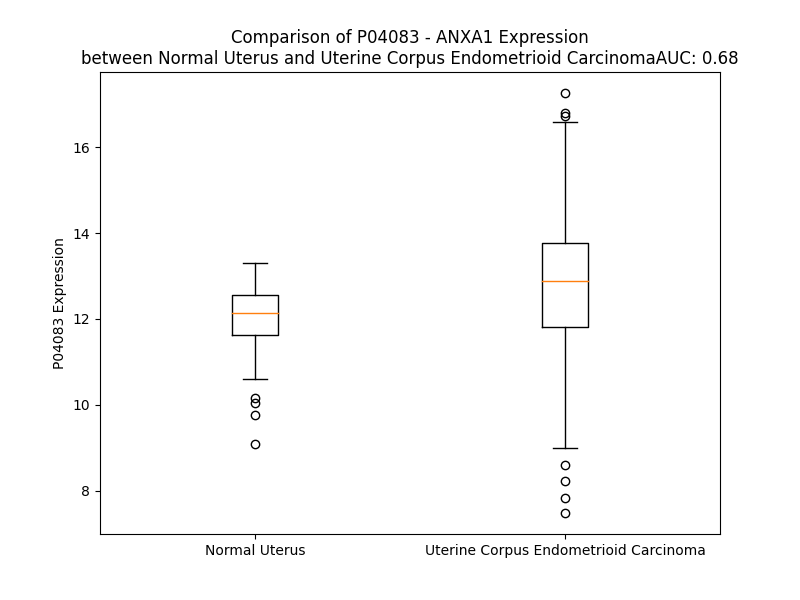

# Detailed Data for P04083

## Introduction to the Detailed Summary

### How to Interpret the Results

- **Summary & Metrics**: This section provides a quick reference to essential protein attributes, including expression changes, family classification, and biomarker applications. Regulation status (upregulated/downregulated) indicates the protein's behavior in a disease context. Some information comes from the original excel file with the proteins selected from literature, while others are derived from the analyses.
- **Expression Comparison**: A visual representation comparing protein expression between normal and disease states. It highlights significant changes in expression levels that might indicate diagnostic or therapeutic relevance. This is data coming from transcriptomics experiments and could not translate similarly to protein levels.
- **Isoform Alignment**: An interactive view of isoform alignments, revealing structural and functional differences between variants of the protein.
- **Interactors & Homologs**: Tables listing known interaction partners and homologous proteins, the more interactors and homologs, the more complex the protein is to design an antibody for.
- **Biological Assemblies**: Information about the structural arrangement of the protein in different assemblies, providing insights into its functional state but also the complexity of the protein to develop antibodies.
- **Combined Per-Residue Information**: A detailed table summarizing residue-level data. This includes predictions for epitope regions, aggregation tendencies, and modifications that might impact the protein's function. Each row corresponds to a residue in the protein, providing insights into specific sites that may be important for research or drug development.
## Summary & Metrics

- **UniProt Accession**: P04083
- **Gene Name**: ANXA1
- **Protein Name**: annexin A1
- **Swiss Prot**: ANXA1_HUMAN
- **Family**: other
- **Biomarker Application**: diagnosis,prognosis,unspecified application
- **Number of Isoforms**: 0
- **Regulation**: 1
- **(transcriptomics) AUC**: 0.68
- **(transcriptomics) Fold Change**: 1.07
- **(transcriptomics) Regulation**: Upregulated
- **Discotope Epitope Count**: 73
- **Max n_uniprots (Homo)**: 1
- **Max n_uniprots (Hetero)**: 2

## Expression Comparison

## Interactors

| preferredName_A   | preferredName_B   |   score |
|:------------------|:------------------|--------:|
| ANXA1             | FPR1              |   0.999 |
| ANXA1             | FPR2              |   0.999 |
| ANXA1             | S100A11           |   0.998 |
| ANXA1             | ANXA2             |   0.989 |
| ANXA1             | DYSF              |   0.983 |
| ANXA1             | S100A10           |   0.977 |
| ANXA1             | FPR3              |   0.966 |
| ANXA1             | TRIM72            |   0.938 |
| ANXA1             | CAV3              |   0.927 |

## Homologs

| uniprot_id   | gene_id   |
|:-------------|:----------|
| O76027       | ANXA9     |
| E5RIN3       | ANXA13    |
| A0A075B752   | ANXA8L1   |
| P13928       | ANXA8     |
| D6RAZ8       | ANXA3     |
| P50995       | ANXA11    |
| P08758       | ANXA5     |
| B9ZVT2       | ANXA7     |
| Q6P452       | ANXA4     |
| Q9UJ72       | ANXA10    |
| E5RK63       | ANXA6     |
| H0YLV6       | ANXA2     |

## Biological Assemblies

|   Unnamed: 0 |   assembly |   n_uniprots | composition   | crystal_id   |
|-------------:|-----------:|-------------:|:--------------|:-------------|
|            0 |          1 |            1 | Homo          | 1bo9         |
|            0 |          1 |            1 | Homo          | 5vfw         |
|            0 |          1 |            1 | Homo          | 1ain         |
|            0 |          1 |            2 | Hetero        | 1qls         |

## Combined Per-Residue Information

|   res | aa   |   epitope_score | epitope   |   relative_surface_accessibility |   modeling_confidence |   Aggregation | modification             |
|------:|:-----|----------------:|:----------|---------------------------------:|----------------------:|--------------:|:-------------------------|
|     1 | M    |         0.0814  | False     |                          0.80414 |                 53.76 |         0     | N/A                      |
|     2 | A    |         0.10328 | False     |                          0.23977 |                 75.76 |         1.048 | N-acetylalanine          |
|     3 | M    |         0.01018 | False     |                          0.00576 |                 83.82 |         1.538 | N/A                      |
|     4 | V    |         0.00819 | False     |                          0       |                 85.63 |         1.538 | N/A                      |
|     5 | S    |         0.09202 | False     |                          0.09729 |                 87.21 |         1.538 | Phosphoserine; by TRPM7  |
|     6 | E    |         0.00518 | False     |                          0.00265 |                 90.66 |         1.538 | N/A                      |
|     7 | F    |         0.0037  | False     |                          0.00064 |                 90.1  |         1.538 | N/A                      |
|     8 | L    |         0.06479 | False     |                          0.0695  |                 92.03 |         1.538 | N/A                      |
|     9 | K    |         0.09549 | False     |                          0.38202 |                 93.22 |         1.538 | N/A                      |
|    10 | Q    |         0.04351 | False     |                          0.08988 |                 94.63 |         4.638 | N/A                      |
|    11 | A    |         0.00446 | False     |                          0.00128 |                 94.53 |         4.638 | N/A                      |
|    12 | W    |         0.24387 | True      |                          0.49583 |                 94.8  |         4.638 | N/A                      |
|    13 | F    |         0.07188 | False     |                          0.1193  |                 95.9  |         4.638 | N/A                      |
|    14 | I    |         0.05506 | False     |                          0.11649 |                 96.27 |         4.638 | N/A                      |
|    15 | E    |         0.14661 | False     |                          0.57289 |                 94.88 |         0     | N/A                      |
|    16 | N    |         0.25546 | True      |                          0.51792 |                 96.63 |         0     | N/A                      |
|    17 | E    |         0.22773 | True      |                          0.30843 |                 96.04 |         0     | N/A                      |
|    18 | E    |         0.05409 | False     |                          0.10476 |                 96.43 |         0     | N/A                      |
|    19 | Q    |         0.22879 | True      |                          0.65838 |                 95.85 |         0     | N/A                      |
|    20 | E    |         0.32632 | True      |                          0.5164  |                 95.97 |         0     | N/A                      |
|    21 | Y    |         0.08921 | False     |                          0.08432 |                 96.53 |         1.946 | Phosphotyrosine; by EGFR |
|    22 | V    |         0.11758 | False     |                          0.37868 |                 95.16 |         1.946 | N/A                      |
|    23 | Q    |         0.23831 | True      |                          0.56099 |                 95.64 |         1.946 | N/A                      |
|    24 | T    |         0.15548 | False     |                          0.33455 |                 94.61 |         1.946 | N/A                      |
|    25 | V    |         0.06148 | False     |                          0.06379 |                 95.76 |         1.946 | N/A                      |
|    26 | K    |         0.24804 | True      |                          0.65303 |                 94.76 |         0     | N/A                      |
|    27 | S    |         0.15507 | False     |                          0.64988 |                 92.82 |         0     | Phosphoserine; by PKC    |
|    28 | S    |         0.16423 | False     |                          0.26137 |                 90.71 |         0     | N/A                      |
|    29 | K    |         0.2261  | True      |                          0.81936 |                 86.55 |         0     | N/A                      |
|    30 | G    |         0.27975 | True      |                          0.86527 |                 86    |         0     | N/A                      |
|    31 | G    |         0.12512 | False     |                          0.18125 |                 92.64 |         0     | N/A                      |
|    32 | P    |         0.29438 | True      |                          0.62495 |                 96.11 |         0     | N/A                      |
|    33 | G    |         0.15103 | False     |                          0.22004 |                 96.28 |         0     | N/A                      |
|    34 | S    |         0.21122 | False     |                          0.34398 |                 96.56 |         0     | Phosphoserine            |
|    35 | A    |         0.07518 | False     |                          0.23414 |                 96.27 |         0     | N/A                      |
|    36 | V    |         0.0521  | False     |                          0.04947 |                 96.08 |         0     | N/A                      |
|    37 | S    |         0.15179 | False     |                          0.60747 |                 92.96 |         0     | Phosphoserine            |
|    38 | P    |         0.17519 | False     |                          0.62878 |                 95.47 |         0     | N/A                      |
|    39 | Y    |         0.21528 | False     |                          0.36529 |                 97.23 |         0     | N/A                      |
|    40 | P    |         0.21944 | False     |                          0.93198 |                 96.42 |         0     | N/A                      |
|    41 | T    |         0.27205 | True      |                          0.78133 |                 96.05 |         0     | Phosphothreonine         |
|    42 | F    |         0.16117 | False     |                          0.23406 |                 98.37 |         0     | N/A                      |
|    43 | N    |         0.27054 | True      |                          0.50032 |                 98.36 |         0     | N/A                      |
|    44 | P    |         0.0956  | False     |                          0.28033 |                 98.17 |         0     | N/A                      |
|    45 | S    |         0.1709  | False     |                          0.44471 |                 98.02 |         0     | N/A                      |
|    46 | S    |         0.17578 | False     |                          0.50474 |                 98.42 |         0     | N/A                      |
|    47 | D    |         0.04725 | False     |                          0.05071 |                 98.66 |         0     | N/A                      |
|    48 | V    |         0.01767 | False     |                          0.01999 |                 98.76 |         0     | N/A                      |
|    49 | A    |         0.19947 | False     |                          0.59155 |                 98.46 |         0     | N/A                      |
|    50 | A    |         0.11923 | False     |                          0.34567 |                 98.64 |         0     | N/A                      |
|    51 | L    |         0.00259 | False     |                          0       |                 98.71 |         0     | N/A                      |
|    52 | H    |         0.16515 | False     |                          0.36995 |                 98.32 |         0     | N/A                      |
|    53 | K    |         0.29187 | True      |                          0.76594 |                 98.47 |         0     | N/A                      |
|    54 | A    |         0.03481 | False     |                          0.0328  |                 98.6  |         0     | N/A                      |
|    55 | I    |         0.12458 | False     |                          0.0761  |                 98.4  |         0     | N/A                      |
|    56 | M    |         0.19076 | False     |                          0.68286 |                 96.57 |         0     | N/A                      |
|    57 | V    |         0.30537 | True      |                          0.50542 |                 97.65 |         0     | N/A                      |
|    58 | K    |         0.25244 | True      |                          1.01562 |                 95.44 |         0     | N6-acetyllysine          |
|    59 | G    |         0.22653 | True      |                          0.75744 |                 93.83 |         0     | N/A                      |
|    60 | V    |         0.12048 | False     |                          0.24473 |                 97.69 |         0     | N/A                      |
|    61 | D    |         0.23093 | True      |                          0.31299 |                 98.36 |         0     | N/A                      |
|    62 | E    |         0.09696 | False     |                          0.22823 |                 98.5  |         0     | N/A                      |
|    63 | A    |         0.21578 | False     |                          0.56886 |                 98.36 |         0.187 | N/A                      |
|    64 | T    |         0.12894 | False     |                          0.29878 |                 98.53 |         0.788 | N/A                      |
|    65 | I    |         0.00543 | False     |                          0.0016  |                 98.76 |         0.924 | N/A                      |
|    66 | I    |         0.06788 | False     |                          0.056   |                 98.55 |         0.924 | N/A                      |
|    67 | D    |         0.2058  | False     |                          0.38787 |                 97.8  |         0.924 | N/A                      |
|    68 | I    |         0.0667  | False     |                          0.0792  |                 98.37 |         0.924 | N/A                      |
|    69 | L    |         0.00279 | False     |                          0       |                 98.45 |         0.924 | N/A                      |
|    70 | T    |         0.02438 | False     |                          0.05602 |                 97.99 |         0.924 | N/A                      |
|    71 | K    |         0.11273 | False     |                          0.502   |                 97.43 |         0.924 | N/A                      |
|    72 | R    |         0.09628 | False     |                          0.07352 |                 98.39 |         0     | N/A                      |
|    73 | N    |         0.11651 | False     |                          0.14866 |                 98.11 |         0     | N/A                      |
|    74 | N    |         0.0314  | False     |                          0.10253 |                 98.73 |         0     | N/A                      |
|    75 | A    |         0.13393 | False     |                          0.57386 |                 98.61 |         0     | N/A                      |
|    76 | Q    |         0.07118 | False     |                          0.07072 |                 98.84 |         0     | N/A                      |
|    77 | R    |         0.01738 | False     |                          0.00937 |                 98.87 |         0     | N/A                      |
|    78 | Q    |         0.12484 | False     |                          0.22895 |                 98.85 |         0     | N/A                      |
|    79 | Q    |         0.15859 | False     |                          0.45852 |                 98.83 |         0     | N/A                      |
|    80 | I    |         0.01322 | False     |                          0       |                 98.85 |         0     | N/A                      |
|    81 | K    |         0.0498  | False     |                          0.22509 |                 98.8  |         0     | N/A                      |
|    82 | A    |         0.16269 | False     |                          0.61609 |                 98.7  |         0     | N/A                      |
|    83 | A    |         0.09847 | False     |                          0.14378 |                 98.71 |         0     | N/A                      |
|    84 | Y    |         0.01431 | False     |                          0.00447 |                 98.78 |         0     | N/A                      |
|    85 | L    |         0.14444 | False     |                          0.55178 |                 98.5  |         0     | N/A                      |
|    86 | Q    |         0.33056 | True      |                          0.79992 |                 98.44 |         0     | N/A                      |
|    87 | E    |         0.15125 | False     |                          0.47656 |                 98.18 |         0     | N/A                      |
|    88 | T    |         0.27809 | True      |                          0.28638 |                 97.02 |         0     | N/A                      |
|    89 | G    |         0.26338 | True      |                          0.71699 |                 97.75 |         0     | N/A                      |
|    90 | K    |         0.2418  | True      |                          0.62889 |                 97.48 |         0     | N/A                      |
|    91 | P    |         0.12893 | False     |                          0.36383 |                 98.33 |         0     | N/A                      |
|    92 | L    |         0.01193 | False     |                          0.00708 |                 98.66 |         0     | N/A                      |
|    93 | D    |         0.04191 | False     |                          0.33101 |                 98.34 |         0     | N/A                      |
|    94 | E    |         0.19899 | False     |                          0.47017 |                 98.36 |         0     | N/A                      |
|    95 | T    |         0.13605 | False     |                          0.1322  |                 98.21 |         0     | N/A                      |
|    96 | L    |         0.00254 | False     |                          0.00152 |                 98.43 |         0     | N/A                      |
|    97 | K    |         0.19349 | False     |                          0.61593 |                 98.21 |         0     | N/A                      |
|    98 | K    |         0.18889 | False     |                          0.84087 |                 97.54 |         0     | N/A                      |
|    99 | A    |         0.15035 | False     |                          0.24639 |                 97.54 |         0     | N/A                      |
|   100 | L    |         0.02794 | False     |                          0.02749 |                 98    |         0     | N/A                      |
|   101 | T    |         0.25972 | True      |                          0.77972 |                 97.36 |         0     | N/A                      |
|   102 | G    |         0.25238 | True      |                          0.55189 |                 98.01 |         0     | N/A                      |
|   103 | H    |         0.08573 | False     |                          0.34241 |                 98.47 |         0     | N/A                      |
|   104 | L    |         0.04308 | False     |                          0.08634 |                 98.62 |         0     | N/A                      |
|   105 | E    |         0.07754 | False     |                          0.16978 |                 98.64 |         0     | N/A                      |
|   106 | E    |         0.17497 | False     |                          0.41859 |                 98.72 |         0.061 | N/A                      |
|   107 | V    |         0.00283 | False     |                          0       |                 98.81 |        78.369 | N/A                      |
|   108 | V    |         0.00254 | False     |                          0       |                 98.78 |        93.735 | N/A                      |
|   109 | L    |         0.08024 | False     |                          0.20946 |                 98.84 |        93.735 | N/A                      |
|   110 | A    |         0.01696 | False     |                          0.04748 |                 98.85 |        93.735 | N/A                      |
|   111 | L    |         0.00241 | False     |                          0.00247 |                 98.79 |        93.735 | N/A                      |
|   112 | L    |         0.00557 | False     |                          0.00881 |                 98.84 |        81.616 | N/A                      |
|   113 | K    |         0.05812 | False     |                          0.32681 |                 98.85 |         0.061 | N/A                      |
|   114 | T    |         0.10628 | False     |                          0.29686 |                 98.86 |         0     | N/A                      |
|   115 | P    |         0.05498 | False     |                          0.6256  |                 98.85 |         0     | N/A                      |
|   116 | A    |         0.02916 | False     |                          0.13778 |                 98.89 |         0     | N/A                      |
|   117 | Q    |         0.09637 | False     |                          0.21578 |                 98.9  |         0     | N/A                      |
|   118 | F    |         0.04834 | False     |                          0.06483 |                 98.88 |         0     | N/A                      |
|   119 | D    |         0.01467 | False     |                          0.04801 |                 98.92 |         0     | N/A                      |
|   120 | A    |         0.0024  | False     |                          0.00128 |                 98.9  |         0     | N/A                      |
|   121 | D    |         0.1244  | False     |                          0.25874 |                 98.79 |         0     | N/A                      |
|   122 | E    |         0.04855 | False     |                          0.15369 |                 98.88 |         0     | N/A                      |
|   123 | L    |         0.00298 | False     |                          0       |                 98.9  |         0     | N/A                      |
|   124 | R    |         0.23276 | True      |                          0.23335 |                 98.64 |         0     | N/A                      |
|   125 | A    |         0.13747 | False     |                          0.50914 |                 98.36 |         0     | N/A                      |
|   126 | A    |         0.0132  | False     |                          0.0488  |                 98.5  |         0     | N/A                      |
|   127 | M    |         0.05643 | False     |                          0.03902 |                 98.5  |         0     | N/A                      |
|   128 | K    |         0.27263 | True      |                          0.70789 |                 96.36 |         0     | N/A                      |
|   129 | G    |         0.28976 | True      |                          0.71194 |                 94.59 |         0     | N/A                      |
|   130 | L    |         0.22683 | True      |                          1.18558 |                 91.43 |         0     | N/A                      |
|   131 | G    |         0.3277  | True      |                          0.69753 |                 93.23 |         0     | N/A                      |
|   132 | T    |         0.15104 | False     |                          0.2333  |                 96.51 |         0     | N/A                      |
|   133 | D    |         0.13651 | False     |                          0.35994 |                 97.78 |         0     | N/A                      |
|   134 | E    |         0.11517 | False     |                          0.24255 |                 97.84 |         0     | N/A                      |
|   135 | D    |         0.09416 | False     |                          0.3458  |                 97.7  |         0     | N/A                      |
|   136 | T    |         0.01305 | False     |                          0.02925 |                 98.66 |         0     | Phosphothreonine         |
|   137 | L    |         0.00303 | False     |                          0       |                 98.78 |         0     | N/A                      |
|   138 | I    |         0.02728 | False     |                          0.0184  |                 98.57 |         0     | N/A                      |
|   139 | E    |         0.01094 | False     |                          0.00689 |                 98.73 |         0     | N/A                      |
|   140 | I    |         0.0034  | False     |                          0       |                 98.88 |         0     | N/A                      |
|   141 | L    |         0.01089 | False     |                          0.0195  |                 98.82 |         0     | N/A                      |
|   142 | A    |         0.00344 | False     |                          0.00094 |                 98.43 |         0     | N/A                      |
|   143 | S    |         0.00594 | False     |                          0.00307 |                 98.78 |         0     | N/A                      |
|   144 | R    |         0.07025 | False     |                          0.06976 |                 98.81 |         0     | N/A                      |
|   145 | T    |         0.14514 | False     |                          0.37825 |                 98.74 |         0     | N/A                      |
|   146 | N    |         0.04985 | False     |                          0.10229 |                 98.78 |         0     | N/A                      |
|   147 | K    |         0.2136  | False     |                          0.6456  |                 98.71 |         0     | N/A                      |
|   148 | E    |         0.09137 | False     |                          0.24871 |                 98.88 |         0     | N/A                      |
|   149 | I    |         0.02301 | False     |                          0.016   |                 98.91 |         0     | N/A                      |
|   150 | R    |         0.26481 | True      |                          0.55727 |                 98.83 |         0     | N/A                      |
|   151 | D    |         0.08192 | False     |                          0.16523 |                 98.84 |         0     | N/A                      |
|   152 | I    |         0.01415 | False     |                          0.0056  |                 98.93 |         0     | N/A                      |
|   153 | N    |         0.09466 | False     |                          0.20631 |                 98.88 |         0     | N/A                      |
|   154 | R    |         0.44343 | True      |                          0.47715 |                 98.85 |         0     | N/A                      |
|   155 | V    |         0.07808 | False     |                          0.07712 |                 98.84 |         0     | N/A                      |
|   156 | Y    |         0.01438 | False     |                          0.00304 |                 98.8  |         0     | N/A                      |
|   157 | R    |         0.31314 | True      |                          0.59515 |                 98.72 |         0     | N/A                      |
|   158 | E    |         0.4286  | True      |                          0.51233 |                 98.62 |         0     | N/A                      |
|   159 | E    |         0.20036 | False     |                          0.49435 |                 98.35 |         0     | N/A                      |
|   160 | L    |         0.23535 | True      |                          0.34193 |                 98.3  |         0     | N/A                      |
|   161 | K    |         0.34569 | True      |                          0.79629 |                 98.56 |         0     | N/A                      |
|   162 | R    |         0.27168 | True      |                          0.39087 |                 98.49 |         0     | N/A                      |
|   163 | D    |         0.14429 | False     |                          0.29705 |                 98.59 |         0     | N/A                      |
|   164 | L    |         0.01441 | False     |                          0.0177  |                 98.76 |         0     | N/A                      |
|   165 | A    |         0.09823 | False     |                          0.43668 |                 98.72 |         0     | N/A                      |
|   166 | K    |         0.24658 | True      |                          0.71666 |                 98.64 |         0     | N/A                      |
|   167 | D    |         0.07993 | False     |                          0.08146 |                 98.66 |         0     | N/A                      |
|   168 | I    |         0.00469 | False     |                          0       |                 98.7  |         0     | N/A                      |
|   169 | T    |         0.2573  | True      |                          0.4625  |                 98.48 |         0     | N/A                      |
|   170 | S    |         0.31983 | True      |                          0.77811 |                 97.64 |         0     | N/A                      |
|   171 | D    |         0.13533 | False     |                          0.30576 |                 97.32 |         0     | N/A                      |
|   172 | T    |         0.12804 | False     |                          0.0902  |                 97.38 |         0     | N/A                      |
|   173 | S    |         0.28748 | True      |                          0.62837 |                 96.55 |         0     | N/A                      |
|   174 | G    |         0.19928 | False     |                          0.51138 |                 96.05 |         0     | N/A                      |
|   175 | D    |         0.16586 | False     |                          0.3138  |                 95.85 |         0     | N/A                      |
|   176 | F    |         0.06324 | False     |                          0.09314 |                 97.22 |         0     | N/A                      |
|   177 | R    |         0.15247 | False     |                          0.29077 |                 97.93 |         0     | N/A                      |
|   178 | N    |         0.15668 | False     |                          0.36979 |                 97.8  |         0     | N/A                      |
|   179 | A    |         0.00245 | False     |                          0       |                 98.01 |         0.146 | N/A                      |
|   180 | L    |         0.00259 | False     |                          0       |                 98.68 |         0.545 | N/A                      |
|   181 | L    |         0.12424 | False     |                          0.26917 |                 98.73 |         0.545 | N/A                      |
|   182 | S    |         0.07125 | False     |                          0.21234 |                 98.56 |         0.545 | N/A                      |
|   183 | L    |         0.02901 | False     |                          0.07136 |                 98.66 |         0.545 | N/A                      |
|   184 | A    |         0.02434 | False     |                          0.05979 |                 98.75 |         0.399 | N/A                      |
|   185 | K    |         0.09365 | False     |                          0.64241 |                 98.36 |         0     | N/A                      |
|   186 | G    |         0.02873 | False     |                          0.06048 |                 98.14 |         0     | N/A                      |
|   187 | D    |         0.23249 | True      |                          0.60065 |                 98.38 |         0     | N/A                      |
|   188 | R    |         0.09919 | False     |                          0.1173  |                 98.23 |         0     | N/A                      |
|   189 | S    |         0.15149 | False     |                          0.32038 |                 98.48 |         0     | N/A                      |
|   190 | E    |         0.17923 | False     |                          0.46001 |                 98.23 |         0     | N/A                      |
|   191 | D    |         0.24068 | True      |                          0.57248 |                 97.01 |         0     | N/A                      |
|   192 | F    |         0.26953 | True      |                          0.93514 |                 96.58 |         0     | N/A                      |
|   193 | G    |         0.218   | False     |                          0.69843 |                 97.44 |         0     | N/A                      |
|   194 | V    |         0.18108 | False     |                          0.45307 |                 98.32 |         0     | N/A                      |
|   195 | N    |         0.23223 | True      |                          0.52716 |                 98.47 |         0     | N/A                      |
|   196 | E    |         0.1963  | False     |                          0.40468 |                 98.49 |         0     | N/A                      |
|   197 | D    |         0.26907 | True      |                          0.73783 |                 98.53 |         0     | N/A                      |
|   198 | L    |         0.17444 | False     |                          0.39594 |                 98.6  |         0     | N/A                      |
|   199 | A    |         0.00318 | False     |                          0       |                 98.66 |         0     | N/A                      |
|   200 | D    |         0.18229 | False     |                          0.21565 |                 98.51 |         0     | N/A                      |
|   201 | S    |         0.25314 | True      |                          0.45274 |                 98.58 |         0     | N/A                      |
|   202 | D    |         0.10666 | False     |                          0.04353 |                 98.63 |         0     | N/A                      |
|   203 | A    |         0.00325 | False     |                          0       |                 97.64 |         0     | N/A                      |
|   204 | R    |         0.30898 | True      |                          0.49093 |                 97.41 |         0     | N/A                      |
|   205 | A    |         0.14389 | False     |                          0.33485 |                 98.06 |         0     | N/A                      |
|   206 | L    |         0.00466 | False     |                          0.00082 |                 96.28 |         0     | N/A                      |
|   207 | Y    |         0.12232 | False     |                          0.2323  |                 94.36 |         0     | N/A                      |
|   208 | E    |         0.25214 | True      |                          0.31983 |                 95.36 |         0     | N/A                      |
|   209 | A    |         0.03949 | False     |                          0.05012 |                 94.37 |         0     | N/A                      |
|   210 | G    |         0.05898 | False     |                          0.01547 |                 92.04 |         0     | N/A                      |
|   211 | E    |         0.20737 | False     |                          0.11116 |                 90.89 |         0     | N/A                      |
|   212 | R    |         0.45897 | True      |                          0.63253 |                 90.35 |         0     | N/A                      |
|   213 | R    |         0.28831 | True      |                          0.47306 |                 90.32 |         0     | N/A                      |
|   214 | K    |         0.35533 | True      |                          0.99701 |                 85.66 |         0     | N/A                      |
|   215 | G    |         0.13338 | False     |                          0.39675 |                 87.41 |         0     | N/A                      |
|   216 | T    |         0.08904 | False     |                          0.1939  |                 90.71 |         0     | N/A                      |
|   217 | D    |         0.19365 | False     |                          0.23822 |                 93.98 |         0     | N/A                      |
|   218 | V    |         0.07608 | False     |                          0.15915 |                 93.37 |        12.871 | N/A                      |
|   219 | N    |         0.25098 | True      |                          0.62496 |                 95.66 |        13.942 | N/A                      |
|   220 | V    |         0.17542 | False     |                          0.32262 |                 97.18 |        28.187 | N/A                      |
|   221 | F    |         0.00629 | False     |                          0       |                 96.2  |        29.252 | N/A                      |
|   222 | N    |         0.06123 | False     |                          0.09264 |                 95.6  |        29.252 | N/A                      |
|   223 | T    |         0.19474 | False     |                          0.5444  |                 97.81 |        29.466 | N/A                      |
|   224 | I    |         0.09549 | False     |                          0.0488  |                 98.39 |        29.466 | N/A                      |
|   225 | L    |         0.00342 | False     |                          0       |                 98.06 |        27.474 | N/A                      |
|   226 | T    |         0.01621 | False     |                          0.0261  |                 98.42 |        15.676 | N/A                      |
|   227 | T    |         0.13152 | False     |                          0.39076 |                 98.24 |         5.983 | N/A                      |
|   228 | R    |         0.1508  | False     |                          0.2594  |                 98.55 |         0     | N/A                      |
|   229 | S    |         0.02005 | False     |                          0.02624 |                 98.69 |         0     | N/A                      |
|   230 | Y    |         0.03748 | False     |                          0.1462  |                 98.46 |         0     | N/A                      |
|   231 | P    |         0.11073 | False     |                          0.31659 |                 98.41 |         0     | N/A                      |
|   232 | Q    |         0.06587 | False     |                          0.04266 |                 98.69 |         0     | N/A                      |
|   233 | L    |         0.00404 | False     |                          0       |                 98.6  |         0     | N/A                      |
|   234 | R    |         0.07779 | False     |                          0.20942 |                 98.16 |         0     | N/A                      |
|   235 | R    |         0.16553 | False     |                          0.27323 |                 98.08 |         0     | N/A                      |
|   236 | V    |         0.0065  | False     |                          0.00095 |                 98.04 |         0     | N/A                      |
|   237 | F    |         0.0026  | False     |                          0.00127 |                 95.95 |         0     | N/A                      |
|   238 | Q    |         0.06185 | False     |                          0.16597 |                 95.53 |         0     | N/A                      |
|   239 | K    |         0.07701 | False     |                          0.10469 |                 96.33 |         0     | N6-acetyllysine          |
|   240 | Y    |         0.00631 | False     |                          0.00122 |                 95.1  |         0     | N/A                      |
|   241 | T    |         0.14189 | False     |                          0.3848  |                 92.59 |         0     | N/A                      |
|   242 | K    |         0.33485 | True      |                          0.58107 |                 92.55 |         0     | N/A                      |
|   243 | Y    |         0.17048 | False     |                          0.27139 |                 91.97 |         0     | N/A                      |
|   244 | S    |         0.04106 | False     |                          0.04621 |                 89.47 |         0     | N/A                      |
|   245 | K    |         0.32956 | True      |                          0.90548 |                 79.12 |         0     | N/A                      |
|   246 | H    |         0.36758 | True      |                          0.4685  |                 71.2  |         0     | N/A                      |
|   247 | D    |         0.22875 | True      |                          0.59134 |                 66.01 |         0     | N/A                      |
|   248 | M    |         0.28045 | True      |                          0.43786 |                 64.45 |         0     | N/A                      |
|   249 | N    |         0.31354 | True      |                          0.94166 |                 60.48 |         0     | N/A                      |
|   250 | K    |         0.39052 | True      |                          0.74855 |                 65.81 |         0     | N/A                      |
|   251 | V    |         0.11348 | False     |                          0.1892  |                 70.78 |         0     | N/A                      |
|   252 | L    |         0.26104 | True      |                          0.47718 |                 67.65 |         0     | N/A                      |
|   253 | D    |         0.27793 | True      |                          0.49057 |                 77.31 |         0     | N/A                      |
|   254 | L    |         0.04405 | False     |                          0.03648 |                 78.95 |         0     | N/A                      |
|   255 | E    |         0.24929 | True      |                          0.60764 |                 76.58 |         0     | N/A                      |
|   256 | L    |         0.12687 | False     |                          0.06519 |                 77.12 |         0     | N/A                      |
|   257 | K    |         0.41556 | True      |                          0.79142 |                 78.14 |         0     | N/A                      |
|   258 | G    |         0.30268 | True      |                          0.5273  |                 89.05 |         0     | N/A                      |
|   259 | D    |         0.11857 | False     |                          0.24481 |                 93.78 |         0     | N/A                      |
|   260 | I    |         0.04589 | False     |                          0.09714 |                 94.47 |         0.282 | N/A                      |
|   261 | E    |         0.06691 | False     |                          0.18489 |                 93.24 |         0.282 | N/A                      |
|   262 | K    |         0.12893 | False     |                          0.48661 |                 94.38 |         0.282 | N/A                      |
|   263 | C    |         0.00213 | False     |                          0       |                 96.68 |         5.36  | N/A                      |
|   264 | L    |         0.00316 | False     |                          0       |                 95.97 |         9.11  | N/A                      |
|   265 | T    |         0.06387 | False     |                          0.13962 |                 95.33 |         9.11  | N/A                      |
|   266 | A    |         0.01807 | False     |                          0.04701 |                 96.88 |         9.11  | N/A                      |
|   267 | I    |         0.00276 | False     |                          0       |                 97.87 |         9.11  | N/A                      |
|   268 | V    |         0.00482 | False     |                          0       |                 97.6  |         8.763 | N/A                      |
|   269 | K    |         0.04287 | False     |                          0.10691 |                 97.7  |         0     | N/A                      |
|   270 | C    |         0.00923 | False     |                          0.02443 |                 98.36 |         0     | N/A                      |
|   271 | A    |         0.01301 | False     |                          0.03582 |                 98.21 |         0     | N/A                      |
|   272 | T    |         0.02463 | False     |                          0.06922 |                 97.94 |         0     | N/A                      |
|   273 | S    |         0.08134 | False     |                          0.09865 |                 98    |         0     | N/A                      |
|   274 | K    |         0.04492 | False     |                          0.20285 |                 98.45 |         0     | N/A                      |
|   275 | P    |         0.046   | False     |                          0.16502 |                 98.57 |         0     | N/A                      |
|   276 | A    |         0.10961 | False     |                          0.21389 |                 98.24 |         0     | N/A                      |
|   277 | F    |         0.02557 | False     |                          0.03852 |                 98.35 |         0     | N/A                      |
|   278 | F    |         0.00304 | False     |                          0       |                 98.79 |         0     | N/A                      |
|   279 | A    |         0.00208 | False     |                          0       |                 98.62 |         0     | N/A                      |
|   280 | E    |         0.15984 | False     |                          0.18495 |                 98.08 |         0     | N/A                      |
|   281 | K    |         0.08275 | False     |                          0.16603 |                 98.26 |         0     | N/A                      |
|   282 | L    |         0.00249 | False     |                          0       |                 98.6  |         0     | N/A                      |
|   283 | H    |         0.12481 | False     |                          0.17528 |                 98.21 |         0     | N/A                      |
|   284 | Q    |         0.14657 | False     |                          0.39367 |                 96.61 |         0     | N/A                      |
|   285 | A    |         0.01739 | False     |                          0.01913 |                 97.53 |         0     | N/A                      |
|   286 | M    |         0.03078 | False     |                          0.01991 |                 97.29 |         0     | N/A                      |
|   287 | K    |         0.21677 | False     |                          0.69641 |                 88.98 |         0     | N/A                      |
|   288 | G    |         0.25402 | True      |                          0.69551 |                 86.73 |         0     | N/A                      |
|   289 | V    |         0.21882 | False     |                          1.18089 |                 84.16 |         0     | N/A                      |
|   290 | G    |         0.19418 | False     |                          0.62982 |                 90.3  |         0     | N/A                      |
|   291 | T    |         0.10933 | False     |                          0.19283 |                 94.67 |         0     | N/A                      |
|   292 | R    |         0.19185 | False     |                          0.58791 |                 96.95 |         0     | N/A                      |
|   293 | H    |         0.12042 | False     |                          0.28691 |                 97.77 |         0     | N/A                      |
|   294 | K    |         0.11504 | False     |                          0.70462 |                 97.79 |         0     | N/A                      |
|   295 | A    |         0.03396 | False     |                          0.18732 |                 98.16 |         0     | N/A                      |
|   296 | L    |         0.00296 | False     |                          0       |                 98.6  |         0     | N/A                      |
|   297 | I    |         0.02327 | False     |                          0.052   |                 98.79 |         0     | N/A                      |
|   298 | R    |         0.03128 | False     |                          0.0231  |                 98.85 |         0     | N/A                      |
|   299 | I    |         0.00543 | False     |                          0       |                 98.83 |         0     | N/A                      |
|   300 | M    |         0.00411 | False     |                          0       |                 98.69 |         0     | N/A                      |
|   301 | V    |         0.02655 | False     |                          0.10266 |                 98.77 |         0     | N/A                      |
|   302 | S    |         0.06398 | False     |                          0.13597 |                 98.8  |         0     | N/A                      |
|   303 | R    |         0.04786 | False     |                          0.02107 |                 98.64 |         0     | N/A                      |
|   304 | S    |         0.01951 | False     |                          0.0166  |                 98.1  |         0     | N/A                      |
|   305 | E    |         0.05498 | False     |                          0.28913 |                 97.99 |         0     | N/A                      |
|   306 | I    |         0.29331 | True      |                          0.44746 |                 98.24 |         0     | N/A                      |
|   307 | D    |         0.11988 | False     |                          0.08527 |                 97.88 |         0     | N/A                      |
|   308 | M    |         0.0035  | False     |                          0       |                 98.14 |         0     | N/A                      |
|   309 | N    |         0.04458 | False     |                          0.08085 |                 97.39 |         0     | N/A                      |
|   310 | D    |         0.12033 | False     |                          0.13358 |                 98.1  |         0     | N/A                      |
|   311 | I    |         0.00432 | False     |                          0       |                 98.23 |         0     | N/A                      |
|   312 | K    |         0.06051 | False     |                          0.16889 |                 97.48 |         0     | N6-acetyllysine          |
|   313 | A    |         0.08472 | False     |                          0.08541 |                 96.56 |         0     | N/A                      |
|   314 | F    |         0.06832 | False     |                          0.05728 |                 97.49 |         0     | N/A                      |
|   315 | Y    |         0.01456 | False     |                          0.01528 |                 97.61 |         0     | N/A                      |
|   316 | Q    |         0.07102 | False     |                          0.38608 |                 96.28 |         0     | N/A                      |
|   317 | K    |         0.31566 | True      |                          0.3832  |                 95.98 |         0     | N/A                      |
|   318 | M    |         0.18864 | False     |                          0.36621 |                 96.52 |         0     | N/A                      |
|   319 | Y    |         0.22145 | True      |                          0.27561 |                 97.01 |         0     | N/A                      |
|   320 | G    |         0.25064 | True      |                          0.75459 |                 96.4  |         0     | N/A                      |
|   321 | I    |         0.25512 | True      |                          0.36558 |                 96.28 |         0     | N/A                      |
|   322 | S    |         0.05631 | False     |                          0.19713 |                 96.45 |         0     | N/A                      |
|   323 | L    |         0.00336 | False     |                          0.00708 |                 97.35 |         0     | N/A                      |
|   324 | C    |         0.01845 | False     |                          0.02477 |                 95.85 |         0     | N/A                      |
|   325 | Q    |         0.25604 | True      |                          0.33447 |                 95.76 |         0     | N/A                      |
|   326 | A    |         0.04469 | False     |                          0.07908 |                 96.82 |         0     | N/A                      |
|   327 | I    |         0.00366 | False     |                          0       |                 97.1  |         0     | N/A                      |
|   328 | L    |         0.23888 | True      |                          0.43209 |                 95.3  |         0     | N/A                      |
|   329 | D    |         0.25772 | True      |                          0.54456 |                 94.96 |         0     | N/A                      |
|   330 | E    |         0.09759 | False     |                          0.37106 |                 95.59 |         0     | N/A                      |
|   331 | T    |         0.11574 | False     |                          0.09604 |                 96.17 |         0     | N/A                      |
|   332 | K    |         0.27788 | True      |                          0.85058 |                 96.67 |         0     | N/A                      |
|   333 | G    |         0.18773 | False     |                          0.5238  |                 97.55 |         0     | N/A                      |
|   334 | D    |         0.19673 | False     |                          0.25782 |                 97.94 |         0     | N/A                      |
|   335 | Y    |         0.04261 | False     |                          0.0887  |                 98.36 |         0.117 | N/A                      |
|   336 | E    |         0.07741 | False     |                          0.18168 |                 97.66 |         0.141 | N/A                      |
|   337 | K    |         0.19777 | False     |                          0.51907 |                 97.86 |         0.141 | N/A                      |
|   338 | I    |         0.00458 | False     |                          0       |                 98.45 |        86.285 | N/A                      |
|   339 | L    |         0.00183 | False     |                          0       |                 98.31 |        86.618 | N/A                      |
|   340 | V    |         0.09626 | False     |                          0.23301 |                 97.17 |        86.618 | N/A                      |
|   341 | A    |         0.07844 | False     |                          0.35615 |                 96.69 |        86.599 | N/A                      |
|   342 | L    |         0.00301 | False     |                          0       |                 96.39 |        86.599 | N/A                      |
|   343 | C    |         0.00217 | False     |                          0       |                 93.84 |        15.842 | N/A                      |
|   344 | G    |         0.08072 | False     |                          0.55041 |                 82.7  |         0.752 | N/A                      |
|   345 | G    |         0.09161 | False     |                          0.35631 |                 69.3  |         0.139 | N/A                      |
|   346 | N    |         0.13252 | False     |                          0.77367 |                 52.05 |         0     | N/A                      |

