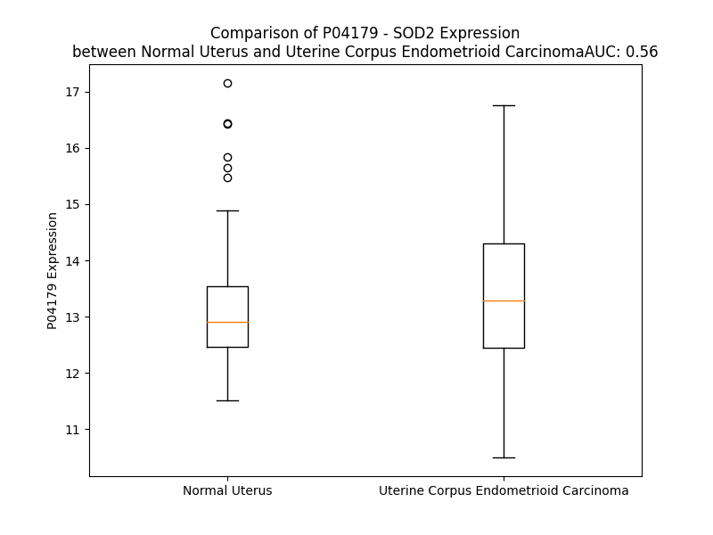

# Detailed Data for P04179

## Introduction to the Detailed Summary

### How to Interpret the Results

- **Summary & Metrics**: This section provides a quick reference to essential protein attributes, including expression changes, family classification, and biomarker applications. Regulation status (upregulated/downregulated) indicates the protein's behavior in a disease context. Some information comes from the original excel file with the proteins selected from literature, while others are derived from the analyses.
- **Expression Comparison**: A visual representation comparing protein expression between normal and disease states. It highlights significant changes in expression levels that might indicate diagnostic or therapeutic relevance. This is data coming from transcriptomics experiments and could not translate similarly to protein levels.
- **Isoform Alignment**: An interactive view of isoform alignments, revealing structural and functional differences between variants of the protein.
- **Interactors & Homologs**: Tables listing known interaction partners and homologous proteins, the more interactors and homologs, the more complex the protein is to design an antibody for.
- **Biological Assemblies**: Information about the structural arrangement of the protein in different assemblies, providing insights into its functional state but also the complexity of the protein to develop antibodies.
- **Combined Per-Residue Information**: A detailed table summarizing residue-level data. This includes predictions for epitope regions, aggregation tendencies, and modifications that might impact the protein's function. Each row corresponds to a residue in the protein, providing insights into specific sites that may be important for research or drug development.
## Summary & Metrics

- **UniProt Accession**: P04179
- **Gene Name**: SOD2
- **Protein Name**: superoxide dismutase 2, mitochondrial
- **Swiss Prot**: SODM_HUMAN
- **Family**: enzyme
- **Biomarker Application**: diagnosis,disease progression,prognosis,unspecified application
- **Number of Isoforms**: 4
- **Regulation**: 1
- **(transcriptomics) AUC**: 0.27
- **(transcriptomics) Fold Change**: 1.06
- **(transcriptomics) Regulation**: Downregulated
- **Discotope Epitope Count**: 55
- **Max n_uniprots (Homo)**: 4
- **Max n_uniprots (Hetero)**: N/A

## Expression Comparison

## Isoform Alignment

<pre style='font-size:14px; font-family:monospace;'>P04179-1 MLSRAVCGTSRQLAPVLGYLGSRQKHSLPDLPYDYGALEPHINAQIMQLHHSKHHAAYVNNLNVTEEKYQEALAKGDVTAQIALQPALKFNGGGHINHSIFWTNLSPNGGGEPKGELLEAIKRDFGSFDKFKEKLTAASVGVQGSGWGWLGFNKERGHLQIAACPNQDPLQGTTGLIPLLGIDVWEHAYYLQYKNVRPDYLKAIWNVINWENVTERYMACKK
P04179-2 MLSRAVCGTSRQLAPVLGYLGSRQKHSLPDLPYDYGALEPHINAQIMQLHHSKHHAAYVNNLNVTEEKYQEALAK---------------------------------------GELLEAIKRDFGSFDKFKEKLTAASVGVQGSGWGWLGFNKERGHLQIAACPNQDPLQGTTGLIPLLGIDVWEHAYYLQYKNVRPDYLKAIWNVINWENVTERYMACKK
P04179-3 MLSRAVCGTSRQLAPVLGYLGSRQKHSLPDLPYDYGALEPHINAQIMQLHHSKHHAAYVNNLNVTEEKYQEALAKGDVTAQIALQPALKFNGGGHINHSIFWTNLSPNGGGEPK------------------------------------------------------------GLIPLLGIDVWEHAYYLQYKNVRPDYLKAIWNVINWENVTERYMACKK
P04179-4 ----------------------------------------------MQLHHSKHHAAYVNNLNVTEEKYQEALAKGDVTAQIALQPALKFNGGGHINHSIFWTNLSPNGGGEPKGELLEAIKRDFGSFDKFKEKLTAASVGVQGSGWGWLGFNKERGHLQIAACPNQDPLQGTTGLIPLLGIDVWEHAYYLQYKNVRPDYLKAIWNVINWENVTERYMACKK
</pre>

## Interactors

| preferredName_A   | preferredName_B   |   score |
|:------------------|:------------------|--------:|
| SOD2              | SOD1              |   0.994 |
| SOD2              | WDR5              |   0.987 |
| SOD2              | KAT2A             |   0.986 |
| SOD2              | FOXO3             |   0.974 |
| SOD2              | PPARGC1A          |   0.973 |
| SOD2              | ACO2              |   0.968 |
| SOD2              | ACO1              |   0.937 |
| SOD2              | PARK7             |   0.923 |
| SOD2              | CAT               |   0.908 |
| SOD2              | GPX7              |   0.907 |
| SOD2              | GPX8              |   0.907 |
| SOD2              | GPX3              |   0.904 |
| SOD2              | GPX2              |   0.904 |
| SOD2              | FOXO1             |   0.903 |
| SOD2              | GPX6              |   0.902 |
| SOD2              | GPX5              |   0.902 |

## Homologs

| uniprot_id   | gene_id   |
|--------------|-----------|

## Biological Assemblies

|   Unnamed: 0 |   assembly |   n_uniprots | composition   | crystal_id   |
|-------------:|-----------:|-------------:|:--------------|:-------------|
|            0 |          1 |            2 | Homo          | 2qkc         |
|            0 |          1 |            2 | Homo          | 1pm9         |
|            0 |          1 |            2 | Homo          | 1szx         |
|            0 |          1 |            2 | Homo          | 1em1         |
|            0 |          1 |            2 | Homo          | 3c3t         |
|            1 |          2 |            2 | Homo          | 3c3t         |
|            2 |          3 |            1 | Homo          | 3c3t         |
|            3 |          4 |            1 | Homo          | 3c3t         |
|            0 |          1 |            2 | Homo          | 7kku         |
|            0 |          1 |            2 | Homo          | 7kks         |
|            0 |          1 |            2 | Homo          | 5gxo         |
|            1 |          2 |            2 | Homo          | 5gxo         |
|            0 |          1 |            2 | Homo          | 1xdc         |
|            0 |          1 |            2 | Homo          | 1xil         |
|            0 |          1 |            2 | Homo          | 1luw         |
|            0 |          1 |            4 | Homo          | 2p4k         |
|            0 |          1 |            1 | Homo          | 2adq         |
|            0 |          1 |            2 | Homo          | 1luv         |
|            0 |          1 |            2 | Homo          | 1zsp         |
|            0 |          1 |            2 | Homo          | 1ap6         |
|            0 |          1 |            4 | Homo          | 1pl4         |
|            0 |          1 |            2 | Homo          | 1qnm         |
|            0 |          1 |            4 | Homo          | 2gds         |
|            0 |          1 |            2 | Homo          | 1n0j         |
|            0 |          1 |            2 | Homo          | 1msd         |
|            0 |          1 |            2 | Homo          | 5t30         |
|            0 |          1 |            2 | Homo          | 1ja8         |
|            0 |          1 |            4 | Homo          | 1zte         |
|            0 |          1 |            4 | Homo          | 8sks         |
|            0 |          1 |            2 | Homo          | 1ap5         |
|            0 |          1 |            2 | Homo          | 5vf9         |
|            0 |          1 |            2 | Homo          | 2qka         |
|            0 |          1 |            2 | Homo          | 1var         |
|            0 |          1 |            2 | Homo          | 7klb         |
|            0 |          1 |            2 | Homo          | 3c3s         |
|            1 |          2 |            2 | Homo          | 3c3s         |
|            2 |          3 |            1 | Homo          | 3c3s         |
|            3 |          4 |            1 | Homo          | 3c3s         |
|            0 |          1 |            2 | Homo          | 7kkw         |
|            0 |          1 |            2 | Homo          | 1n0n         |
|            0 |          1 |            2 | Homo          | 1zuq         |
|            0 |          1 |            1 | Homo          | 2adp         |

## Combined Per-Residue Information

|   res | aa   |   epitope_score | epitope   |   relative_surface_accessibility |   modeling_confidence |   Aggregation | modification                 |
|------:|:-----|----------------:|:----------|---------------------------------:|----------------------:|--------------:|:-----------------------------|
|     1 | M    |         0.22555 | False     |                          1.28271 |                 43.67 |         0     | N/A                          |
|     2 | L    |         0.3199  | True      |                          1.11569 |                 45.31 |         0     | N/A                          |
|     3 | S    |         0.22752 | False     |                          0.78871 |                 41.73 |         0     | N/A                          |
|     4 | R    |         0.26432 | False     |                          0.95945 |                 51.13 |         0     | N/A                          |
|     5 | A    |         0.32802 | True      |                          0.91042 |                 53.19 |         0     | N/A                          |
|     6 | V    |         0.21636 | False     |                          1.08995 |                 49.99 |         0     | N/A                          |
|     7 | C    |         0.21986 | False     |                          0.91211 |                 52.27 |         0     | N/A                          |
|     8 | G    |         0.20982 | False     |                          0.8475  |                 47.84 |         0     | N/A                          |
|     9 | T    |         0.23676 | False     |                          0.91345 |                 52.94 |         0     | N/A                          |
|    10 | S    |         0.19734 | False     |                          0.8177  |                 50.68 |         0     | N/A                          |
|    11 | R    |         0.27653 | False     |                          0.9358  |                 52.86 |         0     | N/A                          |
|    12 | Q    |         0.2555  | False     |                          0.89024 |                 47.09 |         0     | N/A                          |
|    13 | L    |         0.28337 | False     |                          1.06593 |                 52.99 |         0     | N/A                          |
|    14 | A    |         0.18065 | False     |                          0.80516 |                 50.42 |         0     | N/A                          |
|    15 | P    |         0.18182 | False     |                          0.86859 |                 48.68 |         0     | N/A                          |
|    16 | V    |         0.20825 | False     |                          1.01359 |                 54.97 |         6.502 | N/A                          |
|    17 | L    |         0.23335 | False     |                          0.99581 |                 45.6  |         6.502 | N/A                          |
|    18 | G    |         0.24806 | False     |                          0.74416 |                 46.47 |         6.502 | N/A                          |
|    19 | Y    |         0.25873 | False     |                          1.01165 |                 47.46 |         6.502 | N/A                          |
|    20 | L    |         0.23162 | False     |                          0.97891 |                 47.26 |         6.502 | N/A                          |
|    21 | G    |         0.2592  | False     |                          0.7173  |                 52.18 |         0.207 | N/A                          |
|    22 | S    |         0.20379 | False     |                          0.8856  |                 50.18 |         0     | N/A                          |
|    23 | R    |         0.36043 | True      |                          0.63641 |                 63.75 |         0     | N/A                          |
|    24 | Q    |         0.24025 | False     |                          0.8457  |                 79.19 |         0     | N/A                          |
|    25 | K    |         0.2466  | False     |                          0.68661 |                 93.07 |         0     | N/A                          |
|    26 | H    |         0.27255 | False     |                          0.29396 |                 97.89 |         0     | N/A                          |
|    27 | S    |         0.22397 | False     |                          0.63561 |                 97.91 |         0     | N/A                          |
|    28 | L    |         0.29062 | False     |                          0.34866 |                 98.47 |         0     | N/A                          |
|    29 | P    |         0.22483 | False     |                          0.34296 |                 98.3  |         0     | N/A                          |
|    30 | D    |         0.44121 | True      |                          0.82249 |                 98.41 |         0     | N/A                          |
|    31 | L    |         0.2838  | False     |                          0.17386 |                 98.51 |         0     | N/A                          |
|    32 | P    |         0.28062 | False     |                          0.65493 |                 97.7  |         0     | N/A                          |
|    33 | Y    |         0.20521 | False     |                          0.11142 |                 98.47 |         0     | N/A                          |
|    34 | D    |         0.43382 | True      |                          0.73543 |                 98.51 |         0     | N/A                          |
|    35 | Y    |         0.36261 | True      |                          0.33231 |                 98.67 |         0     | N/A                          |
|    36 | G    |         0.36777 | True      |                          0.41929 |                 98.52 |         0     | N/A                          |
|    37 | A    |         0.32097 | True      |                          0.31524 |                 98.61 |         0     | N/A                          |
|    38 | L    |         0.01576 | False     |                          0.00495 |                 98.73 |         0     | N/A                          |
|    39 | E    |         0.31192 | False     |                          0.48171 |                 98.54 |         0     | N/A                          |
|    40 | P    |         0.6345  | True      |                          0.73103 |                 98.31 |         0     | N/A                          |
|    41 | H    |         0.19273 | False     |                          0.26604 |                 98.67 |         0     | N/A                          |
|    42 | I    |         0.04149 | False     |                          0.0128  |                 98.74 |         0     | N/A                          |
|    43 | N    |         0.52486 | True      |                          0.18722 |                 98.28 |         0     | N/A                          |
|    44 | A    |         0.19962 | False     |                          0.3397  |                 98.65 |         0     | N/A                          |
|    45 | Q    |         0.45744 | True      |                          0.51008 |                 98.61 |         0     | N/A                          |
|    46 | I    |         0.07786 | False     |                          0.00918 |                 98.75 |         0     | N/A                          |
|    47 | M    |         0.00907 | False     |                          0.00202 |                 98.78 |         0     | N/A                          |
|    48 | Q    |         0.33104 | True      |                          0.47819 |                 98.72 |         0     | N/A                          |
|    49 | L    |         0.47353 | True      |                          0.40228 |                 98.76 |         0     | N/A                          |
|    50 | H    |         0.02545 | False     |                          0.00757 |                 98.8  |         0     | N/A                          |
|    51 | H    |         0.13066 | False     |                          0.07502 |                 98.85 |         0     | N/A                          |
|    52 | S    |         0.35699 | True      |                          0.30822 |                 98.62 |         0     | N/A                          |
|    53 | K    |         0.56035 | True      |                          0.63082 |                 98.71 |         0     | N/A                          |
|    54 | H    |         0.47951 | True      |                          0.34553 |                 98.79 |         0     | N/A                          |
|    55 | H    |         0.01073 | False     |                          0       |                 98.8  |         0     | N/A                          |
|    56 | A    |         0.21547 | False     |                          0.18078 |                 98.69 |         0     | N/A                          |
|    57 | A    |         0.37948 | True      |                          0.42162 |                 98.75 |         0     | N/A                          |
|    58 | Y    |         0.11524 | False     |                          0.06461 |                 98.76 |         0     | 3'-nitrotyrosine             |
|    59 | V    |         0.0961  | False     |                          0.04094 |                 98.71 |         0     | N/A                          |
|    60 | N    |         0.44443 | True      |                          0.58469 |                 98.57 |         0     | N/A                          |
|    61 | N    |         0.26344 | False     |                          0.44387 |                 98.66 |         0     | N/A                          |
|    62 | L    |         0.05453 | False     |                          0.03545 |                 98.6  |         0     | N/A                          |
|    63 | N    |         0.33052 | True      |                          0.13204 |                 98.47 |         0     | N/A                          |
|    64 | V    |         0.3394  | True      |                          0.51278 |                 98.46 |         0     | N/A                          |
|    65 | T    |         0.10568 | False     |                          0.05402 |                 98.36 |         0     | N/A                          |
|    66 | E    |         0.11492 | False     |                          0.12006 |                 98.17 |         0     | N/A                          |
|    67 | E    |         0.23702 | False     |                          0.46557 |                 97.82 |         0     | N/A                          |
|    68 | K    |         0.28981 | False     |                          0.54087 |                 98.21 |         0     | N6-acetyllysine; alternate   |
|    68 | K    |         0.28981 | False     |                          0.54087 |                 98.21 |         0     | N6-succinyllysine; alternate |
|    69 | Y    |         0.16423 | False     |                          0.24937 |                 98.11 |         0     | N/A                          |
|    70 | Q    |         0.17163 | False     |                          0.44693 |                 97.42 |         0     | N/A                          |
|    71 | E    |         0.22475 | False     |                          0.47029 |                 97.97 |         0     | N/A                          |
|    72 | A    |         0.10359 | False     |                          0.05139 |                 98.22 |         0     | N/A                          |
|    73 | L    |         0.29788 | False     |                          0.58684 |                 97.99 |         0     | N/A                          |
|    74 | A    |         0.14982 | False     |                          0.80502 |                 98.12 |         0     | N/A                          |
|    75 | K    |         0.18047 | False     |                          0.70038 |                 98.13 |         0     | N6-acetyllysine; alternate   |
|    75 | K    |         0.18047 | False     |                          0.70038 |                 98.13 |         0     | N6-succinyllysine; alternate |
|    76 | G    |         0.30842 | False     |                          0.62846 |                 98.27 |         0     | N/A                          |
|    77 | D    |         0.19341 | False     |                          0.36086 |                 98.37 |         0     | N/A                          |
|    78 | V    |         0.26951 | False     |                          0.6669  |                 98.59 |         0.255 | N/A                          |
|    79 | T    |         0.23093 | False     |                          0.77358 |                 98.59 |         0.255 | N/A                          |
|    80 | A    |         0.18079 | False     |                          0.30319 |                 98.48 |         0.255 | N/A                          |
|    81 | Q    |         0.18022 | False     |                          0.11434 |                 98.62 |         0.255 | N/A                          |
|    82 | I    |         0.3539  | True      |                          0.60237 |                 98.55 |         0.255 | N/A                          |
|    83 | A    |         0.2824  | False     |                          0.7008  |                 98.6  |         0.255 | N/A                          |
|    84 | L    |         0.22816 | False     |                          0.18548 |                 98.51 |         0.255 | N/A                          |
|    85 | Q    |         0.33776 | True      |                          0.45646 |                 98.61 |         0     | N/A                          |
|    86 | P    |         0.33281 | True      |                          0.65477 |                 98.64 |         0     | N/A                          |
|    87 | A    |         0.20835 | False     |                          0.35404 |                 98.56 |         0     | N/A                          |
|    88 | L    |         0.24821 | False     |                          0.32505 |                 98.53 |         0     | N/A                          |
|    89 | K    |         0.24006 | False     |                          0.49199 |                 98.65 |         0     | N/A                          |
|    90 | F    |         0.29472 | False     |                          0.4024  |                 98.79 |         0     | N/A                          |
|    91 | N    |         0.08771 | False     |                          0.07265 |                 98.8  |         0     | N/A                          |
|    92 | G    |         0.17528 | False     |                          0.10919 |                 98.73 |         0     | N/A                          |
|    93 | G    |         0.04386 | False     |                          0.01936 |                 98.82 |         0     | N/A                          |
|    94 | G    |         0.0062  | False     |                          0       |                 98.8  |         0     | N/A                          |
|    95 | H    |         0.11904 | False     |                          0.13555 |                 98.83 |         0     | N/A                          |
|    96 | I    |         0.3161  | True      |                          0.48537 |                 98.79 |         0     | N/A                          |
|    97 | N    |         0.00806 | False     |                          0.00191 |                 98.87 |         0     | N/A                          |
|    98 | H    |         0.00526 | False     |                          0       |                 98.87 |         0     | N/A                          |
|    99 | S    |         0.2082  | False     |                          0.24038 |                 98.83 |         2.511 | N/A                          |
|   100 | I    |         0.07813 | False     |                          0.0856  |                 98.81 |         6.198 | N/A                          |
|   101 | F    |         0.02273 | False     |                          0.01019 |                 98.89 |         6.517 | N/A                          |
|   102 | W    |         0.02119 | False     |                          0.01306 |                 98.84 |         6.517 | N/A                          |
|   103 | T    |         0.10991 | False     |                          0.3199  |                 98.73 |         6.517 | N/A                          |
|   104 | N    |         0.00569 | False     |                          0.00086 |                 98.88 |         4.393 | N/A                          |
|   105 | L    |         0.00928 | False     |                          0.00695 |                 98.86 |         3.822 | N/A                          |
|   106 | S    |         0.15195 | False     |                          0.1442  |                 98.75 |         0     | N/A                          |
|   107 | P    |         0.15691 | False     |                          0.49714 |                 98.5  |         0     | N/A                          |
|   108 | N    |         0.34966 | True      |                          0.88326 |                 98.02 |         0     | N/A                          |
|   109 | G    |         0.1957  | False     |                          0.28517 |                 98.11 |         0     | N/A                          |
|   110 | G    |         0.2647  | False     |                          0.21384 |                 98.33 |         0     | N/A                          |
|   111 | G    |         0.16961 | False     |                          0.72423 |                 98.12 |         0     | N/A                          |
|   112 | E    |         0.31393 | True      |                          0.48061 |                 98.41 |         0     | N/A                          |
|   113 | P    |         0.02541 | False     |                          0.01487 |                 98.38 |         0     | N/A                          |
|   114 | K    |         0.27659 | False     |                          0.83543 |                 97.14 |         0     | N6-acetyllysine              |
|   115 | G    |         0.2904  | False     |                          0.61458 |                 97.79 |         0     | N/A                          |
|   116 | E    |         0.32365 | True      |                          0.42943 |                 98.06 |         0     | N/A                          |
|   117 | L    |         0.00502 | False     |                          0       |                 98.63 |         0     | N/A                          |
|   118 | L    |         0.1232  | False     |                          0.15992 |                 98.74 |         0     | N/A                          |
|   119 | E    |         0.32088 | True      |                          0.49922 |                 98.53 |         0     | N/A                          |
|   120 | A    |         0.04662 | False     |                          0.02736 |                 98.59 |         0     | N/A                          |
|   121 | I    |         0.01301 | False     |                          0       |                 98.81 |         0     | N/A                          |
|   122 | K    |         0.20497 | False     |                          0.42632 |                 98.68 |         0     | N6-acetyllysine; alternate   |
|   122 | K    |         0.20497 | False     |                          0.42632 |                 98.68 |         0     | N6-succinyllysine; alternate |
|   123 | R    |         0.46652 | True      |                          0.58426 |                 98.53 |         0     | N/A                          |
|   124 | D    |         0.24723 | False     |                          0.24634 |                 98.59 |         0     | N/A                          |
|   125 | F    |         0.18978 | False     |                          0.09777 |                 98.71 |         0     | N/A                          |
|   126 | G    |         0.30631 | False     |                          0.6083  |                 98.59 |         0     | N/A                          |
|   127 | S    |         0.3088  | False     |                          0.30181 |                 98.66 |         0     | N/A                          |
|   128 | F    |         0.10701 | False     |                          0.07976 |                 98.7  |         0     | N/A                          |
|   129 | D    |         0.39299 | True      |                          0.5347  |                 98.54 |         0     | N/A                          |
|   130 | K    |         0.2623  | False     |                          0.5622  |                 98.66 |         0     | N6-acetyllysine; alternate   |
|   130 | K    |         0.2623  | False     |                          0.5622  |                 98.66 |         0     | N6-succinyllysine; alternate |
|   131 | F    |         0.01174 | False     |                          0       |                 98.75 |         0     | N/A                          |
|   132 | K    |         0.12567 | False     |                          0.32743 |                 98.57 |         0     | N/A                          |
|   133 | E    |         0.36304 | True      |                          0.62033 |                 98.47 |         0     | N/A                          |
|   134 | K    |         0.18386 | False     |                          0.51301 |                 98.64 |         0     | N/A                          |
|   135 | L    |         0.00398 | False     |                          0       |                 98.74 |         1.165 | N/A                          |
|   136 | T    |         0.14692 | False     |                          0.24758 |                 98.37 |         1.165 | N/A                          |
|   137 | A    |         0.27263 | False     |                          0.58588 |                 98.4  |         1.165 | N/A                          |
|   138 | A    |         0.13045 | False     |                          0.24371 |                 98.41 |         1.165 | N/A                          |
|   139 | S    |         0.00646 | False     |                          0       |                 98.03 |         1.165 | N/A                          |
|   140 | V    |         0.30511 | False     |                          0.42347 |                 95.82 |         1.165 | N/A                          |
|   141 | G    |         0.25076 | False     |                          0.62201 |                 95.02 |         0.597 | N/A                          |
|   142 | V    |         0.14545 | False     |                          0.1149  |                 95.01 |         0.597 | N/A                          |
|   143 | Q    |         0.40265 | True      |                          0.9234  |                 94.47 |         0     | N/A                          |
|   144 | G    |         0.41476 | True      |                          0.64986 |                 96.18 |         0     | N/A                          |
|   145 | S    |         0.481   | True      |                          0.25176 |                 98.23 |         0     | N/A                          |
|   146 | G    |         0.00363 | False     |                          0       |                 98.6  |         0     | N/A                          |
|   147 | W    |         0.00593 | False     |                          0       |                 98.85 |         0.209 | N/A                          |
|   148 | G    |         0.00392 | False     |                          0       |                 98.82 |         0.209 | N/A                          |
|   149 | W    |         0.00879 | False     |                          0.00221 |                 98.91 |         0.372 | N/A                          |
|   150 | L    |         0.00445 | False     |                          0       |                 98.91 |         0.372 | N/A                          |
|   151 | G    |         0.00628 | False     |                          0.00138 |                 98.84 |         0.372 | N/A                          |
|   152 | F    |         0.10619 | False     |                          0.0758  |                 98.79 |         0.372 | N/A                          |
|   153 | N    |         0.13519 | False     |                          0.14192 |                 98.3  |         0.163 | N/A                          |
|   154 | K    |         0.27119 | False     |                          0.63631 |                 96.15 |         0     | N/A                          |
|   155 | E    |         0.32202 | True      |                          0.87801 |                 95.62 |         0     | N/A                          |
|   156 | R    |         0.39148 | True      |                          0.70661 |                 95.69 |         0     | N/A                          |
|   157 | G    |         0.21668 | False     |                          0.4676  |                 96.51 |         0     | N/A                          |
|   158 | H    |         0.29167 | False     |                          0.29644 |                 97.29 |         0     | N/A                          |
|   159 | L    |         0.04908 | False     |                          0.03473 |                 98.77 |         0     | N/A                          |
|   160 | Q    |         0.16821 | False     |                          0.33793 |                 98.69 |         0     | N/A                          |
|   161 | I    |         0.14438 | False     |                          0.20513 |                 98.8  |         0     | N/A                          |
|   162 | A    |         0.24171 | False     |                          0.17856 |                 98.7  |         0     | N/A                          |
|   163 | A    |         0.28406 | False     |                          0.50688 |                 98.66 |         0     | N/A                          |
|   164 | C    |         0.09589 | False     |                          0.02007 |                 98.62 |         0     | N/A                          |
|   165 | P    |         0.34255 | True      |                          0.58709 |                 98.37 |         0     | N/A                          |
|   166 | N    |         0.41378 | True      |                          0.45616 |                 98.45 |         0     | N/A                          |
|   167 | Q    |         0.01727 | False     |                          0.00293 |                 98.72 |         0     | N/A                          |
|   168 | D    |         0.20274 | False     |                          0.11083 |                 98.66 |         0     | N/A                          |
|   169 | P    |         0.07879 | False     |                          0.10239 |                 98.65 |         0     | N/A                          |
|   170 | L    |         0.04331 | False     |                          0.01239 |                 98.8  |         0     | N/A                          |
|   171 | Q    |         0.25175 | False     |                          0.46504 |                 98.63 |         0     | N/A                          |
|   172 | G    |         0.33268 | True      |                          0.79477 |                 98.28 |         0     | N/A                          |
|   173 | T    |         0.26275 | False     |                          0.47386 |                 98.26 |         0     | N/A                          |
|   174 | T    |         0.48417 | True      |                          0.47438 |                 98.23 |         0     | N/A                          |
|   175 | G    |         0.13643 | False     |                          0.54298 |                 98.26 |         0     | N/A                          |
|   176 | L    |         0.07232 | False     |                          0.04534 |                 98.64 |         0     | N/A                          |
|   177 | I    |         0.1216  | False     |                          0.18959 |                 98.66 |         0     | N/A                          |
|   178 | P    |         0.03256 | False     |                          0.08264 |                 98.83 |         0     | N/A                          |
|   179 | L    |         0.00218 | False     |                          0       |                 98.87 |         0     | N/A                          |
|   180 | L    |         0.00472 | False     |                          0.00082 |                 98.92 |         0     | N/A                          |
|   181 | G    |         0.01447 | False     |                          0.00952 |                 98.86 |         0     | N/A                          |
|   182 | I    |         0.00367 | False     |                          0       |                 98.77 |         0     | N/A                          |
|   183 | D    |         0.0072  | False     |                          0       |                 98.82 |         0     | N/A                          |
|   184 | V    |         0.00735 | False     |                          0       |                 98.61 |         0     | N/A                          |
|   185 | W    |         0.41867 | True      |                          0.17638 |                 98.59 |         0     | N/A                          |
|   186 | E    |         0.40555 | True      |                          0.52501 |                 98.35 |         0     | N/A                          |
|   187 | H    |         0.47428 | True      |                          0.2033  |                 98.4  |         0     | N/A                          |
|   188 | A    |         0.04636 | False     |                          0.01386 |                 98.56 |         1.383 | N/A                          |
|   189 | Y    |         0.14535 | False     |                          0.03061 |                 98.51 |         1.553 | N/A                          |
|   190 | Y    |         0.64483 | True      |                          0.4471  |                 98.31 |         1.553 | N/A                          |
|   191 | L    |         0.38161 | True      |                          0.47745 |                 98.28 |         1.553 | N/A                          |
|   192 | Q    |         0.40667 | True      |                          0.28464 |                 98.64 |         1.553 | N/A                          |
|   193 | Y    |         0.37653 | True      |                          0.15486 |                 98.62 |         1.234 | N/A                          |
|   194 | K    |         0.35708 | True      |                          0.5125  |                 98.32 |         0     | N/A                          |
|   195 | N    |         0.51842 | True      |                          0.7713  |                 96.6  |         0     | N/A                          |
|   196 | V    |         0.34542 | True      |                          0.437   |                 97.19 |         0     | N/A                          |
|   197 | R    |         0.25322 | False     |                          0.12964 |                 96.85 |         0     | N/A                          |
|   198 | P    |         0.38061 | True      |                          0.5065  |                 97.36 |         0     | N/A                          |
|   199 | D    |         0.36268 | True      |                          0.44278 |                 98.36 |         0.488 | N/A                          |
|   200 | Y    |         0.02412 | False     |                          0.00375 |                 98.59 |         0.488 | N/A                          |
|   201 | L    |         0.01044 | False     |                          0.00061 |                 98.23 |         0.488 | N/A                          |
|   202 | K    |         0.46324 | True      |                          0.78736 |                 98.26 |         0.488 | N6-acetyllysine              |
|   203 | A    |         0.20912 | False     |                          0.12718 |                 98.68 |         9.456 | N/A                          |
|   204 | I    |         0.01077 | False     |                          0.0008  |                 98.67 |        19.683 | N/A                          |
|   205 | W    |         0.09471 | False     |                          0.11289 |                 98.74 |        19.683 | N/A                          |
|   206 | N    |         0.19245 | False     |                          0.45006 |                 98.74 |        19.683 | N/A                          |
|   207 | V    |         0.08118 | False     |                          0.02571 |                 98.78 |        19.683 | N/A                          |
|   208 | I    |         0.00813 | False     |                          0.0024  |                 98.87 |        19.363 | N/A                          |
|   209 | N    |         0.10151 | False     |                          0.1978  |                 98.79 |        11.545 | N/A                          |
|   210 | W    |         0.09474 | False     |                          0.07334 |                 98.78 |         9.344 | N/A                          |
|   211 | E    |         0.34467 | True      |                          0.66522 |                 98.57 |         0     | N/A                          |
|   212 | N    |         0.09001 | False     |                          0.13286 |                 98.68 |         0     | N/A                          |
|   213 | V    |         0.00504 | False     |                          0       |                 98.86 |         0     | N/A                          |
|   214 | T    |         0.14765 | False     |                          0.25722 |                 98.71 |         0     | N/A                          |
|   215 | E    |         0.41563 | True      |                          0.53215 |                 98.53 |         0     | N/A                          |
|   216 | R    |         0.2056  | False     |                          0.23485 |                 98.62 |         0     | N/A                          |
|   217 | Y    |         0.0648  | False     |                          0.0301  |                 98.61 |         0     | N/A                          |
|   218 | M    |         0.15587 | False     |                          0.34292 |                 98.1  |         0     | N/A                          |
|   219 | A    |         0.24097 | False     |                          0.58255 |                 97.97 |         0     | N/A                          |
|   220 | C    |         0.17744 | False     |                          0.17886 |                 96.67 |         0     | N/A                          |
|   221 | K    |         0.23074 | False     |                          0.54894 |                 88.31 |         0     | N/A                          |
|   222 | K    |         0.14696 | False     |                          1.09288 |                 82.61 |         0     | N/A                          |

