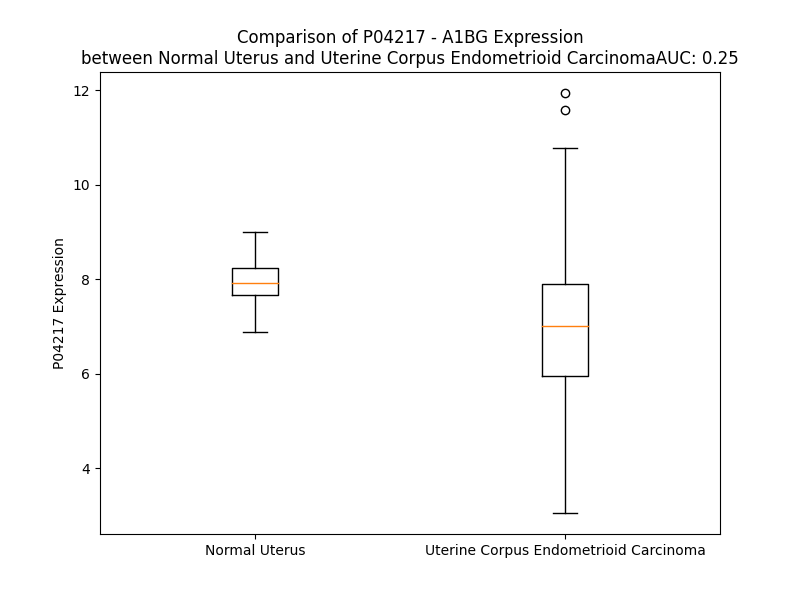

# Detailed Data for P04217

## Introduction to the Detailed Summary

### How to Interpret the Results

- **Summary & Metrics**: This section provides a quick reference to essential protein attributes, including expression changes, family classification, and biomarker applications. Regulation status (upregulated/downregulated) indicates the protein's behavior in a disease context. Some information comes from the original excel file with the proteins selected from literature, while others are derived from the analyses.
- **Expression Comparison**: A visual representation comparing protein expression between normal and disease states. It highlights significant changes in expression levels that might indicate diagnostic or therapeutic relevance. This is data coming from transcriptomics experiments and could not translate similarly to protein levels.
- **Isoform Alignment**: An interactive view of isoform alignments, revealing structural and functional differences between variants of the protein.
- **Interactors & Homologs**: Tables listing known interaction partners and homologous proteins, the more interactors and homologs, the more complex the protein is to design an antibody for.
- **Biological Assemblies**: Information about the structural arrangement of the protein in different assemblies, providing insights into its functional state but also the complexity of the protein to develop antibodies.
- **Combined Per-Residue Information**: A detailed table summarizing residue-level data. This includes predictions for epitope regions, aggregation tendencies, and modifications that might impact the protein's function. Each row corresponds to a residue in the protein, providing insights into specific sites that may be important for research or drug development.
## Summary & Metrics

- **UniProt Accession**: P04217
- **Gene Name**: A1BG
- **Protein Name**: alpha-1-beta glycoprotein
- **Swiss Prot**: A1BG_HUMAN
- **Family**: other
- **Biomarker Application**:  
- **Number of Isoforms**: 2
- **Regulation**: 2
- **(transcriptomics) AUC**: 0.68
- **(transcriptomics) Fold Change**: 1.07
- **(transcriptomics) Regulation**: Upregulated
- **Discotope Epitope Count**: 115
- **Max n_uniprots (Homo)**: N/A
- **Max n_uniprots (Hetero)**: N/A

## Expression Comparison

## Isoform Alignment

<pre style='font-size:14px; font-family:monospace;'>P04217-1 MSMLVVFLLLWGVTWGPVTEAAIFYETQPSLWAESESLLKPLANVTLTCQAHLETPDFQLFKNGVAQEPVHLDSPAIKHQFLLTGDTQGRYRCRSGLSTGWTQLSKLLELTGPKSLPAPWLSMAPVSWITPGLKTTAVCRGVLRGVTFLLRREGDHEFLEVPEAQEDVEATFPVHQPGNYSCSYRTDGEGALSEPSATVTIEELAAPPPPVLMHHGESSQVLHPGNKVTLTCVAPLSGVDFQLRRGEKELLVPRSSTSPDRIFFHLNAVALGDGGHYTCRYRLHDNQNGWSGDSAPVELILSDETLPAPEFSPEPESGRALRLRCLAPLEGARFALVREDRGGRRVHRFQSPAGTEALFELHNISVADSANYSCVYVDLKPPFGGSAPSERLELHVDGPPPRPQLRATWSGAVLAGRDAVLRCEGPIPDVTFELLREGETKAVKTVRTPGAAANLELIFVGPQHAGNYRCRYRSWVPHTFESELSDPVELLVAES
P04217-2 --------------------------------------------------------------------------------------------------------------------------MAPVSWITPGLKTTAVCRGVLRGVTFLLRREGDHEFLEVPEAQEDVEATFPVHQPGNYSCSYRTDGEGALSEPSATVTIEELAAPPPPVLMHHGESSQVLHPGNKVTLTCVAPLSGVDFQLRRGEKELLVPRSSTSPDRIFFHLNAVALGDGGHYTCRYRLHDNQNGWSGDSAPVELILSDETLPAPEFSPEPESGRALRLRCLAPLEGARFALVREDRGGRRVHRFQSPAGTEALFELHNISVADSANYSCVYVDLKPPFGGSAPSERLELHVDGPPPRPQLRATWSGAVLAGRDAVLRCEGPIPDVTFELLREGETKAVKTVRTPGAAANLELIFVGPQHAGNYRCRYRSWVPHTFESELSDPVELLVAES
</pre>

## Interactors

| preferredName_A   | preferredName_B   |   score |
|:------------------|:------------------|--------:|
| A1BG              | GRB2              |   0.992 |
| A1BG              | CRISP3            |   0.941 |
| A1BG              | PTPN11            |   0.94  |

## Homologs

| uniprot_id   | gene_id   |
|:-------------|:----------|
| A0A0G2JMM7   | OSCAR     |
| Q8N6C5       | IGSF1     |
| A0A0G2JNG2   | LILRA4    |
| A0A0B4J1S6   | KIR2DL4   |
| A0A0G2JNP3   | LILRB5    |
| A0A0G2JNW3   | LILRB3    |
| A0A0G2JPP7   | FCAR      |
| A0A0G2JP96   | LILRA1    |
| A0A0G2JP59   | KIR3DL2   |
| B5ME96       | LILRA6    |
| H7C340       | VSTM1     |
| Q8N149       | LILRA2    |
| A0A0G2JPC7   | LILRB4    |
| A6NI73       | LILRA5    |
| A0A0G2JP89   | KIR3DL1   |
| B6A8C7       | TARM1     |
| A0A0A0MTU0   | NCR1      |
| A0A0G2JLQ0   | LAIR2     |
| A0A376A919   | KIR2DS4   |
| A0A0B4J1W1   | LILRB1    |
| E3NZD8       | KIR2DL3   |
| A0A0G2JNH0   | LILRB2    |
| K7EIW7       | GP6       |
| A0A191URH1   | KIR3DL3   |
| A0A1W2PRZ1   | KIR2DL1   |

## Combined Per-Residue Information

|   res | aa   |   epitope_score | epitope   |   relative_surface_accessibility |   modeling_confidence |   Aggregation | modification   | glycosylation                             |
|------:|:-----|----------------:|:----------|---------------------------------:|----------------------:|--------------:|:---------------|:------------------------------------------|
|     1 | M    |         0.1064  | False     |                          1.32182 |                 41.21 |         0.002 | N/A            | N/A                                       |
|     2 | S    |         0.26218 | True      |                          0.95239 |                 37.85 |         9.014 | N/A            | N/A                                       |
|     3 | M    |         0.17171 | True      |                          0.99813 |                 36.99 |        37.785 | N/A            | N/A                                       |
|     4 | L    |         0.15629 | True      |                          0.96187 |                 32.14 |        89.644 | N/A            | N/A                                       |
|     5 | V    |         0.16847 | True      |                          1.00873 |                 38.78 |        99.128 | N/A            | N/A                                       |
|     6 | V    |         0.12902 | False     |                          0.79389 |                 33.06 |        99.927 | N/A            | N/A                                       |
|     7 | F    |         0.18032 | True      |                          0.8661  |                 34.27 |        99.992 | N/A            | N/A                                       |
|     8 | L    |         0.21804 | True      |                          0.85804 |                 36.45 |        99.986 | N/A            | N/A                                       |
|     9 | L    |         0.27485 | True      |                          0.77197 |                 38.16 |        99.859 | N/A            | N/A                                       |
|    10 | L    |         0.19008 | True      |                          0.86441 |                 34.72 |        99.086 | N/A            | N/A                                       |
|    11 | W    |         0.15337 | True      |                          1.00071 |                 37.7  |        94.829 | N/A            | N/A                                       |
|    12 | G    |         0.11022 | False     |                          0.8939  |                 30.96 |        77.223 | N/A            | N/A                                       |
|    13 | V    |         0.10402 | False     |                          0.86897 |                 37.13 |        75.638 | N/A            | N/A                                       |
|    14 | T    |         0.10343 | False     |                          0.9247  |                 32.35 |        56.989 | N/A            | N/A                                       |
|    15 | W    |         0.16915 | True      |                          1.03049 |                 33.03 |        45.894 | N/A            | N/A                                       |
|    16 | G    |         0.12108 | False     |                          0.62921 |                 30    |         0.04  | N/A            | N/A                                       |
|    17 | P    |         0.15321 | True      |                          0.93995 |                 31.86 |         0.011 | N/A            | N/A                                       |
|    18 | V    |         0.15733 | True      |                          1.0225  |                 31.81 |         0     | N/A            | N/A                                       |
|    19 | T    |         0.17609 | True      |                          0.82649 |                 32.81 |         0     | N/A            | N/A                                       |
|    20 | E    |         0.2154  | True      |                          0.88135 |                 30.54 |         0     | N/A            | N/A                                       |
|    21 | A    |         0.13065 | False     |                          0.58939 |                 32.18 |         2.646 | N/A            | N/A                                       |
|    22 | A    |         0.2583  | True      |                          0.96523 |                 32.42 |         2.646 | N/A            | N/A                                       |
|    23 | I    |         0.17369 | True      |                          0.68889 |                 38.33 |         2.646 | N/A            | N/A                                       |
|    24 | F    |         0.243   | True      |                          0.95616 |                 47.55 |         2.646 | N/A            | N/A                                       |
|    25 | Y    |         0.24924 | True      |                          0.69131 |                 56.04 |         2.646 | N/A            | N/A                                       |
|    26 | E    |         0.2324  | True      |                          0.51598 |                 70.66 |         0     | N/A            | N/A                                       |
|    27 | T    |         0.09943 | False     |                          0.30282 |                 82.94 |         0     | N/A            | N/A                                       |
|    28 | Q    |         0.05885 | False     |                          0.30679 |                 89.74 |         0     | N/A            | N/A                                       |
|    29 | P    |         0.01308 | False     |                          0.0191  |                 92.3  |         0     | N/A            | N/A                                       |
|    30 | S    |         0.02722 | False     |                          0.34712 |                 89.64 |         0     | N/A            | N/A                                       |
|    31 | L    |         0.05048 | False     |                          0.09611 |                 91.19 |         0     | N/A            | N/A                                       |
|    32 | W    |         0.04262 | False     |                          0.05944 |                 87.69 |         0     | N/A            | N/A                                       |
|    33 | A    |         0.00294 | False     |                          0.00255 |                 85.26 |         0     | N/A            | N/A                                       |
|    34 | E    |         0.08697 | False     |                          0.24411 |                 77.69 |         0     | N/A            | N/A                                       |
|    35 | S    |         0.05217 | False     |                          0.1949  |                 72.72 |         0     | N/A            | N/A                                       |
|    36 | E    |         0.12076 | False     |                          0.80186 |                 67.96 |         0     | N/A            | N/A                                       |
|    37 | S    |         0.16787 | True      |                          0.33085 |                 62.98 |         0     | N/A            | N/A                                       |
|    38 | L    |         0.10575 | False     |                          0.47008 |                 62.17 |         0     | N/A            | N/A                                       |
|    39 | L    |         0.24588 | True      |                          0.97447 |                 59.83 |         0     | N/A            | N/A                                       |
|    40 | K    |         0.15318 | True      |                          0.69977 |                 63.46 |         0     | N/A            | N/A                                       |
|    41 | P    |         0.07391 | False     |                          0.15283 |                 59.63 |         0     | N/A            | N/A                                       |
|    42 | L    |         0.03713 | False     |                          0.0918  |                 65.93 |         0.18  | N/A            | N/A                                       |
|    43 | A    |         0.06102 | False     |                          0.47894 |                 63.32 |         0.18  | N/A            | N/A                                       |
|    44 | N    |         0.05352 | False     |                          0.61638 |                 70.37 |         0.18  | N/A            | N-linked (GlcNAc...) (complex) asparagine |
|    45 | V    |         0.00878 | False     |                          0.00095 |                 79.84 |         0.458 | N/A            | N/A                                       |
|    46 | T    |         0.04928 | False     |                          0.18017 |                 88.14 |         0.458 | N/A            | N/A                                       |
|    47 | L    |         0.00507 | False     |                          0       |                 91.31 |         0.458 | N/A            | N/A                                       |
|    48 | T    |         0.0305  | False     |                          0.01809 |                 92.4  |         0.277 | N/A            | N/A                                       |
|    49 | C    |         0.00216 | False     |                          0       |                 93.46 |         0.277 | N/A            | N/A                                       |
|    50 | Q    |         0.08271 | False     |                          0.25945 |                 92.67 |         0     | N/A            | N/A                                       |
|    51 | A    |         0.02686 | False     |                          0.0348  |                 92.32 |         0     | N/A            | N/A                                       |
|    52 | H    |         0.15814 | True      |                          0.55769 |                 88.8  |         0     | N/A            | N/A                                       |
|    53 | L    |         0.12562 | False     |                          0.68742 |                 88.9  |         0     | N/A            | N/A                                       |
|    54 | E    |         0.26814 | True      |                          0.61244 |                 92.15 |         0     | N/A            | N/A                                       |
|    55 | T    |         0.05624 | False     |                          0.04376 |                 93.31 |         0     | N/A            | N/A                                       |
|    56 | P    |         0.15635 | True      |                          0.27337 |                 94.46 |         0     | N/A            | N/A                                       |
|    57 | D    |         0.19409 | True      |                          0.25694 |                 96.26 |         0     | N/A            | N/A                                       |
|    58 | F    |         0.00415 | False     |                          0       |                 97.34 |         0     | N/A            | N/A                                       |
|    59 | Q    |         0.08542 | False     |                          0.0481  |                 96.92 |         0     | N/A            | N/A                                       |
|    60 | L    |         0.04663 | False     |                          0.04946 |                 96.37 |         0     | N/A            | N/A                                       |
|    61 | F    |         0.027   | False     |                          0.1051  |                 95.38 |         0     | N/A            | N/A                                       |
|    62 | K    |         0.07112 | False     |                          0.24878 |                 93.81 |         0     | N/A            | N/A                                       |
|    63 | N    |         0.04042 | False     |                          0.14905 |                 93.78 |         0     | N/A            | N/A                                       |
|    64 | G    |         0.01345 | False     |                          0.01428 |                 93.31 |         0     | N/A            | N/A                                       |
|    65 | V    |         0.06532 | False     |                          0.43986 |                 94.31 |         0     | N/A            | N/A                                       |
|    66 | A    |         0.06986 | False     |                          0.41805 |                 93.7  |         0     | N/A            | N/A                                       |
|    67 | Q    |         0.13967 | False     |                          0.37305 |                 93.22 |         0     | N/A            | N/A                                       |
|    68 | E    |         0.20257 | True      |                          0.76712 |                 93.53 |         0     | N/A            | N/A                                       |
|    69 | P    |         0.13333 | False     |                          0.50941 |                 94.88 |         0     | N/A            | N/A                                       |
|    70 | V    |         0.16302 | True      |                          0.32902 |                 95.5  |         0     | N/A            | N/A                                       |
|    71 | H    |         0.26524 | True      |                          0.71319 |                 95.63 |         0     | N/A            | N/A                                       |
|    72 | L    |         0.18069 | True      |                          0.22182 |                 94.47 |         0     | N/A            | N/A                                       |
|    73 | D    |         0.30888 | True      |                          0.99383 |                 93.63 |         0     | N/A            | N/A                                       |
|    74 | S    |         0.30454 | True      |                          0.56175 |                 93.33 |         0     | N/A            | N/A                                       |
|    75 | P    |         0.35065 | True      |                          0.56693 |                 93.83 |         0     | N/A            | N/A                                       |
|    76 | A    |         0.15995 | True      |                          0.27039 |                 94.29 |         0     | N/A            | N/A                                       |
|    77 | I    |         0.23934 | True      |                          0.49101 |                 93.47 |         0     | N/A            | N/A                                       |
|    78 | K    |         0.18322 | True      |                          0.47521 |                 93.71 |         0     | N/A            | N/A                                       |
|    79 | H    |         0.13499 | False     |                          0.1886  |                 94.54 |         0     | N/A            | N/A                                       |
|    80 | Q    |         0.19073 | True      |                          0.51765 |                 93.37 |         1.21  | N/A            | N/A                                       |
|    81 | F    |         0.07488 | False     |                          0.10938 |                 92.42 |         1.73  | N/A            | N/A                                       |
|    82 | L    |         0.15571 | True      |                          0.76823 |                 88.77 |         1.73  | N/A            | N/A                                       |
|    83 | L    |         0.07489 | False     |                          0.15075 |                 84.61 |         1.73  | N/A            | N/A                                       |
|    84 | T    |         0.14826 | True      |                          0.8114  |                 75.55 |         1.73  | N/A            | N/A                                       |
|    85 | G    |         0.10302 | False     |                          0.88875 |                 76.02 |         0.519 | N/A            | N/A                                       |
|    86 | D    |         0.17959 | True      |                          0.61184 |                 77.92 |         0     | N/A            | N/A                                       |
|    87 | T    |         0.03871 | False     |                          0.17581 |                 80.97 |         0     | N/A            | N/A                                       |
|    88 | Q    |         0.07307 | False     |                          0.49184 |                 84.5  |         0     | N/A            | N/A                                       |
|    89 | G    |         0.01802 | False     |                          0.08101 |                 89.29 |         0     | N/A            | N/A                                       |
|    90 | R    |         0.03887 | False     |                          0.11168 |                 91.97 |         0     | N/A            | N/A                                       |
|    91 | Y    |         0.02042 | False     |                          0.00746 |                 93.5  |         0     | N/A            | N/A                                       |
|    92 | R    |         0.04135 | False     |                          0.10909 |                 95.5  |         0     | N/A            | N/A                                       |
|    93 | C    |         0.00204 | False     |                          0       |                 95.66 |         0     | N/A            | N/A                                       |
|    94 | R    |         0.07182 | False     |                          0.23663 |                 96.1  |         0     | N/A            | N/A                                       |
|    95 | S    |         0.00747 | False     |                          0.00949 |                 95.7  |         0     | N/A            | N/A                                       |
|    96 | G    |         0.04844 | False     |                          0.08247 |                 92.7  |         0     | N/A            | N/A                                       |
|    97 | L    |         0.18678 | True      |                          0.39389 |                 87.4  |         0     | N/A            | N/A                                       |
|    98 | S    |         0.25759 | True      |                          0.9672  |                 83.5  |         0     | N/A            | N/A                                       |
|    99 | T    |         0.32689 | True      |                          0.93406 |                 85.5  |         0     | N/A            | N/A                                       |
|   100 | G    |         0.22491 | True      |                          0.45693 |                 90.52 |         0     | N/A            | N/A                                       |
|   101 | W    |         0.12222 | False     |                          0.38236 |                 92.89 |         0     | N/A            | N/A                                       |
|   102 | T    |         0.03238 | False     |                          0.07887 |                 92.98 |         0     | N/A            | N/A                                       |
|   103 | Q    |         0.12588 | False     |                          0.62838 |                 91.58 |         0     | N/A            | N/A                                       |
|   104 | L    |         0.0634  | False     |                          0.18533 |                 93.95 |         0     | N/A            | N/A                                       |
|   105 | S    |         0.00268 | False     |                          0.00154 |                 93.27 |         0     | N/A            | N/A                                       |
|   106 | K    |         0.02384 | False     |                          0.43822 |                 87.57 |         0     | N/A            | N/A                                       |
|   107 | L    |         0.035   | False     |                          0.16227 |                 89.27 |         0     | N/A            | N/A                                       |
|   108 | L    |         0.00577 | False     |                          0.0033  |                 88.96 |         0     | N/A            | N/A                                       |
|   109 | E    |         0.02832 | False     |                          0.19517 |                 87.44 |         0     | N/A            | N/A                                       |
|   110 | L    |         0.01294 | False     |                          0.02204 |                 85.77 |         0     | N/A            | N/A                                       |
|   111 | T    |         0.13977 | False     |                          0.48382 |                 73.16 |         0     | N/A            | N/A                                       |
|   112 | G    |         0.08904 | False     |                          0.1398  |                 67.03 |         0     | N/A            | N/A                                       |
|   113 | P    |         0.17237 | True      |                          0.85133 |                 64.54 |         0     | N/A            | N/A                                       |
|   114 | K    |         0.20045 | True      |                          0.97637 |                 64.63 |         0     | N/A            | N/A                                       |
|   115 | S    |         0.08893 | False     |                          0.30774 |                 71.17 |         0     | N/A            | N/A                                       |
|   116 | L    |         0.03405 | False     |                          0.09533 |                 79.98 |         0     | N/A            | N/A                                       |
|   117 | P    |         0.01114 | False     |                          0.0338  |                 81.72 |         0     | N/A            | N/A                                       |
|   118 | A    |         0.02162 | False     |                          0.36755 |                 87.14 |         0     | N/A            | N/A                                       |
|   119 | P    |         0.00663 | False     |                          0.02572 |                 90.39 |         0     | N/A            | N/A                                       |
|   120 | W    |         0.03497 | False     |                          0.33982 |                 88.73 |         0     | N/A            | N/A                                       |
|   121 | L    |         0.04842 | False     |                          0.12587 |                 92.52 |         0     | N/A            | N/A                                       |
|   122 | S    |         0.0336  | False     |                          0.35711 |                 92.58 |         0     | N/A            | N/A                                       |
|   123 | M    |         0.05165 | False     |                          0.12075 |                 92.46 |         0     | N/A            | N/A                                       |
|   124 | A    |         0.06202 | False     |                          0.36808 |                 91.13 |         0     | N/A            | N/A                                       |
|   125 | P    |         0.17074 | True      |                          0.53865 |                 90.6  |         0     | N/A            | N/A                                       |
|   126 | V    |         0.065   | False     |                          0.10282 |                 91.87 |         0     | N/A            | N/A                                       |
|   127 | S    |         0.03593 | False     |                          0.45538 |                 92.02 |         0     | N/A            | N/A                                       |
|   128 | W    |         0.06334 | False     |                          0.1309  |                 92.92 |         0     | N/A            | N/A                                       |
|   129 | I    |         0.03494 | False     |                          0.056   |                 92.77 |         0     | N/A            | N/A                                       |
|   130 | T    |         0.05228 | False     |                          0.0691  |                 90.64 |         0     | N/A            | N/A                                       |
|   131 | P    |         0.17302 | True      |                          0.64062 |                 87.49 |         0     | N/A            | N/A                                       |
|   132 | G    |         0.12804 | False     |                          0.66977 |                 84.92 |         0     | N/A            | N/A                                       |
|   133 | L    |         0.10985 | False     |                          0.16981 |                 88.49 |         0     | N/A            | N/A                                       |
|   134 | K    |         0.12269 | False     |                          0.87771 |                 89.57 |         0     | N/A            | N/A                                       |
|   135 | T    |         0.00946 | False     |                          0.01149 |                 91.06 |         0     | N/A            | N/A                                       |
|   136 | T    |         0.06708 | False     |                          0.26256 |                 94.11 |         0     | N/A            | N/A                                       |
|   137 | A    |         0.00233 | False     |                          0       |                 94.22 |         0     | N/A            | N/A                                       |
|   138 | V    |         0.02045 | False     |                          0.14662 |                 92.07 |         0     | N/A            | N/A                                       |
|   139 | C    |         0.00302 | False     |                          0       |                 91.4  |         0     | N/A            | N/A                                       |
|   140 | R    |         0.03766 | False     |                          0.33035 |                 87.75 |         0     | N/A            | N/A                                       |
|   141 | G    |         0.01075 | False     |                          0.03212 |                 83.58 |         0     | N/A            | N/A                                       |
|   142 | V    |         0.00529 | False     |                          0.00571 |                 80.04 |         0     | N/A            | N/A                                       |
|   143 | L    |         0.03205 | False     |                          0.02595 |                 79.51 |         0     | N/A            | N/A                                       |
|   144 | R    |         0.09161 | False     |                          0.49487 |                 78.82 |         0     | N/A            | N/A                                       |
|   145 | G    |         0.03885 | False     |                          0.45534 |                 77.67 |         0.959 | N/A            | N/A                                       |
|   146 | V    |         0.00947 | False     |                          0.00495 |                 83.58 |         8.046 | N/A            | N/A                                       |
|   147 | T    |         0.03888 | False     |                          0.13565 |                 88.08 |         8.046 | N/A            | N/A                                       |
|   148 | F    |         0.0087  | False     |                          0.00637 |                 91.36 |         8.046 | N/A            | N/A                                       |
|   149 | L    |         0.04368 | False     |                          0.03029 |                 92.79 |         8.046 | N/A            | N/A                                       |
|   150 | L    |         0.02443 | False     |                          0.01448 |                 94.39 |         7.725 | N/A            | N/A                                       |
|   151 | R    |         0.12911 | False     |                          0.38671 |                 94.34 |         0     | N/A            | N/A                                       |
|   152 | R    |         0.15032 | True      |                          0.20835 |                 95.05 |         0     | N/A            | N/A                                       |
|   153 | E    |         0.15126 | True      |                          0.65323 |                 93.14 |         0     | N/A            | N/A                                       |
|   154 | G    |         0.17755 | True      |                          0.79152 |                 89.41 |         0     | N/A            | N/A                                       |
|   155 | D    |         0.17615 | True      |                          0.29608 |                 90.05 |         0     | N/A            | N/A                                       |
|   156 | H    |         0.26692 | True      |                          0.96105 |                 83.45 |         0     | N/A            | N/A                                       |
|   157 | E    |         0.2366  | True      |                          0.7525  |                 84.43 |         0     | N/A            | N/A                                       |
|   158 | F    |         0.20396 | True      |                          0.32711 |                 82.71 |         0     | N/A            | N/A                                       |
|   159 | L    |         0.12267 | False     |                          0.58341 |                 87.26 |         0     | N/A            | N/A                                       |
|   160 | E    |         0.14205 | False     |                          0.41577 |                 85.71 |         0     | N/A            | N/A                                       |
|   161 | V    |         0.07434 | False     |                          0.3437  |                 82.61 |         0     | N/A            | N/A                                       |
|   162 | P    |         0.17038 | True      |                          0.68436 |                 75.16 |         0     | N/A            | N/A                                       |
|   163 | E    |         0.08032 | False     |                          0.62029 |                 65.77 |         0     | N/A            | N/A                                       |
|   164 | A    |         0.04533 | False     |                          0.16169 |                 60.52 |         0     | N/A            | N/A                                       |
|   165 | Q    |         0.21163 | True      |                          0.80682 |                 53.27 |         0     | N/A            | N/A                                       |
|   166 | E    |         0.29998 | True      |                          0.74499 |                 54.92 |         0     | N/A            | N/A                                       |
|   167 | D    |         0.20807 | True      |                          0.51366 |                 61.12 |         0     | N/A            | N/A                                       |
|   168 | V    |         0.03967 | False     |                          0.15874 |                 79.35 |         0     | N/A            | N/A                                       |
|   169 | E    |         0.04089 | False     |                          0.2648  |                 86.9  |         0     | N/A            | N/A                                       |
|   170 | A    |         0.01626 | False     |                          0.04464 |                 89.97 |         0     | N/A            | N/A                                       |
|   171 | T    |         0.08824 | False     |                          0.51129 |                 91.26 |         0     | N/A            | N/A                                       |
|   172 | F    |         0.01342 | False     |                          0.0121  |                 93    |         0     | N/A            | N/A                                       |
|   173 | P    |         0.06036 | False     |                          0.54553 |                 92.64 |         0     | N/A            | N/A                                       |
|   174 | V    |         0.01352 | False     |                          0.01768 |                 92.53 |         0     | N/A            | N/A                                       |
|   175 | H    |         0.1004  | False     |                          0.73876 |                 89.92 |         0     | N/A            | N/A                                       |
|   176 | Q    |         0.09405 | False     |                          0.47198 |                 92.29 |         0     | N/A            | N/A                                       |
|   177 | P    |         0.10128 | False     |                          0.42137 |                 94.5  |         0     | N/A            | N/A                                       |
|   178 | G    |         0.0242  | False     |                          0.29639 |                 94.36 |         0     | N/A            | N/A                                       |
|   179 | N    |         0.07313 | False     |                          0.31698 |                 96.18 |         0     | N/A            | N-linked (GlcNAc...) asparagine           |
|   180 | Y    |         0.07411 | False     |                          0.06021 |                 96.11 |         0     | N/A            | N/A                                       |
|   181 | S    |         0.06674 | False     |                          0.2003  |                 95.54 |         0     | N/A            | N/A                                       |
|   182 | C    |         0.00208 | False     |                          0.002   |                 94.16 |         0     | N/A            | N/A                                       |
|   183 | S    |         0.06052 | False     |                          0.07766 |                 92.86 |         0     | N/A            | N/A                                       |
|   184 | Y    |         0.01493 | False     |                          0       |                 89.57 |         0     | N/A            | N/A                                       |
|   185 | R    |         0.18867 | True      |                          0.18393 |                 86.47 |         0     | N/A            | N/A                                       |
|   186 | T    |         0.10903 | False     |                          0.1374  |                 79.89 |         0     | N/A            | N/A                                       |
|   187 | D    |         0.1328  | False     |                          0.44206 |                 72.97 |         0     | N/A            | N/A                                       |
|   188 | G    |         0.23527 | True      |                          0.67908 |                 66.98 |         0     | N/A            | N/A                                       |
|   189 | E    |         0.2242  | True      |                          0.90545 |                 67.57 |         0     | N/A            | N/A                                       |
|   190 | G    |         0.14401 | False     |                          0.24397 |                 70.43 |         0     | N/A            | N/A                                       |
|   191 | A    |         0.20441 | True      |                          0.77277 |                 80.24 |         0     | N/A            | N/A                                       |
|   192 | L    |         0.30697 | True      |                          0.52125 |                 87.14 |         0     | N/A            | N/A                                       |
|   193 | S    |         0.0122  | False     |                          0.04096 |                 88.86 |         0     | N/A            | N/A                                       |
|   194 | E    |         0.05876 | False     |                          0.51546 |                 87.51 |         0     | N/A            | N/A                                       |
|   195 | P    |         0.1041  | False     |                          0.55634 |                 91.63 |         0     | N/A            | N/A                                       |
|   196 | S    |         0.01076 | False     |                          0.04958 |                 92.67 |         0     | N/A            | N/A                                       |
|   197 | A    |         0.0733  | False     |                          0.82919 |                 90.66 |         0.312 | N/A            | N/A                                       |
|   198 | T    |         0.20932 | True      |                          0.5854  |                 93.28 |         0.312 | N/A            | N/A                                       |
|   199 | V    |         0.02162 | False     |                          0.20755 |                 93.53 |         0.312 | N/A            | N/A                                       |
|   200 | T    |         0.07676 | False     |                          0.5561  |                 95.3  |         0.312 | N/A            | N/A                                       |
|   201 | I    |         0.01209 | False     |                          0.01478 |                 95.56 |         0.312 | N/A            | N/A                                       |
|   202 | E    |         0.10297 | False     |                          0.54955 |                 94.13 |         0     | N/A            | N/A                                       |
|   203 | E    |         0.07317 | False     |                          0.54444 |                 94.07 |         0     | N/A            | N/A                                       |
|   204 | L    |         0.11811 | False     |                          0.28336 |                 92.7  |         0     | N/A            | N/A                                       |
|   205 | A    |         0.15405 | True      |                          1.01138 |                 89.77 |         0     | N/A            | N/A                                       |
|   206 | A    |         0.12983 | False     |                          0.43622 |                 90.18 |         0     | N/A            | N/A                                       |
|   207 | P    |         0.03798 | False     |                          0.04897 |                 92.12 |         0     | N/A            | N/A                                       |
|   208 | P    |         0.06679 | False     |                          0.28033 |                 93.44 |         0     | N/A            | N/A                                       |
|   209 | P    |         0.0676  | False     |                          0.56036 |                 96.4  |         0     | N/A            | N/A                                       |
|   210 | P    |         0.01814 | False     |                          0.03289 |                 96.9  |         0     | N/A            | N/A                                       |
|   211 | V    |         0.03886 | False     |                          0.63408 |                 95.67 |         0     | N/A            | N/A                                       |
|   212 | L    |         0.03656 | False     |                          0.07696 |                 94.75 |         0     | N/A            | N/A                                       |
|   213 | M    |         0.05031 | False     |                          0.43937 |                 90.72 |         0     | N/A            | N/A                                       |
|   214 | H    |         0.05146 | False     |                          0.21437 |                 84.54 |         0     | N/A            | N/A                                       |
|   215 | H    |         0.11763 | False     |                          0.49341 |                 63.51 |         0     | N/A            | N/A                                       |
|   216 | G    |         0.10882 | False     |                          0.57871 |                 53.97 |         0     | N/A            | N/A                                       |
|   217 | E    |         0.08018 | False     |                          0.67443 |                 43.54 |         0     | N/A            | N/A                                       |
|   218 | S    |         0.03926 | False     |                          0.22701 |                 46.31 |         0     | N/A            | N/A                                       |
|   219 | S    |         0.05893 | False     |                          0.36976 |                 54.76 |         0     | N/A            | N/A                                       |
|   220 | Q    |         0.05737 | False     |                          0.34707 |                 68.56 |         0     | N/A            | N/A                                       |
|   221 | V    |         0.01892 | False     |                          0.05951 |                 82.05 |         0     | N/A            | N/A                                       |
|   222 | L    |         0.02266 | False     |                          0.0577  |                 89.3  |         0     | N/A            | N/A                                       |
|   223 | H    |         0.05837 | False     |                          0.39314 |                 90.68 |         0     | N/A            | N/A                                       |
|   224 | P    |         0.06721 | False     |                          0.43589 |                 91.68 |         0     | N/A            | N/A                                       |
|   225 | G    |         0.06507 | False     |                          0.56378 |                 91.61 |         0     | N/A            | N/A                                       |
|   226 | N    |         0.07738 | False     |                          0.34158 |                 91.06 |         0     | N/A            | N/A                                       |
|   227 | K    |         0.1201  | False     |                          0.8225  |                 91.7  |         0     | N/A            | N/A                                       |
|   228 | V    |         0.00864 | False     |                          0.01726 |                 90.1  |         1.157 | N/A            | N/A                                       |
|   229 | T    |         0.05411 | False     |                          0.24455 |                 92.75 |         1.157 | N/A            | N/A                                       |
|   230 | L    |         0.00262 | False     |                          0       |                 93.97 |         1.157 | N/A            | N/A                                       |
|   231 | T    |         0.0148  | False     |                          0.00857 |                 94.88 |         1.157 | N/A            | N/A                                       |
|   232 | C    |         0.00236 | False     |                          0       |                 95.57 |         1.157 | N/A            | N/A                                       |
|   233 | V    |         0.0357  | False     |                          0.24208 |                 95.7  |         1.157 | N/A            | N/A                                       |
|   234 | A    |         0.03033 | False     |                          0.05762 |                 94.51 |         0     | N/A            | N/A                                       |
|   235 | P    |         0.12105 | False     |                          0.478   |                 92.01 |         0     | N/A            | N/A                                       |
|   236 | L    |         0.08007 | False     |                          0.0676  |                 91.14 |         0     | N/A            | N/A                                       |
|   237 | S    |         0.15611 | True      |                          0.48701 |                 89.65 |         0     | N/A            | N/A                                       |
|   238 | G    |         0.0981  | False     |                          0.52183 |                 85.97 |         0     | N/A            | N/A                                       |
|   239 | V    |         0.03568 | False     |                          0.117   |                 92.28 |         0     | N/A            | N/A                                       |
|   240 | D    |         0.09477 | False     |                          0.26282 |                 93.05 |         0     | N/A            | N/A                                       |
|   241 | F    |         0.06699 | False     |                          0.07711 |                 95.53 |         0     | N/A            | N/A                                       |
|   242 | Q    |         0.08311 | False     |                          0.07681 |                 95.49 |         0     | N/A            | N/A                                       |
|   243 | L    |         0.01401 | False     |                          0.00354 |                 97.54 |         0     | N/A            | N/A                                       |
|   244 | R    |         0.18088 | True      |                          0.10301 |                 97.35 |         0     | N/A            | N/A                                       |
|   245 | R    |         0.11127 | False     |                          0.30211 |                 93.97 |         0     | N/A            | N/A                                       |
|   246 | G    |         0.14486 | False     |                          0.60719 |                 89.25 |         0     | N/A            | N/A                                       |
|   247 | E    |         0.36932 | True      |                          0.78882 |                 88.85 |         0     | N/A            | N/A                                       |
|   248 | K    |         0.16735 | True      |                          0.68532 |                 93.59 |         0     | N/A            | N/A                                       |
|   249 | E    |         0.16999 | True      |                          0.39986 |                 94.94 |         0     | N/A            | N/A                                       |
|   250 | L    |         0.1356  | False     |                          0.1719  |                 95.11 |         0     | N/A            | N/A                                       |
|   251 | L    |         0.21072 | True      |                          0.94366 |                 94.68 |         0     | N/A            | N/A                                       |
|   252 | V    |         0.0953  | False     |                          0.23507 |                 94.02 |         0     | N/A            | N/A                                       |
|   253 | P    |         0.18192 | True      |                          0.57942 |                 95.58 |         0     | N/A            | N/A                                       |
|   254 | R    |         0.17942 | True      |                          0.63345 |                 94.53 |         0     | N/A            | N/A                                       |
|   255 | S    |         0.13536 | False     |                          0.41144 |                 94.31 |         0     | N/A            | N/A                                       |
|   256 | S    |         0.18914 | True      |                          0.54076 |                 91.9  |         0     | N/A            | N/A                                       |
|   257 | T    |         0.19091 | True      |                          0.55973 |                 87.8  |         0     | N/A            | N/A                                       |
|   258 | S    |         0.15805 | True      |                          0.24393 |                 87.25 |         0     | N/A            | N/A                                       |
|   259 | P    |         0.12625 | False     |                          0.67583 |                 88.55 |         0     | N/A            | N/A                                       |
|   260 | D    |         0.05226 | False     |                          0.19746 |                 90.54 |         0     | N/A            | N/A                                       |
|   261 | R    |         0.09831 | False     |                          0.25775 |                 94.3  |         0     | N/A            | N/A                                       |
|   262 | I    |         0.07903 | False     |                          0.0976  |                 95.29 |        20.328 | N/A            | N/A                                       |
|   263 | F    |         0.0687  | False     |                          0.19473 |                 95.54 |        21.758 | N/A            | N/A                                       |
|   264 | F    |         0.01846 | False     |                          0.02484 |                 95.54 |        21.758 | N/A            | N/A                                       |
|   265 | H    |         0.08422 | False     |                          0.27013 |                 94.32 |        21.758 | N/A            | N/A                                       |
|   266 | L    |         0.05896 | False     |                          0.11373 |                 92.88 |        21.965 | N/A            | N/A                                       |
|   267 | N    |         0.14538 | False     |                          0.50729 |                 89.31 |        13.746 | N/A            | N/A                                       |
|   268 | A    |         0.10009 | False     |                          0.70882 |                 91.66 |        13.425 | N/A            | N/A                                       |
|   269 | V    |         0.0346  | False     |                          0.03237 |                 92.83 |        13.155 | N/A            | N/A                                       |
|   270 | A    |         0.08685 | False     |                          0.50889 |                 93.51 |        10.01  | N/A            | N/A                                       |
|   271 | L    |         0.08289 | False     |                          0.24906 |                 92.69 |         7.357 | N/A            | N/A                                       |
|   272 | G    |         0.06706 | False     |                          0.32814 |                 91.69 |         0.59  | N/A            | N/A                                       |
|   273 | D    |         0.07644 | False     |                          0.23124 |                 92.4  |         0     | N/A            | N/A                                       |
|   274 | G    |         0.03983 | False     |                          0.33082 |                 90.41 |         0     | N/A            | N/A                                       |
|   275 | G    |         0.02115 | False     |                          0.27392 |                 90.16 |         0     | N/A            | N/A                                       |
|   276 | H    |         0.09098 | False     |                          0.51607 |                 92.75 |         0     | N/A            | N/A                                       |
|   277 | Y    |         0.03314 | False     |                          0.00787 |                 95.63 |         0     | N/A            | N/A                                       |
|   278 | T    |         0.06648 | False     |                          0.13586 |                 97.54 |         0     | N/A            | N/A                                       |
|   279 | C    |         0.00159 | False     |                          0       |                 97.31 |         0     | N/A            | N/A                                       |
|   280 | R    |         0.08978 | False     |                          0.19698 |                 96.59 |         0     | N/A            | N/A                                       |
|   281 | Y    |         0.01103 | False     |                          0       |                 94.95 |         0     | N/A            | N/A                                       |
|   282 | R    |         0.15198 | True      |                          0.25003 |                 93.14 |         0     | N/A            | N/A                                       |
|   283 | L    |         0.08459 | False     |                          0.06326 |                 89.65 |         0     | N/A            | N/A                                       |
|   284 | H    |         0.26118 | True      |                          0.68809 |                 84.47 |         0     | N/A            | N/A                                       |
|   285 | D    |         0.20454 | True      |                          0.83777 |                 78.83 |         0     | N/A            | N/A                                       |
|   286 | N    |         0.1717  | True      |                          0.19435 |                 72.14 |         0     | N/A            | N/A                                       |
|   287 | Q    |         0.38982 | True      |                          0.6838  |                 68.39 |         0     | N/A            | N/A                                       |
|   288 | N    |         0.37131 | True      |                          0.92463 |                 68.3  |         0     | N/A            | N/A                                       |
|   289 | G    |         0.22484 | True      |                          0.26979 |                 83.65 |         0     | N/A            | N/A                                       |
|   290 | W    |         0.15679 | True      |                          0.29004 |                 92.14 |         0     | N/A            | N/A                                       |
|   291 | S    |         0.01406 | False     |                          0.0527  |                 94.43 |         0     | N/A            | N/A                                       |
|   292 | G    |         0.09005 | False     |                          0.37344 |                 92.86 |         0     | N/A            | N/A                                       |
|   293 | D    |         0.0822  | False     |                          0.29458 |                 95.88 |         0     | N/A            | N/A                                       |
|   294 | S    |         0.00994 | False     |                          0.03547 |                 96.87 |         0     | N/A            | N/A                                       |
|   295 | A    |         0.06563 | False     |                          0.76015 |                 94.34 |         0     | N/A            | N/A                                       |
|   296 | P    |         0.10662 | False     |                          0.57618 |                 93.86 |         0     | N/A            | N/A                                       |
|   297 | V    |         0.01969 | False     |                          0.16661 |                 91.83 |         0     | N/A            | N/A                                       |
|   298 | E    |         0.04545 | False     |                          0.17786 |                 91.66 |         0     | N/A            | N/A                                       |
|   299 | L    |         0.00664 | False     |                          0.05133 |                 91.5  |         0     | N/A            | N/A                                       |
|   300 | I    |         0.01216 | False     |                          0.02663 |                 91.34 |         0     | N/A            | N/A                                       |
|   301 | L    |         0.00988 | False     |                          0.03586 |                 92.96 |         0     | N/A            | N/A                                       |
|   302 | S    |         0.02043 | False     |                          0.0052  |                 93.52 |         0     | N/A            | N/A                                       |
|   303 | D    |         0.02993 | False     |                          0.27995 |                 94.18 |         0     | N/A            | N/A                                       |
|   304 | E    |         0.08562 | False     |                          0.40272 |                 94.43 |         0     | N/A            | N/A                                       |
|   305 | T    |         0.13465 | False     |                          0.70444 |                 94.64 |         0     | N/A            | N/A                                       |
|   306 | L    |         0.09575 | False     |                          0.3047  |                 95.92 |         0     | N/A            | N/A                                       |
|   307 | P    |         0.178   | True      |                          0.58111 |                 95.96 |         0     | N/A            | N/A                                       |
|   308 | A    |         0.03662 | False     |                          0.50426 |                 96.63 |         0     | N/A            | N/A                                       |
|   309 | P    |         0.02128 | False     |                          0.04575 |                 97.14 |         0     | N/A            | N/A                                       |
|   310 | E    |         0.07015 | False     |                          0.62778 |                 97.22 |         0     | N/A            | N/A                                       |
|   311 | F    |         0.03748 | False     |                          0.1386  |                 96.95 |         0     | N/A            | N/A                                       |
|   312 | S    |         0.08223 | False     |                          0.25305 |                 94.53 |         0     | N/A            | N/A                                       |
|   313 | P    |         0.12522 | False     |                          0.48892 |                 92.21 |         0     | N/A            | N/A                                       |
|   314 | E    |         0.14529 | False     |                          0.26876 |                 87.89 |         0     | N/A            | N/A                                       |
|   315 | P    |         0.11387 | False     |                          0.85683 |                 72.31 |         0     | N/A            | N/A                                       |
|   316 | E    |         0.22302 | True      |                          0.93628 |                 60.96 |         0     | N/A            | N/A                                       |
|   317 | S    |         0.11223 | False     |                          0.31135 |                 52.37 |         0     | N/A            | N/A                                       |
|   318 | G    |         0.23335 | True      |                          0.91132 |                 60.33 |         0     | N/A            | N/A                                       |
|   319 | R    |         0.15638 | True      |                          0.99134 |                 73.89 |         0     | N/A            | N/A                                       |
|   320 | A    |         0.07553 | False     |                          0.18385 |                 83.74 |         0     | N/A            | N/A                                       |
|   321 | L    |         0.04396 | False     |                          0.24992 |                 87.87 |         0     | N/A            | N/A                                       |
|   322 | R    |         0.11124 | False     |                          0.34995 |                 91.92 |         0     | N/A            | N/A                                       |
|   323 | L    |         0.00574 | False     |                          0.0033  |                 94.49 |         0     | N/A            | N/A                                       |
|   324 | R    |         0.09561 | False     |                          0.35954 |                 95.84 |         0     | N/A            | N/A                                       |
|   325 | C    |         0.0026  | False     |                          0       |                 97.09 |         0     | N/A            | N/A                                       |
|   326 | L    |         0.08988 | False     |                          0.40583 |                 97.36 |         0     | N/A            | N/A                                       |
|   327 | A    |         0.01671 | False     |                          0.0242  |                 95.83 |         0     | N/A            | N/A                                       |
|   328 | P    |         0.21342 | True      |                          0.74313 |                 93.82 |         0     | N/A            | N/A                                       |
|   329 | L    |         0.12204 | False     |                          0.28935 |                 93.45 |         0     | N/A            | N/A                                       |
|   330 | E    |         0.15894 | True      |                          0.67178 |                 93.65 |         0     | N/A            | N/A                                       |
|   331 | G    |         0.05838 | False     |                          0.46768 |                 91.36 |         0     | N/A            | N/A                                       |
|   332 | A    |         0.00717 | False     |                          0.00604 |                 95.03 |         0     | N/A            | N/A                                       |
|   333 | R    |         0.05629 | False     |                          0.15235 |                 95.48 |         0     | N/A            | N/A                                       |
|   334 | F    |         0.00121 | False     |                          0       |                 96.09 |         0     | N/A            | N/A                                       |
|   335 | A    |         0.0018  | False     |                          0       |                 95.21 |         0     | N/A            | N/A                                       |
|   336 | L    |         0.0029  | False     |                          0       |                 95.53 |         0     | N/A            | N/A                                       |
|   337 | V    |         0.00235 | False     |                          0       |                 93.6  |         0     | N/A            | N/A                                       |
|   338 | R    |         0.01547 | False     |                          0.03138 |                 91.55 |         0     | N/A            | N/A                                       |
|   339 | E    |         0.08894 | False     |                          0.20579 |                 89.48 |         0     | N/A            | N/A                                       |
|   340 | D    |         0.04135 | False     |                          0.14574 |                 84.07 |         0     | N/A            | N/A                                       |
|   341 | R    |         0.20967 | True      |                          0.84949 |                 81.42 |         0     | N/A            | N/A                                       |
|   342 | G    |         0.11266 | False     |                          0.20437 |                 73.47 |         0     | N/A            | N/A                                       |
|   343 | G    |         0.07504 | False     |                          0.28215 |                 80.26 |         0     | N/A            | N/A                                       |
|   344 | R    |         0.13652 | False     |                          0.17698 |                 83.76 |         0     | N/A            | N/A                                       |
|   345 | R    |         0.02962 | False     |                          0.30198 |                 85.44 |         0     | N/A            | N/A                                       |
|   346 | V    |         0.02358 | False     |                          0.13139 |                 89.72 |         0     | N/A            | N/A                                       |
|   347 | H    |         0.10441 | False     |                          0.39724 |                 88.82 |         0     | N/A            | N/A                                       |
|   348 | R    |         0.09851 | False     |                          0.47247 |                 91.42 |         0     | N/A            | N/A                                       |
|   349 | F    |         0.05106 | False     |                          0.25228 |                 92.67 |         0     | N/A            | N/A                                       |
|   350 | Q    |         0.07842 | False     |                          0.33469 |                 93.93 |         0     | N/A            | N/A                                       |
|   351 | S    |         0.14418 | False     |                          0.52183 |                 93.07 |         0     | N/A            | N/A                                       |
|   352 | P    |         0.06814 | False     |                          0.24826 |                 94.05 |         0     | N/A            | N/A                                       |
|   353 | A    |         0.16375 | True      |                          0.92372 |                 92.37 |         0     | N/A            | N/A                                       |
|   354 | G    |         0.13329 | False     |                          0.43286 |                 94.18 |         0     | N/A            | N/A                                       |
|   355 | T    |         0.11884 | False     |                          0.32134 |                 96.16 |         0     | N/A            | N/A                                       |
|   356 | E    |         0.09058 | False     |                          0.36824 |                 95.69 |         0     | N/A            | N/A                                       |
|   357 | A    |         0.00836 | False     |                          0.01148 |                 96.27 |         0     | N/A            | N/A                                       |
|   358 | L    |         0.0738  | False     |                          0.44679 |                 94.96 |         0     | N/A            | N/A                                       |
|   359 | F    |         0.00386 | False     |                          0.00069 |                 94.34 |         0     | N/A            | N/A                                       |
|   360 | E    |         0.07626 | False     |                          0.30851 |                 91.73 |         0     | N/A            | N/A                                       |
|   361 | L    |         0.05994 | False     |                          0.05358 |                 88.72 |         0     | N/A            | N/A                                       |
|   362 | H    |         0.1356  | False     |                          0.62057 |                 85.94 |         0     | N/A            | N/A                                       |
|   363 | N    |         0.1005  | False     |                          0.82617 |                 82.52 |         0     | N/A            | N-linked (GlcNAc...) asparagine           |
|   364 | I    |         0.11224 | False     |                          0.34013 |                 83.79 |         0     | N/A            | N/A                                       |
|   365 | S    |         0.04514 | False     |                          0.07122 |                 84.01 |         0     | N/A            | N/A                                       |
|   366 | V    |         0.04676 | False     |                          0.21507 |                 86.45 |         0     | N/A            | N/A                                       |
|   367 | A    |         0.0451  | False     |                          0.21217 |                 83.92 |         0     | N/A            | N/A                                       |
|   368 | D    |         0.02213 | False     |                          0.18772 |                 87    |         0     | N/A            | N/A                                       |
|   369 | S    |         0.02    | False     |                          0.07101 |                 89.22 |         0     | N/A            | N/A                                       |
|   370 | A    |         0.01129 | False     |                          0.09777 |                 91.25 |         0     | N/A            | N/A                                       |
|   371 | N    |         0.04415 | False     |                          0.28814 |                 93.52 |         0     | N/A            | N-linked (GlcNAc...) asparagine           |
|   372 | Y    |         0.01303 | False     |                          0.00411 |                 95.06 |         0.86  | N/A            | N/A                                       |
|   373 | S    |         0.02858 | False     |                          0.03197 |                 95.96 |         1.11  | N/A            | N/A                                       |
|   374 | C    |         0.00217 | False     |                          0       |                 96.07 |         1.11  | N/A            | N/A                                       |
|   375 | V    |         0.00926 | False     |                          0.00286 |                 95.99 |         1.11  | N/A            | N/A                                       |
|   376 | Y    |         0.01665 | False     |                          0.00818 |                 96.02 |         1.11  | N/A            | N/A                                       |
|   377 | V    |         0.02638 | False     |                          0.08473 |                 95.5  |         1.11  | N/A            | N/A                                       |
|   378 | D    |         0.08358 | False     |                          0.22668 |                 94.86 |         0     | N/A            | N/A                                       |
|   379 | L    |         0.11941 | False     |                          0.60564 |                 92.49 |         0     | N/A            | N/A                                       |
|   380 | K    |         0.14857 | True      |                          0.71581 |                 92.47 |         0     | N/A            | N/A                                       |
|   381 | P    |         0.47237 | True      |                          0.77241 |                 92.17 |         0     | N/A            | N/A                                       |
|   382 | P    |         0.34944 | True      |                          0.89441 |                 92.67 |         0     | N/A            | N/A                                       |
|   383 | F    |         0.1863  | True      |                          0.36217 |                 93.47 |         0     | N/A            | N/A                                       |
|   384 | G    |         0.05202 | False     |                          0.04393 |                 93.57 |         0     | N/A            | N/A                                       |
|   385 | G    |         0.00281 | False     |                          0       |                 95.14 |         0     | N/A            | N/A                                       |
|   386 | S    |         0.00576 | False     |                          0.00231 |                 96.18 |         0     | N/A            | N/A                                       |
|   387 | A    |         0.03306 | False     |                          0.26911 |                 94.04 |         0     | N/A            | N/A                                       |
|   388 | P    |         0.09815 | False     |                          0.33786 |                 94.4  |         0     | N/A            | N/A                                       |
|   389 | S    |         0.00756 | False     |                          0.04019 |                 96.73 |         0     | N/A            | N/A                                       |
|   390 | E    |         0.09462 | False     |                          0.78546 |                 94.75 |         0     | N/A            | N/A                                       |
|   391 | R    |         0.21948 | True      |                          0.58983 |                 94.66 |         0     | N/A            | N/A                                       |
|   392 | L    |         0.11272 | False     |                          0.2844  |                 94.35 |         0     | N/A            | N/A                                       |
|   393 | E    |         0.13084 | False     |                          0.67958 |                 93.27 |         0     | N/A            | N/A                                       |
|   394 | L    |         0.09064 | False     |                          0.17337 |                 91.53 |         0     | N/A            | N/A                                       |
|   395 | H    |         0.10803 | False     |                          0.69228 |                 88.71 |         0     | N/A            | N/A                                       |
|   396 | V    |         0.10109 | False     |                          0.22779 |                 86.79 |         0     | N/A            | N/A                                       |
|   397 | D    |         0.27906 | True      |                          0.75454 |                 83.12 |         0     | N/A            | N/A                                       |
|   398 | G    |         0.22943 | True      |                          0.55159 |                 80.35 |         0     | N/A            | N/A                                       |
|   399 | P    |         0.21863 | True      |                          0.73775 |                 83.54 |         0     | N/A            | N/A                                       |
|   400 | P    |         0.0826  | False     |                          0.06094 |                 87.58 |         0     | N/A            | N/A                                       |
|   401 | P    |         0.06957 | False     |                          0.45628 |                 89.83 |         0     | N/A            | N/A                                       |
|   402 | R    |         0.0654  | False     |                          0.45153 |                 93.94 |         0     | N/A            | N/A                                       |
|   403 | P    |         0.00684 | False     |                          0.00199 |                 96.5  |         0     | N/A            | N/A                                       |
|   404 | Q    |         0.03788 | False     |                          0.4374  |                 97.58 |         0     | N/A            | N/A                                       |
|   405 | L    |         0.03553 | False     |                          0.09106 |                 97.87 |         0     | N/A            | N/A                                       |
|   406 | R    |         0.09114 | False     |                          0.59788 |                 97.39 |         0     | N/A            | N/A                                       |
|   407 | A    |         0.09019 | False     |                          0.33387 |                 96.41 |         0     | N/A            | N/A                                       |
|   408 | T    |         0.17649 | True      |                          0.61653 |                 95.25 |         0     | N/A            | N/A                                       |
|   409 | W    |         0.12955 | False     |                          0.22649 |                 93.75 |         0.153 | N/A            | N/A                                       |
|   410 | S    |         0.12036 | False     |                          0.8378  |                 93.32 |         0.153 | N/A            | N/A                                       |
|   411 | G    |         0.08887 | False     |                          0.72568 |                 93.6  |         0.153 | N/A            | N/A                                       |
|   412 | A    |         0.07488 | False     |                          0.44366 |                 94.84 |         0.841 | N/A            | N/A                                       |
|   413 | V    |         0.03013 | False     |                          0.07331 |                 95.26 |         0.841 | N/A            | N/A                                       |
|   414 | L    |         0.09304 | False     |                          0.49865 |                 94.33 |         0.841 | N/A            | N/A                                       |
|   415 | A    |         0.01389 | False     |                          0.03571 |                 95.06 |         0.688 | N/A            | N/A                                       |
|   416 | G    |         0.00264 | False     |                          0.00238 |                 93.07 |         0.688 | N/A            | N/A                                       |
|   417 | R    |         0.07613 | False     |                          0.35469 |                 93.6  |         0     | N/A            | N/A                                       |
|   418 | D    |         0.0336  | False     |                          0.31651 |                 94.32 |         0     | N/A            | N/A                                       |
|   419 | A    |         0.00349 | False     |                          0.00255 |                 95.69 |         0     | N/A            | N/A                                       |
|   420 | V    |         0.04423 | False     |                          0.25545 |                 96.69 |         0     | N/A            | N/A                                       |
|   421 | L    |         0.00232 | False     |                          0       |                 97.4  |         0     | N/A            | N/A                                       |
|   422 | R    |         0.07367 | False     |                          0.38304 |                 97.78 |         0     | N/A            | N/A                                       |
|   423 | C    |         0.0013  | False     |                          0       |                 97.66 |         0     | N/A            | N/A                                       |
|   424 | E    |         0.0612  | False     |                          0.29628 |                 96.61 |         0     | N/A            | N/A                                       |
|   425 | G    |         0.04266 | False     |                          0.17299 |                 91.79 |         0     | N/A            | N/A                                       |
|   426 | P    |         0.09033 | False     |                          0.49238 |                 88.52 |         0     | N/A            | N/A                                       |
|   427 | I    |         0.05804 | False     |                          0.04758 |                 87.77 |         0     | N/A            | N/A                                       |
|   428 | P    |         0.10357 | False     |                          0.5642  |                 86.79 |         0     | N/A            | N/A                                       |
|   429 | D    |         0.05603 | False     |                          0.4197  |                 83.64 |         0     | N/A            | N/A                                       |
|   430 | V    |         0.0178  | False     |                          0.00952 |                 90.35 |         0     | N/A            | N/A                                       |
|   431 | T    |         0.02631 | False     |                          0.10234 |                 94.77 |         0     | N/A            | N/A                                       |
|   432 | F    |         0.00234 | False     |                          0       |                 96.5  |         0     | N/A            | N/A                                       |
|   433 | E    |         0.04555 | False     |                          0.07143 |                 96.96 |         0     | N/A            | N/A                                       |
|   434 | L    |         0.00392 | False     |                          0       |                 97.79 |         0     | N/A            | N/A                                       |
|   435 | L    |         0.06176 | False     |                          0.06326 |                 97.25 |         0     | N/A            | N/A                                       |
|   436 | R    |         0.09085 | False     |                          0.2866  |                 96.27 |         0     | N/A            | N/A                                       |
|   437 | E    |         0.12805 | False     |                          0.45842 |                 93.36 |         0     | N/A            | N/A                                       |
|   438 | G    |         0.13131 | False     |                          0.97748 |                 89.85 |         0     | N/A            | N/A                                       |
|   439 | E    |         0.20952 | True      |                          0.40438 |                 91.22 |         0     | N/A            | N/A                                       |
|   440 | T    |         0.25697 | True      |                          0.86871 |                 89.07 |         0     | N/A            | N/A                                       |
|   441 | K    |         0.21044 | True      |                          0.8271  |                 93.83 |         0     | N/A            | N/A                                       |
|   442 | A    |         0.07612 | False     |                          0.33096 |                 95    |         0     | N/A            | N/A                                       |
|   443 | V    |         0.10496 | False     |                          0.467   |                 95.02 |         0     | N/A            | N/A                                       |
|   444 | K    |         0.10771 | False     |                          0.32618 |                 95.58 |         0     | N/A            | N/A                                       |
|   445 | T    |         0.17314 | True      |                          0.52043 |                 95.82 |         0     | N/A            | N/A                                       |
|   446 | V    |         0.14655 | False     |                          0.29038 |                 94.43 |         0     | N/A            | N/A                                       |
|   447 | R    |         0.26184 | True      |                          0.52306 |                 92.36 |         0     | N/A            | N/A                                       |
|   448 | T    |         0.12839 | False     |                          0.15587 |                 85.85 |         0     | N/A            | N/A                                       |
|   449 | P    |         0.19639 | True      |                          0.86439 |                 83.64 |         0     | N/A            | N/A                                       |
|   450 | G    |         0.17448 | True      |                          0.37502 |                 86.51 |         0     | N/A            | N/A                                       |
|   451 | A    |         0.05696 | False     |                          0.34163 |                 91.47 |         0     | N/A            | N/A                                       |
|   452 | A    |         0.05188 | False     |                          0.28214 |                 95.65 |         0     | N/A            | N/A                                       |
|   453 | A    |         0.02065 | False     |                          0.05357 |                 96.08 |         0     | N/A            | N/A                                       |
|   454 | N    |         0.11016 | False     |                          0.51227 |                 96.79 |         0     | N/A            | N/A                                       |
|   455 | L    |         0.00271 | False     |                          0       |                 96.46 |         0     | N/A            | N/A                                       |
|   456 | E    |         0.06274 | False     |                          0.32288 |                 94.58 |         0     | N/A            | N/A                                       |
|   457 | L    |         0.04191 | False     |                          0.06512 |                 95.08 |         0     | N/A            | N/A                                       |
|   458 | I    |         0.04688 | False     |                          0.4113  |                 93.35 |         0     | N/A            | N/A                                       |
|   459 | F    |         0.01922 | False     |                          0.01528 |                 94.78 |         0     | N/A            | N/A                                       |
|   460 | V    |         0.0051  | False     |                          0       |                 95.45 |         0     | N/A            | N/A                                       |
|   461 | G    |         0.00338 | False     |                          0       |                 94.58 |         0     | N/A            | N/A                                       |
|   462 | P    |         0.07502 | False     |                          0.5241  |                 93.21 |         0     | N/A            | N/A                                       |
|   463 | Q    |         0.10403 | False     |                          0.45039 |                 92.22 |         0     | N/A            | N/A                                       |
|   464 | H    |         0.04762 | False     |                          0.24339 |                 94.27 |         0     | N/A            | N/A                                       |
|   465 | A    |         0.05096 | False     |                          0.33633 |                 95.09 |         0     | N/A            | N/A                                       |
|   466 | G    |         0.03467 | False     |                          0.28489 |                 95.73 |         0     | N/A            | N/A                                       |
|   467 | N    |         0.07675 | False     |                          0.31739 |                 97.37 |         0     | N/A            | N/A                                       |
|   468 | Y    |         0.03089 | False     |                          0.01296 |                 97.83 |         0     | N/A            | N/A                                       |
|   469 | R    |         0.12103 | False     |                          0.29608 |                 97.78 |         0     | N/A            | N/A                                       |
|   470 | C    |         0.00217 | False     |                          0       |                 97.16 |         0     | N/A            | N/A                                       |
|   471 | R    |         0.10546 | False     |                          0.09506 |                 95.71 |         0     | N/A            | N/A                                       |
|   472 | Y    |         0.01132 | False     |                          0       |                 94.52 |         0     | N/A            | N/A                                       |
|   473 | R    |         0.20703 | True      |                          0.19712 |                 92.73 |         0     | N/A            | N/A                                       |
|   474 | S    |         0.06335 | False     |                          0.06104 |                 88.59 |         0     | N/A            | N/A                                       |
|   475 | W    |         0.31303 | True      |                          0.62658 |                 80.59 |         0     | N/A            | N/A                                       |
|   476 | V    |         0.2367  | True      |                          0.70039 |                 72.9  |         0     | N/A            | N/A                                       |
|   477 | P    |         0.30318 | True      |                          0.1983  |                 68.8  |         0     | N/A            | N/A                                       |
|   478 | H    |         0.13094 | False     |                          0.21404 |                 73.93 |         0     | N/A            | N/A                                       |
|   479 | T    |         0.21017 | True      |                          0.64137 |                 85.11 |         0     | N/A            | N/A                                       |
|   480 | F    |         0.11074 | False     |                          0.09963 |                 88.92 |         0     | N/A            | N/A                                       |
|   481 | E    |         0.12819 | False     |                          0.39663 |                 92.2  |         0     | N/A            | N/A                                       |
|   482 | S    |         0.01648 | False     |                          0.02985 |                 94.02 |         0     | N/A            | N/A                                       |
|   483 | E    |         0.12043 | False     |                          0.43823 |                 93.83 |         0     | N/A            | N/A                                       |
|   484 | L    |         0.10917 | False     |                          0.42009 |                 95.63 |         0     | N/A            | N/A                                       |
|   485 | S    |         0.00716 | False     |                          0.00846 |                 97.15 |         0     | N/A            | N/A                                       |
|   486 | D    |         0.09903 | False     |                          0.48223 |                 96.59 |         0     | N/A            | N/A                                       |
|   487 | P    |         0.18631 | True      |                          0.48732 |                 96.9  |         0     | N/A            | N/A                                       |
|   488 | V    |         0.03246 | False     |                          0.1847  |                 97    |         0     | N/A            | N/A                                       |
|   489 | E    |         0.09429 | False     |                          0.52477 |                 97.07 |         0     | N/A            | N/A                                       |
|   490 | L    |         0.00359 | False     |                          0       |                 97.09 |         0     | N/A            | N/A                                       |
|   491 | L    |         0.07255 | False     |                          0.54561 |                 96.42 |         0     | N/A            | N/A                                       |
|   492 | V    |         0.02284 | False     |                          0.1885  |                 95.14 |         0     | N/A            | N/A                                       |
|   493 | A    |         0.09317 | False     |                          0.32013 |                 93.04 |         0     | N/A            | N/A                                       |
|   494 | E    |         0.07941 | False     |                          0.78769 |                 84.01 |         0     | N/A            | N/A                                       |
|   495 | S    |         0.09733 | False     |                          0.72316 |                 68.4  |         0     | N/A            | N/A                                       |

