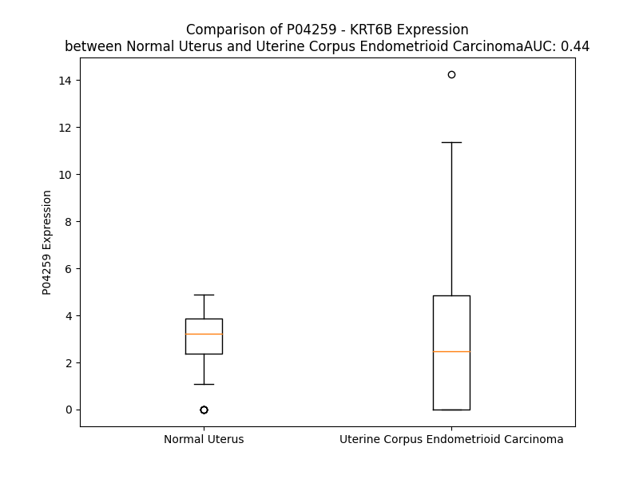

# Detailed Data for P04259

## Introduction to the Detailed Summary

### How to Interpret the Results

- **Summary & Metrics**: This section provides a quick reference to essential protein attributes, including expression changes, family classification, and biomarker applications. Regulation status (upregulated/downregulated) indicates the protein's behavior in a disease context. Some information comes from the original excel file with the proteins selected from literature, while others are derived from the analyses.
- **Expression Comparison**: A visual representation comparing protein expression between normal and disease states. It highlights significant changes in expression levels that might indicate diagnostic or therapeutic relevance. This is data coming from transcriptomics experiments and could not translate similarly to protein levels.
- **Isoform Alignment**: An interactive view of isoform alignments, revealing structural and functional differences between variants of the protein.
- **Interactors & Homologs**: Tables listing known interaction partners and homologous proteins, the more interactors and homologs, the more complex the protein is to design an antibody for.
- **Biological Assemblies**: Information about the structural arrangement of the protein in different assemblies, providing insights into its functional state but also the complexity of the protein to develop antibodies.
- **Combined Per-Residue Information**: A detailed table summarizing residue-level data. This includes predictions for epitope regions, aggregation tendencies, and modifications that might impact the protein's function. Each row corresponds to a residue in the protein, providing insights into specific sites that may be important for research or drug development.
## Summary & Metrics

- **UniProt Accession**: P04259
- **Gene Name**: KRT6B
- **Protein Name**: Keratin, type II cytoskeletal 6B
- **Swiss Prot**: K2C6B_HUMAN
- **Family**: other
- **Biomarker Application**: diagnosis
- **Number of Isoforms**: 0
- **Regulation**: -1
- **(transcriptomics) AUC**: 0.44
- **(transcriptomics) Fold Change**: 1.01
- **(transcriptomics) Regulation**: Downregulated
- **Discotope Epitope Count**: 104
- **Max n_uniprots (Homo)**: N/A
- **Max n_uniprots (Hetero)**: N/A

## Expression Comparison

## Interactors

| preferredName_A   | preferredName_B   |   score |
|:------------------|:------------------|--------:|
| KRT6B             | KRT16             |   0.938 |

## Homologs

| uniprot_id   | gene_id      |
|:-------------|:-------------|
| P05783       | KRT18        |
| Q7RTS7       | KRT74        |
| A0A1B0GVI3   | KRT10        |
| Q7Z3Z0       | KRT25        |
| P08727       | KRT19        |
| P19012       | KRT15        |
| Q03252       | LMNB2        |
| Q2M2I5       | KRT24        |
| P35908       | KRT2         |
| P02533       | KRT14        |
| P08779       | KRT16        |
| A0A0D9SFE5   | LMNB1        |
| Q7Z3Y7       | KRT28        |
| P35527       | KRT9         |
| H0YFE3       | LMNTD1       |
| Q8N1A0       | KRT222       |
| Q14CN4       | KRT72        |
| O76013       | KRT36        |
| Q92764       | KRT35        |
| Q5XKE5       | KRT79        |
| P78386       | KRT85        |
| F8VUG2       | KRT8         |
| O76009       | KRT33A       |
| A0A1X7SCE1   | GFAP         |
| O76011       | KRT34        |
| Q7Z3Y9       | KRT26        |
| P08729       | KRT7         |
| B0YJC4       | VIM          |
| O76015       | KRT38        |
| O76014       | KRT37        |
| O43790       | KRT86        |
| P78385       | KRT83        |
| Q14533       | KRT81        |
| Q7Z3Y8       | KRT27        |
| E7ESP9       | NEFM         |
| Q16352       | INA          |
| Q6KB66       | KRT80        |
| P48681       | NES          |
| P35900       | KRT20        |
| K7EMJ2       | KRT13        |
| O95678       | KRT75        |
| Q04695       | KRT17        |
| Q13515       | BFSP2        |
| J3QR55       | KRT23        |
| Q53SB5       | tmp_locus_29 |
| F8W0C6       | KRT5         |
| Q01546       | KRT76        |
| Q7Z794       | KRT77        |
| Q9NSB2       | KRT84        |
| Q9NSB4       | KRT82        |
| P04264       | KRT1         |
| P07196       | NEFL         |
| Q14532       | KRT32        |
| Q6A162       | KRT40        |
| O15061       | SYNM         |
| Q8N1N4       | KRT78        |
| Q6A163       | KRT39        |
| F8VZR6       | KRT4         |
| Q3SY84       | KRT71        |
| Q14525       | KRT33B       |
| Q15323       | KRT31        |
| A0A6Q8PHQ9   | LMNA         |
| Q99456       | KRT12        |
| P12035       | KRT3         |
| Q86Y46       | KRT73        |
| P41219       | PRPH         |
| P48668       | KRT6C        |
| A0A0S2Z428   | KRT6A        |

## Combined Per-Residue Information

|   res | aa   |   epitope_score | epitope   |   relative_surface_accessibility |   modeling_confidence |   Aggregation | modification    |
|------:|:-----|----------------:|:----------|---------------------------------:|----------------------:|--------------:|:----------------|
|     1 | M    |         0.10377 | False     |                          1.36592 |                 44.78 |         0     | N/A             |
|     2 | A    |         0.10002 | False     |                          0.95539 |                 39.31 |         0     | N-acetylalanine |
|     3 | S    |         0.07346 | False     |                          0.86674 |                 44.34 |         0     | N/A             |
|     4 | T    |         0.10692 | False     |                          0.93634 |                 44.34 |         0     | N/A             |
|     5 | S    |         0.08625 | False     |                          0.78515 |                 38.21 |         0     | N/A             |
|     6 | T    |         0.11058 | False     |                          0.88969 |                 53.23 |         0     | N/A             |
|     7 | T    |         0.08998 | False     |                          0.8163  |                 36.34 |         0     | N/A             |
|     8 | I    |         0.12005 | True      |                          0.96823 |                 52.56 |         0     | N/A             |
|     9 | R    |         0.10978 | False     |                          0.76692 |                 35.97 |         0     | N/A             |
|    10 | S    |         0.10557 | False     |                          0.85332 |                 44.63 |         0     | N/A             |
|    11 | H    |         0.09348 | False     |                          0.79656 |                 38.31 |         0     | N/A             |
|    12 | S    |         0.07584 | False     |                          0.8257  |                 42.53 |         0     | N/A             |
|    13 | S    |         0.10866 | False     |                          0.80813 |                 39.98 |         0     | N/A             |
|    14 | S    |         0.0907  | False     |                          0.78585 |                 36.57 |         0     | N/A             |
|    15 | R    |         0.11686 | True      |                          0.95603 |                 42.81 |         0     | N/A             |
|    16 | R    |         0.20877 | True      |                          0.95748 |                 39.97 |         0     | N/A             |
|    17 | G    |         0.12079 | True      |                          0.75623 |                 37.82 |         0     | N/A             |
|    18 | F    |         0.17233 | True      |                          1.12395 |                 38.74 |         0     | N/A             |
|    19 | S    |         0.08112 | False     |                          0.85544 |                 37.62 |         0     | N/A             |
|    20 | A    |         0.11166 | False     |                          1.02168 |                 37.86 |         0     | N/A             |
|    21 | N    |         0.08499 | False     |                          0.96229 |                 32.71 |         0     | N/A             |
|    22 | S    |         0.06792 | False     |                          0.87693 |                 40.66 |         0     | N/A             |
|    23 | A    |         0.1082  | False     |                          0.97537 |                 39.06 |         0     | N/A             |
|    24 | R    |         0.11013 | False     |                          0.94207 |                 36.52 |         0     | N/A             |
|    25 | L    |         0.10307 | False     |                          1.07706 |                 38.31 |         0     | N/A             |
|    26 | P    |         0.07605 | False     |                          0.85605 |                 39.53 |         0     | N/A             |
|    27 | G    |         0.06182 | False     |                          0.93825 |                 38.38 |         0     | N/A             |
|    28 | V    |         0.06723 | False     |                          0.94748 |                 45.79 |         0     | N/A             |
|    29 | S    |         0.07036 | False     |                          0.90335 |                 40.39 |         0     | N/A             |
|    30 | R    |         0.10674 | False     |                          0.77346 |                 39.6  |         0     | N/A             |
|    31 | S    |         0.0793  | False     |                          0.80646 |                 38.09 |         0     | N/A             |
|    32 | G    |         0.12182 | True      |                          0.90649 |                 43.14 |         0     | N/A             |
|    33 | F    |         0.13543 | True      |                          1.03743 |                 36.41 |         0     | N/A             |
|    34 | S    |         0.0964  | False     |                          0.8781  |                 37.6  |         0     | N/A             |
|    35 | S    |         0.08985 | False     |                          0.88164 |                 40.22 |         0     | N/A             |
|    36 | I    |         0.08674 | False     |                          0.94083 |                 37.17 |         0     | N/A             |
|    37 | S    |         0.16907 | True      |                          0.84504 |                 41.75 |         0     | N/A             |
|    38 | V    |         0.08804 | False     |                          0.94727 |                 40.6  |         0     | N/A             |
|    39 | S    |         0.10548 | False     |                          0.89004 |                 39.58 |         0     | N/A             |
|    40 | R    |         0.1964  | True      |                          0.95795 |                 38    |         0     | N/A             |
|    41 | S    |         0.10011 | False     |                          0.76333 |                 36.86 |         0     | N/A             |
|    42 | R    |         0.16323 | True      |                          0.97328 |                 38.57 |         0     | N/A             |
|    43 | G    |         0.08317 | False     |                          0.99601 |                 35.71 |         0     | N/A             |
|    44 | S    |         0.09706 | False     |                          0.92231 |                 39.01 |         0     | N/A             |
|    45 | G    |         0.12453 | True      |                          0.9969  |                 36.45 |         0     | N/A             |
|    46 | G    |         0.12947 | True      |                          1.01022 |                 33.38 |         0     | N/A             |
|    47 | L    |         0.14126 | True      |                          1.15441 |                 33.7  |         0     | N/A             |
|    48 | G    |         0.13388 | True      |                          0.99915 |                 34.55 |         0     | N/A             |
|    49 | G    |         0.11821 | True      |                          0.93846 |                 34.4  |         0     | N/A             |
|    50 | A    |         0.08966 | False     |                          1.06267 |                 31.54 |         0     | N/A             |
|    51 | C    |         0.06707 | False     |                          0.95753 |                 31.28 |         0     | N/A             |
|    52 | G    |         0.09365 | False     |                          1.02128 |                 32.22 |         0     | N/A             |
|    53 | G    |         0.08595 | False     |                          1.03529 |                 34.61 |         0     | N/A             |
|    54 | A    |         0.08268 | False     |                          0.99369 |                 35.11 |         0     | N/A             |
|    55 | G    |         0.10616 | False     |                          0.79296 |                 34.62 |         0     | N/A             |
|    56 | F    |         0.0819  | False     |                          1.1076  |                 36.74 |         0     | N/A             |
|    57 | G    |         0.09464 | False     |                          1.00827 |                 32.6  |         0     | N/A             |
|    58 | S    |         0.07643 | False     |                          0.88113 |                 33.41 |         0     | N/A             |
|    59 | R    |         0.12946 | True      |                          0.99014 |                 35.64 |         0     | N/A             |
|    60 | S    |         0.06166 | False     |                          0.84247 |                 35.53 |         0     | N/A             |
|    61 | L    |         0.1177  | True      |                          0.863   |                 31.35 |         0     | N/A             |
|    62 | Y    |         0.12121 | True      |                          0.92848 |                 39.04 |         0     | N/A             |
|    63 | G    |         0.08391 | False     |                          0.90197 |                 35.96 |         0     | N/A             |
|    64 | L    |         0.08728 | False     |                          1.12538 |                 40.06 |         0     | N/A             |
|    65 | G    |         0.07455 | False     |                          0.94131 |                 40.16 |         0     | N/A             |
|    66 | G    |         0.08685 | False     |                          0.98146 |                 38.11 |         0     | N/A             |
|    67 | S    |         0.04221 | False     |                          0.7529  |                 37.5  |         0     | N/A             |
|    68 | K    |         0.05784 | False     |                          0.47999 |                 38.01 |         0     | N/A             |
|    69 | R    |         0.06507 | False     |                          0.75939 |                 30.73 |         0     | N/A             |
|    70 | I    |         0.05182 | False     |                          0.7433  |                 33.14 |         0     | N/A             |
|    71 | S    |         0.05803 | False     |                          0.64232 |                 29.98 |         0     | N/A             |
|    72 | I    |         0.10483 | False     |                          1.07625 |                 32.59 |         0     | N/A             |
|    73 | G    |         0.10562 | False     |                          0.87793 |                 30.18 |         0     | N/A             |
|    74 | G    |         0.1312  | True      |                          0.99988 |                 28.43 |         0     | N/A             |
|    75 | G    |         0.10795 | False     |                          0.90406 |                 32.34 |         0     | N/A             |
|    76 | S    |         0.09592 | False     |                          0.90196 |                 30.9  |         0     | N/A             |
|    77 | C    |         0.09426 | False     |                          0.98531 |                 31.2  |         0     | N/A             |
|    78 | A    |         0.07717 | False     |                          0.79708 |                 29.53 |         0     | N/A             |
|    79 | I    |         0.13232 | True      |                          1.00255 |                 33.92 |         0     | N/A             |
|    80 | S    |         0.10202 | False     |                          0.87702 |                 31.45 |         0     | N/A             |
|    81 | G    |         0.10409 | False     |                          0.9903  |                 37.74 |         0     | N/A             |
|    82 | G    |         0.07432 | False     |                          0.79369 |                 34.27 |         0     | N/A             |
|    83 | Y    |         0.15351 | True      |                          1.08073 |                 38.28 |         0     | N/A             |
|    84 | G    |         0.14639 | True      |                          0.88897 |                 35.75 |         0     | N/A             |
|    85 | S    |         0.07918 | False     |                          0.85609 |                 32.51 |         0     | N/A             |
|    86 | R    |         0.16481 | True      |                          0.99183 |                 37.09 |         0     | N/A             |
|    87 | A    |         0.08802 | False     |                          1.04537 |                 33.65 |         0     | N/A             |
|    88 | G    |         0.1043  | False     |                          0.98194 |                 34.91 |         0     | N/A             |
|    89 | G    |         0.09849 | False     |                          0.85671 |                 34.26 |         0     | N/A             |
|    90 | S    |         0.07932 | False     |                          0.73035 |                 29.53 |         0     | N/A             |
|    91 | Y    |         0.1152  | True      |                          0.96475 |                 37.99 |         0     | N/A             |
|    92 | G    |         0.10497 | False     |                          0.8415  |                 32.64 |         0     | N/A             |
|    93 | F    |         0.1143  | False     |                          1.09081 |                 36.94 |         0     | N/A             |
|    94 | G    |         0.10822 | False     |                          0.82106 |                 30.52 |         0     | N/A             |
|    95 | G    |         0.18155 | True      |                          1.00058 |                 34.24 |         0     | N/A             |
|    96 | A    |         0.09603 | False     |                          1.10922 |                 32.11 |         0     | N/A             |
|    97 | G    |         0.14086 | True      |                          0.97339 |                 36.45 |         0     | N/A             |
|    98 | S    |         0.11029 | False     |                          0.91855 |                 33.23 |         0     | N/A             |
|    99 | G    |         0.14371 | True      |                          0.72287 |                 35.2  |         0     | N/A             |
|   100 | F    |         0.08448 | False     |                          0.99951 |                 34.17 |         0     | N/A             |
|   101 | G    |         0.09848 | False     |                          0.87148 |                 31.27 |         0     | N/A             |
|   102 | F    |         0.15355 | True      |                          1.03865 |                 36.14 |         0     | N/A             |
|   103 | G    |         0.11875 | True      |                          0.93045 |                 32.22 |         0     | N/A             |
|   104 | G    |         0.10277 | False     |                          1.00119 |                 35.99 |         0     | N/A             |
|   105 | G    |         0.07186 | False     |                          0.92238 |                 35.81 |         0     | N/A             |
|   106 | A    |         0.06682 | False     |                          1.07408 |                 30.54 |         0     | N/A             |
|   107 | G    |         0.13752 | True      |                          0.94312 |                 36.2  |         0     | N/A             |
|   108 | I    |         0.12934 | True      |                          0.98781 |                 29.99 |         0.372 | N/A             |
|   109 | G    |         0.20425 | True      |                          0.93135 |                 39.49 |         0.372 | N/A             |
|   110 | F    |         0.08305 | False     |                          1.0227  |                 31.19 |         0.372 | N/A             |
|   111 | G    |         0.08641 | False     |                          0.9483  |                 37.37 |         0.372 | N/A             |
|   112 | L    |         0.14787 | True      |                          1.11223 |                 30.43 |         0.372 | N/A             |
|   113 | G    |         0.11025 | False     |                          0.94115 |                 32.72 |         0     | N/A             |
|   114 | G    |         0.15018 | True      |                          1.02836 |                 34.39 |         0     | N/A             |
|   115 | G    |         0.09679 | False     |                          0.9747  |                 34.61 |         0     | N/A             |
|   116 | A    |         0.06628 | False     |                          1.09328 |                 32.48 |         0     | N/A             |
|   117 | G    |         0.13792 | True      |                          0.93422 |                 35.47 |         0     | N/A             |
|   118 | L    |         0.10832 | False     |                          1.04181 |                 30.38 |         0     | N/A             |
|   119 | A    |         0.10559 | False     |                          0.9355  |                 32.12 |         0     | N/A             |
|   120 | G    |         0.10695 | False     |                          0.96972 |                 33.64 |         0     | N/A             |
|   121 | G    |         0.09259 | False     |                          0.7917  |                 34.73 |         0     | N/A             |
|   122 | F    |         0.11107 | False     |                          1.10829 |                 38.23 |         0     | N/A             |
|   123 | G    |         0.07915 | False     |                          0.93862 |                 38.36 |         0     | N/A             |
|   124 | G    |         0.15258 | True      |                          0.87868 |                 40.09 |         0     | N/A             |
|   125 | P    |         0.07926 | False     |                          0.98481 |                 47.48 |         0     | N/A             |
|   126 | G    |         0.09152 | False     |                          0.81682 |                 36.3  |         0     | N/A             |
|   127 | F    |         0.15173 | True      |                          0.97423 |                 33.86 |         0     | N/A             |
|   128 | P    |         0.11595 | True      |                          0.86004 |                 43.86 |         0     | N/A             |
|   129 | V    |         0.09216 | False     |                          0.9581  |                 36.38 |         0     | N/A             |
|   130 | C    |         0.09266 | False     |                          0.88393 |                 40.05 |         0     | N/A             |
|   131 | P    |         0.10726 | False     |                          0.77469 |                 53.99 |         0     | N/A             |
|   132 | P    |         0.19419 | True      |                          1.01683 |                 44.76 |         0     | N/A             |
|   133 | G    |         0.13565 | True      |                          0.95065 |                 43.14 |         0     | N/A             |
|   134 | G    |         0.07445 | False     |                          0.96133 |                 40.2  |         0     | N/A             |
|   135 | I    |         0.11229 | False     |                          1.09393 |                 43.07 |         0     | N/A             |
|   136 | Q    |         0.10562 | False     |                          0.82996 |                 39.19 |         0     | N/A             |
|   137 | E    |         0.13808 | True      |                          0.85568 |                 45.51 |         0     | N/A             |
|   138 | V    |         0.15165 | True      |                          0.87834 |                 44.71 |         0     | N/A             |
|   139 | T    |         0.06572 | False     |                          0.87115 |                 46.63 |         0     | N/A             |
|   140 | V    |         0.07206 | False     |                          0.97806 |                 50.69 |         0     | N/A             |
|   141 | N    |         0.10119 | False     |                          0.65061 |                 45.82 |         0     | N/A             |
|   142 | Q    |         0.17613 | True      |                          0.77481 |                 56.98 |         0     | N/A             |
|   143 | S    |         0.19794 | True      |                          0.71263 |                 58.64 |         0     | N/A             |
|   144 | L    |         0.11992 | True      |                          0.94364 |                 47.73 |         0     | N/A             |
|   145 | L    |         0.14777 | True      |                          0.87378 |                 47.15 |         0     | N/A             |
|   146 | T    |         0.08058 | False     |                          0.84005 |                 49.12 |         0     | N/A             |
|   147 | P    |         0.11342 | False     |                          0.93607 |                 49.81 |         0     | N/A             |
|   148 | L    |         0.10578 | False     |                          0.94415 |                 41.08 |         0     | N/A             |
|   149 | N    |         0.14042 | True      |                          0.89452 |                 46.11 |         0     | N/A             |
|   150 | L    |         0.1347  | True      |                          0.77664 |                 47.49 |         0     | N/A             |
|   151 | Q    |         0.13346 | True      |                          0.91513 |                 45.72 |         0     | N/A             |
|   152 | I    |         0.05278 | False     |                          0.57074 |                 49.44 |         0     | N/A             |
|   153 | D    |         0.13774 | True      |                          0.44891 |                 48.88 |         0     | N/A             |
|   154 | P    |         0.11668 | True      |                          0.80304 |                 62.24 |         0     | N/A             |
|   155 | A    |         0.06478 | False     |                          0.5066  |                 65.18 |         0     | N/A             |
|   156 | I    |         0.08855 | False     |                          0.53358 |                 62.12 |         0     | N/A             |
|   157 | Q    |         0.08818 | False     |                          0.6394  |                 63.92 |         0     | N/A             |
|   158 | R    |         0.10562 | False     |                          0.65291 |                 73.6  |         0     | N/A             |
|   159 | V    |         0.06105 | False     |                          0.62037 |                 74.74 |         0     | N/A             |
|   160 | R    |         0.08747 | False     |                          0.63127 |                 72.83 |         0     | N/A             |
|   161 | A    |         0.06811 | False     |                          0.51875 |                 75.91 |         0     | N/A             |
|   162 | E    |         0.07482 | False     |                          0.50347 |                 79.75 |         0     | N/A             |
|   163 | E    |         0.06602 | False     |                          0.46092 |                 79.47 |         0     | N/A             |
|   164 | R    |         0.06511 | False     |                          0.67394 |                 80.14 |         0     | N/A             |
|   165 | E    |         0.09882 | False     |                          0.45462 |                 79.8  |         0     | N/A             |
|   166 | Q    |         0.06117 | False     |                          0.63092 |                 78.94 |         0     | N/A             |
|   167 | I    |         0.03001 | False     |                          0.59837 |                 78.35 |         0     | N/A             |
|   168 | K    |         0.05675 | False     |                          0.47393 |                 82.96 |         0     | N/A             |
|   169 | T    |         0.0438  | False     |                          0.4882  |                 82.06 |         0     | N/A             |
|   170 | L    |         0.03693 | False     |                          0.57258 |                 82.61 |         0     | N/A             |
|   171 | N    |         0.03234 | False     |                          0.52774 |                 84.91 |         0     | N/A             |
|   172 | N    |         0.04154 | False     |                          0.6722  |                 86.41 |         0     | N/A             |
|   173 | K    |         0.05409 | False     |                          0.56639 |                 85.38 |         0     | N/A             |
|   174 | F    |         0.04314 | False     |                          0.56699 |                 86.64 |         9.673 | N/A             |
|   175 | A    |         0.05567 | False     |                          0.46014 |                 80.91 |         9.673 | N/A             |
|   176 | S    |         0.04604 | False     |                          0.52214 |                 83.43 |         9.673 | N/A             |
|   177 | F    |         0.03725 | False     |                          0.6668  |                 88.19 |         9.673 | N/A             |
|   178 | I    |         0.04682 | False     |                          0.60424 |                 84.1  |         9.673 | N/A             |
|   179 | D    |         0.03453 | False     |                          0.58107 |                 85.98 |         0     | N/A             |
|   180 | K    |         0.06369 | False     |                          0.64342 |                 88.89 |         0     | N/A             |
|   181 | V    |         0.03328 | False     |                          0.56553 |                 89.2  |         0     | N/A             |
|   182 | R    |         0.06344 | False     |                          0.65902 |                 87.95 |         0     | N/A             |
|   183 | F    |         0.05185 | False     |                          0.60549 |                 90.06 |         0     | N/A             |
|   184 | L    |         0.03217 | False     |                          0.54971 |                 89.5  |         0     | N/A             |
|   185 | E    |         0.06428 | False     |                          0.53143 |                 88.81 |         0     | N/A             |
|   186 | Q    |         0.07082 | False     |                          0.63793 |                 90.43 |         0     | N/A             |
|   187 | Q    |         0.03305 | False     |                          0.42082 |                 91.92 |         0     | N/A             |
|   188 | N    |         0.04864 | False     |                          0.5636  |                 89.67 |         0     | N/A             |
|   189 | K    |         0.06204 | False     |                          0.72842 |                 91.96 |         0     | N/A             |
|   190 | V    |         0.05329 | False     |                          0.67067 |                 91.2  |         0.78  | N/A             |
|   191 | L    |         0.02527 | False     |                          0.65984 |                 90.83 |         0.78  | N/A             |
|   192 | D    |         0.04514 | False     |                          0.56375 |                 90.13 |         0.78  | N/A             |
|   193 | T    |         0.06349 | False     |                          0.5217  |                 89.68 |         0.78  | N/A             |
|   194 | K    |         0.04673 | False     |                          0.58576 |                 89.37 |         0.78  | N/A             |
|   195 | W    |         0.07301 | False     |                          0.71076 |                 86.56 |         1.274 | N/A             |
|   196 | T    |         0.05065 | False     |                          0.55017 |                 85.84 |         1.274 | N/A             |
|   197 | L    |         0.06192 | False     |                          0.69671 |                 84.37 |         1.274 | N/A             |
|   198 | L    |         0.04314 | False     |                          0.60282 |                 82.36 |         1.274 | N/A             |
|   199 | Q    |         0.05631 | False     |                          0.50636 |                 79.23 |         0.494 | N/A             |
|   200 | E    |         0.08591 | False     |                          0.44726 |                 75.55 |         0     | N/A             |
|   201 | Q    |         0.09401 | False     |                          0.60618 |                 67.39 |         0     | N/A             |
|   202 | G    |         0.06622 | False     |                          0.68607 |                 61.7  |         0     | N/A             |
|   203 | T    |         0.09971 | False     |                          0.72753 |                 59.87 |         0     | N/A             |
|   204 | K    |         0.07225 | False     |                          0.66469 |                 55.19 |         0     | N/A             |
|   205 | T    |         0.07599 | False     |                          0.71239 |                 52.58 |         0     | N/A             |
|   206 | V    |         0.0946  | False     |                          0.84899 |                 54.03 |         0     | N/A             |
|   207 | R    |         0.12655 | True      |                          0.89868 |                 57.64 |         0     | N/A             |
|   208 | Q    |         0.1043  | False     |                          0.77219 |                 62.7  |         0     | N/A             |
|   209 | N    |         0.07813 | False     |                          0.55699 |                 73.7  |         0     | N/A             |
|   210 | L    |         0.10366 | False     |                          0.60935 |                 83.52 |         0     | N/A             |
|   211 | E    |         0.05497 | False     |                          0.54075 |                 86.26 |         0     | N/A             |
|   212 | P    |         0.05753 | False     |                          0.57296 |                 88.45 |         0     | N/A             |
|   213 | L    |         0.0694  | False     |                          0.71189 |                 89.18 |         0     | N/A             |
|   214 | F    |         0.06459 | False     |                          0.61991 |                 92.24 |         0     | N/A             |
|   215 | E    |         0.09176 | False     |                          0.51719 |                 93.32 |         0     | N/A             |
|   216 | Q    |         0.05613 | False     |                          0.50054 |                 93.57 |         0     | N/A             |
|   217 | Y    |         0.08427 | False     |                          0.62354 |                 93.9  |         0     | N/A             |
|   218 | I    |         0.06507 | False     |                          0.47156 |                 95.09 |         0     | N/A             |
|   219 | N    |         0.03317 | False     |                          0.37082 |                 96.11 |         0     | N/A             |
|   220 | N    |         0.0471  | False     |                          0.49172 |                 95.77 |         0     | N/A             |
|   221 | L    |         0.07653 | False     |                          0.49017 |                 95.87 |         0     | N/A             |
|   222 | R    |         0.11203 | False     |                          0.58107 |                 96.59 |         0     | N/A             |
|   223 | R    |         0.04947 | False     |                          0.48702 |                 95.34 |         0     | N/A             |
|   224 | Q    |         0.08039 | False     |                          0.46535 |                 96.37 |         0     | N/A             |
|   225 | L    |         0.08583 | False     |                          0.65808 |                 96.21 |         0     | N/A             |
|   226 | D    |         0.04478 | False     |                          0.57376 |                 95.96 |         0     | N/A             |
|   227 | N    |         0.06486 | False     |                          0.65464 |                 95.37 |         0     | N/A             |
|   228 | I    |         0.04035 | False     |                          0.62992 |                 95.46 |         0     | N/A             |
|   229 | V    |         0.05134 | False     |                          0.61636 |                 96.14 |         0     | N/A             |
|   230 | G    |         0.04792 | False     |                          0.53109 |                 94.63 |         0     | N/A             |
|   231 | E    |         0.09698 | False     |                          0.52204 |                 94.72 |         0     | N/A             |
|   232 | R    |         0.11503 | False     |                          0.57699 |                 93.72 |         0     | N/A             |
|   233 | G    |         0.04095 | False     |                          0.43575 |                 92.95 |         0     | N/A             |
|   234 | R    |         0.12803 | True      |                          0.48146 |                 94.98 |         0     | N/A             |
|   235 | L    |         0.06968 | False     |                          0.58491 |                 92.99 |         0     | N/A             |
|   236 | D    |         0.05751 | False     |                          0.2975  |                 92.13 |         0     | N/A             |
|   237 | S    |         0.03044 | False     |                          0.40915 |                 91.92 |         0     | N/A             |
|   238 | E    |         0.06357 | False     |                          0.37949 |                 91.88 |         0     | N/A             |
|   239 | L    |         0.07339 | False     |                          0.62605 |                 88.82 |         0     | N/A             |
|   240 | R    |         0.06441 | False     |                          0.67632 |                 91.39 |         0     | N/A             |
|   241 | N    |         0.03812 | False     |                          0.41347 |                 89.93 |         0     | N/A             |
|   242 | M    |         0.09251 | False     |                          0.57146 |                 89.84 |         0     | N/A             |
|   243 | Q    |         0.09364 | False     |                          0.51327 |                 91.99 |         0     | N/A             |
|   244 | D    |         0.07905 | False     |                          0.45598 |                 89.15 |         0     | N/A             |
|   245 | L    |         0.07983 | False     |                          0.51959 |                 90.94 |         0     | N/A             |
|   246 | V    |         0.04703 | False     |                          0.6785  |                 88.61 |         0     | N/A             |
|   247 | E    |         0.02508 | False     |                          0.40657 |                 91.5  |         0     | N/A             |
|   248 | D    |         0.05282 | False     |                          0.45788 |                 86.32 |         0     | N/A             |
|   249 | L    |         0.04026 | False     |                          0.48967 |                 87.95 |         0     | N/A             |
|   250 | K    |         0.09556 | False     |                          0.44779 |                 91.87 |         0     | N/A             |
|   251 | N    |         0.06225 | False     |                          0.4548  |                 89.43 |         0     | N/A             |
|   252 | K    |         0.07325 | False     |                          0.53441 |                 92.61 |         0     | N/A             |
|   253 | Y    |         0.07296 | False     |                          0.68455 |                 88.26 |         0     | N/A             |
|   254 | E    |         0.04544 | False     |                          0.42449 |                 89.19 |         0     | N/A             |
|   255 | D    |         0.0951  | False     |                          0.47067 |                 88.65 |         0     | N/A             |
|   256 | E    |         0.04649 | False     |                          0.49679 |                 88.57 |         0     | N/A             |
|   257 | I    |         0.0809  | False     |                          0.64981 |                 89.28 |         0     | N/A             |
|   258 | N    |         0.06376 | False     |                          0.61665 |                 89.74 |         0     | N/A             |
|   259 | K    |         0.02918 | False     |                          0.55855 |                 90.48 |         0     | N/A             |
|   260 | R    |         0.06611 | False     |                          0.63927 |                 90.41 |         0     | N/A             |
|   261 | T    |         0.03734 | False     |                          0.4729  |                 89.95 |         0     | N/A             |
|   262 | A    |         0.04401 | False     |                          0.51775 |                 89.09 |         0     | N/A             |
|   263 | A    |         0.05551 | False     |                          0.57307 |                 87.77 |         0     | N/A             |
|   264 | E    |         0.04454 | False     |                          0.40755 |                 88.7  |         0     | N/A             |
|   265 | N    |         0.04824 | False     |                          0.57295 |                 91.5  |         0     | N/A             |
|   266 | E    |         0.07669 | False     |                          0.66175 |                 91.89 |         0     | N/A             |
|   267 | F    |         0.06182 | False     |                          0.69782 |                 90.71 |         0     | N/A             |
|   268 | V    |         0.0523  | False     |                          0.51904 |                 95.09 |         0     | N/A             |
|   269 | T    |         0.05887 | False     |                          0.51715 |                 93.33 |         0     | N/A             |
|   270 | L    |         0.06161 | False     |                          0.42962 |                 93.72 |         0     | N/A             |
|   271 | K    |         0.073   | False     |                          0.58379 |                 96.05 |         0     | N/A             |
|   272 | K    |         0.05914 | False     |                          0.6477  |                 96.69 |         0     | N/A             |
|   273 | D    |         0.04467 | False     |                          0.46386 |                 95.13 |         0     | N/A             |
|   274 | V    |         0.04119 | False     |                          0.62779 |                 96.34 |         0     | N/A             |
|   275 | D    |         0.05539 | False     |                          0.43737 |                 97.23 |         0     | N/A             |
|   276 | A    |         0.03302 | False     |                          0.49322 |                 96.08 |         0     | N/A             |
|   277 | A    |         0.04035 | False     |                          0.58844 |                 95.65 |         0     | N/A             |
|   278 | Y    |         0.06155 | False     |                          0.61502 |                 96.7  |         0     | N/A             |
|   279 | M    |         0.06873 | False     |                          0.60642 |                 96.51 |         0     | N/A             |
|   280 | N    |         0.04193 | False     |                          0.56495 |                 96.65 |         0     | N/A             |
|   281 | K    |         0.04967 | False     |                          0.66284 |                 97.64 |         0     | N/A             |
|   282 | V    |         0.04414 | False     |                          0.48787 |                 97.36 |         0     | N/A             |
|   283 | E    |         0.0263  | False     |                          0.45077 |                 96.35 |         0     | N/A             |
|   284 | L    |         0.04501 | False     |                          0.71644 |                 96.84 |         0     | N/A             |
|   285 | Q    |         0.06022 | False     |                          0.49455 |                 96.81 |         0     | N/A             |
|   286 | A    |         0.05225 | False     |                          0.52011 |                 97.22 |         0     | N/A             |
|   287 | K    |         0.03804 | False     |                          0.53287 |                 97.7  |         0     | N/A             |
|   288 | A    |         0.02665 | False     |                          0.46684 |                 97.64 |         0     | N/A             |
|   289 | D    |         0.0663  | False     |                          0.42601 |                 97.65 |         0     | N/A             |
|   290 | T    |         0.05857 | False     |                          0.63451 |                 97.34 |         0     | N/A             |
|   291 | L    |         0.05058 | False     |                          0.62712 |                 97.42 |         0     | N/A             |
|   292 | T    |         0.02967 | False     |                          0.51681 |                 97.58 |         0     | N/A             |
|   293 | D    |         0.05609 | False     |                          0.6002  |                 97.48 |         0     | N/A             |
|   294 | E    |         0.05467 | False     |                          0.4646  |                 97.47 |         0     | N/A             |
|   295 | I    |         0.04574 | False     |                          0.50474 |                 96.47 |         0     | N/A             |
|   296 | N    |         0.03229 | False     |                          0.4526  |                 97.01 |         0     | N/A             |
|   297 | F    |         0.05893 | False     |                          0.65887 |                 97.39 |         0     | N/A             |
|   298 | L    |         0.0379  | False     |                          0.39487 |                 97.34 |         0     | N/A             |
|   299 | R    |         0.06585 | False     |                          0.60566 |                 96.86 |         0     | N/A             |
|   300 | A    |         0.03794 | False     |                          0.5909  |                 96.91 |         0     | N/A             |
|   301 | L    |         0.09742 | False     |                          0.50346 |                 96.58 |         0     | N/A             |
|   302 | Y    |         0.04653 | False     |                          0.54699 |                 95.57 |         0     | N/A             |
|   303 | D    |         0.04432 | False     |                          0.57375 |                 95.64 |         0     | N/A             |
|   304 | A    |         0.01872 | False     |                          0.56329 |                 93.55 |         0     | N/A             |
|   305 | E    |         0.03647 | False     |                          0.46749 |                 91.94 |         0     | N/A             |
|   306 | L    |         0.05666 | False     |                          0.72756 |                 90.74 |         0     | N/A             |
|   307 | S    |         0.03596 | False     |                          0.52911 |                 89.68 |         0     | N/A             |
|   308 | Q    |         0.02454 | False     |                          0.52399 |                 88.2  |         0     | N/A             |
|   309 | M    |         0.05876 | False     |                          0.5473  |                 86.9  |         0     | N/A             |
|   310 | Q    |         0.0981  | False     |                          0.64684 |                 83.75 |         0     | N/A             |
|   311 | T    |         0.06466 | False     |                          0.57076 |                 81.24 |         0     | N/A             |
|   312 | H    |         0.0521  | False     |                          0.7076  |                 78    |         0     | N/A             |
|   313 | I    |         0.10189 | False     |                          0.66926 |                 70.88 |         0     | N/A             |
|   314 | S    |         0.07654 | False     |                          0.57449 |                 62.49 |         0     | N/A             |
|   315 | D    |         0.08116 | False     |                          0.73717 |                 57.17 |         0     | N/A             |
|   316 | T    |         0.05667 | False     |                          0.7081  |                 56.23 |         1.238 | N/A             |
|   317 | S    |         0.13012 | True      |                          0.70521 |                 47.05 |         1.238 | N/A             |
|   318 | V    |         0.08901 | False     |                          0.66815 |                 52.74 |         3.592 | N/A             |
|   319 | V    |         0.12159 | True      |                          1.02074 |                 54.45 |         3.592 | N/A             |
|   320 | L    |         0.14154 | True      |                          0.72565 |                 50.84 |         3.592 | N/A             |
|   321 | S    |         0.10926 | False     |                          0.8102  |                 48.45 |         2.354 | N/A             |
|   322 | M    |         0.11531 | True      |                          0.75718 |                 54.29 |         2.354 | N/A             |
|   323 | D    |         0.11188 | False     |                          0.84281 |                 42.25 |         0     | N/A             |
|   324 | N    |         0.11253 | False     |                          0.64753 |                 47.4  |         0     | N/A             |
|   325 | N    |         0.12537 | True      |                          0.97104 |                 48.08 |         0     | N/A             |
|   326 | R    |         0.10227 | False     |                          0.7384  |                 55.39 |         0     | N/A             |
|   327 | N    |         0.1451  | True      |                          1.03308 |                 56.83 |         0     | N/A             |
|   328 | L    |         0.0662  | False     |                          0.60975 |                 59.88 |         0     | N/A             |
|   329 | D    |         0.10376 | False     |                          0.55982 |                 71.45 |         0     | N/A             |
|   330 | L    |         0.08688 | False     |                          0.68931 |                 73.51 |         0     | N/A             |
|   331 | D    |         0.06723 | False     |                          0.74422 |                 84.25 |         0     | N/A             |
|   332 | S    |         0.0743  | False     |                          0.47231 |                 85.47 |         0     | N/A             |
|   333 | I    |         0.03592 | False     |                          0.46318 |                 84.91 |         0     | N/A             |
|   334 | I    |         0.08438 | False     |                          0.47396 |                 86.96 |         0     | N/A             |
|   335 | A    |         0.05619 | False     |                          0.54747 |                 90.92 |         0     | N/A             |
|   336 | E    |         0.01919 | False     |                          0.5644  |                 90.37 |         0     | N/A             |
|   337 | V    |         0.0227  | False     |                          0.52529 |                 91.85 |         0     | N/A             |
|   338 | K    |         0.04502 | False     |                          0.658   |                 92.18 |         0     | N/A             |
|   339 | A    |         0.039   | False     |                          0.57133 |                 92.96 |         0     | N/A             |
|   340 | Q    |         0.04901 | False     |                          0.51719 |                 92.68 |         0     | N/A             |
|   341 | Y    |         0.05677 | False     |                          0.70236 |                 91.68 |         0     | N/A             |
|   342 | E    |         0.03667 | False     |                          0.49788 |                 93.18 |         0     | N/A             |
|   343 | E    |         0.0205  | False     |                          0.47453 |                 93.03 |         0     | N/A             |
|   344 | I    |         0.02702 | False     |                          0.62213 |                 92.05 |         0     | N/A             |
|   345 | A    |         0.02726 | False     |                          0.54062 |                 91.37 |         0     | N/A             |
|   346 | Q    |         0.02497 | False     |                          0.53347 |                 94.36 |         0     | N/A             |
|   347 | R    |         0.03836 | False     |                          0.55391 |                 93.98 |         0     | N/A             |
|   348 | S    |         0.03719 | False     |                          0.50587 |                 91.86 |         0     | N/A             |
|   349 | R    |         0.07051 | False     |                          0.65128 |                 93.63 |         0     | N/A             |
|   350 | A    |         0.03181 | False     |                          0.52973 |                 94.24 |         0     | N/A             |
|   351 | E    |         0.03978 | False     |                          0.53774 |                 92.15 |         0     | N/A             |
|   352 | A    |         0.01747 | False     |                          0.41417 |                 92.37 |         0     | N/A             |
|   353 | E    |         0.03605 | False     |                          0.46521 |                 94.21 |         0     | N/A             |
|   354 | S    |         0.02468 | False     |                          0.49887 |                 92.58 |         0     | N/A             |
|   355 | W    |         0.04321 | False     |                          0.64132 |                 94.11 |         0     | N/A             |
|   356 | Y    |         0.05479 | False     |                          0.65917 |                 93.28 |         0     | N/A             |
|   357 | Q    |         0.03773 | False     |                          0.50092 |                 94.91 |         0     | N/A             |
|   358 | T    |         0.02822 | False     |                          0.50373 |                 94.09 |         0     | N/A             |
|   359 | K    |         0.05242 | False     |                          0.35965 |                 93.97 |         0     | N/A             |
|   360 | Y    |         0.04505 | False     |                          0.63486 |                 93    |         0     | N/A             |
|   361 | E    |         0.01799 | False     |                          0.41793 |                 94.83 |         0     | N/A             |
|   362 | E    |         0.02599 | False     |                          0.41428 |                 92.95 |         0     | N/A             |
|   363 | L    |         0.03657 | False     |                          0.73679 |                 92.38 |         0     | N/A             |
|   364 | Q    |         0.02875 | False     |                          0.58273 |                 92.92 |         0     | N/A             |
|   365 | I    |         0.03334 | False     |                          0.58366 |                 93.62 |         0     | N/A             |
|   366 | T    |         0.03124 | False     |                          0.40381 |                 92.23 |         0     | N/A             |
|   367 | A    |         0.04124 | False     |                          0.61638 |                 91.6  |         0     | N/A             |
|   368 | G    |         0.06162 | False     |                          0.47149 |                 92.95 |         0     | N/A             |
|   369 | R    |         0.0601  | False     |                          0.63182 |                 92.67 |         0     | N/A             |
|   370 | H    |         0.07293 | False     |                          0.66287 |                 93.84 |         0     | N/A             |
|   371 | G    |         0.03131 | False     |                          0.47138 |                 94.15 |         0     | N/A             |
|   372 | D    |         0.03328 | False     |                          0.49722 |                 93.83 |         0     | N/A             |
|   373 | D    |         0.05474 | False     |                          0.48115 |                 95.4  |         0     | N/A             |
|   374 | L    |         0.07093 | False     |                          0.79281 |                 94.09 |         0     | N/A             |
|   375 | R    |         0.13896 | True      |                          0.60351 |                 94.7  |         0     | N/A             |
|   376 | N    |         0.05296 | False     |                          0.45238 |                 94.74 |         0     | N/A             |
|   377 | T    |         0.07389 | False     |                          0.43991 |                 93.91 |         0     | N/A             |
|   378 | K    |         0.06465 | False     |                          0.72789 |                 96.47 |         0     | N/A             |
|   379 | Q    |         0.03511 | False     |                          0.48865 |                 94.83 |         0     | N/A             |
|   380 | E    |         0.0449  | False     |                          0.51186 |                 93.27 |         0     | N/A             |
|   381 | I    |         0.12296 | True      |                          0.62717 |                 93.39 |         0     | N/A             |
|   382 | A    |         0.05244 | False     |                          0.40092 |                 94.71 |         0     | N/A             |
|   383 | E    |         0.07099 | False     |                          0.53799 |                 92.74 |         0     | N/A             |
|   384 | I    |         0.06801 | False     |                          0.61335 |                 93.26 |         0     | N/A             |
|   385 | N    |         0.07888 | False     |                          0.49022 |                 94.2  |         0     | N/A             |
|   386 | R    |         0.10249 | False     |                          0.63582 |                 92.36 |         0     | N/A             |
|   387 | M    |         0.05262 | False     |                          0.51861 |                 91.53 |         0     | N/A             |
|   388 | I    |         0.1025  | False     |                          0.40896 |                 91.64 |         0     | N/A             |
|   389 | Q    |         0.09276 | False     |                          0.54986 |                 92.15 |         0     | N/A             |
|   390 | R    |         0.10492 | False     |                          0.57583 |                 92.26 |         0     | N/A             |
|   391 | L    |         0.03965 | False     |                          0.53232 |                 93.53 |         0     | N/A             |
|   392 | R    |         0.07848 | False     |                          0.55793 |                 92.78 |         0     | N/A             |
|   393 | S    |         0.07029 | False     |                          0.55249 |                 90.33 |         0     | N/A             |
|   394 | E    |         0.0335  | False     |                          0.4873  |                 90.34 |         0     | N/A             |
|   395 | I    |         0.06473 | False     |                          0.55392 |                 89.49 |         0     | N/A             |
|   396 | D    |         0.13873 | True      |                          0.39229 |                 91.04 |         0     | N/A             |
|   397 | H    |         0.05022 | False     |                          0.57351 |                 89.37 |         0     | N/A             |
|   398 | V    |         0.03521 | False     |                          0.51507 |                 87.99 |         0     | N/A             |
|   399 | K    |         0.08132 | False     |                          0.58898 |                 91.23 |         0     | N/A             |
|   400 | K    |         0.05551 | False     |                          0.68306 |                 90.54 |         0     | N/A             |
|   401 | Q    |         0.04945 | False     |                          0.43683 |                 87.6  |         0     | N/A             |
|   402 | C    |         0.06071 | False     |                          0.46212 |                 86.47 |         0     | N/A             |
|   403 | A    |         0.07069 | False     |                          0.50911 |                 88.02 |         0     | N/A             |
|   404 | N    |         0.04967 | False     |                          0.66288 |                 86.11 |         0     | N/A             |
|   405 | L    |         0.04386 | False     |                          0.69636 |                 85.11 |         0     | N/A             |
|   406 | Q    |         0.05847 | False     |                          0.62865 |                 89.67 |         0     | N/A             |
|   407 | A    |         0.05185 | False     |                          0.5662  |                 86.93 |         0     | N/A             |
|   408 | A    |         0.0374  | False     |                          0.53797 |                 83.54 |         0     | N/A             |
|   409 | I    |         0.05689 | False     |                          0.34638 |                 82.21 |         0     | N/A             |
|   410 | A    |         0.06295 | False     |                          0.53431 |                 88    |         0     | N/A             |
|   411 | D    |         0.0706  | False     |                          0.42517 |                 85.4  |         0     | N/A             |
|   412 | A    |         0.03031 | False     |                          0.51994 |                 82.15 |         0     | N/A             |
|   413 | E    |         0.05103 | False     |                          0.49495 |                 86.42 |         0     | N/A             |
|   414 | Q    |         0.10182 | False     |                          0.60058 |                 89.7  |         0     | N/A             |
|   415 | R    |         0.13974 | True      |                          0.60373 |                 83.46 |         0     | N/A             |
|   416 | G    |         0.03564 | False     |                          0.38832 |                 86.67 |         0     | N/A             |
|   417 | E    |         0.13176 | True      |                          0.45089 |                 90.75 |         0     | N/A             |
|   418 | M    |         0.13707 | True      |                          0.59244 |                 87.9  |         0     | N/A             |
|   419 | A    |         0.05766 | False     |                          0.5638  |                 89.34 |         0     | N/A             |
|   420 | L    |         0.08561 | False     |                          0.7113  |                 90.25 |         0     | N/A             |
|   421 | K    |         0.14227 | True      |                          0.43827 |                 94.05 |         0     | N/A             |
|   422 | D    |         0.07546 | False     |                          0.41432 |                 92.59 |         0     | N/A             |
|   423 | A    |         0.04457 | False     |                          0.50119 |                 91.66 |         0     | N/A             |
|   424 | K    |         0.08496 | False     |                          0.69669 |                 94.62 |         0     | N/A             |
|   425 | N    |         0.13825 | True      |                          0.6331  |                 94.31 |         0     | N/A             |
|   426 | K    |         0.09069 | False     |                          0.6087  |                 93.63 |         0     | N/A             |
|   427 | L    |         0.05812 | False     |                          0.63417 |                 91.46 |         0     | N/A             |
|   428 | E    |         0.09763 | False     |                          0.59869 |                 94.01 |         0     | N/A             |
|   429 | G    |         0.12033 | True      |                          0.49028 |                 93.05 |         0     | N/A             |
|   430 | L    |         0.05795 | False     |                          0.77832 |                 91.52 |         0     | N/A             |
|   431 | E    |         0.04885 | False     |                          0.53803 |                 94.53 |         0     | N/A             |
|   432 | D    |         0.15923 | True      |                          0.43422 |                 95.18 |         0     | N/A             |
|   433 | A    |         0.07484 | False     |                          0.49357 |                 93.81 |         0     | N/A             |
|   434 | L    |         0.08133 | False     |                          0.538   |                 92.01 |         0     | N/A             |
|   435 | Q    |         0.1124  | False     |                          0.47555 |                 95.36 |         0     | N/A             |
|   436 | K    |         0.07545 | False     |                          0.5555  |                 95.3  |         0     | N/A             |
|   437 | A    |         0.0516  | False     |                          0.57557 |                 93.08 |         0     | N/A             |
|   438 | K    |         0.05554 | False     |                          0.44637 |                 95.1  |         0     | N/A             |
|   439 | Q    |         0.11384 | False     |                          0.52896 |                 95.74 |         0     | N/A             |
|   440 | D    |         0.08877 | False     |                          0.40858 |                 94.71 |         0     | N/A             |
|   441 | L    |         0.08017 | False     |                          0.6343  |                 92.54 |         0     | N/A             |
|   442 | A    |         0.08325 | False     |                          0.5728  |                 93.14 |         0     | N/A             |
|   443 | R    |         0.1493  | True      |                          0.5203  |                 94.47 |         0     | N/A             |
|   444 | L    |         0.095   | False     |                          0.6748  |                 93.81 |         0     | N/A             |
|   445 | L    |         0.14954 | True      |                          0.67685 |                 94.08 |         0     | N/A             |
|   446 | K    |         0.08235 | False     |                          0.60176 |                 94.25 |         0     | N/A             |
|   447 | E    |         0.0661  | False     |                          0.43968 |                 94.21 |         0     | N/A             |
|   448 | Y    |         0.07364 | False     |                          0.59086 |                 93.23 |         0     | N/A             |
|   449 | Q    |         0.09957 | False     |                          0.49488 |                 93.27 |         0     | N/A             |
|   450 | E    |         0.08904 | False     |                          0.40683 |                 93.27 |         0     | N/A             |
|   451 | L    |         0.04387 | False     |                          0.71096 |                 94.17 |         0     | N/A             |
|   452 | M    |         0.07901 | False     |                          0.36376 |                 93.03 |         0     | N/A             |
|   453 | N    |         0.09099 | False     |                          0.50909 |                 93.43 |         0     | N/A             |
|   454 | V    |         0.05174 | False     |                          0.58825 |                 93.9  |         0.058 | N/A             |
|   455 | K    |         0.06047 | False     |                          0.5121  |                 94.04 |         0.058 | N/A             |
|   456 | L    |         0.09676 | False     |                          0.58747 |                 93.86 |         0.058 | N/A             |
|   457 | A    |         0.06114 | False     |                          0.4927  |                 92.27 |         0.058 | N/A             |
|   458 | L    |         0.05804 | False     |                          0.5383  |                 92.37 |         0.058 | N/A             |
|   459 | D    |         0.06867 | False     |                          0.36479 |                 92.94 |         0.058 | N/A             |
|   460 | V    |         0.07723 | False     |                          0.68168 |                 90.24 |         0.058 | N/A             |
|   461 | E    |         0.05602 | False     |                          0.42661 |                 91.16 |         0     | N/A             |
|   462 | I    |         0.05312 | False     |                          0.48718 |                 87.8  |         0     | N/A             |
|   463 | A    |         0.05962 | False     |                          0.52936 |                 89.07 |         0     | N/A             |
|   464 | T    |         0.07742 | False     |                          0.4956  |                 86.02 |         0     | N/A             |
|   465 | Y    |         0.03847 | False     |                          0.61239 |                 87.61 |         0     | N/A             |
|   466 | R    |         0.09417 | False     |                          0.60551 |                 86.8  |         0     | N/A             |
|   467 | K    |         0.07396 | False     |                          0.77204 |                 84.6  |         0     | N/A             |
|   468 | L    |         0.08259 | False     |                          0.73793 |                 81.22 |         0     | N/A             |
|   469 | L    |         0.0525  | False     |                          0.64853 |                 77.64 |         0     | N/A             |
|   470 | E    |         0.11135 | False     |                          0.49892 |                 74.1  |         0     | N/A             |
|   471 | G    |         0.03574 | False     |                          0.43082 |                 67.83 |         0     | N/A             |
|   472 | E    |         0.04629 | False     |                          0.44841 |                 60.34 |         0     | N/A             |
|   473 | E    |         0.07032 | False     |                          0.47252 |                 54.53 |         0     | N/A             |
|   474 | C    |         0.0638  | False     |                          0.77491 |                 55    |         0     | N/A             |
|   475 | R    |         0.13171 | True      |                          0.66353 |                 57.14 |         0     | N/A             |
|   476 | L    |         0.06777 | False     |                          0.71776 |                 52.36 |         0     | N/A             |
|   477 | N    |         0.14228 | True      |                          0.8133  |                 50.82 |         0     | N/A             |
|   478 | G    |         0.1033  | False     |                          0.80963 |                 49    |         0     | N/A             |
|   479 | E    |         0.19303 | True      |                          0.80421 |                 40.24 |         0     | N/A             |
|   480 | G    |         0.11695 | True      |                          0.85217 |                 36.22 |         0     | N/A             |
|   481 | V    |         0.05477 | False     |                          1.11667 |                 44.25 |         0     | N/A             |
|   482 | G    |         0.06984 | False     |                          0.66065 |                 43.13 |         0     | N/A             |
|   483 | Q    |         0.08199 | False     |                          0.93723 |                 36.76 |         0.198 | N/A             |
|   484 | V    |         0.1559  | True      |                          0.87422 |                 46.35 |         6.087 | N/A             |
|   485 | N    |         0.1014  | False     |                          0.94721 |                 38.3  |         6.519 | N/A             |
|   486 | I    |         0.16802 | True      |                          0.84931 |                 49.22 |         7.331 | N/A             |
|   487 | S    |         0.10545 | False     |                          0.85407 |                 34.96 |         7.331 | N/A             |
|   488 | V    |         0.10497 | False     |                          0.96939 |                 46.12 |         7.609 | N/A             |
|   489 | V    |         0.12822 | True      |                          0.93052 |                 39.75 |         7.176 | N/A             |
|   490 | Q    |         0.13199 | True      |                          0.78816 |                 31.84 |         1.461 | N/A             |
|   491 | S    |         0.16681 | True      |                          0.79929 |                 42    |         0.826 | N/A             |
|   492 | T    |         0.10344 | False     |                          0.79201 |                 35.07 |         0.826 | N/A             |
|   493 | V    |         0.1313  | True      |                          1.05578 |                 41.88 |         0.826 | N/A             |
|   494 | S    |         0.12458 | True      |                          0.88475 |                 33.87 |         0     | N/A             |
|   495 | S    |         0.14457 | True      |                          0.68185 |                 38.94 |         0     | N/A             |
|   496 | G    |         0.14832 | True      |                          0.94755 |                 34.99 |         0     | N/A             |
|   497 | Y    |         0.17266 | True      |                          0.86827 |                 41.61 |         0     | N/A             |
|   498 | G    |         0.10768 | False     |                          0.98803 |                 36.56 |         0     | N/A             |
|   499 | G    |         0.1677  | True      |                          0.96985 |                 32.68 |         0     | N/A             |
|   500 | A    |         0.07132 | False     |                          0.94023 |                 36.08 |         0     | N/A             |
|   501 | S    |         0.07864 | False     |                          0.85701 |                 37.15 |         0     | N/A             |
|   502 | G    |         0.08228 | False     |                          0.93449 |                 33.39 |         0     | N/A             |
|   503 | V    |         0.10609 | False     |                          1.05956 |                 37.03 |         0     | N/A             |
|   504 | G    |         0.09667 | False     |                          0.9342  |                 33.41 |         0     | N/A             |
|   505 | S    |         0.12094 | True      |                          0.94299 |                 37.92 |         0     | N/A             |
|   506 | G    |         0.0821  | False     |                          0.86584 |                 35.99 |         0     | N/A             |
|   507 | L    |         0.09888 | False     |                          1.15756 |                 35.16 |         0     | N/A             |
|   508 | G    |         0.11381 | False     |                          0.77795 |                 34.54 |         0     | N/A             |
|   509 | L    |         0.10312 | False     |                          0.67369 |                 36.94 |         0     | N/A             |
|   510 | G    |         0.07722 | False     |                          0.69772 |                 35.7  |         0     | N/A             |
|   511 | G    |         0.08978 | False     |                          0.65004 |                 36.35 |         0     | N/A             |
|   512 | G    |         0.08353 | False     |                          0.90351 |                 38.31 |         0     | N/A             |
|   513 | S    |         0.07082 | False     |                          0.91802 |                 34.8  |         0     | N/A             |
|   514 | S    |         0.07888 | False     |                          0.80549 |                 33.1  |         0     | N/A             |
|   515 | Y    |         0.12247 | True      |                          0.93704 |                 35.82 |         0     | N/A             |
|   516 | S    |         0.09315 | False     |                          0.66306 |                 31.87 |         0     | N/A             |
|   517 | Y    |         0.09429 | False     |                          0.93807 |                 36.87 |         0     | N/A             |
|   518 | G    |         0.08593 | False     |                          0.96524 |                 36.48 |         0     | N/A             |
|   519 | S    |         0.15041 | True      |                          0.96125 |                 35.29 |         0     | N/A             |
|   520 | G    |         0.15874 | True      |                          0.98814 |                 39.24 |         0     | N/A             |
|   521 | L    |         0.20816 | True      |                          1.1312  |                 32.95 |         0     | N/A             |
|   522 | G    |         0.12481 | True      |                          0.88382 |                 36.38 |         0     | N/A             |
|   523 | V    |         0.13126 | True      |                          1.09713 |                 33.3  |         0     | N/A             |
|   524 | G    |         0.16634 | True      |                          0.90164 |                 35.28 |         0     | N/A             |
|   525 | G    |         0.16826 | True      |                          0.99727 |                 32.74 |         0     | N/A             |
|   526 | G    |         0.11147 | False     |                          0.9135  |                 35.57 |         0     | N/A             |
|   527 | F    |         0.12405 | True      |                          1.06225 |                 31.71 |         0     | N/A             |
|   528 | S    |         0.08531 | False     |                          0.88101 |                 36.84 |         0     | N/A             |
|   529 | S    |         0.13461 | True      |                          0.93363 |                 36.85 |         0     | N/A             |
|   530 | S    |         0.07291 | False     |                          0.91221 |                 37.31 |         0     | N/A             |
|   531 | S    |         0.12501 | True      |                          0.86388 |                 38.62 |         0     | N/A             |
|   532 | G    |         0.0928  | False     |                          0.99368 |                 41.6  |         0     | N/A             |
|   533 | R    |         0.13501 | True      |                          0.9489  |                 39.62 |         0     | N/A             |
|   534 | A    |         0.11403 | False     |                          0.99781 |                 38.37 |         0     | N/A             |
|   535 | T    |         0.13389 | True      |                          0.97561 |                 39.88 |         0     | N/A             |
|   536 | G    |         0.06049 | False     |                          0.98962 |                 39.28 |         0     | N/A             |
|   537 | G    |         0.07841 | False     |                          1.02299 |                 35.86 |         0     | N/A             |
|   538 | G    |         0.05585 | False     |                          0.83766 |                 42.55 |         0     | N/A             |
|   539 | L    |         0.08752 | False     |                          1.03261 |                 36.93 |         0     | N/A             |
|   540 | S    |         0.0552  | False     |                          0.88416 |                 38.7  |         0     | N/A             |
|   541 | S    |         0.07424 | False     |                          0.83554 |                 40.17 |         0     | N/A             |
|   542 | V    |         0.16614 | True      |                          1.11647 |                 37.14 |         0     | N/A             |
|   543 | G    |         0.0796  | False     |                          0.88526 |                 37.28 |         0     | N/A             |
|   544 | G    |         0.07405 | False     |                          1.05943 |                 38.01 |         0     | N/A             |
|   545 | G    |         0.08083 | False     |                          0.9471  |                 39.36 |         0     | N/A             |
|   546 | S    |         0.09009 | False     |                          0.92573 |                 39.33 |         0     | N/A             |
|   547 | S    |         0.06511 | False     |                          0.81387 |                 45.21 |         0     | N/A             |
|   548 | T    |         0.039   | False     |                          0.83388 |                 42.22 |         0     | N/A             |
|   549 | I    |         0.08435 | False     |                          0.93391 |                 47.61 |         0     | N/A             |
|   550 | K    |         0.08271 | False     |                          0.71207 |                 40.13 |         0     | N/A             |
|   551 | Y    |         0.07935 | False     |                          0.86173 |                 41.74 |         0     | N/A             |
|   552 | T    |         0.09261 | False     |                          0.93289 |                 45.36 |         0     | N/A             |
|   553 | T    |         0.11364 | False     |                          0.83273 |                 38.24 |         0     | N/A             |
|   554 | T    |         0.11573 | True      |                          0.97592 |                 47.11 |         0     | N/A             |
|   555 | S    |         0.15584 | True      |                          0.82307 |                 40.4  |         0     | N/A             |
|   556 | S    |         0.06458 | False     |                          0.89254 |                 45.54 |         0     | N/A             |
|   557 | S    |         0.11227 | False     |                          0.76036 |                 47.24 |         0     | N/A             |
|   558 | S    |         0.06311 | False     |                          0.80519 |                 48.59 |         0     | N/A             |
|   559 | R    |         0.08868 | False     |                          0.93609 |                 51.03 |         0     | N/A             |
|   560 | K    |         0.10614 | False     |                          0.95873 |                 52.83 |         0     | N/A             |
|   561 | S    |         0.09869 | False     |                          0.74551 |                 54.28 |         0     | N/A             |
|   562 | Y    |         0.11706 | True      |                          0.89777 |                 49.8  |         0     | N/A             |
|   563 | K    |         0.08616 | False     |                          0.87413 |                 59.02 |         0     | N/A             |
|   564 | H    |         0.07944 | False     |                          1.3262  |                 54.5  |         0     | N/A             |

