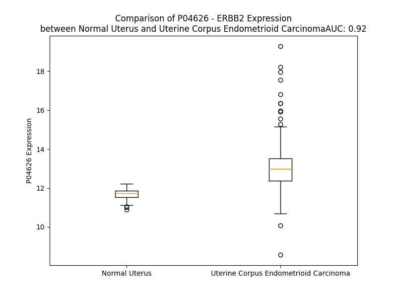

# Detailed Data for P04626

## Introduction to the Detailed Summary

### How to Interpret the Results

- **Summary & Metrics**: This section provides a quick reference to essential protein attributes, including expression changes, family classification, and biomarker applications. Regulation status (upregulated/downregulated) indicates the protein's behavior in a disease context. Some information comes from the original excel file with the proteins selected from literature, while others are derived from the analyses.
- **Expression Comparison**: A visual representation comparing protein expression between normal and disease states. It highlights significant changes in expression levels that might indicate diagnostic or therapeutic relevance. This is data coming from transcriptomics experiments and could not translate similarly to protein levels.
- **Isoform Alignment**: An interactive view of isoform alignments, revealing structural and functional differences between variants of the protein.
- **Interactors & Homologs**: Tables listing known interaction partners and homologous proteins, the more interactors and homologs, the more complex the protein is to design an antibody for.
- **Biological Assemblies**: Information about the structural arrangement of the protein in different assemblies, providing insights into its functional state but also the complexity of the protein to develop antibodies.
- **Combined Per-Residue Information**: A detailed table summarizing residue-level data. This includes predictions for epitope regions, aggregation tendencies, and modifications that might impact the protein's function. Each row corresponds to a residue in the protein, providing insights into specific sites that may be important for research or drug development.
## Summary & Metrics

- **UniProt Accession**: P04626
- **Gene Name**: ERBB2 (HER2/neu)
- **Protein Name**: Receptor tyrosine-protein kinase erbB-2
- **Swiss Prot**: ERBB2_HUMAN
- **Family**: kinase
- **Biomarker Application**: diagnosis,disease progression,efficacy,prognosis,response to therapy,safety
- **Number of Isoforms**: 0
- **Regulation**: 2
- **(transcriptomics) AUC**: 0.92
- **(transcriptomics) Fold Change**: 1.12
- **(transcriptomics) Regulation**: Upregulated
- **Discotope Epitope Count**: 291
- **Max n_uniprots (Homo)**: 2.0
- **Max n_uniprots (Hetero)**: 5.0

## Expression Comparison

## Interactors

| preferredName_A   | preferredName_B   |   score |
|:------------------|:------------------|--------:|
| ERBB2             | ERBB4             |   0.999 |
| ERBB2             | GRB7              |   0.999 |
| ERBB2             | NRG1              |   0.999 |
| ERBB2             | EGFR              |   0.999 |
| ERBB2             | ERBIN             |   0.999 |
| ERBB2             | GRB2              |   0.999 |
| ERBB2             | SHC1              |   0.999 |
| ERBB2             | ERBB3             |   0.999 |
| ERBB2             | CD44              |   0.999 |
| ERBB2             | SRC               |   0.999 |
| ERBB2             | EGF               |   0.999 |
| ERBB2             | HSP90AA1          |   0.999 |
| ERBB2             | TGFA              |   0.998 |
| ERBB2             | CTNNB1            |   0.998 |
| ERBB2             | MUC4              |   0.996 |
| ERBB2             | PIK3R1            |   0.995 |
| ERBB2             | PLXNB1            |   0.994 |
| ERBB2             | NRG2              |   0.994 |
| ERBB2             | IGF1R             |   0.993 |
| ERBB2             | HSP90AB1          |   0.993 |
| ERBB2             | IGF1              |   0.992 |
| ERBB2             | PIK3CA            |   0.992 |
| ERBB2             | PTK2              |   0.99  |
| ERBB2             | PIK3R2            |   0.985 |
| ERBB2             | STUB1             |   0.982 |
| ERBB2             | PLCG1             |   0.981 |
| ERBB2             | PGR               |   0.98  |
| ERBB2             | MUC1              |   0.979 |
| ERBB2             | PLCG2             |   0.979 |
| ERBB2             | ESR1              |   0.976 |
| ERBB2             | PIK3R3            |   0.975 |
| ERBB2             | PIK3CB            |   0.972 |
| ERBB2             | PTPN11            |   0.971 |
| ERBB2             | CDH1              |   0.97  |
| ERBB2             | KRAS              |   0.966 |
| ERBB2             | JAK2              |   0.966 |
| ERBB2             | INS               |   0.965 |
| ERBB2             | SHC3              |   0.961 |
| ERBB2             | SHC2              |   0.96  |
| ERBB2             | JAK1              |   0.959 |
| ERBB2             | AREG              |   0.959 |
| ERBB2             | DCN               |   0.958 |
| ERBB2             | JAK3              |   0.951 |
| ERBB2             | HSPA4             |   0.951 |
| ERBB2             | STAT3             |   0.948 |
| ERBB2             | GAB1              |   0.948 |
| ERBB2             | SHC4              |   0.946 |
| ERBB2             | TRIM21            |   0.945 |
| ERBB2             | HBEGF             |   0.944 |
| ERBB2             | ITGB4             |   0.944 |

## Homologs

| uniprot_id   | gene_id   |
|:-------------|:----------|
| E7EVR7       | FGFR2     |
| P29317       | EPHA2     |
| P09619       | PDGFRB    |
| E7ER61       | FLT3      |
| F8W9L4       | FGFR3     |
| X5D7M5       | NTRK3     |
| P35968       | KDR       |
| Q8IWU2       | LMTK2     |
| L7RSL3       | FLT1      |
| Q04912       | MST1R     |
| Q96L35       | EPHB4     |
| J3KQG3       | EPHA10    |
| F8VP57       | EPHA5     |
| Q6NVW1       | EPHB2     |
| C9J5X1       | IGF1R     |
| P21709       | EPHA1     |
| P29376       | LTK       |
| E7EQ23       | DDR1      |
| O15146       | MUSK      |
| A0A6Q8PHG5   | NTRK1     |
| P54764       | EPHA4     |
| B5A954       | TEK       |
| P35590       | TIE1      |
| E9PQ40       | FGFR1     |
| H7C3L9       | MERTK     |
| E9PEK4       | CSF1R     |
| H0YNK6       | TYRO3     |
| P34925       | RYK       |
| B5A927       | FLT4      |
| Q16832       | DDR2      |
| D6RJD4       | FGFR4     |
| Q01973       | ROR1      |
| Q01974       | ROR2      |
| P54762       | EPHB1     |
| Q5VWE5       | NTRK2     |
| P30530       | AXL       |
| A0A7P0T9L5   | EPHA7     |
| P08922       | ROS1      |
| Q504U8       | EGFR      |
| E9PDR1       | ERBB4     |
| A0A087WZL3   | ALK       |
| O75812       | ERBB3     |
| A0A087WTE3   | EPHB6     |
| P54753       | EPHB3     |
| H0Y8K5       | EPHA6     |
| P06213       | INSR      |
| P14616       | INSRR     |
| C9JXA2       | EPHA3     |
| E6Y365       | MET       |
| P29322       | EPHA8     |
| P16234       | PDGFRA    |
| A0A8J8Z860   | KIT       |
| A0A087WWB1   | RET       |

## Biological Assemblies

|   Unnamed: 0 |   assembly |   n_uniprots | composition   | crystal_id   |
|-------------:|-----------:|-------------:|:--------------|:-------------|
|            0 |          1 |            2 | Hetero        | 2l4k         |
|            0 |          1 |            2 | Hetero        | 5k33         |
|            0 |          1 |            1 | Homo          | 3be1         |
|            0 |          1 |            1 | Homo          | 4hrl         |
|            0 |          1 |            1 | Homo          | 6lbx         |
|            0 |          1 |            0 | Hetero        | 8jyq         |
|            1 |          2 |            0 | Hetero        | 8jyq         |
|            0 |          1 |            1 | Homo          | 5my6         |
|            0 |          1 |            3 | Hetero        | 8hgo         |
|            0 |          1 |            1 | Homo          | 7pcd         |
|            0 |          1 |            2 | Homo          | 4hrn         |
|            1 |          2 |            1 | Homo          | 4hrn         |
|            2 |          3 |            1 | Homo          | 4hrn         |
|            0 |          1 |            1 | Homo          | 4gfu         |
|            0 |          1 |            1 | Homo          | 1mfl         |
|            0 |          1 |            2 | Hetero        | 4nnd         |
|            1 |          2 |            2 | Hetero        | 4nnd         |
|            2 |          3 |            2 | Hetero        | 4nnd         |
|            3 |          4 |            2 | Hetero        | 4nnd         |
|            0 |          1 |            1 | Homo          | 8ffj         |
|            0 |          1 |            1 | Homo          | 8pwh         |
|            0 |          1 |            1 | Homo          | 3h3b         |
|            1 |          2 |            1 | Homo          | 3h3b         |
|            0 |          1 |            1 | Homo          | 3n85         |
|            0 |          1 |            2 | Homo          | 5ob4         |
|            0 |          1 |            3 | Hetero        | 7mn6         |
|            0 |          1 |            2 | Homo          | 2jwa         |
|            0 |          1 |            1 | Homo          | 3wlw         |
|            1 |          2 |            1 | Homo          | 3wlw         |
|            0 |          1 |            1 | Homo          | 3wsq         |
|            0 |          1 |            5 | Hetero        | 6oge         |
|            0 |          1 |            1 | Homo          | 1n8z         |
|            0 |          1 |            1 | Homo          | 6j71         |
|            0 |          1 |            2 | Hetero        | 5kwg         |
|            0 |          1 |            1 | Homo          | 3rcd         |
|            1 |          2 |            1 | Homo          | 3rcd         |
|            2 |          3 |            1 | Homo          | 3rcd         |
|            3 |          4 |            1 | Homo          | 3rcd         |
|            4 |          5 |            2 | Homo          | 3rcd         |
|            5 |          6 |            2 | Homo          | 3rcd         |
|            0 |          1 |            1 | Homo          | 1s78         |
|            1 |          2 |            1 | Homo          | 1s78         |
|            0 |          1 |            3 | Hetero        | 7mn8         |
|            0 |          1 |            2 | Hetero        | 2ks1         |
|            0 |          1 |            3 | Hetero        | 6bgt         |
|            0 |          1 |            1 | Homo          | 7jxh         |
|            1 |          2 |            1 | Homo          | 7jxh         |
|            2 |          3 |            1 | Homo          | 7jxh         |
|            3 |          4 |            1 | Homo          | 7jxh         |
|            4 |          5 |            1 | Homo          | 7jxh         |
|            5 |          6 |            1 | Homo          | 7jxh         |
|            6 |          7 |            1 | Homo          | 7jxh         |
|            7 |          8 |            1 | Homo          | 7jxh         |
|            0 |          1 |            3 | Hetero        | 8u4k         |
|            0 |          1 |            2 | Homo          | 2n2a         |
|            0 |          1 |            2 | Homo          | 4hrm         |
|            0 |          1 |            1 | Homo          | 2a91         |
|            0 |          1 |            1 | Homo          | 6att         |
|            0 |          1 |            3 | Hetero        | 7mn5         |
|            0 |          1 |            1 | Homo          | 3pp0         |
|            1 |          2 |            1 | Homo          | 3pp0         |
|            0 |          1 |            2 | Hetero        | 1mw4         |
|            0 |          1 |            1 | Homo          | 5o4g         |
|            0 |          1 |            1 | Homo          | 8jyr         |
|            0 |          1 |            2 | Hetero        | 5tqs         |
|            1 |          2 |            2 | Hetero        | 5tqs         |
|            2 |          3 |            2 | Hetero        | 5tqs         |
|            3 |          4 |            2 | Hetero        | 5tqs         |
|            0 |          1 |            3 | Hetero        | 8hgp         |
|            0 |          1 |            3 | Hetero        | 8u4l         |
|            0 |          1 |            1 | Homo          | 8u8x         |
|            0 |          1 |            3 | Hetero        | 1qr1         |
|            1 |          2 |            3 | Hetero        | 1qr1         |
|            0 |          1 |            1 | Homo          | 1mfg         |
|            0 |          1 |            2 | Hetero        | 3mzw         |

## Combined Per-Residue Information

|   res | aa   |   epitope_score | epitope   |   relative_surface_accessibility |   modeling_confidence |   Aggregation | modification                      | glycosylation                   |
|------:|:-----|----------------:|:----------|---------------------------------:|----------------------:|--------------:|:----------------------------------|:--------------------------------|
|     1 | M    |         0.08159 | False     |                          1.16846 |                 42.02 |         0     | N/A                               | N/A                             |
|     2 | E    |         0.14703 | True      |                          0.72747 |                 41.63 |         0.193 | N/A                               | N/A                             |
|     3 | L    |         0.08832 | False     |                          0.90025 |                 42.58 |         0.493 | N/A                               | N/A                             |
|     4 | A    |         0.08339 | False     |                          0.63108 |                 47.37 |         0.493 | N/A                               | N/A                             |
|     5 | A    |         0.05311 | False     |                          0.49268 |                 44.7  |         0.493 | N/A                               | N/A                             |
|     6 | L    |         0.08278 | False     |                          0.7791  |                 45.9  |         0.493 | N/A                               | N/A                             |
|     7 | C    |         0.11623 | True      |                          0.61802 |                 47.94 |         0.493 | N/A                               | N/A                             |
|     8 | R    |         0.19781 | True      |                          0.74284 |                 43.19 |         0.193 | N/A                               | N/A                             |
|     9 | W    |         0.24109 | True      |                          0.82782 |                 46.46 |         6.46  | N/A                               | N/A                             |
|    10 | G    |         0.0703  | False     |                          0.45303 |                 44.83 |         7.541 | N/A                               | N/A                             |
|    11 | L    |         0.18468 | True      |                          0.77204 |                 43.91 |        36.462 | N/A                               | N/A                             |
|    12 | L    |         0.19239 | True      |                          0.7472  |                 40.65 |        36.654 | N/A                               | N/A                             |
|    13 | L    |         0.16635 | True      |                          0.75172 |                 40.48 |        36.654 | N/A                               | N/A                             |
|    14 | A    |         0.1462  | True      |                          0.78353 |                 42.13 |        35.702 | N/A                               | N/A                             |
|    15 | L    |         0.18186 | True      |                          0.88572 |                 39.57 |        34.728 | N/A                               | N/A                             |
|    16 | L    |         0.14811 | True      |                          0.73199 |                 30.47 |         1.401 | N/A                               | N/A                             |
|    17 | P    |         0.09064 | False     |                          0.78648 |                 29.96 |         0     | N/A                               | N/A                             |
|    18 | P    |         0.0768  | False     |                          0.84497 |                 29.16 |         0     | N/A                               | N/A                             |
|    19 | G    |         0.14533 | True      |                          0.87628 |                 26.7  |         0     | N/A                               | N/A                             |
|    20 | A    |         0.09563 | False     |                          0.9779  |                 28.48 |         0     | N/A                               | N/A                             |
|    21 | A    |         0.1023  | True      |                          0.80586 |                 31.83 |         0     | N/A                               | N/A                             |
|    22 | S    |         0.09139 | False     |                          0.74269 |                 48.88 |         0     | N/A                               | N/A                             |
|    23 | T    |         0.0472  | False     |                          0.52099 |                 59.34 |         0     | N/A                               | N/A                             |
|    24 | Q    |         0.03092 | False     |                          0.49596 |                 78.64 |         0     | N/A                               | N/A                             |
|    25 | V    |         0.0311  | False     |                          0.35322 |                 83.33 |         0     | N/A                               | N/A                             |
|    26 | C    |         0.00742 | False     |                          0.02925 |                 86.52 |         0     | N/A                               | N/A                             |
|    27 | T    |         0.01982 | False     |                          0.35258 |                 82.76 |         0     | N/A                               | N/A                             |
|    28 | G    |         0.01804 | False     |                          0.054   |                 86.04 |         0     | N/A                               | N/A                             |
|    29 | T    |         0.00744 | False     |                          0.0214  |                 90.68 |         0     | N/A                               | N/A                             |
|    30 | D    |         0.06691 | False     |                          0.31739 |                 89.85 |         0     | N/A                               | N/A                             |
|    31 | M    |         0.03054 | False     |                          0.03957 |                 90.1  |         0     | N/A                               | N/A                             |
|    32 | K    |         0.06956 | False     |                          0.39135 |                 92.85 |         0     | N/A                               | N/A                             |
|    33 | L    |         0.12903 | True      |                          0.40178 |                 92.74 |         0     | N/A                               | N/A                             |
|    34 | R    |         0.14707 | True      |                          0.51938 |                 89.82 |         0     | N/A                               | N/A                             |
|    35 | L    |         0.15359 | True      |                          0.80806 |                 89.07 |         0     | N/A                               | N/A                             |
|    36 | P    |         0.01354 | False     |                          0.14008 |                 87.93 |         0     | N/A                               | N/A                             |
|    37 | A    |         0.07942 | False     |                          0.37076 |                 83.32 |         0     | N/A                               | N/A                             |
|    38 | S    |         0.04118 | False     |                          0.01843 |                 85.11 |         0     | N/A                               | N/A                             |
|    39 | P    |         0.11394 | True      |                          0.65071 |                 86.8  |         0     | N/A                               | N/A                             |
|    40 | E    |         0.09739 | True      |                          0.56795 |                 86.66 |         0     | N/A                               | N/A                             |
|    41 | T    |         0.02482 | False     |                          0.09997 |                 88.88 |         0     | N/A                               | N/A                             |
|    42 | H    |         0.02094 | False     |                          0.04977 |                 92.44 |         0     | N/A                               | N/A                             |
|    43 | L    |         0.04032 | False     |                          0.23095 |                 93.19 |         0     | N/A                               | N/A                             |
|    44 | D    |         0.04376 | False     |                          0.29801 |                 92.11 |         0     | N/A                               | N/A                             |
|    45 | M    |         0.00745 | False     |                          0.02085 |                 93.22 |         0     | N/A                               | N/A                             |
|    46 | L    |         0.00259 | False     |                          0       |                 94.16 |         0     | N/A                               | N/A                             |
|    47 | R    |         0.04916 | False     |                          0.36799 |                 94.09 |         0     | N/A                               | N/A                             |
|    48 | H    |         0.0494  | False     |                          0.39495 |                 90.21 |         0     | N/A                               | N/A                             |
|    49 | L    |         0.00493 | False     |                          0.00989 |                 90.65 |         0     | N/A                               | N/A                             |
|    50 | Y    |         0.00148 | False     |                          0       |                 93.94 |         0     | N/A                               | N/A                             |
|    51 | Q    |         0.08974 | False     |                          0.50271 |                 92.64 |         0     | N/A                               | N/A                             |
|    52 | G    |         0.01542 | False     |                          0.17158 |                 91.28 |         0     | N/A                               | N/A                             |
|    53 | C    |         0.00329 | False     |                          0       |                 92.85 |         0     | N/A                               | N/A                             |
|    54 | Q    |         0.03556 | False     |                          0.2556  |                 93.76 |         0     | N/A                               | N/A                             |
|    55 | V    |         0.0322  | False     |                          0.16566 |                 92.2  |         0     | N/A                               | N/A                             |
|    56 | V    |         0.00085 | False     |                          0       |                 92.6  |         0     | N/A                               | N/A                             |
|    57 | Q    |         0.01701 | False     |                          0.15964 |                 88.05 |         0     | N/A                               | N/A                             |
|    58 | G    |         0.01262 | False     |                          0.17638 |                 90.13 |         0     | N/A                               | N/A                             |
|    59 | N    |         0.01112 | False     |                          0.01184 |                 95.29 |         0     | N/A                               | N/A                             |
|    60 | L    |         0.00139 | False     |                          0       |                 97.46 |         0     | N/A                               | N/A                             |
|    61 | E    |         0.00451 | False     |                          0       |                 97.32 |         0     | N/A                               | N/A                             |
|    62 | L    |         0.00431 | False     |                          0.00082 |                 96.65 |         0     | N/A                               | N/A                             |
|    63 | T    |         0.00745 | False     |                          0       |                 95.29 |         0     | N/A                               | N/A                             |
|    64 | Y    |         0.03674 | False     |                          0.30418 |                 94.15 |         0     | N/A                               | N/A                             |
|    65 | L    |         0.01063 | False     |                          0.01398 |                 93.8  |         0     | N/A                               | N/A                             |
|    66 | P    |         0.08931 | False     |                          0.56563 |                 91.23 |         0     | N/A                               | N/A                             |
|    67 | T    |         0.10301 | True      |                          0.33646 |                 88.52 |         0     | N/A                               | N/A                             |
|    68 | N    |         0.16883 | True      |                          0.89542 |                 86.41 |         0     | N/A                               | N-linked (GlcNAc...) asparagine |
|    69 | A    |         0.0316  | False     |                          0.12909 |                 89.64 |         0     | N/A                               | N/A                             |
|    70 | S    |         0.08831 | False     |                          0.57152 |                 93.27 |         0     | N/A                               | N/A                             |
|    71 | L    |         0.02231 | False     |                          0.05048 |                 94.95 |         0     | N/A                               | N/A                             |
|    72 | S    |         0.06717 | False     |                          0.50561 |                 94.64 |         0     | N/A                               | N/A                             |
|    73 | F    |         0.0821  | False     |                          0.04568 |                 94.08 |         0     | N/A                               | N/A                             |
|    74 | L    |         0.00208 | False     |                          0.00061 |                 96.03 |         0     | N/A                               | N/A                             |
|    75 | Q    |         0.09679 | True      |                          0.40172 |                 94.16 |         0     | N/A                               | N/A                             |
|    76 | D    |         0.0447  | False     |                          0.27361 |                 95.19 |         0     | N/A                               | N/A                             |
|    77 | I    |         0.00362 | False     |                          0.00118 |                 96.45 |         0     | N/A                               | N/A                             |
|    78 | Q    |         0.01316 | False     |                          0.17776 |                 96.03 |         0     | N/A                               | N/A                             |
|    79 | E    |         0.014   | False     |                          0.13374 |                 95.66 |         0     | N/A                               | N/A                             |
|    80 | V    |         0.00173 | False     |                          0       |                 96.97 |         1.695 | N/A                               | N/A                             |
|    81 | Q    |         0.04465 | False     |                          0.15379 |                 94.46 |         1.832 | N/A                               | N/A                             |
|    82 | G    |         0.00398 | False     |                          0.00161 |                 94.71 |        11.5   | N/A                               | N/A                             |
|    83 | Y    |         0.01569 | False     |                          0.00339 |                 97.69 |        61.251 | N/A                               | N/A                             |
|    84 | V    |         0.00239 | False     |                          0.0007  |                 98.41 |        61.356 | N/A                               | N/A                             |
|    85 | L    |         0.00869 | False     |                          0       |                 98.24 |        61.356 | N/A                               | N/A                             |
|    86 | I    |         0.00488 | False     |                          0.004   |                 97.71 |        61.276 | N/A                               | N/A                             |
|    87 | A    |         0.0083  | False     |                          0       |                 96.57 |        55.135 | N/A                               | N/A                             |
|    88 | H    |         0.09032 | False     |                          0.32742 |                 94.55 |         1.169 | N/A                               | N/A                             |
|    89 | N    |         0.02095 | False     |                          0.00332 |                 94.35 |         0     | N/A                               | N/A                             |
|    90 | Q    |         0.05031 | False     |                          0.25918 |                 91.83 |         0     | N/A                               | N/A                             |
|    91 | V    |         0.04718 | False     |                          0.05522 |                 92.77 |         0     | N/A                               | N/A                             |
|    92 | R    |         0.08204 | False     |                          0.31801 |                 90.93 |         0     | N/A                               | N/A                             |
|    93 | Q    |         0.08273 | False     |                          0.41557 |                 91.6  |         0     | N/A                               | N/A                             |
|    94 | V    |         0.01776 | False     |                          0.01449 |                 94.57 |         0     | N/A                               | N/A                             |
|    95 | P    |         0.04632 | False     |                          0.10338 |                 94.37 |         0     | N/A                               | N/A                             |
|    96 | L    |         0.00333 | False     |                          0.00247 |                 96.09 |         0     | N/A                               | N/A                             |
|    97 | Q    |         0.05686 | False     |                          0.16925 |                 94.59 |         0     | N/A                               | N/A                             |
|    98 | R    |         0.03594 | False     |                          0.45938 |                 95.92 |         0     | N/A                               | N/A                             |
|    99 | L    |         0.00173 | False     |                          0.00247 |                 97.23 |         0     | N/A                               | N/A                             |
|   100 | R    |         0.02856 | False     |                          0.26431 |                 96.43 |         0     | N/A                               | N/A                             |
|   101 | I    |         0.00282 | False     |                          0       |                 96.9  |         0     | N/A                               | N/A                             |
|   102 | V    |         0.00355 | False     |                          0.0019  |                 97.79 |         0     | N/A                               | N/A                             |
|   103 | R    |         0.04786 | False     |                          0.06003 |                 96.15 |         0     | N/A                               | N/A                             |
|   104 | G    |         0.00274 | False     |                          0       |                 94.59 |         0     | N/A                               | N/A                             |
|   105 | T    |         0.03996 | False     |                          0.59895 |                 91.93 |         0     | N/A                               | N/A                             |
|   106 | Q    |         0.05819 | False     |                          0.44382 |                 92.71 |         0     | N/A                               | N/A                             |
|   107 | L    |         0.02874 | False     |                          0.13749 |                 95.68 |         0     | N/A                               | N/A                             |
|   108 | F    |         0.05764 | False     |                          0.03332 |                 95.64 |         0     | N/A                               | N/A                             |
|   109 | E    |         0.22445 | True      |                          0.52336 |                 92.91 |         0     | N/A                               | N/A                             |
|   110 | D    |         0.271   | True      |                          0.74431 |                 89.42 |         0     | N/A                               | N/A                             |
|   111 | N    |         0.18507 | True      |                          0.32515 |                 95.08 |         0     | N/A                               | N/A                             |
|   112 | Y    |         0.05832 | False     |                          0.09752 |                 97.56 |         7.279 | N/A                               | N/A                             |
|   113 | A    |         0.00087 | False     |                          0.00107 |                 97.74 |        12.159 | N/A                               | N/A                             |
|   114 | L    |         0.00308 | False     |                          0.00247 |                 98.3  |        12.159 | N/A                               | N/A                             |
|   115 | A    |         0.02475 | False     |                          0.00219 |                 98.07 |        12.159 | N/A                               | N/A                             |
|   116 | V    |         0.00165 | False     |                          0       |                 97.62 |        12.159 | N/A                               | N/A                             |
|   117 | L    |         0.15143 | True      |                          0.04534 |                 96.15 |        11.032 | N/A                               | N/A                             |
|   118 | D    |         0.13608 | True      |                          0.21307 |                 94.17 |         0     | N/A                               | N/A                             |
|   119 | N    |         0.00688 | False     |                          0       |                 92.14 |         0     | N/A                               | N/A                             |
|   120 | G    |         0.06356 | False     |                          0.06984 |                 82.33 |         0     | N/A                               | N/A                             |
|   121 | D    |         0.12428 | True      |                          0.39991 |                 68.83 |         0     | N/A                               | N/A                             |
|   122 | P    |         0.12655 | True      |                          0.84401 |                 61.52 |         0     | N/A                               | N/A                             |
|   123 | L    |         0.13331 | True      |                          0.53659 |                 57.12 |         0     | N/A                               | N/A                             |
|   124 | N    |         0.18142 | True      |                          0.85611 |                 55.34 |         0     | N/A                               | N-linked (GlcNAc...) asparagine |
|   125 | N    |         0.13293 | True      |                          0.78269 |                 55.57 |         0     | N/A                               | N/A                             |
|   126 | T    |         0.20069 | True      |                          0.79447 |                 60.46 |         0     | N/A                               | N/A                             |
|   127 | T    |         0.09623 | True      |                          0.45627 |                 59.73 |         0     | N/A                               | N/A                             |
|   128 | P    |         0.15995 | True      |                          0.73701 |                 57.36 |         0     | N/A                               | N/A                             |
|   129 | V    |         0.2296  | True      |                          1.0645  |                 58.46 |         0     | N/A                               | N/A                             |
|   130 | T    |         0.33596 | True      |                          0.9279  |                 58.12 |         0     | N/A                               | N/A                             |
|   131 | G    |         0.25685 | True      |                          0.3651  |                 55.46 |         0     | N/A                               | N/A                             |
|   132 | A    |         0.11627 | True      |                          0.89195 |                 60.68 |         0     | N/A                               | N/A                             |
|   133 | S    |         0.10379 | True      |                          0.43879 |                 65.47 |         0     | N/A                               | N/A                             |
|   134 | P    |         0.14639 | True      |                          0.42917 |                 73.14 |         0     | N/A                               | N/A                             |
|   135 | G    |         0.12709 | True      |                          0.21224 |                 76.84 |         0     | N/A                               | N/A                             |
|   136 | G    |         0.00477 | False     |                          0       |                 88.86 |         0     | N/A                               | N/A                             |
|   137 | L    |         0.00153 | False     |                          0       |                 93.47 |         0     | N/A                               | N/A                             |
|   138 | R    |         0.09417 | False     |                          0.2464  |                 92.34 |         0     | N/A                               | N/A                             |
|   139 | E    |         0.04556 | False     |                          0.10858 |                 91.98 |         0     | N/A                               | N/A                             |
|   140 | L    |         0.01783 | False     |                          0.02372 |                 90.7  |         0     | N/A                               | N/A                             |
|   141 | Q    |         0.04179 | False     |                          0.11751 |                 91.84 |         0     | N/A                               | N/A                             |
|   142 | L    |         0.0041  | False     |                          0.00412 |                 95.47 |         0     | N/A                               | N/A                             |
|   143 | R    |         0.10851 | True      |                          0.34964 |                 94.16 |         0     | N/A                               | N/A                             |
|   144 | S    |         0.01619 | False     |                          0.23771 |                 96.23 |         0     | N/A                               | N/A                             |
|   145 | L    |         0.00399 | False     |                          0.01219 |                 97.38 |         0     | N/A                               | N/A                             |
|   146 | T    |         0.01133 | False     |                          0.06699 |                 97.13 |         0     | N/A                               | N/A                             |
|   147 | E    |         0.00127 | False     |                          0       |                 97.39 |         0     | N/A                               | N/A                             |
|   148 | I    |         0.00272 | False     |                          0       |                 97.77 |         0     | N/A                               | N/A                             |
|   149 | L    |         0.03002 | False     |                          0.18874 |                 95.63 |         0     | N/A                               | N/A                             |
|   150 | K    |         0.04839 | False     |                          0.45914 |                 95.97 |         0     | N/A                               | N/A                             |
|   151 | G    |         0.00225 | False     |                          0       |                 95.91 |         0     | N/A                               | N/A                             |
|   152 | G    |         0.00267 | False     |                          0       |                 97.06 |         0     | N/A                               | N/A                             |
|   153 | V    |         0.00254 | False     |                          0       |                 97.97 |         0     | N/A                               | N/A                             |
|   154 | L    |         0.12576 | True      |                          0.05688 |                 97.51 |         0     | N/A                               | N/A                             |
|   155 | I    |         0.00462 | False     |                          0.0016  |                 97.19 |         0     | N/A                               | N/A                             |
|   156 | Q    |         0.24602 | True      |                          0.26465 |                 95.25 |         0     | N/A                               | N/A                             |
|   157 | R    |         0.19208 | True      |                          0.5141  |                 92.69 |         0     | N/A                               | N/A                             |
|   158 | N    |         0.06488 | False     |                          0.02669 |                 93.59 |         0     | N/A                               | N/A                             |
|   159 | P    |         0.10544 | True      |                          0.22864 |                 91.79 |         0     | N/A                               | N/A                             |
|   160 | Q    |         0.04978 | False     |                          0.07737 |                 92.38 |         0     | N/A                               | N/A                             |
|   161 | L    |         0.00195 | False     |                          0       |                 94.83 |         0     | N/A                               | N/A                             |
|   162 | C    |         0.01535 | False     |                          0.0113  |                 94.53 |         0     | N/A                               | N/A                             |
|   163 | Y    |         0.0858  | False     |                          0.03384 |                 95.5  |         0     | N/A                               | N/A                             |
|   164 | Q    |         0.016   | False     |                          0.01816 |                 93.35 |         0     | N/A                               | N/A                             |
|   165 | D    |         0.09446 | False     |                          0.45181 |                 92.82 |         0     | N/A                               | N/A                             |
|   166 | T    |         0.09549 | False     |                          0.28889 |                 95.03 |         4.669 | N/A                               | N/A                             |
|   167 | I    |         0.01336 | False     |                          0.05765 |                 96.43 |        12.517 | N/A                               | N/A                             |
|   168 | L    |         0.07508 | False     |                          0.24318 |                 95.71 |        12.517 | N/A                               | N/A                             |
|   169 | W    |         0.02078 | False     |                          0.07573 |                 95.56 |        12.517 | N/A                               | N/A                             |
|   170 | K    |         0.05959 | False     |                          0.62139 |                 93.88 |        12.517 | N/A                               | N/A                             |
|   171 | D    |         0.01136 | False     |                          0.00441 |                 95.11 |        12.517 | N/A                               | N/A                             |
|   172 | I    |         0.00362 | False     |                          0.008   |                 96.81 |        12.517 | N/A                               | N/A                             |
|   173 | F    |         0.0132  | False     |                          0.03435 |                 96.36 |        12.517 | N/A                               | N/A                             |
|   174 | H    |         0.04406 | False     |                          0.13874 |                 92.38 |         0     | N/A                               | N/A                             |
|   175 | K    |         0.12954 | True      |                          0.68491 |                 86.94 |         0     | N/A                               | N/A                             |
|   176 | N    |         0.07029 | False     |                          0.33878 |                 87.47 |         0     | N/A                               | N/A                             |
|   177 | N    |         0.0573  | False     |                          0.08338 |                 90.24 |         0.18  | N/A                               | N/A                             |
|   178 | Q    |         0.12903 | True      |                          0.80497 |                 83.92 |         0.799 | N/A                               | N/A                             |
|   179 | L    |         0.08935 | False     |                          0.32232 |                 86.42 |        18.077 | N/A                               | N/A                             |
|   180 | A    |         0.05679 | False     |                          0.4461  |                 86.27 |        20.991 | N/A                               | N/A                             |
|   181 | L    |         0.12589 | True      |                          0.53088 |                 89.83 |        20.991 | N/A                               | N/A                             |
|   182 | T    |         0.12615 | True      |                          0.45728 |                 91.89 |        20.991 | Phosphothreonine                  | N/A                             |
|   183 | L    |         0.21123 | True      |                          0.50138 |                 93.31 |        20.991 | N/A                               | N/A                             |
|   184 | I    |         0.14082 | True      |                          0.28399 |                 94.09 |        19.537 | N/A                               | N/A                             |
|   185 | D    |         0.11176 | True      |                          0.20388 |                 90.94 |         0     | N/A                               | N/A                             |
|   186 | T    |         0.10448 | True      |                          0.44113 |                 90.59 |         0     | N/A                               | N/A                             |
|   187 | N    |         0.11429 | True      |                          0.7603  |                 89.07 |         0     | N/A                               | N-linked (GlcNAc...) asparagine |
|   188 | R    |         0.15243 | True      |                          0.29457 |                 87.12 |         0     | N/A                               | N/A                             |
|   189 | S    |         0.22322 | True      |                          0.73053 |                 85.98 |         0     | N/A                               | N/A                             |
|   190 | R    |         0.19674 | True      |                          0.26003 |                 85.75 |         0     | N/A                               | N/A                             |
|   191 | A    |         0.19404 | True      |                          0.89054 |                 89.3  |         0     | N/A                               | N/A                             |
|   192 | C    |         0.17323 | True      |                          0.35506 |                 91.96 |         0     | N/A                               | N/A                             |
|   193 | H    |         0.18131 | True      |                          0.56769 |                 94.07 |         0     | N/A                               | N/A                             |
|   194 | P    |         0.15915 | True      |                          0.85838 |                 93.95 |         0     | N/A                               | N/A                             |
|   195 | C    |         0.15668 | True      |                          0.12027 |                 94.31 |         0     | N/A                               | N/A                             |
|   196 | S    |         0.05558 | False     |                          0.14461 |                 95.42 |         0     | N/A                               | N/A                             |
|   197 | P    |         0.21796 | True      |                          1.04421 |                 93.89 |         0     | N/A                               | N/A                             |
|   198 | M    |         0.08509 | False     |                          0.77052 |                 94.18 |         0     | N/A                               | N/A                             |
|   199 | C    |         0.05653 | False     |                          0.062   |                 92.85 |         0     | N/A                               | N/A                             |
|   200 | K    |         0.11767 | True      |                          0.95434 |                 85.14 |         0     | N/A                               | N/A                             |
|   201 | G    |         0.08869 | False     |                          0.65275 |                 88.73 |         0     | N/A                               | N/A                             |
|   202 | S    |         0.11151 | True      |                          0.60724 |                 93.25 |         0     | N/A                               | N/A                             |
|   203 | R    |         0.11339 | True      |                          0.26724 |                 95.31 |         0     | N/A                               | N/A                             |
|   204 | C    |         0.00241 | False     |                          0       |                 96.54 |         0     | N/A                               | N/A                             |
|   205 | W    |         0.00884 | False     |                          0.0189  |                 95.13 |         0     | N/A                               | N/A                             |
|   206 | G    |         0.0033  | False     |                          0       |                 93.49 |         0     | N/A                               | N/A                             |
|   207 | E    |         0.12559 | True      |                          0.39159 |                 92.81 |         0     | N/A                               | N/A                             |
|   208 | S    |         0.18907 | True      |                          0.36566 |                 93.55 |         0     | N/A                               | N/A                             |
|   209 | S    |         0.18293 | True      |                          0.50629 |                 93.69 |         0     | N/A                               | N/A                             |
|   210 | E    |         0.0854  | False     |                          0.58529 |                 94.37 |         0     | N/A                               | N/A                             |
|   211 | D    |         0.04254 | False     |                          0.04264 |                 94.8  |         0     | N/A                               | N/A                             |
|   212 | C    |         0.06964 | False     |                          0.2328  |                 96.14 |         0     | N/A                               | N/A                             |
|   213 | Q    |         0.04236 | False     |                          0.08078 |                 96.02 |         0     | N/A                               | N/A                             |
|   214 | S    |         0.06583 | False     |                          0.4657  |                 94.26 |         0     | N/A                               | N/A                             |
|   215 | L    |         0.03154 | False     |                          0.29573 |                 94.76 |         0     | N/A                               | N/A                             |
|   216 | T    |         0.03291 | False     |                          0.07045 |                 95.36 |         0     | N/A                               | N/A                             |
|   217 | R    |         0.04283 | False     |                          0.28216 |                 94.29 |         0     | N/A                               | N/A                             |
|   218 | T    |         0.03101 | False     |                          0.42239 |                 93.34 |         0     | N/A                               | N/A                             |
|   219 | V    |         0.08665 | False     |                          0.4093  |                 93.54 |         0     | N/A                               | N/A                             |
|   220 | C    |         0.08357 | False     |                          0.20003 |                 93.26 |         0     | N/A                               | N/A                             |
|   221 | A    |         0.04695 | False     |                          0.19198 |                 90.2  |         0     | N/A                               | N/A                             |
|   222 | G    |         0.18591 | True      |                          0.99341 |                 87.09 |         0     | N/A                               | N/A                             |
|   223 | G    |         0.15122 | True      |                          1.08254 |                 84.39 |         0     | N/A                               | N/A                             |
|   224 | C    |         0.0802  | False     |                          0.29378 |                 88.85 |         0     | N/A                               | N/A                             |
|   225 | A    |         0.06008 | False     |                          0.36589 |                 90.76 |         0     | N/A                               | N/A                             |
|   226 | R    |         0.02508 | False     |                          0.01883 |                 95.16 |         0     | N/A                               | N/A                             |
|   227 | C    |         0.00379 | False     |                          0       |                 95.7  |         0     | N/A                               | N/A                             |
|   228 | K    |         0.1522  | True      |                          0.64985 |                 95.38 |         0     | N/A                               | N/A                             |
|   229 | G    |         0.02774 | False     |                          0.12876 |                 92.56 |         0     | N/A                               | N/A                             |
|   230 | P    |         0.17344 | True      |                          0.63807 |                 92.36 |         0     | N/A                               | N/A                             |
|   231 | L    |         0.18124 | True      |                          0.63887 |                 92.59 |         0     | N/A                               | N/A                             |
|   232 | P    |         0.1775  | True      |                          0.74805 |                 89.78 |         0     | N/A                               | N/A                             |
|   233 | T    |         0.15936 | True      |                          0.77667 |                 92.53 |         0     | N/A                               | N/A                             |
|   234 | D    |         0.09154 | False     |                          0.23177 |                 94.35 |         0     | N/A                               | N/A                             |
|   235 | C    |         0.03688 | False     |                          0.13263 |                 94.8  |         0     | N/A                               | N/A                             |
|   236 | C    |         0.05743 | False     |                          0.13752 |                 95.98 |         0     | N/A                               | N/A                             |
|   237 | H    |         0.03412 | False     |                          0.35776 |                 95.95 |         0     | N/A                               | N/A                             |
|   238 | E    |         0.06571 | False     |                          0.67942 |                 93.74 |         0     | N/A                               | N/A                             |
|   239 | Q    |         0.03404 | False     |                          0.11791 |                 95.31 |         0     | N/A                               | N/A                             |
|   240 | C    |         0.02522 | False     |                          0.02665 |                 95.73 |         0     | N/A                               | N/A                             |
|   241 | A    |         0.00211 | False     |                          0.00638 |                 93.26 |         0     | N/A                               | N/A                             |
|   242 | A    |         0.00262 | False     |                          0.00604 |                 93.82 |         0     | N/A                               | N/A                             |
|   243 | G    |         0.00376 | False     |                          0.00161 |                 95.12 |         0     | N/A                               | N/A                             |
|   244 | C    |         0.01996 | False     |                          0.05399 |                 96.45 |         0     | N/A                               | N/A                             |
|   245 | T    |         0.08983 | False     |                          0.58668 |                 95.92 |         0     | N/A                               | N/A                             |
|   246 | G    |         0.0583  | False     |                          0.19805 |                 92.96 |         0     | N/A                               | N/A                             |
|   247 | P    |         0.10197 | True      |                          0.64911 |                 93.23 |         0     | N/A                               | N/A                             |
|   248 | K    |         0.22008 | True      |                          0.62344 |                 93.49 |         0     | N/A                               | N/A                             |
|   249 | H    |         0.08526 | False     |                          0.37085 |                 92.73 |         0     | N/A                               | N/A                             |
|   250 | S    |         0.12177 | True      |                          0.42971 |                 94.76 |         0     | N/A                               | N/A                             |
|   251 | D    |         0.07777 | False     |                          0.18864 |                 95.97 |         0     | N/A                               | N/A                             |
|   252 | C    |         0.02043 | False     |                          0.18525 |                 95.96 |         0.143 | N/A                               | N/A                             |
|   253 | L    |         0.0214  | False     |                          0.43883 |                 94.85 |         0.421 | N/A                               | N/A                             |
|   254 | A    |         0.01213 | False     |                          0.06505 |                 93.94 |         0.56  | N/A                               | N/A                             |
|   255 | C    |         0.03579 | False     |                          0.05166 |                 94.9  |         0.56  | N/A                               | N/A                             |
|   256 | L    |         0.02488 | False     |                          0.1848  |                 94.35 |         0.56  | N/A                               | N/A                             |
|   257 | H    |         0.05746 | False     |                          0.37143 |                 92.24 |         0.56  | N/A                               | N/A                             |
|   258 | F    |         0.01462 | False     |                          0.19682 |                 92.61 |         0.56  | N/A                               | N/A                             |
|   259 | N    |         0.01943 | False     |                          0.35435 |                 92.67 |         0     | N/A                               | N-linked (GlcNAc...) asparagine |
|   260 | H    |         0.03493 | False     |                          0.18237 |                 92.45 |         0     | N/A                               | N/A                             |
|   261 | S    |         0.09181 | False     |                          0.83383 |                 89.27 |         0     | N/A                               | N/A                             |
|   262 | G    |         0.02805 | False     |                          0.53149 |                 88.02 |         0     | N/A                               | N/A                             |
|   263 | I    |         0.08859 | False     |                          0.39438 |                 93.26 |         0     | N/A                               | N/A                             |
|   264 | C    |         0.08533 | False     |                          0.04831 |                 94.68 |         0     | N/A                               | N/A                             |
|   265 | E    |         0.09498 | False     |                          0.24644 |                 91.23 |         0     | N/A                               | N/A                             |
|   266 | L    |         0.13674 | True      |                          0.52885 |                 90.96 |         0     | N/A                               | N/A                             |
|   267 | H    |         0.13726 | True      |                          0.66804 |                 90.37 |         0     | N/A                               | N/A                             |
|   268 | C    |         0.06698 | False     |                          0.11293 |                 89.87 |         0     | N/A                               | N/A                             |
|   269 | P    |         0.02836 | False     |                          0.23619 |                 89.97 |         0     | N/A                               | N/A                             |
|   270 | A    |         0.05796 | False     |                          0.59847 |                 88.37 |         5.977 | N/A                               | N/A                             |
|   271 | L    |         0.04172 | False     |                          0.2496  |                 87.2  |         5.977 | N/A                               | N/A                             |
|   272 | V    |         0.1704  | True      |                          0.627   |                 83.33 |         5.977 | N/A                               | N/A                             |
|   273 | T    |         0.06765 | False     |                          0.40857 |                 82.81 |         5.977 | N/A                               | N/A                             |
|   274 | Y    |         0.15567 | True      |                          0.48782 |                 76.21 |         5.977 | N/A                               | N/A                             |
|   275 | N    |         0.06321 | False     |                          0.18204 |                 78.8  |         0     | N/A                               | N/A                             |
|   276 | T    |         0.08288 | False     |                          0.57745 |                 79.35 |         0     | N/A                               | N/A                             |
|   277 | D    |         0.15648 | True      |                          0.74742 |                 75.26 |         0     | N/A                               | N/A                             |
|   278 | T    |         0.11222 | True      |                          0.50251 |                 81.11 |         0     | N/A                               | N/A                             |
|   279 | F    |         0.1156  | True      |                          0.60632 |                 73.43 |         0     | N/A                               | N/A                             |
|   280 | E    |         0.13824 | True      |                          0.55558 |                 74.57 |         0     | N/A                               | N/A                             |
|   281 | S    |         0.16942 | True      |                          0.62066 |                 77.16 |         0     | N/A                               | N/A                             |
|   282 | M    |         0.10502 | True      |                          0.43561 |                 77.2  |         0     | N/A                               | N/A                             |
|   283 | P    |         0.11058 | True      |                          0.83801 |                 83.8  |         0     | N/A                               | N/A                             |
|   284 | N    |         0.03215 | False     |                          0.22384 |                 86.54 |         0     | N/A                               | N/A                             |
|   285 | P    |         0.10891 | True      |                          0.88149 |                 85.99 |         0     | N/A                               | N/A                             |
|   286 | E    |         0.06682 | False     |                          0.55391 |                 87.7  |         0     | N/A                               | N/A                             |
|   287 | G    |         0.0198  | False     |                          0.09965 |                 87.35 |         0     | N/A                               | N/A                             |
|   288 | R    |         0.07134 | False     |                          0.1591  |                 92.5  |         0     | N/A                               | N/A                             |
|   289 | Y    |         0.01588 | False     |                          0.19493 |                 92.25 |         0     | N/A                               | N/A                             |
|   290 | T    |         0.04326 | False     |                          0.23383 |                 92.27 |         0     | N/A                               | N/A                             |
|   291 | F    |         0.03476 | False     |                          0.07782 |                 89.47 |         0     | N/A                               | N/A                             |
|   292 | G    |         0.07122 | False     |                          0.49031 |                 85.9  |         0     | N/A                               | N/A                             |
|   293 | A    |         0.02306 | False     |                          0.13216 |                 89.11 |         0     | N/A                               | N/A                             |
|   294 | S    |         0.03584 | False     |                          0.24581 |                 90.21 |         0     | N/A                               | N/A                             |
|   295 | C    |         0.04415 | False     |                          0.09401 |                 91.97 |         0     | N/A                               | N/A                             |
|   296 | V    |         0.06473 | False     |                          0.24087 |                 90.55 |         0     | N/A                               | N/A                             |
|   297 | T    |         0.08665 | False     |                          0.72439 |                 89.92 |         0     | N/A                               | N/A                             |
|   298 | A    |         0.08282 | False     |                          0.63963 |                 89.69 |         0     | N/A                               | N/A                             |
|   299 | C    |         0.04777 | False     |                          0.14148 |                 89.55 |         0     | N/A                               | N/A                             |
|   300 | P    |         0.0319  | False     |                          0.358   |                 85.75 |         0     | N/A                               | N/A                             |
|   301 | Y    |         0.08737 | False     |                          0.49561 |                 86.29 |         0     | N/A                               | N/A                             |
|   302 | N    |         0.01169 | False     |                          0.08129 |                 86.47 |         0     | N/A                               | N/A                             |
|   303 | Y    |         0.07943 | False     |                          0.24231 |                 88.24 |         0     | N/A                               | N/A                             |
|   304 | L    |         0.00174 | False     |                          0       |                 91.44 |         0     | N/A                               | N/A                             |
|   305 | S    |         0.01516 | False     |                          0.06722 |                 91.93 |         0     | N/A                               | N/A                             |
|   306 | T    |         0.02354 | False     |                          0.04237 |                 90.58 |         0     | N/A                               | N/A                             |
|   307 | D    |         0.04541 | False     |                          0.5416  |                 84.7  |         0     | N/A                               | N/A                             |
|   308 | V    |         0.03834 | False     |                          0.49856 |                 83.88 |         0     | N/A                               | N/A                             |
|   309 | G    |         0.01305 | False     |                          0.08838 |                 87.09 |         0     | N/A                               | N/A                             |
|   310 | S    |         0.0328  | False     |                          0.24142 |                 91.35 |         0     | N/A                               | N/A                             |
|   311 | C    |         0.04139 | False     |                          0.12658 |                 91.23 |         0     | N/A                               | N/A                             |
|   312 | T    |         0.06389 | False     |                          0.24306 |                 88.23 |         0     | N/A                               | N/A                             |
|   313 | L    |         0.0497  | False     |                          0.4002  |                 85.43 |         0     | N/A                               | N/A                             |
|   314 | V    |         0.05902 | False     |                          0.47878 |                 86.13 |         0     | N/A                               | N/A                             |
|   315 | C    |         0.02432 | False     |                          0.15139 |                 87.01 |         0     | N/A                               | N/A                             |
|   316 | P    |         0.02336 | False     |                          0.27832 |                 83.23 |         0     | N/A                               | N/A                             |
|   317 | L    |         0.08312 | False     |                          0.74106 |                 78.94 |         0     | N/A                               | N/A                             |
|   318 | H    |         0.05373 | False     |                          0.55819 |                 80.16 |         0     | N/A                               | N/A                             |
|   319 | N    |         0.04175 | False     |                          0.12001 |                 86.1  |         0     | N/A                               | N/A                             |
|   320 | Q    |         0.0414  | False     |                          0.40959 |                 88.74 |         0     | N/A                               | N/A                             |
|   321 | E    |         0.01972 | False     |                          0.18204 |                 90.26 |         0     | N/A                               | N/A                             |
|   322 | V    |         0.0474  | False     |                          0.24904 |                 88.4  |         0     | N/A                               | N/A                             |
|   323 | T    |         0.0546  | False     |                          0.60588 |                 87.1  |         0     | N/A                               | N/A                             |
|   324 | A    |         0.09224 | False     |                          0.32108 |                 79.72 |         0     | N/A                               | N/A                             |
|   325 | E    |         0.11242 | True      |                          1.00054 |                 78.79 |         0     | N/A                               | N/A                             |
|   326 | D    |         0.08354 | False     |                          0.63855 |                 78.77 |         0     | N/A                               | N/A                             |
|   327 | G    |         0.0297  | False     |                          0.5654  |                 81.54 |         0     | N/A                               | N/A                             |
|   328 | T    |         0.0547  | False     |                          0.3457  |                 84.46 |         0     | N/A                               | N/A                             |
|   329 | Q    |         0.01903 | False     |                          0.07253 |                 88.82 |         0     | N/A                               | N/A                             |
|   330 | R    |         0.07857 | False     |                          0.40558 |                 91.18 |         0     | N/A                               | N/A                             |
|   331 | C    |         0.01559 | False     |                          0.00645 |                 91.43 |         0     | N/A                               | N/A                             |
|   332 | E    |         0.06509 | False     |                          0.44062 |                 88.38 |         0     | N/A                               | N/A                             |
|   333 | K    |         0.03521 | False     |                          0.38219 |                 87.24 |         0     | N/A                               | N/A                             |
|   334 | C    |         0.03015 | False     |                          0.10928 |                 85.44 |         0     | N/A                               | N/A                             |
|   335 | S    |         0.06696 | False     |                          0.67225 |                 84.35 |         0     | N/A                               | N/A                             |
|   336 | K    |         0.09818 | True      |                          0.59277 |                 83.49 |         0     | N/A                               | N/A                             |
|   337 | P    |         0.10469 | True      |                          0.65203 |                 81.68 |         0     | N/A                               | N/A                             |
|   338 | C    |         0.07805 | False     |                          0.36504 |                 77.91 |         0     | N/A                               | N/A                             |
|   339 | A    |         0.06487 | False     |                          0.81073 |                 80.35 |         0     | N/A                               | N/A                             |
|   340 | R    |         0.1445  | True      |                          0.90242 |                 77    |         0     | N/A                               | N/A                             |
|   341 | V    |         0.05546 | False     |                          0.40873 |                 85.17 |         0     | N/A                               | N/A                             |
|   342 | C    |         0.02357 | False     |                          0.23013 |                 90.96 |         0     | N/A                               | N/A                             |
|   343 | Y    |         0.05427 | False     |                          0.30624 |                 92.26 |         0     | N/A                               | N/A                             |
|   344 | G    |         0.00197 | False     |                          0       |                 92.44 |         0     | N/A                               | N/A                             |
|   345 | L    |         0.02041 | False     |                          0.04586 |                 92.71 |         0     | N/A                               | N/A                             |
|   346 | G    |         0.07087 | False     |                          0.50033 |                 82.49 |         0     | N/A                               | N/A                             |
|   347 | M    |         0.03557 | False     |                          0.17849 |                 85.53 |         0     | N/A                               | N/A                             |
|   348 | E    |         0.12227 | True      |                          0.55966 |                 84.18 |         0     | N/A                               | N/A                             |
|   349 | H    |         0.08516 | False     |                          0.63082 |                 86.16 |         0     | N/A                               | N/A                             |
|   350 | L    |         0.01728 | False     |                          0.03545 |                 88.56 |         0     | N/A                               | N/A                             |
|   351 | R    |         0.1974  | True      |                          0.6817  |                 85.51 |         0     | N/A                               | N/A                             |
|   352 | E    |         0.2107  | True      |                          0.78549 |                 81.83 |         0     | N/A                               | N/A                             |
|   353 | V    |         0.08144 | False     |                          0.38916 |                 89.11 |         0     | N/A                               | N/A                             |
|   354 | R    |         0.20285 | True      |                          0.68823 |                 91.64 |         0     | N/A                               | N/A                             |
|   355 | A    |         0.04024 | False     |                          0.01772 |                 94.17 |         0     | N/A                               | N/A                             |
|   356 | V    |         0.00137 | False     |                          0       |                 96.1  |         0     | N/A                               | N/A                             |
|   357 | T    |         0.05151 | False     |                          0.14012 |                 95.44 |         0     | N/A                               | N/A                             |
|   358 | S    |         0.03705 | False     |                          0.24741 |                 94.45 |         0     | N/A                               | N/A                             |
|   359 | A    |         0.08464 | False     |                          0.75666 |                 93.26 |         0     | N/A                               | N/A                             |
|   360 | N    |         0.03242 | False     |                          0.05969 |                 94.13 |         0     | N/A                               | N/A                             |
|   361 | I    |         0.00378 | False     |                          0       |                 95.1  |         0     | N/A                               | N/A                             |
|   362 | Q    |         0.04561 | False     |                          0.56766 |                 92.85 |         0     | N/A                               | N/A                             |
|   363 | E    |         0.06763 | False     |                          0.42435 |                 92.49 |         0     | N/A                               | N/A                             |
|   364 | F    |         0.00572 | False     |                          0.00584 |                 94.62 |         0     | N/A                               | N/A                             |
|   365 | A    |         0.0626  | False     |                          0.60419 |                 93.31 |         0     | N/A                               | N/A                             |
|   366 | G    |         0.07178 | False     |                          0.66515 |                 90.58 |         0     | N/A                               | N/A                             |
|   367 | C    |         0.02305 | False     |                          0.04887 |                 94.17 |         0     | N/A                               | N/A                             |
|   368 | K    |         0.03843 | False     |                          0.64984 |                 94.09 |         0     | N/A                               | N/A                             |
|   369 | K    |         0.02858 | False     |                          0.22471 |                 93.94 |         0     | N/A                               | N/A                             |
|   370 | I    |         0.0023  | False     |                          0.0016  |                 94.97 |         1.06  | N/A                               | N/A                             |
|   371 | F    |         0.02314 | False     |                          0.17835 |                 92.1  |         1.229 | N/A                               | N/A                             |
|   372 | G    |         0.00308 | False     |                          0.00415 |                 92.64 |         1.229 | N/A                               | N/A                             |
|   373 | S    |         0.0074  | False     |                          0.00732 |                 96.33 |         1.229 | N/A                               | N/A                             |
|   374 | L    |         0.00151 | False     |                          0       |                 97.92 |         1.229 | N/A                               | N/A                             |
|   375 | A    |         0.03864 | False     |                          0.04081 |                 97.63 |         1.229 | N/A                               | N/A                             |
|   376 | F    |         0.00155 | False     |                          0       |                 97.55 |         1.229 | N/A                               | N/A                             |
|   377 | L    |         0.10464 | True      |                          0.18301 |                 95.6  |         0.385 | N/A                               | N/A                             |
|   378 | P    |         0.12935 | True      |                          0.52089 |                 94.41 |         0.195 | N/A                               | N/A                             |
|   379 | E    |         0.07692 | False     |                          0.24452 |                 92.04 |         0     | N/A                               | N/A                             |
|   380 | S    |         0.00605 | False     |                          0.00077 |                 93.85 |         0     | N/A                               | N/A                             |
|   381 | F    |         0.03127 | False     |                          0.19427 |                 95.29 |         0     | N/A                               | N/A                             |
|   382 | D    |         0.16906 | True      |                          0.66182 |                 92.71 |         0     | N/A                               | N/A                             |
|   383 | G    |         0.03487 | False     |                          0.10721 |                 86.77 |         0     | N/A                               | N/A                             |
|   384 | D    |         0.08033 | False     |                          0.295   |                 86.3  |         0     | N/A                               | N/A                             |
|   385 | P    |         0.21192 | True      |                          0.95071 |                 84.47 |         0     | N/A                               | N/A                             |
|   386 | A    |         0.17364 | True      |                          0.95771 |                 84.16 |         0     | N/A                               | N/A                             |
|   387 | S    |         0.10983 | True      |                          0.56896 |                 83.8  |         0     | N/A                               | N/A                             |
|   388 | N    |         0.22799 | True      |                          0.8843  |                 87.38 |         0     | N/A                               | N/A                             |
|   389 | T    |         0.09413 | False     |                          0.15667 |                 89.14 |         0     | N/A                               | N/A                             |
|   390 | A    |         0.06578 | False     |                          0.52028 |                 93.22 |         0     | N/A                               | N/A                             |
|   391 | P    |         0.12445 | True      |                          0.45671 |                 95.02 |         0     | N/A                               | N/A                             |
|   392 | L    |         0.00901 | False     |                          0.02376 |                 95.3  |         0     | N/A                               | N/A                             |
|   393 | Q    |         0.18629 | True      |                          0.44047 |                 94.32 |         0     | N/A                               | N/A                             |
|   394 | P    |         0.05819 | False     |                          0.27803 |                 93.63 |         0     | N/A                               | N/A                             |
|   395 | E    |         0.08776 | False     |                          0.65906 |                 94.03 |         0     | N/A                               | N/A                             |
|   396 | Q    |         0.04251 | False     |                          0.25486 |                 94.84 |         0     | N/A                               | N/A                             |
|   397 | L    |         0.00173 | False     |                          0       |                 95.93 |         0     | N/A                               | N/A                             |
|   398 | Q    |         0.12246 | True      |                          0.48963 |                 93.52 |         0     | N/A                               | N/A                             |
|   399 | V    |         0.05513 | False     |                          0.21668 |                 94.22 |         0     | N/A                               | N/A                             |
|   400 | F    |         0.00723 | False     |                          0.01196 |                 96.81 |         0     | N/A                               | N/A                             |
|   401 | E    |         0.05166 | False     |                          0.41635 |                 94.14 |         0     | N/A                               | N/A                             |
|   402 | T    |         0.0533  | False     |                          0.43907 |                 94.66 |         0     | N/A                               | N/A                             |
|   403 | L    |         0.00373 | False     |                          0.00638 |                 97.31 |         0     | N/A                               | N/A                             |
|   404 | E    |         0.02996 | False     |                          0.27066 |                 97.31 |         0     | N/A                               | N/A                             |
|   405 | E    |         0.02203 | False     |                          0.11641 |                 96.2  |         0     | N/A                               | N/A                             |
|   406 | I    |         0.00261 | False     |                          0       |                 97.39 |         3.676 | N/A                               | N/A                             |
|   407 | T    |         0.01232 | False     |                          0.06621 |                 94.45 |         4.374 | N/A                               | N/A                             |
|   408 | G    |         0.00144 | False     |                          0       |                 94.76 |         8.307 | N/A                               | N/A                             |
|   409 | Y    |         0.0411  | False     |                          0.16689 |                 96.57 |        16.725 | N/A                               | N/A                             |
|   410 | L    |         0.00215 | False     |                          0.00305 |                 98.1  |        17.8   | N/A                               | N/A                             |
|   411 | Y    |         0.1947  | True      |                          0.10389 |                 97.7  |        17.8   | N/A                               | N/A                             |
|   412 | I    |         0.00477 | False     |                          0       |                 97.85 |        17.544 | N/A                               | N/A                             |
|   413 | S    |         0.19518 | True      |                          0.17751 |                 95.99 |        10.854 | N/A                               | N/A                             |
|   414 | A    |         0.02203 | False     |                          0.17473 |                 96.71 |         5.73  | N/A                               | N/A                             |
|   415 | W    |         0.02814 | False     |                          0.06957 |                 97.15 |         0.327 | N/A                               | N/A                             |
|   416 | P    |         0.03514 | False     |                          0.12417 |                 95.62 |         0.152 | N/A                               | N/A                             |
|   417 | D    |         0.21787 | True      |                          0.804   |                 91.97 |         0     | N/A                               | N/A                             |
|   418 | S    |         0.11482 | True      |                          0.67064 |                 93.82 |         0     | N/A                               | N/A                             |
|   419 | L    |         0.06089 | False     |                          0.26465 |                 94.91 |         0     | N/A                               | N/A                             |
|   420 | P    |         0.08848 | False     |                          0.47091 |                 95.25 |         0     | N/A                               | N/A                             |
|   421 | D    |         0.04728 | False     |                          0.0913  |                 95.92 |         0     | N/A                               | N/A                             |
|   422 | L    |         0.00282 | False     |                          0       |                 97.04 |         0.678 | N/A                               | N/A                             |
|   423 | S    |         0.03301 | False     |                          0.28119 |                 94.24 |         0.678 | N/A                               | N/A                             |
|   424 | V    |         0.02062 | False     |                          0.03131 |                 95.65 |         0.812 | N/A                               | N/A                             |
|   425 | F    |         0.00285 | False     |                          0.00206 |                 97.45 |         0.812 | N/A                               | N/A                             |
|   426 | Q    |         0.02394 | False     |                          0.16572 |                 95.32 |         0.812 | N/A                               | N/A                             |
|   427 | N    |         0.01494 | False     |                          0.30623 |                 96.82 |         0.812 | N/A                               | N/A                             |
|   428 | L    |         0.00177 | False     |                          0       |                 97.98 |         0.812 | N/A                               | N/A                             |
|   429 | Q    |         0.02133 | False     |                          0.19083 |                 97.41 |         0.812 | N/A                               | N/A                             |
|   430 | V    |         0.0132  | False     |                          0.03808 |                 96.08 |         0.812 | N/A                               | N/A                             |
|   431 | I    |         0.00274 | False     |                          0       |                 97.7  |         0.812 | N/A                               | N/A                             |
|   432 | R    |         0.02621 | False     |                          0.11051 |                 94.19 |         0     | N/A                               | N/A                             |
|   433 | G    |         0.00646 | False     |                          0.02855 |                 92.85 |         0     | N/A                               | N/A                             |
|   434 | R    |         0.03049 | False     |                          0.06252 |                 89.56 |         0     | N/A                               | N/A                             |
|   435 | I    |         0.04418 | False     |                          0.35678 |                 89.38 |         0     | N/A                               | N/A                             |
|   436 | L    |         0.01787 | False     |                          0.14293 |                 91.05 |         0     | N/A                               | N/A                             |
|   437 | H    |         0.14755 | True      |                          0.16541 |                 91.46 |         0     | N/A                               | N/A                             |
|   438 | N    |         0.12513 | True      |                          0.15087 |                 87.54 |         0     | N/A                               | N/A                             |
|   439 | G    |         0.03099 | False     |                          0.1532  |                 84.69 |         0     | N/A                               | N/A                             |
|   440 | A    |         0.00606 | False     |                          0.01115 |                 89.25 |         0.387 | N/A                               | N/A                             |
|   441 | Y    |         0.0391  | False     |                          0.0553  |                 94.45 |         0.844 | N/A                               | N/A                             |
|   442 | S    |         0.00107 | False     |                          0.00088 |                 96.28 |         0.844 | N/A                               | N/A                             |
|   443 | L    |         0.00147 | False     |                          0.00071 |                 97.79 |         0.844 | N/A                               | N/A                             |
|   444 | T    |         0.0199  | False     |                          0.00308 |                 97.47 |         0.844 | N/A                               | N/A                             |
|   445 | L    |         0.00344 | False     |                          0       |                 97.3  |         0.844 | N/A                               | N/A                             |
|   446 | Q    |         0.16344 | True      |                          0.20284 |                 95.52 |         0     | N/A                               | N/A                             |
|   447 | G    |         0.09594 | True      |                          0.66492 |                 94.53 |         0     | N/A                               | N/A                             |
|   448 | L    |         0.01101 | False     |                          0.02131 |                 96.28 |         1.231 | N/A                               | N/A                             |
|   449 | G    |         0.0499  | False     |                          0.39215 |                 92.77 |         1.398 | N/A                               | N/A                             |
|   450 | I    |         0.01286 | False     |                          0.01395 |                 96.78 |         1.72  | N/A                               | N/A                             |
|   451 | S    |         0.11149 | True      |                          0.23389 |                 96.43 |         1.72  | N/A                               | N/A                             |
|   452 | W    |         0.09816 | True      |                          0.22275 |                 97.32 |         1.72  | N/A                               | N/A                             |
|   453 | L    |         0.00261 | False     |                          0       |                 96.99 |         1.554 | N/A                               | N/A                             |
|   454 | G    |         0.00175 | False     |                          0       |                 95.7  |         0.481 | N/A                               | N/A                             |
|   455 | L    |         0.00108 | False     |                          0       |                 96.93 |         0.481 | N/A                               | N/A                             |
|   456 | R    |         0.07641 | False     |                          0.26037 |                 94.73 |         0     | N/A                               | N/A                             |
|   457 | S    |         0.01076 | False     |                          0.2262  |                 96.32 |         0     | N/A                               | N/A                             |
|   458 | L    |         0.00545 | False     |                          0.03055 |                 97.3  |         0     | N/A                               | N/A                             |
|   459 | R    |         0.0688  | False     |                          0.53425 |                 95.21 |         0     | N/A                               | N/A                             |
|   460 | E    |         0.02324 | False     |                          0.12268 |                 95.49 |         0     | N/A                               | N/A                             |
|   461 | L    |         0.00304 | False     |                          0       |                 95.85 |         0.239 | N/A                               | N/A                             |
|   462 | G    |         0.0053  | False     |                          0.01785 |                 91.73 |         0.239 | N/A                               | N/A                             |
|   463 | S    |         0.02342 | False     |                          0.14776 |                 90.86 |         0.418 | N/A                               | N/A                             |
|   464 | G    |         0.00724 | False     |                          0.04878 |                 90.18 |         1.864 | N/A                               | N/A                             |
|   465 | L    |         0.00989 | False     |                          0.01484 |                 93.31 |         1.864 | N/A                               | N/A                             |
|   466 | A    |         0.00158 | False     |                          0       |                 96.61 |         1.864 | N/A                               | N/A                             |
|   467 | L    |         0.01011 | False     |                          0.00082 |                 96.38 |         1.864 | N/A                               | N/A                             |
|   468 | I    |         0.00648 | False     |                          0       |                 96.63 |         1.864 | N/A                               | N/A                             |
|   469 | H    |         0.17175 | True      |                          0.02251 |                 94.93 |         0     | N/A                               | N/A                             |
|   470 | H    |         0.2903  | True      |                          0.47468 |                 94.83 |         0     | N/A                               | N/A                             |
|   471 | N    |         0.01125 | False     |                          0       |                 95.94 |         0     | N/A                               | N/A                             |
|   472 | T    |         0.22199 | True      |                          0.62552 |                 94.33 |         1.073 | N/A                               | N/A                             |
|   473 | H    |         0.05915 | False     |                          0.5494  |                 95.87 |         3.091 | N/A                               | N/A                             |
|   474 | L    |         0.0049  | False     |                          0.00487 |                 97.15 |         5.942 | N/A                               | N/A                             |
|   475 | C    |         0.01145 | False     |                          0.00901 |                 96.24 |         6.135 | N/A                               | N/A                             |
|   476 | F    |         0.01202 | False     |                          0.00677 |                 96.4  |         6.135 | N/A                               | N/A                             |
|   477 | V    |         0.00733 | False     |                          0.02829 |                 95.63 |         6.135 | N/A                               | N/A                             |
|   478 | H    |         0.07236 | False     |                          0.55146 |                 94.14 |         3.044 | N/A                               | N/A                             |
|   479 | T    |         0.02567 | False     |                          0.16521 |                 95.48 |         1.245 | N/A                               | N/A                             |
|   480 | V    |         0.01117 | False     |                          0.03186 |                 96.15 |         0     | N/A                               | N/A                             |
|   481 | P    |         0.0952  | False     |                          0.10722 |                 95.45 |         0     | N/A                               | N/A                             |
|   482 | W    |         0.02553 | False     |                          0.07151 |                 95.42 |         0     | N/A                               | N/A                             |
|   483 | D    |         0.05669 | False     |                          0.80171 |                 93.4  |         0     | N/A                               | N/A                             |
|   484 | Q    |         0.07998 | False     |                          0.4887  |                 93.92 |         0     | N/A                               | N/A                             |
|   485 | L    |         0.0098  | False     |                          0.0305  |                 95.28 |         0     | N/A                               | N/A                             |
|   486 | F    |         0.01214 | False     |                          0.11714 |                 94.5  |         0     | N/A                               | N/A                             |
|   487 | R    |         0.03856 | False     |                          0.39066 |                 89.35 |         0     | N/A                               | N/A                             |
|   488 | N    |         0.05309 | False     |                          0.29889 |                 78.84 |         0     | N/A                               | N/A                             |
|   489 | P    |         0.11104 | True      |                          0.90017 |                 78.93 |         0     | N/A                               | N/A                             |
|   490 | H    |         0.02916 | False     |                          0.14854 |                 83.59 |         0     | N/A                               | N/A                             |
|   491 | Q    |         0.03402 | False     |                          0.08034 |                 90.31 |         0     | N/A                               | N/A                             |
|   492 | A    |         0.03263 | False     |                          0.13647 |                 93.3  |         0     | N/A                               | N/A                             |
|   493 | L    |         0.03383 | False     |                          0.20081 |                 95.67 |         0     | N/A                               | N/A                             |
|   494 | L    |         0.03956 | False     |                          0.0643  |                 94.13 |         0     | N/A                               | N/A                             |
|   495 | H    |         0.05973 | False     |                          0.41698 |                 93.37 |         0     | N/A                               | N/A                             |
|   496 | T    |         0.15684 | True      |                          0.26348 |                 92.8  |         0     | N/A                               | N/A                             |
|   497 | A    |         0.10346 | True      |                          0.51958 |                 92.48 |         0     | N/A                               | N/A                             |
|   498 | N    |         0.07109 | False     |                          0.16736 |                 93.59 |         0     | N/A                               | N/A                             |
|   499 | R    |         0.1044  | True      |                          0.21117 |                 95.01 |         0     | N/A                               | N/A                             |
|   500 | P    |         0.10759 | True      |                          0.54078 |                 93.51 |         0     | N/A                               | N/A                             |
|   501 | E    |         0.05253 | False     |                          0.26398 |                 89.07 |         0     | N/A                               | N/A                             |
|   502 | D    |         0.12034 | True      |                          0.79057 |                 92.01 |         0     | N/A                               | N/A                             |
|   503 | E    |         0.11538 | True      |                          0.42791 |                 94.69 |         0     | N/A                               | N/A                             |
|   504 | C    |         0.00465 | False     |                          0.00194 |                 94.87 |         0     | N/A                               | N/A                             |
|   505 | V    |         0.07831 | False     |                          0.60511 |                 93.27 |         0     | N/A                               | N/A                             |
|   506 | G    |         0.08222 | False     |                          0.80879 |                 93.17 |         0     | N/A                               | N/A                             |
|   507 | E    |         0.2934  | True      |                          0.59203 |                 93.34 |         0     | N/A                               | N/A                             |
|   508 | G    |         0.06975 | False     |                          0.68801 |                 92.14 |         0     | N/A                               | N/A                             |
|   509 | L    |         0.06997 | False     |                          0.29329 |                 93.89 |         0     | N/A                               | N/A                             |
|   510 | A    |         0.09743 | True      |                          0.44818 |                 94.09 |         0     | N/A                               | N/A                             |
|   511 | C    |         0.05276 | False     |                          0.18572 |                 95.95 |         0     | N/A                               | N/A                             |
|   512 | H    |         0.04827 | False     |                          0.35417 |                 96.23 |         0     | N/A                               | N/A                             |
|   513 | Q    |         0.10308 | True      |                          0.86871 |                 95.59 |         0     | N/A                               | N/A                             |
|   514 | L    |         0.03872 | False     |                          0.15333 |                 96.77 |         0     | N/A                               | N/A                             |
|   515 | C    |         0.02277 | False     |                          0.0533  |                 96.22 |         0     | N/A                               | N/A                             |
|   516 | A    |         0.03121 | False     |                          0.23324 |                 94.71 |         0     | N/A                               | N/A                             |
|   517 | R    |         0.14204 | True      |                          0.84782 |                 94.06 |         0     | N/A                               | N/A                             |
|   518 | G    |         0.03725 | False     |                          0.4277  |                 92.86 |         0     | N/A                               | N/A                             |
|   519 | H    |         0.05035 | False     |                          0.23722 |                 96.3  |         0     | N/A                               | N/A                             |
|   520 | C    |         0.00368 | False     |                          0       |                 96.86 |         0     | N/A                               | N/A                             |
|   521 | W    |         0.00329 | False     |                          0.00366 |                 96.93 |         0     | N/A                               | N/A                             |
|   522 | G    |         0.00213 | False     |                          0       |                 96.11 |         0     | N/A                               | N/A                             |
|   523 | P    |         0.07403 | False     |                          0.35879 |                 95.13 |         0     | N/A                               | N/A                             |
|   524 | G    |         0.06109 | False     |                          0.2765  |                 94.72 |         0     | N/A                               | N/A                             |
|   525 | P    |         0.08659 | False     |                          0.24169 |                 96.06 |         0     | N/A                               | N/A                             |
|   526 | T    |         0.07731 | False     |                          0.39529 |                 96.12 |         0     | N/A                               | N/A                             |
|   527 | Q    |         0.01474 | False     |                          0.08562 |                 96.8  |         0     | N/A                               | N/A                             |
|   528 | C    |         0.02978 | False     |                          0.12608 |                 96.11 |         0     | N/A                               | N/A                             |
|   529 | V    |         0.02569 | False     |                          0.29052 |                 94.46 |         0     | N/A                               | N/A                             |
|   530 | N    |         0.07781 | False     |                          0.60736 |                 93.87 |         0     | N/A                               | N-linked (GlcNAc...) asparagine |
|   531 | C    |         0.0418  | False     |                          0.11622 |                 94.83 |         0     | N/A                               | N/A                             |
|   532 | S    |         0.06951 | False     |                          0.35299 |                 94.22 |         0     | N/A                               | N/A                             |
|   533 | Q    |         0.05945 | False     |                          0.47134 |                 93.22 |         0     | N/A                               | N/A                             |
|   534 | F    |         0.02176 | False     |                          0.28027 |                 96.02 |         0     | N/A                               | N/A                             |
|   535 | L    |         0.0251  | False     |                          0.23781 |                 95.13 |         0     | N/A                               | N/A                             |
|   536 | R    |         0.08298 | False     |                          0.21749 |                 94.69 |         0     | N/A                               | N/A                             |
|   537 | G    |         0.06721 | False     |                          0.68743 |                 91.64 |         0     | N/A                               | N/A                             |
|   538 | Q    |         0.06482 | False     |                          0.53747 |                 91.9  |         0     | N/A                               | N/A                             |
|   539 | E    |         0.12017 | True      |                          0.37379 |                 95.47 |         0     | N/A                               | N/A                             |
|   540 | C    |         0.0417  | False     |                          0.02435 |                 96.32 |         0     | N/A                               | N/A                             |
|   541 | V    |         0.04525 | False     |                          0.1267  |                 96.29 |         0     | N/A                               | N/A                             |
|   542 | E    |         0.08615 | False     |                          0.63261 |                 94.27 |         0     | N/A                               | N/A                             |
|   543 | E    |         0.11313 | True      |                          0.69514 |                 94.27 |         0     | N/A                               | N/A                             |
|   544 | C    |         0.03682 | False     |                          0.1124  |                 94.33 |         0     | N/A                               | N/A                             |
|   545 | R    |         0.03716 | False     |                          0.33012 |                 94.77 |         0     | N/A                               | N/A                             |
|   546 | V    |         0.0224  | False     |                          0.2436  |                 93.91 |         0     | N/A                               | N/A                             |
|   547 | L    |         0.06346 | False     |                          0.62301 |                 91.78 |         0     | N/A                               | N/A                             |
|   548 | Q    |         0.09135 | False     |                          0.78306 |                 89.52 |         0     | N/A                               | N/A                             |
|   549 | G    |         0.05442 | False     |                          0.38248 |                 87.86 |         0     | N/A                               | N/A                             |
|   550 | L    |         0.08155 | False     |                          0.78838 |                 85.6  |         0     | N/A                               | N/A                             |
|   551 | P    |         0.1202  | True      |                          0.59063 |                 92.39 |         0     | N/A                               | N/A                             |
|   552 | R    |         0.05083 | False     |                          0.04754 |                 94.19 |         0     | N/A                               | N/A                             |
|   553 | E    |         0.02456 | False     |                          0.03239 |                 96.04 |         0     | N/A                               | N/A                             |
|   554 | Y    |         0.0583  | False     |                          0.09007 |                 95.19 |         0     | N/A                               | N/A                             |
|   555 | V    |         0.04135 | False     |                          0.48413 |                 94.76 |         0     | N/A                               | N/A                             |
|   556 | N    |         0.06369 | False     |                          0.52128 |                 93.47 |         0     | N/A                               | N/A                             |
|   557 | A    |         0.1297  | True      |                          0.79177 |                 90.28 |         0     | N/A                               | N/A                             |
|   558 | R    |         0.11244 | True      |                          0.56389 |                 91.44 |         0     | N/A                               | N/A                             |
|   559 | H    |         0.07414 | False     |                          0.42263 |                 94.39 |         0     | N/A                               | N/A                             |
|   560 | C    |         0.05357 | False     |                          0.04515 |                 95.95 |         0     | N/A                               | N/A                             |
|   561 | L    |         0.09964 | True      |                          0.37426 |                 95.71 |         0     | N/A                               | N/A                             |
|   562 | P    |         0.05976 | False     |                          0.57471 |                 95.11 |         0     | N/A                               | N/A                             |
|   563 | C    |         0.03364 | False     |                          0.10831 |                 95.25 |         0     | N/A                               | N/A                             |
|   564 | H    |         0.02364 | False     |                          0.31985 |                 95.49 |         0     | N/A                               | N/A                             |
|   565 | P    |         0.07605 | False     |                          0.85586 |                 95.05 |         0     | N/A                               | N/A                             |
|   566 | E    |         0.03565 | False     |                          0.10679 |                 94.96 |         0     | N/A                               | N/A                             |
|   567 | C    |         0.0255  | False     |                          0.0533  |                 94.98 |         0     | N/A                               | N/A                             |
|   568 | Q    |         0.03635 | False     |                          0.42368 |                 93.74 |         0     | N/A                               | N/A                             |
|   569 | P    |         0.05619 | False     |                          0.46925 |                 94.1  |         0     | N/A                               | N/A                             |
|   570 | Q    |         0.04719 | False     |                          0.1908  |                 93.33 |         0     | N/A                               | N/A                             |
|   571 | N    |         0.15453 | True      |                          0.90459 |                 89.07 |         0     | N/A                               | N-linked (GlcNAc...) asparagine |
|   572 | G    |         0.0738  | False     |                          0.84149 |                 87.09 |         0     | N/A                               | N/A                             |
|   573 | S    |         0.07787 | False     |                          0.40358 |                 91.6  |         0     | N/A                               | N/A                             |
|   574 | V    |         0.0469  | False     |                          0.28687 |                 94.21 |         0     | N/A                               | N/A                             |
|   575 | T    |         0.00689 | False     |                          0.00272 |                 95.08 |         0     | N/A                               | N/A                             |
|   576 | C    |         0.00372 | False     |                          0.00444 |                 95.28 |         0     | N/A                               | N/A                             |
|   577 | F    |         0.08173 | False     |                          0.7497  |                 94.93 |         0     | N/A                               | N/A                             |
|   578 | G    |         0.01557 | False     |                          0.03863 |                 93.58 |         0     | N/A                               | N/A                             |
|   579 | P    |         0.10107 | True      |                          0.53702 |                 93.25 |         0     | N/A                               | N/A                             |
|   580 | E    |         0.10287 | True      |                          0.50059 |                 93.7  |         0     | N/A                               | N/A                             |
|   581 | A    |         0.02241 | False     |                          0.12504 |                 93    |         0     | N/A                               | N/A                             |
|   582 | D    |         0.07969 | False     |                          0.35938 |                 92.59 |         0     | N/A                               | N/A                             |
|   583 | Q    |         0.12706 | True      |                          0.29024 |                 94.94 |         0     | N/A                               | N/A                             |
|   584 | C    |         0.02767 | False     |                          0.08883 |                 94.43 |         0     | N/A                               | N/A                             |
|   585 | V    |         0.03582 | False     |                          0.48234 |                 94.48 |         0.249 | N/A                               | N/A                             |
|   586 | A    |         0.04067 | False     |                          0.31885 |                 92.93 |         0.249 | N/A                               | N/A                             |
|   587 | C    |         0.03821 | False     |                          0.20815 |                 93.77 |         0.249 | N/A                               | N/A                             |
|   588 | A    |         0.04121 | False     |                          0.40939 |                 93.25 |         0.249 | N/A                               | N/A                             |
|   589 | H    |         0.09831 | True      |                          0.59111 |                 92.33 |         0.249 | N/A                               | N/A                             |
|   590 | Y    |         0.02859 | False     |                          0.33604 |                 92.22 |         0.249 | N/A                               | N/A                             |
|   591 | K    |         0.05886 | False     |                          0.4349  |                 91.11 |         0     | N/A                               | N/A                             |
|   592 | D    |         0.07772 | False     |                          0.1467  |                 87.32 |         0     | N/A                               | N/A                             |
|   593 | P    |         0.15663 | True      |                          0.68954 |                 84.8  |         0     | N/A                               | N/A                             |
|   594 | P    |         0.28084 | True      |                          0.55775 |                 84.89 |         0     | N/A                               | N/A                             |
|   595 | F    |         0.15374 | True      |                          0.469   |                 91.17 |         0     | N/A                               | N/A                             |
|   596 | C    |         0.04612 | False     |                          0.03032 |                 93.62 |         0     | N/A                               | N/A                             |
|   597 | V    |         0.04225 | False     |                          0.24754 |                 91.75 |         0     | N/A                               | N/A                             |
|   598 | A    |         0.12733 | True      |                          0.58191 |                 91.85 |         0     | N/A                               | N/A                             |
|   599 | R    |         0.12189 | True      |                          0.71205 |                 89.07 |         0     | N/A                               | N/A                             |
|   600 | C    |         0.04411 | False     |                          0.03745 |                 86.48 |         0     | N/A                               | N/A                             |
|   601 | P    |         0.08424 | False     |                          0.21174 |                 82.86 |         0     | N/A                               | N/A                             |
|   602 | S    |         0.0635  | False     |                          0.3425  |                 77.11 |         0     | N/A                               | N/A                             |
|   603 | G    |         0.05358 | False     |                          0.33456 |                 70.2  |         0     | N/A                               | N/A                             |
|   604 | V    |         0.10271 | True      |                          0.5303  |                 69.88 |         0     | N/A                               | N/A                             |
|   605 | K    |         0.24715 | True      |                          0.65891 |                 68.14 |         0     | N/A                               | N/A                             |
|   606 | P    |         0.10266 | True      |                          0.57801 |                 66.17 |         0     | N/A                               | N/A                             |
|   607 | D    |         0.09354 | False     |                          0.44217 |                 63.57 |         0     | N/A                               | N/A                             |
|   608 | L    |         0.23664 | True      |                          1.10334 |                 63.36 |         0     | N/A                               | N/A                             |
|   609 | S    |         0.18898 | True      |                          0.78477 |                 56.98 |         0     | N/A                               | N/A                             |
|   610 | Y    |         0.1575  | True      |                          0.63299 |                 60.9  |         0     | N/A                               | N/A                             |
|   611 | M    |         0.11268 | True      |                          0.86295 |                 65.16 |         0     | N/A                               | N/A                             |
|   612 | P    |         0.13345 | True      |                          0.41086 |                 69.34 |         0     | N/A                               | N/A                             |
|   613 | I    |         0.1398  | True      |                          0.38398 |                 73.64 |         0     | N/A                               | N/A                             |
|   614 | W    |         0.10094 | True      |                          0.2944  |                 77.45 |         0     | N/A                               | N/A                             |
|   615 | K    |         0.05711 | False     |                          0.19625 |                 82.02 |         0     | N/A                               | N/A                             |
|   616 | F    |         0.06773 | False     |                          0.34314 |                 81.93 |         0     | N/A                               | N/A                             |
|   617 | P    |         0.04169 | False     |                          0.34586 |                 85.72 |         0     | N/A                               | N/A                             |
|   618 | D    |         0.04704 | False     |                          0.2327  |                 85.62 |         0     | N/A                               | N/A                             |
|   619 | E    |         0.07299 | False     |                          0.92914 |                 83.94 |         0     | N/A                               | N/A                             |
|   620 | E    |         0.07697 | False     |                          0.78783 |                 82.65 |         0     | N/A                               | N/A                             |
|   621 | G    |         0.03231 | False     |                          0.18226 |                 84.06 |         0     | N/A                               | N/A                             |
|   622 | A    |         0.05    | False     |                          0.25472 |                 88.84 |         0     | N/A                               | N/A                             |
|   623 | C    |         0.03921 | False     |                          0.03448 |                 87.38 |         0     | N/A                               | N/A                             |
|   624 | Q    |         0.08538 | False     |                          0.37317 |                 85.15 |         0     | N/A                               | N/A                             |
|   625 | P    |         0.11327 | True      |                          0.65501 |                 81.52 |         0     | N/A                               | N/A                             |
|   626 | C    |         0.058   | False     |                          0.09248 |                 73.62 |         0     | N/A                               | N/A                             |
|   627 | P    |         0.10513 | True      |                          0.68479 |                 69.93 |         0     | N/A                               | N/A                             |
|   628 | I    |         0.18241 | True      |                          1.0852  |                 60.87 |         0     | N/A                               | N/A                             |
|   629 | N    |         0.14002 | True      |                          0.89531 |                 57.79 |         0     | N/A                               | N-linked (GlcNAc...) asparagine |
|   630 | C    |         0.0864  | False     |                          0.27416 |                 48.97 |         0     | N/A                               | N/A                             |
|   631 | T    |         0.09231 | False     |                          0.87652 |                 55.51 |         0     | N/A                               | N/A                             |
|   632 | H    |         0.10913 | True      |                          0.41018 |                 55.48 |         0     | N/A                               | N/A                             |
|   633 | S    |         0.09151 | False     |                          0.29757 |                 57.42 |         0     | N/A                               | N/A                             |
|   634 | C    |         0.03789 | False     |                          0.13034 |                 62.28 |         0     | N/A                               | N/A                             |
|   635 | V    |         0.09005 | False     |                          0.53019 |                 57.59 |         0     | N/A                               | N/A                             |
|   636 | D    |         0.07948 | False     |                          0.66676 |                 54.15 |         0     | N/A                               | N/A                             |
|   637 | L    |         0.13614 | True      |                          0.57526 |                 55.49 |         0     | N/A                               | N/A                             |
|   638 | D    |         0.09904 | True      |                          0.4848  |                 52.21 |         0     | N/A                               | N/A                             |
|   639 | D    |         0.1822  | True      |                          0.97367 |                 55.04 |         0     | N/A                               | N/A                             |
|   640 | K    |         0.14052 | True      |                          0.85957 |                 48.58 |         0     | N/A                               | N/A                             |
|   641 | G    |         0.05368 | False     |                          0.57648 |                 49.66 |         0     | N/A                               | N/A                             |
|   642 | C    |         0.10119 | True      |                          0.50057 |                 44.09 |         0     | N/A                               | N/A                             |
|   643 | P    |         0.06953 | False     |                          0.48347 |                 46.15 |         0     | N/A                               | N/A                             |
|   644 | A    |         0.14933 | True      |                          0.85634 |                 43.42 |         0     | N/A                               | N/A                             |
|   645 | E    |         0.15371 | True      |                          0.84745 |                 41.73 |         0     | N/A                               | N/A                             |
|   646 | Q    |         0.1478  | True      |                          0.8834  |                 39.15 |         0     | N/A                               | N/A                             |
|   647 | R    |         0.20889 | True      |                          0.92313 |                 37.09 |         0     | N/A                               | N/A                             |
|   648 | A    |         0.14905 | True      |                          0.94867 |                 36.08 |         0     | N/A                               | N/A                             |
|   649 | S    |         0.12957 | True      |                          0.6728  |                 45.02 |         0     | N/A                               | N/A                             |
|   650 | P    |         0.16953 | True      |                          0.97044 |                 41.66 |         0.001 | N/A                               | N/A                             |
|   651 | L    |         0.19655 | True      |                          0.91822 |                 45.04 |         0.13  | N/A                               | N/A                             |
|   652 | T    |         0.08921 | False     |                          0.65456 |                 50.83 |         0.173 | N/A                               | N/A                             |
|   653 | S    |         0.16785 | True      |                          0.75503 |                 49.94 |         0.627 | N/A                               | N/A                             |
|   654 | I    |         0.09503 | False     |                          0.83116 |                 53.87 |        42.046 | N/A                               | N/A                             |
|   655 | I    |         0.11912 | True      |                          0.59197 |                 56.32 |        46.148 | N/A                               | N/A                             |
|   656 | S    |         0.16008 | True      |                          0.52624 |                 55.16 |        46.834 | N/A                               | N/A                             |
|   657 | A    |         0.07972 | False     |                          0.55574 |                 60.42 |        57.371 | N/A                               | N/A                             |
|   658 | V    |         0.07668 | False     |                          0.60167 |                 67.78 |        93.454 | N/A                               | N/A                             |
|   659 | V    |         0.06938 | False     |                          0.51242 |                 69.2  |        96.521 | N/A                               | N/A                             |
|   660 | G    |         0.06122 | False     |                          0.35094 |                 72.77 |        96.781 | N/A                               | N/A                             |
|   661 | I    |         0.0871  | False     |                          0.70032 |                 77.63 |        99.677 | N/A                               | N/A                             |
|   662 | L    |         0.11116 | True      |                          0.61059 |                 78.47 |        99.942 | N/A                               | N/A                             |
|   663 | L    |         0.09558 | False     |                          0.57882 |                 80.89 |        99.99  | N/A                               | N/A                             |
|   664 | V    |         0.11313 | True      |                          0.76203 |                 80.07 |        99.999 | N/A                               | N/A                             |
|   665 | V    |         0.06274 | False     |                          0.58735 |                 81.95 |        99.999 | N/A                               | N/A                             |
|   666 | V    |         0.05745 | False     |                          0.53602 |                 82.24 |        99.992 | N/A                               | N/A                             |
|   667 | L    |         0.07809 | False     |                          0.63183 |                 82.42 |        99.908 | N/A                               | N/A                             |
|   668 | G    |         0.07176 | False     |                          0.51944 |                 82.55 |        99.446 | N/A                               | N/A                             |
|   669 | V    |         0.06906 | False     |                          0.59639 |                 82.47 |        99.405 | N/A                               | N/A                             |
|   670 | V    |         0.05024 | False     |                          0.44938 |                 81.28 |        99.023 | N/A                               | N/A                             |
|   671 | F    |         0.07605 | False     |                          0.67219 |                 82.32 |        94.754 | N/A                               | N/A                             |
|   672 | G    |         0.03445 | False     |                          0.41416 |                 81.98 |        47.11  | N/A                               | N/A                             |
|   673 | I    |         0.04104 | False     |                          0.47324 |                 81.42 |        46.221 | N/A                               | N/A                             |
|   674 | L    |         0.05045 | False     |                          0.56973 |                 80.29 |        39.899 | N/A                               | N/A                             |
|   675 | I    |         0.05944 | False     |                          0.44798 |                 79.88 |        27.904 | N/A                               | N/A                             |
|   676 | K    |         0.0775  | False     |                          0.65784 |                 76.21 |         0     | N/A                               | N/A                             |
|   677 | R    |         0.07861 | False     |                          0.61309 |                 76.69 |         0     | N/A                               | N/A                             |
|   678 | R    |         0.09015 | False     |                          0.696   |                 75.24 |         0     | N/A                               | N/A                             |
|   679 | Q    |         0.05787 | False     |                          0.53947 |                 70.49 |         0     | N/A                               | N/A                             |
|   680 | Q    |         0.05496 | False     |                          0.48419 |                 65.49 |         0     | N/A                               | N/A                             |
|   681 | K    |         0.0483  | False     |                          0.62434 |                 60.79 |         0     | N/A                               | N/A                             |
|   682 | I    |         0.0933  | False     |                          0.62317 |                 66.93 |         0     | N/A                               | N/A                             |
|   683 | R    |         0.07728 | False     |                          0.75088 |                 61.39 |         0     | N/A                               | N/A                             |
|   684 | K    |         0.05258 | False     |                          0.64994 |                 60.04 |         0     | N/A                               | N/A                             |
|   685 | Y    |         0.05583 | False     |                          0.61025 |                 58.81 |         0     | N/A                               | N/A                             |
|   686 | T    |         0.04466 | False     |                          0.35986 |                 58.62 |         0     | N/A                               | N/A                             |
|   687 | M    |         0.0611  | False     |                          0.48284 |                 53.41 |         0     | N/A                               | N/A                             |
|   688 | R    |         0.08534 | False     |                          0.52354 |                 53.77 |         0     | N/A                               | N/A                             |
|   689 | R    |         0.06692 | False     |                          0.49601 |                 49.52 |         0     | N/A                               | N/A                             |
|   690 | L    |         0.06519 | False     |                          0.3275  |                 49.65 |         0     | N/A                               | N/A                             |
|   691 | L    |         0.06233 | False     |                          0.32197 |                 46.55 |         0     | N/A                               | N/A                             |
|   692 | Q    |         0.06784 | False     |                          0.63064 |                 43.36 |         0     | N/A                               | N/A                             |
|   693 | E    |         0.05719 | False     |                          0.59694 |                 44.86 |         0     | N/A                               | N/A                             |
|   694 | T    |         0.03939 | False     |                          0.46007 |                 40.21 |         0     | N/A                               | N/A                             |
|   695 | E    |         0.06749 | False     |                          0.33823 |                 36.6  |         0     | N/A                               | N/A                             |
|   696 | L    |         0.09034 | False     |                          0.90453 |                 30.17 |         0     | N/A                               | N/A                             |
|   697 | V    |         0.05525 | False     |                          0.53575 |                 28.19 |         0     | N/A                               | N/A                             |
|   698 | E    |         0.06796 | False     |                          0.20385 |                 32.06 |         0     | N/A                               | N/A                             |
|   699 | P    |         0.04701 | False     |                          0.36587 |                 28.31 |         0     | N/A                               | N/A                             |
|   700 | L    |         0.06064 | False     |                          0.80101 |                 27.5  |         0     | N/A                               | N/A                             |
|   701 | T    |         0.10037 | True      |                          0.86496 |                 32.2  |         0     | N/A                               | N/A                             |
|   702 | P    |         0.15219 | True      |                          0.92959 |                 30.54 |         0     | N/A                               | N/A                             |
|   703 | S    |         0.05242 | False     |                          0.78564 |                 28.95 |         0     | N/A                               | N/A                             |
|   704 | G    |         0.07663 | False     |                          0.6719  |                 32.78 |         0     | N/A                               | N/A                             |
|   705 | A    |         0.05181 | False     |                          0.37406 |                 34.15 |         0     | N/A                               | N/A                             |
|   706 | M    |         0.0984  | True      |                          0.7854  |                 37.01 |         0     | N/A                               | N/A                             |
|   707 | P    |         0.01794 | False     |                          0.25634 |                 38.13 |         0     | N/A                               | N/A                             |
|   708 | N    |         0.04236 | False     |                          0.35113 |                 42.13 |         0     | N/A                               | N/A                             |
|   709 | Q    |         0.07609 | False     |                          0.50458 |                 40.74 |         0     | N/A                               | N/A                             |
|   710 | A    |         0.03681 | False     |                          0.26231 |                 42.86 |         0     | N/A                               | N/A                             |
|   711 | Q    |         0.02343 | False     |                          0.28891 |                 55.84 |         0     | N/A                               | N/A                             |
|   712 | M    |         0.03793 | False     |                          0.13492 |                 67.13 |         0     | N/A                               | N/A                             |
|   713 | R    |         0.03721 | False     |                          0.29488 |                 76.09 |         0     | N/A                               | N/A                             |
|   714 | I    |         0.04872 | False     |                          0.73781 |                 82.18 |         0     | N/A                               | N/A                             |
|   715 | L    |         0.01455 | False     |                          0.04839 |                 84.97 |         0     | N/A                               | N/A                             |
|   716 | K    |         0.05625 | False     |                          0.55792 |                 84.87 |         0     | N/A                               | N/A                             |
|   717 | E    |         0.05614 | False     |                          0.54051 |                 84.68 |         0     | N/A                               | N/A                             |
|   718 | T    |         0.05459 | False     |                          0.86206 |                 86.55 |         0     | N/A                               | N/A                             |
|   719 | E    |         0.02872 | False     |                          0.07175 |                 87.13 |         0     | N/A                               | N/A                             |
|   720 | L    |         0.01204 | False     |                          0.0807  |                 88.46 |         0     | N/A                               | N/A                             |
|   721 | R    |         0.05867 | False     |                          0.42171 |                 89.34 |         0     | N/A                               | N/A                             |
|   722 | K    |         0.03939 | False     |                          0.38131 |                 89.4  |         0     | N/A                               | N/A                             |
|   723 | V    |         0.03862 | False     |                          0.42076 |                 85.22 |         0     | N/A                               | N/A                             |
|   724 | K    |         0.0613  | False     |                          0.37965 |                 85.87 |         0     | N/A                               | N/A                             |
|   725 | V    |         0.04931 | False     |                          0.54046 |                 86.69 |         0     | N/A                               | N/A                             |
|   726 | L    |         0.0237  | False     |                          0.29434 |                 82.18 |         0     | N/A                               | N/A                             |
|   727 | G    |         0.10048 | True      |                          0.37249 |                 76.09 |         0     | N/A                               | N/A                             |
|   728 | S    |         0.08227 | False     |                          0.65293 |                 72.74 |         0     | N/A                               | N/A                             |
|   729 | G    |         0.09085 | False     |                          0.44955 |                 63.73 |         0     | N/A                               | N/A                             |
|   730 | A    |         0.08726 | False     |                          0.64726 |                 58.89 |         0.624 | N/A                               | N/A                             |
|   731 | F    |         0.09904 | True      |                          0.58451 |                 63.39 |         1.198 | N/A                               | N/A                             |
|   732 | G    |         0.03169 | False     |                          0.05391 |                 74.02 |         1.198 | N/A                               | N/A                             |
|   733 | T    |         0.02681 | False     |                          0.24183 |                 83.45 |         1.198 | N/A                               | N/A                             |
|   734 | V    |         0.03364 | False     |                          0.31418 |                 87.46 |         1.198 | N/A                               | N/A                             |
|   735 | Y    |         0.04915 | False     |                          0.26133 |                 90.17 |         1.054 | N/A                               | N/A                             |
|   736 | K    |         0.02208 | False     |                          0.00528 |                 87.71 |         0     | N/A                               | N/A                             |
|   737 | G    |         0.00422 | False     |                          0.00833 |                 88.98 |         0     | N/A                               | N/A                             |
|   738 | I    |         0.0084  | False     |                          0.0096  |                 89.46 |         0     | N/A                               | N/A                             |
|   739 | W    |         0.01925 | False     |                          0.03096 |                 88.54 |         0     | N/A                               | N/A                             |
|   740 | I    |         0.05234 | False     |                          0.36075 |                 87.62 |         0     | N/A                               | N/A                             |
|   741 | P    |         0.02544 | False     |                          0.08212 |                 82.48 |         0     | N/A                               | N/A                             |
|   742 | D    |         0.06887 | False     |                          0.39297 |                 77.98 |         0     | N/A                               | N/A                             |
|   743 | G    |         0.10362 | True      |                          0.83452 |                 72.41 |         0     | N/A                               | N/A                             |
|   744 | E    |         0.06511 | False     |                          0.18502 |                 75.98 |         0     | N/A                               | N/A                             |
|   745 | N    |         0.13645 | True      |                          1.01865 |                 73.49 |         0     | N/A                               | N/A                             |
|   746 | V    |         0.04828 | False     |                          0.26277 |                 79.02 |         0     | N/A                               | N/A                             |
|   747 | K    |         0.02523 | False     |                          0.26532 |                 80.79 |         0     | N/A                               | N/A                             |
|   748 | I    |         0.00304 | False     |                          0.0008  |                 83.72 |         0     | N/A                               | N/A                             |
|   749 | P    |         0.02607 | False     |                          0.17543 |                 87.75 |         0     | N/A                               | N/A                             |
|   750 | V    |         0.00173 | False     |                          0       |                 90.74 |         0     | N/A                               | N/A                             |
|   751 | A    |         0.011   | False     |                          0.12984 |                 90.3  |         0     | N/A                               | N/A                             |
|   752 | I    |         0.00213 | False     |                          0       |                 89.55 |         0     | N/A                               | N/A                             |
|   753 | K    |         0.033   | False     |                          0.15325 |                 87.15 |         0     | N/A                               | N/A                             |
|   754 | V    |         0.03783 | False     |                          0.15382 |                 86.39 |         0     | N/A                               | N/A                             |
|   755 | L    |         0.03067 | False     |                          0.09671 |                 77.13 |         0     | N/A                               | N/A                             |
|   756 | R    |         0.17308 | True      |                          0.59088 |                 68.48 |         0     | N/A                               | N/A                             |
|   757 | E    |         0.08856 | False     |                          0.6073  |                 58.34 |         0     | N/A                               | N/A                             |
|   758 | N    |         0.09804 | True      |                          0.67181 |                 50.9  |         0     | N/A                               | N/A                             |
|   759 | T    |         0.16007 | True      |                          0.98368 |                 46.95 |         0     | N/A                               | N/A                             |
|   760 | S    |         0.07233 | False     |                          0.39197 |                 47.19 |         0     | N/A                               | N/A                             |
|   761 | P    |         0.0819  | False     |                          0.8501  |                 49.9  |         0     | N/A                               | N/A                             |
|   762 | K    |         0.05227 | False     |                          0.65201 |                 46.41 |         0     | N/A                               | N/A                             |
|   763 | A    |         0.04135 | False     |                          0.18641 |                 56.5  |         0     | N/A                               | N/A                             |
|   764 | N    |         0.0913  | False     |                          0.5031  |                 61.75 |         0     | N/A                               | N/A                             |
|   765 | K    |         0.09504 | False     |                          0.66209 |                 62.26 |         0     | N/A                               | N/A                             |
|   766 | E    |         0.04405 | False     |                          0.34247 |                 63.43 |         0     | N/A                               | N/A                             |
|   767 | I    |         0.026   | False     |                          0.18319 |                 65.73 |         0     | N/A                               | N/A                             |
|   768 | L    |         0.06768 | False     |                          0.36601 |                 67.96 |         0     | N/A                               | N/A                             |
|   769 | D    |         0.0416  | False     |                          0.3912  |                 64.05 |         0     | N/A                               | N/A                             |
|   770 | E    |         0.05712 | False     |                          0.16474 |                 65    |         0     | N/A                               | N/A                             |
|   771 | A    |         0.00401 | False     |                          0       |                 72.21 |         0.541 | N/A                               | N/A                             |
|   772 | Y    |         0.03235 | False     |                          0.29383 |                 71.59 |         1.438 | N/A                               | N/A                             |
|   773 | V    |         0.02439 | False     |                          0.08362 |                 68.51 |         2.151 | N/A                               | N/A                             |
|   774 | M    |         0.02009 | False     |                          0.03581 |                 73.67 |         2.151 | N/A                               | N/A                             |
|   775 | A    |         0.00273 | False     |                          0.00128 |                 76.62 |         2.151 | N/A                               | N/A                             |
|   776 | G    |         0.08366 | False     |                          0.27944 |                 73.03 |         1.888 | N/A                               | N/A                             |
|   777 | V    |         0.00848 | False     |                          0.01962 |                 77.34 |         1.888 | N/A                               | N/A                             |
|   778 | G    |         0.0598  | False     |                          0.72694 |                 79.44 |         0     | N/A                               | N/A                             |
|   779 | S    |         0.01966 | False     |                          0.10258 |                 86.55 |         0     | N/A                               | N/A                             |
|   780 | P    |         0.04025 | False     |                          0.55867 |                 90.5  |         0     | N/A                               | N/A                             |
|   781 | Y    |         0.09512 | False     |                          0.23553 |                 93.98 |         0     | N/A                               | N/A                             |
|   782 | V    |         0.00777 | False     |                          0.02393 |                 90.72 |         0     | N/A                               | N/A                             |
|   783 | S    |         0.00567 | False     |                          0.01103 |                 88.46 |         0     | N/A                               | N/A                             |
|   784 | R    |         0.01934 | False     |                          0.3532  |                 84.97 |         0     | N/A                               | N/A                             |
|   785 | L    |         0.00762 | False     |                          0.01606 |                 85.76 |         2.86  | N/A                               | N/A                             |
|   786 | L    |         0.01283 | False     |                          0.05054 |                 86.41 |         3.137 | N/A                               | N/A                             |
|   787 | G    |         0.00298 | False     |                          0.00483 |                 86    |         3.137 | N/A                               | N/A                             |
|   788 | I    |         0.00468 | False     |                          0.0008  |                 86.45 |         4.848 | N/A                               | N/A                             |
|   789 | C    |         0.01316 | False     |                          0.01029 |                 85.53 |         4.848 | N/A                               | N/A                             |
|   790 | L    |         0.12614 | True      |                          0.53692 |                 79.97 |         5.471 | N/A                               | N/A                             |
|   791 | T    |         0.06347 | False     |                          0.32387 |                 75.53 |         4.678 | N/A                               | N/A                             |
|   792 | S    |         0.06148 | False     |                          0.83043 |                 72.16 |         4.41  | N/A                               | N/A                             |
|   793 | T    |         0.05    | False     |                          0.20243 |                 73.82 |         6.148 | N/A                               | N/A                             |
|   794 | V    |         0.02476 | False     |                          0.18475 |                 80.6  |         7.378 | N/A                               | N/A                             |
|   795 | Q    |         0.00973 | False     |                          0.00948 |                 85.65 |         6.553 | N/A                               | N/A                             |
|   796 | L    |         0.00765 | False     |                          0.00803 |                 86.16 |         7.02  | N/A                               | N/A                             |
|   797 | V    |         0.0025  | False     |                          0       |                 88.94 |         7.02  | N/A                               | N/A                             |
|   798 | T    |         0.01356 | False     |                          0.14368 |                 88.93 |         3.658 | N/A                               | N/A                             |
|   799 | Q    |         0.02013 | False     |                          0.04443 |                 87.79 |         0.81  | N/A                               | N/A                             |
|   800 | L    |         0.01652 | False     |                          0.11029 |                 87.17 |         0.81  | N/A                               | N/A                             |
|   801 | M    |         0.01274 | False     |                          0.04708 |                 87.64 |         0     | N/A                               | N/A                             |
|   802 | P    |         0.06394 | False     |                          0.23758 |                 80.08 |         0     | N/A                               | N/A                             |
|   803 | Y    |         0.0183  | False     |                          0.10221 |                 83.95 |         0     | N/A                               | N/A                             |
|   804 | G    |         0.02978 | False     |                          0.14646 |                 87.11 |         0     | N/A                               | N/A                             |
|   805 | C    |         0.04501 | False     |                          0.16643 |                 90.4  |         0     | N/A                               | N/A                             |
|   806 | L    |         0.00091 | False     |                          0       |                 94.32 |         0     | N/A                               | N/A                             |
|   807 | L    |         0.01543 | False     |                          0.13272 |                 93.64 |         0     | N/A                               | N/A                             |
|   808 | D    |         0.03783 | False     |                          0.35659 |                 90.59 |         0     | N/A                               | N/A                             |
|   809 | H    |         0.00973 | False     |                          0.04706 |                 90.47 |         0     | N/A                               | N/A                             |
|   810 | V    |         0.0024  | False     |                          0       |                 91.92 |         0     | N/A                               | N/A                             |
|   811 | R    |         0.04428 | False     |                          0.36004 |                 91.65 |         0     | N/A                               | N/A                             |
|   812 | E    |         0.09307 | False     |                          0.41277 |                 88.11 |         0     | N/A                               | N/A                             |
|   813 | N    |         0.03034 | False     |                          0.0689  |                 85.65 |         0     | N/A                               | N/A                             |
|   814 | R    |         0.08376 | False     |                          0.61077 |                 83.76 |         0     | N/A                               | N/A                             |
|   815 | G    |         0.11508 | True      |                          0.63164 |                 79.45 |         0     | N/A                               | N/A                             |
|   816 | R    |         0.04315 | False     |                          0.38945 |                 80.59 |         0     | N/A                               | N/A                             |
|   817 | L    |         0.02482 | False     |                          0.09172 |                 85.35 |         0     | N/A                               | N/A                             |
|   818 | G    |         0.03438 | False     |                          0.19159 |                 85.75 |         0     | N/A                               | N/A                             |
|   819 | S    |         0.00665 | False     |                          0.01028 |                 90.6  |         0     | N/A                               | N/A                             |
|   820 | Q    |         0.03547 | False     |                          0.35326 |                 90.2  |         0     | N/A                               | N/A                             |
|   821 | D    |         0.02183 | False     |                          0.2513  |                 91.59 |         0     | N/A                               | N/A                             |
|   822 | L    |         0.00144 | False     |                          0       |                 94.31 |         0.621 | N/A                               | N/A                             |
|   823 | L    |         0.00199 | False     |                          0       |                 94.86 |         0.621 | N/A                               | N/A                             |
|   824 | N    |         0.01912 | False     |                          0.25784 |                 94.38 |         0.621 | N/A                               | N/A                             |
|   825 | W    |         0.00742 | False     |                          0.00852 |                 96.69 |         0.621 | N/A                               | N/A                             |
|   826 | C    |         0.00108 | False     |                          0       |                 97.37 |         0.621 | N/A                               | N/A                             |
|   827 | M    |         0.0168  | False     |                          0.15833 |                 96.85 |         0.621 | N/A                               | N/A                             |
|   828 | Q    |         0.02312 | False     |                          0.06938 |                 97.26 |         0.621 | N/A                               | N/A                             |
|   829 | I    |         0.00339 | False     |                          0.0088  |                 97.82 |         0.621 | N/A                               | N/A                             |
|   830 | A    |         0.00089 | False     |                          0       |                 97.94 |         0.284 | N/A                               | N/A                             |
|   831 | K    |         0.02273 | False     |                          0.31388 |                 97.61 |         0     | N/A                               | N/A                             |
|   832 | G    |         0.00123 | False     |                          0       |                 95.03 |         0     | N/A                               | N/A                             |
|   833 | M    |         0.00336 | False     |                          0.00466 |                 96.26 |         0     | N/A                               | N/A                             |
|   834 | S    |         0.02041 | False     |                          0.0969  |                 96.63 |         0     | N/A                               | N/A                             |
|   835 | Y    |         0.06555 | False     |                          0.23962 |                 93.72 |         0     | N/A                               | N/A                             |
|   836 | L    |         0.00425 | False     |                          0.00495 |                 89.95 |         0     | N/A                               | N/A                             |
|   837 | E    |         0.02953 | False     |                          0.11313 |                 89.82 |         0     | N/A                               | N/A                             |
|   838 | D    |         0.04527 | False     |                          0.49454 |                 87.07 |         0     | N/A                               | N/A                             |
|   839 | V    |         0.0655  | False     |                          0.37729 |                 78.93 |         0     | N/A                               | N/A                             |
|   840 | R    |         0.05812 | False     |                          0.35692 |                 83.6  |         0     | N/A                               | N/A                             |
|   841 | L    |         0.02316 | False     |                          0.06018 |                 80.08 |         0     | N/A                               | N/A                             |
|   842 | V    |         0.00306 | False     |                          0       |                 85.2  |         0     | N/A                               | N/A                             |
|   843 | H    |         0.00557 | False     |                          0.0022  |                 87.98 |         0     | N/A                               | N/A                             |
|   844 | R    |         0.02029 | False     |                          0.07613 |                 87.07 |         0     | N/A                               | N/A                             |
|   845 | D    |         0.02696 | False     |                          0.11447 |                 87.26 |         0     | N/A                               | N/A                             |
|   846 | L    |         0.00168 | False     |                          0       |                 93.85 |         0     | N/A                               | N/A                             |
|   847 | A    |         0.00351 | False     |                          0       |                 93.92 |         0     | N/A                               | N/A                             |
|   848 | A    |         0.0009  | False     |                          0       |                 94.85 |         0     | N/A                               | N/A                             |
|   849 | R    |         0.0433  | False     |                          0.26596 |                 91.29 |         0     | N/A                               | N/A                             |
|   850 | N    |         0.0156  | False     |                          0.08072 |                 92.12 |         0     | N/A                               | N/A                             |
|   851 | V    |         0.00214 | False     |                          0       |                 94.43 |         0     | N/A                               | N/A                             |
|   852 | L    |         0.02047 | False     |                          0.22505 |                 92.75 |         0     | N/A                               | N/A                             |
|   853 | V    |         0.00317 | False     |                          0       |                 92.39 |         0     | N/A                               | N/A                             |
|   854 | K    |         0.0231  | False     |                          0.27326 |                 87.84 |         0     | N/A                               | N/A                             |
|   855 | S    |         0.03687 | False     |                          0.30507 |                 86.45 |         0     | N/A                               | N/A                             |
|   856 | P    |         0.02134 | False     |                          0.31491 |                 83.78 |         0     | N/A                               | N/A                             |
|   857 | N    |         0.06823 | False     |                          0.77602 |                 86.13 |         0     | N/A                               | N/A                             |
|   858 | H    |         0.03261 | False     |                          0.2615  |                 91.03 |         0     | N/A                               | N/A                             |
|   859 | V    |         0.00794 | False     |                          0.01138 |                 95.42 |         0     | N/A                               | N/A                             |
|   860 | K    |         0.0098  | False     |                          0.0402  |                 94.06 |         0     | N/A                               | N/A                             |
|   861 | I    |         0.00377 | False     |                          0.0072  |                 93.49 |         0     | N/A                               | N/A                             |
|   862 | T    |         0.0177  | False     |                          0.07364 |                 87.83 |         0     | N/A                               | N/A                             |
|   863 | D    |         0.05842 | False     |                          0.29651 |                 76.48 |         0     | N/A                               | N/A                             |
|   864 | F    |         0.02621 | False     |                          0.00947 |                 66.55 |         0     | N/A                               | N/A                             |
|   865 | G    |         0.03747 | False     |                          0.23201 |                 52.6  |         0     | N/A                               | N/A                             |
|   866 | L    |         0.0552  | False     |                          0.37194 |                 51.7  |         0     | N/A                               | N/A                             |
|   867 | A    |         0.01846 | False     |                          0.08213 |                 52.7  |         0     | N/A                               | N/A                             |
|   868 | R    |         0.0705  | False     |                          0.41077 |                 55.86 |         0     | N/A                               | N/A                             |
|   869 | L    |         0.02854 | False     |                          0.31312 |                 45.06 |         0     | N/A                               | N/A                             |
|   870 | L    |         0.0209  | False     |                          0.04699 |                 37.21 |         0     | N/A                               | N/A                             |
|   871 | D    |         0.1009  | True      |                          0.51907 |                 39.97 |         0     | N/A                               | N/A                             |
|   872 | I    |         0.08457 | False     |                          0.51177 |                 42.25 |         0     | N/A                               | N/A                             |
|   873 | D    |         0.08255 | False     |                          0.58499 |                 41.94 |         0     | N/A                               | N/A                             |
|   874 | E    |         0.09032 | False     |                          0.48471 |                 46.46 |         0     | N/A                               | N/A                             |
|   875 | T    |         0.04848 | False     |                          0.69311 |                 51.96 |         0     | N/A                               | N/A                             |
|   876 | E    |         0.04971 | False     |                          0.27647 |                 51.08 |         0     | N/A                               | N/A                             |
|   877 | Y    |         0.05435 | False     |                          0.16844 |                 40.8  |         0     | Phosphotyrosine                   | N/A                             |
|   878 | H    |         0.06563 | False     |                          0.61751 |                 50.27 |         0     | N/A                               | N/A                             |
|   879 | A    |         0.06837 | False     |                          0.24775 |                 50.58 |         0     | N/A                               | N/A                             |
|   880 | D    |         0.10297 | True      |                          0.7267  |                 45.52 |         0     | N/A                               | N/A                             |
|   881 | G    |         0.11492 | True      |                          0.95472 |                 41.95 |         0     | N/A                               | N/A                             |
|   882 | G    |         0.13157 | True      |                          0.63056 |                 47.75 |         0     | N/A                               | N/A                             |
|   883 | K    |         0.14195 | True      |                          0.69184 |                 55.35 |         0     | N/A                               | N/A                             |
|   884 | V    |         0.03123 | False     |                          0.19392 |                 68.52 |         0     | N/A                               | N/A                             |
|   885 | P    |         0.02997 | False     |                          0.0643  |                 82.64 |         0     | N/A                               | N/A                             |
|   886 | I    |         0.03807 | False     |                          0.28455 |                 86.36 |         0     | N/A                               | N/A                             |
|   887 | K    |         0.02827 | False     |                          0.10407 |                 91.48 |         0     | N/A                               | N/A                             |
|   888 | W    |         0.03931 | False     |                          0.17723 |                 93.9  |         0     | N/A                               | N/A                             |
|   889 | M    |         0.01474 | False     |                          0.02939 |                 91.81 |         0     | N/A                               | N/A                             |
|   890 | A    |         0.00287 | False     |                          0.00329 |                 94.31 |         0     | N/A                               | N/A                             |
|   891 | L    |         0.02799 | False     |                          0.07914 |                 92.82 |         0     | N/A                               | N/A                             |
|   892 | E    |         0.02189 | False     |                          0.11329 |                 91.01 |         0     | N/A                               | N/A                             |
|   893 | S    |         0.00308 | False     |                          0.00832 |                 89.73 |         0     | N/A                               | N/A                             |
|   894 | I    |         0.05342 | False     |                          0.16132 |                 87.81 |         0     | N/A                               | N/A                             |
|   895 | L    |         0.08215 | False     |                          0.56312 |                 85.51 |         0     | N/A                               | N/A                             |
|   896 | R    |         0.09181 | False     |                          0.6877  |                 83.73 |         0     | N/A                               | N/A                             |
|   897 | R    |         0.03511 | False     |                          0.36281 |                 81.6  |         0     | N/A                               | N/A                             |
|   898 | R    |         0.0756  | False     |                          0.26377 |                 82.42 |         0     | N/A                               | N/A                             |
|   899 | F    |         0.01504 | False     |                          0.03758 |                 84.43 |         0     | N/A                               | N/A                             |
|   900 | T    |         0.03011 | False     |                          0.06714 |                 89.86 |         0     | N/A                               | N/A                             |
|   901 | H    |         0.0208  | False     |                          0.15625 |                 92.33 |         0     | N/A                               | N/A                             |
|   902 | Q    |         0.0225  | False     |                          0.18313 |                 95.39 |         0     | N/A                               | N/A                             |
|   903 | S    |         0.00807 | False     |                          0.03495 |                 93.63 |         0     | N/A                               | N/A                             |
|   904 | D    |         0.00376 | False     |                          0.00368 |                 95.41 |         0     | N/A                               | N/A                             |
|   905 | V    |         0.00264 | False     |                          0.0019  |                 97.86 |        12.07  | N/A                               | N/A                             |
|   906 | W    |         0.00334 | False     |                          0.00767 |                 97.56 |        12.984 | N/A                               | N/A                             |
|   907 | S    |         0.0054  | False     |                          0.04057 |                 96.75 |        13.471 | N/A                               | N/A                             |
|   908 | Y    |         0.00196 | False     |                          0.0017  |                 98.13 |        17.852 | N/A                               | N/A                             |
|   909 | G    |         0.00331 | False     |                          0.00805 |                 97.84 |        18.384 | N/A                               | N/A                             |
|   910 | V    |         0.00163 | False     |                          0       |                 97.77 |        18.384 | N/A                               | N/A                             |
|   911 | T    |         0.00107 | False     |                          0.00095 |                 97.52 |        17.558 | N/A                               | N/A                             |
|   912 | V    |         0.0043  | False     |                          0.01714 |                 97.79 |        17.068 | N/A                               | N/A                             |
|   913 | W    |         0.03241 | False     |                          0.07569 |                 97.82 |        14.328 | N/A                               | N/A                             |
|   914 | E    |         0.00453 | False     |                          0.00721 |                 97.22 |         0     | N/A                               | N/A                             |
|   915 | L    |         0.001   | False     |                          0       |                 95.8  |         1.026 | N/A                               | N/A                             |
|   916 | M    |         0.00465 | False     |                          0.00904 |                 94.87 |         1.026 | N/A                               | N/A                             |
|   917 | T    |         0.07158 | False     |                          0.20909 |                 94.42 |         1.026 | N/A                               | N/A                             |
|   918 | F    |         0.02778 | False     |                          0.11028 |                 93.35 |         1.026 | N/A                               | N/A                             |
|   919 | G    |         0.0228  | False     |                          0.0661  |                 91.84 |         1.026 | N/A                               | N/A                             |
|   920 | A    |         0.02901 | False     |                          0.39832 |                 93.29 |         0.469 | N/A                               | N/A                             |
|   921 | K    |         0.054   | False     |                          0.42439 |                 90.92 |         0     | N/A                               | N/A                             |
|   922 | P    |         0.00458 | False     |                          0.01539 |                 93.29 |         0     | N/A                               | N/A                             |
|   923 | Y    |         0.01378 | False     |                          0.06713 |                 91.95 |         0     | N/A                               | N/A                             |
|   924 | D    |         0.08211 | False     |                          0.56889 |                 89.27 |         0     | N/A                               | N/A                             |
|   925 | G    |         0.11036 | True      |                          0.89352 |                 85.58 |         0     | N/A                               | N/A                             |
|   926 | I    |         0.05711 | False     |                          0.32205 |                 86.26 |         0     | N/A                               | N/A                             |
|   927 | P    |         0.09221 | False     |                          0.41339 |                 78.93 |         0     | N/A                               | N/A                             |
|   928 | A    |         0.02197 | False     |                          0.14223 |                 75.46 |         0     | N/A                               | N/A                             |
|   929 | R    |         0.09503 | False     |                          0.72774 |                 79.55 |         0     | N/A                               | N/A                             |
|   930 | E    |         0.04998 | False     |                          0.34334 |                 86.56 |         0     | N/A                               | N/A                             |
|   931 | I    |         0.00422 | False     |                          0.0032  |                 88.38 |         0     | N/A                               | N/A                             |
|   932 | P    |         0.03975 | False     |                          0.1511  |                 87.19 |         0     | N/A                               | N/A                             |
|   933 | D    |         0.07331 | False     |                          0.51268 |                 87.7  |         0     | N/A                               | N/A                             |
|   934 | L    |         0.04947 | False     |                          0.19526 |                 91.24 |         0     | N/A                               | N/A                             |
|   935 | L    |         0.00385 | False     |                          0.00824 |                 92.16 |         0     | N/A                               | N/A                             |
|   936 | E    |         0.07643 | False     |                          0.56471 |                 89.59 |         0     | N/A                               | N/A                             |
|   937 | K    |         0.08208 | False     |                          0.75993 |                 90.44 |         0     | N/A                               | N/A                             |
|   938 | G    |         0.04012 | False     |                          0.56123 |                 88.53 |         0     | N/A                               | N/A                             |
|   939 | E    |         0.07917 | False     |                          0.52507 |                 91.2  |         0     | N/A                               | N/A                             |
|   940 | R    |         0.0643  | False     |                          0.19202 |                 94.25 |         0     | N/A                               | N/A                             |
|   941 | L    |         0.01403 | False     |                          0.01566 |                 95.72 |         0     | N/A                               | N/A                             |
|   942 | P    |         0.07966 | False     |                          0.66698 |                 95.17 |         0     | N/A                               | N/A                             |
|   943 | Q    |         0.0381  | False     |                          0.35198 |                 96.19 |         0     | N/A                               | N/A                             |
|   944 | P    |         0.00568 | False     |                          0.0134  |                 94.56 |         0     | N/A                               | N/A                             |
|   945 | P    |         0.08353 | False     |                          0.99698 |                 90.63 |         0.136 | N/A                               | N/A                             |
|   946 | I    |         0.05348 | False     |                          0.15907 |                 91.96 |        11.799 | N/A                               | N/A                             |
|   947 | C    |         0.02663 | False     |                          0.06237 |                 91.74 |        12.867 | N/A                               | N/A                             |
|   948 | T    |         0.05045 | False     |                          0.26277 |                 94    |        17.932 | N/A                               | N/A                             |
|   949 | I    |         0.06284 | False     |                          0.53316 |                 92.7  |        26.448 | N/A                               | N/A                             |
|   950 | D    |         0.05555 | False     |                          0.37663 |                 93.26 |        27.287 | N/A                               | N/A                             |
|   951 | V    |         0.00142 | False     |                          0       |                 94.61 |        89.58  | N/A                               | N/A                             |
|   952 | Y    |         0.05183 | False     |                          0.14315 |                 97.27 |        94.429 | N/A                               | N/A                             |
|   953 | M    |         0.05644 | False     |                          0.38368 |                 95.91 |        94.444 | N/A                               | N/A                             |
|   954 | I    |         0.02747 | False     |                          0.0776  |                 96.23 |        94.457 | N/A                               | N/A                             |
|   955 | M    |         0.00418 | False     |                          0.00791 |                 97.23 |        94.457 | N/A                               | N/A                             |
|   956 | V    |         0.02085 | False     |                          0.27887 |                 96.31 |        89.255 | N/A                               | N/A                             |
|   957 | K    |         0.03963 | False     |                          0.5669  |                 96.88 |        27.583 | N/A                               | N/A                             |
|   958 | C    |         0.00159 | False     |                          0.00281 |                 97.73 |        26.486 | N/A                               | N/A                             |
|   959 | W    |         0.01096 | False     |                          0.01335 |                 97.1  |        26.256 | N/A                               | N/A                             |
|   960 | M    |         0.04131 | False     |                          0.41205 |                 95.19 |        21.91  | N/A                               | N/A                             |
|   961 | I    |         0.04098 | False     |                          0.52918 |                 90.86 |        20.098 | N/A                               | N/A                             |
|   962 | D    |         0.05535 | False     |                          0.42218 |                 90.43 |         0.296 | N/A                               | N/A                             |
|   963 | S    |         0.02973 | False     |                          0.17837 |                 91.94 |         0.026 | N/A                               | N/A                             |
|   964 | E    |         0.07139 | False     |                          0.82357 |                 89.28 |         0     | N/A                               | N/A                             |
|   965 | C    |         0.02862 | False     |                          0.36681 |                 93.3  |         0     | N/A                               | N/A                             |
|   966 | R    |         0.04694 | False     |                          0.03021 |                 97.13 |         0     | N/A                               | N/A                             |
|   967 | P    |         0.0472  | False     |                          0.15054 |                 96.69 |         0     | N/A                               | N/A                             |
|   968 | R    |         0.05644 | False     |                          0.55365 |                 95.94 |         0     | N/A                               | N/A                             |
|   969 | F    |         0.0014  | False     |                          0.00255 |                 97.51 |         0     | N/A                               | N/A                             |
|   970 | R    |         0.07042 | False     |                          0.61338 |                 96.2  |         0     | N/A                               | N/A                             |
|   971 | E    |         0.06205 | False     |                          0.46731 |                 96.85 |         0     | N/A                               | N/A                             |
|   972 | L    |         0.00434 | False     |                          0.01319 |                 97.67 |         0     | N/A                               | N/A                             |
|   973 | V    |         0.02545 | False     |                          0.20374 |                 97.57 |         0     | N/A                               | N/A                             |
|   974 | S    |         0.05048 | False     |                          0.55265 |                 95.82 |         0     | N/A                               | N/A                             |
|   975 | E    |         0.05519 | False     |                          0.32947 |                 95.84 |         0     | N/A                               | N/A                             |
|   976 | F    |         0.00103 | False     |                          0.00064 |                 95.87 |         0     | N/A                               | N/A                             |
|   977 | S    |         0.02449 | False     |                          0.19742 |                 94.47 |         0     | N/A                               | N/A                             |
|   978 | R    |         0.10323 | True      |                          0.44084 |                 94.56 |         0     | N/A                               | N/A                             |
|   979 | M    |         0.00567 | False     |                          0.00575 |                 93.85 |         0     | N/A                               | N/A                             |
|   980 | A    |         0.02937 | False     |                          0.12701 |                 89.46 |         0     | N/A                               | N/A                             |
|   981 | R    |         0.06657 | False     |                          0.74539 |                 90.23 |         0     | N/A                               | N/A                             |
|   982 | D    |         0.05884 | False     |                          0.38889 |                 89.72 |         0     | N/A                               | N/A                             |
|   983 | P    |         0.02211 | False     |                          0.15309 |                 88.8  |         0     | N/A                               | N/A                             |
|   984 | Q    |         0.04731 | False     |                          0.59897 |                 86.04 |         0     | N/A                               | N/A                             |
|   985 | R    |         0.09783 | True      |                          0.62802 |                 90.93 |         0     | N/A                               | N/A                             |
|   986 | F    |         0.01296 | False     |                          0.02739 |                 92.77 |        55.133 | N/A                               | N/A                             |
|   987 | V    |         0.00294 | False     |                          0.00422 |                 91.43 |        55.196 | N/A                               | N/A                             |
|   988 | V    |         0.0463  | False     |                          0.61032 |                 87.35 |        55.196 | N/A                               | N/A                             |
|   989 | I    |         0.03205 | False     |                          0.1935  |                 83.4  |        55.196 | N/A                               | N/A                             |
|   990 | Q    |         0.14281 | True      |                          0.87936 |                 67.21 |        55.196 | N/A                               | N/A                             |
|   991 | N    |         0.0885  | False     |                          0.62638 |                 61.17 |         0.839 | N/A                               | N/A                             |
|   992 | E    |         0.05575 | False     |                          0.33307 |                 57.08 |         0     | N/A                               | N/A                             |
|   993 | D    |         0.19186 | True      |                          0.92683 |                 50.78 |         0     | N/A                               | N/A                             |
|   994 | L    |         0.05892 | False     |                          0.63783 |                 50.13 |         0     | N/A                               | N/A                             |
|   995 | G    |         0.10678 | True      |                          0.67094 |                 44.74 |         0     | N/A                               | N/A                             |
|   996 | P    |         0.08777 | False     |                          0.98567 |                 47.03 |         0     | N/A                               | N/A                             |
|   997 | A    |         0.05721 | False     |                          0.32172 |                 46.93 |         0     | N/A                               | N/A                             |
|   998 | S    |         0.08115 | False     |                          0.40992 |                 45.29 |         0     | N/A                               | N/A                             |
|   999 | P    |         0.06753 | False     |                          0.47219 |                 47.88 |         0     | N/A                               | N/A                             |
|  1000 | L    |         0.11157 | True      |                          0.66637 |                 50.69 |         0     | N/A                               | N/A                             |
|  1001 | D    |         0.08825 | False     |                          0.31237 |                 51.84 |         0     | N/A                               | N/A                             |
|  1002 | S    |         0.02704 | False     |                          0.04416 |                 56.21 |         0     | N/A                               | N/A                             |
|  1003 | T    |         0.07066 | False     |                          0.61848 |                 60.03 |         0     | N/A                               | N/A                             |
|  1004 | F    |         0.03996 | False     |                          0.27756 |                 61.85 |         0     | N/A                               | N/A                             |
|  1005 | Y    |         0.03824 | False     |                          0.20141 |                 60.71 |         0     | N/A                               | N/A                             |
|  1006 | R    |         0.08961 | False     |                          0.434   |                 61.78 |         0     | N/A                               | N/A                             |
|  1007 | S    |         0.02802 | False     |                          0.25077 |                 64.43 |         0     | N/A                               | N/A                             |
|  1008 | L    |         0.02294 | False     |                          0.04882 |                 59.2  |         0     | N/A                               | N/A                             |
|  1009 | L    |         0.06025 | False     |                          0.55556 |                 58.34 |         0     | N/A                               | N/A                             |
|  1010 | E    |         0.1794  | True      |                          0.72446 |                 60.35 |         0     | N/A                               | N/A                             |
|  1011 | D    |         0.04319 | False     |                          0.28802 |                 58.17 |         0     | N/A                               | N/A                             |
|  1012 | D    |         0.10289 | True      |                          0.99841 |                 52.87 |         0     | N/A                               | N/A                             |
|  1013 | D    |         0.05561 | False     |                          0.36731 |                 54.65 |         0     | N/A                               | N/A                             |
|  1014 | M    |         0.0569  | False     |                          0.2179  |                 53.94 |         0     | N/A                               | N/A                             |
|  1015 | G    |         0.13165 | True      |                          0.95771 |                 50.34 |         0     | N/A                               | N/A                             |
|  1016 | D    |         0.08424 | False     |                          0.7583  |                 56.69 |         0     | N/A                               | N/A                             |
|  1017 | L    |         0.05373 | False     |                          0.3445  |                 62.98 |         0     | N/A                               | N/A                             |
|  1018 | V    |         0.04852 | False     |                          0.3458  |                 62.38 |         0     | N/A                               | N/A                             |
|  1019 | D    |         0.05702 | False     |                          0.29859 |                 69.94 |         0     | N/A                               | N/A                             |
|  1020 | A    |         0.01139 | False     |                          0.00969 |                 68.8  |         0     | N/A                               | N/A                             |
|  1021 | E    |         0.05364 | False     |                          0.30183 |                 66.17 |         0     | N/A                               | N/A                             |
|  1022 | E    |         0.06127 | False     |                          0.48113 |                 66.83 |         0     | N/A                               | N/A                             |
|  1023 | Y    |         0.0431  | False     |                          0.16779 |                 66.79 |         0     | N/A                               | N/A                             |
|  1024 | L    |         0.03817 | False     |                          0.27219 |                 62.82 |         0     | N/A                               | N/A                             |
|  1025 | V    |         0.03846 | False     |                          0.62256 |                 51.06 |         0     | N/A                               | N/A                             |
|  1026 | P    |         0.10297 | True      |                          0.87071 |                 34.68 |         0     | N/A                               | N/A                             |
|  1027 | Q    |         0.0735  | False     |                          0.46191 |                 34.7  |         0     | N/A                               | N/A                             |
|  1028 | Q    |         0.07587 | False     |                          0.84072 |                 30.1  |         0     | N/A                               | N/A                             |
|  1029 | G    |         0.10853 | True      |                          0.71092 |                 32.63 |         0     | N/A                               | N/A                             |
|  1030 | F    |         0.12794 | True      |                          0.89505 |                 32.2  |         0     | N/A                               | N/A                             |
|  1031 | F    |         0.06811 | False     |                          0.8301  |                 27.94 |         0     | N/A                               | N/A                             |
|  1032 | C    |         0.0684  | False     |                          0.80235 |                 30.16 |         0     | N/A                               | N/A                             |
|  1033 | P    |         0.09931 | True      |                          0.97358 |                 31.56 |         0     | N/A                               | N/A                             |
|  1034 | D    |         0.10562 | True      |                          0.79722 |                 33.91 |         0     | N/A                               | N/A                             |
|  1035 | P    |         0.07291 | False     |                          0.92823 |                 36.93 |         0     | N/A                               | N/A                             |
|  1036 | A    |         0.09772 | True      |                          0.93035 |                 37.82 |         0     | N/A                               | N/A                             |
|  1037 | P    |         0.08082 | False     |                          1.0172  |                 35.81 |         0     | N/A                               | N/A                             |
|  1038 | G    |         0.05249 | False     |                          0.89605 |                 31.9  |         0     | N/A                               | N/A                             |
|  1039 | A    |         0.07092 | False     |                          1.05446 |                 31.32 |         0     | N/A                               | N/A                             |
|  1040 | G    |         0.11731 | True      |                          1.02929 |                 27.7  |         0     | N/A                               | N/A                             |
|  1041 | G    |         0.11424 | True      |                          0.98203 |                 28.57 |         0     | N/A                               | N/A                             |
|  1042 | M    |         0.08183 | False     |                          1.01286 |                 26.98 |         0     | N/A                               | N/A                             |
|  1043 | V    |         0.06603 | False     |                          0.94911 |                 30.89 |         0     | N/A                               | N/A                             |
|  1044 | H    |         0.06871 | False     |                          0.92211 |                 28.16 |         0     | N/A                               | N/A                             |
|  1045 | H    |         0.13462 | True      |                          0.99663 |                 30.9  |         0     | N/A                               | N/A                             |
|  1046 | R    |         0.11244 | True      |                          0.86975 |                 30.23 |         0     | N/A                               | N/A                             |
|  1047 | H    |         0.11209 | True      |                          0.9906  |                 28.89 |         0     | N/A                               | N/A                             |
|  1048 | R    |         0.14174 | True      |                          0.88488 |                 28.83 |         0     | N/A                               | N/A                             |
|  1049 | S    |         0.08685 | False     |                          0.90636 |                 26.82 |         0     | N/A                               | N/A                             |
|  1050 | S    |         0.07959 | False     |                          0.72697 |                 31.98 |         0     | N/A                               | N/A                             |
|  1051 | S    |         0.07562 | False     |                          0.84492 |                 32.26 |         0     | N/A                               | N/A                             |
|  1052 | T    |         0.08143 | False     |                          0.94427 |                 28.51 |         0     | N/A                               | N/A                             |
|  1053 | R    |         0.11488 | True      |                          0.89722 |                 32.54 |         0     | N/A                               | N/A                             |
|  1054 | S    |         0.07181 | False     |                          0.83506 |                 33.82 |         0     | Phosphoserine                     | N/A                             |
|  1055 | G    |         0.09613 | True      |                          0.96843 |                 30.01 |         0     | N/A                               | N/A                             |
|  1056 | G    |         0.06679 | False     |                          1.04994 |                 30.47 |         0     | N/A                               | N/A                             |
|  1057 | G    |         0.07965 | False     |                          0.95584 |                 29.46 |         0     | N/A                               | N/A                             |
|  1058 | D    |         0.09904 | True      |                          0.87297 |                 32.06 |         0     | N/A                               | N/A                             |
|  1059 | L    |         0.07543 | False     |                          0.93512 |                 29.67 |         0     | N/A                               | N/A                             |
|  1060 | T    |         0.08912 | False     |                          0.8358  |                 32.49 |         0     | N/A                               | N/A                             |
|  1061 | L    |         0.08142 | False     |                          1.08683 |                 31.32 |         0     | N/A                               | N/A                             |
|  1062 | G    |         0.16643 | True      |                          0.74763 |                 30.6  |         0     | N/A                               | N/A                             |
|  1063 | L    |         0.06252 | False     |                          1.048   |                 34.65 |         0     | N/A                               | N/A                             |
|  1064 | E    |         0.12083 | True      |                          0.77213 |                 33.11 |         0     | N/A                               | N/A                             |
|  1065 | P    |         0.06893 | False     |                          0.84386 |                 34.92 |         0     | N/A                               | N/A                             |
|  1066 | S    |         0.04134 | False     |                          0.89535 |                 34.48 |         0     | N/A                               | N/A                             |
|  1067 | E    |         0.07762 | False     |                          0.90628 |                 31.68 |         0     | N/A                               | N/A                             |
|  1068 | E    |         0.1044  | True      |                          0.96372 |                 34.79 |         0     | N/A                               | N/A                             |
|  1069 | E    |         0.08066 | False     |                          0.90247 |                 32.61 |         0     | N/A                               | N/A                             |
|  1070 | A    |         0.09128 | False     |                          0.8233  |                 31.24 |         0     | N/A                               | N/A                             |
|  1071 | P    |         0.09399 | False     |                          0.88458 |                 37.73 |         0     | N/A                               | N/A                             |
|  1072 | R    |         0.07444 | False     |                          0.87757 |                 34.98 |         0     | N/A                               | N/A                             |
|  1073 | S    |         0.10645 | True      |                          0.81116 |                 32.02 |         0     | N/A                               | N/A                             |
|  1074 | P    |         0.08692 | False     |                          0.7837  |                 37.82 |         0     | N/A                               | N/A                             |
|  1075 | L    |         0.07655 | False     |                          1.05121 |                 34.5  |         0     | N/A                               | N/A                             |
|  1076 | A    |         0.12923 | True      |                          0.76125 |                 35.87 |         0     | N/A                               | N/A                             |
|  1077 | P    |         0.09117 | False     |                          0.95386 |                 45.12 |         0     | N/A                               | N/A                             |
|  1078 | S    |         0.11524 | True      |                          0.78497 |                 37.75 |         0     | Phosphoserine                     | N/A                             |
|  1079 | E    |         0.16307 | True      |                          0.88537 |                 37.11 |         0     | N/A                               | N/A                             |
|  1080 | G    |         0.13669 | True      |                          0.8377  |                 37.94 |         0     | N/A                               | N/A                             |
|  1081 | A    |         0.08425 | False     |                          1.1049  |                 40.4  |         0     | N/A                               | N/A                             |
|  1082 | G    |         0.12401 | True      |                          0.82689 |                 36.48 |         0     | N/A                               | N/A                             |
|  1083 | S    |         0.07418 | False     |                          0.80469 |                 37.04 |         0     | Phosphoserine                     | N/A                             |
|  1084 | D    |         0.09775 | True      |                          0.78339 |                 35.35 |         0     | N/A                               | N/A                             |
|  1085 | V    |         0.1103  | True      |                          0.8069  |                 37.59 |         0     | N/A                               | N/A                             |
|  1086 | F    |         0.06865 | False     |                          0.915   |                 35.1  |         0     | N/A                               | N/A                             |
|  1087 | D    |         0.11613 | True      |                          0.81459 |                 37.27 |         0     | N/A                               | N/A                             |
|  1088 | G    |         0.0586  | False     |                          0.8327  |                 36.04 |         0     | N/A                               | N/A                             |
|  1089 | D    |         0.08494 | False     |                          0.86664 |                 36.04 |         0     | N/A                               | N/A                             |
|  1090 | L    |         0.04449 | False     |                          1.04691 |                 33.8  |         0     | N/A                               | N/A                             |
|  1091 | G    |         0.06678 | False     |                          1.00301 |                 33.89 |         0     | N/A                               | N/A                             |
|  1092 | M    |         0.05962 | False     |                          1.0756  |                 30.36 |         0     | N/A                               | N/A                             |
|  1093 | G    |         0.12773 | True      |                          0.93199 |                 33.2  |         0     | N/A                               | N/A                             |
|  1094 | A    |         0.04015 | False     |                          1.06201 |                 30.59 |         0     | N/A                               | N/A                             |
|  1095 | A    |         0.04056 | False     |                          1.02978 |                 35.96 |         0     | N/A                               | N/A                             |
|  1096 | K    |         0.07364 | False     |                          1.03753 |                 30.5  |         0     | N/A                               | N/A                             |
|  1097 | G    |         0.06274 | False     |                          0.80497 |                 31.93 |         0     | N/A                               | N/A                             |
|  1098 | L    |         0.09782 | True      |                          0.98717 |                 32.87 |         0     | N/A                               | N/A                             |
|  1099 | Q    |         0.13202 | True      |                          0.85651 |                 34.13 |         0     | N/A                               | N/A                             |
|  1100 | S    |         0.10363 | True      |                          0.86304 |                 33.38 |         0     | N/A                               | N/A                             |
|  1101 | L    |         0.08662 | False     |                          0.91801 |                 28.24 |         0     | N/A                               | N/A                             |
|  1102 | P    |         0.12805 | True      |                          0.88978 |                 36.41 |         0     | N/A                               | N/A                             |
|  1103 | T    |         0.0932  | False     |                          0.72808 |                 33.89 |         0     | N/A                               | N/A                             |
|  1104 | H    |         0.07483 | False     |                          0.91423 |                 35.84 |         0     | N/A                               | N/A                             |
|  1105 | D    |         0.08268 | False     |                          0.73778 |                 34.92 |         0     | N/A                               | N/A                             |
|  1106 | P    |         0.11264 | True      |                          0.9023  |                 36.69 |         0     | N/A                               | N/A                             |
|  1107 | S    |         0.06173 | False     |                          0.7283  |                 30.32 |         0     | Phosphoserine                     | N/A                             |
|  1108 | P    |         0.06367 | False     |                          0.89979 |                 32.87 |         0     | N/A                               | N/A                             |
|  1109 | L    |         0.09674 | True      |                          0.98122 |                 29.48 |         0     | N/A                               | N/A                             |
|  1110 | Q    |         0.07429 | False     |                          0.78516 |                 29.48 |         0     | N/A                               | N/A                             |
|  1111 | R    |         0.12368 | True      |                          0.78227 |                 27.78 |         0     | N/A                               | N/A                             |
|  1112 | Y    |         0.09325 | False     |                          1.04603 |                 28.71 |         0     | Phosphotyrosine                   | N/A                             |
|  1113 | S    |         0.03778 | False     |                          0.57653 |                 29.44 |         0     | N/A                               | N/A                             |
|  1114 | E    |         0.08949 | False     |                          0.90027 |                 31.48 |         0     | N/A                               | N/A                             |
|  1115 | D    |         0.08896 | False     |                          0.82376 |                 33.04 |         0     | N/A                               | N/A                             |
|  1116 | P    |         0.09312 | False     |                          0.75722 |                 35.79 |         0     | N/A                               | N/A                             |
|  1117 | T    |         0.0376  | False     |                          0.80834 |                 29.29 |         0     | N/A                               | N/A                             |
|  1118 | V    |         0.07875 | False     |                          0.94626 |                 30.86 |         0     | N/A                               | N/A                             |
|  1119 | P    |         0.10288 | True      |                          0.93947 |                 34.75 |         0     | N/A                               | N/A                             |
|  1120 | L    |         0.12269 | True      |                          0.95407 |                 30.71 |         0     | N/A                               | N/A                             |
|  1121 | P    |         0.16349 | True      |                          0.90099 |                 33.59 |         0     | N/A                               | N/A                             |
|  1122 | S    |         0.09741 | True      |                          0.7416  |                 33.87 |         0     | N/A                               | N/A                             |
|  1123 | E    |         0.06781 | False     |                          0.86457 |                 29    |         0     | N/A                               | N/A                             |
|  1124 | T    |         0.07731 | False     |                          1.00267 |                 32.54 |         0     | N/A                               | N/A                             |
|  1125 | D    |         0.0697  | False     |                          0.93087 |                 29.38 |         0     | N/A                               | N/A                             |
|  1126 | G    |         0.12249 | True      |                          0.90608 |                 29.86 |         0     | N/A                               | N/A                             |
|  1127 | Y    |         0.11295 | True      |                          0.95049 |                 28.28 |         0     | N/A                               | N/A                             |
|  1128 | V    |         0.15932 | True      |                          1.05827 |                 33.83 |         0     | N/A                               | N/A                             |
|  1129 | A    |         0.05936 | False     |                          0.72208 |                 27.65 |         0     | N/A                               | N/A                             |
|  1130 | P    |         0.04354 | False     |                          0.94864 |                 29.84 |         0     | N/A                               | N/A                             |
|  1131 | L    |         0.04633 | False     |                          1.09838 |                 31.18 |         0     | N/A                               | N/A                             |
|  1132 | T    |         0.07471 | False     |                          0.96887 |                 28.2  |         0     | N/A                               | N/A                             |
|  1133 | C    |         0.05745 | False     |                          0.80229 |                 27.58 |         0     | N/A                               | N/A                             |
|  1134 | S    |         0.06069 | False     |                          0.74719 |                 26.43 |         0     | N/A                               | N/A                             |
|  1135 | P    |         0.17104 | True      |                          0.9366  |                 33.84 |         0     | N/A                               | N/A                             |
|  1136 | Q    |         0.13117 | True      |                          0.86631 |                 26.94 |         0     | N/A                               | N/A                             |
|  1137 | P    |         0.06218 | False     |                          0.76073 |                 31.1  |         0     | N/A                               | N/A                             |
|  1138 | E    |         0.09645 | True      |                          0.8587  |                 28.67 |         0     | N/A                               | N/A                             |
|  1139 | Y    |         0.09141 | False     |                          0.6018  |                 28.24 |         0     | Phosphotyrosine                   | N/A                             |
|  1140 | V    |         0.06748 | False     |                          1.01404 |                 29.78 |         0     | N/A                               | N/A                             |
|  1141 | N    |         0.1012  | True      |                          0.84876 |                 32.73 |         0     | N/A                               | N/A                             |
|  1142 | Q    |         0.08802 | False     |                          0.88538 |                 28.89 |         0     | N/A                               | N/A                             |
|  1143 | P    |         0.12355 | True      |                          0.93612 |                 30.65 |         0     | N/A                               | N/A                             |
|  1144 | D    |         0.11388 | True      |                          0.87639 |                 33.06 |         0     | N/A                               | N/A                             |
|  1145 | V    |         0.04849 | False     |                          0.97483 |                 33.31 |         0     | N/A                               | N/A                             |
|  1146 | R    |         0.13129 | True      |                          0.77625 |                 30.59 |         0     | N/A                               | N/A                             |
|  1147 | P    |         0.11799 | True      |                          0.95303 |                 34.39 |         0     | N/A                               | N/A                             |
|  1148 | Q    |         0.05627 | False     |                          0.74078 |                 32.43 |         0     | N/A                               | N/A                             |
|  1149 | P    |         0.08913 | False     |                          0.81307 |                 41.9  |         0     | N/A                               | N/A                             |
|  1150 | P    |         0.0753  | False     |                          0.98706 |                 42.26 |         0     | N/A                               | N/A                             |
|  1151 | S    |         0.05269 | False     |                          0.75848 |                 36.25 |         0     | Phosphoserine                     | N/A                             |
|  1152 | P    |         0.0899  | False     |                          0.87081 |                 41    |         0     | N/A                               | N/A                             |
|  1153 | R    |         0.09462 | False     |                          0.8629  |                 38.09 |         0     | N/A                               | N/A                             |
|  1154 | E    |         0.12265 | True      |                          0.80434 |                 39.5  |         0     | N/A                               | N/A                             |
|  1155 | G    |         0.0981  | True      |                          0.83787 |                 39.08 |         0     | N/A                               | N/A                             |
|  1156 | P    |         0.08437 | False     |                          0.87646 |                 41.65 |         0     | N/A                               | N/A                             |
|  1157 | L    |         0.0963  | True      |                          1.00581 |                 38.56 |         0     | N/A                               | N/A                             |
|  1158 | P    |         0.08873 | False     |                          0.80304 |                 40.96 |         0     | N/A                               | N/A                             |
|  1159 | A    |         0.0825  | False     |                          0.95135 |                 33.9  |         0     | N/A                               | N/A                             |
|  1160 | A    |         0.05626 | False     |                          1.00905 |                 39.54 |         0     | N/A                               | N/A                             |
|  1161 | R    |         0.08737 | False     |                          0.94643 |                 35.07 |         0     | N/A                               | N/A                             |
|  1162 | P    |         0.09351 | False     |                          0.92837 |                 37.57 |         0     | N/A                               | N/A                             |
|  1163 | A    |         0.06888 | False     |                          0.9691  |                 31.88 |         0     | N/A                               | N/A                             |
|  1164 | G    |         0.15068 | True      |                          0.84281 |                 30.02 |         0     | N/A                               | N/A                             |
|  1165 | A    |         0.05893 | False     |                          1.03674 |                 33.95 |         0     | N/A                               | N/A                             |
|  1166 | T    |         0.05714 | False     |                          0.9279  |                 29.41 |         0     | Phosphothreonine                  | N/A                             |
|  1167 | L    |         0.08895 | False     |                          1.1052  |                 31.54 |         0     | N/A                               | N/A                             |
|  1168 | E    |         0.06864 | False     |                          0.80885 |                 27.1  |         0     | N/A                               | N/A                             |
|  1169 | R    |         0.07938 | False     |                          0.81649 |                 31.6  |         0     | N/A                               | N/A                             |
|  1170 | P    |         0.08294 | False     |                          0.8838  |                 32.71 |         0     | N/A                               | N/A                             |
|  1171 | K    |         0.07669 | False     |                          0.87991 |                 32.53 |         0     | N/A                               | N/A                             |
|  1172 | T    |         0.07767 | False     |                          0.91729 |                 26.64 |         0     | N/A                               | N/A                             |
|  1173 | L    |         0.11353 | True      |                          1.02903 |                 28.12 |         0     | N/A                               | N/A                             |
|  1174 | S    |         0.06566 | False     |                          0.85854 |                 29.3  |         0     | N/A                               | N/A                             |
|  1175 | P    |         0.06733 | False     |                          0.93963 |                 34.94 |         0     | N/A                               | N/A                             |
|  1176 | G    |         0.07037 | False     |                          1.01349 |                 31.8  |         0     | N/A                               | N/A                             |
|  1177 | K    |         0.0745  | False     |                          0.90669 |                 28.31 |         0     | N/A                               | N/A                             |
|  1178 | N    |         0.0686  | False     |                          0.91336 |                 29.56 |         0     | N/A                               | N/A                             |
|  1179 | G    |         0.12362 | True      |                          0.85598 |                 29.02 |         0.631 | N/A                               | N/A                             |
|  1180 | V    |         0.10485 | True      |                          0.90038 |                 27.88 |        16.73  | N/A                               | N/A                             |
|  1181 | V    |         0.07761 | False     |                          0.97423 |                 27.11 |        18.052 | N/A                               | N/A                             |
|  1182 | K    |         0.1043  | True      |                          0.87057 |                 26.16 |        18.141 | N/A                               | N/A                             |
|  1183 | D    |         0.0584  | False     |                          0.61086 |                 26.1  |        18.141 | N/A                               | N/A                             |
|  1184 | V    |         0.06765 | False     |                          1.09118 |                 27.34 |        38.219 | N/A                               | N/A                             |
|  1185 | F    |         0.06032 | False     |                          0.87002 |                 26.05 |        38.122 | N/A                               | N/A                             |
|  1186 | A    |         0.05533 | False     |                          0.79659 |                 28.01 |        36.839 | N/A                               | N/A                             |
|  1187 | F    |         0.07512 | False     |                          1.06477 |                 27.51 |        35.754 | N/A                               | N/A                             |
|  1188 | G    |         0.0954  | False     |                          0.92847 |                 32.04 |        21.972 | N/A                               | N/A                             |
|  1189 | G    |         0.07424 | False     |                          1.00336 |                 30.26 |         6.879 | N/A                               | N/A                             |
|  1190 | A    |         0.05704 | False     |                          0.96183 |                 28.24 |         5.529 | N/A                               | N/A                             |
|  1191 | V    |         0.07063 | False     |                          0.55903 |                 30.88 |         5.142 | N/A                               | N/A                             |
|  1192 | E    |         0.07977 | False     |                          0.8881  |                 28.8  |         0     | N/A                               | N/A                             |
|  1193 | N    |         0.07115 | False     |                          0.81129 |                 32.03 |         0     | N/A                               | N/A                             |
|  1194 | P    |         0.08298 | False     |                          0.81811 |                 37.8  |         0     | N/A                               | N/A                             |
|  1195 | E    |         0.06365 | False     |                          0.71116 |                 32.91 |         0     | N/A                               | N/A                             |
|  1196 | Y    |         0.18485 | True      |                          0.9492  |                 33.13 |         0     | Phosphotyrosine                   | N/A                             |
|  1197 | L    |         0.08256 | False     |                          0.88887 |                 30.86 |         0     | N/A                               | N/A                             |
|  1198 | T    |         0.06998 | False     |                          0.81192 |                 34.39 |         0     | N/A                               | N/A                             |
|  1199 | P    |         0.12071 | True      |                          0.82562 |                 37.76 |         0     | N/A                               | N/A                             |
|  1200 | Q    |         0.09342 | False     |                          0.94072 |                 32.32 |         0     | N/A                               | N/A                             |
|  1201 | G    |         0.10233 | True      |                          1.01367 |                 33.46 |         0     | N/A                               | N/A                             |
|  1202 | G    |         0.07643 | False     |                          1.01344 |                 29.3  |         0     | N/A                               | N/A                             |
|  1203 | A    |         0.05648 | False     |                          1.05167 |                 34.05 |         0     | N/A                               | N/A                             |
|  1204 | A    |         0.08492 | False     |                          0.91495 |                 34    |         0     | N/A                               | N/A                             |
|  1205 | P    |         0.09907 | True      |                          0.88862 |                 44.52 |         0     | N/A                               | N/A                             |
|  1206 | Q    |         0.05195 | False     |                          0.85799 |                 32.81 |         0     | N/A                               | N/A                             |
|  1207 | P    |         0.06401 | False     |                          0.83281 |                 35.11 |         0     | N/A                               | N/A                             |
|  1208 | H    |         0.07168 | False     |                          0.98291 |                 31.79 |         0     | N/A                               | N/A                             |
|  1209 | P    |         0.08753 | False     |                          0.86585 |                 34.91 |         0     | N/A                               | N/A                             |
|  1210 | P    |         0.07723 | False     |                          0.90861 |                 43.72 |         0     | N/A                               | N/A                             |
|  1211 | P    |         0.10577 | True      |                          0.92639 |                 33.6  |         0     | N/A                               | N/A                             |
|  1212 | A    |         0.08849 | False     |                          0.83151 |                 28.73 |         0     | N/A                               | N/A                             |
|  1213 | F    |         0.09592 | True      |                          0.97809 |                 26.02 |         0     | N/A                               | N/A                             |
|  1214 | S    |         0.08007 | False     |                          0.76321 |                 29.8  |         0     | N/A                               | N/A                             |
|  1215 | P    |         0.14381 | True      |                          0.94192 |                 34.82 |         0     | N/A                               | N/A                             |
|  1216 | A    |         0.06258 | False     |                          0.75509 |                 27.1  |         0     | N/A                               | N/A                             |
|  1217 | F    |         0.11198 | True      |                          0.98562 |                 27.48 |         0     | N/A                               | N/A                             |
|  1218 | D    |         0.11065 | True      |                          0.65362 |                 28.71 |         0     | N/A                               | N/A                             |
|  1219 | N    |         0.07184 | False     |                          0.76251 |                 28.1  |         0.384 | N/A                               | N/A                             |
|  1220 | L    |         0.09059 | False     |                          0.78547 |                 27.53 |         0.384 | N/A                               | N/A                             |
|  1221 | Y    |         0.09016 | False     |                          0.85744 |                 30.01 |         0.384 | N/A                               | N/A                             |
|  1222 | Y    |         0.08132 | False     |                          0.86141 |                 24.43 |         0.384 | N/A                               | N/A                             |
|  1223 | W    |         0.10677 | True      |                          0.98223 |                 32.01 |         0.384 | N/A                               | N/A                             |
|  1224 | D    |         0.09554 | False     |                          0.61441 |                 29    |         0     | N/A                               | N/A                             |
|  1225 | Q    |         0.11303 | True      |                          0.87204 |                 28.68 |         0     | N/A                               | N/A                             |
|  1226 | D    |         0.06166 | False     |                          0.81815 |                 27.85 |         0     | N/A                               | N/A                             |
|  1227 | P    |         0.06837 | False     |                          0.8659  |                 39.5  |         0     | N/A                               | N/A                             |
|  1228 | P    |         0.13755 | True      |                          0.91761 |                 35.09 |         0     | N/A                               | N/A                             |
|  1229 | E    |         0.06145 | False     |                          0.66882 |                 30.16 |         0     | N/A                               | N/A                             |
|  1230 | R    |         0.13262 | True      |                          0.88661 |                 29.99 |         0     | N/A                               | N/A                             |
|  1231 | G    |         0.11723 | True      |                          1.02802 |                 31.22 |         0     | N/A                               | N/A                             |
|  1232 | A    |         0.04977 | False     |                          0.97963 |                 33.17 |         0     | N/A                               | N/A                             |
|  1233 | P    |         0.10007 | True      |                          0.90197 |                 39.37 |         0     | N/A                               | N/A                             |
|  1234 | P    |         0.10675 | True      |                          0.89819 |                 36.07 |         0     | N/A                               | N/A                             |
|  1235 | S    |         0.06679 | False     |                          0.7679  |                 26.17 |         0     | N/A                               | N/A                             |
|  1236 | T    |         0.09511 | False     |                          0.92479 |                 25.15 |         0     | N/A                               | N/A                             |
|  1237 | F    |         0.10523 | True      |                          0.96458 |                 26.41 |         0     | N/A                               | N/A                             |
|  1238 | K    |         0.06842 | False     |                          0.85576 |                 26.07 |         0     | N/A                               | N/A                             |
|  1239 | G    |         0.11221 | True      |                          0.89646 |                 26.15 |         0     | N/A                               | N/A                             |
|  1240 | T    |         0.11607 | True      |                          0.9769  |                 25.47 |         0     | N/A                               | N/A                             |
|  1241 | P    |         0.09331 | False     |                          0.8546  |                 28.11 |         0     | N/A                               | N/A                             |
|  1242 | T    |         0.07134 | False     |                          0.80035 |                 28.93 |         0     | N/A                               | N/A                             |
|  1243 | A    |         0.07721 | False     |                          0.68603 |                 34.58 |         0     | N/A                               | N/A                             |
|  1244 | E    |         0.06187 | False     |                          0.93128 |                 28.6  |         0     | N/A                               | N/A                             |
|  1245 | N    |         0.05937 | False     |                          0.43537 |                 30.74 |         0     | N/A                               | N/A                             |
|  1246 | P    |         0.19707 | True      |                          0.95968 |                 27.53 |         0     | N/A                               | N/A                             |
|  1247 | E    |         0.07884 | False     |                          0.32758 |                 31.95 |         0     | N/A                               | N/A                             |
|  1248 | Y    |         0.08036 | False     |                          0.56055 |                 32.89 |         0     | Phosphotyrosine; by autocatalysis | N/A                             |
|  1249 | L    |         0.12363 | True      |                          0.98622 |                 31.73 |         0     | N/A                               | N/A                             |
|  1250 | G    |         0.07055 | False     |                          0.80755 |                 29.62 |         0     | N/A                               | N/A                             |
|  1251 | L    |         0.07589 | False     |                          1.097   |                 29.87 |         0     | N/A                               | N/A                             |
|  1252 | D    |         0.15649 | True      |                          0.91531 |                 33.62 |         0     | N/A                               | N/A                             |
|  1253 | V    |         0.1319  | True      |                          0.92935 |                 33.5  |         0     | N/A                               | N/A                             |
|  1254 | P    |         0.07738 | False     |                          0.87455 |                 29.8  |         0     | N/A                               | N/A                             |
|  1255 | V    |         0.11566 | True      |                          1.46543 |                 32.9  |         0     | N/A                               | N/A                             |

