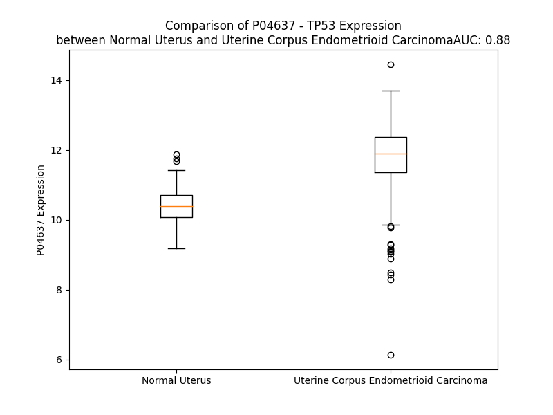

# Detailed Data for P04637

## Introduction to the Detailed Summary

### How to Interpret the Results

- **Summary & Metrics**: This section provides a quick reference to essential protein attributes, including expression changes, family classification, and biomarker applications. Regulation status (upregulated/downregulated) indicates the protein's behavior in a disease context. Some information comes from the original excel file with the proteins selected from literature, while others are derived from the analyses.
- **Expression Comparison**: A visual representation comparing protein expression between normal and disease states. It highlights significant changes in expression levels that might indicate diagnostic or therapeutic relevance. This is data coming from transcriptomics experiments and could not translate similarly to protein levels.
- **Isoform Alignment**: An interactive view of isoform alignments, revealing structural and functional differences between variants of the protein.
- **Interactors & Homologs**: Tables listing known interaction partners and homologous proteins, the more interactors and homologs, the more complex the protein is to design an antibody for.
- **Biological Assemblies**: Information about the structural arrangement of the protein in different assemblies, providing insights into its functional state but also the complexity of the protein to develop antibodies.
- **Combined Per-Residue Information**: A detailed table summarizing residue-level data. This includes predictions for epitope regions, aggregation tendencies, and modifications that might impact the protein's function. Each row corresponds to a residue in the protein, providing insights into specific sites that may be important for research or drug development.
## Summary & Metrics

- **UniProt Accession**: P04637
- **Gene Name**: TP53 (p53)
- **Protein Name**: Cellular tumor antigen p53
- **Swiss Prot**: P53_HUMAN
- **Family**: transcription regulator
- **Biomarker Application**: diagnosis,disease progression,efficacy,prognosis,response to therapy,unspecified application
- **Number of Isoforms**: 0
- **Regulation**: 1
- **(transcriptomics) AUC**: 0.83
- **(transcriptomics) Fold Change**: 1.10
- **(transcriptomics) Regulation**: Upregulated
- **Discotope Epitope Count**: 78
- **Max n_uniprots (Homo)**: 4.0
- **Max n_uniprots (Hetero)**: 10.0

## Expression Comparison

## Interactors

| preferredName_A   | preferredName_B   |   score |
|:------------------|:------------------|--------:|
| TP53              | SFN               |   0.999 |
| TP53              | EP300             |   0.999 |
| TP53              | HIF1A             |   0.999 |
| TP53              | HDAC1             |   0.999 |
| TP53              | HSP90AA1          |   0.999 |
| TP53              | ATM               |   0.999 |
| TP53              | MDM4              |   0.999 |
| TP53              | CHEK2             |   0.999 |
| TP53              | BCL2              |   0.999 |
| TP53              | BCL2L1            |   0.999 |
| TP53              | PPP1R13L          |   0.999 |
| TP53              | DAXX              |   0.999 |
| TP53              | SIRT1             |   0.999 |
| TP53              | BRCA1             |   0.999 |
| TP53              | CDKN1A            |   0.999 |
| TP53              | TP53BP2           |   0.999 |
| TP53              | UBE3A             |   0.999 |
| TP53              | USP7              |   0.999 |
| TP53              | CREBBP            |   0.999 |
| TP53              | MDM2              |   0.999 |
| TP53              | RPA1              |   0.999 |
| TP53              | CDKN2A            |   0.999 |
| TP53              | TP53BP1           |   0.999 |
| TP53              | PTEN              |   0.999 |
| TP53              | HIPK2             |   0.999 |
| TP53              | RAD51             |   0.999 |
| TP53              | RCHY1             |   0.998 |
| TP53              | CREB1             |   0.998 |
| TP53              | HTT               |   0.998 |
| TP53              | NDN               |   0.998 |
| TP53              | AURKA             |   0.998 |
| TP53              | MAPK1             |   0.998 |
| TP53              | CCNG1             |   0.998 |
| TP53              | FOXO3             |   0.998 |
| TP53              | HSPA9             |   0.998 |
| TP53              | DNMT1             |   0.997 |
| TP53              | JUN               |   0.997 |
| TP53              | HSPA4             |   0.997 |
| TP53              | DDX5              |   0.997 |
| TP53              | CHEK1             |   0.997 |
| TP53              | PRKDC             |   0.997 |
| TP53              | MYC               |   0.997 |
| TP53              | NPM1              |   0.997 |
| TP53              | MAPK8             |   0.997 |
| TP53              | TBP               |   0.997 |
| TP53              | CCNA2             |   0.997 |
| TP53              | HMGB1             |   0.997 |
| TP53              | BAK1              |   0.997 |
| TP53              | KAT5              |   0.996 |
| TP53              | S100A4            |   0.996 |

## Homologs

| uniprot_id   | gene_id   |
|:-------------|:----------|
| A0A0C4DFW9   | TP73      |
| A0A0S2Z4N5   | TP63      |

## Biological Assemblies

|   Unnamed: 0 |   assembly |   n_uniprots | composition   | crystal_id   |
|-------------:|-----------:|-------------:|:--------------|:-------------|
|            0 |          1 |            1 | Homo          | 5hp0         |
|            0 |          1 |            1 | Homo          | 2pcx         |
|            0 |          1 |            2 | Homo          | 8f2h         |
|            0 |          1 |            1 | Homo          | 5aol         |
|            1 |          2 |            1 | Homo          | 5aol         |
|            0 |          1 |            4 | Homo          | 1pet         |
|            0 |          1 |            1 | Homo          | 7b4h         |
|            0 |          1 |            1 | Homo          | 2f1x         |
|            1 |          2 |            1 | Homo          | 2f1x         |
|            0 |          1 |            1 | Homo          | 2wgx         |
|            1 |          2 |            1 | Homo          | 2wgx         |
|            0 |          1 |            4 | Homo          | 7eeu         |
|            1 |          2 |            4 | Homo          | 7eeu         |
|            0 |          1 |            2 | Hetero        | 1ycs         |
|            0 |          1 |            2 | Homo          | 3q01         |
|            0 |          1 |            4 | Homo          | 3sak         |
|            0 |          1 |            2 | Hetero        | 5ol0         |
|            1 |          2 |            2 | Hetero        | 5ol0         |
|            0 |          1 |            2 | Hetero        | 6rl3         |
|            0 |          1 |            1 | Homo          | 4loe         |
|            1 |          2 |            1 | Homo          | 4loe         |
|            2 |          3 |            1 | Homo          | 4loe         |
|            3 |          4 |            1 | Homo          | 4loe         |
|            0 |          1 |            2 | Hetero        | 3tg5         |
|            0 |          1 |            1 | Homo          | 4lo9         |
|            1 |          2 |            1 | Homo          | 4lo9         |
|            2 |          3 |            1 | Homo          | 4lo9         |
|            3 |          4 |            1 | Homo          | 4lo9         |
|            0 |          1 |            2 | Hetero        | 6rz3         |
|            0 |          1 |            4 | Homo          | 2ahi         |
|            0 |          1 |            2 | Hetero        | 6rkk         |
|            0 |          1 |            1 | Homo          | 4agp         |
|            1 |          2 |            1 | Homo          | 4agp         |
|            0 |          1 |            1 | Homo          | 3zme         |
|            1 |          2 |            1 | Homo          | 3zme         |
|            0 |          1 |            1 | Homo          | 5aom         |
|            1 |          2 |            1 | Homo          | 5aom         |
|            0 |          1 |            2 | Hetero        | 6rl6         |
|            0 |          1 |            2 | Hetero        | 6rm5         |
|            0 |          1 |            2 | Hetero        | 2h4j         |
|            0 |          1 |            1 | Homo          | 4qo1         |
|            0 |          1 |            2 | Hetero        | 2h2f         |
|            0 |          1 |            1 | Homo          | 4ibq         |
|            1 |          2 |            1 | Homo          | 4ibq         |
|            2 |          3 |            1 | Homo          | 4ibq         |
|            3 |          4 |            1 | Homo          | 4ibq         |
|            0 |          1 |            4 | Homo          | 2j11         |
|            0 |          1 |            4 | Homo          | 2ac0         |
|            0 |          1 |            2 | Hetero        | 3oq5         |
|            1 |          2 |            1 | Homo          | 3oq5         |
|            2 |          3 |            2 | Hetero        | 3oq5         |
|            0 |          1 |            1 | Homo          | 4kvp         |
|            1 |          2 |            1 | Homo          | 4kvp         |
|            2 |          3 |            1 | Homo          | 4kvp         |
|            3 |          4 |            1 | Homo          | 4kvp         |
|            0 |          1 |            3 | Hetero        | 1h26         |
|            1 |          2 |            2 | Hetero        | 1h26         |
|            0 |          1 |            1 | Homo          | 4iby         |
|            1 |          2 |            1 | Homo          | 4iby         |
|            0 |          1 |            1 | Homo          | 2foo         |
|            0 |          1 |            1 | Homo          | 4lof         |
|            0 |          1 |            1 | Homo          | 5hou         |
|            0 |          1 |            1 | Homo          | 5moc         |
|            0 |          1 |            2 | Homo          | 5un8         |
|            1 |          2 |            2 | Homo          | 5un8         |
|            0 |          1 |            1 | Homo          | 8e7b         |
|            1 |          2 |            1 | Homo          | 8e7b         |
|            0 |          1 |            4 | Homo          | 1saf         |
|            0 |          1 |            2 | Hetero        | 2gs0         |
|            0 |          1 |           10 | Hetero        | 2h1l         |
|            1 |          2 |           10 | Hetero        | 2h1l         |
|            0 |          1 |            1 | Homo          | 2x0w         |
|            1 |          2 |            1 | Homo          | 2x0w         |
|            0 |          1 |            2 | Hetero        | 2ydr         |
|            0 |          1 |            4 | Hetero        | 2h59         |
|            0 |          1 |            1 | Homo          | 5o1e         |
|            1 |          2 |            1 | Homo          | 5o1e         |
|            0 |          1 |            1 | Homo          | 3d07         |
|            1 |          2 |            1 | Homo          | 3d07         |
|            0 |          1 |            1 | Homo          | 2j1x         |
|            1 |          2 |            1 | Homo          | 2j1x         |
|            0 |          1 |            1 | Homo          | 1uol         |
|            1 |          2 |            1 | Homo          | 1uol         |
|            0 |          1 |            1 | Homo          | 2j1z         |
|            1 |          2 |            1 | Homo          | 2j1z         |
|            0 |          1 |            4 | Homo          | 1sal         |
|            0 |          1 |            2 | Hetero        | 2h2d         |
|            0 |          1 |            2 | Homo          | 3d0a         |
|            1 |          2 |            2 | Homo          | 3d0a         |
|            0 |          1 |            1 | Homo          | 6si4         |
|            1 |          2 |            1 | Homo          | 6si4         |
|            0 |          1 |            4 | Homo          | 1pes         |
|            0 |          1 |            4 | Hetero        | 1dt7         |
|            0 |          1 |            4 | Homo          | 2j0z         |
|            0 |          1 |            1 | Homo          | 6lhd         |
|            1 |          2 |            1 | Homo          | 6lhd         |
|            0 |          1 |            3 | Hetero        | 4xr8         |
|            1 |          2 |            3 | Hetero        | 4xr8         |
|            0 |          1 |            2 | Hetero        | 3dac         |
|            1 |          2 |            2 | Hetero        | 3dac         |
|            0 |          1 |            2 | Hetero        | 6rjz         |
|            0 |          1 |            4 | Homo          | 1sak         |
|            0 |          1 |            1 | Homo          | 6sl6         |
|            0 |          1 |            1 | Homo          | 7v97         |
|            1 |          2 |            1 | Homo          | 7v97         |
|            2 |          3 |            1 | Homo          | 7v97         |
|            3 |          4 |            1 | Homo          | 7v97         |
|            0 |          1 |            1 | Homo          | 4zzj         |
|            1 |          2 |            1 | Homo          | 4zzj         |
|            0 |          1 |            2 | Hetero        | 2b3g         |
|            0 |          1 |            1 | Homo          | 6ggb         |
|            1 |          2 |            1 | Homo          | 6ggb         |
|            0 |          1 |            4 | Hetero        | 8oxm         |
|            0 |          1 |            1 | Homo          | 6ggf         |
|            1 |          2 |            1 | Homo          | 6ggf         |
|            0 |          1 |            1 | Homo          | 5a7b         |
|            1 |          2 |            1 | Homo          | 5a7b         |
|            0 |          1 |            1 | Homo          | 4bv2         |
|            1 |          2 |            1 | Homo          | 4bv2         |
|            2 |          3 |            1 | Homo          | 4bv2         |
|            3 |          4 |            1 | Homo          | 4bv2         |
|            4 |          5 |            2 | Hetero        | 4bv2         |
|            5 |          6 |            2 | Hetero        | 4bv2         |
|            0 |          1 |            2 | Hetero        | 6rm7         |
|            0 |          1 |            2 | Hetero        | 7nmi         |
|            0 |          1 |            2 | Hetero        | 6sin         |
|            0 |          1 |            4 | Hetero        | 7ygi         |
|            0 |          1 |            1 | Homo          | 8dc7         |
|            0 |          1 |            1 | Homo          | 1aie         |
|            0 |          1 |            1 | Homo          | 8qwn         |
|            0 |          1 |            2 | Hetero        | 1ycq         |
|            0 |          1 |            2 | Homo          | 5mcw         |
|            0 |          1 |            4 | Homo          | 4mzr         |
|            0 |          1 |            1 | Homo          | 8qwm         |
|            1 |          2 |            1 | Homo          | 8qwm         |
|            0 |          1 |            4 | Homo          | 7b4c         |
|            0 |          1 |            2 | Hetero        | 6rws         |
|            0 |          1 |            4 | Homo          | 7b4b         |
|            0 |          1 |            1 | Homo          | 7b4n         |
|            0 |          1 |            2 | Hetero        | 4buz         |
|            0 |          1 |            4 | Homo          | 3q05         |
|            0 |          1 |            1 | Homo          | 8wd2         |
|            1 |          2 |            1 | Homo          | 8wd2         |
|            0 |          1 |            1 | Homo          | 5o1h         |
|            1 |          2 |            1 | Homo          | 5o1h         |
|            0 |          1 |            4 | Homo          | 4hje         |
|            0 |          1 |            2 | Hetero        | 6slv         |
|            0 |          1 |            1 | Homo          | 4ibt         |
|            1 |          2 |            1 | Homo          | 4ibt         |
|            2 |          3 |            1 | Homo          | 4ibt         |
|            3 |          4 |            1 | Homo          | 4ibt         |
|            0 |          1 |            1 | Homo          | 8qwk         |
|            0 |          1 |            1 | Homo          | 4agq         |
|            1 |          2 |            1 | Homo          | 4agq         |
|            0 |          1 |            1 | Homo          | 5aoi         |
|            1 |          2 |            1 | Homo          | 5aoi         |
|            0 |          1 |            1 | Homo          | 5g4m         |
|            1 |          2 |            1 | Homo          | 5g4m         |
|            0 |          1 |            3 | Homo          | 1tup         |
|            0 |          1 |            1 | Homo          | 3igl         |
|            0 |          1 |            4 | Homo          | 1sae         |
|            0 |          1 |            1 | Homo          | 7dvd         |
|            1 |          2 |            1 | Homo          | 7dvd         |
|            2 |          3 |            1 | Homo          | 7dvd         |
|            3 |          4 |            1 | Homo          | 7dvd         |
|            4 |          5 |            1 | Homo          | 7dvd         |
|            0 |          1 |            1 | Homo          | 5o1g         |
|            1 |          2 |            1 | Homo          | 5o1g         |
|            0 |          1 |            1 | Homo          | 2j21         |
|            1 |          2 |            1 | Homo          | 2j21         |
|            0 |          1 |            2 | Hetero        | 6rki         |
|            0 |          1 |            2 | Hetero        | 1gzh         |
|            1 |          2 |            2 | Hetero        | 1gzh         |
|            0 |          1 |            1 | Homo          | 6gge         |
|            1 |          2 |            1 | Homo          | 6gge         |
|            0 |          1 |            4 | Homo          | 3kmd         |
|            0 |          1 |            1 | Homo          | 4ibw         |
|            0 |          1 |            1 | Homo          | 7el4         |
|            0 |          1 |            1 | Homo          | 2vuk         |
|            1 |          2 |            1 | Homo          | 2vuk         |
|            0 |          1 |            1 | Homo          | 8f2i         |
|            0 |          1 |            1 | Homo          | 1c26         |
|            0 |          1 |            2 | Hetero        | 2ly4         |
|            0 |          1 |            1 | Homo          | 3igk         |
|            0 |          1 |            2 | Hetero        | 6s39         |
|            0 |          1 |            3 | Hetero        | 6vrn         |
|            0 |          1 |            1 | Homo          | 7b4e         |
|            0 |          1 |            2 | Hetero        | 3pdh         |
|            0 |          1 |            1 | Homo          | 8dc8         |
|            0 |          1 |            2 | Homo          | 2ady         |
|            0 |          1 |            1 | Homo          | 2bin         |
|            0 |          1 |            4 | Homo          | 7b48         |
|            0 |          1 |            2 | Hetero        | 8hll         |
|            0 |          1 |            1 | Homo          | 7b4d         |
|            0 |          1 |            1 | Homo          | 4mzi         |
|            0 |          1 |            2 | Hetero        | 5ecg         |
|            1 |          2 |            2 | Hetero        | 5ecg         |
|            0 |          1 |            2 | Hetero        | 3dab         |
|            1 |          2 |            2 | Hetero        | 3dab         |
|            2 |          3 |            2 | Hetero        | 3dab         |
|            3 |          4 |            2 | Hetero        | 3dab         |
|            0 |          1 |            2 | Hetero        | 1ma3         |
|            0 |          1 |            4 | Homo          | 7b46         |
|            0 |          1 |            2 | Hetero        | 1ycr         |
|            0 |          1 |            1 | Homo          | 5o1b         |
|            1 |          2 |            1 | Homo          | 5o1b         |
|            0 |          1 |            1 | Homo          | 4agl         |
|            1 |          2 |            1 | Homo          | 4agl         |
|            0 |          1 |            1 | Homo          | 7eds         |
|            0 |          1 |            1 | Homo          | 6s40         |
|            0 |          1 |            2 | Homo          | 7b49         |
|            0 |          1 |            1 | Homo          | 6shz         |
|            1 |          2 |            1 | Homo          | 6shz         |
|            0 |          1 |            1 | Homo          | 2j20         |
|            1 |          2 |            1 | Homo          | 2j20         |
|            0 |          1 |            1 | Homo          | 5bua         |
|            0 |          1 |            2 | Homo          | 5mf7         |
|            0 |          1 |            1 | Homo          | 6v4f         |
|            0 |          1 |            1 | Homo          | 7dhz         |
|            1 |          2 |            1 | Homo          | 7dhz         |
|            0 |          1 |            2 | Hetero        | 2mej         |
|            0 |          1 |            1 | Homo          | 4ago         |
|            1 |          2 |            1 | Homo          | 4ago         |
|            0 |          1 |            1 | Homo          | 6t58         |
|            1 |          2 |            1 | Homo          | 6t58         |
|            0 |          1 |            2 | Hetero        | 8hlm         |
|            0 |          1 |            1 | Homo          | 8a32         |
|            1 |          2 |            1 | Homo          | 8a32         |
|            0 |          1 |            1 | Homo          | 4ibz         |
|            1 |          2 |            1 | Homo          | 4ibz         |
|            2 |          3 |            1 | Homo          | 4ibz         |
|            3 |          4 |            1 | Homo          | 4ibz         |
|            0 |          1 |            2 | Hetero        | 2ruk         |
|            0 |          1 |            2 | Homo          | 7b4a         |
|            0 |          1 |            2 | Hetero        | 6rk8         |
|            0 |          1 |            1 | Homo          | 5o1a         |
|            1 |          2 |            1 | Homo          | 5o1a         |
|            0 |          1 |            2 | Hetero        | 1jsp         |
|            0 |          1 |            4 | Homo          | 3q06         |
|            0 |          1 |            1 | Homo          | 5aoj         |
|            1 |          2 |            1 | Homo          | 5aoj         |
|            0 |          1 |            1 | Homo          | 4agn         |
|            1 |          2 |            1 | Homo          | 4agn         |
|            0 |          1 |            1 | Homo          | 6si2         |
|            1 |          2 |            1 | Homo          | 6si2         |
|            0 |          1 |            2 | Hetero        | 6siq         |
|            0 |          1 |           10 | Hetero        | 6xre         |
|            0 |          1 |            2 | Homo          | 5mct         |
|            0 |          1 |            1 | Homo          | 6ggd         |
|            1 |          2 |            1 | Homo          | 6ggd         |
|            0 |          1 |            4 | Homo          | 1olg         |
|            0 |          1 |            2 | Hetero        | 6rwh         |
|            0 |          1 |            1 | Homo          | 5aok         |
|            1 |          2 |            1 | Homo          | 5aok         |
|            0 |          1 |            3 | Hetero        | 6vrm         |
|            0 |          1 |            4 | Homo          | 8uqr         |
|            0 |          1 |            1 | Homo          | 6r5l         |
|            0 |          1 |            1 | Homo          | 6si3         |
|            1 |          2 |            1 | Homo          | 6si3         |
|            0 |          1 |            1 | Homo          | 3d05         |
|            0 |          1 |            1 | Homo          | 2bio         |
|            0 |          1 |            1 | Homo          | 5o1d         |
|            1 |          2 |            1 | Homo          | 5o1d         |
|            0 |          1 |            2 | Hetero        | 6rwi         |
|            0 |          1 |            2 | Hetero        | 6sio         |
|            0 |          1 |            2 | Hetero        | 1xqh         |
|            1 |          2 |            2 | Hetero        | 1xqh         |
|            0 |          1 |            4 | Homo          | 3ts8         |
|            0 |          1 |            1 | Homo          | 5g4o         |
|            1 |          2 |            1 | Homo          | 5g4o         |
|            0 |          1 |            1 | Homo          | 5o1c         |
|            1 |          2 |            1 | Homo          | 5o1c         |
|            0 |          1 |            1 | Homo          | 7b4f         |
|            0 |          1 |            2 | Hetero        | 7bwn         |
|            1 |          2 |            2 | Hetero        | 7bwn         |
|            2 |          3 |            2 | Hetero        | 7bwn         |
|            3 |          4 |            2 | Hetero        | 7bwn         |
|            4 |          5 |            2 | Hetero        | 7bwn         |
|            5 |          6 |            2 | Hetero        | 7bwn         |
|            6 |          7 |            2 | Hetero        | 7bwn         |
|            7 |          8 |            2 | Hetero        | 7bwn         |
|            0 |          1 |            2 | Homo          | 1hs5         |
|            0 |          1 |            1 | Homo          | 6gga         |
|            1 |          2 |            1 | Homo          | 6gga         |
|            0 |          1 |            2 | Homo          | 5mcu         |
|            0 |          1 |            8 | Hetero        | 7xzz         |
|            0 |          1 |            1 | Homo          | 5xzc         |
|            1 |          2 |            4 | Homo          | 5xzc         |
|            0 |          1 |            4 | Homo          | 1olh         |
|            0 |          1 |            1 | Homo          | 5o1f         |
|            1 |          2 |            1 | Homo          | 5o1f         |
|            0 |          1 |            1 | Homo          | 2fej         |
|            0 |          1 |            1 | Homo          | 8e7a         |
|            0 |          1 |            1 | Homo          | 5mhc         |
|            0 |          1 |            2 | Hetero        | 2h4h         |
|            0 |          1 |            1 | Homo          | 6si1         |
|            1 |          2 |            1 | Homo          | 6si1         |
|            0 |          1 |            1 | Homo          | 3d08         |
|            0 |          1 |            3 | Hetero        | 6w51         |
|            1 |          2 |            3 | Hetero        | 6w51         |
|            2 |          3 |            3 | Hetero        | 6w51         |
|            3 |          4 |            3 | Hetero        | 6w51         |
|            0 |          1 |            2 | Hetero        | 2z5s         |
|            1 |          2 |            2 | Hetero        | 2z5s         |
|            2 |          3 |            2 | Hetero        | 2z5s         |
|            0 |          1 |            1 | Homo          | 2biq         |
|            0 |          1 |            1 | Homo          | 5hpd         |
|            0 |          1 |            1 | Homo          | 5o1i         |
|            1 |          2 |            1 | Homo          | 5o1i         |
|            0 |          1 |            4 | Homo          | 2ata         |
|            0 |          1 |            6 | Hetero        | 8r1g         |
|            0 |          1 |            1 | Homo          | 4ibs         |
|            1 |          2 |            1 | Homo          | 4ibs         |
|            2 |          3 |            1 | Homo          | 4ibs         |
|            3 |          4 |            1 | Homo          | 4ibs         |
|            0 |          1 |            2 | Hetero        | 8hln         |
|            0 |          1 |            1 | Homo          | 2foj         |
|            0 |          1 |            2 | Hetero        | 2h4f         |
|            0 |          1 |            4 | Homo          | 6fj5         |
|            0 |          1 |            1 | Homo          | 5aba         |
|            1 |          2 |            1 | Homo          | 5aba         |
|            0 |          1 |            4 | Hetero        | 1kzy         |
|            0 |          1 |            2 | Hetero        | 2k8f         |
|            0 |          1 |            4 | Homo          | 7b47         |
|            0 |          1 |            2 | Hetero        | 6vqo         |
|            1 |          2 |            2 | Hetero        | 6vqo         |
|            0 |          1 |            1 | Homo          | 3d06         |
|            0 |          1 |            8 | Hetero        | 7xzx         |
|            0 |          1 |            1 | Homo          | 6s3c         |
|            0 |          1 |            1 | Homo          | 2bip         |
|            0 |          1 |            2 | Hetero        | 2mwp         |
|            0 |          1 |            1 | Homo          | 8a31         |
|            1 |          2 |            1 | Homo          | 8a31         |
|            0 |          1 |            1 | Homo          | 4agm         |
|            1 |          2 |            1 | Homo          | 4agm         |
|            0 |          1 |            2 | Hetero        | 2l14         |
|            0 |          1 |            4 | Hetero        | 8oxo         |
|            0 |          1 |            1 | Homo          | 6v4h         |
|            1 |          2 |            1 | Homo          | 6v4h         |
|            0 |          1 |            4 | Homo          | 4ibu         |
|            0 |          1 |            1 | Homo          | 6ff9         |
|            1 |          2 |            1 | Homo          | 6ff9         |
|            2 |          3 |            1 | Homo          | 6ff9         |
|            3 |          4 |            1 | Homo          | 6ff9         |
|            0 |          1 |            1 | Homo          | 8xp5         |
|            1 |          2 |            1 | Homo          | 8xp5         |
|            0 |          1 |            3 | Hetero        | 6vr5         |
|            1 |          2 |            3 | Hetero        | 6vr5         |
|            0 |          1 |            1 | Homo          | 6znc         |
|            0 |          1 |            3 | Hetero        | 8r1f         |
|            0 |          1 |            2 | Hetero        | 6rl4         |
|            0 |          1 |            1 | Homo          | 3d09         |
|            0 |          1 |            2 | Hetero        | 6rkm         |
|            0 |          1 |            1 | Homo          | 8dc6         |
|            1 |          2 |            1 | Homo          | 8dc6         |
|            2 |          3 |            1 | Homo          | 8dc6         |
|            3 |          4 |            1 | Homo          | 8dc6         |
|            0 |          1 |            1 | Homo          | 2ybg         |
|            1 |          2 |            1 | Homo          | 2ybg         |
|            2 |          3 |            1 | Homo          | 2ybg         |
|            3 |          4 |            1 | Homo          | 2ybg         |
|            0 |          1 |            1 | Homo          | 8qwl         |
|            0 |          1 |            1 | Homo          | 5lap         |
|            1 |          2 |            1 | Homo          | 5lap         |
|            0 |          1 |            2 | Hetero        | 6rx2         |
|            0 |          1 |            2 | Hetero        | 2z5t         |
|            1 |          2 |            2 | Hetero        | 2z5t         |
|            2 |          3 |            2 | Hetero        | 2z5t         |
|            0 |          1 |            1 | Homo          | 2ocj         |
|            1 |          2 |            1 | Homo          | 2ocj         |
|            2 |          3 |            1 | Homo          | 2ocj         |
|            3 |          4 |            1 | Homo          | 2ocj         |
|            0 |          1 |            3 | Hetero        | 6vr1         |
|            1 |          2 |            3 | Hetero        | 6vr1         |
|            0 |          1 |            1 | Homo          | 4rp7         |
|            0 |          1 |            1 | Homo          | 4ibv         |
|            0 |          1 |            1 | Homo          | 4x34         |
|            1 |          2 |            1 | Homo          | 4x34         |
|            0 |          1 |            1 | Homo          | 8a92         |
|            1 |          2 |            1 | Homo          | 8a92         |
|            0 |          1 |            2 | Hetero        | 6rwu         |
|            0 |          1 |            1 | Homo          | 2x0u         |
|            1 |          2 |            1 | Homo          | 2x0u         |
|            0 |          1 |            1 | Homo          | 6si0         |
|            1 |          2 |            1 | Homo          | 6si0         |
|            0 |          1 |            1 | Homo          | 5ab9         |
|            1 |          2 |            1 | Homo          | 5ab9         |
|            0 |          1 |            1 | Homo          | 7b4g         |
|            0 |          1 |            2 | Hetero        | 1yc5         |
|            0 |          1 |            1 | Homo          | 5g4n         |
|            1 |          2 |            1 | Homo          | 5g4n         |
|            0 |          1 |            1 | Homo          | 8qwo         |
|            1 |          2 |            1 | Homo          | 8qwo         |
|            0 |          1 |            2 | Homo          | 5mcv         |
|            0 |          1 |            1 | Homo          | 8qwp         |
|            1 |          2 |            1 | Homo          | 8qwp         |
|            0 |          1 |            3 | Homo          | 1tsr         |
|            0 |          1 |            1 | Homo          | 4ijt         |
|            0 |          1 |            1 | Homo          | 2x0v         |
|            1 |          2 |            1 | Homo          | 2x0v         |
|            0 |          1 |            1 | Homo          | 7dhy         |
|            1 |          2 |            1 | Homo          | 7dhy         |
|            2 |          3 |            1 | Homo          | 7dhy         |
|            3 |          4 |            1 | Homo          | 7dhy         |
|            0 |          1 |            3 | Hetero        | 8gcr         |
|            0 |          1 |            1 | Homo          | 2j1w         |
|            1 |          2 |            1 | Homo          | 2j1w         |
|            0 |          1 |            2 | Homo          | 5mg7         |
|            0 |          1 |            1 | Homo          | 7eax         |
|            1 |          2 |            1 | Homo          | 7eax         |
|            2 |          3 |            1 | Homo          | 7eax         |
|            3 |          4 |            1 | Homo          | 7eax         |
|            0 |          1 |            3 | Hetero        | 7rm4         |
|            1 |          2 |            3 | Hetero        | 7rm4         |
|            2 |          3 |            3 | Hetero        | 7rm4         |
|            3 |          4 |            3 | Hetero        | 7rm4         |
|            0 |          1 |            2 | Homo          | 1a1u         |
|            0 |          1 |            2 | Hetero        | 6sip         |
|            0 |          1 |            4 | Homo          | 2j10         |
|            0 |          1 |            2 | Homo          | 3kz8         |
|            0 |          1 |            2 | Hetero        | 2mzd         |
|            0 |          1 |            1 | Homo          | 4rp6         |
|            0 |          1 |            1 | Homo          | 2xwr         |
|            1 |          2 |            1 | Homo          | 2xwr         |
|            0 |          1 |            1 | Homo          | 6ggc         |
|            1 |          2 |            1 | Homo          | 6ggc         |
|            0 |          1 |            1 | Homo          | 8dc4         |
|            1 |          2 |            1 | Homo          | 8dc4         |
|            2 |          3 |            1 | Homo          | 8dc4         |
|            3 |          4 |            1 | Homo          | 8dc4         |
|            0 |          1 |            4 | Homo          | 5lgy         |
|            0 |          1 |            2 | Hetero        | 2mwy         |
|            0 |          1 |            2 | Hetero        | 4hfz         |
|            1 |          2 |            2 | Hetero        | 4hfz         |
|            0 |          1 |            2 | Hetero        | 3lw1         |
|            0 |          1 |            1 | Homo          | 2bim         |
|            1 |          2 |            1 | Homo          | 2bim         |
|            0 |          1 |            1 | Homo          | 8cg7         |
|            1 |          2 |            1 | Homo          | 8cg7         |
|            0 |          1 |            2 | Hetero        | 6s9q         |
|            0 |          1 |            2 | Hetero        | 2mwo         |
|            0 |          1 |            1 | Homo          | 2j1y         |
|            1 |          2 |            1 | Homo          | 2j1y         |
|            2 |          3 |            1 | Homo          | 2j1y         |
|            3 |          4 |            1 | Homo          | 2j1y         |

## Combined Per-Residue Information

|   res | aa   |   epitope_score | epitope   |   relative_surface_accessibility |   modeling_confidence |   Aggregation | modification                                        |
|------:|:-----|----------------:|:----------|---------------------------------:|----------------------:|--------------:|:----------------------------------------------------|
|     1 | M    |         0.10093 | False     |                          1.28995 |                 40.87 |         0     | N/A                                                 |
|     2 | E    |         0.12654 | False     |                          0.90083 |                 42.37 |         0     | N/A                                                 |
|     3 | E    |         0.13446 | False     |                          0.89278 |                 37.34 |         0     | N/A                                                 |
|     4 | P    |         0.12029 | False     |                          0.97347 |                 41.12 |         0     | N/A                                                 |
|     5 | Q    |         0.19825 | True      |                          0.93986 |                 36.28 |         0     | N/A                                                 |
|     6 | S    |         0.10742 | False     |                          0.86943 |                 39.25 |         0     | N/A                                                 |
|     7 | D    |         0.15595 | False     |                          0.83209 |                 37.74 |         0     | N/A                                                 |
|     8 | P    |         0.09687 | False     |                          0.94666 |                 35.43 |         0     | N/A                                                 |
|     9 | S    |         0.10209 | False     |                          0.79693 |                 38.07 |         0     | Phosphoserine; by HIPK4                             |
|    10 | V    |         0.11562 | False     |                          0.97898 |                 38.7  |         0     | N/A                                                 |
|    11 | E    |         0.1473  | False     |                          0.87968 |                 46.99 |         0     | N/A                                                 |
|    12 | P    |         0.10635 | False     |                          0.79665 |                 46.82 |         0     | N/A                                                 |
|    13 | P    |         0.09825 | False     |                          0.89331 |                 45.44 |         0     | N/A                                                 |
|    14 | L    |         0.19152 | True      |                          0.95398 |                 48.46 |         0     | N/A                                                 |
|    15 | S    |         0.12968 | False     |                          0.43434 |                 60.33 |         0     | Phosphoserine; by CDK5, PRPK, AMPK, NUAK1 and ATM   |
|    16 | Q    |         0.1266  | False     |                          0.90301 |                 52.54 |         0     | N/A                                                 |
|    17 | E    |         0.14943 | False     |                          0.79252 |                 56.28 |         0     | N/A                                                 |
|    18 | T    |         0.10027 | False     |                          0.45784 |                 62.33 |         0     | Phosphothreonine; by CK1, VRK1 and VRK2             |
|    19 | F    |         0.18325 | True      |                          0.63269 |                 59.05 |         0     | N/A                                                 |
|    20 | S    |         0.11186 | False     |                          0.54341 |                 65.74 |         0     | Phosphoserine; by CHEK2, CK1 and PLK3               |
|    21 | D    |         0.10364 | False     |                          0.5134  |                 66.79 |         0     | N/A                                                 |
|    22 | L    |         0.10882 | False     |                          0.57439 |                 68.31 |         0     | N/A                                                 |
|    23 | W    |         0.12978 | False     |                          0.7351  |                 67.62 |         0     | N/A                                                 |
|    24 | K    |         0.15558 | False     |                          0.80907 |                 70.23 |         0     | N/A                                                 |
|    25 | L    |         0.15475 | False     |                          0.86432 |                 70.74 |         0     | N/A                                                 |
|    26 | L    |         0.1041  | False     |                          0.64809 |                 58.72 |         0     | N/A                                                 |
|    27 | P    |         0.12682 | False     |                          0.85941 |                 62.81 |         0     | N/A                                                 |
|    28 | E    |         0.14399 | False     |                          0.9032  |                 57.24 |         0     | N/A                                                 |
|    29 | N    |         0.14461 | False     |                          0.82238 |                 45.04 |         0     | N/A                                                 |
|    30 | N    |         0.16355 | False     |                          0.98773 |                 38.19 |         0     | N/A                                                 |
|    31 | V    |         0.12605 | False     |                          0.9062  |                 39.44 |         0     | N/A                                                 |
|    32 | L    |         0.11856 | False     |                          0.9882  |                 33.54 |         0     | N/A                                                 |
|    33 | S    |         0.11036 | False     |                          0.90263 |                 35.19 |         0     | Phosphoserine; by CDK5 and CDK7                     |
|    34 | P    |         0.16411 | False     |                          0.82344 |                 33.9  |         0     | N/A                                                 |
|    35 | L    |         0.16849 | False     |                          0.97429 |                 34.62 |         0     | N/A                                                 |
|    36 | P    |         0.07362 | False     |                          0.84675 |                 34.62 |         0     | N/A                                                 |
|    37 | S    |         0.09642 | False     |                          0.76911 |                 30.98 |         0     | Phosphoserine; by MAPKAPK5                          |
|    38 | Q    |         0.13125 | False     |                          0.89524 |                 36.77 |         0     | N/A                                                 |
|    39 | A    |         0.09732 | False     |                          0.91305 |                 36.14 |         0     | N/A                                                 |
|    40 | M    |         0.17002 | False     |                          0.87674 |                 33.82 |         0     | N/A                                                 |
|    41 | D    |         0.13475 | False     |                          0.83513 |                 35.11 |         0     | N/A                                                 |
|    42 | D    |         0.12675 | False     |                          0.8788  |                 37    |         0     | N/A                                                 |
|    43 | L    |         0.11414 | False     |                          0.92519 |                 37.65 |         0     | N/A                                                 |
|    44 | M    |         0.0793  | False     |                          0.99381 |                 35.35 |         0     | N/A                                                 |
|    45 | L    |         0.12428 | False     |                          1.01998 |                 40.22 |         0     | N/A                                                 |
|    46 | S    |         0.10901 | False     |                          0.61549 |                 36.67 |         0     | Phosphoserine; by CDK5, DYRK2, HIPK2 and PKC/PRKCG  |
|    47 | P    |         0.13833 | False     |                          0.8672  |                 36.17 |         0     | N/A                                                 |
|    48 | D    |         0.09618 | False     |                          0.74994 |                 45.38 |         0     | N/A                                                 |
|    49 | D    |         0.14515 | False     |                          0.90504 |                 43.43 |         0     | N/A                                                 |
|    50 | I    |         0.21347 | True      |                          0.89571 |                 45.47 |         0     | N/A                                                 |
|    51 | E    |         0.17672 | False     |                          0.86505 |                 43.32 |         0     | N/A                                                 |
|    52 | Q    |         0.14408 | False     |                          0.87121 |                 41.86 |         0     | N/A                                                 |
|    53 | W    |         0.15931 | False     |                          1.06739 |                 42.46 |         0     | N/A                                                 |
|    54 | F    |         0.11907 | False     |                          0.95325 |                 37.48 |         0     | N/A                                                 |
|    55 | T    |         0.11647 | False     |                          0.83623 |                 40.19 |         0     | Phosphothreonine; by TAF1 and GRK5                  |
|    56 | E    |         0.10977 | False     |                          0.8822  |                 39.08 |         0     | N/A                                                 |
|    57 | D    |         0.12605 | False     |                          0.87342 |                 41.84 |         0     | N/A                                                 |
|    58 | P    |         0.0817  | False     |                          0.90892 |                 41.57 |         0     | N/A                                                 |
|    59 | G    |         0.17347 | False     |                          0.85132 |                 40.13 |         0     | N/A                                                 |
|    60 | P    |         0.09421 | False     |                          0.96498 |                 45.33 |         0     | N/A                                                 |
|    61 | D    |         0.1857  | True      |                          0.8477  |                 44.83 |         0     | N/A                                                 |
|    62 | E    |         0.13281 | False     |                          0.86626 |                 40.61 |         0     | N/A                                                 |
|    63 | A    |         0.07554 | False     |                          0.88452 |                 46.68 |         0     | N/A                                                 |
|    64 | P    |         0.10002 | False     |                          0.88478 |                 41.99 |         0     | N/A                                                 |
|    65 | R    |         0.14378 | False     |                          0.9988  |                 40.66 |         0     | N/A                                                 |
|    66 | M    |         0.10025 | False     |                          0.93528 |                 48.37 |         0     | N/A                                                 |
|    67 | P    |         0.13607 | False     |                          0.83983 |                 45.35 |         0     | N/A                                                 |
|    68 | E    |         0.1704  | False     |                          0.89765 |                 40.78 |         0     | N/A                                                 |
|    69 | A    |         0.16179 | False     |                          0.96873 |                 42.77 |         0     | N/A                                                 |
|    70 | A    |         0.11328 | False     |                          0.90731 |                 44.99 |         0     | N/A                                                 |
|    71 | P    |         0.12155 | False     |                          0.86862 |                 51.82 |         0     | N/A                                                 |
|    72 | P    |         0.15757 | False     |                          0.94013 |                 46.66 |         0     | N/A                                                 |
|    73 | V    |         0.12884 | False     |                          1.06218 |                 45.09 |         0     | N/A                                                 |
|    74 | A    |         0.22891 | True      |                          0.83049 |                 49.92 |         0     | N/A                                                 |
|    75 | P    |         0.15952 | False     |                          0.9295  |                 48.07 |         0     | N/A                                                 |
|    76 | A    |         0.14877 | False     |                          0.91842 |                 49.39 |         0     | N/A                                                 |
|    77 | P    |         0.16571 | False     |                          0.94107 |                 51.88 |         0     | N/A                                                 |
|    78 | A    |         0.14082 | False     |                          0.94378 |                 47.88 |         0     | N/A                                                 |
|    79 | A    |         0.15509 | False     |                          0.88352 |                 49.9  |         0     | N/A                                                 |
|    80 | P    |         0.20894 | True      |                          0.92942 |                 52.31 |         0     | N/A                                                 |
|    81 | T    |         0.17393 | False     |                          0.87023 |                 51.53 |         0     | N/A                                                 |
|    82 | P    |         0.27816 | True      |                          0.94632 |                 55.41 |         0     | N/A                                                 |
|    83 | A    |         0.28646 | True      |                          0.91573 |                 52.55 |         0     | N/A                                                 |
|    84 | A    |         0.17383 | False     |                          0.82923 |                 57.59 |         0     | N/A                                                 |
|    85 | P    |         0.2456  | True      |                          0.96413 |                 53.56 |         0     | N/A                                                 |
|    86 | A    |         0.27993 | True      |                          0.80383 |                 48.88 |         0     | N/A                                                 |
|    87 | P    |         0.2422  | True      |                          0.9366  |                 50.01 |         0     | N/A                                                 |
|    88 | A    |         0.17654 | False     |                          0.84597 |                 52.51 |         0     | N/A                                                 |
|    89 | P    |         0.22839 | True      |                          0.71777 |                 44.8  |         0     | N/A                                                 |
|    90 | S    |         0.26439 | True      |                          0.85985 |                 58.58 |         0     | N/A                                                 |
|    91 | W    |         0.23223 | True      |                          0.7447  |                 57.48 |         0     | N/A                                                 |
|    92 | P    |         0.24841 | True      |                          0.48334 |                 58.84 |         0     | N/A                                                 |
|    93 | L    |         0.26189 | True      |                          0.74515 |                 61.16 |         0     | N/A                                                 |
|    94 | S    |         0.0544  | False     |                          0.00877 |                 64.5  |         0     | N/A                                                 |
|    95 | S    |         0.2459  | True      |                          0.90055 |                 60.79 |         0     | N/A                                                 |
|    96 | S    |         0.15566 | False     |                          0.42915 |                 87.3  |         0     | N/A                                                 |
|    97 | V    |         0.1394  | False     |                          0.42895 |                 91.9  |         0     | N/A                                                 |
|    98 | P    |         0.11499 | False     |                          0.28769 |                 93.67 |         0     | N/A                                                 |
|    99 | S    |         0.13056 | False     |                          0.42808 |                 94.32 |         0     | N/A                                                 |
|   100 | Q    |         0.09983 | False     |                          0.40941 |                 93.13 |         0     | N/A                                                 |
|   101 | K    |         0.20326 | True      |                          0.76288 |                 95.4  |         0     | N/A                                                 |
|   102 | T    |         0.11189 | False     |                          0.53318 |                 97.18 |         0     | N/A                                                 |
|   103 | Y    |         0.15829 | False     |                          0.44869 |                 97.88 |         0     | N/A                                                 |
|   104 | Q    |         0.12655 | False     |                          0.50776 |                 97.4  |         0     | N/A                                                 |
|   105 | G    |         0.05757 | False     |                          0.25586 |                 96.19 |         0     | N/A                                                 |
|   106 | S    |         0.13419 | False     |                          0.78812 |                 96.67 |         0     | N/A                                                 |
|   107 | Y    |         0.13404 | False     |                          0.19231 |                 97.18 |         0     | N/A                                                 |
|   108 | G    |         0.03681 | False     |                          0.10433 |                 96.81 |         0     | N/A                                                 |
|   109 | F    |         0.00802 | False     |                          0.00191 |                 98.03 |         0     | N/A                                                 |
|   110 | R    |         0.09598 | False     |                          0.3691  |                 97.53 |         0     | N/A                                                 |
|   111 | L    |         0.04925 | False     |                          0.15832 |                 97.93 |         0     | N/A                                                 |
|   112 | G    |         0.09592 | False     |                          0.16577 |                 96.29 |         0     | N/A                                                 |
|   113 | F    |         0.05534 | False     |                          0.12882 |                 97.14 |         0     | N/A                                                 |
|   114 | L    |         0.23659 | True      |                          0.56671 |                 93.15 |         0     | N/A                                                 |
|   115 | H    |         0.21667 | True      |                          0.97932 |                 88.03 |         0     | N/A                                                 |
|   116 | S    |         0.24125 | True      |                          0.31578 |                 89.09 |         0     | N/A                                                 |
|   117 | G    |         0.24495 | True      |                          0.5993  |                 89.98 |         0     | N/A                                                 |
|   118 | T    |         0.13977 | False     |                          0.23979 |                 92.31 |         0     | N/A                                                 |
|   119 | A    |         0.2282  | True      |                          0.54248 |                 92.8  |         0     | N/A                                                 |
|   120 | K    |         0.26483 | True      |                          0.88239 |                 87.74 |         0     | N6-acetyllysine                                     |
|   120 | K    |         0.26483 | True      |                          0.88239 |                 87.74 |         0     | N6-lactoyllysine                                    |
|   121 | S    |         0.24443 | True      |                          0.75472 |                 91.82 |         0     | N/A                                                 |
|   122 | V    |         0.14521 | False     |                          0.19563 |                 95.69 |         0     | N/A                                                 |
|   123 | T    |         0.18543 | True      |                          0.40245 |                 96.78 |         0     | N/A                                                 |
|   124 | C    |         0.0338  | False     |                          0.17014 |                 97.3  |         0     | N/A                                                 |
|   125 | T    |         0.01765 | False     |                          0.00666 |                 97.82 |         0     | N/A                                                 |
|   126 | Y    |         0.04184 | False     |                          0.15731 |                 97.98 |         0     | N/A                                                 |
|   127 | S    |         0.00832 | False     |                          0       |                 97.12 |         0     | N/A                                                 |
|   128 | P    |         0.07628 | False     |                          0.59168 |                 95.58 |         0     | N/A                                                 |
|   129 | A    |         0.08424 | False     |                          0.70344 |                 94.67 |         0     | N/A                                                 |
|   130 | L    |         0.0811  | False     |                          0.25154 |                 95.91 |         0     | N/A                                                 |
|   131 | N    |         0.0602  | False     |                          0.4107  |                 97.14 |         0     | N/A                                                 |
|   132 | K    |         0.05404 | False     |                          0.07107 |                 98.1  |         0     | N/A                                                 |
|   133 | M    |         0.0102  | False     |                          0.00878 |                 98.31 |         0     | N/A                                                 |
|   134 | F    |         0.00294 | False     |                          0       |                 98.5  |         0     | N/A                                                 |
|   135 | C    |         0.00212 | False     |                          0       |                 98.18 |         0     | N/A                                                 |
|   136 | Q    |         0.11881 | False     |                          0.2225  |                 98.01 |         0     | N/A                                                 |
|   137 | L    |         0.22294 | True      |                          0.38114 |                 96.93 |         0     | N/A                                                 |
|   138 | A    |         0.09863 | False     |                          0.43226 |                 95.45 |         0     | N/A                                                 |
|   139 | K    |         0.15345 | False     |                          0.47524 |                 96.64 |         0     | N6-lactoyllysine                                    |
|   140 | T    |         0.0776  | False     |                          0.37271 |                 97.02 |         0     | N/A                                                 |
|   141 | C    |         0.00233 | False     |                          0       |                 97.5  |         0     | N/A                                                 |
|   142 | P    |         0.10449 | False     |                          0.21438 |                 97.23 |         0     | N/A                                                 |
|   143 | V    |         0.00187 | False     |                          0       |                 98.15 |         2.597 | N/A                                                 |
|   144 | Q    |         0.10225 | False     |                          0.15258 |                 97.6  |         2.597 | N/A                                                 |
|   145 | L    |         0.0164  | False     |                          0.01692 |                 97.97 |         2.597 | N/A                                                 |
|   146 | W    |         0.12017 | False     |                          0.26776 |                 97.91 |         2.597 | N/A                                                 |
|   147 | V    |         0.06496 | False     |                          0.17248 |                 97.61 |         2.597 | N/A                                                 |
|   148 | D    |         0.14325 | False     |                          0.64581 |                 96.64 |         0     | N/A                                                 |
|   149 | S    |         0.15239 | False     |                          0.42945 |                 95.78 |         0     | N/A                                                 |
|   150 | T    |         0.08186 | False     |                          0.6719  |                 95.83 |         0     | N/A                                                 |
|   151 | P    |         0.04004 | False     |                          0.05364 |                 96.75 |         0     | N/A                                                 |
|   152 | P    |         0.23558 | True      |                          0.44551 |                 96.44 |         0     | N/A                                                 |
|   153 | P    |         0.14084 | False     |                          1.01664 |                 96.11 |         0     | N/A                                                 |
|   154 | G    |         0.08564 | False     |                          0.55606 |                 96.41 |         0     | N/A                                                 |
|   155 | T    |         0.02032 | False     |                          0.03579 |                 98.18 |         0     | N/A                                                 |
|   156 | R    |         0.10322 | False     |                          0.2157  |                 98.07 |         0     | N/A                                                 |
|   157 | V    |         0.00536 | False     |                          0.00894 |                 98.41 |         0     | N/A                                                 |
|   158 | R    |         0.0919  | False     |                          0.15401 |                 98.38 |         0     | N/A                                                 |
|   159 | A    |         0.00732 | False     |                          0.00833 |                 98.48 |         0.256 | N/A                                                 |
|   160 | M    |         0.06592 | False     |                          0.15538 |                 98    |         0.256 | N/A                                                 |
|   161 | A    |         0.03992 | False     |                          0.08502 |                 97.91 |         0.256 | N/A                                                 |
|   162 | I    |         0.00821 | False     |                          0       |                 97.3  |         0.256 | N/A                                                 |
|   163 | Y    |         0.02139 | False     |                          0.0109  |                 97.85 |         0.256 | N/A                                                 |
|   164 | K    |         0.09843 | False     |                          0.51202 |                 96.96 |         0     | N/A                                                 |
|   165 | Q    |         0.3203  | True      |                          0.38383 |                 94.5  |         0     | N/A                                                 |
|   166 | S    |         0.27028 | True      |                          0.75539 |                 92.99 |         0     | N/A                                                 |
|   167 | Q    |         0.29619 | True      |                          0.67712 |                 93.51 |         0     | N/A                                                 |
|   168 | H    |         0.19984 | True      |                          0.171   |                 93.35 |         0     | N/A                                                 |
|   169 | M    |         0.13275 | False     |                          0.16309 |                 93.17 |         0     | N/A                                                 |
|   170 | T    |         0.14577 | False     |                          0.37141 |                 93.17 |         0     | N/A                                                 |
|   171 | E    |         0.16586 | False     |                          0.26434 |                 94.24 |         0     | N/A                                                 |
|   172 | V    |         0.03803 | False     |                          0.09991 |                 95.19 |         0     | N/A                                                 |
|   173 | V    |         0.01783 | False     |                          0.03496 |                 96.58 |         0     | N/A                                                 |
|   174 | R    |         0.23855 | True      |                          0.18255 |                 94.61 |         0     | N/A                                                 |
|   175 | R    |         0.12461 | False     |                          0.03351 |                 96.38 |         0     | N/A                                                 |
|   176 | C    |         0.05769 | False     |                          0.03113 |                 96.44 |         0     | N/A                                                 |
|   177 | P    |         0.26394 | True      |                          0.44419 |                 95    |         0     | N/A                                                 |
|   178 | H    |         0.36587 | True      |                          0.77011 |                 94.74 |         0     | N/A                                                 |
|   179 | H    |         0.17364 | False     |                          0.16515 |                 94.02 |         0     | N/A                                                 |
|   180 | E    |         0.21328 | True      |                          0.32542 |                 92.98 |         0     | N/A                                                 |
|   181 | R    |         0.36497 | True      |                          0.81734 |                 91.38 |         0     | N/A                                                 |
|   182 | C    |         0.23728 | True      |                          0.3873  |                 83.44 |         0     | N/A                                                 |
|   183 | S    |         0.19512 | True      |                          0.81292 |                 68.18 |         0     | Phosphoserine; by AURKB                             |
|   184 | D    |         0.13032 | False     |                          0.53707 |                 69.78 |         0     | N/A                                                 |
|   185 | S    |         0.1403  | False     |                          0.39478 |                 67.73 |         0     | N/A                                                 |
|   186 | D    |         0.18534 | True      |                          0.7079  |                 69.29 |         0     | N/A                                                 |
|   187 | G    |         0.20278 | True      |                          0.86005 |                 75.66 |         0     | N/A                                                 |
|   188 | L    |         0.12119 | False     |                          0.67464 |                 81.41 |         0     | N/A                                                 |
|   189 | A    |         0.06075 | False     |                          0.05289 |                 90.73 |         0     | N/A                                                 |
|   190 | P    |         0.15135 | False     |                          0.2934  |                 92.74 |         0     | N/A                                                 |
|   191 | P    |         0.1709  | False     |                          0.42248 |                 93.45 |         0     | N/A                                                 |
|   192 | Q    |         0.11759 | False     |                          0.20769 |                 93.42 |         0     | N/A                                                 |
|   193 | H    |         0.02165 | False     |                          0.01472 |                 95.71 |         0     | N/A                                                 |
|   194 | L    |         0.01613 | False     |                          0.02581 |                 97.01 |         0     | N/A                                                 |
|   195 | I    |         0.06596 | False     |                          0.05822 |                 97.65 |         0     | N/A                                                 |
|   196 | R    |         0.10612 | False     |                          0.04465 |                 96.53 |         0     | N/A                                                 |
|   197 | V    |         0.04078 | False     |                          0.10916 |                 96.51 |         0     | N/A                                                 |
|   198 | E    |         0.18987 | True      |                          0.41792 |                 92.67 |         0     | N/A                                                 |
|   199 | G    |         0.27701 | True      |                          1.02025 |                 89.17 |         0     | N/A                                                 |
|   200 | N    |         0.1316  | False     |                          0.20635 |                 89.46 |         0     | N/A                                                 |
|   201 | L    |         0.19637 | True      |                          0.95404 |                 90.95 |         0     | N/A                                                 |
|   202 | R    |         0.1048  | False     |                          0.51728 |                 94.56 |         0     | N/A                                                 |
|   203 | V    |         0.05283 | False     |                          0.15395 |                 95.63 |         0     | N/A                                                 |
|   204 | E    |         0.16233 | False     |                          0.43255 |                 96    |         0     | N/A                                                 |
|   205 | Y    |         0.20965 | True      |                          0.16706 |                 96.57 |         0     | N/A                                                 |
|   206 | L    |         0.21667 | True      |                          0.40393 |                 95.27 |         0     | N/A                                                 |
|   207 | D    |         0.2192  | True      |                          0.41569 |                 94.47 |         0     | N/A                                                 |
|   208 | D    |         0.15689 | False     |                          0.36065 |                 93.19 |         0     | N/A                                                 |
|   209 | R    |         0.28046 | True      |                          0.88057 |                 90.89 |         0     | N/A                                                 |
|   210 | N    |         0.2556  | True      |                          0.84029 |                 90.66 |         0     | N/A                                                 |
|   211 | T    |         0.12123 | False     |                          0.19773 |                 92.07 |         0     | N/A                                                 |
|   212 | F    |         0.16252 | False     |                          0.44684 |                 93.48 |         0     | N/A                                                 |
|   213 | R    |         0.08305 | False     |                          0.02096 |                 95.39 |         0     | N/A                                                 |
|   214 | H    |         0.08041 | False     |                          0.12351 |                 96.54 |         0     | N/A                                                 |
|   215 | S    |         0.03168 | False     |                          0.04065 |                 97.45 |         0.162 | N/A                                                 |
|   216 | V    |         0.01977 | False     |                          0.01221 |                 97.61 |         0.162 | N/A                                                 |
|   217 | V    |         0.01199 | False     |                          0.00402 |                 97.79 |         0.162 | N/A                                                 |
|   218 | V    |         0.02456 | False     |                          0.01809 |                 97.71 |         0.162 | N/A                                                 |
|   219 | P    |         0.11274 | False     |                          0.28815 |                 97.66 |         0.162 | N/A                                                 |
|   220 | Y    |         0.06557 | False     |                          0.1151  |                 97.45 |         0     | N/A                                                 |
|   221 | E    |         0.12085 | False     |                          0.38933 |                 96.01 |         0     | N/A                                                 |
|   222 | P    |         0.22729 | True      |                          0.58975 |                 95.46 |         0     | N/A                                                 |
|   223 | P    |         0.12147 | False     |                          0.29616 |                 95.62 |         0     | N/A                                                 |
|   224 | E    |         0.28525 | True      |                          0.75825 |                 94.54 |         0     | N/A                                                 |
|   225 | V    |         0.28096 | True      |                          1.16983 |                 94.69 |         0     | N/A                                                 |
|   226 | G    |         0.21946 | True      |                          1.06275 |                 93.84 |         0     | N/A                                                 |
|   227 | S    |         0.23185 | True      |                          0.40619 |                 94.06 |         0     | N/A                                                 |
|   228 | D    |         0.24652 | True      |                          0.55283 |                 93.35 |         0     | N/A                                                 |
|   229 | C    |         0.11132 | False     |                          0.10467 |                 95.04 |         0     | N/A                                                 |
|   230 | T    |         0.08039 | False     |                          0.13641 |                 96.63 |         0     | N/A                                                 |
|   231 | T    |         0.17838 | False     |                          0.38947 |                 96.93 |         0     | N/A                                                 |
|   232 | I    |         0.03885 | False     |                          0.084   |                 97.67 |         0     | N/A                                                 |
|   233 | H    |         0.1003  | False     |                          0.40258 |                 97.32 |         0     | N/A                                                 |
|   234 | Y    |         0.00548 | False     |                          0.00756 |                 97.96 |         0     | N/A                                                 |
|   235 | N    |         0.14517 | False     |                          0.10013 |                 96.97 |         0     | N/A                                                 |
|   236 | Y    |         0.00519 | False     |                          0.00052 |                 97.83 |         0     | N/A                                                 |
|   237 | M    |         0.0994  | False     |                          0.0946  |                 96.66 |         0     | N/A                                                 |
|   238 | C    |         0.01461 | False     |                          0       |                 97.08 |         0     | N/A                                                 |
|   239 | N    |         0.15643 | False     |                          0.24514 |                 98.03 |         0     | N/A                                                 |
|   240 | S    |         0.08223 | False     |                          0.06685 |                 98.05 |         0     | N/A                                                 |
|   241 | S    |         0.206   | True      |                          0.48193 |                 97.54 |         0     | N/A                                                 |
|   242 | C    |         0.14151 | False     |                          0.14581 |                 97.24 |         0     | N/A                                                 |
|   243 | M    |         0.36833 | True      |                          0.87018 |                 96.47 |         0     | N/A                                                 |
|   244 | G    |         0.27187 | True      |                          0.74321 |                 93.39 |         0     | N/A                                                 |
|   245 | G    |         0.0759  | False     |                          0.07313 |                 94.32 |         0     | N/A                                                 |
|   246 | M    |         0.01452 | False     |                          0       |                 96.83 |         0     | N/A                                                 |
|   247 | N    |         0.24365 | True      |                          0.49849 |                 97.3  |         0     | N/A                                                 |
|   248 | R    |         0.33636 | True      |                          0.78215 |                 96.76 |         0     | N/A                                                 |
|   249 | R    |         0.39489 | True      |                          0.1809  |                 97.44 |         0     | N/A                                                 |
|   250 | P    |         0.06925 | False     |                          0.31983 |                 97.88 |         5.095 | N/A                                                 |
|   251 | I    |         0.00823 | False     |                          0.0016  |                 98.33 |        92.545 | N/A                                                 |
|   252 | L    |         0.06416 | False     |                          0.10222 |                 98.19 |        93.543 | N/A                                                 |
|   253 | T    |         0.00278 | False     |                          0       |                 98.49 |        93.665 | N/A                                                 |
|   254 | I    |         0.03157 | False     |                          0.03454 |                 98.41 |        93.665 | N/A                                                 |
|   255 | I    |         0.00396 | False     |                          0       |                 98.58 |        93.665 | N/A                                                 |
|   256 | T    |         0.08576 | False     |                          0.10679 |                 98.54 |        87.528 | N/A                                                 |
|   257 | L    |         0.0052  | False     |                          0       |                 98.43 |        59.914 | N/A                                                 |
|   258 | E    |         0.05442 | False     |                          0.05792 |                 98.32 |         0     | N/A                                                 |
|   259 | D    |         0.03639 | False     |                          0.21072 |                 97.12 |         0     | N/A                                                 |
|   260 | S    |         0.17506 | False     |                          0.63216 |                 96.11 |         0     | N/A                                                 |
|   261 | S    |         0.13803 | False     |                          0.7126  |                 95.91 |         0     | N/A                                                 |
|   262 | G    |         0.17611 | False     |                          0.49426 |                 94.03 |         0     | N/A                                                 |
|   263 | N    |         0.2093  | True      |                          0.54547 |                 96.55 |         0     | N/A                                                 |
|   264 | L    |         0.11959 | False     |                          0.42886 |                 97.67 |         0     | N/A                                                 |
|   265 | L    |         0.09266 | False     |                          0.20537 |                 98.11 |         0     | N/A                                                 |
|   266 | G    |         0.00305 | False     |                          0       |                 97.99 |         0     | N/A                                                 |
|   267 | R    |         0.1258  | False     |                          0.14164 |                 98.54 |         0     | N/A                                                 |
|   268 | N    |         0.0775  | False     |                          0.15593 |                 98.08 |         0     | N/A                                                 |
|   269 | S    |         0.04539 | False     |                          0.09018 |                 98    |         0     | Phosphoserine; by AURKB                             |
|   270 | F    |         0.00719 | False     |                          0.00137 |                 98.3  |         0     | N/A                                                 |
|   271 | E    |         0.0469  | False     |                          0.06475 |                 98.38 |         0     | N/A                                                 |
|   272 | V    |         0.01247 | False     |                          0.01196 |                 98.62 |         0     | N/A                                                 |
|   273 | R    |         0.17775 | False     |                          0.34013 |                 98.43 |         0     | N/A                                                 |
|   274 | V    |         0.01487 | False     |                          0.01548 |                 98.6  |         0     | N/A                                                 |
|   275 | C    |         0.23103 | True      |                          0.09113 |                 97.98 |         0     | N/A                                                 |
|   276 | A    |         0.30683 | True      |                          0.75538 |                 97.23 |         0     | N/A                                                 |
|   277 | C    |         0.19272 | True      |                          0.36756 |                 96.83 |         0     | N/A                                                 |
|   278 | P    |         0.00633 | False     |                          0       |                 97.83 |         0     | N/A                                                 |
|   279 | G    |         0.02545 | False     |                          0.01106 |                 97.02 |         0     | N/A                                                 |
|   280 | R    |         0.36757 | True      |                          0.55264 |                 96.53 |         0     | N/A                                                 |
|   281 | D    |         0.05056 | False     |                          0.06677 |                 97.06 |         0     | N/A                                                 |
|   282 | R    |         0.08171 | False     |                          0.11567 |                 97.21 |         0     | N/A                                                 |
|   283 | R    |         0.18939 | True      |                          0.41059 |                 95.97 |         0     | N/A                                                 |
|   284 | T    |         0.07003 | False     |                          0.33283 |                 95.98 |         0     | Phosphothreonine; by AURKB                          |
|   285 | E    |         0.04344 | False     |                          0.20723 |                 96.28 |         0     | N/A                                                 |
|   286 | E    |         0.04707 | False     |                          0.22477 |                 95.87 |         0     | N/A                                                 |
|   287 | E    |         0.04651 | False     |                          0.17548 |                 95.03 |         0     | N/A                                                 |
|   288 | N    |         0.05152 | False     |                          0.43739 |                 93.39 |         0     | N/A                                                 |
|   289 | L    |         0.06416 | False     |                          0.48824 |                 91.91 |         0     | N/A                                                 |
|   290 | R    |         0.1007  | False     |                          0.50699 |                 91.08 |         0     | N/A                                                 |
|   291 | K    |         0.07194 | False     |                          0.32521 |                 89.16 |         0     | N/A                                                 |
|   292 | K    |         0.08092 | False     |                          0.68227 |                 80.7  |         0     | N/A                                                 |
|   293 | G    |         0.13734 | False     |                          0.75112 |                 66.19 |         0     | N/A                                                 |
|   294 | E    |         0.09872 | False     |                          0.48528 |                 54.71 |         0     | N/A                                                 |
|   295 | P    |         0.11749 | False     |                          0.47541 |                 45.53 |         0     | N/A                                                 |
|   296 | H    |         0.08826 | False     |                          0.80433 |                 49.48 |         0     | N/A                                                 |
|   297 | H    |         0.17276 | False     |                          0.90067 |                 47.5  |         0     | N/A                                                 |
|   298 | E    |         0.18798 | True      |                          0.83951 |                 39.17 |         0     | N/A                                                 |
|   299 | L    |         0.16199 | False     |                          0.9575  |                 48.58 |         0     | N/A                                                 |
|   300 | P    |         0.17938 | False     |                          0.88979 |                 45.3  |         0     | N/A                                                 |
|   301 | P    |         0.18069 | True      |                          0.97587 |                 47.53 |         0     | N/A                                                 |
|   302 | G    |         0.2502  | True      |                          0.8273  |                 39.52 |         0     | N/A                                                 |
|   303 | S    |         0.13474 | False     |                          0.93444 |                 44.86 |         0     | N/A                                                 |
|   304 | T    |         0.17461 | False     |                          0.90961 |                 46.58 |         0     | N/A                                                 |
|   305 | K    |         0.19652 | True      |                          0.98027 |                 47.5  |         0     | N6-acetyllysine                                     |
|   306 | R    |         0.23829 | True      |                          0.90338 |                 43.75 |         0     | N/A                                                 |
|   307 | A    |         0.13449 | False     |                          0.84066 |                 40.22 |         0     | N/A                                                 |
|   308 | L    |         0.14502 | False     |                          1.01323 |                 48.29 |         0     | N/A                                                 |
|   309 | P    |         0.08597 | False     |                          0.91385 |                 42.5  |         0     | N/A                                                 |
|   310 | N    |         0.20882 | True      |                          0.93362 |                 44.9  |         0     | N/A                                                 |
|   311 | N    |         0.17618 | False     |                          0.86073 |                 43.14 |         0     | N/A                                                 |
|   312 | T    |         0.22286 | True      |                          0.86577 |                 44.26 |         0     | N/A                                                 |
|   313 | S    |         0.12939 | False     |                          0.75878 |                 44.27 |         0     | N/A                                                 |
|   314 | S    |         0.21059 | True      |                          0.81708 |                 42.59 |         0     | N/A                                                 |
|   315 | S    |         0.11268 | False     |                          0.8516  |                 38.35 |         0     | Phosphoserine; by AURKA, CDK1 and CDK2              |
|   316 | P    |         0.18359 | True      |                          0.89685 |                 47.81 |         0     | N/A                                                 |
|   317 | Q    |         0.14825 | False     |                          0.78734 |                 48.47 |         0     | N/A                                                 |
|   318 | P    |         0.14699 | False     |                          0.96654 |                 45.67 |         0     | N/A                                                 |
|   319 | K    |         0.1312  | False     |                          0.94169 |                 49.67 |         0     | N/A                                                 |
|   320 | K    |         0.19194 | True      |                          0.97434 |                 50.03 |         0     | N/A                                                 |
|   321 | K    |         0.16986 | False     |                          0.91643 |                 50.54 |         0     | N6-acetyllysine                                     |
|   322 | P    |         0.10441 | False     |                          0.70524 |                 50.85 |         0     | N/A                                                 |
|   323 | L    |         0.11986 | False     |                          0.81379 |                 53.27 |         0     | N/A                                                 |
|   324 | D    |         0.08717 | False     |                          0.78687 |                 70.22 |         0     | N/A                                                 |
|   325 | G    |         0.04324 | False     |                          0.46373 |                 79.25 |         0     | N/A                                                 |
|   326 | E    |         0.08795 | False     |                          0.48386 |                 87.32 |         0     | N/A                                                 |
|   327 | Y    |         0.04767 | False     |                          0.67013 |                 88.32 |         9.57  | N/A                                                 |
|   328 | F    |         0.04468 | False     |                          0.7423  |                 91.36 |        12.128 | N/A                                                 |
|   329 | T    |         0.04845 | False     |                          0.94351 |                 93.43 |        12.128 | N/A                                                 |
|   330 | L    |         0.04144 | False     |                          0.7652  |                 94.53 |        12.128 | N/A                                                 |
|   331 | Q    |         0.03797 | False     |                          0.87814 |                 95.74 |        12.128 | N/A                                                 |
|   332 | I    |         0.05519 | False     |                          0.29325 |                 96.13 |        11.325 | N/A                                                 |
|   333 | R    |         0.1045  | False     |                          0.83336 |                 96.15 |         0     | Omega-N-methylarginine; by PRMT5                    |
|   334 | G    |         0.13631 | False     |                          0.51411 |                 94.94 |         0     | N/A                                                 |
|   335 | R    |         0.16025 | False     |                          0.78342 |                 95.04 |         0     | Symmetric dimethylarginine; by PRMT5                |
|   336 | E    |         0.09984 | False     |                          0.74432 |                 95.21 |         0     | N/A                                                 |
|   337 | R    |         0.08462 | False     |                          0.49263 |                 94.23 |         0     | Symmetric dimethylarginine; by PRMT5                |
|   338 | F    |         0.03734 | False     |                          0.47889 |                 96.83 |         0     | N/A                                                 |
|   339 | E    |         0.04964 | False     |                          0.30019 |                 95.75 |         0     | N/A                                                 |
|   340 | M    |         0.06134 | False     |                          0.63297 |                 95.17 |         0     | N/A                                                 |
|   341 | F    |         0.0379  | False     |                          0.4758  |                 96.92 |         0     | N/A                                                 |
|   342 | R    |         0.04724 | False     |                          0.42024 |                 94.59 |         0     | N/A                                                 |
|   343 | E    |         0.06399 | False     |                          0.61368 |                 95.14 |         0     | N/A                                                 |
|   344 | L    |         0.03993 | False     |                          0.60355 |                 95.57 |         0     | N/A                                                 |
|   345 | N    |         0.03051 | False     |                          0.49065 |                 95.21 |         0     | N/A                                                 |
|   346 | E    |         0.04147 | False     |                          0.4878  |                 91.98 |         0     | N/A                                                 |
|   347 | A    |         0.04835 | False     |                          0.5189  |                 93.68 |         0     | N/A                                                 |
|   348 | L    |         0.02531 | False     |                          0.55891 |                 92.45 |         0     | N/A                                                 |
|   349 | E    |         0.02446 | False     |                          0.51745 |                 88.86 |         0     | N/A                                                 |
|   350 | L    |         0.05508 | False     |                          0.66055 |                 86.47 |         0     | N/A                                                 |
|   351 | K    |         0.04038 | False     |                          0.66164 |                 88.93 |         0     | N/A                                                 |
|   352 | D    |         0.04766 | False     |                          0.54707 |                 87.81 |         0     | N/A                                                 |
|   353 | A    |         0.03317 | False     |                          0.22776 |                 82.92 |         0     | N/A                                                 |
|   354 | Q    |         0.04748 | False     |                          0.55602 |                 80.11 |         0     | N/A                                                 |
|   355 | A    |         0.05527 | False     |                          0.62559 |                 79.44 |         0     | N/A                                                 |
|   356 | G    |         0.1298  | False     |                          0.73837 |                 65.74 |         0     | N/A                                                 |
|   357 | K    |         0.10916 | False     |                          0.60882 |                 59.35 |         0     | N/A                                                 |
|   358 | E    |         0.13264 | False     |                          0.6508  |                 45.38 |         0     | N/A                                                 |
|   359 | P    |         0.10104 | False     |                          0.79427 |                 48.65 |         0     | N/A                                                 |
|   360 | G    |         0.09088 | False     |                          1.08507 |                 36.69 |         0     | N/A                                                 |
|   361 | G    |         0.13563 | False     |                          0.85326 |                 34.67 |         0     | N/A                                                 |
|   362 | S    |         0.0866  | False     |                          0.75698 |                 38.46 |         0     | N/A                                                 |
|   363 | R    |         0.11831 | False     |                          0.93794 |                 39.41 |         0     | N/A                                                 |
|   364 | A    |         0.08144 | False     |                          0.93229 |                 38.67 |         0     | N/A                                                 |
|   365 | H    |         0.07613 | False     |                          0.97237 |                 38.97 |         0     | N/A                                                 |
|   366 | S    |         0.07558 | False     |                          0.77085 |                 38.67 |         0     | N/A                                                 |
|   367 | S    |         0.07175 | False     |                          0.76988 |                 43.72 |         0     | N/A                                                 |
|   368 | H    |         0.10093 | False     |                          0.86853 |                 39.99 |         0     | N/A                                                 |
|   369 | L    |         0.08773 | False     |                          1.07314 |                 39.85 |         0     | N/A                                                 |
|   370 | K    |         0.08623 | False     |                          0.88211 |                 43.24 |         0     | N6,N6-dimethyllysine; alternate                     |
|   370 | K    |         0.08623 | False     |                          0.88211 |                 43.24 |         0     | N6-methyllysine; by SMYD2; alternate                |
|   371 | S    |         0.08066 | False     |                          0.90138 |                 38.88 |         0     | N/A                                                 |
|   372 | K    |         0.08023 | False     |                          1.00457 |                 46.62 |         0     | N6-methyllysine; by SETD7                           |
|   373 | K    |         0.10357 | False     |                          0.98803 |                 42.32 |         0     | N6,N6-dimethyllysine; by EHMT1 and EHMT2; alternate |
|   373 | K    |         0.10357 | False     |                          0.98803 |                 42.32 |         0     | N6-acetyllysine; alternate                          |
|   374 | G    |         0.10118 | False     |                          0.85483 |                 36.07 |         0     | N/A                                                 |
|   375 | Q    |         0.13432 | False     |                          0.94906 |                 39.71 |         0     | N/A                                                 |
|   376 | S    |         0.06176 | False     |                          0.71008 |                 36.23 |         0     | N/A                                                 |
|   377 | T    |         0.12936 | False     |                          0.87535 |                 42.3  |         0     | N/A                                                 |
|   378 | S    |         0.15365 | False     |                          0.71008 |                 45    |         0     | N/A                                                 |
|   379 | R    |         0.11095 | False     |                          0.8688  |                 45.17 |         0     | N/A                                                 |
|   380 | H    |         0.07465 | False     |                          0.95652 |                 44.05 |         0     | N/A                                                 |
|   381 | K    |         0.07593 | False     |                          1.05974 |                 45.61 |         0     | N6-acetyllysine                                     |
|   382 | K    |         0.06294 | False     |                          0.96956 |                 46.83 |         0     | N6-methyllysine; by KMT5A; alternate                |
|   382 | K    |         0.06294 | False     |                          0.96956 |                 46.83 |         0     | N6-acetyllysine; alternate                          |
|   382 | K    |         0.06294 | False     |                          0.96956 |                 46.83 |         0     | N6,N6-dimethyllysine; alternate                     |
|   383 | L    |         0.06642 | False     |                          0.91039 |                 37.81 |         0     | N/A                                                 |
|   384 | M    |         0.07427 | False     |                          0.99184 |                 49.59 |         0     | N/A                                                 |
|   385 | F    |         0.06848 | False     |                          0.88223 |                 48.5  |         0     | N/A                                                 |
|   386 | K    |         0.06342 | False     |                          0.84924 |                 45.24 |         0     | N/A                                                 |
|   387 | T    |         0.0605  | False     |                          0.89582 |                 50.91 |         0     | N/A                                                 |
|   388 | E    |         0.07278 | False     |                          0.74202 |                 45.34 |         0     | N/A                                                 |
|   389 | G    |         0.11223 | False     |                          0.82966 |                 59.46 |         0     | N/A                                                 |
|   390 | P    |         0.08639 | False     |                          1.00249 |                 52.4  |         0     | N/A                                                 |
|   391 | D    |         0.09483 | False     |                          0.8459  |                 43.13 |         0     | N/A                                                 |
|   392 | S    |         0.08843 | False     |                          0.85894 |                 50.82 |         0     | Phosphoserine; by CK2, CDK2 and NUAK1               |
|   393 | D    |         0.06304 | False     |                          1.33729 |                 47.63 |         0     | N/A                                                 |

