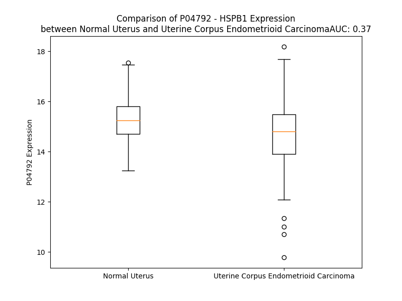

# Detailed Data for P04792

## Introduction to the Detailed Summary

### How to Interpret the Results

- **Summary & Metrics**: This section provides a quick reference to essential protein attributes, including expression changes, family classification, and biomarker applications. Regulation status (upregulated/downregulated) indicates the protein's behavior in a disease context. Some information comes from the original excel file with the proteins selected from literature, while others are derived from the analyses.
- **Expression Comparison**: A visual representation comparing protein expression between normal and disease states. It highlights significant changes in expression levels that might indicate diagnostic or therapeutic relevance. This is data coming from transcriptomics experiments and could not translate similarly to protein levels.
- **Isoform Alignment**: An interactive view of isoform alignments, revealing structural and functional differences between variants of the protein.
- **Interactors & Homologs**: Tables listing known interaction partners and homologous proteins, the more interactors and homologs, the more complex the protein is to design an antibody for.
- **Biological Assemblies**: Information about the structural arrangement of the protein in different assemblies, providing insights into its functional state but also the complexity of the protein to develop antibodies.
- **Combined Per-Residue Information**: A detailed table summarizing residue-level data. This includes predictions for epitope regions, aggregation tendencies, and modifications that might impact the protein's function. Each row corresponds to a residue in the protein, providing insights into specific sites that may be important for research or drug development.
## Summary & Metrics

- **UniProt Accession**: P04792
- **Gene Name**: HSPB1
- **Protein Name**: heat shock 27kDa protein 1
- **Swiss Prot**: HSPB1_HUMAN
- **Family**: other
- **Biomarker Application**: diagnosis
- **Number of Isoforms**: 0
- **Regulation**: -1
- **(transcriptomics) AUC**: 0.37
- **(transcriptomics) Fold Change**: 1.04
- **(transcriptomics) Regulation**: Downregulated
- **Discotope Epitope Count**: 27
- **Max n_uniprots (Homo)**: 10
- **Max n_uniprots (Hetero)**: N/A

## Expression Comparison

## Interactors

| preferredName_A   | preferredName_B   |   score |
|:------------------|:------------------|--------:|
| HSPB1             | MAPKAPK2          |   0.999 |
| HSPB1             | MAPKAPK5          |   0.995 |
| HSPB1             | CYCS              |   0.993 |
| HSPB1             | HSPA4             |   0.992 |
| HSPB1             | AKT1              |   0.991 |
| HSPB1             | EIF4G1            |   0.99  |
| HSPB1             | HSPA8             |   0.988 |
| HSPB1             | BAG3              |   0.98  |
| HSPB1             | MAPKAPK3          |   0.979 |
| HSPB1             | HSPA1A            |   0.977 |
| HSPB1             | DAXX              |   0.964 |
| HSPB1             | PLEC              |   0.964 |
| HSPB1             | HSP90AA1          |   0.957 |
| HSPB1             | TP53              |   0.955 |
| HSPB1             | HSP90AB1          |   0.952 |
| HSPB1             | CRYAB             |   0.94  |
| HSPB1             | HSPB8             |   0.94  |
| HSPB1             | HSPA1B            |   0.939 |
| HSPB1             | HNRNPD            |   0.911 |
| HSPB1             | HSPBAP1           |   0.911 |
| HSPB1             | MAPK14            |   0.91  |
| HSPB1             | HSPB6             |   0.902 |

## Homologs

| uniprot_id   | gene_id   |
|:-------------|:----------|
| Q16082       | HSPB2     |
| Q68DG0       | HSPB7     |
| Q6ICS9       | HSPB3     |
| Q9UJY1       | HSPB8     |
| E9PNH7       | CRYAB     |
| Q9BQS6       | HSPB9     |
| V9HWB6       | HEL55     |
| A0A8C8KJZ9   | CRYAA     |

## Biological Assemblies

|   Unnamed: 0 |   assembly |   n_uniprots | composition   | crystal_id   |
|-------------:|-----------:|-------------:|:--------------|:-------------|
|            0 |          1 |            4 | Homo          | 4mjh         |
|            1 |          2 |            2 | Homo          | 4mjh         |
|            2 |          3 |            2 | Homo          | 4mjh         |
|            0 |          1 |            1 | Homo          | 3q9q         |
|            1 |          2 |            1 | Homo          | 3q9q         |
|            0 |          1 |            2 | Homo          | 2n3j         |
|            0 |          1 |           10 | Homo          | 6dv5         |
|            0 |          1 |            8 | Homo          | 6gjh         |
|            0 |          1 |            1 | Homo          | 3q9p         |

## Combined Per-Residue Information

|   res | aa   |   epitope_score | epitope   |   relative_surface_accessibility |   modeling_confidence |   Aggregation | modification                                      |
|------:|:-----|----------------:|:----------|---------------------------------:|----------------------:|--------------:|:--------------------------------------------------|
|     1 | M    |         0.189   | False     |                          1.08358 |                 41.93 |             0 | N/A                                               |
|     2 | T    |         0.22207 | False     |                          0.95134 |                 51.52 |             0 | N/A                                               |
|     3 | E    |         0.16568 | False     |                          0.62568 |                 52.88 |             0 | N/A                                               |
|     4 | R    |         0.25471 | False     |                          0.64836 |                 65.56 |             0 | N/A                                               |
|     5 | R    |         0.25831 | False     |                          0.85377 |                 70.56 |             0 | N/A                                               |
|     6 | V    |         0.14233 | False     |                          0.26299 |                 60.29 |             0 | N/A                                               |
|     7 | P    |         0.22238 | False     |                          0.84916 |                 53.05 |             0 | N/A                                               |
|     8 | F    |         0.32405 | True      |                          0.81789 |                 51.81 |             0 | N/A                                               |
|     9 | S    |         0.18624 | False     |                          0.68963 |                 53.25 |             0 | N/A                                               |
|    10 | L    |         0.22178 | False     |                          0.6314  |                 46.02 |             0 | N/A                                               |
|    11 | L    |         0.2323  | False     |                          1.13936 |                 43.14 |             0 | N/A                                               |
|    12 | R    |         0.27427 | False     |                          0.9446  |                 38.66 |             0 | Omega-N-methylarginine                            |
|    13 | G    |         0.22173 | False     |                          0.77074 |                 44.94 |             0 | N/A                                               |
|    14 | P    |         0.24575 | False     |                          0.89447 |                 39.04 |             0 | N/A                                               |
|    15 | S    |         0.17203 | False     |                          0.85549 |                 44.58 |             0 | Phosphoserine; by MAPKAPK2 and MAPKAPK3           |
|    16 | W    |         0.39581 | True      |                          1.07531 |                 34.93 |             0 | N/A                                               |
|    17 | D    |         0.32726 | True      |                          0.5881  |                 42.07 |             0 | N/A                                               |
|    18 | P    |         0.39654 | True      |                          0.82206 |                 40.44 |             0 | N/A                                               |
|    19 | F    |         0.32518 | True      |                          0.81545 |                 50.42 |             0 | N/A                                               |
|    20 | R    |         0.29078 | False     |                          0.88596 |                 49.43 |             0 | N/A                                               |
|    21 | D    |         0.29085 | False     |                          0.81356 |                 40.33 |             0 | N/A                                               |
|    22 | W    |         0.38511 | True      |                          0.96664 |                 38.28 |             0 | N/A                                               |
|    23 | Y    |         0.28306 | False     |                          0.72256 |                 37.69 |             0 | N/A                                               |
|    24 | P    |         0.30268 | True      |                          0.74102 |                 38.38 |             0 | N/A                                               |
|    25 | H    |         0.26138 | False     |                          0.87088 |                 29.27 |             0 | N/A                                               |
|    26 | S    |         0.23846 | False     |                          0.54363 |                 30.37 |             0 | Phosphoserine                                     |
|    27 | R    |         0.19369 | False     |                          0.82794 |                 39.79 |             0 | N/A                                               |
|    28 | L    |         0.25668 | False     |                          1.00365 |                 39.95 |             0 | N/A                                               |
|    29 | F    |         0.23366 | False     |                          0.9097  |                 35.42 |             0 | N/A                                               |
|    30 | D    |         0.16545 | False     |                          0.35982 |                 38.74 |             0 | N/A                                               |
|    31 | Q    |         0.19728 | False     |                          0.80047 |                 48.05 |             0 | N/A                                               |
|    32 | A    |         0.10303 | False     |                          0.30649 |                 43.84 |             0 | N/A                                               |
|    33 | F    |         0.0936  | False     |                          0.45989 |                 40.32 |             0 | N/A                                               |
|    34 | G    |         0.19853 | False     |                          0.62064 |                 40.28 |             0 | N/A                                               |
|    35 | L    |         0.18781 | False     |                          0.85577 |                 45.16 |             0 | N/A                                               |
|    36 | P    |         0.20261 | False     |                          0.69572 |                 43.05 |             0 | N/A                                               |
|    37 | R    |         0.25519 | False     |                          0.81337 |                 44.13 |             0 | N/A                                               |
|    38 | L    |         0.2509  | False     |                          0.49658 |                 51.29 |             0 | N/A                                               |
|    39 | P    |         0.25486 | False     |                          0.52336 |                 49.37 |             0 | N/A                                               |
|    40 | E    |         0.16968 | False     |                          0.77677 |                 55.76 |             0 | N/A                                               |
|    41 | E    |         0.2076  | False     |                          0.63977 |                 51.06 |             0 | N/A                                               |
|    42 | W    |         0.17202 | False     |                          0.6717  |                 51.23 |             0 | N/A                                               |
|    43 | S    |         0.11561 | False     |                          0.42186 |                 53.05 |             0 | N/A                                               |
|    44 | Q    |         0.11614 | False     |                          0.66436 |                 45.25 |             0 | N/A                                               |
|    45 | W    |         0.16825 | False     |                          0.65592 |                 47.76 |             0 | N/A                                               |
|    46 | L    |         0.25649 | False     |                          0.55273 |                 49.16 |             0 | N/A                                               |
|    47 | G    |         0.21948 | False     |                          0.85118 |                 49.02 |             0 | N/A                                               |
|    48 | G    |         0.10924 | False     |                          0.37476 |                 42.9  |             0 | N/A                                               |
|    49 | S    |         0.10376 | False     |                          0.99078 |                 46.96 |             0 | N/A                                               |
|    50 | S    |         0.19794 | False     |                          0.5933  |                 42.36 |             0 | N/A                                               |
|    51 | W    |         0.26144 | False     |                          0.70947 |                 45.9  |             0 | N/A                                               |
|    52 | P    |         0.16948 | False     |                          0.90896 |                 40.82 |             0 | N/A                                               |
|    53 | G    |         0.28205 | False     |                          0.841   |                 50.18 |             0 | N/A                                               |
|    54 | Y    |         0.2046  | False     |                          0.90053 |                 47.76 |             0 | N/A                                               |
|    55 | V    |         0.17101 | False     |                          1.01592 |                 46.59 |             0 | N/A                                               |
|    56 | R    |         0.22091 | False     |                          0.85657 |                 50.94 |             0 | N/A                                               |
|    57 | P    |         0.21559 | False     |                          0.89675 |                 45.98 |             0 | N/A                                               |
|    58 | L    |         0.2086  | False     |                          0.9972  |                 49.73 |             0 | N/A                                               |
|    59 | P    |         0.23369 | False     |                          0.79359 |                 51.64 |             0 | N/A                                               |
|    60 | P    |         0.21112 | False     |                          1.00683 |                 39.97 |             0 | N/A                                               |
|    61 | A    |         0.23562 | False     |                          0.90914 |                 46.77 |             0 | N/A                                               |
|    62 | A    |         0.18627 | False     |                          0.96032 |                 42.12 |             0 | N/A                                               |
|    63 | I    |         0.27126 | False     |                          1.04951 |                 41.77 |             0 | N/A                                               |
|    64 | E    |         0.23668 | False     |                          0.87688 |                 42.41 |             0 | N/A                                               |
|    65 | S    |         0.39746 | True      |                          0.81633 |                 42.05 |             0 | Phosphoserine                                     |
|    66 | P    |         0.16833 | False     |                          0.84002 |                 42.02 |             0 | N/A                                               |
|    67 | A    |         0.28451 | False     |                          0.96326 |                 39.7  |             0 | N/A                                               |
|    68 | V    |         0.21001 | False     |                          0.9092  |                 44.83 |             0 | N/A                                               |
|    69 | A    |         0.26375 | False     |                          0.73395 |                 45.94 |             0 | N/A                                               |
|    70 | A    |         0.25698 | False     |                          0.67844 |                 51.19 |             0 | N/A                                               |
|    71 | P    |         0.27229 | False     |                          0.6762  |                 47.37 |             0 | N/A                                               |
|    72 | A    |         0.23041 | False     |                          0.69318 |                 51.37 |             0 | N/A                                               |
|    73 | Y    |         0.3082  | True      |                          0.52287 |                 45.57 |             0 | N/A                                               |
|    74 | S    |         0.17516 | False     |                          0.45292 |                 56.17 |             0 | N/A                                               |
|    75 | R    |         0.2657  | False     |                          0.73142 |                 57.32 |             0 | N/A                                               |
|    76 | A    |         0.31874 | True      |                          0.42613 |                 54.56 |             0 | N/A                                               |
|    77 | L    |         0.205   | False     |                          0.56798 |                 55    |             0 | N/A                                               |
|    78 | S    |         0.16382 | False     |                          0.5085  |                 56.26 |             0 | Phosphoserine; by MAPKAPK2, MAPKAPK3 and MAPKAPK5 |
|    79 | R    |         0.386   | True      |                          0.53367 |                 55.37 |             0 | N/A                                               |
|    80 | Q    |         0.27557 | False     |                          0.46775 |                 47.95 |             0 | N/A                                               |
|    81 | L    |         0.22794 | False     |                          0.7646  |                 46.29 |             0 | N/A                                               |
|    82 | S    |         0.12894 | False     |                          0.25447 |                 47.87 |             0 | Phosphoserine; by MAPKAPK2, MAPKAPK3 and MAPKAPK5 |
|    83 | S    |         0.15029 | False     |                          0.05531 |                 52.08 |             0 | Phosphoserine                                     |
|    84 | G    |         0.04733 | False     |                          0.04736 |                 53.75 |             0 | N/A                                               |
|    85 | V    |         0.14983 | False     |                          0.60324 |                 62.53 |             0 | N/A                                               |
|    86 | S    |         0.19256 | False     |                          0.19745 |                 74.64 |             0 | Phosphoserine                                     |
|    87 | E    |         0.16037 | False     |                          0.36149 |                 79.91 |             0 | N/A                                               |
|    88 | I    |         0.28334 | False     |                          0.46204 |                 83.95 |             0 | N/A                                               |
|    89 | R    |         0.27965 | False     |                          0.55849 |                 81.3  |             0 | N/A                                               |
|    90 | H    |         0.28178 | False     |                          0.64709 |                 80.15 |             0 | N/A                                               |
|    91 | T    |         0.25526 | False     |                          0.52937 |                 81.01 |             0 | N/A                                               |
|    92 | A    |         0.28344 | False     |                          0.886   |                 80.88 |             0 | N/A                                               |
|    93 | D    |         0.15194 | False     |                          0.55729 |                 87.73 |             0 | N/A                                               |
|    94 | R    |         0.30038 | True      |                          0.42175 |                 91.28 |             0 | N/A                                               |
|    95 | W    |         0.0129  | False     |                          0.00686 |                 92.77 |             0 | N/A                                               |
|    96 | R    |         0.1887  | False     |                          0.2968  |                 94.11 |             0 | N/A                                               |
|    97 | V    |         0.00479 | False     |                          0.0019  |                 91.97 |             0 | N/A                                               |
|    98 | S    |         0.20619 | False     |                          0.22054 |                 92.39 |             0 | Phosphoserine                                     |
|    99 | L    |         0.01329 | False     |                          0.00483 |                 91.23 |             0 | N/A                                               |
|   100 | D    |         0.0502  | False     |                          0.10302 |                 89.97 |             0 | N/A                                               |
|   101 | V    |         0.03868 | False     |                          0.03018 |                 91    |             0 | N/A                                               |
|   102 | N    |         0.26298 | False     |                          0.34146 |                 88.96 |             0 | N/A                                               |
|   103 | H    |         0.19995 | False     |                          0.3785  |                 88.54 |             0 | N/A                                               |
|   104 | F    |         0.11328 | False     |                          0.08503 |                 92.01 |             0 | N/A                                               |
|   105 | A    |         0.32004 | True      |                          0.43263 |                 92.49 |             0 | N/A                                               |
|   106 | P    |         0.16698 | False     |                          0.49085 |                 94.99 |             0 | N/A                                               |
|   107 | D    |         0.34171 | True      |                          0.87805 |                 96.03 |             0 | N/A                                               |
|   108 | E    |         0.16852 | False     |                          0.10787 |                 95.31 |             0 | N/A                                               |
|   109 | L    |         0.14341 | False     |                          0.14844 |                 96.38 |             0 | N/A                                               |
|   110 | T    |         0.09162 | False     |                          0.3735  |                 97.56 |             0 | N/A                                               |
|   111 | V    |         0.08358 | False     |                          0.12117 |                 97.08 |             0 | N/A                                               |
|   112 | K    |         0.12713 | False     |                          0.30717 |                 96.82 |             0 | N/A                                               |
|   113 | T    |         0.1152  | False     |                          0.18876 |                 95.6  |             0 | N/A                                               |
|   114 | K    |         0.16316 | False     |                          0.57211 |                 93.32 |             0 | N/A                                               |
|   115 | D    |         0.1975  | False     |                          0.72606 |                 93.28 |             0 | N/A                                               |
|   116 | G    |         0.09066 | False     |                          0.44508 |                 92.05 |             0 | N/A                                               |
|   117 | V    |         0.18784 | False     |                          0.29318 |                 94.6  |             0 | N/A                                               |
|   118 | V    |         0.00254 | False     |                          0.00095 |                 95.6  |             0 | N/A                                               |
|   119 | E    |         0.09511 | False     |                          0.25922 |                 95.69 |             0 | N/A                                               |
|   120 | I    |         0.0063  | False     |                          0.0008  |                 95.35 |             0 | N/A                                               |
|   121 | T    |         0.23393 | False     |                          0.30284 |                 95.9  |             0 | N/A                                               |
|   122 | G    |         0.00997 | False     |                          0.00119 |                 95.48 |             0 | N/A                                               |
|   123 | K    |         0.29201 | False     |                          0.6066  |                 96.04 |             0 | N6-acetyllysine                                   |
|   124 | H    |         0.29878 | True      |                          0.12004 |                 92.88 |             0 | N/A                                               |
|   125 | E    |         0.27919 | False     |                          0.47069 |                 94.01 |             0 | N/A                                               |
|   126 | E    |         0.58969 | True      |                          0.63409 |                 93.61 |             0 | N/A                                               |
|   127 | R    |         0.50799 | True      |                          0.4788  |                 89.04 |             0 | N/A                                               |
|   128 | Q    |         0.34497 | True      |                          0.70845 |                 88.82 |             0 | N/A                                               |
|   129 | D    |         0.4119  | True      |                          0.32339 |                 82.87 |             0 | N/A                                               |
|   130 | E    |         0.5709  | True      |                          0.8564  |                 80.94 |             0 | N/A                                               |
|   131 | H    |         0.55622 | True      |                          0.59658 |                 81.19 |             0 | N/A                                               |
|   132 | G    |         0.54347 | True      |                          0.37209 |                 88.56 |             0 | N/A                                               |
|   133 | Y    |         0.50638 | True      |                          0.71044 |                 88.09 |             0 | N/A                                               |
|   134 | I    |         0.39865 | True      |                          0.21039 |                 87.33 |             0 | N/A                                               |
|   135 | S    |         0.39195 | True      |                          0.53781 |                 90.8  |             0 | N/A                                               |
|   136 | R    |         0.34143 | True      |                          0.26374 |                 90.14 |             0 | N/A                                               |
|   137 | C    |         0.249   | False     |                          0.77095 |                 91.94 |             0 | N/A                                               |
|   138 | F    |         0.21373 | False     |                          0.07816 |                 92.63 |             0 | N/A                                               |
|   139 | T    |         0.15295 | False     |                          0.5394  |                 92.33 |             0 | N/A                                               |
|   140 | R    |         0.24056 | False     |                          0.18187 |                 91.28 |             0 | N/A                                               |
|   141 | K    |         0.2465  | False     |                          0.6429  |                 93.44 |             0 | N/A                                               |
|   142 | Y    |         0.15477 | False     |                          0.07911 |                 92.33 |             0 | N/A                                               |
|   143 | T    |         0.16682 | False     |                          0.7671  |                 92.84 |             0 | N/A                                               |
|   144 | L    |         0.06288 | False     |                          0.08209 |                 92.62 |             0 | N/A                                               |
|   145 | P    |         0.10416 | False     |                          0.12368 |                 91.45 |             0 | N/A                                               |
|   146 | P    |         0.24749 | False     |                          0.94006 |                 89.71 |             0 | N/A                                               |
|   147 | G    |         0.29367 | False     |                          0.75829 |                 90.1  |             0 | N/A                                               |
|   148 | V    |         0.09126 | False     |                          0.08856 |                 92.06 |             0 | N/A                                               |
|   149 | D    |         0.18777 | False     |                          0.38205 |                 92    |             0 | N/A                                               |
|   150 | P    |         0.18973 | False     |                          0.46387 |                 93.11 |             0 | N/A                                               |
|   151 | T    |         0.20809 | False     |                          0.53754 |                 92.79 |             0 | N/A                                               |
|   152 | Q    |         0.16862 | False     |                          0.50034 |                 93.88 |             0 | N/A                                               |
|   153 | V    |         0.0454  | False     |                          0.05233 |                 95.73 |             0 | N/A                                               |
|   154 | S    |         0.21043 | False     |                          0.41332 |                 96.47 |             0 | N/A                                               |
|   155 | S    |         0.13538 | False     |                          0.17473 |                 96.37 |             0 | N/A                                               |
|   156 | S    |         0.17281 | False     |                          0.45741 |                 96.57 |             0 | N/A                                               |
|   157 | L    |         0.21497 | False     |                          0.28533 |                 95.55 |             0 | N/A                                               |
|   158 | S    |         0.30197 | True      |                          0.29038 |                 93.19 |             0 | N/A                                               |
|   159 | P    |         0.25299 | False     |                          0.95605 |                 90.84 |             0 | N/A                                               |
|   160 | E    |         0.19881 | False     |                          0.57517 |                 87.96 |             0 | N/A                                               |
|   161 | G    |         0.08817 | False     |                          0.12232 |                 89.75 |             0 | N/A                                               |
|   162 | T    |         0.15003 | False     |                          0.32558 |                 92.28 |             0 | N/A                                               |
|   163 | L    |         0.07843 | False     |                          0.04882 |                 95.16 |             0 | N/A                                               |
|   164 | T    |         0.10498 | False     |                          0.19342 |                 95.46 |             0 | N/A                                               |
|   165 | V    |         0.00444 | False     |                          0.00095 |                 95.99 |             0 | N/A                                               |
|   166 | E    |         0.15406 | False     |                          0.24624 |                 95.76 |             0 | N/A                                               |
|   167 | A    |         0.03981 | False     |                          0.02801 |                 95.29 |             0 | N/A                                               |
|   168 | P    |         0.19547 | False     |                          0.49869 |                 94.62 |             0 | N/A                                               |
|   169 | M    |         0.15248 | False     |                          0.23096 |                 91.64 |             0 | N/A                                               |
|   170 | P    |         0.17264 | False     |                          0.4201  |                 87.05 |             0 | N/A                                               |
|   171 | K    |         0.12967 | False     |                          0.88745 |                 80.35 |             0 | N/A                                               |
|   172 | L    |         0.16007 | False     |                          1.02148 |                 66.85 |             0 | N/A                                               |
|   173 | A    |         0.15296 | False     |                          0.81445 |                 57.39 |             0 | N/A                                               |
|   174 | T    |         0.18986 | False     |                          0.89411 |                 52.11 |             0 | Phosphothreonine                                  |
|   175 | Q    |         0.21024 | False     |                          0.73856 |                 50.32 |             0 | N/A                                               |
|   176 | S    |         0.14023 | False     |                          0.63589 |                 50.8  |             0 | Phosphoserine                                     |
|   177 | N    |         0.20778 | False     |                          0.8524  |                 61.52 |             0 | N/A                                               |
|   178 | E    |         0.15845 | False     |                          0.75423 |                 70.97 |             0 | N/A                                               |
|   179 | I    |         0.22072 | False     |                          0.80921 |                 78.08 |             0 | N/A                                               |
|   180 | T    |         0.13723 | False     |                          0.83866 |                 81.9  |             0 | N/A                                               |
|   181 | I    |         0.2821  | False     |                          0.8198  |                 83.67 |             0 | N/A                                               |
|   182 | P    |         0.24764 | False     |                          0.80633 |                 85.66 |             0 | N/A                                               |
|   183 | V    |         0.20191 | False     |                          1.0369  |                 82.65 |             0 | N/A                                               |
|   184 | T    |         0.20416 | False     |                          0.82817 |                 82.4  |             0 | N/A                                               |
|   185 | F    |         0.1747  | False     |                          0.93056 |                 81.61 |             0 | N/A                                               |
|   186 | E    |         0.15119 | False     |                          0.83569 |                 75.49 |             0 | N/A                                               |
|   187 | S    |         0.1538  | False     |                          0.62895 |                 70.5  |             0 | N/A                                               |
|   188 | R    |         0.20853 | False     |                          0.8967  |                 58.84 |             0 | N/A                                               |
|   189 | A    |         0.17502 | False     |                          0.75664 |                 54.53 |             0 | N/A                                               |
|   190 | Q    |         0.19081 | False     |                          0.8995  |                 54.52 |             0 | N/A                                               |
|   191 | L    |         0.20687 | False     |                          1.00856 |                 54.92 |             0 | N/A                                               |
|   192 | G    |         0.20435 | False     |                          0.92248 |                 52.78 |             0 | N/A                                               |
|   193 | G    |         0.18591 | False     |                          0.76893 |                 54.91 |             0 | N/A                                               |
|   194 | P    |         0.18532 | False     |                          0.96228 |                 57.75 |             0 | N/A                                               |
|   195 | E    |         0.22575 | False     |                          0.89401 |                 52.69 |             0 | N/A                                               |
|   196 | A    |         0.13094 | False     |                          0.97625 |                 51.6  |             0 | N/A                                               |
|   197 | A    |         0.09843 | False     |                          0.77371 |                 56.54 |             0 | N/A                                               |
|   198 | K    |         0.20057 | False     |                          0.92614 |                 54.66 |             0 | N/A                                               |
|   199 | S    |         0.18358 | False     |                          0.77742 |                 59.8  |             0 | Phosphoserine                                     |
|   200 | D    |         0.16218 | False     |                          0.7996  |                 57.92 |             0 | N/A                                               |
|   201 | E    |         0.1427  | False     |                          0.82918 |                 58.7  |             0 | N/A                                               |
|   202 | T    |         0.16144 | False     |                          0.96223 |                 45.02 |             0 | N/A                                               |
|   203 | A    |         0.16259 | False     |                          0.91079 |                 55.46 |             0 | N/A                                               |
|   204 | A    |         0.14351 | False     |                          0.95663 |                 60.1  |             0 | N/A                                               |
|   205 | K    |         0.1046  | False     |                          1.32432 |                 45.95 |             0 | N/A                                               |

