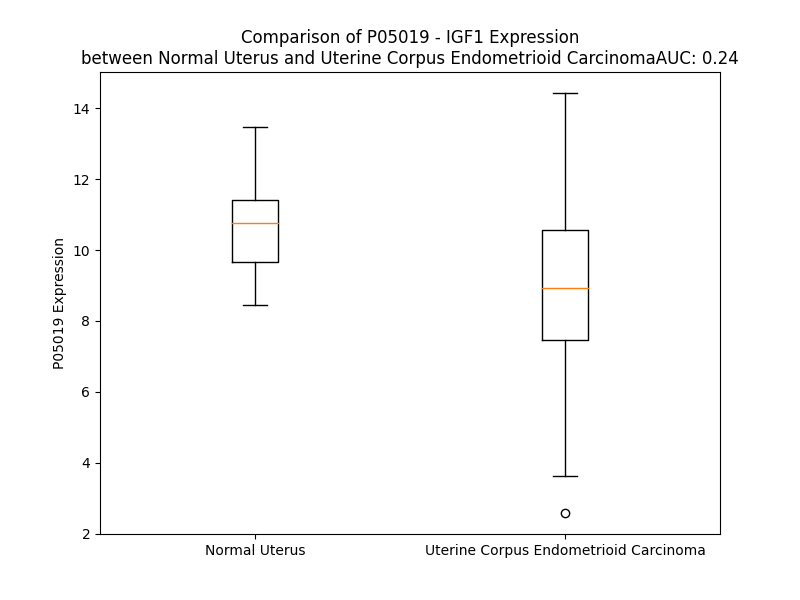

# Detailed Data for P05019

## Introduction to the Detailed Summary

### How to Interpret the Results

- **Summary & Metrics**: This section provides a quick reference to essential protein attributes, including expression changes, family classification, and biomarker applications. Regulation status (upregulated/downregulated) indicates the protein's behavior in a disease context. Some information comes from the original excel file with the proteins selected from literature, while others are derived from the analyses.
- **Expression Comparison**: A visual representation comparing protein expression between normal and disease states. It highlights significant changes in expression levels that might indicate diagnostic or therapeutic relevance. This is data coming from transcriptomics experiments and could not translate similarly to protein levels.
- **Isoform Alignment**: An interactive view of isoform alignments, revealing structural and functional differences between variants of the protein.
- **Interactors & Homologs**: Tables listing known interaction partners and homologous proteins, the more interactors and homologs, the more complex the protein is to design an antibody for.
- **Biological Assemblies**: Information about the structural arrangement of the protein in different assemblies, providing insights into its functional state but also the complexity of the protein to develop antibodies.
- **Combined Per-Residue Information**: A detailed table summarizing residue-level data. This includes predictions for epitope regions, aggregation tendencies, and modifications that might impact the protein's function. Each row corresponds to a residue in the protein, providing insights into specific sites that may be important for research or drug development.
## Summary & Metrics

- **UniProt Accession**: P05019
- **Gene Name**: IGF1
- **Protein Name**: Insulin-like growth factor I
- **Swiss Prot**: IGF1_HUMAN
- **Family**: growth factor
- **Biomarker Application**: diagnosis,disease progression,efficacy,prognosis,response to therapy,safety
- **Number of Isoforms**: 4
- **Regulation**: -1
- **(transcriptomics) AUC**: 0.18
- **(transcriptomics) Fold Change**: 1.26
- **(transcriptomics) Regulation**: Downregulated
- **Discotope Epitope Count**: 38
- **Max n_uniprots (Homo)**: 2
- **Max n_uniprots (Hetero)**: 4

## Expression Comparison

## Isoform Alignment

<pre style='font-size:14px; font-family:monospace;'>P05019-1 MGKISSLPTQLFKCCFCDFLKVKMHTMSSSHLFYLALCLLTFTSSATAGPETLCGAELVDALQFVCGDRGFYFNKPTGYGSSSRRAPQTGIVDECCFRSCDLRRLEMYCAPLKPAKSARSVRAQRHTDMPKTQKYQPPSTNKNTKSQRRKGWPKTHPGGEQKEGTEASLQIRGKKKEQRREIGSRNAECRGKKGK
P05019-2 MGKISSLPTQLFKCCFCDFLKVKMHTMSSSHLFYLALCLLTFTSSATAGPETLCGAELVDALQFVCGDRGFYFNKPTGYGSSSRRAPQTGIVDECCFRSCDLRRLEMYCAPLKPAKSARSVRAQRHTDMPKTQKEVHLKNASRG-SAGNKNYRM-----------------------------------------
P05019-3 ----------------MITPTVKMHTMSSSHLFYLALCLLTFTSSATAGPETLCGAELVDALQFVCGDRGFYFNKPTGYGSSSRRAPQTGIVDECCFRSCDLRRLEMYCAPLKPAKSARSVRAQRHTDMPKTQKEVHLKNASRG-SAGNKNYRM-----------------------------------------
P05019-4 MGKISSLPTQLFKCCFCDFLKVKMHTMSSSHLFYLALCLLTFTSSATAGPETLCGAELVDALQFVCGDRGFYFNKPTGYGSSSRRAPQTGIVDECCFRSCDLRRLEMYCAPLKPAKSARSVRAQRHTDMPKTQKYQPPSTNKNTKSQRRKGSTFEERK-------------------------------------
</pre>

## Interactors

| preferredName_A   | preferredName_B   |   score |
|:------------------|:------------------|--------:|
| IGF1              | IGFBP5            |   0.999 |
| IGF1              | INSR              |   0.999 |
| IGF1              | IGFBP3            |   0.999 |
| IGF1              | IGF1R             |   0.999 |
| IGF1              | INS               |   0.999 |
| IGF1              | IGFBP4            |   0.999 |
| IGF1              | IGFBP2            |   0.999 |
| IGF1              | IGFBP6            |   0.999 |
| IGF1              | IGFALS            |   0.999 |
| IGF1              | IGFBP1            |   0.999 |
| IGF1              | IRS1              |   0.998 |
| IGF1              | IGF2              |   0.998 |
| IGF1              | IGF2R             |   0.995 |
| IGF1              | EGF               |   0.995 |
| IGF1              | IGFBP7            |   0.995 |
| IGF1              | ERBB2             |   0.992 |
| IGF1              | EGFR              |   0.991 |
| IGF1              | HSPB3             |   0.991 |
| IGF1              | NTRK1             |   0.99  |
| IGF1              | VTN               |   0.989 |
| IGF1              | DCN               |   0.989 |
| IGF1              | FCGR1A            |   0.987 |
| IGF1              | IRS2              |   0.984 |
| IGF1              | TGFA              |   0.98  |
| IGF1              | GRB10             |   0.977 |
| IGF1              | TGFB1             |   0.976 |
| IGF1              | ESR1              |   0.964 |
| IGF1              | ITGB3             |   0.961 |
| IGF1              | GHR               |   0.956 |
| IGF1              | PDGFC             |   0.956 |
| IGF1              | PDGFA             |   0.949 |
| IGF1              | PDGFB             |   0.949 |
| IGF1              | GHRL              |   0.948 |
| IGF1              | AKT1              |   0.935 |
| IGF1              | PDGFD             |   0.931 |
| IGF1              | PDGFRB            |   0.926 |
| IGF1              | TRPV2             |   0.922 |
| IGF1              | GHRH              |   0.916 |
| IGF1              | KDR               |   0.914 |
| IGF1              | IL6               |   0.913 |
| IGF1              | PTH               |   0.911 |
| IGF1              | GH1               |   0.91  |
| IGF1              | FOXO1             |   0.91  |
| IGF1              | MET               |   0.908 |
| IGF1              | LEP               |   0.907 |
| IGF1              | FN1               |   0.907 |

## Homologs

| uniprot_id   | gene_id   |
|:-------------|:----------|
| P01344       | IGF2      |
| C9JNR5       | INS       |

## Biological Assemblies

|   Unnamed: 0 |   assembly |   n_uniprots | composition   | crystal_id   |
|-------------:|-----------:|-------------:|:--------------|:-------------|
|            0 |          1 |            1 | Homo          | 1gzz         |
|            0 |          1 |            1 | Homo          | 1bqt         |
|            0 |          1 |            1 | Homo          | 1gzr         |
|            0 |          1 |            2 | Hetero        | 1wqj         |
|            0 |          1 |            1 | Homo          | 2gf1         |
|            0 |          1 |            1 | Homo          | 3gf1         |
|            0 |          1 |            1 | Homo          | 1pmx         |
|            0 |          1 |            3 | Hetero        | 2dsr         |
|            0 |          1 |            1 | Homo          | 1tgr         |
|            1 |          2 |            1 | Homo          | 1tgr         |
|            2 |          3 |            2 | Homo          | 1tgr         |
|            0 |          1 |            3 | Hetero        | 7s0q         |
|            0 |          1 |            2 | Hetero        | 6ff3         |
|            0 |          1 |            1 | Homo          | 1gzy         |
|            0 |          1 |            1 | Homo          | 1h02         |
|            0 |          1 |            3 | Hetero        | 6pyh         |
|            0 |          1 |            4 | Hetero        | 8eyr         |
|            0 |          1 |            1 | Homo          | 1imx         |
|            0 |          1 |            3 | Hetero        | 7wrq         |
|            0 |          1 |            2 | Hetero        | 1h59         |
|            0 |          1 |            1 | Homo          | 1b9g         |
|            0 |          1 |            2 | Hetero        | 4xss         |
|            1 |          2 |            2 | Hetero        | 4xss         |
|            0 |          1 |            1 | Homo          | 6rva         |
|            0 |          1 |            1 | Homo          | 3lri         |
|            0 |          1 |            3 | Hetero        | 2dsq         |
|            1 |          2 |            3 | Hetero        | 2dsq         |
|            0 |          1 |            2 | Hetero        | 5u8q         |
|            0 |          1 |            4 | Hetero        | 7yrr         |
|            0 |          1 |            2 | Hetero        | 2dsp         |

## Combined Per-Residue Information

|   res | aa   |   epitope_score | epitope   |   relative_surface_accessibility |   modeling_confidence |   Aggregation | modification   |
|------:|:-----|----------------:|:----------|---------------------------------:|----------------------:|--------------:|:---------------|
|     1 | M    |         0.14809 | False     |                          1.35868 |                 37.74 |         0     | N/A            |
|     2 | G    |         0.17951 | False     |                          0.82867 |                 47.97 |         0     | N/A            |
|     3 | K    |         0.19321 | False     |                          0.93656 |                 47.77 |         0     | N/A            |
|     4 | I    |         0.18877 | False     |                          1.09187 |                 57.77 |         0     | N/A            |
|     5 | S    |         0.18584 | False     |                          0.67961 |                 53.89 |         0     | N/A            |
|     6 | S    |         0.15745 | False     |                          0.61285 |                 55.9  |         0     | N/A            |
|     7 | L    |         0.10994 | False     |                          0.84015 |                 54.99 |         0     | N/A            |
|     8 | P    |         0.16872 | False     |                          0.68034 |                 53.43 |         0     | N/A            |
|     9 | T    |         0.10167 | False     |                          0.69216 |                 52.69 |         0     | N/A            |
|    10 | Q    |         0.11081 | False     |                          0.56122 |                 52.76 |         0     | N/A            |
|    11 | L    |         0.13337 | False     |                          0.71508 |                 54.33 |         0     | N/A            |
|    12 | F    |         0.14647 | False     |                          0.70445 |                 53.77 |         0     | N/A            |
|    13 | K    |         0.11014 | False     |                          0.61011 |                 57.27 |         0     | N/A            |
|    14 | C    |         0.08215 | False     |                          0.6241  |                 55.22 |         0     | N/A            |
|    15 | C    |         0.07789 | False     |                          0.63021 |                 52.65 |         0     | N/A            |
|    16 | F    |         0.11248 | False     |                          0.55439 |                 53.83 |         0     | N/A            |
|    17 | C    |         0.08119 | False     |                          0.50449 |                 53.07 |         0     | N/A            |
|    18 | D    |         0.10725 | False     |                          0.59253 |                 53.68 |         0     | N/A            |
|    19 | F    |         0.17883 | False     |                          0.82209 |                 55.44 |         0     | N/A            |
|    20 | L    |         0.13357 | False     |                          0.69471 |                 49.21 |         0     | N/A            |
|    21 | K    |         0.15195 | False     |                          0.86619 |                 54    |         0     | N/A            |
|    22 | V    |         0.08903 | False     |                          0.35512 |                 52.68 |         0     | N/A            |
|    23 | K    |         0.09498 | False     |                          0.6229  |                 46.05 |         0     | N/A            |
|    24 | M    |         0.11492 | False     |                          0.92252 |                 55.15 |         0     | N/A            |
|    25 | H    |         0.08552 | False     |                          0.745   |                 51.94 |         0     | N/A            |
|    26 | T    |         0.09038 | False     |                          0.27176 |                 56.21 |         0.021 | N/A            |
|    27 | M    |         0.06439 | False     |                          0.65772 |                 57.9  |         0.06  | N/A            |
|    28 | S    |         0.06316 | False     |                          0.41399 |                 66.53 |         0.097 | N/A            |
|    29 | S    |         0.0516  | False     |                          0.40061 |                 68.06 |         0.401 | N/A            |
|    30 | S    |         0.07748 | False     |                          0.29849 |                 72.93 |         2.859 | N/A            |
|    31 | H    |         0.10567 | False     |                          0.58367 |                 74.28 |        22.71  | N/A            |
|    32 | L    |         0.10762 | False     |                          0.6563  |                 72.04 |        86.594 | N/A            |
|    33 | F    |         0.07532 | False     |                          0.67885 |                 74.85 |        98.26  | N/A            |
|    34 | Y    |         0.17719 | False     |                          0.66587 |                 78.02 |        99.31  | N/A            |
|    35 | L    |         0.12935 | False     |                          0.48696 |                 73.86 |        99.614 | N/A            |
|    36 | A    |         0.04695 | False     |                          0.48081 |                 76.59 |        99.664 | N/A            |
|    37 | L    |         0.0922  | False     |                          0.44632 |                 70.38 |        99.56  | N/A            |
|    38 | C    |         0.1846  | False     |                          0.53953 |                 69.04 |        98.511 | N/A            |
|    39 | L    |         0.18685 | False     |                          0.68491 |                 69.49 |        98.3   | N/A            |
|    40 | L    |         0.10835 | False     |                          0.71531 |                 66.89 |        97.03  | N/A            |
|    41 | T    |         0.14801 | False     |                          0.60934 |                 64.78 |        90.087 | N/A            |
|    42 | F    |         0.20416 | False     |                          0.66786 |                 59.45 |        85.952 | N/A            |
|    43 | T    |         0.10407 | False     |                          0.57652 |                 54.96 |        35.232 | N/A            |
|    44 | S    |         0.0846  | False     |                          0.52019 |                 53.23 |         5.029 | N/A            |
|    45 | S    |         0.18739 | False     |                          0.30422 |                 51.15 |         1.281 | N/A            |
|    46 | A    |         0.12625 | False     |                          0.70385 |                 50.61 |         0.817 | N/A            |
|    47 | T    |         0.25387 | False     |                          0.81641 |                 48.05 |         0.425 | N/A            |
|    48 | A    |         0.17178 | False     |                          0.81087 |                 48.72 |         0.192 | N/A            |
|    49 | G    |         0.17247 | False     |                          0.63739 |                 40.72 |         0     | N/A            |
|    50 | P    |         0.23759 | False     |                          0.80075 |                 44.69 |         0     | N/A            |
|    51 | E    |         0.22001 | False     |                          0.72933 |                 53.79 |         0     | N/A            |
|    52 | T    |         0.13908 | False     |                          0.50787 |                 47.86 |         0     | N/A            |
|    53 | L    |         0.09855 | False     |                          0.387   |                 54.51 |         0     | N/A            |
|    54 | C    |         0.25471 | False     |                          0.35482 |                 66.52 |         0     | N/A            |
|    55 | G    |         0.21624 | False     |                          0.50208 |                 70.1  |         0     | N/A            |
|    56 | A    |         0.17961 | False     |                          0.6956  |                 73.27 |         0     | N/A            |
|    57 | E    |         0.1431  | False     |                          0.30563 |                 77.14 |         0     | N/A            |
|    58 | L    |         0.07439 | False     |                          0.03297 |                 78.49 |         0     | N/A            |
|    59 | V    |         0.19629 | False     |                          0.33132 |                 82.34 |         0     | N/A            |
|    60 | D    |         0.25056 | False     |                          0.55371 |                 82.93 |         0     | N/A            |
|    61 | A    |         0.1378  | False     |                          0.29938 |                 81.6  |         0.541 | N/A            |
|    62 | L    |         0.01586 | False     |                          0       |                 83.85 |         0.541 | N/A            |
|    63 | Q    |         0.24145 | False     |                          0.57525 |                 82.59 |         0.541 | N/A            |
|    64 | F    |         0.2505  | False     |                          0.88105 |                 84.45 |         0.541 | N/A            |
|    65 | V    |         0.17034 | False     |                          0.18549 |                 85.22 |         0.541 | N/A            |
|    66 | C    |         0.01649 | False     |                          0.00803 |                 86.87 |         0     | N/A            |
|    67 | G    |         0.19663 | False     |                          0.48691 |                 84.91 |         0     | N/A            |
|    68 | D    |         0.3803  | True      |                          0.97864 |                 83.89 |         0     | N/A            |
|    69 | R    |         0.33097 | True      |                          0.34105 |                 83    |         0     | N/A            |
|    70 | G    |         0.20962 | False     |                          0.37251 |                 85.69 |         0     | N/A            |
|    71 | F    |         0.1263  | False     |                          0.25268 |                 84.89 |         0     | N/A            |
|    72 | Y    |         0.22188 | False     |                          0.48707 |                 83.13 |         0     | N/A            |
|    73 | F    |         0.3173  | True      |                          0.52929 |                 78.47 |         0     | N/A            |
|    74 | N    |         0.36575 | True      |                          0.54137 |                 74.67 |         0     | N/A            |
|    75 | K    |         0.27502 | False     |                          0.33523 |                 68.46 |         0     | N/A            |
|    76 | P    |         0.21589 | False     |                          0.32048 |                 59.41 |         0     | N/A            |
|    77 | T    |         0.23003 | False     |                          0.94638 |                 59.13 |         0     | N/A            |
|    78 | G    |         0.39458 | True      |                          0.90464 |                 55.92 |         0     | N/A            |
|    79 | Y    |         0.31739 | True      |                          0.72587 |                 55.54 |         0     | N/A            |
|    80 | G    |         0.40177 | True      |                          0.74158 |                 53.21 |         0     | N/A            |
|    81 | S    |         0.29079 | False     |                          1.00054 |                 56.08 |         0     | N/A            |
|    82 | S    |         0.26787 | False     |                          0.63733 |                 52.87 |         0     | N/A            |
|    83 | S    |         0.32013 | True      |                          0.83153 |                 58.87 |         0     | N/A            |
|    84 | R    |         0.45269 | True      |                          0.86768 |                 55.91 |         0     | N/A            |
|    85 | R    |         0.57191 | True      |                          0.89577 |                 48.37 |         0     | N/A            |
|    86 | A    |         0.33542 | True      |                          0.79191 |                 54.53 |         0     | N/A            |
|    87 | P    |         0.30768 | True      |                          0.74279 |                 54.73 |         0     | N/A            |
|    88 | Q    |         0.39469 | True      |                          0.87481 |                 59.47 |         0     | N/A            |
|    89 | T    |         0.41905 | True      |                          0.45135 |                 60.73 |         0     | N/A            |
|    90 | G    |         0.33353 | True      |                          0.15096 |                 70.43 |         0     | N/A            |
|    91 | I    |         0.02651 | False     |                          0       |                 75.7  |         0     | N/A            |
|    92 | V    |         0.29001 | False     |                          0.44843 |                 72.32 |         0     | N/A            |
|    93 | D    |         0.36928 | True      |                          0.39368 |                 68.52 |         0     | N/A            |
|    94 | E    |         0.30526 | True      |                          0.18    |                 69.78 |         0     | N/A            |
|    95 | C    |         0.05846 | False     |                          0.03183 |                 74.65 |         0     | N/A            |
|    96 | C    |         0.16674 | False     |                          0.05951 |                 74.19 |         0     | N/A            |
|    97 | F    |         0.35746 | True      |                          0.6791  |                 68.11 |         0     | N/A            |
|    98 | R    |         0.32721 | True      |                          0.72173 |                 62.1  |         0     | N/A            |
|    99 | S    |         0.33179 | True      |                          0.90616 |                 64.11 |         0     | N/A            |
|   100 | C    |         0.16893 | False     |                          0.2817  |                 70.18 |         0     | N/A            |
|   101 | D    |         0.34286 | True      |                          0.6406  |                 78.02 |         0     | N/A            |
|   102 | L    |         0.31115 | True      |                          0.6962  |                 75.55 |         0     | N/A            |
|   103 | R    |         0.40795 | True      |                          0.80055 |                 74.81 |         0     | N/A            |
|   104 | R    |         0.32216 | True      |                          0.34822 |                 73.94 |         0     | N/A            |
|   105 | L    |         0.08281 | False     |                          0.07254 |                 81.19 |         0     | N/A            |
|   106 | E    |         0.26447 | False     |                          0.45263 |                 81.81 |         0     | N/A            |
|   107 | M    |         0.22181 | False     |                          0.3225  |                 80.29 |         0     | N/A            |
|   108 | Y    |         0.04659 | False     |                          0.01343 |                 82.68 |         0     | N/A            |
|   109 | C    |         0.07085 | False     |                          0.1123  |                 86.3  |         0     | N/A            |
|   110 | A    |         0.09214 | False     |                          0.1225  |                 84.13 |         0     | N/A            |
|   111 | P    |         0.30821 | True      |                          0.73383 |                 78.86 |         0     | N/A            |
|   112 | L    |         0.24982 | False     |                          0.81199 |                 70.99 |         0     | N/A            |
|   113 | K    |         0.23582 | False     |                          0.90219 |                 59.03 |         0     | N/A            |
|   114 | P    |         0.28169 | False     |                          0.90513 |                 56.17 |         0     | N/A            |
|   115 | A    |         0.22376 | False     |                          0.76831 |                 52.98 |         0     | N/A            |
|   116 | K    |         0.29044 | False     |                          1.0409  |                 54.02 |         0     | N/A            |
|   117 | S    |         0.26908 | False     |                          0.77373 |                 53.63 |         0     | N/A            |
|   118 | A    |         0.23984 | False     |                          0.85373 |                 46.19 |         0     | N/A            |
|   119 | R    |         0.30347 | True      |                          0.78216 |                 49.69 |         0     | N/A            |
|   120 | S    |         0.23846 | False     |                          0.76608 |                 47.65 |         0     | N/A            |
|   121 | V    |         0.33301 | True      |                          0.8023  |                 54.03 |         0     | N/A            |
|   122 | R    |         0.38064 | True      |                          0.90391 |                 52.28 |         0     | N/A            |
|   123 | A    |         0.2723  | False     |                          0.92862 |                 48.64 |         0     | N/A            |
|   124 | Q    |         0.32446 | True      |                          0.62371 |                 50.97 |         0     | N/A            |
|   125 | R    |         0.34956 | True      |                          0.83241 |                 45.71 |         0     | N/A            |
|   126 | H    |         0.34434 | True      |                          0.93091 |                 49.4  |         0     | N/A            |
|   127 | T    |         0.19433 | False     |                          0.93343 |                 54.97 |         0     | N/A            |
|   128 | D    |         0.32528 | True      |                          0.79301 |                 40.27 |         0     | N/A            |
|   129 | M    |         0.28438 | False     |                          0.95129 |                 53.16 |         0     | N/A            |
|   130 | P    |         0.17795 | False     |                          0.81692 |                 42.11 |         0     | N/A            |
|   131 | K    |         0.21907 | False     |                          1.00563 |                 40.37 |         0     | N/A            |
|   132 | T    |         0.24902 | False     |                          0.80855 |                 43.05 |         0     | N/A            |
|   133 | Q    |         0.26632 | False     |                          0.88505 |                 41.43 |         0     | N/A            |
|   134 | K    |         0.24699 | False     |                          0.90643 |                 36.86 |         0     | N/A            |
|   135 | Y    |         0.24878 | False     |                          0.87341 |                 33.28 |         0     | N/A            |
|   136 | Q    |         0.2842  | False     |                          0.83367 |                 38.88 |         0     | N/A            |
|   137 | P    |         0.26049 | False     |                          0.78668 |                 36.63 |         0     | N/A            |
|   138 | P    |         0.24877 | False     |                          0.9177  |                 36.33 |         0     | N/A            |
|   139 | S    |         0.27948 | False     |                          0.74539 |                 36.98 |         0     | N/A            |
|   140 | T    |         0.26951 | False     |                          0.84998 |                 36.84 |         0     | N/A            |
|   141 | N    |         0.28075 | False     |                          0.88969 |                 33.37 |         0     | N/A            |
|   142 | K    |         0.27828 | False     |                          0.9513  |                 39.32 |         0     | N/A            |
|   143 | N    |         0.25316 | False     |                          0.9466  |                 28.03 |         0     | N/A            |
|   144 | T    |         0.29069 | False     |                          0.91154 |                 35.84 |         0     | N/A            |
|   145 | K    |         0.27885 | False     |                          0.96379 |                 27.09 |         0     | N/A            |
|   146 | S    |         0.31335 | True      |                          0.67699 |                 28.97 |         0     | N/A            |
|   147 | Q    |         0.22068 | False     |                          0.76978 |                 33.77 |         0     | N/A            |
|   148 | R    |         0.26495 | False     |                          0.71625 |                 32.75 |         0     | N/A            |
|   149 | R    |         0.24396 | False     |                          0.96123 |                 42.4  |         0     | N/A            |
|   150 | K    |         0.23256 | False     |                          0.81032 |                 32.26 |         0     | N/A            |
|   151 | G    |         0.2118  | False     |                          0.88077 |                 28.02 |         0     | N/A            |
|   152 | W    |         0.17576 | False     |                          0.9674  |                 29.44 |         0     | N/A            |
|   153 | P    |         0.16483 | False     |                          0.72612 |                 37.13 |         0     | N/A            |
|   154 | K    |         0.20868 | False     |                          0.95841 |                 46.37 |         0     | N/A            |
|   155 | T    |         0.1982  | False     |                          0.80512 |                 32.54 |         0     | N/A            |
|   156 | H    |         0.26403 | False     |                          0.89375 |                 37.2  |         0     | N/A            |
|   157 | P    |         0.26206 | False     |                          0.96949 |                 43.87 |         0     | N/A            |
|   158 | G    |         0.30377 | True      |                          0.92953 |                 31.12 |         0     | N/A            |
|   159 | G    |         0.35183 | True      |                          0.9255  |                 35.29 |         0     | N/A            |
|   160 | E    |         0.30758 | True      |                          0.86164 |                 41.75 |         0     | N/A            |
|   161 | Q    |         0.31241 | True      |                          0.90664 |                 40.19 |         0     | N/A            |
|   162 | K    |         0.28655 | False     |                          0.89425 |                 43.03 |         0     | N/A            |
|   163 | E    |         0.27511 | False     |                          0.72743 |                 47.47 |         0     | N/A            |
|   164 | G    |         0.31636 | True      |                          0.76815 |                 47.14 |         0     | N/A            |
|   165 | T    |         0.18697 | False     |                          0.75041 |                 59.79 |         0     | N/A            |
|   166 | E    |         0.18839 | False     |                          0.48535 |                 60.27 |         0     | N/A            |
|   167 | A    |         0.13447 | False     |                          0.51803 |                 62.83 |         0     | N/A            |
|   168 | S    |         0.14292 | False     |                          0.53585 |                 61.46 |         0     | N/A            |
|   169 | L    |         0.17881 | False     |                          0.65936 |                 72.12 |         0     | N/A            |
|   170 | Q    |         0.16795 | False     |                          0.51712 |                 73.59 |         0     | N/A            |
|   171 | I    |         0.14072 | False     |                          0.72194 |                 73.06 |         0     | N/A            |
|   172 | R    |         0.1588  | False     |                          0.71881 |                 74.8  |         0     | N/A            |
|   173 | G    |         0.18456 | False     |                          0.48124 |                 76.62 |         0     | N/A            |
|   174 | K    |         0.18622 | False     |                          0.75492 |                 78.96 |         0     | N/A            |
|   175 | K    |         0.16013 | False     |                          0.76913 |                 79.84 |         0     | N/A            |
|   176 | K    |         0.11991 | False     |                          0.66008 |                 80.42 |         0     | N/A            |
|   177 | E    |         0.15479 | False     |                          0.56782 |                 80.68 |         0     | N/A            |
|   178 | Q    |         0.08994 | False     |                          0.55636 |                 83.01 |         0     | N/A            |
|   179 | R    |         0.11888 | False     |                          0.78609 |                 75.16 |         0     | N/A            |
|   180 | R    |         0.15407 | False     |                          0.62166 |                 80.11 |         0     | N/A            |
|   181 | E    |         0.16321 | False     |                          0.48371 |                 76.92 |         0     | N/A            |
|   182 | I    |         0.13416 | False     |                          0.56429 |                 82.75 |         0     | N/A            |
|   183 | G    |         0.16471 | False     |                          0.46545 |                 78.2  |         0     | N/A            |
|   184 | S    |         0.14129 | False     |                          0.58959 |                 77.98 |         0     | N/A            |
|   185 | R    |         0.16851 | False     |                          0.56154 |                 75.95 |         0     | N/A            |
|   186 | N    |         0.12248 | False     |                          0.51563 |                 73.77 |         0     | N/A            |
|   187 | A    |         0.11046 | False     |                          0.60926 |                 74.74 |         0     | N/A            |
|   188 | E    |         0.1397  | False     |                          0.58228 |                 74.56 |         0     | N/A            |
|   189 | C    |         0.15987 | False     |                          0.70984 |                 64.67 |         0     | N/A            |
|   190 | R    |         0.2575  | False     |                          0.75316 |                 69.87 |         0     | N/A            |
|   191 | G    |         0.13918 | False     |                          0.63655 |                 60.94 |         0     | N/A            |
|   192 | K    |         0.20434 | False     |                          0.79233 |                 63.04 |         0     | N/A            |
|   193 | K    |         0.15727 | False     |                          0.93449 |                 57.91 |         0     | N/A            |
|   194 | G    |         0.13321 | False     |                          0.83518 |                 55.58 |         0     | N/A            |
|   195 | K    |         0.11993 | False     |                          1.22901 |                 50.12 |         0     | N/A            |

