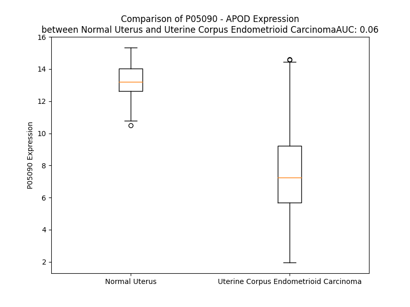

# Detailed Data for P05090

## Introduction to the Detailed Summary

### How to Interpret the Results

- **Summary & Metrics**: This section provides a quick reference to essential protein attributes, including expression changes, family classification, and biomarker applications. Regulation status (upregulated/downregulated) indicates the protein's behavior in a disease context. Some information comes from the original excel file with the proteins selected from literature, while others are derived from the analyses.
- **Expression Comparison**: A visual representation comparing protein expression between normal and disease states. It highlights significant changes in expression levels that might indicate diagnostic or therapeutic relevance. This is data coming from transcriptomics experiments and could not translate similarly to protein levels.
- **Isoform Alignment**: An interactive view of isoform alignments, revealing structural and functional differences between variants of the protein.
- **Interactors & Homologs**: Tables listing known interaction partners and homologous proteins, the more interactors and homologs, the more complex the protein is to design an antibody for.
- **Biological Assemblies**: Information about the structural arrangement of the protein in different assemblies, providing insights into its functional state but also the complexity of the protein to develop antibodies.
- **Combined Per-Residue Information**: A detailed table summarizing residue-level data. This includes predictions for epitope regions, aggregation tendencies, and modifications that might impact the protein's function. Each row corresponds to a residue in the protein, providing insights into specific sites that may be important for research or drug development.
## Summary & Metrics

- **UniProt Accession**: P05090
- **Gene Name**: APOD
- **Protein Name**: Apolipoprotein D
- **Swiss Prot**: APOD_HUMAN
- **Family**: transporter
- **Biomarker Application**: safety
- **Number of Isoforms**: 0
- **Regulation**: 1
- **(transcriptomics) AUC**: 0.02
- **(transcriptomics) Fold Change**: 1.58
- **(transcriptomics) Regulation**: Downregulated
- **Discotope Epitope Count**: 43
- **Max n_uniprots (Homo)**: 1
- **Max n_uniprots (Hetero)**: N/A

## Expression Comparison

## Interactors

| preferredName_A   | preferredName_B   |   score |
|:------------------|:------------------|--------:|
| APOD              | APOA2             |   0.993 |
| APOD              | APOA1             |   0.96  |
| APOD              | CLU               |   0.939 |
| APOD              | APOE              |   0.936 |
| APOD              | LCN1              |   0.908 |

## Homologs

| uniprot_id   | gene_id   |
|--------------|-----------|

## Biological Assemblies

|   Unnamed: 0 |   assembly |   n_uniprots | composition   | crystal_id   |
|-------------:|-----------:|-------------:|:--------------|:-------------|
|            0 |          1 |            1 | Homo          | 2hzq         |
|            0 |          1 |            1 | Homo          | 2hzr         |

## Combined Per-Residue Information

|   res | aa   |   epitope_score | epitope   |   relative_surface_accessibility |   modeling_confidence |   Aggregation | modification                | glycosylation                             |
|------:|:-----|----------------:|:----------|---------------------------------:|----------------------:|--------------:|:----------------------------|:------------------------------------------|
|     1 | M    |         0.1899  | False     |                          1.12697 |                 55.81 |         0.02  | N/A                         | N/A                                       |
|     2 | V    |         0.21505 | False     |                          0.80112 |                 60.19 |        91.321 | N/A                         | N/A                                       |
|     3 | M    |         0.20796 | False     |                          0.8316  |                 55.74 |        94.378 | N/A                         | N/A                                       |
|     4 | L    |         0.21185 | False     |                          0.75078 |                 55.03 |        98.885 | N/A                         | N/A                                       |
|     5 | L    |         0.19007 | False     |                          0.73231 |                 56.16 |        99.57  | N/A                         | N/A                                       |
|     6 | L    |         0.17848 | False     |                          0.71648 |                 56.06 |        99.692 | N/A                         | N/A                                       |
|     7 | L    |         0.1394  | False     |                          0.68963 |                 55.19 |        99.293 | N/A                         | N/A                                       |
|     8 | L    |         0.17028 | False     |                          0.76453 |                 55.55 |        96.92  | N/A                         | N/A                                       |
|     9 | S    |         0.22526 | False     |                          0.56916 |                 56.09 |        83.18  | N/A                         | N/A                                       |
|    10 | A    |         0.15948 | False     |                          0.65492 |                 51.58 |        81.462 | N/A                         | N/A                                       |
|    11 | L    |         0.25515 | False     |                          0.89808 |                 54.8  |        80.009 | N/A                         | N/A                                       |
|    12 | A    |         0.2057  | False     |                          0.76303 |                 54.83 |        72.036 | N/A                         | N/A                                       |
|    13 | G    |         0.23479 | False     |                          0.77016 |                 49.31 |        65.293 | N/A                         | N/A                                       |
|    14 | L    |         0.21777 | False     |                          0.99393 |                 49.35 |        64.686 | N/A                         | N/A                                       |
|    15 | F    |         0.20183 | False     |                          0.96403 |                 49.88 |        61.371 | N/A                         | N/A                                       |
|    16 | G    |         0.15011 | False     |                          0.84237 |                 49.37 |        20.696 | N/A                         | N/A                                       |
|    17 | A    |         0.18064 | False     |                          0.85711 |                 50.05 |        17.035 | N/A                         | N/A                                       |
|    18 | A    |         0.18848 | False     |                          0.91893 |                 51.57 |         7.806 | N/A                         | N/A                                       |
|    19 | E    |         0.25699 | False     |                          0.88706 |                 53.07 |         0     | N/A                         | N/A                                       |
|    20 | G    |         0.37819 | True      |                          0.48724 |                 54.31 |         0     | N/A                         | N/A                                       |
|    21 | Q    |         0.31073 | False     |                          0.22989 |                 63.45 |         0     | Pyrrolidone carboxylic acid | N/A                                       |
|    22 | A    |         0.22562 | False     |                          0.26099 |                 71.74 |         0     | N/A                         | N/A                                       |
|    23 | F    |         0.51969 | True      |                          0.66966 |                 80.8  |         0     | N/A                         | N/A                                       |
|    24 | H    |         0.22184 | False     |                          0.26523 |                 85.16 |         0     | N/A                         | N/A                                       |
|    25 | L    |         0.34381 | True      |                          0.86661 |                 86.19 |         0     | N/A                         | N/A                                       |
|    26 | G    |         0.11682 | False     |                          0.37073 |                 89.37 |         0     | N/A                         | N/A                                       |
|    27 | K    |         0.28141 | False     |                          0.75139 |                 89.77 |         0     | N/A                         | N/A                                       |
|    28 | C    |         0.11583 | False     |                          0.25947 |                 92.77 |         0     | N/A                         | N/A                                       |
|    29 | P    |         0.15834 | False     |                          0.19544 |                 93.32 |         0     | N/A                         | N/A                                       |
|    30 | N    |         0.3885  | True      |                          0.71656 |                 94.19 |         0     | N/A                         | N/A                                       |
|    31 | P    |         0.04573 | False     |                          0.02308 |                 96.79 |         0     | N/A                         | N/A                                       |
|    32 | P    |         0.24913 | False     |                          0.6864  |                 96.68 |         0     | N/A                         | N/A                                       |
|    33 | V    |         0.11264 | False     |                          0.15916 |                 97.77 |         0     | N/A                         | N/A                                       |
|    34 | Q    |         0.22404 | False     |                          0.22523 |                 97.75 |         0     | N/A                         | N/A                                       |
|    35 | E    |         0.21568 | False     |                          0.70956 |                 95.71 |         0     | N/A                         | N/A                                       |
|    36 | N    |         0.36884 | True      |                          0.88726 |                 94.67 |         0     | N/A                         | N/A                                       |
|    37 | F    |         0.11279 | False     |                          0.05644 |                 97.13 |         0     | N/A                         | N/A                                       |
|    38 | D    |         0.25596 | False     |                          0.27538 |                 96.3  |         0     | N/A                         | N/A                                       |
|    39 | V    |         0.18936 | False     |                          0.31025 |                 95.51 |         0     | N/A                         | N/A                                       |
|    40 | N    |         0.34138 | True      |                          0.60442 |                 96.15 |         0     | N/A                         | N/A                                       |
|    41 | K    |         0.24559 | False     |                          0.58524 |                 98.18 |         0     | N/A                         | N/A                                       |
|    42 | Y    |         0.06085 | False     |                          0.02265 |                 98.24 |         0     | N/A                         | N/A                                       |
|    43 | L    |         0.10942 | False     |                          0.25565 |                 98    |         0     | N/A                         | N/A                                       |
|    44 | G    |         0.14918 | False     |                          0.31801 |                 97.97 |         0     | N/A                         | N/A                                       |
|    45 | R    |         0.17472 | False     |                          0.31246 |                 98.29 |         0     | N/A                         | N/A                                       |
|    46 | W    |         0.04451 | False     |                          0       |                 98.77 |         0     | N/A                         | N/A                                       |
|    47 | Y    |         0.11677 | False     |                          0.20003 |                 98.54 |         0     | N/A                         | N/A                                       |
|    48 | E    |         0.04291 | False     |                          0.02244 |                 98.68 |         0     | N/A                         | N/A                                       |
|    49 | I    |         0.09316 | False     |                          0.09019 |                 98.66 |         0     | N/A                         | N/A                                       |
|    50 | E    |         0.14859 | False     |                          0.06528 |                 98.45 |         0     | N/A                         | N/A                                       |
|    51 | K    |         0.1412  | False     |                          0.06463 |                 98.01 |         0     | N/A                         | N/A                                       |
|    52 | I    |         0.11912 | False     |                          0.06139 |                 96.11 |         0     | N/A                         | N/A                                       |
|    53 | P    |         0.15866 | False     |                          0.38731 |                 93.78 |         0     | N/A                         | N/A                                       |
|    54 | T    |         0.23172 | False     |                          0.05625 |                 91.1  |         0     | N/A                         | N/A                                       |
|    55 | T    |         0.49242 | True      |                          0.76959 |                 89.22 |         0     | N/A                         | N/A                                       |
|    56 | F    |         0.55954 | True      |                          0.59269 |                 90.06 |         0     | N/A                         | N/A                                       |
|    57 | E    |         0.30727 | False     |                          0.15317 |                 91.14 |         0     | N/A                         | N/A                                       |
|    58 | N    |         0.51522 | True      |                          0.77597 |                 90.86 |         0     | N/A                         | N/A                                       |
|    59 | G    |         0.257   | False     |                          0.26931 |                 94.41 |         0     | N/A                         | N/A                                       |
|    60 | R    |         0.35944 | True      |                          0.31901 |                 96.75 |         0     | N/A                         | N/A                                       |
|    61 | C    |         0.0347  | False     |                          0.02279 |                 97.54 |         0     | N/A                         | N/A                                       |
|    62 | I    |         0.12743 | False     |                          0.0592  |                 98.09 |         0     | N/A                         | N/A                                       |
|    63 | Q    |         0.08687 | False     |                          0.03575 |                 98.16 |         0     | N/A                         | N/A                                       |
|    64 | A    |         0.16746 | False     |                          0.09131 |                 98.33 |         0     | N/A                         | N/A                                       |
|    65 | N    |         0.19793 | False     |                          0.27887 |                 98.3  |         0     | N/A                         | N-linked (GlcNAc...) (complex) asparagine |
|    66 | Y    |         0.11216 | False     |                          0.04583 |                 98.25 |         0     | N/A                         | N/A                                       |
|    67 | S    |         0.21229 | False     |                          0.36285 |                 97.88 |         0     | N/A                         | N/A                                       |
|    68 | L    |         0.2952  | False     |                          0.63654 |                 96.64 |         0     | N/A                         | N/A                                       |
|    69 | M    |         0.29527 | False     |                          0.31296 |                 95.37 |         0     | N/A                         | N/A                                       |
|    70 | E    |         0.3711  | True      |                          1.004   |                 93.29 |         0     | N/A                         | N/A                                       |
|    71 | N    |         0.35656 | True      |                          0.58564 |                 91.41 |         0     | N/A                         | N/A                                       |
|    72 | G    |         0.31008 | False     |                          0.65399 |                 90.3  |         0     | N/A                         | N/A                                       |
|    73 | K    |         0.30267 | False     |                          0.37    |                 94.22 |         0     | N/A                         | N/A                                       |
|    74 | I    |         0.10561 | False     |                          0.0424  |                 97.43 |         0     | N/A                         | N/A                                       |
|    75 | K    |         0.21914 | False     |                          0.31645 |                 97.8  |         0     | N/A                         | N/A                                       |
|    76 | V    |         0.1564  | False     |                          0.01809 |                 98.04 |         0     | N/A                         | N/A                                       |
|    77 | L    |         0.25604 | False     |                          0.14627 |                 97.8  |         0     | N/A                         | N/A                                       |
|    78 | N    |         0.36364 | True      |                          0.18669 |                 97.6  |         0     | N/A                         | N/A                                       |
|    79 | Q    |         0.06323 | False     |                          0.02968 |                 97.58 |         0     | N/A                         | N/A                                       |
|    80 | E    |         0.16059 | False     |                          0.06693 |                 97.11 |         0     | N/A                         | N/A                                       |
|    81 | L    |         0.25064 | False     |                          0.17057 |                 97.14 |         0     | N/A                         | N/A                                       |
|    82 | R    |         0.4296  | True      |                          0.41852 |                 95.31 |         0     | N/A                         | N/A                                       |
|    83 | A    |         0.3567  | True      |                          1.1275  |                 93.77 |         0     | N/A                         | N/A                                       |
|    84 | D    |         0.39996 | True      |                          0.65799 |                 94.39 |         0     | N/A                         | N/A                                       |
|    85 | G    |         0.31242 | False     |                          0.61905 |                 92.92 |         0     | N/A                         | N/A                                       |
|    86 | T    |         0.36073 | True      |                          0.46721 |                 94.99 |         0     | N/A                         | N/A                                       |
|    87 | V    |         0.31175 | False     |                          0.49527 |                 96.05 |         0     | N/A                         | N/A                                       |
|    88 | N    |         0.53626 | True      |                          0.22998 |                 95.43 |         0     | N/A                         | N/A                                       |
|    89 | Q    |         0.28761 | False     |                          0.51288 |                 95.88 |         0     | N/A                         | N/A                                       |
|    90 | I    |         0.46722 | True      |                          0.45518 |                 95.34 |         0     | N/A                         | N/A                                       |
|    91 | E    |         0.40842 | True      |                          0.43402 |                 96.02 |         0     | N/A                         | N/A                                       |
|    92 | G    |         0.18104 | False     |                          0.09631 |                 96.29 |         0     | N/A                         | N/A                                       |
|    93 | E    |         0.2502  | False     |                          0.3078  |                 97.06 |         0     | N/A                         | N/A                                       |
|    94 | A    |         0.0127  | False     |                          0.0051  |                 97.44 |         0     | N/A                         | N/A                                       |
|    95 | T    |         0.25449 | False     |                          0.33148 |                 95.14 |         0     | N/A                         | N/A                                       |
|    96 | P    |         0.29019 | False     |                          0.40244 |                 91.9  |         0     | N/A                         | N/A                                       |
|    97 | V    |         0.3831  | True      |                          0.61033 |                 87.73 |         0     | N/A                         | N/A                                       |
|    98 | N    |         0.41526 | True      |                          0.49211 |                 87.5  |         0     | N/A                         | N-linked (GlcNAc...) (complex) asparagine |
|    99 | L    |         0.3891  | True      |                          0.99586 |                 84.67 |         0     | N/A                         | N/A                                       |
|   100 | T    |         0.31559 | False     |                          0.78433 |                 90.03 |         0     | N/A                         | N/A                                       |
|   101 | E    |         0.18673 | False     |                          0.35415 |                 92.28 |         0     | N/A                         | N/A                                       |
|   102 | P    |         0.24459 | False     |                          0.3076  |                 95.01 |         0     | N/A                         | N/A                                       |
|   103 | A    |         0.00246 | False     |                          0.00128 |                 97.41 |         0     | N/A                         | N/A                                       |
|   104 | K    |         0.19938 | False     |                          0.13736 |                 97.36 |         0     | N/A                         | N/A                                       |
|   105 | L    |         0.05953 | False     |                          0.02391 |                 97.29 |         0.278 | N/A                         | N/A                                       |
|   106 | E    |         0.36137 | True      |                          0.32653 |                 96.74 |         0.278 | N/A                         | N/A                                       |
|   107 | V    |         0.27299 | False     |                          0.05675 |                 96.79 |         0.278 | N/A                         | N/A                                       |
|   108 | K    |         0.3574  | True      |                          0.39137 |                 95.52 |         0.278 | N/A                         | N/A                                       |
|   109 | F    |         0.32229 | False     |                          0.33786 |                 92.02 |         0.278 | N/A                         | N/A                                       |
|   110 | S    |         0.34308 | True      |                          0.1785  |                 88.01 |         0.278 | N/A                         | N/A                                       |
|   111 | W    |         0.49108 | True      |                          0.94888 |                 86.44 |         0.278 | N/A                         | N/A                                       |
|   112 | F    |         0.52366 | True      |                          0.72716 |                 86.81 |         0.278 | N/A                         | N/A                                       |
|   113 | M    |         0.63245 | True      |                          0.39846 |                 87.05 |         0     | N/A                         | N/A                                       |
|   114 | P    |         0.56182 | True      |                          0.88198 |                 89.34 |         0     | N/A                         | N/A                                       |
|   115 | S    |         0.39175 | True      |                          0.38077 |                 93.57 |         0     | N/A                         | N/A                                       |
|   116 | A    |         0.49146 | True      |                          0.41323 |                 94.3  |         0     | N/A                         | N/A                                       |
|   117 | P    |         0.15554 | False     |                          0.2977  |                 96.24 |         1.278 | N/A                         | N/A                                       |
|   118 | Y    |         0.29586 | False     |                          0.10855 |                 97.62 |        35.528 | N/A                         | N/A                                       |
|   119 | W    |         0.14539 | False     |                          0.20565 |                 98.21 |        37.248 | N/A                         | N/A                                       |
|   120 | I    |         0.0047  | False     |                          0       |                 98.65 |        37.248 | N/A                         | N/A                                       |
|   121 | L    |         0.07779 | False     |                          0.0652  |                 98.64 |        37.248 | N/A                         | N/A                                       |
|   122 | A    |         0.06938 | False     |                          0.11096 |                 98.74 |        36.39  | N/A                         | N/A                                       |
|   123 | T    |         0.11054 | False     |                          0.06286 |                 98.77 |        14.558 | N/A                         | N/A                                       |
|   124 | D    |         0.15114 | False     |                          0.31643 |                 98.45 |         0     | N/A                         | N/A                                       |
|   125 | Y    |         0.14031 | False     |                          0.14269 |                 98.6  |         0     | N/A                         | N/A                                       |
|   126 | E    |         0.22264 | False     |                          0.65227 |                 98.51 |         0     | N/A                         | N/A                                       |
|   127 | N    |         0.21308 | False     |                          0.48435 |                 98.64 |         0.511 | N/A                         | N/A                                       |
|   128 | Y    |         0.17425 | False     |                          0.23141 |                 98.83 |        13.976 | N/A                         | N/A                                       |
|   129 | A    |         0.00444 | False     |                          0       |                 98.88 |        20.984 | N/A                         | N/A                                       |
|   130 | L    |         0.00351 | False     |                          0       |                 98.89 |        28.78  | N/A                         | N/A                                       |
|   131 | V    |         0.027   | False     |                          0.00095 |                 98.78 |        30.17  | N/A                         | N/A                                       |
|   132 | Y    |         0.01209 | False     |                          0.00565 |                 98.23 |        30.197 | N/A                         | N/A                                       |
|   133 | S    |         0.1427  | False     |                          0.03923 |                 96.8  |        25.397 | N/A                         | N/A                                       |
|   134 | C    |         0.06444 | False     |                          0.08704 |                 94.76 |        25.893 | N/A                         | N/A                                       |
|   135 | T    |         0.25186 | False     |                          0.44217 |                 91.78 |        28.45  | N/A                         | N/A                                       |
|   136 | C    |         0.18061 | False     |                          0.46168 |                 87.21 |        33.038 | N/A                         | N/A                                       |
|   137 | I    |         0.58984 | True      |                          0.33839 |                 83.13 |        38.145 | N/A                         | N/A                                       |
|   138 | I    |         0.49382 | True      |                          0.94087 |                 80.78 |        37.843 | N/A                         | N/A                                       |
|   139 | Q    |         0.51839 | True      |                          0.73716 |                 75.53 |        34.093 | N/A                         | N/A                                       |
|   140 | L    |         0.35337 | True      |                          0.62486 |                 85.32 |        33.992 | N/A                         | N/A                                       |
|   141 | F    |         0.42109 | True      |                          0.35275 |                 90.07 |        33.085 | N/A                         | N/A                                       |
|   142 | H    |         0.13041 | False     |                          0.05407 |                 92.28 |        16.782 | N/A                         | N/A                                       |
|   143 | V    |         0.24071 | False     |                          0.06855 |                 92.44 |        14.825 | N/A                         | N/A                                       |
|   144 | D    |         0.05338 | False     |                          0.03691 |                 94.3  |         6.735 | N/A                         | N/A                                       |
|   145 | F    |         0.24082 | False     |                          0.1216  |                 96.31 |        78.436 | N/A                         | N/A                                       |
|   146 | A    |         0.00591 | False     |                          0.00313 |                 98.11 |        81.363 | N/A                         | N/A                                       |
|   147 | W    |         0.19619 | False     |                          0.13388 |                 98.65 |        81.363 | N/A                         | N/A                                       |
|   148 | I    |         0.00418 | False     |                          0       |                 98.87 |        81.363 | N/A                         | N/A                                       |
|   149 | L    |         0.08461 | False     |                          0.0577  |                 98.88 |        81.363 | N/A                         | N/A                                       |
|   150 | A    |         0.00456 | False     |                          0.00383 |                 98.79 |        42.457 | N/A                         | N/A                                       |
|   151 | R    |         0.15131 | False     |                          0.22066 |                 98.29 |         6.735 | N/A                         | N/A                                       |
|   152 | N    |         0.197   | False     |                          0.53183 |                 97.56 |         0     | N/A                         | N/A                                       |
|   153 | P    |         0.12354 | False     |                          0.44198 |                 97.23 |         0     | N/A                         | N/A                                       |
|   154 | N    |         0.21707 | False     |                          0.66781 |                 96.63 |         0     | N/A                         | N/A                                       |
|   155 | L    |         0.14934 | False     |                          0.1268  |                 98.06 |         0     | N/A                         | N/A                                       |
|   156 | P    |         0.26862 | False     |                          0.46679 |                 98.15 |         0     | N/A                         | N/A                                       |
|   157 | P    |         0.24887 | False     |                          0.74504 |                 98.18 |         0     | N/A                         | N/A                                       |
|   158 | E    |         0.31847 | False     |                          0.59406 |                 98.39 |         0     | N/A                         | N/A                                       |
|   159 | T    |         0.09406 | False     |                          0.21667 |                 98.61 |         0     | N/A                         | N/A                                       |
|   160 | V    |         0.06392 | False     |                          0.07902 |                 98.73 |         0     | N/A                         | N/A                                       |
|   161 | D    |         0.29734 | False     |                          0.49168 |                 98.5  |         0     | N/A                         | N/A                                       |
|   162 | S    |         0.24601 | False     |                          0.46206 |                 98.63 |         0     | N/A                         | N/A                                       |
|   163 | L    |         0.03732 | False     |                          0.01896 |                 98.84 |         0     | N/A                         | N/A                                       |
|   164 | K    |         0.19417 | False     |                          0.20652 |                 98.7  |         0     | N/A                         | N/A                                       |
|   165 | N    |         0.36812 | True      |                          0.59116 |                 98.51 |         0     | N/A                         | N/A                                       |
|   166 | I    |         0.20982 | False     |                          0.30776 |                 98.57 |         0     | N/A                         | N/A                                       |
|   167 | L    |         0.0075  | False     |                          0.00082 |                 98.32 |         0     | N/A                         | N/A                                       |
|   168 | T    |         0.35251 | True      |                          0.45964 |                 97.75 |         0     | N/A                         | N/A                                       |
|   169 | S    |         0.31198 | False     |                          0.67124 |                 97.73 |         0     | N/A                         | N/A                                       |
|   170 | N    |         0.36849 | True      |                          0.19339 |                 96.68 |         0     | N/A                         | N/A                                       |
|   171 | N    |         0.34977 | True      |                          0.86412 |                 94.07 |         0     | N/A                         | N/A                                       |
|   172 | I    |         0.01471 | False     |                          0.00853 |                 95.57 |         0     | N/A                         | N/A                                       |
|   173 | D    |         0.18436 | False     |                          0.34637 |                 93.42 |         0     | N/A                         | N/A                                       |
|   174 | V    |         0.18689 | False     |                          0.19698 |                 95.54 |         0     | N/A                         | N/A                                       |
|   175 | K    |         0.41628 | True      |                          0.89799 |                 94.67 |         0     | N/A                         | N/A                                       |
|   176 | K    |         0.23143 | False     |                          0.40856 |                 92.5  |         0     | N/A                         | N/A                                       |
|   177 | M    |         0.1588  | False     |                          0.10544 |                 96.7  |         0     | N/A                         | N/A                                       |
|   178 | T    |         0.32681 | False     |                          0.46115 |                 96.69 |         0     | N/A                         | N/A                                       |
|   179 | V    |         0.18893 | False     |                          0.79959 |                 97.76 |         0     | N/A                         | N/A                                       |
|   180 | T    |         0.06036 | False     |                          0.08655 |                 97.78 |         0     | N/A                         | N/A                                       |
|   181 | D    |         0.21866 | False     |                          0.37202 |                 97.55 |         0     | N/A                         | N/A                                       |
|   182 | Q    |         0.19413 | False     |                          0.10833 |                 97.68 |         0     | N/A                         | N/A                                       |
|   183 | V    |         0.30854 | False     |                          0.6674  |                 95.74 |         0     | N/A                         | N/A                                       |
|   184 | N    |         0.46129 | True      |                          0.91739 |                 94.39 |         0     | N/A                         | N/A                                       |
|   185 | C    |         0.18316 | False     |                          0.34542 |                 95.07 |         0     | N/A                         | N/A                                       |
|   186 | P    |         0.30176 | False     |                          0.46114 |                 91.56 |         0     | N/A                         | N/A                                       |
|   187 | K    |         0.27524 | False     |                          1.0301  |                 87.41 |         0     | N/A                         | N/A                                       |
|   188 | L    |         0.17666 | False     |                          0.08558 |                 83.13 |         0     | N/A                         | N/A                                       |
|   189 | S    |         0.29435 | False     |                          0.8469  |                 68.89 |         0     | N/A                         | N/A                                       |

