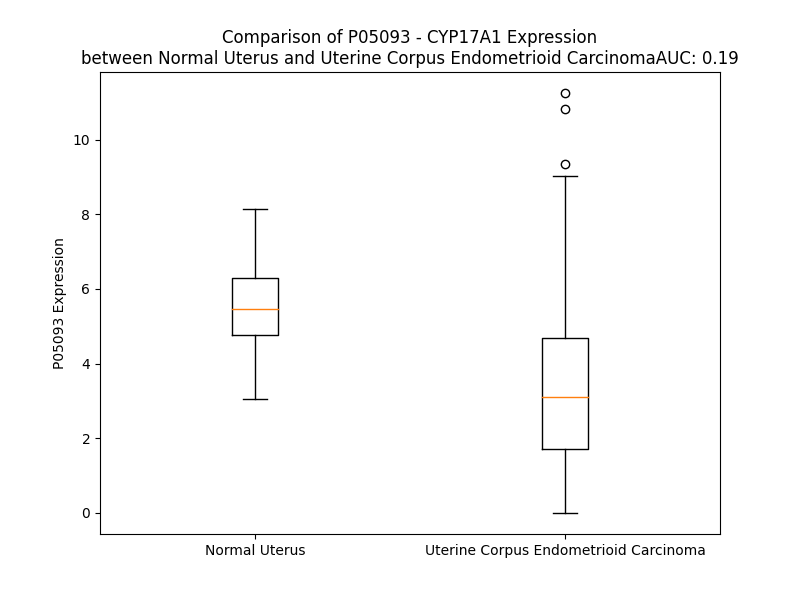

# Detailed Data for P05093

## Introduction to the Detailed Summary

### How to Interpret the Results

- **Summary & Metrics**: This section provides a quick reference to essential protein attributes, including expression changes, family classification, and biomarker applications. Regulation status (upregulated/downregulated) indicates the protein's behavior in a disease context. Some information comes from the original excel file with the proteins selected from literature, while others are derived from the analyses.
- **Expression Comparison**: A visual representation comparing protein expression between normal and disease states. It highlights significant changes in expression levels that might indicate diagnostic or therapeutic relevance. This is data coming from transcriptomics experiments and could not translate similarly to protein levels.
- **Isoform Alignment**: An interactive view of isoform alignments, revealing structural and functional differences between variants of the protein.
- **Interactors & Homologs**: Tables listing known interaction partners and homologous proteins, the more interactors and homologs, the more complex the protein is to design an antibody for.
- **Biological Assemblies**: Information about the structural arrangement of the protein in different assemblies, providing insights into its functional state but also the complexity of the protein to develop antibodies.
- **Combined Per-Residue Information**: A detailed table summarizing residue-level data. This includes predictions for epitope regions, aggregation tendencies, and modifications that might impact the protein's function. Each row corresponds to a residue in the protein, providing insights into specific sites that may be important for research or drug development.
## Summary & Metrics

- **UniProt Accession**: P05093
- **Gene Name**: CYP17
- **Protein Name**: Steroid 17-alpha-hydroxylase
- **Swiss Prot**: CP17A_HUMAN
- **Family**: nan
- **Biomarker Application**: nan
- **Number of Isoforms**: 0
- **Regulation**: 1
- **(transcriptomics) AUC**: 0.19
- **(transcriptomics) Fold Change**: 1.61
- **(transcriptomics) Regulation**: Downregulated
- **Discotope Epitope Count**: 88
- **Max n_uniprots (Homo)**: 3
- **Max n_uniprots (Hetero)**: N/A

## Expression Comparison

## Interactors

| preferredName_A   | preferredName_B   |   score |
|:------------------|:------------------|--------:|
| CYP17A1           | HSD3B1            |   0.995 |
| CYP17A1           | HSD3B2            |   0.994 |
| CYP17A1           | SRD5A1            |   0.992 |
| CYP17A1           | HSD17B3           |   0.991 |
| CYP17A1           | SRD5A2            |   0.986 |
| CYP17A1           | CYB5B             |   0.98  |
| CYP17A1           | CYB5A             |   0.979 |
| CYP17A1           | AKR1C3            |   0.979 |
| CYP17A1           | HSD17B2           |   0.972 |
| CYP17A1           | CYP19A1           |   0.971 |
| CYP17A1           | HSD17B6           |   0.97  |
| CYP17A1           | CYP7A1            |   0.967 |
| CYP17A1           | CYP11A1           |   0.965 |
| CYP17A1           | CYP11B1           |   0.964 |
| CYP17A1           | CYP11B2           |   0.963 |
| CYP17A1           | SRD5A3            |   0.958 |
| CYP17A1           | AKR1C1            |   0.955 |
| CYP17A1           | CYP21A2           |   0.951 |
| CYP17A1           | STAR              |   0.95  |
| CYP17A1           | CYP3A4            |   0.948 |
| CYP17A1           | STS               |   0.945 |
| CYP17A1           | CYP3A7            |   0.941 |
| CYP17A1           | CYP3A5            |   0.941 |
| CYP17A1           | AKR1D1            |   0.936 |
| CYP17A1           | HSD17B8           |   0.935 |
| CYP17A1           | CYP7B1            |   0.933 |
| CYP17A1           | SULT2B1           |   0.931 |
| CYP17A1           | CYP2E1            |   0.931 |
| CYP17A1           | CYP1A2            |   0.929 |
| CYP17A1           | ENSP00000480571   |   0.928 |
| CYP17A1           | CYP1A1            |   0.925 |
| CYP17A1           | POR               |   0.912 |

## Homologs

| uniprot_id   | gene_id   |
|--------------|-----------|

## Biological Assemblies

|   Unnamed: 0 |   assembly |   n_uniprots | composition   | crystal_id   |
|-------------:|-----------:|-------------:|:--------------|:-------------|
|            0 |          1 |            1 | Homo          | 4nkv         |
|            1 |          2 |            1 | Homo          | 4nkv         |
|            2 |          3 |            1 | Homo          | 4nkv         |
|            3 |          4 |            1 | Homo          | 4nkv         |
|            0 |          1 |            1 | Homo          | 4nky         |
|            1 |          2 |            1 | Homo          | 4nky         |
|            2 |          3 |            1 | Homo          | 4nky         |
|            3 |          4 |            1 | Homo          | 4nky         |
|            0 |          1 |            1 | Homo          | 4nkx         |
|            1 |          2 |            1 | Homo          | 4nkx         |
|            2 |          3 |            1 | Homo          | 4nkx         |
|            3 |          4 |            1 | Homo          | 4nkx         |
|            0 |          1 |            1 | Homo          | 3ruk         |
|            1 |          2 |            1 | Homo          | 3ruk         |
|            2 |          3 |            1 | Homo          | 3ruk         |
|            3 |          4 |            1 | Homo          | 3ruk         |
|            0 |          1 |            1 | Homo          | 3swz         |
|            1 |          2 |            1 | Homo          | 3swz         |
|            2 |          3 |            1 | Homo          | 3swz         |
|            3 |          4 |            1 | Homo          | 3swz         |
|            0 |          1 |            2 | Homo          | 8fda         |
|            1 |          2 |            2 | Homo          | 8fda         |
|            2 |          3 |            3 | Homo          | 8fda         |
|            3 |          4 |            2 | Homo          | 8fda         |
|            0 |          1 |            1 | Homo          | 4nkw         |
|            1 |          2 |            1 | Homo          | 4nkw         |
|            2 |          3 |            1 | Homo          | 4nkw         |
|            3 |          4 |            1 | Homo          | 4nkw         |
|            0 |          1 |            1 | Homo          | 5irq         |
|            1 |          2 |            1 | Homo          | 5irq         |
|            2 |          3 |            1 | Homo          | 5irq         |
|            3 |          4 |            1 | Homo          | 5irq         |
|            0 |          1 |            1 | Homo          | 5irv         |
|            1 |          2 |            1 | Homo          | 5irv         |
|            2 |          3 |            1 | Homo          | 5irv         |
|            3 |          4 |            1 | Homo          | 5irv         |
|            0 |          1 |            1 | Homo          | 5uys         |
|            1 |          2 |            1 | Homo          | 5uys         |
|            2 |          3 |            1 | Homo          | 5uys         |
|            3 |          4 |            1 | Homo          | 5uys         |
|            0 |          1 |            1 | Homo          | 6wr1         |
|            1 |          2 |            1 | Homo          | 6wr1         |
|            0 |          1 |            1 | Homo          | 6cir         |
|            1 |          2 |            1 | Homo          | 6cir         |
|            2 |          3 |            1 | Homo          | 6cir         |
|            3 |          4 |            1 | Homo          | 6cir         |
|            0 |          1 |            1 | Homo          | 6ciz         |
|            1 |          2 |            1 | Homo          | 6ciz         |
|            2 |          3 |            1 | Homo          | 6ciz         |
|            3 |          4 |            1 | Homo          | 6ciz         |
|            0 |          1 |            1 | Homo          | 4nkz         |
|            1 |          2 |            1 | Homo          | 4nkz         |
|            2 |          3 |            1 | Homo          | 4nkz         |
|            3 |          4 |            1 | Homo          | 4nkz         |
|            0 |          1 |            1 | Homo          | 6ww0         |
|            1 |          2 |            1 | Homo          | 6ww0         |
|            2 |          3 |            1 | Homo          | 6ww0         |
|            3 |          4 |            1 | Homo          | 6ww0         |
|            0 |          1 |            1 | Homo          | 6wr0         |
|            1 |          2 |            1 | Homo          | 6wr0         |
|            2 |          3 |            1 | Homo          | 6wr0         |
|            3 |          4 |            1 | Homo          | 6wr0         |
|            0 |          1 |            1 | Homo          | 6chi         |
|            1 |          2 |            1 | Homo          | 6chi         |
|            2 |          3 |            1 | Homo          | 6chi         |
|            3 |          4 |            1 | Homo          | 6chi         |

## Combined Per-Residue Information

|   res | aa   |   epitope_score | epitope   |   relative_surface_accessibility |   modeling_confidence |   Aggregation | modification   |
|------:|:-----|----------------:|:----------|---------------------------------:|----------------------:|--------------:|:---------------|
|     1 | M    |         0.14986 | True      |                          1.02208 |                 71.93 |         0.06  | N/A            |
|     2 | W    |         0.14404 | True      |                          0.94885 |                 83.63 |         0.06  | N/A            |
|     3 | E    |         0.08837 | False     |                          0.77267 |                 81.77 |         0.06  | N/A            |
|     4 | L    |         0.07359 | False     |                          0.81082 |                 83    |        79.842 | N/A            |
|     5 | V    |         0.05949 | False     |                          0.44271 |                 86.52 |        94.452 | N/A            |
|     6 | A    |         0.0541  | False     |                          0.4632  |                 86.31 |        96.715 | N/A            |
|     7 | L    |         0.07392 | False     |                          0.71628 |                 85.83 |        99.388 | N/A            |
|     8 | L    |         0.11032 | False     |                          0.66055 |                 84.59 |        99.877 | N/A            |
|     9 | L    |         0.0796  | False     |                          0.65316 |                 84.87 |        99.964 | N/A            |
|    10 | L    |         0.08921 | False     |                          0.76678 |                 83.11 |        99.964 | N/A            |
|    11 | T    |         0.07585 | False     |                          0.45229 |                 78.23 |        99.876 | N/A            |
|    12 | L    |         0.08101 | False     |                          0.41452 |                 79.06 |        99.824 | N/A            |
|    13 | A    |         0.05007 | False     |                          0.47469 |                 77.37 |        99.517 | N/A            |
|    14 | Y    |         0.10615 | False     |                          0.74841 |                 75.86 |        99.256 | N/A            |
|    15 | L    |         0.07344 | False     |                          0.18624 |                 67.03 |        98.358 | N/A            |
|    16 | F    |         0.13163 | False     |                          0.70648 |                 67.03 |        93.453 | N/A            |
|    17 | W    |         0.12976 | False     |                          0.808   |                 65.48 |        33.307 | N/A            |
|    18 | P    |         0.11407 | False     |                          0.78424 |                 57.4  |         8.059 | N/A            |
|    19 | K    |         0.10452 | False     |                          0.67614 |                 61.94 |         0     | N/A            |
|    20 | R    |         0.14242 | False     |                          0.97333 |                 55.37 |         0     | N/A            |
|    21 | R    |         0.18353 | True      |                          0.69878 |                 63.94 |         0     | N/A            |
|    22 | C    |         0.13473 | False     |                          0.59529 |                 60.56 |         0     | N/A            |
|    23 | P    |         0.28895 | True      |                          1.02376 |                 64.38 |         0     | N/A            |
|    24 | G    |         0.15394 | True      |                          1.00555 |                 75.06 |         0     | N/A            |
|    25 | A    |         0.16108 | True      |                          0.34349 |                 82.92 |         0     | N/A            |
|    26 | K    |         0.09625 | False     |                          0.68629 |                 92.37 |         0     | N/A            |
|    27 | Y    |         0.07064 | False     |                          0.26248 |                 94.09 |         0     | N/A            |
|    28 | P    |         0.02842 | False     |                          0.0596  |                 96.05 |         0     | N/A            |
|    29 | K    |         0.09761 | False     |                          0.66001 |                 96.12 |         0     | N/A            |
|    30 | S    |         0.04258 | False     |                          0.46503 |                 94.59 |         0     | N/A            |
|    31 | L    |         0.04254 | False     |                          0.03699 |                 94.86 |         0     | N/A            |
|    32 | L    |         0.14957 | True      |                          0.70721 |                 92.55 |         0     | N/A            |
|    33 | S    |         0.05601 | False     |                          0.3494  |                 89.94 |         0     | N/A            |
|    34 | L    |         0.22793 | True      |                          0.50551 |                 87.04 |         0     | N/A            |
|    35 | P    |         0.10342 | False     |                          0.38804 |                 80.33 |         0     | N/A            |
|    36 | L    |         0.11648 | False     |                          0.66964 |                 77.61 |         0     | N/A            |
|    37 | V    |         0.16745 | True      |                          0.42843 |                 82.31 |         0     | N/A            |
|    38 | G    |         0.00763 | False     |                          0       |                 88.34 |         0     | N/A            |
|    39 | S    |         0.02425 | False     |                          0       |                 91.04 |         0     | N/A            |
|    40 | L    |         0.13436 | False     |                          0.26802 |                 85.72 |         0     | N/A            |
|    41 | P    |         0.27903 | True      |                          0.43427 |                 88.46 |         0     | N/A            |
|    42 | F    |         0.15341 | True      |                          0.39974 |                 91.07 |         0     | N/A            |
|    43 | L    |         0.03424 | False     |                          0.12104 |                 87.67 |         0     | N/A            |
|    44 | P    |         0.11256 | False     |                          0.37921 |                 86.13 |         0     | N/A            |
|    45 | R    |         0.26492 | True      |                          0.837   |                 80.41 |         0     | N/A            |
|    46 | H    |         0.24366 | True      |                          0.86042 |                 83.31 |         0     | N/A            |
|    47 | G    |         0.15929 | True      |                          0.75313 |                 85.07 |         0     | N/A            |
|    48 | H    |         0.07955 | False     |                          0.28969 |                 88.56 |         0     | N/A            |
|    49 | M    |         0.05742 | False     |                          0.23188 |                 89.3  |         0     | N/A            |
|    50 | H    |         0.0114  | False     |                          0.02083 |                 92.69 |         0     | N/A            |
|    51 | N    |         0.05179 | False     |                          0.23888 |                 93.78 |         0     | N/A            |
|    52 | N    |         0.06792 | False     |                          0.06348 |                 93.9  |         0     | N/A            |
|    53 | F    |         0.00659 | False     |                          0.01847 |                 94.91 |         0     | N/A            |
|    54 | F    |         0.04429 | False     |                          0.27921 |                 96.62 |         0     | N/A            |
|    55 | K    |         0.10934 | False     |                          0.67332 |                 96.01 |         0     | N/A            |
|    56 | L    |         0.05229 | False     |                          0.17123 |                 96.07 |         0     | N/A            |
|    57 | Q    |         0.05317 | False     |                          0.12238 |                 96.17 |         0     | N/A            |
|    58 | K    |         0.18139 | True      |                          0.95973 |                 95.23 |         0     | N/A            |
|    59 | K    |         0.26632 | True      |                          0.73266 |                 95.78 |         0     | N/A            |
|    60 | Y    |         0.17356 | True      |                          0.15048 |                 96.67 |         0     | N/A            |
|    61 | G    |         0.06793 | False     |                          0.25964 |                 96.53 |         0     | N/A            |
|    62 | P    |         0.07658 | False     |                          0.45827 |                 95.92 |         0     | N/A            |
|    63 | I    |         0.02611 | False     |                          0.04236 |                 98.13 |         0     | N/A            |
|    64 | Y    |         0.00577 | False     |                          0       |                 97.87 |         0     | N/A            |
|    65 | S    |         0.01725 | False     |                          0.05934 |                 96.79 |         0     | N/A            |
|    66 | V    |         0.00367 | False     |                          0.00241 |                 93.61 |         0     | N/A            |
|    67 | R    |         0.07151 | False     |                          0.23177 |                 90.65 |         0     | N/A            |
|    68 | M    |         0.03518 | False     |                          0.12863 |                 84.56 |         0     | N/A            |
|    69 | G    |         0.01657 | False     |                          0.00805 |                 82.68 |         0     | N/A            |
|    70 | T    |         0.05964 | False     |                          0.51141 |                 79.55 |         0     | N/A            |
|    71 | K    |         0.04845 | False     |                          0.27342 |                 86.31 |         0     | N/A            |
|    72 | T    |         0.03607 | False     |                          0.43718 |                 91.7  |        11.739 | N/A            |
|    73 | T    |         0.01499 | False     |                          0.01432 |                 94.26 |        13.356 | N/A            |
|    74 | V    |         0.00935 | False     |                          0.02285 |                 97.75 |        13.356 | N/A            |
|    75 | I    |         0.00154 | False     |                          0.0008  |                 97.92 |        13.356 | N/A            |
|    76 | V    |         0.00124 | False     |                          0       |                 98.54 |        13.356 | N/A            |
|    77 | G    |         0.01249 | False     |                          0.0119  |                 97.66 |         2.58  | N/A            |
|    78 | H    |         0.05412 | False     |                          0.2715  |                 97.52 |         0     | N/A            |
|    79 | H    |         0.0385  | False     |                          0.08043 |                 97.42 |         0     | N/A            |
|    80 | Q    |         0.13482 | False     |                          0.57299 |                 98.06 |         0     | N/A            |
|    81 | L    |         0.04582 | False     |                          0.16734 |                 98.41 |         0     | N/A            |
|    82 | A    |         0.00128 | False     |                          0       |                 98.53 |         0     | N/A            |
|    83 | K    |         0.06273 | False     |                          0.29062 |                 98.39 |         0     | N/A            |
|    84 | E    |         0.08678 | False     |                          0.12404 |                 98.55 |         0     | N/A            |
|    85 | V    |         0.00358 | False     |                          0.00493 |                 98.64 |         0     | N/A            |
|    86 | L    |         0.01587 | False     |                          0.02631 |                 98.42 |         0     | N/A            |
|    87 | I    |         0.20172 | True      |                          0.5621  |                 98.21 |         0     | N/A            |
|    88 | K    |         0.12502 | False     |                          0.79964 |                 98.25 |         0     | N/A            |
|    89 | K    |         0.06552 | False     |                          0.20281 |                 98.37 |         0     | N/A            |
|    90 | G    |         0.0252  | False     |                          0.05301 |                 97.72 |         0     | N/A            |
|    91 | K    |         0.17621 | True      |                          0.85319 |                 96.75 |         0     | N/A            |
|    92 | D    |         0.05632 | False     |                          0.22984 |                 98.25 |         0     | N/A            |
|    93 | F    |         0.00326 | False     |                          0.00246 |                 98.26 |         0     | N/A            |
|    94 | S    |         0.0224  | False     |                          0.06381 |                 97.07 |         0     | N/A            |
|    95 | G    |         0.00329 | False     |                          0       |                 97.29 |         0     | N/A            |
|    96 | R    |         0.06085 | False     |                          0.05259 |                 95.9  |         0     | N/A            |
|    97 | P    |         0.01584 | False     |                          0.02926 |                 91.61 |         0     | N/A            |
|    98 | Q    |         0.12881 | False     |                          0.51839 |                 88.42 |         0     | N/A            |
|    99 | M    |         0.04873 | False     |                          0.1724  |                 87.84 |         0     | N/A            |
|   100 | A    |         0.01805 | False     |                          0.01926 |                 88.46 |         0     | N/A            |
|   101 | T    |         0.0204  | False     |                          0.01954 |                 89.83 |         0     | N/A            |
|   102 | L    |         0.01942 | False     |                          0.09645 |                 89.36 |         0     | N/A            |
|   103 | D    |         0.04301 | False     |                          0.06336 |                 90.96 |         0     | N/A            |
|   104 | I    |         0.09108 | False     |                          0.21605 |                 92.23 |         0     | N/A            |
|   105 | A    |         0.01216 | False     |                          0.03677 |                 91.56 |         0     | N/A            |
|   106 | S    |         0.00506 | False     |                          0.00312 |                 92.01 |         0     | N/A            |
|   107 | N    |         0.02525 | False     |                          0.20862 |                 91.79 |         0     | N/A            |
|   108 | N    |         0.09747 | False     |                          0.66343 |                 91.66 |         0     | N/A            |
|   109 | R    |         0.09329 | False     |                          0.21731 |                 92.08 |         0     | N/A            |
|   110 | K    |         0.02959 | False     |                          0.2809  |                 92.79 |         0     | N/A            |
|   111 | G    |         0.00446 | False     |                          0.00322 |                 93.34 |         0.53  | N/A            |
|   112 | I    |         0.02985 | False     |                          0.05913 |                 96.25 |         0.53  | N/A            |
|   113 | A    |         0.02882 | False     |                          0.29335 |                 93.22 |         0.53  | N/A            |
|   114 | F    |         0.03014 | False     |                          0.12679 |                 94.46 |         0.53  | N/A            |
|   115 | A    |         0.00271 | False     |                          0.0011  |                 95.15 |         0.53  | N/A            |
|   116 | D    |         0.06582 | False     |                          0.21262 |                 94.76 |         0     | N/A            |
|   117 | S    |         0.10542 | False     |                          0.29475 |                 91.26 |         0     | N/A            |
|   118 | G    |         0.0922  | False     |                          0.32329 |                 91.12 |         0     | N/A            |
|   119 | A    |         0.11071 | False     |                          0.48286 |                 90.61 |         0     | N/A            |
|   120 | H    |         0.07244 | False     |                          0.20893 |                 90.95 |         0     | N/A            |
|   121 | W    |         0.01578 | False     |                          0.07557 |                 94.83 |         0     | N/A            |
|   122 | Q    |         0.1193  | False     |                          0.56029 |                 94.05 |         0     | N/A            |
|   123 | L    |         0.03163 | False     |                          0.02403 |                 94.11 |         0     | N/A            |
|   124 | H    |         0.00487 | False     |                          0       |                 95.84 |         0     | N/A            |
|   125 | R    |         0.03517 | False     |                          0.11886 |                 96.03 |         0     | N/A            |
|   126 | R    |         0.09906 | False     |                          0.48379 |                 95    |         0     | N/A            |
|   127 | L    |         0.05436 | False     |                          0.08218 |                 94.52 |        11.813 | N/A            |
|   128 | A    |         0.00359 | False     |                          0.0011  |                 95.21 |        17.673 | N/A            |
|   129 | M    |         0.04402 | False     |                          0.55153 |                 93.55 |        36.595 | N/A            |
|   130 | A    |         0.0494  | False     |                          0.4587  |                 90.51 |        53.093 | N/A            |
|   131 | T    |         0.00351 | False     |                          0.00072 |                 90.6  |        72.396 | N/A            |
|   132 | F    |         0.03316 | False     |                          0.18299 |                 90.31 |        72.396 | N/A            |
|   133 | A    |         0.06078 | False     |                          0.60112 |                 86.89 |        72.284 | N/A            |
|   134 | L    |         0.09133 | False     |                          0.46389 |                 84.76 |        72.118 | N/A            |
|   135 | F    |         0.01698 | False     |                          0.02665 |                 83.89 |        71.547 | N/A            |
|   136 | K    |         0.13751 | False     |                          0.74395 |                 76.17 |         0.051 | N/A            |
|   137 | D    |         0.11544 | False     |                          0.57459 |                 66.7  |         0.051 | N/A            |
|   138 | G    |         0.20176 | True      |                          0.5891  |                 60.16 |         0     | N/A            |
|   139 | D    |         0.19062 | True      |                          0.74702 |                 55.3  |         0     | N/A            |
|   140 | Q    |         0.11129 | False     |                          0.35288 |                 61.13 |         0     | N/A            |
|   141 | K    |         0.10761 | False     |                          0.44292 |                 75.72 |         0     | N/A            |
|   142 | L    |         0.01375 | False     |                          0.08504 |                 85.37 |         0     | N/A            |
|   143 | E    |         0.06288 | False     |                          0.19722 |                 90.78 |         0     | N/A            |
|   144 | K    |         0.07395 | False     |                          0.57244 |                 91.42 |         0     | N/A            |
|   145 | I    |         0.03203 | False     |                          0.12879 |                 91.92 |         0     | N/A            |
|   146 | I    |         0.00302 | False     |                          0.0024  |                 94.62 |         0     | N/A            |
|   147 | C    |         0.01309 | False     |                          0.16086 |                 95.09 |         0     | N/A            |
|   148 | Q    |         0.05897 | False     |                          0.5635  |                 94.73 |         0     | N/A            |
|   149 | E    |         0.00792 | False     |                          0.04906 |                 95.8  |         0     | N/A            |
|   150 | I    |         0.00423 | False     |                          0.008   |                 96.69 |         0     | N/A            |
|   151 | S    |         0.03999 | False     |                          0.25568 |                 96.37 |         0     | N/A            |
|   152 | T    |         0.05746 | False     |                          0.40191 |                 95.83 |         0     | N/A            |
|   153 | L    |         0.01157 | False     |                          0.04229 |                 96.67 |         0     | N/A            |
|   154 | C    |         0.00362 | False     |                          0.00555 |                 97.06 |         0     | N/A            |
|   155 | D    |         0.05348 | False     |                          0.50132 |                 95.49 |         0     | N/A            |
|   156 | M    |         0.12967 | False     |                          0.23104 |                 94.88 |         0     | N/A            |
|   157 | L    |         0.00219 | False     |                          0       |                 96.47 |         0     | N/A            |
|   158 | A    |         0.02629 | False     |                          0.41697 |                 95.85 |         0     | N/A            |
|   159 | T    |         0.10676 | False     |                          0.73353 |                 95.53 |         0     | N/A            |
|   160 | H    |         0.06825 | False     |                          0.3184  |                 95.13 |         0     | N/A            |
|   161 | N    |         0.10284 | False     |                          0.37565 |                 95.96 |         0     | N/A            |
|   162 | G    |         0.08333 | False     |                          0.37283 |                 95.68 |         0     | N/A            |
|   163 | Q    |         0.15099 | True      |                          0.47888 |                 96.61 |         0     | N/A            |
|   164 | S    |         0.12046 | False     |                          0.23455 |                 97.05 |         0     | N/A            |
|   165 | I    |         0.10519 | False     |                          0.13519 |                 95.77 |         0     | N/A            |
|   166 | D    |         0.07268 | False     |                          0.34048 |                 95.32 |         0     | N/A            |
|   167 | I    |         0.00496 | False     |                          0.0088  |                 93.59 |         0     | N/A            |
|   168 | S    |         0.01707 | False     |                          0.11403 |                 93.53 |         0     | N/A            |
|   169 | F    |         0.0477  | False     |                          0.33964 |                 94.27 |         0     | N/A            |
|   170 | P    |         0.0421  | False     |                          0.14496 |                 95.31 |         1.106 | N/A            |
|   171 | V    |         0.00192 | False     |                          0.0019  |                 96.24 |        91.358 | N/A            |
|   172 | F    |         0.00879 | False     |                          0.03509 |                 95.95 |        98.94  | N/A            |
|   173 | V    |         0.01097 | False     |                          0.07712 |                 96.68 |        99.554 | N/A            |
|   174 | A    |         0.00841 | False     |                          0.05625 |                 96.96 |        99.606 | N/A            |
|   175 | V    |         0.00774 | False     |                          0.00381 |                 97.18 |        99.666 | N/A            |
|   176 | T    |         0.00103 | False     |                          0       |                 97.56 |        98.635 | N/A            |
|   177 | N    |         0.0147  | False     |                          0.02293 |                 97.27 |        97.977 | N/A            |
|   178 | V    |         0.00721 | False     |                          0.01619 |                 96.17 |        98.165 | N/A            |
|   179 | I    |         0.03033 | False     |                          0.0128  |                 95.59 |        97.871 | N/A            |
|   180 | S    |         0.00222 | False     |                          0       |                 95.79 |        94.508 | N/A            |
|   181 | L    |         0.02241 | False     |                          0.16208 |                 94.16 |        94.091 | N/A            |
|   182 | I    |         0.0021  | False     |                          0.0008  |                 93.51 |        91.975 | N/A            |
|   183 | C    |         0.00176 | False     |                          0       |                 94.73 |        68.793 | N/A            |
|   184 | F    |         0.01806 | False     |                          0.05882 |                 93.18 |        63.906 | N/A            |
|   185 | N    |         0.06263 | False     |                          0.49018 |                 91.27 |         3.987 | N/A            |
|   186 | T    |         0.11914 | False     |                          0.54557 |                 92.09 |         1.652 | N/A            |
|   187 | S    |         0.07602 | False     |                          0.44701 |                 93.83 |         0.277 | N/A            |
|   188 | Y    |         0.03417 | False     |                          0.12856 |                 94.92 |         0.213 | N/A            |
|   189 | K    |         0.12552 | False     |                          0.83392 |                 91.59 |         0     | N/A            |
|   190 | N    |         0.13099 | False     |                          0.56378 |                 83.33 |         0     | N/A            |
|   191 | G    |         0.19388 | True      |                          0.74957 |                 86.67 |         0     | N/A            |
|   192 | D    |         0.09944 | False     |                          0.25031 |                 93.81 |         0     | N/A            |
|   193 | P    |         0.12103 | False     |                          0.75469 |                 95.02 |         0     | N/A            |
|   194 | E    |         0.06273 | False     |                          0.22442 |                 94.72 |         0     | N/A            |
|   195 | L    |         0.00289 | False     |                          0       |                 95.2  |         0     | N/A            |
|   196 | N    |         0.12842 | False     |                          0.51857 |                 95.11 |         0     | N/A            |
|   197 | V    |         0.07635 | False     |                          0.46203 |                 96.41 |         0     | N/A            |
|   198 | I    |         0.00592 | False     |                          0.0024  |                 96.27 |         0     | N/A            |
|   199 | Q    |         0.05311 | False     |                          0.20254 |                 94.42 |         0     | N/A            |
|   200 | N    |         0.19052 | True      |                          0.57527 |                 95.49 |         0     | N/A            |
|   201 | Y    |         0.0421  | False     |                          0.01396 |                 95.74 |         0     | N/A            |
|   202 | N    |         0.02235 | False     |                          0.05339 |                 94.46 |         0     | N/A            |
|   203 | E    |         0.03991 | False     |                          0.3955  |                 92.35 |         0     | N/A            |
|   204 | G    |         0.0571  | False     |                          0.09913 |                 93.82 |         0     | N/A            |
|   205 | I    |         0.0414  | False     |                          0.0944  |                 93.9  |         0     | N/A            |
|   206 | I    |         0.04106 | False     |                          0.0848  |                 91.73 |         0     | N/A            |
|   207 | D    |         0.12577 | False     |                          0.31194 |                 90.2  |         0     | N/A            |
|   208 | N    |         0.05225 | False     |                          0.02219 |                 89.36 |         0     | N/A            |
|   209 | L    |         0.0385  | False     |                          0.15832 |                 87.12 |         0     | N/A            |
|   210 | S    |         0.07261 | False     |                          0.30508 |                 76.55 |         0     | N/A            |
|   211 | K    |         0.29235 | True      |                          0.47978 |                 73.08 |         0     | N/A            |
|   212 | D    |         0.17639 | True      |                          0.73903 |                 62.91 |         0     | N/A            |
|   213 | S    |         0.09149 | False     |                          0.08982 |                 64.99 |         0     | N/A            |
|   214 | L    |         0.21647 | True      |                          0.64786 |                 71.63 |         0     | N/A            |
|   215 | V    |         0.04384 | False     |                          0.01904 |                 78.82 |         0     | N/A            |
|   216 | D    |         0.08874 | False     |                          0.13317 |                 79.68 |         0     | N/A            |
|   217 | L    |         0.13431 | False     |                          0.21326 |                 71.72 |         0     | N/A            |
|   218 | V    |         0.18962 | True      |                          0.2085  |                 71.54 |         0     | N/A            |
|   219 | P    |         0.16836 | True      |                          0.47262 |                 72.97 |         0     | N/A            |
|   220 | W    |         0.37145 | True      |                          0.68836 |                 72.32 |         0     | N/A            |
|   221 | L    |         0.15606 | True      |                          0.23956 |                 78.61 |         0     | N/A            |
|   222 | K    |         0.25659 | True      |                          0.44998 |                 79.59 |         0     | N/A            |
|   223 | I    |         0.37425 | True      |                          0.76644 |                 80.03 |         0     | N/A            |
|   224 | F    |         0.2749  | True      |                          0.55642 |                 82.98 |         0     | N/A            |
|   225 | P    |         0.32613 | True      |                          0.9847  |                 84.26 |         0     | N/A            |
|   226 | N    |         0.08079 | False     |                          0.21035 |                 86.92 |         0     | N/A            |
|   227 | K    |         0.23662 | True      |                          0.85281 |                 87.79 |         0     | N/A            |
|   228 | T    |         0.08796 | False     |                          0.19093 |                 87.45 |         0     | N/A            |
|   229 | L    |         0.0669  | False     |                          0.06842 |                 90.09 |         0     | N/A            |
|   230 | E    |         0.32073 | True      |                          0.58965 |                 92.76 |         0     | N/A            |
|   231 | K    |         0.18624 | True      |                          0.56934 |                 94.06 |         0     | N/A            |
|   232 | L    |         0.00529 | False     |                          0       |                 94.23 |         0     | N/A            |
|   233 | K    |         0.19285 | True      |                          0.55351 |                 95.21 |         0     | N/A            |
|   234 | S    |         0.19534 | True      |                          0.46473 |                 97.12 |         0     | N/A            |
|   235 | H    |         0.05443 | False     |                          0.18255 |                 96.82 |         0     | N/A            |
|   236 | V    |         0.02303 | False     |                          0.06569 |                 95.79 |         0     | N/A            |
|   237 | K    |         0.1549  | True      |                          0.64323 |                 96.78 |         0     | N/A            |
|   238 | I    |         0.08785 | False     |                          0.40826 |                 97.2  |         0     | N/A            |
|   239 | R    |         0.04609 | False     |                          0.08542 |                 96.41 |         0     | N/A            |
|   240 | N    |         0.05276 | False     |                          0.19756 |                 95.14 |         0     | N/A            |
|   241 | D    |         0.13976 | False     |                          0.45642 |                 96.07 |         0     | N/A            |
|   242 | L    |         0.11153 | False     |                          0.11507 |                 94.91 |         0     | N/A            |
|   243 | L    |         0.0201  | False     |                          0.04416 |                 94.62 |         0     | N/A            |
|   244 | N    |         0.12963 | False     |                          0.36529 |                 94.87 |         0     | N/A            |
|   245 | K    |         0.13095 | False     |                          0.62901 |                 93.91 |         0     | N/A            |
|   246 | I    |         0.07691 | False     |                          0.21429 |                 91.68 |         0     | N/A            |
|   247 | L    |         0.01396 | False     |                          0.01484 |                 92.69 |         0     | N/A            |
|   248 | E    |         0.09019 | False     |                          0.47143 |                 92.91 |         0     | N/A            |
|   249 | N    |         0.08759 | False     |                          0.50249 |                 88.82 |         0     | N/A            |
|   250 | Y    |         0.14267 | False     |                          0.16174 |                 88.19 |         0     | N/A            |
|   251 | K    |         0.10891 | False     |                          0.37643 |                 88.23 |         0     | N/A            |
|   252 | E    |         0.15018 | True      |                          0.81393 |                 84.32 |         0     | N/A            |
|   253 | K    |         0.13753 | False     |                          0.74715 |                 84.61 |         0     | N/A            |
|   254 | F    |         0.15682 | True      |                          0.23096 |                 87.42 |         0     | N/A            |
|   255 | R    |         0.19046 | True      |                          0.70037 |                 84.63 |         0     | N/A            |
|   256 | S    |         0.17555 | True      |                          0.44126 |                 83.78 |         0     | N/A            |
|   257 | D    |         0.27449 | True      |                          0.78422 |                 85.3  |         0     | N/A            |
|   258 | S    |         0.0965  | False     |                          0.41404 |                 85.21 |         0     | N/A            |
|   259 | I    |         0.1135  | False     |                          0.34785 |                 87.79 |         0     | N/A            |
|   260 | T    |         0.05084 | False     |                          0.22387 |                 88.45 |         0     | N/A            |
|   261 | N    |         0.01756 | False     |                          0.01036 |                 91.75 |         0     | N/A            |
|   262 | M    |         0.00122 | False     |                          0.00072 |                 93.86 |         0     | N/A            |
|   263 | L    |         0.00879 | False     |                          0.02391 |                 94.01 |         0     | N/A            |
|   264 | D    |         0.017   | False     |                          0.02904 |                 92.83 |         0     | N/A            |
|   265 | T    |         0.02645 | False     |                          0.10936 |                 93.88 |         0     | N/A            |
|   266 | L    |         0.0028  | False     |                          0.00165 |                 93.92 |         0     | N/A            |
|   267 | M    |         0.02599 | False     |                          0.06643 |                 92.1  |         0     | N/A            |
|   268 | Q    |         0.05628 | False     |                          0.1871  |                 91.6  |         0     | N/A            |
|   269 | A    |         0.02866 | False     |                          0.06652 |                 91.6  |         0     | N/A            |
|   270 | K    |         0.03568 | False     |                          0.22441 |                 91.3  |         0     | N/A            |
|   271 | M    |         0.10111 | False     |                          0.44519 |                 89.03 |         0     | N/A            |
|   272 | N    |         0.09021 | False     |                          0.33612 |                 88.14 |         0     | N/A            |
|   273 | S    |         0.07802 | False     |                          0.08779 |                 87.06 |         0     | N/A            |
|   274 | D    |         0.19086 | True      |                          0.50074 |                 85.81 |         0     | N/A            |
|   275 | N    |         0.25196 | True      |                          0.57027 |                 85.39 |         0     | N/A            |
|   276 | G    |         0.24876 | True      |                          0.77514 |                 78.38 |         0     | N/A            |
|   277 | N    |         0.30054 | True      |                          0.76517 |                 71.4  |         0     | N/A            |
|   278 | A    |         0.21614 | True      |                          0.28973 |                 67.52 |         0     | N/A            |
|   279 | G    |         0.33146 | True      |                          0.4426  |                 65.93 |         0     | N/A            |
|   280 | P    |         0.36163 | True      |                          1.05361 |                 58.32 |         0     | N/A            |
|   281 | D    |         0.2025  | True      |                          0.59676 |                 60.7  |         0     | N/A            |
|   282 | Q    |         0.17795 | True      |                          0.1786  |                 62.62 |         0     | N/A            |
|   283 | D    |         0.23477 | True      |                          0.49203 |                 68.43 |         0     | N/A            |
|   284 | S    |         0.12895 | False     |                          0.374   |                 68.39 |         0     | N/A            |
|   285 | E    |         0.17105 | True      |                          0.67702 |                 81.74 |         0     | N/A            |
|   286 | L    |         0.0453  | False     |                          0.24236 |                 88.54 |         0     | N/A            |
|   287 | L    |         0.00699 | False     |                          0       |                 90.72 |         0     | N/A            |
|   288 | S    |         0.12062 | False     |                          0.3014  |                 91.34 |         0     | N/A            |
|   289 | D    |         0.07317 | False     |                          0.29064 |                 92.17 |         0     | N/A            |
|   290 | N    |         0.07874 | False     |                          0.51669 |                 92.52 |         0     | N/A            |
|   291 | H    |         0.02987 | False     |                          0.09233 |                 94.25 |         0     | N/A            |
|   292 | I    |         0.00337 | False     |                          0.0016  |                 94.33 |         6.679 | N/A            |
|   293 | L    |         0.04133 | False     |                          0.09351 |                 94.38 |         6.679 | N/A            |
|   294 | T    |         0.0163  | False     |                          0.02542 |                 95.27 |         6.679 | N/A            |
|   295 | T    |         0.00132 | False     |                          0       |                 96.27 |         6.679 | N/A            |
|   296 | I    |         0.0159  | False     |                          0.0224  |                 95.35 |         6.679 | N/A            |
|   297 | G    |         0.0378  | False     |                          0.09093 |                 95.16 |         0.551 | N/A            |
|   298 | D    |         0.02547 | False     |                          0.12217 |                 94.79 |         0     | N/A            |
|   299 | I    |         0.03221 | False     |                          0.04988 |                 96.09 |         0     | N/A            |
|   300 | F    |         0.0252  | False     |                          0.03567 |                 95.71 |         0     | N/A            |
|   301 | G    |         0.03028 | False     |                          0.21947 |                 94.15 |         0     | N/A            |
|   302 | A    |         0.04014 | False     |                          0.49417 |                 95.38 |         0.622 | N/A            |
|   303 | G    |         0.02171 | False     |                          0.12605 |                 95.36 |         1.358 | N/A            |
|   304 | V    |         0.00453 | False     |                          0       |                 95.92 |         9.814 | N/A            |
|   305 | E    |         0.03206 | False     |                          0.09493 |                 92.59 |        10.508 | N/A            |
|   306 | T    |         0.03879 | False     |                          0.28329 |                 96.81 |        10.743 | N/A            |
|   307 | T    |         0.02001 | False     |                          0.02369 |                 97.82 |        11.138 | N/A            |
|   308 | T    |         0.02489 | False     |                          0.09806 |                 97.36 |        11.138 | N/A            |
|   309 | S    |         0.0051  | False     |                          0.02105 |                 96.94 |        11.138 | N/A            |
|   310 | V    |         0.01964 | False     |                          0.02475 |                 98.43 |        11.138 | N/A            |
|   311 | V    |         0.01051 | False     |                          0       |                 98.5  |        11.138 | N/A            |
|   312 | K    |         0.00848 | False     |                          0.09322 |                 98.08 |        10.508 | N/A            |
|   313 | W    |         0.01012 | False     |                          0.00884 |                 98.39 |        39.51  | N/A            |
|   314 | T    |         0.0015  | False     |                          0.00217 |                 98.7  |        46.363 | N/A            |
|   315 | L    |         0.00684 | False     |                          0.01706 |                 98.23 |        73.001 | N/A            |
|   316 | A    |         0.0015  | False     |                          0       |                 98.25 |        73.036 | N/A            |
|   317 | F    |         0.00961 | False     |                          0.02484 |                 98.58 |        73.036 | N/A            |
|   318 | L    |         0.00395 | False     |                          0.00659 |                 98.53 |        72.009 | N/A            |
|   319 | L    |         0.01654 | False     |                          0.04767 |                 97.97 |        65.024 | N/A            |
|   320 | H    |         0.10593 | False     |                          0.33701 |                 98.1  |         0.501 | N/A            |
|   321 | N    |         0.05652 | False     |                          0.2453  |                 98.19 |         0     | N/A            |
|   322 | P    |         0.09212 | False     |                          0.55963 |                 97.49 |         0     | N/A            |
|   323 | Q    |         0.07267 | False     |                          0.65783 |                 97.89 |         0     | N/A            |
|   324 | V    |         0.03102 | False     |                          0.10568 |                 98.34 |         0     | N/A            |
|   325 | K    |         0.01822 | False     |                          0.13592 |                 98.18 |         0     | N/A            |
|   326 | K    |         0.14018 | False     |                          0.59076 |                 98.3  |         0     | N/A            |
|   327 | K    |         0.08614 | False     |                          0.46261 |                 98.34 |         0     | N/A            |
|   328 | L    |         0.00164 | False     |                          0       |                 98.6  |         0     | N/A            |
|   329 | Y    |         0.02455 | False     |                          0.10758 |                 98.43 |         0     | N/A            |
|   330 | E    |         0.08782 | False     |                          0.38332 |                 98.25 |         0     | N/A            |
|   331 | E    |         0.05553 | False     |                          0.12397 |                 98.18 |         0     | N/A            |
|   332 | I    |         0.00632 | False     |                          0       |                 98.41 |         0     | N/A            |
|   333 | D    |         0.0638  | False     |                          0.30231 |                 97.88 |         0     | N/A            |
|   334 | Q    |         0.18791 | True      |                          0.74965 |                 97.3  |         0     | N/A            |
|   335 | N    |         0.14757 | True      |                          0.3307  |                 97.41 |         0     | N/A            |
|   336 | V    |         0.05322 | False     |                          0.08974 |                 97.21 |         0     | N/A            |
|   337 | G    |         0.03543 | False     |                          0.19177 |                 96.13 |         0     | N/A            |
|   338 | F    |         0.04825 | False     |                          0.17902 |                 95.84 |         0     | N/A            |
|   339 | S    |         0.15632 | True      |                          0.84225 |                 90.74 |         0     | N/A            |
|   340 | R    |         0.18351 | True      |                          0.35744 |                 93.75 |         0     | N/A            |
|   341 | T    |         0.02437 | False     |                          0.27408 |                 95.4  |         0     | N/A            |
|   342 | P    |         0.00282 | False     |                          0.00147 |                 96.75 |         0     | N/A            |
|   343 | T    |         0.05211 | False     |                          0.3324  |                 95.41 |         0     | N/A            |
|   344 | I    |         0.0472  | False     |                          0.26131 |                 93.18 |         0     | N/A            |
|   345 | S    |         0.11997 | False     |                          0.52836 |                 92.83 |         0     | N/A            |
|   346 | D    |         0.00292 | False     |                          0.00061 |                 95.52 |         0     | N/A            |
|   347 | R    |         0.05633 | False     |                          0.29249 |                 93.86 |         0     | N/A            |
|   348 | N    |         0.15144 | True      |                          0.70244 |                 91.77 |         0     | N/A            |
|   349 | R    |         0.20549 | True      |                          0.45754 |                 95.65 |         0.198 | N/A            |
|   350 | L    |         0.00162 | False     |                          0       |                 98.13 |         0.739 | N/A            |
|   351 | L    |         0.03266 | False     |                          0.14591 |                 98.24 |         0.739 | N/A            |
|   352 | L    |         0.01547 | False     |                          0.10034 |                 98.62 |         0.739 | N/A            |
|   353 | L    |         0.00108 | False     |                          0       |                 98.74 |         0.739 | N/A            |
|   354 | E    |         0.01356 | False     |                          0.02057 |                 98.24 |         0.739 | N/A            |
|   355 | A    |         0.00127 | False     |                          0       |                 98.65 |         0.739 | N/A            |
|   356 | T    |         0.00205 | False     |                          0       |                 98.83 |         0.739 | N/A            |
|   357 | I    |         0.0163  | False     |                          0.0464  |                 98.74 |         0.739 | N/A            |
|   358 | R    |         0.03062 | False     |                          0.16593 |                 98.66 |         0.541 | N/A            |
|   359 | E    |         0.00312 | False     |                          0       |                 98.77 |         0     | N/A            |
|   360 | V    |         0.0016  | False     |                          0.0019  |                 98.76 |         0     | N/A            |
|   361 | L    |         0.0157  | False     |                          0.01606 |                 98.5  |         0     | N/A            |
|   362 | R    |         0.00525 | False     |                          0       |                 98.46 |         0     | N/A            |
|   363 | L    |         0.01524 | False     |                          0.01731 |                 98.02 |         0     | N/A            |
|   364 | R    |         0.05806 | False     |                          0.13621 |                 97.72 |         0     | N/A            |
|   365 | P    |         0.00503 | False     |                          0.00398 |                 97.59 |         0     | N/A            |
|   366 | V    |         0.02422 | False     |                          0.15602 |                 97.3  |         0     | N/A            |
|   367 | A    |         0.04983 | False     |                          0.21793 |                 94.9  |         0     | N/A            |
|   368 | P    |         0.01544 | False     |                          0.03181 |                 95.42 |         0     | N/A            |
|   369 | M    |         0.05697 | False     |                          0.32074 |                 94.23 |         0     | N/A            |
|   370 | L    |         0.02306 | False     |                          0.13509 |                 94.86 |         0     | N/A            |
|   371 | I    |         0.04601 | False     |                          0.274   |                 92.71 |         0     | N/A            |
|   372 | P    |         0.02161 | False     |                          0.18092 |                 93.75 |         0     | N/A            |
|   373 | H    |         0.01314 | False     |                          0.04808 |                 97.18 |         0     | N/A            |
|   374 | K    |         0.02705 | False     |                          0.19471 |                 97    |         0     | N/A            |
|   375 | A    |         0.0088  | False     |                          0.00377 |                 98.17 |         0     | N/A            |
|   376 | N    |         0.06168 | False     |                          0.23126 |                 97.2  |         0     | N/A            |
|   377 | V    |         0.17584 | True      |                          0.51888 |                 97.2  |         0     | N/A            |
|   378 | D    |         0.13082 | False     |                          0.64253 |                 96.51 |         0     | N/A            |
|   379 | S    |         0.03484 | False     |                          0.16989 |                 97.15 |         0     | N/A            |
|   380 | S    |         0.09614 | False     |                          0.27989 |                 97.31 |         0     | N/A            |
|   381 | I    |         0.00812 | False     |                          0       |                 98.28 |         0     | N/A            |
|   382 | G    |         0.10608 | False     |                          0.39787 |                 96.55 |         0     | N/A            |
|   383 | E    |         0.32291 | True      |                          0.61583 |                 95.02 |         0     | N/A            |
|   384 | F    |         0.08196 | False     |                          0.19173 |                 97.4  |         0     | N/A            |
|   385 | A    |         0.05464 | False     |                          0.19986 |                 96.81 |         0     | N/A            |
|   386 | V    |         0.01319 | False     |                          0.02147 |                 97.08 |         0     | N/A            |
|   387 | D    |         0.05453 | False     |                          0.33365 |                 95.41 |         0     | N/A            |
|   388 | K    |         0.13691 | False     |                          0.68995 |                 96.21 |         0     | N/A            |
|   389 | G    |         0.11088 | False     |                          0.46796 |                 94.56 |         0     | N/A            |
|   390 | T    |         0.02358 | False     |                          0.08891 |                 95.78 |         0     | N/A            |
|   391 | E    |         0.02505 | False     |                          0.04901 |                 95.87 |         0     | N/A            |
|   392 | V    |         0.0025  | False     |                          0       |                 97.83 |        60.892 | N/A            |
|   393 | I    |         0.04125 | False     |                          0.12399 |                 97.16 |        65.866 | N/A            |
|   394 | I    |         0.00333 | False     |                          0.00149 |                 98.11 |        66.92  | N/A            |
|   395 | N    |         0.00266 | False     |                          0       |                 97.58 |        67.002 | N/A            |
|   396 | L    |         0.00948 | False     |                          0.00412 |                 97.73 |        67.002 | N/A            |
|   397 | W    |         0.0331  | False     |                          0.09907 |                 97.73 |        64.815 | N/A            |
|   398 | A    |         0.00159 | False     |                          0.00094 |                 97.98 |        55.005 | N/A            |
|   399 | L    |         0.00834 | False     |                          0.00824 |                 98.23 |        46.551 | N/A            |
|   400 | H    |         0.00408 | False     |                          0       |                 98.34 |         0.308 | N/A            |
|   401 | H    |         0.02698 | False     |                          0.02374 |                 97.89 |         0     | N/A            |
|   402 | N    |         0.07197 | False     |                          0.17471 |                 96.89 |         0     | N/A            |
|   403 | E    |         0.13397 | False     |                          0.71397 |                 96.27 |         0     | N/A            |
|   404 | K    |         0.21624 | True      |                          0.93036 |                 95.48 |         0     | N/A            |
|   405 | E    |         0.11609 | False     |                          0.25079 |                 96.64 |         0     | N/A            |
|   406 | W    |         0.05806 | False     |                          0.01568 |                 97.79 |         0     | N/A            |
|   407 | H    |         0.18657 | True      |                          0.71791 |                 96.64 |         0     | N/A            |
|   408 | Q    |         0.16087 | True      |                          0.37751 |                 97.44 |         0     | N/A            |
|   409 | P    |         0.0574  | False     |                          0.08847 |                 97.65 |         0     | N/A            |
|   410 | D    |         0.10847 | False     |                          0.66004 |                 96.9  |         0     | N/A            |
|   411 | Q    |         0.20468 | True      |                          0.47264 |                 97.59 |         0     | N/A            |
|   412 | F    |         0.02757 | False     |                          0.11572 |                 98.47 |         0     | N/A            |
|   413 | M    |         0.18938 | True      |                          0.31497 |                 97.75 |         0     | N/A            |
|   414 | P    |         0.00686 | False     |                          0.00099 |                 98.4  |         0     | N/A            |
|   415 | E    |         0.1099  | False     |                          0.36223 |                 97.17 |         0     | N/A            |
|   416 | R    |         0.09159 | False     |                          0.12155 |                 97.58 |         0     | N/A            |
|   417 | F    |         0.00388 | False     |                          0.00127 |                 98.24 |         0     | N/A            |
|   418 | L    |         0.08627 | False     |                          0.13545 |                 97.96 |         0     | N/A            |
|   419 | N    |         0.14194 | False     |                          0.18721 |                 96.65 |         0     | N/A            |
|   420 | P    |         0.22573 | True      |                          1.10304 |                 94.4  |         0     | N/A            |
|   421 | A    |         0.20594 | True      |                          0.73535 |                 95.09 |         0     | N/A            |
|   422 | G    |         0.18241 | True      |                          0.42873 |                 93.91 |         0     | N/A            |
|   423 | T    |         0.19784 | True      |                          0.633   |                 94.32 |         0     | N/A            |
|   424 | Q    |         0.40351 | True      |                          0.59438 |                 96.27 |         0     | N/A            |
|   425 | L    |         0.12583 | False     |                          0.29725 |                 96.58 |         0     | N/A            |
|   426 | I    |         0.25013 | True      |                          0.39805 |                 96.74 |         0     | N/A            |
|   427 | S    |         0.22743 | True      |                          0.63513 |                 94.28 |         0     | N/A            |
|   428 | P    |         0.14444 | True      |                          0.39133 |                 93.73 |         0     | N/A            |
|   429 | S    |         0.07217 | False     |                          0.06366 |                 96.48 |         0     | N/A            |
|   430 | V    |         0.14157 | False     |                          0.63143 |                 95.76 |         0     | N/A            |
|   431 | S    |         0.00758 | False     |                          0.00316 |                 97.6  |         0     | N/A            |
|   432 | Y    |         0.03874 | False     |                          0.13799 |                 98.15 |         0     | N/A            |
|   433 | L    |         0.13079 | False     |                          0.10964 |                 97.73 |         0     | N/A            |
|   434 | P    |         0.03414 | False     |                          0.13131 |                 97.67 |         0     | N/A            |
|   435 | F    |         0.0448  | False     |                          0.1263  |                 97.9  |         0     | N/A            |
|   436 | G    |         0.04008 | False     |                          0.1926  |                 97.07 |         0     | N/A            |
|   437 | A    |         0.0959  | False     |                          0.11873 |                 97.46 |         0     | N/A            |
|   438 | G    |         0.09853 | False     |                          0.34535 |                 97.39 |         0     | N/A            |
|   439 | P    |         0.12585 | False     |                          0.3567  |                 96.49 |         0     | N/A            |
|   440 | R    |         0.11324 | False     |                          0.10878 |                 97.11 |         0     | N/A            |
|   441 | S    |         0.09746 | False     |                          0.22116 |                 96.94 |         0     | N/A            |
|   442 | C    |         0.04599 | False     |                          0.41797 |                 97.87 |         0     | N/A            |
|   443 | I    |         0.0662  | False     |                          0.21698 |                 96.02 |         0     | N/A            |
|   444 | G    |         0.03062 | False     |                          0.16733 |                 95.48 |         0     | N/A            |
|   445 | E    |         0.0279  | False     |                          0.26143 |                 95.4  |         0     | N/A            |
|   446 | I    |         0.09126 | False     |                          0.77671 |                 93.15 |         0.133 | N/A            |
|   447 | L    |         0.02532 | False     |                          0.04642 |                 94.43 |         0.145 | N/A            |
|   448 | A    |         0.02515 | False     |                          0.12244 |                 96.82 |         0.145 | N/A            |
|   449 | R    |         0.02614 | False     |                          0.22742 |                 96.16 |         0.146 | N/A            |
|   450 | Q    |         0.03451 | False     |                          0.18621 |                 95.43 |         0.147 | N/A            |
|   451 | E    |         0.01812 | False     |                          0.00776 |                 96.65 |         0.179 | N/A            |
|   452 | L    |         0.01484 | False     |                          0.01154 |                 98.39 |        84.166 | N/A            |
|   453 | F    |         0.00206 | False     |                          0       |                 98.22 |        99.529 | N/A            |
|   454 | L    |         0.00403 | False     |                          0       |                 98.01 |        99.786 | N/A            |
|   455 | I    |         0.02045 | False     |                          0.0128  |                 98.25 |        99.83  | N/A            |
|   456 | M    |         0.00347 | False     |                          0.00072 |                 98.62 |        99.832 | N/A            |
|   457 | A    |         0.0013  | False     |                          0       |                 98.46 |        99.731 | N/A            |
|   458 | W    |         0.0166  | False     |                          0.05362 |                 98.19 |        99.63  | N/A            |
|   459 | L    |         0.00311 | False     |                          0.00495 |                 98.3  |        99.198 | N/A            |
|   460 | L    |         0.00235 | False     |                          0       |                 98.31 |        96.825 | N/A            |
|   461 | Q    |         0.0043  | False     |                          0       |                 98.06 |         3.689 | N/A            |
|   462 | R    |         0.035   | False     |                          0.09769 |                 97.55 |         0.041 | N/A            |
|   463 | F    |         0.01399 | False     |                          0.0121  |                 98.18 |         0.039 | N/A            |
|   464 | D    |         0.07806 | False     |                          0.29706 |                 97.24 |         0.008 | N/A            |
|   465 | L    |         0.01989 | False     |                          0.029   |                 97.02 |         0.006 | N/A            |
|   466 | E    |         0.07545 | False     |                          0.27992 |                 96.68 |         0     | N/A            |
|   467 | V    |         0.06475 | False     |                          0.37786 |                 96.97 |         0     | N/A            |
|   468 | P    |         0.04628 | False     |                          0.04906 |                 94.98 |         0     | N/A            |
|   469 | D    |         0.25826 | True      |                          0.625   |                 91.42 |         0     | N/A            |
|   470 | D    |         0.24155 | True      |                          0.53523 |                 93.39 |         0     | N/A            |
|   471 | G    |         0.18779 | True      |                          0.61761 |                 93.51 |         0     | N/A            |
|   472 | Q    |         0.1626  | True      |                          0.6402  |                 94.56 |         0     | N/A            |
|   473 | L    |         0.10356 | False     |                          0.50529 |                 96.8  |         0     | N/A            |
|   474 | P    |         0.0208  | False     |                          0.05384 |                 96.53 |         0     | N/A            |
|   475 | S    |         0.07239 | False     |                          0.44911 |                 96.44 |         0     | N/A            |
|   476 | L    |         0.06845 | False     |                          0.27449 |                 96.44 |         0     | N/A            |
|   477 | E    |         0.1989  | True      |                          0.66827 |                 93.47 |         0     | N/A            |
|   478 | G    |         0.0831  | False     |                          0.07966 |                 92.86 |         0     | N/A            |
|   479 | I    |         0.19086 | True      |                          0.40718 |                 91    |         0     | N/A            |
|   480 | P    |         0.12037 | False     |                          0.23362 |                 84.5  |         0     | N/A            |
|   481 | K    |         0.11723 | False     |                          0.2244  |                 86.89 |         0.095 | N/A            |
|   482 | V    |         0.05791 | False     |                          0.38213 |                 86.79 |        99.404 | N/A            |
|   483 | V    |         0.04418 | False     |                          0.07521 |                 92.65 |        99.417 | N/A            |
|   484 | F    |         0.01766 | False     |                          0.0149  |                 94.69 |        99.419 | N/A            |
|   485 | L    |         0.04684 | False     |                          0.16652 |                 94.92 |        99.419 | N/A            |
|   486 | I    |         0.09301 | False     |                          0.04568 |                 95.55 |        99.419 | N/A            |
|   487 | D    |         0.14372 | True      |                          0.40863 |                 94.05 |         0.264 | N/A            |
|   488 | S    |         0.10495 | False     |                          0.57589 |                 94.03 |         0.205 | N/A            |
|   489 | F    |         0.04754 | False     |                          0.08637 |                 96.33 |         0.202 | N/A            |
|   490 | K    |         0.11737 | False     |                          0.51345 |                 97.1  |         0.17  | N/A            |
|   491 | V    |         0.00632 | False     |                          0.00476 |                 97.22 |         0.156 | N/A            |
|   492 | K    |         0.05259 | False     |                          0.18766 |                 97.61 |         0     | N/A            |
|   493 | I    |         0.00529 | False     |                          0.0024  |                 96.74 |         0     | N/A            |
|   494 | K    |         0.08589 | False     |                          0.35582 |                 97.24 |         0     | N/A            |
|   495 | V    |         0.03101 | False     |                          0.152   |                 97.29 |         0     | N/A            |
|   496 | R    |         0.09421 | False     |                          0.08841 |                 96.93 |         0     | N/A            |
|   497 | Q    |         0.11402 | False     |                          0.55234 |                 94.08 |         0     | N/A            |
|   498 | A    |         0.07602 | False     |                          0.35587 |                 93.62 |         0     | N/A            |
|   499 | W    |         0.02028 | False     |                          0.10017 |                 94.2  |         0     | N/A            |
|   500 | R    |         0.14208 | False     |                          0.41779 |                 92.32 |         0     | N/A            |
|   501 | E    |         0.10793 | False     |                          0.45907 |                 92.78 |         0     | N/A            |
|   502 | A    |         0.05061 | False     |                          0.21485 |                 91.3  |         0     | N/A            |
|   503 | Q    |         0.14608 | True      |                          0.42612 |                 87.38 |         0     | N/A            |
|   504 | A    |         0.05354 | False     |                          0.57607 |                 86.84 |         0     | N/A            |
|   505 | E    |         0.11266 | False     |                          0.68433 |                 80.98 |         0     | N/A            |
|   506 | G    |         0.15068 | True      |                          0.83209 |                 71.03 |         0     | N/A            |
|   507 | S    |         0.11937 | False     |                          0.77164 |                 63.03 |         0     | N/A            |
|   508 | T    |         0.18419 | True      |                          1.16387 |                 48.36 |         0     | N/A            |

