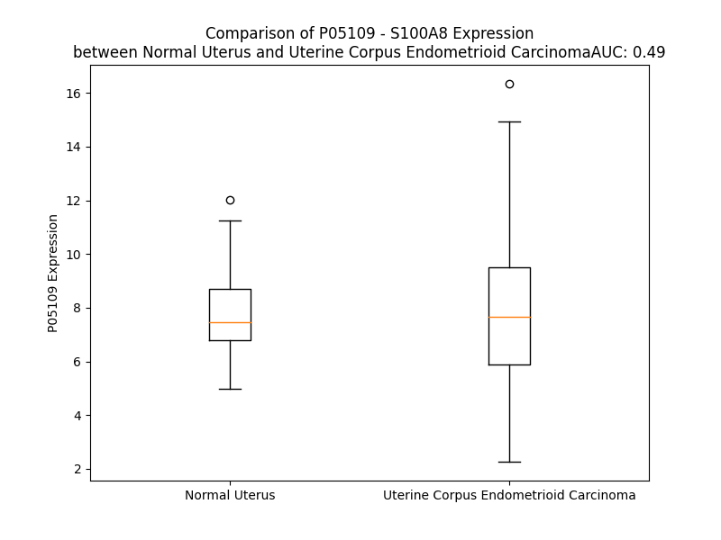

# Detailed Data for P05109

## Introduction to the Detailed Summary

### How to Interpret the Results

- **Summary & Metrics**: This section provides a quick reference to essential protein attributes, including expression changes, family classification, and biomarker applications. Regulation status (upregulated/downregulated) indicates the protein's behavior in a disease context. Some information comes from the original excel file with the proteins selected from literature, while others are derived from the analyses.
- **Expression Comparison**: A visual representation comparing protein expression between normal and disease states. It highlights significant changes in expression levels that might indicate diagnostic or therapeutic relevance. This is data coming from transcriptomics experiments and could not translate similarly to protein levels.
- **Isoform Alignment**: An interactive view of isoform alignments, revealing structural and functional differences between variants of the protein.
- **Interactors & Homologs**: Tables listing known interaction partners and homologous proteins, the more interactors and homologs, the more complex the protein is to design an antibody for.
- **Biological Assemblies**: Information about the structural arrangement of the protein in different assemblies, providing insights into its functional state but also the complexity of the protein to develop antibodies.
- **Combined Per-Residue Information**: A detailed table summarizing residue-level data. This includes predictions for epitope regions, aggregation tendencies, and modifications that might impact the protein's function. Each row corresponds to a residue in the protein, providing insights into specific sites that may be important for research or drug development.
## Summary & Metrics

- **UniProt Accession**: P05109
- **Gene Name**: S100A8
- **Protein Name**: S100 calcium binding protein A8. calgranulin A 
- **Swiss Prot**: S10A8_HUMAN
- **Family**: other
- **Biomarker Application**: diagnosis,efficacy,response to therapy,unspecified application
- **Number of Isoforms**: 0
- **Regulation**: 1
- **(transcriptomics) AUC**: 0.49
- **(transcriptomics) Fold Change**: 1.02
- **(transcriptomics) Regulation**: Upregulated
- **Discotope Epitope Count**: 16
- **Max n_uniprots (Homo)**: 2
- **Max n_uniprots (Hetero)**: 4

## Expression Comparison

## Interactors

| preferredName_A   | preferredName_B   |   score |
|:------------------|:------------------|--------:|
| S100A8            | S100A9            |   0.999 |
| S100A8            | PTPN11            |   0.995 |
| S100A8            | S100A12           |   0.995 |
| S100A8            | TJP1              |   0.98  |
| S100A8            | CDH1              |   0.944 |
| S100A8            | MET               |   0.927 |
| S100A8            | GRB2              |   0.913 |
| S100A8            | TLR4              |   0.907 |

## Homologs

| uniprot_id   | gene_id   |
|:-------------|:----------|
| P23297       | S100A1    |
| P33764       | S100A3    |
| P25815       | S100P     |
| P29377       | S100G     |
| P33763       | S100A5    |
| Q9HCY8       | S100A14   |
| P80511       | S100A12   |
| P26447       | S100A4    |
| P60903       | S100A10   |
| Q96FQ6       | S100A16   |
| P06703       | S100A6    |
| C9JRU3       | SNTN      |
| P31949       | S100A11   |
| P29034       | S100A2    |
| Q99584       | S100A13   |
| Q8WXG8       | S100Z     |
| P04271       | S100B     |
| P06702       | S100A9    |
| P31151       | S100A7    |
| Q86SG5       | S100A7A   |
| Q9UBG3       | CRNN      |

## Biological Assemblies

|   Unnamed: 0 |   assembly |   n_uniprots | composition   | crystal_id   |
|-------------:|-----------:|-------------:|:--------------|:-------------|
|            0 |          1 |            2 | Homo          | 1mr8         |
|            1 |          2 |            2 | Homo          | 1mr8         |
|            0 |          1 |            4 | Hetero        | 4xjk         |
|            1 |          2 |            4 | Hetero        | 4xjk         |
|            2 |          3 |            2 | Hetero        | 4xjk         |
|            0 |          1 |            4 | Hetero        | 4ggf         |
|            1 |          2 |            4 | Hetero        | 4ggf         |
|            0 |          1 |            2 | Hetero        | 7quv         |
|            0 |          1 |            2 | Homo          | 5hlv         |
|            1 |          2 |            2 | Homo          | 5hlv         |
|            2 |          3 |            2 | Homo          | 5hlv         |
|            3 |          4 |            2 | Homo          | 5hlv         |
|            0 |          1 |            4 | Hetero        | 1xk4         |
|            1 |          2 |            4 | Hetero        | 1xk4         |
|            2 |          3 |            4 | Hetero        | 1xk4         |
|            0 |          1 |            2 | Homo          | 5hlo         |
|            1 |          2 |            2 | Homo          | 5hlo         |
|            0 |          1 |            4 | Hetero        | 6ds2         |
|            1 |          2 |            4 | Hetero        | 6ds2         |
|            0 |          1 |            4 | Hetero        | 5w1f         |
|            1 |          2 |            4 | Hetero        | 5w1f         |

## Combined Per-Residue Information

|   res | aa   |   epitope_score | epitope   |   relative_surface_accessibility |   modeling_confidence |   Aggregation | modification      |
|------:|:-----|----------------:|:----------|---------------------------------:|----------------------:|--------------:|:------------------|
|     1 | M    |         0.437   | False     |                          1.22803 |                 91.1  |         0     | N/A               |
|     2 | L    |         0.39723 | False     |                          0.51115 |                 94.64 |         0     | N/A               |
|     3 | T    |         0.42342 | False     |                          0.58148 |                 98.15 |         0     | N/A               |
|     4 | E    |         0.40304 | False     |                          0.66027 |                 97.79 |         0     | N/A               |
|     5 | L    |         0.58757 | True      |                          0.77105 |                 97.91 |         0     | N/A               |
|     6 | E    |         0.37972 | False     |                          0.38399 |                 98.34 |         0     | N/A               |
|     7 | K    |         0.30479 | False     |                          0.43407 |                 98.48 |         0     | N/A               |
|     8 | A    |         0.30913 | False     |                          0.44386 |                 97.64 |         0.128 | N/A               |
|     9 | L    |         0.44755 | False     |                          0.49379 |                 98.36 |         0.54  | N/A               |
|    10 | N    |         0.36286 | False     |                          0.41975 |                 98.44 |         0.54  | N/A               |
|    11 | S    |         0.43516 | False     |                          0.49965 |                 98.27 |         0.54  | N/A               |
|    12 | I    |         0.3736  | False     |                          0.26239 |                 98.62 |         0.732 | N/A               |
|    13 | I    |         0.49783 | True      |                          0.37358 |                 98.79 |         0.732 | N/A               |
|    14 | D    |         0.5087  | True      |                          0.57172 |                 98.55 |         0.192 | N/A               |
|    15 | V    |         0.19277 | False     |                          0.29977 |                 98.67 |         0.192 | N/A               |
|    16 | Y    |         0.06342 | False     |                          0.00961 |                 98.83 |         0.192 | N/A               |
|    17 | H    |         0.49159 | True      |                          0.31017 |                 98.75 |         0.192 | N/A               |
|    18 | K    |         0.43228 | False     |                          0.56265 |                 98.56 |         0.192 | N/A               |
|    19 | Y    |         0.07001 | False     |                          0.01038 |                 98.62 |         0.192 | N/A               |
|    20 | S    |         0.02793 | False     |                          0.00538 |                 98.54 |         0.192 | N/A               |
|    21 | L    |         0.51155 | True      |                          0.42655 |                 98.22 |         0.192 | N/A               |
|    22 | I    |         0.49961 | True      |                          0.47945 |                 97.94 |         0.192 | N/A               |
|    23 | K    |         0.45453 | False     |                          0.56512 |                 96.62 |         0     | N/A               |
|    24 | G    |         0.53264 | True      |                          0.68293 |                 95.34 |         0     | N/A               |
|    25 | N    |         0.57001 | True      |                          0.35752 |                 97.28 |         0     | N/A               |
|    26 | F    |         0.62522 | True      |                          0.54115 |                 96.49 |         1.441 | N/A               |
|    27 | H    |         0.53565 | True      |                          0.74219 |                 97.95 |         1.441 | N/A               |
|    28 | A    |         0.27746 | False     |                          0.06471 |                 98.52 |         1.441 | N/A               |
|    29 | V    |         0.02063 | False     |                          0.00286 |                 98.78 |         1.441 | N/A               |
|    30 | Y    |         0.55025 | True      |                          0.30711 |                 98.04 |         1.441 | N/A               |
|    31 | R    |         0.41276 | False     |                          0.44188 |                 96.33 |         0     | N/A               |
|    32 | D    |         0.3206  | False     |                          0.54465 |                 95.62 |         0     | N/A               |
|    33 | D    |         0.1842  | False     |                          0.04668 |                 97.65 |         0     | N/A               |
|    34 | L    |         0.01167 | False     |                          0.00082 |                 97.18 |         0     | N/A               |
|    35 | K    |         0.29723 | False     |                          0.5054  |                 95.39 |         0     | N/A               |
|    36 | K    |         0.41295 | False     |                          0.57116 |                 95.71 |         0     | N/A               |
|    37 | L    |         0.0305  | False     |                          0.00907 |                 97.17 |         0     | N/A               |
|    38 | L    |         0.19448 | False     |                          0.11653 |                 95.74 |         0     | N/A               |
|    39 | E    |         0.40641 | False     |                          0.61984 |                 92.04 |         0     | N/A               |
|    40 | T    |         0.45139 | False     |                          0.51766 |                 94.23 |         0     | N/A               |
|    41 | E    |         0.31466 | False     |                          0.27805 |                 95.03 |         0     | N/A               |
|    42 | C    |         0.24274 | False     |                          0.07482 |                 91.37 |         0     | S-nitrosocysteine |
|    43 | P    |         0.35269 | False     |                          0.69341 |                 89.46 |         0     | N/A               |
|    44 | Q    |         0.52124 | True      |                          0.61359 |                 86.42 |         0     | N/A               |
|    45 | Y    |         0.47044 | False     |                          0.39935 |                 85.1  |         0     | N/A               |
|    46 | I    |         0.30231 | False     |                          0.13509 |                 83.9  |         0     | N/A               |
|    47 | R    |         0.54179 | True      |                          0.79369 |                 74.82 |         0     | N/A               |
|    48 | K    |         0.4637  | False     |                          1.00266 |                 77    |         0     | N/A               |
|    49 | K    |         0.46798 | False     |                          0.35997 |                 83.7  |         0     | N/A               |
|    50 | G    |         0.27637 | False     |                          0.54382 |                 86.7  |         0     | N/A               |
|    51 | A    |         0.17673 | False     |                          0.1527  |                 90.37 |         0.146 | N/A               |
|    52 | D    |         0.2605  | False     |                          0.47371 |                 94.2  |         0.146 | N/A               |
|    53 | V    |         0.33041 | False     |                          0.55121 |                 95.87 |         0.146 | N/A               |
|    54 | W    |         0.09317 | False     |                          0.04088 |                 95.9  |         0.146 | N/A               |
|    55 | F    |         0.22551 | False     |                          0.11608 |                 97.6  |         0.146 | N/A               |
|    56 | K    |         0.3768  | False     |                          0.86108 |                 97.29 |         0.146 | N/A               |
|    57 | E    |         0.35965 | False     |                          0.3804  |                 96.65 |         0     | N/A               |
|    58 | L    |         0.0094  | False     |                          0       |                 98.2  |         0     | N/A               |
|    59 | D    |         0.41549 | False     |                          0.07481 |                 98.55 |         0     | N/A               |
|    60 | I    |         0.44536 | False     |                          0.66081 |                 98.22 |         0     | N/A               |
|    61 | N    |         0.31951 | False     |                          0.53623 |                 98.23 |         0     | N/A               |
|    62 | T    |         0.60055 | True      |                          0.80243 |                 97.73 |         0     | N/A               |
|    63 | D    |         0.53801 | True      |                          0.57325 |                 98.02 |         0     | N/A               |
|    64 | G    |         0.37178 | False     |                          0.4679  |                 97.67 |         0.002 | N/A               |
|    65 | A    |         0.26599 | False     |                          0.09022 |                 98.31 |         0.061 | N/A               |
|    66 | V    |         0.01219 | False     |                          0.00286 |                 98.79 |         0.144 | N/A               |
|    67 | N    |         0.40296 | False     |                          0.26536 |                 98.8  |         0.151 | N/A               |
|    68 | F    |         0.39831 | False     |                          0.32488 |                 98.78 |         0.332 | N/A               |
|    69 | Q    |         0.40592 | False     |                          0.73286 |                 98.71 |         0.347 | N/A               |
|    70 | E    |         0.1297  | False     |                          0.04587 |                 98.81 |         0.722 | N/A               |
|    71 | F    |         0.09992 | False     |                          0.03567 |                 98.6  |        93.016 | N/A               |
|    72 | L    |         0.40985 | False     |                          0.33551 |                 98.65 |        99.902 | N/A               |
|    73 | I    |         0.30232 | False     |                          0.29279 |                 97.75 |        99.902 | N/A               |
|    74 | L    |         0.04407 | False     |                          0.00824 |                 96.79 |        99.902 | N/A               |
|    75 | V    |         0.31716 | False     |                          0.18272 |                 97.84 |        99.902 | N/A               |
|    76 | I    |         0.48872 | True      |                          0.65792 |                 97.73 |        92.176 | N/A               |
|    77 | K    |         0.36614 | False     |                          0.44993 |                 95.48 |         0.722 | N/A               |
|    78 | M    |         0.38248 | False     |                          0.25463 |                 95.01 |         0.579 | N/A               |
|    79 | G    |         0.35434 | False     |                          0.44762 |                 96.42 |         0.415 | N/A               |
|    80 | V    |         0.25215 | False     |                          0.7176  |                 96.17 |         0.4   | N/A               |
|    81 | A    |         0.19105 | False     |                          0.31603 |                 94.2  |         0.226 | N/A               |
|    82 | A    |         0.21764 | False     |                          0.27057 |                 94.24 |         0.078 | N/A               |
|    83 | H    |         0.33857 | False     |                          0.63312 |                 94.93 |         0     | N/A               |
|    84 | K    |         0.29122 | False     |                          0.6608  |                 93.78 |         0     | N/A               |
|    85 | K    |         0.33246 | False     |                          0.38914 |                 90.48 |         0     | N/A               |
|    86 | S    |         0.39269 | False     |                          0.49133 |                 91.97 |         0     | N/A               |
|    87 | H    |         0.31076 | False     |                          0.54794 |                 91.56 |         0     | N/A               |
|    88 | E    |         0.25114 | False     |                          0.4619  |                 85.7  |         0     | N/A               |
|    89 | E    |         0.33766 | False     |                          0.52115 |                 68.8  |         0     | N/A               |
|    90 | S    |         0.30976 | False     |                          0.58141 |                 60.95 |         0     | N/A               |
|    91 | H    |         0.42568 | False     |                          0.86027 |                 55.35 |         0     | N/A               |
|    92 | K    |         0.34037 | False     |                          0.85654 |                 50.4  |         0     | N/A               |
|    93 | E    |         0.18732 | False     |                          1.15585 |                 43.8  |         0     | N/A               |

