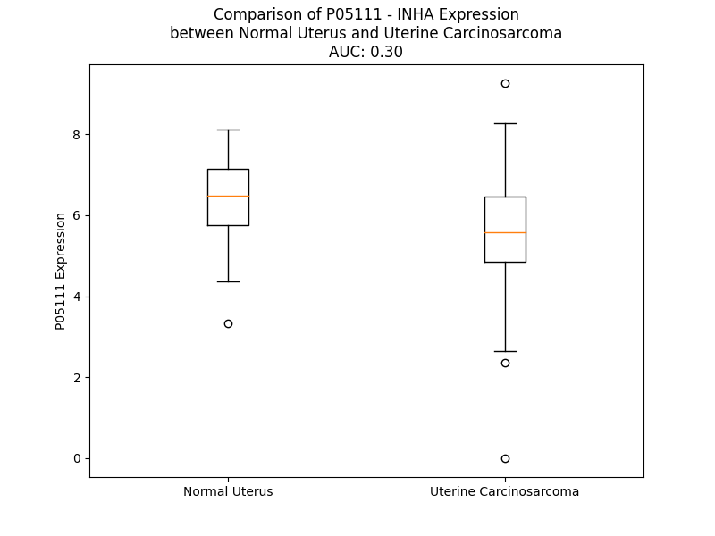

# Detailed Data for P05111

## Introduction to the Detailed Summary

### How to Interpret the Results

- **Summary & Metrics**: This section provides a quick reference to essential protein attributes, including expression changes, family classification, and biomarker applications. Regulation status (upregulated/downregulated) indicates the protein's behavior in a disease context. Some information comes from the original excel file with the proteins selected from literature, while others are derived from the analyses.
- **Expression Comparison**: A visual representation comparing protein expression between normal and disease states. It highlights significant changes in expression levels that might indicate diagnostic or therapeutic relevance. This is data coming from transcriptomics experiments and could not translate similarly to protein levels.
- **Isoform Alignment**: An interactive view of isoform alignments, revealing structural and functional differences between variants of the protein.
- **Interactors & Homologs**: Tables listing known interaction partners and homologous proteins, the more interactors and homologs, the more complex the protein is to design an antibody for.
- **Biological Assemblies**: Information about the structural arrangement of the protein in different assemblies, providing insights into its functional state but also the complexity of the protein to develop antibodies.
- **Combined Per-Residue Information**: A detailed table summarizing residue-level data. This includes predictions for epitope regions, aggregation tendencies, and modifications that might impact the protein's function. Each row corresponds to a residue in the protein, providing insights into specific sites that may be important for research or drug development.
## Summary & Metrics

- **UniProt Accession**: P05111
- **Gene Name**: INHA
- **Protein Name**: Inhibin alpha chain
- **Swiss Prot**: INHA_HUMAN
- **Family**: growth factor
- **Biomarker Application**: efficacy
- **Number of Isoforms**: 0
- **Regulation**: 1
- **(transcriptomics) AUC**: 0.16
- **(transcriptomics) Fold Change**: 1.37
- **(transcriptomics) Regulation**: Downregulated
- **Discotope Epitope Count**: 125
- **Max n_uniprots (Homo)**: N/A
- **Max n_uniprots (Hetero)**: N/A

## Expression Comparison

## Interactors

| preferredName_A   | preferredName_B   |   score |
|:------------------|:------------------|--------:|
| INHA              | ACVR2A            |   0.966 |
| INHA              | ACVR2B            |   0.962 |
| INHA              | INHBA             |   0.961 |
| INHA              | TGFBR3            |   0.904 |

## Homologs

| uniprot_id   | gene_id   |
|:-------------|:----------|
| Q9UK05       | GDF2      |
| P22004       | BMP6      |
| Q96S42       | NODAL     |
| Q7Z4P5       | GDF7      |
| C8C060       | BMP2      |
| P55103       | INHBC     |
| B4DXG3       | GDF9      |
| P34820       | BMP8B     |
| Q7Z5Y6       | BMP8A     |
| Q53S46       | GDF8      |
| A4D1W7       | INHBA     |
| P55107       | GDF10     |
| A0A499FJK2   | TGFB1     |
| A0A0S2A5D6   | GDF6      |
| Q99988       | GDF15     |
| P12645       | BMP3      |
| P27539       | GDF1      |
| P61812       | TGFB2     |
| O95390       | GDF11     |
| P09529       | INHBB     |
| O95972       | BMP15     |
| V9GYF1       | BMP4      |
| F1T0J1       | GDF5      |
| Q9NR23       | GDF3      |
| P10600       | TGFB3     |
| O95393       | BMP10     |
| P18075       | BMP7      |
| M9VUD0       | BMP5      |
| O00292       | LEFTY2    |
| O75610       | LEFTY1    |
| P58166       | INHBE     |

## Combined Per-Residue Information

|   res | aa   |   epitope_score | epitope   |   relative_surface_accessibility |   modeling_confidence |   Aggregation | modification   | glycosylation                            |
|------:|:-----|----------------:|:----------|---------------------------------:|----------------------:|--------------:|:---------------|:-----------------------------------------|
|     1 | M    |         0.12324 | False     |                          1.27979 |                 49.18 |         0.009 | N/A            | N/A                                      |
|     2 | V    |         0.18815 | False     |                          0.95815 |                 50.07 |        34.594 | N/A            | N/A                                      |
|     3 | L    |         0.19263 | False     |                          0.98007 |                 46.84 |        35.757 | N/A            | N/A                                      |
|     4 | H    |         0.26422 | True      |                          0.92561 |                 49.55 |        36.195 | N/A            | N/A                                      |
|     5 | L    |         0.2502  | True      |                          0.98714 |                 46.14 |        88.759 | N/A            | N/A                                      |
|     6 | L    |         0.23095 | True      |                          0.87864 |                 44.63 |        98.122 | N/A            | N/A                                      |
|     7 | L    |         0.2392  | True      |                          0.89033 |                 44.13 |        99.743 | N/A            | N/A                                      |
|     8 | F    |         0.23328 | True      |                          0.89328 |                 40.89 |        99.731 | N/A            | N/A                                      |
|     9 | L    |         0.22047 | True      |                          0.93082 |                 41.26 |        99.55  | N/A            | N/A                                      |
|    10 | L    |         0.1499  | False     |                          0.93959 |                 38.13 |        97.124 | N/A            | N/A                                      |
|    11 | L    |         0.17269 | False     |                          0.91077 |                 38.63 |        82.432 | N/A            | N/A                                      |
|    12 | T    |         0.1448  | False     |                          0.8214  |                 32.9  |         0.599 | N/A            | N/A                                      |
|    13 | P    |         0.13096 | False     |                          0.91357 |                 37.72 |         0.263 | N/A            | N/A                                      |
|    14 | Q    |         0.19939 | False     |                          0.94456 |                 35.97 |         0     | N/A            | N/A                                      |
|    15 | G    |         0.1905  | False     |                          0.63316 |                 31.61 |         0     | N/A            | N/A                                      |
|    16 | G    |         0.17111 | False     |                          0.85747 |                 32.5  |         0     | N/A            | N/A                                      |
|    17 | H    |         0.15628 | False     |                          1.03654 |                 37.25 |         0     | N/A            | N/A                                      |
|    18 | S    |         0.16465 | False     |                          0.73057 |                 34.86 |         0     | N/A            | N/A                                      |
|    19 | C    |         0.1487  | False     |                          0.78065 |                 43.06 |         0     | N/A            | N/A                                      |
|    20 | Q    |         0.26988 | True      |                          0.81616 |                 37.8  |         0     | N/A            | N/A                                      |
|    21 | G    |         0.16206 | False     |                          0.49544 |                 48.72 |         0     | N/A            | N/A                                      |
|    22 | L    |         0.25778 | True      |                          1.03575 |                 56.66 |         0     | N/A            | N/A                                      |
|    23 | E    |         0.23096 | True      |                          0.74263 |                 56.48 |         0     | N/A            | N/A                                      |
|    24 | L    |         0.15703 | False     |                          0.7934  |                 58.84 |         0.359 | N/A            | N/A                                      |
|    25 | A    |         0.07876 | False     |                          0.25951 |                 75.13 |         0.359 | N/A            | N/A                                      |
|    26 | R    |         0.25731 | True      |                          0.43571 |                 87.32 |         0.359 | N/A            | N/A                                      |
|    27 | E    |         0.21198 | False     |                          0.61959 |                 88.52 |         0.489 | N/A            | N/A                                      |
|    28 | L    |         0.20974 | False     |                          0.81228 |                 89.35 |         0.489 | N/A            | N/A                                      |
|    29 | V    |         0.04208 | False     |                          0.12472 |                 90.52 |         0.489 | N/A            | N/A                                      |
|    30 | L    |         0.09352 | False     |                          0.0981  |                 93.42 |         0.489 | N/A            | N/A                                      |
|    31 | A    |         0.12071 | False     |                          0.49882 |                 92.75 |         0.295 | N/A            | N/A                                      |
|    32 | K    |         0.12652 | False     |                          0.61371 |                 92.2  |         0.131 | N/A            | N/A                                      |
|    33 | V    |         0.00402 | False     |                          0       |                 93.77 |         0.309 | N/A            | N/A                                      |
|    34 | R    |         0.1597  | False     |                          0.37779 |                 93.86 |         0.309 | N/A            | N/A                                      |
|    35 | A    |         0.11697 | False     |                          0.5147  |                 93.64 |         0.309 | N/A            | N/A                                      |
|    36 | L    |         0.08197 | False     |                          0.33942 |                 93.24 |         0.309 | N/A            | N/A                                      |
|    37 | F    |         0.00376 | False     |                          0       |                 93.68 |         0.309 | N/A            | N/A                                      |
|    38 | L    |         0.14612 | False     |                          0.4302  |                 91.82 |         0.309 | N/A            | N/A                                      |
|    39 | D    |         0.17966 | False     |                          0.79999 |                 91.91 |         0.309 | N/A            | N/A                                      |
|    40 | A    |         0.114   | False     |                          0.39442 |                 90.48 |         0.309 | N/A            | N/A                                      |
|    41 | L    |         0.15462 | False     |                          0.20335 |                 88.34 |         0.309 | N/A            | N/A                                      |
|    42 | G    |         0.12283 | False     |                          0.27047 |                 85.95 |         0     | N/A            | N/A                                      |
|    43 | P    |         0.19381 | False     |                          0.83166 |                 81.21 |         0     | N/A            | N/A                                      |
|    44 | P    |         0.11626 | False     |                          0.25081 |                 74.85 |         0     | N/A            | N/A                                      |
|    45 | A    |         0.07616 | False     |                          0.68738 |                 63.48 |         0     | N/A            | N/A                                      |
|    46 | V    |         0.15613 | False     |                          0.88301 |                 56.31 |         0     | N/A            | N/A                                      |
|    47 | T    |         0.14194 | False     |                          0.8338  |                 46.44 |         0     | N/A            | N/A                                      |
|    48 | R    |         0.18834 | False     |                          0.89177 |                 41.37 |         0     | N/A            | N/A                                      |
|    49 | E    |         0.23811 | True      |                          0.93089 |                 37.72 |         0     | N/A            | N/A                                      |
|    50 | G    |         0.27716 | True      |                          0.84794 |                 33.21 |         0     | N/A            | N/A                                      |
|    51 | G    |         0.23914 | True      |                          0.78576 |                 30.94 |         0     | N/A            | N/A                                      |
|    52 | D    |         0.2267  | True      |                          0.89654 |                 37.29 |         0     | N/A            | N/A                                      |
|    53 | P    |         0.14009 | False     |                          0.76406 |                 37.26 |         0     | N/A            | N/A                                      |
|    54 | G    |         0.2024  | False     |                          0.86479 |                 34    |         0     | N/A            | N/A                                      |
|    55 | V    |         0.10564 | False     |                          0.8051  |                 41.48 |         0     | N/A            | N/A                                      |
|    56 | R    |         0.19589 | False     |                          0.8872  |                 39.01 |         0     | N/A            | N/A                                      |
|    57 | R    |         0.20408 | False     |                          0.93476 |                 41.27 |         0     | N/A            | N/A                                      |
|    58 | L    |         0.15636 | False     |                          0.93621 |                 40.94 |         0     | N/A            | N/A                                      |
|    59 | P    |         0.11628 | False     |                          0.81143 |                 39.8  |         0     | N/A            | N/A                                      |
|    60 | R    |         0.177   | False     |                          0.71687 |                 41.25 |         0     | N/A            | N/A                                      |
|    61 | R    |         0.18778 | False     |                          0.95351 |                 35.79 |         0     | N/A            | N/A                                      |
|    62 | H    |         0.11224 | False     |                          0.60769 |                 39.47 |         0     | N/A            | N/A                                      |
|    63 | A    |         0.14907 | False     |                          0.66547 |                 34.14 |         0     | N/A            | N/A                                      |
|    64 | L    |         0.21993 | True      |                          1.07339 |                 38.28 |         0     | N/A            | N/A                                      |
|    65 | G    |         0.15632 | False     |                          0.54816 |                 34.55 |         0     | N/A            | N/A                                      |
|    66 | G    |         0.17205 | False     |                          0.91826 |                 29.5  |         0     | N/A            | N/A                                      |
|    67 | F    |         0.18521 | False     |                          0.86196 |                 34.88 |         0     | N/A            | N/A                                      |
|    68 | T    |         0.22732 | True      |                          0.84746 |                 38.72 |         0     | N/A            | N/A                                      |
|    69 | H    |         0.22301 | True      |                          1.02574 |                 34.8  |         0     | N/A            | N/A                                      |
|    70 | R    |         0.3036  | True      |                          0.9095  |                 36.83 |         0     | N/A            | N/A                                      |
|    71 | G    |         0.26074 | True      |                          0.7173  |                 31.65 |         0     | N/A            | N/A                                      |
|    72 | S    |         0.27126 | True      |                          0.88169 |                 35.98 |         0     | N/A            | N/A                                      |
|    73 | E    |         0.24429 | True      |                          0.83788 |                 34.53 |         0     | N/A            | N/A                                      |
|    74 | P    |         0.22341 | True      |                          0.63598 |                 36.93 |         0     | N/A            | N/A                                      |
|    75 | E    |         0.22135 | True      |                          0.85541 |                 44.01 |         0     | N/A            | N/A                                      |
|    76 | E    |         0.2565  | True      |                          0.51038 |                 43.74 |         0     | N/A            | N/A                                      |
|    77 | E    |         0.21483 | True      |                          0.86357 |                 44.09 |         0     | N/A            | N/A                                      |
|    78 | E    |         0.17026 | False     |                          0.82775 |                 51.87 |         0     | N/A            | N/A                                      |
|    79 | D    |         0.10483 | False     |                          0.23029 |                 64.97 |         0     | N/A            | N/A                                      |
|    80 | V    |         0.10588 | False     |                          0.41768 |                 66.83 |         0     | N/A            | N/A                                      |
|    81 | S    |         0.18924 | False     |                          0.21331 |                 74.92 |         0     | N/A            | N/A                                      |
|    82 | Q    |         0.13663 | False     |                          0.5654  |                 85.17 |         0     | N/A            | N/A                                      |
|    83 | A    |         0.15096 | False     |                          0.20279 |                 79.02 |         0.192 | N/A            | N/A                                      |
|    84 | I    |         0.17866 | False     |                          0.56752 |                 85.2  |         0.192 | N/A            | N/A                                      |
|    85 | L    |         0.05509 | False     |                          0.08903 |                 87.57 |         0.192 | N/A            | N/A                                      |
|    86 | F    |         0.12205 | False     |                          0.63207 |                 87.61 |         0.192 | N/A            | N/A                                      |
|    87 | P    |         0.06991 | False     |                          0.15556 |                 83.64 |         0.192 | N/A            | N/A                                      |
|    88 | A    |         0.20081 | False     |                          0.47306 |                 75.28 |         0     | N/A            | N/A                                      |
|    89 | T    |         0.20897 | False     |                          0.43433 |                 67.24 |         0     | N/A            | N/A                                      |
|    90 | D    |         0.26225 | True      |                          0.87105 |                 55.55 |         0     | N/A            | N/A                                      |
|    91 | A    |         0.09344 | False     |                          0.32805 |                 54.3  |         0     | N/A            | N/A                                      |
|    92 | S    |         0.11716 | False     |                          0.7761  |                 53.49 |         0     | N/A            | N/A                                      |
|    93 | C    |         0.12971 | False     |                          0.31182 |                 59.43 |         0     | N/A            | N/A                                      |
|    94 | E    |         0.22017 | True      |                          0.83055 |                 50.65 |         0     | N/A            | N/A                                      |
|    95 | D    |         0.20145 | False     |                          0.69431 |                 44.03 |         0     | N/A            | N/A                                      |
|    96 | K    |         0.18436 | False     |                          0.72664 |                 41.91 |         0     | N/A            | N/A                                      |
|    97 | S    |         0.28735 | True      |                          0.6499  |                 36.5  |         0     | N/A            | N/A                                      |
|    98 | A    |         0.2624  | True      |                          0.92937 |                 33.52 |         0     | N/A            | N/A                                      |
|    99 | A    |         0.22145 | True      |                          0.9121  |                 32.07 |         0     | N/A            | N/A                                      |
|   100 | R    |         0.32938 | True      |                          0.97923 |                 30.35 |         0     | N/A            | N/A                                      |
|   101 | G    |         0.27183 | True      |                          0.64864 |                 26.22 |         0     | N/A            | N/A                                      |
|   102 | L    |         0.31611 | True      |                          1.13666 |                 27.33 |         0     | N/A            | N/A                                      |
|   103 | A    |         0.17031 | False     |                          0.91353 |                 26.28 |         0     | N/A            | N/A                                      |
|   104 | Q    |         0.26873 | True      |                          0.87808 |                 26.71 |         0     | N/A            | N/A                                      |
|   105 | E    |         0.29141 | True      |                          0.89056 |                 28.21 |         0     | N/A            | N/A                                      |
|   106 | A    |         0.20008 | False     |                          0.76361 |                 33.42 |         0     | N/A            | N/A                                      |
|   107 | E    |         0.23724 | True      |                          0.43495 |                 53.05 |         0     | N/A            | N/A                                      |
|   108 | E    |         0.25837 | True      |                          0.74379 |                 61.21 |         0     | N/A            | N/A                                      |
|   109 | G    |         0.07492 | False     |                          0.16875 |                 73.93 |         0     | N/A            | N/A                                      |
|   110 | L    |         0.18175 | False     |                          0.36891 |                 83.46 |         0     | N/A            | N/A                                      |
|   111 | F    |         0.06372 | False     |                          0.15695 |                 84.6  |         0     | N/A            | N/A                                      |
|   112 | R    |         0.17813 | False     |                          0.59524 |                 86.72 |         0     | N/A            | N/A                                      |
|   113 | Y    |         0.02388 | False     |                          0.07664 |                 86.27 |         0     | N/A            | N/A                                      |
|   114 | M    |         0.09146 | False     |                          0.23289 |                 86.93 |         0     | N/A            | N/A                                      |
|   115 | F    |         0.00358 | False     |                          0       |                 87.52 |         0     | N/A            | N/A                                      |
|   116 | R    |         0.18677 | False     |                          0.56262 |                 87.24 |         0     | N/A            | N/A                                      |
|   117 | P    |         0.01898 | False     |                          0.04262 |                 82.59 |         0     | N/A            | N/A                                      |
|   118 | S    |         0.17964 | False     |                          0.46763 |                 76.59 |         0     | N/A            | N/A                                      |
|   119 | Q    |         0.14369 | False     |                          0.70906 |                 74.54 |         0     | N/A            | N/A                                      |
|   120 | H    |         0.13521 | False     |                          0.48377 |                 71.19 |         0     | N/A            | N/A                                      |
|   121 | T    |         0.0166  | False     |                          0.00964 |                 72.44 |         0     | N/A            | N/A                                      |
|   122 | R    |         0.21066 | False     |                          0.3557  |                 85.23 |         0     | N/A            | N/A                                      |
|   123 | S    |         0.10524 | False     |                          0.56688 |                 78.45 |         0     | N/A            | N/A                                      |
|   124 | R    |         0.13408 | False     |                          0.16541 |                 84.27 |         0     | N/A            | N/A                                      |
|   125 | Q    |         0.0896  | False     |                          0.41983 |                 89.78 |         0     | N/A            | N/A                                      |
|   126 | V    |         0.01862 | False     |                          0.09911 |                 90.67 |         0.176 | N/A            | N/A                                      |
|   127 | T    |         0.07395 | False     |                          0.40762 |                 91.48 |         0.176 | N/A            | N/A                                      |
|   128 | S    |         0.06268 | False     |                          0.31692 |                 93.95 |         0.176 | N/A            | N/A                                      |
|   129 | A    |         0.00796 | False     |                          0.01904 |                 95.14 |         0.732 | N/A            | N/A                                      |
|   130 | Q    |         0.1069  | False     |                          0.18636 |                 95.19 |         0.732 | N/A            | N/A                                      |
|   131 | L    |         0.00399 | False     |                          0       |                 94.77 |         0.732 | N/A            | N/A                                      |
|   132 | W    |         0.24059 | True      |                          0.26198 |                 93.04 |         0.732 | N/A            | N/A                                      |
|   133 | F    |         0.01363 | False     |                          0.01519 |                 90.94 |         0.732 | N/A            | N/A                                      |
|   134 | H    |         0.22148 | True      |                          0.27002 |                 89.72 |         0     | N/A            | N/A                                      |
|   135 | T    |         0.08698 | False     |                          0.10481 |                 87.23 |         0     | N/A            | N/A                                      |
|   136 | G    |         0.25358 | True      |                          0.33884 |                 81.41 |         0     | N/A            | N/A                                      |
|   137 | L    |         0.44926 | True      |                          0.34143 |                 76.98 |         0     | N/A            | N/A                                      |
|   138 | D    |         0.45561 | True      |                          0.59652 |                 66.2  |         0     | N/A            | N/A                                      |
|   139 | R    |         0.42365 | True      |                          0.67971 |                 55.88 |         0     | N/A            | N/A                                      |
|   140 | Q    |         0.4534  | True      |                          0.88085 |                 47.31 |         0     | N/A            | N/A                                      |
|   141 | G    |         0.22078 | True      |                          0.57881 |                 46.04 |         0     | N/A            | N/A                                      |
|   142 | T    |         0.29463 | True      |                          0.59169 |                 49.31 |         0     | N/A            | N/A                                      |
|   143 | A    |         0.31805 | True      |                          0.94628 |                 42.63 |         0     | N/A            | N/A                                      |
|   144 | A    |         0.24563 | True      |                          0.92982 |                 38.36 |         0     | N/A            | N/A                                      |
|   145 | S    |         0.19737 | False     |                          0.49722 |                 44.42 |         0     | N/A            | N/A                                      |
|   146 | N    |         0.30025 | True      |                          1.08325 |                 51.9  |         0     | N/A            | N-linked (GlcNAc...) asparagine          |
|   147 | S    |         0.20819 | False     |                          0.4917  |                 51.02 |         0     | N/A            | N/A                                      |
|   148 | S    |         0.25708 | True      |                          0.96463 |                 51.85 |         0     | N/A            | N/A                                      |
|   149 | E    |         0.22645 | True      |                          0.57688 |                 55.86 |         0     | N/A            | N/A                                      |
|   150 | P    |         0.29753 | True      |                          0.75752 |                 60.32 |         0     | N/A            | N/A                                      |
|   151 | L    |         0.24064 | True      |                          0.35423 |                 74.77 |         9.66  | N/A            | N/A                                      |
|   152 | L    |         0.12869 | False     |                          0.23302 |                 85.76 |        13.785 | N/A            | N/A                                      |
|   153 | G    |         0.14125 | False     |                          0.20118 |                 87.75 |        14.424 | N/A            | N/A                                      |
|   154 | L    |         0.03526 | False     |                          0.0303  |                 92.29 |        14.424 | N/A            | N/A                                      |
|   155 | L    |         0.17663 | False     |                          0.27863 |                 91.81 |        14.424 | N/A            | N/A                                      |
|   156 | A    |         0.01729 | False     |                          0.03444 |                 91.48 |        12.91  | N/A            | N/A                                      |
|   157 | L    |         0.1021  | False     |                          0.40911 |                 87.13 |        11.011 | N/A            | N/A                                      |
|   158 | S    |         0.12762 | False     |                          0.38735 |                 82.57 |         0     | N/A            | N/A                                      |
|   159 | P    |         0.32546 | True      |                          1.10845 |                 76.41 |         0     | N/A            | N/A                                      |
|   160 | G    |         0.24987 | True      |                          0.96968 |                 79    |         0     | N/A            | N/A                                      |
|   161 | G    |         0.254   | True      |                          0.28836 |                 79.07 |         0     | N/A            | N/A                                      |
|   162 | P    |         0.30276 | True      |                          0.58129 |                 87.09 |         0     | N/A            | N/A                                      |
|   163 | V    |         0.22811 | True      |                          0.59028 |                 89.33 |         0     | N/A            | N/A                                      |
|   164 | A    |         0.09277 | False     |                          0.7049  |                 92.32 |         0     | N/A            | N/A                                      |
|   165 | V    |         0.02614 | False     |                          0.06207 |                 93.19 |         0     | N/A            | N/A                                      |
|   166 | P    |         0.1309  | False     |                          0.49477 |                 93.61 |         0     | N/A            | N/A                                      |
|   167 | M    |         0.1677  | False     |                          0.27883 |                 92.57 |         0     | N/A            | N/A                                      |
|   168 | S    |         0.17343 | False     |                          0.51962 |                 92.38 |         0     | N/A            | N/A                                      |
|   169 | L    |         0.2033  | False     |                          0.70767 |                 90.91 |         0     | N/A            | N/A                                      |
|   170 | G    |         0.20928 | False     |                          0.24013 |                 87.88 |         0     | N/A            | N/A                                      |
|   171 | H    |         0.36259 | True      |                          0.82776 |                 87.19 |         0     | N/A            | N/A                                      |
|   172 | A    |         0.13497 | False     |                          0.12387 |                 85.48 |         0     | N/A            | N/A                                      |
|   173 | P    |         0.364   | True      |                          0.50729 |                 86.39 |         0     | N/A            | N/A                                      |
|   174 | P    |         0.48776 | True      |                          0.59939 |                 84.39 |         0     | N/A            | N/A                                      |
|   175 | H    |         0.39115 | True      |                          0.37463 |                 86.1  |         0     | N/A            | N/A                                      |
|   176 | W    |         0.24116 | True      |                          0.26232 |                 89.73 |         1.965 | N/A            | N/A                                      |
|   177 | A    |         0.04861 | False     |                          0.06505 |                 91.12 |         1.965 | N/A            | N/A                                      |
|   178 | V    |         0.02536 | False     |                          0.01047 |                 93.05 |         2.254 | N/A            | N/A                                      |
|   179 | L    |         0.01271 | False     |                          0.00989 |                 94.17 |         2.254 | N/A            | N/A                                      |
|   180 | H    |         0.09021 | False     |                          0.33727 |                 95.4  |         2.254 | N/A            | N/A                                      |
|   181 | L    |         0.02905 | False     |                          0.07869 |                 95.36 |         2.672 | N/A            | N/A                                      |
|   182 | A    |         0.08295 | False     |                          0.35584 |                 95.79 |         2.187 | N/A            | N/A                                      |
|   183 | T    |         0.20351 | False     |                          0.82502 |                 94.48 |         1.646 | N/A            | N/A                                      |
|   184 | S    |         0.17915 | False     |                          0.67981 |                 93.86 |         1.528 | N/A            | N/A                                      |
|   185 | A    |         0.04489 | False     |                          0.03954 |                 94.02 |         2.915 | N/A            | N/A                                      |
|   186 | L    |         0.04496 | False     |                          0.07754 |                 94.3  |         3.394 | N/A            | N/A                                      |
|   187 | S    |         0.16102 | False     |                          0.49456 |                 92.08 |         3.258 | N/A            | N/A                                      |
|   188 | L    |         0.08084 | False     |                          0.2267  |                 91.61 |         3.258 | N/A            | N/A                                      |
|   189 | L    |         0.00423 | False     |                          0       |                 88.61 |         3.258 | N/A            | N/A                                      |
|   190 | T    |         0.10027 | False     |                          0.40146 |                 87.59 |         1.21  | N/A            | N/A                                      |
|   191 | H    |         0.14916 | False     |                          0.47588 |                 87.96 |         0     | N/A            | N/A                                      |
|   192 | P    |         0.08872 | False     |                          0.66309 |                 85.56 |         1.161 | N/A            | N/A                                      |
|   193 | V    |         0.08965 | False     |                          0.49136 |                 87.4  |        89.795 | N/A            | N/A                                      |
|   194 | L    |         0.0174  | False     |                          0.0305  |                 87.87 |        97.073 | N/A            | N/A                                      |
|   195 | V    |         0.05945 | False     |                          0.12025 |                 90.64 |        97.073 | N/A            | N/A                                      |
|   196 | L    |         0.00318 | False     |                          0       |                 90.14 |        97.073 | N/A            | N/A                                      |
|   197 | L    |         0.10047 | False     |                          0.09068 |                 89.85 |        96.999 | N/A            | N/A                                      |
|   198 | L    |         0.02562 | False     |                          0.00989 |                 89.53 |        84.758 | N/A            | N/A                                      |
|   199 | R    |         0.12364 | False     |                          0.34822 |                 89.22 |         0     | N/A            | N/A                                      |
|   200 | C    |         0.08135 | False     |                          0.03742 |                 88.88 |         0     | N/A            | N/A                                      |
|   201 | P    |         0.23848 | True      |                          0.541   |                 85    |         0     | N/A            | N/A                                      |
|   202 | L    |         0.22899 | True      |                          0.52749 |                 83.29 |         0     | N/A            | N/A                                      |
|   203 | C    |         0.08854 | False     |                          0.11637 |                 86.3  |         0     | N/A            | N/A                                      |
|   204 | T    |         0.22201 | True      |                          0.57364 |                 81.76 |         0     | N/A            | N/A                                      |
|   205 | C    |         0.17576 | False     |                          0.48628 |                 79.41 |         0     | N/A            | N/A                                      |
|   206 | S    |         0.3628  | True      |                          0.25711 |                 80.05 |         0     | N/A            | N/A                                      |
|   207 | A    |         0.29208 | True      |                          0.8187  |                 77.44 |         0     | N/A            | N/A                                      |
|   208 | R    |         0.63676 | True      |                          0.71749 |                 81.44 |         0     | N/A            | N/A                                      |
|   209 | P    |         0.41048 | True      |                          0.84731 |                 82.37 |         0     | N/A            | N/A                                      |
|   210 | E    |         0.41757 | True      |                          0.75987 |                 84.41 |         0     | N/A            | N/A                                      |
|   211 | A    |         0.13    | False     |                          0.09965 |                 86.35 |         0     | N/A            | N/A                                      |
|   212 | T    |         0.08529 | False     |                          0.3197  |                 86.39 |         0     | N/A            | N/A                                      |
|   213 | P    |         0.01969 | False     |                          0.02982 |                 89.7  |         0.5   | N/A            | N/A                                      |
|   214 | F    |         0.20064 | False     |                          0.21784 |                 92.35 |         0.5   | N/A            | N/A                                      |
|   215 | L    |         0.00435 | False     |                          0       |                 92.09 |         0.5   | N/A            | N/A                                      |
|   216 | V    |         0.06437 | False     |                          0.08829 |                 93.25 |         0.5   | N/A            | N/A                                      |
|   217 | A    |         0.00278 | False     |                          0       |                 90.36 |         0.5   | N/A            | N/A                                      |
|   218 | H    |         0.05383 | False     |                          0.27804 |                 90.63 |         0     | N/A            | N/A                                      |
|   219 | T    |         0.01545 | False     |                          0.00457 |                 87.66 |         0     | N/A            | N/A                                      |
|   220 | R    |         0.26296 | True      |                          0.40555 |                 87.75 |         0     | N/A            | N/A                                      |
|   221 | T    |         0.12201 | False     |                          0.46639 |                 79.78 |         0     | N/A            | N/A                                      |
|   222 | R    |         0.24549 | True      |                          0.60973 |                 74.57 |         0     | N/A            | N/A                                      |
|   223 | P    |         0.14411 | False     |                          0.60496 |                 65.18 |         0     | N/A            | N/A                                      |
|   224 | P    |         0.18716 | False     |                          0.71531 |                 58.09 |         0     | N/A            | N/A                                      |
|   225 | S    |         0.13961 | False     |                          0.7105  |                 54.92 |         0     | N/A            | N/A                                      |
|   226 | G    |         0.2163  | True      |                          1.06004 |                 46.61 |         0     | N/A            | N/A                                      |
|   227 | G    |         0.26032 | True      |                          0.96608 |                 45.33 |         0     | N/A            | N/A                                      |
|   228 | E    |         0.13682 | False     |                          0.49916 |                 41.24 |         0     | N/A            | N/A                                      |
|   229 | R    |         0.14949 | False     |                          0.86719 |                 41.14 |         0     | N/A            | N/A                                      |
|   230 | A    |         0.24185 | True      |                          1.0081  |                 38.71 |         0     | N/A            | N/A                                      |
|   231 | R    |         0.1912  | False     |                          0.76978 |                 42.46 |         0     | N/A            | N/A                                      |
|   232 | R    |         0.2428  | True      |                          1.00093 |                 45.53 |         0     | N/A            | N/A                                      |
|   233 | S    |         0.17824 | False     |                          0.5305  |                 43.47 |         0     | N/A            | N/A                                      |
|   234 | T    |         0.19751 | False     |                          0.86916 |                 39.73 |         0     | N/A            | N/A                                      |
|   235 | P    |         0.14572 | False     |                          0.68047 |                 41.98 |         0     | N/A            | N/A                                      |
|   236 | L    |         0.21738 | True      |                          0.94253 |                 41.86 |         0     | N/A            | N/A                                      |
|   237 | M    |         0.20357 | False     |                          0.73409 |                 41.78 |         0     | N/A            | N/A                                      |
|   238 | S    |         0.21502 | True      |                          0.90754 |                 40.39 |         0     | N/A            | N/A                                      |
|   239 | W    |         0.2991  | True      |                          0.80614 |                 48.56 |         0     | N/A            | N/A                                      |
|   240 | P    |         0.20329 | False     |                          0.89977 |                 52.03 |         0     | N/A            | N/A                                      |
|   241 | W    |         0.24813 | True      |                          0.48075 |                 55.95 |         0     | N/A            | N/A                                      |
|   242 | S    |         0.19495 | False     |                          0.45144 |                 60.21 |         0     | N/A            | N/A                                      |
|   243 | P    |         0.24718 | True      |                          0.81652 |                 67.97 |         0     | N/A            | N/A                                      |
|   244 | S    |         0.19713 | False     |                          0.57675 |                 66.14 |         0     | N/A            | N/A                                      |
|   245 | A    |         0.13904 | False     |                          0.28948 |                 59.91 |         0     | N/A            | N/A                                      |
|   246 | L    |         0.17552 | False     |                          0.45175 |                 58.12 |         0     | N/A            | N/A                                      |
|   247 | R    |         0.31396 | True      |                          0.80191 |                 63.05 |         0     | N/A            | N/A                                      |
|   248 | L    |         0.21614 | True      |                          0.78577 |                 54.48 |         0     | N/A            | N/A                                      |
|   249 | L    |         0.24625 | True      |                          0.69888 |                 56.66 |         0     | N/A            | N/A                                      |
|   250 | Q    |         0.21203 | False     |                          0.70121 |                 56.94 |         0     | N/A            | N/A                                      |
|   251 | R    |         0.36472 | True      |                          0.60952 |                 46.28 |         0     | N/A            | N/A                                      |
|   252 | P    |         0.22724 | True      |                          0.75053 |                 51.49 |         0     | N/A            | N/A                                      |
|   253 | P    |         0.27578 | True      |                          0.98386 |                 44.12 |         0     | N/A            | N/A                                      |
|   254 | E    |         0.32996 | True      |                          0.56453 |                 40.14 |         0     | N/A            | N/A                                      |
|   255 | E    |         0.2907  | True      |                          0.72101 |                 40.5  |         0     | N/A            | N/A                                      |
|   256 | P    |         0.29846 | True      |                          0.81948 |                 46.06 |         0     | N/A            | N/A                                      |
|   257 | A    |         0.28674 | True      |                          0.64092 |                 47.29 |         0     | N/A            | N/A                                      |
|   258 | A    |         0.22977 | True      |                          0.62888 |                 45.85 |         0     | N/A            | N/A                                      |
|   259 | H    |         0.19122 | False     |                          0.66854 |                 57.25 |         0     | N/A            | N/A                                      |
|   260 | A    |         0.35955 | True      |                          0.56894 |                 68.35 |         0     | N/A            | N/A                                      |
|   261 | N    |         0.15775 | False     |                          0.44591 |                 76.39 |         0     | N/A            | N/A                                      |
|   262 | C    |         0.05862 | False     |                          0.23303 |                 84.37 |         0     | N/A            | N/A                                      |
|   263 | H    |         0.16302 | False     |                          0.26383 |                 85.66 |         0     | N/A            | N/A                                      |
|   264 | R    |         0.15695 | False     |                          0.43474 |                 88.4  |         0     | N/A            | N/A                                      |
|   265 | V    |         0.11443 | False     |                          0.26628 |                 89.23 |         5.559 | N/A            | N/A                                      |
|   266 | A    |         0.118   | False     |                          0.58122 |                 90.79 |         6.028 | N/A            | N/A                                      |
|   267 | L    |         0.19734 | False     |                          0.26297 |                 90.7  |         6.028 | N/A            | N/A                                      |
|   268 | N    |         0.12127 | False     |                          0.59421 |                 94.11 |         6.028 | N/A            | N-linked (GlcNAc...) asparagine          |
|   269 | I    |         0.0047  | False     |                          0       |                 94.54 |         6.028 | N/A            | N/A                                      |
|   270 | S    |         0.17238 | False     |                          0.27517 |                 94.66 |         5.592 | N/A            | N/A                                      |
|   271 | F    |         0.00784 | False     |                          0.0048  |                 93.46 |         5.592 | N/A            | N/A                                      |
|   272 | Q    |         0.15616 | False     |                          0.67195 |                 92.03 |         0.193 | N/A            | N/A                                      |
|   273 | E    |         0.19331 | False     |                          0.26855 |                 90    |         0     | N/A            | N/A                                      |
|   274 | L    |         0.07249 | False     |                          0.05005 |                 91.36 |         0     | N/A            | N/A                                      |
|   275 | G    |         0.17218 | False     |                          0.69886 |                 90.67 |         0     | N/A            | N/A                                      |
|   276 | W    |         0.08037 | False     |                          0.10345 |                 92.2  |         0     | N/A            | N/A                                      |
|   277 | E    |         0.10858 | False     |                          0.36358 |                 88.6  |         0     | N/A            | N/A                                      |
|   278 | R    |         0.12757 | False     |                          0.80876 |                 87.46 |         0     | N/A            | N/A                                      |
|   279 | W    |         0.12679 | False     |                          0.1349  |                 89.68 |         0     | N/A            | N/A                                      |
|   280 | I    |         0.03213 | False     |                          0.01597 |                 90.27 |         0     | N/A            | N/A                                      |
|   281 | V    |         0.1419  | False     |                          0.28858 |                 86.98 |         0     | N/A            | N/A                                      |
|   282 | Y    |         0.32417 | True      |                          0.6173  |                 90.34 |         0     | N/A            | N/A                                      |
|   283 | P    |         0.11528 | False     |                          0.16999 |                 95.31 |         0     | N/A            | N/A                                      |
|   284 | P    |         0.12063 | False     |                          0.69663 |                 92.08 |         0.114 | N/A            | N/A                                      |
|   285 | S    |         0.14138 | False     |                          0.30912 |                 95.4  |         2.505 | N/A            | N/A                                      |
|   286 | F    |         0.08746 | False     |                          0.06657 |                 95.24 |        22.345 | N/A            | N/A                                      |
|   287 | I    |         0.08381 | False     |                          0.59834 |                 94.58 |        23.519 | N/A            | N/A                                      |
|   288 | F    |         0.07864 | False     |                          0.07453 |                 93.79 |        23.519 | N/A            | N/A                                      |
|   289 | H    |         0.07892 | False     |                          0.1838  |                 91.73 |        23.404 | N/A            | N/A                                      |
|   290 | Y    |         0.18397 | False     |                          0.22458 |                 90.88 |        23.404 | N/A            | N/A                                      |
|   291 | C    |         0.03215 | False     |                          0.18697 |                 90.32 |        17.926 | N/A            | N/A                                      |
|   292 | H    |         0.12015 | False     |                          0.36911 |                 87.75 |         0.571 | N/A            | N/A                                      |
|   293 | G    |         0.06442 | False     |                          0.28675 |                 83.78 |         0     | N/A            | N/A                                      |
|   294 | G    |         0.13913 | False     |                          0.4609  |                 80.82 |         0     | N/A            | N/A                                      |
|   295 | C    |         0.09385 | False     |                          0.15252 |                 77.44 |         0     | N/A            | N/A                                      |
|   296 | G    |         0.36623 | True      |                          0.6465  |                 68.01 |         0     | N/A            | N/A                                      |
|   297 | L    |         0.222   | True      |                          0.66065 |                 55.55 |         0     | N/A            | N/A                                      |
|   298 | H    |         0.28646 | True      |                          0.75728 |                 51.03 |         0     | N/A            | N/A                                      |
|   299 | I    |         0.40312 | True      |                          0.71733 |                 39.16 |         0     | N/A            | N/A                                      |
|   300 | P    |         0.33065 | True      |                          0.53481 |                 39.94 |         0     | N/A            | N/A                                      |
|   301 | P    |         0.36051 | True      |                          0.93906 |                 44.56 |         0     | N/A            | N/A                                      |
|   302 | N    |         0.3474  | True      |                          0.89532 |                 42.32 |         0     | N/A            | N-linked (GlcNAc...) asparagine; partial |
|   303 | L    |         0.36267 | True      |                          0.92353 |                 42.48 |         0     | N/A            | N/A                                      |
|   304 | S    |         0.223   | True      |                          0.65778 |                 39.09 |         0     | N/A            | N/A                                      |
|   305 | L    |         0.23551 | True      |                          0.98701 |                 38    |         0     | N/A            | N/A                                      |
|   306 | P    |         0.2632  | True      |                          0.86497 |                 38.75 |         0     | N/A            | N/A                                      |
|   307 | V    |         0.27084 | True      |                          0.77034 |                 47.01 |         0     | N/A            | N/A                                      |
|   308 | P    |         0.24812 | True      |                          0.98725 |                 44.53 |         0     | N/A            | N/A                                      |
|   309 | G    |         0.25107 | True      |                          0.98256 |                 54.32 |         0     | N/A            | N/A                                      |
|   310 | A    |         0.20985 | False     |                          0.67218 |                 46.26 |         0     | N/A            | N/A                                      |
|   311 | P    |         0.23036 | True      |                          0.83716 |                 46.32 |         0     | N/A            | N/A                                      |
|   312 | P    |         0.24284 | True      |                          0.95432 |                 48.51 |         0     | N/A            | N/A                                      |
|   313 | T    |         0.25605 | True      |                          0.90635 |                 43.9  |         0     | N/A            | N/A                                      |
|   314 | P    |         0.24231 | True      |                          0.83909 |                 49.13 |         0     | N/A            | N/A                                      |
|   315 | A    |         0.22892 | True      |                          0.83365 |                 48.18 |         0     | N/A            | N/A                                      |
|   316 | Q    |         0.31804 | True      |                          0.78251 |                 48.21 |         0     | N/A            | N/A                                      |
|   317 | P    |         0.18844 | False     |                          0.58802 |                 50.77 |         0     | N/A            | N/A                                      |
|   318 | Y    |         0.18664 | False     |                          0.98765 |                 48.81 |         0     | N/A            | N/A                                      |
|   319 | S    |         0.17511 | False     |                          0.2635  |                 40.85 |         0     | N/A            | N/A                                      |
|   320 | L    |         0.31544 | True      |                          1.12769 |                 54.03 |         0     | N/A            | N/A                                      |
|   321 | L    |         0.31742 | True      |                          0.73286 |                 53.37 |         0     | N/A            | N/A                                      |
|   322 | P    |         0.30713 | True      |                          1.04258 |                 55.54 |         0     | N/A            | N/A                                      |
|   323 | G    |         0.24004 | True      |                          0.93212 |                 62.41 |         0     | N/A            | N/A                                      |
|   324 | A    |         0.28096 | True      |                          0.49105 |                 65.13 |         0     | N/A            | N/A                                      |
|   325 | Q    |         0.22237 | True      |                          0.66856 |                 70.02 |         0     | N/A            | N/A                                      |
|   326 | P    |         0.14419 | False     |                          0.30283 |                 75.33 |         0     | N/A            | N/A                                      |
|   327 | C    |         0.08717 | False     |                          0.51485 |                 83.1  |         0     | N/A            | N/A                                      |
|   328 | C    |         0.03393 | False     |                          0.17575 |                 87.76 |         0     | N/A            | N/A                                      |
|   329 | A    |         0.05531 | False     |                          0.24616 |                 90.07 |         0     | N/A            | N/A                                      |
|   330 | A    |         0.02613 | False     |                          0.25399 |                 89.57 |         0     | N/A            | N/A                                      |
|   331 | L    |         0.13358 | False     |                          0.38745 |                 87.02 |         0     | N/A            | N/A                                      |
|   332 | P    |         0.22071 | True      |                          0.79804 |                 81.05 |         0     | N/A            | N/A                                      |
|   333 | G    |         0.24129 | True      |                          1.0177  |                 82.26 |         0     | N/A            | N/A                                      |
|   334 | T    |         0.20934 | False     |                          0.26512 |                 85.03 |         0     | N/A            | N/A                                      |
|   335 | M    |         0.09665 | False     |                          0.29355 |                 88.47 |         0     | N/A            | N/A                                      |
|   336 | R    |         0.21474 | True      |                          0.57327 |                 92.41 |         0     | N/A            | N/A                                      |
|   337 | P    |         0.08367 | False     |                          0.43969 |                 94.95 |         0     | N/A            | N/A                                      |
|   338 | L    |         0.05785 | False     |                          0.11046 |                 95.3  |         0     | N/A            | N/A                                      |
|   339 | H    |         0.13041 | False     |                          0.62838 |                 94.66 |         0     | N/A            | N/A                                      |
|   340 | V    |         0.00776 | False     |                          0.02064 |                 92.13 |         0     | N/A            | N/A                                      |
|   341 | R    |         0.11875 | False     |                          0.27568 |                 86.59 |         0     | N/A            | N/A                                      |
|   342 | T    |         0.03488 | False     |                          0.04145 |                 84.54 |         0     | N/A            | N/A                                      |
|   343 | T    |         0.09592 | False     |                          0.0586  |                 76.7  |         0     | N/A            | N/A                                      |
|   344 | S    |         0.14409 | False     |                          0.60824 |                 73.43 |         0     | N/A            | N/A                                      |
|   345 | D    |         0.19384 | False     |                          0.3659  |                 69.01 |         0     | N/A            | N/A                                      |
|   346 | G    |         0.13199 | False     |                          0.74699 |                 64.43 |         0     | N/A            | N/A                                      |
|   347 | G    |         0.17086 | False     |                          0.37907 |                 61.53 |         0     | N/A            | N/A                                      |
|   348 | Y    |         0.1867  | False     |                          0.76205 |                 54.98 |         0     | N/A            | N/A                                      |
|   349 | S    |         0.15525 | False     |                          0.38476 |                 56.23 |         0     | N/A            | N/A                                      |
|   350 | F    |         0.15088 | False     |                          0.48965 |                 74.71 |         0     | N/A            | N/A                                      |
|   351 | K    |         0.21969 | True      |                          0.6198  |                 76.79 |         0     | N/A            | N/A                                      |
|   352 | Y    |         0.19849 | False     |                          0.78528 |                 87.69 |         0     | N/A            | N/A                                      |
|   353 | E    |         0.10779 | False     |                          0.14945 |                 85.92 |         0     | N/A            | N/A                                      |
|   354 | T    |         0.07549 | False     |                          0.44049 |                 92.3  |         0     | N/A            | N/A                                      |
|   355 | V    |         0.00549 | False     |                          0.00666 |                 92.2  |         0     | N/A            | N/A                                      |
|   356 | P    |         0.08277 | False     |                          0.56753 |                 93.12 |         0     | N/A            | N/A                                      |
|   357 | N    |         0.0837  | False     |                          0.5986  |                 91.34 |         0     | N/A            | N/A                                      |
|   358 | L    |         0.00913 | False     |                          0.00448 |                 92.8  |         0     | N/A            | N/A                                      |
|   359 | L    |         0.0461  | False     |                          0.16075 |                 92.77 |         0     | N/A            | N/A                                      |
|   360 | T    |         0.01353 | False     |                          0.03113 |                 90.97 |         0     | N/A            | N/A                                      |
|   361 | Q    |         0.12771 | False     |                          0.19562 |                 90.28 |         0     | N/A            | N/A                                      |
|   362 | H    |         0.17841 | False     |                          0.58327 |                 87.34 |         0     | N/A            | N/A                                      |
|   363 | C    |         0.08678 | False     |                          0.22021 |                 86.79 |         0     | N/A            | N/A                                      |
|   364 | A    |         0.08459 | False     |                          0.30482 |                 87.06 |         0     | N/A            | N/A                                      |
|   365 | C    |         0.11831 | False     |                          0.47103 |                 83.9  |         0     | N/A            | N/A                                      |
|   366 | I    |         0.13618 | False     |                          0.6977  |                 79.78 |         0     | N/A            | N/A                                      |

