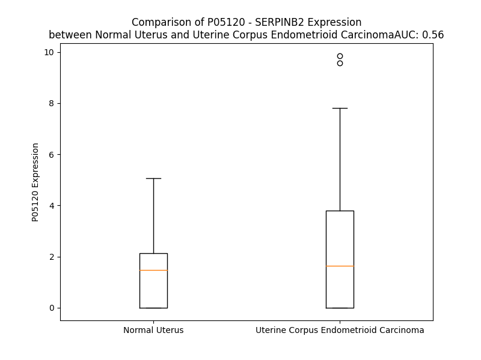

# Detailed Data for P05120

## Introduction to the Detailed Summary

### How to Interpret the Results

- **Summary & Metrics**: This section provides a quick reference to essential protein attributes, including expression changes, family classification, and biomarker applications. Regulation status (upregulated/downregulated) indicates the protein's behavior in a disease context. Some information comes from the original excel file with the proteins selected from literature, while others are derived from the analyses.
- **Expression Comparison**: A visual representation comparing protein expression between normal and disease states. It highlights significant changes in expression levels that might indicate diagnostic or therapeutic relevance. This is data coming from transcriptomics experiments and could not translate similarly to protein levels.
- **Isoform Alignment**: An interactive view of isoform alignments, revealing structural and functional differences between variants of the protein.
- **Interactors & Homologs**: Tables listing known interaction partners and homologous proteins, the more interactors and homologs, the more complex the protein is to design an antibody for.
- **Biological Assemblies**: Information about the structural arrangement of the protein in different assemblies, providing insights into its functional state but also the complexity of the protein to develop antibodies.
- **Combined Per-Residue Information**: A detailed table summarizing residue-level data. This includes predictions for epitope regions, aggregation tendencies, and modifications that might impact the protein's function. Each row corresponds to a residue in the protein, providing insights into specific sites that may be important for research or drug development.
## Summary & Metrics

- **UniProt Accession**: P05120
- **Gene Name**: SERPINB2
- **Protein Name**: Plasminogen activator inhibitor 2
- **Swiss Prot**: PAI2_HUMAN
- **Family**: other
- **Biomarker Application**: response to therapy
- **Number of Isoforms**: 0
- **Regulation**: 2
- **(transcriptomics) AUC**: 0.56
- **(transcriptomics) Fold Change**: 1.50
- **(transcriptomics) Regulation**: Upregulated
- **Discotope Epitope Count**: 86
- **Max n_uniprots (Homo)**: 2
- **Max n_uniprots (Hetero)**: N/A

## Expression Comparison

## Interactors

| preferredName_A   | preferredName_B   |   score |
|:------------------|:------------------|--------:|
| SERPINB2          | PLAT              |   0.989 |
| SERPINB2          | PLAU              |   0.986 |
| SERPINB2          | PLG               |   0.966 |
| SERPINB2          | SERPINE1          |   0.958 |
| SERPINB2          | PLAUR             |   0.938 |
| SERPINB2          | PROC              |   0.916 |

## Homologs

| uniprot_id   | gene_id   |
|:-------------|:----------|
| P48595       | SERPINB10 |
| E9PMI5       | SERPINH1  |
| A0A024R6N5   | SERPINA1  |
| P20848       | SERPINA2  |
| V9HWH1       | HEL57     |
| A0A1B0GX82   | SERPINB7  |
| Q86U17       | SERPINA11 |
| G3V4B4       | SERPINA5  |
| A8MV23       | SERPINE3  |
| P29508       | SERPINB3  |
| P48594       | SERPINB4  |
| Q96P63       | SERPINB12 |
| Q99574       | SERPINI1  |
| P05121       | SERPINE1  |
| G3V2W1       | SERPINA10 |
| C9J7N5       | SERPINI2  |
| P05546       | SERPIND1  |
| H7BZS9       | SERPINB13 |
| C9JZJ9       | SERPING1  |
| P01008       | SERPINC1  |
| F5GWT8       | SERPINB11 |
| G3V4V7       | SERPINA6  |
| A0A6Q8JH89   | SERPINA9  |
| P05543       | SERPINA7  |
| C9JPV4       | SERPINF2  |
| G3V595       | SERPINA3  |
| P36952       | SERPINB5  |
| P50453       | SERPINB9  |
| A0A2R8Y6N4   | SERPINB6  |
| P0C7T4       | HMSD      |
| Q8IW75       | SERPINA12 |
| C9K031       | SERPINE2  |
| A0A7P0T9S6   | AGT       |
| P50452       | SERPINB8  |
| P29622       | SERPINA4  |
| I3L107       | SERPINF1  |

## Biological Assemblies

|   Unnamed: 0 |   assembly |   n_uniprots | composition   | crystal_id   |
|-------------:|-----------:|-------------:|:--------------|:-------------|
|            0 |          1 |            2 | Homo          | 2arr         |
|            0 |          1 |            1 | Homo          | 1by7         |
|            0 |          1 |            2 | Homo          | 1jrr         |
|            0 |          1 |            2 | Homo          | 2arq         |

## Combined Per-Residue Information

|   res | aa   |   epitope_score | epitope   |   relative_surface_accessibility |   modeling_confidence |   Aggregation | modification   | glycosylation                   |
|------:|:-----|----------------:|:----------|---------------------------------:|----------------------:|--------------:|:---------------|:--------------------------------|
|     1 | M    |         0.04758 | False     |                          0.52572 |                 81.64 |         0     | N/A            | N/A                             |
|     2 | E    |         0.06629 | False     |                          0.72496 |                 85.9  |         0     | N/A            | N/A                             |
|     3 | D    |         0.03201 | False     |                          0.17028 |                 90.07 |         0     | N/A            | N/A                             |
|     4 | L    |         0.00196 | False     |                          0.00224 |                 92.53 |         7.748 | N/A            | N/A                             |
|     5 | C    |         0.01033 | False     |                          0.03569 |                 92.96 |        11.588 | N/A            | N/A                             |
|     6 | V    |         0.06554 | False     |                          0.24415 |                 93.65 |        17.753 | N/A            | N/A                             |
|     7 | A    |         0.00129 | False     |                          0       |                 94.7  |        18.174 | N/A            | N/A                             |
|     8 | N    |         0.00561 | False     |                          0.00789 |                 95.38 |        18.653 | N/A            | N/A                             |
|     9 | T    |         0.00865 | False     |                          0.02931 |                 95.57 |        31.672 | N/A            | N/A                             |
|    10 | L    |         0.06827 | False     |                          0.28024 |                 96.55 |        42.971 | N/A            | N/A                             |
|    11 | F    |         0.00327 | False     |                          0       |                 97.53 |        44.965 | N/A            | N/A                             |
|    12 | A    |         0.00233 | False     |                          0       |                 97.68 |        44.549 | N/A            | N/A                             |
|    13 | L    |         0.03155 | False     |                          0.03667 |                 97.25 |        44.134 | N/A            | N/A                             |
|    14 | N    |         0.07433 | False     |                          0.36463 |                 96.55 |        34.613 | N/A            | N/A                             |
|    15 | L    |         0.0027  | False     |                          0       |                 97.7  |        33.867 | N/A            | N/A                             |
|    16 | F    |         0.00313 | False     |                          0.00196 |                 97.4  |        31.36  | N/A            | N/A                             |
|    17 | K    |         0.07596 | False     |                          0.30176 |                 95.99 |         0     | N/A            | N/A                             |
|    18 | H    |         0.0958  | False     |                          0.36097 |                 95.74 |         0     | N/A            | N/A                             |
|    19 | L    |         0.0324  | False     |                          0.03853 |                 95.72 |         0     | N/A            | N/A                             |
|    20 | A    |         0.02408 | False     |                          0.06136 |                 94.12 |         0     | N/A            | N/A                             |
|    21 | K    |         0.15795 | False     |                          0.87874 |                 92.68 |         0     | N/A            | N/A                             |
|    22 | A    |         0.14535 | False     |                          0.71234 |                 92.24 |         0     | N/A            | N/A                             |
|    23 | S    |         0.07247 | False     |                          0.22858 |                 91.98 |         0     | N/A            | N/A                             |
|    24 | P    |         0.15867 | False     |                          0.53572 |                 90.63 |         0     | N/A            | N/A                             |
|    25 | T    |         0.23853 | True      |                          0.50065 |                 90.65 |         0     | N/A            | N/A                             |
|    26 | Q    |         0.21733 | True      |                          0.58542 |                 93.38 |         0     | N/A            | N/A                             |
|    27 | N    |         0.01646 | False     |                          0.16441 |                 96.72 |         0     | N/A            | N/A                             |
|    28 | L    |         0.00939 | False     |                          0.01814 |                 97.25 |         0     | N/A            | N/A                             |
|    29 | F    |         0.00239 | False     |                          0       |                 97.14 |         0     | N/A            | N/A                             |
|    30 | L    |         0.00476 | False     |                          0.00165 |                 97.13 |         0     | N/A            | N/A                             |
|    31 | S    |         0.00268 | False     |                          0       |                 96.68 |         0     | N/A            | N/A                             |
|    32 | P    |         0.00134 | False     |                          0.00099 |                 96.02 |         0     | N/A            | N/A                             |
|    33 | W    |         0.00896 | False     |                          0.02692 |                 92.95 |         0.568 | N/A            | N/A                             |
|    34 | S    |         0.0018  | False     |                          0       |                 94.2  |         0.568 | N/A            | N/A                             |
|    35 | I    |         0.00555 | False     |                          0.008   |                 96.37 |         1.084 | N/A            | N/A                             |
|    36 | S    |         0.00123 | False     |                          0       |                 96.14 |         1.084 | N/A            | N/A                             |
|    37 | S    |         0.0105  | False     |                          0.0769  |                 93.84 |         1.466 | N/A            | N/A                             |
|    38 | T    |         0.00217 | False     |                          0.00666 |                 93.09 |         4.961 | N/A            | N/A                             |
|    39 | M    |         0.00196 | False     |                          0.00144 |                 96.85 |        10.132 | N/A            | N/A                             |
|    40 | A    |         0.00157 | False     |                          0       |                 95.53 |        12.547 | N/A            | N/A                             |
|    41 | M    |         0.01044 | False     |                          0.02312 |                 94.87 |        12.547 | N/A            | N/A                             |
|    42 | V    |         0.00135 | False     |                          0       |                 96.15 |        12.547 | N/A            | N/A                             |
|    43 | Y    |         0.0254  | False     |                          0.08299 |                 96.37 |        12.128 | N/A            | N/A                             |
|    44 | M    |         0.08134 | False     |                          0.0988  |                 94.08 |         7.583 | N/A            | N/A                             |
|    45 | G    |         0.0056  | False     |                          0.00161 |                 93.99 |         0     | N/A            | N/A                             |
|    46 | S    |         0.00345 | False     |                          0       |                 95.42 |         0     | N/A            | N/A                             |
|    47 | R    |         0.2362  | True      |                          0.39986 |                 95.06 |         0     | N/A            | N/A                             |
|    48 | G    |         0.19268 | True      |                          0.49815 |                 94.81 |         0     | N/A            | N/A                             |
|    49 | S    |         0.19579 | True      |                          0.46511 |                 96.64 |         0     | N/A            | N/A                             |
|    50 | T    |         0.00934 | False     |                          0.00563 |                 97.4  |         0     | N/A            | N/A                             |
|    51 | E    |         0.047   | False     |                          0.23241 |                 96.12 |         0     | N/A            | N/A                             |
|    52 | D    |         0.20626 | True      |                          0.57491 |                 96.09 |         0     | N/A            | N/A                             |
|    53 | Q    |         0.08401 | False     |                          0.16618 |                 98.09 |         0     | N/A            | N/A                             |
|    54 | M    |         0.0028  | False     |                          0       |                 97.89 |         0     | N/A            | N/A                             |
|    55 | A    |         0.03686 | False     |                          0.13519 |                 96.2  |         0     | N/A            | N/A                             |
|    56 | K    |         0.16815 | False     |                          0.71265 |                 96.48 |         0     | N/A            | N/A                             |
|    57 | V    |         0.02651 | False     |                          0.05013 |                 97.81 |         0.194 | N/A            | N/A                             |
|    58 | L    |         0.0023  | False     |                          0       |                 97.1  |         0.194 | N/A            | N/A                             |
|    59 | Q    |         0.03585 | False     |                          0.1644  |                 96.35 |         0.194 | N/A            | N/A                             |
|    60 | F    |         0.00575 | False     |                          0.02133 |                 93.84 |         0.194 | N/A            | N/A                             |
|    61 | N    |         0.15954 | False     |                          0.52296 |                 89.27 |         0.194 | N/A            | N/A                             |
|    62 | E    |         0.07793 | False     |                          0.32911 |                 83.25 |         0     | N/A            | N/A                             |
|    63 | V    |         0.05201 | False     |                          0.04508 |                 81.75 |         0     | N/A            | N/A                             |
|    64 | G    |         0.08912 | False     |                          0.18717 |                 72.22 |         0     | N/A            | N/A                             |
|    65 | A    |         0.22289 | True      |                          0.52289 |                 60.03 |         0     | N/A            | N/A                             |
|    66 | N    |         0.23755 | True      |                          0.7881  |                 47.04 |         0     | N/A            | N/A                             |
|    67 | A    |         0.24265 | True      |                          0.82654 |                 43.33 |         0     | N/A            | N/A                             |
|    68 | V    |         0.16166 | False     |                          0.75075 |                 33.95 |         0     | N/A            | N/A                             |
|    69 | T    |         0.15796 | False     |                          0.81953 |                 26.82 |         0     | N/A            | N/A                             |
|    70 | P    |         0.23184 | True      |                          0.85906 |                 29.82 |         0     | N/A            | N/A                             |
|    71 | M    |         0.19356 | True      |                          0.96639 |                 26.59 |         0     | N/A            | N/A                             |
|    72 | T    |         0.20638 | True      |                          0.8174  |                 29.63 |         0     | N/A            | N/A                             |
|    73 | P    |         0.17697 | False     |                          0.84989 |                 37.7  |         0     | N/A            | N/A                             |
|    74 | E    |         0.21294 | True      |                          0.77372 |                 34.67 |         0     | N/A            | N/A                             |
|    75 | N    |         0.17107 | False     |                          0.94046 |                 31.87 |         0     | N/A            | N-linked (GlcNAc...) asparagine |
|    76 | F    |         0.18755 | True      |                          0.69006 |                 32.75 |         0     | N/A            | N/A                             |
|    77 | T    |         0.20586 | True      |                          0.82863 |                 39.36 |         0     | N/A            | N/A                             |
|    78 | S    |         0.2165  | True      |                          0.81372 |                 46.18 |         0     | N/A            | N/A                             |
|    79 | C    |         0.18254 | False     |                          0.85709 |                 40.85 |         0     | N/A            | N/A                             |
|    80 | G    |         0.13273 | False     |                          0.37064 |                 43.2  |         0     | N/A            | N/A                             |
|    81 | F    |         0.15121 | False     |                          0.69033 |                 41.47 |         0     | N/A            | N/A                             |
|    82 | M    |         0.26492 | True      |                          0.8411  |                 32.11 |         0     | N/A            | N/A                             |
|    83 | Q    |         0.19461 | True      |                          0.79382 |                 40.06 |         0     | N/A            | N/A                             |
|    84 | Q    |         0.17268 | False     |                          0.48477 |                 38.34 |         0     | N/A            | N/A                             |
|    85 | I    |         0.20987 | True      |                          0.6921  |                 36.2  |         0     | N/A            | N/A                             |
|    86 | Q    |         0.2398  | True      |                          0.84661 |                 35.46 |         0     | N/A            | N/A                             |
|    87 | K    |         0.19174 | True      |                          0.78669 |                 35.04 |         0     | N/A            | N/A                             |
|    88 | G    |         0.15634 | False     |                          0.50455 |                 35.55 |         0     | N/A            | N/A                             |
|    89 | S    |         0.21136 | True      |                          0.85316 |                 40.95 |         0     | N/A            | N/A                             |
|    90 | Y    |         0.22274 | True      |                          0.65194 |                 39.99 |         0     | N/A            | N/A                             |
|    91 | P    |         0.23554 | True      |                          0.53779 |                 50.9  |         0     | N/A            | N/A                             |
|    92 | D    |         0.18629 | True      |                          0.67582 |                 55.65 |         0     | N/A            | N/A                             |
|    93 | A    |         0.14686 | False     |                          0.65117 |                 50.85 |         0     | N/A            | N/A                             |
|    94 | I    |         0.18844 | True      |                          0.47038 |                 48.06 |         0     | N/A            | N/A                             |
|    95 | L    |         0.18815 | True      |                          0.53724 |                 54.11 |         0     | N/A            | N/A                             |
|    96 | Q    |         0.16089 | False     |                          0.63576 |                 59.57 |         0     | N/A            | N/A                             |
|    97 | A    |         0.13724 | False     |                          0.57884 |                 58.34 |         0     | N/A            | N/A                             |
|    98 | Q    |         0.2656  | True      |                          0.56507 |                 63.7  |         0     | N/A            | N/A                             |
|    99 | A    |         0.10637 | False     |                          0.35458 |                 67.18 |         0     | N/A            | N/A                             |
|   100 | A    |         0.03047 | False     |                          0.24107 |                 71.43 |         0     | N/A            | N/A                             |
|   101 | D    |         0.14409 | False     |                          0.42816 |                 80.37 |         0     | N/A            | N/A                             |
|   102 | K    |         0.05213 | False     |                          0.39193 |                 88.3  |         0     | N/A            | N/A                             |
|   103 | I    |         0.02009 | False     |                          0.0256  |                 92.58 |         0     | N/A            | N/A                             |
|   104 | H    |         0.02437 | False     |                          0.04367 |                 93.64 |         0     | N/A            | N/A                             |
|   105 | S    |         0.09877 | False     |                          0.24289 |                 92.6  |         0     | N/A            | N/A                             |
|   106 | S    |         0.02289 | False     |                          0.07215 |                 93.32 |         0     | N/A            | N/A                             |
|   107 | F    |         0.0074  | False     |                          0.00989 |                 94.03 |         0     | N/A            | N/A                             |
|   108 | R    |         0.09627 | False     |                          0.41311 |                 92.71 |         0     | N/A            | N/A                             |
|   109 | S    |         0.07275 | False     |                          0.36126 |                 92.37 |         0     | N/A            | N/A                             |
|   110 | L    |         0.00449 | False     |                          0       |                 90.87 |         0     | N/A            | N/A                             |
|   111 | S    |         0.02874 | False     |                          0.30076 |                 90.12 |         0     | N/A            | N/A                             |
|   112 | S    |         0.12757 | False     |                          0.56404 |                 89.08 |         0     | N/A            | N/A                             |
|   113 | A    |         0.07093 | False     |                          0.33558 |                 88.88 |         0     | N/A            | N/A                             |
|   114 | I    |         0.00679 | False     |                          0.00237 |                 86.84 |         0     | N/A            | N/A                             |
|   115 | N    |         0.07331 | False     |                          0.50617 |                 82.89 |         0     | N/A            | N-linked (GlcNAc...) asparagine |
|   116 | A    |         0.14393 | False     |                          0.67473 |                 79.18 |         0     | N/A            | N/A                             |
|   117 | S    |         0.09103 | False     |                          0.22794 |                 65.74 |         0     | N/A            | N/A                             |
|   118 | T    |         0.16293 | False     |                          0.94007 |                 61.19 |         0     | N/A            | N/A                             |
|   119 | G    |         0.22147 | True      |                          0.8373  |                 68.45 |         0     | N/A            | N/A                             |
|   120 | N    |         0.16472 | False     |                          0.40555 |                 80.15 |         0     | N/A            | N/A                             |
|   121 | Y    |         0.07621 | False     |                          0.07977 |                 83.62 |         0     | N/A            | N/A                             |
|   122 | L    |         0.09771 | False     |                          0.43397 |                 82.24 |         0     | N/A            | N/A                             |
|   123 | L    |         0.03602 | False     |                          0.09656 |                 85.66 |         0     | N/A            | N/A                             |
|   124 | E    |         0.09589 | False     |                          0.20416 |                 83.83 |         0     | N/A            | N/A                             |
|   125 | S    |         0.02486 | False     |                          0.2662  |                 86.54 |         0     | N/A            | N/A                             |
|   126 | V    |         0.04989 | False     |                          0.13875 |                 86.45 |         0     | N/A            | N/A                             |
|   127 | N    |         0.02281 | False     |                          0.18943 |                 90.63 |         0     | N/A            | N/A                             |
|   128 | K    |         0.03032 | False     |                          0.12221 |                 94.59 |         0     | N/A            | N/A                             |
|   129 | L    |         0.00646 | False     |                          0.01721 |                 95.9  |         0     | N/A            | N/A                             |
|   130 | F    |         0.00424 | False     |                          0.00318 |                 96.2  |         0     | N/A            | N/A                             |
|   131 | G    |         0.00504 | False     |                          0       |                 94.78 |         0     | N/A            | N/A                             |
|   132 | E    |         0.04803 | False     |                          0.02857 |                 94.78 |         0     | N/A            | N/A                             |
|   133 | K    |         0.21416 | True      |                          0.64785 |                 90.35 |         0     | N/A            | N/A                             |
|   134 | S    |         0.22378 | True      |                          0.43561 |                 87.43 |         0     | N/A            | N/A                             |
|   135 | A    |         0.02917 | False     |                          0.01686 |                 83.02 |         0     | N/A            | N/A                             |
|   136 | S    |         0.17355 | False     |                          0.61763 |                 86.84 |         0     | N/A            | N/A                             |
|   137 | F    |         0.07337 | False     |                          0.14975 |                 91.83 |         0     | N/A            | N/A                             |
|   138 | R    |         0.27144 | True      |                          0.35371 |                 93.59 |         0     | N/A            | N/A                             |
|   139 | E    |         0.18683 | True      |                          0.78639 |                 93.75 |         0     | N/A            | N/A                             |
|   140 | E    |         0.19641 | True      |                          0.39602 |                 93.34 |         0     | N/A            | N/A                             |
|   141 | Y    |         0.01625 | False     |                          0.01732 |                 93.7  |         0     | N/A            | N/A                             |
|   142 | I    |         0.11022 | False     |                          0.30799 |                 94.36 |         0     | N/A            | N/A                             |
|   143 | R    |         0.3022  | True      |                          0.58715 |                 95.54 |         0     | N/A            | N/A                             |
|   144 | L    |         0.07885 | False     |                          0.26544 |                 93.91 |         0     | N/A            | N/A                             |
|   145 | C    |         0.00978 | False     |                          0.01229 |                 93.68 |         0     | N/A            | N/A                             |
|   146 | Q    |         0.20402 | True      |                          0.45144 |                 93.36 |         0     | N/A            | N/A                             |
|   147 | K    |         0.2528  | True      |                          0.50354 |                 93.15 |         0     | N/A            | N/A                             |
|   148 | Y    |         0.0502  | False     |                          0.04561 |                 92.25 |         0     | N/A            | N/A                             |
|   149 | Y    |         0.07833 | False     |                          0.14997 |                 91.69 |         0     | N/A            | N/A                             |
|   150 | S    |         0.11242 | False     |                          0.851   |                 89.84 |         0     | N/A            | N/A                             |
|   151 | S    |         0.05048 | False     |                          0.12705 |                 91.28 |         0     | N/A            | N/A                             |
|   152 | E    |         0.11215 | False     |                          0.43342 |                 91.22 |         0     | N/A            | N/A                             |
|   153 | P    |         0.02982 | False     |                          0.11553 |                 93.34 |         0     | N/A            | N/A                             |
|   154 | Q    |         0.07357 | False     |                          0.23607 |                 94.17 |         0     | N/A            | N/A                             |
|   155 | A    |         0.07132 | False     |                          0.49959 |                 93.36 |         0     | N/A            | N/A                             |
|   156 | V    |         0.04169 | False     |                          0.03999 |                 94.98 |         0     | N/A            | N/A                             |
|   157 | D    |         0.08945 | False     |                          0.20236 |                 95.11 |         0     | N/A            | N/A                             |
|   158 | F    |         0.00596 | False     |                          0.00152 |                 95.75 |         0     | N/A            | N/A                             |
|   159 | L    |         0.18131 | False     |                          0.60369 |                 92.95 |         0     | N/A            | N/A                             |
|   160 | E    |         0.30262 | True      |                          0.75138 |                 94.52 |         0     | N/A            | N/A                             |
|   161 | C    |         0.106   | False     |                          0.4242  |                 95.21 |         0     | N/A            | N/A                             |
|   162 | A    |         0.11134 | False     |                          0.15658 |                 96.55 |         0     | N/A            | N/A                             |
|   163 | E    |         0.1537  | False     |                          0.37223 |                 97.04 |         0     | N/A            | N/A                             |
|   164 | E    |         0.12682 | False     |                          0.51088 |                 96.98 |         0     | N/A            | N/A                             |
|   165 | A    |         0.01892 | False     |                          0.04758 |                 96.8  |         0     | N/A            | N/A                             |
|   166 | R    |         0.15255 | False     |                          0.07773 |                 97.56 |         0     | N/A            | N/A                             |
|   167 | K    |         0.13652 | False     |                          0.52239 |                 97.27 |         0     | N/A            | N/A                             |
|   168 | K    |         0.13384 | False     |                          0.51253 |                 96.64 |         0     | N/A            | N/A                             |
|   169 | I    |         0.00468 | False     |                          0       |                 95.8  |         0     | N/A            | N/A                             |
|   170 | N    |         0.1042  | False     |                          0.05988 |                 96.15 |         0     | N/A            | N/A                             |
|   171 | S    |         0.1557  | False     |                          0.51223 |                 96.15 |         0     | N/A            | N/A                             |
|   172 | W    |         0.1052  | False     |                          0.21982 |                 94.59 |         0     | N/A            | N/A                             |
|   173 | V    |         0.00485 | False     |                          0.0019  |                 92.93 |         0     | N/A            | N/A                             |
|   174 | K    |         0.15953 | False     |                          0.5108  |                 93.04 |         0     | N/A            | N/A                             |
|   175 | T    |         0.2092  | True      |                          0.67518 |                 93.23 |         0     | N/A            | N/A                             |
|   176 | Q    |         0.09333 | False     |                          0.38249 |                 88.87 |         0     | N/A            | N/A                             |
|   177 | T    |         0.06412 | False     |                          0.07099 |                 86.74 |         0     | N/A            | N/A                             |
|   178 | K    |         0.25505 | True      |                          0.7236  |                 88.71 |         0     | N/A            | N/A                             |
|   179 | G    |         0.15629 | False     |                          0.43232 |                 88.24 |         0     | N/A            | N/A                             |
|   180 | K    |         0.28157 | True      |                          0.45711 |                 85.27 |         0     | N/A            | N/A                             |
|   181 | I    |         0.04005 | False     |                          0.0024  |                 86.54 |         0     | N/A            | N/A                             |
|   182 | P    |         0.21609 | True      |                          0.39793 |                 88.37 |         0     | N/A            | N/A                             |
|   183 | N    |         0.24547 | True      |                          0.69863 |                 90.11 |         0     | N/A            | N/A                             |
|   184 | L    |         0.00388 | False     |                          0.00061 |                 92.91 |         0     | N/A            | N/A                             |
|   185 | L    |         0.00518 | False     |                          0.00244 |                 96.1  |         0     | N/A            | N/A                             |
|   186 | P    |         0.15739 | False     |                          0.39962 |                 95.13 |         0     | N/A            | N/A                             |
|   187 | E    |         0.31406 | True      |                          0.7589  |                 94.43 |         0     | N/A            | N/A                             |
|   188 | G    |         0.32037 | True      |                          0.75628 |                 93.53 |         0     | N/A            | N/A                             |
|   189 | S    |         0.11638 | False     |                          0.16008 |                 93.89 |         0     | N/A            | N/A                             |
|   190 | V    |         0.04542 | False     |                          0.05278 |                 96.12 |         0     | N/A            | N/A                             |
|   191 | D    |         0.12255 | False     |                          0.48238 |                 95.96 |         0     | N/A            | N/A                             |
|   192 | G    |         0.20447 | True      |                          0.35628 |                 94.19 |         0     | N/A            | N/A                             |
|   193 | D    |         0.18603 | True      |                          0.53436 |                 93.59 |         0.19  | N/A            | N/A                             |
|   194 | T    |         0.01623 | False     |                          0.0391  |                 96.11 |         0.19  | N/A            | N/A                             |
|   195 | R    |         0.15649 | False     |                          0.15048 |                 94.99 |         0.19  | N/A            | N/A                             |
|   196 | M    |         0.00192 | False     |                          0       |                 96.06 |        34.873 | N/A            | N/A                             |
|   197 | V    |         0.00242 | False     |                          0       |                 97.35 |        65.279 | N/A            | N/A                             |
|   198 | L    |         0.00217 | False     |                          0.00412 |                 97.35 |        72.317 | N/A            | N/A                             |
|   199 | V    |         0.00722 | False     |                          0.00381 |                 96.3  |        73.534 | N/A            | N/A                             |
|   200 | N    |         0.01041 | False     |                          0.01538 |                 95.04 |        73.63  | N/A            | N/A                             |
|   201 | A    |         0.00566 | False     |                          0.00665 |                 93.41 |        73.432 | N/A            | N/A                             |
|   202 | V    |         0.00619 | False     |                          0.00571 |                 92.2  |        73.112 | N/A            | N/A                             |
|   203 | Y    |         0.03393 | False     |                          0.11501 |                 88.67 |        68.959 | N/A            | N/A                             |
|   204 | F    |         0.00405 | False     |                          0.00064 |                 87.58 |        63.781 | N/A            | N/A                             |
|   205 | K    |         0.0605  | False     |                          0.22292 |                 84.52 |         0     | N/A            | N/A                             |
|   206 | G    |         0.01019 | False     |                          0.00644 |                 87.39 |         0     | N/A            | N/A                             |
|   207 | K    |         0.10819 | False     |                          0.45236 |                 89.7  |         0     | N/A            | N/A                             |
|   208 | W    |         0.04609 | False     |                          0.0452  |                 92.46 |         0     | N/A            | N/A                             |
|   209 | K    |         0.12068 | False     |                          0.72788 |                 93.46 |         0     | N/A            | N/A                             |
|   210 | T    |         0.09479 | False     |                          0.32613 |                 93.35 |         0     | N/A            | N/A                             |
|   211 | P    |         0.08369 | False     |                          0.56321 |                 92.27 |         0     | N/A            | N/A                             |
|   212 | F    |         0.02023 | False     |                          0.04794 |                 91.92 |         0     | N/A            | N/A                             |
|   213 | E    |         0.09822 | False     |                          0.50433 |                 85.86 |         0     | N/A            | N/A                             |
|   214 | K    |         0.13469 | False     |                          0.86666 |                 71.42 |         0     | N/A            | N/A                             |
|   215 | K    |         0.18666 | True      |                          0.61018 |                 68.42 |         0     | N/A            | N/A                             |
|   216 | L    |         0.11505 | False     |                          0.21716 |                 77.53 |         0     | N/A            | N/A                             |
|   217 | N    |         0.18836 | True      |                          0.98592 |                 78.89 |         0     | N/A            | N/A                             |
|   218 | G    |         0.24005 | True      |                          0.54258 |                 84.19 |         0     | N/A            | N/A                             |
|   219 | L    |         0.31492 | True      |                          0.70034 |                 91.23 |         0     | N/A            | N/A                             |
|   220 | Y    |         0.13608 | False     |                          0.34051 |                 92.51 |         0     | N/A            | N/A                             |
|   221 | P    |         0.1966  | True      |                          0.54667 |                 93.47 |         0     | N/A            | N/A                             |
|   222 | F    |         0.00481 | False     |                          0       |                 95.23 |         0     | N/A            | N/A                             |
|   223 | R    |         0.2692  | True      |                          0.2219  |                 93.56 |         0     | N/A            | N/A                             |
|   224 | V    |         0.17893 | False     |                          0.12029 |                 91.58 |         0     | N/A            | N/A                             |
|   225 | N    |         0.14937 | False     |                          0.21127 |                 86.67 |         0     | N/A            | N/A                             |
|   226 | S    |         0.29601 | True      |                          0.65423 |                 81.91 |         0     | N/A            | N/A                             |
|   227 | A    |         0.30902 | True      |                          0.94133 |                 85.19 |         0     | N/A            | N/A                             |
|   228 | Q    |         0.44184 | True      |                          0.47106 |                 90.09 |         0     | N/A            | N/A                             |
|   229 | R    |         0.37308 | True      |                          0.67565 |                 91.96 |         0     | N/A            | N/A                             |
|   230 | T    |         0.30297 | True      |                          0.28473 |                 94.39 |         0     | N/A            | N/A                             |
|   231 | P    |         0.27042 | True      |                          0.63745 |                 95.19 |         0     | N/A            | N/A                             |
|   232 | V    |         0.03495 | False     |                          0.05617 |                 94.31 |         1.882 | N/A            | N/A                             |
|   233 | Q    |         0.12787 | False     |                          0.17011 |                 93.56 |         2.042 | N/A            | N/A                             |
|   234 | M    |         0.02978 | False     |                          0.01726 |                 93.68 |         2.042 | N/A            | N/A                             |
|   235 | M    |         0.00704 | False     |                          0.00072 |                 93.99 |         2.042 | N/A            | N/A                             |
|   236 | Y    |         0.08435 | False     |                          0.15012 |                 94.07 |         2.042 | N/A            | N/A                             |
|   237 | L    |         0.02295 | False     |                          0.05276 |                 93.8  |         2.042 | N/A            | N/A                             |
|   238 | R    |         0.17352 | False     |                          0.43058 |                 93.95 |         0     | N/A            | N/A                             |
|   239 | E    |         0.08818 | False     |                          0.27533 |                 94.18 |         0     | N/A            | N/A                             |
|   240 | K    |         0.15677 | False     |                          0.63198 |                 95.98 |         0     | N/A            | N/A                             |
|   241 | L    |         0.02762 | False     |                          0.061   |                 96.52 |         0.17  | N/A            | N/A                             |
|   242 | N    |         0.08768 | False     |                          0.35018 |                 96.94 |         0.17  | N/A            | N/A                             |
|   243 | I    |         0.13801 | False     |                          0.1185  |                 97.23 |         0.17  | N/A            | N/A                             |
|   244 | G    |         0.06507 | False     |                          0.12608 |                 95.83 |         0.17  | N/A            | N/A                             |
|   245 | Y    |         0.11163 | False     |                          0.48282 |                 95.6  |         0.17  | N/A            | N/A                             |
|   246 | I    |         0.08644 | False     |                          0.068   |                 94.31 |         0.17  | N/A            | N/A                             |
|   247 | E    |         0.23526 | True      |                          0.71633 |                 91.56 |         0     | N/A            | N/A                             |
|   248 | D    |         0.20735 | True      |                          0.8197  |                 90.25 |         0     | N/A            | N/A                             |
|   249 | L    |         0.09014 | False     |                          0.11068 |                 91.85 |         0     | N/A            | N/A                             |
|   250 | K    |         0.12399 | False     |                          0.6645  |                 92.84 |         0     | N/A            | N/A                             |
|   251 | A    |         0.00237 | False     |                          0.00128 |                 95.63 |         0     | N/A            | N/A                             |
|   252 | Q    |         0.05852 | False     |                          0.20435 |                 96.55 |         0     | N/A            | N/A                             |
|   253 | I    |         0.02088 | False     |                          0.0112  |                 97.85 |         0     | N/A            | N/A                             |
|   254 | L    |         0.00195 | False     |                          0       |                 98.15 |         0     | N/A            | N/A                             |
|   255 | E    |         0.02389 | False     |                          0.08999 |                 97.82 |         0     | N/A            | N/A                             |
|   256 | L    |         0.00821 | False     |                          0.01978 |                 96.3  |         0     | N/A            | N/A                             |
|   257 | P    |         0.06717 | False     |                          0.19065 |                 95.34 |         0     | N/A            | N/A                             |
|   258 | Y    |         0.01287 | False     |                          0.01748 |                 93    |         0     | N/A            | N/A                             |
|   259 | A    |         0.06657 | False     |                          0.23213 |                 89.49 |         0     | N/A            | N/A                             |
|   260 | G    |         0.07267 | False     |                          0.3691  |                 88.64 |         0     | N/A            | N/A                             |
|   261 | D    |         0.0857  | False     |                          0.33298 |                 90.71 |         0     | N/A            | N/A                             |
|   262 | V    |         0.0039  | False     |                          0       |                 93.46 |        13.966 | N/A            | N/A                             |
|   263 | S    |         0.00781 | False     |                          0       |                 95.42 |        14.958 | N/A            | N/A                             |
|   264 | M    |         0.00681 | False     |                          0.00537 |                 97.01 |        15.373 | N/A            | N/A                             |
|   265 | F    |         0.02344 | False     |                          0.07007 |                 97.81 |        15.373 | N/A            | N/A                             |
|   266 | L    |         0.00249 | False     |                          0       |                 98.23 |        15.373 | N/A            | N/A                             |
|   267 | L    |         0.00293 | False     |                          0       |                 98.04 |        13.236 | N/A            | N/A                             |
|   268 | L    |         0.01054 | False     |                          0.01978 |                 97.38 |         0.576 | N/A            | N/A                             |
|   269 | P    |         0.0319  | False     |                          0.07672 |                 95.57 |         0.115 | N/A            | N/A                             |
|   270 | D    |         0.17435 | False     |                          0.36865 |                 92.39 |         0     | N/A            | N/A                             |
|   271 | E    |         0.33426 | True      |                          0.58045 |                 85.94 |         0     | N/A            | N/A                             |
|   272 | I    |         0.2062  | True      |                          0.129   |                 82.87 |         0     | N/A            | N/A                             |
|   273 | A    |         0.19036 | True      |                          0.88865 |                 71.59 |         0     | N/A            | N/A                             |
|   274 | D    |         0.16925 | False     |                          0.38537 |                 68.89 |         0     | N/A            | N/A                             |
|   275 | V    |         0.27174 | True      |                          0.95877 |                 69.91 |         0     | N/A            | N/A                             |
|   276 | S    |         0.15584 | False     |                          0.23762 |                 77.78 |         0     | N/A            | N/A                             |
|   277 | T    |         0.06171 | False     |                          0.01681 |                 82.51 |         0     | N/A            | N/A                             |
|   278 | G    |         0.08276 | False     |                          0.12261 |                 85.56 |         0     | N/A            | N/A                             |
|   279 | L    |         0.00721 | False     |                          0       |                 92.99 |         0     | N/A            | N/A                             |
|   280 | E    |         0.08701 | False     |                          0.28663 |                 90.8  |         0     | N/A            | N/A                             |
|   281 | L    |         0.13144 | False     |                          0.61004 |                 91.22 |         0     | N/A            | N/A                             |
|   282 | L    |         0.02066 | False     |                          0.02545 |                 93.25 |         0     | N/A            | N/A                             |
|   283 | E    |         0.03854 | False     |                          0.06859 |                 94.78 |         0     | N/A            | N/A                             |
|   284 | S    |         0.1951  | True      |                          0.48478 |                 92.83 |         0     | N/A            | N/A                             |
|   285 | E    |         0.07893 | False     |                          0.33044 |                 93.9  |         0     | N/A            | N/A                             |
|   286 | I    |         0.00754 | False     |                          0.00379 |                 94.94 |         0     | N/A            | N/A                             |
|   287 | T    |         0.10868 | False     |                          0.39885 |                 95.19 |         0     | N/A            | N/A                             |
|   288 | Y    |         0.12744 | False     |                          0.24615 |                 93.84 |         0     | N/A            | N/A                             |
|   289 | D    |         0.19055 | True      |                          0.65235 |                 94.16 |         0     | N/A            | N/A                             |
|   290 | K    |         0.07884 | False     |                          0.32564 |                 94.97 |         0     | N/A            | N/A                             |
|   291 | L    |         0.00992 | False     |                          0.00659 |                 95.21 |         0     | N/A            | N/A                             |
|   292 | N    |         0.15468 | False     |                          0.25896 |                 93.15 |         0     | N/A            | N/A                             |
|   293 | K    |         0.15648 | False     |                          0.57218 |                 94.56 |         0     | N/A            | N/A                             |
|   294 | W    |         0.03357 | False     |                          0.07784 |                 94.2  |         0     | N/A            | N/A                             |
|   295 | T    |         0.07994 | False     |                          0.19755 |                 93.47 |         0     | N/A            | N/A                             |
|   296 | S    |         0.12433 | False     |                          0.25946 |                 93.09 |         0     | N/A            | N/A                             |
|   297 | K    |         0.27929 | True      |                          0.97947 |                 89.37 |         0     | N/A            | N/A                             |
|   298 | D    |         0.21504 | True      |                          0.84919 |                 89.36 |         0     | N/A            | N/A                             |
|   299 | K    |         0.17604 | False     |                          0.50936 |                 90.07 |         0     | N/A            | N/A                             |
|   300 | M    |         0.07407 | False     |                          0.06725 |                 92.52 |         0     | N/A            | N/A                             |
|   301 | A    |         0.12489 | False     |                          0.62569 |                 92.35 |         0     | N/A            | N/A                             |
|   302 | E    |         0.22538 | True      |                          0.63179 |                 94.51 |         0     | N/A            | N/A                             |
|   303 | D    |         0.14674 | False     |                          0.38786 |                 93.66 |         0     | N/A            | N/A                             |
|   304 | E    |         0.07976 | False     |                          0.37813 |                 95.12 |         0     | N/A            | N/A                             |
|   305 | V    |         0.0053  | False     |                          0       |                 95.24 |         0     | N/A            | N/A                             |
|   306 | E    |         0.07761 | False     |                          0.13731 |                 95.24 |         0     | N/A            | N/A                             |
|   307 | V    |         0.00264 | False     |                          0       |                 96.25 |         0     | N/A            | N/A                             |
|   308 | Y    |         0.08132 | False     |                          0.21817 |                 95.58 |         0     | N/A            | N/A                             |
|   309 | I    |         0.00739 | False     |                          0.0104  |                 95.3  |         0     | N/A            | N/A                             |
|   310 | P    |         0.00413 | False     |                          0       |                 94.81 |         0     | N/A            | N/A                             |
|   311 | Q    |         0.0814  | False     |                          0.32353 |                 92.29 |         0     | N/A            | N/A                             |
|   312 | F    |         0.04239 | False     |                          0.0482  |                 93.14 |         0     | N/A            | N/A                             |
|   313 | K    |         0.1033  | False     |                          0.6075  |                 92.58 |         0     | N/A            | N/A                             |
|   314 | L    |         0.05268 | False     |                          0.04122 |                 93.57 |         0     | N/A            | N/A                             |
|   315 | E    |         0.11062 | False     |                          0.43473 |                 93.24 |         0     | N/A            | N/A                             |
|   316 | E    |         0.14241 | False     |                          0.18502 |                 94.94 |         0     | N/A            | N/A                             |
|   317 | H    |         0.06691 | False     |                          0.38552 |                 94.84 |         0     | N/A            | N/A                             |
|   318 | Y    |         0.11634 | False     |                          0.09144 |                 95.65 |         0     | N/A            | N/A                             |
|   319 | E    |         0.07717 | False     |                          0.4163  |                 96.01 |         0     | N/A            | N/A                             |
|   320 | L    |         0.00491 | False     |                          0.00247 |                 96.88 |         0     | N/A            | N/A                             |
|   321 | R    |         0.09567 | False     |                          0.32817 |                 96.4  |         0     | N/A            | N/A                             |
|   322 | S    |         0.0955  | False     |                          0.5947  |                 96.05 |         0     | N/A            | N/A                             |
|   323 | I    |         0.09401 | False     |                          0.14399 |                 96.68 |         0     | N/A            | N/A                             |
|   324 | L    |         0.00296 | False     |                          0       |                 97.71 |         0     | N/A            | N/A                             |
|   325 | R    |         0.22638 | True      |                          0.40922 |                 97.56 |         0     | N/A            | N/A                             |
|   326 | S    |         0.1837  | True      |                          0.61192 |                 96.28 |         0     | N/A            | N/A                             |
|   327 | M    |         0.15747 | False     |                          0.17426 |                 97.37 |         0     | N/A            | N/A                             |
|   328 | G    |         0.15441 | False     |                          0.47766 |                 97.12 |         0     | N/A            | N/A                             |
|   329 | M    |         0.00364 | False     |                          0       |                 97.38 |         0     | N/A            | N/A                             |
|   330 | E    |         0.12937 | False     |                          0.36314 |                 97.54 |         0     | N/A            | N/A                             |
|   331 | D    |         0.061   | False     |                          0.02081 |                 98.14 |         0     | N/A            | N/A                             |
|   332 | A    |         0.00288 | False     |                          0.00128 |                 97.46 |         0     | N/A            | N/A                             |
|   333 | F    |         0.03028 | False     |                          0.04174 |                 97.68 |         0     | N/A            | N/A                             |
|   334 | N    |         0.19818 | True      |                          0.34702 |                 96.35 |         0     | N/A            | N/A                             |
|   335 | K    |         0.27163 | True      |                          0.66831 |                 92.44 |         0     | N/A            | N/A                             |
|   336 | G    |         0.30252 | True      |                          0.87506 |                 92.32 |         0     | N/A            | N/A                             |
|   337 | R    |         0.30817 | True      |                          0.51807 |                 96.05 |         0     | N/A            | N/A                             |
|   338 | A    |         0.04082 | False     |                          0.10781 |                 97.05 |         0     | N/A            | N/A                             |
|   339 | N    |         0.15431 | False     |                          0.28726 |                 96.58 |         0     | N/A            | N-linked (GlcNAc...) asparagine |
|   340 | F    |         0.00454 | False     |                          0       |                 95.75 |         0     | N/A            | N/A                             |
|   341 | S    |         0.1863  | True      |                          0.27764 |                 94.46 |         0     | N/A            | N/A                             |
|   342 | G    |         0.08356 | False     |                          0.17358 |                 93.24 |         0     | N/A            | N/A                             |
|   343 | M    |         0.0144  | False     |                          0       |                 93.76 |         0     | N/A            | N/A                             |
|   344 | S    |         0.01996 | False     |                          0       |                 90.98 |         0     | N/A            | N/A                             |
|   345 | E    |         0.37437 | True      |                          0.69334 |                 82.4  |         0     | N/A            | N/A                             |
|   346 | R    |         0.23865 | True      |                          0.64431 |                 83.98 |         0     | N/A            | N/A                             |
|   347 | N    |         0.17424 | False     |                          0.38775 |                 79.96 |         0     | N/A            | N/A                             |
|   348 | D    |         0.21094 | True      |                          0.3297  |                 85.32 |         0     | N/A            | N/A                             |
|   349 | L    |         0.0233  | False     |                          0.0181  |                 93.39 |         0     | N/A            | N/A                             |
|   350 | F    |         0.11626 | False     |                          0.07771 |                 96.18 |         0     | N/A            | N/A                             |
|   351 | L    |         0.00126 | False     |                          0       |                 96.74 |         0     | N/A            | N/A                             |
|   352 | S    |         0.02616 | False     |                          0.05408 |                 97.2  |         0     | N/A            | N/A                             |
|   353 | E    |         0.03526 | False     |                          0.10853 |                 97.12 |         0     | N/A            | N/A                             |
|   354 | V    |         0.00941 | False     |                          0.01594 |                 97.81 |         0     | N/A            | N/A                             |
|   355 | F    |         0.00518 | False     |                          0.00127 |                 97.64 |         0     | N/A            | N/A                             |
|   356 | H    |         0.00401 | False     |                          0.00068 |                 96.84 |         0     | N/A            | N/A                             |
|   357 | Q    |         0.05177 | False     |                          0.04879 |                 95.64 |         0     | N/A            | N/A                             |
|   358 | A    |         0.00534 | False     |                          0       |                 95.21 |         0     | N/A            | N/A                             |
|   359 | M    |         0.04826 | False     |                          0.02805 |                 92.98 |         0     | N/A            | N/A                             |
|   360 | V    |         0.00757 | False     |                          0.00942 |                 91.88 |         0     | N/A            | N/A                             |
|   361 | D    |         0.07926 | False     |                          0.22356 |                 90.1  |         0     | N/A            | N/A                             |
|   362 | V    |         0.00762 | False     |                          0.01333 |                 91.52 |         0     | N/A            | N/A                             |
|   363 | N    |         0.03972 | False     |                          0.12473 |                 90.31 |         0     | N/A            | N/A                             |
|   364 | E    |         0.07397 | False     |                          0.08818 |                 86.28 |         0     | N/A            | N/A                             |
|   365 | E    |         0.04997 | False     |                          0.40349 |                 77.81 |         0     | N/A            | N/A                             |
|   366 | G    |         0.02902 | False     |                          0.01356 |                 68.63 |         0     | N/A            | N/A                             |
|   367 | T    |         0.01542 | False     |                          0.02368 |                 52.53 |         0     | N/A            | N/A                             |
|   368 | E    |         0.09807 | False     |                          0.48455 |                 38.65 |         0     | N/A            | N/A                             |
|   369 | A    |         0.13707 | False     |                          0.66257 |                 28.59 |         0     | N/A            | N/A                             |
|   370 | A    |         0.18681 | True      |                          0.76184 |                 25.08 |         0     | N/A            | N/A                             |
|   371 | A    |         0.17686 | False     |                          0.95741 |                 25.38 |         0     | N/A            | N/A                             |
|   372 | G    |         0.17283 | False     |                          0.95209 |                 28.42 |         0     | N/A            | N/A                             |
|   373 | T    |         0.14829 | False     |                          1.0711  |                 28.08 |         0     | N/A            | N/A                             |
|   374 | G    |         0.24898 | True      |                          0.95332 |                 26.69 |         0     | N/A            | N/A                             |
|   375 | G    |         0.16009 | False     |                          0.86336 |                 27.16 |         0     | N/A            | N/A                             |
|   376 | V    |         0.11667 | False     |                          1.01648 |                 25.36 |         0     | N/A            | N/A                             |
|   377 | M    |         0.17483 | False     |                          1.01632 |                 26.76 |         0     | N/A            | N/A                             |
|   378 | T    |         0.15374 | False     |                          0.92313 |                 29.77 |         0     | N/A            | N/A                             |
|   379 | G    |         0.1742  | False     |                          0.81652 |                 30.96 |         0     | N/A            | N/A                             |
|   380 | R    |         0.21906 | True      |                          0.96073 |                 31.43 |         0     | N/A            | N/A                             |
|   381 | T    |         0.25942 | True      |                          0.96724 |                 33.03 |         0     | N/A            | N/A                             |
|   382 | G    |         0.28179 | True      |                          0.77484 |                 37.25 |         0     | N/A            | N/A                             |
|   383 | H    |         0.17498 | False     |                          0.98331 |                 51.25 |         0     | N/A            | N/A                             |
|   384 | G    |         0.1385  | False     |                          0.85718 |                 61.68 |         0     | N/A            | N/A                             |
|   385 | G    |         0.11032 | False     |                          0.26343 |                 74.52 |         0     | N/A            | N/A                             |
|   386 | P    |         0.14593 | False     |                          0.32877 |                 89.76 |         0     | N/A            | N/A                             |
|   387 | Q    |         0.13549 | False     |                          0.50301 |                 93.58 |         0     | N/A            | N/A                             |
|   388 | F    |         0.00302 | False     |                          0       |                 96.8  |         0     | N/A            | N/A                             |
|   389 | V    |         0.08867 | False     |                          0.37036 |                 96.41 |         0     | N/A            | N/A                             |
|   390 | A    |         0.00126 | False     |                          0       |                 96.61 |         0     | N/A            | N/A                             |
|   391 | D    |         0.08452 | False     |                          0.15741 |                 95.16 |         0     | N/A            | N/A                             |
|   392 | H    |         0.0196  | False     |                          0.02864 |                 95.28 |         0     | N/A            | N/A                             |
|   393 | P    |         0.0027  | False     |                          0.00073 |                 96.94 |         2.946 | N/A            | N/A                             |
|   394 | F    |         0.00469 | False     |                          0       |                 97.16 |        95.153 | N/A            | N/A                             |
|   395 | L    |         0.00297 | False     |                          0       |                 97.87 |        97.64  | N/A            | N/A                             |
|   396 | F    |         0.00418 | False     |                          0       |                 97.64 |        97.644 | N/A            | N/A                             |
|   397 | L    |         0.00319 | False     |                          0       |                 97.64 |        97.644 | N/A            | N/A                             |
|   398 | I    |         0.00358 | False     |                          0       |                 95.84 |        97.606 | N/A            | N/A                             |
|   399 | M    |         0.01764 | False     |                          0.02229 |                 95.24 |        32.237 | N/A            | N/A                             |
|   400 | H    |         0.02112 | False     |                          0.01331 |                 93.1  |         0.24  | N/A            | N/A                             |
|   401 | K    |         0.10908 | False     |                          0.44172 |                 89.96 |         0     | N/A            | N/A                             |
|   402 | I    |         0.15805 | False     |                          0.74867 |                 88.69 |         2.389 | N/A            | N/A                             |
|   403 | T    |         0.06833 | False     |                          0.14037 |                 88.64 |         2.586 | N/A            | N/A                             |
|   404 | N    |         0.08474 | False     |                          0.42162 |                 90.98 |         3.782 | N/A            | N/A                             |
|   405 | C    |         0.00723 | False     |                          0.00094 |                 92.46 |        29.244 | N/A            | N/A                             |
|   406 | I    |         0.00401 | False     |                          0.00637 |                 95.74 |        41.701 | N/A            | N/A                             |
|   407 | L    |         0.00226 | False     |                          0       |                 94.94 |        41.701 | N/A            | N/A                             |
|   408 | F    |         0.00157 | False     |                          0       |                 96.81 |        41.701 | N/A            | N/A                             |
|   409 | F    |         0.00462 | False     |                          0.00191 |                 97.78 |        41.091 | N/A            | N/A                             |
|   410 | G    |         0.00573 | False     |                          0       |                 97.38 |        14.805 | N/A            | N/A                             |
|   411 | R    |         0.01249 | False     |                          0.00234 |                 96.94 |         0     | N/A            | N/A                             |
|   412 | F    |         0.00493 | False     |                          0.00255 |                 96.8  |         0     | N/A            | N/A                             |
|   413 | S    |         0.00678 | False     |                          0.00416 |                 93.92 |         0     | N/A            | N/A                             |
|   414 | S    |         0.18347 | True      |                          0.29955 |                 89.19 |         0     | N/A            | N/A                             |
|   415 | P    |         0.12546 | False     |                          0.6096  |                 86.34 |         0     | N/A            | N/A                             |

