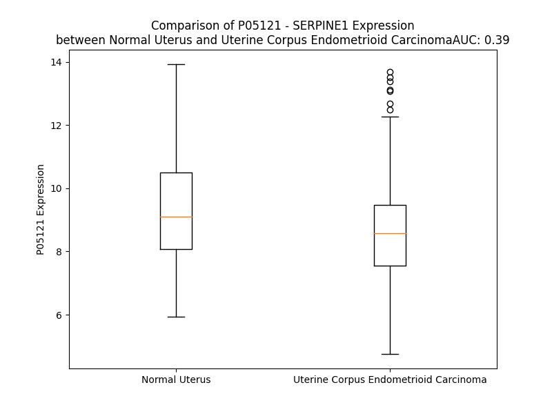

# Detailed Data for P05121

## Introduction to the Detailed Summary

### How to Interpret the Results

- **Summary & Metrics**: This section provides a quick reference to essential protein attributes, including expression changes, family classification, and biomarker applications. Regulation status (upregulated/downregulated) indicates the protein's behavior in a disease context. Some information comes from the original excel file with the proteins selected from literature, while others are derived from the analyses.
- **Expression Comparison**: A visual representation comparing protein expression between normal and disease states. It highlights significant changes in expression levels that might indicate diagnostic or therapeutic relevance. This is data coming from transcriptomics experiments and could not translate similarly to protein levels.
- **Isoform Alignment**: An interactive view of isoform alignments, revealing structural and functional differences between variants of the protein.
- **Interactors & Homologs**: Tables listing known interaction partners and homologous proteins, the more interactors and homologs, the more complex the protein is to design an antibody for.
- **Biological Assemblies**: Information about the structural arrangement of the protein in different assemblies, providing insights into its functional state but also the complexity of the protein to develop antibodies.
- **Combined Per-Residue Information**: A detailed table summarizing residue-level data. This includes predictions for epitope regions, aggregation tendencies, and modifications that might impact the protein's function. Each row corresponds to a residue in the protein, providing insights into specific sites that may be important for research or drug development.
## Summary & Metrics

- **UniProt Accession**: P05121
- **Gene Name**: SERPINE1
- **Protein Name**: plasminogen activator inhibitor type 1 (PAI-1)
- **Swiss Prot**: PAI1_HUMAN
- **Family**: other
- **Biomarker Application**: diagnosis,disease progression,efficacy,prognosis,response to therapy,safety
- **Number of Isoforms**: 2
- **Regulation**: -1
- **(transcriptomics) AUC**: 0.52
- **(transcriptomics) Fold Change**: 1.01
- **(transcriptomics) Regulation**: Upregulated
- **Discotope Epitope Count**: 83
- **Max n_uniprots (Homo)**: 4
- **Max n_uniprots (Hetero)**: 2

## Expression Comparison

## Isoform Alignment

<pre style='font-size:14px; font-family:monospace;'>P05121-1 MQMSPALTCLVLGLALVFGEGSAVHHPPSYVAHLASDFGVRVFQQVAQASKDRNVVFSPYGVASVLAMLQLTTGGETQQQIQAAMGFKIDDKGMAPALRHLYKELMGPWNKDEISTTDAIFVQRDLKLVQGFMPHFFRLFRSTVKQVDFSEVERARFIINDWVKTHTKGMISNLLGKGAVDQLTRLVLVNALYFNGQWKTPFPDSSTHRRLFHKSDGSTVSVPMMAQTNKFNYTEFTTPDGHYYDILELPYHGDTLSMFIAAPYEKEVPLSALTNILSAQLISHWKGNMTRLPRLLVLPKFSLETEVDLRKPLENLGMTDMFRQFQADFTSLSDQEPLHVAQALQKVKIEVNESGTVASSSTAVIVSARMAPEEIIMDRPFLFVVRHNPTGTVLFMGQVMEP
P05121-2 MQMSPALTCLVLGLALVFGEGSAVHHPPSYVA---------------QASKDRNVVFSPYGVASVLAMLQLTTGGETQQQIQAAMGFKIDDKGMAPALRHLYKELMGPWNKDEISTTDAIFVQRDLKLVQGFMPHFFRLFRSTVKQVDFSEVERARFIINDWVKTHTKGMISNLLGKGAVDQLTRLVLVNALYFNGQWKTPFPDSSTHRRLFHKSDGSTVSVPMMAQTNKFNYTEFTTPDGHYYDILELPYHGDTLSMFIAAPYEKEVPLSALTNILSAQLISHWKGNMTRLPRLLVLPKFSLETEVDLRKPLENLGMTDMFRQFQADFTSLSDQEPLHVAQALQKVKIEVNESGTVASSSTAVIVSARMAPEEIIMDRPFLFVVRHNPTGTVLFMGQVMEP
</pre>

## Interactors

| preferredName_A   | preferredName_B   |   score |
|:------------------|:------------------|--------:|
| SERPINE1          | PLAU              |   0.999 |
| SERPINE1          | VTN               |   0.999 |
| SERPINE1          | PLAT              |   0.999 |
| SERPINE1          | PLAUR             |   0.994 |
| SERPINE1          | PLG               |   0.989 |
| SERPINE1          | LRP1              |   0.988 |
| SERPINE1          | SERPINB2          |   0.958 |
| SERPINE1          | AGTR1             |   0.953 |
| SERPINE1          | PROC              |   0.943 |
| SERPINE1          | CCL2              |   0.918 |
| SERPINE1          | F3                |   0.902 |

## Homologs

| uniprot_id   | gene_id   |
|:-------------|:----------|
| P48595       | SERPINB10 |
| E9PMI5       | SERPINH1  |
| A0A024R6N5   | SERPINA1  |
| P20848       | SERPINA2  |
| V9HWH1       | HEL57     |
| A0A1B0GX82   | SERPINB7  |
| Q86U17       | SERPINA11 |
| G3V4B4       | SERPINA5  |
| A8MV23       | SERPINE3  |
| E9PDK7       | SERPINB2  |
| P29508       | SERPINB3  |
| P48594       | SERPINB4  |
| Q96P63       | SERPINB12 |
| Q99574       | SERPINI1  |
| G3V2W1       | SERPINA10 |
| C9J7N5       | SERPINI2  |
| P05546       | SERPIND1  |
| H7BZS9       | SERPINB13 |
| C9JZJ9       | SERPING1  |
| P01008       | SERPINC1  |
| F5GWT8       | SERPINB11 |
| G3V4V7       | SERPINA6  |
| A0A6Q8JH89   | SERPINA9  |
| P05543       | SERPINA7  |
| C9JPV4       | SERPINF2  |
| G3V595       | SERPINA3  |
| P36952       | SERPINB5  |
| P50453       | SERPINB9  |
| A0A2R8Y6N4   | SERPINB6  |
| P0C7T4       | HMSD      |
| Q8IW75       | SERPINA12 |
| C9K031       | SERPINE2  |
| A0A7P0T9S6   | AGT       |
| P50452       | SERPINB8  |
| P29622       | SERPINA4  |
| I3L107       | SERPINF1  |

## Biological Assemblies

|   Unnamed: 0 |   assembly |   n_uniprots | composition   | crystal_id   |
|-------------:|-----------:|-------------:|:--------------|:-------------|
|            0 |          1 |            3 | Homo          | 6i8s         |
|            1 |          2 |            3 | Homo          | 6i8s         |
|            2 |          3 |            3 | Homo          | 6i8s         |
|            3 |          4 |            3 | Homo          | 6i8s         |
|            0 |          1 |            1 | Homo          | 3q02         |
|            1 |          2 |            1 | Homo          | 3q02         |
|            2 |          3 |            2 | Homo          | 3q02         |
|            0 |          1 |            1 | Homo          | 1dvn         |
|            0 |          1 |            2 | Homo          | 6gwq         |
|            0 |          1 |            2 | Homo          | 6zrv         |
|            0 |          1 |            1 | Homo          | 1dvm         |
|            1 |          2 |            1 | Homo          | 1dvm         |
|            2 |          3 |            1 | Homo          | 1dvm         |
|            3 |          4 |            1 | Homo          | 1dvm         |
|            0 |          1 |            1 | Homo          | 4aqh         |
|            1 |          2 |            1 | Homo          | 4aqh         |
|            2 |          3 |            1 | Homo          | 4aqh         |
|            0 |          1 |            1 | Homo          | 4ic0         |
|            1 |          2 |            1 | Homo          | 4ic0         |
|            2 |          3 |            1 | Homo          | 4ic0         |
|            3 |          4 |            1 | Homo          | 4ic0         |
|            0 |          1 |            1 | Homo          | 7aqf         |
|            1 |          2 |            1 | Homo          | 7aqf         |
|            0 |          1 |            1 | Homo          | 3q03         |
|            1 |          2 |            1 | Homo          | 3q03         |
|            2 |          3 |            2 | Homo          | 3q03         |
|            0 |          1 |            1 | Homo          | 1b3k         |
|            1 |          2 |            1 | Homo          | 1b3k         |
|            2 |          3 |            1 | Homo          | 1b3k         |
|            3 |          4 |            1 | Homo          | 1b3k         |
|            0 |          1 |            3 | Homo          | 6gwp         |
|            0 |          1 |            2 | Hetero        | 3pb1         |
|            0 |          1 |            3 | Homo          | 7aqg         |
|            0 |          1 |            2 | Homo          | 9pai         |
|            0 |          1 |            2 | Homo          | 3r4l         |
|            0 |          1 |            1 | Homo          | 3ut3         |
|            1 |          2 |            1 | Homo          | 3ut3         |
|            2 |          3 |            1 | Homo          | 3ut3         |
|            3 |          4 |            1 | Homo          | 3ut3         |
|            0 |          1 |            2 | Hetero        | 5brr         |
|            0 |          1 |            1 | Homo          | 3cvm         |
|            1 |          2 |            1 | Homo          | 3cvm         |
|            0 |          1 |            2 | Hetero        | 5zlz         |
|            0 |          1 |            1 | Homo          | 4g8o         |
|            1 |          2 |            1 | Homo          | 4g8o         |
|            2 |          3 |            1 | Homo          | 4g8o         |
|            3 |          4 |            1 | Homo          | 4g8o         |
|            0 |          1 |            1 | Homo          | 4g8r         |
|            1 |          2 |            1 | Homo          | 4g8r         |
|            0 |          1 |            2 | Hetero        | 1oc0         |
|            0 |          1 |            1 | Homo          | 1c5g         |
|            0 |          1 |            3 | Homo          | 6gwn         |
|            0 |          1 |            1 | Homo          | 1lj5         |
|            0 |          1 |            1 | Homo          | 3eox         |
|            0 |          1 |            2 | Homo          | 1db2         |
|            0 |          1 |            4 | Homo          | 1a7c         |

## Combined Per-Residue Information

|   res | aa   |   epitope_score | epitope   |   relative_surface_accessibility |   modeling_confidence |   Aggregation | modification   | glycosylation                   |
|------:|:-----|----------------:|:----------|---------------------------------:|----------------------:|--------------:|:---------------|:--------------------------------|
|     1 | M    |         0.16124 | False     |                          1.21386 |                 36.38 |         0     | N/A            | N/A                             |
|     2 | Q    |         0.2528  | True      |                          0.72258 |                 34.38 |         0     | N/A            | N/A                             |
|     3 | M    |         0.27734 | True      |                          0.84838 |                 34.51 |         0     | N/A            | N/A                             |
|     4 | S    |         0.31627 | True      |                          0.72926 |                 37.23 |         0     | N/A            | N/A                             |
|     5 | P    |         0.21056 | True      |                          0.86738 |                 44.09 |         0.247 | N/A            | N/A                             |
|     6 | A    |         0.30945 | True      |                          0.78132 |                 32.75 |        20.515 | N/A            | N/A                             |
|     7 | L    |         0.24894 | True      |                          1.04316 |                 37.05 |        44.483 | N/A            | N/A                             |
|     8 | T    |         0.17757 | False     |                          0.88434 |                 30.19 |        48.867 | N/A            | N/A                             |
|     9 | C    |         0.23471 | True      |                          0.83586 |                 31.21 |        56.19  | N/A            | N/A                             |
|    10 | L    |         0.23755 | True      |                          0.96709 |                 31.64 |        90.915 | N/A            | N/A                             |
|    11 | V    |         0.18401 | False     |                          0.94967 |                 36.26 |        97.253 | N/A            | N/A                             |
|    12 | L    |         0.14117 | False     |                          0.98393 |                 32.6  |        97.781 | N/A            | N/A                             |
|    13 | G    |         0.12778 | False     |                          0.88865 |                 34.57 |        97.583 | N/A            | N/A                             |
|    14 | L    |         0.19505 | True      |                          0.94622 |                 32.89 |        98.516 | N/A            | N/A                             |
|    15 | A    |         0.14337 | False     |                          0.85916 |                 36.92 |        98.254 | N/A            | N/A                             |
|    16 | L    |         0.11366 | False     |                          0.87903 |                 36.5  |        98.004 | N/A            | N/A                             |
|    17 | V    |         0.11528 | False     |                          0.99831 |                 38.91 |        96.625 | N/A            | N/A                             |
|    18 | F    |         0.16253 | False     |                          0.87159 |                 38    |        80.381 | N/A            | N/A                             |
|    19 | G    |         0.20851 | True      |                          0.85074 |                 35.5  |         6.651 | N/A            | N/A                             |
|    20 | E    |         0.19154 | False     |                          0.88153 |                 37.41 |         0     | N/A            | N/A                             |
|    21 | G    |         0.17445 | False     |                          0.80864 |                 37.93 |         0     | N/A            | N/A                             |
|    22 | S    |         0.17079 | False     |                          0.8176  |                 38.9  |         0     | N/A            | N/A                             |
|    23 | A    |         0.10517 | False     |                          0.43269 |                 45.65 |         0     | N/A            | N/A                             |
|    24 | V    |         0.10191 | False     |                          0.77112 |                 40.31 |         0     | N/A            | N/A                             |
|    25 | H    |         0.14904 | False     |                          0.82313 |                 45.26 |         0     | N/A            | N/A                             |
|    26 | H    |         0.11766 | False     |                          0.29464 |                 53.7  |         0     | N/A            | N/A                             |
|    27 | P    |         0.19882 | True      |                          0.53978 |                 62.02 |         0     | N/A            | N/A                             |
|    28 | P    |         0.12135 | False     |                          0.31015 |                 62.1  |         0     | N/A            | N/A                             |
|    29 | S    |         0.14798 | False     |                          0.43733 |                 76.84 |         0     | N/A            | N/A                             |
|    30 | Y    |         0.25239 | True      |                          0.42354 |                 86.16 |         0.23  | N/A            | N/A                             |
|    31 | V    |         0.00812 | False     |                          0       |                 88.69 |         0.23  | N/A            | N/A                             |
|    32 | A    |         0.00412 | False     |                          0.00107 |                 91.37 |         0.23  | N/A            | N/A                             |
|    33 | H    |         0.08845 | False     |                          0.35551 |                 94.13 |         0.23  | N/A            | N/A                             |
|    34 | L    |         0.05795 | False     |                          0.1848  |                 94.77 |         0.23  | N/A            | N/A                             |
|    35 | A    |         0.0097  | False     |                          0.01403 |                 94.76 |         0     | N/A            | N/A                             |
|    36 | S    |         0.00442 | False     |                          0.00208 |                 96.19 |         0     | N/A            | N/A                             |
|    37 | D    |         0.04187 | False     |                          0.21619 |                 96.73 |         0     | N/A            | N/A                             |
|    38 | F    |         0.00508 | False     |                          0       |                 97.88 |         0     | N/A            | N/A                             |
|    39 | G    |         0.0015  | False     |                          0       |                 98.21 |         0     | N/A            | N/A                             |
|    40 | V    |         0.00304 | False     |                          0.0019  |                 98.18 |         0     | N/A            | N/A                             |
|    41 | R    |         0.07846 | False     |                          0.33026 |                 98.06 |         0     | N/A            | N/A                             |
|    42 | V    |         0.00244 | False     |                          0       |                 98.35 |         0     | N/A            | N/A                             |
|    43 | F    |         0.00167 | False     |                          0       |                 98.18 |         0     | N/A            | N/A                             |
|    44 | Q    |         0.0679  | False     |                          0.17941 |                 97.04 |         0     | N/A            | N/A                             |
|    45 | Q    |         0.11518 | False     |                          0.22128 |                 97.34 |         0     | N/A            | N/A                             |
|    46 | V    |         0.01723 | False     |                          0.04355 |                 97.53 |         0     | N/A            | N/A                             |
|    47 | A    |         0.03254 | False     |                          0.04861 |                 95.7  |         0     | N/A            | N/A                             |
|    48 | Q    |         0.08603 | False     |                          0.60867 |                 94.07 |         0     | N/A            | N/A                             |
|    49 | A    |         0.12143 | False     |                          0.79573 |                 94.65 |         0     | N/A            | N/A                             |
|    50 | S    |         0.04447 | False     |                          0.20269 |                 92.68 |         0     | N/A            | N/A                             |
|    51 | K    |         0.11007 | False     |                          0.77966 |                 86.64 |         0     | N/A            | N/A                             |
|    52 | D    |         0.12146 | False     |                          0.55435 |                 87.26 |         0     | N/A            | N/A                             |
|    53 | R    |         0.15064 | False     |                          0.73188 |                 94.38 |         0     | N/A            | N/A                             |
|    54 | N    |         0.02386 | False     |                          0.29571 |                 96.82 |         0     | N/A            | N/A                             |
|    55 | V    |         0.00725 | False     |                          0.00762 |                 97.35 |         0     | N/A            | N/A                             |
|    56 | V    |         0.00171 | False     |                          0.0007  |                 97.86 |         0     | N/A            | N/A                             |
|    57 | F    |         0.00218 | False     |                          0       |                 98.19 |         0     | N/A            | N/A                             |
|    58 | S    |         0.00116 | False     |                          0       |                 97.93 |         0     | N/A            | N/A                             |
|    59 | P    |         0.00099 | False     |                          0       |                 97.87 |         0     | N/A            | N/A                             |
|    60 | Y    |         0.01609 | False     |                          0.03993 |                 96.21 |         7.461 | N/A            | N/A                             |
|    61 | G    |         0.00148 | False     |                          0.00161 |                 96.38 |         9.546 | N/A            | N/A                             |
|    62 | V    |         0.00134 | False     |                          0       |                 97.89 |        33.171 | N/A            | N/A                             |
|    63 | A    |         0.00545 | False     |                          0.02284 |                 97.1  |        34.964 | N/A            | N/A                             |
|    64 | S    |         0.02566 | False     |                          0.12697 |                 95.36 |        36.9   | N/A            | N/A                             |
|    65 | V    |         0.00257 | False     |                          0.0019  |                 96.64 |        51.096 | N/A            | N/A                             |
|    66 | L    |         0.00416 | False     |                          0       |                 97.57 |        51.312 | N/A            | N/A                             |
|    67 | A    |         0.00724 | False     |                          0.01148 |                 96.22 |        48.153 | N/A            | N/A                             |
|    68 | M    |         0.04105 | False     |                          0.06492 |                 95.92 |        45.318 | N/A            | N/A                             |
|    69 | L    |         0.00175 | False     |                          0       |                 96.86 |        41.863 | N/A            | N/A                             |
|    70 | Q    |         0.00405 | False     |                          0       |                 97.39 |        13.239 | N/A            | N/A                             |
|    71 | L    |         0.10574 | False     |                          0.11892 |                 95.71 |        12.248 | N/A            | N/A                             |
|    72 | T    |         0.00316 | False     |                          0       |                 97    |         5.96  | N/A            | N/A                             |
|    73 | T    |         0.00509 | False     |                          0.00211 |                 98.03 |         2.222 | N/A            | N/A                             |
|    74 | G    |         0.05978 | False     |                          0.11427 |                 96.56 |         0     | N/A            | N/A                             |
|    75 | G    |         0.17058 | False     |                          0.49982 |                 96.97 |         0     | N/A            | N/A                             |
|    76 | E    |         0.20306 | True      |                          0.51082 |                 98.17 |         0     | N/A            | N/A                             |
|    77 | T    |         0.01726 | False     |                          0.00733 |                 98.55 |         0     | N/A            | N/A                             |
|    78 | Q    |         0.04366 | False     |                          0.21124 |                 98.41 |         0     | N/A            | N/A                             |
|    79 | Q    |         0.11673 | False     |                          0.52309 |                 98.46 |         0     | N/A            | N/A                             |
|    80 | Q    |         0.10536 | False     |                          0.15686 |                 98.71 |         0     | N/A            | N/A                             |
|    81 | I    |         0.00782 | False     |                          0.0024  |                 98.53 |         0     | N/A            | N/A                             |
|    82 | Q    |         0.05315 | False     |                          0.09551 |                 97.97 |         0     | N/A            | N/A                             |
|    83 | A    |         0.16532 | False     |                          0.7944  |                 97.89 |         0     | N/A            | N/A                             |
|    84 | A    |         0.06924 | False     |                          0.06251 |                 97.79 |         0     | N/A            | N/A                             |
|    85 | M    |         0.01852 | False     |                          0.0085  |                 96.74 |         0     | N/A            | N/A                             |
|    86 | G    |         0.17136 | False     |                          0.55503 |                 95.36 |         0     | N/A            | N/A                             |
|    87 | F    |         0.07098 | False     |                          0.05083 |                 94.8  |         0     | N/A            | N/A                             |
|    88 | K    |         0.15653 | False     |                          0.46845 |                 95.26 |         0     | N/A            | N/A                             |
|    89 | I    |         0.0216  | False     |                          0.01461 |                 92.82 |         0     | N/A            | N/A                             |
|    90 | D    |         0.14815 | False     |                          0.61121 |                 89.25 |         0     | N/A            | N/A                             |
|    91 | D    |         0.11731 | False     |                          0.38616 |                 91.77 |         0     | N/A            | N/A                             |
|    92 | K    |         0.18081 | False     |                          0.76991 |                 87.36 |         0     | N/A            | N/A                             |
|    93 | G    |         0.03873 | False     |                          0.25829 |                 88.89 |         0     | N/A            | N/A                             |
|    94 | M    |         0.02465 | False     |                          0.02157 |                 91.07 |         0     | N/A            | N/A                             |
|    95 | A    |         0.0322  | False     |                          0.02959 |                 90.9  |         0     | N/A            | N/A                             |
|    96 | P    |         0.15683 | False     |                          0.49454 |                 91.74 |         0     | N/A            | N/A                             |
|    97 | A    |         0.03715 | False     |                          0.08328 |                 92.63 |         0     | N/A            | N/A                             |
|    98 | L    |         0.04171 | False     |                          0.14408 |                 92.17 |         0     | N/A            | N/A                             |
|    99 | R    |         0.11235 | False     |                          0.23175 |                 91.23 |         0     | N/A            | N/A                             |
|   100 | H    |         0.20757 | True      |                          0.44512 |                 91.44 |         0     | N/A            | N/A                             |
|   101 | L    |         0.00962 | False     |                          0.00165 |                 92.14 |         0     | N/A            | N/A                             |
|   102 | Y    |         0.05199 | False     |                          0.45739 |                 91.65 |         0     | N/A            | N/A                             |
|   103 | K    |         0.20773 | True      |                          0.64633 |                 90.88 |         0     | N/A            | N/A                             |
|   104 | E    |         0.10019 | False     |                          0.21356 |                 89.72 |         0     | N/A            | N/A                             |
|   105 | L    |         0.00712 | False     |                          0.00122 |                 90.11 |         0     | N/A            | N/A                             |
|   106 | M    |         0.081   | False     |                          0.2532  |                 87.88 |         0     | N/A            | N/A                             |
|   107 | G    |         0.19951 | True      |                          0.08446 |                 84.38 |         0     | N/A            | N/A                             |
|   108 | P    |         0.30315 | True      |                          0.94609 |                 77.83 |         0     | N/A            | N/A                             |
|   109 | W    |         0.27455 | True      |                          0.55555 |                 74.68 |         0     | N/A            | N/A                             |
|   110 | N    |         0.08699 | False     |                          0.10259 |                 70.45 |         0     | N/A            | N/A                             |
|   111 | K    |         0.33602 | True      |                          0.71351 |                 71.92 |         0     | N/A            | N/A                             |
|   112 | D    |         0.04406 | False     |                          0.06528 |                 81.66 |         0     | N/A            | N/A                             |
|   113 | E    |         0.20969 | True      |                          0.31862 |                 83.05 |         0     | N/A            | N/A                             |
|   114 | I    |         0.03991 | False     |                          0.12521 |                 87.64 |         0     | N/A            | N/A                             |
|   115 | S    |         0.06745 | False     |                          0.05096 |                 87.92 |         0     | N/A            | N/A                             |
|   116 | T    |         0.01929 | False     |                          0.11128 |                 91.28 |         0     | N/A            | N/A                             |
|   117 | T    |         0.05499 | False     |                          0.06251 |                 92.05 |         0     | N/A            | N/A                             |
|   118 | D    |         0.02626 | False     |                          0.10867 |                 93.62 |         0     | N/A            | N/A                             |
|   119 | A    |         0.01355 | False     |                          0.01786 |                 96.89 |         3.114 | N/A            | N/A                             |
|   120 | I    |         0.00352 | False     |                          0.00756 |                 97.89 |         3.114 | N/A            | N/A                             |
|   121 | F    |         0.00861 | False     |                          0.01083 |                 98.23 |         3.114 | N/A            | N/A                             |
|   122 | V    |         0.00326 | False     |                          0       |                 98.04 |         3.114 | N/A            | N/A                             |
|   123 | Q    |         0.04695 | False     |                          0.04551 |                 97.89 |         3.114 | N/A            | N/A                             |
|   124 | R    |         0.21406 | True      |                          0.48061 |                 96.94 |         0     | N/A            | N/A                             |
|   125 | D    |         0.20889 | True      |                          0.65023 |                 94.76 |         0     | N/A            | N/A                             |
|   126 | L    |         0.07795 | False     |                          0.04451 |                 96.3  |         0     | N/A            | N/A                             |
|   127 | K    |         0.24659 | True      |                          0.70224 |                 96.81 |         0     | N/A            | N/A                             |
|   128 | L    |         0.09367 | False     |                          0.26305 |                 97.05 |         0     | N/A            | N/A                             |
|   129 | V    |         0.18756 | False     |                          0.35649 |                 97.46 |         0     | N/A            | N/A                             |
|   130 | Q    |         0.36639 | True      |                          0.91657 |                 97.1  |         0     | N/A            | N/A                             |
|   131 | G    |         0.13953 | False     |                          0.51446 |                 95.97 |         0     | N/A            | N/A                             |
|   132 | F    |         0.07888 | False     |                          0.06186 |                 96.71 |         0     | N/A            | N/A                             |
|   133 | M    |         0.2121  | True      |                          0.34061 |                 96.67 |         0     | N/A            | N/A                             |
|   134 | P    |         0.32914 | True      |                          0.70035 |                 97.15 |         0     | N/A            | N/A                             |
|   135 | H    |         0.15479 | False     |                          0.37463 |                 94.65 |         0     | N/A            | N/A                             |
|   136 | F    |         0.01133 | False     |                          0.00833 |                 95.28 |         0     | N/A            | N/A                             |
|   137 | F    |         0.25157 | True      |                          0.48151 |                 95.42 |         0     | N/A            | N/A                             |
|   138 | R    |         0.31178 | True      |                          0.56035 |                 93.2  |         0     | N/A            | N/A                             |
|   139 | L    |         0.13208 | False     |                          0.14544 |                 91.92 |         0     | N/A            | N/A                             |
|   140 | F    |         0.15205 | False     |                          0.15453 |                 91.72 |         0     | N/A            | N/A                             |
|   141 | R    |         0.32964 | True      |                          0.61689 |                 91.57 |         0     | N/A            | N/A                             |
|   142 | S    |         0.12649 | False     |                          0.21447 |                 92.17 |         0     | N/A            | N/A                             |
|   143 | T    |         0.16746 | False     |                          0.28763 |                 95.23 |         0     | N/A            | N/A                             |
|   144 | V    |         0.03793 | False     |                          0.04889 |                 96.78 |         0     | N/A            | N/A                             |
|   145 | K    |         0.07698 | False     |                          0.2579  |                 97.39 |         0     | N/A            | N/A                             |
|   146 | Q    |         0.10321 | False     |                          0.44195 |                 97.46 |         0     | N/A            | N/A                             |
|   147 | V    |         0.02875 | False     |                          0.02095 |                 97.93 |         0     | N/A            | N/A                             |
|   148 | D    |         0.10001 | False     |                          0.17736 |                 98.17 |         0     | N/A            | N/A                             |
|   149 | F    |         0.0113  | False     |                          0.00394 |                 98.1  |         0     | N/A            | N/A                             |
|   150 | S    |         0.24614 | True      |                          0.49878 |                 96.8  |         0     | N/A            | N/A                             |
|   151 | E    |         0.14351 | False     |                          0.39573 |                 97.51 |         0     | N/A            | N/A                             |
|   152 | V    |         0.12873 | False     |                          0.23752 |                 97.86 |         0     | N/A            | N/A                             |
|   153 | E    |         0.16564 | False     |                          0.49125 |                 97.63 |         0     | N/A            | N/A                             |
|   154 | R    |         0.15312 | False     |                          0.57198 |                 97.78 |         0     | N/A            | N/A                             |
|   155 | A    |         0.01223 | False     |                          0.00584 |                 98.07 |         0     | N/A            | N/A                             |
|   156 | R    |         0.12975 | False     |                          0.19698 |                 97.74 |         0     | N/A            | N/A                             |
|   157 | F    |         0.2151  | True      |                          0.67056 |                 97.79 |         0     | N/A            | N/A                             |
|   158 | I    |         0.09092 | False     |                          0.34868 |                 98.07 |         0     | N/A            | N/A                             |
|   159 | I    |         0.0034  | False     |                          0       |                 97.87 |         0     | N/A            | N/A                             |
|   160 | N    |         0.12648 | False     |                          0.08553 |                 97.95 |         0     | N/A            | N/A                             |
|   161 | D    |         0.13129 | False     |                          0.41694 |                 98.04 |         0     | N/A            | N/A                             |
|   162 | W    |         0.0829  | False     |                          0.18738 |                 97.26 |         0     | N/A            | N/A                             |
|   163 | V    |         0.00339 | False     |                          0       |                 97.1  |         0     | N/A            | N/A                             |
|   164 | K    |         0.11425 | False     |                          0.48514 |                 96.88 |         0     | N/A            | N/A                             |
|   165 | T    |         0.16636 | False     |                          0.63634 |                 95.86 |         0     | N/A            | N/A                             |
|   166 | H    |         0.1033  | False     |                          0.46024 |                 92.32 |         0     | N/A            | N/A                             |
|   167 | T    |         0.00799 | False     |                          0.0007  |                 92.08 |         0     | N/A            | N/A                             |
|   168 | K    |         0.20934 | True      |                          0.69403 |                 91.46 |         0     | N/A            | N/A                             |
|   169 | G    |         0.15663 | False     |                          0.43364 |                 93.52 |         0     | N/A            | N/A                             |
|   170 | M    |         0.19621 | True      |                          0.3214  |                 93.2  |         0     | N/A            | N/A                             |
|   171 | I    |         0.01371 | False     |                          0.0008  |                 92.47 |         0     | N/A            | N/A                             |
|   172 | S    |         0.12159 | False     |                          0.35268 |                 93.29 |         0     | N/A            | N/A                             |
|   173 | N    |         0.1747  | False     |                          0.6304  |                 93.53 |         0     | N/A            | N/A                             |
|   174 | L    |         0.02265 | False     |                          0.00132 |                 93.72 |         0     | N/A            | N/A                             |
|   175 | L    |         0.00951 | False     |                          0.00305 |                 94.29 |         0     | N/A            | N/A                             |
|   176 | G    |         0.152   | False     |                          0.43092 |                 93.41 |         0     | N/A            | N/A                             |
|   177 | K    |         0.33404 | True      |                          0.8907  |                 93.88 |         0     | N/A            | N/A                             |
|   178 | G    |         0.28461 | True      |                          0.86033 |                 93.48 |         0     | N/A            | N/A                             |
|   179 | A    |         0.09236 | False     |                          0.22182 |                 93.26 |         0.041 | N/A            | N/A                             |
|   180 | V    |         0.07492 | False     |                          0.04216 |                 96.34 |         0.193 | N/A            | N/A                             |
|   181 | D    |         0.14837 | False     |                          0.46973 |                 96.51 |         0.204 | N/A            | N/A                             |
|   182 | Q    |         0.277   | True      |                          0.62808 |                 96.15 |         0.204 | N/A            | N/A                             |
|   183 | L    |         0.25567 | True      |                          0.9202  |                 95.04 |         0.204 | N/A            | N/A                             |
|   184 | T    |         0.03092 | False     |                          0.03931 |                 97.48 |         0.204 | N/A            | N/A                             |
|   185 | R    |         0.25657 | True      |                          0.3137  |                 97.42 |         0.204 | N/A            | N/A                             |
|   186 | L    |         0.00213 | False     |                          0       |                 98.04 |        72.112 | N/A            | N/A                             |
|   187 | V    |         0.00229 | False     |                          0       |                 98.24 |        85.217 | N/A            | N/A                             |
|   188 | L    |         0.00278 | False     |                          0.00577 |                 97.87 |        88.248 | N/A            | N/A                             |
|   189 | V    |         0.00183 | False     |                          0       |                 97.77 |        88.792 | N/A            | N/A                             |
|   190 | N    |         0.00283 | False     |                          0.00148 |                 97.31 |        88.816 | N/A            | N/A                             |
|   191 | A    |         0.00311 | False     |                          0       |                 97.41 |        88.534 | N/A            | N/A                             |
|   192 | L    |         0.00912 | False     |                          0.00495 |                 95.53 |        88.204 | N/A            | N/A                             |
|   193 | Y    |         0.01884 | False     |                          0.0145  |                 94.93 |        86.352 | N/A            | N/A                             |
|   194 | F    |         0.00261 | False     |                          0.00127 |                 93.81 |        80.108 | N/A            | N/A                             |
|   195 | N    |         0.09121 | False     |                          0.22374 |                 91.56 |         3.31  | N/A            | N/A                             |
|   196 | G    |         0.06655 | False     |                          0.07315 |                 90.58 |         0.285 | N/A            | N/A                             |
|   197 | Q    |         0.26637 | True      |                          0.36765 |                 91.6  |         0.028 | N/A            | N/A                             |
|   198 | W    |         0.04613 | False     |                          0.02914 |                 92.97 |         0.028 | N/A            | N/A                             |
|   199 | K    |         0.13187 | False     |                          0.46681 |                 91.86 |         0     | N/A            | N/A                             |
|   200 | T    |         0.08839 | False     |                          0.24211 |                 92.77 |         0     | N/A            | N/A                             |
|   201 | P    |         0.06924 | False     |                          0.14233 |                 92.98 |         0     | N/A            | N/A                             |
|   202 | F    |         0.02442 | False     |                          0.02862 |                 94.31 |         0     | N/A            | N/A                             |
|   203 | P    |         0.08823 | False     |                          0.47688 |                 93.31 |         0     | N/A            | N/A                             |
|   204 | D    |         0.31063 | True      |                          0.64324 |                 92.82 |         0     | N/A            | N/A                             |
|   205 | S    |         0.23435 | True      |                          0.74056 |                 94.59 |         0     | N/A            | N/A                             |
|   206 | S    |         0.075   | False     |                          0.26975 |                 95.11 |         0     | N/A            | N/A                             |
|   207 | T    |         0.14614 | False     |                          0.21091 |                 96.94 |         0     | N/A            | N/A                             |
|   208 | H    |         0.23534 | True      |                          0.55486 |                 97.51 |         0     | N/A            | N/A                             |
|   209 | R    |         0.36335 | True      |                          0.69191 |                 98.21 |         0     | N/A            | N/A                             |
|   210 | R    |         0.20065 | True      |                          0.32041 |                 97.81 |         0     | N/A            | N/A                             |
|   211 | L    |         0.24095 | True      |                          0.61617 |                 97.75 |         0     | N/A            | N/A                             |
|   212 | F    |         0.00803 | False     |                          0       |                 97.51 |         0     | N/A            | N/A                             |
|   213 | H    |         0.1172  | False     |                          0.34093 |                 95.82 |         0     | N/A            | N/A                             |
|   214 | K    |         0.18313 | False     |                          0.23086 |                 94.76 |         0     | N/A            | N/A                             |
|   215 | S    |         0.14217 | False     |                          0.47791 |                 90.39 |         0     | N/A            | N/A                             |
|   216 | D    |         0.2791  | True      |                          0.63142 |                 90.5  |         0     | N/A            | N/A                             |
|   217 | G    |         0.2005  | True      |                          0.77729 |                 90.57 |         0     | N/A            | N/A                             |
|   218 | S    |         0.31726 | True      |                          0.39021 |                 94.84 |         0     | N/A            | N/A                             |
|   219 | T    |         0.35763 | True      |                          0.47417 |                 96.57 |         0     | N/A            | N/A                             |
|   220 | V    |         0.28694 | True      |                          0.29705 |                 96.78 |         0     | N/A            | N/A                             |
|   221 | S    |         0.21506 | True      |                          0.35911 |                 97.85 |         0     | N/A            | N/A                             |
|   222 | V    |         0.04122 | False     |                          0.05427 |                 97.82 |         0     | N/A            | N/A                             |
|   223 | P    |         0.1247  | False     |                          0.36184 |                 97.87 |         0     | N/A            | N/A                             |
|   224 | M    |         0.00461 | False     |                          0.0012  |                 98.23 |         0     | N/A            | N/A                             |
|   225 | M    |         0.01071 | False     |                          0       |                 97.63 |         0     | N/A            | N/A                             |
|   226 | A    |         0.05176 | False     |                          0.08009 |                 96.5  |         0     | N/A            | N/A                             |
|   227 | Q    |         0.05711 | False     |                          0.07867 |                 94.51 |         0     | N/A            | N/A                             |
|   228 | T    |         0.18192 | False     |                          0.33689 |                 93.58 |         0     | N/A            | N/A                             |
|   229 | N    |         0.06344 | False     |                          0.07721 |                 93.28 |         0     | N/A            | N/A                             |
|   230 | K    |         0.14273 | False     |                          0.51698 |                 93.43 |         0     | N/A            | N/A                             |
|   231 | F    |         0.03064 | False     |                          0.06066 |                 94.67 |         0     | N/A            | N/A                             |
|   232 | N    |         0.06137 | False     |                          0.25651 |                 96.23 |         0     | N/A            | N-linked (GlcNAc...) asparagine |
|   233 | Y    |         0.05567 | False     |                          0.07905 |                 96.08 |         0     | N/A            | N/A                             |
|   234 | T    |         0.09921 | False     |                          0.09138 |                 94.86 |         0     | N/A            | N/A                             |
|   235 | E    |         0.15994 | False     |                          0.53705 |                 94.44 |         0     | N/A            | N/A                             |
|   236 | F    |         0.14933 | False     |                          0.20717 |                 95.28 |         0     | N/A            | N/A                             |
|   237 | T    |         0.11101 | False     |                          0.47595 |                 96.25 |         0     | N/A            | N/A                             |
|   238 | T    |         0.07425 | False     |                          0.04127 |                 96.27 |         0     | N/A            | N/A                             |
|   239 | P    |         0.19357 | True      |                          0.84749 |                 95.67 |         0     | N/A            | N/A                             |
|   240 | D    |         0.19759 | True      |                          0.742   |                 94.54 |         0     | N/A            | N/A                             |
|   241 | G    |         0.16273 | False     |                          0.49699 |                 96.35 |         0     | N/A            | N/A                             |
|   242 | H    |         0.19265 | True      |                          0.3524  |                 96.3  |         0     | N/A            | N/A                             |
|   243 | Y    |         0.20332 | True      |                          0.58839 |                 96.47 |         0     | N/A            | N/A                             |
|   244 | Y    |         0.02549 | False     |                          0.00849 |                 96.84 |         0     | N/A            | N/A                             |
|   245 | D    |         0.04484 | False     |                          0.07699 |                 94.65 |         0     | N/A            | N/A                             |
|   246 | I    |         0.00205 | False     |                          0       |                 96.94 |         0     | N/A            | N/A                             |
|   247 | L    |         0.01315 | False     |                          0.01449 |                 97.18 |         0     | N/A            | N/A                             |
|   248 | E    |         0.00953 | False     |                          0.00776 |                 97.33 |         0     | N/A            | N/A                             |
|   249 | L    |         0.02325 | False     |                          0.04534 |                 95.83 |         0     | N/A            | N/A                             |
|   250 | P    |         0.08136 | False     |                          0.25777 |                 94.97 |         0     | N/A            | N/A                             |
|   251 | Y    |         0.02342 | False     |                          0.01085 |                 93.25 |         0     | N/A            | N/A                             |
|   252 | H    |         0.32995 | True      |                          0.2215  |                 87.75 |         0     | N/A            | N/A                             |
|   253 | G    |         0.16555 | False     |                          0.55988 |                 86.02 |         0     | N/A            | N/A                             |
|   254 | D    |         0.2216  | True      |                          0.39397 |                 89.7  |         0     | N/A            | N/A                             |
|   255 | T    |         0.07928 | False     |                          0.18474 |                 91.22 |         2.329 | N/A            | N/A                             |
|   256 | L    |         0.00632 | False     |                          0       |                 93.83 |         6.242 | N/A            | N/A                             |
|   257 | S    |         0.00621 | False     |                          0.00079 |                 95.57 |         7.143 | N/A            | N/A                             |
|   258 | M    |         0.00452 | False     |                          0       |                 97.54 |         7.143 | N/A            | N/A                             |
|   259 | F    |         0.00517 | False     |                          0.00398 |                 97.76 |         7.143 | N/A            | N/A                             |
|   260 | I    |         0.00672 | False     |                          0.00633 |                 97.81 |         7.143 | N/A            | N/A                             |
|   261 | A    |         0.00617 | False     |                          0.00747 |                 97.64 |         3.76  | N/A            | N/A                             |
|   262 | A    |         0.00246 | False     |                          0       |                 96.98 |         0     | N/A            | N/A                             |
|   263 | P    |         0.02352 | False     |                          0.02187 |                 96.03 |         0     | N/A            | N/A                             |
|   264 | Y    |         0.30262 | True      |                          0.64365 |                 93.46 |         0     | N/A            | N/A                             |
|   265 | E    |         0.21888 | True      |                          0.52697 |                 92.89 |         0     | N/A            | N/A                             |
|   266 | K    |         0.15283 | False     |                          0.56227 |                 89.83 |         0     | N/A            | N/A                             |
|   267 | E    |         0.29115 | True      |                          0.84226 |                 90.95 |         0     | N/A            | N/A                             |
|   268 | V    |         0.09464 | False     |                          0.10276 |                 94.25 |         0     | N/A            | N/A                             |
|   269 | P    |         0.17186 | False     |                          0.6044  |                 93.49 |         0     | N/A            | N/A                             |
|   270 | L    |         0.0212  | False     |                          0.0546  |                 95.49 |         0.262 | N/A            | N/A                             |
|   271 | S    |         0.11305 | False     |                          0.4041  |                 94.37 |         0.262 | N/A            | N/A                             |
|   272 | A    |         0.04957 | False     |                          0.18376 |                 94.76 |         0.648 | N/A            | N/A                             |
|   273 | L    |         0.00497 | False     |                          0.00659 |                 95.44 |         1.105 | N/A            | N/A                             |
|   274 | T    |         0.03572 | False     |                          0.05753 |                 94.67 |         1.105 | N/A            | N/A                             |
|   275 | N    |         0.14038 | False     |                          0.57436 |                 93.85 |         1.105 | N/A            | N/A                             |
|   276 | I    |         0.15728 | False     |                          0.29277 |                 95.44 |         1.99  | N/A            | N/A                             |
|   277 | L    |         0.028   | False     |                          0.04126 |                 95.64 |         1.99  | N/A            | N/A                             |
|   278 | S    |         0.05049 | False     |                          0.24658 |                 95    |         0.885 | N/A            | N/A                             |
|   279 | A    |         0.01763 | False     |                          0.04508 |                 93.49 |         0.885 | N/A            | N/A                             |
|   280 | Q    |         0.2034  | True      |                          0.45804 |                 93.68 |         0.885 | N/A            | N/A                             |
|   281 | L    |         0.07147 | False     |                          0.18914 |                 94.93 |         0.885 | N/A            | N/A                             |
|   282 | I    |         0.00854 | False     |                          0.0048  |                 94.81 |         0.885 | N/A            | N/A                             |
|   283 | S    |         0.06791 | False     |                          0.3167  |                 92.48 |         0     | N/A            | N/A                             |
|   284 | H    |         0.1429  | False     |                          0.48196 |                 93.16 |         0     | N/A            | N/A                             |
|   285 | W    |         0.01378 | False     |                          0.00608 |                 94.3  |         0     | N/A            | N/A                             |
|   286 | K    |         0.07951 | False     |                          0.36886 |                 87.92 |         0     | N/A            | N/A                             |
|   287 | G    |         0.13351 | False     |                          0.81458 |                 86.5  |         0     | N/A            | N/A                             |
|   288 | N    |         0.15716 | False     |                          0.57011 |                 89.95 |         0     | N/A            | N-linked (GlcNAc...) asparagine |
|   289 | M    |         0.05149 | False     |                          0.18041 |                 94.12 |         0     | N/A            | N/A                             |
|   290 | T    |         0.18355 | False     |                          0.56331 |                 94.21 |         0     | N/A            | N/A                             |
|   291 | R    |         0.28341 | True      |                          0.59351 |                 94.43 |         0     | N/A            | N/A                             |
|   292 | L    |         0.19278 | True      |                          0.33716 |                 92.7  |         0     | N/A            | N/A                             |
|   293 | P    |         0.14187 | False     |                          0.40256 |                 93.17 |         0     | N/A            | N/A                             |
|   294 | R    |         0.19076 | False     |                          0.10872 |                 94.35 |         0     | N/A            | N/A                             |
|   295 | L    |         0.06877 | False     |                          0.25637 |                 94.95 |         0     | N/A            | N/A                             |
|   296 | L    |         0.00395 | False     |                          0       |                 96.91 |         0     | N/A            | N/A                             |
|   297 | V    |         0.00612 | False     |                          0       |                 97.59 |         0     | N/A            | N/A                             |
|   298 | L    |         0.00265 | False     |                          0       |                 97.89 |         0     | N/A            | N/A                             |
|   299 | P    |         0.00319 | False     |                          0       |                 97.56 |         0     | N/A            | N/A                             |
|   300 | K    |         0.12292 | False     |                          0.31673 |                 96.32 |         0     | N/A            | N/A                             |
|   301 | F    |         0.0265  | False     |                          0.04179 |                 96.02 |         0     | N/A            | N/A                             |
|   302 | S    |         0.14024 | False     |                          0.51969 |                 95.61 |         0     | N/A            | N/A                             |
|   303 | L    |         0.03635 | False     |                          0.04521 |                 96.06 |         0     | N/A            | N/A                             |
|   304 | E    |         0.0571  | False     |                          0.46872 |                 95.7  |         0     | N/A            | N/A                             |
|   305 | T    |         0.05969 | False     |                          0.14938 |                 96.68 |         0     | N/A            | N/A                             |
|   306 | E    |         0.06306 | False     |                          0.43122 |                 95.9  |         0     | N/A            | N/A                             |
|   307 | V    |         0.05389 | False     |                          0.08569 |                 96.83 |         0     | N/A            | N/A                             |
|   308 | D    |         0.05302 | False     |                          0.44157 |                 97.02 |         0     | N/A            | N/A                             |
|   309 | L    |         0.00335 | False     |                          0.00247 |                 98.22 |         0     | N/A            | N/A                             |
|   310 | R    |         0.09898 | False     |                          0.36588 |                 98.12 |         0     | N/A            | N/A                             |
|   311 | K    |         0.13914 | False     |                          0.62182 |                 98.17 |         0     | N/A            | N/A                             |
|   312 | P    |         0.03984 | False     |                          0.07541 |                 98.26 |         0     | N/A            | N/A                             |
|   313 | L    |         0.00326 | False     |                          0       |                 98.71 |         0     | N/A            | N/A                             |
|   314 | E    |         0.1297  | False     |                          0.2163  |                 98.55 |         0     | N/A            | N/A                             |
|   315 | N    |         0.17555 | False     |                          0.49932 |                 98.32 |         0     | N/A            | N/A                             |
|   316 | L    |         0.13957 | False     |                          0.23117 |                 98.26 |         0     | N/A            | N/A                             |
|   317 | G    |         0.19072 | False     |                          0.45781 |                 98.29 |         0     | N/A            | N/A                             |
|   318 | M    |         0.0063  | False     |                          0.00216 |                 98.51 |         0     | N/A            | N/A                             |
|   319 | T    |         0.11503 | False     |                          0.20834 |                 98.42 |         0     | N/A            | N/A                             |
|   320 | D    |         0.11657 | False     |                          0.09429 |                 98.57 |         0     | N/A            | N/A                             |
|   321 | M    |         0.01519 | False     |                          0.00843 |                 98.3  |         0     | N/A            | N/A                             |
|   322 | F    |         0.01991 | False     |                          0.02932 |                 98.21 |         0     | N/A            | N/A                             |
|   323 | R    |         0.37251 | True      |                          0.44357 |                 97.69 |         0     | N/A            | N/A                             |
|   324 | Q    |         0.25164 | True      |                          0.4736  |                 94.32 |         0     | N/A            | N/A                             |
|   325 | F    |         0.36646 | True      |                          0.97257 |                 94.41 |         0     | N/A            | N/A                             |
|   326 | Q    |         0.24927 | True      |                          0.49352 |                 97.45 |         0     | N/A            | N/A                             |
|   327 | A    |         0.08204 | False     |                          0.1367  |                 98.25 |         0     | N/A            | N/A                             |
|   328 | D    |         0.13549 | False     |                          0.21987 |                 98.37 |         0     | N/A            | N/A                             |
|   329 | F    |         0.01992 | False     |                          0.02204 |                 98.11 |         0     | N/A            | N/A                             |
|   330 | T    |         0.18424 | False     |                          0.55992 |                 97.41 |         0     | N/A            | N/A                             |
|   331 | S    |         0.11484 | False     |                          0.34178 |                 96.65 |         0     | N/A            | N/A                             |
|   332 | L    |         0.00679 | False     |                          0       |                 97.51 |         0     | N/A            | N/A                             |
|   333 | S    |         0.0696  | False     |                          0.01307 |                 97.31 |         0     | N/A            | N/A                             |
|   334 | D    |         0.30329 | True      |                          0.57314 |                 94.51 |         0     | N/A            | N/A                             |
|   335 | Q    |         0.25783 | True      |                          0.59515 |                 91.71 |         0     | N/A            | N/A                             |
|   336 | E    |         0.22288 | True      |                          0.27048 |                 91.98 |         0     | N/A            | N/A                             |
|   337 | P    |         0.17397 | False     |                          0.75719 |                 93.9  |         0     | N/A            | N/A                             |
|   338 | L    |         0.04545 | False     |                          0.01628 |                 97.66 |         0     | N/A            | N/A                             |
|   339 | H    |         0.07129 | False     |                          0.25427 |                 97.91 |         0     | N/A            | N/A                             |
|   340 | V    |         0.00662 | False     |                          0.00451 |                 98.29 |         0     | N/A            | N/A                             |
|   341 | A    |         0.06863 | False     |                          0.23274 |                 97.34 |         0     | N/A            | N/A                             |
|   342 | Q    |         0.07045 | False     |                          0.23245 |                 96.63 |         0     | N/A            | N/A                             |
|   343 | A    |         0.00278 | False     |                          0.00365 |                 98.01 |         0     | N/A            | N/A                             |
|   344 | L    |         0.05107 | False     |                          0.06921 |                 98    |         0     | N/A            | N/A                             |
|   345 | Q    |         0.00189 | False     |                          0.0005  |                 98.17 |         0     | N/A            | N/A                             |
|   346 | K    |         0.02828 | False     |                          0.09155 |                 97.98 |         0     | N/A            | N/A                             |
|   347 | V    |         0.00829 | False     |                          0.00381 |                 97.92 |         0.608 | N/A            | N/A                             |
|   348 | K    |         0.05194 | False     |                          0.1756  |                 96.6  |         0.608 | N/A            | N/A                             |
|   349 | I    |         0.00554 | False     |                          0       |                 96.02 |         0.608 | N/A            | N/A                             |
|   350 | E    |         0.07972 | False     |                          0.20282 |                 94.63 |         0.608 | N/A            | N/A                             |
|   351 | V    |         0.01521 | False     |                          0.03964 |                 95.36 |         0.608 | N/A            | N/A                             |
|   352 | N    |         0.10717 | False     |                          0.23819 |                 94.38 |         0     | N/A            | N-linked (GlcNAc...) asparagine |
|   353 | E    |         0.07913 | False     |                          0.06711 |                 93.07 |         0     | N/A            | N/A                             |
|   354 | S    |         0.29343 | True      |                          0.41656 |                 84.39 |         0     | N/A            | N/A                             |
|   355 | G    |         0.10421 | False     |                          0.15778 |                 65.1  |         0     | N/A            | N/A                             |
|   356 | T    |         0.32584 | True      |                          0.45079 |                 47.98 |         0.307 | N/A            | N/A                             |
|   357 | V    |         0.31514 | True      |                          0.95117 |                 43.86 |         0.822 | N/A            | N/A                             |
|   358 | A    |         0.36421 | True      |                          0.97878 |                 37.66 |         0.822 | N/A            | N/A                             |
|   359 | S    |         0.21196 | True      |                          0.5516  |                 37.69 |         0.822 | N/A            | N/A                             |
|   360 | S    |         0.07023 | False     |                          0.23128 |                 37.65 |         1.25  | N/A            | N/A                             |
|   361 | S    |         0.21183 | True      |                          0.8927  |                 38.58 |         5.282 | N/A            | N/A                             |
|   362 | T    |         0.12755 | False     |                          0.62737 |                 48.03 |        35.42  | N/A            | N/A                             |
|   363 | A    |         0.15301 | False     |                          0.8268  |                 48.7  |        39.323 | N/A            | N/A                             |
|   364 | V    |         0.07755 | False     |                          0.29578 |                 52.75 |        41.44  | N/A            | N/A                             |
|   365 | I    |         0.28255 | True      |                          0.99233 |                 53.81 |        41.44  | N/A            | N/A                             |
|   366 | V    |         0.2224  | True      |                          0.43972 |                 54.26 |        41.147 | N/A            | N/A                             |
|   367 | S    |         0.21287 | True      |                          0.56212 |                 54.6  |         8.63  | N/A            | N/A                             |
|   368 | A    |         0.27258 | True      |                          1.10473 |                 56.59 |         5.101 | N/A            | N/A                             |
|   369 | R    |         0.47154 | True      |                          0.93132 |                 58.69 |         0     | N/A            | N/A                             |
|   370 | M    |         0.25888 | True      |                          0.7974  |                 66.99 |         0     | N/A            | N/A                             |
|   371 | A    |         0.122   | False     |                          0.85296 |                 77.68 |         0     | N/A            | N/A                             |
|   372 | P    |         0.1483  | False     |                          0.20003 |                 85.05 |         0     | N/A            | N/A                             |
|   373 | E    |         0.14767 | False     |                          0.56185 |                 91.48 |         0     | N/A            | N/A                             |
|   374 | E    |         0.1542  | False     |                          0.53707 |                 93.31 |         0     | N/A            | N/A                             |
|   375 | I    |         0.02704 | False     |                          0.0792  |                 94.39 |         0     | N/A            | N/A                             |
|   376 | I    |         0.08894 | False     |                          0.31998 |                 95.9  |         0     | N/A            | N/A                             |
|   377 | M    |         0.00791 | False     |                          0.01222 |                 96.9  |         0     | N/A            | N/A                             |
|   378 | D    |         0.03604 | False     |                          0.09779 |                 96.48 |         0     | N/A            | N/A                             |
|   379 | R    |         0.05444 | False     |                          0.09594 |                 95.59 |         0     | N/A            | N/A                             |
|   380 | P    |         0.02242 | False     |                          0.12854 |                 96.79 |         8.263 | N/A            | N/A                             |
|   381 | F    |         0.00494 | False     |                          0       |                 97.44 |        91.276 | N/A            | N/A                             |
|   382 | L    |         0.00626 | False     |                          0.00143 |                 97.62 |        91.276 | N/A            | N/A                             |
|   383 | F    |         0.00271 | False     |                          0.00069 |                 97.9  |        91.276 | N/A            | N/A                             |
|   384 | V    |         0.00471 | False     |                          0.00381 |                 98.05 |        91.276 | N/A            | N/A                             |
|   385 | V    |         0.00222 | False     |                          0       |                 96.77 |        90.629 | N/A            | N/A                             |
|   386 | R    |         0.05271 | False     |                          0.10583 |                 94.84 |         0     | N/A            | N/A                             |
|   387 | H    |         0.01626 | False     |                          0.00379 |                 93.73 |         0     | N/A            | N/A                             |
|   388 | N    |         0.05233 | False     |                          0.23941 |                 92.46 |         0     | N/A            | N/A                             |
|   389 | P    |         0.20741 | True      |                          0.65864 |                 90.84 |         0     | N/A            | N/A                             |
|   390 | T    |         0.10195 | False     |                          0.10375 |                 91.89 |         2.278 | N/A            | N/A                             |
|   391 | G    |         0.04314 | False     |                          0.19736 |                 92.97 |         6.108 | N/A            | N/A                             |
|   392 | T    |         0.00311 | False     |                          0       |                 95.12 |        30.159 | N/A            | N/A                             |
|   393 | V    |         0.00429 | False     |                          0.00571 |                 96.3  |        34.342 | N/A            | N/A                             |
|   394 | L    |         0.00895 | False     |                          0.00659 |                 95.57 |        34.342 | N/A            | N/A                             |
|   395 | F    |         0.0019  | False     |                          0       |                 97.5  |        34.342 | N/A            | N/A                             |
|   396 | M    |         0.00473 | False     |                          0       |                 97.62 |        31.62  | N/A            | N/A                             |
|   397 | G    |         0.00246 | False     |                          0       |                 97.51 |         6.875 | N/A            | N/A                             |
|   398 | Q    |         0.01374 | False     |                          0.03347 |                 97.05 |         1.375 | N/A            | N/A                             |
|   399 | V    |         0.00158 | False     |                          0       |                 97    |         1.247 | N/A            | N/A                             |
|   400 | M    |         0.03241 | False     |                          0.05724 |                 95.82 |         0.366 | N/A            | N/A                             |
|   401 | E    |         0.12556 | False     |                          0.42276 |                 92.77 |         0     | N/A            | N/A                             |
|   402 | P    |         0.08506 | False     |                          0.25556 |                 87.23 |         0     | N/A            | N/A                             |

