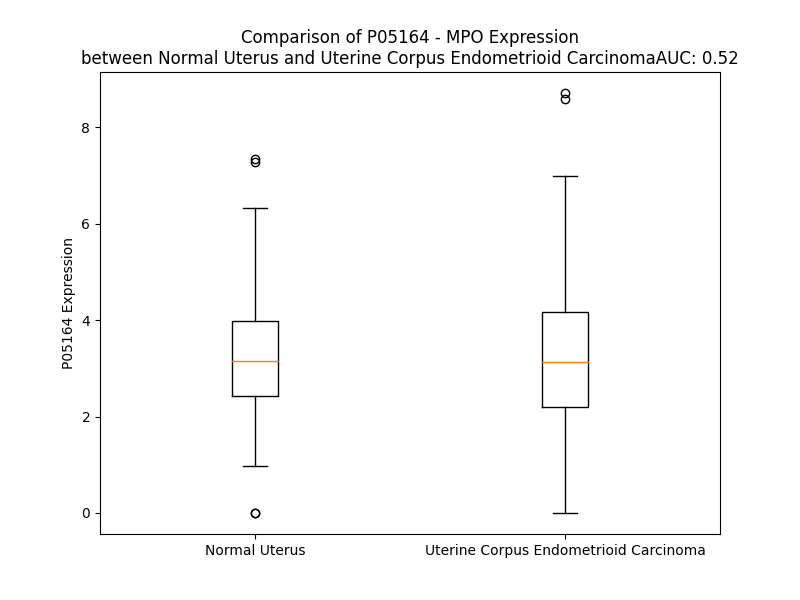

# Detailed Data for P05164

## Introduction to the Detailed Summary

### How to Interpret the Results

- **Summary & Metrics**: This section provides a quick reference to essential protein attributes, including expression changes, family classification, and biomarker applications. Regulation status (upregulated/downregulated) indicates the protein's behavior in a disease context. Some information comes from the original excel file with the proteins selected from literature, while others are derived from the analyses.
- **Expression Comparison**: A visual representation comparing protein expression between normal and disease states. It highlights significant changes in expression levels that might indicate diagnostic or therapeutic relevance. This is data coming from transcriptomics experiments and could not translate similarly to protein levels.
- **Isoform Alignment**: An interactive view of isoform alignments, revealing structural and functional differences between variants of the protein.
- **Interactors & Homologs**: Tables listing known interaction partners and homologous proteins, the more interactors and homologs, the more complex the protein is to design an antibody for.
- **Biological Assemblies**: Information about the structural arrangement of the protein in different assemblies, providing insights into its functional state but also the complexity of the protein to develop antibodies.
- **Combined Per-Residue Information**: A detailed table summarizing residue-level data. This includes predictions for epitope regions, aggregation tendencies, and modifications that might impact the protein's function. Each row corresponds to a residue in the protein, providing insights into specific sites that may be important for research or drug development.
## Summary & Metrics

- **UniProt Accession**: P05164
- **Gene Name**: MPO
- **Protein Name**: Myeloperoxidase
- **Swiss Prot**: PERM_HUMAN
- **Family**: enzyme
- **Biomarker Application**: diagnosis,disease progression,efficacy,unspecified application
- **Number of Isoforms**: 3
- **Regulation**: -1
- **(transcriptomics) AUC**: 0.63
- **(transcriptomics) Fold Change**: 1.32
- **(transcriptomics) Regulation**: Upregulated
- **Discotope Epitope Count**: 146
- **Max n_uniprots (Homo)**: 10
- **Max n_uniprots (Hetero)**: 4

## Expression Comparison

## Isoform Alignment

<pre style='font-size:14px; font-family:monospace;'>P05164-1 MGVPFFSSLRCMVDLGPCWAGGLTAEMKLLLALAGLLAILATPQPSEGAAPAVLGEVDTSLVLSSMEEAKQLVDKAYKERRESIKQRLRSGSASPMELLSYFKQPVAATRTAVRAADYLHVALDLLERKLRSLWRRPFNVTDVLTPAQLNVLSKSSGCAYQDVGVTCPEQDKYRTITGMCNNR--------------------------------RSPTLGASNRAFVRWLPAEYEDGFSLPYGWTPGVKRNGFPVALARAVSNEIVRFPTDQLTPDQERSLMFMQWGQLLDHDLDFTPEPAARASFVTGVNCETSCVQQPPCFPLKIPPNDPRIKNQADCIPFFRSCPACPGSNITIRNQINALTSFVDASMVYGSEEPLARNLRNMSNQLGLLAVNQRFQDNGRALLPFDNLHDDPCLLTNRSARIPCFLAGDTRSSEMPELTSMHTLLLREHNRLATELKSLNPRWDGERLYQEARKIVGAMVQIITYRDYLPLVLGPTAMRKYLPTYRSYNDSVDPRIANVFTNAFRYGHTLIQPFMFRLDNRYQPMEPNPRVPLSRVFFASWRVVLEGGIDPILRGLMATPAKLNRQNQIAVDEIRERLFEQVMRIGLDLPALNMQRSRDHGLPGYNAWRRFCGLPQPETVGQLGTVLRNLKLARKLMEQYGTPNNIDIWMGGVSEPLKRKGRVGPLLACIIGTQFRKLRDGDRFWWENEGVFSMQQRQALAQISLPRIICDNTGITTVSKNNIFMSNSYPRDFVNCSTLPALNLASWREAS
P05164-2 -----------------------------------------------------------------------------------------------MELLSYFKQPVAATRTAVRAADYLHVALDLLERKLRSLWRRPFNVTDVLTPAQLNVLSKSSGCAYQDVGVTCPEQDKYRTITGMCNNR--------------------------------RSPTLGASNRAFVRWLPAEYEDGFSLPYGWTPGVKRNGFPVALARAVSNEIVRFPTDQLTPDQERSLMFMQWGQLLDHDLDFTPEPAARASFVTGVNCETSCVQQPPCFPLKIPPNDPRIKNQADCIPFFRSCPACPGSNITIRNQINALTSFVDASMVYGSEEPLARNLRNMSNQLGLLAVNQRFQDNGRALLPFDNLHDDPCLLTNRSARIPCFLAGDTRSSEMPELTSMHTLLLREHNRLATELKSLNPRWDGERLYQEARKIVGAMVQIITYRDYLPLVLGPTAMRKYLPTYRSYNDSVDPRIANVFTNAFRYGHTLIQPFMFRLDNRYQPMEPNPRVPLSRVFFASWRVVLEGGIDPILRGLMATPAKLNRQNQIAVDEIRERLFEQVMRIGLDLPALNMQRSRDHGLPGYNAWRRFCGLPQPETVGQLGTVLRNLKLARKLMEQYGTPNNIDIWMGGVSEPLKRKGRVGPLLACIIGTQFRKLRDGDRFWWENEGVFSMQQRQALAQISLPRIICDNTGITTVSKNNIFMSNSYPRDFVNCSTLPALNLASWREAS
P05164-3 MGVPFFSSLRCMVDLGPCWAGGLTAEMKLLLALAGLLAILATPQPSEGAAPAVLGEVDTSLVLSSMEEAKQLVDKAYKERRESIKQRLRSGSASPMELLSYFKQPVAATRTAVRAADYLHVALDLLERKLRSLWRRPFNVTDVLTPAQLNVLSKSSGCAYQDVGVTCPEQDKYRTITGMCNNRCGWLGVAAGTGLREASRTPQASRCQRPVLPCRRSPTLGASNRAFVRWLPAEYEDGFSLPYGWTPGVKRNGFPVALARAVSNEIVRFPTDQLTPDQERSLMFMQWGQLLDHDLDFTPEPAARASFVTGVNCETSCVQQPPCFPLKIPPNDPRIKNQADCIPFFRSCPACPGSNITIRNQINALTSFVDASMVYGSEEPLARNLRNMSNQLGLLAVNQRFQDNGRALLPFDNLHDDPCLLTNRSARIPCFLAGDTRSSEMPELTSMHTLLLREHNRLATELKSLNPRWDGERLYQEARKIVGAMVQIITYRDYLPLVLGPTAMRKYLPTYRSYNDSVDPRIANVFTNAFRYGHTLIQPFMFRLDNRYQPMEPNPRVPLSRVFFASWRVVLEGGIDPILRGLMATPAKLNRQNQIAVDEIRERLFEQVMRIGLDLPALNMQRSRDHGLPGYNAWRRFCGLPQPETVGQLGTVLRNLKLARKLMEQYGTPNNIDIWMGGVSEPLKRKGRVGPLLACIIGTQFRKLRDGDRFWWENEGVFSMQQRQALAQISLPRIICDNTGITTVSKNNIFMSNSYPRDFVNCSTLPALNLASWREAS
</pre>

## Interactors

| preferredName_A   | preferredName_B   |   score |
|:------------------|:------------------|--------:|
| MPO               | AZU1              |   0.999 |
| MPO               | PRTN3             |   0.999 |
| MPO               | ELANE             |   0.999 |
| MPO               | CTSG              |   0.999 |
| MPO               | LTF               |   0.998 |
| MPO               | BPI               |   0.995 |
| MPO               | CAMP              |   0.982 |
| MPO               | MMP9              |   0.969 |
| MPO               | CP                |   0.965 |
| MPO               | CTSS              |   0.964 |
| MPO               | RUNX1             |   0.947 |
| MPO               | CES1              |   0.939 |
| MPO               | CEACAM8           |   0.938 |
| MPO               | APOA1             |   0.924 |
| MPO               | RNASE3            |   0.923 |
| MPO               | LYZ               |   0.918 |
| MPO               | NAT2              |   0.91  |
| MPO               | NAT1              |   0.909 |

## Homologs

| uniprot_id   | gene_id   |
|:-------------|:----------|
| A1KZ92       | PXDNL     |
| J3QSD8       | LPO       |
| Q92626       | PXDN      |
| E9PFM6       | TPO       |
| P11678       | EPX       |

## Biological Assemblies

|   Unnamed: 0 |   assembly |   n_uniprots | composition   | crystal_id   |
|-------------:|-----------:|-------------:|:--------------|:-------------|
|            0 |          1 |            6 | Homo          | 1d2v         |
|            1 |          2 |            3 | Homo          | 1d2v         |
|            2 |          3 |            3 | Homo          | 1d2v         |
|            0 |          1 |            6 | Homo          | 3zs0         |
|            0 |          1 |            3 | Homo          | 4c1m         |
|            1 |          2 |            3 | Homo          | 4c1m         |
|            0 |          1 |            6 | Homo          | 4dl1         |
|            1 |          2 |            6 | Homo          | 4dl1         |
|            2 |          3 |            6 | Homo          | 4dl1         |
|            3 |          4 |            7 | Homo          | 4dl1         |
|            4 |          5 |            3 | Homo          | 4dl1         |
|            5 |          6 |            3 | Homo          | 4dl1         |
|            6 |          7 |            3 | Homo          | 4dl1         |
|            7 |          8 |            3 | Homo          | 4dl1         |
|            8 |          9 |            3 | Homo          | 4dl1         |
|            9 |         10 |            3 | Homo          | 4dl1         |
|           10 |         11 |            3 | Homo          | 4dl1         |
|           11 |         12 |            4 | Homo          | 4dl1         |
|            0 |          1 |            4 | Hetero        | 4ejx         |
|            0 |          1 |            3 | Hetero        | 6azp         |
|            0 |          1 |            3 | Homo          | 3zs1         |
|            1 |          2 |            3 | Homo          | 3zs1         |
|            0 |          1 |            3 | Homo          | 3f9p         |
|            1 |          2 |            3 | Homo          | 3f9p         |
|            0 |          1 |            8 | Homo          | 7oih         |
|            1 |          2 |            8 | Homo          | 7oih         |
|            2 |          3 |            8 | Homo          | 7oih         |
|            3 |          4 |            9 | Homo          | 7oih         |
|            0 |          1 |            6 | Homo          | 1d7w         |
|            1 |          2 |            3 | Homo          | 1d7w         |
|            2 |          3 |            3 | Homo          | 1d7w         |
|            0 |          1 |            2 | Homo          | 6bmt         |
|            0 |          1 |            3 | Homo          | 5fiw         |
|            1 |          2 |            3 | Homo          | 5fiw         |
|            0 |          1 |            6 | Homo          | 1dnw         |
|            1 |          2 |            3 | Homo          | 1dnw         |
|            2 |          3 |            3 | Homo          | 1dnw         |
|            0 |          1 |           10 | Homo          | 1myp         |
|            0 |          1 |            6 | Homo          | 1mhl         |
|            1 |          2 |            3 | Homo          | 1mhl         |
|            2 |          3 |            3 | Homo          | 1mhl         |
|            0 |          1 |            6 | Homo          | 1d5l         |
|            1 |          2 |            3 | Homo          | 1d5l         |
|            2 |          3 |            3 | Homo          | 1d5l         |
|            0 |          1 |            4 | Hetero        | 5uzu         |
|            0 |          1 |            6 | Homo          | 1dnu         |
|            1 |          2 |            3 | Homo          | 1dnu         |
|            2 |          3 |            3 | Homo          | 1dnu         |
|            0 |          1 |            4 | Homo          | 5mfa         |
|            0 |          1 |            6 | Homo          | 1cxp         |
|            1 |          2 |            3 | Homo          | 1cxp         |
|            2 |          3 |            3 | Homo          | 1cxp         |

## Combined Per-Residue Information

|   res | aa   |   epitope_score | epitope   |   relative_surface_accessibility |   modeling_confidence |   Aggregation | modification                  | glycosylation                   |
|------:|:-----|----------------:|:----------|---------------------------------:|----------------------:|--------------:|:------------------------------|:--------------------------------|
|     1 | M    |         0.16889 | True      |                          1.36385 |                 32.28 |         0     | N/A                           | N/A                             |
|     2 | G    |         0.18532 | True      |                          0.90173 |                 32.54 |         0     | N/A                           | N/A                             |
|     3 | V    |         0.11761 | False     |                          0.88529 |                 22.45 |         0     | N/A                           | N/A                             |
|     4 | P    |         0.13724 | True      |                          0.9446  |                 35.88 |         0     | N/A                           | N/A                             |
|     5 | F    |         0.10438 | False     |                          0.86963 |                 24.95 |         0.334 | N/A                           | N/A                             |
|     6 | F    |         0.19089 | True      |                          0.96395 |                 28.96 |         0.334 | N/A                           | N/A                             |
|     7 | S    |         0.11266 | False     |                          0.82039 |                 21.3  |         0.334 | N/A                           | N/A                             |
|     8 | S    |         0.15591 | True      |                          0.73799 |                 26.4  |         0.334 | N/A                           | N/A                             |
|     9 | L    |         0.12049 | True      |                          1.02301 |                 26.28 |         0.334 | N/A                           | N/A                             |
|    10 | R    |         0.1422  | True      |                          0.91344 |                 23.77 |         0     | N/A                           | N/A                             |
|    11 | C    |         0.10777 | False     |                          0.93136 |                 26.64 |         0     | N/A                           | N/A                             |
|    12 | M    |         0.15866 | True      |                          0.94472 |                 22.8  |         0     | N/A                           | N/A                             |
|    13 | V    |         0.20693 | True      |                          0.87203 |                 25.5  |         0     | N/A                           | N/A                             |
|    14 | D    |         0.14202 | True      |                          0.7083  |                 25.24 |         0     | N/A                           | N/A                             |
|    15 | L    |         0.15333 | True      |                          1.07006 |                 25.92 |         0     | N/A                           | N/A                             |
|    16 | G    |         0.15097 | True      |                          0.87298 |                 25.71 |         0     | N/A                           | N/A                             |
|    17 | P    |         0.06952 | False     |                          0.90153 |                 27.48 |         0     | N/A                           | N/A                             |
|    18 | C    |         0.09956 | False     |                          1.01804 |                 25.04 |         0     | N/A                           | N/A                             |
|    19 | W    |         0.19748 | True      |                          1.05259 |                 21.78 |         0     | N/A                           | N/A                             |
|    20 | A    |         0.12811 | True      |                          1.0293  |                 24.3  |         0     | N/A                           | N/A                             |
|    21 | G    |         0.20363 | True      |                          0.893   |                 29.11 |         0     | N/A                           | N/A                             |
|    22 | G    |         0.1591  | True      |                          0.95905 |                 31.37 |         0.012 | N/A                           | N/A                             |
|    23 | L    |         0.10468 | False     |                          0.73882 |                 35.98 |         0.889 | N/A                           | N/A                             |
|    24 | T    |         0.14613 | True      |                          0.72799 |                 43.51 |         1.157 | N/A                           | N/A                             |
|    25 | A    |         0.09394 | False     |                          0.78597 |                 44.56 |         1.607 | N/A                           | N/A                             |
|    26 | E    |         0.0926  | False     |                          0.76244 |                 47.74 |         2.142 | N/A                           | N/A                             |
|    27 | M    |         0.07068 | False     |                          0.40142 |                 47.03 |         2.142 | N/A                           | N/A                             |
|    28 | K    |         0.1553  | True      |                          0.74549 |                 47.45 |         2.142 | N/A                           | N/A                             |
|    29 | L    |         0.12407 | True      |                          0.7814  |                 53.26 |        70.962 | N/A                           | N/A                             |
|    30 | L    |         0.13277 | True      |                          0.73611 |                 55.32 |        83.512 | N/A                           | N/A                             |
|    31 | L    |         0.11847 | False     |                          0.67984 |                 59.39 |        89.771 | N/A                           | N/A                             |
|    32 | A    |         0.09452 | False     |                          0.53304 |                 53.99 |        90.912 | N/A                           | N/A                             |
|    33 | L    |         0.11728 | False     |                          0.62585 |                 52.96 |        92.265 | N/A                           | N/A                             |
|    34 | A    |         0.03493 | False     |                          0.51283 |                 53.25 |        92.202 | N/A                           | N/A                             |
|    35 | G    |         0.0711  | False     |                          0.3671  |                 43.65 |        92.196 | N/A                           | N/A                             |
|    36 | L    |         0.13168 | True      |                          0.7664  |                 42.77 |        95.099 | N/A                           | N/A                             |
|    37 | L    |         0.10484 | False     |                          0.75113 |                 43.14 |        95.19  | N/A                           | N/A                             |
|    38 | A    |         0.05227 | False     |                          0.57138 |                 40.16 |        94.309 | N/A                           | N/A                             |
|    39 | I    |         0.12169 | True      |                          0.788   |                 39.89 |        93.564 | N/A                           | N/A                             |
|    40 | L    |         0.15732 | True      |                          0.97301 |                 38.44 |        85.362 | N/A                           | N/A                             |
|    41 | A    |         0.10784 | False     |                          0.70307 |                 36.77 |        39.063 | N/A                           | N/A                             |
|    42 | T    |         0.12487 | True      |                          0.71489 |                 33.28 |         0.27  | N/A                           | N/A                             |
|    43 | P    |         0.15681 | True      |                          0.93898 |                 36.48 |         0.118 | N/A                           | N/A                             |
|    44 | Q    |         0.11755 | False     |                          0.82696 |                 31.1  |         0     | N/A                           | N/A                             |
|    45 | P    |         0.13408 | True      |                          0.94922 |                 31.41 |         0     | N/A                           | N/A                             |
|    46 | S    |         0.1302  | True      |                          0.77477 |                 34.44 |         0     | N/A                           | N/A                             |
|    47 | E    |         0.15583 | True      |                          0.86925 |                 34.28 |         0     | N/A                           | N/A                             |
|    48 | G    |         0.15239 | True      |                          0.90979 |                 31.92 |         0     | N/A                           | N/A                             |
|    49 | A    |         0.17194 | True      |                          0.91623 |                 32.5  |         0     | N/A                           | N/A                             |
|    50 | A    |         0.14288 | True      |                          0.75387 |                 31.55 |         0     | N/A                           | N/A                             |
|    51 | P    |         0.10454 | False     |                          0.90271 |                 35.58 |         0     | N/A                           | N/A                             |
|    52 | A    |         0.12166 | True      |                          0.77616 |                 36.91 |         0     | N/A                           | N/A                             |
|    53 | V    |         0.15503 | True      |                          0.95532 |                 40.16 |         0     | N/A                           | N/A                             |
|    54 | L    |         0.15347 | True      |                          0.71845 |                 52.31 |         0     | N/A                           | N/A                             |
|    55 | G    |         0.07588 | False     |                          0.59614 |                 61.75 |         0     | N/A                           | N/A                             |
|    56 | E    |         0.12713 | True      |                          0.80102 |                 75.26 |         0     | N/A                           | N/A                             |
|    57 | V    |         0.01463 | False     |                          0.07301 |                 85.76 |         0     | N/A                           | N/A                             |
|    58 | D    |         0.10211 | False     |                          0.52122 |                 90.17 |         0     | N/A                           | N/A                             |
|    59 | T    |         0.10298 | False     |                          0.43636 |                 92.34 |         0.569 | N/A                           | N/A                             |
|    60 | S    |         0.09416 | False     |                          0.51019 |                 93.29 |         0.569 | N/A                           | N/A                             |
|    61 | L    |         0.0895  | False     |                          0.29265 |                 94.28 |         0.569 | N/A                           | N/A                             |
|    62 | V    |         0.00278 | False     |                          0.00095 |                 94.1  |         0.569 | N/A                           | N/A                             |
|    63 | L    |         0.10295 | False     |                          0.5241  |                 95.7  |         0.569 | N/A                           | N/A                             |
|    64 | S    |         0.11794 | False     |                          0.43058 |                 96.51 |         0     | N/A                           | N/A                             |
|    65 | S    |         0.00414 | False     |                          0       |                 95.94 |         0     | N/A                           | N/A                             |
|    66 | M    |         0.022   | False     |                          0.02373 |                 96.26 |         0     | N/A                           | N/A                             |
|    67 | E    |         0.0856  | False     |                          0.45196 |                 97.67 |         0     | N/A                           | N/A                             |
|    68 | E    |         0.06507 | False     |                          0.33013 |                 96.42 |         0     | N/A                           | N/A                             |
|    69 | A    |         0.00207 | False     |                          0       |                 94.42 |         0     | N/A                           | N/A                             |
|    70 | K    |         0.12392 | True      |                          0.2808  |                 96.04 |         0     | N/A                           | N/A                             |
|    71 | Q    |         0.11463 | False     |                          0.55176 |                 95.53 |         0     | N/A                           | N/A                             |
|    72 | L    |         0.08724 | False     |                          0.26787 |                 90.7  |         0     | N/A                           | N/A                             |
|    73 | V    |         0.00355 | False     |                          0       |                 90.4  |         0     | N/A                           | N/A                             |
|    74 | D    |         0.08691 | False     |                          0.30053 |                 92.45 |         0     | N/A                           | N/A                             |
|    75 | K    |         0.1897  | True      |                          0.59265 |                 90    |         0     | N/A                           | N/A                             |
|    76 | A    |         0.02897 | False     |                          0.13743 |                 83.95 |         0     | N/A                           | N/A                             |
|    77 | Y    |         0.02746 | False     |                          0.05929 |                 86.24 |         0     | N/A                           | N/A                             |
|    78 | K    |         0.16493 | True      |                          0.66905 |                 86.15 |         0     | N/A                           | N/A                             |
|    79 | E    |         0.06616 | False     |                          0.47357 |                 83.97 |         0     | N/A                           | N/A                             |
|    80 | R    |         0.13098 | True      |                          0.13042 |                 76.71 |         0     | N/A                           | N/A                             |
|    81 | R    |         0.10382 | False     |                          0.47532 |                 78.32 |         0     | N/A                           | N/A                             |
|    82 | E    |         0.16291 | True      |                          0.41172 |                 81.97 |         0     | N/A                           | N/A                             |
|    83 | S    |         0.08188 | False     |                          0.29352 |                 76.23 |         0     | N/A                           | N/A                             |
|    84 | I    |         0.08203 | False     |                          0.104   |                 70.43 |         0     | N/A                           | N/A                             |
|    85 | K    |         0.13149 | True      |                          0.35663 |                 71.03 |         0     | N/A                           | N/A                             |
|    86 | Q    |         0.24716 | True      |                          0.65637 |                 73.13 |         0     | N/A                           | N/A                             |
|    87 | R    |         0.08722 | False     |                          0.36615 |                 67.69 |         0     | N/A                           | N/A                             |
|    88 | L    |         0.12302 | True      |                          0.24336 |                 61.57 |         0     | N/A                           | N/A                             |
|    89 | R    |         0.21842 | True      |                          0.83906 |                 67.13 |         0     | N/A                           | N/A                             |
|    90 | S    |         0.19319 | True      |                          0.60294 |                 72.2  |         0     | N/A                           | N/A                             |
|    91 | G    |         0.16915 | True      |                          0.69135 |                 60.99 |         0     | N/A                           | N/A                             |
|    92 | S    |         0.12557 | True      |                          0.55455 |                 63.26 |         0     | N/A                           | N/A                             |
|    93 | A    |         0.08625 | False     |                          0.14504 |                 62.11 |         0     | N/A                           | N/A                             |
|    94 | S    |         0.10486 | False     |                          0.22467 |                 60.85 |         0     | N/A                           | N/A                             |
|    95 | P    |         0.08529 | False     |                          0.34097 |                 56.07 |         0     | N/A                           | N/A                             |
|    96 | M    |         0.05656 | False     |                          0.02866 |                 58.67 |         0     | N/A                           | N/A                             |
|    97 | E    |         0.05429 | False     |                          0.00894 |                 62.62 |         0     | N/A                           | N/A                             |
|    98 | L    |         0.08362 | False     |                          0.03215 |                 59.93 |        20.498 | N/A                           | N/A                             |
|    99 | L    |         0.08178 | False     |                          0.0428  |                 62.71 |        20.498 | N/A                           | N/A                             |
|   100 | S    |         0.06679 | False     |                          0.07977 |                 68.54 |        20.498 | N/A                           | N/A                             |
|   101 | Y    |         0.1101  | False     |                          0.22329 |                 65.75 |        20.498 | N/A                           | N/A                             |
|   102 | F    |         0.06263 | False     |                          0.05393 |                 70.73 |        20.498 | N/A                           | N/A                             |
|   103 | K    |         0.03621 | False     |                          0.3089  |                 79.12 |         0     | N/A                           | N/A                             |
|   104 | Q    |         0.04248 | False     |                          0.21946 |                 83.26 |         0     | N/A                           | N/A                             |
|   105 | P    |         0.01194 | False     |                          0.03808 |                 86.04 |         0     | N/A                           | N/A                             |
|   106 | V    |         0.12562 | True      |                          0.37104 |                 85.56 |         0     | N/A                           | N/A                             |
|   107 | A    |         0.13499 | True      |                          0.47969 |                 88.47 |         0     | N/A                           | N/A                             |
|   108 | A    |         0.08881 | False     |                          0.50249 |                 92.25 |         0     | N/A                           | N/A                             |
|   109 | T    |         0.01361 | False     |                          0.05051 |                 93.22 |         0     | N/A                           | N/A                             |
|   110 | R    |         0.05066 | False     |                          0.46425 |                 92.16 |         0     | N/A                           | N/A                             |
|   111 | T    |         0.08407 | False     |                          0.67359 |                 93.13 |         0     | N/A                           | N/A                             |
|   112 | A    |         0.01264 | False     |                          0.10098 |                 93.63 |         0     | N/A                           | N/A                             |
|   113 | V    |         0.00222 | False     |                          0.00095 |                 94.04 |         0     | N/A                           | N/A                             |
|   114 | R    |         0.04047 | False     |                          0.31299 |                 93.7  |         0     | N/A                           | N/A                             |
|   115 | A    |         0.00943 | False     |                          0.0871  |                 94.45 |         0     | N/A                           | N/A                             |
|   116 | A    |         0.00078 | False     |                          0       |                 93.73 |         0     | N/A                           | N/A                             |
|   117 | D    |         0.00539 | False     |                          0.03538 |                 92.26 |         0     | N/A                           | N/A                             |
|   118 | Y    |         0.03045 | False     |                          0.11433 |                 94.07 |         0.131 | N/A                           | N/A                             |
|   119 | L    |         0.00136 | False     |                          0.00082 |                 92.95 |         0.131 | N/A                           | N/A                             |
|   120 | H    |         0.00982 | False     |                          0.14414 |                 90.27 |         0.131 | N/A                           | N/A                             |
|   121 | V    |         0.0195  | False     |                          0.12567 |                 89.84 |         0.131 | N/A                           | N/A                             |
|   122 | A    |         0.00182 | False     |                          0       |                 92.96 |         0.131 | N/A                           | N/A                             |
|   123 | L    |         0.0288  | False     |                          0.08114 |                 91.06 |         0.131 | N/A                           | N/A                             |
|   124 | D    |         0.01584 | False     |                          0.26377 |                 87.71 |         0     | N/A                           | N/A                             |
|   125 | L    |         0.02348 | False     |                          0.10118 |                 90.93 |         0     | N/A                           | N/A                             |
|   126 | L    |         0.00302 | False     |                          0       |                 92.3  |         0     | N/A                           | N/A                             |
|   127 | E    |         0.04107 | False     |                          0.24231 |                 89.35 |         0     | N/A                           | N/A                             |
|   128 | R    |         0.06116 | False     |                          0.41598 |                 88.15 |         0     | N/A                           | N/A                             |
|   129 | K    |         0.09054 | False     |                          0.35939 |                 91.52 |         0     | N/A                           | N/A                             |
|   130 | L    |         0.0205  | False     |                          0.0033  |                 90.63 |         0     | N/A                           | N/A                             |
|   131 | R    |         0.18022 | True      |                          0.56435 |                 86.36 |         0     | N/A                           | N/A                             |
|   132 | S    |         0.13792 | True      |                          0.69757 |                 83.3  |         0     | N/A                           | N/A                             |
|   133 | L    |         0.1322  | True      |                          0.76935 |                 83.84 |         0     | N/A                           | N/A                             |
|   134 | W    |         0.05477 | False     |                          0.15023 |                 80.86 |         0     | N/A                           | N/A                             |
|   135 | R    |         0.15217 | True      |                          0.91587 |                 75.3  |         0     | N/A                           | N/A                             |
|   136 | R    |         0.21008 | True      |                          0.8211  |                 79.6  |         0     | N/A                           | N/A                             |
|   137 | P    |         0.14218 | True      |                          1.05488 |                 74.42 |         0     | N/A                           | N/A                             |
|   138 | F    |         0.08391 | False     |                          0.19039 |                 82.36 |         0     | N/A                           | N/A                             |
|   139 | N    |         0.08492 | False     |                          0.06714 |                 81.38 |         0     | N/A                           | N-linked (GlcNAc...) asparagine |
|   140 | V    |         0.05468 | False     |                          0.0891  |                 85.46 |         0     | N/A                           | N/A                             |
|   141 | T    |         0.02098 | False     |                          0.05386 |                 85.66 |         0     | N/A                           | N/A                             |
|   142 | D    |         0.09487 | False     |                          0.65936 |                 85.97 |         0     | N/A                           | N/A                             |
|   143 | V    |         0.05763 | False     |                          0.2576  |                 88.7  |         0     | N/A                           | N/A                             |
|   144 | L    |         0.01943 | False     |                          0.07223 |                 90.23 |         0     | N/A                           | N/A                             |
|   145 | T    |         0.10056 | False     |                          0.43701 |                 91.04 |         0     | N/A                           | N/A                             |
|   146 | P    |         0.05569 | False     |                          0.83519 |                 89    |         0     | N/A                           | N/A                             |
|   147 | A    |         0.0866  | False     |                          0.65281 |                 90.97 |         0     | N/A                           | N/A                             |
|   148 | Q    |         0.05084 | False     |                          0.04836 |                 92.97 |         0     | N/A                           | N/A                             |
|   149 | L    |         0.03448 | False     |                          0.20609 |                 90.62 |         0     | N/A                           | N/A                             |
|   150 | N    |         0.04771 | False     |                          0.44411 |                 89.88 |         0     | N/A                           | N/A                             |
|   151 | V    |         0.06582 | False     |                          0.33322 |                 91.91 |         0     | N/A                           | N/A                             |
|   152 | L    |         0.00356 | False     |                          0.0033  |                 92.88 |         0     | N/A                           | N/A                             |
|   153 | S    |         0.03067 | False     |                          0.08213 |                 91.9  |         0     | N/A                           | N/A                             |
|   154 | K    |         0.14825 | True      |                          0.59812 |                 92.17 |         0     | N/A                           | N/A                             |
|   155 | S    |         0.0581  | False     |                          0.28478 |                 93.5  |         0     | N/A                           | N/A                             |
|   156 | S    |         0.04395 | False     |                          0.04183 |                 94.33 |         0     | N/A                           | N/A                             |
|   157 | G    |         0.0947  | False     |                          0.23348 |                 93.03 |         0     | N/A                           | N/A                             |
|   158 | C    |         0.00936 | False     |                          0.0047  |                 92.74 |         0     | N/A                           | N/A                             |
|   159 | A    |         0.05627 | False     |                          0.25182 |                 89.5  |         0     | N/A                           | N/A                             |
|   160 | Y    |         0.22439 | True      |                          0.76424 |                 85.68 |         0     | N/A                           | N/A                             |
|   161 | Q    |         0.07777 | False     |                          0.1498  |                 82.59 |         0     | N/A                           | N/A                             |
|   162 | D    |         0.14712 | True      |                          0.53552 |                 78.08 |         0     | N/A                           | N/A                             |
|   163 | V    |         0.25297 | True      |                          0.65398 |                 80.42 |         0     | N/A                           | N/A                             |
|   164 | G    |         0.21774 | True      |                          0.86782 |                 82.68 |         0     | N/A                           | N/A                             |
|   165 | V    |         0.14896 | True      |                          0.37934 |                 88.64 |         0     | N/A                           | N/A                             |
|   166 | T    |         0.22641 | True      |                          0.93695 |                 89.87 |         0     | N/A                           | N/A                             |
|   167 | C    |         0.09941 | False     |                          0.20449 |                 92.95 |         0     | N/A                           | N/A                             |
|   168 | P    |         0.17562 | True      |                          0.60554 |                 91.12 |         0     | N/A                           | N/A                             |
|   169 | E    |         0.14338 | True      |                          0.79352 |                 85.37 |         0     | N/A                           | N/A                             |
|   170 | Q    |         0.17423 | True      |                          0.86081 |                 82.49 |         0     | N/A                           | N/A                             |
|   171 | D    |         0.12986 | True      |                          0.17866 |                 89.23 |         0     | N/A                           | N/A                             |
|   172 | K    |         0.16289 | True      |                          0.4795  |                 91.58 |         0     | N/A                           | N/A                             |
|   173 | Y    |         0.11106 | False     |                          0.21426 |                 96.3  |         0     | N/A                           | N/A                             |
|   174 | R    |         0.03609 | False     |                          0.10301 |                 96.44 |         0     | N/A                           | N/A                             |
|   175 | T    |         0.09285 | False     |                          0.34248 |                 96.91 |         0     | N/A                           | N/A                             |
|   176 | I    |         0.05285 | False     |                          0.04942 |                 97.88 |         0     | N/A                           | N/A                             |
|   177 | T    |         0.16687 | True      |                          0.23042 |                 96.6  |         0     | N/A                           | N/A                             |
|   178 | G    |         0.00387 | False     |                          0.00322 |                 96.74 |         0     | N/A                           | N/A                             |
|   179 | M    |         0.08812 | False     |                          0.21742 |                 95.2  |         0     | N/A                           | N/A                             |
|   180 | C    |         0.0327  | False     |                          0.03839 |                 95.44 |         0     | N/A                           | N/A                             |
|   181 | N    |         0.00465 | False     |                          0.00332 |                 96.1  |         0     | N/A                           | N/A                             |
|   182 | N    |         0.00517 | False     |                          0.00074 |                 95.75 |         0     | N/A                           | N/A                             |
|   183 | R    |         0.22733 | True      |                          0.34501 |                 93.58 |         0     | N/A                           | N/A                             |
|   184 | R    |         0.22025 | True      |                          0.60169 |                 93.37 |         0     | N/A                           | N/A                             |
|   185 | S    |         0.06775 | False     |                          0.33046 |                 93.65 |         0     | N/A                           | N/A                             |
|   186 | P    |         0.05113 | False     |                          0.22963 |                 93.97 |         0     | N/A                           | N/A                             |
|   187 | T    |         0.05976 | False     |                          0.26807 |                 93.59 |         0     | N/A                           | N/A                             |
|   188 | L    |         0.05325 | False     |                          0.20197 |                 93.99 |         0     | N/A                           | N/A                             |
|   189 | G    |         0.00255 | False     |                          0.00322 |                 95.52 |         0     | N/A                           | N/A                             |
|   190 | A    |         0.01845 | False     |                          0.01447 |                 96.13 |         0     | N/A                           | N/A                             |
|   191 | S    |         0.02656 | False     |                          0.06174 |                 96.65 |         0     | N/A                           | N/A                             |
|   192 | N    |         0.0172  | False     |                          0.1098  |                 95.44 |         0     | N/A                           | N/A                             |
|   193 | R    |         0.08685 | False     |                          0.18094 |                 93.65 |         0     | N/A                           | N/A                             |
|   194 | A    |         0.01107 | False     |                          0.24075 |                 94.7  |         0     | N/A                           | N/A                             |
|   195 | F    |         0.01717 | False     |                          0.03506 |                 96.07 |         0     | N/A                           | N/A                             |
|   196 | V    |         0.0377  | False     |                          0.11971 |                 95.71 |         0     | N/A                           | N/A                             |
|   197 | R    |         0.07297 | False     |                          0.21981 |                 94.96 |         0     | N/A                           | N/A                             |
|   198 | W    |         0.07017 | False     |                          0.19184 |                 97.74 |         0     | N/A                           | N/A                             |
|   199 | L    |         0.05085 | False     |                          0.23431 |                 97.93 |         0     | N/A                           | N/A                             |
|   200 | P    |         0.06329 | False     |                          0.81618 |                 95.32 |         0     | N/A                           | N/A                             |
|   201 | A    |         0.03126 | False     |                          0.19959 |                 95.08 |         0     | N/A                           | N/A                             |
|   202 | E    |         0.05589 | False     |                          0.33208 |                 95.71 |         0     | N/A                           | N/A                             |
|   203 | Y    |         0.02028 | False     |                          0.03023 |                 95.14 |         0     | N/A                           | N/A                             |
|   204 | E    |         0.0713  | False     |                          0.18708 |                 94.33 |         0     | N/A                           | N/A                             |
|   205 | D    |         0.06426 | False     |                          0.3252  |                 89.58 |         0     | N/A                           | N/A                             |
|   206 | G    |         0.04701 | False     |                          0.39443 |                 88.95 |         0     | N/A                           | N/A                             |
|   207 | F    |         0.12324 | True      |                          0.29953 |                 86.94 |         0     | N/A                           | N/A                             |
|   208 | S    |         0.05548 | False     |                          0.25231 |                 89.26 |         0     | N/A                           | N/A                             |
|   209 | L    |         0.04862 | False     |                          0.29842 |                 92.3  |         0     | N/A                           | N/A                             |
|   210 | P    |         0.00168 | False     |                          0       |                 96.02 |         0     | N/A                           | N/A                             |
|   211 | Y    |         0.0714  | False     |                          0.16694 |                 96.81 |         0     | N/A                           | N/A                             |
|   212 | G    |         0.02315 | False     |                          0.29419 |                 94.51 |         0     | N/A                           | N/A                             |
|   213 | W    |         0.05839 | False     |                          0.10466 |                 94.1  |         0     | N/A                           | N/A                             |
|   214 | T    |         0.07505 | False     |                          0.39869 |                 93.57 |         0     | N/A                           | N/A                             |
|   215 | P    |         0.19316 | True      |                          0.77279 |                 91.34 |         0     | N/A                           | N/A                             |
|   216 | G    |         0.18306 | True      |                          0.89087 |                 93.2  |         0     | N/A                           | N/A                             |
|   217 | V    |         0.09    | False     |                          0.39147 |                 94.5  |         0     | N/A                           | N/A                             |
|   218 | K    |         0.20806 | True      |                          0.6044  |                 96.99 |         0     | N/A                           | N/A                             |
|   219 | R    |         0.05798 | False     |                          0.0513  |                 96.73 |         0     | N/A                           | N/A                             |
|   220 | N    |         0.09004 | False     |                          0.54676 |                 96.92 |         0     | N/A                           | N/A                             |
|   221 | G    |         0.2515  | True      |                          0.67562 |                 97.26 |         0     | N/A                           | N/A                             |
|   222 | F    |         0.12718 | True      |                          0.4107  |                 97.88 |         0     | N/A                           | N/A                             |
|   223 | P    |         0.10028 | False     |                          0.69892 |                 97.42 |         0     | N/A                           | N/A                             |
|   224 | V    |         0.02387 | False     |                          0.22113 |                 97.68 |         0     | N/A                           | N/A                             |
|   225 | A    |         0.01611 | False     |                          0.10042 |                 97.52 |         0     | N/A                           | N/A                             |
|   226 | L    |         0.0822  | False     |                          0.39479 |                 97.13 |         0     | N/A                           | N/A                             |
|   227 | A    |         0.00704 | False     |                          0.03213 |                 97.91 |         0     | N/A                           | N/A                             |
|   228 | R    |         0.00492 | False     |                          0.00094 |                 97.58 |         0     | N/A                           | N/A                             |
|   229 | A    |         0.02851 | False     |                          0.17812 |                 97.83 |         0     | N/A                           | N/A                             |
|   230 | V    |         0.00225 | False     |                          0       |                 98.42 |         0     | N/A                           | N/A                             |
|   231 | S    |         0.00329 | False     |                          0       |                 98.17 |         0     | N/A                           | N/A                             |
|   232 | N    |         0.09166 | False     |                          0.15083 |                 97.65 |         0     | N/A                           | N/A                             |
|   233 | E    |         0.16993 | True      |                          0.37591 |                 97.09 |         0     | N/A                           | N/A                             |
|   234 | I    |         0.04154 | False     |                          0.04807 |                 97.91 |         0     | N/A                           | N/A                             |
|   235 | V    |         0.00436 | False     |                          0       |                 98.04 |         0     | N/A                           | N/A                             |
|   236 | R    |         0.16934 | True      |                          0.48753 |                 96.18 |         0     | N/A                           | N/A                             |
|   237 | F    |         0.03901 | False     |                          0.03038 |                 96.9  |         0     | N/A                           | N/A                             |
|   238 | P    |         0.10451 | False     |                          0.5094  |                 94.65 |         0     | N/A                           | N/A                             |
|   239 | T    |         0.07215 | False     |                          0.36506 |                 91.59 |         0     | N/A                           | N/A                             |
|   240 | D    |         0.18643 | True      |                          0.80107 |                 92.81 |         0     | N/A                           | N/A                             |
|   241 | Q    |         0.13674 | True      |                          0.47862 |                 95.12 |         0     | N/A                           | N/A                             |
|   242 | L    |         0.08047 | False     |                          0.19911 |                 97.02 |         0     | N/A                           | N/A                             |
|   243 | T    |         0.05143 | False     |                          0.16346 |                 98    |         0     | N/A                           | N/A                             |
|   244 | P    |         0.07361 | False     |                          0.34801 |                 97.57 |         0     | N/A                           | N/A                             |
|   245 | D    |         0.01442 | False     |                          0.00923 |                 97.87 |         0     | N/A                           | N/A                             |
|   246 | Q    |         0.13495 | True      |                          0.66997 |                 96.05 |         0     | N/A                           | N/A                             |
|   247 | E    |         0.09503 | False     |                          0.38956 |                 96.84 |         0     | N/A                           | N/A                             |
|   248 | R    |         0.0411  | False     |                          0.00749 |                 97.93 |         0     | N/A                           | N/A                             |
|   249 | S    |         0.00409 | False     |                          0.00312 |                 98.09 |         2.046 | N/A                           | N/A                             |
|   250 | L    |         0.0043  | False     |                          0.02638 |                 98.18 |         2.594 | N/A                           | N/A                             |
|   251 | M    |         0.00042 | False     |                          0       |                 98.68 |         2.749 | N/A                           | N/A                             |
|   252 | F    |         0.00334 | False     |                          0.00101 |                 98.69 |         2.749 | N/A                           | N/A                             |
|   253 | M    |         0.02287 | False     |                          0.06601 |                 98.42 |         2.749 | N/A                           | N/A                             |
|   254 | Q    |         0.00157 | False     |                          0       |                 98.67 |         0.988 | N/A                           | N/A                             |
|   255 | W    |         0.00168 | False     |                          0.00221 |                 98.81 |         0.988 | N/A                           | N/A                             |
|   256 | G    |         0.01238 | False     |                          0.09965 |                 98.64 |         0.24  | N/A                           | N/A                             |
|   257 | Q    |         0.01581 | False     |                          0.17568 |                 98.09 |         0.24  | N/A                           | N/A                             |
|   258 | L    |         0.0011  | False     |                          0.0033  |                 98.47 |         0.24  | N/A                           | N/A                             |
|   259 | L    |         0.00175 | False     |                          0.0033  |                 98.31 |         0.24  | N/A                           | N/A                             |
|   260 | D    |         0.01938 | False     |                          0.08205 |                 98    |         0     | N/A                           | N/A                             |
|   261 | H    |         0.01094 | False     |                          0.03471 |                 97.58 |         0     | N/A                           | N/A                             |
|   262 | D    |         0.00241 | False     |                          0       |                 98.48 |         0     | N/A                           | N/A                             |
|   263 | L    |         0.00193 | False     |                          0       |                 98.43 |         0     | N/A                           | N/A                             |
|   264 | D    |         0.01526 | False     |                          0.01962 |                 96.9  |         0     | N/A                           | N/A                             |
|   265 | F    |         0.03304 | False     |                          0.11432 |                 96.03 |         0     | N/A                           | N/A                             |
|   266 | T    |         0.01751 | False     |                          0.21304 |                 95.55 |         0     | N/A                           | N/A                             |
|   267 | P    |         0.00782 | False     |                          0.00346 |                 93.18 |         0     | N/A                           | N/A                             |
|   268 | E    |         0.04243 | False     |                          0.17347 |                 89.49 |         0     | N/A                           | N/A                             |
|   269 | P    |         0.0092  | False     |                          0.04357 |                 83.63 |         0     | N/A                           | N/A                             |
|   270 | A    |         0.04485 | False     |                          0.21821 |                 75.53 |         0     | N/A                           | N/A                             |
|   271 | A    |         0.01962 | False     |                          0.00765 |                 70.44 |         0     | N/A                           | N/A                             |
|   272 | R    |         0.12473 | True      |                          0.05313 |                 74.65 |         0     | N/A                           | N/A                             |
|   273 | A    |         0.07791 | False     |                          0.30538 |                 73.94 |         0.431 | N/A                           | N/A                             |
|   274 | S    |         0.04316 | False     |                          0.01384 |                 72.11 |         0.711 | N/A                           | N/A                             |
|   275 | F    |         0.06101 | False     |                          0.09152 |                 67.3  |         5.666 | N/A                           | N/A                             |
|   276 | V    |         0.11518 | False     |                          0.46984 |                 65.84 |         5.666 | N/A                           | N/A                             |
|   277 | T    |         0.21446 | True      |                          0.51391 |                 74.31 |         5.666 | N/A                           | N/A                             |
|   278 | G    |         0.11375 | False     |                          0.62069 |                 73.95 |         5.472 | N/A                           | N/A                             |
|   279 | V    |         0.15121 | True      |                          0.36179 |                 83.69 |         5.472 | N/A                           | N/A                             |
|   280 | N    |         0.09021 | False     |                          0.3414  |                 83.64 |         0     | N/A                           | N/A                             |
|   281 | C    |         0.00926 | False     |                          0.00444 |                 85.58 |         0     | N/A                           | N/A                             |
|   282 | E    |         0.0731  | False     |                          0.06396 |                 81.57 |         0     | N/A                           | N/A                             |
|   283 | T    |         0.13217 | True      |                          0.55806 |                 85.41 |         0     | N/A                           | N/A                             |
|   284 | S    |         0.07424 | False     |                          0.19167 |                 88.26 |         0     | N/A                           | N/A                             |
|   285 | C    |         0.0294  | False     |                          0.30253 |                 91.48 |         0     | N/A                           | N/A                             |
|   286 | V    |         0.12537 | True      |                          0.31922 |                 89.09 |         0     | N/A                           | N/A                             |
|   287 | Q    |         0.04122 | False     |                          0.16626 |                 89.76 |         0     | N/A                           | N/A                             |
|   288 | Q    |         0.09768 | False     |                          0.27869 |                 86.37 |         0     | N/A                           | N/A                             |
|   289 | P    |         0.14086 | True      |                          0.3191  |                 84.45 |         0     | N/A                           | N/A                             |
|   290 | P    |         0.02649 | False     |                          0.01789 |                 87.23 |         0     | N/A                           | N/A                             |
|   291 | C    |         0.00884 | False     |                          0.001   |                 90.76 |         0     | N/A                           | N/A                             |
|   292 | F    |         0.00594 | False     |                          0.00955 |                 93.86 |         0     | N/A                           | N/A                             |
|   293 | P    |         0.01192 | False     |                          0.02697 |                 94.95 |         0     | N/A                           | N/A                             |
|   294 | L    |         0.01398 | False     |                          0.02555 |                 95.68 |         0     | N/A                           | N/A                             |
|   295 | K    |         0.05644 | False     |                          0.40239 |                 95.02 |         0     | N/A                           | N/A                             |
|   296 | I    |         0.047   | False     |                          0.07291 |                 96.67 |         0     | N/A                           | N/A                             |
|   297 | P    |         0.04307 | False     |                          0.09764 |                 95.67 |         0     | N/A                           | N/A                             |
|   298 | P    |         0.19148 | True      |                          0.70999 |                 93.48 |         0     | N/A                           | N/A                             |
|   299 | N    |         0.1571  | True      |                          0.88618 |                 92.56 |         0     | N/A                           | N/A                             |
|   300 | D    |         0.03984 | False     |                          0.02156 |                 97.09 |         0     | N/A                           | N/A                             |
|   301 | P    |         0.11967 | True      |                          0.36912 |                 94.69 |         0     | N/A                           | N/A                             |
|   302 | R    |         0.17984 | True      |                          0.32958 |                 94.48 |         0     | N/A                           | N/A                             |
|   303 | I    |         0.12058 | True      |                          0.08504 |                 93.43 |         0     | N/A                           | N/A                             |
|   304 | K    |         0.4139  | True      |                          0.73051 |                 94.12 |         0     | N/A                           | N/A                             |
|   305 | N    |         0.26057 | True      |                          0.56774 |                 93.57 |         0     | N/A                           | N/A                             |
|   306 | Q    |         0.22759 | True      |                          0.53471 |                 90.2  |         0     | N/A                           | N/A                             |
|   307 | A    |         0.19264 | True      |                          0.83216 |                 91.57 |         0     | N/A                           | N/A                             |
|   308 | D    |         0.08936 | False     |                          0.13402 |                 92.23 |         0     | N/A                           | N/A                             |
|   309 | C    |         0.01199 | False     |                          0.00762 |                 94.24 |         0     | N/A                           | N/A                             |
|   310 | I    |         0.0081  | False     |                          0       |                 93.89 |         0     | N/A                           | N/A                             |
|   311 | P    |         0.01787 | False     |                          0.05243 |                 91.73 |         0     | N/A                           | N/A                             |
|   312 | F    |         0.03263 | False     |                          0.06435 |                 92.29 |         0     | N/A                           | N/A                             |
|   313 | F    |         0.03137 | False     |                          0.05756 |                 90.59 |         0     | N/A                           | N/A                             |
|   314 | R    |         0.02426 | False     |                          0.03611 |                 92.73 |         0     | N/A                           | N/A                             |
|   315 | S    |         0.02452 | False     |                          0.06762 |                 94.85 |         0     | N/A                           | N/A                             |
|   316 | C    |         0.00184 | False     |                          0       |                 94.92 |         0     | Cysteine sulfenic acid (-SOH) | N/A                             |
|   317 | P    |         0.00223 | False     |                          0.00099 |                 94.22 |         0     | N/A                           | N/A                             |
|   318 | A    |         0.00365 | False     |                          0.01486 |                 93.88 |         0     | N/A                           | N/A                             |
|   319 | C    |         0.04023 | False     |                          0.05038 |                 90.47 |         0     | N/A                           | N/A                             |
|   320 | P    |         0.02552 | False     |                          0.07114 |                 74.04 |         0     | N/A                           | N/A                             |
|   321 | G    |         0.07626 | False     |                          0.44632 |                 69.27 |         0     | N/A                           | N/A                             |
|   322 | S    |         0.16416 | True      |                          0.94778 |                 61.25 |         0     | N/A                           | N/A                             |
|   323 | N    |         0.09161 | False     |                          0.59688 |                 66.56 |         0     | N/A                           | N-linked (GlcNAc...) asparagine |
|   324 | I    |         0.08779 | False     |                          0.06996 |                 72.16 |         0     | N/A                           | N/A                             |
|   325 | T    |         0.05452 | False     |                          0.30793 |                 74.65 |         0     | N/A                           | N/A                             |
|   326 | I    |         0.05963 | False     |                          0.26696 |                 87.31 |         0     | N/A                           | N/A                             |
|   327 | R    |         0.03967 | False     |                          0.10093 |                 91.56 |         0     | N/A                           | N/A                             |
|   328 | N    |         0.02148 | False     |                          0.17043 |                 93.7  |         0     | N/A                           | N/A                             |
|   329 | Q    |         0.00231 | False     |                          0.00059 |                 94.98 |         0.134 | N/A                           | N/A                             |
|   330 | I    |         0.00778 | False     |                          0.0016  |                 95.85 |         0.594 | N/A                           | N/A                             |
|   331 | N    |         0.00851 | False     |                          0.02485 |                 97.29 |         0.594 | N/A                           | N/A                             |
|   332 | A    |         0.01252 | False     |                          0.05995 |                 96.8  |         1.674 | N/A                           | N/A                             |
|   333 | L    |         0.02364 | False     |                          0.06925 |                 97.83 |         2.951 | N/A                           | N/A                             |
|   334 | T    |         0.00342 | False     |                          0.0019  |                 97.64 |         2.951 | N/A                           | N/A                             |
|   335 | S    |         0.00921 | False     |                          0.03084 |                 97.55 |         2.951 | N/A                           | N/A                             |
|   336 | F    |         0.00191 | False     |                          0.00069 |                 98.18 |         2.951 | N/A                           | N/A                             |
|   337 | V    |         0.00406 | False     |                          0.02818 |                 98.68 |         2.951 | N/A                           | N/A                             |
|   338 | D    |         0.00592 | False     |                          0.01397 |                 98.43 |         0     | N/A                           | N/A                             |
|   339 | A    |         0.00058 | False     |                          0       |                 98.65 |         0     | N/A                           | N/A                             |
|   340 | S    |         0.00686 | False     |                          0.01728 |                 98.35 |         0     | N/A                           | N/A                             |
|   341 | M    |         0.00354 | False     |                          0.0036  |                 98.15 |         0     | N/A                           | N/A                             |
|   342 | V    |         0.0115  | False     |                          0.05323 |                 98.81 |         0     | N/A                           | N/A                             |
|   343 | Y    |         0.00687 | False     |                          0.00061 |                 98.72 |         0     | N/A                           | N/A                             |
|   344 | G    |         0.00815 | False     |                          0.00238 |                 97.76 |         0     | N/A                           | N/A                             |
|   345 | S    |         0.0151  | False     |                          0.03736 |                 97.66 |         0     | N/A                           | N/A                             |
|   346 | E    |         0.14597 | True      |                          0.07687 |                 95.9  |         0     | N/A                           | N/A                             |
|   347 | E    |         0.15943 | True      |                          0.43289 |                 95.48 |         0     | N/A                           | N/A                             |
|   348 | P    |         0.12913 | True      |                          0.58445 |                 95.34 |         0     | N/A                           | N/A                             |
|   349 | L    |         0.0598  | False     |                          0.2697  |                 95.71 |         0     | N/A                           | N/A                             |
|   350 | A    |         0.01755 | False     |                          0.03699 |                 97.94 |         0     | N/A                           | N/A                             |
|   351 | R    |         0.23856 | True      |                          0.59736 |                 96.64 |         0     | N/A                           | N/A                             |
|   352 | N    |         0.21319 | True      |                          0.64403 |                 95.72 |         0     | N/A                           | N/A                             |
|   353 | L    |         0.01682 | False     |                          0.04237 |                 98.37 |         0     | N/A                           | N/A                             |
|   354 | R    |         0.15113 | True      |                          0.17145 |                 98.18 |         0     | N/A                           | N/A                             |
|   355 | N    |         0.04588 | False     |                          0.2801  |                 98.06 |         0     | N/A                           | N-linked (GlcNAc...) asparagine |
|   356 | M    |         0.12576 | True      |                          0.61757 |                 95.52 |         0     | N/A                           | N/A                             |
|   357 | S    |         0.28041 | True      |                          0.75921 |                 96.21 |         0     | N/A                           | N/A                             |
|   358 | N    |         0.09775 | False     |                          0.33331 |                 95.43 |         0     | N/A                           | N/A                             |
|   359 | Q    |         0.20321 | True      |                          0.58527 |                 96.35 |         0.315 | N/A                           | N/A                             |
|   360 | L    |         0.07848 | False     |                          0.43856 |                 98.28 |         9.156 | N/A                           | N/A                             |
|   361 | G    |         0.00795 | False     |                          0.04577 |                 98.32 |        10.639 | N/A                           | N/A                             |
|   362 | L    |         0.02805 | False     |                          0.18215 |                 98.79 |        10.874 | N/A                           | N/A                             |
|   363 | L    |         0.0057  | False     |                          0.0248  |                 98.8  |        10.874 | N/A                           | N/A                             |
|   364 | A    |         0.02569 | False     |                          0.21871 |                 98.44 |        10.874 | N/A                           | N/A                             |
|   365 | V    |         0.03861 | False     |                          0.30079 |                 98.45 |        10.191 | N/A                           | N/A                             |
|   366 | N    |         0.02995 | False     |                          0.06662 |                 98.23 |         0.35  | N/A                           | N/A                             |
|   367 | Q    |         0.12546 | True      |                          0.8023  |                 96.49 |         0     | N/A                           | N/A                             |
|   368 | R    |         0.19093 | True      |                          0.60412 |                 96.62 |         0     | N/A                           | N/A                             |
|   369 | F    |         0.1052  | False     |                          0.30085 |                 97.72 |         0     | N/A                           | N/A                             |
|   370 | Q    |         0.09489 | False     |                          0.63357 |                 97.45 |         0     | N/A                           | N/A                             |
|   371 | D    |         0.048   | False     |                          0.04099 |                 97.54 |         0     | N/A                           | N/A                             |
|   372 | N    |         0.09652 | False     |                          0.70349 |                 94.78 |         0     | N/A                           | N/A                             |
|   373 | G    |         0.09921 | False     |                          0.77957 |                 96.54 |         0     | N/A                           | N/A                             |
|   374 | R    |         0.08369 | False     |                          0.34226 |                 98.17 |         0     | N/A                           | N/A                             |
|   375 | A    |         0.02983 | False     |                          0.27381 |                 98.41 |         0     | N/A                           | N/A                             |
|   376 | L    |         0.00631 | False     |                          0.00401 |                 98.68 |         0     | N/A                           | N/A                             |
|   377 | L    |         0.00464 | False     |                          0.02226 |                 98.61 |         0     | N/A                           | N/A                             |
|   378 | P    |         0.01761 | False     |                          0.12028 |                 98.07 |         0     | N/A                           | N/A                             |
|   379 | F    |         0.08123 | False     |                          0.18225 |                 96.4  |         0     | N/A                           | N/A                             |
|   380 | D    |         0.08913 | False     |                          0.21558 |                 90.55 |         0     | N/A                           | N/A                             |
|   381 | N    |         0.17106 | True      |                          0.95868 |                 85.16 |         0     | N/A                           | N/A                             |
|   382 | L    |         0.11308 | False     |                          0.12429 |                 74.76 |         0     | N/A                           | N/A                             |
|   383 | H    |         0.27688 | True      |                          0.74726 |                 62.28 |         0     | N/A                           | N/A                             |
|   384 | D    |         0.11776 | False     |                          0.11585 |                 67    |         0     | N/A                           | N/A                             |
|   385 | D    |         0.03934 | False     |                          0.04724 |                 80.44 |         0     | N/A                           | N/A                             |
|   386 | P    |         0.01387 | False     |                          0       |                 77.41 |         0     | N/A                           | N/A                             |
|   387 | C    |         0.01524 | False     |                          0.00888 |                 87    |         0     | N/A                           | N/A                             |
|   388 | L    |         0.09383 | False     |                          0.39781 |                 85    |         0     | N/A                           | N/A                             |
|   389 | L    |         0.19115 | True      |                          0.22814 |                 77.33 |         0     | N/A                           | N/A                             |
|   390 | T    |         0.07677 | False     |                          0.20587 |                 81.57 |         0     | N/A                           | N/A                             |
|   391 | N    |         0.13076 | True      |                          0.28224 |                 86.55 |         0     | N/A                           | N-linked (GlcNAc...) asparagine |
|   392 | R    |         0.1613  | True      |                          0.63898 |                 84.07 |         0     | N/A                           | N/A                             |
|   393 | S    |         0.18245 | True      |                          0.83636 |                 90.75 |         0     | N/A                           | N/A                             |
|   394 | A    |         0.10817 | False     |                          0.2327  |                 91.78 |         0     | N/A                           | N/A                             |
|   395 | R    |         0.20536 | True      |                          0.71451 |                 91.08 |         0     | N/A                           | N/A                             |
|   396 | I    |         0.03922 | False     |                          0.02119 |                 94.51 |         0     | N/A                           | N/A                             |
|   397 | P    |         0.04618 | False     |                          0.14315 |                 93.23 |         0     | N/A                           | N/A                             |
|   398 | C    |         0.01114 | False     |                          0.003   |                 92.77 |         0     | N/A                           | N/A                             |
|   399 | F    |         0.00647 | False     |                          0.01738 |                 96.37 |         0     | N/A                           | N/A                             |
|   400 | L    |         0.04229 | False     |                          0.20379 |                 96.32 |         0     | N/A                           | N/A                             |
|   401 | A    |         0.01074 | False     |                          0.05754 |                 97.32 |         0     | N/A                           | N/A                             |
|   402 | G    |         0.00893 | False     |                          0.04878 |                 97.38 |         0     | N/A                           | N/A                             |
|   403 | D    |         0.02506 | False     |                          0.00874 |                 95.45 |         0     | N/A                           | N/A                             |
|   404 | T    |         0.05059 | False     |                          0.26856 |                 91.56 |         0     | N/A                           | N/A                             |
|   405 | R    |         0.03353 | False     |                          0.08877 |                 92.56 |         0     | N/A                           | N/A                             |
|   406 | S    |         0.00156 | False     |                          0.00079 |                 95.09 |         0     | N/A                           | N/A                             |
|   407 | S    |         0.0203  | False     |                          0.01515 |                 94.25 |         0     | N/A                           | N/A                             |
|   408 | E    |         0.07048 | False     |                          0.18763 |                 91.38 |         0     | N/A                           | N/A                             |
|   409 | M    |         0.04423 | False     |                          0.05695 |                 92.95 |         0     | N/A                           | N/A                             |
|   410 | P    |         0.00475 | False     |                          0.01435 |                 97.49 |         0     | N/A                           | N/A                             |
|   411 | E    |         0.00783 | False     |                          0.0223  |                 98.34 |         0     | N/A                           | N/A                             |
|   412 | L    |         0.00236 | False     |                          0       |                 98.09 |         0     | N/A                           | N/A                             |
|   413 | T    |         0.00238 | False     |                          0.01013 |                 98.44 |         0     | N/A                           | N/A                             |
|   414 | S    |         0.00165 | False     |                          0       |                 98.76 |         0     | N/A                           | N/A                             |
|   415 | M    |         0.00168 | False     |                          0       |                 98.81 |         0.137 | N/A                           | N/A                             |
|   416 | H    |         0.0034  | False     |                          0.00909 |                 98.81 |         0.137 | N/A                           | N/A                             |
|   417 | T    |         0.00173 | False     |                          0.00072 |                 98.89 |         0.137 | N/A                           | N/A                             |
|   418 | L    |         0.00171 | False     |                          0       |                 98.85 |         0.137 | N/A                           | N/A                             |
|   419 | L    |         0.00213 | False     |                          0.00659 |                 98.89 |         0.137 | N/A                           | N/A                             |
|   420 | L    |         0.00817 | False     |                          0.04369 |                 98.86 |         0.137 | N/A                           | N/A                             |
|   421 | R    |         0.05226 | False     |                          0.06011 |                 98.85 |         0     | N/A                           | N/A                             |
|   422 | E    |         0.00292 | False     |                          0.00224 |                 98.88 |         0     | N/A                           | N/A                             |
|   423 | H    |         0.00232 | False     |                          0       |                 98.9  |         0     | N/A                           | N/A                             |
|   424 | N    |         0.06345 | False     |                          0.13934 |                 98.86 |         0     | N/A                           | N/A                             |
|   425 | R    |         0.07732 | False     |                          0.18748 |                 98.76 |         0     | N/A                           | N/A                             |
|   426 | L    |         0.00522 | False     |                          0       |                 98.85 |         0     | N/A                           | N/A                             |
|   427 | A    |         0.00209 | False     |                          0       |                 98.82 |         0     | N/A                           | N/A                             |
|   428 | T    |         0.07147 | False     |                          0.55963 |                 98.54 |         0     | N/A                           | N/A                             |
|   429 | E    |         0.08628 | False     |                          0.32903 |                 98.42 |         0     | N/A                           | N/A                             |
|   430 | L    |         0.00241 | False     |                          0       |                 98.57 |         0     | N/A                           | N/A                             |
|   431 | K    |         0.09049 | False     |                          0.2647  |                 98.11 |         0     | N/A                           | N/A                             |
|   432 | S    |         0.19645 | True      |                          0.68415 |                 97.47 |         0     | N/A                           | N/A                             |
|   433 | L    |         0.17769 | True      |                          0.25455 |                 97.29 |         0     | N/A                           | N/A                             |
|   434 | N    |         0.16922 | True      |                          0.04826 |                 97.83 |         0     | N/A                           | N/A                             |
|   435 | P    |         0.18231 | True      |                          0.69288 |                 96.48 |         0     | N/A                           | N/A                             |
|   436 | R    |         0.19875 | True      |                          0.81883 |                 96.2  |         0     | N/A                           | N/A                             |
|   437 | W    |         0.15681 | True      |                          0.07887 |                 97.48 |         0     | N/A                           | N/A                             |
|   438 | D    |         0.14658 | True      |                          0.46675 |                 97.23 |         0     | N/A                           | N/A                             |
|   439 | G    |         0.02959 | False     |                          0.04964 |                 98.04 |         0     | N/A                           | N/A                             |
|   440 | E    |         0.08277 | False     |                          0.40418 |                 97.72 |         0     | N/A                           | N/A                             |
|   441 | R    |         0.11965 | True      |                          0.23938 |                 97.51 |         0     | N/A                           | N/A                             |
|   442 | L    |         0.00265 | False     |                          0       |                 98.62 |         0     | N/A                           | N/A                             |
|   443 | Y    |         0.02323 | False     |                          0.01372 |                 98.77 |         0     | N/A                           | N/A                             |
|   444 | Q    |         0.05829 | False     |                          0.12995 |                 98.47 |         0     | N/A                           | N/A                             |
|   445 | E    |         0.0124  | False     |                          0.0226  |                 98.41 |         0     | N/A                           | N/A                             |
|   446 | A    |         0.00131 | False     |                          0       |                 98.84 |         0     | N/A                           | N/A                             |
|   447 | R    |         0.01991 | False     |                          0.02776 |                 98.75 |         0     | N/A                           | N/A                             |
|   448 | K    |         0.03952 | False     |                          0.14349 |                 98.52 |         0     | N/A                           | N/A                             |
|   449 | I    |         0.0037  | False     |                          0       |                 98.82 |        16.439 | N/A                           | N/A                             |
|   450 | V    |         0.00105 | False     |                          0.00095 |                 98.9  |        20.522 | N/A                           | N/A                             |
|   451 | G    |         0.00716 | False     |                          0.07861 |                 98.74 |        21.415 | N/A                           | N/A                             |
|   452 | A    |         0.00741 | False     |                          0.02974 |                 98.81 |        31.823 | N/A                           | N/A                             |
|   453 | M    |         0.01312 | False     |                          0.01294 |                 98.8  |        43.968 | N/A                           | N/A                             |
|   454 | V    |         0.00172 | False     |                          0.00381 |                 98.87 |        53.054 | N/A                           | N/A                             |
|   455 | Q    |         0.00604 | False     |                          0.01526 |                 98.75 |        53.174 | N/A                           | N/A                             |
|   456 | I    |         0.02002 | False     |                          0.028   |                 98.73 |        53.174 | N/A                           | N/A                             |
|   457 | I    |         0.00508 | False     |                          0.0064  |                 98.73 |        52.822 | N/A                           | N/A                             |
|   458 | T    |         0.0021  | False     |                          0       |                 98.77 |        46.444 | N/A                           | N/A                             |
|   459 | Y    |         0.03804 | False     |                          0.09007 |                 98.58 |        44.715 | N/A                           | N/A                             |
|   460 | R    |         0.1254  | True      |                          0.40695 |                 97.86 |         0     | N/A                           | N/A                             |
|   461 | D    |         0.07409 | False     |                          0.13462 |                 98.21 |         0     | N/A                           | N/A                             |
|   462 | Y    |         0.02553 | False     |                          0.01528 |                 98.79 |         0     | N/A                           | N/A                             |
|   463 | L    |         0.00231 | False     |                          0       |                 98.73 |         0     | N/A                           | N/A                             |
|   464 | P    |         0.0369  | False     |                          0.29312 |                 98.34 |         0     | N/A                           | N/A                             |
|   465 | L    |         0.05114 | False     |                          0.15251 |                 98.51 |         0     | N/A                           | N/A                             |
|   466 | V    |         0.00293 | False     |                          0       |                 98.72 |         0     | N/A                           | N/A                             |
|   467 | L    |         0.00271 | False     |                          0.00061 |                 98.68 |         0     | N/A                           | N/A                             |
|   468 | G    |         0.02019 | False     |                          0.00779 |                 98.19 |         0     | N/A                           | N/A                             |
|   469 | P    |         0.06067 | False     |                          0.30764 |                 97.67 |         0     | N/A                           | N/A                             |
|   470 | T    |         0.11368 | False     |                          0.54631 |                 97.79 |         0     | N/A                           | N/A                             |
|   471 | A    |         0.02065 | False     |                          0.02716 |                 98.3  |         0     | N/A                           | N/A                             |
|   472 | M    |         0.0416  | False     |                          0.18697 |                 98.01 |         0     | N/A                           | N/A                             |
|   473 | R    |         0.15702 | True      |                          0.67454 |                 97.77 |         0     | N/A                           | N/A                             |
|   474 | K    |         0.17948 | True      |                          0.62261 |                 97.98 |         0     | N/A                           | N/A                             |
|   475 | Y    |         0.06714 | False     |                          0.09391 |                 98.25 |         0     | N/A                           | N/A                             |
|   476 | L    |         0.0537  | False     |                          0.0695  |                 96.85 |         0     | N/A                           | N/A                             |
|   477 | P    |         0.08929 | False     |                          0.45111 |                 95.69 |         0     | N/A                           | N/A                             |
|   478 | T    |         0.23395 | True      |                          0.86553 |                 96.09 |         0     | N/A                           | N/A                             |
|   479 | Y    |         0.0657  | False     |                          0.12427 |                 97.6  |         0     | N/A                           | N/A                             |
|   480 | R    |         0.21695 | True      |                          0.92098 |                 96.42 |         0     | N/A                           | N/A                             |
|   481 | S    |         0.11373 | False     |                          0.50586 |                 97.26 |         0     | N/A                           | N/A                             |
|   482 | Y    |         0.0523  | False     |                          0.18564 |                 97.6  |         0     | N/A                           | N/A                             |
|   483 | N    |         0.09333 | False     |                          0.42015 |                 97.81 |         0     | N/A                           | N-linked (GlcNAc...) asparagine |
|   484 | D    |         0.1034  | False     |                          0.26303 |                 96.77 |         0     | N/A                           | N/A                             |
|   485 | S    |         0.08676 | False     |                          0.54248 |                 98.05 |         0     | N/A                           | N/A                             |
|   486 | V    |         0.08725 | False     |                          0.1855  |                 97.95 |         0     | N/A                           | N/A                             |
|   487 | D    |         0.05172 | False     |                          0.18551 |                 97.68 |         0     | N/A                           | N/A                             |
|   488 | P    |         0.00344 | False     |                          0       |                 97.73 |         0     | N/A                           | N/A                             |
|   489 | R    |         0.08535 | False     |                          0.2582  |                 97.92 |         0     | N/A                           | N/A                             |
|   490 | I    |         0.00413 | False     |                          0.00481 |                 98.62 |         1.815 | N/A                           | N/A                             |
|   491 | A    |         0.00384 | False     |                          0.00128 |                 98.27 |         1.815 | N/A                           | N/A                             |
|   492 | N    |         0.00499 | False     |                          0.01293 |                 97.21 |         1.815 | N/A                           | N/A                             |
|   493 | V    |         0.00505 | False     |                          0.00845 |                 98.5  |         2.586 | N/A                           | N/A                             |
|   494 | F    |         0.00119 | False     |                          0       |                 98.65 |         2.586 | N/A                           | N/A                             |
|   495 | T    |         0.00743 | False     |                          0.03317 |                 97.34 |         1.448 | N/A                           | N/A                             |
|   496 | N    |         0.0054  | False     |                          0.01107 |                 97.89 |         0.771 | N/A                           | N/A                             |
|   497 | A    |         0.00162 | False     |                          0.0076  |                 98.49 |         0.771 | N/A                           | N/A                             |
|   498 | F    |         0.00589 | False     |                          0.03948 |                 98.27 |         0.771 | N/A                           | N/A                             |
|   499 | R    |         0.01344 | False     |                          0.1818  |                 97.62 |         0     | N/A                           | N/A                             |
|   500 | Y    |         0.01069 | False     |                          0.01422 |                 98.37 |         0     | N/A                           | N/A                             |
|   501 | G    |         0.0233  | False     |                          0.21372 |                 98.02 |         0     | N/A                           | N/A                             |
|   502 | H    |         0.02655 | False     |                          0.16639 |                 97.98 |         0     | N/A                           | N/A                             |
|   503 | T    |         0.00334 | False     |                          0.00145 |                 98.43 |         0     | N/A                           | N/A                             |
|   504 | L    |         0.00609 | False     |                          0.01154 |                 98.52 |         0     | N/A                           | N/A                             |
|   505 | I    |         0.02689 | False     |                          0.11457 |                 98.09 |         0     | N/A                           | N/A                             |
|   506 | Q    |         0.04826 | False     |                          0.0822  |                 97.76 |         0     | N/A                           | N/A                             |
|   507 | P    |         0.02256 | False     |                          0.04374 |                 96.97 |         0     | N/A                           | N/A                             |
|   508 | F    |         0.06839 | False     |                          0.23868 |                 97.62 |         0     | N/A                           | N/A                             |
|   509 | M    |         0.0013  | False     |                          0.00144 |                 97.86 |         0     | N/A                           | N/A                             |
|   510 | F    |         0.05411 | False     |                          0.13834 |                 98.26 |         0     | N/A                           | N/A                             |
|   511 | R    |         0.02748 | False     |                          0.01927 |                 98.09 |         0     | N/A                           | N/A                             |
|   512 | L    |         0.02782 | False     |                          0.10634 |                 98.15 |         0     | N/A                           | N/A                             |
|   513 | D    |         0.07183 | False     |                          0.26408 |                 97.2  |         0     | N/A                           | N/A                             |
|   514 | N    |         0.09621 | False     |                          0.68268 |                 95.4  |         0     | N/A                           | N/A                             |
|   515 | R    |         0.12303 | True      |                          0.6878  |                 95.9  |         0     | N/A                           | N/A                             |
|   516 | Y    |         0.03564 | False     |                          0.06388 |                 97.08 |         0     | N/A                           | N/A                             |
|   517 | Q    |         0.14807 | True      |                          0.49722 |                 97.26 |         0     | N/A                           | N/A                             |
|   518 | P    |         0.10039 | False     |                          0.61071 |                 97.79 |         0     | N/A                           | N/A                             |
|   519 | M    |         0.06539 | False     |                          0.28645 |                 96.75 |         0     | N/A                           | N/A                             |
|   520 | E    |         0.21833 | True      |                          0.62725 |                 94.4  |         0     | N/A                           | N/A                             |
|   521 | P    |         0.27784 | True      |                          0.70056 |                 93.86 |         0     | N/A                           | N/A                             |
|   522 | N    |         0.10421 | False     |                          0.40809 |                 95.05 |         0     | N/A                           | N/A                             |
|   523 | P    |         0.02604 | False     |                          0.22213 |                 97.33 |         0     | N/A                           | N/A                             |
|   524 | R    |         0.15309 | True      |                          0.54299 |                 96.24 |         0     | N/A                           | N/A                             |
|   525 | V    |         0.05668 | False     |                          0.04475 |                 97.09 |         0     | N/A                           | N/A                             |
|   526 | P    |         0.07321 | False     |                          0.30816 |                 96.15 |         0     | N/A                           | N/A                             |
|   527 | L    |         0.00785 | False     |                          0.02308 |                 94.52 |         0     | N/A                           | N/A                             |
|   528 | S    |         0.02973 | False     |                          0.0237  |                 90.93 |         0     | N/A                           | N/A                             |
|   529 | R    |         0.14103 | True      |                          0.57623 |                 91.27 |         0     | N/A                           | N/A                             |
|   530 | V    |         0.00505 | False     |                          0       |                 93    |        20.777 | N/A                           | N/A                             |
|   531 | F    |         0.02963 | False     |                          0.03263 |                 89.74 |        22.337 | N/A                           | N/A                             |
|   532 | F    |         0.01365 | False     |                          0.03376 |                 88.64 |        22.491 | N/A                           | N/A                             |
|   533 | A    |         0.00685 | False     |                          0.00948 |                 92.22 |        22.491 | N/A                           | N/A                             |
|   534 | S    |         0.00638 | False     |                          0.02096 |                 94.36 |        22.491 | N/A                           | N/A                             |
|   535 | W    |         0.06162 | False     |                          0.16368 |                 95.76 |        21.411 | N/A                           | N/A                             |
|   536 | R    |         0.05413 | False     |                          0.09739 |                 95.73 |        16.031 | N/A                           | N/A                             |
|   537 | V    |         0.00314 | False     |                          0.00493 |                 97.68 |        16.031 | N/A                           | N/A                             |
|   538 | V    |         0.03781 | False     |                          0.13847 |                 97.71 |        16.031 | N/A                           | N/A                             |
|   539 | L    |         0.12266 | True      |                          0.59476 |                 96.02 |        16.031 | N/A                           | N/A                             |
|   540 | E    |         0.12484 | True      |                          0.12201 |                 95.25 |        16.031 | N/A                           | N/A                             |
|   541 | G    |         0.04827 | False     |                          0.35884 |                 95.25 |         6.948 | N/A                           | N/A                             |
|   542 | G    |         0.01697 | False     |                          0.0492  |                 97.52 |         6.217 | N/A                           | N/A                             |
|   543 | I    |         0.0032  | False     |                          0       |                 98.48 |         5.733 | N/A                           | N/A                             |
|   544 | D    |         0.0251  | False     |                          0.09525 |                 98.35 |         0     | N/A                           | N/A                             |
|   545 | P    |         0.01718 | False     |                          0.02485 |                 98.43 |         0     | N/A                           | N/A                             |
|   546 | I    |         0.0112  | False     |                          0.01537 |                 98.54 |         0     | N/A                           | N/A                             |
|   547 | L    |         0.00122 | False     |                          0       |                 98.6  |         0     | N/A                           | N/A                             |
|   548 | R    |         0.02532 | False     |                          0.08148 |                 98.26 |         0     | N/A                           | N/A                             |
|   549 | G    |         0.00213 | False     |                          0.00271 |                 98.07 |         0     | N/A                           | N/A                             |
|   550 | L    |         0.00731 | False     |                          0.01178 |                 98.36 |         0     | N/A                           | N/A                             |
|   551 | M    |         0.00411 | False     |                          0.00106 |                 97.47 |         0     | N/A                           | N/A                             |
|   552 | A    |         0.04178 | False     |                          0.23361 |                 96.7  |         0     | N/A                           | N/A                             |
|   553 | T    |         0.03061 | False     |                          0.11911 |                 97.11 |         0     | N/A                           | N/A                             |
|   554 | P    |         0.04703 | False     |                          0.25506 |                 97.69 |         0     | N/A                           | N/A                             |
|   555 | A    |         0.00126 | False     |                          0.00128 |                 98.34 |         0     | N/A                           | N/A                             |
|   556 | K    |         0.00546 | False     |                          0.00066 |                 98.03 |         0     | N/A                           | N/A                             |
|   557 | L    |         0.01814 | False     |                          0.20939 |                 98.11 |         0     | N/A                           | N/A                             |
|   558 | N    |         0.0196  | False     |                          0.06671 |                 97.82 |         0     | N/A                           | N/A                             |
|   559 | R    |         0.15098 | True      |                          0.43945 |                 97.34 |         0     | N/A                           | N/A                             |
|   560 | Q    |         0.04697 | False     |                          0.19074 |                 97.59 |         0     | N/A                           | N/A                             |
|   561 | N    |         0.08783 | False     |                          0.60869 |                 96.54 |         0     | N/A                           | N/A                             |
|   562 | Q    |         0.04476 | False     |                          0.05279 |                 96.68 |         0     | N/A                           | N/A                             |
|   563 | I    |         0.0016  | False     |                          0       |                 97.79 |         0     | N/A                           | N/A                             |
|   564 | A    |         0.00318 | False     |                          0.00128 |                 97.79 |         0     | N/A                           | N/A                             |
|   565 | V    |         0.01162 | False     |                          0.0064  |                 97.53 |         0     | N/A                           | N/A                             |
|   566 | D    |         0.06665 | False     |                          0.16977 |                 96.24 |         0     | N/A                           | N/A                             |
|   567 | E    |         0.03711 | False     |                          0.04199 |                 95.18 |         0     | N/A                           | N/A                             |
|   568 | I    |         0.02498 | False     |                          0.0104  |                 94.66 |         0     | N/A                           | N/A                             |
|   569 | R    |         0.01003 | False     |                          0.01405 |                 96.08 |         0     | N/A                           | N/A                             |
|   570 | E    |         0.04767 | False     |                          0.07578 |                 95.07 |         0     | N/A                           | N/A                             |
|   571 | R    |         0.06261 | False     |                          0.29637 |                 92.91 |         0     | N/A                           | N/A                             |
|   572 | L    |         0.0116  | False     |                          0.04616 |                 90.68 |         0     | N/A                           | N/A                             |
|   573 | F    |         0.04493 | False     |                          0.08036 |                 83.69 |         0     | N/A                           | N/A                             |
|   574 | E    |         0.12936 | True      |                          0.36513 |                 81.93 |         0     | N/A                           | N/A                             |
|   575 | Q    |         0.09476 | False     |                          0.37657 |                 73.32 |         0     | N/A                           | N/A                             |
|   576 | V    |         0.01459 | False     |                          0.00476 |                 71.57 |         0     | N/A                           | N/A                             |
|   577 | M    |         0.0735  | False     |                          0.10462 |                 72.88 |         0     | N/A                           | N/A                             |
|   578 | R    |         0.07441 | False     |                          0.52499 |                 79.92 |         0     | N/A                           | N/A                             |
|   579 | I    |         0.03999 | False     |                          0.11588 |                 81.72 |         0     | N/A                           | N/A                             |
|   580 | G    |         0.03103 | False     |                          0.1124  |                 85.86 |         0     | N/A                           | N/A                             |
|   581 | L    |         0.01874 | False     |                          0.04781 |                 91.84 |         0     | N/A                           | N/A                             |
|   582 | D    |         0.00224 | False     |                          0       |                 96.41 |         0     | N/A                           | N/A                             |
|   583 | L    |         0.05291 | False     |                          0.1253  |                 96.26 |         0     | N/A                           | N/A                             |
|   584 | P    |         0.00223 | False     |                          0       |                 98.17 |         0     | N/A                           | N/A                             |
|   585 | A    |         0.00135 | False     |                          0       |                 98.39 |         0     | N/A                           | N/A                             |
|   586 | L    |         0.01768 | False     |                          0.07996 |                 96.95 |         0     | N/A                           | N/A                             |
|   587 | N    |         0.00175 | False     |                          0       |                 98.16 |         0     | N/A                           | N/A                             |
|   588 | M    |         0.00186 | False     |                          0       |                 98.52 |         0     | N/A                           | N/A                             |
|   589 | Q    |         0.02448 | False     |                          0.04575 |                 97.44 |         0     | N/A                           | N/A                             |
|   590 | R    |         0.01574 | False     |                          0.18177 |                 97.1  |         0     | N/A                           | N/A                             |
|   591 | S    |         0.00464 | False     |                          0.02255 |                 97.73 |         0     | N/A                           | N/A                             |
|   592 | R    |         0.03326 | False     |                          0.05868 |                 97.42 |         0     | N/A                           | N/A                             |
|   593 | D    |         0.00641 | False     |                          0       |                 97.15 |         0     | N/A                           | N/A                             |
|   594 | H    |         0.00561 | False     |                          0.01469 |                 97.12 |         0     | N/A                           | N/A                             |
|   595 | G    |         0.0033  | False     |                          0.00322 |                 97.22 |         0     | N/A                           | N/A                             |
|   596 | L    |         0.00824 | False     |                          0.04713 |                 98.29 |         0     | N/A                           | N/A                             |
|   597 | P    |         0.01274 | False     |                          0.03151 |                 98.24 |         0     | N/A                           | N/A                             |
|   598 | G    |         0.00959 | False     |                          0.0313  |                 98.14 |         0     | N/A                           | N/A                             |
|   599 | Y    |         0.00403 | False     |                          0.00339 |                 98.74 |         0     | N/A                           | N/A                             |
|   600 | N    |         0.01081 | False     |                          0.0207  |                 98.7  |         0     | N/A                           | N/A                             |
|   601 | A    |         0.01737 | False     |                          0.18867 |                 98.79 |         0     | N/A                           | N/A                             |
|   602 | W    |         0.00532 | False     |                          0.01493 |                 98.79 |         0     | N/A                           | N/A                             |
|   603 | R    |         0.01983 | False     |                          0.03746 |                 98.81 |         0     | N/A                           | N/A                             |
|   604 | R    |         0.14278 | True      |                          0.57635 |                 98.76 |         0     | N/A                           | N/A                             |
|   605 | F    |         0.0589  | False     |                          0.39901 |                 98.67 |         0     | N/A                           | N/A                             |
|   606 | C    |         0.01784 | False     |                          0.08152 |                 98.74 |         0     | N/A                           | N/A                             |
|   607 | G    |         0.11342 | False     |                          0.82452 |                 98.51 |         0     | N/A                           | N/A                             |
|   608 | L    |         0.06568 | False     |                          0.17563 |                 98.62 |         0     | N/A                           | N/A                             |
|   609 | P    |         0.11331 | False     |                          0.69899 |                 98.06 |         0     | N/A                           | N/A                             |
|   610 | Q    |         0.10352 | False     |                          0.32166 |                 98.55 |         0     | N/A                           | N/A                             |
|   611 | P    |         0.0137  | False     |                          0.02173 |                 98.48 |         0     | N/A                           | N/A                             |
|   612 | E    |         0.10304 | False     |                          0.68078 |                 97.93 |         0     | N/A                           | N/A                             |
|   613 | T    |         0.08759 | False     |                          0.50245 |                 98.16 |         0     | N/A                           | N/A                             |
|   614 | V    |         0.07862 | False     |                          0.39854 |                 98.38 |         0.13  | N/A                           | N/A                             |
|   615 | G    |         0.08562 | False     |                          0.43941 |                 98.61 |         0.13  | N/A                           | N/A                             |
|   616 | Q    |         0.10203 | False     |                          0.43095 |                 98.72 |         0.13  | N/A                           | N/A                             |
|   617 | L    |         0.00136 | False     |                          0.00165 |                 98.76 |         0.552 | N/A                           | N/A                             |
|   618 | G    |         0.02553 | False     |                          0.07719 |                 98.69 |         0.552 | N/A                           | N/A                             |
|   619 | T    |         0.07027 | False     |                          0.74553 |                 98.66 |         0.552 | N/A                           | N/A                             |
|   620 | V    |         0.01945 | False     |                          0.20284 |                 98.49 |         0.552 | N/A                           | N/A                             |
|   621 | L    |         0.00466 | False     |                          0.00738 |                 98.6  |         0.552 | N/A                           | N/A                             |
|   622 | R    |         0.18783 | True      |                          0.82499 |                 98.31 |         0     | N/A                           | N/A                             |
|   623 | N    |         0.06327 | False     |                          0.25922 |                 98.57 |         0     | N/A                           | N/A                             |
|   624 | L    |         0.15591 | True      |                          0.48504 |                 98.65 |         0     | N/A                           | N/A                             |
|   625 | K    |         0.0614  | False     |                          0.73121 |                 98.48 |         0     | N/A                           | N/A                             |
|   626 | L    |         0.01473 | False     |                          0.05383 |                 98.58 |         0     | N/A                           | N/A                             |
|   627 | A    |         0.0017  | False     |                          0       |                 98.73 |         0     | N/A                           | N/A                             |
|   628 | R    |         0.13249 | True      |                          0.52333 |                 98.71 |         0     | N/A                           | N/A                             |
|   629 | K    |         0.03566 | False     |                          0.26974 |                 98.49 |         0     | N/A                           | N/A                             |
|   630 | L    |         0.00176 | False     |                          0.00495 |                 98.64 |         0     | N/A                           | N/A                             |
|   631 | M    |         0.04831 | False     |                          0.19491 |                 98.34 |         0     | N/A                           | N/A                             |
|   632 | E    |         0.10769 | False     |                          0.6587  |                 98.15 |         0     | N/A                           | N/A                             |
|   633 | Q    |         0.02754 | False     |                          0.23906 |                 97.83 |         0     | N/A                           | N/A                             |
|   634 | Y    |         0.0144  | False     |                          0.01947 |                 98.43 |         0     | N/A                           | N/A                             |
|   635 | G    |         0.06722 | False     |                          0.24058 |                 98.31 |         0     | N/A                           | N/A                             |
|   636 | T    |         0.06847 | False     |                          0.11709 |                 98.46 |         0     | N/A                           | N/A                             |
|   637 | P    |         0.00212 | False     |                          0.00099 |                 98.49 |         0     | N/A                           | N/A                             |
|   638 | N    |         0.03833 | False     |                          0.39348 |                 98.39 |         0     | N/A                           | N/A                             |
|   639 | N    |         0.03225 | False     |                          0.05906 |                 98.56 |         0     | N/A                           | N/A                             |
|   640 | I    |         0.00411 | False     |                          0.0016  |                 98.81 |         0     | N/A                           | N/A                             |
|   641 | D    |         0.02075 | False     |                          0.03152 |                 98.74 |         0     | N/A                           | N/A                             |
|   642 | I    |         0.00215 | False     |                          0.00344 |                 98.31 |         0     | N/A                           | N/A                             |
|   643 | W    |         0.00278 | False     |                          0.00506 |                 98.5  |         0     | N/A                           | N/A                             |
|   644 | M    |         0.00168 | False     |                          0       |                 98.66 |         0     | N/A                           | N/A                             |
|   645 | G    |         0.00509 | False     |                          0.01609 |                 98.61 |         0     | N/A                           | N/A                             |
|   646 | G    |         0.00332 | False     |                          0.00833 |                 98.51 |         0     | N/A                           | N/A                             |
|   647 | V    |         0.01576 | False     |                          0.02914 |                 98.62 |         0     | N/A                           | N/A                             |
|   648 | S    |         0.00166 | False     |                          0       |                 98.6  |         0     | N/A                           | N/A                             |
|   649 | E    |         0.01902 | False     |                          0.01772 |                 98.58 |         0     | N/A                           | N/A                             |
|   650 | P    |         0.04303 | False     |                          0.28906 |                 98.2  |         0     | N/A                           | N/A                             |
|   651 | L    |         0.04267 | False     |                          0.34029 |                 98.31 |         0     | N/A                           | N/A                             |
|   652 | K    |         0.05376 | False     |                          0.33179 |                 96.71 |         0     | N/A                           | N/A                             |
|   653 | R    |         0.14486 | True      |                          0.64258 |                 96.47 |         0     | N/A                           | N/A                             |
|   654 | K    |         0.06657 | False     |                          0.63745 |                 96.48 |         0     | N/A                           | N/A                             |
|   655 | G    |         0.02342 | False     |                          0.01547 |                 97.98 |         0     | N/A                           | N/A                             |
|   656 | R    |         0.04368 | False     |                          0.05537 |                 98.27 |         0     | N/A                           | N/A                             |
|   657 | V    |         0.0085  | False     |                          0.01714 |                 98.68 |         0     | N/A                           | N/A                             |
|   658 | G    |         0.0051  | False     |                          0.00691 |                 98.53 |         0     | N/A                           | N/A                             |
|   659 | P    |         0.03379 | False     |                          0.2308  |                 98.5  |         0.293 | N/A                           | N/A                             |
|   660 | L    |         0.00226 | False     |                          0       |                 98.81 |        29.836 | N/A                           | N/A                             |
|   661 | L    |         0.00771 | False     |                          0.01319 |                 98.84 |        34.846 | N/A                           | N/A                             |
|   662 | A    |         0.00113 | False     |                          0       |                 98.82 |        34.846 | N/A                           | N/A                             |
|   663 | C    |         0.02224 | False     |                          0.03835 |                 98.85 |        34.846 | N/A                           | N/A                             |
|   664 | I    |         0.00226 | False     |                          0       |                 98.87 |        34.846 | N/A                           | N/A                             |
|   665 | I    |         0.00179 | False     |                          0       |                 98.84 |        32.655 | N/A                           | N/A                             |
|   666 | G    |         0.00153 | False     |                          0       |                 98.72 |         4.061 | N/A                           | N/A                             |
|   667 | T    |         0.02516 | False     |                          0.0897  |                 98.72 |         1.514 | N/A                           | N/A                             |
|   668 | Q    |         0.00415 | False     |                          0       |                 98.82 |         0     | N/A                           | N/A                             |
|   669 | F    |         0.00173 | False     |                          0       |                 98.78 |         0     | N/A                           | N/A                             |
|   670 | R    |         0.03989 | False     |                          0.31532 |                 98.75 |         0     | N/A                           | N/A                             |
|   671 | K    |         0.02591 | False     |                          0.26218 |                 98.62 |         0     | N/A                           | N/A                             |
|   672 | L    |         0.0122  | False     |                          0.01955 |                 98.62 |         0     | N/A                           | N/A                             |
|   673 | R    |         0.04167 | False     |                          0.0703  |                 98.51 |         0     | N/A                           | N/A                             |
|   674 | D    |         0.05762 | False     |                          0.16756 |                 98.57 |         0     | N/A                           | N/A                             |
|   675 | G    |         0.0014  | False     |                          0       |                 98.13 |         0     | N/A                           | N/A                             |
|   676 | D    |         0.01438 | False     |                          0.01341 |                 98.18 |         0     | N/A                           | N/A                             |
|   677 | R    |         0.06023 | False     |                          0.11667 |                 96.66 |         0     | N/A                           | N/A                             |
|   678 | F    |         0.03143 | False     |                          0.09163 |                 97.61 |         0     | N/A                           | N/A                             |
|   679 | W    |         0.01483 | False     |                          0.02156 |                 98.36 |         0     | N/A                           | N/A                             |
|   680 | W    |         0.05342 | False     |                          0.14702 |                 98.18 |         0     | N/A                           | N/A                             |
|   681 | E    |         0.05248 | False     |                          0.32514 |                 97.85 |         0     | N/A                           | N/A                             |
|   682 | N    |         0.03769 | False     |                          0.10998 |                 97.3  |         0     | N/A                           | N/A                             |
|   683 | E    |         0.11731 | False     |                          0.80855 |                 94.2  |         0     | N/A                           | N/A                             |
|   684 | G    |         0.08069 | False     |                          0.87009 |                 92.96 |         0     | N/A                           | N/A                             |
|   685 | V    |         0.02091 | False     |                          0.10312 |                 96.46 |         0.134 | N/A                           | N/A                             |
|   686 | F    |         0.01164 | False     |                          0.04618 |                 97.57 |         0.134 | N/A                           | N/A                             |
|   687 | S    |         0.04712 | False     |                          0.42098 |                 96.71 |         0.134 | N/A                           | N/A                             |
|   688 | M    |         0.08272 | False     |                          0.71222 |                 96.69 |         0.134 | N/A                           | N/A                             |
|   689 | Q    |         0.0568  | False     |                          0.61103 |                 97.06 |         0.134 | N/A                           | N/A                             |
|   690 | Q    |         0.02125 | False     |                          0.13413 |                 97.93 |         0     | N/A                           | N/A                             |
|   691 | R    |         0.05145 | False     |                          0.29034 |                 98    |         0     | N/A                           | N/A                             |
|   692 | Q    |         0.05714 | False     |                          0.52456 |                 97.69 |         0     | N/A                           | N/A                             |
|   693 | A    |         0.01977 | False     |                          0.17407 |                 98    |         0     | N/A                           | N/A                             |
|   694 | L    |         0.00124 | False     |                          0       |                 98.39 |         0     | N/A                           | N/A                             |
|   695 | A    |         0.03739 | False     |                          0.38712 |                 96.74 |         0     | N/A                           | N/A                             |
|   696 | Q    |         0.06643 | False     |                          0.59883 |                 96.03 |         0     | N/A                           | N/A                             |
|   697 | I    |         0.01416 | False     |                          0.03974 |                 97.12 |         0     | N/A                           | N/A                             |
|   698 | S    |         0.02034 | False     |                          0.1852  |                 97.7  |         0     | N/A                           | N/A                             |
|   699 | L    |         0.00172 | False     |                          0.00625 |                 98.43 |         0     | N/A                           | N/A                             |
|   700 | P    |         0.01647 | False     |                          0.06461 |                 98.33 |         0     | N/A                           | N/A                             |
|   701 | R    |         0.03048 | False     |                          0.19954 |                 97.79 |         0     | N/A                           | N/A                             |
|   702 | I    |         0.00778 | False     |                          0.024   |                 98.46 |         0     | N/A                           | N/A                             |
|   703 | I    |         0.0016  | False     |                          0       |                 98.69 |         0     | N/A                           | N/A                             |
|   704 | C    |         0.03269 | False     |                          0.15134 |                 98.33 |         0     | N/A                           | N/A                             |
|   705 | D    |         0.05559 | False     |                          0.25707 |                 98.3  |         0     | N/A                           | N/A                             |
|   706 | N    |         0.01518 | False     |                          0.03381 |                 98.71 |         0     | N/A                           | N/A                             |
|   707 | T    |         0.03734 | False     |                          0.04786 |                 98.59 |         0.406 | N/A                           | N/A                             |
|   708 | G    |         0.06559 | False     |                          0.36801 |                 97.8  |         0.406 | N/A                           | N/A                             |
|   709 | I    |         0.02906 | False     |                          0.0265  |                 98.22 |         0.406 | N/A                           | N/A                             |
|   710 | T    |         0.10001 | False     |                          0.62813 |                 97.58 |         0.406 | N/A                           | N/A                             |
|   711 | T    |         0.09982 | False     |                          0.22365 |                 97.87 |         0.406 | N/A                           | N/A                             |
|   712 | V    |         0.00263 | False     |                          0       |                 98.01 |         0.406 | N/A                           | N/A                             |
|   713 | S    |         0.00337 | False     |                          0.00231 |                 95.32 |         0     | N/A                           | N/A                             |
|   714 | K    |         0.0841  | False     |                          0.63168 |                 89.36 |         0     | N/A                           | N/A                             |
|   715 | N    |         0.07238 | False     |                          0.54774 |                 83.25 |         0     | N/A                           | N/A                             |
|   716 | N    |         0.05077 | False     |                          0.29318 |                 94.5  |         0     | N/A                           | N/A                             |
|   717 | I    |         0.00491 | False     |                          0.01944 |                 97.69 |         0     | N/A                           | N/A                             |
|   718 | F    |         0.00126 | False     |                          0       |                 98.55 |         0     | N/A                           | N/A                             |
|   719 | M    |         0.03995 | False     |                          0.33147 |                 97.5  |         0     | N/A                           | N/A                             |
|   720 | S    |         0.03817 | False     |                          0.25689 |                 94.21 |         0     | N/A                           | N/A                             |
|   721 | N    |         0.02174 | False     |                          0.04487 |                 91.83 |         0     | N/A                           | N/A                             |
|   722 | S    |         0.03181 | False     |                          0.39518 |                 92.21 |         0     | N/A                           | N/A                             |
|   723 | Y    |         0.09234 | False     |                          0.34785 |                 92.92 |         0     | N/A                           | N/A                             |
|   724 | P    |         0.28293 | True      |                          0.70598 |                 94.22 |         0     | N/A                           | N/A                             |
|   725 | R    |         0.17767 | True      |                          0.70856 |                 94.96 |         0     | N/A                           | N/A                             |
|   726 | D    |         0.05681 | False     |                          0.16209 |                 96.11 |         0     | N/A                           | N/A                             |
|   727 | F    |         0.04192 | False     |                          0.08907 |                 97.64 |         0     | N/A                           | N/A                             |
|   728 | V    |         0.08275 | False     |                          0.21898 |                 97.52 |         0     | N/A                           | N/A                             |
|   729 | N    |         0.06149 | False     |                          0.46464 |                 97.65 |         0     | N/A                           | N-linked (GlcNAc...) asparagine |
|   730 | C    |         0.01304 | False     |                          0.14629 |                 97.59 |         0     | N/A                           | N/A                             |
|   731 | S    |         0.14689 | True      |                          0.77532 |                 96.59 |         0     | N/A                           | N/A                             |
|   732 | T    |         0.07773 | False     |                          0.64045 |                 96.29 |         0     | N/A                           | N/A                             |
|   733 | L    |         0.02778 | False     |                          0.15882 |                 95.81 |         0     | N/A                           | N/A                             |
|   734 | P    |         0.05345 | False     |                          0.56776 |                 94.91 |         0     | N/A                           | N/A                             |
|   735 | A    |         0.07349 | False     |                          0.50668 |                 95.25 |         0     | N/A                           | N/A                             |
|   736 | L    |         0.02068 | False     |                          0.0871  |                 97.12 |         0     | N/A                           | N/A                             |
|   737 | N    |         0.10482 | False     |                          0.61923 |                 96.01 |         0     | N/A                           | N/A                             |
|   738 | L    |         0.02415 | False     |                          0.04963 |                 97.8  |         0     | N/A                           | N/A                             |
|   739 | A    |         0.10558 | False     |                          0.56844 |                 96.72 |         0     | N/A                           | N/A                             |
|   740 | S    |         0.03348 | False     |                          0.24684 |                 95.91 |         0     | N/A                           | N/A                             |
|   741 | W    |         0.02628 | False     |                          0.02955 |                 96.99 |         0     | N/A                           | N/A                             |
|   742 | R    |         0.08874 | False     |                          0.62662 |                 96.38 |         0     | N/A                           | N/A                             |
|   743 | E    |         0.08518 | False     |                          0.46402 |                 88.77 |         0     | N/A                           | N/A                             |
|   744 | A    |         0.07492 | False     |                          1.0234  |                 76.73 |         0     | N/A                           | N/A                             |
|   745 | S    |         0.07946 | False     |                          1.05198 |                 55.76 |         0     | N/A                           | N/A                             |

