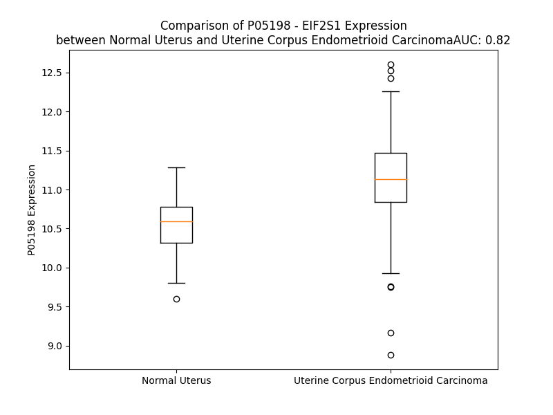

# Detailed Data for P05198

## Introduction to the Detailed Summary

### How to Interpret the Results

- **Summary & Metrics**: This section provides a quick reference to essential protein attributes, including expression changes, family classification, and biomarker applications. Regulation status (upregulated/downregulated) indicates the protein's behavior in a disease context. Some information comes from the original excel file with the proteins selected from literature, while others are derived from the analyses.
- **Expression Comparison**: A visual representation comparing protein expression between normal and disease states. It highlights significant changes in expression levels that might indicate diagnostic or therapeutic relevance. This is data coming from transcriptomics experiments and could not translate similarly to protein levels.
- **Isoform Alignment**: An interactive view of isoform alignments, revealing structural and functional differences between variants of the protein.
- **Interactors & Homologs**: Tables listing known interaction partners and homologous proteins, the more interactors and homologs, the more complex the protein is to design an antibody for.
- **Biological Assemblies**: Information about the structural arrangement of the protein in different assemblies, providing insights into its functional state but also the complexity of the protein to develop antibodies.
- **Combined Per-Residue Information**: A detailed table summarizing residue-level data. This includes predictions for epitope regions, aggregation tendencies, and modifications that might impact the protein's function. Each row corresponds to a residue in the protein, providing insights into specific sites that may be important for research or drug development.
## Summary & Metrics

- **UniProt Accession**: P05198
- **Gene Name**: EIF2S1
- **Protein Name**: eukaryotic translation initiation factor 2, subunit 1 alpha, 35kDa
- **Swiss Prot**: IF2A_HUMAN
- **Family**: translation regulator
- **Biomarker Application**: efficacy
- **Number of Isoforms**: 0
- **Regulation**: 2
- **(transcriptomics) AUC**: 0.9
- **(transcriptomics) Fold Change**: 1.07
- **(transcriptomics) Regulation**: Upregulated
- **Discotope Epitope Count**: 50
- **Max n_uniprots (Homo)**: 1.0
- **Max n_uniprots (Hetero)**: 10.0

## Expression Comparison

## Interactors

| preferredName_A   | preferredName_B   |   score |
|:------------------|:------------------|--------:|
| EIF2S1            | PSMD14            |   0.999 |
| EIF2S1            | EIF3I             |   0.999 |
| EIF2S1            | EIF2AK2           |   0.999 |
| EIF2S1            | EIF2S2            |   0.999 |
| EIF2S1            | EIF2AK4           |   0.999 |
| EIF2S1            | RPS3              |   0.999 |
| EIF2S1            | RPS3A             |   0.999 |
| EIF2S1            | EIF2B5            |   0.999 |
| EIF2S1            | EIF2B4            |   0.999 |
| EIF2S1            | PPP1R15A          |   0.999 |
| EIF2S1            | EIF2B3            |   0.999 |
| EIF2S1            | EIF3A             |   0.999 |
| EIF2S1            | EIF2S3            |   0.999 |
| EIF2S1            | EIF3B             |   0.999 |
| EIF2S1            | EIF2B2            |   0.999 |
| EIF2S1            | EIF2B1            |   0.999 |
| EIF2S1            | RPS26             |   0.998 |
| EIF2S1            | EIF1              |   0.998 |
| EIF2S1            | RPS16             |   0.998 |
| EIF2S1            | RPS24             |   0.998 |
| EIF2S1            | RPS20             |   0.998 |
| EIF2S1            | RPS25             |   0.998 |
| EIF2S1            | RPS6              |   0.998 |
| EIF2S1            | EIF5              |   0.998 |
| EIF2S1            | RPS2              |   0.998 |
| EIF2S1            | RPS15             |   0.998 |
| EIF2S1            | RPS8              |   0.998 |
| EIF2S1            | EIF2AK3           |   0.998 |
| EIF2S1            | RPS5              |   0.998 |
| EIF2S1            | RPS11             |   0.997 |
| EIF2S1            | RPS14             |   0.997 |
| EIF2S1            | RPS23             |   0.997 |
| EIF2S1            | RPS19             |   0.997 |
| EIF2S1            | RPS18             |   0.997 |
| EIF2S1            | RPS28             |   0.997 |
| EIF2S1            | RPS7              |   0.997 |
| EIF2S1            | EIF3D             |   0.996 |
| EIF2S1            | EIF3C             |   0.996 |
| EIF2S1            | FAU               |   0.996 |
| EIF2S1            | PPP1CA            |   0.996 |
| EIF2S1            | EIF2AK1           |   0.996 |
| EIF2S1            | EIF1AX            |   0.995 |
| EIF2S1            | RPS13             |   0.995 |
| EIF2S1            | RPS9              |   0.995 |
| EIF2S1            | RPS21             |   0.995 |
| EIF2S1            | RPS27A            |   0.994 |
| EIF2S1            | EIF3E             |   0.994 |
| EIF2S1            | RPSA              |   0.993 |
| EIF2S1            | RPS12             |   0.993 |
| EIF2S1            | RPS4X             |   0.993 |

## Homologs

| uniprot_id   | gene_id   |
|--------------|-----------|

## Biological Assemblies

|   Unnamed: 0 |   assembly |   n_uniprots | composition   | crystal_id   |
|-------------:|-----------:|-------------:|:--------------|:-------------|
|            0 |          1 |           10 | Hetero        | 6k71         |
|            0 |          1 |           10 | Hetero        | 7d45         |
|            0 |          1 |           10 | Hetero        | 7d44         |
|            0 |          1 |            8 | Hetero        | 7sys         |
|            0 |          1 |           10 | Hetero        | 7f67         |
|            0 |          1 |           10 | Hetero        | 6o81         |
|            0 |          1 |           10 | Hetero        | 6o85         |
|            0 |          1 |           10 | Hetero        | 6k72         |
|            0 |          1 |           10 | Hetero        | 7d43         |
|            0 |          1 |            1 | Homo          | 1kl9         |
|            1 |          2 |            1 | Homo          | 1kl9         |
|            2 |          3 |            1 | Homo          | 1kl9         |
|            0 |          1 |            5 | Hetero        | 7nzm         |
|            0 |          1 |            1 | Homo          | 1q8k         |
|            0 |          1 |           10 | Hetero        | 6o9z         |
|            0 |          1 |            3 | Hetero        | 8qzz         |
|            0 |          1 |            8 | Hetero        | 7syr         |
|            0 |          1 |            3 | Hetero        | 6ybv         |
|            0 |          1 |           10 | Hetero        | 7f66         |

## Combined Per-Residue Information

|   res | aa   |   epitope_score | epitope   |   relative_surface_accessibility |   modeling_confidence |   Aggregation | modification          |
|------:|:-----|----------------:|:----------|---------------------------------:|----------------------:|--------------:|:----------------------|
|     1 | M    |         0.13601 | False     |                          1.2381  |                 33.86 |         0     | N/A                   |
|     2 | P    |         0.21946 | False     |                          0.98411 |                 41.96 |         0     | N/A                   |
|     3 | G    |         0.15308 | False     |                          0.51134 |                 51.36 |         0     | N/A                   |
|     4 | L    |         0.09805 | False     |                          0.27727 |                 55.7  |         0     | N/A                   |
|     5 | S    |         0.10857 | False     |                          0.31855 |                 59.94 |         0     | N/A                   |
|     6 | C    |         0.02704 | False     |                          0.02425 |                 62    |         0     | N/A                   |
|     7 | R    |         0.20599 | False     |                          0.16668 |                 67.62 |         0     | N/A                   |
|     8 | F    |         0.06908 | False     |                          0.12638 |                 65.55 |         0     | N/A                   |
|     9 | Y    |         0.06113 | False     |                          0.08393 |                 67.69 |         0     | N/A                   |
|    10 | Q    |         0.16022 | False     |                          0.5287  |                 63.65 |         0     | N/A                   |
|    11 | H    |         0.21555 | False     |                          0.65824 |                 67.31 |         0     | N/A                   |
|    12 | K    |         0.14305 | False     |                          0.62079 |                 65.67 |         0     | N/A                   |
|    13 | F    |         0.1348  | False     |                          0.25777 |                 70.37 |         0     | N/A                   |
|    14 | P    |         0.02485 | False     |                          0.03903 |                 76.95 |         0     | N/A                   |
|    15 | E    |         0.10936 | False     |                          0.67474 |                 79.89 |         0     | N/A                   |
|    16 | V    |         0.16647 | False     |                          0.64734 |                 84.58 |         0     | N/A                   |
|    17 | E    |         0.13982 | False     |                          0.71283 |                 83.54 |         0     | N/A                   |
|    18 | D    |         0.08705 | False     |                          0.26521 |                 84.18 |         0     | N/A                   |
|    19 | V    |         0.05748 | False     |                          0.15003 |                 85.68 |        34.01  | N/A                   |
|    20 | V    |         0.00421 | False     |                          0.00095 |                 87.28 |        41.275 | N/A                   |
|    21 | M    |         0.05143 | False     |                          0.0791  |                 87.41 |        41.275 | N/A                   |
|    22 | V    |         0.00461 | False     |                          0       |                 90.08 |        41.275 | N/A                   |
|    23 | N    |         0.05338 | False     |                          0.22955 |                 90.38 |        41.275 | N/A                   |
|    24 | V    |         0.00947 | False     |                          0.00377 |                 89.32 |        38.583 | N/A                   |
|    25 | R    |         0.24804 | True      |                          0.62461 |                 88.74 |         0     | N/A                   |
|    26 | S    |         0.23659 | True      |                          0.40446 |                 87.96 |         0     | N/A                   |
|    27 | I    |         0.19832 | False     |                          0.24872 |                 84.95 |         0     | N/A                   |
|    28 | A    |         0.20864 | False     |                          0.38508 |                 84.96 |         0     | N/A                   |
|    29 | E    |         0.31134 | True      |                          0.90164 |                 79.03 |         0     | N/A                   |
|    30 | M    |         0.42523 | True      |                          0.84415 |                 81.02 |         0     | N/A                   |
|    31 | G    |         0.04434 | False     |                          0.00161 |                 83.49 |         0     | N/A                   |
|    32 | A    |         0.02353 | False     |                          0.0104  |                 86.49 |         3.152 | N/A                   |
|    33 | Y    |         0.1323  | False     |                          0.44202 |                 89.95 |         6.329 | N/A                   |
|    34 | V    |         0.00735 | False     |                          0.00876 |                 90.37 |         6.329 | N/A                   |
|    35 | S    |         0.07605 | False     |                          0.08907 |                 88.88 |         6.329 | N/A                   |
|    36 | L    |         0.00726 | False     |                          0       |                 86.47 |         6.329 | N/A                   |
|    37 | L    |         0.15412 | False     |                          0.28673 |                 79.84 |         5.836 | N/A                   |
|    38 | E    |         0.01854 | False     |                          0.00309 |                 73.94 |         0     | N/A                   |
|    39 | Y    |         0.05615 | False     |                          0.05455 |                 75.84 |         0     | N/A                   |
|    40 | N    |         0.08646 | False     |                          0.45536 |                 76.18 |         0     | N/A                   |
|    41 | N    |         0.1057  | False     |                          0.44621 |                 77.64 |         0     | N/A                   |
|    42 | I    |         0.22043 | False     |                          0.22879 |                 82.98 |         0     | N/A                   |
|    43 | E    |         0.09578 | False     |                          0.46696 |                 86.95 |         0     | N/A                   |
|    44 | G    |         0.03248 | False     |                          0.02889 |                 88.81 |         0.271 | N/A                   |
|    45 | M    |         0.12751 | False     |                          0.25872 |                 89.23 |         0.646 | N/A                   |
|    46 | I    |         0.02715 | False     |                          0.01833 |                 88.7  |         0.646 | N/A                   |
|    47 | L    |         0.10825 | False     |                          0.45917 |                 85.24 |         0.646 | N/A                   |
|    48 | L    |         0.25746 | True      |                          0.37322 |                 79.31 |         0.646 | N/A                   |
|    49 | S    |         0.19093 | False     |                          0.65421 |                 81.23 |         0.374 | Phosphoserine; by HRI |
|    50 | E    |         0.15729 | False     |                          0.15919 |                 81.26 |         0     | N/A                   |
|    51 | L    |         0.068   | False     |                          0.029   |                 79.48 |         0     | N/A                   |
|    52 | S    |         0.20545 | False     |                          0.22784 |                 73.16 |         0     | Phosphoserine         |
|    53 | R    |         0.3376  | True      |                          0.66443 |                 70.78 |         0     | N/A                   |
|    54 | R    |         0.27702 | True      |                          0.83101 |                 74.44 |         0     | N/A                   |
|    55 | R    |         0.39509 | True      |                          1.00338 |                 68.17 |         0     | N/A                   |
|    56 | I    |         0.24151 | True      |                          0.3528  |                 66.58 |         0     | N/A                   |
|    57 | R    |         0.22111 | False     |                          1.00364 |                 70.09 |         0     | N/A                   |
|    58 | S    |         0.22807 | True      |                          0.53398 |                 68.87 |         0     | N/A                   |
|    59 | I    |         0.25251 | True      |                          0.20747 |                 70.46 |         0     | N/A                   |
|    60 | N    |         0.25568 | True      |                          0.63979 |                 72.33 |         0     | N/A                   |
|    61 | K    |         0.25453 | True      |                          0.92826 |                 74.07 |         0     | N/A                   |
|    62 | L    |         0.26759 | True      |                          0.45974 |                 71.5  |         0     | N/A                   |
|    63 | I    |         0.04064 | False     |                          0.01057 |                 75.94 |         0     | N/A                   |
|    64 | R    |         0.29661 | True      |                          0.58087 |                 80.48 |         0     | N/A                   |
|    65 | I    |         0.26173 | True      |                          0.70107 |                 87.01 |         0     | N/A                   |
|    66 | G    |         0.13205 | False     |                          0.59098 |                 85.37 |         0     | N/A                   |
|    67 | R    |         0.24785 | True      |                          0.56354 |                 86.63 |         0     | N/A                   |
|    68 | N    |         0.13082 | False     |                          0.40754 |                 87.89 |         0     | N/A                   |
|    69 | E    |         0.09832 | False     |                          0.15471 |                 86.46 |         0.364 | N/A                   |
|    70 | C    |         0.03335 | False     |                          0.0918  |                 87.46 |        85.31  | N/A                   |
|    71 | V    |         0.00497 | False     |                          0.00095 |                 89.16 |        86.211 | N/A                   |
|    72 | V    |         0.05974 | False     |                          0.09616 |                 89.82 |        86.421 | N/A                   |
|    73 | V    |         0.01563 | False     |                          0.00493 |                 89.85 |        86.44  | N/A                   |
|    74 | I    |         0.21684 | False     |                          0.32044 |                 89.36 |        86.44  | N/A                   |
|    75 | R    |         0.40789 | True      |                          0.60073 |                 87.5  |         1.686 | N/A                   |
|    76 | V    |         0.13802 | False     |                          0.17793 |                 87.6  |         1.617 | N/A                   |
|    77 | D    |         0.20536 | False     |                          0.32841 |                 87.61 |         1.322 | N/A                   |
|    78 | K    |         0.34949 | True      |                          0.74577 |                 81.1  |         0     | N/A                   |
|    79 | E    |         0.22261 | False     |                          0.89999 |                 81.57 |         0     | N/A                   |
|    80 | K    |         0.35571 | True      |                          0.7702  |                 77.51 |         0     | N/A                   |
|    81 | G    |         0.06788 | False     |                          0.24875 |                 76.45 |         0     | N/A                   |
|    82 | Y    |         0.29156 | True      |                          0.60755 |                 82.96 |         0     | N/A                   |
|    83 | I    |         0.01694 | False     |                          0.01005 |                 88.16 |         0     | N/A                   |
|    84 | D    |         0.12385 | False     |                          0.25972 |                 90.03 |         0     | N/A                   |
|    85 | L    |         0.00495 | False     |                          0       |                 89.7  |         0     | N/A                   |
|    86 | S    |         0.02108 | False     |                          0       |                 88.35 |         0     | N/A                   |
|    87 | K    |         0.11408 | False     |                          0.261   |                 84.34 |         0     | N/A                   |
|    88 | R    |         0.29521 | True      |                          0.45397 |                 82.14 |         0     | N/A                   |
|    89 | R    |         0.26559 | True      |                          0.58757 |                 80.46 |         0     | N/A                   |
|    90 | V    |         0.10462 | False     |                          0.17515 |                 82.67 |         0     | N/A                   |
|    91 | S    |         0.17655 | False     |                          0.33759 |                 83.92 |         0     | N/A                   |
|    92 | P    |         0.21853 | False     |                          0.77421 |                 82.57 |         0     | N/A                   |
|    93 | E    |         0.23032 | True      |                          0.65237 |                 86.65 |         0     | N/A                   |
|    94 | E    |         0.1479  | False     |                          0.37795 |                 84.57 |         0     | N/A                   |
|    95 | A    |         0.0884  | False     |                          0.23535 |                 83.94 |         0     | N/A                   |
|    96 | I    |         0.17219 | False     |                          0.72559 |                 86.8  |         0     | N/A                   |
|    97 | K    |         0.27099 | True      |                          0.63405 |                 85.66 |         0     | N/A                   |
|    98 | C    |         0.02014 | False     |                          0.03662 |                 83.64 |         0     | N/A                   |
|    99 | E    |         0.12181 | False     |                          0.49182 |                 86.11 |         0     | N/A                   |
|   100 | D    |         0.1572  | False     |                          0.34385 |                 85.52 |         0     | N/A                   |
|   101 | K    |         0.07261 | False     |                          0.1156  |                 83.45 |         0     | N/A                   |
|   102 | F    |         0.04725 | False     |                          0.08795 |                 83.07 |         0     | N/A                   |
|   103 | T    |         0.12252 | False     |                          0.55196 |                 84.7  |         0     | N/A                   |
|   104 | K    |         0.15852 | False     |                          0.23183 |                 83.94 |         0     | N/A                   |
|   105 | S    |         0.01786 | False     |                          0.05177 |                 83.11 |         0     | N/A                   |
|   106 | K    |         0.09039 | False     |                          0.57172 |                 83.35 |         0     | N/A                   |
|   107 | T    |         0.12022 | False     |                          0.27304 |                 83.07 |         2.007 | N/A                   |
|   108 | V    |         0.01094 | False     |                          0.03903 |                 83.32 |         4.983 | N/A                   |
|   109 | Y    |         0.04691 | False     |                          0.11888 |                 83.02 |         4.983 | N/A                   |
|   110 | S    |         0.07394 | False     |                          0.29296 |                 83.54 |         4.983 | N/A                   |
|   111 | I    |         0.01148 | False     |                          0       |                 83.05 |         4.983 | N/A                   |
|   112 | L    |         0.00774 | False     |                          0       |                 80.93 |         4.718 | N/A                   |
|   113 | R    |         0.08481 | False     |                          0.41238 |                 81.78 |         0.811 | N/A                   |
|   114 | H    |         0.1409  | False     |                          0.40051 |                 82.32 |         0.811 | N/A                   |
|   115 | V    |         0.00618 | False     |                          0.0019  |                 81.99 |         0.811 | N/A                   |
|   116 | A    |         0.02949 | False     |                          0.02255 |                 81.93 |         0.811 | N/A                   |
|   117 | E    |         0.11571 | False     |                          0.59078 |                 82.14 |         0.811 | N/A                   |
|   118 | V    |         0.1616  | False     |                          0.55585 |                 82.36 |         0.811 | N/A                   |
|   119 | L    |         0.14009 | False     |                          0.27513 |                 79.24 |         0.811 | N/A                   |
|   120 | E    |         0.27761 | True      |                          0.75058 |                 78.46 |         0     | N/A                   |
|   121 | Y    |         0.23277 | True      |                          0.22829 |                 72.67 |         0     | N/A                   |
|   122 | T    |         0.24102 | True      |                          0.84464 |                 69.95 |         0     | N/A                   |
|   123 | K    |         0.25897 | True      |                          0.64407 |                 73.43 |         0     | N/A                   |
|   124 | D    |         0.11639 | False     |                          0.50202 |                 73.19 |         0     | N/A                   |
|   125 | E    |         0.15067 | False     |                          0.68535 |                 74.12 |         0     | N/A                   |
|   126 | Q    |         0.19837 | False     |                          0.37443 |                 75.12 |         0     | N/A                   |
|   127 | L    |         0.01171 | False     |                          0.00247 |                 75.74 |         0     | N/A                   |
|   128 | E    |         0.0939  | False     |                          0.23431 |                 76.19 |         0     | N/A                   |
|   129 | S    |         0.11256 | False     |                          0.33673 |                 78.28 |         0     | N/A                   |
|   130 | L    |         0.0364  | False     |                          0.03322 |                 78.85 |         0     | N/A                   |
|   131 | F    |         0.01169 | False     |                          0.01147 |                 76.92 |         0     | N/A                   |
|   132 | Q    |         0.12599 | False     |                          0.53963 |                 76.64 |         0     | N/A                   |
|   133 | R    |         0.11795 | False     |                          0.48022 |                 75.59 |         0     | N/A                   |
|   134 | T    |         0.03259 | False     |                          0       |                 75.87 |        16.252 | N/A                   |
|   135 | A    |         0.03467 | False     |                          0.04632 |                 73.9  |        16.252 | N/A                   |
|   136 | W    |         0.08001 | False     |                          0.09157 |                 75.18 |        16.252 | N/A                   |
|   137 | V    |         0.07665 | False     |                          0.42709 |                 76.05 |        16.252 | N/A                   |
|   138 | F    |         0.04024 | False     |                          0.00828 |                 72.66 |        16.252 | N/A                   |
|   139 | D    |         0.10872 | False     |                          0.16203 |                 72.28 |         0     | N/A                   |
|   140 | D    |         0.27    | True      |                          0.63477 |                 71.42 |         0     | N/A                   |
|   141 | K    |         0.27088 | True      |                          0.56692 |                 73.13 |         0     | N6-acetyllysine       |
|   142 | Y    |         0.23215 | True      |                          0.41434 |                 68.37 |         0     | N/A                   |
|   143 | K    |         0.2176  | False     |                          0.87582 |                 65.08 |         0     | N/A                   |
|   144 | R    |         0.29943 | True      |                          0.64813 |                 65.41 |         0     | N/A                   |
|   145 | P    |         0.11539 | False     |                          0.56497 |                 61.45 |         0     | N/A                   |
|   146 | G    |         0.02585 | False     |                          0.04744 |                 60.66 |         0     | N/A                   |
|   147 | Y    |         0.12977 | False     |                          0.30249 |                 68.25 |         0     | N/A                   |
|   148 | G    |         0.02973 | False     |                          0.02253 |                 68.35 |         0     | N/A                   |
|   149 | A    |         0.02109 | False     |                          0.05994 |                 73.77 |         0     | N/A                   |
|   150 | Y    |         0.08789 | False     |                          0.23074 |                 80.42 |         0     | N/A                   |
|   151 | D    |         0.17852 | False     |                          0.41285 |                 78.6  |         0     | N/A                   |
|   152 | A    |         0.01318 | False     |                          0.00727 |                 77.52 |         0     | N/A                   |
|   153 | F    |         0.0072  | False     |                          0.00828 |                 78.59 |         0     | N/A                   |
|   154 | K    |         0.10818 | False     |                          0.54223 |                 77.78 |         0     | N/A                   |
|   155 | H    |         0.13756 | False     |                          0.5331  |                 75.64 |         0     | N/A                   |
|   156 | A    |         0.01986 | False     |                          0.05065 |                 76.41 |         0     | N/A                   |
|   157 | V    |         0.07288 | False     |                          0.29772 |                 74.11 |         0     | N/A                   |
|   158 | S    |         0.1256  | False     |                          0.74036 |                 71.78 |         0     | Phosphoserine         |
|   159 | D    |         0.16994 | False     |                          0.42401 |                 70.49 |         0     | N/A                   |
|   160 | P    |         0.10051 | False     |                          0.53021 |                 69.43 |         0     | N/A                   |
|   161 | S    |         0.12512 | False     |                          0.5578  |                 70.48 |         0     | N/A                   |
|   162 | I    |         0.14499 | False     |                          0.18319 |                 70.03 |         0     | N/A                   |
|   163 | L    |         0.07302 | False     |                          0.02272 |                 65.41 |         0     | N/A                   |
|   164 | D    |         0.1986  | False     |                          0.6038  |                 64.59 |         0     | N/A                   |
|   165 | S    |         0.12583 | False     |                          0.54591 |                 63.5  |         0     | N/A                   |
|   166 | L    |         0.08502 | False     |                          0.1026  |                 63.62 |         0     | N/A                   |
|   167 | D    |         0.18976 | False     |                          0.79926 |                 63.3  |         0     | N/A                   |
|   168 | L    |         0.10638 | False     |                          0.15896 |                 65.5  |         0     | N/A                   |
|   169 | N    |         0.24987 | True      |                          0.64202 |                 72.75 |         0     | N/A                   |
|   170 | E    |         0.11855 | False     |                          0.76807 |                 73.79 |         0     | N/A                   |
|   171 | D    |         0.19673 | False     |                          0.57963 |                 77.29 |         0     | N/A                   |
|   172 | E    |         0.08842 | False     |                          0.07875 |                 78.14 |         0     | N/A                   |
|   173 | R    |         0.13207 | False     |                          0.27681 |                 77.16 |         0     | N/A                   |
|   174 | E    |         0.15801 | False     |                          0.64368 |                 81.09 |         0     | N/A                   |
|   175 | V    |         0.0965  | False     |                          0.25713 |                 82.55 |         0.856 | N/A                   |
|   176 | L    |         0.00568 | False     |                          0.00907 |                 82.09 |         1.015 | N/A                   |
|   177 | I    |         0.07615 | False     |                          0.25418 |                 80.95 |         1.015 | N/A                   |
|   178 | N    |         0.12119 | False     |                          0.58399 |                 82.58 |         1.015 | N/A                   |
|   179 | N    |         0.08184 | False     |                          0.08873 |                 80.78 |         1.015 | N/A                   |
|   180 | I    |         0.01082 | False     |                          0.0112  |                 80.71 |         0.844 | N/A                   |
|   181 | N    |         0.04262 | False     |                          0.35677 |                 77.32 |         0     | N/A                   |
|   182 | R    |         0.20471 | False     |                          0.81669 |                 75.78 |         0     | N/A                   |
|   183 | R    |         0.18571 | False     |                          0.60282 |                 73.2  |         0     | N/A                   |
|   184 | L    |         0.08901 | False     |                          0.11448 |                 71.63 |         0     | N/A                   |
|   185 | T    |         0.10281 | False     |                          0.47878 |                 65.91 |         0     | N/A                   |
|   186 | P    |         0.07493 | False     |                          0.43674 |                 65.19 |         0     | N/A                   |
|   187 | Q    |         0.10024 | False     |                          0.81561 |                 67.3  |         0     | N/A                   |
|   188 | A    |         0.10324 | False     |                          0.52205 |                 74.21 |         0     | N/A                   |
|   189 | V    |         0.09021 | False     |                          0.1847  |                 78.63 |         0     | N/A                   |
|   190 | K    |         0.06341 | False     |                          0.39178 |                 82.82 |         0     | N/A                   |
|   191 | I    |         0.00636 | False     |                          0       |                 86.11 |         0     | N/A                   |
|   192 | R    |         0.06649 | False     |                          0.08412 |                 85.14 |         0     | N/A                   |
|   193 | A    |         0.00613 | False     |                          0       |                 87.33 |         0     | N/A                   |
|   194 | D    |         0.06309 | False     |                          0.10293 |                 87.49 |         0     | N/A                   |
|   195 | I    |         0.00932 | False     |                          0.00206 |                 87.08 |         0     | N/A                   |
|   196 | E    |         0.07128 | False     |                          0.21306 |                 88.23 |         0     | N/A                   |
|   197 | V    |         0.02363 | False     |                          0.03026 |                 83.57 |         0     | N/A                   |
|   198 | A    |         0.09705 | False     |                          0.17728 |                 84.29 |         0     | N/A                   |
|   199 | C    |         0.05901 | False     |                          0.18702 |                 82.39 |         0     | N/A                   |
|   200 | Y    |         0.28683 | True      |                          0.84097 |                 79.09 |         0     | N/A                   |
|   201 | G    |         0.27044 | True      |                          0.52619 |                 76.31 |         0     | N/A                   |
|   202 | Y    |         0.29601 | True      |                          1.06709 |                 72.24 |         0     | N/A                   |
|   203 | E    |         0.19747 | False     |                          0.68484 |                 76.7  |         0     | N/A                   |
|   204 | G    |         0.08242 | False     |                          0.05028 |                 75.34 |         0     | N/A                   |
|   205 | I    |         0.18012 | False     |                          0.75483 |                 78.2  |         0     | N/A                   |
|   206 | D    |         0.20967 | False     |                          0.55056 |                 83.19 |         0     | N/A                   |
|   207 | A    |         0.04214 | False     |                          0.01614 |                 83.3  |         0     | N/A                   |
|   208 | V    |         0.07014 | False     |                          0.12758 |                 84.15 |         0     | N/A                   |
|   209 | K    |         0.15945 | False     |                          0.60028 |                 84.8  |         0     | N/A                   |
|   210 | E    |         0.13845 | False     |                          0.46177 |                 85.74 |         0     | N/A                   |
|   211 | A    |         0.00521 | False     |                          0       |                 85.16 |         0     | N/A                   |
|   212 | L    |         0.08153 | False     |                          0.15992 |                 84.62 |         0     | N/A                   |
|   213 | R    |         0.1979  | False     |                          0.72048 |                 86.65 |         0     | N/A                   |
|   214 | A    |         0.09161 | False     |                          0.27474 |                 82.62 |         0     | N/A                   |
|   215 | G    |         0.00892 | False     |                          0       |                 80.58 |         0     | N/A                   |
|   216 | L    |         0.12052 | False     |                          0.40425 |                 80.9  |         0     | N/A                   |
|   217 | N    |         0.17761 | False     |                          0.8461  |                 80.52 |         0     | N/A                   |
|   218 | C    |         0.07938 | False     |                          0.31965 |                 73.58 |         0     | N/A                   |
|   219 | S    |         0.14476 | False     |                          0.33108 |                 70.28 |         0     | N/A                   |
|   220 | T    |         0.22024 | False     |                          0.60578 |                 72.72 |         0     | N/A                   |
|   221 | E    |         0.24422 | True      |                          0.94509 |                 63.06 |         0     | N/A                   |
|   222 | N    |         0.21845 | False     |                          0.90202 |                 67.16 |         0     | N/A                   |
|   223 | M    |         0.11066 | False     |                          0.10211 |                 71.02 |         0     | N/A                   |
|   224 | P    |         0.13614 | False     |                          0.55223 |                 79.33 |         0     | N/A                   |
|   225 | I    |         0.05981 | False     |                          0.05837 |                 83.28 |         0     | N/A                   |
|   226 | K    |         0.15646 | False     |                          0.67414 |                 83.66 |         0     | N/A                   |
|   227 | I    |         0.1208  | False     |                          0.19334 |                 84.71 |         0     | N/A                   |
|   228 | N    |         0.14963 | False     |                          0.49604 |                 84.52 |         0     | N/A                   |
|   229 | L    |         0.16424 | False     |                          0.55183 |                 83.47 |         0     | N/A                   |
|   230 | I    |         0.12168 | False     |                          0.14396 |                 80.82 |         0     | N/A                   |
|   231 | A    |         0.14218 | False     |                          0.18588 |                 75.54 |         0     | N/A                   |
|   232 | P    |         0.29971 | True      |                          0.78824 |                 75.42 |         0     | N/A                   |
|   233 | P    |         0.12527 | False     |                          0.41552 |                 79.6  |         0     | N/A                   |
|   234 | R    |         0.12593 | False     |                          0.40004 |                 87.61 |         0     | N/A                   |
|   235 | Y    |         0.05939 | False     |                          0.11306 |                 86.14 |         3.551 | N/A                   |
|   236 | V    |         0.02228 | False     |                          0.03713 |                 87.27 |         4.425 | N/A                   |
|   237 | M    |         0.00778 | False     |                          0.00134 |                 85.65 |         4.558 | N/A                   |
|   238 | T    |         0.05377 | False     |                          0.26409 |                 86.37 |         4.558 | N/A                   |
|   239 | T    |         0.01412 | False     |                          0.01017 |                 85.54 |         4.558 | N/A                   |
|   240 | T    |         0.0829  | False     |                          0.36036 |                 85.04 |         4.184 | N/A                   |
|   241 | T    |         0.02825 | False     |                          0.02636 |                 82.02 |         3.962 | N/A                   |
|   242 | L    |         0.15612 | False     |                          0.66563 |                 75.51 |         2.687 | N/A                   |
|   243 | E    |         0.14057 | False     |                          0.48395 |                 76.23 |         0     | N/A                   |
|   244 | R    |         0.20642 | False     |                          0.61345 |                 76.53 |         0     | N/A                   |
|   245 | T    |         0.10973 | False     |                          0.69374 |                 83.38 |         0     | N/A                   |
|   246 | E    |         0.18218 | False     |                          0.53936 |                 80.93 |         0     | N/A                   |
|   247 | G    |         0.00925 | False     |                          0       |                 79.12 |         0.102 | N/A                   |
|   248 | L    |         0.11625 | False     |                          0.36068 |                 83.43 |         1.621 | N/A                   |
|   249 | S    |         0.08977 | False     |                          0.53019 |                 85.86 |         2.188 | N/A                   |
|   250 | V    |         0.07075 | False     |                          0.21979 |                 84.08 |         6.763 | N/A                   |
|   251 | L    |         0.00595 | False     |                          0       |                 84.96 |         7.153 | N/A                   |
|   252 | S    |         0.13206 | False     |                          0.41013 |                 86.98 |         7.153 | N/A                   |
|   253 | Q    |         0.13452 | False     |                          0.55333 |                 87.51 |         7.626 | N/A                   |
|   254 | A    |         0.0054  | False     |                          0.00765 |                 85.74 |        22.3   | N/A                   |
|   255 | M    |         0.06065 | False     |                          0.08116 |                 86.01 |        22.3   | N/A                   |
|   256 | A    |         0.08949 | False     |                          0.55531 |                 88.26 |        22.3   | N/A                   |
|   257 | V    |         0.08365 | False     |                          0.33214 |                 88.3  |        22.3   | N/A                   |
|   258 | I    |         0.00821 | False     |                          0       |                 86.13 |        22.017 | N/A                   |
|   259 | K    |         0.14279 | False     |                          0.4711  |                 87.62 |         0     | N/A                   |
|   260 | E    |         0.19303 | False     |                          0.65232 |                 88.42 |         0     | N/A                   |
|   261 | K    |         0.18095 | False     |                          0.35841 |                 84.2  |         0     | N/A                   |
|   262 | I    |         0.00694 | False     |                          0       |                 84.12 |         0     | N/A                   |
|   263 | E    |         0.1864  | False     |                          0.50598 |                 84.34 |         0     | N/A                   |
|   264 | E    |         0.30827 | True      |                          0.6218  |                 83.96 |         0     | N/A                   |
|   265 | K    |         0.10389 | False     |                          0.39048 |                 79.19 |         0     | N/A                   |
|   266 | R    |         0.29639 | True      |                          0.8904  |                 79.56 |         0     | N/A                   |
|   267 | G    |         0.10342 | False     |                          0.11421 |                 80.94 |         0     | N/A                   |
|   268 | V    |         0.14605 | False     |                          0.58258 |                 83.45 |         0.988 | N/A                   |
|   269 | F    |         0.08596 | False     |                          0.14266 |                 85.45 |         0.988 | N/A                   |
|   270 | N    |         0.15912 | False     |                          0.54104 |                 87.33 |         0.988 | N/A                   |
|   271 | V    |         0.10919 | False     |                          0.42093 |                 87.79 |         0.988 | N/A                   |
|   272 | Q    |         0.19715 | False     |                          0.4264  |                 83.98 |         0.988 | N/A                   |
|   273 | M    |         0.17535 | False     |                          0.29745 |                 83.07 |         0.527 | N/A                   |
|   274 | E    |         0.21121 | False     |                          0.69153 |                 85.13 |         0     | N/A                   |
|   275 | P    |         0.10007 | False     |                          0.19402 |                 85.12 |         0     | N/A                   |
|   276 | K    |         0.18568 | False     |                          0.5207  |                 83.91 |         0     | N/A                   |
|   277 | V    |         0.11066 | False     |                          0.31095 |                 81.49 |         0     | N/A                   |
|   278 | V    |         0.09854 | False     |                          0.15118 |                 78.01 |         0     | N/A                   |
|   279 | T    |         0.12915 | False     |                          0.53764 |                 76.07 |         0     | Phosphothreonine      |
|   280 | D    |         0.1876  | False     |                          0.76332 |                 70.68 |         0     | N/A                   |
|   281 | T    |         0.16707 | False     |                          0.67737 |                 72.9  |         0     | Phosphothreonine      |
|   282 | D    |         0.11104 | False     |                          0.23067 |                 71.26 |         0     | N/A                   |
|   283 | E    |         0.26022 | True      |                          0.36971 |                 69.87 |         0     | N/A                   |
|   284 | T    |         0.11538 | False     |                          0.52489 |                 75.62 |         0     | N/A                   |
|   285 | E    |         0.21305 | False     |                          0.61034 |                 75.81 |         0     | N/A                   |
|   286 | L    |         0.11794 | False     |                          0.19632 |                 68.5  |         0     | N/A                   |
|   287 | A    |         0.13872 | False     |                          0.5733  |                 75.43 |         0     | N/A                   |
|   288 | R    |         0.2543  | True      |                          0.70496 |                 79.98 |         0     | N/A                   |
|   289 | Q    |         0.1813  | False     |                          0.42983 |                 72.76 |         0     | N/A                   |
|   290 | M    |         0.12008 | False     |                          0.27628 |                 70.26 |         0     | N/A                   |
|   291 | E    |         0.10951 | False     |                          0.65911 |                 77.74 |         0     | N/A                   |
|   292 | R    |         0.1795  | False     |                          0.65918 |                 76.35 |         0     | N/A                   |
|   293 | L    |         0.12244 | False     |                          0.28414 |                 67.37 |         0     | N/A                   |
|   294 | E    |         0.11205 | False     |                          0.57336 |                 69.53 |         0     | N/A                   |
|   295 | R    |         0.12827 | False     |                          0.68712 |                 68.9  |         0     | N/A                   |
|   296 | E    |         0.12053 | False     |                          0.53283 |                 66.84 |         0     | N/A                   |
|   297 | N    |         0.12501 | False     |                          0.63543 |                 64.24 |         0     | N/A                   |
|   298 | A    |         0.19009 | False     |                          0.76868 |                 63.93 |         0     | N/A                   |
|   299 | E    |         0.23633 | True      |                          0.6792  |                 56.63 |         0     | N/A                   |
|   300 | V    |         0.17397 | False     |                          0.89149 |                 54.44 |         0     | N/A                   |
|   301 | D    |         0.31522 | True      |                          0.78257 |                 48.23 |         0     | N/A                   |
|   302 | G    |         0.39827 | True      |                          0.87905 |                 52.18 |         0     | N/A                   |
|   303 | D    |         0.38637 | True      |                          0.73561 |                 52.65 |         0     | N/A                   |
|   304 | D    |         0.28923 | True      |                          0.771   |                 48.4  |         0     | N/A                   |
|   305 | D    |         0.21347 | False     |                          0.82347 |                 47.92 |         0     | N/A                   |
|   306 | A    |         0.21938 | False     |                          0.67462 |                 47.86 |         0     | N/A                   |
|   307 | E    |         0.29341 | True      |                          0.80392 |                 44.44 |         0     | N/A                   |
|   308 | E    |         0.22489 | False     |                          0.73926 |                 45.18 |         0     | N/A                   |
|   309 | M    |         0.25136 | True      |                          0.83764 |                 41.54 |         0     | N/A                   |
|   310 | E    |         0.20178 | False     |                          0.73333 |                 44.48 |         0     | N/A                   |
|   311 | A    |         0.17951 | False     |                          0.78591 |                 49.31 |         0     | N/A                   |
|   312 | K    |         0.19557 | False     |                          0.90624 |                 51.77 |         0     | N/A                   |
|   313 | A    |         0.17017 | False     |                          0.83683 |                 50.24 |         0     | N/A                   |
|   314 | E    |         0.1412  | False     |                          0.85022 |                 41.81 |         0     | N/A                   |
|   315 | D    |         0.1246  | False     |                          1.28541 |                 44.91 |         0     | N/A                   |

