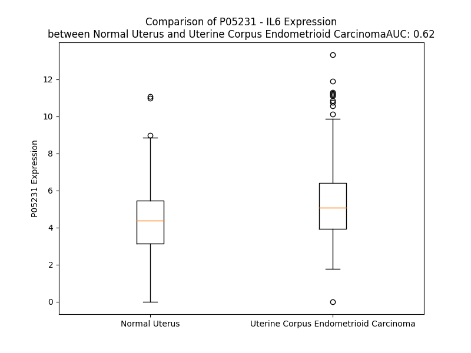

# Detailed Data for P05231

## Introduction to the Detailed Summary

### How to Interpret the Results

- **Summary & Metrics**: This section provides a quick reference to essential protein attributes, including expression changes, family classification, and biomarker applications. Regulation status (upregulated/downregulated) indicates the protein's behavior in a disease context. Some information comes from the original excel file with the proteins selected from literature, while others are derived from the analyses.
- **Expression Comparison**: A visual representation comparing protein expression between normal and disease states. It highlights significant changes in expression levels that might indicate diagnostic or therapeutic relevance. This is data coming from transcriptomics experiments and could not translate similarly to protein levels.
- **Isoform Alignment**: An interactive view of isoform alignments, revealing structural and functional differences between variants of the protein.
- **Interactors & Homologs**: Tables listing known interaction partners and homologous proteins, the more interactors and homologs, the more complex the protein is to design an antibody for.
- **Biological Assemblies**: Information about the structural arrangement of the protein in different assemblies, providing insights into its functional state but also the complexity of the protein to develop antibodies.
- **Combined Per-Residue Information**: A detailed table summarizing residue-level data. This includes predictions for epitope regions, aggregation tendencies, and modifications that might impact the protein's function. Each row corresponds to a residue in the protein, providing insights into specific sites that may be important for research or drug development.
## Summary & Metrics

- **UniProt Accession**: P05231
- **Gene Name**: IL-6
- **Protein Name**: Interleukin-6
- **Swiss Prot**: IL6_HUMAN
- **Family**: cytokine
- **Biomarker Application**: diagnosis,disease progression,efficacy,prognosis,response to therapy,safety,unspecified application
- **Number of Isoforms**: 0
- **Regulation**: 1
- **(transcriptomics) AUC**: 0.59
- **(transcriptomics) Fold Change**: 1.13
- **(transcriptomics) Regulation**: Upregulated
- **Discotope Epitope Count**: 46
- **Max n_uniprots (Homo)**: 2.0
- **Max n_uniprots (Hetero)**: 6.0

## Expression Comparison

## Interactors

| preferredName_A   | preferredName_B   |   score |
|:------------------|:------------------|--------:|
| IL6               | IL6R              |   0.999 |
| IL6               | IL2               |   0.999 |
| IL6               | IL6ST             |   0.999 |
| IL6               | IL3               |   0.998 |
| IL6               | IL1R1             |   0.997 |
| IL6               | TNFRSF1A          |   0.997 |
| IL6               | IL10              |   0.997 |
| IL6               | IL1B              |   0.996 |
| IL6               | JAK1              |   0.996 |
| IL6               | JAK2              |   0.995 |
| IL6               | TNF               |   0.994 |
| IL6               | NFKB1             |   0.994 |
| IL6               | CXCL8             |   0.991 |
| IL6               | IL9               |   0.99  |
| IL6               | JUN               |   0.989 |
| IL6               | IL1A              |   0.989 |
| IL6               | CSF3              |   0.988 |
| IL6               | IL4               |   0.986 |
| IL6               | RELA              |   0.986 |
| IL6               | TYK2              |   0.986 |
| IL6               | CCL2              |   0.985 |
| IL6               | STAT3             |   0.984 |
| IL6               | IL7               |   0.983 |
| IL6               | IFNG              |   0.983 |
| IL6               | CXCL1             |   0.982 |
| IL6               | IL17A             |   0.98  |
| IL6               | EGFR              |   0.979 |
| IL6               | IL5               |   0.977 |
| IL6               | CSF2              |   0.974 |
| IL6               | TLR4              |   0.973 |
| IL6               | STAT1             |   0.972 |
| IL6               | IL18              |   0.97  |
| IL6               | CRP               |   0.968 |
| IL6               | CXCL2             |   0.966 |
| IL6               | CD4               |   0.966 |
| IL6               | CD163             |   0.964 |
| IL6               | OSM               |   0.963 |
| IL6               | CCL3              |   0.962 |
| IL6               | TGFB1             |   0.96  |
| IL6               | CXCL10            |   0.96  |
| IL6               | PTGS2             |   0.96  |
| IL6               | MMP9              |   0.959 |
| IL6               | IL11              |   0.959 |
| IL6               | IL13              |   0.957 |
| IL6               | LIFR              |   0.956 |
| IL6               | IL10RA            |   0.956 |
| IL6               | IL2RA             |   0.953 |
| IL6               | A2M               |   0.95  |
| IL6               | CCL5              |   0.95  |
| IL6               | MYD88             |   0.949 |

## Homologs

| uniprot_id   | gene_id   |
|--------------|-----------|

## Biological Assemblies

|   Unnamed: 0 |   assembly |   n_uniprots | composition   | crystal_id   |
|-------------:|-----------:|-------------:|:--------------|:-------------|
|            0 |          1 |            2 | Hetero        | 5fuc         |
|            1 |          2 |            2 | Hetero        | 5fuc         |
|            0 |          1 |            1 | Homo          | 1alu         |
|            1 |          2 |            1 | Homo          | 1alu         |
|            0 |          1 |            6 | Hetero        | 8qy6         |
|            0 |          1 |            1 | Homo          | 4ni7         |
|            0 |          1 |            1 | Homo          | 2il6         |
|            0 |          1 |            1 | Homo          | 4o9h         |
|            0 |          1 |            1 | Homo          | 4zs7         |
|            0 |          1 |            3 | Hetero        | 1p9m         |
|            0 |          1 |            6 | Hetero        | 8d82         |
|            0 |          1 |            2 | Hetero        | 4j4l         |
|            1 |          2 |            2 | Hetero        | 4j4l         |
|            0 |          1 |            1 | Homo          | 4cni         |
|            1 |          2 |            1 | Homo          | 4cni         |
|            0 |          1 |            2 | Homo          | 4ni9         |
|            0 |          1 |            6 | Hetero        | 8qy5         |
|            0 |          1 |            1 | Homo          | 1il6         |

## Combined Per-Residue Information

|   res | aa   |   epitope_score | epitope   |   relative_surface_accessibility |   modeling_confidence |   Aggregation | modification             | glycosylation                   |
|------:|:-----|----------------:|:----------|---------------------------------:|----------------------:|--------------:|:-------------------------|:--------------------------------|
|     1 | M    |         0.17973 | False     |                          1.24906 |                 45.91 |         0     | N/A                      | N/A                             |
|     2 | N    |         0.1897  | False     |                          0.9684  |                 48.22 |         0     | N/A                      | N/A                             |
|     3 | S    |         0.22193 | False     |                          0.84311 |                 51.19 |         0     | N/A                      | N/A                             |
|     4 | F    |         0.18215 | False     |                          0.98375 |                 47.56 |         0     | N/A                      | N/A                             |
|     5 | S    |         0.19835 | False     |                          0.93933 |                 60.65 |         0     | N/A                      | N/A                             |
|     6 | T    |         0.20994 | False     |                          0.91524 |                 53.78 |         0     | N/A                      | N/A                             |
|     7 | S    |         0.22012 | False     |                          0.76067 |                 58.24 |         0     | N/A                      | N/A                             |
|     8 | A    |         0.21349 | False     |                          0.93968 |                 51.96 |         0     | N/A                      | N/A                             |
|     9 | F    |         0.27466 | False     |                          0.9994  |                 56.52 |         0     | N/A                      | N/A                             |
|    10 | G    |         0.28409 | False     |                          0.75974 |                 59.24 |         0     | N/A                      | N/A                             |
|    11 | P    |         0.1664  | False     |                          1.03419 |                 54.05 |         0.879 | N/A                      | N/A                             |
|    12 | V    |         0.28253 | False     |                          0.92288 |                 60.07 |        73.061 | N/A                      | N/A                             |
|    13 | A    |         0.18146 | False     |                          0.92862 |                 55.61 |        79.16  | N/A                      | N/A                             |
|    14 | F    |         0.2842  | False     |                          1.01225 |                 54.9  |        86.37  | N/A                      | N/A                             |
|    15 | S    |         0.22361 | False     |                          0.74365 |                 57.14 |        86.949 | N/A                      | N/A                             |
|    16 | L    |         0.18328 | False     |                          1.02105 |                 53.19 |        91.613 | N/A                      | N/A                             |
|    17 | G    |         0.20908 | False     |                          0.92454 |                 61.51 |        92.052 | N/A                      | N/A                             |
|    18 | L    |         0.1659  | False     |                          0.9402  |                 56.55 |        92.646 | N/A                      | N/A                             |
|    19 | L    |         0.28454 | False     |                          1.00579 |                 57.33 |        92.5   | N/A                      | N/A                             |
|    20 | L    |         0.19527 | False     |                          0.97569 |                 56.18 |        91.367 | N/A                      | N/A                             |
|    21 | V    |         0.30436 | False     |                          0.9391  |                 65.37 |        84.794 | N/A                      | N/A                             |
|    22 | L    |         0.28947 | False     |                          0.98547 |                 61.03 |         6.677 | N/A                      | N/A                             |
|    23 | P    |         0.24067 | False     |                          0.91428 |                 56.58 |         3.437 | N/A                      | N/A                             |
|    24 | A    |         0.21548 | False     |                          0.72661 |                 58.03 |         0     | N/A                      | N/A                             |
|    25 | A    |         0.22318 | False     |                          0.98568 |                 57.08 |         0     | N/A                      | N/A                             |
|    26 | F    |         0.26484 | False     |                          0.89071 |                 57.92 |         0     | N/A                      | N/A                             |
|    27 | P    |         0.22649 | False     |                          0.90902 |                 62.22 |         0     | N/A                      | N/A                             |
|    28 | A    |         0.28769 | False     |                          0.82638 |                 57.2  |         0     | N/A                      | N/A                             |
|    29 | P    |         0.31946 | True      |                          0.89605 |                 58.87 |         0     | N/A                      | N/A                             |
|    30 | V    |         0.23421 | False     |                          0.94664 |                 55.46 |         0     | N/A                      | N/A                             |
|    31 | P    |         0.25257 | False     |                          0.79431 |                 57.95 |         0     | N/A                      | N/A                             |
|    32 | P    |         0.21888 | False     |                          0.91537 |                 55.8  |         0     | N/A                      | N/A                             |
|    33 | G    |         0.20628 | False     |                          0.91699 |                 43.92 |         0     | N/A                      | N/A                             |
|    34 | E    |         0.2287  | False     |                          0.86239 |                 46.22 |         0     | N/A                      | N/A                             |
|    35 | D    |         0.13085 | False     |                          0.80854 |                 45.46 |         0     | N/A                      | N/A                             |
|    36 | S    |         0.19387 | False     |                          0.7499  |                 48.07 |         0     | N/A                      | N/A                             |
|    37 | K    |         0.21432 | False     |                          0.8594  |                 50.47 |         0     | N/A                      | N/A                             |
|    38 | D    |         0.2078  | False     |                          0.81398 |                 52.55 |         0     | N/A                      | N/A                             |
|    39 | V    |         0.23433 | False     |                          0.89433 |                 54.64 |         0     | N/A                      | N/A                             |
|    40 | A    |         0.15612 | False     |                          0.69054 |                 52.81 |         0     | N/A                      | N/A                             |
|    41 | A    |         0.17881 | False     |                          0.73445 |                 61.5  |         0     | N/A                      | N/A                             |
|    42 | P    |         0.22195 | False     |                          0.77313 |                 62.53 |         0     | N/A                      | N/A                             |
|    43 | H    |         0.26607 | False     |                          0.96899 |                 65.63 |         0     | N/A                      | N/A                             |
|    44 | R    |         0.39615 | True      |                          0.82563 |                 76.49 |         0     | N/A                      | N/A                             |
|    45 | Q    |         0.24358 | False     |                          0.79525 |                 82.1  |         0     | N/A                      | N/A                             |
|    46 | P    |         0.25764 | False     |                          0.95721 |                 88.16 |         0     | N/A                      | N/A                             |
|    47 | L    |         0.26752 | False     |                          0.46279 |                 88.22 |         0     | N/A                      | N/A                             |
|    48 | T    |         0.19749 | False     |                          0.56676 |                 92.08 |         0     | N/A                      | N/A                             |
|    49 | S    |         0.15489 | False     |                          0.56075 |                 92.02 |         0     | N/A                      | N/A                             |
|    50 | S    |         0.20412 | False     |                          0.41541 |                 93.71 |         0     | N/A                      | N/A                             |
|    51 | E    |         0.23303 | False     |                          0.44256 |                 94.82 |         0     | N/A                      | N/A                             |
|    52 | R    |         0.28575 | False     |                          0.46425 |                 95.79 |         0     | N/A                      | N/A                             |
|    53 | I    |         0.04768 | False     |                          0.02    |                 97.39 |         0     | N/A                      | N/A                             |
|    54 | D    |         0.17157 | False     |                          0.186   |                 97.75 |         0     | N/A                      | N/A                             |
|    55 | K    |         0.30984 | False     |                          0.60644 |                 97.46 |         0     | N/A                      | N/A                             |
|    56 | Q    |         0.14125 | False     |                          0.14641 |                 98.34 |         0     | N/A                      | N/A                             |
|    57 | I    |         0.00951 | False     |                          0.0008  |                 98.64 |         0     | N/A                      | N/A                             |
|    58 | R    |         0.37254 | True      |                          0.50331 |                 98.52 |         0     | N/A                      | N/A                             |
|    59 | Y    |         0.2632  | False     |                          0.53858 |                 98.55 |         0     | N/A                      | N/A                             |
|    60 | I    |         0.00941 | False     |                          0.0016  |                 98.77 |         0     | N/A                      | N/A                             |
|    61 | L    |         0.18233 | False     |                          0.16594 |                 98.75 |         0     | N/A                      | N/A                             |
|    62 | D    |         0.42411 | True      |                          0.60498 |                 98.53 |         0     | N/A                      | N/A                             |
|    63 | G    |         0.16243 | False     |                          0.04141 |                 98.39 |         0     | N/A                      | N/A                             |
|    64 | I    |         0.0185  | False     |                          0       |                 98.19 |         0     | N/A                      | N/A                             |
|    65 | S    |         0.35016 | True      |                          0.50329 |                 97.33 |         0     | N/A                      | N/A                             |
|    66 | A    |         0.24817 | False     |                          0.46632 |                 96.58 |         0     | N/A                      | N/A                             |
|    67 | L    |         0.0092  | False     |                          0.00577 |                 96.56 |         0     | N/A                      | N/A                             |
|    68 | R    |         0.2374  | False     |                          0.37149 |                 94.47 |         0     | N/A                      | N/A                             |
|    69 | K    |         0.38872 | True      |                          0.6974  |                 93.63 |         0     | N/A                      | N/A                             |
|    70 | E    |         0.39032 | True      |                          0.15115 |                 92.69 |         0     | N/A                      | N/A                             |
|    71 | T    |         0.0971  | False     |                          0.0703  |                 91.15 |         0     | N/A                      | N/A                             |
|    72 | C    |         0.18844 | False     |                          0.20211 |                 90.67 |         0     | N/A                      | N/A                             |
|    73 | N    |         0.34501 | True      |                          0.70604 |                 89.56 |         0     | N/A                      | N-linked (GlcNAc...) asparagine |
|    74 | K    |         0.40943 | True      |                          0.70395 |                 85.56 |         0     | N/A                      | N/A                             |
|    75 | S    |         0.36002 | True      |                          0.18134 |                 74.75 |         0     | N/A                      | N/A                             |
|    76 | N    |         0.20623 | False     |                          0.7503  |                 74.9  |         0     | N/A                      | N/A                             |
|    77 | M    |         0.31508 | True      |                          0.1522  |                 73.4  |         0     | N/A                      | N/A                             |
|    78 | C    |         0.14371 | False     |                          0.32953 |                 80.37 |         0     | N/A                      | N/A                             |
|    79 | E    |         0.27312 | False     |                          0.72042 |                 74.44 |         0     | N/A                      | N/A                             |
|    80 | S    |         0.34023 | True      |                          0.55694 |                 65.49 |         0     | N/A                      | N/A                             |
|    81 | S    |         0.3096  | False     |                          0.80539 |                 67.81 |         0     | Phosphoserine; by FAM20C | N/A                             |
|    82 | K    |         0.31276 | True      |                          0.60215 |                 69.56 |         0     | N/A                      | N/A                             |
|    83 | E    |         0.24738 | False     |                          0.09787 |                 73.93 |         0     | N/A                      | N/A                             |
|    84 | A    |         0.30853 | False     |                          0.74101 |                 73.27 |         0     | N/A                      | N/A                             |
|    85 | L    |         0.3506  | True      |                          0.6978  |                 71.88 |         0     | N/A                      | N/A                             |
|    86 | A    |         0.04253 | False     |                          0       |                 71.77 |         0     | N/A                      | N/A                             |
|    87 | E    |         0.34139 | True      |                          0.52908 |                 75.72 |         0     | N/A                      | N/A                             |
|    88 | N    |         0.35696 | True      |                          0.85145 |                 72.1  |         0     | N/A                      | N/A                             |
|    89 | N    |         0.4037  | True      |                          0.27774 |                 75.56 |         0     | N/A                      | N/A                             |
|    90 | L    |         0.15278 | False     |                          0.09272 |                 89.74 |         0     | N/A                      | N/A                             |
|    91 | N    |         0.25242 | False     |                          0.86386 |                 92.26 |         0     | N/A                      | N/A                             |
|    92 | L    |         0.13611 | False     |                          0.20006 |                 95.9  |         0     | N/A                      | N/A                             |
|    93 | P    |         0.03589 | False     |                          0.0494  |                 97.12 |         0     | N/A                      | N/A                             |
|    94 | K    |         0.20661 | False     |                          0.77952 |                 96.73 |         0     | N/A                      | N/A                             |
|    95 | M    |         0.13359 | False     |                          0.14228 |                 96.63 |         0     | N/A                      | N/A                             |
|    96 | A    |         0.17933 | False     |                          0.34436 |                 96.6  |         0     | N/A                      | N/A                             |
|    97 | E    |         0.28185 | False     |                          0.62654 |                 95.83 |         0     | N/A                      | N/A                             |
|    98 | K    |         0.35116 | True      |                          0.88611 |                 96.14 |         0     | N/A                      | N/A                             |
|    99 | D    |         0.12304 | False     |                          0.09816 |                 96.7  |         0     | N/A                      | N/A                             |
|   100 | G    |         0.06752 | False     |                          0.03058 |                 97.02 |         0     | N/A                      | N/A                             |
|   101 | C    |         0.04403 | False     |                          0.03431 |                 97.82 |         0     | N/A                      | N/A                             |
|   102 | F    |         0.20362 | False     |                          0.34287 |                 97.18 |         0     | N/A                      | N/A                             |
|   103 | Q    |         0.35391 | True      |                          0.80773 |                 94.61 |         0     | N/A                      | N/A                             |
|   104 | S    |         0.29077 | False     |                          0.62011 |                 95.08 |         0     | N/A                      | N/A                             |
|   105 | G    |         0.26447 | False     |                          0.68126 |                 95.12 |         0     | N/A                      | N/A                             |
|   106 | F    |         0.18465 | False     |                          0.31325 |                 97.35 |         0     | N/A                      | N/A                             |
|   107 | N    |         0.14843 | False     |                          0.43474 |                 95.78 |         0     | N/A                      | N/A                             |
|   108 | E    |         0.21188 | False     |                          0.42525 |                 94.66 |         0     | N/A                      | N/A                             |
|   109 | E    |         0.19822 | False     |                          0.53092 |                 93.69 |         0     | N/A                      | N/A                             |
|   110 | T    |         0.19565 | False     |                          0.44327 |                 95.02 |         0.085 | N/A                      | N/A                             |
|   111 | C    |         0.00568 | False     |                          0       |                 97.16 |         0.479 | N/A                      | N/A                             |
|   112 | L    |         0.05657 | False     |                          0.05193 |                 96.64 |         6.016 | N/A                      | N/A                             |
|   113 | V    |         0.12721 | False     |                          0.19137 |                 96.17 |         6.953 | N/A                      | N/A                             |
|   114 | K    |         0.09481 | False     |                          0.21746 |                 97.12 |         7.039 | N/A                      | N/A                             |
|   115 | I    |         0.00306 | False     |                          0.0016  |                 98.04 |        31.892 | N/A                      | N/A                             |
|   116 | I    |         0.01141 | False     |                          0       |                 98    |        33.814 | N/A                      | N/A                             |
|   117 | T    |         0.14408 | False     |                          0.13173 |                 96.96 |        33.814 | N/A                      | N/A                             |
|   118 | G    |         0.00753 | False     |                          0       |                 98.15 |        33.814 | N/A                      | N/A                             |
|   119 | L    |         0.00394 | False     |                          0       |                 98.49 |        33.814 | N/A                      | N/A                             |
|   120 | L    |         0.23575 | False     |                          0.11218 |                 97.64 |        29.968 | N/A                      | N/A                             |
|   121 | E    |         0.12314 | False     |                          0.31812 |                 97.5  |         7.039 | N/A                      | N/A                             |
|   122 | F    |         0.00379 | False     |                          0       |                 98.27 |         6.618 | N/A                      | N/A                             |
|   123 | E    |         0.177   | False     |                          0.22053 |                 97.53 |         0     | N/A                      | N/A                             |
|   124 | V    |         0.07717 | False     |                          0.04408 |                 96.69 |         0     | N/A                      | N/A                             |
|   125 | Y    |         0.04693 | False     |                          0.02669 |                 97.55 |         0     | N/A                      | N/A                             |
|   126 | L    |         0.04078 | False     |                          0.01559 |                 97.93 |         0     | N/A                      | N/A                             |
|   127 | E    |         0.35433 | True      |                          0.38284 |                 96.82 |         0     | N/A                      | N/A                             |
|   128 | Y    |         0.00584 | False     |                          0.00215 |                 96.49 |         0     | N/A                      | N/A                             |
|   129 | L    |         0.02537 | False     |                          0.01814 |                 96.88 |         0     | N/A                      | N/A                             |
|   130 | Q    |         0.23768 | False     |                          0.17601 |                 94.22 |         0     | N/A                      | N/A                             |
|   131 | N    |         0.33211 | True      |                          0.58925 |                 91.35 |         0     | N/A                      | N/A                             |
|   132 | R    |         0.25984 | False     |                          0.24783 |                 93.83 |         0     | N/A                      | N/A                             |
|   133 | F    |         0.06753 | False     |                          0.05383 |                 93.14 |         0     | N/A                      | N/A                             |
|   134 | E    |         0.40292 | True      |                          0.85607 |                 89.03 |         0     | N/A                      | N/A                             |
|   135 | S    |         0.43133 | True      |                          0.69929 |                 91.34 |         0     | N/A                      | N/A                             |
|   136 | S    |         0.22584 | False     |                          0.21804 |                 94.12 |         0     | N/A                      | N/A                             |
|   137 | E    |         0.31102 | True      |                          0.40149 |                 94.59 |         0     | N/A                      | N/A                             |
|   138 | E    |         0.35569 | True      |                          0.75789 |                 96.29 |         0     | N/A                      | N/A                             |
|   139 | Q    |         0.21833 | False     |                          0.29201 |                 97.48 |         0     | N/A                      | N/A                             |
|   140 | A    |         0.03929 | False     |                          0.02934 |                 97.95 |         0     | N/A                      | N/A                             |
|   141 | R    |         0.36609 | True      |                          0.45524 |                 97.65 |         0     | N/A                      | N/A                             |
|   142 | A    |         0.17276 | False     |                          0.25199 |                 98.06 |         0     | N/A                      | N/A                             |
|   143 | V    |         0.02629 | False     |                          0.02176 |                 98.63 |         0     | N/A                      | N/A                             |
|   144 | Q    |         0.14779 | False     |                          0.1142  |                 98.19 |         0     | N/A                      | N/A                             |
|   145 | M    |         0.42377 | True      |                          0.55033 |                 98.24 |         0     | N/A                      | N/A                             |
|   146 | S    |         0.14475 | False     |                          0.09294 |                 98.59 |         0     | N/A                      | N/A                             |
|   147 | T    |         0.00452 | False     |                          0.00095 |                 98.74 |         0     | N/A                      | N/A                             |
|   148 | K    |         0.29927 | False     |                          0.40773 |                 98.31 |         0     | N/A                      | N/A                             |
|   149 | V    |         0.18383 | False     |                          0.37689 |                 98.25 |        18.681 | N/A                      | N/A                             |
|   150 | L    |         0.00656 | False     |                          0.0033  |                 98.52 |        19.727 | N/A                      | N/A                             |
|   151 | I    |         0.16602 | False     |                          0.0504  |                 97.91 |        19.727 | N/A                      | N/A                             |
|   152 | Q    |         0.46048 | True      |                          0.51992 |                 96.69 |        19.727 | N/A                      | N/A                             |
|   153 | F    |         0.18254 | False     |                          0.20025 |                 96.46 |        19.727 | N/A                      | N/A                             |
|   154 | L    |         0.00342 | False     |                          0       |                 96.91 |        13.534 | N/A                      | N/A                             |
|   155 | Q    |         0.16438 | False     |                          0.30319 |                 94.96 |         0.176 | N/A                      | N/A                             |
|   156 | K    |         0.29941 | False     |                          0.83921 |                 93.55 |         0     | N/A                      | N/A                             |
|   157 | K    |         0.24885 | False     |                          0.28579 |                 91.9  |         0     | N/A                      | N/A                             |
|   158 | A    |         0.18349 | False     |                          0.15508 |                 90.22 |         0     | N/A                      | N/A                             |
|   159 | K    |         0.32078 | True      |                          1.02671 |                 82.88 |         0     | N/A                      | N/A                             |
|   160 | N    |         0.27802 | False     |                          0.38062 |                 79.76 |         0     | N/A                      | N/A                             |
|   161 | L    |         0.38692 | True      |                          0.5591  |                 85.73 |         0     | N/A                      | N/A                             |
|   162 | D    |         0.44506 | True      |                          0.88402 |                 87.59 |         0     | N/A                      | N/A                             |
|   163 | A    |         0.26637 | False     |                          0.48903 |                 87.56 |         0     | N/A                      | N/A                             |
|   164 | I    |         0.27425 | False     |                          0.14127 |                 88.99 |         0     | N/A                      | N/A                             |
|   165 | T    |         0.28808 | False     |                          0.64932 |                 88.7  |         0     | N/A                      | N/A                             |
|   166 | T    |         0.29143 | False     |                          0.69702 |                 90.03 |         0     | N/A                      | N/A                             |
|   167 | P    |         0.19527 | False     |                          0.20725 |                 91.85 |         0     | N/A                      | N/A                             |
|   168 | D    |         0.39676 | True      |                          0.44669 |                 93.56 |         0     | N/A                      | N/A                             |
|   169 | P    |         0.36378 | True      |                          0.77312 |                 93.54 |         0     | N/A                      | N/A                             |
|   170 | T    |         0.44094 | True      |                          0.7374  |                 93.31 |         0     | N/A                      | N/A                             |
|   171 | T    |         0.25502 | False     |                          0.60454 |                 93.2  |         0     | N/A                      | N/A                             |
|   172 | N    |         0.23993 | False     |                          0.20941 |                 93.25 |         0     | N/A                      | N/A                             |
|   173 | A    |         0.31442 | True      |                          0.55406 |                 94.24 |         0     | N/A                      | N/A                             |
|   174 | S    |         0.42192 | True      |                          0.56949 |                 94.66 |         0     | N/A                      | N/A                             |
|   175 | L    |         0.23389 | False     |                          0.22294 |                 94.58 |         0     | N/A                      | N/A                             |
|   176 | L    |         0.21254 | False     |                          0.14426 |                 94.99 |         0     | N/A                      | N/A                             |
|   177 | T    |         0.37181 | True      |                          0.62359 |                 95.07 |         0     | N/A                      | N/A                             |
|   178 | K    |         0.37152 | True      |                          0.54508 |                 94.43 |         0     | N/A                      | N/A                             |
|   179 | L    |         0.01011 | False     |                          0       |                 94.66 |         0     | N/A                      | N/A                             |
|   180 | Q    |         0.27126 | False     |                          0.40139 |                 94.02 |         0     | N/A                      | N/A                             |
|   181 | A    |         0.42526 | True      |                          0.8219  |                 94.89 |         0     | N/A                      | N/A                             |
|   182 | Q    |         0.20377 | False     |                          0.12044 |                 92.33 |         0     | N/A                      | N/A                             |
|   183 | N    |         0.42596 | True      |                          0.57382 |                 92.48 |         0     | N/A                      | N/A                             |
|   184 | Q    |         0.34281 | True      |                          0.53444 |                 91.06 |         0     | N/A                      | N/A                             |
|   185 | W    |         0.35825 | True      |                          0.35907 |                 88.72 |         0     | N/A                      | N/A                             |
|   186 | L    |         0.26054 | False     |                          0.23082 |                 90.04 |         0     | N/A                      | N/A                             |
|   187 | Q    |         0.10813 | False     |                          0.12764 |                 92.03 |         0     | N/A                      | N/A                             |
|   188 | D    |         0.19445 | False     |                          0.13904 |                 90.99 |         0     | N/A                      | N/A                             |
|   189 | M    |         0.05598 | False     |                          0.0142  |                 90.22 |         0.162 | N/A                      | N/A                             |
|   190 | T    |         0.00472 | False     |                          0       |                 92.83 |         0.303 | N/A                      | N/A                             |
|   191 | T    |         0.01862 | False     |                          0.02856 |                 94.3  |         0.303 | N/A                      | N/A                             |
|   192 | H    |         0.14107 | False     |                          0.0394  |                 93.18 |         0.303 | N/A                      | N/A                             |
|   193 | L    |         0.06441 | False     |                          0.03272 |                 93.76 |         0.303 | N/A                      | N/A                             |
|   194 | I    |         0.00401 | False     |                          0       |                 96.22 |         0.303 | N/A                      | N/A                             |
|   195 | L    |         0.00673 | False     |                          0.00082 |                 96.48 |         0.303 | N/A                      | N/A                             |
|   196 | R    |         0.46213 | True      |                          0.27652 |                 95.11 |         0     | N/A                      | N/A                             |
|   197 | S    |         0.15549 | False     |                          0.14288 |                 96.54 |         0     | N/A                      | N/A                             |
|   198 | F    |         0.00908 | False     |                          0.00064 |                 98.58 |         0     | N/A                      | N/A                             |
|   199 | K    |         0.22068 | False     |                          0.2534  |                 98.3  |         0     | N/A                      | N/A                             |
|   200 | E    |         0.40267 | True      |                          0.45082 |                 97.9  |         0     | N/A                      | N/A                             |
|   201 | F    |         0.03902 | False     |                          0.01981 |                 98.73 |         0     | N/A                      | N/A                             |
|   202 | L    |         0.00619 | False     |                          0       |                 98.77 |         0     | N/A                      | N/A                             |
|   203 | Q    |         0.36145 | True      |                          0.40939 |                 98.36 |         0     | N/A                      | N/A                             |
|   204 | S    |         0.08458 | False     |                          0.10614 |                 98.06 |         0     | N/A                      | N/A                             |
|   205 | S    |         0.00893 | False     |                          0.00416 |                 98.36 |         0     | N/A                      | N/A                             |
|   206 | L    |         0.12187 | False     |                          0.08738 |                 98.1  |         0     | N/A                      | N/A                             |
|   207 | R    |         0.53503 | True      |                          0.54116 |                 97.69 |         0     | N/A                      | N/A                             |
|   208 | A    |         0.00402 | False     |                          0       |                 97.45 |         0     | N/A                      | N/A                             |
|   209 | L    |         0.07129 | False     |                          0.08323 |                 96.69 |         0     | N/A                      | N/A                             |
|   210 | R    |         0.24655 | False     |                          0.52352 |                 95.73 |         0     | N/A                      | N/A                             |
|   211 | Q    |         0.20822 | False     |                          0.41981 |                 92.76 |         0     | N/A                      | N/A                             |
|   212 | M    |         0.22057 | False     |                          0.25411 |                 90.31 |         0     | N/A                      | N/A                             |

