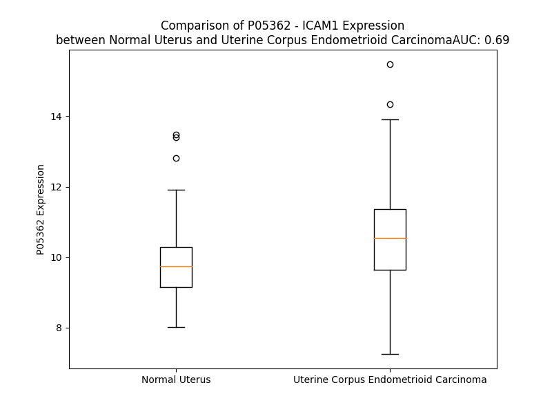

# Detailed Data for P05362

## Introduction to the Detailed Summary

### How to Interpret the Results

- **Summary & Metrics**: This section provides a quick reference to essential protein attributes, including expression changes, family classification, and biomarker applications. Regulation status (upregulated/downregulated) indicates the protein's behavior in a disease context. Some information comes from the original excel file with the proteins selected from literature, while others are derived from the analyses.
- **Expression Comparison**: A visual representation comparing protein expression between normal and disease states. It highlights significant changes in expression levels that might indicate diagnostic or therapeutic relevance. This is data coming from transcriptomics experiments and could not translate similarly to protein levels.
- **Isoform Alignment**: An interactive view of isoform alignments, revealing structural and functional differences between variants of the protein.
- **Interactors & Homologs**: Tables listing known interaction partners and homologous proteins, the more interactors and homologs, the more complex the protein is to design an antibody for.
- **Biological Assemblies**: Information about the structural arrangement of the protein in different assemblies, providing insights into its functional state but also the complexity of the protein to develop antibodies.
- **Combined Per-Residue Information**: A detailed table summarizing residue-level data. This includes predictions for epitope regions, aggregation tendencies, and modifications that might impact the protein's function. Each row corresponds to a residue in the protein, providing insights into specific sites that may be important for research or drug development.
## Summary & Metrics

- **UniProt Accession**: P05362
- **Gene Name**: ICAM1
- **Protein Name**: Intercellular adhesion molecule 1
- **Swiss Prot**: ICAM1_HUMAN
- **Family**: transmembrane receptor
- **Biomarker Application**: diagnosis,disease progression,efficacy,prognosis,unspecified application
- **Number of Isoforms**: 0
- **Regulation**: -1
- **(transcriptomics) AUC**: 0.6
- **(transcriptomics) Fold Change**: 1.04
- **(transcriptomics) Regulation**: Upregulated
- **Discotope Epitope Count**: 130
- **Max n_uniprots (Homo)**: 4
- **Max n_uniprots (Hetero)**: 5

## Expression Comparison

## Interactors

| preferredName_A   | preferredName_B   |   score |
|:------------------|:------------------|--------:|
| ICAM1             | VCAM1             |   0.999 |
| ICAM1             | ITGAL             |   0.999 |
| ICAM1             | ITGB2             |   0.999 |
| ICAM1             | ITGAM             |   0.999 |
| ICAM1             | CD80              |   0.998 |
| ICAM1             | EZR               |   0.998 |
| ICAM1             | CD58              |   0.996 |
| ICAM1             | CD44              |   0.995 |
| ICAM1             | MUC1              |   0.993 |
| ICAM1             | CD2               |   0.992 |
| ICAM1             | ICAM2             |   0.992 |
| ICAM1             | SELPLG            |   0.991 |
| ICAM1             | MSN               |   0.991 |
| ICAM1             | ITGA4             |   0.986 |
| ICAM1             | CD86              |   0.985 |
| ICAM1             | ITGAX             |   0.982 |
| ICAM1             | CD28              |   0.977 |
| ICAM1             | SPN               |   0.977 |
| ICAM1             | CD99              |   0.976 |
| ICAM1             | CD40              |   0.972 |
| ICAM1             | CD4               |   0.969 |
| ICAM1             | ITGB1             |   0.967 |
| ICAM1             | ICAM3             |   0.964 |
| ICAM1             | PLCG2             |   0.952 |
| ICAM1             | SELE              |   0.949 |
| ICAM1             | IL6               |   0.947 |
| ICAM1             | AREG              |   0.947 |
| ICAM1             | TNF               |   0.944 |
| ICAM1             | CXCL8             |   0.943 |
| ICAM1             | PLCG1             |   0.943 |
| ICAM1             | ITGA2B            |   0.938 |
| ICAM1             | CAV1              |   0.934 |
| ICAM1             | SELP              |   0.932 |
| ICAM1             | KRAS              |   0.931 |
| ICAM1             | CCL2              |   0.928 |
| ICAM1             | SELL              |   0.927 |
| ICAM1             | HRAS              |   0.922 |
| ICAM1             | NRAS              |   0.916 |
| ICAM1             | CD55              |   0.916 |
| ICAM1             | CD9               |   0.912 |
| ICAM1             | IL1B              |   0.912 |
| ICAM1             | FN1               |   0.904 |
| ICAM1             | NFKB1             |   0.903 |
| ICAM1             | IFNG              |   0.902 |

## Homologs

| uniprot_id   | gene_id   |
|:-------------|:----------|
| A0A9L9PXE8   | ICAM5     |
| P32942       | ICAM3     |
| Q6FHE2       | ICAM2     |
| U5U6P8       | ICAM4     |

## Biological Assemblies

|   Unnamed: 0 |   assembly |   n_uniprots | composition   | crystal_id   |
|-------------:|-----------:|-------------:|:--------------|:-------------|
|            0 |          1 |            4 | Homo          | 1d3e         |
|            0 |          1 |            3 | Hetero        | 2oz4         |
|            0 |          1 |            1 | Homo          | 1z7z         |
|            0 |          1 |            2 | Hetero        | 1mq8         |
|            1 |          2 |            2 | Hetero        | 1mq8         |
|            0 |          1 |            2 | Hetero        | 3tcx         |
|            1 |          2 |            2 | Hetero        | 3tcx         |
|            2 |          3 |            2 | Hetero        | 3tcx         |
|            3 |          4 |            2 | Hetero        | 3tcx         |
|            4 |          5 |            2 | Hetero        | 3tcx         |
|            5 |          6 |            2 | Hetero        | 3tcx         |
|            6 |          7 |            2 | Hetero        | 3tcx         |
|            7 |          8 |            2 | Hetero        | 3tcx         |
|            8 |          9 |            2 | Hetero        | 3tcx         |
|            9 |         10 |            2 | Hetero        | 3tcx         |
|           10 |         11 |            2 | Hetero        | 3tcx         |
|           11 |         12 |            2 | Hetero        | 3tcx         |
|           12 |         13 |            2 | Hetero        | 3tcx         |
|           13 |         14 |            2 | Hetero        | 3tcx         |
|            0 |          1 |            4 | Hetero        | 6eit         |
|            0 |          1 |            2 | Hetero        | 6s8u         |
|            0 |          1 |            5 | Hetero        | 1d3i         |
|            0 |          1 |            1 | Homo          | 1d3l         |
|            0 |          1 |            1 | Homo          | 1ic1         |
|            1 |          2 |            1 | Homo          | 1ic1         |
|            0 |          1 |            5 | Hetero        | 7bg7         |
|            0 |          1 |            2 | Hetero        | 5mza         |
|            0 |          1 |            1 | Homo          | 1p53         |
|            1 |          2 |            1 | Homo          | 1p53         |
|            0 |          1 |            1 | Homo          | 1iam         |

## Combined Per-Residue Information

|   res | aa   |   epitope_score | epitope   |   relative_surface_accessibility |   modeling_confidence |   Aggregation | modification     | glycosylation                             |
|------:|:-----|----------------:|:----------|---------------------------------:|----------------------:|--------------:|:-----------------|:------------------------------------------|
|     1 | M    |         0.1174  | False     |                          1.34726 |                 44.51 |         0     | N/A              | N/A                                       |
|     2 | A    |         0.14117 | True      |                          0.87248 |                 45.87 |         0     | N/A              | N/A                                       |
|     3 | P    |         0.1382  | True      |                          0.91738 |                 50.67 |         0     | N/A              | N/A                                       |
|     4 | S    |         0.19224 | True      |                          0.69527 |                 44.71 |         0     | N/A              | N/A                                       |
|     5 | S    |         0.1438  | True      |                          0.80384 |                 45.37 |         0     | N/A              | N/A                                       |
|     6 | P    |         0.14496 | True      |                          0.92344 |                 47.67 |         0     | N/A              | N/A                                       |
|     7 | R    |         0.16077 | True      |                          0.8989  |                 43.99 |         0     | N/A              | N/A                                       |
|     8 | P    |         0.16684 | True      |                          0.87331 |                 49.11 |         0     | N/A              | N/A                                       |
|     9 | A    |         0.17509 | True      |                          0.9966  |                 48.13 |         0     | N/A              | N/A                                       |
|    10 | L    |         0.18789 | True      |                          0.99533 |                 42.11 |         0     | N/A              | N/A                                       |
|    11 | P    |         0.20914 | True      |                          0.89718 |                 42.45 |         0.551 | N/A              | N/A                                       |
|    12 | A    |         0.11886 | False     |                          0.74225 |                 46.01 |        44.667 | N/A              | N/A                                       |
|    13 | L    |         0.14458 | True      |                          1.11598 |                 44.76 |        91.609 | N/A              | N/A                                       |
|    14 | L    |         0.14083 | True      |                          0.93517 |                 43.9  |        94.973 | N/A              | N/A                                       |
|    15 | V    |         0.16313 | True      |                          0.92273 |                 49.19 |        95.503 | N/A              | N/A                                       |
|    16 | L    |         0.20085 | True      |                          0.93709 |                 45.51 |        95.527 | N/A              | N/A                                       |
|    17 | L    |         0.16851 | True      |                          1.13874 |                 39.4  |        91.048 | N/A              | N/A                                       |
|    18 | G    |         0.19629 | True      |                          0.82389 |                 40.12 |        38.015 | N/A              | N/A                                       |
|    19 | A    |         0.14262 | True      |                          0.91296 |                 41.01 |        32.771 | N/A              | N/A                                       |
|    20 | L    |         0.17569 | True      |                          1.12421 |                 38.86 |        28.264 | N/A              | N/A                                       |
|    21 | F    |         0.11724 | False     |                          0.9353  |                 42.38 |         3.624 | N/A              | N/A                                       |
|    22 | P    |         0.15661 | True      |                          0.99753 |                 41.45 |         1.55  | N/A              | N/A                                       |
|    23 | G    |         0.17818 | True      |                          0.63685 |                 37.91 |         0     | N/A              | N/A                                       |
|    24 | P    |         0.1297  | False     |                          0.94575 |                 45.18 |         0     | N/A              | N/A                                       |
|    25 | G    |         0.13619 | False     |                          0.7595  |                 47.32 |         0     | N/A              | N/A                                       |
|    26 | N    |         0.12132 | False     |                          0.77831 |                 59.89 |         0     | N/A              | N/A                                       |
|    27 | A    |         0.07737 | False     |                          0.10827 |                 68.72 |         0     | N/A              | N/A                                       |
|    28 | Q    |         0.07167 | False     |                          0.64153 |                 88.26 |         0     | N/A              | N/A                                       |
|    29 | T    |         0.0202  | False     |                          0.10518 |                 92.12 |         0     | N/A              | N/A                                       |
|    30 | S    |         0.06382 | False     |                          0.43544 |                 93.93 |         0     | N/A              | N/A                                       |
|    31 | V    |         0.0492  | False     |                          0.16297 |                 95.24 |         0     | N/A              | N/A                                       |
|    32 | S    |         0.08939 | False     |                          0.49599 |                 95.46 |         0     | N/A              | N/A                                       |
|    33 | P    |         0.11245 | False     |                          0.40459 |                 95.22 |         0     | N/A              | N/A                                       |
|    34 | S    |         0.09279 | False     |                          0.51861 |                 94.97 |         0     | N/A              | N/A                                       |
|    35 | K    |         0.07942 | False     |                          0.68333 |                 95.05 |         0     | N/A              | N/A                                       |
|    36 | V    |         0.03304 | False     |                          0.1816  |                 94.35 |         0     | N/A              | N/A                                       |
|    37 | I    |         0.06637 | False     |                          0.19748 |                 94.89 |         0     | N/A              | N/A                                       |
|    38 | L    |         0.03071 | False     |                          0.0577  |                 94.89 |         0     | N/A              | N/A                                       |
|    39 | P    |         0.07989 | False     |                          0.49405 |                 95.22 |         0     | N/A              | N/A                                       |
|    40 | R    |         0.12025 | False     |                          0.42499 |                 94.88 |         0     | N/A              | N/A                                       |
|    41 | G    |         0.05873 | False     |                          0.38061 |                 94.59 |         0     | N/A              | N/A                                       |
|    42 | G    |         0.0472  | False     |                          0.19316 |                 94.56 |         0.32  | N/A              | N/A                                       |
|    43 | S    |         0.10695 | False     |                          0.50991 |                 96.01 |         3.827 | N/A              | N/A                                       |
|    44 | V    |         0.02395 | False     |                          0.08256 |                 96.07 |         9.716 | N/A              | N/A                                       |
|    45 | L    |         0.16735 | True      |                          0.59063 |                 95.83 |         9.716 | N/A              | N/A                                       |
|    46 | V    |         0.00248 | False     |                          0       |                 95.92 |         9.716 | N/A              | N/A                                       |
|    47 | T    |         0.06936 | False     |                          0.12756 |                 94.84 |         9.515 | N/A              | N/A                                       |
|    48 | C    |         0.00367 | False     |                          0       |                 93.68 |         6.499 | N/A              | N/A                                       |
|    49 | S    |         0.05618 | False     |                          0.22646 |                 92.61 |         0.947 | N/A              | N/A                                       |
|    50 | T    |         0.03857 | False     |                          0.07411 |                 91.15 |         0.337 | N/A              | N/A                                       |
|    51 | S    |         0.13519 | False     |                          0.63304 |                 89.45 |         0     | N/A              | N/A                                       |
|    52 | C    |         0.05037 | False     |                          0.08011 |                 83.96 |         0     | N/A              | N/A                                       |
|    53 | D    |         0.11079 | False     |                          0.79849 |                 77.04 |         0     | N/A              | N/A                                       |
|    54 | Q    |         0.17937 | True      |                          0.76849 |                 77.81 |         0     | N/A              | N/A                                       |
|    55 | P    |         0.05898 | False     |                          0.10689 |                 82    |         0     | N/A              | N/A                                       |
|    56 | K    |         0.22255 | True      |                          0.81199 |                 86.26 |         0     | N/A              | N/A                                       |
|    57 | L    |         0.16294 | True      |                          0.5144  |                 89.08 |         0     | N/A              | N/A                                       |
|    58 | L    |         0.03347 | False     |                          0.02576 |                 91.24 |         0     | N/A              | N/A                                       |
|    59 | G    |         0.12426 | False     |                          0.06599 |                 92.01 |         0     | N/A              | N/A                                       |
|    60 | I    |         0.0288  | False     |                          0.01515 |                 95.27 |         0     | N/A              | N/A                                       |
|    61 | E    |         0.20222 | True      |                          0.52847 |                 96.04 |         0     | N/A              | N/A                                       |
|    62 | T    |         0.17418 | True      |                          0.15961 |                 95.61 |         0     | N/A              | N/A                                       |
|    63 | P    |         0.18943 | True      |                          0.95116 |                 93.6  |         0     | N/A              | N/A                                       |
|    64 | L    |         0.06699 | False     |                          0.15175 |                 95.26 |         0     | N/A              | N/A                                       |
|    65 | P    |         0.08381 | False     |                          0.60013 |                 95.46 |         0     | N/A              | N/A                                       |
|    66 | K    |         0.11148 | False     |                          0.52581 |                 94.73 |         0     | N/A              | N/A                                       |
|    67 | K    |         0.14809 | True      |                          0.62901 |                 94.2  |         0     | N/A              | N/A                                       |
|    68 | E    |         0.11575 | False     |                          0.44139 |                 92.67 |         0     | N/A              | N/A                                       |
|    69 | L    |         0.18827 | True      |                          0.36641 |                 88.93 |         0     | N/A              | N/A                                       |
|    70 | L    |         0.23    | True      |                          1.14029 |                 72.78 |         0     | N/A              | N/A                                       |
|    71 | L    |         0.24543 | True      |                          0.52296 |                 70.32 |         0     | N/A              | N/A                                       |
|    72 | P    |         0.16748 | True      |                          0.98878 |                 62.84 |         0     | N/A              | N/A                                       |
|    73 | G    |         0.26927 | True      |                          0.56906 |                 68.46 |         0     | N/A              | N/A                                       |
|    74 | N    |         0.20842 | True      |                          0.68665 |                 75.81 |         0     | N/A              | N/A                                       |
|    75 | N    |         0.12427 | False     |                          0.35476 |                 87.02 |         0     | N/A              | N/A                                       |
|    76 | R    |         0.27558 | True      |                          0.54838 |                 90.76 |         0     | N/A              | N/A                                       |
|    77 | K    |         0.05105 | False     |                          0.24276 |                 91.66 |         0     | N/A              | N/A                                       |
|    78 | V    |         0.12173 | False     |                          0.09997 |                 94.36 |         0     | N/A              | N/A                                       |
|    79 | Y    |         0.02117 | False     |                          0.042   |                 94.94 |         0     | N/A              | N/A                                       |
|    80 | E    |         0.08331 | False     |                          0.27088 |                 96.33 |         0     | N/A              | N/A                                       |
|    81 | L    |         0.00696 | False     |                          0       |                 96.76 |         0     | N/A              | N/A                                       |
|    82 | S    |         0.13125 | False     |                          0.30921 |                 96.21 |         0     | N/A              | N/A                                       |
|    83 | N    |         0.06543 | False     |                          0.51993 |                 95.65 |         0     | N/A              | N/A                                       |
|    84 | V    |         0.00243 | False     |                          0       |                 95.56 |         0     | N/A              | N/A                                       |
|    85 | Q    |         0.17721 | True      |                          0.4641  |                 94    |         0     | N/A              | N/A                                       |
|    86 | E    |         0.11733 | False     |                          0.65095 |                 93.41 |         0     | N/A              | N/A                                       |
|    87 | D    |         0.09654 | False     |                          0.54059 |                 94.16 |         0     | N/A              | N/A                                       |
|    88 | S    |         0.04243 | False     |                          0.10994 |                 95.56 |         0     | N/A              | N/A                                       |
|    89 | Q    |         0.18274 | True      |                          0.5484  |                 96.79 |         0     | N/A              | N/A                                       |
|    90 | P    |         0.01023 | False     |                          0.00867 |                 96.69 |         0     | N/A              | N/A                                       |
|    91 | M    |         0.10223 | False     |                          0.24003 |                 96.57 |         0     | N/A              | N/A                                       |
|    92 | C    |         0.00244 | False     |                          0       |                 95.01 |         0     | N/A              | N/A                                       |
|    93 | Y    |         0.10135 | False     |                          0.22983 |                 94.35 |         0     | N/A              | N/A                                       |
|    94 | S    |         0.0031  | False     |                          0       |                 92.62 |         0     | N/A              | N/A                                       |
|    95 | N    |         0.19043 | True      |                          0.27396 |                 90.48 |         0     | N/A              | N/A                                       |
|    96 | C    |         0.03769 | False     |                          0.06588 |                 86.65 |         0     | N/A              | N/A                                       |
|    97 | P    |         0.23181 | True      |                          0.65729 |                 84.28 |         0     | N/A              | N/A                                       |
|    98 | D    |         0.22366 | True      |                          0.62248 |                 82.07 |         0     | N/A              | N/A                                       |
|    99 | G    |         0.20129 | True      |                          0.42504 |                 85.55 |         0     | N/A              | N/A                                       |
|   100 | Q    |         0.32243 | True      |                          0.63667 |                 89.64 |         0     | N/A              | N/A                                       |
|   101 | S    |         0.04817 | False     |                          0.18511 |                 92.32 |         0     | N/A              | N/A                                       |
|   102 | T    |         0.24393 | True      |                          0.49457 |                 94.51 |         0     | N/A              | N/A                                       |
|   103 | A    |         0.02201 | False     |                          0.16835 |                 95.8  |         0     | N/A              | N/A                                       |
|   104 | K    |         0.15306 | True      |                          0.52267 |                 97.1  |         0     | N/A              | N/A                                       |
|   105 | T    |         0.00156 | False     |                          0       |                 96.92 |        29.472 | N/A              | N/A                                       |
|   106 | F    |         0.06436 | False     |                          0.49623 |                 96.67 |        77.604 | N/A              | N/A                                       |
|   107 | L    |         0.00996 | False     |                          0.01706 |                 96.22 |        87.007 | N/A              | N/A                                       |
|   108 | T    |         0.02248 | False     |                          0.19495 |                 95.51 |        87.007 | N/A              | N/A                                       |
|   109 | V    |         0.02431 | False     |                          0.05278 |                 95.46 |        87.032 | N/A              | N/A                                       |
|   110 | Y    |         0.06099 | False     |                          0.16592 |                 96.67 |        86.193 | N/A              | N/A                                       |
|   111 | W    |         0.08851 | False     |                          0.22903 |                 96.78 |        78.673 | N/A              | N/A                                       |
|   112 | T    |         0.07163 | False     |                          0.33036 |                 96.94 |         2.72  | N/A              | N/A                                       |
|   113 | P    |         0.02237 | False     |                          0.06449 |                 97.12 |         0.687 | N/A              | N/A                                       |
|   114 | E    |         0.22749 | True      |                          0.5759  |                 95.12 |         0     | N/A              | N/A                                       |
|   115 | R    |         0.10357 | False     |                          0.48209 |                 96.8  |         0     | N/A              | N/A                                       |
|   116 | V    |         0.02876 | False     |                          0.08829 |                 97.96 |         0     | N/A              | N/A                                       |
|   117 | E    |         0.08624 | False     |                          0.32312 |                 97.53 |         0     | N/A              | N/A                                       |
|   118 | L    |         0.03619 | False     |                          0.13502 |                 97.37 |         0     | N/A              | N/A                                       |
|   119 | A    |         0.06604 | False     |                          0.18083 |                 96.73 |         0     | N/A              | N/A                                       |
|   120 | P    |         0.21039 | True      |                          0.99782 |                 94.76 |         0     | N/A              | N/A                                       |
|   121 | L    |         0.06004 | False     |                          0.28564 |                 93.35 |         0     | N/A              | N/A                                       |
|   122 | P    |         0.08259 | False     |                          0.57076 |                 92.09 |         0     | N/A              | N/A                                       |
|   123 | S    |         0.11809 | False     |                          0.4145  |                 88.71 |         0     | N/A              | N/A                                       |
|   124 | W    |         0.05447 | False     |                          0.30386 |                 92.64 |         0     | N/A              | N/A                                       |
|   125 | Q    |         0.05713 | False     |                          0.11146 |                 94.47 |         0     | N/A              | N/A                                       |
|   126 | P    |         0.02863 | False     |                          0.32109 |                 93.25 |         0     | N/A              | N/A                                       |
|   127 | V    |         0.07216 | False     |                          0.37207 |                 94.42 |         0     | N/A              | N/A                                       |
|   128 | G    |         0.0776  | False     |                          0.59016 |                 93.59 |         0     | N/A              | N/A                                       |
|   129 | K    |         0.11906 | False     |                          0.63117 |                 92.49 |         0     | N/A              | N/A                                       |
|   130 | N    |         0.12656 | False     |                          0.6822  |                 93.89 |         0     | N/A              | N-linked (GlcNAc...) asparagine           |
|   131 | L    |         0.01863 | False     |                          0.03133 |                 93.99 |         0     | N/A              | N/A                                       |
|   132 | T    |         0.10171 | False     |                          0.48483 |                 96.44 |         0     | N/A              | N/A                                       |
|   133 | L    |         0.00177 | False     |                          0.00082 |                 97.14 |         0     | N/A              | N/A                                       |
|   134 | R    |         0.16964 | True      |                          0.40717 |                 97.94 |         0     | N/A              | N/A                                       |
|   135 | C    |         0.00129 | False     |                          0       |                 98.16 |         0     | N/A              | N/A                                       |
|   136 | Q    |         0.07133 | False     |                          0.21431 |                 97.84 |         0     | N/A              | N/A                                       |
|   137 | V    |         0.00305 | False     |                          0       |                 98.25 |         0     | N/A              | N/A                                       |
|   138 | E    |         0.17154 | True      |                          0.32105 |                 97.62 |         0     | N/A              | N/A                                       |
|   139 | G    |         0.03215 | False     |                          0.06302 |                 94.79 |         0     | N/A              | N/A                                       |
|   140 | G    |         0.02561 | False     |                          0.02141 |                 95.45 |         0     | N/A              | N/A                                       |
|   141 | A    |         0.06646 | False     |                          0.21299 |                 94.86 |         0     | N/A              | N/A                                       |
|   142 | P    |         0.11231 | False     |                          0.19186 |                 95.45 |         0     | N/A              | N/A                                       |
|   143 | R    |         0.09919 | False     |                          0.27343 |                 94.27 |         0     | N/A              | N/A                                       |
|   144 | A    |         0.11499 | False     |                          1.00306 |                 94.21 |         0.883 | N/A              | N/A                                       |
|   145 | N    |         0.06656 | False     |                          0.2047  |                 96.4  |         1.927 | N/A              | N-linked (GlcNAc...) (complex) asparagine |
|   146 | L    |         0.01312 | False     |                          0.0137  |                 97.76 |        69.989 | N/A              | N/A                                       |
|   147 | T    |         0.04808 | False     |                          0.16598 |                 98.18 |        80.52  | N/A              | N/A                                       |
|   148 | V    |         0.00118 | False     |                          0       |                 98.21 |        80.52  | N/A              | N/A                                       |
|   149 | V    |         0.01079 | False     |                          0.00476 |                 98.16 |        80.52  | N/A              | N/A                                       |
|   150 | L    |         0.00601 | False     |                          0       |                 98.3  |        80.381 | N/A              | N/A                                       |
|   151 | L    |         0.05739 | False     |                          0.07007 |                 97.88 |        69.551 | N/A              | N/A                                       |
|   152 | R    |         0.06905 | False     |                          0.28088 |                 96.15 |         0.031 | N/A              | N/A                                       |
|   153 | G    |         0.11113 | False     |                          0.44915 |                 94.06 |         0.031 | N/A              | N/A                                       |
|   154 | E    |         0.23284 | True      |                          0.87029 |                 92.25 |         0.031 | N/A              | N/A                                       |
|   155 | K    |         0.13555 | False     |                          0.60962 |                 95.72 |         0     | N/A              | N/A                                       |
|   156 | E    |         0.09948 | False     |                          0.47228 |                 97.11 |         0     | N/A              | N/A                                       |
|   157 | L    |         0.06025 | False     |                          0.32323 |                 96.88 |         0     | N/A              | N/A                                       |
|   158 | K    |         0.09377 | False     |                          0.36662 |                 97.7  |         0     | N/A              | N/A                                       |
|   159 | R    |         0.19601 | True      |                          0.56026 |                 97.77 |         0     | N/A              | N/A                                       |
|   160 | E    |         0.06294 | False     |                          0.29852 |                 97.7  |         0     | N/A              | N/A                                       |
|   161 | P    |         0.09003 | False     |                          0.7013  |                 97.45 |         0     | N/A              | N/A                                       |
|   162 | A    |         0.02841 | False     |                          0.03616 |                 97.01 |         0     | N/A              | N/A                                       |
|   163 | V    |         0.14299 | True      |                          0.83079 |                 95.77 |         0     | N/A              | N/A                                       |
|   164 | G    |         0.12072 | False     |                          0.51287 |                 94.54 |         0     | N/A              | N/A                                       |
|   165 | E    |         0.16723 | True      |                          0.63504 |                 94.6  |         0     | N/A              | N/A                                       |
|   166 | P    |         0.33644 | True      |                          0.40031 |                 94.7  |         0     | N/A              | N/A                                       |
|   167 | A    |         0.00651 | False     |                          0.00383 |                 97.18 |         0     | N/A              | N/A                                       |
|   168 | E    |         0.10788 | False     |                          0.33598 |                 97.42 |         0.098 | N/A              | N/A                                       |
|   169 | V    |         0.01827 | False     |                          0.02095 |                 97.81 |        55.797 | N/A              | N/A                                       |
|   170 | T    |         0.19331 | True      |                          0.48302 |                 97.47 |        60.508 | N/A              | N/A                                       |
|   171 | T    |         0.10826 | False     |                          0.16578 |                 97.15 |        61.369 | N/A              | N/A                                       |
|   172 | T    |         0.11319 | False     |                          0.67118 |                 96.34 |        61.369 | N/A              | N/A                                       |
|   173 | V    |         0.04814 | False     |                          0.09521 |                 95.77 |        61.369 | N/A              | N/A                                       |
|   174 | L    |         0.07808 | False     |                          0.59997 |                 96.02 |        61.112 | N/A              | N/A                                       |
|   175 | V    |         0.00753 | False     |                          0.00563 |                 95.47 |        49.767 | N/A              | N/A                                       |
|   176 | R    |         0.15346 | True      |                          0.53499 |                 94.54 |         0.098 | N/A              | N/A                                       |
|   177 | R    |         0.09162 | False     |                          0.44266 |                 92.59 |         0     | N/A              | N/A                                       |
|   178 | D    |         0.14479 | True      |                          0.60499 |                 91.97 |         0     | N/A              | N/A                                       |
|   179 | H    |         0.04665 | False     |                          0.04624 |                 94.15 |         0     | N/A              | N/A                                       |
|   180 | H    |         0.06226 | False     |                          0.34068 |                 93.37 |         0     | N/A              | N/A                                       |
|   181 | G    |         0.05625 | False     |                          0.32972 |                 93.88 |         0     | N/A              | N/A                                       |
|   182 | A    |         0.05065 | False     |                          0.21008 |                 94.94 |         0     | N/A              | N/A                                       |
|   183 | N    |         0.05391 | False     |                          0.45077 |                 96.11 |         0     | N/A              | N-linked (GlcNAc...) asparagine           |
|   184 | F    |         0.00191 | False     |                          0       |                 97.22 |         0     | N/A              | N/A                                       |
|   185 | S    |         0.06132 | False     |                          0.1316  |                 97.76 |         0     | N/A              | N/A                                       |
|   186 | C    |         0.00191 | False     |                          0       |                 97.62 |         0     | N/A              | N/A                                       |
|   187 | R    |         0.17048 | True      |                          0.27279 |                 97.99 |         0     | N/A              | N/A                                       |
|   188 | T    |         0.00985 | False     |                          0.0053  |                 98.13 |         0     | N/A              | N/A                                       |
|   189 | E    |         0.07195 | False     |                          0.17134 |                 98.11 |         0     | N/A              | N/A                                       |
|   190 | L    |         0.01704 | False     |                          0.00401 |                 98.02 |         0     | N/A              | N/A                                       |
|   191 | D    |         0.09364 | False     |                          0.24187 |                 97.75 |         0     | N/A              | N/A                                       |
|   192 | L    |         0.00681 | False     |                          0       |                 96.62 |         0     | N/A              | N/A                                       |
|   193 | R    |         0.34057 | True      |                          0.56996 |                 96.64 |         0     | N/A              | N/A                                       |
|   194 | P    |         0.23558 | True      |                          0.77203 |                 94.01 |         0     | N/A              | N/A                                       |
|   195 | Q    |         0.15361 | True      |                          0.3288  |                 92.25 |         0     | N/A              | N/A                                       |
|   196 | G    |         0.1514  | True      |                          0.81593 |                 90.92 |         0     | N/A              | N/A                                       |
|   197 | L    |         0.21002 | True      |                          0.40488 |                 94.47 |         0     | N/A              | N/A                                       |
|   198 | E    |         0.2627  | True      |                          0.5329  |                 95.73 |         0     | N/A              | N/A                                       |
|   199 | L    |         0.15662 | True      |                          0.33766 |                 97.5  |         0     | N/A              | N/A                                       |
|   200 | F    |         0.04983 | False     |                          0.24891 |                 97.67 |         0     | N/A              | N/A                                       |
|   201 | E    |         0.16407 | True      |                          0.47129 |                 97.24 |         0     | N/A              | N/A                                       |
|   202 | N    |         0.12369 | False     |                          0.3188  |                 96.54 |         0     | N/A              | N-linked (GlcNAc...) asparagine           |
|   203 | T    |         0.12769 | False     |                          0.58684 |                 97    |         0     | N/A              | N/A                                       |
|   204 | S    |         0.0127  | False     |                          0.0631  |                 97.25 |         0     | N/A              | N/A                                       |
|   205 | A    |         0.10576 | False     |                          0.61972 |                 96.82 |         0     | N/A              | N/A                                       |
|   206 | P    |         0.10992 | False     |                          0.67848 |                 96.12 |         0     | N/A              | N/A                                       |
|   207 | Y    |         0.09292 | False     |                          0.12012 |                 96.48 |         0.151 | N/A              | N/A                                       |
|   208 | Q    |         0.09245 | False     |                          0.47229 |                 95.04 |         0.151 | N/A              | N/A                                       |
|   209 | L    |         0.00219 | False     |                          0       |                 94.41 |         1.274 | N/A              | N/A                                       |
|   210 | Q    |         0.0282  | False     |                          0.1589  |                 94.26 |         1.274 | N/A              | N/A                                       |
|   211 | T    |         0.00809 | False     |                          0       |                 94.04 |         1.482 | N/A              | N/A                                       |
|   212 | F    |         0.02793 | False     |                          0.05234 |                 94.76 |         1.482 | N/A              | N/A                                       |
|   213 | V    |         0.11487 | False     |                          0.38464 |                 95.05 |         1.482 | N/A              | N/A                                       |
|   214 | L    |         0.0426  | False     |                          0.09764 |                 95.54 |         0.208 | N/A              | N/A                                       |
|   215 | P    |         0.12814 | False     |                          0.23162 |                 93.78 |         0.208 | N/A              | N/A                                       |
|   216 | A    |         0.15735 | True      |                          0.89957 |                 92.61 |         0     | N/A              | N/A                                       |
|   217 | T    |         0.15616 | True      |                          0.52644 |                 95.07 |         0     | N/A              | N/A                                       |
|   218 | P    |         0.10875 | False     |                          0.61936 |                 96.85 |         0     | N/A              | N/A                                       |
|   219 | P    |         0.0071  | False     |                          0.0169  |                 97.77 |         0     | N/A              | N/A                                       |
|   220 | Q    |         0.07314 | False     |                          0.66897 |                 97.5  |         0     | N/A              | N/A                                       |
|   221 | L    |         0.02315 | False     |                          0.08439 |                 97.74 |         0     | N/A              | N/A                                       |
|   222 | V    |         0.09147 | False     |                          0.70615 |                 97.24 |         0     | N/A              | N/A                                       |
|   223 | S    |         0.04375 | False     |                          0.15201 |                 95.11 |         0     | N/A              | N/A                                       |
|   224 | P    |         0.07767 | False     |                          0.35401 |                 92.93 |         0     | N/A              | N/A                                       |
|   225 | R    |         0.1744  | True      |                          0.57013 |                 92.56 |         0     | N/A              | N/A                                       |
|   226 | V    |         0.03697 | False     |                          0.15094 |                 93.8  |         0     | N/A              | N/A                                       |
|   227 | L    |         0.0217  | False     |                          0.07831 |                 94.52 |         0     | N/A              | N/A                                       |
|   228 | E    |         0.01661 | False     |                          0.19479 |                 93.51 |         0     | N/A              | N/A                                       |
|   229 | V    |         0.07225 | False     |                          0.12274 |                 93.21 |         0     | N/A              | N/A                                       |
|   230 | D    |         0.16913 | True      |                          0.78049 |                 89.29 |         0     | N/A              | N/A                                       |
|   231 | T    |         0.12792 | False     |                          0.38051 |                 91.36 |         0     | N/A              | N/A                                       |
|   232 | Q    |         0.16603 | True      |                          0.64903 |                 91.38 |         0     | N/A              | N/A                                       |
|   233 | G    |         0.02981 | False     |                          0.04989 |                 93.66 |         0     | N/A              | N/A                                       |
|   234 | T    |         0.06966 | False     |                          0.4064  |                 96.58 |         0.24  | N/A              | N/A                                       |
|   235 | V    |         0.00815 | False     |                          0.01333 |                 97.42 |         0.644 | N/A              | N/A                                       |
|   236 | V    |         0.08299 | False     |                          0.2956  |                 98.15 |         0.644 | N/A              | N/A                                       |
|   237 | C    |         0.00092 | False     |                          0       |                 98.22 |         0.644 | N/A              | N/A                                       |
|   238 | S    |         0.07201 | False     |                          0.22309 |                 97.85 |         0.644 | N/A              | N/A                                       |
|   239 | L    |         0.04232 | False     |                          0.05771 |                 98    |         0.644 | N/A              | N/A                                       |
|   240 | D    |         0.16972 | True      |                          0.61516 |                 96.62 |         0     | N/A              | N/A                                       |
|   241 | G    |         0.1068  | False     |                          0.5263  |                 95.16 |         0     | N/A              | N/A                                       |
|   242 | L    |         0.00813 | False     |                          0.00069 |                 95.56 |         0     | N/A              | N/A                                       |
|   243 | F    |         0.07911 | False     |                          0.17312 |                 95.39 |         0     | N/A              | N/A                                       |
|   244 | P    |         0.08159 | False     |                          0.06064 |                 95.2  |         0     | N/A              | N/A                                       |
|   245 | V    |         0.05633 | False     |                          0.14342 |                 95.24 |         0     | N/A              | N/A                                       |
|   246 | S    |         0.11704 | False     |                          0.60565 |                 93.71 |         0     | N/A              | N/A                                       |
|   247 | E    |         0.13597 | False     |                          0.35447 |                 94.18 |         0     | N/A              | N/A                                       |
|   248 | A    |         0.02846 | False     |                          0.11413 |                 95.42 |         0     | N/A              | N/A                                       |
|   249 | Q    |         0.1042  | False     |                          0.54423 |                 95.76 |         0     | N/A              | N/A                                       |
|   250 | V    |         0.0283  | False     |                          0.16723 |                 97.01 |         0     | N/A              | N/A                                       |
|   251 | H    |         0.14284 | True      |                          0.52041 |                 96.89 |         0     | N/A              | N/A                                       |
|   252 | L    |         0.01994 | False     |                          0.02665 |                 97.46 |         0     | N/A              | N/A                                       |
|   253 | A    |         0.06005 | False     |                          0.17312 |                 97.24 |         0     | N/A              | N/A                                       |
|   254 | L    |         0.03188 | False     |                          0.05649 |                 96.6  |         0     | N/A              | N/A                                       |
|   255 | G    |         0.04047 | False     |                          0.35749 |                 93.63 |         0     | N/A              | N/A                                       |
|   256 | D    |         0.19743 | True      |                          0.7843  |                 92.05 |         0     | N/A              | N/A                                       |
|   257 | Q    |         0.11992 | False     |                          0.37424 |                 93.57 |         0     | N/A              | N/A                                       |
|   258 | R    |         0.18691 | True      |                          0.77437 |                 96.28 |         0     | N/A              | N/A                                       |
|   259 | L    |         0.02824 | False     |                          0.08846 |                 96.31 |         0     | N/A              | N/A                                       |
|   260 | N    |         0.14084 | True      |                          0.9037  |                 95.02 |         0     | N/A              | N/A                                       |
|   261 | P    |         0.05787 | False     |                          0.26578 |                 96.69 |         0     | N/A              | N/A                                       |
|   262 | T    |         0.06029 | False     |                          0.70411 |                 97.04 |         0     | N/A              | N/A                                       |
|   263 | V    |         0.07799 | False     |                          0.33423 |                 97.07 |         0     | N/A              | N/A                                       |
|   264 | T    |         0.11045 | False     |                          0.61968 |                 97.1  |         0     | N/A              | N/A                                       |
|   265 | Y    |         0.15457 | True      |                          0.51808 |                 96.9  |         0     | N/A              | N/A                                       |
|   266 | G    |         0.14004 | True      |                          0.50901 |                 94.13 |         0     | N/A              | N/A                                       |
|   267 | N    |         0.23841 | True      |                          0.90354 |                 93.62 |         0     | N/A              | N-linked (GlcNAc...) asparagine           |
|   268 | D    |         0.09383 | False     |                          0.19225 |                 94.18 |         0     | N/A              | N/A                                       |
|   269 | S    |         0.05151 | False     |                          0.21818 |                 96.97 |         0     | N/A              | N/A                                       |
|   270 | F    |         0.02016 | False     |                          0.03109 |                 97.94 |         0     | N/A              | N/A                                       |
|   271 | S    |         0.0851  | False     |                          0.33427 |                 97.84 |         0     | N/A              | N/A                                       |
|   272 | A    |         0.0029  | False     |                          0       |                 97.99 |         0     | N/A              | N/A                                       |
|   273 | K    |         0.10506 | False     |                          0.57482 |                 97.92 |         0     | N/A              | N/A                                       |
|   274 | A    |         0.02566 | False     |                          0.02423 |                 97.73 |         0.18  | N/A              | N/A                                       |
|   275 | S    |         0.12625 | False     |                          0.49552 |                 95.71 |         0.393 | N/A              | N/A                                       |
|   276 | V    |         0.01682 | False     |                          0.0219  |                 95.28 |         0.393 | N/A              | N/A                                       |
|   277 | S    |         0.1559  | True      |                          0.48314 |                 92.48 |         0.393 | N/A              | N/A                                       |
|   278 | V    |         0.04114 | False     |                          0.02138 |                 93.41 |         0.393 | N/A              | N/A                                       |
|   279 | T    |         0.17272 | True      |                          0.50122 |                 92.56 |         0.393 | N/A              | N/A                                       |
|   280 | A    |         0.12495 | False     |                          0.61444 |                 90.35 |         0     | N/A              | N/A                                       |
|   281 | E    |         0.16782 | True      |                          0.87789 |                 90.62 |         0     | N/A              | N/A                                       |
|   282 | D    |         0.06597 | False     |                          0.25952 |                 91.09 |         0     | N/A              | N/A                                       |
|   283 | E    |         0.0929  | False     |                          0.42322 |                 91.22 |         0     | N/A              | N/A                                       |
|   284 | G    |         0.03796 | False     |                          0.36172 |                 91.91 |         0     | N/A              | N/A                                       |
|   285 | T    |         0.11057 | False     |                          0.69261 |                 93.63 |         0     | N/A              | N/A                                       |
|   286 | Q    |         0.02493 | False     |                          0.22265 |                 94.71 |         0     | N/A              | N/A                                       |
|   287 | R    |         0.12918 | False     |                          0.58006 |                 95.79 |         0     | N/A              | N/A                                       |
|   288 | L    |         0.00346 | False     |                          0.00082 |                 97.18 |         8.682 | N/A              | N/A                                       |
|   289 | T    |         0.04118 | False     |                          0.21798 |                 97.75 |        10.254 | N/A              | N/A                                       |
|   290 | C    |         0.00126 | False     |                          0       |                 98.05 |        16.435 | N/A              | N/A                                       |
|   291 | A    |         0.07124 | False     |                          0.14522 |                 97.52 |        18.888 | N/A              | N/A                                       |
|   292 | V    |         0.00314 | False     |                          0       |                 97.64 |        19.001 | N/A              | N/A                                       |
|   293 | I    |         0.13839 | True      |                          0.31533 |                 96.5  |        18.887 | N/A              | N/A                                       |
|   294 | L    |         0.0265  | False     |                          0.01237 |                 94.5  |        17.421 | N/A              | N/A                                       |
|   295 | G    |         0.03963 | False     |                          0.2794  |                 88.9  |         3.792 | N/A              | N/A                                       |
|   296 | N    |         0.15449 | True      |                          0.88817 |                 87.36 |         0.113 | N/A              | N-linked (GlcNAc...) asparagine           |
|   297 | Q    |         0.09933 | False     |                          0.43094 |                 92.81 |         0     | N/A              | N/A                                       |
|   298 | S    |         0.22949 | True      |                          0.51645 |                 95.23 |         0     | N/A              | N/A                                       |
|   299 | Q    |         0.08284 | False     |                          0.18223 |                 97.25 |         0     | N/A              | N/A                                       |
|   300 | E    |         0.14578 | True      |                          0.46497 |                 97.44 |         0     | N/A              | N/A                                       |
|   301 | T    |         0.03284 | False     |                          0.14639 |                 98.01 |         0.502 | N/A              | N/A                                       |
|   302 | L    |         0.13047 | False     |                          0.53797 |                 96.72 |         1.351 | N/A              | N/A                                       |
|   303 | Q    |         0.0519  | False     |                          0.18507 |                 95.85 |         1.682 | N/A              | N/A                                       |
|   304 | T    |         0.05101 | False     |                          0.47856 |                 94.62 |        11.168 | N/A              | N/A                                       |
|   305 | V    |         0.01287 | False     |                          0.02095 |                 95.18 |        13.077 | N/A              | N/A                                       |
|   306 | T    |         0.05489 | False     |                          0.15387 |                 94.73 |        13.077 | N/A              | N/A                                       |
|   307 | I    |         0.01134 | False     |                          0.0201  |                 94.88 |        13.077 | N/A              | N/A                                       |
|   308 | Y    |         0.08774 | False     |                          0.10649 |                 93.5  |        12.773 | N/A              | N/A                                       |
|   309 | S    |         0.03417 | False     |                          0.23613 |                 92.89 |         2.955 | N/A              | N/A                                       |
|   310 | F    |         0.00992 | False     |                          0.00353 |                 92.84 |         0.148 | N/A              | N/A                                       |
|   311 | P    |         0.08625 | False     |                          0.57954 |                 90.69 |         0     | N/A              | N/A                                       |
|   312 | A    |         0.06428 | False     |                          0.47689 |                 92.21 |         0     | N/A              | N/A                                       |
|   313 | P    |         0.00414 | False     |                          0       |                 93.84 |         0     | N/A              | N/A                                       |
|   314 | N    |         0.07299 | False     |                          0.49104 |                 92.82 |         0.37  | N/A              | N/A                                       |
|   315 | V    |         0.01225 | False     |                          0.03448 |                 93.89 |         0.37  | N/A              | N/A                                       |
|   316 | I    |         0.07506 | False     |                          0.40117 |                 93.64 |         0.37  | N/A              | N/A                                       |
|   317 | L    |         0.04733 | False     |                          0.05545 |                 92.97 |         0.37  | N/A              | N/A                                       |
|   318 | T    |         0.13339 | False     |                          0.55715 |                 91.41 |         0.37  | N/A              | N/A                                       |
|   319 | K    |         0.15059 | True      |                          0.60561 |                 90.52 |         0     | N/A              | N/A                                       |
|   320 | P    |         0.11117 | False     |                          0.48061 |                 90.61 |         0     | N/A              | N/A                                       |
|   321 | E    |         0.07983 | False     |                          0.35732 |                 93.78 |         0     | N/A              | N/A                                       |
|   322 | V    |         0.02354 | False     |                          0.05332 |                 93.95 |         0     | N/A              | N/A                                       |
|   323 | S    |         0.07035 | False     |                          0.37197 |                 92.43 |         0     | N/A              | N/A                                       |
|   324 | E    |         0.07453 | False     |                          0.5013  |                 92.07 |         0     | N/A              | N/A                                       |
|   325 | G    |         0.04282 | False     |                          0.39143 |                 90.04 |         0     | N/A              | N/A                                       |
|   326 | T    |         0.0682  | False     |                          0.35715 |                 92.53 |         0     | N/A              | N/A                                       |
|   327 | E    |         0.09944 | False     |                          0.55109 |                 93.55 |         0     | N/A              | N/A                                       |
|   328 | V    |         0.00582 | False     |                          0.00301 |                 93.43 |         0     | N/A              | N/A                                       |
|   329 | T    |         0.05094 | False     |                          0.18626 |                 92.86 |         0     | N/A              | N/A                                       |
|   330 | V    |         0.00373 | False     |                          0       |                 93.06 |         0     | N/A              | N/A                                       |
|   331 | K    |         0.12406 | False     |                          0.40986 |                 93.47 |         0     | N/A              | N/A                                       |
|   332 | C    |         0.00181 | False     |                          0.00074 |                 93.37 |         0     | N/A              | N/A                                       |
|   333 | E    |         0.04898 | False     |                          0.32248 |                 92.51 |         0     | N/A              | N/A                                       |
|   334 | A    |         0.01682 | False     |                          0.20729 |                 92.43 |         0     | N/A              | N/A                                       |
|   335 | H    |         0.05658 | False     |                          0.23763 |                 89.76 |         0     | N/A              | N/A                                       |
|   336 | P    |         0.16355 | True      |                          0.75853 |                 88.9  |         0     | N/A              | N/A                                       |
|   337 | R    |         0.11639 | False     |                          0.7183  |                 88.66 |         0     | N/A              | N/A                                       |
|   338 | A    |         0.00988 | False     |                          0.01791 |                 91.84 |         0     | N/A              | N/A                                       |
|   339 | K    |         0.08675 | False     |                          0.56461 |                 92.03 |         0     | N/A              | N/A                                       |
|   340 | V    |         0.00334 | False     |                          0.00504 |                 93.91 |         0     | N/A              | N/A                                       |
|   341 | T    |         0.05962 | False     |                          0.24936 |                 91.81 |         0     | N/A              | N/A                                       |
|   342 | L    |         0.03567 | False     |                          0.04272 |                 90.89 |         0     | N/A              | N/A                                       |
|   343 | N    |         0.06348 | False     |                          0.34463 |                 86.87 |         0     | N/A              | N/A                                       |
|   344 | G    |         0.13129 | False     |                          0.76036 |                 80.65 |         0     | N/A              | N/A                                       |
|   345 | V    |         0.08263 | False     |                          0.70561 |                 84.22 |         0     | N/A              | N/A                                       |
|   346 | P    |         0.12649 | False     |                          0.53205 |                 83.05 |         0     | N/A              | N/A                                       |
|   347 | A    |         0.02198 | False     |                          0.03261 |                 78.34 |         0     | N/A              | N/A                                       |
|   348 | Q    |         0.14861 | True      |                          0.89478 |                 78.1  |         0     | N/A              | N/A                                       |
|   349 | P    |         0.296   | True      |                          0.89668 |                 79.36 |         0     | N/A              | N/A                                       |
|   350 | L    |         0.17328 | True      |                          0.77906 |                 79.69 |         0     | N/A              | N/A                                       |
|   351 | G    |         0.05566 | False     |                          0.16095 |                 83.95 |         0     | N/A              | N/A                                       |
|   352 | P    |         0.08034 | False     |                          0.30419 |                 89.4  |         0     | N/A              | N/A                                       |
|   353 | R    |         0.14231 | True      |                          0.69997 |                 92.04 |         0     | N/A              | N/A                                       |
|   354 | A    |         0.0178  | False     |                          0.13538 |                 91.61 |         0     | N/A              | N/A                                       |
|   355 | Q    |         0.23424 | True      |                          0.65105 |                 91.1  |         0     | N/A              | N/A                                       |
|   356 | L    |         0.12164 | False     |                          0.40806 |                 90.62 |         0     | N/A              | N/A                                       |
|   357 | L    |         0.1639  | True      |                          0.68453 |                 91.56 |         0     | N/A              | N/A                                       |
|   358 | L    |         0.05486 | False     |                          0.15992 |                 92.03 |         0     | N/A              | N/A                                       |
|   359 | K    |         0.13888 | True      |                          0.6129  |                 93.57 |         0     | N/A              | N/A                                       |
|   360 | A    |         0.00861 | False     |                          0.01226 |                 93.25 |         0     | N/A              | N/A                                       |
|   361 | T    |         0.04843 | False     |                          0.38442 |                 93.87 |         0     | N/A              | N/A                                       |
|   362 | P    |         0.07257 | False     |                          0.26289 |                 91.13 |         0     | N/A              | N/A                                       |
|   363 | E    |         0.11264 | False     |                          0.73838 |                 91.03 |         0     | N/A              | N/A                                       |
|   364 | D    |         0.04008 | False     |                          0.0602  |                 92.5  |         0     | N/A              | N/A                                       |
|   365 | N    |         0.04699 | False     |                          0.34501 |                 92.72 |         0     | N/A              | N/A                                       |
|   366 | G    |         0.04284 | False     |                          0.47772 |                 91.79 |         0     | N/A              | N/A                                       |
|   367 | R    |         0.11063 | False     |                          0.45188 |                 92.45 |         0     | N/A              | N/A                                       |
|   368 | S    |         0.06806 | False     |                          0.50351 |                 93.46 |         0     | N/A              | N/A                                       |
|   369 | F    |         0.00227 | False     |                          0.00064 |                 93.35 |         0     | N/A              | N/A                                       |
|   370 | S    |         0.0285  | False     |                          0.26744 |                 94.31 |         0     | N/A              | N/A                                       |
|   371 | C    |         0.0015  | False     |                          0       |                 94.79 |         0     | N/A              | N/A                                       |
|   372 | S    |         0.05298 | False     |                          0.27929 |                 94.19 |         0     | N/A              | N/A                                       |
|   373 | A    |         0.00242 | False     |                          0.00377 |                 94.26 |         0     | N/A              | N/A                                       |
|   374 | T    |         0.03727 | False     |                          0.19438 |                 93.35 |         0     | N/A              | N/A                                       |
|   375 | L    |         0.01756 | False     |                          0.0272  |                 92.81 |         0     | N/A              | N/A                                       |
|   376 | E    |         0.09198 | False     |                          0.62858 |                 91.25 |         0     | N/A              | N/A                                       |
|   377 | V    |         0.03989 | False     |                          0.07045 |                 90.59 |         0.353 | N/A              | N/A                                       |
|   378 | A    |         0.05226 | False     |                          0.63213 |                 86.83 |         0.353 | N/A              | N/A                                       |
|   379 | G    |         0.11732 | False     |                          0.84461 |                 86.63 |         0.353 | N/A              | N/A                                       |
|   380 | Q    |         0.15097 | True      |                          0.52591 |                 86.89 |         0.353 | N/A              | N/A                                       |
|   381 | L    |         0.1259  | False     |                          0.58819 |                 90.36 |         0.353 | N/A              | N/A                                       |
|   382 | I    |         0.06103 | False     |                          0.13519 |                 91.65 |         0.353 | N/A              | N/A                                       |
|   383 | H    |         0.13116 | False     |                          0.65    |                 92.75 |         0     | N/A              | N/A                                       |
|   384 | K    |         0.06705 | False     |                          0.29508 |                 94.26 |         0     | N/A              | N/A                                       |
|   385 | N    |         0.13891 | True      |                          0.63742 |                 94.19 |         0     | N/A              | N-linked (GlcNAc...) asparagine           |
|   386 | Q    |         0.03684 | False     |                          0.36202 |                 94.79 |         0     | N/A              | N/A                                       |
|   387 | T    |         0.19948 | True      |                          0.60926 |                 94.74 |         0     | N/A              | N/A                                       |
|   388 | R    |         0.08935 | False     |                          0.38417 |                 94.07 |         0     | N/A              | N/A                                       |
|   389 | E    |         0.1171  | False     |                          0.46694 |                 94.45 |         0     | N/A              | N/A                                       |
|   390 | L    |         0.0032  | False     |                          0       |                 94.66 |         0     | N/A              | N/A                                       |
|   391 | R    |         0.05292 | False     |                          0.47028 |                 94.72 |         0     | N/A              | N/A                                       |
|   392 | V    |         0.00267 | False     |                          0       |                 95    |         0     | N/A              | N/A                                       |
|   393 | L    |         0.08847 | False     |                          0.19143 |                 94.36 |         0     | N/A              | N/A                                       |
|   394 | Y    |         0.05287 | False     |                          0.10111 |                 93.45 |         0     | N/A              | N/A                                       |
|   395 | G    |         0.05211 | False     |                          0.28654 |                 91.95 |         0     | N/A              | N/A                                       |
|   396 | P    |         0.01833 | False     |                          0.0475  |                 95.06 |         0     | N/A              | N/A                                       |
|   397 | R    |         0.11506 | False     |                          0.54034 |                 93.33 |         0     | N/A              | N/A                                       |
|   398 | L    |         0.04093 | False     |                          0.06967 |                 94.5  |         0     | N/A              | N/A                                       |
|   399 | D    |         0.12347 | False     |                          0.3246  |                 92.27 |         0     | N/A              | N/A                                       |
|   400 | E    |         0.17566 | True      |                          0.53646 |                 92.94 |         0     | N/A              | N/A                                       |
|   401 | R    |         0.22941 | True      |                          0.87142 |                 92.39 |         0     | N/A              | N/A                                       |
|   402 | D    |         0.08215 | False     |                          0.23618 |                 92.35 |         0     | N/A              | N/A                                       |
|   403 | C    |         0.00267 | False     |                          0.00094 |                 94.68 |         0     | N/A              | N/A                                       |
|   404 | P    |         0.03287 | False     |                          0.23295 |                 94.14 |         0     | N/A              | N/A                                       |
|   405 | G    |         0.11562 | False     |                          0.21311 |                 93.09 |         0     | N/A              | N/A                                       |
|   406 | N    |         0.10524 | False     |                          0.64509 |                 93.61 |         0     | N/A              | N-linked (GlcNAc...) asparagine           |
|   407 | W    |         0.07571 | False     |                          0.20503 |                 93.6  |         0     | N/A              | N/A                                       |
|   408 | T    |         0.13224 | False     |                          0.52994 |                 92.99 |         0     | N/A              | N/A                                       |
|   409 | W    |         0.048   | False     |                          0.06447 |                 92.95 |         0     | N/A              | N/A                                       |
|   410 | P    |         0.10134 | False     |                          0.49803 |                 89.45 |         0     | N/A              | N/A                                       |
|   411 | E    |         0.16129 | True      |                          0.21567 |                 89    |         0     | N/A              | N/A                                       |
|   412 | N    |         0.10071 | False     |                          0.67309 |                 87.47 |         0     | N/A              | N/A                                       |
|   413 | S    |         0.05518 | False     |                          0.20102 |                 91.51 |         0     | N/A              | N/A                                       |
|   414 | Q    |         0.15182 | True      |                          0.58686 |                 93.03 |         0     | N/A              | N/A                                       |
|   415 | Q    |         0.09719 | False     |                          0.25614 |                 93.46 |         0     | N/A              | N/A                                       |
|   416 | T    |         0.27395 | True      |                          0.41916 |                 93.58 |         0     | N/A              | N/A                                       |
|   417 | P    |         0.00658 | False     |                          0       |                 92.49 |         0     | N/A              | N/A                                       |
|   418 | M    |         0.11803 | False     |                          0.46578 |                 92.42 |         0     | N/A              | N/A                                       |
|   419 | C    |         0.01766 | False     |                          0.03565 |                 93.8  |         0     | N/A              | N/A                                       |
|   420 | Q    |         0.08249 | False     |                          0.50645 |                 93.75 |         0     | N/A              | N/A                                       |
|   421 | A    |         0.03872 | False     |                          0.12566 |                 93.74 |         0     | N/A              | N/A                                       |
|   422 | W    |         0.1269  | False     |                          0.62955 |                 93.44 |         0     | N/A              | N/A                                       |
|   423 | G    |         0.05345 | False     |                          0.12819 |                 92.32 |         0     | N/A              | N/A                                       |
|   424 | N    |         0.03123 | False     |                          0.18996 |                 94.08 |         0     | N/A              | N/A                                       |
|   425 | P    |         0.14953 | True      |                          0.38172 |                 93.99 |         0     | N/A              | N/A                                       |
|   426 | L    |         0.12877 | False     |                          0.91756 |                 93.25 |         0     | N/A              | N/A                                       |
|   427 | P    |         0.01783 | False     |                          0.07053 |                 95.04 |         0     | N/A              | N/A                                       |
|   428 | E    |         0.06503 | False     |                          0.50785 |                 95.23 |         0     | N/A              | N/A                                       |
|   429 | L    |         0.05959 | False     |                          0.29536 |                 95.35 |         0     | N/A              | N/A                                       |
|   430 | K    |         0.08841 | False     |                          0.51753 |                 95.09 |         0     | N/A              | N/A                                       |
|   431 | C    |         0.01495 | False     |                          0.03651 |                 94.92 |         0     | N/A              | N/A                                       |
|   432 | L    |         0.086   | False     |                          0.34512 |                 95.97 |         0     | N/A              | N/A                                       |
|   433 | K    |         0.09404 | False     |                          0.12952 |                 93.51 |         0     | N/A              | N/A                                       |
|   434 | D    |         0.15203 | True      |                          0.69752 |                 87.71 |         0     | N/A              | N/A                                       |
|   435 | G    |         0.10554 | False     |                          0.67236 |                 87.04 |         0     | N/A              | N/A                                       |
|   436 | T    |         0.26679 | True      |                          0.66829 |                 90.64 |         0     | N/A              | N/A                                       |
|   437 | F    |         0.16724 | True      |                          0.58652 |                 92.51 |         0     | N/A              | N/A                                       |
|   438 | P    |         0.14802 | True      |                          0.67342 |                 93.67 |         0     | N/A              | N/A                                       |
|   439 | L    |         0.01382 | False     |                          0.05943 |                 92.38 |         0     | N/A              | N/A                                       |
|   440 | P    |         0.13066 | False     |                          0.23063 |                 92.25 |         0     | N/A              | N/A                                       |
|   441 | I    |         0.05812 | False     |                          0.28791 |                 91.78 |         0     | N/A              | N/A                                       |
|   442 | G    |         0.08191 | False     |                          0.60311 |                 89.79 |         0     | N/A              | N/A                                       |
|   443 | E    |         0.15399 | True      |                          0.5822  |                 88.84 |         0     | N/A              | N/A                                       |
|   444 | S    |         0.25558 | True      |                          0.6507  |                 91.71 |         0.376 | N/A              | N/A                                       |
|   445 | V    |         0.1063  | False     |                          0.19422 |                 92.49 |         0.376 | N/A              | N/A                                       |
|   446 | T    |         0.10637 | False     |                          0.46625 |                 92.69 |         0.376 | N/A              | N/A                                       |
|   447 | V    |         0.00517 | False     |                          0       |                 91.48 |         0.376 | N/A              | N/A                                       |
|   448 | T    |         0.1512  | True      |                          0.4304  |                 90.49 |         0.376 | N/A              | N/A                                       |
|   449 | R    |         0.19869 | True      |                          0.4485  |                 88.33 |         0     | N/A              | N/A                                       |
|   450 | D    |         0.15349 | True      |                          0.61909 |                 89.13 |         0     | N/A              | N/A                                       |
|   451 | L    |         0.0616  | False     |                          0.10304 |                 91.74 |         0     | N/A              | N/A                                       |
|   452 | E    |         0.03056 | False     |                          0.29783 |                 92.07 |         0     | N/A              | N/A                                       |
|   453 | G    |         0.02195 | False     |                          0.272   |                 92.93 |         0     | N/A              | N/A                                       |
|   454 | T    |         0.08827 | False     |                          0.51998 |                 94.85 |         0     | N/A              | N/A                                       |
|   455 | Y    |         0.01614 | False     |                          0.00556 |                 95.46 |         0     | N/A              | N/A                                       |
|   456 | L    |         0.05914 | False     |                          0.50832 |                 95.46 |         0     | N/A              | N/A                                       |
|   457 | C    |         0.00268 | False     |                          0       |                 95.16 |         0     | N/A              | N/A                                       |
|   458 | R    |         0.12966 | False     |                          0.39984 |                 95.28 |         0     | N/A              | N/A                                       |
|   459 | A    |         0.0041  | False     |                          0       |                 96.2  |         0     | N/A              | N/A                                       |
|   460 | R    |         0.13755 | True      |                          0.53296 |                 95.19 |         0     | N/A              | N/A                                       |
|   461 | S    |         0.02549 | False     |                          0.15151 |                 94.36 |         0     | N/A              | N/A                                       |
|   462 | T    |         0.18776 | True      |                          0.83337 |                 91.49 |         0     | N/A              | N/A                                       |
|   463 | Q    |         0.13387 | False     |                          0.29278 |                 91.08 |         0     | N/A              | N/A                                       |
|   464 | G    |         0.04025 | False     |                          0.38869 |                 92.24 |         0     | N/A              | N/A                                       |
|   465 | E    |         0.13073 | False     |                          0.42255 |                 95.03 |         0     | N/A              | N/A                                       |
|   466 | V    |         0.09702 | False     |                          0.40749 |                 96.02 |         0     | N/A              | N/A                                       |
|   467 | T    |         0.13845 | True      |                          0.52645 |                 95.07 |         0     | N/A              | N/A                                       |
|   468 | R    |         0.0688  | False     |                          0.21677 |                 94.56 |         0     | N/A              | N/A                                       |
|   469 | K    |         0.09681 | False     |                          0.72107 |                 94.67 |         0     | N/A              | N/A                                       |
|   470 | V    |         0.01121 | False     |                          0.00666 |                 95.12 |         0.586 | N/A              | N/A                                       |
|   471 | T    |         0.05811 | False     |                          0.34124 |                 95.08 |         0.652 | N/A              | N/A                                       |
|   472 | V    |         0.00327 | False     |                          0.00282 |                 94.6  |         0.652 | N/A              | N/A                                       |
|   473 | N    |         0.02717 | False     |                          0.41668 |                 92.53 |         0.652 | N/A              | N/A                                       |
|   474 | V    |         0.01976 | False     |                          0.05078 |                 90.91 |         0.652 | N/A              | N/A                                       |
|   475 | L    |         0.08481 | False     |                          0.5326  |                 86.43 |         0.353 | N/A              | N/A                                       |
|   476 | S    |         0.11167 | False     |                          0.26607 |                 71.97 |         0     | N/A              | N/A                                       |
|   477 | P    |         0.19889 | True      |                          0.50154 |                 66.26 |         0.008 | N/A              | N/A                                       |
|   478 | R    |         0.27357 | True      |                          0.75579 |                 65.83 |         0.668 | N/A              | N/A                                       |
|   479 | Y    |         0.0887  | False     |                          0.52472 |                 64.63 |         0.668 | N/A              | N/A                                       |
|   480 | E    |         0.12935 | False     |                          0.44675 |                 63.9  |         0.668 | N/A              | N/A                                       |
|   481 | I    |         0.13033 | False     |                          0.62317 |                 66.48 |        89.628 | N/A              | N/A                                       |
|   482 | V    |         0.09715 | False     |                          0.59695 |                 69.33 |        97.861 | N/A              | N/A                                       |
|   483 | I    |         0.04715 | False     |                          0.58717 |                 72.55 |        99.777 | N/A              | N/A                                       |
|   484 | I    |         0.07635 | False     |                          0.66105 |                 76.68 |        99.952 | N/A              | N/A                                       |
|   485 | T    |         0.12246 | False     |                          0.53994 |                 77.26 |        99.968 | N/A              | N/A                                       |
|   486 | V    |         0.03866 | False     |                          0.65361 |                 81.12 |        99.992 | N/A              | N/A                                       |
|   487 | V    |         0.03331 | False     |                          0.60717 |                 83.78 |        99.952 | N/A              | N/A                                       |
|   488 | A    |         0.03431 | False     |                          0.44884 |                 85.02 |        99.443 | N/A              | N/A                                       |
|   489 | A    |         0.05692 | False     |                          0.4924  |                 85.16 |        99.012 | N/A              | N/A                                       |
|   490 | A    |         0.07315 | False     |                          0.60311 |                 86.24 |        98.647 | N/A              | N/A                                       |
|   491 | V    |         0.05408 | False     |                          0.64959 |                 87.91 |        98.338 | N/A              | N/A                                       |
|   492 | I    |         0.0557  | False     |                          0.69395 |                 87.2  |        94.706 | N/A              | N/A                                       |
|   493 | M    |         0.06857 | False     |                          0.78807 |                 86.75 |        55.017 | N/A              | N/A                                       |
|   494 | G    |         0.0467  | False     |                          0.54507 |                 84.72 |         9.735 | N/A              | N/A                                       |
|   495 | T    |         0.07662 | False     |                          0.56876 |                 86.46 |         5.66  | N/A              | N/A                                       |
|   496 | A    |         0.05163 | False     |                          0.52552 |                 86.1  |         3.236 | N/A              | N/A                                       |
|   497 | G    |         0.04282 | False     |                          0.49542 |                 83.48 |         1.2   | N/A              | N/A                                       |
|   498 | L    |         0.04875 | False     |                          0.7025  |                 86.27 |         1.017 | N/A              | N/A                                       |
|   499 | S    |         0.05322 | False     |                          0.54029 |                 83.39 |         0.017 | N/A              | N/A                                       |
|   500 | T    |         0.06141 | False     |                          0.56688 |                 82.86 |         0.004 | N/A              | N/A                                       |
|   501 | Y    |         0.09447 | False     |                          0.62321 |                 85.24 |         0.002 | N/A              | N/A                                       |
|   502 | L    |         0.06939 | False     |                          0.56591 |                 84.52 |         0.002 | N/A              | N/A                                       |
|   503 | Y    |         0.07465 | False     |                          0.64388 |                 82.79 |         0.001 | N/A              | N/A                                       |
|   504 | N    |         0.09624 | False     |                          0.53704 |                 78.88 |         0     | N/A              | N/A                                       |
|   505 | R    |         0.0647  | False     |                          0.57778 |                 80.8  |         0     | N/A              | N/A                                       |
|   506 | Q    |         0.08644 | False     |                          0.68762 |                 75.89 |         0     | N/A              | N/A                                       |
|   507 | R    |         0.15292 | True      |                          0.66642 |                 72.37 |         0     | N/A              | N/A                                       |
|   508 | K    |         0.12875 | False     |                          0.7603  |                 65.73 |         0     | N/A              | N/A                                       |
|   509 | I    |         0.08254 | False     |                          0.61994 |                 63.62 |         0     | N/A              | N/A                                       |
|   510 | K    |         0.12897 | False     |                          0.802   |                 61.68 |         0     | N/A              | N/A                                       |
|   511 | K    |         0.10959 | False     |                          0.80107 |                 60.78 |         0     | N/A              | N/A                                       |
|   512 | Y    |         0.12035 | False     |                          0.72478 |                 58.16 |         0     | N/A              | N/A                                       |
|   513 | R    |         0.18324 | True      |                          0.77878 |                 59.23 |         0     | N/A              | N/A                                       |
|   514 | L    |         0.12372 | False     |                          0.81693 |                 58.98 |         0     | N/A              | N/A                                       |
|   515 | Q    |         0.11315 | False     |                          0.70619 |                 59.81 |         0     | N/A              | N/A                                       |
|   516 | Q    |         0.12584 | False     |                          0.77182 |                 60    |         0     | N/A              | N/A                                       |
|   517 | A    |         0.1255  | False     |                          0.8025  |                 57.23 |         0     | N/A              | N/A                                       |
|   518 | Q    |         0.15827 | True      |                          0.83125 |                 59.48 |         0     | N/A              | N/A                                       |
|   519 | K    |         0.22567 | True      |                          0.97177 |                 57.23 |         0     | N/A              | N/A                                       |
|   520 | G    |         0.19434 | True      |                          0.72636 |                 53.4  |         0     | N/A              | N/A                                       |
|   521 | T    |         0.19727 | True      |                          0.96373 |                 46.66 |         0     | Phosphothreonine | N/A                                       |
|   522 | P    |         0.13459 | False     |                          0.82232 |                 50.7  |         0     | N/A              | N/A                                       |
|   523 | M    |         0.10757 | False     |                          1.05064 |                 41.95 |         0     | N/A              | N/A                                       |
|   524 | K    |         0.18073 | True      |                          0.89792 |                 50.45 |         0     | N/A              | N/A                                       |
|   525 | P    |         0.10875 | False     |                          0.69633 |                 48.69 |         0     | N/A              | N/A                                       |
|   526 | N    |         0.14624 | True      |                          0.88545 |                 45.17 |         0     | N/A              | N/A                                       |
|   527 | T    |         0.15854 | True      |                          0.73946 |                 47.83 |         0     | N/A              | N/A                                       |
|   528 | Q    |         0.18826 | True      |                          0.82802 |                 45.66 |         0     | N/A              | N/A                                       |
|   529 | A    |         0.14513 | True      |                          0.85079 |                 46.7  |         0     | N/A              | N/A                                       |
|   530 | T    |         0.14631 | True      |                          0.89423 |                 48.94 |         0     | Phosphothreonine | N/A                                       |
|   531 | P    |         0.17785 | True      |                          0.83072 |                 55.02 |         0     | N/A              | N/A                                       |
|   532 | P    |         0.11549 | False     |                          1.43198 |                 59.94 |         0     | N/A              | N/A                                       |

