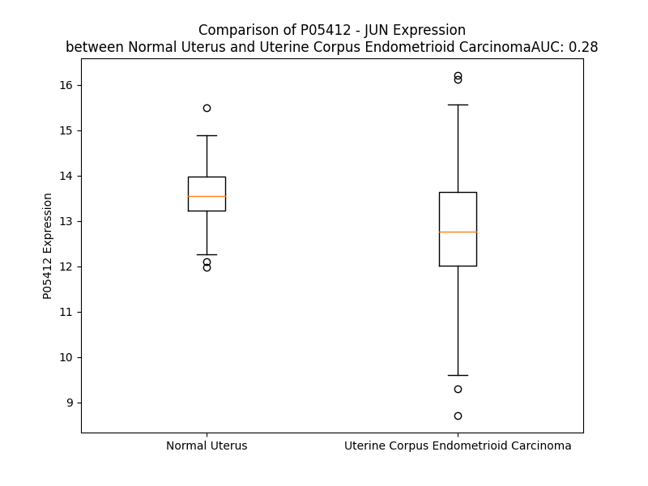

# Detailed Data for P05412

## Introduction to the Detailed Summary

### How to Interpret the Results

- **Summary & Metrics**: This section provides a quick reference to essential protein attributes, including expression changes, family classification, and biomarker applications. Regulation status (upregulated/downregulated) indicates the protein's behavior in a disease context. Some information comes from the original excel file with the proteins selected from literature, while others are derived from the analyses.
- **Expression Comparison**: A visual representation comparing protein expression between normal and disease states. It highlights significant changes in expression levels that might indicate diagnostic or therapeutic relevance. This is data coming from transcriptomics experiments and could not translate similarly to protein levels.
- **Isoform Alignment**: An interactive view of isoform alignments, revealing structural and functional differences between variants of the protein.
- **Interactors & Homologs**: Tables listing known interaction partners and homologous proteins, the more interactors and homologs, the more complex the protein is to design an antibody for.
- **Biological Assemblies**: Information about the structural arrangement of the protein in different assemblies, providing insights into its functional state but also the complexity of the protein to develop antibodies.
- **Combined Per-Residue Information**: A detailed table summarizing residue-level data. This includes predictions for epitope regions, aggregation tendencies, and modifications that might impact the protein's function. Each row corresponds to a residue in the protein, providing insights into specific sites that may be important for research or drug development.
## Summary & Metrics

- **UniProt Accession**: P05412
- **Gene Name**: JUN (proto oncogen: c-Jun)
- **Protein Name**: Transcription factor AP-1
- **Swiss Prot**: JUN_HUMAN
- **Family**: transcription regulator
- **Biomarker Application**: diagnosis,prognosis
- **Number of Isoforms**: 0
- **Regulation**: 2
- **(transcriptomics) AUC**: 0.28
- **(transcriptomics) Fold Change**: 1.06
- **(transcriptomics) Regulation**: Downregulated
- **Discotope Epitope Count**: 13
- **Max n_uniprots (Homo)**: 2
- **Max n_uniprots (Hetero)**: 4

## Expression Comparison

## Interactors

| preferredName_A   | preferredName_B   |   score |
|:------------------|:------------------|--------:|
| JUN               | MAPK9             |   0.999 |
| JUN               | FOS               |   0.999 |
| JUN               | MAPK8             |   0.999 |
| JUN               | FOSB              |   0.999 |
| JUN               | FOSL2             |   0.999 |
| JUN               | JUND              |   0.999 |
| JUN               | FOSL1             |   0.999 |
| JUN               | JUNB              |   0.999 |
| JUN               | ESR1              |   0.999 |
| JUN               | EP300             |   0.999 |
| JUN               | ATF2              |   0.999 |
| JUN               | ATF3              |   0.999 |
| JUN               | IRF3              |   0.998 |
| JUN               | MAPK1             |   0.998 |
| JUN               | NFATC2            |   0.998 |
| JUN               | COPS5             |   0.998 |
| JUN               | CREB1             |   0.998 |
| JUN               | BATF              |   0.997 |
| JUN               | TP53              |   0.997 |
| JUN               | FBXW7             |   0.997 |
| JUN               | SMAD3             |   0.997 |
| JUN               | SP1               |   0.996 |
| JUN               | STAT3             |   0.995 |
| JUN               | CREBBP            |   0.994 |
| JUN               | NFKB1             |   0.994 |
| JUN               | MAF               |   0.993 |
| JUN               | SPI1              |   0.993 |
| JUN               | MAPK14            |   0.992 |
| JUN               | MAPK8IP1          |   0.992 |
| JUN               | MAFB              |   0.991 |
| JUN               | AKT1              |   0.991 |
| JUN               | EGR1              |   0.99  |
| JUN               | IRF7              |   0.989 |
| JUN               | TNF               |   0.989 |
| JUN               | SMAD4             |   0.989 |
| JUN               | IL6               |   0.989 |
| JUN               | MAPK3             |   0.987 |
| JUN               | CXCL8             |   0.987 |
| JUN               | IL1B              |   0.987 |
| JUN               | RELA              |   0.986 |
| JUN               | CCL2              |   0.98  |
| JUN               | PPARA             |   0.979 |
| JUN               | BATF3             |   0.979 |
| JUN               | GDNF              |   0.975 |
| JUN               | ATF7              |   0.974 |
| JUN               | SRC               |   0.974 |
| JUN               | MAPK11            |   0.971 |
| JUN               | CREB5             |   0.971 |
| JUN               | MAPK12            |   0.971 |
| JUN               | MYC               |   0.97  |

## Homologs

| uniprot_id   | gene_id   |
|:-------------|:----------|
| P17275       | JUNB      |
| U3KPR5       | JUND      |

## Biological Assemblies

|   Unnamed: 0 |   assembly |   n_uniprots | composition   | crystal_id   |
|-------------:|-----------:|-------------:|:--------------|:-------------|
|            0 |          1 |            4 | Hetero        | 8sos         |
|            0 |          1 |            1 | Homo          | 1fos         |
|            1 |          2 |            1 | Homo          | 1fos         |
|            0 |          1 |            2 | Homo          | 1jun         |
|            0 |          1 |            4 | Hetero        | 1t2k         |
|            0 |          1 |            3 | Hetero        | 1s9k         |
|            0 |          1 |            3 | Hetero        | 1a02         |
|            0 |          1 |            2 | Homo          | 5t01         |
|            0 |          1 |            1 | Homo          | 6y3v         |
|            0 |          1 |            2 | Homo          | 1jnm         |
|            0 |          1 |            0 | Hetero        | 5fv8         |
|            1 |          2 |            0 | Hetero        | 5fv8         |

## Combined Per-Residue Information

|   res | aa   |   epitope_score | epitope   |   relative_surface_accessibility |   modeling_confidence |   Aggregation | modification                          |
|------:|:-----|----------------:|:----------|---------------------------------:|----------------------:|--------------:|:--------------------------------------|
|     1 | M    |         0.06132 | False     |                          1.32755 |                 44.96 |         0     | N/A                                   |
|     2 | T    |         0.09842 | False     |                          0.96272 |                 46.45 |         0     | Phosphothreonine; by PAK2             |
|     3 | A    |         0.0874  | False     |                          0.99497 |                 59.99 |         0     | N/A                                   |
|     4 | K    |         0.08025 | False     |                          0.98682 |                 56.53 |         0     | N/A                                   |
|     5 | M    |         0.11148 | False     |                          0.99099 |                 68.37 |         0     | N/A                                   |
|     6 | E    |         0.11703 | False     |                          0.85034 |                 64.37 |         0     | N/A                                   |
|     7 | T    |         0.08189 | False     |                          0.92321 |                 63.8  |         0     | N/A                                   |
|     8 | T    |         0.08747 | False     |                          0.74775 |                 59.85 |         0     | Phosphothreonine; by PAK2             |
|     9 | F    |         0.20596 | True      |                          1.03935 |                 57.46 |         0     | N/A                                   |
|    10 | Y    |         0.11521 | False     |                          0.84013 |                 53.83 |         0     | N/A                                   |
|    11 | D    |         0.07938 | False     |                          0.68166 |                 56.81 |         0     | N/A                                   |
|    12 | D    |         0.12147 | False     |                          0.73223 |                 53.41 |         0     | N/A                                   |
|    13 | A    |         0.11227 | False     |                          0.69718 |                 60.82 |         0     | N/A                                   |
|    14 | L    |         0.10974 | False     |                          0.81138 |                 58.3  |         0     | N/A                                   |
|    15 | N    |         0.15659 | False     |                          0.64652 |                 53.02 |         0     | N/A                                   |
|    16 | A    |         0.13627 | False     |                          0.7142  |                 56.64 |         0     | N/A                                   |
|    17 | S    |         0.14618 | False     |                          0.66065 |                 54.87 |         0     | N/A                                   |
|    18 | F    |         0.13868 | False     |                          0.87494 |                 52.08 |         0     | N/A                                   |
|    19 | L    |         0.10512 | False     |                          0.81998 |                 44.82 |         0     | N/A                                   |
|    20 | P    |         0.10979 | False     |                          0.92331 |                 43.95 |         0     | N/A                                   |
|    21 | S    |         0.10762 | False     |                          0.87778 |                 41.38 |         0     | N/A                                   |
|    22 | E    |         0.123   | False     |                          0.82562 |                 41.41 |         0     | N/A                                   |
|    23 | S    |         0.11002 | False     |                          0.80033 |                 40.29 |         0     | N/A                                   |
|    24 | G    |         0.15921 | False     |                          0.85559 |                 38.38 |         0     | N/A                                   |
|    25 | P    |         0.1874  | False     |                          0.80588 |                 41.18 |         0     | N/A                                   |
|    26 | Y    |         0.18352 | False     |                          0.99235 |                 40.06 |         0     | N/A                                   |
|    27 | G    |         0.16972 | False     |                          0.96408 |                 39.61 |         0     | N/A                                   |
|    28 | Y    |         0.22322 | True      |                          1.03471 |                 43.5  |         0     | N/A                                   |
|    29 | S    |         0.14915 | False     |                          0.8213  |                 50.21 |         0     | N/A                                   |
|    30 | N    |         0.18073 | False     |                          0.92581 |                 45.29 |         0     | N/A                                   |
|    31 | P    |         0.14209 | False     |                          0.78322 |                 48.6  |         0     | N/A                                   |
|    32 | K    |         0.14504 | False     |                          0.85446 |                 48.1  |         0     | N/A                                   |
|    33 | I    |         0.11452 | False     |                          0.94167 |                 54.99 |         0     | N/A                                   |
|    34 | L    |         0.14253 | False     |                          1.04922 |                 52.26 |         0     | N/A                                   |
|    35 | K    |         0.13508 | False     |                          0.88203 |                 53.65 |         0     | N/A                                   |
|    36 | Q    |         0.11203 | False     |                          0.9004  |                 54.42 |         0     | N/A                                   |
|    37 | S    |         0.10977 | False     |                          0.6739  |                 52.6  |         0     | N/A                                   |
|    38 | M    |         0.16036 | False     |                          1.0065  |                 57.1  |         0     | N/A                                   |
|    39 | T    |         0.11293 | False     |                          0.67815 |                 61.66 |         0     | N/A                                   |
|    40 | L    |         0.11037 | False     |                          0.96129 |                 55.67 |         0     | N/A                                   |
|    41 | N    |         0.12701 | False     |                          0.79945 |                 51.4  |         0     | N/A                                   |
|    42 | L    |         0.13037 | False     |                          0.95205 |                 65.01 |         0     | N/A                                   |
|    43 | A    |         0.07373 | False     |                          0.70848 |                 53.22 |         0     | N/A                                   |
|    44 | D    |         0.07717 | False     |                          0.71175 |                 46.63 |         0     | N/A                                   |
|    45 | P    |         0.12787 | False     |                          0.98599 |                 50.6  |         0     | N/A                                   |
|    46 | V    |         0.09354 | False     |                          0.86718 |                 55.46 |         0     | N/A                                   |
|    47 | G    |         0.17205 | False     |                          1.01908 |                 53.94 |         0     | N/A                                   |
|    48 | S    |         0.09444 | False     |                          0.82347 |                 48.98 |         0     | N/A                                   |
|    49 | L    |         0.08753 | False     |                          1.05892 |                 51.62 |         0     | N/A                                   |
|    50 | K    |         0.10924 | False     |                          0.88591 |                 50.16 |         0     | N/A                                   |
|    51 | P    |         0.19079 | False     |                          0.94718 |                 54.06 |         0     | N/A                                   |
|    52 | H    |         0.14645 | False     |                          0.89908 |                 50.99 |         0     | N/A                                   |
|    53 | L    |         0.1164  | False     |                          1.0546  |                 55.07 |         0     | N/A                                   |
|    54 | R    |         0.16802 | False     |                          0.89514 |                 45.54 |         0     | N/A                                   |
|    55 | A    |         0.11664 | False     |                          0.89074 |                 45.2  |         0     | N/A                                   |
|    56 | K    |         0.10372 | False     |                          0.9243  |                 49.71 |         0     | N6-acetyllysine; alternate            |
|    57 | N    |         0.06071 | False     |                          0.7975  |                 42.69 |         0     | N/A                                   |
|    58 | S    |         0.09427 | False     |                          0.76692 |                 50.91 |         0     | Phosphoserine                         |
|    59 | D    |         0.07665 | False     |                          0.79701 |                 49.57 |         0     | N/A                                   |
|    60 | L    |         0.07817 | False     |                          0.93131 |                 51.44 |         0     | N/A                                   |
|    61 | L    |         0.08464 | False     |                          1.06997 |                 47.76 |         0     | N/A                                   |
|    62 | T    |         0.1147  | False     |                          0.84215 |                 46.17 |         0     | N/A                                   |
|    63 | S    |         0.08522 | False     |                          0.56117 |                 39.79 |         0     | Phosphoserine; by MAPK8 and PLK3      |
|    64 | P    |         0.11159 | False     |                          0.95742 |                 52.76 |         0     | N/A                                   |
|    65 | D    |         0.06809 | False     |                          0.59467 |                 42.87 |         0     | N/A                                   |
|    66 | V    |         0.10179 | False     |                          0.80775 |                 57.07 |         0     | N/A                                   |
|    67 | G    |         0.14289 | False     |                          0.895   |                 57.15 |         0     | N/A                                   |
|    68 | L    |         0.11618 | False     |                          0.94374 |                 56.95 |         0     | N/A                                   |
|    69 | L    |         0.07137 | False     |                          0.73787 |                 53.41 |         0     | N/A                                   |
|    70 | K    |         0.09778 | False     |                          1.00532 |                 56.63 |         0     | N/A                                   |
|    71 | L    |         0.04873 | False     |                          0.39349 |                 53.81 |         0     | N/A                                   |
|    72 | A    |         0.09513 | False     |                          0.7943  |                 55.95 |         0     | N/A                                   |
|    73 | S    |         0.19748 | True      |                          0.75464 |                 59.5  |         0     | Phosphoserine; by MAPK8 and PLK3      |
|    74 | P    |         0.10906 | False     |                          0.63569 |                 70.8  |         0     | N/A                                   |
|    75 | E    |         0.08089 | False     |                          0.53205 |                 66.77 |         0     | N/A                                   |
|    76 | L    |         0.0978  | False     |                          0.46988 |                 68.46 |         0     | N/A                                   |
|    77 | E    |         0.1059  | False     |                          0.55911 |                 67.03 |         0     | N/A                                   |
|    78 | R    |         0.15958 | False     |                          0.70009 |                 71.53 |         0     | N/A                                   |
|    79 | L    |         0.06612 | False     |                          0.57906 |                 67.49 |         0.475 | N/A                                   |
|    80 | I    |         0.16536 | False     |                          0.57897 |                 69.07 |         0.475 | N/A                                   |
|    81 | I    |         0.11309 | False     |                          0.58311 |                 70.24 |         0.475 | N/A                                   |
|    82 | Q    |         0.04727 | False     |                          0.49239 |                 66.45 |         0.475 | N/A                                   |
|    83 | S    |         0.08843 | False     |                          0.51869 |                 62.83 |         0.475 | N/A                                   |
|    84 | S    |         0.11041 | False     |                          0.6376  |                 61.97 |         0     | N/A                                   |
|    85 | N    |         0.09081 | False     |                          0.71677 |                 58.88 |         0     | N/A                                   |
|    86 | G    |         0.13155 | False     |                          0.89987 |                 52.62 |         0     | N/A                                   |
|    87 | H    |         0.11935 | False     |                          0.83024 |                 53.3  |         0     | N/A                                   |
|    88 | I    |         0.08538 | False     |                          0.60572 |                 54.34 |         0     | N/A                                   |
|    89 | T    |         0.09805 | False     |                          0.90701 |                 52.88 |         0     | Phosphothreonine; by PAK2             |
|    90 | T    |         0.18403 | False     |                          0.88966 |                 49.03 |         0     | N/A                                   |
|    91 | T    |         0.10688 | False     |                          0.7813  |                 56.06 |         0     | Phosphothreonine                      |
|    92 | P    |         0.18662 | False     |                          1.04505 |                 41.54 |         0     | N/A                                   |
|    93 | T    |         0.12167 | False     |                          0.74083 |                 57.59 |         0     | Phosphothreonine; by PAK2             |
|    94 | P    |         0.14348 | False     |                          0.86872 |                 43.68 |         0     | N/A                                   |
|    95 | T    |         0.19994 | True      |                          0.81268 |                 50.87 |         0     | N/A                                   |
|    96 | Q    |         0.18248 | False     |                          0.81607 |                 55.16 |         0     | N/A                                   |
|    97 | F    |         0.15568 | False     |                          0.88779 |                 49.95 |         0     | N/A                                   |
|    98 | L    |         0.13338 | False     |                          1.00127 |                 52.78 |         0     | N/A                                   |
|    99 | C    |         0.07633 | False     |                          0.81211 |                 48.85 |         0     | N/A                                   |
|   100 | P    |         0.1446  | False     |                          0.64906 |                 53.69 |         0     | N/A                                   |
|   101 | K    |         0.12619 | False     |                          0.99727 |                 59.5  |         0     | N/A                                   |
|   102 | N    |         0.14665 | False     |                          0.70699 |                 56.17 |         0     | N/A                                   |
|   103 | V    |         0.07439 | False     |                          0.63612 |                 61.83 |         0     | N/A                                   |
|   104 | T    |         0.17196 | False     |                          0.56016 |                 70.75 |         0     | N/A                                   |
|   105 | D    |         0.13833 | False     |                          0.74946 |                 71.06 |         0     | N/A                                   |
|   106 | E    |         0.11603 | False     |                          0.75801 |                 72.41 |         0     | N/A                                   |
|   107 | Q    |         0.1205  | False     |                          0.56332 |                 65.56 |         0     | N/A                                   |
|   108 | E    |         0.10236 | False     |                          0.50392 |                 66.68 |         0     | N/A                                   |
|   109 | G    |         0.13549 | False     |                          0.55755 |                 76.83 |         0     | N/A                                   |
|   110 | F    |         0.11776 | False     |                          0.92189 |                 76.5  |         0     | N/A                                   |
|   111 | A    |         0.06789 | False     |                          0.44129 |                 79.32 |         0     | N/A                                   |
|   112 | E    |         0.15643 | False     |                          0.55279 |                 80.23 |         0     | N/A                                   |
|   113 | G    |         0.10881 | False     |                          0.54458 |                 83.83 |         0     | N/A                                   |
|   114 | F    |         0.13778 | False     |                          0.72619 |                 88.22 |         0     | N/A                                   |
|   115 | V    |         0.06716 | False     |                          0.65755 |                 87.05 |         0     | N/A                                   |
|   116 | R    |         0.15501 | False     |                          0.69108 |                 85.54 |         0     | N/A                                   |
|   117 | A    |         0.07141 | False     |                          0.53279 |                 85.11 |         0     | N/A                                   |
|   118 | L    |         0.07318 | False     |                          0.48106 |                 89.54 |         0     | N/A                                   |
|   119 | A    |         0.06896 | False     |                          0.563   |                 85.56 |         0     | N/A                                   |
|   120 | E    |         0.07381 | False     |                          0.58769 |                 88.31 |         0     | N/A                                   |
|   121 | L    |         0.04925 | False     |                          0.65023 |                 81.89 |         0     | N/A                                   |
|   122 | H    |         0.04748 | False     |                          0.67475 |                 81.12 |         0     | N/A                                   |
|   123 | S    |         0.07113 | False     |                          0.50182 |                 76.87 |         0     | N/A                                   |
|   124 | Q    |         0.09337 | False     |                          0.67196 |                 70.55 |         0     | N/A                                   |
|   125 | N    |         0.11967 | False     |                          0.81313 |                 64    |         0     | N/A                                   |
|   126 | T    |         0.10867 | False     |                          0.75237 |                 57.5  |         0     | N/A                                   |
|   127 | L    |         0.1104  | False     |                          0.8571  |                 48.1  |         0     | N/A                                   |
|   128 | P    |         0.09096 | False     |                          0.70944 |                 46.64 |         0     | N/A                                   |
|   129 | S    |         0.10557 | False     |                          0.92828 |                 35.05 |         0     | N/A                                   |
|   130 | V    |         0.13555 | False     |                          0.80235 |                 39.75 |         0     | N/A                                   |
|   131 | T    |         0.10222 | False     |                          0.94154 |                 34.59 |         0     | N/A                                   |
|   132 | S    |         0.10351 | False     |                          0.92337 |                 40.34 |         0     | N/A                                   |
|   133 | A    |         0.12299 | False     |                          1.00458 |                 34.78 |         0     | N/A                                   |
|   134 | A    |         0.16848 | False     |                          0.9601  |                 40.44 |         0     | N/A                                   |
|   135 | Q    |         0.10571 | False     |                          0.87513 |                 38    |         0     | N/A                                   |
|   136 | P    |         0.13422 | False     |                          0.84601 |                 40.67 |         0     | N/A                                   |
|   137 | V    |         0.11287 | False     |                          0.8302  |                 42.04 |         0     | N/A                                   |
|   138 | N    |         0.15652 | False     |                          0.95385 |                 38.47 |         0     | N/A                                   |
|   139 | G    |         0.15841 | False     |                          0.88989 |                 36.69 |         0     | N/A                                   |
|   140 | A    |         0.12472 | False     |                          1.07624 |                 38.21 |         0     | N/A                                   |
|   141 | G    |         0.13318 | False     |                          0.83703 |                 37.94 |         0     | N/A                                   |
|   142 | M    |         0.13785 | False     |                          0.93191 |                 43.05 |         0     | N/A                                   |
|   143 | V    |         0.13041 | False     |                          0.9997  |                 43.69 |         0     | N/A                                   |
|   144 | A    |         0.06025 | False     |                          0.87836 |                 47.53 |         0     | N/A                                   |
|   145 | P    |         0.08164 | False     |                          0.94993 |                 52.03 |         0     | N/A                                   |
|   146 | A    |         0.06506 | False     |                          0.92906 |                 39.7  |         1.369 | N/A                                   |
|   147 | V    |         0.09045 | False     |                          1.01836 |                 45.63 |         2.109 | N/A                                   |
|   148 | A    |         0.08796 | False     |                          0.85048 |                 43.7  |         2.109 | N/A                                   |
|   149 | S    |         0.10116 | False     |                          0.81425 |                 40.23 |         2.109 | N/A                                   |
|   150 | V    |         0.10836 | False     |                          0.97341 |                 45.96 |         2.109 | N/A                                   |
|   151 | A    |         0.12357 | False     |                          0.90352 |                 40.94 |         1.366 | N/A                                   |
|   152 | G    |         0.10514 | False     |                          1.02442 |                 37.42 |         0     | N/A                                   |
|   153 | G    |         0.0859  | False     |                          0.89177 |                 38.11 |         0     | N/A                                   |
|   154 | S    |         0.12077 | False     |                          0.98596 |                 37.07 |         0     | N/A                                   |
|   155 | G    |         0.1629  | False     |                          0.91853 |                 40.22 |         0     | N/A                                   |
|   156 | S    |         0.1004  | False     |                          0.94866 |                 41.89 |         0     | N/A                                   |
|   157 | G    |         0.19746 | True      |                          0.98764 |                 36.6  |         0     | N/A                                   |
|   158 | G    |         0.18438 | False     |                          0.83674 |                 37.57 |         0     | N/A                                   |
|   159 | F    |         0.15566 | False     |                          0.98771 |                 34.76 |         0     | N/A                                   |
|   160 | S    |         0.08854 | False     |                          0.8132  |                 36.73 |         0     | N/A                                   |
|   161 | A    |         0.14454 | False     |                          0.94034 |                 33.36 |         0     | N/A                                   |
|   162 | S    |         0.10561 | False     |                          0.79583 |                 40.57 |         0     | N/A                                   |
|   163 | L    |         0.16314 | False     |                          1.05021 |                 38.29 |         0     | N/A                                   |
|   164 | H    |         0.18513 | False     |                          0.8533  |                 39.6  |         0     | N/A                                   |
|   165 | S    |         0.13317 | False     |                          0.87546 |                 35.79 |         0     | N/A                                   |
|   166 | E    |         0.13688 | False     |                          0.68141 |                 41.72 |         0     | N/A                                   |
|   167 | P    |         0.11876 | False     |                          0.72687 |                 59.85 |         0     | N/A                                   |
|   168 | P    |         0.08681 | False     |                          0.82543 |                 60.34 |         0     | N/A                                   |
|   169 | V    |         0.12684 | False     |                          0.79053 |                 63.93 |         0.441 | N/A                                   |
|   170 | Y    |         0.10489 | False     |                          0.91399 |                 39.32 |         0.441 | N/A                                   |
|   171 | A    |         0.07645 | False     |                          0.85308 |                 48.98 |         0.441 | N/A                                   |
|   172 | N    |         0.10382 | False     |                          0.60464 |                 42.22 |         0.441 | N/A                                   |
|   173 | L    |         0.16869 | False     |                          0.98421 |                 59.47 |         0.441 | N/A                                   |
|   174 | S    |         0.20611 | True      |                          0.77305 |                 54.53 |         0     | N/A                                   |
|   175 | N    |         0.17006 | False     |                          0.8073  |                 49.91 |         0     | N/A                                   |
|   176 | F    |         0.15523 | False     |                          0.97407 |                 45.47 |         0     | N/A                                   |
|   177 | N    |         0.16404 | False     |                          0.78772 |                 54.25 |         0     | N/A                                   |
|   178 | P    |         0.16237 | False     |                          0.99998 |                 52.14 |         0     | N/A                                   |
|   179 | G    |         0.20434 | True      |                          0.73904 |                 48.46 |         0     | N/A                                   |
|   180 | A    |         0.12641 | False     |                          0.92441 |                 50.71 |         0     | N/A                                   |
|   181 | L    |         0.1736  | False     |                          1.10139 |                 43.97 |         0     | N/A                                   |
|   182 | S    |         0.10471 | False     |                          0.84135 |                 41.42 |         0     | N/A                                   |
|   183 | S    |         0.15267 | False     |                          0.88858 |                 39.41 |         0     | N/A                                   |
|   184 | G    |         0.17677 | False     |                          1.0249  |                 36.54 |         0     | N/A                                   |
|   185 | G    |         0.17646 | False     |                          0.98157 |                 38.36 |         0     | N/A                                   |
|   186 | G    |         0.13522 | False     |                          1.02418 |                 32.27 |         0     | N/A                                   |
|   187 | A    |         0.08872 | False     |                          0.92813 |                 42.96 |         0     | N/A                                   |
|   188 | P    |         0.11202 | False     |                          0.89805 |                 48.33 |         0     | N/A                                   |
|   189 | S    |         0.15946 | False     |                          0.85647 |                 38.07 |         0     | N/A                                   |
|   190 | Y    |         0.18501 | False     |                          0.97052 |                 47.93 |         0     | N/A                                   |
|   191 | G    |         0.13204 | False     |                          0.79176 |                 36.74 |         0     | N/A                                   |
|   192 | A    |         0.20659 | True      |                          1.0801  |                 31.58 |         0     | N/A                                   |
|   193 | A    |         0.12674 | False     |                          0.9089  |                 41.05 |         0     | N/A                                   |
|   194 | G    |         0.1169  | False     |                          0.90048 |                 35.56 |         0     | N/A                                   |
|   195 | L    |         0.15465 | False     |                          1.10421 |                 43.78 |         0     | N/A                                   |
|   196 | A    |         0.17754 | False     |                          0.9669  |                 39.71 |         0     | N/A                                   |
|   197 | F    |         0.14168 | False     |                          0.99406 |                 37.06 |         0     | N/A                                   |
|   198 | P    |         0.11987 | False     |                          0.89472 |                 48    |         0     | N/A                                   |
|   199 | A    |         0.19243 | False     |                          0.92238 |                 37.47 |         0     | N/A                                   |
|   200 | Q    |         0.14681 | False     |                          0.89982 |                 49.47 |         0     | N/A                                   |
|   201 | P    |         0.1272  | False     |                          0.95325 |                 42.51 |         0     | N/A                                   |
|   202 | Q    |         0.13224 | False     |                          0.87879 |                 37.68 |         0     | N/A                                   |
|   203 | Q    |         0.14399 | False     |                          0.91379 |                 42.78 |         0     | N/A                                   |
|   204 | Q    |         0.12989 | False     |                          0.83455 |                 39.33 |         0     | N/A                                   |
|   205 | Q    |         0.1332  | False     |                          0.93597 |                 42.32 |         0     | N/A                                   |
|   206 | Q    |         0.09101 | False     |                          0.87597 |                 36.39 |         0     | N/A                                   |
|   207 | P    |         0.13731 | False     |                          0.95147 |                 48.82 |         0     | N/A                                   |
|   208 | P    |         0.19524 | False     |                          0.77611 |                 45.42 |         0     | N/A                                   |
|   209 | H    |         0.15143 | False     |                          0.9281  |                 36.8  |         0     | N/A                                   |
|   210 | H    |         0.16909 | False     |                          0.99458 |                 42.49 |         0     | N/A                                   |
|   211 | L    |         0.11476 | False     |                          1.0164  |                 38.92 |         0     | N/A                                   |
|   212 | P    |         0.13693 | False     |                          0.8175  |                 43.4  |         0     | N/A                                   |
|   213 | Q    |         0.1573  | False     |                          0.84527 |                 42.22 |         0     | N/A                                   |
|   214 | Q    |         0.14757 | False     |                          0.8112  |                 45.25 |         0     | N/A                                   |
|   215 | M    |         0.18384 | False     |                          0.98902 |                 50.23 |         0     | N/A                                   |
|   216 | P    |         0.13479 | False     |                          0.80798 |                 44.55 |         0     | N/A                                   |
|   217 | V    |         0.15085 | False     |                          0.90846 |                 41.12 |         0     | N/A                                   |
|   218 | Q    |         0.19324 | False     |                          0.83124 |                 44.59 |         0     | N/A                                   |
|   219 | H    |         0.17436 | False     |                          0.92079 |                 40.91 |         0     | N/A                                   |
|   220 | P    |         0.13857 | False     |                          0.9287  |                 60.08 |         0     | N/A                                   |
|   221 | R    |         0.24685 | True      |                          0.77538 |                 38.86 |         0     | N/A                                   |
|   222 | L    |         0.15614 | False     |                          1.10275 |                 39.01 |         0     | N/A                                   |
|   223 | Q    |         0.10502 | False     |                          0.67942 |                 50.44 |         0     | N/A                                   |
|   224 | A    |         0.12645 | False     |                          0.77975 |                 47.29 |         0     | N/A                                   |
|   225 | L    |         0.23576 | True      |                          1.06534 |                 45.19 |         0     | N/A                                   |
|   226 | K    |         0.1079  | False     |                          0.87141 |                 51.51 |         0     | N/A                                   |
|   227 | E    |         0.08841 | False     |                          0.71393 |                 43.54 |         0     | N/A                                   |
|   228 | E    |         0.16776 | False     |                          0.80104 |                 46.48 |         0     | N/A                                   |
|   229 | P    |         0.15347 | False     |                          0.80283 |                 52.71 |         0     | N/A                                   |
|   230 | Q    |         0.20559 | True      |                          0.85342 |                 42.85 |         0     | N/A                                   |
|   231 | T    |         0.14872 | False     |                          0.90947 |                 40.81 |         0     | N/A                                   |
|   232 | V    |         0.1319  | False     |                          0.93013 |                 41.55 |         0     | N/A                                   |
|   233 | P    |         0.15805 | False     |                          0.8709  |                 54.66 |         0     | N/A                                   |
|   234 | E    |         0.15242 | False     |                          0.9353  |                 48.28 |         0     | N/A                                   |
|   235 | M    |         0.16565 | False     |                          0.93247 |                 37.6  |         0     | N/A                                   |
|   236 | P    |         0.1774  | False     |                          0.91571 |                 43.76 |         0     | N/A                                   |
|   237 | G    |         0.16878 | False     |                          0.93343 |                 39.76 |         0     | N/A                                   |
|   238 | E    |         0.13627 | False     |                          0.85328 |                 44.59 |         0     | N/A                                   |
|   239 | T    |         0.15049 | False     |                          0.86356 |                 48.08 |         0     | Phosphothreonine; by GSK3-beta        |
|   240 | P    |         0.1439  | False     |                          0.84652 |                 51.47 |         0     | N/A                                   |
|   241 | P    |         0.13394 | False     |                          0.90383 |                 50.22 |         0     | N/A                                   |
|   242 | L    |         0.16322 | False     |                          0.99322 |                 54.23 |         0     | N/A                                   |
|   243 | S    |         0.12401 | False     |                          0.66834 |                 51.23 |         0     | Phosphoserine; by DYRK2 and GSK3-beta |
|   244 | P    |         0.19151 | False     |                          1.01794 |                 56.3  |         0     | N/A                                   |
|   245 | I    |         0.13476 | False     |                          0.55421 |                 62.65 |         0     | N/A                                   |
|   246 | D    |         0.22194 | True      |                          0.48584 |                 74.29 |         0     | N/A                                   |
|   247 | M    |         0.11417 | False     |                          0.57159 |                 76.97 |         0     | N/A                                   |
|   248 | E    |         0.11574 | False     |                          0.5224  |                 78.54 |         0     | N/A                                   |
|   249 | S    |         0.05189 | False     |                          0.28561 |                 83.57 |         0     | Phosphoserine; by GSK3-beta           |
|   250 | Q    |         0.07938 | False     |                          0.26785 |                 84.63 |         0     | N/A                                   |
|   251 | E    |         0.08897 | False     |                          0.52752 |                 88.32 |         0     | N/A                                   |
|   252 | R    |         0.11342 | False     |                          0.70003 |                 91.34 |         0     | N/A                                   |
|   253 | I    |         0.11595 | False     |                          0.6359  |                 88.06 |         0     | N/A                                   |
|   254 | K    |         0.0919  | False     |                          0.58693 |                 93.18 |         0     | N/A                                   |
|   255 | A    |         0.07644 | False     |                          0.38031 |                 94.21 |         0     | N/A                                   |
|   256 | E    |         0.13232 | False     |                          0.36924 |                 94.98 |         0     | N/A                                   |
|   257 | R    |         0.13677 | False     |                          0.63545 |                 95.05 |         0     | N/A                                   |
|   258 | K    |         0.12449 | False     |                          0.70656 |                 95.92 |         0     | N/A                                   |
|   259 | R    |         0.12907 | False     |                          0.59628 |                 96.31 |         0     | N/A                                   |
|   260 | M    |         0.14208 | False     |                          0.57778 |                 95.59 |         0     | N/A                                   |
|   261 | R    |         0.10218 | False     |                          0.5891  |                 96.8  |         0     | N/A                                   |
|   262 | N    |         0.11166 | False     |                          0.65021 |                 97.59 |         0     | N/A                                   |
|   263 | R    |         0.09687 | False     |                          0.65849 |                 97.53 |         0     | N/A                                   |
|   264 | I    |         0.15408 | False     |                          0.65194 |                 97.07 |         0     | N/A                                   |
|   265 | A    |         0.09699 | False     |                          0.53769 |                 98.06 |         0     | N/A                                   |
|   266 | A    |         0.10287 | False     |                          0.40986 |                 98.14 |         0     | N/A                                   |
|   267 | S    |         0.06366 | False     |                          0.50663 |                 97.28 |         0     | N/A                                   |
|   268 | K    |         0.1523  | False     |                          0.56865 |                 98.37 |         0     | N/A                                   |
|   269 | C    |         0.12086 | False     |                          0.6232  |                 98.32 |         0     | N/A                                   |
|   270 | R    |         0.16835 | False     |                          0.71225 |                 98.1  |         0     | N/A                                   |
|   271 | K    |         0.26739 | True      |                          0.6441  |                 98.36 |         0     | N6-acetyllysine                       |
|   272 | R    |         0.10731 | False     |                          0.58736 |                 98.37 |         0     | N/A                                   |
|   273 | K    |         0.09741 | False     |                          0.68226 |                 98.48 |         0     | N/A                                   |
|   274 | L    |         0.11544 | False     |                          0.73411 |                 98.03 |         0     | N/A                                   |
|   275 | E    |         0.10112 | False     |                          0.33386 |                 98.37 |         0     | N/A                                   |
|   276 | R    |         0.10844 | False     |                          0.65183 |                 98.4  |         0     | N/A                                   |
|   277 | I    |         0.13698 | False     |                          0.43278 |                 98.02 |         0     | N/A                                   |
|   278 | A    |         0.11813 | False     |                          0.52813 |                 98.43 |         0     | N/A                                   |
|   279 | R    |         0.1363  | False     |                          0.64403 |                 98.48 |         0     | N/A                                   |
|   280 | L    |         0.05357 | False     |                          0.53136 |                 98.65 |         0     | N/A                                   |
|   281 | E    |         0.1018  | False     |                          0.5626  |                 98.57 |         0     | N/A                                   |
|   282 | E    |         0.1199  | False     |                          0.60328 |                 98.62 |         0     | N/A                                   |
|   283 | K    |         0.08805 | False     |                          0.62203 |                 98.48 |         0     | N/A                                   |
|   284 | V    |         0.10098 | False     |                          0.54624 |                 98.76 |         0     | N/A                                   |
|   285 | K    |         0.13517 | False     |                          0.76592 |                 98.59 |         0     | N/A                                   |
|   286 | T    |         0.08308 | False     |                          0.48481 |                 98.58 |         0     | Phosphothreonine; by PAK2             |
|   287 | L    |         0.0801  | False     |                          0.5897  |                 98.43 |         0     | N/A                                   |
|   288 | K    |         0.0869  | False     |                          0.70168 |                 98.58 |         0     | N/A                                   |
|   289 | A    |         0.11516 | False     |                          0.58433 |                 98.47 |         0     | N/A                                   |
|   290 | Q    |         0.1056  | False     |                          0.45878 |                 98.46 |         0     | N/A                                   |
|   291 | N    |         0.11286 | False     |                          0.64142 |                 98.43 |         0     | N/A                                   |
|   292 | S    |         0.07838 | False     |                          0.56871 |                 98.3  |         0     | N/A                                   |
|   293 | E    |         0.15177 | False     |                          0.61583 |                 98.34 |         0     | N/A                                   |
|   294 | L    |         0.08454 | False     |                          0.77049 |                 98.41 |         0     | N/A                                   |
|   295 | A    |         0.05626 | False     |                          0.43394 |                 98.45 |         0     | N/A                                   |
|   296 | S    |         0.12496 | False     |                          0.53869 |                 98.22 |         0     | N/A                                   |
|   297 | T    |         0.11852 | False     |                          0.48972 |                 98.25 |         0     | N/A                                   |
|   298 | A    |         0.08557 | False     |                          0.34274 |                 98.27 |         0     | N/A                                   |
|   299 | N    |         0.07849 | False     |                          0.52644 |                 98.1  |         0     | N/A                                   |
|   300 | M    |         0.18427 | False     |                          0.60276 |                 98.24 |         0     | N/A                                   |
|   301 | L    |         0.15344 | False     |                          0.61029 |                 98.39 |         0     | N/A                                   |
|   302 | R    |         0.09216 | False     |                          0.66406 |                 98.12 |         0     | N/A                                   |
|   303 | E    |         0.1401  | False     |                          0.49528 |                 97.83 |         0     | N/A                                   |
|   304 | Q    |         0.13313 | False     |                          0.48549 |                 97.83 |         0     | N/A                                   |
|   305 | V    |         0.10293 | False     |                          0.55182 |                 97.81 |         0     | N/A                                   |
|   306 | A    |         0.06986 | False     |                          0.5415  |                 97.15 |         0     | N/A                                   |
|   307 | Q    |         0.154   | False     |                          0.46508 |                 97.25 |         0     | N/A                                   |
|   308 | L    |         0.13729 | False     |                          0.69199 |                 96.28 |         0     | N/A                                   |
|   309 | K    |         0.13973 | False     |                          0.69096 |                 94.98 |         0     | N/A                                   |
|   310 | Q    |         0.11373 | False     |                          0.51098 |                 94.54 |         0     | N/A                                   |
|   311 | K    |         0.09466 | False     |                          0.67883 |                 93.63 |         0     | N/A                                   |
|   312 | V    |         0.06397 | False     |                          0.44911 |                 92.36 |         0     | N/A                                   |
|   313 | M    |         0.11578 | False     |                          0.58505 |                 90.56 |         0     | N/A                                   |
|   314 | N    |         0.10082 | False     |                          0.48347 |                 92.82 |         0     | N/A                                   |
|   315 | H    |         0.11025 | False     |                          0.45243 |                 92.03 |         0     | N/A                                   |
|   316 | V    |         0.12805 | False     |                          0.55167 |                 90.22 |         0     | N/A                                   |
|   317 | N    |         0.10967 | False     |                          0.73063 |                 90.41 |         0     | N/A                                   |
|   318 | S    |         0.13028 | False     |                          0.72672 |                 90.92 |         0     | N/A                                   |
|   319 | G    |         0.13533 | False     |                          0.8105  |                 83.61 |         0     | N/A                                   |
|   320 | C    |         0.06983 | False     |                          0.40991 |                 81.65 |         0     | N/A                                   |
|   321 | Q    |         0.10688 | False     |                          0.82866 |                 74.21 |         0     | N/A                                   |
|   322 | L    |         0.05159 | False     |                          0.45213 |                 66.21 |         0     | N/A                                   |
|   323 | M    |         0.11954 | False     |                          0.81376 |                 57.27 |         0     | N/A                                   |
|   324 | L    |         0.12296 | False     |                          0.99508 |                 58.19 |         0     | N/A                                   |
|   325 | T    |         0.12737 | False     |                          0.63894 |                 49.06 |         0     | N/A                                   |
|   326 | Q    |         0.14559 | False     |                          0.85583 |                 53.54 |         0     | N/A                                   |
|   327 | Q    |         0.09209 | False     |                          0.85706 |                 51.25 |         0     | N/A                                   |
|   328 | L    |         0.10466 | False     |                          1.13241 |                 55.93 |         0     | N/A                                   |
|   329 | Q    |         0.11979 | False     |                          0.82939 |                 44.61 |         0     | N/A                                   |
|   330 | T    |         0.08687 | False     |                          0.75234 |                 34.83 |         0     | N/A                                   |
|   331 | F    |         0.06281 | False     |                          1.38432 |                 40.72 |         0     | N/A                                   |

