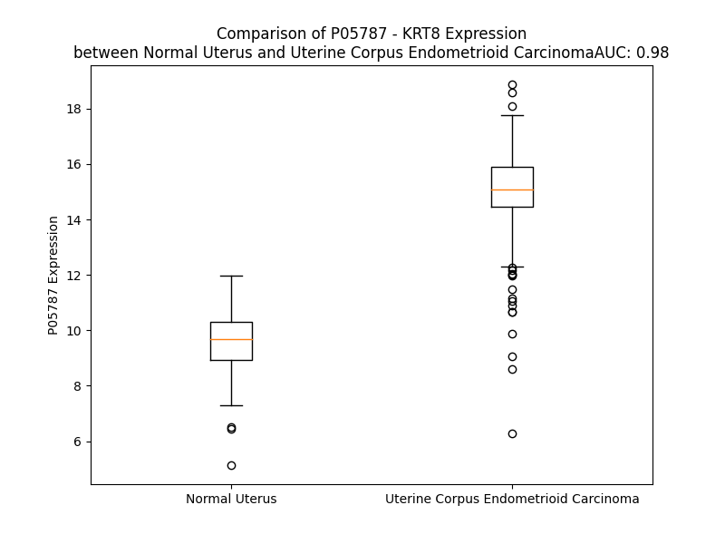

# Detailed Data for P05787

## Introduction to the Detailed Summary

### How to Interpret the Results

- **Summary & Metrics**: This section provides a quick reference to essential protein attributes, including expression changes, family classification, and biomarker applications. Regulation status (upregulated/downregulated) indicates the protein's behavior in a disease context. Some information comes from the original excel file with the proteins selected from literature, while others are derived from the analyses.
- **Expression Comparison**: A visual representation comparing protein expression between normal and disease states. It highlights significant changes in expression levels that might indicate diagnostic or therapeutic relevance. This is data coming from transcriptomics experiments and could not translate similarly to protein levels.
- **Isoform Alignment**: An interactive view of isoform alignments, revealing structural and functional differences between variants of the protein.
- **Interactors & Homologs**: Tables listing known interaction partners and homologous proteins, the more interactors and homologs, the more complex the protein is to design an antibody for.
- **Biological Assemblies**: Information about the structural arrangement of the protein in different assemblies, providing insights into its functional state but also the complexity of the protein to develop antibodies.
- **Combined Per-Residue Information**: A detailed table summarizing residue-level data. This includes predictions for epitope regions, aggregation tendencies, and modifications that might impact the protein's function. Each row corresponds to a residue in the protein, providing insights into specific sites that may be important for research or drug development.
## Summary & Metrics

- **UniProt Accession**: P05787
- **Gene Name**: KRT8
- **Protein Name**: Keratin, type II cytoskeletal 8
- **Swiss Prot**: K2C8_HUMAN
- **Family**: other
- **Biomarker Application**: prognosis
- **Number of Isoforms**: 2
- **Regulation**: 1
- **(transcriptomics) AUC**: 0.98
- **(transcriptomics) Fold Change**: 1.56
- **(transcriptomics) Regulation**: Upregulated
- **Discotope Epitope Count**: 76
- **Max n_uniprots (Homo)**: N/A
- **Max n_uniprots (Hetero)**: 0

## Expression Comparison

## Isoform Alignment

<pre style='font-size:14px; font-family:monospace;'>P05787-1 ----------------------------MSIRVTQKSYKVSTSGPRAFSSRSYTSGPGSRISSSSFSRVGSSNFRGGLGGGYGGASGMGGITAVTVNQSLLSPLVLEVDPNIQAVRTQEKEQIKTLNNKFASFIDKVRFLEQQNKMLETKWSLLQQQKTARSNMDNMFESYINNLRRQLETLGQEKLKLEAELGNMQGLVEDFKNKYEDEINKRTEMENEFVLIKKDVDEAYMNKVELESRLEGLTDEINFLRQLYEEEIRELQSQISDTSVVLSMDNSRSLDMDSIIAEVKAQYEDIANRSRAEAESMYQIKYEELQSLAGKHGDDLRRTKTEISEMNRNISRLQAEIEGLKGQRASLEAAIADAEQRGELAIKDANAKLSELEAALQRAKQDMARQLREYQELMNVKLALDIEIATYRKLLEGEESRLESGMQNMSIHTKTTSGYAGGLSSAYGGLTSPGLSYSLGSSFGSGAGSSSFSRTSSSRAVVVKKIETRDGKLVSESSDVLPK
P05787-2 MNGVSWSQDLQEGISAWFGPPASTPASTMSIRVTQKSYKVSTSGPRAFSSRSYTSGPGSRISSSSFSRVGSSNFRGGLGGGYGGASGMGGITAVTVNQSLLSPLVLEVDPNIQAVRTQEKEQIKTLNNKFASFIDKVRFLEQQNKMLETKWSLLQQQKTARSNMDNMFESYINNLRRQLETLGQEKLKLEAELGNMQGLVEDFKNKYEDEINKRTEMENEFVLIKKDVDEAYMNKVELESRLEGLTDEINFLRQLYEEEIRELQSQISDTSVVLSMDNSRSLDMDSIIAEVKAQYEDIANRSRAEAESMYQIKYEELQSLAGKHGDDLRRTKTEISEMNRNISRLQAEIEGLKGQRASLEAAIADAEQRGELAIKDANAKLSELEAALQRAKQDMARQLREYQELMNVKLALDIEIATYRKLLEGEESRLESGMQNMSIHTKTTSGYAGGLSSAYGGLTSPGLSYSLGSSFGSGAGSSSFSRTSSSRAVVVKKIETRDGKLVSESSDVLPK
</pre>

## Interactors

| preferredName_A   | preferredName_B   |   score |
|:------------------|:------------------|--------:|
| KRT8              | KRT18             |   0.999 |

## Homologs

| uniprot_id   | gene_id      |
|:-------------|:-------------|
| P05783       | KRT18        |
| Q7RTS7       | KRT74        |
| A0A1B0GVI3   | KRT10        |
| Q7Z3Z0       | KRT25        |
| P08727       | KRT19        |
| P19012       | KRT15        |
| Q03252       | LMNB2        |
| Q2M2I5       | KRT24        |
| P35908       | KRT2         |
| P02533       | KRT14        |
| P08779       | KRT16        |
| A0A0D9SFE5   | LMNB1        |
| Q7Z3Y7       | KRT28        |
| P35527       | KRT9         |
| H0YFE3       | LMNTD1       |
| Q8N1A0       | KRT222       |
| Q14CN4       | KRT72        |
| O76013       | KRT36        |
| Q92764       | KRT35        |
| Q5XKE5       | KRT79        |
| P78386       | KRT85        |
| O76009       | KRT33A       |
| A0A1X7SCE1   | GFAP         |
| O76011       | KRT34        |
| Q7Z3Y9       | KRT26        |
| P08729       | KRT7         |
| B0YJC4       | VIM          |
| O76015       | KRT38        |
| O76014       | KRT37        |
| O43790       | KRT86        |
| P78385       | KRT83        |
| Q14533       | KRT81        |
| Q7Z3Y8       | KRT27        |
| E7ESP9       | NEFM         |
| Q16352       | INA          |
| P04259       | KRT6B        |
| A0A0S2Z428   | KRT6A        |
| P48668       | KRT6C        |
| Q6KB66       | KRT80        |
| P48681       | NES          |
| P35900       | KRT20        |
| K7EMJ2       | KRT13        |
| O95678       | KRT75        |
| Q04695       | KRT17        |
| Q13515       | BFSP2        |
| J3QR55       | KRT23        |
| Q53SB5       | tmp_locus_29 |
| F8W0C6       | KRT5         |
| Q01546       | KRT76        |
| Q7Z794       | KRT77        |
| Q9NSB2       | KRT84        |
| Q9NSB4       | KRT82        |
| P04264       | KRT1         |
| P07196       | NEFL         |
| Q14532       | KRT32        |
| Q6A162       | KRT40        |
| O15061       | SYNM         |
| Q8N1N4       | KRT78        |
| Q6A163       | KRT39        |
| F8VZR6       | KRT4         |
| Q3SY84       | KRT71        |
| Q14525       | KRT33B       |
| Q15323       | KRT31        |
| A0A6Q8PHQ9   | LMNA         |
| Q99456       | KRT12        |
| P12035       | KRT3         |
| Q86Y46       | KRT73        |
| P41219       | PRPH         |

## Biological Assemblies

|   Unnamed: 0 |   assembly |   n_uniprots | composition   | crystal_id   |
|-------------:|-----------:|-------------:|:--------------|:-------------|
|            0 |          1 |            0 | Hetero        | 7k3y         |
|            0 |          1 |            0 | Hetero        | 7k3x         |
|            0 |          1 |            0 | Hetero        | 7k3c         |

## Combined Per-Residue Information

|   res | aa   |   epitope_score | epitope   |   relative_surface_accessibility |   modeling_confidence |   Aggregation | modification                           |
|------:|:-----|----------------:|:----------|---------------------------------:|----------------------:|--------------:|:---------------------------------------|
|     1 | M    |         0.04559 | False     |                          0.92944 |                 61.08 |         0     | N/A                                    |
|     2 | S    |         0.04527 | False     |                          0.44717 |                 62.43 |         0     | N/A                                    |
|     3 | I    |         0.06827 | False     |                          0.72651 |                 58.2  |         0     | N/A                                    |
|     4 | R    |         0.14318 | True      |                          0.64367 |                 63.07 |         0     | N/A                                    |
|     5 | V    |         0.07179 | False     |                          0.60925 |                 60.73 |         0     | N/A                                    |
|     6 | T    |         0.10195 | False     |                          0.45896 |                 59.09 |         0     | N/A                                    |
|     7 | Q    |         0.11899 | False     |                          0.65996 |                 47.97 |         0     | N/A                                    |
|     8 | K    |         0.10764 | False     |                          0.55147 |                 50.18 |         0     | N/A                                    |
|     9 | S    |         0.07839 | False     |                          0.69416 |                 47.51 |         0     | Phosphoserine; by PKC/PRKCE            |
|    10 | Y    |         0.05649 | False     |                          0.55664 |                 46.79 |         0     | N/A                                    |
|    11 | K    |         0.08047 | False     |                          0.86673 |                 37.6  |         0     | N/A                                    |
|    12 | V    |         0.06819 | False     |                          0.8872  |                 40.35 |         0     | N/A                                    |
|    13 | S    |         0.07997 | False     |                          0.80475 |                 36.25 |         0     | Phosphoserine                          |
|    14 | T    |         0.06239 | False     |                          0.93249 |                 38.99 |         0     | N/A                                    |
|    15 | S    |         0.08014 | False     |                          0.82045 |                 38.15 |         0     | Phosphoserine                          |
|    16 | G    |         0.08624 | False     |                          0.62714 |                 33.49 |         0     | N/A                                    |
|    17 | P    |         0.12183 | False     |                          1.05372 |                 41.96 |         0     | N/A                                    |
|    18 | R    |         0.13369 | True      |                          0.87163 |                 34.1  |         0     | N/A                                    |
|    19 | A    |         0.08171 | False     |                          0.95782 |                 33.58 |         0     | N/A                                    |
|    20 | F    |         0.10807 | False     |                          1.00053 |                 36.41 |         0     | N/A                                    |
|    21 | S    |         0.10675 | False     |                          0.76927 |                 33.51 |         0     | Phosphoserine                          |
|    22 | S    |         0.11085 | False     |                          0.90363 |                 38.05 |         0     | Phosphoserine                          |
|    23 | R    |         0.17985 | True      |                          0.86041 |                 33.23 |         0     | Omega-N-methylarginine                 |
|    24 | S    |         0.11647 | False     |                          0.71417 |                 28.88 |         0     | Phosphoserine; by PKC/PRKCE            |
|    25 | Y    |         0.1838  | True      |                          0.98865 |                 38.08 |         0     | N/A                                    |
|    26 | T    |         0.14448 | True      |                          0.87834 |                 28.24 |         0     | Phosphothreonine                       |
|    27 | S    |         0.09521 | False     |                          0.91576 |                 34.59 |         0     | Phosphoserine                          |
|    28 | G    |         0.14512 | True      |                          0.79365 |                 32.35 |         0     | N/A                                    |
|    29 | P    |         0.15342 | True      |                          1.08065 |                 34.47 |         0     | N/A                                    |
|    30 | G    |         0.16901 | True      |                          0.93501 |                 31.64 |         0     | N/A                                    |
|    31 | S    |         0.12475 | False     |                          0.82465 |                 31.44 |         0     | Phosphoserine                          |
|    32 | R    |         0.20908 | True      |                          0.95075 |                 28.62 |         0     | Omega-N-methylarginine                 |
|    33 | I    |         0.13286 | True      |                          0.94788 |                 31.53 |         0     | N/A                                    |
|    34 | S    |         0.08172 | False     |                          0.86767 |                 29.05 |         0     | Phosphoserine                          |
|    35 | S    |         0.07608 | False     |                          0.75569 |                 35.4  |         0     | N/A                                    |
|    36 | S    |         0.08764 | False     |                          0.7188  |                 30.41 |         0     | N/A                                    |
|    37 | S    |         0.05897 | False     |                          0.70128 |                 32.52 |         0     | Phosphoserine                          |
|    38 | F    |         0.10511 | False     |                          0.86901 |                 31.73 |         0     | N/A                                    |
|    39 | S    |         0.07484 | False     |                          0.62235 |                 31.99 |         0     | Phosphoserine                          |
|    40 | R    |         0.10689 | False     |                          0.91578 |                 30.63 |         0     | Omega-N-methylarginine                 |
|    41 | V    |         0.09555 | False     |                          0.97706 |                 31.52 |         0     | N/A                                    |
|    42 | G    |         0.06441 | False     |                          0.69769 |                 29.14 |         0     | N/A                                    |
|    43 | S    |         0.0886  | False     |                          0.90095 |                 34.12 |         0     | Phosphoserine                          |
|    44 | S    |         0.07638 | False     |                          0.76387 |                 33.7  |         0     | Phosphoserine                          |
|    45 | N    |         0.09928 | False     |                          0.86586 |                 31.27 |         0     | N/A                                    |
|    46 | F    |         0.07154 | False     |                          1.01157 |                 34.04 |         0     | N/A                                    |
|    47 | R    |         0.12031 | False     |                          0.92755 |                 30.34 |         0     | Asymmetric dimethylarginine; alternate |
|    47 | R    |         0.12031 | False     |                          0.92755 |                 30.34 |         0     | Omega-N-methylarginine; alternate      |
|    48 | G    |         0.08819 | False     |                          0.9533  |                 34.23 |         0     | N/A                                    |
|    49 | G    |         0.105   | False     |                          0.79299 |                 31.21 |         0     | N/A                                    |
|    50 | L    |         0.14115 | True      |                          1.16171 |                 31.66 |         0     | N/A                                    |
|    51 | G    |         0.07858 | False     |                          0.91514 |                 31.78 |         0     | N/A                                    |
|    52 | G    |         0.10648 | False     |                          0.96428 |                 31.74 |         0     | N/A                                    |
|    53 | G    |         0.23502 | True      |                          0.73816 |                 25.45 |         0     | N/A                                    |
|    54 | Y    |         0.12139 | False     |                          1.06458 |                 28.51 |         0     | N/A                                    |
|    55 | G    |         0.13857 | True      |                          0.93486 |                 28.03 |         0     | N/A                                    |
|    56 | G    |         0.1417  | True      |                          0.94439 |                 31.57 |         0     | N/A                                    |
|    57 | A    |         0.06648 | False     |                          1.02777 |                 31.6  |         0     | N/A                                    |
|    58 | S    |         0.08315 | False     |                          0.8336  |                 32.54 |         0     | N/A                                    |
|    59 | G    |         0.07761 | False     |                          0.81298 |                 33.35 |         0     | N/A                                    |
|    60 | M    |         0.11604 | False     |                          1.02497 |                 33.08 |         0.192 | N/A                                    |
|    61 | G    |         0.0946  | False     |                          0.95647 |                 34.39 |         0.36  | N/A                                    |
|    62 | G    |         0.08782 | False     |                          0.81837 |                 32.86 |         2.671 | N/A                                    |
|    63 | I    |         0.20417 | True      |                          1.07533 |                 37.25 |        26.32  | N/A                                    |
|    64 | T    |         0.11222 | False     |                          0.89707 |                 38.09 |        28.236 | N/A                                    |
|    65 | A    |         0.15427 | True      |                          0.92965 |                 38.89 |        28.361 | N/A                                    |
|    66 | V    |         0.15043 | True      |                          0.94034 |                 41.99 |        28.361 | N/A                                    |
|    67 | T    |         0.14082 | True      |                          0.92681 |                 44.22 |        28.091 | N/A                                    |
|    68 | V    |         0.13465 | True      |                          0.73423 |                 47.95 |        26.153 | N/A                                    |
|    69 | N    |         0.16717 | True      |                          0.65825 |                 42.62 |         1.059 | N/A                                    |
|    70 | Q    |         0.16322 | True      |                          0.74495 |                 54.89 |         0.118 | N/A                                    |
|    71 | S    |         0.13504 | True      |                          0.71788 |                 53.8  |         0.118 | N/A                                    |
|    72 | L    |         0.12759 | False     |                          0.94683 |                 50.36 |         0.118 | N/A                                    |
|    73 | L    |         0.15283 | True      |                          0.85547 |                 47.88 |         0.118 | N/A                                    |
|    74 | S    |         0.0829  | False     |                          0.5827  |                 44.3  |         0     | Phosphoserine; by MAPK                 |
|    75 | P    |         0.15131 | True      |                          0.90557 |                 42.34 |         0     | N/A                                    |
|    76 | L    |         0.1571  | True      |                          0.84527 |                 40.56 |         0     | N/A                                    |
|    77 | V    |         0.09284 | False     |                          0.92777 |                 43.56 |         0     | N/A                                    |
|    78 | L    |         0.12585 | False     |                          0.79453 |                 49.39 |         0     | N/A                                    |
|    79 | E    |         0.13108 | True      |                          0.85907 |                 47.17 |         0     | N/A                                    |
|    80 | V    |         0.06921 | False     |                          0.6999  |                 54.33 |         0     | N/A                                    |
|    81 | D    |         0.21011 | True      |                          0.47332 |                 48.45 |         0     | N/A                                    |
|    82 | P    |         0.12435 | False     |                          0.80155 |                 62.37 |         0     | N/A                                    |
|    83 | N    |         0.13219 | True      |                          0.72748 |                 64.4  |         0     | N/A                                    |
|    84 | I    |         0.10067 | False     |                          0.54015 |                 63.92 |         0     | N/A                                    |
|    85 | Q    |         0.08434 | False     |                          0.57887 |                 69.04 |         0     | N/A                                    |
|    86 | A    |         0.10194 | False     |                          0.59052 |                 73.98 |         0     | N/A                                    |
|    87 | V    |         0.09346 | False     |                          0.6217  |                 76.46 |         0     | N/A                                    |
|    88 | R    |         0.09905 | False     |                          0.67758 |                 76.69 |         0     | N/A                                    |
|    89 | T    |         0.09202 | False     |                          0.59174 |                 79.16 |         0     | N/A                                    |
|    90 | Q    |         0.11451 | False     |                          0.59425 |                 82.26 |         0     | N/A                                    |
|    91 | E    |         0.06457 | False     |                          0.48462 |                 83.66 |         0     | N/A                                    |
|    92 | K    |         0.09262 | False     |                          0.63621 |                 85.08 |         0     | N/A                                    |
|    93 | E    |         0.09333 | False     |                          0.46704 |                 84.26 |         0     | N/A                                    |
|    94 | Q    |         0.12055 | False     |                          0.55644 |                 81.7  |         0     | N/A                                    |
|    95 | I    |         0.07227 | False     |                          0.63704 |                 83.49 |         0     | N/A                                    |
|    96 | K    |         0.09176 | False     |                          0.46709 |                 87.17 |         0     | N/A                                    |
|    97 | T    |         0.10754 | False     |                          0.51953 |                 86.31 |         0     | N/A                                    |
|    98 | L    |         0.07972 | False     |                          0.59508 |                 85.92 |         0     | N/A                                    |
|    99 | N    |         0.07339 | False     |                          0.55893 |                 87.61 |         0     | N/A                                    |
|   100 | N    |         0.10705 | False     |                          0.66567 |                 88.53 |         0     | N/A                                    |
|   101 | K    |         0.03872 | False     |                          0.61807 |                 87.21 |         0     | N6-malonyllysine                       |
|   102 | F    |         0.04355 | False     |                          0.56833 |                 88.58 |         9.816 | N/A                                    |
|   103 | A    |         0.06374 | False     |                          0.49357 |                 88.69 |         9.816 | N/A                                    |
|   104 | S    |         0.06018 | False     |                          0.50345 |                 90.33 |         9.816 | N/A                                    |
|   105 | F    |         0.03679 | False     |                          0.66386 |                 91.61 |         9.816 | N/A                                    |
|   106 | I    |         0.08725 | False     |                          0.62994 |                 90.53 |         9.816 | N/A                                    |
|   107 | D    |         0.08309 | False     |                          0.581   |                 91.84 |         0     | N/A                                    |
|   108 | K    |         0.06657 | False     |                          0.6518  |                 91.16 |         0     | N/A                                    |
|   109 | V    |         0.03647 | False     |                          0.57956 |                 93.52 |         0     | N/A                                    |
|   110 | R    |         0.05709 | False     |                          0.67543 |                 93.03 |         0     | N/A                                    |
|   111 | F    |         0.09326 | False     |                          0.60608 |                 94.19 |         0     | N/A                                    |
|   112 | L    |         0.0377  | False     |                          0.55536 |                 93.88 |         0     | N/A                                    |
|   113 | E    |         0.04043 | False     |                          0.55853 |                 93.34 |         0     | N/A                                    |
|   114 | Q    |         0.09893 | False     |                          0.68419 |                 94.82 |         0     | N/A                                    |
|   115 | Q    |         0.0622  | False     |                          0.40207 |                 94.21 |         0     | N/A                                    |
|   116 | N    |         0.04391 | False     |                          0.58964 |                 93.95 |         0     | N/A                                    |
|   117 | K    |         0.06901 | False     |                          0.71441 |                 95.33 |         0     | N/A                                    |
|   118 | M    |         0.09718 | False     |                          0.54802 |                 94.98 |         0     | N/A                                    |
|   119 | L    |         0.06136 | False     |                          0.68084 |                 95.28 |         0     | N/A                                    |
|   120 | E    |         0.04865 | False     |                          0.63175 |                 94.26 |         0     | N/A                                    |
|   121 | T    |         0.0598  | False     |                          0.56906 |                 92.75 |         0     | N/A                                    |
|   122 | K    |         0.0867  | False     |                          0.61849 |                 93.51 |         0     | N/A                                    |
|   123 | W    |         0.07311 | False     |                          0.78742 |                 91.38 |         0     | N/A                                    |
|   124 | S    |         0.06702 | False     |                          0.44296 |                 90.31 |         0     | N/A                                    |
|   125 | L    |         0.08518 | False     |                          0.78425 |                 89.14 |         0     | N/A                                    |
|   126 | L    |         0.05483 | False     |                          0.71286 |                 87.99 |         0     | N/A                                    |
|   127 | Q    |         0.04445 | False     |                          0.57567 |                 83.9  |         0     | N/A                                    |
|   128 | Q    |         0.13409 | True      |                          0.70928 |                 80.63 |         0     | N/A                                    |
|   129 | Q    |         0.12832 | False     |                          0.72239 |                 75.88 |         0     | N/A                                    |
|   130 | K    |         0.16226 | True      |                          0.86839 |                 67.19 |         0     | N/A                                    |
|   131 | T    |         0.15738 | True      |                          0.64075 |                 61.54 |         0     | N/A                                    |
|   132 | A    |         0.10495 | False     |                          0.91592 |                 60.6  |         0     | N/A                                    |
|   133 | R    |         0.17474 | True      |                          0.80072 |                 62.78 |         0     | N/A                                    |
|   134 | S    |         0.1354  | True      |                          0.55612 |                 70.96 |         0     | N/A                                    |
|   135 | N    |         0.13767 | True      |                          0.72156 |                 78.96 |         0     | N/A                                    |
|   136 | M    |         0.14191 | True      |                          0.60818 |                 80.91 |         0     | N/A                                    |
|   137 | D    |         0.06903 | False     |                          0.67065 |                 86.45 |         0     | N/A                                    |
|   138 | N    |         0.07195 | False     |                          0.68065 |                 89.61 |         0     | N/A                                    |
|   139 | M    |         0.12247 | False     |                          0.72089 |                 91.04 |         0     | N/A                                    |
|   140 | F    |         0.10471 | False     |                          0.59285 |                 91.56 |         0     | N/A                                    |
|   141 | E    |         0.04212 | False     |                          0.47155 |                 92.89 |         0     | N/A                                    |
|   142 | S    |         0.07158 | False     |                          0.50616 |                 94.93 |         0     | N/A                                    |
|   143 | Y    |         0.1066  | False     |                          0.62622 |                 94.4  |         0     | N/A                                    |
|   144 | I    |         0.06763 | False     |                          0.43177 |                 94.52 |         0     | N/A                                    |
|   145 | N    |         0.06216 | False     |                          0.36983 |                 95.93 |         0     | N/A                                    |
|   146 | N    |         0.06879 | False     |                          0.49774 |                 96.25 |         0     | N/A                                    |
|   147 | L    |         0.05888 | False     |                          0.43852 |                 96.07 |         0     | N/A                                    |
|   148 | R    |         0.0857  | False     |                          0.61127 |                 96.55 |         0     | N/A                                    |
|   149 | R    |         0.1039  | False     |                          0.7329  |                 96.13 |         0     | N/A                                    |
|   150 | Q    |         0.06249 | False     |                          0.52923 |                 96.77 |         0     | N/A                                    |
|   151 | L    |         0.06334 | False     |                          0.74856 |                 96.25 |         0     | N/A                                    |
|   152 | E    |         0.06072 | False     |                          0.60716 |                 96.62 |         0     | N/A                                    |
|   153 | T    |         0.06205 | False     |                          0.52502 |                 96.69 |         0     | N/A                                    |
|   154 | L    |         0.10115 | False     |                          0.68001 |                 97.3  |         0     | N/A                                    |
|   155 | G    |         0.02492 | False     |                          0.35788 |                 96.75 |         0     | N/A                                    |
|   156 | Q    |         0.07754 | False     |                          0.57739 |                 97.11 |         0     | N/A                                    |
|   157 | E    |         0.04725 | False     |                          0.45799 |                 97.6  |         0     | N/A                                    |
|   158 | K    |         0.10751 | False     |                          0.59018 |                 97.34 |         0     | N/A                                    |
|   159 | L    |         0.0631  | False     |                          0.7297  |                 96.95 |         0     | N/A                                    |
|   160 | K    |         0.06815 | False     |                          0.65661 |                 97.51 |         0     | N/A                                    |
|   161 | L    |         0.07358 | False     |                          0.70332 |                 96.67 |         0     | N/A                                    |
|   162 | E    |         0.04106 | False     |                          0.44452 |                 97.3  |         0     | N/A                                    |
|   163 | A    |         0.04378 | False     |                          0.55997 |                 96.52 |         0     | N/A                                    |
|   164 | E    |         0.04988 | False     |                          0.43699 |                 97.15 |         0     | N/A                                    |
|   165 | L    |         0.0779  | False     |                          0.64195 |                 96.7  |         0     | N/A                                    |
|   166 | G    |         0.03158 | False     |                          0.45408 |                 96.9  |         0     | N/A                                    |
|   167 | N    |         0.08037 | False     |                          0.71162 |                 97.17 |         0     | N/A                                    |
|   168 | M    |         0.06742 | False     |                          0.62437 |                 97.22 |         0     | N/A                                    |
|   169 | Q    |         0.05289 | False     |                          0.54895 |                 96.93 |         0     | N/A                                    |
|   170 | G    |         0.02964 | False     |                          0.42263 |                 96.55 |         0     | N/A                                    |
|   171 | L    |         0.06284 | False     |                          0.53774 |                 96.38 |         0     | N/A                                    |
|   172 | V    |         0.06361 | False     |                          0.61731 |                 97.22 |         0     | N/A                                    |
|   173 | E    |         0.06272 | False     |                          0.39872 |                 96.62 |         0     | N/A                                    |
|   174 | D    |         0.06617 | False     |                          0.49429 |                 96.62 |         0     | N/A                                    |
|   175 | F    |         0.05789 | False     |                          0.49574 |                 96.31 |         0     | N/A                                    |
|   176 | K    |         0.06429 | False     |                          0.47904 |                 97.45 |         0     | N/A                                    |
|   177 | N    |         0.03896 | False     |                          0.44029 |                 96.24 |         0     | N/A                                    |
|   178 | K    |         0.04911 | False     |                          0.6216  |                 96.98 |         0     | N/A                                    |
|   179 | Y    |         0.12159 | False     |                          0.6639  |                 95.5  |         0     | N/A                                    |
|   180 | E    |         0.03212 | False     |                          0.43651 |                 95.25 |         0     | N/A                                    |
|   181 | D    |         0.03658 | False     |                          0.47647 |                 94.1  |         0     | N/A                                    |
|   182 | E    |         0.04701 | False     |                          0.46023 |                 95.99 |         0     | N/A                                    |
|   183 | I    |         0.06024 | False     |                          0.56836 |                 95.33 |         0     | N/A                                    |
|   184 | N    |         0.06249 | False     |                          0.54072 |                 94.75 |         0     | N/A                                    |
|   185 | K    |         0.05659 | False     |                          0.59631 |                 95.48 |         0     | N/A                                    |
|   186 | R    |         0.12411 | False     |                          0.62692 |                 94.98 |         0     | N/A                                    |
|   187 | T    |         0.05139 | False     |                          0.50449 |                 93.4  |         0     | N/A                                    |
|   188 | E    |         0.05518 | False     |                          0.56613 |                 93.95 |         0     | N/A                                    |
|   189 | M    |         0.10359 | False     |                          0.72224 |                 93.43 |         0     | N/A                                    |
|   190 | E    |         0.05599 | False     |                          0.50109 |                 94.46 |         0     | N/A                                    |
|   191 | N    |         0.04412 | False     |                          0.54047 |                 93.87 |         0     | N/A                                    |
|   192 | E    |         0.06666 | False     |                          0.47154 |                 93.87 |         1.348 | N/A                                    |
|   193 | F    |         0.06561 | False     |                          0.61476 |                 95.25 |         1.348 | N/A                                    |
|   194 | V    |         0.05461 | False     |                          0.6061  |                 95.82 |         1.348 | N/A                                    |
|   195 | L    |         0.0643  | False     |                          0.59848 |                 94.4  |         1.348 | N/A                                    |
|   196 | I    |         0.07612 | False     |                          0.60797 |                 94.03 |         1.348 | N/A                                    |
|   197 | K    |         0.06582 | False     |                          0.57162 |                 97.03 |         1.348 | N/A                                    |
|   198 | K    |         0.07564 | False     |                          0.62821 |                 96.52 |         0     | N/A                                    |
|   199 | D    |         0.10989 | False     |                          0.52739 |                 94.92 |         0     | N/A                                    |
|   200 | V    |         0.10598 | False     |                          0.6354  |                 96.88 |         0     | N/A                                    |
|   201 | D    |         0.07538 | False     |                          0.46579 |                 96.45 |         0     | N/A                                    |
|   202 | E    |         0.06638 | False     |                          0.49652 |                 95.27 |         0     | N/A                                    |
|   203 | A    |         0.04824 | False     |                          0.57853 |                 94.57 |         0     | N/A                                    |
|   204 | Y    |         0.08442 | False     |                          0.60172 |                 96.41 |         0     | N/A                                    |
|   205 | M    |         0.06245 | False     |                          0.61135 |                 95.67 |         0     | N/A                                    |
|   206 | N    |         0.07374 | False     |                          0.46983 |                 96.56 |         0     | N/A                                    |
|   207 | K    |         0.22537 | True      |                          0.53604 |                 96.71 |         0     | N6-acetyllysine                        |
|   208 | V    |         0.08404 | False     |                          0.43907 |                 97.51 |         0     | N/A                                    |
|   209 | E    |         0.07543 | False     |                          0.46653 |                 96.22 |         0     | N/A                                    |
|   210 | L    |         0.06522 | False     |                          0.68466 |                 96.06 |         0     | N/A                                    |
|   211 | E    |         0.04405 | False     |                          0.44895 |                 96.37 |         0     | N/A                                    |
|   212 | S    |         0.09984 | False     |                          0.53803 |                 96.66 |         0     | N/A                                    |
|   213 | R    |         0.07265 | False     |                          0.63317 |                 96.44 |         0     | N/A                                    |
|   214 | L    |         0.07833 | False     |                          0.73761 |                 97.16 |         0     | N/A                                    |
|   215 | E    |         0.1524  | True      |                          0.5759  |                 96.47 |         0     | N/A                                    |
|   216 | G    |         0.06818 | False     |                          0.47837 |                 96.45 |         0     | N/A                                    |
|   217 | L    |         0.09437 | False     |                          0.65163 |                 96.57 |         0     | N/A                                    |
|   218 | T    |         0.05732 | False     |                          0.43052 |                 95.96 |         0     | N/A                                    |
|   219 | D    |         0.05084 | False     |                          0.53272 |                 96.2  |         0     | N/A                                    |
|   220 | E    |         0.05508 | False     |                          0.48709 |                 96.32 |         0     | N/A                                    |
|   221 | I    |         0.07199 | False     |                          0.53577 |                 95.71 |         0     | N/A                                    |
|   222 | N    |         0.06426 | False     |                          0.41346 |                 96.11 |         0     | N/A                                    |
|   223 | F    |         0.10563 | False     |                          0.64678 |                 96.58 |         0     | N/A                                    |
|   224 | L    |         0.04793 | False     |                          0.40558 |                 96.19 |         0     | N/A                                    |
|   225 | R    |         0.18235 | True      |                          0.67658 |                 94.93 |         0     | N/A                                    |
|   226 | Q    |         0.08643 | False     |                          0.62843 |                 95.6  |         0     | N/A                                    |
|   227 | L    |         0.11342 | False     |                          0.52842 |                 95.54 |         0     | N/A                                    |
|   228 | Y    |         0.11482 | False     |                          0.55919 |                 93.25 |         0     | Phosphotyrosine                        |
|   229 | E    |         0.07027 | False     |                          0.53759 |                 94.68 |         0     | N/A                                    |
|   230 | E    |         0.0697  | False     |                          0.46386 |                 93.09 |         0     | N/A                                    |
|   231 | E    |         0.0573  | False     |                          0.44172 |                 92.9  |         0     | N/A                                    |
|   232 | I    |         0.08996 | False     |                          0.53636 |                 90.46 |         0     | N/A                                    |
|   233 | R    |         0.13363 | True      |                          0.5166  |                 90.94 |         0     | N/A                                    |
|   234 | E    |         0.11149 | False     |                          0.54206 |                 90.32 |         0     | N/A                                    |
|   235 | L    |         0.07668 | False     |                          0.54902 |                 87.84 |         0     | N/A                                    |
|   236 | Q    |         0.09125 | False     |                          0.58518 |                 84.98 |         0     | N/A                                    |
|   237 | S    |         0.14005 | True      |                          0.44726 |                 85.72 |         0     | N/A                                    |
|   238 | Q    |         0.06693 | False     |                          0.4486  |                 82.59 |         0     | N/A                                    |
|   239 | I    |         0.11551 | False     |                          0.76045 |                 79.51 |         0     | N/A                                    |
|   240 | S    |         0.10368 | False     |                          0.57905 |                 73.18 |         0     | N/A                                    |
|   241 | D    |         0.15463 | True      |                          0.65041 |                 65.72 |         0     | N/A                                    |
|   242 | T    |         0.12594 | False     |                          0.79981 |                 63.43 |         1.263 | N/A                                    |
|   243 | S    |         0.25426 | True      |                          0.66103 |                 48.27 |         1.263 | N/A                                    |
|   244 | V    |         0.23148 | True      |                          0.77983 |                 45.26 |         3.672 | N/A                                    |
|   245 | V    |         0.17746 | True      |                          1.00875 |                 46.44 |         3.672 | N/A                                    |
|   246 | L    |         0.3143  | True      |                          0.9411  |                 41.62 |         3.672 | N/A                                    |
|   247 | S    |         0.14471 | True      |                          0.815   |                 37.08 |         2.41  | N/A                                    |
|   248 | M    |         0.35216 | True      |                          0.89692 |                 41.67 |         2.41  | N/A                                    |
|   249 | D    |         0.16275 | True      |                          0.86945 |                 35.18 |         0     | N/A                                    |
|   250 | N    |         0.28644 | True      |                          0.72677 |                 52.02 |         0     | N/A                                    |
|   251 | S    |         0.182   | True      |                          0.86956 |                 44.37 |         0     | N/A                                    |
|   252 | R    |         0.15716 | True      |                          0.80017 |                 55.37 |         0     | N/A                                    |
|   253 | S    |         0.11868 | False     |                          0.9155  |                 54.36 |         0     | Phosphoserine                          |
|   254 | L    |         0.08984 | False     |                          0.64741 |                 62.03 |         0     | N/A                                    |
|   255 | D    |         0.13759 | True      |                          0.57959 |                 70.25 |         0     | N/A                                    |
|   256 | M    |         0.1952  | True      |                          0.63604 |                 72.67 |         0     | N/A                                    |
|   257 | D    |         0.1091  | False     |                          0.70238 |                 84.36 |         0     | N/A                                    |
|   258 | S    |         0.09253 | False     |                          0.46233 |                 85.4  |         0     | Phosphoserine                          |
|   259 | I    |         0.07032 | False     |                          0.38158 |                 82.78 |         0     | N/A                                    |
|   260 | I    |         0.08497 | False     |                          0.51337 |                 85.69 |         0     | N/A                                    |
|   261 | A    |         0.07355 | False     |                          0.55755 |                 88.16 |         0     | N/A                                    |
|   262 | E    |         0.0401  | False     |                          0.53118 |                 89.1  |         0     | N/A                                    |
|   263 | V    |         0.02587 | False     |                          0.49984 |                 88.74 |         0     | N/A                                    |
|   264 | K    |         0.08348 | False     |                          0.674   |                 90.69 |         0     | N/A                                    |
|   265 | A    |         0.04996 | False     |                          0.4797  |                 92.3  |         0     | N/A                                    |
|   266 | Q    |         0.03521 | False     |                          0.53182 |                 89.21 |         0     | N/A                                    |
|   267 | Y    |         0.06454 | False     |                          0.7099  |                 89.15 |         0     | N/A                                    |
|   268 | E    |         0.07477 | False     |                          0.57917 |                 93.04 |         0     | N/A                                    |
|   269 | D    |         0.02749 | False     |                          0.42257 |                 93.53 |         0     | N/A                                    |
|   270 | I    |         0.02809 | False     |                          0.56954 |                 90.65 |         0     | N/A                                    |
|   271 | A    |         0.03773 | False     |                          0.5756  |                 91.11 |         0     | N/A                                    |
|   272 | N    |         0.04973 | False     |                          0.52343 |                 94.39 |         0     | N/A                                    |
|   273 | R    |         0.05221 | False     |                          0.57175 |                 93.54 |         0     | N/A                                    |
|   274 | S    |         0.03937 | False     |                          0.49919 |                 92.63 |         0     | Phosphoserine                          |
|   275 | R    |         0.06559 | False     |                          0.65528 |                 93.78 |         0     | N/A                                    |
|   276 | A    |         0.02923 | False     |                          0.53873 |                 94.6  |         0     | N/A                                    |
|   277 | E    |         0.02347 | False     |                          0.58344 |                 92.55 |         0     | N/A                                    |
|   278 | A    |         0.01178 | False     |                          0.41435 |                 92.49 |         0     | N/A                                    |
|   279 | E    |         0.07595 | False     |                          0.49739 |                 94.31 |         0     | N/A                                    |
|   280 | S    |         0.01805 | False     |                          0.43202 |                 95.23 |         0     | N/A                                    |
|   281 | M    |         0.02637 | False     |                          0.57109 |                 94.61 |         0     | N/A                                    |
|   282 | Y    |         0.06829 | False     |                          0.74702 |                 93.49 |         0     | N/A                                    |
|   283 | Q    |         0.05862 | False     |                          0.49677 |                 95.57 |         0     | N/A                                    |
|   284 | I    |         0.03586 | False     |                          0.48457 |                 95.55 |         0     | N/A                                    |
|   285 | K    |         0.03029 | False     |                          0.49462 |                 94.71 |         0     | N/A                                    |
|   286 | Y    |         0.05302 | False     |                          0.66216 |                 94.36 |         0     | N/A                                    |
|   287 | E    |         0.017   | False     |                          0.46184 |                 95.08 |         0     | N/A                                    |
|   288 | E    |         0.04844 | False     |                          0.42741 |                 94.46 |         0     | N/A                                    |
|   289 | L    |         0.0371  | False     |                          0.70636 |                 94.46 |         0     | N/A                                    |
|   290 | Q    |         0.06331 | False     |                          0.59214 |                 94.6  |         0     | N/A                                    |
|   291 | S    |         0.02642 | False     |                          0.44046 |                 94.09 |         0     | Phosphoserine                          |
|   292 | L    |         0.03041 | False     |                          0.53006 |                 94.61 |         0     | N/A                                    |
|   293 | A    |         0.04086 | False     |                          0.61994 |                 93.45 |         0     | N/A                                    |
|   294 | G    |         0.05739 | False     |                          0.45544 |                 94.08 |         0     | N/A                                    |
|   295 | K    |         0.06114 | False     |                          0.63848 |                 94.5  |         0     | N6-acetyllysine; alternate             |
|   296 | H    |         0.05763 | False     |                          0.59818 |                 93.88 |         0     | N/A                                    |
|   297 | G    |         0.05615 | False     |                          0.46484 |                 95.58 |         0     | N/A                                    |
|   298 | D    |         0.03506 | False     |                          0.59808 |                 94.71 |         0     | N/A                                    |
|   299 | D    |         0.05455 | False     |                          0.48964 |                 95.06 |         0     | N/A                                    |
|   300 | L    |         0.04531 | False     |                          0.77622 |                 95.85 |         0     | N/A                                    |
|   301 | R    |         0.10277 | False     |                          0.71176 |                 96.23 |         0     | N/A                                    |
|   302 | R    |         0.09662 | False     |                          0.64774 |                 96.25 |         0     | N/A                                    |
|   303 | T    |         0.04002 | False     |                          0.44852 |                 95.51 |         0     | N/A                                    |
|   304 | K    |         0.03824 | False     |                          0.72024 |                 97.55 |         0     | N/A                                    |
|   305 | T    |         0.03579 | False     |                          0.47503 |                 95.88 |         0     | N/A                                    |
|   306 | E    |         0.0351  | False     |                          0.3614  |                 95.94 |         0     | N/A                                    |
|   307 | I    |         0.06472 | False     |                          0.55796 |                 94.84 |         0     | N/A                                    |
|   308 | S    |         0.07538 | False     |                          0.32433 |                 96.69 |         0     | N/A                                    |
|   309 | E    |         0.02721 | False     |                          0.49396 |                 96.58 |         0     | N/A                                    |
|   310 | M    |         0.06626 | False     |                          0.57129 |                 96    |         0     | N/A                                    |
|   311 | N    |         0.03845 | False     |                          0.51854 |                 96.97 |         0     | N/A                                    |
|   312 | R    |         0.09168 | False     |                          0.67536 |                 96.89 |         0     | N/A                                    |
|   313 | N    |         0.03555 | False     |                          0.41096 |                 97.7  |         0     | N/A                                    |
|   314 | I    |         0.10533 | False     |                          0.53337 |                 95.62 |         0     | N/A                                    |
|   315 | S    |         0.05961 | False     |                          0.52124 |                 96.95 |         0     | N/A                                    |
|   316 | R    |         0.08782 | False     |                          0.61025 |                 97.35 |         0     | N/A                                    |
|   317 | L    |         0.0529  | False     |                          0.54633 |                 96    |         0     | N/A                                    |
|   318 | Q    |         0.04172 | False     |                          0.49817 |                 97.09 |         0     | N/A                                    |
|   319 | A    |         0.06136 | False     |                          0.59464 |                 96.58 |         0     | N/A                                    |
|   320 | E    |         0.04002 | False     |                          0.49757 |                 96.97 |         0     | N/A                                    |
|   321 | I    |         0.07577 | False     |                          0.52356 |                 95.09 |         0     | N/A                                    |
|   322 | E    |         0.07772 | False     |                          0.62941 |                 96.93 |         0     | N/A                                    |
|   323 | G    |         0.07478 | False     |                          0.5485  |                 96.61 |         0     | N/A                                    |
|   324 | L    |         0.04982 | False     |                          0.63924 |                 95    |         0     | N/A                                    |
|   325 | K    |         0.06432 | False     |                          0.65042 |                 95.99 |         0     | N6-acetyllysine; alternate             |
|   326 | G    |         0.05416 | False     |                          0.50044 |                 96.06 |         0     | N/A                                    |
|   327 | Q    |         0.03812 | False     |                          0.53091 |                 96.6  |         0     | N/A                                    |
|   328 | R    |         0.09723 | False     |                          0.61352 |                 94.55 |         0     | N/A                                    |
|   329 | A    |         0.04082 | False     |                          0.53767 |                 96.69 |         0     | N/A                                    |
|   330 | S    |         0.05517 | False     |                          0.55714 |                 97.28 |         0     | Phosphoserine                          |
|   331 | L    |         0.04044 | False     |                          0.6092  |                 95.89 |         0     | N/A                                    |
|   332 | E    |         0.05227 | False     |                          0.41336 |                 96.11 |         0     | N/A                                    |
|   333 | A    |         0.06161 | False     |                          0.5588  |                 96.25 |         0     | N/A                                    |
|   334 | A    |         0.06128 | False     |                          0.54248 |                 95.73 |         0     | N/A                                    |
|   335 | I    |         0.06159 | False     |                          0.59037 |                 94.46 |         0     | N/A                                    |
|   336 | A    |         0.04129 | False     |                          0.52486 |                 96.04 |         0     | N/A                                    |
|   337 | D    |         0.0553  | False     |                          0.42157 |                 96.44 |         0     | N/A                                    |
|   338 | A    |         0.01978 | False     |                          0.5527  |                 94.31 |         0     | N/A                                    |
|   339 | E    |         0.05122 | False     |                          0.59832 |                 95.15 |         0     | N/A                                    |
|   340 | Q    |         0.07492 | False     |                          0.55783 |                 96.52 |         0     | N/A                                    |
|   341 | R    |         0.09323 | False     |                          0.65268 |                 94.53 |         0     | N/A                                    |
|   342 | G    |         0.05539 | False     |                          0.37393 |                 93.05 |         0     | N/A                                    |
|   343 | E    |         0.07331 | False     |                          0.47029 |                 95.94 |         0     | N/A                                    |
|   344 | L    |         0.09386 | False     |                          0.6347  |                 95.64 |         0     | N/A                                    |
|   345 | A    |         0.04379 | False     |                          0.5802  |                 94.86 |         0     | N/A                                    |
|   346 | I    |         0.06233 | False     |                          0.65106 |                 95.95 |         0     | N/A                                    |
|   347 | K    |         0.07328 | False     |                          0.56573 |                 96.58 |         0     | N/A                                    |
|   348 | D    |         0.06876 | False     |                          0.43437 |                 96.3  |         0     | N/A                                    |
|   349 | A    |         0.03661 | False     |                          0.52827 |                 95.67 |         0     | N/A                                    |
|   350 | N    |         0.07589 | False     |                          0.54643 |                 96.9  |         0     | N/A                                    |
|   351 | A    |         0.05056 | False     |                          0.59345 |                 96.86 |         0     | N/A                                    |
|   352 | K    |         0.05337 | False     |                          0.5882  |                 96.1  |         0     | N/A                                    |
|   353 | L    |         0.08051 | False     |                          0.62016 |                 94.87 |         0     | N/A                                    |
|   354 | S    |         0.03646 | False     |                          0.50039 |                 97.07 |         0     | N/A                                    |
|   355 | E    |         0.08673 | False     |                          0.62317 |                 96.67 |         0     | N/A                                    |
|   356 | L    |         0.07626 | False     |                          0.78381 |                 95.9  |         0     | N/A                                    |
|   357 | E    |         0.04392 | False     |                          0.51785 |                 96.7  |         0     | N/A                                    |
|   358 | A    |         0.03897 | False     |                          0.4163  |                 96.79 |         0     | N/A                                    |
|   359 | A    |         0.03151 | False     |                          0.41079 |                 95.62 |         0     | N/A                                    |
|   360 | L    |         0.05712 | False     |                          0.58613 |                 96.27 |         0     | N/A                                    |
|   361 | Q    |         0.05185 | False     |                          0.49303 |                 97.24 |         0     | N/A                                    |
|   362 | R    |         0.07608 | False     |                          0.58207 |                 96.42 |         0     | N/A                                    |
|   363 | A    |         0.04422 | False     |                          0.53571 |                 95.1  |         0     | N/A                                    |
|   364 | K    |         0.05152 | False     |                          0.57529 |                 96.38 |         0     | N/A                                    |
|   365 | Q    |         0.07091 | False     |                          0.55222 |                 96.83 |         0     | N/A                                    |
|   366 | D    |         0.03078 | False     |                          0.37638 |                 96.73 |         0     | N/A                                    |
|   367 | M    |         0.05835 | False     |                          0.6521  |                 95.48 |         0     | N/A                                    |
|   368 | A    |         0.04104 | False     |                          0.44379 |                 95.69 |         0     | N/A                                    |
|   369 | R    |         0.08307 | False     |                          0.47162 |                 96.71 |         0     | N/A                                    |
|   370 | Q    |         0.04679 | False     |                          0.49162 |                 95.91 |         0     | N/A                                    |
|   371 | L    |         0.05937 | False     |                          0.67031 |                 96.45 |         0     | N/A                                    |
|   372 | R    |         0.04033 | False     |                          0.57296 |                 95.39 |         0     | N/A                                    |
|   373 | E    |         0.03042 | False     |                          0.46292 |                 96.11 |         0     | N/A                                    |
|   374 | Y    |         0.05146 | False     |                          0.68966 |                 95.36 |         0     | N/A                                    |
|   375 | Q    |         0.04866 | False     |                          0.45769 |                 95.76 |         0     | N/A                                    |
|   376 | E    |         0.06625 | False     |                          0.55314 |                 95.58 |         0     | N/A                                    |
|   377 | L    |         0.04716 | False     |                          0.69224 |                 96.18 |         0     | N/A                                    |
|   378 | M    |         0.04621 | False     |                          0.55798 |                 96    |         0     | N/A                                    |
|   379 | N    |         0.0396  | False     |                          0.46874 |                 95.77 |         0     | N/A                                    |
|   380 | V    |         0.06663 | False     |                          0.58634 |                 96.22 |         0     | N/A                                    |
|   381 | K    |         0.0714  | False     |                          0.5329  |                 97.08 |         0     | N/A                                    |
|   382 | L    |         0.07278 | False     |                          0.58278 |                 95.33 |         0     | N/A                                    |
|   383 | A    |         0.04333 | False     |                          0.45924 |                 95.52 |         0     | N/A                                    |
|   384 | L    |         0.06125 | False     |                          0.55644 |                 94.2  |         0     | N/A                                    |
|   385 | D    |         0.05836 | False     |                          0.32893 |                 95.59 |         0     | N/A                                    |
|   386 | I    |         0.09848 | False     |                          0.68397 |                 94.26 |         0     | N/A                                    |
|   387 | E    |         0.07814 | False     |                          0.42617 |                 95.26 |         0     | N/A                                    |
|   388 | I    |         0.06232 | False     |                          0.49838 |                 92.8  |         0     | N/A                                    |
|   389 | A    |         0.05177 | False     |                          0.47531 |                 94.31 |         0     | N/A                                    |
|   390 | T    |         0.05184 | False     |                          0.46658 |                 92.57 |         0     | N/A                                    |
|   391 | Y    |         0.04677 | False     |                          0.60459 |                 93.57 |         0     | N/A                                    |
|   392 | R    |         0.04655 | False     |                          0.61794 |                 92.23 |         0     | N/A                                    |
|   393 | K    |         0.08084 | False     |                          0.75952 |                 91.27 |         0     | N/A                                    |
|   394 | L    |         0.0691  | False     |                          0.74314 |                 90.4  |         0     | N/A                                    |
|   395 | L    |         0.03079 | False     |                          0.69636 |                 89.68 |         0     | N/A                                    |
|   396 | E    |         0.03879 | False     |                          0.53169 |                 85.01 |         0     | N/A                                    |
|   397 | G    |         0.03614 | False     |                          0.50856 |                 84.21 |         0     | N/A                                    |
|   398 | E    |         0.03435 | False     |                          0.35058 |                 82.2  |         0     | N/A                                    |
|   399 | E    |         0.03289 | False     |                          0.57838 |                 81.74 |         0     | N/A                                    |
|   400 | S    |         0.04695 | False     |                          0.5579  |                 76.26 |         0     | Phosphoserine                          |
|   401 | R    |         0.12846 | False     |                          0.62393 |                 78.1  |         0     | N/A                                    |
|   402 | L    |         0.09199 | False     |                          0.58859 |                 72.97 |         0     | N/A                                    |
|   403 | E    |         0.08028 | False     |                          0.6228  |                 69.4  |         0     | N/A                                    |
|   404 | S    |         0.0794  | False     |                          0.59203 |                 67.3  |         0     | Phosphoserine                          |
|   405 | G    |         0.08487 | False     |                          0.51354 |                 59.85 |         0     | N/A                                    |
|   406 | M    |         0.08449 | False     |                          0.68265 |                 48.49 |         0     | N/A                                    |
|   407 | Q    |         0.17026 | True      |                          0.80176 |                 52.82 |         0     | N/A                                    |
|   408 | N    |         0.25833 | True      |                          0.8254  |                 49.61 |         0     | N/A                                    |
|   409 | M    |         0.18721 | True      |                          0.7115  |                 39.74 |         0     | N/A                                    |
|   410 | S    |         0.17063 | True      |                          0.86567 |                 34.36 |         0     | Phosphoserine                          |
|   411 | I    |         0.17764 | True      |                          0.84249 |                 42.21 |         0     | N/A                                    |
|   412 | H    |         0.18473 | True      |                          0.92666 |                 38.23 |         0     | N/A                                    |
|   413 | T    |         0.11793 | False     |                          0.8935  |                 32.38 |         0     | N/A                                    |
|   414 | K    |         0.14877 | True      |                          0.97652 |                 37.74 |         0     | N/A                                    |
|   415 | T    |         0.13701 | True      |                          0.8954  |                 32.42 |         0     | N/A                                    |
|   416 | T    |         0.12169 | False     |                          0.89379 |                 35.23 |         0     | N/A                                    |
|   417 | S    |         0.11676 | False     |                          0.71947 |                 29.77 |         0     | Phosphoserine                          |
|   418 | G    |         0.15519 | True      |                          0.59934 |                 27.63 |         0     | N/A                                    |
|   419 | Y    |         0.17501 | True      |                          0.922   |                 31.63 |         0     | N/A                                    |
|   420 | A    |         0.11205 | False     |                          1.06495 |                 30.36 |         0     | N/A                                    |
|   421 | G    |         0.15905 | True      |                          0.87082 |                 30.66 |         0     | N/A                                    |
|   422 | G    |         0.14036 | True      |                          0.90334 |                 30.24 |         0     | N/A                                    |
|   423 | L    |         0.12369 | False     |                          1.04217 |                 33.16 |         0     | N/A                                    |
|   424 | S    |         0.12516 | False     |                          0.83668 |                 30.37 |         0     | Phosphoserine                          |
|   425 | S    |         0.10267 | False     |                          0.64695 |                 32.15 |         0     | N/A                                    |
|   426 | A    |         0.08496 | False     |                          0.92179 |                 32.96 |         0     | N/A                                    |
|   427 | Y    |         0.10373 | False     |                          0.92267 |                 35.43 |         0     | N/A                                    |
|   428 | G    |         0.12157 | False     |                          0.77963 |                 28.3  |         0     | N/A                                    |
|   429 | G    |         0.13049 | True      |                          0.8993  |                 27.99 |         0     | N/A                                    |
|   430 | L    |         0.13354 | True      |                          1.0861  |                 35.75 |         0     | N/A                                    |
|   431 | T    |         0.10596 | False     |                          0.89336 |                 26    |         0     | N/A                                    |
|   432 | S    |         0.10818 | False     |                          0.81855 |                 38.27 |         0     | Phosphoserine; by CaMK2 and MAPK       |
|   433 | P    |         0.09149 | False     |                          0.92742 |                 41.84 |         0     | N/A                                    |
|   434 | G    |         0.10544 | False     |                          0.8543  |                 27.55 |         0     | N/A                                    |
|   435 | L    |         0.12072 | False     |                          0.99623 |                 33.97 |         0     | N/A                                    |
|   436 | S    |         0.12412 | False     |                          0.82417 |                 25.15 |         0     | N/A                                    |
|   437 | Y    |         0.10723 | False     |                          0.82255 |                 33.36 |         0     | N/A                                    |
|   438 | S    |         0.1396  | True      |                          0.8331  |                 25.49 |         0     | N/A                                    |
|   439 | L    |         0.20122 | True      |                          1.03477 |                 31.8  |         0     | N/A                                    |
|   440 | G    |         0.10893 | False     |                          0.7809  |                 29.67 |         0     | N/A                                    |
|   441 | S    |         0.08266 | False     |                          0.69976 |                 30.89 |         0     | N/A                                    |
|   442 | S    |         0.09663 | False     |                          0.86484 |                 30.52 |         0     | N/A                                    |
|   443 | F    |         0.11611 | False     |                          0.90562 |                 34.18 |         0     | N/A                                    |
|   444 | G    |         0.12024 | False     |                          0.90573 |                 28.04 |         0     | N/A                                    |
|   445 | S    |         0.10939 | False     |                          0.723   |                 32.76 |         0     | N/A                                    |
|   446 | G    |         0.10944 | False     |                          1.02995 |                 28.64 |         0     | N/A                                    |
|   447 | A    |         0.15169 | True      |                          0.88976 |                 33.1  |         0     | N/A                                    |
|   448 | G    |         0.12083 | False     |                          0.88891 |                 30.12 |         0     | N/A                                    |
|   449 | S    |         0.08771 | False     |                          0.87956 |                 30.59 |         0     | N/A                                    |
|   450 | S    |         0.08071 | False     |                          0.66194 |                 32.22 |         0     | N/A                                    |
|   451 | S    |         0.09679 | False     |                          0.84837 |                 32.73 |         0     | N/A                                    |
|   452 | F    |         0.13683 | True      |                          0.96995 |                 34.06 |         0     | N/A                                    |
|   453 | S    |         0.12044 | False     |                          0.72798 |                 34.74 |         0     | N/A                                    |
|   454 | R    |         0.14914 | True      |                          0.95884 |                 36.25 |         0     | N/A                                    |
|   455 | T    |         0.0862  | False     |                          0.87429 |                 36.52 |         0     | N/A                                    |
|   456 | S    |         0.0928  | False     |                          0.79602 |                 43.95 |         0     | N/A                                    |
|   457 | S    |         0.05046 | False     |                          0.45485 |                 47.61 |         0     | N/A                                    |
|   458 | S    |         0.06076 | False     |                          0.48074 |                 55.22 |         0     | N/A                                    |
|   459 | R    |         0.08403 | False     |                          0.61771 |                 61.69 |         0     | N/A                                    |
|   460 | A    |         0.04681 | False     |                          0.42355 |                 66.68 |         0     | N/A                                    |
|   461 | V    |         0.02948 | False     |                          0.18586 |                 67.06 |         0     | N/A                                    |
|   462 | V    |         0.02999 | False     |                          0.10539 |                 74.74 |         0     | N/A                                    |
|   463 | V    |         0.0329  | False     |                          0.10233 |                 73.13 |         0     | N/A                                    |
|   464 | K    |         0.05484 | False     |                          0.453   |                 71.6  |         0     | N/A                                    |
|   465 | K    |         0.03893 | False     |                          0.28855 |                 79.27 |         0     | N/A                                    |
|   466 | I    |         0.07647 | False     |                          0.36638 |                 71.17 |         0     | N/A                                    |
|   467 | E    |         0.04556 | False     |                          0.15814 |                 78.79 |         0     | N/A                                    |
|   468 | T    |         0.07633 | False     |                          0.30778 |                 72.71 |         0     | N/A                                    |
|   469 | R    |         0.15468 | True      |                          0.93237 |                 76.58 |         0     | N/A                                    |
|   470 | D    |         0.17406 | True      |                          0.84504 |                 72.44 |         0     | N/A                                    |
|   471 | G    |         0.07318 | False     |                          0.64192 |                 73.44 |         0     | N/A                                    |
|   472 | K    |         0.1652  | True      |                          0.78257 |                 71.08 |         0     | N/A                                    |
|   473 | L    |         0.08945 | False     |                          0.57845 |                 67.33 |         0     | N/A                                    |
|   474 | V    |         0.06023 | False     |                          0.6189  |                 73.67 |         0     | N/A                                    |
|   475 | S    |         0.08495 | False     |                          0.42448 |                 70.83 |         0     | Phosphoserine                          |
|   476 | E    |         0.06786 | False     |                          0.51374 |                 72.12 |         0     | N/A                                    |
|   477 | S    |         0.09747 | False     |                          0.47881 |                 70.12 |         0     | Phosphoserine                          |
|   478 | S    |         0.13918 | True      |                          0.54986 |                 73.14 |         0     | Phosphoserine                          |
|   479 | D    |         0.06632 | False     |                          0.44793 |                 69.04 |         0     | N/A                                    |
|   480 | V    |         0.05544 | False     |                          0.60717 |                 67.27 |         0     | N/A                                    |
|   481 | L    |         0.05856 | False     |                          0.50755 |                 62.98 |         0     | N/A                                    |
|   482 | P    |         0.09556 | False     |                          0.90137 |                 49.9  |         0     | N/A                                    |
|   483 | K    |         0.06685 | False     |                          1.05639 |                 50.36 |         0     | N/A                                    |

