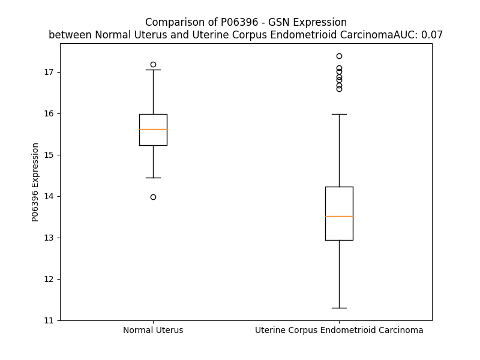

# Detailed Data for P06396

## Introduction to the Detailed Summary

### How to Interpret the Results

- **Summary & Metrics**: This section provides a quick reference to essential protein attributes, including expression changes, family classification, and biomarker applications. Regulation status (upregulated/downregulated) indicates the protein's behavior in a disease context. Some information comes from the original excel file with the proteins selected from literature, while others are derived from the analyses.
- **Expression Comparison**: A visual representation comparing protein expression between normal and disease states. It highlights significant changes in expression levels that might indicate diagnostic or therapeutic relevance. This is data coming from transcriptomics experiments and could not translate similarly to protein levels.
- **Isoform Alignment**: An interactive view of isoform alignments, revealing structural and functional differences between variants of the protein.
- **Interactors & Homologs**: Tables listing known interaction partners and homologous proteins, the more interactors and homologs, the more complex the protein is to design an antibody for.
- **Biological Assemblies**: Information about the structural arrangement of the protein in different assemblies, providing insights into its functional state but also the complexity of the protein to develop antibodies.
- **Combined Per-Residue Information**: A detailed table summarizing residue-level data. This includes predictions for epitope regions, aggregation tendencies, and modifications that might impact the protein's function. Each row corresponds to a residue in the protein, providing insights into specific sites that may be important for research or drug development.
## Summary & Metrics

- **UniProt Accession**: P06396
- **Gene Name**: GSN
- **Protein Name**: Gelsolin
- **Swiss Prot**: GELS_HUMAN
- **Family**: other
- **Biomarker Application**: disease progression,efficacy
- **Number of Isoforms**: 0
- **Regulation**: 2
- **(transcriptomics) AUC**: 0.01
- **(transcriptomics) Fold Change**: 1.18
- **(transcriptomics) Regulation**: Downregulated
- **Discotope Epitope Count**: 166
- **Max n_uniprots (Homo)**: 2
- **Max n_uniprots (Hetero)**: 3

## Expression Comparison

## Interactors

| preferredName_A   | preferredName_B   |   score |
|:------------------|:------------------|--------:|
| GSN               | WASL              |   0.996 |
| GSN               | CTTN              |   0.987 |
| GSN               | ACTA1             |   0.986 |
| GSN               | HCLS1             |   0.985 |
| GSN               | PFN4              |   0.961 |
| GSN               | PFN3              |   0.955 |
| GSN               | PFN1              |   0.954 |
| GSN               | TWF2              |   0.952 |
| GSN               | TLN1              |   0.941 |
| GSN               | TLN2              |   0.936 |
| GSN               | PIP5K1B           |   0.922 |
| GSN               | PIP5K1C           |   0.918 |
| GSN               | VCL               |   0.918 |
| GSN               | PIKFYVE           |   0.917 |
| GSN               | PIP5K1A           |   0.913 |
| GSN               | TMOD2             |   0.911 |
| GSN               | PIP4K2A           |   0.91  |
| GSN               | CASP3             |   0.907 |
| GSN               | SCIN              |   0.904 |
| GSN               | PIP4K2C           |   0.903 |
| GSN               | PIP4K2B           |   0.902 |
| GSN               | VDAC1             |   0.901 |

## Homologs

| uniprot_id   | gene_id   |
|:-------------|:----------|
| O95425       | SVIL      |
| A0A979HLS2   | CAPG      |
| O15195       | VILL      |
| J3QLR6       | FLII      |
| H7C0B6       | VIL1      |
| O75366       | AVIL      |
| E5RHN8       | SCIN      |

## Biological Assemblies

|   Unnamed: 0 |   assembly |   n_uniprots | composition   | crystal_id   |
|-------------:|-----------:|-------------:|:--------------|:-------------|
|            0 |          1 |            2 | Hetero        | 4pkg         |
|            0 |          1 |            1 | Homo          | 1sol         |
|            0 |          1 |            2 | Homo          | 6jco         |
|            0 |          1 |            2 | Hetero        | 4pki         |
|            0 |          1 |            2 | Hetero        | 3cip         |
|            1 |          2 |            2 | Hetero        | 3cip         |
|            0 |          1 |            1 | Homo          | 4s10         |
|            1 |          2 |            1 | Homo          | 4s10         |
|            0 |          1 |            2 | Hetero        | 5ubo         |
|            0 |          1 |            1 | Homo          | 1p8x         |
|            1 |          2 |            1 | Homo          | 1p8x         |
|            2 |          3 |            1 | Homo          | 1p8x         |
|            0 |          1 |            1 | Homo          | 5fae         |
|            0 |          1 |            2 | Hetero        | 3tu5         |
|            0 |          1 |            2 | Hetero        | 1esv         |
|            0 |          1 |            2 | Hetero        | 1nmd         |
|            1 |          2 |            2 | Hetero        | 1nmd         |
|            0 |          1 |            2 | Hetero        | 1nlv         |
|            1 |          2 |            2 | Hetero        | 1nlv         |
|            0 |          1 |            2 | Hetero        | 3cjb         |
|            0 |          1 |            1 | Homo          | 5h3n         |
|            0 |          1 |            1 | Homo          | 1kcq         |
|            1 |          2 |            1 | Homo          | 1kcq         |
|            0 |          1 |            3 | Hetero        | 2ff3         |
|            0 |          1 |            1 | Homo          | 2fh2         |
|            1 |          2 |            1 | Homo          | 2fh2         |
|            2 |          3 |            1 | Homo          | 2fh2         |
|            0 |          1 |            2 | Hetero        | 4pkh         |
|            1 |          2 |            2 | Hetero        | 4pkh         |
|            2 |          3 |            2 | Hetero        | 4pkh         |
|            3 |          4 |            2 | Hetero        | 4pkh         |
|            0 |          1 |            2 | Hetero        | 1p8z         |
|            1 |          2 |            2 | Hetero        | 1p8z         |
|            0 |          1 |            1 | Homo          | 3ffn         |
|            1 |          2 |            1 | Homo          | 3ffn         |
|            0 |          1 |            2 | Hetero        | 1yag         |
|            1 |          2 |            2 | Hetero        | 1yag         |
|            0 |          1 |            1 | Homo          | 6h1f         |
|            0 |          1 |            3 | Hetero        | 3cjc         |
|            0 |          1 |            2 | Hetero        | 1eqy         |
|            0 |          1 |            1 | Homo          | 5zz0         |
|            1 |          2 |            1 | Homo          | 5zz0         |
|            0 |          1 |            2 | Hetero        | 1dej         |
|            0 |          1 |            1 | Homo          | 6q9z         |
|            1 |          2 |            1 | Homo          | 6q9z         |
|            0 |          1 |            2 | Homo          | 5o2z         |
|            0 |          1 |            2 | Hetero        | 3a5l         |
|            0 |          1 |            1 | Homo          | 5faf         |
|            0 |          1 |            2 | Hetero        | 1h1v         |
|            0 |          1 |            2 | Hetero        | 1d4x         |
|            1 |          2 |            2 | Hetero        | 1d4x         |
|            0 |          1 |            2 | Hetero        | 1c0f         |
|            0 |          1 |            2 | Hetero        | 1mdu         |
|            1 |          2 |            2 | Hetero        | 1mdu         |
|            0 |          1 |            3 | Hetero        | 2ff6         |
|            0 |          1 |            2 | Hetero        | 3a5o         |
|            0 |          1 |            2 | Hetero        | 1yvn         |
|            1 |          2 |            2 | Hetero        | 1yvn         |
|            0 |          1 |            1 | Homo          | 7p2b         |
|            1 |          2 |            1 | Homo          | 7p2b         |
|            0 |          1 |            1 | Homo          | 2fh1         |
|            1 |          2 |            1 | Homo          | 2fh1         |
|            2 |          3 |            1 | Homo          | 2fh1         |
|            0 |          1 |            2 | Hetero        | 1c0g         |
|            0 |          1 |            2 | Hetero        | 3a5n         |
|            0 |          1 |            2 | Hetero        | 1nm1         |
|            1 |          2 |            2 | Hetero        | 1nm1         |
|            0 |          1 |            2 | Homo          | 6jeh         |
|            0 |          1 |            1 | Homo          | 6lje         |
|            1 |          2 |            1 | Homo          | 6lje         |
|            0 |          1 |            2 | Hetero        | 3ffk         |
|            1 |          2 |            2 | Hetero        | 3ffk         |
|            0 |          1 |            1 | Homo          | 5h3m         |
|            0 |          1 |            1 | Homo          | 6ljf         |
|            1 |          2 |            1 | Homo          | 6ljf         |
|            0 |          1 |            2 | Homo          | 6jeg         |
|            0 |          1 |            2 | Hetero        | 3a5m         |
|            0 |          1 |            1 | Homo          | 6qbf         |
|            1 |          2 |            1 | Homo          | 6qbf         |
|            0 |          1 |            1 | Homo          | 2fh3         |
|            1 |          2 |            1 | Homo          | 2fh3         |
|            2 |          3 |            1 | Homo          | 2fh3         |
|            0 |          1 |            1 | Homo          | 6qw3         |
|            0 |          1 |            2 | Hetero        | 4z94         |
|            0 |          1 |            1 | Homo          | 2fh4         |
|            1 |          2 |            1 | Homo          | 2fh4         |
|            2 |          3 |            1 | Homo          | 2fh4         |
|            0 |          1 |            2 | Hetero        | 1t44         |
|            0 |          1 |            1 | Homo          | 6q9r         |
|            1 |          2 |            1 | Homo          | 6q9r         |
|            0 |          1 |            2 | Hetero        | 3ci5         |
|            1 |          2 |            2 | Hetero        | 3ci5         |

## Combined Per-Residue Information

|   res | aa   |   epitope_score | epitope   |   relative_surface_accessibility |   modeling_confidence |   Aggregation | modification                      |
|------:|:-----|----------------:|:----------|---------------------------------:|----------------------:|--------------:|:----------------------------------|
|     1 | M    |         0.13904 | True      |                          1.3474  |                 39.93 |         0     | N/A                               |
|     2 | A    |         0.10676 | False     |                          0.88936 |                 38.49 |         0     | N/A                               |
|     3 | P    |         0.17865 | True      |                          0.80751 |                 44.95 |         0     | N/A                               |
|     4 | H    |         0.18023 | True      |                          0.94413 |                 36.86 |         0     | N/A                               |
|     5 | R    |         0.1878  | True      |                          0.96987 |                 34.16 |         0     | N/A                               |
|     6 | P    |         0.13945 | True      |                          0.88194 |                 39.84 |         0     | N/A                               |
|     7 | A    |         0.10907 | False     |                          0.93772 |                 28.25 |         0     | N/A                               |
|     8 | P    |         0.15672 | True      |                          0.86027 |                 39.39 |         0     | N/A                               |
|     9 | A    |         0.14876 | True      |                          0.81492 |                 31.09 |         9.95  | N/A                               |
|    10 | L    |         0.15485 | True      |                          1.08851 |                 31.35 |        21.492 | N/A                               |
|    11 | L    |         0.08525 | False     |                          1.14953 |                 32.68 |        23.279 | N/A                               |
|    12 | C    |         0.14665 | True      |                          0.69808 |                 33.06 |        23.511 | N/A                               |
|    13 | A    |         0.11169 | True      |                          0.80809 |                 34.01 |        24.934 | N/A                               |
|    14 | L    |         0.10005 | False     |                          0.7566  |                 36.43 |        26.305 | N/A                               |
|    15 | S    |         0.13228 | True      |                          0.641   |                 35.49 |        24.193 | N/A                               |
|    16 | L    |         0.16103 | True      |                          0.78824 |                 33.53 |        25.255 | N/A                               |
|    17 | A    |         0.11352 | True      |                          0.66109 |                 35.32 |        23.785 | N/A                               |
|    18 | L    |         0.14748 | True      |                          0.77828 |                 37.35 |        22.378 | N/A                               |
|    19 | C    |         0.15745 | True      |                          0.90564 |                 33.72 |        13.916 | N/A                               |
|    20 | A    |         0.10228 | False     |                          0.6385  |                 31.62 |        12.158 | N/A                               |
|    21 | L    |         0.22244 | True      |                          0.93354 |                 30.95 |        10.484 | N/A                               |
|    22 | S    |         0.164   | True      |                          0.85898 |                 32.07 |         0.908 | N/A                               |
|    23 | L    |         0.12653 | True      |                          0.95207 |                 33.84 |         0     | N/A                               |
|    24 | P    |         0.09125 | False     |                          0.90752 |                 33.2  |         0     | N/A                               |
|    25 | V    |         0.06851 | False     |                          1.02575 |                 33.79 |         0     | N/A                               |
|    26 | R    |         0.13712 | True      |                          0.95392 |                 32.84 |         0     | N/A                               |
|    27 | A    |         0.07714 | False     |                          0.90837 |                 33.11 |         0     | N/A                               |
|    28 | A    |         0.0836  | False     |                          1.04089 |                 35.29 |         0     | N/A                               |
|    29 | T    |         0.08745 | False     |                          0.95134 |                 31.92 |         0     | N/A                               |
|    30 | A    |         0.09847 | False     |                          1.0112  |                 35.65 |         0     | N/A                               |
|    31 | S    |         0.16047 | True      |                          0.75298 |                 35.45 |         0     | N/A                               |
|    32 | R    |         0.16814 | True      |                          0.96767 |                 36.75 |         0     | N/A                               |
|    33 | G    |         0.13879 | True      |                          0.80479 |                 35.32 |         0     | N/A                               |
|    34 | A    |         0.08777 | False     |                          1.0177  |                 37.8  |         0     | N/A                               |
|    35 | S    |         0.095   | False     |                          0.72523 |                 40.27 |         0     | N/A                               |
|    36 | Q    |         0.11082 | False     |                          0.90064 |                 40.17 |         0     | N/A                               |
|    37 | A    |         0.15066 | True      |                          0.97977 |                 38.76 |         0     | N/A                               |
|    38 | G    |         0.24592 | True      |                          0.90937 |                 38.38 |         0     | N/A                               |
|    39 | A    |         0.18999 | True      |                          1.0018  |                 44.9  |         0     | N/A                               |
|    40 | P    |         0.1662  | True      |                          0.87439 |                 41.14 |         0     | N/A                               |
|    41 | Q    |         0.28165 | True      |                          0.97596 |                 36.06 |         0     | N/A                               |
|    42 | G    |         0.2137  | True      |                          0.94086 |                 35.81 |         0     | N/A                               |
|    43 | R    |         0.18606 | True      |                          0.94884 |                 38.57 |         0     | N/A                               |
|    44 | V    |         0.13467 | True      |                          1.01452 |                 35.47 |         0     | N/A                               |
|    45 | P    |         0.10468 | False     |                          0.84928 |                 40.68 |         0     | N/A                               |
|    46 | E    |         0.14728 | True      |                          0.87488 |                 37.25 |         0     | N/A                               |
|    47 | A    |         0.16711 | True      |                          0.96681 |                 34.97 |         0     | N/A                               |
|    48 | R    |         0.1404  | True      |                          0.889   |                 36.61 |         0     | N/A                               |
|    49 | P    |         0.09394 | False     |                          0.92876 |                 39.35 |         0     | N/A                               |
|    50 | N    |         0.21448 | True      |                          0.99734 |                 31.84 |         0.131 | N/A                               |
|    51 | S    |         0.06011 | False     |                          0.63706 |                 44.91 |         0.131 | N/A                               |
|    52 | M    |         0.10915 | False     |                          1.00692 |                 46.41 |         0.131 | N/A                               |
|    53 | V    |         0.0589  | False     |                          0.53534 |                 56.61 |         0.131 | N/A                               |
|    54 | V    |         0.0977  | False     |                          0.57403 |                 64.53 |         0.131 | N/A                               |
|    55 | E    |         0.10972 | False     |                          0.71611 |                 70.02 |         0     | N/A                               |
|    56 | H    |         0.05534 | False     |                          0.13174 |                 92.36 |         0     | N/A                               |
|    57 | P    |         0.13067 | True      |                          0.66483 |                 94.29 |         0     | N/A                               |
|    58 | E    |         0.06551 | False     |                          0.09108 |                 96.42 |         0     | N/A                               |
|    59 | F    |         0.01101 | False     |                          0.00647 |                 96.42 |         0     | N/A                               |
|    60 | L    |         0.10895 | False     |                          0.60314 |                 94.92 |         0     | N/A                               |
|    61 | K    |         0.1271  | True      |                          0.57885 |                 96.21 |         0     | N/A                               |
|    62 | A    |         0.01051 | False     |                          0.01924 |                 97.27 |         0     | N/A                               |
|    63 | G    |         0.01076 | False     |                          0.03177 |                 96.35 |         0     | N/A                               |
|    64 | K    |         0.15784 | True      |                          0.63275 |                 96.58 |         0     | N/A                               |
|    65 | E    |         0.11641 | True      |                          0.68474 |                 96.12 |         0     | N/A                               |
|    66 | P    |         0.06976 | False     |                          0.55047 |                 97.33 |         0     | N/A                               |
|    67 | G    |         0.06606 | False     |                          0.38702 |                 97.61 |         0.151 | N/A                               |
|    68 | L    |         0.02895 | False     |                          0.25275 |                 98.35 |         0.151 | N/A                               |
|    69 | Q    |         0.05063 | False     |                          0.25111 |                 98.65 |         0.151 | N/A                               |
|    70 | I    |         0.00538 | False     |                          0.01983 |                 98.58 |         0.151 | N/A                               |
|    71 | W    |         0.04007 | False     |                          0.03732 |                 98.61 |         0.151 | N/A                               |
|    72 | R    |         0.01469 | False     |                          0.01153 |                 98.17 |         0     | N/A                               |
|    73 | V    |         0.00601 | False     |                          0       |                 97.25 |         0     | N/A                               |
|    74 | E    |         0.03542 | False     |                          0.18947 |                 95.36 |         0     | N/A                               |
|    75 | K    |         0.24365 | True      |                          0.8727  |                 92.95 |         0     | N/A                               |
|    76 | F    |         0.16017 | True      |                          0.5951  |                 92.52 |         0     | N/A                               |
|    77 | D    |         0.17908 | True      |                          0.40779 |                 95.94 |         0     | N/A                               |
|    78 | L    |         0.03742 | False     |                          0.03484 |                 97.02 |         0     | N/A                               |
|    79 | V    |         0.05349 | False     |                          0.38629 |                 97.17 |         0     | N/A                               |
|    80 | P    |         0.09648 | False     |                          0.53006 |                 97.7  |         0     | N/A                               |
|    81 | V    |         0.00649 | False     |                          0.04801 |                 97.8  |         0     | N/A                               |
|    82 | P    |         0.04085 | False     |                          0.28204 |                 96.1  |         0     | N/A                               |
|    83 | T    |         0.09787 | False     |                          0.73344 |                 95.31 |         0     | N/A                               |
|    84 | N    |         0.055   | False     |                          0.50999 |                 92.57 |         0     | N/A                               |
|    85 | L    |         0.03301 | False     |                          0.09129 |                 95.08 |         0     | N/A                               |
|    86 | Y    |         0.03382 | False     |                          0.21741 |                 96.97 |         0     | Phosphotyrosine; by SRC; in vitro |
|    87 | G    |         0.0063  | False     |                          0.0138  |                 95.61 |         0     | N/A                               |
|    88 | D    |         0.01701 | False     |                          0.01165 |                 96.87 |         0     | N/A                               |
|    89 | F    |         0.00112 | False     |                          0.00191 |                 97.95 |         2.841 | N/A                               |
|    90 | F    |         0.00731 | False     |                          0.03121 |                 97.87 |         3.034 | N/A                               |
|    91 | T    |         0.03762 | False     |                          0.1063  |                 97.49 |         3.034 | N/A                               |
|    92 | G    |         0.02072 | False     |                          0.12855 |                 96.93 |         3.062 | N/A                               |
|    93 | D    |         0.00501 | False     |                          0       |                 97.97 |         3.42  | N/A                               |
|    94 | A    |         0.00217 | False     |                          0       |                 98.02 |        78.474 | N/A                               |
|    95 | Y    |         0.0047  | False     |                          0       |                 98.6  |        78.474 | N/A                               |
|    96 | V    |         0.00279 | False     |                          0       |                 98.57 |        78.474 | N/A                               |
|    97 | I    |         0.00201 | False     |                          0       |                 98.72 |        78.474 | N/A                               |
|    98 | L    |         0.00309 | False     |                          0.00061 |                 98.65 |        78.474 | N/A                               |
|    99 | K    |         0.0295  | False     |                          0.18772 |                 98.55 |         3.42  | N/A                               |
|   100 | T    |         0.01221 | False     |                          0.01546 |                 98.42 |         3.245 | N/A                               |
|   101 | V    |         0.01184 | False     |                          0.03713 |                 97.4  |         3.167 | N/A                               |
|   102 | Q    |         0.10363 | False     |                          0.39433 |                 95.72 |         1.838 | N/A                               |
|   103 | L    |         0.03114 | False     |                          0.09401 |                 93.9  |         1.572 | N/A                               |
|   104 | R    |         0.07667 | False     |                          0.28768 |                 90.19 |         0     | N/A                               |
|   105 | N    |         0.11845 | True      |                          0.49531 |                 88.21 |         0     | N/A                               |
|   106 | G    |         0.08997 | False     |                          0.64853 |                 90.63 |         0     | N/A                               |
|   107 | N    |         0.10436 | False     |                          0.4799  |                 92.7  |         0     | N/A                               |
|   108 | L    |         0.03939 | False     |                          0.23031 |                 96.07 |         0     | N/A                               |
|   109 | Q    |         0.01939 | False     |                          0.06418 |                 96.85 |         0     | N/A                               |
|   110 | Y    |         0.02023 | False     |                          0.08343 |                 98.18 |         0     | N/A                               |
|   111 | D    |         0.00142 | False     |                          0.00063 |                 98.45 |         0     | N/A                               |
|   112 | L    |         0.00131 | False     |                          0       |                 98.17 |         0.193 | N/A                               |
|   113 | H    |         0.00205 | False     |                          0       |                 98.57 |         0.193 | N/A                               |
|   114 | Y    |         0.03709 | False     |                          0.0414  |                 97.92 |         0.193 | N/A                               |
|   115 | W    |         0.00337 | False     |                          0       |                 98.64 |         0.193 | N/A                               |
|   116 | L    |         0.03056 | False     |                          0.10552 |                 97.96 |         0.193 | N/A                               |
|   117 | G    |         0.01974 | False     |                          0.09161 |                 97.61 |         0     | N/A                               |
|   118 | N    |         0.22786 | True      |                          0.66788 |                 96.24 |         0     | N/A                               |
|   119 | E    |         0.18192 | True      |                          0.63124 |                 95.5  |         0     | N/A                               |
|   120 | C    |         0.04616 | False     |                          0.15335 |                 93.33 |         0     | N/A                               |
|   121 | S    |         0.15886 | True      |                          0.37786 |                 92.51 |         0     | N/A                               |
|   122 | Q    |         0.16107 | True      |                          0.74814 |                 90.59 |         0     | N/A                               |
|   123 | D    |         0.19343 | True      |                          0.76312 |                 90.59 |         0     | N/A                               |
|   124 | E    |         0.03456 | False     |                          0.11218 |                 92.06 |         0     | N/A                               |
|   125 | S    |         0.04509 | False     |                          0.18363 |                 91.73 |         0     | N/A                               |
|   126 | G    |         0.05106 | False     |                          0.30809 |                 91.86 |         0.525 | N/A                               |
|   127 | A    |         0.02997 | False     |                          0.03774 |                 94.71 |        18.347 | N/A                               |
|   128 | A    |         0.00171 | False     |                          0       |                 95.95 |        37.055 | N/A                               |
|   129 | A    |         0.01677 | False     |                          0.22857 |                 92.99 |        57.983 | N/A                               |
|   130 | I    |         0.1029  | False     |                          0.26927 |                 92.36 |        59     | N/A                               |
|   131 | F    |         0.01848 | False     |                          0.0344  |                 95.44 |        59.062 | N/A                               |
|   132 | T    |         0.00216 | False     |                          0       |                 95.02 |        56.991 | N/A                               |
|   133 | V    |         0.02502 | False     |                          0.21322 |                 91.91 |        54.385 | N/A                               |
|   134 | Q    |         0.02619 | False     |                          0.24027 |                 92.56 |         3.25  | N/A                               |
|   135 | L    |         0.00807 | False     |                          0.00412 |                 95.16 |         2.186 | N/A                               |
|   136 | D    |         0.01099 | False     |                          0.02141 |                 93.93 |         0     | N/A                               |
|   137 | D    |         0.04507 | False     |                          0.3481  |                 91.58 |         0     | N/A                               |
|   138 | Y    |         0.06515 | False     |                          0.2216  |                 94.34 |         0     | N/A                               |
|   139 | L    |         0.02436 | False     |                          0.06631 |                 94.22 |         0     | N/A                               |
|   140 | N    |         0.17098 | True      |                          0.77523 |                 91.39 |         0     | N/A                               |
|   141 | G    |         0.03866 | False     |                          0.31546 |                 90.14 |         0     | N/A                               |
|   142 | R    |         0.0844  | False     |                          0.50058 |                 92.37 |         0     | N/A                               |
|   143 | A    |         0.00178 | False     |                          0       |                 96.08 |         0     | N/A                               |
|   144 | V    |         0.00654 | False     |                          0.01904 |                 97.25 |         0     | N/A                               |
|   145 | Q    |         0.00636 | False     |                          0.02986 |                 97.56 |         0     | N/A                               |
|   146 | H    |         0.00774 | False     |                          0.05651 |                 97.82 |         0     | N/A                               |
|   147 | R    |         0.02878 | False     |                          0.15811 |                 97.76 |         0     | N/A                               |
|   148 | E    |         0.00756 | False     |                          0.00459 |                 97.95 |         0     | N/A                               |
|   149 | V    |         0.01753 | False     |                          0.14364 |                 97    |         0     | N/A                               |
|   150 | Q    |         0.04317 | False     |                          0.05227 |                 97.01 |         0     | N/A                               |
|   151 | G    |         0.06622 | False     |                          0.36291 |                 93.19 |         0     | N/A                               |
|   152 | F    |         0.10584 | False     |                          0.53519 |                 94.72 |         0     | N/A                               |
|   153 | E    |         0.02136 | False     |                          0.03194 |                 96.88 |         0     | N/A                               |
|   154 | S    |         0.03068 | False     |                          0.10504 |                 96.81 |         2.155 | N/A                               |
|   155 | A    |         0.029   | False     |                          0.31809 |                 95.98 |        19.565 | N/A                               |
|   156 | T    |         0.01672 | False     |                          0.28445 |                 97.46 |        22.321 | N/A                               |
|   157 | F    |         0.00191 | False     |                          0       |                 98.27 |        26.604 | N/A                               |
|   158 | L    |         0.01274 | False     |                          0.07857 |                 97.14 |        26.604 | N/A                               |
|   159 | G    |         0.01979 | False     |                          0.19229 |                 96.62 |        26.604 | N/A                               |
|   160 | Y    |         0.02224 | False     |                          0.14491 |                 97.2  |        26.604 | N/A                               |
|   161 | F    |         0.02248 | False     |                          0.04806 |                 94.56 |        24.92  | N/A                               |
|   162 | K    |         0.02578 | False     |                          0.3006  |                 87.96 |         0     | N/A                               |
|   163 | S    |         0.0652  | False     |                          0.47126 |                 85.1  |         0     | N/A                               |
|   164 | G    |         0.01582 | False     |                          0.06197 |                 89.34 |         0     | N/A                               |
|   165 | L    |         0.00162 | False     |                          0.00122 |                 94.7  |         0     | N/A                               |
|   166 | K    |         0.01695 | False     |                          0.09345 |                 96.15 |         0     | N/A                               |
|   167 | Y    |         0.01391 | False     |                          0.03457 |                 96.68 |         0     | N/A                               |
|   168 | K    |         0.02431 | False     |                          0.09445 |                 96.04 |         0     | N/A                               |
|   169 | K    |         0.11234 | True      |                          0.47213 |                 94.78 |         0     | N/A                               |
|   170 | G    |         0.08166 | False     |                          0.19152 |                 92.84 |         0     | N/A                               |
|   171 | G    |         0.01855 | False     |                          0.0299  |                 92.94 |         0     | N/A                               |
|   172 | V    |         0.05978 | False     |                          0.1725  |                 91.48 |         0     | N/A                               |
|   173 | A    |         0.13776 | True      |                          0.98152 |                 89.1  |         0     | N/A                               |
|   174 | S    |         0.21282 | True      |                          0.5191  |                 88.51 |         0     | N/A                               |
|   175 | G    |         0.18409 | True      |                          0.68355 |                 84.64 |         0     | N/A                               |
|   176 | F    |         0.19365 | True      |                          0.57581 |                 85.16 |         0     | N/A                               |
|   177 | K    |         0.23413 | True      |                          0.65107 |                 84.38 |         0     | N/A                               |
|   178 | H    |         0.05475 | False     |                          0.06351 |                 83.24 |         0     | N/A                               |
|   179 | V    |         0.18109 | True      |                          0.77667 |                 78.08 |         0     | N/A                               |
|   180 | V    |         0.14352 | True      |                          0.59103 |                 78.62 |         0     | N/A                               |
|   181 | P    |         0.17959 | True      |                          0.71373 |                 78.28 |         0     | N/A                               |
|   182 | N    |         0.19914 | True      |                          1.01631 |                 71.82 |         0     | N/A                               |
|   183 | E    |         0.28031 | True      |                          0.8601  |                 73.99 |         0.214 | N/A                               |
|   184 | V    |         0.10887 | False     |                          0.48364 |                 79.81 |         0.214 | N/A                               |
|   185 | V    |         0.12406 | True      |                          1.06131 |                 86.74 |         0.214 | N/A                               |
|   186 | V    |         0.04321 | False     |                          0.16968 |                 90.29 |         0.214 | N/A                               |
|   187 | Q    |         0.13552 | True      |                          0.56112 |                 94.42 |         0.214 | N/A                               |
|   188 | R    |         0.08324 | False     |                          0.10407 |                 96.08 |         0.214 | N/A                               |
|   189 | L    |         0.00226 | False     |                          0       |                 97.9  |         0.214 | N/A                               |
|   190 | F    |         0.00125 | False     |                          0       |                 97.32 |         0.214 | N/A                               |
|   191 | Q    |         0.01924 | False     |                          0.16803 |                 95.73 |         0     | N/A                               |
|   192 | V    |         0.00559 | False     |                          0.04214 |                 93.14 |         0     | N/A                               |
|   193 | K    |         0.04416 | False     |                          0.24771 |                 87.01 |         0     | N/A                               |
|   194 | G    |         0.02933 | False     |                          0.22628 |                 80.07 |         0     | N/A                               |
|   195 | R    |         0.05332 | False     |                          0.25047 |                 78.88 |         0     | N/A                               |
|   196 | R    |         0.02064 | False     |                          0.10288 |                 83.35 |         0     | N/A                               |
|   197 | V    |         0.02413 | False     |                          0.10293 |                 83.65 |         0     | N/A                               |
|   198 | V    |         0.01518 | False     |                          0.03552 |                 88.28 |         0     | N/A                               |
|   199 | R    |         0.0356  | False     |                          0.20775 |                 92.54 |         0     | N/A                               |
|   200 | A    |         0.00141 | False     |                          0.0011  |                 95.05 |         0     | N/A                               |
|   201 | T    |         0.01746 | False     |                          0.3493  |                 96.19 |         0     | N/A                               |
|   202 | E    |         0.03116 | False     |                          0.16888 |                 97.44 |         0     | N/A                               |
|   203 | V    |         0.0361  | False     |                          0.15891 |                 96.9  |         0     | N/A                               |
|   204 | P    |         0.11796 | True      |                          0.5706  |                 96.96 |         0     | N/A                               |
|   205 | V    |         0.08795 | False     |                          0.32877 |                 97.59 |         0     | N/A                               |
|   206 | S    |         0.07741 | False     |                          0.26061 |                 97.32 |         0     | N/A                               |
|   207 | W    |         0.06293 | False     |                          0.06529 |                 97.73 |         0     | N/A                               |
|   208 | E    |         0.17298 | True      |                          0.86446 |                 96.58 |         0     | N/A                               |
|   209 | S    |         0.02131 | False     |                          0.17188 |                 96.64 |         0     | N/A                               |
|   210 | F    |         0.01663 | False     |                          0.01065 |                 97.38 |         0     | N/A                               |
|   211 | N    |         0.01587 | False     |                          0.08056 |                 95.7  |         0     | N/A                               |
|   212 | N    |         0.08033 | False     |                          0.15762 |                 94.21 |         0     | N/A                               |
|   213 | G    |         0.02818 | False     |                          0.16865 |                 91.64 |         0     | N/A                               |
|   214 | D    |         0.0476  | False     |                          0.06389 |                 93.88 |         0     | N/A                               |
|   215 | C    |         0.0023  | False     |                          0.001   |                 95.37 |         0     | N/A                               |
|   216 | F    |         0.00433 | False     |                          0.00137 |                 97.64 |         0     | N/A                               |
|   217 | I    |         0.00198 | False     |                          0       |                 97.64 |         0     | N/A                               |
|   218 | L    |         0.00845 | False     |                          0.00377 |                 98.19 |         0     | N/A                               |
|   219 | D    |         0.00691 | False     |                          0       |                 96.85 |         0     | N/A                               |
|   220 | L    |         0.05988 | False     |                          0.26355 |                 95.81 |         0     | N/A                               |
|   221 | G    |         0.03054 | False     |                          0.09818 |                 93.36 |         0     | N/A                               |
|   222 | N    |         0.21128 | True      |                          0.71904 |                 93.36 |         0     | N/A                               |
|   223 | N    |         0.07186 | False     |                          0.36559 |                 95.47 |         0     | N/A                               |
|   224 | I    |         0.00335 | False     |                          0       |                 96.89 |         0     | N/A                               |
|   225 | H    |         0.03858 | False     |                          0.03364 |                 97.4  |         0     | N/A                               |
|   226 | Q    |         0.00143 | False     |                          0.00117 |                 97.12 |         0     | N/A                               |
|   227 | W    |         0.00503 | False     |                          0.00179 |                 97.67 |         0     | N/A                               |
|   228 | C    |         0.00796 | False     |                          0.00935 |                 95.72 |         0     | N/A                               |
|   229 | G    |         0.00318 | False     |                          0       |                 95.17 |         0     | N/A                               |
|   230 | S    |         0.23729 | True      |                          0.49471 |                 94.16 |         0     | N/A                               |
|   231 | N    |         0.19021 | True      |                          0.66393 |                 91.67 |         0     | N/A                               |
|   232 | S    |         0.02056 | False     |                          0.05919 |                 89.07 |         0     | N/A                               |
|   233 | N    |         0.11382 | True      |                          0.2983  |                 83.09 |         0     | N/A                               |
|   234 | R    |         0.15162 | True      |                          0.54525 |                 82.64 |         0     | N/A                               |
|   235 | Y    |         0.02995 | False     |                          0.0979  |                 80.85 |         0     | N/A                               |
|   236 | E    |         0.01416 | False     |                          0.18661 |                 84.03 |         0     | N/A                               |
|   237 | R    |         0.06661 | False     |                          0.12887 |                 91.21 |         0     | N/A                               |
|   238 | L    |         0.03509 | False     |                          0.10057 |                 88.45 |         0     | N/A                               |
|   239 | K    |         0.02475 | False     |                          0.05222 |                 85.42 |         0     | N/A                               |
|   240 | A    |         0.00144 | False     |                          0       |                 91.88 |         0     | N/A                               |
|   241 | T    |         0.01964 | False     |                          0.02571 |                 92.39 |         0     | N/A                               |
|   242 | Q    |         0.02908 | False     |                          0.23797 |                 88.85 |         0     | N/A                               |
|   243 | V    |         0.01017 | False     |                          0.03614 |                 92.56 |         0     | N/A                               |
|   244 | S    |         0.00157 | False     |                          0       |                 93.91 |         0     | N/A                               |
|   245 | K    |         0.04647 | False     |                          0.36126 |                 92.25 |         0     | N/A                               |
|   246 | G    |         0.02142 | False     |                          0.14648 |                 92.01 |         0     | N/A                               |
|   247 | I    |         0.00271 | False     |                          0       |                 93.15 |         0     | N/A                               |
|   248 | R    |         0.05605 | False     |                          0.162   |                 93.76 |         0     | N/A                               |
|   249 | D    |         0.09162 | False     |                          0.33449 |                 92.23 |         0     | N/A                               |
|   250 | N    |         0.12033 | True      |                          0.38978 |                 90.78 |         0     | N/A                               |
|   251 | E    |         0.11719 | True      |                          0.202   |                 91.35 |         0     | N/A                               |
|   252 | R    |         0.11514 | True      |                          0.14303 |                 91.49 |         0     | N/A                               |
|   253 | S    |         0.21609 | True      |                          0.71494 |                 89.06 |         0     | N/A                               |
|   254 | G    |         0.11553 | True      |                          0.49543 |                 89.39 |         0     | N/A                               |
|   255 | R    |         0.28451 | True      |                          0.83027 |                 90.38 |         0     | N/A                               |
|   256 | A    |         0.028   | False     |                          0.06879 |                 92.64 |         0     | N/A                               |
|   257 | R    |         0.21243 | True      |                          0.71421 |                 94.54 |         0     | N/A                               |
|   258 | V    |         0.02112 | False     |                          0.10988 |                 95.9  |         0     | N/A                               |
|   259 | H    |         0.07511 | False     |                          0.36114 |                 95.51 |         0     | N/A                               |
|   260 | V    |         0.04411 | False     |                          0.30932 |                 95.32 |         0     | N/A                               |
|   261 | S    |         0.03358 | False     |                          0.06269 |                 95.03 |         0     | N/A                               |
|   262 | E    |         0.09895 | False     |                          0.42535 |                 94.34 |         0     | N/A                               |
|   263 | E    |         0.10783 | False     |                          0.25928 |                 94.35 |         0     | N/A                               |
|   264 | G    |         0.11618 | True      |                          0.70504 |                 94.91 |         0     | N/A                               |
|   265 | T    |         0.21033 | True      |                          0.64007 |                 96.02 |         0     | N/A                               |
|   266 | E    |         0.13986 | True      |                          0.13162 |                 96.75 |         0     | N/A                               |
|   267 | P    |         0.06742 | False     |                          0.32009 |                 95.53 |         0     | N/A                               |
|   268 | E    |         0.24268 | True      |                          0.76531 |                 95.74 |         0     | N/A                               |
|   269 | A    |         0.06776 | False     |                          0.41143 |                 95.21 |         0.307 | N/A                               |
|   270 | M    |         0.00827 | False     |                          0.00072 |                 96.83 |         0.671 | N/A                               |
|   271 | L    |         0.14825 | True      |                          0.40105 |                 96.48 |         0.671 | N/A                               |
|   272 | Q    |         0.33759 | True      |                          0.78716 |                 96.15 |         0.671 | N/A                               |
|   273 | V    |         0.12289 | True      |                          0.36432 |                 96.13 |         0.671 | N/A                               |
|   274 | L    |         0.10158 | False     |                          0.12782 |                 96.95 |         0.671 | N/A                               |
|   275 | G    |         0.10538 | False     |                          0.27588 |                 96.36 |         0     | N/A                               |
|   276 | P    |         0.16942 | True      |                          0.93457 |                 95.76 |         0     | N/A                               |
|   277 | K    |         0.1067  | False     |                          0.31276 |                 96.71 |         0     | N/A                               |
|   278 | P    |         0.16873 | True      |                          0.48132 |                 96.36 |         0     | N/A                               |
|   279 | A    |         0.19808 | True      |                          0.98609 |                 95.47 |         0     | N/A                               |
|   280 | L    |         0.0403  | False     |                          0.1391  |                 96.05 |         0     | N/A                               |
|   281 | P    |         0.15718 | True      |                          0.60143 |                 95.41 |         0     | N/A                               |
|   282 | A    |         0.27318 | True      |                          0.74022 |                 92.16 |         0     | N/A                               |
|   283 | G    |         0.14262 | True      |                          0.32531 |                 83.97 |         0     | N/A                               |
|   284 | T    |         0.16793 | True      |                          0.77999 |                 79.71 |         0     | N/A                               |
|   285 | E    |         0.09657 | False     |                          0.56199 |                 67.03 |         0     | N/A                               |
|   286 | D    |         0.10768 | False     |                          0.51427 |                 56.87 |         0     | N/A                               |
|   287 | T    |         0.13953 | True      |                          0.45181 |                 53.15 |         0     | N/A                               |
|   288 | A    |         0.12436 | True      |                          0.68667 |                 52.86 |         0     | N/A                               |
|   289 | K    |         0.22034 | True      |                          0.88574 |                 53.18 |         0     | N/A                               |
|   290 | E    |         0.19814 | True      |                          0.47147 |                 55.75 |         0     | N/A                               |
|   291 | D    |         0.15165 | True      |                          0.22474 |                 61.79 |         0     | N/A                               |
|   292 | A    |         0.03072 | False     |                          0.0727  |                 66.79 |         0     | N/A                               |
|   293 | A    |         0.15235 | True      |                          0.50715 |                 70.26 |         0     | N/A                               |
|   294 | N    |         0.08509 | False     |                          0.39035 |                 74.18 |         0     | N/A                               |
|   295 | R    |         0.08797 | False     |                          0.09231 |                 85.72 |         0     | N/A                               |
|   296 | K    |         0.05879 | False     |                          0.29556 |                 90.01 |         0     | N/A                               |
|   297 | L    |         0.10188 | False     |                          0.54359 |                 92.63 |         0     | N/A                               |
|   298 | A    |         0.01556 | False     |                          0.03338 |                 95.66 |         0     | N/A                               |
|   299 | K    |         0.08113 | False     |                          0.38271 |                 97.19 |         0     | N/A                               |
|   300 | L    |         0.00303 | False     |                          0.00247 |                 97.5  |         0     | N/A                               |
|   301 | Y    |         0.0651  | False     |                          0.11608 |                 95.97 |         0     | N/A                               |
|   302 | K    |         0.06024 | False     |                          0.30055 |                 93.04 |         0     | N/A                               |
|   303 | V    |         0.00755 | False     |                          0.00828 |                 87.25 |         0     | N/A                               |
|   304 | S    |         0.07052 | False     |                          0.2655  |                 77.24 |         0     | N/A                               |
|   305 | N    |         0.12634 | True      |                          0.35683 |                 69.97 |         0     | N/A                               |
|   306 | G    |         0.32713 | True      |                          0.85823 |                 62.35 |         0     | N/A                               |
|   307 | A    |         0.18027 | True      |                          0.7884  |                 57.07 |         0     | N/A                               |
|   308 | G    |         0.14533 | True      |                          0.91033 |                 59.26 |         0     | N/A                               |
|   309 | T    |         0.09664 | False     |                          0.70916 |                 69.04 |         0.179 | N/A                               |
|   310 | M    |         0.14364 | True      |                          0.40022 |                 70.77 |         0.481 | N/A                               |
|   311 | S    |         0.11973 | True      |                          0.39989 |                 81.36 |         0.748 | N/A                               |
|   312 | V    |         0.09507 | False     |                          0.24154 |                 86.17 |         1.414 | N/A                               |
|   313 | S    |         0.09961 | False     |                          0.45815 |                 91.65 |         1.414 | N/A                               |
|   314 | L    |         0.15115 | True      |                          0.53758 |                 95.07 |         1.414 | N/A                               |
|   315 | V    |         0.05361 | False     |                          0.44771 |                 96.09 |         1.414 | N/A                               |
|   316 | A    |         0.07245 | False     |                          0.22192 |                 96.3  |         0.666 | N/A                               |
|   317 | D    |         0.1539  | True      |                          0.54191 |                 93.46 |         0     | N/A                               |
|   318 | E    |         0.13031 | True      |                          0.55277 |                 94.07 |         0     | N/A                               |
|   319 | N    |         0.02193 | False     |                          0.03146 |                 95.56 |         0     | N/A                               |
|   320 | P    |         0.15459 | True      |                          0.3886  |                 95.92 |         0     | N/A                               |
|   321 | F    |         0.02115 | False     |                          0.01362 |                 97.03 |         0     | N/A                               |
|   322 | A    |         0.08745 | False     |                          0.63802 |                 95.14 |         0     | N/A                               |
|   323 | Q    |         0.07309 | False     |                          0.26108 |                 94.88 |         0     | N/A                               |
|   324 | G    |         0.09821 | False     |                          0.6106  |                 94.31 |         0     | N/A                               |
|   325 | A    |         0.0427  | False     |                          0.21599 |                 95.88 |         0     | N/A                               |
|   326 | L    |         0.02895 | False     |                          0.11796 |                 95.77 |         0     | N/A                               |
|   327 | K    |         0.11751 | True      |                          0.5266  |                 94.88 |         0     | N/A                               |
|   328 | S    |         0.04103 | False     |                          0.21282 |                 94.61 |         0     | N/A                               |
|   329 | E    |         0.07174 | False     |                          0.50809 |                 91.93 |         0     | N/A                               |
|   330 | D    |         0.03395 | False     |                          0.1457  |                 91.2  |         0     | N/A                               |
|   331 | C    |         0.00824 | False     |                          0.01996 |                 92.75 |         0     | N/A                               |
|   332 | F    |         0.01476 | False     |                          0.01467 |                 95.65 |         0     | N/A                               |
|   333 | I    |         0.00337 | False     |                          0       |                 96.95 |         0     | N/A                               |
|   334 | L    |         0.0091  | False     |                          0.00496 |                 98.04 |         0     | N/A                               |
|   335 | D    |         0.02571 | False     |                          0.04479 |                 97.15 |         0     | N/A                               |
|   336 | H    |         0.02    | False     |                          0.02508 |                 95.55 |         0     | N/A                               |
|   337 | G    |         0.04829 | False     |                          0.09038 |                 92.36 |         0     | N/A                               |
|   338 | K    |         0.07132 | False     |                          0.61523 |                 89.71 |         0     | N/A                               |
|   339 | D    |         0.06679 | False     |                          0.20654 |                 90.87 |         0     | N/A                               |
|   340 | G    |         0.04773 | False     |                          0.14567 |                 92.43 |         0     | N/A                               |
|   341 | K    |         0.0539  | False     |                          0.2794  |                 94.68 |         0     | N/A                               |
|   342 | I    |         0.00601 | False     |                          0.00532 |                 97.35 |         0     | N/A                               |
|   343 | F    |         0.01646 | False     |                          0.05988 |                 97.82 |         0     | N/A                               |
|   344 | V    |         0.00322 | False     |                          0.00571 |                 96.67 |         0     | N/A                               |
|   345 | W    |         0.03508 | False     |                          0.02951 |                 96.85 |         0     | N/A                               |
|   346 | K    |         0.01913 | False     |                          0.06741 |                 94.16 |         0     | N/A                               |
|   347 | G    |         0.00304 | False     |                          0.00357 |                 93.57 |         0     | N/A                               |
|   348 | K    |         0.11532 | True      |                          0.77331 |                 91.84 |         0     | N/A                               |
|   349 | Q    |         0.08751 | False     |                          0.63333 |                 91.97 |         0     | N/A                               |
|   350 | A    |         0.01528 | False     |                          0.033   |                 87.9  |         0     | N/A                               |
|   351 | N    |         0.10958 | False     |                          0.41406 |                 83.89 |         0     | N/A                               |
|   352 | T    |         0.05308 | False     |                          0.4907  |                 81.61 |         0     | N/A                               |
|   353 | E    |         0.15508 | True      |                          0.65438 |                 79.88 |         0     | N/A                               |
|   354 | E    |         0.03126 | False     |                          0.06828 |                 79.87 |         0     | N/A                               |
|   355 | R    |         0.02761 | False     |                          0.3286  |                 81.23 |         0     | N/A                               |
|   356 | K    |         0.07058 | False     |                          0.46727 |                 78.27 |         0     | N/A                               |
|   357 | A    |         0.04639 | False     |                          0.26347 |                 81.31 |         0     | N/A                               |
|   358 | A    |         0.00701 | False     |                          0.02678 |                 83.25 |         0     | N/A                               |
|   359 | L    |         0.02318 | False     |                          0.09345 |                 82.31 |         0     | N/A                               |
|   360 | K    |         0.08562 | False     |                          0.47679 |                 84.9  |         0     | N/A                               |
|   361 | T    |         0.02668 | False     |                          0.06018 |                 86.06 |         0     | N/A                               |
|   362 | A    |         0.00272 | False     |                          0.00255 |                 90.39 |         0     | N/A                               |
|   363 | S    |         0.06191 | False     |                          0.38656 |                 89.16 |         0     | N/A                               |
|   364 | D    |         0.12324 | True      |                          0.43578 |                 90.64 |         0     | N/A                               |
|   365 | F    |         0.01749 | False     |                          0.01918 |                 92.74 |         0     | N/A                               |
|   366 | I    |         0.05348 | False     |                          0.0632  |                 94.31 |         0     | N/A                               |
|   367 | T    |         0.17346 | True      |                          0.76779 |                 93.61 |         0     | N/A                               |
|   368 | K    |         0.14193 | True      |                          0.67305 |                 92.6  |         0     | N/A                               |
|   369 | M    |         0.13352 | True      |                          0.35256 |                 93.92 |         0     | N/A                               |
|   370 | D    |         0.22962 | True      |                          0.8275  |                 95.41 |         0     | N/A                               |
|   371 | Y    |         0.06808 | False     |                          0.19758 |                 94.74 |         0     | N/A                               |
|   372 | P    |         0.14935 | True      |                          0.53624 |                 94.16 |         0     | N/A                               |
|   373 | K    |         0.08618 | False     |                          0.86799 |                 93.41 |         0     | N/A                               |
|   374 | Q    |         0.07396 | False     |                          0.16783 |                 94.1  |         0     | N/A                               |
|   375 | T    |         0.00451 | False     |                          0       |                 95.71 |         0     | N/A                               |
|   376 | Q    |         0.04538 | False     |                          0.20052 |                 96.79 |         0     | N/A                               |
|   377 | V    |         0.0103  | False     |                          0.01321 |                 97.59 |         0     | N/A                               |
|   378 | S    |         0.01524 | False     |                          0.10994 |                 97.59 |         0     | N/A                               |
|   379 | V    |         0.00117 | False     |                          0.00095 |                 96.77 |         0     | N/A                               |
|   380 | L    |         0.0034  | False     |                          0.00082 |                 96.19 |         0     | N/A                               |
|   381 | P    |         0.00785 | False     |                          0.11929 |                 94.59 |         0     | N/A                               |
|   382 | E    |         0.02756 | False     |                          0.2962  |                 94.66 |         0     | N/A                               |
|   383 | G    |         0.0344  | False     |                          0.53345 |                 91.13 |         0     | N/A                               |
|   384 | G    |         0.01971 | False     |                          0.15797 |                 92.47 |         0     | N/A                               |
|   385 | E    |         0.0204  | False     |                          0.0228  |                 96.27 |         0     | N/A                               |
|   386 | T    |         0.02712 | False     |                          0.08661 |                 96.92 |         0     | N/A                               |
|   387 | P    |         0.01353 | False     |                          0.10146 |                 95.59 |         0     | N/A                               |
|   388 | L    |         0.03996 | False     |                          0.36024 |                 95.87 |         0     | N/A                               |
|   389 | F    |         0.00382 | False     |                          0.00255 |                 97.54 |         0     | N/A                               |
|   390 | K    |         0.03319 | False     |                          0.09011 |                 96.23 |         0     | N/A                               |
|   391 | Q    |         0.05547 | False     |                          0.17671 |                 94.5  |         0     | N/A                               |
|   392 | F    |         0.00609 | False     |                          0.00764 |                 97.32 |         0     | N/A                               |
|   393 | F    |         0.02691 | False     |                          0.04921 |                 96.54 |         0     | N/A                               |
|   394 | K    |         0.08926 | False     |                          0.66102 |                 91.11 |         0     | N/A                               |
|   395 | N    |         0.14831 | True      |                          0.64269 |                 86.51 |         0     | N/A                               |
|   396 | W    |         0.07104 | False     |                          0.1934  |                 90.49 |         0     | N/A                               |
|   397 | R    |         0.22036 | True      |                          0.60862 |                 85.21 |         0     | N/A                               |
|   398 | D    |         0.10726 | False     |                          0.16672 |                 82.72 |         0     | N/A                               |
|   399 | P    |         0.18084 | True      |                          0.89309 |                 75.27 |         0     | N/A                               |
|   400 | D    |         0.14063 | True      |                          0.84155 |                 67.83 |         0     | N/A                               |
|   401 | Q    |         0.12768 | True      |                          0.20475 |                 64.98 |         0     | N/A                               |
|   402 | T    |         0.26107 | True      |                          0.60474 |                 62.82 |         0     | N/A                               |
|   403 | D    |         0.20696 | True      |                          0.75976 |                 60.5  |         0     | N/A                               |
|   404 | G    |         0.20621 | True      |                          0.69448 |                 60.72 |         0     | N/A                               |
|   405 | L    |         0.14588 | True      |                          0.79913 |                 61.5  |         0.144 | N/A                               |
|   406 | G    |         0.04824 | False     |                          0.12747 |                 65.19 |         0.144 | N/A                               |
|   407 | L    |         0.09004 | False     |                          0.08585 |                 80.18 |         0.144 | N/A                               |
|   408 | S    |         0.07572 | False     |                          0.18625 |                 86.09 |         0.144 | N/A                               |
|   409 | Y    |         0.01407 | False     |                          0.05698 |                 93.45 |         0.144 | Phosphotyrosine; by SRC; in vitro |
|   410 | L    |         0.03576 | False     |                          0.04699 |                 95.2  |         0.144 | N/A                               |
|   411 | S    |         0.02893 | False     |                          0.10266 |                 96.37 |         0     | N/A                               |
|   412 | S    |         0.01568 | False     |                          0.15926 |                 96.08 |         0     | N/A                               |
|   413 | H    |         0.03933 | False     |                          0.21926 |                 95.87 |         0     | N/A                               |
|   414 | I    |         0.02623 | False     |                          0.0112  |                 95.35 |         0     | N/A                               |
|   415 | A    |         0.03569 | False     |                          0.3304  |                 94.35 |         0     | N/A                               |
|   416 | N    |         0.07774 | False     |                          0.70407 |                 92.95 |         0     | N/A                               |
|   417 | V    |         0.13136 | True      |                          0.28442 |                 93.9  |         0     | N/A                               |
|   418 | E    |         0.15208 | True      |                          0.70753 |                 93.23 |         0     | N/A                               |
|   419 | R    |         0.13633 | True      |                          0.24388 |                 93.05 |         0     | N/A                               |
|   420 | V    |         0.1049  | False     |                          0.24564 |                 94.96 |         0     | N/A                               |
|   421 | P    |         0.1712  | True      |                          0.78453 |                 94.85 |         0     | N/A                               |
|   422 | F    |         0.06442 | False     |                          0.20063 |                 96.16 |         0     | N/A                               |
|   423 | D    |         0.09892 | False     |                          0.36031 |                 96.23 |         0     | N/A                               |
|   424 | A    |         0.0609  | False     |                          0.54603 |                 93.94 |         0     | N/A                               |
|   425 | A    |         0.15646 | True      |                          0.72962 |                 94.97 |         0     | N/A                               |
|   426 | T    |         0.13271 | True      |                          0.44181 |                 96.83 |         0     | N/A                               |
|   427 | L    |         0.01892 | False     |                          0.01237 |                 97.17 |         0     | N/A                               |
|   428 | H    |         0.10483 | False     |                          0.50971 |                 95.52 |         0     | N/A                               |
|   429 | T    |         0.20491 | True      |                          0.71388 |                 95.8  |         0     | N/A                               |
|   430 | S    |         0.12036 | True      |                          0.19499 |                 96.99 |         0     | N/A                               |
|   431 | T    |         0.03671 | False     |                          0.41489 |                 96.87 |         0     | N/A                               |
|   432 | A    |         0.03564 | False     |                          0.32688 |                 97.08 |         0     | N/A                               |
|   433 | M    |         0.05876 | False     |                          0.04459 |                 97.67 |         0     | N/A                               |
|   434 | A    |         0.00176 | False     |                          0       |                 97.83 |         0     | N/A                               |
|   435 | A    |         0.01284 | False     |                          0.05939 |                 97.91 |         0     | N/A                               |
|   436 | Q    |         0.03749 | False     |                          0.12264 |                 97.62 |         0     | N/A                               |
|   437 | H    |         0.077   | False     |                          0.1452  |                 97.33 |         0     | N/A                               |
|   438 | G    |         0.02023 | False     |                          0.18665 |                 97.45 |         0     | N/A                               |
|   439 | M    |         0.01167 | False     |                          0.01007 |                 98.02 |         0     | N/A                               |
|   440 | D    |         0.02165 | False     |                          0.05297 |                 97.83 |         0     | N/A                               |
|   441 | D    |         0.01794 | False     |                          0.0509  |                 97.88 |         0     | N/A                               |
|   442 | D    |         0.0325  | False     |                          0.40405 |                 96.53 |         0     | N/A                               |
|   443 | G    |         0.00559 | False     |                          0.00714 |                 96.7  |         0     | N/A                               |
|   444 | T    |         0.06723 | False     |                          0.73409 |                 96.65 |         0     | N/A                               |
|   445 | G    |         0.03838 | False     |                          0.23678 |                 96.53 |         0     | N/A                               |
|   446 | Q    |         0.10541 | False     |                          0.72663 |                 97.76 |         0     | N/A                               |
|   447 | K    |         0.06564 | False     |                          0.26806 |                 98.33 |         0     | N/A                               |
|   448 | Q    |         0.09292 | False     |                          0.48668 |                 98.48 |         0     | N/A                               |
|   449 | I    |         0.01215 | False     |                          0.02211 |                 98.66 |         0     | N/A                               |
|   450 | W    |         0.09773 | False     |                          0.14502 |                 98.78 |         0     | N/A                               |
|   451 | R    |         0.04968 | False     |                          0.07961 |                 98.41 |         0     | N/A                               |
|   452 | I    |         0.00624 | False     |                          0       |                 98.28 |         0     | N/A                               |
|   453 | E    |         0.07134 | False     |                          0.26081 |                 96.86 |         0     | N/A                               |
|   454 | G    |         0.1249  | True      |                          0.49826 |                 94.66 |         0     | N/A                               |
|   455 | S    |         0.2255  | True      |                          0.62111 |                 94.67 |         0     | N/A                               |
|   456 | N    |         0.23262 | True      |                          0.60488 |                 97.03 |         0     | N/A                               |
|   457 | K    |         0.09441 | False     |                          0.2936  |                 98.13 |         0     | N/A                               |
|   458 | V    |         0.05982 | False     |                          0.32561 |                 98.15 |         0     | N/A                               |
|   459 | P    |         0.08283 | False     |                          0.716   |                 98.24 |         0     | N/A                               |
|   460 | V    |         0.02598 | False     |                          0.0611  |                 98.16 |         0     | N/A                               |
|   461 | D    |         0.11017 | False     |                          0.51292 |                 96.83 |         0     | N/A                               |
|   462 | P    |         0.07193 | False     |                          0.74707 |                 96.79 |         0     | N/A                               |
|   463 | A    |         0.12468 | True      |                          0.81764 |                 95.88 |         0     | N/A                               |
|   464 | T    |         0.07915 | False     |                          0.34248 |                 96.01 |         0     | N/A                               |
|   465 | Y    |         0.04961 | False     |                          0.23702 |                 97.89 |         0     | Phosphotyrosine; by SRC           |
|   466 | G    |         0.01286 | False     |                          0.04455 |                 97.01 |         0     | N/A                               |
|   467 | Q    |         0.05224 | False     |                          0.20976 |                 98.02 |         0     | N/A                               |
|   468 | F    |         0.00479 | False     |                          0.00828 |                 98.39 |         0     | N/A                               |
|   469 | Y    |         0.02852 | False     |                          0.27833 |                 97.97 |         0     | N/A                               |
|   470 | G    |         0.00101 | False     |                          0       |                 97.06 |         0     | N/A                               |
|   471 | G    |         0.01511 | False     |                          0.16627 |                 97.12 |         0     | N/A                               |
|   472 | D    |         0.00788 | False     |                          0       |                 98.1  |         0     | N/A                               |
|   473 | S    |         0.00166 | False     |                          0       |                 98.44 |         9.844 | N/A                               |
|   474 | Y    |         0.00466 | False     |                          0.00396 |                 98.75 |        80.201 | N/A                               |
|   475 | I    |         0.00376 | False     |                          0       |                 98.78 |        81.797 | N/A                               |
|   476 | I    |         0.00183 | False     |                          0       |                 98.82 |        81.91  | N/A                               |
|   477 | L    |         0.03553 | False     |                          0.09964 |                 98.77 |        81.91  | N/A                               |
|   478 | Y    |         0.00523 | False     |                          0       |                 98.73 |        80.794 | N/A                               |
|   479 | N    |         0.05757 | False     |                          0.37778 |                 98.42 |        46.278 | N/A                               |
|   480 | Y    |         0.04066 | False     |                          0.06114 |                 97.96 |        35.863 | N/A                               |
|   481 | R    |         0.06127 | False     |                          0.65259 |                 96.94 |         0     | N/A                               |
|   482 | H    |         0.03054 | False     |                          0.0561  |                 95.19 |         0     | N/A                               |
|   483 | G    |         0.04461 | False     |                          0.4624  |                 92.25 |         0     | N/A                               |
|   484 | G    |         0.11756 | True      |                          1.05506 |                 87.15 |         0     | N/A                               |
|   485 | R    |         0.07829 | False     |                          0.31359 |                 87.37 |         0     | N/A                               |
|   486 | Q    |         0.08279 | False     |                          0.72267 |                 94.24 |         0     | N/A                               |
|   487 | G    |         0.02886 | False     |                          0.24532 |                 96.95 |         0     | N/A                               |
|   488 | Q    |         0.05722 | False     |                          0.24421 |                 98.54 |         0.318 | N/A                               |
|   489 | I    |         0.01112 | False     |                          0.0128  |                 98.65 |         8.773 | N/A                               |
|   490 | I    |         0.00207 | False     |                          0       |                 98.75 |         8.773 | N/A                               |
|   491 | Y    |         0.01637 | False     |                          0.03436 |                 98.8  |         8.773 | N/A                               |
|   492 | N    |         0.0252  | False     |                          0.02864 |                 98.56 |         8.773 | N/A                               |
|   493 | W    |         0.00223 | False     |                          0       |                 98.72 |         8.773 | N/A                               |
|   494 | Q    |         0.03005 | False     |                          0.09625 |                 98.27 |         0.318 | N/A                               |
|   495 | G    |         0.01229 | False     |                          0.06781 |                 97.88 |         0     | N/A                               |
|   496 | A    |         0.12918 | True      |                          0.72611 |                 96.75 |         0     | N/A                               |
|   497 | Q    |         0.08264 | False     |                          0.54688 |                 96.62 |         0     | N/A                               |
|   498 | S    |         0.02415 | False     |                          0.07226 |                 97.21 |         0     | N/A                               |
|   499 | T    |         0.1258  | True      |                          0.53023 |                 96.8  |         0     | N/A                               |
|   500 | Q    |         0.24471 | True      |                          0.74552 |                 96.17 |         0     | N/A                               |
|   501 | D    |         0.11449 | True      |                          0.58263 |                 96.7  |         0     | N/A                               |
|   502 | E    |         0.0437  | False     |                          0.04268 |                 97.29 |         0     | N/A                               |
|   503 | V    |         0.04465 | False     |                          0.19708 |                 97.56 |         0.899 | N/A                               |
|   504 | A    |         0.06626 | False     |                          0.48427 |                 96.58 |         0.899 | N/A                               |
|   505 | A    |         0.02947 | False     |                          0.14322 |                 97.93 |         1.576 | N/A                               |
|   506 | S    |         0.00109 | False     |                          0       |                 98.1  |         1.996 | N/A                               |
|   507 | A    |         0.05381 | False     |                          0.42615 |                 95.89 |         3.544 | N/A                               |
|   508 | I    |         0.16849 | True      |                          0.61794 |                 96.25 |         3.544 | N/A                               |
|   509 | L    |         0.03129 | False     |                          0.11871 |                 98.22 |         3.544 | N/A                               |
|   510 | T    |         0.01163 | False     |                          0.05427 |                 97.93 |         2.792 | N/A                               |
|   511 | A    |         0.03901 | False     |                          0.39948 |                 95.2  |         2.118 | N/A                               |
|   512 | Q    |         0.10905 | False     |                          0.41052 |                 96.89 |         0     | N/A                               |
|   513 | L    |         0.02463 | False     |                          0.07914 |                 98.06 |         0     | N/A                               |
|   514 | D    |         0.01279 | False     |                          0.03803 |                 96.89 |         0     | N/A                               |
|   515 | E    |         0.07735 | False     |                          0.68249 |                 95.4  |         0     | N/A                               |
|   516 | E    |         0.09713 | False     |                          0.64393 |                 97.27 |         0     | N/A                               |
|   517 | L    |         0.06922 | False     |                          0.36048 |                 97.64 |         0     | N/A                               |
|   518 | G    |         0.17434 | True      |                          0.71705 |                 96.11 |         0     | N/A                               |
|   519 | G    |         0.12291 | True      |                          0.31244 |                 94.54 |         0     | N/A                               |
|   520 | T    |         0.0631  | False     |                          0.33653 |                 96.31 |         0     | N/A                               |
|   521 | P    |         0.00769 | False     |                          0.00298 |                 98.11 |         0     | N/A                               |
|   522 | V    |         0.00486 | False     |                          0.01904 |                 98.06 |         0     | N/A                               |
|   523 | Q    |         0.02515 | False     |                          0.15408 |                 97.63 |         0     | N/A                               |
|   524 | S    |         0.00981 | False     |                          0.02259 |                 97.97 |         0     | N/A                               |
|   525 | R    |         0.04139 | False     |                          0.10419 |                 98.02 |         0     | N/A                               |
|   526 | V    |         0.00172 | False     |                          0       |                 97.65 |         0     | N/A                               |
|   527 | V    |         0.0187  | False     |                          0.17219 |                 97.56 |         0     | N/A                               |
|   528 | Q    |         0.02743 | False     |                          0.06679 |                 97.9  |         0     | N/A                               |
|   529 | G    |         0.02919 | False     |                          0.20511 |                 93.89 |         0     | N/A                               |
|   530 | K    |         0.06103 | False     |                          0.35551 |                 96.11 |         0     | N/A                               |
|   531 | E    |         0.02947 | False     |                          0.0546  |                 98.06 |         0     | N/A                               |
|   532 | P    |         0.02006 | False     |                          0.13519 |                 96.99 |         0     | N/A                               |
|   533 | A    |         0.00861 | False     |                          0.22389 |                 96.53 |         0     | N/A                               |
|   534 | H    |         0.01062 | False     |                          0.01837 |                 98.33 |         0     | N/A                               |
|   535 | L    |         0.0038  | False     |                          0       |                 98.39 |         2.764 | N/A                               |
|   536 | M    |         0.00915 | False     |                          0.03829 |                 97.52 |         2.764 | N/A                               |
|   537 | S    |         0.00951 | False     |                          0.05874 |                 97.44 |         2.764 | N/A                               |
|   538 | L    |         0.00284 | False     |                          0.00061 |                 98.13 |         2.764 | N/A                               |
|   539 | F    |         0.02369 | False     |                          0.07849 |                 97.06 |         2.764 | N/A                               |
|   540 | G    |         0.04799 | False     |                          0.60891 |                 91.14 |         0     | N/A                               |
|   541 | G    |         0.11984 | True      |                          0.9245  |                 91.5  |         0     | N/A                               |
|   542 | K    |         0.04705 | False     |                          0.54857 |                 96.36 |         0     | N/A                               |
|   543 | P    |         0.00882 | False     |                          0.02014 |                 97.51 |         0     | N/A                               |
|   544 | M    |         0.00112 | False     |                          0       |                 98.5  |         0     | N/A                               |
|   545 | I    |         0.01289 | False     |                          0.0272  |                 98.45 |         0     | N/A                               |
|   546 | I    |         0.00178 | False     |                          0       |                 98.36 |         0     | N/A                               |
|   547 | Y    |         0.02101 | False     |                          0.07748 |                 97.56 |         0     | N/A                               |
|   548 | K    |         0.02088 | False     |                          0.32833 |                 95.16 |         0     | N/A                               |
|   549 | G    |         0.05162 | False     |                          0.13477 |                 91.72 |         0     | N/A                               |
|   550 | G    |         0.03745 | False     |                          0.30801 |                 93.44 |         0     | N/A                               |
|   551 | T    |         0.02631 | False     |                          0.12712 |                 96.38 |         0     | N/A                               |
|   552 | S    |         0.04603 | False     |                          0.24204 |                 93.98 |         0     | N/A                               |
|   553 | R    |         0.06721 | False     |                          0.24049 |                 94.18 |         0     | N/A                               |
|   554 | E    |         0.11825 | True      |                          0.8803  |                 88.97 |         0     | N/A                               |
|   555 | G    |         0.14453 | True      |                          0.92507 |                 87.23 |         0     | N/A                               |
|   556 | G    |         0.11717 | True      |                          0.3001  |                 81.15 |         0     | N/A                               |
|   557 | Q    |         0.0861  | False     |                          0.60442 |                 85.47 |         0     | N/A                               |
|   558 | T    |         0.13381 | True      |                          0.68262 |                 84.58 |         0     | N/A                               |
|   559 | A    |         0.08515 | False     |                          0.91896 |                 86.89 |         0     | N/A                               |
|   560 | P    |         0.06928 | False     |                          0.6985  |                 89.88 |         0     | N/A                               |
|   561 | A    |         0.05152 | False     |                          0.48158 |                 92.95 |         0     | N/A                               |
|   562 | S    |         0.05671 | False     |                          0.64939 |                 93.72 |         0     | N/A                               |
|   563 | T    |         0.03131 | False     |                          0.2109  |                 97.06 |         0     | N/A                               |
|   564 | R    |         0.05365 | False     |                          0.13007 |                 97.91 |         0     | N/A                               |
|   565 | L    |         0.00105 | False     |                          0       |                 98.23 |         0     | N/A                               |
|   566 | F    |         0.0011  | False     |                          0       |                 98.51 |         0     | N/A                               |
|   567 | Q    |         0.01483 | False     |                          0.13211 |                 98.32 |         0     | N/A                               |
|   568 | V    |         0.00076 | False     |                          0       |                 98.15 |         0     | N/A                               |
|   569 | R    |         0.04186 | False     |                          0.28475 |                 96.03 |         0     | N/A                               |
|   570 | A    |         0.02323 | False     |                          0.18528 |                 96.11 |         0     | N/A                               |
|   571 | N    |         0.01538 | False     |                          0.17572 |                 93.44 |         0     | N/A                               |
|   572 | S    |         0.05427 | False     |                          0.51265 |                 92.04 |         0     | N/A                               |
|   573 | A    |         0.03154 | False     |                          0.29363 |                 93.58 |         0     | N/A                               |
|   574 | G    |         0.03221 | False     |                          0.4477  |                 94.22 |         0     | N/A                               |
|   575 | A    |         0.017   | False     |                          0.15526 |                 96.37 |         0     | N/A                               |
|   576 | T    |         0.0143  | False     |                          0.05541 |                 97.95 |         0     | N/A                               |
|   577 | R    |         0.02101 | False     |                          0.06794 |                 97.99 |         0     | N/A                               |
|   578 | A    |         0.00162 | False     |                          0       |                 98.35 |         0     | N/A                               |
|   579 | V    |         0.00914 | False     |                          0.14567 |                 98.21 |         0     | N/A                               |
|   580 | E    |         0.01978 | False     |                          0.06967 |                 98.19 |         0     | N/A                               |
|   581 | V    |         0.02839 | False     |                          0.24274 |                 96.64 |         0     | N/A                               |
|   582 | L    |         0.08744 | False     |                          0.67285 |                 95.7  |         0     | N/A                               |
|   583 | P    |         0.02444 | False     |                          0.2557  |                 96.95 |         0     | N/A                               |
|   584 | K    |         0.09598 | False     |                          0.62359 |                 96.81 |         0     | N6-acetyllysine                   |
|   585 | A    |         0.02147 | False     |                          0.02299 |                 96.47 |         0     | N/A                               |
|   586 | G    |         0.1825  | True      |                          0.54448 |                 94.72 |         0     | N/A                               |
|   587 | A    |         0.02919 | False     |                          0.34686 |                 94.64 |         0     | N/A                               |
|   588 | L    |         0.00737 | False     |                          0.01645 |                 96.44 |         0     | N/A                               |
|   589 | N    |         0.01422 | False     |                          0.08367 |                 94.85 |         0     | N/A                               |
|   590 | S    |         0.02236 | False     |                          0.03357 |                 95.75 |         0     | N/A                               |
|   591 | N    |         0.0466  | False     |                          0.07384 |                 93.12 |         0     | N/A                               |
|   592 | D    |         0.00319 | False     |                          0       |                 95.96 |         0     | N/A                               |
|   593 | A    |         0.00136 | False     |                          0       |                 98.02 |         0     | N/A                               |
|   594 | F    |         0.00418 | False     |                          0.00206 |                 98.48 |         0     | N/A                               |
|   595 | V    |         0.00151 | False     |                          0       |                 98.62 |         0     | N/A                               |
|   596 | L    |         0.00385 | False     |                          0.00236 |                 98.39 |         0     | N/A                               |
|   597 | K    |         0.01942 | False     |                          0.26659 |                 97.7  |         0     | N/A                               |
|   598 | T    |         0.02884 | False     |                          0.06817 |                 97.13 |         0     | N/A                               |
|   599 | P    |         0.07346 | False     |                          0.75894 |                 95.05 |         0     | N/A                               |
|   600 | S    |         0.11536 | True      |                          0.86554 |                 93.71 |         3.708 | N/A                               |
|   601 | A    |         0.05811 | False     |                          0.23595 |                 95.35 |        33.751 | N/A                               |
|   602 | A    |         0.00839 | False     |                          0.03576 |                 97.76 |        66.839 | N/A                               |
|   603 | Y    |         0.01845 | False     |                          0.11932 |                 98.14 |        71.933 | Phosphotyrosine; by SRC; in vitro |
|   604 | L    |         0.00461 | False     |                          0.00165 |                 98.38 |        72.18  | N/A                               |
|   605 | W    |         0.00488 | False     |                          0.00179 |                 98.37 |        72.18  | N/A                               |
|   606 | V    |         0.02189 | False     |                          0.25892 |                 98.02 |        69.854 | N/A                               |
|   607 | G    |         0.00854 | False     |                          0.03331 |                 96.49 |        13.723 | N/A                               |
|   608 | T    |         0.12232 | True      |                          0.81287 |                 95.49 |         5.616 | N/A                               |
|   609 | G    |         0.05111 | False     |                          0.48054 |                 91.47 |         0.548 | N/A                               |
|   610 | A    |         0.0174  | False     |                          0.20741 |                 94.11 |         0.129 | N/A                               |
|   611 | S    |         0.05645 | False     |                          0.42352 |                 93.14 |         0     | N/A                               |
|   612 | E    |         0.09966 | False     |                          0.6422  |                 95.28 |         0     | N/A                               |
|   613 | A    |         0.02646 | False     |                          0.2757  |                 95.67 |         0     | N/A                               |
|   614 | E    |         0.01251 | False     |                          0.04894 |                 97.25 |         0     | N/A                               |
|   615 | K    |         0.05355 | False     |                          0.28855 |                 97    |         0     | N/A                               |
|   616 | T    |         0.03571 | False     |                          0.57187 |                 97.13 |         0     | N/A                               |
|   617 | G    |         0.00739 | False     |                          0.02394 |                 97.74 |         0     | N/A                               |
|   618 | A    |         0.0008  | False     |                          0       |                 98.21 |         0     | N/A                               |
|   619 | Q    |         0.05035 | False     |                          0.3746  |                 97.55 |         0     | N/A                               |
|   620 | E    |         0.03157 | False     |                          0.17879 |                 97.39 |         0     | N/A                               |
|   621 | L    |         0.00274 | False     |                          0       |                 98.01 |         0     | N/A                               |
|   622 | L    |         0.01281 | False     |                          0.01401 |                 97.89 |         0     | N/A                               |
|   623 | R    |         0.18018 | True      |                          0.59676 |                 97.04 |         0     | N/A                               |
|   624 | V    |         0.06724 | False     |                          0.32669 |                 96.48 |         0     | N/A                               |
|   625 | L    |         0.03242 | False     |                          0.16515 |                 96.03 |         0     | N/A                               |
|   626 | R    |         0.1604  | True      |                          0.91717 |                 95.8  |         0     | N/A                               |
|   627 | A    |         0.02836 | False     |                          0.18244 |                 96.33 |         0     | N/A                               |
|   628 | Q    |         0.05685 | False     |                          0.7858  |                 95.61 |         0     | N/A                               |
|   629 | P    |         0.05998 | False     |                          0.27659 |                 96.02 |         0     | N/A                               |
|   630 | V    |         0.05127 | False     |                          0.49984 |                 96.35 |         0     | N/A                               |
|   631 | Q    |         0.09308 | False     |                          0.5731  |                 96.25 |         0     | N/A                               |
|   632 | V    |         0.01777 | False     |                          0.04845 |                 96.45 |         0     | N/A                               |
|   633 | A    |         0.03526 | False     |                          0.55801 |                 97.13 |         0     | N/A                               |
|   634 | E    |         0.06538 | False     |                          0.16723 |                 96.82 |         0     | N/A                               |
|   635 | G    |         0.1109  | False     |                          0.80442 |                 95.34 |         0     | N/A                               |
|   636 | S    |         0.12458 | True      |                          0.59985 |                 96.24 |         0     | N/A                               |
|   637 | E    |         0.0805  | False     |                          0.11934 |                 96.94 |         0     | N/A                               |
|   638 | P    |         0.09275 | False     |                          0.46224 |                 95.96 |         0     | N/A                               |
|   639 | D    |         0.07405 | False     |                          0.77317 |                 95.1  |         0     | N/A                               |
|   640 | G    |         0.0625  | False     |                          0.39655 |                 95.86 |         0     | N/A                               |
|   641 | F    |         0.00332 | False     |                          0       |                 97.11 |         0     | N/A                               |
|   642 | W    |         0.03815 | False     |                          0.10135 |                 97.34 |         0     | N/A                               |
|   643 | E    |         0.10378 | False     |                          0.73499 |                 96.42 |         0     | N/A                               |
|   644 | A    |         0.02125 | False     |                          0.29517 |                 96.5  |         0     | N/A                               |
|   645 | L    |         0.01608 | False     |                          0.03768 |                 96.76 |         0     | N/A                               |
|   646 | G    |         0.13742 | True      |                          0.92944 |                 95.14 |         0     | N/A                               |
|   647 | G    |         0.09766 | False     |                          0.38836 |                 95.22 |         0     | N/A                               |
|   648 | K    |         0.19772 | True      |                          0.71827 |                 94.57 |         0     | N/A                               |
|   649 | A    |         0.11594 | True      |                          0.48748 |                 93.69 |         0     | N/A                               |
|   650 | A    |         0.13754 | True      |                          0.95231 |                 93.1  |         0     | N/A                               |
|   651 | Y    |         0.07337 | False     |                          0.2323  |                 91.29 |         0     | Phosphotyrosine; by SRC; in vitro |
|   652 | R    |         0.04713 | False     |                          0.57032 |                 87.86 |         0     | N/A                               |
|   653 | T    |         0.08169 | False     |                          0.60919 |                 89.57 |         0     | N/A                               |
|   654 | S    |         0.04298 | False     |                          0.20958 |                 84.21 |         0     | N/A                               |
|   655 | P    |         0.09923 | False     |                          0.60112 |                 85.83 |         0     | N/A                               |
|   656 | R    |         0.14136 | True      |                          0.30883 |                 82.99 |         0     | N/A                               |
|   657 | L    |         0.15113 | True      |                          0.43939 |                 81.27 |         0     | N/A                               |
|   658 | K    |         0.08871 | False     |                          0.68696 |                 86.8  |         0     | N/A                               |
|   659 | D    |         0.1147  | True      |                          0.67938 |                 84.18 |         0     | N/A                               |
|   660 | K    |         0.04134 | False     |                          0.10458 |                 86.86 |         0     | N/A                               |
|   661 | K    |         0.02634 | False     |                          0.293   |                 91.84 |         0     | N/A                               |
|   662 | M    |         0.0282  | False     |                          0.07567 |                 93.56 |         0     | N/A                               |
|   663 | D    |         0.01507 | False     |                          0.01585 |                 92.46 |         0     | N/A                               |
|   664 | A    |         0.07189 | False     |                          0.12954 |                 92.34 |         0     | N/A                               |
|   665 | H    |         0.0501  | False     |                          0.21524 |                 95.64 |         0     | N/A                               |
|   666 | P    |         0.02017 | False     |                          0.11017 |                 97.11 |         0     | N/A                               |
|   667 | P    |         0.00569 | False     |                          0.01491 |                 98.23 |         0     | N/A                               |
|   668 | R    |         0.03083 | False     |                          0.17012 |                 98.1  |         0     | N/A                               |
|   669 | L    |         0.00529 | False     |                          0.00873 |                 97.84 |         0     | N/A                               |
|   670 | F    |         0.01253 | False     |                          0.02229 |                 95.18 |         0     | N/A                               |
|   671 | A    |         0.05909 | False     |                          0.03782 |                 90.82 |         0     | N/A                               |
|   672 | C    |         0.02027 | False     |                          0.04267 |                 86.7  |         0     | N/A                               |
|   673 | S    |         0.04722 | False     |                          0.30908 |                 81.75 |         0     | N/A                               |
|   674 | N    |         0.10497 | False     |                          0.37185 |                 75.25 |         0     | N/A                               |
|   675 | K    |         0.14546 | True      |                          0.68656 |                 70.43 |         0     | N/A                               |
|   676 | I    |         0.14958 | True      |                          0.48227 |                 70.05 |         0.211 | N/A                               |
|   677 | G    |         0.133   | True      |                          0.78101 |                 73    |         0.211 | N/A                               |
|   678 | R    |         0.16309 | True      |                          0.50464 |                 76.69 |         0.211 | N/A                               |
|   679 | F    |         0.02575 | False     |                          0.02014 |                 80.35 |         0.211 | N/A                               |
|   680 | V    |         0.09191 | False     |                          0.2227  |                 83.24 |         0.211 | N/A                               |
|   681 | I    |         0.04967 | False     |                          0.17401 |                 88.57 |         0.211 | N/A                               |
|   682 | E    |         0.02044 | False     |                          0.42898 |                 89.4  |         0.211 | N/A                               |
|   683 | E    |         0.05287 | False     |                          0.24645 |                 94.21 |         0     | N/A                               |
|   684 | V    |         0.02361 | False     |                          0.07141 |                 94.89 |         0     | N/A                               |
|   685 | P    |         0.01179 | False     |                          0.06803 |                 95.34 |         0     | N/A                               |
|   686 | G    |         0.01424 | False     |                          0.13004 |                 95.71 |         0     | N/A                               |
|   687 | E    |         0.0374  | False     |                          0.31353 |                 95.77 |         0     | N/A                               |
|   688 | L    |         0.00887 | False     |                          0.0892  |                 97.31 |         0     | N/A                               |
|   689 | M    |         0.0353  | False     |                          0.34849 |                 94.95 |         0     | N/A                               |
|   690 | Q    |         0.05042 | False     |                          0.05388 |                 95.92 |         0     | N/A                               |
|   691 | E    |         0.05486 | False     |                          0.35507 |                 92.03 |         0     | N/A                               |
|   692 | D    |         0.01623 | False     |                          0.04342 |                 92.28 |         0     | N/A                               |
|   693 | L    |         0.00815 | False     |                          0.02803 |                 94.11 |         0     | N/A                               |
|   694 | A    |         0.01908 | False     |                          0.02168 |                 91.85 |         0     | N/A                               |
|   695 | T    |         0.02263 | False     |                          0.24987 |                 92.79 |         0     | N/A                               |
|   696 | D    |         0.03034 | False     |                          0.3155  |                 89.89 |         0     | N/A                               |
|   697 | D    |         0.02659 | False     |                          0.03617 |                 90.41 |         0     | N/A                               |
|   698 | V    |         0.00523 | False     |                          0.01319 |                 92.99 |         0     | N/A                               |
|   699 | M    |         0.00413 | False     |                          0.00072 |                 95.99 |         0     | N/A                               |
|   700 | L    |         0.00187 | False     |                          0       |                 97.65 |         0     | N/A                               |
|   701 | L    |         0.00218 | False     |                          0.00153 |                 98.56 |         0     | N/A                               |
|   702 | D    |         0.00877 | False     |                          0.06309 |                 98.42 |         0     | N/A                               |
|   703 | T    |         0.02128 | False     |                          0.10683 |                 97.94 |         0     | N/A                               |
|   704 | W    |         0.04622 | False     |                          0.36493 |                 97.31 |         0     | N/A                               |
|   705 | D    |         0.04155 | False     |                          0.46443 |                 95.9  |         0     | N/A                               |
|   706 | Q    |         0.01634 | False     |                          0.09411 |                 97.74 |         3.757 | N/A                               |
|   707 | V    |         0.00113 | False     |                          0       |                 98.55 |        98.651 | N/A                               |
|   708 | F    |         0.00274 | False     |                          0.01465 |                 98.52 |        99.354 | N/A                               |
|   709 | V    |         0.00249 | False     |                          0       |                 97.86 |        99.354 | N/A                               |
|   710 | W    |         0.00595 | False     |                          0.00238 |                 98.09 |        99.354 | N/A                               |
|   711 | V    |         0.01563 | False     |                          0.08362 |                 95.64 |        99.313 | N/A                               |
|   712 | G    |         0.0016  | False     |                          0.00238 |                 94.85 |         3.846 | N/A                               |
|   713 | K    |         0.08587 | False     |                          0.74455 |                 94.15 |         0.002 | N/A                               |
|   714 | D    |         0.06367 | False     |                          0.56389 |                 92.24 |         0.002 | N/A                               |
|   715 | S    |         0.01349 | False     |                          0.04667 |                 89.83 |         0     | N/A                               |
|   716 | Q    |         0.07251 | False     |                          0.56654 |                 87.78 |         0     | N/A                               |
|   717 | E    |         0.07645 | False     |                          0.59874 |                 87.1  |         0     | N/A                               |
|   718 | E    |         0.04873 | False     |                          0.65673 |                 86.27 |         0     | N/A                               |
|   719 | E    |         0.02562 | False     |                          0.15485 |                 85.42 |         0     | N/A                               |
|   720 | K    |         0.07249 | False     |                          0.28917 |                 86.87 |         0     | N/A                               |
|   721 | T    |         0.07893 | False     |                          0.75463 |                 84.71 |         0     | N/A                               |
|   722 | E    |         0.05302 | False     |                          0.34374 |                 85.83 |         0     | N/A                               |
|   723 | A    |         0.00483 | False     |                          0.01913 |                 85.62 |         0     | N/A                               |
|   724 | L    |         0.02713 | False     |                          0.41066 |                 88.75 |         0     | N/A                               |
|   725 | T    |         0.08733 | False     |                          0.51374 |                 89.91 |         0     | N/A                               |
|   726 | S    |         0.02077 | False     |                          0.09743 |                 89.53 |         0     | N/A                               |
|   727 | A    |         0.00149 | False     |                          0       |                 93.91 |         0     | N/A                               |
|   728 | K    |         0.06936 | False     |                          0.45376 |                 93.88 |         0     | N/A                               |
|   729 | R    |         0.05996 | False     |                          0.35754 |                 92.39 |         0     | N/A                               |
|   730 | Y    |         0.01257 | False     |                          0.01528 |                 94.28 |         0     | N/A                               |
|   731 | I    |         0.00849 | False     |                          0.02049 |                 95.39 |         0     | N/A                               |
|   732 | E    |         0.03575 | False     |                          0.301   |                 93.38 |         0     | N/A                               |
|   733 | T    |         0.05223 | False     |                          0.09997 |                 92.7  |         0     | N/A                               |
|   734 | D    |         0.01653 | False     |                          0.05603 |                 94.69 |         0     | N/A                               |
|   735 | P    |         0.01083 | False     |                          0.02982 |                 94.94 |         0     | N/A                               |
|   736 | A    |         0.03008 | False     |                          0.157   |                 94.84 |         0     | N/A                               |
|   737 | N    |         0.06531 | False     |                          0.3897  |                 93.2  |         0     | N/A                               |
|   738 | R    |         0.03641 | False     |                          0.08791 |                 94.73 |         0     | N/A                               |
|   739 | D    |         0.03631 | False     |                          0.2671  |                 95.08 |         0     | N/A                               |
|   740 | R    |         0.05081 | False     |                          0.68604 |                 96.13 |         0     | N/A                               |
|   741 | R    |         0.10011 | False     |                          0.4177  |                 97.11 |         0     | N/A                               |
|   742 | T    |         0.01332 | False     |                          0.03973 |                 98.12 |         0     | Phosphothreonine                  |
|   743 | P    |         0.00192 | False     |                          0.02088 |                 98.24 |         0     | N/A                               |
|   744 | I    |         0.00335 | False     |                          0.00237 |                 98.45 |         0     | N/A                               |
|   745 | T    |         0.00833 | False     |                          0.04981 |                 98.43 |         0     | N/A                               |
|   746 | V    |         0.01527 | False     |                          0.0914  |                 97.64 |         0     | N/A                               |
|   747 | V    |         0.0038  | False     |                          0       |                 97.49 |         0     | N/A                               |
|   748 | K    |         0.02943 | False     |                          0.1776  |                 96.23 |         0     | N/A                               |
|   749 | Q    |         0.03304 | False     |                          0.12975 |                 96.81 |         0     | N/A                               |
|   750 | G    |         0.04853 | False     |                          0.47116 |                 96.08 |         0     | N/A                               |
|   751 | F    |         0.07107 | False     |                          0.52609 |                 97.11 |         0     | N/A                               |
|   752 | E    |         0.02679 | False     |                          0.02127 |                 98.02 |         0     | N/A                               |
|   753 | P    |         0.00903 | False     |                          0.00298 |                 97.96 |         0     | N/A                               |
|   754 | P    |         0.01321 | False     |                          0.03167 |                 97.84 |         0     | N/A                               |
|   755 | S    |         0.00824 | False     |                          0.02576 |                 97.92 |         8.12  | N/A                               |
|   756 | F    |         0.00225 | False     |                          0.00127 |                 98.43 |        72.812 | N/A                               |
|   757 | V    |         0.06552 | False     |                          0.06923 |                 97.6  |        77.325 | N/A                               |
|   758 | G    |         0.02187 | False     |                          0.20189 |                 97.31 |        77.325 | N/A                               |
|   759 | W    |         0.03145 | False     |                          0.09367 |                 98.08 |        77.52  | N/A                               |
|   760 | F    |         0.01227 | False     |                          0.02829 |                 97.82 |        77.425 | N/A                               |
|   761 | L    |         0.04551 | False     |                          0.95135 |                 93.66 |        66.897 | N/A                               |
|   762 | G    |         0.08421 | False     |                          0.82603 |                 93.04 |         5.273 | N/A                               |
|   763 | W    |         0.02888 | False     |                          0.19488 |                 96.15 |         3.251 | N/A                               |
|   764 | D    |         0.08213 | False     |                          0.42129 |                 95.94 |         0     | N/A                               |
|   765 | D    |         0.08463 | False     |                          0.51171 |                 94.01 |         0     | N/A                               |
|   766 | D    |         0.0986  | False     |                          0.59695 |                 94.61 |         0     | N/A                               |
|   767 | Y    |         0.06064 | False     |                          0.12567 |                 94.53 |         0     | N/A                               |
|   768 | W    |         0.06335 | False     |                          0.2283  |                 94.9  |         0     | N/A                               |
|   769 | S    |         0.05483 | False     |                          0.68201 |                 93.65 |         0     | N/A                               |
|   770 | V    |         0.0712  | False     |                          0.57219 |                 92.04 |         0     | N/A                               |
|   771 | D    |         0.05686 | False     |                          0.30595 |                 89.93 |         0     | N/A                               |
|   772 | P    |         0.02312 | False     |                          0.15339 |                 89.68 |         0     | N/A                               |
|   773 | L    |         0.06377 | False     |                          0.12767 |                 88.03 |         0     | N/A                               |
|   774 | D    |         0.08604 | False     |                          0.48347 |                 90.82 |         0     | N/A                               |
|   775 | R    |         0.06075 | False     |                          0.31838 |                 90.94 |         0     | N/A                               |
|   776 | A    |         0.03117 | False     |                          0.18074 |                 87.85 |         0     | N/A                               |
|   777 | M    |         0.04196 | False     |                          0.32833 |                 86.95 |         0     | N/A                               |
|   778 | A    |         0.07679 | False     |                          0.59262 |                 89.46 |         0     | N/A                               |
|   779 | E    |         0.0787  | False     |                          0.47785 |                 87.22 |         0     | N/A                               |
|   780 | L    |         0.02415 | False     |                          0.10683 |                 84.22 |         0     | N/A                               |
|   781 | A    |         0.13948 | True      |                          0.90176 |                 75.83 |         0     | N/A                               |
|   782 | A    |         0.06181 | False     |                          1.19511 |                 74.22 |         0     | N/A                               |

