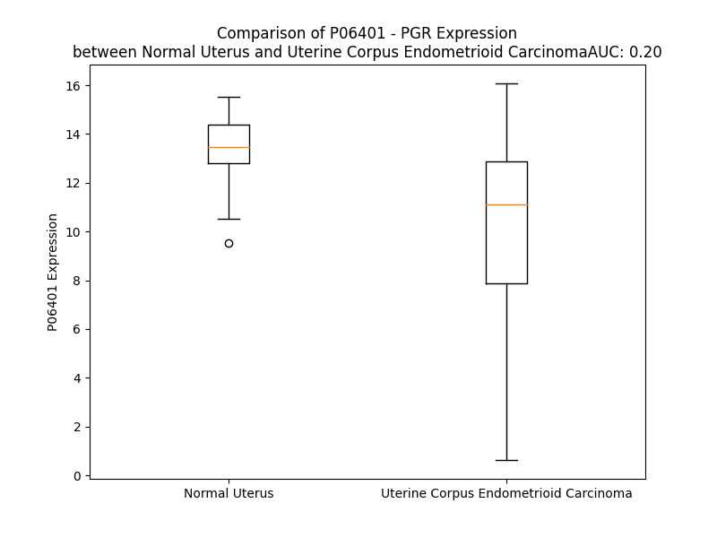

# Detailed Data for P06401

## Introduction to the Detailed Summary

### How to Interpret the Results

- **Summary & Metrics**: This section provides a quick reference to essential protein attributes, including expression changes, family classification, and biomarker applications. Regulation status (upregulated/downregulated) indicates the protein's behavior in a disease context. Some information comes from the original excel file with the proteins selected from literature, while others are derived from the analyses.
- **Expression Comparison**: A visual representation comparing protein expression between normal and disease states. It highlights significant changes in expression levels that might indicate diagnostic or therapeutic relevance. This is data coming from transcriptomics experiments and could not translate similarly to protein levels.
- **Isoform Alignment**: An interactive view of isoform alignments, revealing structural and functional differences between variants of the protein.
- **Interactors & Homologs**: Tables listing known interaction partners and homologous proteins, the more interactors and homologs, the more complex the protein is to design an antibody for.
- **Biological Assemblies**: Information about the structural arrangement of the protein in different assemblies, providing insights into its functional state but also the complexity of the protein to develop antibodies.
- **Combined Per-Residue Information**: A detailed table summarizing residue-level data. This includes predictions for epitope regions, aggregation tendencies, and modifications that might impact the protein's function. Each row corresponds to a residue in the protein, providing insights into specific sites that may be important for research or drug development.
## Summary & Metrics

- **UniProt Accession**: P06401
- **Gene Name**: PR
- **Protein Name**: Progesterone receptor
- **Swiss Prot**: PRGR_HUMAN
- **Family**: ligand-dependent nuclear receptor
- **Biomarker Application**: diagnosis,efficacy,response to therapy
- **Number of Isoforms**: 0
- **Regulation**: 1
- **(transcriptomics) AUC**: 0.2
- **(transcriptomics) Fold Change**: 1.29
- **(transcriptomics) Regulation**: Downregulated
- **Discotope Epitope Count**: 277
- **Max n_uniprots (Homo)**: 2
- **Max n_uniprots (Hetero)**: 2

## Expression Comparison

## Interactors

| preferredName_A   | preferredName_B   |   score |
|:------------------|:------------------|--------:|
| PGR               | NCOA1             |   0.997 |
| PGR               | NCOR1             |   0.993 |
| PGR               | NCOR2             |   0.992 |
| PGR               | HSP90AA1          |   0.99  |
| PGR               | NCOA3             |   0.986 |
| PGR               | ERBB2             |   0.98  |
| PGR               | HSP90AB1          |   0.978 |
| PGR               | FKBP4             |   0.977 |
| PGR               | FKBP5             |   0.977 |
| PGR               | ESR1              |   0.974 |
| PGR               | HSPA4             |   0.972 |
| PGR               | BRCA1             |   0.963 |
| PGR               | PIK3CA            |   0.961 |
| PGR               | PGRMC1            |   0.944 |
| PGR               | PRKACB            |   0.937 |
| PGR               | SRC               |   0.937 |
| PGR               | PRKACA            |   0.937 |
| PGR               | PRKACG            |   0.937 |
| PGR               | PIK3R1            |   0.931 |
| PGR               | MAPK8             |   0.921 |
| PGR               | PIK3CB            |   0.92  |
| PGR               | MAPK14            |   0.92  |
| PGR               | PIK3R2            |   0.912 |
| PGR               | PIK3CD            |   0.911 |
| PGR               | PIK3R3            |   0.911 |
| PGR               | NCOA2             |   0.911 |
| PGR               | MAPK12            |   0.91  |
| PGR               | MAPK11            |   0.909 |
| PGR               | MAPK9             |   0.908 |
| PGR               | MAPK13            |   0.908 |

## Homologs

| uniprot_id   | gene_id   |
|:-------------|:----------|
| E5KQF5       | NR3C1     |
| Q9H2M1       | ESR1      |
| B0ZBF6       | NR3C2     |
| A0A2R8Y509   | ESRRB     |
| F1D8R5       | NR3B3     |
| G3V5S2       | ESR2      |
| A0A7I2PS51   | AR        |
| Q569H8       | ESRRA     |

## Biological Assemblies

|   Unnamed: 0 |   assembly |   n_uniprots | composition   | crystal_id   |
|-------------:|-----------:|-------------:|:--------------|:-------------|
|            0 |          1 |            2 | Homo          | 3hq5         |
|            0 |          1 |            1 | Homo          | 4a2j         |
|            1 |          2 |            1 | Homo          | 4a2j         |
|            0 |          1 |            2 | Homo          | 2c7a         |
|            0 |          1 |            1 | Homo          | 2w8y         |
|            1 |          2 |            1 | Homo          | 2w8y         |
|            0 |          1 |            1 | Homo          | 2ovm         |
|            1 |          2 |            1 | Homo          | 2ovm         |
|            0 |          1 |            1 | Homo          | 3zrb         |
|            1 |          2 |            1 | Homo          | 3zrb         |
|            0 |          1 |            1 | Homo          | 2ovh         |
|            1 |          2 |            1 | Homo          | 2ovh         |
|            0 |          1 |            1 | Homo          | 3kba         |
|            1 |          2 |            1 | Homo          | 3kba         |
|            0 |          1 |            2 | Homo          | 3g8o         |
|            0 |          1 |            1 | Homo          | 1a28         |
|            1 |          2 |            1 | Homo          | 1a28         |
|            0 |          1 |            2 | Hetero        | 4oar         |
|            0 |          1 |            1 | Homo          | 1sqn         |
|            1 |          2 |            1 | Homo          | 1sqn         |
|            0 |          1 |            1 | Homo          | 3zr7         |
|            1 |          2 |            1 | Homo          | 3zr7         |
|            0 |          1 |            1 | Homo          | 3zra         |
|            1 |          2 |            1 | Homo          | 3zra         |
|            0 |          1 |            2 | Homo          | 1sr7         |
|            0 |          1 |            2 | Homo          | 1zuc         |
|            0 |          1 |            1 | Homo          | 1e3k         |
|            1 |          2 |            1 | Homo          | 1e3k         |
|            0 |          1 |            0 | Hetero        | 5cc0         |
|            0 |          1 |            1 | Homo          | 3d90         |
|            1 |          2 |            1 | Homo          | 3d90         |
|            0 |          1 |            1 | Homo          | 4apu         |
|            1 |          2 |            1 | Homo          | 4apu         |

## Combined Per-Residue Information

|   res | aa   |   epitope_score | epitope   |   relative_surface_accessibility |   modeling_confidence |   Aggregation | modification            |
|------:|:-----|----------------:|:----------|---------------------------------:|----------------------:|--------------:|:------------------------|
|     1 | M    |         0.0314  | False     |                          1.31567 |                 34.36 |         0     | N/A                     |
|     2 | T    |         0.04547 | False     |                          0.8507  |                 32.11 |         0     | N/A                     |
|     3 | E    |         0.06509 | False     |                          0.84441 |                 37.32 |         0     | N/A                     |
|     4 | L    |         0.09892 | True      |                          0.99338 |                 33.75 |         0     | N/A                     |
|     5 | K    |         0.12828 | True      |                          0.89283 |                 35.88 |         0     | N/A                     |
|     6 | A    |         0.10709 | True      |                          0.81135 |                 34.3  |         0     | N/A                     |
|     7 | K    |         0.07902 | False     |                          0.9769  |                 35.15 |         0     | N/A                     |
|     8 | G    |         0.10855 | True      |                          0.75348 |                 36.84 |         0     | N/A                     |
|     9 | P    |         0.14297 | True      |                          0.95951 |                 39.67 |         0     | N/A                     |
|    10 | R    |         0.15272 | True      |                          0.93611 |                 34.05 |         0     | N/A                     |
|    11 | A    |         0.08364 | False     |                          0.81018 |                 35.76 |         0     | N/A                     |
|    12 | P    |         0.14911 | True      |                          0.82774 |                 41.84 |         0     | N/A                     |
|    13 | H    |         0.1299  | True      |                          0.95196 |                 36.96 |         0     | N/A                     |
|    14 | V    |         0.07927 | False     |                          1.03211 |                 38.12 |         0     | N/A                     |
|    15 | A    |         0.14528 | True      |                          0.94015 |                 39.18 |         0     | N/A                     |
|    16 | G    |         0.15008 | True      |                          0.99539 |                 37.58 |         0     | N/A                     |
|    17 | G    |         0.08704 | False     |                          0.87697 |                 34.72 |         0     | N/A                     |
|    18 | P    |         0.08725 | False     |                          0.94946 |                 48.78 |         0     | N/A                     |
|    19 | P    |         0.10004 | True      |                          0.95897 |                 43.5  |         0     | N/A                     |
|    20 | S    |         0.05879 | False     |                          0.7506  |                 37.07 |         0     | Phosphoserine           |
|    21 | P    |         0.09979 | True      |                          0.839   |                 43.36 |         0     | N/A                     |
|    22 | E    |         0.12676 | True      |                          0.79047 |                 31.96 |         0     | N/A                     |
|    23 | V    |         0.08772 | False     |                          0.98344 |                 32.76 |         0     | N/A                     |
|    24 | G    |         0.10926 | True      |                          0.88283 |                 36.38 |         0     | N/A                     |
|    25 | S    |         0.06597 | False     |                          0.8558  |                 36.43 |         0     | N/A                     |
|    26 | P    |         0.1009  | True      |                          0.84396 |                 40.29 |         0     | N/A                     |
|    27 | L    |         0.09002 | False     |                          0.93927 |                 36.12 |         0     | N/A                     |
|    28 | L    |         0.09987 | True      |                          0.96298 |                 31.11 |         0     | N/A                     |
|    29 | C    |         0.09357 | True      |                          1.01878 |                 32.19 |         0     | N/A                     |
|    30 | R    |         0.15298 | True      |                          0.88486 |                 33.6  |         0     | N/A                     |
|    31 | P    |         0.08812 | False     |                          0.82664 |                 41.34 |         0     | N/A                     |
|    32 | A    |         0.08558 | False     |                          1.00546 |                 35.49 |         0     | N/A                     |
|    33 | A    |         0.10127 | True      |                          1.06603 |                 34.3  |         0     | N/A                     |
|    34 | G    |         0.11792 | True      |                          0.82976 |                 34.02 |         0     | N/A                     |
|    35 | P    |         0.08754 | False     |                          0.83588 |                 43.39 |         0     | N/A                     |
|    36 | F    |         0.08292 | False     |                          0.96431 |                 33.87 |         0     | N/A                     |
|    37 | P    |         0.08324 | False     |                          0.93532 |                 41.52 |         0     | N/A                     |
|    38 | G    |         0.11173 | True      |                          0.88029 |                 36.83 |         0     | N/A                     |
|    39 | S    |         0.11324 | True      |                          0.6856  |                 36.48 |         0     | N/A                     |
|    40 | Q    |         0.152   | True      |                          0.85681 |                 34.74 |         0     | N/A                     |
|    41 | T    |         0.08383 | False     |                          0.83671 |                 38.36 |         0     | N/A                     |
|    42 | S    |         0.12551 | True      |                          0.71752 |                 34.5  |         0     | N/A                     |
|    43 | D    |         0.12767 | True      |                          0.88289 |                 39.03 |         0     | N/A                     |
|    44 | T    |         0.10055 | True      |                          0.79262 |                 35.06 |         0     | N/A                     |
|    45 | L    |         0.1085  | True      |                          0.9321  |                 34.15 |         0     | N/A                     |
|    46 | P    |         0.15075 | True      |                          0.95586 |                 39.27 |         0     | N/A                     |
|    47 | E    |         0.08151 | False     |                          0.83883 |                 30.01 |         0     | N/A                     |
|    48 | V    |         0.1042  | True      |                          1.03504 |                 37.11 |         0     | N/A                     |
|    49 | S    |         0.0776  | False     |                          0.79968 |                 32.81 |         0     | N/A                     |
|    50 | A    |         0.07521 | False     |                          0.89359 |                 32.8  |         0     | N/A                     |
|    51 | I    |         0.16005 | True      |                          0.90804 |                 37.02 |         0     | N/A                     |
|    52 | P    |         0.05235 | False     |                          0.92079 |                 31.13 |         0     | N/A                     |
|    53 | I    |         0.11983 | True      |                          0.89855 |                 36.02 |         0     | N/A                     |
|    54 | S    |         0.12331 | True      |                          0.7615  |                 30.37 |         0     | N/A                     |
|    55 | L    |         0.15465 | True      |                          1.02242 |                 37.29 |         0     | N/A                     |
|    56 | D    |         0.10726 | True      |                          0.93805 |                 29.21 |         0     | N/A                     |
|    57 | G    |         0.15769 | True      |                          0.74822 |                 32.59 |         0     | N/A                     |
|    58 | L    |         0.09645 | True      |                          0.98208 |                 33.05 |         0     | N/A                     |
|    59 | L    |         0.08085 | False     |                          1.10984 |                 28.36 |         0     | N/A                     |
|    60 | F    |         0.10008 | True      |                          0.90127 |                 34.56 |         0     | N/A                     |
|    61 | P    |         0.09263 | True      |                          0.85706 |                 31.45 |         0     | N/A                     |
|    62 | R    |         0.1472  | True      |                          0.78353 |                 28.14 |         0     | N/A                     |
|    63 | P    |         0.07854 | False     |                          0.96384 |                 37.37 |         0     | N/A                     |
|    64 | C    |         0.08056 | False     |                          0.93598 |                 31.69 |         0     | N/A                     |
|    65 | Q    |         0.12961 | True      |                          0.93249 |                 33.01 |         0     | N/A                     |
|    66 | G    |         0.1043  | True      |                          0.93457 |                 28.44 |         0     | N/A                     |
|    67 | Q    |         0.11005 | True      |                          0.95281 |                 30.94 |         0     | N/A                     |
|    68 | D    |         0.0876  | False     |                          0.78926 |                 30.52 |         0     | N/A                     |
|    69 | P    |         0.08996 | False     |                          0.84541 |                 41.04 |         0     | N/A                     |
|    70 | S    |         0.08118 | False     |                          0.86727 |                 35.16 |         0     | N/A                     |
|    71 | D    |         0.13047 | True      |                          0.87841 |                 31.03 |         0     | N/A                     |
|    72 | E    |         0.09194 | True      |                          0.91547 |                 33.71 |         0     | N/A                     |
|    73 | K    |         0.13074 | True      |                          0.84765 |                 29.08 |         0     | N/A                     |
|    74 | T    |         0.13808 | True      |                          0.75239 |                 31.28 |         0     | N/A                     |
|    75 | Q    |         0.14804 | True      |                          0.74974 |                 29.55 |         0     | N/A                     |
|    76 | D    |         0.13965 | True      |                          0.58819 |                 33.05 |         0     | N/A                     |
|    77 | Q    |         0.10446 | True      |                          0.68435 |                 29.42 |         0     | N/A                     |
|    78 | Q    |         0.08665 | False     |                          0.82168 |                 33.21 |         0     | N/A                     |
|    79 | S    |         0.06745 | False     |                          0.69534 |                 30.89 |         0     | N/A                     |
|    80 | L    |         0.12509 | True      |                          1.04562 |                 35.08 |         0     | N/A                     |
|    81 | S    |         0.05456 | False     |                          0.60164 |                 33.3  |         0     | Phosphoserine           |
|    82 | D    |         0.08119 | False     |                          0.85946 |                 32.62 |         0     | N/A                     |
|    83 | V    |         0.049   | False     |                          1.13614 |                 38.57 |         0     | N/A                     |
|    84 | E    |         0.09111 | False     |                          0.88623 |                 31.33 |         0     | N/A                     |
|    85 | G    |         0.09559 | True      |                          0.83664 |                 34.55 |         0     | N/A                     |
|    86 | A    |         0.10672 | True      |                          0.78019 |                 32.1  |         0     | N/A                     |
|    87 | Y    |         0.14389 | True      |                          0.966   |                 27.86 |         0     | N/A                     |
|    88 | S    |         0.06162 | False     |                          0.8443  |                 32.68 |         0     | N/A                     |
|    89 | R    |         0.13833 | True      |                          0.83086 |                 28.66 |         0     | N/A                     |
|    90 | A    |         0.08339 | False     |                          0.9715  |                 33.34 |         0     | N/A                     |
|    91 | E    |         0.11653 | True      |                          0.71662 |                 29.24 |         0     | N/A                     |
|    92 | A    |         0.09427 | True      |                          0.96114 |                 29.82 |         0     | N/A                     |
|    93 | T    |         0.07269 | False     |                          0.9183  |                 35.79 |         0     | N/A                     |
|    94 | R    |         0.1081  | True      |                          0.97192 |                 30.55 |         0     | N/A                     |
|    95 | G    |         0.10881 | True      |                          0.96469 |                 31.09 |         0     | N/A                     |
|    96 | A    |         0.13709 | True      |                          1.06324 |                 32.79 |         0     | N/A                     |
|    97 | G    |         0.10503 | True      |                          1.01983 |                 30.21 |         0     | N/A                     |
|    98 | G    |         0.1266  | True      |                          1.03389 |                 33.17 |         0     | N/A                     |
|    99 | S    |         0.07728 | False     |                          0.85358 |                 33.49 |         0     | N/A                     |
|   100 | S    |         0.14068 | True      |                          0.88439 |                 34.82 |         0     | N/A                     |
|   101 | S    |         0.10014 | True      |                          0.85856 |                 35.05 |         0     | N/A                     |
|   102 | S    |         0.07774 | False     |                          0.76111 |                 31.24 |         0     | Phosphoserine           |
|   103 | P    |         0.11565 | True      |                          0.93681 |                 36.91 |         0     | N/A                     |
|   104 | P    |         0.05552 | False     |                          0.89142 |                 32.82 |         0     | N/A                     |
|   105 | E    |         0.09366 | True      |                          0.90124 |                 32    |         0     | N/A                     |
|   106 | K    |         0.05066 | False     |                          0.9798  |                 32.25 |         0     | N/A                     |
|   107 | D    |         0.07149 | False     |                          0.68794 |                 37.71 |         0     | N/A                     |
|   108 | S    |         0.07887 | False     |                          0.83241 |                 40.83 |         0     | N/A                     |
|   109 | G    |         0.12086 | True      |                          0.71979 |                 40.72 |         0     | N/A                     |
|   110 | L    |         0.10582 | True      |                          0.75008 |                 39.29 |         0     | N/A                     |
|   111 | L    |         0.1105  | True      |                          0.80303 |                 37.65 |         0     | N/A                     |
|   112 | D    |         0.06432 | False     |                          0.55546 |                 39.16 |         0     | N/A                     |
|   113 | S    |         0.05759 | False     |                          0.51213 |                 42.69 |         0     | N/A                     |
|   114 | V    |         0.06429 | False     |                          0.58267 |                 43.49 |         0     | N/A                     |
|   115 | L    |         0.08568 | False     |                          0.62816 |                 40.31 |         0     | N/A                     |
|   116 | D    |         0.10515 | True      |                          0.65494 |                 42.27 |         0     | N/A                     |
|   117 | T    |         0.08528 | False     |                          0.74248 |                 52.23 |         0     | N/A                     |
|   118 | L    |         0.07309 | False     |                          0.83663 |                 36.54 |         0     | N/A                     |
|   119 | L    |         0.11518 | True      |                          0.85248 |                 38.21 |         0     | N/A                     |
|   120 | A    |         0.05082 | False     |                          0.67346 |                 41.23 |         0     | N/A                     |
|   121 | P    |         0.07303 | False     |                          0.98058 |                 38.65 |         0     | N/A                     |
|   122 | S    |         0.05559 | False     |                          0.90798 |                 42.96 |         0     | N/A                     |
|   123 | G    |         0.05409 | False     |                          0.81443 |                 38.47 |         0     | N/A                     |
|   124 | P    |         0.10591 | True      |                          1.05916 |                 35.46 |         0     | N/A                     |
|   125 | G    |         0.08174 | False     |                          0.83294 |                 35.16 |         0     | N/A                     |
|   126 | Q    |         0.10517 | True      |                          0.90261 |                 38.62 |         0     | N/A                     |
|   127 | S    |         0.06651 | False     |                          0.77351 |                 38.08 |         0     | N/A                     |
|   128 | Q    |         0.23411 | True      |                          0.82202 |                 36.94 |         0     | N/A                     |
|   129 | P    |         0.14498 | True      |                          0.81419 |                 39.27 |         0     | N/A                     |
|   130 | S    |         0.11865 | True      |                          0.72831 |                 35.46 |         0     | Phosphoserine           |
|   131 | P    |         0.08644 | False     |                          0.87451 |                 43.11 |         0     | N/A                     |
|   132 | P    |         0.12131 | True      |                          0.85157 |                 39.87 |         0     | N/A                     |
|   133 | A    |         0.09381 | True      |                          0.91774 |                 37.06 |         0     | N/A                     |
|   134 | C    |         0.11858 | True      |                          0.95544 |                 32.17 |         0     | N/A                     |
|   135 | E    |         0.06385 | False     |                          0.77922 |                 27.6  |         0     | N/A                     |
|   136 | V    |         0.05377 | False     |                          1.02468 |                 33.26 |         0.542 | N/A                     |
|   137 | T    |         0.07369 | False     |                          0.8923  |                 28.3  |         0.542 | N/A                     |
|   138 | S    |         0.09912 | True      |                          0.73232 |                 32.21 |         0.77  | N/A                     |
|   139 | S    |         0.1251  | True      |                          0.85103 |                 31.63 |         2.611 | N/A                     |
|   140 | W    |         0.09654 | True      |                          1.07219 |                 26.67 |         2.611 | N/A                     |
|   141 | C    |         0.0944  | True      |                          0.84232 |                 29.06 |         2.611 | N/A                     |
|   142 | L    |         0.12337 | True      |                          0.83409 |                 31.63 |         2.611 | N/A                     |
|   143 | F    |         0.09983 | True      |                          0.94807 |                 31.95 |         2.611 | N/A                     |
|   144 | G    |         0.14491 | True      |                          0.78978 |                 26.39 |         0     | N/A                     |
|   145 | P    |         0.12711 | True      |                          0.93082 |                 40.1  |         0     | N/A                     |
|   146 | E    |         0.0926  | True      |                          0.84123 |                 31.33 |         0     | N/A                     |
|   147 | L    |         0.08066 | False     |                          0.9727  |                 32.59 |         0     | N/A                     |
|   148 | P    |         0.09161 | False     |                          0.93379 |                 38.37 |         0     | N/A                     |
|   149 | E    |         0.05425 | False     |                          0.85724 |                 34.57 |         0     | N/A                     |
|   150 | D    |         0.08305 | False     |                          0.88156 |                 34.49 |         0     | N/A                     |
|   151 | P    |         0.08476 | False     |                          0.87252 |                 43.17 |         0     | N/A                     |
|   152 | P    |         0.10865 | True      |                          0.90106 |                 37.11 |         0     | N/A                     |
|   153 | A    |         0.08171 | False     |                          0.96558 |                 34.77 |         0     | N/A                     |
|   154 | A    |         0.03931 | False     |                          0.97767 |                 37.4  |         0     | N/A                     |
|   155 | P    |         0.09394 | True      |                          0.96044 |                 39.24 |         0     | N/A                     |
|   156 | A    |         0.09826 | True      |                          0.87518 |                 36.58 |         0     | N/A                     |
|   157 | T    |         0.1358  | True      |                          0.81551 |                 36.59 |         0     | N/A                     |
|   158 | Q    |         0.0809  | False     |                          0.75135 |                 39.05 |         0     | N/A                     |
|   159 | R    |         0.09186 | False     |                          0.85219 |                 35.19 |         0     | N/A                     |
|   160 | V    |         0.07906 | False     |                          0.90163 |                 36.51 |         0     | N/A                     |
|   161 | L    |         0.08188 | False     |                          1.01858 |                 36.33 |         0     | N/A                     |
|   162 | S    |         0.06484 | False     |                          0.71764 |                 33.88 |         0     | Phosphoserine           |
|   163 | P    |         0.12045 | True      |                          0.82336 |                 44.47 |         0     | N/A                     |
|   164 | L    |         0.11385 | True      |                          0.90849 |                 37.91 |         0     | N/A                     |
|   165 | M    |         0.10166 | True      |                          0.82321 |                 41.46 |         0     | N/A                     |
|   166 | S    |         0.09856 | True      |                          0.74403 |                 37.57 |         0     | N/A                     |
|   167 | R    |         0.15043 | True      |                          0.83849 |                 36.73 |         0     | N/A                     |
|   168 | S    |         0.05157 | False     |                          0.81509 |                 39.4  |         0     | N/A                     |
|   169 | G    |         0.13669 | True      |                          0.82539 |                 35.48 |         0     | N/A                     |
|   170 | C    |         0.07183 | False     |                          0.91727 |                 33.54 |         0     | N/A                     |
|   171 | K    |         0.06016 | False     |                          0.98267 |                 44.41 |         0     | N/A                     |
|   172 | V    |         0.11924 | True      |                          0.99987 |                 36.8  |         0     | N/A                     |
|   173 | G    |         0.08464 | False     |                          0.75876 |                 43.33 |         0     | N/A                     |
|   174 | D    |         0.12221 | True      |                          0.82562 |                 41.14 |         0     | N/A                     |
|   175 | S    |         0.0667  | False     |                          0.7219  |                 42.57 |         0     | N/A                     |
|   176 | S    |         0.10295 | True      |                          0.92927 |                 39.31 |         0     | N/A                     |
|   177 | G    |         0.1014  | True      |                          0.94294 |                 41.26 |         0     | N/A                     |
|   178 | T    |         0.089   | False     |                          0.98523 |                 34.52 |         0     | N/A                     |
|   179 | A    |         0.11704 | True      |                          0.97712 |                 34.79 |         0     | N/A                     |
|   180 | A    |         0.0547  | False     |                          1.03274 |                 38.75 |         0     | N/A                     |
|   181 | A    |         0.08617 | False     |                          0.93438 |                 34.98 |         0     | N/A                     |
|   182 | H    |         0.11715 | True      |                          1.00608 |                 37.62 |         0     | N/A                     |
|   183 | K    |         0.08184 | False     |                          0.99287 |                 33.48 |         0     | N/A                     |
|   184 | V    |         0.08924 | False     |                          1.04142 |                 33.69 |         0     | N/A                     |
|   185 | L    |         0.08087 | False     |                          0.99319 |                 35.62 |         0     | N/A                     |
|   186 | P    |         0.10977 | True      |                          0.86256 |                 36.84 |         0     | N/A                     |
|   187 | R    |         0.09099 | False     |                          0.96369 |                 36.52 |         0     | N/A                     |
|   188 | G    |         0.12774 | True      |                          0.76005 |                 33.63 |         0     | N/A                     |
|   189 | L    |         0.14442 | True      |                          1.07593 |                 35.84 |         0     | N/A                     |
|   190 | S    |         0.11987 | True      |                          0.80906 |                 36.84 |         0     | Phosphoserine           |
|   191 | P    |         0.18842 | True      |                          0.92359 |                 41.8  |         0     | N/A                     |
|   192 | A    |         0.07986 | False     |                          0.89543 |                 34.05 |         0     | N/A                     |
|   193 | R    |         0.13846 | True      |                          0.85456 |                 34.78 |         0     | N/A                     |
|   194 | Q    |         0.09196 | True      |                          0.70261 |                 36.55 |         0     | N/A                     |
|   195 | L    |         0.11699 | True      |                          0.92932 |                 33.22 |         0     | N/A                     |
|   196 | L    |         0.09653 | True      |                          1.06926 |                 34.72 |         0     | N/A                     |
|   197 | L    |         0.10117 | True      |                          0.96773 |                 34.47 |         0     | N/A                     |
|   198 | P    |         0.12769 | True      |                          0.91689 |                 37.29 |         0     | N/A                     |
|   199 | A    |         0.0969  | True      |                          0.97705 |                 34.57 |         0     | N/A                     |
|   200 | S    |         0.07131 | False     |                          0.84621 |                 34.02 |         0     | N/A                     |
|   201 | E    |         0.11523 | True      |                          0.91236 |                 34.15 |         0     | N/A                     |
|   202 | S    |         0.10244 | True      |                          0.79284 |                 31.65 |         0     | N/A                     |
|   203 | P    |         0.0992  | True      |                          0.99839 |                 42.94 |         0     | N/A                     |
|   204 | H    |         0.1157  | True      |                          0.95098 |                 38.08 |         0     | N/A                     |
|   205 | W    |         0.13286 | True      |                          1.01882 |                 28.41 |         0     | N/A                     |
|   206 | S    |         0.11597 | True      |                          0.85053 |                 33.62 |         0     | N/A                     |
|   207 | G    |         0.12481 | True      |                          0.90031 |                 38.92 |         0     | N/A                     |
|   208 | A    |         0.14639 | True      |                          0.9761  |                 37.46 |         0     | N/A                     |
|   209 | P    |         0.10135 | True      |                          0.9203  |                 45.69 |         0     | N/A                     |
|   210 | V    |         0.06895 | False     |                          1.10255 |                 41.14 |         0     | N/A                     |
|   211 | K    |         0.0713  | False     |                          0.90915 |                 40.77 |         0     | N/A                     |
|   212 | P    |         0.11193 | True      |                          0.83556 |                 39.15 |         0     | N/A                     |
|   213 | S    |         0.07713 | False     |                          0.7726  |                 35.15 |         0     | Phosphoserine           |
|   214 | P    |         0.04548 | False     |                          0.90745 |                 40.4  |         0     | N/A                     |
|   215 | Q    |         0.07054 | False     |                          0.88873 |                 37.85 |         0     | N/A                     |
|   216 | A    |         0.09263 | True      |                          0.94568 |                 35.82 |         0     | N/A                     |
|   217 | A    |         0.09567 | True      |                          0.91707 |                 37.91 |         0     | N/A                     |
|   218 | A    |         0.05923 | False     |                          0.87186 |                 36.67 |         0     | N/A                     |
|   219 | V    |         0.13129 | True      |                          0.97308 |                 32.08 |         0     | N/A                     |
|   220 | E    |         0.07914 | False     |                          0.82143 |                 36.07 |         0     | N/A                     |
|   221 | V    |         0.1051  | True      |                          0.94073 |                 33.14 |         0     | N/A                     |
|   222 | E    |         0.07777 | False     |                          0.82563 |                 34.93 |         0     | N/A                     |
|   223 | E    |         0.10887 | True      |                          0.86718 |                 35.78 |         0     | N/A                     |
|   224 | E    |         0.12085 | True      |                          0.85108 |                 36.74 |         0     | N/A                     |
|   225 | D    |         0.08831 | False     |                          0.94916 |                 34.37 |         0     | N/A                     |
|   226 | G    |         0.12273 | True      |                          0.73357 |                 37.52 |         0     | N/A                     |
|   227 | S    |         0.07548 | False     |                          0.75081 |                 37.78 |         0     | N/A                     |
|   228 | E    |         0.08996 | False     |                          0.85856 |                 38.51 |         0     | N/A                     |
|   229 | S    |         0.10078 | True      |                          0.69729 |                 41.52 |         0     | N/A                     |
|   230 | E    |         0.07313 | False     |                          0.86603 |                 38.96 |         0     | N/A                     |
|   231 | E    |         0.10103 | True      |                          0.7854  |                 37.61 |         0     | N/A                     |
|   232 | S    |         0.0774  | False     |                          0.72943 |                 38.53 |         0     | N/A                     |
|   233 | A    |         0.04732 | False     |                          0.89308 |                 38.79 |         0     | N/A                     |
|   234 | G    |         0.07246 | False     |                          0.77851 |                 31.97 |         0     | N/A                     |
|   235 | P    |         0.11039 | True      |                          0.88538 |                 41.91 |         0     | N/A                     |
|   236 | L    |         0.11131 | True      |                          0.89429 |                 36.1  |         0     | N/A                     |
|   237 | L    |         0.07739 | False     |                          0.8643  |                 36.78 |         0     | N/A                     |
|   238 | K    |         0.12252 | True      |                          0.96524 |                 34.27 |         0     | N/A                     |
|   239 | G    |         0.08756 | False     |                          0.96784 |                 36.22 |         0     | N/A                     |
|   240 | K    |         0.08613 | False     |                          0.98523 |                 31.37 |         0     | N/A                     |
|   241 | P    |         0.12256 | True      |                          0.81042 |                 39.6  |         0     | N/A                     |
|   242 | R    |         0.10446 | True      |                          0.91982 |                 31.91 |         0     | N/A                     |
|   243 | A    |         0.06296 | False     |                          0.79806 |                 34.48 |         0     | N/A                     |
|   244 | L    |         0.10864 | True      |                          1.08528 |                 35.1  |         0     | N/A                     |
|   245 | G    |         0.08768 | False     |                          0.92516 |                 35.92 |         0     | N/A                     |
|   246 | G    |         0.083   | False     |                          0.98387 |                 38.21 |         0     | N/A                     |
|   247 | A    |         0.09446 | True      |                          1.01589 |                 39.03 |         0     | N/A                     |
|   248 | A    |         0.05189 | False     |                          0.91518 |                 37.73 |         0     | N/A                     |
|   249 | A    |         0.09646 | True      |                          0.99762 |                 39.45 |         0     | N/A                     |
|   250 | G    |         0.08386 | False     |                          1.0198  |                 38.09 |         0     | N/A                     |
|   251 | G    |         0.13263 | True      |                          0.97245 |                 37.39 |         0     | N/A                     |
|   252 | G    |         0.09942 | True      |                          0.96752 |                 36.31 |         0     | N/A                     |
|   253 | A    |         0.11533 | True      |                          0.9939  |                 36.53 |         0     | N/A                     |
|   254 | A    |         0.09211 | True      |                          0.87329 |                 35.52 |         0     | N/A                     |
|   255 | A    |         0.06961 | False     |                          0.93341 |                 32.6  |         0     | N/A                     |
|   256 | V    |         0.11067 | True      |                          0.94145 |                 35.19 |         0     | N/A                     |
|   257 | P    |         0.0446  | False     |                          0.81232 |                 41.89 |         0     | N/A                     |
|   258 | P    |         0.09666 | True      |                          0.98782 |                 43.41 |         0     | N/A                     |
|   259 | G    |         0.08086 | False     |                          0.93351 |                 31.89 |         0     | N/A                     |
|   260 | A    |         0.09995 | True      |                          0.97467 |                 30.96 |         0     | N/A                     |
|   261 | A    |         0.07523 | False     |                          0.95586 |                 31.01 |         0     | N/A                     |
|   262 | A    |         0.07206 | False     |                          0.94895 |                 31.42 |         0     | N/A                     |
|   263 | G    |         0.0603  | False     |                          1.02454 |                 28.48 |         0     | N/A                     |
|   264 | G    |         0.15662 | True      |                          0.87331 |                 28.51 |         0     | N/A                     |
|   265 | V    |         0.0994  | True      |                          1.03185 |                 26.09 |         0.536 | N/A                     |
|   266 | A    |         0.10636 | True      |                          0.83621 |                 26.19 |         0.536 | N/A                     |
|   267 | L    |         0.11811 | True      |                          1.03911 |                 27.77 |         0.536 | N/A                     |
|   268 | V    |         0.07479 | False     |                          0.97465 |                 34.09 |         0.536 | N/A                     |
|   269 | P    |         0.04784 | False     |                          0.86546 |                 35.22 |         0.536 | N/A                     |
|   270 | K    |         0.11944 | True      |                          0.77022 |                 29.39 |         0     | N/A                     |
|   271 | E    |         0.08377 | False     |                          0.68819 |                 34.36 |         0     | N/A                     |
|   272 | D    |         0.11922 | True      |                          0.73735 |                 32.69 |         0     | N/A                     |
|   273 | S    |         0.0775  | False     |                          0.5455  |                 39.57 |         0     | N/A                     |
|   274 | R    |         0.13622 | True      |                          0.75883 |                 36.4  |         0     | N/A                     |
|   275 | F    |         0.10685 | True      |                          0.93579 |                 34.1  |         0     | N/A                     |
|   276 | S    |         0.10113 | True      |                          0.8116  |                 35.56 |         0     | N/A                     |
|   277 | A    |         0.061   | False     |                          0.78775 |                 34.24 |         0     | N/A                     |
|   278 | P    |         0.09821 | True      |                          1.03349 |                 41.56 |         0     | N/A                     |
|   279 | R    |         0.0962  | True      |                          0.86531 |                 31.7  |         0     | N/A                     |
|   280 | V    |         0.07167 | False     |                          1.08806 |                 37.64 |         0     | N/A                     |
|   281 | A    |         0.07628 | False     |                          0.67312 |                 31.63 |         0     | N/A                     |
|   282 | L    |         0.10802 | True      |                          1.06549 |                 35.02 |         0     | N/A                     |
|   283 | V    |         0.11091 | True      |                          0.94999 |                 35.4  |         0     | N/A                     |
|   284 | E    |         0.07827 | False     |                          0.79578 |                 32.54 |         0     | N/A                     |
|   285 | Q    |         0.13596 | True      |                          0.86291 |                 35.47 |         0     | N/A                     |
|   286 | D    |         0.10374 | True      |                          0.86902 |                 35.06 |         0     | N/A                     |
|   287 | A    |         0.06445 | False     |                          0.80315 |                 33.13 |         0     | N/A                     |
|   288 | P    |         0.11879 | True      |                          0.86037 |                 38.32 |         0     | N/A                     |
|   289 | M    |         0.12419 | True      |                          1.0019  |                 31.19 |         0     | N/A                     |
|   290 | A    |         0.1292  | True      |                          0.95458 |                 39.53 |         0     | N/A                     |
|   291 | P    |         0.09582 | True      |                          1.04186 |                 34.92 |         0     | N/A                     |
|   292 | G    |         0.09775 | True      |                          0.91223 |                 32.49 |         0     | N/A                     |
|   293 | R    |         0.12843 | True      |                          0.95504 |                 37.83 |         0     | N/A                     |
|   294 | S    |         0.07402 | False     |                          0.75538 |                 32.68 |         0     | Phosphoserine; by MAPK1 |
|   295 | P    |         0.07104 | False     |                          0.84615 |                 33.75 |         0     | N/A                     |
|   296 | L    |         0.07717 | False     |                          1.05161 |                 33.66 |         0.927 | N/A                     |
|   297 | A    |         0.07804 | False     |                          0.78657 |                 38.21 |         0.927 | N/A                     |
|   298 | T    |         0.11463 | True      |                          0.69804 |                 34.88 |         0.927 | N/A                     |
|   299 | T    |         0.11245 | True      |                          0.91104 |                 39.76 |         0.927 | N/A                     |
|   300 | V    |         0.07143 | False     |                          0.95975 |                 39.68 |         0.927 | N/A                     |
|   301 | M    |         0.1144  | True      |                          0.85079 |                 39.22 |         0.494 | N/A                     |
|   302 | D    |         0.10558 | True      |                          0.68574 |                 35.45 |         0     | N/A                     |
|   303 | F    |         0.07423 | False     |                          1.00153 |                 35.78 |         0     | N/A                     |
|   304 | I    |         0.08077 | False     |                          0.82245 |                 39.1  |         0     | N/A                     |
|   305 | H    |         0.07768 | False     |                          1.02174 |                 34.38 |         0     | N/A                     |
|   306 | V    |         0.05416 | False     |                          0.73023 |                 34.64 |         0     | N/A                     |
|   307 | P    |         0.06406 | False     |                          0.88194 |                 30.78 |         0     | N/A                     |
|   308 | I    |         0.06041 | False     |                          0.56603 |                 34.74 |         0     | N/A                     |
|   309 | L    |         0.09241 | True      |                          0.8711  |                 31.44 |         0     | N/A                     |
|   310 | P    |         0.07872 | False     |                          0.93244 |                 33.18 |         0     | N/A                     |
|   311 | L    |         0.07148 | False     |                          0.77438 |                 37.06 |         0     | N/A                     |
|   312 | N    |         0.08794 | False     |                          0.62138 |                 42.15 |         0     | N/A                     |
|   313 | H    |         0.07416 | False     |                          0.51986 |                 53.85 |         0     | N/A                     |
|   314 | A    |         0.06179 | False     |                          0.57754 |                 46.67 |         0.352 | N/A                     |
|   315 | L    |         0.05982 | False     |                          0.60656 |                 54.71 |         0.352 | N/A                     |
|   316 | L    |         0.01707 | False     |                          0.03757 |                 50.73 |         0.352 | N/A                     |
|   317 | A    |         0.03022 | False     |                          0.18039 |                 65.62 |         0.352 | N/A                     |
|   318 | A    |         0.05472 | False     |                          0.52152 |                 69.47 |         0.352 | N/A                     |
|   319 | R    |         0.04886 | False     |                          0.29128 |                 70.82 |         0     | N/A                     |
|   320 | T    |         0.01059 | False     |                          0.01971 |                 69.91 |         0     | N/A                     |
|   321 | R    |         0.07625 | False     |                          0.3567  |                 76.91 |         0     | N/A                     |
|   322 | Q    |         0.10354 | True      |                          0.63149 |                 78.04 |         0     | N/A                     |
|   323 | L    |         0.03192 | False     |                          0.39569 |                 74.82 |         0     | N/A                     |
|   324 | L    |         0.01966 | False     |                          0.08499 |                 74.62 |         0     | N/A                     |
|   325 | E    |         0.11415 | True      |                          0.56757 |                 75.19 |         0     | N/A                     |
|   326 | D    |         0.0688  | False     |                          0.66301 |                 65.89 |         0     | N/A                     |
|   327 | E    |         0.04833 | False     |                          0.52085 |                 45.93 |         0     | N/A                     |
|   328 | S    |         0.04991 | False     |                          0.7538  |                 39.99 |         0     | N/A                     |
|   329 | Y    |         0.10337 | True      |                          0.92913 |                 34.41 |         0     | N/A                     |
|   330 | D    |         0.06095 | False     |                          0.96415 |                 35.9  |         0     | N/A                     |
|   331 | G    |         0.0952  | True      |                          0.72409 |                 33.58 |         0     | N/A                     |
|   332 | G    |         0.12427 | True      |                          0.99075 |                 29.53 |         0     | N/A                     |
|   333 | A    |         0.0928  | True      |                          0.90293 |                 34.18 |         0     | N/A                     |
|   334 | G    |         0.13399 | True      |                          1.04362 |                 30.39 |         0     | N/A                     |
|   335 | A    |         0.0785  | False     |                          1.02691 |                 35.92 |         0     | N/A                     |
|   336 | A    |         0.07956 | False     |                          0.94316 |                 36.54 |         0     | N/A                     |
|   337 | S    |         0.06153 | False     |                          0.88    |                 29.76 |         0     | N/A                     |
|   338 | A    |         0.06101 | False     |                          0.79264 |                 32.56 |         0     | N/A                     |
|   339 | F    |         0.07441 | False     |                          1.0757  |                 32.31 |         0     | N/A                     |
|   340 | A    |         0.08591 | False     |                          0.86752 |                 32.22 |         0     | N/A                     |
|   341 | P    |         0.07776 | False     |                          0.90083 |                 36.3  |         0     | N/A                     |
|   342 | P    |         0.11515 | True      |                          1.00152 |                 43.8  |         0     | N/A                     |
|   343 | R    |         0.09415 | True      |                          0.94865 |                 31.42 |         0     | N/A                     |
|   344 | S    |         0.11694 | True      |                          0.83696 |                 37.5  |         0     | N/A                     |
|   345 | S    |         0.10013 | True      |                          0.80184 |                 38.45 |         0     | Phosphoserine; by MAPK  |
|   346 | P    |         0.11551 | True      |                          0.98022 |                 44.36 |         0     | N/A                     |
|   347 | C    |         0.08423 | False     |                          0.90557 |                 35.46 |         0     | N/A                     |
|   348 | A    |         0.09019 | False     |                          0.9262  |                 37.12 |         0     | N/A                     |
|   349 | S    |         0.09638 | True      |                          0.73333 |                 39.61 |         0     | N/A                     |
|   350 | S    |         0.07096 | False     |                          0.74992 |                 37.5  |         0     | N/A                     |
|   351 | T    |         0.12603 | True      |                          0.92535 |                 39.01 |         0     | N/A                     |
|   352 | P    |         0.051   | False     |                          0.87618 |                 44.22 |         0     | N/A                     |
|   353 | V    |         0.09264 | True      |                          1.05    |                 37.3  |         0     | N/A                     |
|   354 | A    |         0.09152 | False     |                          0.72527 |                 37.71 |         0     | N/A                     |
|   355 | V    |         0.06153 | False     |                          1.05526 |                 37.36 |         0     | N/A                     |
|   356 | G    |         0.09455 | True      |                          0.67138 |                 36.1  |         0     | N/A                     |
|   357 | D    |         0.08498 | False     |                          0.79315 |                 37.07 |         0     | N/A                     |
|   358 | F    |         0.11504 | True      |                          0.98858 |                 35.65 |         0     | N/A                     |
|   359 | P    |         0.06273 | False     |                          0.69741 |                 42.88 |         0     | N/A                     |
|   360 | D    |         0.08246 | False     |                          0.81147 |                 34.63 |         0     | N/A                     |
|   361 | C    |         0.06984 | False     |                          1.01819 |                 31.97 |         0     | N/A                     |
|   362 | A    |         0.07039 | False     |                          0.9088  |                 34.6  |         0     | N/A                     |
|   363 | Y    |         0.07861 | False     |                          0.88094 |                 28.16 |         0     | N/A                     |
|   364 | P    |         0.12535 | True      |                          0.88861 |                 39.78 |         0     | N/A                     |
|   365 | P    |         0.06362 | False     |                          0.71329 |                 41.28 |         0     | N/A                     |
|   366 | D    |         0.11811 | True      |                          0.92958 |                 34.14 |         0     | N/A                     |
|   367 | A    |         0.09329 | True      |                          0.90577 |                 37.44 |         0     | N/A                     |
|   368 | E    |         0.07369 | False     |                          0.80119 |                 32.26 |         0     | N/A                     |
|   369 | P    |         0.07876 | False     |                          0.84335 |                 40.91 |         0     | N/A                     |
|   370 | K    |         0.08319 | False     |                          0.90593 |                 38.85 |         0     | N/A                     |
|   371 | D    |         0.07868 | False     |                          0.80337 |                 34.52 |         0     | N/A                     |
|   372 | D    |         0.06809 | False     |                          0.95617 |                 39.07 |         0     | N/A                     |
|   373 | A    |         0.07068 | False     |                          0.7307  |                 34.49 |         0     | N/A                     |
|   374 | Y    |         0.08405 | False     |                          0.94576 |                 32.49 |         0     | N/A                     |
|   375 | P    |         0.08306 | False     |                          0.69557 |                 38.54 |         0     | N/A                     |
|   376 | L    |         0.07266 | False     |                          0.98175 |                 31.11 |         0     | N/A                     |
|   377 | Y    |         0.12391 | True      |                          0.89864 |                 31.72 |         0     | N/A                     |
|   378 | S    |         0.06532 | False     |                          0.69503 |                 32.09 |         0     | N/A                     |
|   379 | D    |         0.09538 | True      |                          0.81418 |                 30.81 |         0     | N/A                     |
|   380 | F    |         0.08968 | False     |                          1.08603 |                 33.22 |         0     | N/A                     |
|   381 | Q    |         0.05143 | False     |                          0.80831 |                 31.02 |         0     | N/A                     |
|   382 | P    |         0.08784 | False     |                          0.75285 |                 43.72 |         0     | N/A                     |
|   383 | P    |         0.06735 | False     |                          0.89328 |                 35.97 |         0     | N/A                     |
|   384 | A    |         0.04148 | False     |                          0.87746 |                 33.57 |         0     | N/A                     |
|   385 | L    |         0.04122 | False     |                          1.0866  |                 32.57 |         0     | N/A                     |
|   386 | K    |         0.08242 | False     |                          0.82845 |                 32.41 |         0     | N/A                     |
|   387 | I    |         0.08322 | False     |                          1.01459 |                 39.15 |         0     | N/A                     |
|   388 | K    |         0.05648 | False     |                          0.76587 |                 43.83 |         0     | N/A                     |
|   389 | E    |         0.0812  | False     |                          0.62437 |                 37.36 |         0     | N/A                     |
|   390 | E    |         0.05872 | False     |                          0.85875 |                 37.2  |         0     | N/A                     |
|   391 | E    |         0.06194 | False     |                          0.87843 |                 38.84 |         0     | N/A                     |
|   392 | E    |         0.0876  | False     |                          0.85063 |                 36.09 |         0     | N/A                     |
|   393 | G    |         0.12901 | True      |                          0.74666 |                 34.46 |         0     | N/A                     |
|   394 | A    |         0.07495 | False     |                          0.85116 |                 37.67 |         0     | N/A                     |
|   395 | E    |         0.09157 | False     |                          0.86005 |                 35.36 |         0     | N/A                     |
|   396 | A    |         0.07213 | False     |                          0.87473 |                 33.86 |         0     | N/A                     |
|   397 | S    |         0.07008 | False     |                          0.82801 |                 36.85 |         0     | N/A                     |
|   398 | A    |         0.09569 | True      |                          0.85935 |                 36.92 |         0     | N/A                     |
|   399 | R    |         0.13181 | True      |                          0.93288 |                 36.26 |         0     | N/A                     |
|   400 | S    |         0.06109 | False     |                          0.81714 |                 35.1  |         0     | Phosphoserine; by CDK2  |
|   401 | P    |         0.14192 | True      |                          0.91818 |                 37.78 |         0     | N/A                     |
|   402 | R    |         0.1093  | True      |                          0.90252 |                 32.84 |         0     | N/A                     |
|   403 | S    |         0.05815 | False     |                          0.70108 |                 31.93 |         0.514 | N/A                     |
|   404 | Y    |         0.04921 | False     |                          0.91398 |                 31.93 |         1.2   | N/A                     |
|   405 | L    |         0.08029 | False     |                          0.94784 |                 34.49 |         1.45  | N/A                     |
|   406 | V    |         0.05343 | False     |                          1.00113 |                 37.65 |         1.45  | N/A                     |
|   407 | A    |         0.08145 | False     |                          0.94208 |                 37.8  |         1.45  | N/A                     |
|   408 | G    |         0.09427 | True      |                          0.90917 |                 36.8  |         0.936 | N/A                     |
|   409 | A    |         0.07587 | False     |                          0.90736 |                 38.84 |         0.564 | N/A                     |
|   410 | N    |         0.09881 | True      |                          0.8985  |                 38.69 |         0     | N/A                     |
|   411 | P    |         0.09645 | True      |                          0.90251 |                 39.33 |         0     | N/A                     |
|   412 | A    |         0.05858 | False     |                          0.98942 |                 31.9  |         0     | N/A                     |
|   413 | A    |         0.08905 | False     |                          0.8344  |                 37.29 |         0     | N/A                     |
|   414 | F    |         0.08305 | False     |                          1.04469 |                 38.72 |         0     | N/A                     |
|   415 | P    |         0.12081 | True      |                          0.81934 |                 43.89 |         0     | N/A                     |
|   416 | D    |         0.15913 | True      |                          0.85537 |                 37.93 |         0     | N/A                     |
|   417 | F    |         0.15396 | True      |                          0.98355 |                 32.94 |         0     | N/A                     |
|   418 | P    |         0.11388 | True      |                          0.8219  |                 39.09 |         0     | N/A                     |
|   419 | L    |         0.09919 | True      |                          1.1169  |                 31.68 |         0     | N/A                     |
|   420 | G    |         0.06811 | False     |                          0.85901 |                 41.66 |         0     | N/A                     |
|   421 | P    |         0.07416 | False     |                          0.95269 |                 47.1  |         0     | N/A                     |
|   422 | P    |         0.08694 | False     |                          0.93199 |                 48.46 |         0     | N/A                     |
|   423 | P    |         0.06634 | False     |                          0.8779  |                 60.26 |         0     | N/A                     |
|   424 | P    |         0.08265 | False     |                          0.90904 |                 52.87 |         0     | N/A                     |
|   425 | L    |         0.05705 | False     |                          1.06688 |                 48.98 |         0     | N/A                     |
|   426 | P    |         0.09777 | True      |                          0.84838 |                 59.32 |         0     | N/A                     |
|   427 | P    |         0.07731 | False     |                          0.85237 |                 54.37 |         0     | N/A                     |
|   428 | R    |         0.08689 | False     |                          0.91091 |                 41.68 |         0     | N/A                     |
|   429 | A    |         0.07538 | False     |                          0.89218 |                 43.91 |         0     | N/A                     |
|   430 | T    |         0.0982  | True      |                          0.85756 |                 47.03 |         0     | N/A                     |
|   431 | P    |         0.05856 | False     |                          0.98089 |                 49.01 |         0     | N/A                     |
|   432 | S    |         0.08497 | False     |                          0.88736 |                 45.93 |         0     | N/A                     |
|   433 | R    |         0.11389 | True      |                          0.93149 |                 45.09 |         0     | N/A                     |
|   434 | P    |         0.06652 | False     |                          0.98693 |                 44.13 |         0     | N/A                     |
|   435 | G    |         0.06732 | False     |                          0.82628 |                 42.38 |         0     | N/A                     |
|   436 | E    |         0.09469 | True      |                          0.88794 |                 40.86 |         0     | N/A                     |
|   437 | A    |         0.06673 | False     |                          0.98017 |                 40.72 |         0     | N/A                     |
|   438 | A    |         0.0807  | False     |                          0.83971 |                 39.62 |         0     | N/A                     |
|   439 | V    |         0.04886 | False     |                          0.9193  |                 40.38 |         0     | N/A                     |
|   440 | T    |         0.08613 | False     |                          0.89309 |                 36.82 |         0     | N/A                     |
|   441 | A    |         0.08469 | False     |                          0.98099 |                 37.39 |         0     | N/A                     |
|   442 | A    |         0.06787 | False     |                          0.86279 |                 33.75 |         0     | N/A                     |
|   443 | P    |         0.10454 | True      |                          0.93866 |                 45.29 |         0     | N/A                     |
|   444 | A    |         0.08794 | False     |                          0.80764 |                 38.52 |         0     | N/A                     |
|   445 | S    |         0.08363 | False     |                          0.88413 |                 37.2  |         0     | N/A                     |
|   446 | A    |         0.07378 | False     |                          1.01501 |                 39.15 |         0     | N/A                     |
|   447 | S    |         0.08767 | False     |                          0.75793 |                 34.79 |         0     | N/A                     |
|   448 | V    |         0.07533 | False     |                          0.95521 |                 40.09 |         0     | N/A                     |
|   449 | S    |         0.10303 | True      |                          0.80923 |                 37.42 |         0     | N/A                     |
|   450 | S    |         0.10932 | True      |                          0.91933 |                 32.22 |         0     | N/A                     |
|   451 | A    |         0.0745  | False     |                          1.02099 |                 37.71 |         0     | N/A                     |
|   452 | S    |         0.11766 | True      |                          0.89737 |                 34.27 |         0     | N/A                     |
|   453 | S    |         0.08687 | False     |                          0.8743  |                 39.26 |         0     | N/A                     |
|   454 | S    |         0.10705 | True      |                          0.93661 |                 36.88 |         0     | N/A                     |
|   455 | G    |         0.07216 | False     |                          0.87609 |                 33.94 |         0     | N/A                     |
|   456 | S    |         0.04675 | False     |                          0.81402 |                 37.02 |         0     | N/A                     |
|   457 | T    |         0.05418 | False     |                          0.8793  |                 38.28 |         0     | N/A                     |
|   458 | L    |         0.05085 | False     |                          1.02342 |                 34.65 |         0     | N/A                     |
|   459 | E    |         0.05312 | False     |                          0.64448 |                 34.2  |         0     | N/A                     |
|   460 | C    |         0.09263 | True      |                          1.03237 |                 32.87 |         0     | N/A                     |
|   461 | I    |         0.09501 | True      |                          0.72658 |                 34.41 |         0     | N/A                     |
|   462 | L    |         0.06251 | False     |                          0.66128 |                 35.01 |         0     | N/A                     |
|   463 | Y    |         0.131   | True      |                          0.91084 |                 33.2  |         0     | N/A                     |
|   464 | K    |         0.05516 | False     |                          0.80845 |                 29.44 |         0     | N/A                     |
|   465 | A    |         0.09126 | False     |                          0.8921  |                 33.93 |         0     | N/A                     |
|   466 | E    |         0.13383 | True      |                          0.72103 |                 28.84 |         0     | N/A                     |
|   467 | G    |         0.18404 | True      |                          0.85406 |                 32.37 |         0     | N/A                     |
|   468 | A    |         0.10037 | True      |                          0.90465 |                 31.09 |         0     | N/A                     |
|   469 | P    |         0.1099  | True      |                          0.8926  |                 29.64 |         0     | N/A                     |
|   470 | P    |         0.10199 | True      |                          0.95069 |                 37.87 |         0     | N/A                     |
|   471 | Q    |         0.10816 | True      |                          0.89976 |                 36.48 |         0     | N/A                     |
|   472 | Q    |         0.09832 | True      |                          0.97185 |                 31.61 |         0     | N/A                     |
|   473 | G    |         0.08203 | False     |                          0.63197 |                 34.56 |         0     | N/A                     |
|   474 | P    |         0.07975 | False     |                          1.00839 |                 33.42 |         0     | N/A                     |
|   475 | F    |         0.12751 | True      |                          1.04403 |                 34.29 |         0     | N/A                     |
|   476 | A    |         0.08593 | False     |                          0.85995 |                 34.85 |         0     | N/A                     |
|   477 | P    |         0.09685 | True      |                          0.86273 |                 45.66 |         0     | N/A                     |
|   478 | P    |         0.06298 | False     |                          0.87926 |                 47.22 |         0     | N/A                     |
|   479 | P    |         0.06836 | False     |                          0.90055 |                 33.57 |         0     | N/A                     |
|   480 | C    |         0.10872 | True      |                          0.91611 |                 33.92 |         0     | N/A                     |
|   481 | K    |         0.06576 | False     |                          0.9698  |                 35.56 |         0     | N/A                     |
|   482 | A    |         0.10728 | True      |                          0.92171 |                 33.76 |         0     | N/A                     |
|   483 | P    |         0.07805 | False     |                          1.00243 |                 51.48 |         0     | N/A                     |
|   484 | G    |         0.07157 | False     |                          0.93377 |                 37.94 |         0     | N/A                     |
|   485 | A    |         0.08617 | False     |                          0.93074 |                 38.97 |         0     | N/A                     |
|   486 | S    |         0.06225 | False     |                          0.93755 |                 37.49 |         0     | N/A                     |
|   487 | G    |         0.07492 | False     |                          0.84123 |                 37.01 |         0     | N/A                     |
|   488 | C    |         0.07773 | False     |                          0.87645 |                 33.92 |         0     | N/A                     |
|   489 | L    |         0.10168 | True      |                          0.89649 |                 37.89 |         0     | N/A                     |
|   490 | L    |         0.06419 | False     |                          0.98024 |                 36.71 |         0     | N/A                     |
|   491 | P    |         0.08957 | False     |                          0.8553  |                 39.59 |         0     | N/A                     |
|   492 | R    |         0.11821 | True      |                          0.84107 |                 33.61 |         0     | N/A                     |
|   493 | D    |         0.08963 | False     |                          0.74241 |                 34.65 |         0     | N/A                     |
|   494 | G    |         0.12206 | True      |                          0.86875 |                 36.07 |         0     | N/A                     |
|   495 | L    |         0.0905  | False     |                          1.11117 |                 40.18 |         0     | N/A                     |
|   496 | P    |         0.07953 | False     |                          0.86279 |                 47.42 |         0     | N/A                     |
|   497 | S    |         0.04445 | False     |                          0.79342 |                 39.91 |         0     | N/A                     |
|   498 | T    |         0.08287 | False     |                          0.87485 |                 39.61 |         0     | N/A                     |
|   499 | S    |         0.06337 | False     |                          0.86017 |                 42.23 |         0     | N/A                     |
|   500 | A    |         0.06948 | False     |                          0.83288 |                 39.37 |         0     | N/A                     |
|   501 | S    |         0.04837 | False     |                          0.86071 |                 38.96 |         0     | N/A                     |
|   502 | A    |         0.072   | False     |                          0.86309 |                 38.29 |         0     | N/A                     |
|   503 | A    |         0.06682 | False     |                          0.96235 |                 33.68 |         0     | N/A                     |
|   504 | A    |         0.06088 | False     |                          1.06396 |                 34.77 |         0     | N/A                     |
|   505 | A    |         0.06111 | False     |                          1.07068 |                 33.93 |         0     | N/A                     |
|   506 | G    |         0.07045 | False     |                          0.98119 |                 33.83 |         0     | N/A                     |
|   507 | A    |         0.05002 | False     |                          1.05754 |                 30.06 |         0     | N/A                     |
|   508 | A    |         0.07172 | False     |                          0.96994 |                 34.27 |         0     | N/A                     |
|   509 | P    |         0.10988 | True      |                          0.92317 |                 38.56 |         0     | N/A                     |
|   510 | A    |         0.06758 | False     |                          0.84192 |                 33.66 |         0     | N/A                     |
|   511 | L    |         0.05952 | False     |                          0.93063 |                 35.14 |         0     | N/A                     |
|   512 | Y    |         0.08724 | False     |                          0.99255 |                 34.28 |         0     | N/A                     |
|   513 | P    |         0.06102 | False     |                          0.75769 |                 37.44 |         0     | N/A                     |
|   514 | A    |         0.0541  | False     |                          0.99845 |                 30.01 |         0     | N/A                     |
|   515 | L    |         0.07605 | False     |                          1.06146 |                 35.19 |         0     | N/A                     |
|   516 | G    |         0.06531 | False     |                          0.89101 |                 29    |         0     | N/A                     |
|   517 | L    |         0.0781  | False     |                          1.1048  |                 34.7  |         0     | N/A                     |
|   518 | N    |         0.12652 | True      |                          1.01722 |                 29.47 |         0     | N/A                     |
|   519 | G    |         0.08446 | False     |                          0.79919 |                 28.5  |         0     | N/A                     |
|   520 | L    |         0.06052 | False     |                          1.06619 |                 29.99 |         0     | N/A                     |
|   521 | P    |         0.08339 | False     |                          0.86998 |                 29.68 |         0     | N/A                     |
|   522 | Q    |         0.05864 | False     |                          0.90747 |                 33.46 |         0     | N/A                     |
|   523 | L    |         0.10012 | True      |                          0.89581 |                 34.02 |         0.498 | N/A                     |
|   524 | G    |         0.07713 | False     |                          0.91074 |                 30.65 |         0.498 | N/A                     |
|   525 | Y    |         0.09444 | True      |                          0.91797 |                 36.99 |         1.512 | N/A                     |
|   526 | Q    |         0.09092 | False     |                          0.79825 |                 33.24 |         1.807 | N/A                     |
|   527 | A    |         0.06514 | False     |                          1.08427 |                 32.03 |         1.807 | N/A                     |
|   528 | A    |         0.09527 | True      |                          0.63815 |                 32.1  |         1.807 | N/A                     |
|   529 | V    |         0.08616 | False     |                          1.01069 |                 36.87 |         1.807 | N/A                     |
|   530 | L    |         0.0701  | False     |                          1.07242 |                 40.9  |         1.807 | N/A                     |
|   531 | K    |         0.08604 | False     |                          0.97857 |                 31.55 |         0     | N/A                     |
|   532 | E    |         0.11739 | True      |                          0.70024 |                 32.86 |         0     | N/A                     |
|   533 | G    |         0.11397 | True      |                          0.916   |                 31.43 |         0     | N/A                     |
|   534 | L    |         0.06391 | False     |                          1.06635 |                 33.95 |         0     | N/A                     |
|   535 | P    |         0.06898 | False     |                          0.76805 |                 38.86 |         0     | N/A                     |
|   536 | Q    |         0.0707  | False     |                          0.90106 |                 31.88 |         0     | N/A                     |
|   537 | V    |         0.06737 | False     |                          0.92303 |                 37.98 |         0     | N/A                     |
|   538 | Y    |         0.11054 | True      |                          0.87024 |                 34.51 |         0     | N/A                     |
|   539 | P    |         0.07043 | False     |                          0.87259 |                 35.87 |         0     | N/A                     |
|   540 | P    |         0.09768 | True      |                          0.80196 |                 40.59 |         0     | N/A                     |
|   541 | Y    |         0.09846 | True      |                          0.89317 |                 34.36 |         0.302 | N/A                     |
|   542 | L    |         0.08787 | False     |                          1.11377 |                 41.61 |         0.302 | N/A                     |
|   543 | N    |         0.10091 | True      |                          0.88308 |                 35.46 |         0.302 | N/A                     |
|   544 | Y    |         0.09465 | True      |                          0.87005 |                 34.63 |         0.302 | N/A                     |
|   545 | L    |         0.06864 | False     |                          1.10152 |                 32.84 |         0.302 | N/A                     |
|   546 | R    |         0.08802 | False     |                          0.87289 |                 36.51 |         0     | N/A                     |
|   547 | P    |         0.06575 | False     |                          0.87406 |                 37.46 |         0     | N/A                     |
|   548 | D    |         0.09531 | True      |                          0.88738 |                 35.16 |         0     | N/A                     |
|   549 | S    |         0.09485 | True      |                          0.77009 |                 35.29 |         0     | N/A                     |
|   550 | E    |         0.06528 | False     |                          0.94928 |                 39.15 |         0     | N/A                     |
|   551 | A    |         0.0577  | False     |                          0.89573 |                 34.26 |         0     | N/A                     |
|   552 | S    |         0.06173 | False     |                          0.76243 |                 35.03 |         0     | N/A                     |
|   553 | Q    |         0.09227 | True      |                          0.95351 |                 37.97 |         0     | N/A                     |
|   554 | S    |         0.04686 | False     |                          0.80559 |                 27.5  |         0     | N/A                     |
|   555 | P    |         0.07098 | False     |                          0.92579 |                 37.47 |         0     | N/A                     |
|   556 | Q    |         0.07171 | False     |                          0.85901 |                 30.29 |         0     | N/A                     |
|   557 | Y    |         0.07463 | False     |                          0.93273 |                 35.34 |         0     | N/A                     |
|   558 | S    |         0.05329 | False     |                          0.73001 |                 30.72 |         0     | N/A                     |
|   559 | F    |         0.11405 | True      |                          1.05764 |                 31.19 |         0     | N/A                     |
|   560 | E    |         0.09258 | True      |                          0.7871  |                 34.04 |         0     | N/A                     |
|   561 | S    |         0.06134 | False     |                          0.77915 |                 36.54 |         0     | N/A                     |
|   562 | L    |         0.08711 | False     |                          0.91794 |                 35.15 |         0     | N/A                     |
|   563 | P    |         0.07911 | False     |                          0.83766 |                 50.08 |         0     | N/A                     |
|   564 | Q    |         0.05685 | False     |                          0.79624 |                 57.27 |         0     | N/A                     |
|   565 | K    |         0.03878 | False     |                          0.5796  |                 80.88 |         0     | N/A                     |
|   566 | I    |         0.06373 | False     |                          0.59585 |                 92.23 |         4.181 | N/A                     |
|   567 | C    |         0.0319  | False     |                          0.00888 |                 96.86 |         4.181 | N/A                     |
|   568 | L    |         0.0473  | False     |                          0.67633 |                 93.3  |         4.181 | N/A                     |
|   569 | I    |         0.00147 | False     |                          0       |                 96.8  |         4.181 | N/A                     |
|   570 | C    |         0.00946 | False     |                          0.01083 |                 96.81 |         4.181 | N/A                     |
|   571 | G    |         0.0376  | False     |                          0.64316 |                 93.65 |         0.133 | N/A                     |
|   572 | D    |         0.02005 | False     |                          0.10265 |                 95.9  |         0     | N/A                     |
|   573 | E    |         0.05964 | False     |                          0.70414 |                 94.72 |         0     | N/A                     |
|   574 | A    |         0.01919 | False     |                          0.09346 |                 92.73 |         0     | N/A                     |
|   575 | S    |         0.05674 | False     |                          0.58602 |                 91.85 |         0     | N/A                     |
|   576 | G    |         0.04637 | False     |                          0.29664 |                 88.21 |         0     | N/A                     |
|   577 | C    |         0.09039 | False     |                          0.64408 |                 90.43 |         0     | N/A                     |
|   578 | H    |         0.03509 | False     |                          0.14115 |                 91.31 |         0     | N/A                     |
|   579 | Y    |         0.02818 | False     |                          0.26942 |                 91.88 |         0.916 | N/A                     |
|   580 | G    |         0.02704 | False     |                          0.73493 |                 86.02 |         0.916 | N/A                     |
|   581 | V    |         0.00645 | False     |                          0.03713 |                 87.4  |         0.916 | N/A                     |
|   582 | L    |         0.04084 | False     |                          0.33285 |                 91.49 |         0.916 | N/A                     |
|   583 | T    |         0.00183 | False     |                          0       |                 93.97 |         0.916 | N/A                     |
|   584 | C    |         0.02584 | False     |                          0.02704 |                 97.36 |         0.145 | N/A                     |
|   585 | G    |         0.06827 | False     |                          0.38502 |                 95.75 |         0     | N/A                     |
|   586 | S    |         0.03405 | False     |                          0.38587 |                 96.33 |         0     | N/A                     |
|   587 | C    |         0.00151 | False     |                          0       |                 97.64 |         0     | N/A                     |
|   588 | K    |         0.05568 | False     |                          0.39167 |                 95.74 |         0     | N/A                     |
|   589 | V    |         0.06043 | False     |                          0.49317 |                 95.33 |         0     | N/A                     |
|   590 | F    |         0.03144 | False     |                          0.1414  |                 96.84 |         0     | N/A                     |
|   591 | F    |         0.0029  | False     |                          0.00127 |                 95.43 |         0     | N/A                     |
|   592 | K    |         0.07881 | False     |                          0.45896 |                 93.34 |         0     | N/A                     |
|   593 | R    |         0.05892 | False     |                          0.64206 |                 93.52 |         0     | N/A                     |
|   594 | A    |         0.00838 | False     |                          0.04525 |                 92.79 |         0     | N/A                     |
|   595 | M    |         0.02877 | False     |                          0.43303 |                 87.13 |         0     | N/A                     |
|   596 | E    |         0.07538 | False     |                          0.53587 |                 85.54 |         0     | N/A                     |
|   597 | G    |         0.09171 | False     |                          0.43858 |                 74.18 |         0     | N/A                     |
|   598 | Q    |         0.05979 | False     |                          0.6998  |                 62.87 |         0     | N/A                     |
|   599 | H    |         0.14264 | True      |                          0.46758 |                 74.13 |         0     | N/A                     |
|   600 | N    |         0.10456 | True      |                          0.90169 |                 78.39 |         0     | N/A                     |
|   601 | Y    |         0.04642 | False     |                          0.30768 |                 90.12 |         0     | N/A                     |
|   602 | L    |         0.05213 | False     |                          0.97084 |                 90.5  |         0     | N/A                     |
|   603 | C    |         0.01783 | False     |                          0.20547 |                 94.36 |         0     | N/A                     |
|   604 | A    |         0.07248 | False     |                          1.13638 |                 91.8  |         0     | N/A                     |
|   605 | G    |         0.06965 | False     |                          0.46287 |                 88.64 |         0     | N/A                     |
|   606 | R    |         0.17801 | True      |                          0.88155 |                 89.1  |         0     | N/A                     |
|   607 | N    |         0.04453 | False     |                          0.5353  |                 87.43 |         0     | N/A                     |
|   608 | D    |         0.09207 | True      |                          0.59043 |                 90.75 |         0     | N/A                     |
|   609 | C    |         0.07606 | False     |                          0.32209 |                 93.94 |         0     | N/A                     |
|   610 | I    |         0.06636 | False     |                          0.65496 |                 92.42 |         0.154 | N/A                     |
|   611 | V    |         0.0183  | False     |                          0.09196 |                 94.72 |         0.154 | N/A                     |
|   612 | D    |         0.03057 | False     |                          0.2303  |                 95.42 |         0.154 | N/A                     |
|   613 | K    |         0.08797 | False     |                          0.58905 |                 95.35 |         0.154 | N/A                     |
|   614 | I    |         0.13308 | True      |                          0.87687 |                 95.18 |         0.154 | N/A                     |
|   615 | R    |         0.07866 | False     |                          0.43218 |                 93.95 |         0     | N/A                     |
|   616 | R    |         0.06864 | False     |                          0.13511 |                 94.18 |         0     | N/A                     |
|   617 | K    |         0.0904  | False     |                          0.88566 |                 94.12 |         0     | N/A                     |
|   618 | N    |         0.06812 | False     |                          0.73373 |                 94.4  |         0     | N/A                     |
|   619 | C    |         0.02349 | False     |                          0.07018 |                 96.1  |         0     | N/A                     |
|   620 | P    |         0.04883 | False     |                          0.32705 |                 95.68 |         0     | N/A                     |
|   621 | A    |         0.00907 | False     |                          0.05956 |                 94.98 |         0     | N/A                     |
|   622 | C    |         0.01719 | False     |                          0.05186 |                 95.92 |         0     | N/A                     |
|   623 | R    |         0.01829 | False     |                          0.06212 |                 97.28 |         0     | N/A                     |
|   624 | L    |         0.0177  | False     |                          0.1929  |                 95.74 |         0     | N/A                     |
|   625 | R    |         0.03462 | False     |                          0.34036 |                 93.92 |         0     | N/A                     |
|   626 | K    |         0.02297 | False     |                          0.34388 |                 95.18 |         0     | N/A                     |
|   627 | C    |         0.00148 | False     |                          0       |                 94.4  |         0     | N/A                     |
|   628 | C    |         0.0262  | False     |                          0.46839 |                 92.55 |         0     | N/A                     |
|   629 | Q    |         0.03835 | False     |                          0.43182 |                 91.68 |         0     | N/A                     |
|   630 | A    |         0.02942 | False     |                          0.39603 |                 88.87 |         0.315 | N/A                     |
|   631 | G    |         0.03882 | False     |                          0.47397 |                 86.88 |         0.315 | N/A                     |
|   632 | M    |         0.02313 | False     |                          0.03243 |                 90    |         0.315 | N/A                     |
|   633 | V    |         0.04831 | False     |                          0.68615 |                 84.88 |         0.315 | N/A                     |
|   634 | L    |         0.03205 | False     |                          0.32927 |                 83.36 |         0.315 | N/A                     |
|   635 | G    |         0.10426 | True      |                          0.89377 |                 60.76 |         0     | N/A                     |
|   636 | G    |         0.09968 | True      |                          0.93488 |                 45.8  |         0     | N/A                     |
|   637 | R    |         0.08896 | False     |                          0.90669 |                 43.22 |         0     | N/A                     |
|   638 | K    |         0.06713 | False     |                          0.97798 |                 37.51 |         0     | N/A                     |
|   639 | F    |         0.09196 | True      |                          0.78725 |                 45.54 |         0     | N/A                     |
|   640 | K    |         0.07703 | False     |                          0.90272 |                 35.11 |         0     | N/A                     |
|   641 | K    |         0.05868 | False     |                          0.9582  |                 36.79 |         0     | N/A                     |
|   642 | F    |         0.08479 | False     |                          0.62609 |                 40.63 |         0     | N/A                     |
|   643 | N    |         0.09026 | False     |                          1.03031 |                 30.41 |         0     | N/A                     |
|   644 | K    |         0.08051 | False     |                          0.88154 |                 31.99 |         0     | N/A                     |
|   645 | V    |         0.05776 | False     |                          0.76041 |                 39.03 |         0     | N/A                     |
|   646 | R    |         0.11615 | True      |                          0.81907 |                 32.05 |         0     | N/A                     |
|   647 | V    |         0.08348 | False     |                          1.02796 |                 34.28 |         0     | N/A                     |
|   648 | V    |         0.08677 | False     |                          0.87621 |                 37.81 |         0     | N/A                     |
|   649 | R    |         0.06893 | False     |                          0.71418 |                 37.23 |         0     | N/A                     |
|   650 | A    |         0.08649 | False     |                          0.76234 |                 37.07 |         0     | N/A                     |
|   651 | L    |         0.08759 | False     |                          1.0202  |                 35.27 |         0     | N/A                     |
|   652 | D    |         0.10442 | True      |                          0.8017  |                 32.45 |         0     | N/A                     |
|   653 | A    |         0.04539 | False     |                          0.77322 |                 32.58 |         0     | N/A                     |
|   654 | V    |         0.04699 | False     |                          1.01111 |                 35.58 |         0     | N/A                     |
|   655 | A    |         0.0659  | False     |                          0.87684 |                 35.66 |         0     | N/A                     |
|   656 | L    |         0.12735 | True      |                          1.04357 |                 34.71 |         0     | N/A                     |
|   657 | P    |         0.0616  | False     |                          0.78898 |                 34.83 |         0     | N/A                     |
|   658 | Q    |         0.06772 | False     |                          0.88662 |                 34.97 |         0     | N/A                     |
|   659 | P    |         0.08048 | False     |                          0.86429 |                 36.73 |         0     | N/A                     |
|   660 | V    |         0.06707 | False     |                          1.09142 |                 38.92 |         0     | N/A                     |
|   661 | G    |         0.057   | False     |                          0.79581 |                 37.62 |         0     | N/A                     |
|   662 | V    |         0.10401 | True      |                          1.03043 |                 46.23 |         0     | N/A                     |
|   663 | P    |         0.0667  | False     |                          0.90222 |                 35.66 |         0     | N/A                     |
|   664 | N    |         0.08701 | False     |                          0.80468 |                 34.08 |         0     | N/A                     |
|   665 | E    |         0.0793  | False     |                          0.82266 |                 39.39 |         0     | N/A                     |
|   666 | S    |         0.08476 | False     |                          0.65609 |                 37.33 |         0     | N/A                     |
|   667 | Q    |         0.09211 | True      |                          0.91631 |                 38.75 |         0     | N/A                     |
|   668 | A    |         0.10369 | True      |                          0.94742 |                 38.47 |         0     | N/A                     |
|   669 | L    |         0.13944 | True      |                          1.05622 |                 37.38 |         0     | N/A                     |
|   670 | S    |         0.06962 | False     |                          0.87015 |                 34.38 |         0     | N/A                     |
|   671 | Q    |         0.0814  | False     |                          0.81618 |                 39.38 |         0     | N/A                     |
|   672 | R    |         0.14114 | True      |                          0.92253 |                 36.51 |         0     | N/A                     |
|   673 | F    |         0.05862 | False     |                          0.84267 |                 35.87 |         0     | N/A                     |
|   674 | T    |         0.10714 | True      |                          0.93938 |                 31.05 |         0     | N/A                     |
|   675 | F    |         0.07694 | False     |                          0.87502 |                 39.4  |         0     | N/A                     |
|   676 | S    |         0.05267 | False     |                          0.80919 |                 32.05 |         0     | Phosphoserine           |
|   677 | P    |         0.11597 | True      |                          1.0582  |                 38.98 |         0     | N/A                     |
|   678 | G    |         0.12882 | True      |                          0.82633 |                 38.75 |         0     | N/A                     |
|   679 | Q    |         0.06628 | False     |                          0.82119 |                 38.44 |         0     | N/A                     |
|   680 | D    |         0.09368 | True      |                          0.89446 |                 36.8  |         0     | N/A                     |
|   681 | I    |         0.10001 | True      |                          0.81085 |                 47.95 |         0     | N/A                     |
|   682 | Q    |         0.07113 | False     |                          0.77929 |                 53.37 |         0     | N/A                     |
|   683 | L    |         0.12225 | True      |                          0.89627 |                 64.81 |         0     | N/A                     |
|   684 | I    |         0.07337 | False     |                          0.43498 |                 70.11 |         0     | N/A                     |
|   685 | P    |         0.02036 | False     |                          0.14215 |                 81.07 |         0     | N/A                     |
|   686 | P    |         0.05502 | False     |                          0.87546 |                 88.69 |         0     | N/A                     |
|   687 | L    |         0.01876 | False     |                          0.20895 |                 91.52 |        10.436 | N/A                     |
|   688 | I    |         0.0043  | False     |                          0.0008  |                 92.49 |        11.618 | N/A                     |
|   689 | N    |         0.03657 | False     |                          0.55384 |                 92.7  |        11.618 | N/A                     |
|   690 | L    |         0.06051 | False     |                          0.40653 |                 94.72 |        12.536 | N/A                     |
|   691 | L    |         0.0025  | False     |                          0.0033  |                 96.28 |        12.536 | N/A                     |
|   692 | M    |         0.04254 | False     |                          0.29284 |                 94.1  |         8.749 | N/A                     |
|   693 | S    |         0.05553 | False     |                          0.67168 |                 94.96 |         3.637 | N/A                     |
|   694 | I    |         0.06578 | False     |                          0.20697 |                 95.82 |         3.442 | N/A                     |
|   695 | E    |         0.03184 | False     |                          0.32151 |                 94.57 |         0     | N/A                     |
|   696 | P    |         0.02733 | False     |                          0.34201 |                 91.58 |         0     | N/A                     |
|   697 | D    |         0.06807 | False     |                          0.7952  |                 87.91 |         0     | N/A                     |
|   698 | V    |         0.03895 | False     |                          0.67023 |                 87.73 |         0.274 | N/A                     |
|   699 | I    |         0.02468 | False     |                          0.23656 |                 90.72 |         0.274 | N/A                     |
|   700 | Y    |         0.08702 | False     |                          0.59944 |                 89.57 |         0.274 | N/A                     |
|   701 | A    |         0.00276 | False     |                          0.00377 |                 89.57 |         0.274 | N/A                     |
|   702 | G    |         0.06139 | False     |                          0.74355 |                 85.46 |         0.274 | N/A                     |
|   703 | H    |         0.02016 | False     |                          0.09924 |                 86.67 |         0     | N/A                     |
|   704 | D    |         0.0385  | False     |                          0.35504 |                 83.15 |         0     | N/A                     |
|   705 | N    |         0.05548 | False     |                          0.52212 |                 79.42 |         0     | N/A                     |
|   706 | T    |         0.06689 | False     |                          0.91017 |                 80.27 |         0     | N/A                     |
|   707 | K    |         0.04429 | False     |                          0.64482 |                 76.63 |         0     | N/A                     |
|   708 | P    |         0.08956 | False     |                          0.82041 |                 74.06 |         0     | N/A                     |
|   709 | D    |         0.07987 | False     |                          0.30932 |                 73.7  |         0     | N/A                     |
|   710 | T    |         0.03557 | False     |                          0.48587 |                 86.34 |         0     | N/A                     |
|   711 | S    |         0.02713 | False     |                          0.36096 |                 87.32 |         0     | N/A                     |
|   712 | S    |         0.01453 | False     |                          0.2304  |                 90.41 |         0     | N/A                     |
|   713 | S    |         0.03897 | False     |                          0.35818 |                 91.17 |         0     | N/A                     |
|   714 | L    |         0.00775 | False     |                          0.02473 |                 91.73 |         0.724 | N/A                     |
|   715 | L    |         0.0102  | False     |                          0.10799 |                 93.6  |         0.724 | N/A                     |
|   716 | T    |         0.03703 | False     |                          0.12755 |                 94.12 |         0.724 | N/A                     |
|   717 | S    |         0.01874 | False     |                          0.10856 |                 92.95 |         0.724 | N/A                     |
|   718 | L    |         0.00906 | False     |                          0.1809  |                 94.77 |         0.724 | N/A                     |
|   719 | N    |         0.00892 | False     |                          0.10869 |                 95.01 |         0     | N/A                     |
|   720 | Q    |         0.03005 | False     |                          0.30368 |                 95.49 |         0     | N/A                     |
|   721 | L    |         0.00975 | False     |                          0.03297 |                 95.67 |         0     | N/A                     |
|   722 | G    |         0.00673 | False     |                          0.07864 |                 96.1  |         0     | N/A                     |
|   723 | E    |         0.05505 | False     |                          0.21223 |                 95.54 |         0     | N/A                     |
|   724 | R    |         0.03175 | False     |                          0.35264 |                 95.32 |         0     | N/A                     |
|   725 | Q    |         0.01226 | False     |                          0.09274 |                 96.3  |         1.152 | N/A                     |
|   726 | L    |         0.00445 | False     |                          0.00907 |                 95.51 |         5.091 | N/A                     |
|   727 | L    |         0.02728 | False     |                          0.46834 |                 95.07 |         5.091 | N/A                     |
|   728 | S    |         0.01891 | False     |                          0.21965 |                 94.99 |         5.091 | N/A                     |
|   729 | V    |         0.01144 | False     |                          0.08569 |                 96.02 |         5.091 | N/A                     |
|   730 | V    |         0.00593 | False     |                          0.03047 |                 96.04 |         5.091 | N/A                     |
|   731 | K    |         0.03737 | False     |                          0.76886 |                 95.52 |         0     | N/A                     |
|   732 | W    |         0.00848 | False     |                          0.02047 |                 97.75 |         0     | N/A                     |
|   733 | S    |         0.0012  | False     |                          0       |                 97.67 |         0     | N/A                     |
|   734 | K    |         0.04572 | False     |                          0.10652 |                 95.93 |         0     | N/A                     |
|   735 | S    |         0.01907 | False     |                          0.33891 |                 96.1  |         0     | N/A                     |
|   736 | L    |         0.00444 | False     |                          0.02192 |                 97.61 |         0     | N/A                     |
|   737 | P    |         0.07423 | False     |                          0.426   |                 96.14 |         0     | N/A                     |
|   738 | G    |         0.02396 | False     |                          0.33163 |                 94.75 |         0     | N/A                     |
|   739 | F    |         0.00246 | False     |                          0       |                 97.5  |         0     | N/A                     |
|   740 | R    |         0.04011 | False     |                          0.48862 |                 95.64 |         0     | N/A                     |
|   741 | N    |         0.03901 | False     |                          0.63041 |                 94.84 |         0     | N/A                     |
|   742 | L    |         0.00548 | False     |                          0.02316 |                 96.87 |         0     | N/A                     |
|   743 | H    |         0.06167 | False     |                          0.4178  |                 96.66 |         0     | N/A                     |
|   744 | I    |         0.04706 | False     |                          0.24301 |                 95.75 |         0     | N/A                     |
|   745 | D    |         0.03888 | False     |                          0.21851 |                 95.47 |         0     | N/A                     |
|   746 | D    |         0.03716 | False     |                          0.02885 |                 97.08 |         0     | N/A                     |
|   747 | Q    |         0.0134  | False     |                          0.06107 |                 96.99 |         0.439 | N/A                     |
|   748 | I    |         0.02543 | False     |                          0.0488  |                 95.53 |        52.69  | N/A                     |
|   749 | T    |         0.01896 | False     |                          0.19607 |                 95.58 |        59.551 | N/A                     |
|   750 | L    |         0.0014  | False     |                          0.00122 |                 97.19 |        71.037 | N/A                     |
|   751 | I    |         0.00703 | False     |                          0.0112  |                 96.79 |        73.105 | N/A                     |
|   752 | Q    |         0.00653 | False     |                          0.02023 |                 94.96 |        73.267 | N/A                     |
|   753 | Y    |         0.01576 | False     |                          0.07534 |                 95.82 |        78.1   | N/A                     |
|   754 | S    |         0.00334 | False     |                          0.01144 |                 96.37 |        78.601 | N/A                     |
|   755 | W    |         0.0081  | False     |                          0.02266 |                 95.5  |        83.891 | N/A                     |
|   756 | M    |         0.0156  | False     |                          0.13835 |                 95.99 |        84.961 | N/A                     |
|   757 | S    |         0.00774 | False     |                          0.06679 |                 97.27 |        85.798 | N/A                     |
|   758 | L    |         0.00716 | False     |                          0.02884 |                 97.62 |        89.263 | N/A                     |
|   759 | M    |         0.01745 | False     |                          0.10241 |                 96.41 |        89.643 | N/A                     |
|   760 | V    |         0.00828 | False     |                          0.04926 |                 97.3  |        89.495 | N/A                     |
|   761 | F    |         0.00155 | False     |                          0       |                 98.02 |        86.722 | N/A                     |
|   762 | G    |         0.01247 | False     |                          0.12447 |                 97.26 |        51.97  | N/A                     |
|   763 | L    |         0.01022 | False     |                          0.02968 |                 97.36 |        48.381 | N/A                     |
|   764 | G    |         0.00173 | False     |                          0.00161 |                 97.62 |        28.259 | N/A                     |
|   765 | W    |         0.04204 | False     |                          0.12062 |                 97.58 |        22.717 | N/A                     |
|   766 | R    |         0.01752 | False     |                          0.20553 |                 95.55 |         0     | N/A                     |
|   767 | S    |         0.00463 | False     |                          0       |                 95.59 |         0     | N/A                     |
|   768 | Y    |         0.05094 | False     |                          0.22071 |                 96.58 |         0     | N/A                     |
|   769 | K    |         0.04784 | False     |                          0.50653 |                 91.31 |         0     | N/A                     |
|   770 | H    |         0.05366 | False     |                          0.58153 |                 85.56 |         0     | N/A                     |
|   771 | V    |         0.0635  | False     |                          0.16503 |                 87.74 |         0     | N/A                     |
|   772 | S    |         0.03078 | False     |                          0.54689 |                 86.68 |         0     | N/A                     |
|   773 | G    |         0.00802 | False     |                          0       |                 84.72 |         0     | N/A                     |
|   774 | Q    |         0.05555 | False     |                          0.64418 |                 82.99 |         0.625 | N/A                     |
|   775 | M    |         0.06126 | False     |                          0.3323  |                 90.24 |         0.625 | N/A                     |
|   776 | L    |         0.00213 | False     |                          0.00082 |                 93.78 |         0.625 | N/A                     |
|   777 | Y    |         0.04726 | False     |                          0.11653 |                 92.05 |         0.625 | N/A                     |
|   778 | F    |         0.01037 | False     |                          0.08101 |                 93.63 |         0.625 | N/A                     |
|   779 | A    |         0.00484 | False     |                          0.00128 |                 90.99 |         0     | N/A                     |
|   780 | P    |         0.06657 | False     |                          0.32101 |                 86.27 |         0     | N/A                     |
|   781 | D    |         0.05606 | False     |                          0.19508 |                 87.7  |         0     | N/A                     |
|   782 | L    |         0.00291 | False     |                          0.00153 |                 89.89 |         0     | N/A                     |
|   783 | I    |         0.03866 | False     |                          0.33904 |                 89.35 |         0     | N/A                     |
|   784 | L    |         0.0049  | False     |                          0       |                 88.82 |         0     | N/A                     |
|   785 | N    |         0.04349 | False     |                          0.39944 |                 87.77 |         0     | N/A                     |
|   786 | E    |         0.03803 | False     |                          0.4591  |                 88.6  |         0     | N/A                     |
|   787 | Q    |         0.03175 | False     |                          0.50424 |                 88.23 |         0     | N/A                     |
|   788 | R    |         0.03412 | False     |                          0.23695 |                 87.43 |         0     | N/A                     |
|   789 | M    |         0.00394 | False     |                          0.00072 |                 90.27 |         0     | N/A                     |
|   790 | K    |         0.07446 | False     |                          0.4826  |                 90.15 |         0     | N/A                     |
|   791 | E    |         0.0537  | False     |                          0.57728 |                 86.69 |         0     | N/A                     |
|   792 | S    |         0.01073 | False     |                          0.0652  |                 87.55 |         0.703 | N/A                     |
|   793 | S    |         0.08046 | False     |                          0.53976 |                 88.55 |         1.464 | N/A                     |
|   794 | F    |         0.0103  | False     |                          0.04479 |                 92.27 |        22.192 | N/A                     |
|   795 | Y    |         0.08421 | False     |                          0.34167 |                 94.09 |        23.69  | N/A                     |
|   796 | S    |         0.02235 | False     |                          0.58062 |                 94.38 |        24.095 | N/A                     |
|   797 | L    |         0.01876 | False     |                          0.10387 |                 95.28 |        27.666 | N/A                     |
|   798 | C    |         0.00235 | False     |                          0       |                 95.57 |        28.271 | N/A                     |
|   799 | L    |         0.04721 | False     |                          0.38464 |                 94.54 |        28.028 | N/A                     |
|   800 | T    |         0.02351 | False     |                          0.29539 |                 95.18 |        26.595 | N/A                     |
|   801 | M    |         0.01317 | False     |                          0.06236 |                 96.91 |        25.807 | N/A                     |
|   802 | W    |         0.03598 | False     |                          0.21763 |                 95.59 |        24.734 | N/A                     |
|   803 | Q    |         0.04129 | False     |                          0.50143 |                 95.49 |         0.786 | N/A                     |
|   804 | I    |         0.00701 | False     |                          0.024   |                 97    |         0     | N/A                     |
|   805 | P    |         0.00343 | False     |                          0       |                 96.82 |         0     | N/A                     |
|   806 | Q    |         0.03784 | False     |                          0.36068 |                 95.58 |         0     | N/A                     |
|   807 | E    |         0.01903 | False     |                          0.25486 |                 96.94 |         0     | N/A                     |
|   808 | F    |         0.00151 | False     |                          0       |                 97.8  |         0     | N/A                     |
|   809 | V    |         0.04357 | False     |                          0.43382 |                 95.39 |         0     | N/A                     |
|   810 | K    |         0.09388 | True      |                          0.70587 |                 95.74 |         0     | N/A                     |
|   811 | L    |         0.02555 | False     |                          0.14133 |                 95.75 |         0     | N/A                     |
|   812 | Q    |         0.06791 | False     |                          0.58324 |                 95.44 |         0     | N/A                     |
|   813 | V    |         0.00982 | False     |                          0.02885 |                 96.64 |         0     | N/A                     |
|   814 | S    |         0.01645 | False     |                          0.11598 |                 95.2  |         0     | N/A                     |
|   815 | Q    |         0.03857 | False     |                          0.37888 |                 95.18 |         0     | N/A                     |
|   816 | E    |         0.01908 | False     |                          0.18836 |                 95.1  |         0     | N/A                     |
|   817 | E    |         0.00111 | False     |                          0       |                 96.97 |         3.01  | N/A                     |
|   818 | F    |         0.01057 | False     |                          0.01401 |                 97.74 |         3.01  | N/A                     |
|   819 | L    |         0.01033 | False     |                          0.01832 |                 97.47 |         3.01  | N/A                     |
|   820 | C    |         0.00154 | False     |                          0       |                 97.62 |         3.01  | N/A                     |
|   821 | M    |         0.00244 | False     |                          0       |                 98.33 |         3.01  | N/A                     |
|   822 | K    |         0.01094 | False     |                          0.06979 |                 98.16 |         3.01  | N/A                     |
|   823 | V    |         0.00248 | False     |                          0.00095 |                 98.26 |        70.186 | N/A                     |
|   824 | L    |         0.00191 | False     |                          0       |                 98.33 |        70.572 | N/A                     |
|   825 | L    |         0.00372 | False     |                          0.01885 |                 97.97 |        70.634 | N/A                     |
|   826 | L    |         0.0012  | False     |                          0.00122 |                 98.01 |        70.555 | N/A                     |
|   827 | L    |         0.00176 | False     |                          0       |                 97.63 |        70.124 | N/A                     |
|   828 | N    |         0.00864 | False     |                          0.00775 |                 94.83 |         5.249 | N/A                     |
|   829 | T    |         0.02299 | False     |                          0.08215 |                 95.63 |         2.515 | N/A                     |
|   830 | I    |         0.01558 | False     |                          0.0472  |                 96.49 |         0.828 | N/A                     |
|   831 | P    |         0.03472 | False     |                          0.14064 |                 95.93 |         0.72  | N/A                     |
|   832 | L    |         0.07251 | False     |                          0.60247 |                 93.84 |         0     | N/A                     |
|   833 | E    |         0.23673 | True      |                          0.68546 |                 93.01 |         0     | N/A                     |
|   834 | G    |         0.04998 | False     |                          0.2909  |                 94.24 |         0     | N/A                     |
|   835 | L    |         0.02081 | False     |                          0.10071 |                 95.82 |         0     | N/A                     |
|   836 | R    |         0.0753  | False     |                          0.69717 |                 96.5  |         0     | N/A                     |
|   837 | S    |         0.04442 | False     |                          0.10002 |                 94.79 |         0     | N/A                     |
|   838 | Q    |         0.05349 | False     |                          0.29648 |                 95.47 |         0     | N/A                     |
|   839 | T    |         0.03332 | False     |                          0.66665 |                 96.66 |         0     | N/A                     |
|   840 | Q    |         0.03634 | False     |                          0.38674 |                 96.78 |         0     | N/A                     |
|   841 | F    |         0.00943 | False     |                          0.00828 |                 97.85 |         0     | N/A                     |
|   842 | E    |         0.02986 | False     |                          0.45182 |                 96.89 |         0     | N/A                     |
|   843 | E    |         0.03889 | False     |                          0.59803 |                 97.07 |         0     | N/A                     |
|   844 | M    |         0.01448 | False     |                          0.05189 |                 97.06 |         0     | N/A                     |
|   845 | R    |         0.03182 | False     |                          0.09847 |                 97.73 |         0     | N/A                     |
|   846 | S    |         0.01168 | False     |                          0.26223 |                 97.09 |         0     | N/A                     |
|   847 | S    |         0.02279 | False     |                          0.28295 |                 96.34 |         0     | N/A                     |
|   848 | Y    |         0.01254 | False     |                          0.01141 |                 97.55 |         0     | N/A                     |
|   849 | I    |         0.01602 | False     |                          0.24799 |                 97.37 |         0     | N/A                     |
|   850 | R    |         0.03867 | False     |                          0.50821 |                 96.02 |         0     | N/A                     |
|   851 | E    |         0.01294 | False     |                          0.09985 |                 95.31 |         0     | N/A                     |
|   852 | L    |         0.00172 | False     |                          0       |                 96.51 |         0     | N/A                     |
|   853 | I    |         0.04819 | False     |                          0.50812 |                 95.44 |         0     | N/A                     |
|   854 | K    |         0.03411 | False     |                          0.52455 |                 93.64 |         0     | N/A                     |
|   855 | A    |         0.00292 | False     |                          0.0066  |                 93.49 |         0     | N/A                     |
|   856 | I    |         0.01028 | False     |                          0.0056  |                 95.33 |         0     | N/A                     |
|   857 | G    |         0.0395  | False     |                          0.48315 |                 91.47 |         0     | N/A                     |
|   858 | L    |         0.05207 | False     |                          0.58204 |                 86.98 |         0     | N/A                     |
|   859 | R    |         0.06473 | False     |                          0.51167 |                 84.01 |         0     | N/A                     |
|   860 | Q    |         0.04612 | False     |                          0.27051 |                 85.25 |         0     | N/A                     |
|   861 | K    |         0.03577 | False     |                          0.78465 |                 82.11 |         0     | N/A                     |
|   862 | G    |         0.04131 | False     |                          0.40085 |                 85.82 |         0     | N/A                     |
|   863 | V    |         0.03548 | False     |                          0.93858 |                 88.55 |         0     | N/A                     |
|   864 | V    |         0.0374  | False     |                          0.88135 |                 91.13 |         0     | N/A                     |
|   865 | S    |         0.02184 | False     |                          0.37642 |                 92.64 |         0     | N/A                     |
|   866 | S    |         0.01253 | False     |                          0.17849 |                 93.77 |         0     | N/A                     |
|   867 | S    |         0.02624 | False     |                          0.51401 |                 94.02 |         0     | N/A                     |
|   868 | Q    |         0.03388 | False     |                          0.55506 |                 95.51 |         0     | N/A                     |
|   869 | R    |         0.02746 | False     |                          0.06383 |                 96.65 |         0     | N/A                     |
|   870 | F    |         0.02399 | False     |                          0.22759 |                 97.38 |         0     | N/A                     |
|   871 | Y    |         0.03178 | False     |                          0.44446 |                 96.9  |         0     | N/A                     |
|   872 | Q    |         0.01721 | False     |                          0.32223 |                 97.26 |         0     | N/A                     |
|   873 | L    |         0.00089 | False     |                          0.00165 |                 97.82 |         0     | N/A                     |
|   874 | T    |         0.00207 | False     |                          0       |                 97.68 |         0     | N/A                     |
|   875 | K    |         0.02942 | False     |                          0.45144 |                 96.67 |         0     | N/A                     |
|   876 | L    |         0.01017 | False     |                          0.06761 |                 96.72 |         0     | N/A                     |
|   877 | L    |         0.00225 | False     |                          0       |                 97.39 |         0     | N/A                     |
|   878 | D    |         0.04753 | False     |                          0.06692 |                 96.54 |         0     | N/A                     |
|   879 | N    |         0.03097 | False     |                          0.53238 |                 93.74 |         0     | N/A                     |
|   880 | L    |         0.00547 | False     |                          0.02297 |                 95.51 |         0     | N/A                     |
|   881 | H    |         0.01472 | False     |                          0.16819 |                 94.14 |         0     | N/A                     |
|   882 | D    |         0.04436 | False     |                          0.44994 |                 92.61 |         0     | N/A                     |
|   883 | L    |         0.01363 | False     |                          0.12699 |                 94.81 |         0     | N/A                     |
|   884 | V    |         0.01071 | False     |                          0.06188 |                 96.17 |         0     | N/A                     |
|   885 | K    |         0.04704 | False     |                          0.56767 |                 94.6  |         0     | N/A                     |
|   886 | Q    |         0.02623 | False     |                          0.44315 |                 95.13 |         0     | N/A                     |
|   887 | L    |         0.01095 | False     |                          0.09079 |                 96.14 |         2.745 | N/A                     |
|   888 | H    |         0.00473 | False     |                          0.02614 |                 95.7  |         4.035 | N/A                     |
|   889 | L    |         0.0338  | False     |                          0.56221 |                 95.86 |         7.416 | N/A                     |
|   890 | Y    |         0.04748 | False     |                          0.27655 |                 95.46 |         7.984 | N/A                     |
|   891 | C    |         0.0078  | False     |                          0.11347 |                 95.84 |         8.17  | N/A                     |
|   892 | L    |         0.01355 | False     |                          0.122   |                 96.42 |         9.051 | N/A                     |
|   893 | N    |         0.0292  | False     |                          0.43759 |                 95.43 |         8.111 | N/A                     |
|   894 | T    |         0.00699 | False     |                          0.0482  |                 95.01 |         8.111 | N/A                     |
|   895 | F    |         0.02995 | False     |                          0.22629 |                 96.46 |         8.111 | N/A                     |
|   896 | I    |         0.02549 | False     |                          0.57042 |                 95.4  |         7.649 | N/A                     |
|   897 | Q    |         0.05101 | False     |                          0.47951 |                 94.18 |         0     | N/A                     |
|   898 | S    |         0.04577 | False     |                          0.1951  |                 94.42 |         0     | N/A                     |
|   899 | R    |         0.06683 | False     |                          0.9444  |                 92.87 |         0     | N/A                     |
|   900 | A    |         0.04463 | False     |                          0.87098 |                 93.77 |         0     | N/A                     |
|   901 | L    |         0.02763 | False     |                          0.47268 |                 91.7  |         0     | N/A                     |
|   902 | S    |         0.05021 | False     |                          0.63445 |                 93.57 |         0     | N/A                     |
|   903 | V    |         0.01289 | False     |                          0.04898 |                 94.42 |         0     | N/A                     |
|   904 | E    |         0.07902 | False     |                          0.58565 |                 94.91 |         0     | N/A                     |
|   905 | F    |         0.01355 | False     |                          0.16214 |                 95.71 |         0     | N/A                     |
|   906 | P    |         0.02904 | False     |                          0.1707  |                 95.21 |         0     | N/A                     |
|   907 | E    |         0.03609 | False     |                          0.52499 |                 93.68 |         0     | N/A                     |
|   908 | M    |         0.00684 | False     |                          0.03639 |                 92.02 |         0     | N/A                     |
|   909 | M    |         0.00626 | False     |                          0.02503 |                 93.91 |         0     | N/A                     |
|   910 | S    |         0.01398 | False     |                          0.17864 |                 95.27 |         0     | N/A                     |
|   911 | E    |         0.02023 | False     |                          0.12225 |                 93.54 |         0     | N/A                     |
|   912 | V    |         0.00265 | False     |                          0.01809 |                 94.2  |         0     | N/A                     |
|   913 | I    |         0.0022  | False     |                          0       |                 95.47 |         0     | N/A                     |
|   914 | A    |         0.01521 | False     |                          0.17079 |                 94.29 |         0     | N/A                     |
|   915 | A    |         0.01678 | False     |                          0.17817 |                 91.17 |         0     | N/A                     |
|   916 | Q    |         0.01046 | False     |                          0.04125 |                 92.46 |         0     | N/A                     |
|   917 | L    |         0.002   | False     |                          0       |                 94.66 |         0     | N/A                     |
|   918 | P    |         0.03154 | False     |                          0.33821 |                 93.9  |         0     | N/A                     |
|   919 | K    |         0.02802 | False     |                          0.3635  |                 92.37 |         0     | N/A                     |
|   920 | I    |         0.02062 | False     |                          0.11683 |                 92.87 |         0.503 | N/A                     |
|   921 | L    |         0.02248 | False     |                          0.24078 |                 93.16 |         0.503 | N/A                     |
|   922 | A    |         0.04074 | False     |                          0.77208 |                 93.82 |         0.503 | N/A                     |
|   923 | G    |         0.03224 | False     |                          0.4502  |                 92.03 |         0.503 | N/A                     |
|   924 | M    |         0.0693  | False     |                          0.46534 |                 92.77 |         0.503 | N/A                     |
|   925 | V    |         0.02367 | False     |                          0.12439 |                 94.22 |         0.503 | N/A                     |
|   926 | K    |         0.05794 | False     |                          0.51122 |                 93.75 |         0     | N/A                     |
|   927 | P    |         0.03113 | False     |                          0.44647 |                 94.72 |         0     | N/A                     |
|   928 | L    |         0.03032 | False     |                          0.19989 |                 95.42 |         0     | N/A                     |
|   929 | L    |         0.02975 | False     |                          0.3628  |                 95.23 |         0     | N/A                     |
|   930 | F    |         0.02999 | False     |                          0.24624 |                 95.47 |         0     | N/A                     |
|   931 | H    |         0.05116 | False     |                          0.28079 |                 93.26 |         0     | N/A                     |
|   932 | K    |         0.07408 | False     |                          0.96981 |                 84.52 |         0     | N/A                     |
|   933 | K    |         0.08    | False     |                          0.92628 |                 66.38 |         0     | N/A                     |

