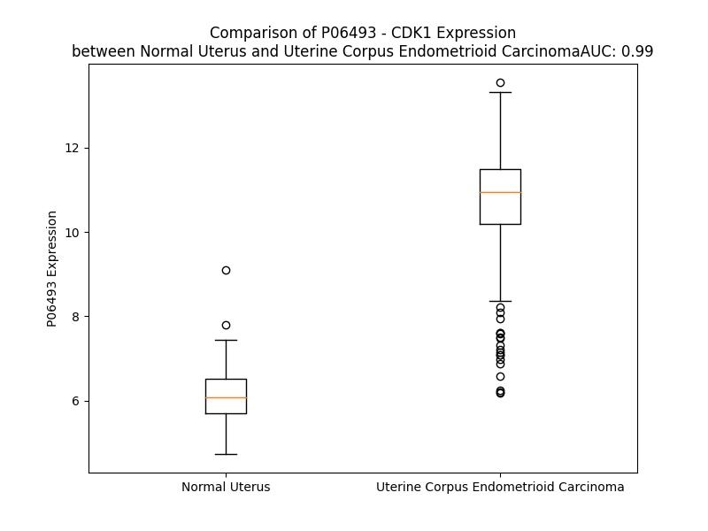

# Detailed Data for P06493

## Introduction to the Detailed Summary

### How to Interpret the Results

- **Summary & Metrics**: This section provides a quick reference to essential protein attributes, including expression changes, family classification, and biomarker applications. Regulation status (upregulated/downregulated) indicates the protein's behavior in a disease context. Some information comes from the original excel file with the proteins selected from literature, while others are derived from the analyses.
- **Expression Comparison**: A visual representation comparing protein expression between normal and disease states. It highlights significant changes in expression levels that might indicate diagnostic or therapeutic relevance. This is data coming from transcriptomics experiments and could not translate similarly to protein levels.
- **Isoform Alignment**: An interactive view of isoform alignments, revealing structural and functional differences between variants of the protein.
- **Interactors & Homologs**: Tables listing known interaction partners and homologous proteins, the more interactors and homologs, the more complex the protein is to design an antibody for.
- **Biological Assemblies**: Information about the structural arrangement of the protein in different assemblies, providing insights into its functional state but also the complexity of the protein to develop antibodies.
- **Combined Per-Residue Information**: A detailed table summarizing residue-level data. This includes predictions for epitope regions, aggregation tendencies, and modifications that might impact the protein's function. Each row corresponds to a residue in the protein, providing insights into specific sites that may be important for research or drug development.
## Summary & Metrics

- **UniProt Accession**: P06493
- **Gene Name**: CDK1
- **Protein Name**: Cyclin-dependent kinase 1
- **Swiss Prot**: CDK1_HUMAN
- **Family**: nan
- **Biomarker Application**: nan
- **Number of Isoforms**: 2
- **Regulation**: 2
- **(transcriptomics) AUC**: 1.0
- **(transcriptomics) Fold Change**: 1.83
- **(transcriptomics) Regulation**: Upregulated
- **Discotope Epitope Count**: 55
- **Max n_uniprots (Homo)**: N/A
- **Max n_uniprots (Hetero)**: 4

## Expression Comparison

## Isoform Alignment

<pre style='font-size:14px; font-family:monospace;'>P06493-1 MEDYTKIEKIGEGTYGVVYKGRHKTTGQVVAMKKIRLESEEEGVPSTAIREISLLKELRHPNIVSLQDVLMQDSRLYLIFEFLSMDLKKYLDSIPPGQYMDSSLVKSYLYQILQGIVFCHSRRVLHRDLKPQNLLIDDKGTIKLADFGLARAFGIPIRVYTHEVVTLWYRSPEVLLGSARYSTPVDIWSIGTIFAELATKKPLFHGDSEIDQLFRIFRALGTPNNEVWPEVESLQDYKNTFPKWKPGSLASHVKNLDENGLDLLSKMLIYDPAKRISGKMALNHPYFNDLDNQIKKM
P06493-2 MEDYTKIEKIGEGTYGVVYKGRHKTTGQVVAMKKIRLESEEEGVPSTAIREISLLKELRHPNIVSLQDVLMQDSRLYLIFEFLSMDLKKYLDSIPPGQYMDSSLVK---------------------------------------------------------VVTLWYRSPEVLLGSARYSTPVDIWSIGTIFAELATKKPLFHGDSEIDQLFRIFRALGTPNNEVWPEVESLQDYKNTFPKWKPGSLASHVKNLDENGLDLLSKMLIYDPAKRISGKMALNHPYFNDLDNQIKKM
</pre>

## Interactors

| preferredName_A   | preferredName_B   |   score |
|:------------------|:------------------|--------:|
| CDK1              | CCNA2             |   0.999 |
| CDK1              | CCNA1             |   0.999 |
| CDK1              | CCNL2             |   0.999 |
| CDK1              | BUB1B             |   0.999 |
| CDK1              | CDC25C            |   0.999 |
| CDK1              | CKS1B             |   0.999 |
| CDK1              | CCNB1             |   0.999 |
| CDK1              | CDC20             |   0.999 |
| CDK1              | CCNB2             |   0.999 |
| CDK1              | CKS2              |   0.999 |
| CDK1              | CDC25B            |   0.998 |
| CDK1              | CCND1             |   0.998 |
| CDK1              | WEE1              |   0.998 |
| CDK1              | CDKN1A            |   0.998 |
| CDK1              | BUB1              |   0.998 |
| CDK1              | ANAPC4            |   0.998 |
| CDK1              | AURKB             |   0.997 |
| CDK1              | GADD45A           |   0.997 |
| CDK1              | TOP2A             |   0.997 |
| CDK1              | BIRC5             |   0.997 |
| CDK1              | RB1               |   0.995 |
| CDK1              | PKMYT1            |   0.995 |
| CDK1              | ESPL1             |   0.995 |
| CDK1              | CDK2              |   0.994 |
| CDK1              | CDC25A            |   0.993 |
| CDK1              | PLK1              |   0.993 |
| CDK1              | MAD2L1            |   0.992 |
| CDK1              | FOXM1             |   0.991 |
| CDK1              | CDCA8             |   0.99  |
| CDK1              | CCNB3             |   0.989 |
| CDK1              | CENPA             |   0.989 |
| CDK1              | PBK               |   0.988 |
| CDK1              | KIF11             |   0.987 |
| CDK1              | PTTG1             |   0.985 |
| CDK1              | FZR1              |   0.983 |
| CDK1              | GADD45G           |   0.982 |
| CDK1              | UBE2C             |   0.982 |
| CDK1              | CDKN3             |   0.982 |
| CDK1              | NCAPG             |   0.981 |
| CDK1              | CCNH              |   0.981 |
| CDK1              | GADD45B           |   0.981 |
| CDK1              | CDCA5             |   0.979 |
| CDK1              | CDKN1B            |   0.978 |
| CDK1              | CENPF             |   0.978 |
| CDK1              | CDK7              |   0.976 |
| CDK1              | CENPE             |   0.973 |
| CDK1              | CDCA3             |   0.973 |
| CDK1              | RRM2              |   0.973 |
| CDK1              | CCNE1             |   0.972 |
| CDK1              | KIF2C             |   0.972 |

## Homologs

| uniprot_id   | gene_id   |
|:-------------|:----------|
| Q00537       | CDK17     |
| F8W1L8       | CDK4      |
| X6RE90       | CDK9      |
| A0A0S2Z5B6   | CDK20     |
| Q9UHL7       | CDK10     |
| H0YDJ3       | PRPF4B    |
| Q9NYV4       | CDK12     |
| F8WDP7       | CDK15     |
| A0A0A0MSJ6   | CDK18     |
| D6REC6       | CDK7      |
| H7BZI6       | CDKL4     |
| A0A087WYI9   | CDK11B    |
| Q5QPR3       | CDK11A    |
| H0YAZ9       | CDK16     |
| Q5JQZ9       | CDK19     |
| B4DX41       | CDKL3     |
| C9IYJ9       | CDK14     |
| Q00534       | CDK6      |
| A0A2R8Y4Z0   | CDK13     |
| Q92772       | CDKL2     |
| A0A9S7JKS7   | CDKL1     |
| Q00535       | CDK5      |
| A0A096LPG3   | CDKL5     |
| F5H6D4       | CDK8      |
| G3V5T9       | CDK2      |
| Q00526       | CDK3      |

## Biological Assemblies

|   Unnamed: 0 |   assembly |   n_uniprots | composition   | crystal_id   |
|-------------:|-----------:|-------------:|:--------------|:-------------|
|            0 |          1 |            3 | Hetero        | 4y72         |
|            0 |          1 |            3 | Hetero        | 6gu3         |
|            0 |          1 |            3 | Hetero        | 5lqf         |
|            1 |          2 |            3 | Hetero        | 5lqf         |
|            0 |          1 |            3 | Hetero        | 6gu2         |
|            0 |          1 |            3 | Hetero        | 5hq0         |
|            0 |          1 |            2 | Hetero        | 6twn         |
|            1 |          2 |            2 | Hetero        | 6twn         |
|            0 |          1 |            3 | Hetero        | 4yc3         |
|            0 |          1 |            2 | Hetero        | 6gu7         |
|            1 |          2 |            2 | Hetero        | 6gu7         |
|            2 |          3 |            2 | Hetero        | 6gu7         |
|            3 |          4 |            2 | Hetero        | 6gu7         |
|            0 |          1 |            4 | Hetero        | 7nj0         |
|            0 |          1 |            2 | Hetero        | 6gu6         |
|            0 |          1 |            2 | Hetero        | 4yc6         |
|            1 |          2 |            2 | Hetero        | 4yc6         |
|            2 |          3 |            2 | Hetero        | 4yc6         |
|            3 |          4 |            2 | Hetero        | 4yc6         |
|            0 |          1 |            3 | Hetero        | 6gu4         |

## Combined Per-Residue Information

|   res | aa   |   epitope_score | epitope   |   relative_surface_accessibility |   modeling_confidence |   Aggregation | modification                                         |
|------:|:-----|----------------:|:----------|---------------------------------:|----------------------:|--------------:|:-----------------------------------------------------|
|     1 | M    |         0.05958 | False     |                          0.25453 |                 74.98 |         0     | N-acetylmethionine                                   |
|     2 | E    |         0.12713 | False     |                          0.80597 |                 82.04 |         0     | N/A                                                  |
|     3 | D    |         0.13378 | False     |                          0.44482 |                 89.71 |         0     | N/A                                                  |
|     4 | Y    |         0.07407 | False     |                          0.07272 |                 93.38 |         0     | Phosphotyrosine; by PKR                              |
|     5 | T    |         0.16907 | False     |                          0.46243 |                 93.96 |         0     | N/A                                                  |
|     6 | K    |         0.17594 | False     |                          0.51105 |                 93.01 |         0     | N6-acetyllysine; alternate                           |
|     7 | I    |         0.21702 | False     |                          0.51102 |                 93.81 |         0     | N/A                                                  |
|     8 | E    |         0.2885  | True      |                          0.44065 |                 95.16 |         0     | N/A                                                  |
|     9 | K    |         0.18082 | False     |                          0.55947 |                 94.6  |         0     | N6-acetyllysine; alternate                           |
|    10 | I    |         0.23496 | False     |                          0.45484 |                 90.4  |         0     | N/A                                                  |
|    11 | G    |         0.15707 | False     |                          0.32765 |                 85.14 |         0     | N/A                                                  |
|    12 | E    |         0.20451 | False     |                          0.49951 |                 84.15 |         0     | N/A                                                  |
|    13 | G    |         0.07804 | False     |                          0.48522 |                 72.7  |         1.383 | N/A                                                  |
|    14 | T    |         0.12632 | False     |                          0.4019  |                 69.43 |        16.764 | Phosphothreonine; by PKMYT1                          |
|    15 | Y    |         0.12265 | False     |                          0.10603 |                 75.89 |        19.458 | Phosphotyrosine; by PKMYT1, WEE1, WEE2 and PKC/PRKCD |
|    16 | G    |         0.04492 | False     |                          0.01748 |                 82.81 |        19.458 | N/A                                                  |
|    17 | V    |         0.09726 | False     |                          0.176   |                 90.21 |        19.458 | N/A                                                  |
|    18 | V    |         0.03559 | False     |                          0.2285  |                 92.32 |        19.458 | N/A                                                  |
|    19 | Y    |         0.14666 | False     |                          0.1641  |                 95.36 |        15.688 | Phosphotyrosine                                      |
|    20 | K    |         0.13823 | False     |                          0.25693 |                 96.25 |         0     | N/A                                                  |
|    21 | G    |         0.00374 | False     |                          0       |                 96.36 |         0     | N/A                                                  |
|    22 | R    |         0.2616  | True      |                          0.42448 |                 97.22 |         0     | N/A                                                  |
|    23 | H    |         0.15662 | False     |                          0.19883 |                 96.4  |         0     | N/A                                                  |
|    24 | K    |         0.37167 | True      |                          0.57683 |                 94.99 |         0     | N/A                                                  |
|    25 | T    |         0.21171 | False     |                          0.83607 |                 93.96 |         0     | N/A                                                  |
|    26 | T    |         0.21661 | False     |                          0.66467 |                 95.01 |         0     | N/A                                                  |
|    27 | G    |         0.13979 | False     |                          0.35415 |                 93.9  |         0     | N/A                                                  |
|    28 | Q    |         0.21147 | False     |                          0.45067 |                 94.98 |         0     | N/A                                                  |
|    29 | V    |         0.08374 | False     |                          0.29954 |                 96.59 |         0     | N/A                                                  |
|    30 | V    |         0.0113  | False     |                          0.00381 |                 96.4  |         0     | N/A                                                  |
|    31 | A    |         0.04909 | False     |                          0.12499 |                 95.59 |         0     | N/A                                                  |
|    32 | M    |         0.01206 | False     |                          0.00431 |                 94.7  |         0     | N/A                                                  |
|    33 | K    |         0.01555 | False     |                          0.03007 |                 91.67 |         0     | N/A                                                  |
|    34 | K    |         0.11707 | False     |                          0.22902 |                 90.72 |         0     | N/A                                                  |
|    35 | I    |         0.04444 | False     |                          0.02443 |                 85.92 |         0     | N/A                                                  |
|    36 | R    |         0.31899 | True      |                          0.61847 |                 78.14 |         0     | N/A                                                  |
|    37 | L    |         0.16657 | False     |                          0.17077 |                 72.72 |         0     | N/A                                                  |
|    38 | E    |         0.29882 | True      |                          0.9674  |                 68.01 |         0     | N/A                                                  |
|    39 | S    |         0.21099 | False     |                          0.3128  |                 66.24 |         0     | Phosphoserine                                        |
|    40 | E    |         0.22875 | False     |                          0.48573 |                 62.99 |         0     | N/A                                                  |
|    41 | E    |         0.32863 | True      |                          0.88493 |                 64.3  |         0     | N/A                                                  |
|    42 | E    |         0.24467 | True      |                          0.81279 |                 65.1  |         0     | N/A                                                  |
|    43 | G    |         0.18381 | False     |                          0.18598 |                 67.88 |         0     | N/A                                                  |
|    44 | V    |         0.09978 | False     |                          0.10127 |                 71.34 |         0     | N/A                                                  |
|    45 | P    |         0.23822 | False     |                          0.60624 |                 70.47 |         0     | N/A                                                  |
|    46 | S    |         0.22822 | False     |                          0.68784 |                 73.02 |         0     | N/A                                                  |
|    47 | T    |         0.25115 | True      |                          0.66495 |                 72.83 |         0     | N/A                                                  |
|    48 | A    |         0.10006 | False     |                          0.04264 |                 74.56 |         0     | N/A                                                  |
|    49 | I    |         0.1729  | False     |                          0.26079 |                 77.73 |         0     | N/A                                                  |
|    50 | R    |         0.28058 | True      |                          0.72372 |                 77.52 |         0     | N/A                                                  |
|    51 | E    |         0.13879 | False     |                          0.31865 |                 78.62 |         0     | N/A                                                  |
|    52 | I    |         0.00824 | False     |                          0       |                 82.01 |         0     | N/A                                                  |
|    53 | S    |         0.1692  | False     |                          0.34256 |                 80.12 |         0     | N/A                                                  |
|    54 | L    |         0.16964 | False     |                          0.59319 |                 80.4  |         0     | N/A                                                  |
|    55 | L    |         0.11843 | False     |                          0.14727 |                 82.62 |         0     | N/A                                                  |
|    56 | K    |         0.20768 | False     |                          0.35772 |                 86.71 |         0     | N/A                                                  |
|    57 | E    |         0.22632 | False     |                          0.59632 |                 86.49 |         0     | N/A                                                  |
|    58 | L    |         0.05277 | False     |                          0.05859 |                 89.11 |         0     | N/A                                                  |
|    59 | R    |         0.17109 | False     |                          0.78182 |                 92.52 |         0     | N/A                                                  |
|    60 | H    |         0.07358 | False     |                          0.175   |                 94.91 |         0     | N/A                                                  |
|    61 | P    |         0.1107  | False     |                          0.37989 |                 95.64 |         0     | N/A                                                  |
|    62 | N    |         0.02056 | False     |                          0.00086 |                 96.77 |         0     | N/A                                                  |
|    63 | I    |         0.01518 | False     |                          0.01099 |                 95.58 |         0     | N/A                                                  |
|    64 | V    |         0.0198  | False     |                          0.07265 |                 95.26 |         0     | N/A                                                  |
|    65 | S    |         0.0595  | False     |                          0.31196 |                 93.33 |         0     | N/A                                                  |
|    66 | L    |         0.03777 | False     |                          0.08531 |                 92.56 |         0     | N/A                                                  |
|    67 | Q    |         0.09459 | False     |                          0.29409 |                 92.16 |         0     | N/A                                                  |
|    68 | D    |         0.12214 | False     |                          0.24736 |                 91.11 |         0     | N/A                                                  |
|    69 | V    |         0.09644 | False     |                          0.21191 |                 89.62 |         0     | N/A                                                  |
|    70 | L    |         0.07396 | False     |                          0.15992 |                 89.52 |         0     | N/A                                                  |
|    71 | M    |         0.14737 | False     |                          0.55488 |                 84.32 |         0     | N/A                                                  |
|    72 | Q    |         0.20738 | False     |                          0.37117 |                 82.74 |         0     | N/A                                                  |
|    73 | D    |         0.28148 | True      |                          0.68565 |                 80.88 |         0     | N/A                                                  |
|    74 | S    |         0.10691 | False     |                          0.37045 |                 77.08 |         0.101 | N/A                                                  |
|    75 | R    |         0.2306  | False     |                          0.33961 |                 83    |         0.995 | N/A                                                  |
|    76 | L    |         0.01287 | False     |                          0       |                 86.79 |        95.932 | N/A                                                  |
|    77 | Y    |         0.06958 | False     |                          0.09825 |                 90.22 |        96.013 | Phosphotyrosine                                      |
|    78 | L    |         0.00517 | False     |                          0.00082 |                 92.07 |        96.013 | N/A                                                  |
|    79 | I    |         0.00341 | False     |                          0       |                 93.78 |        96.013 | N/A                                                  |
|    80 | F    |         0.11274 | False     |                          0.13452 |                 94.75 |        96.013 | N/A                                                  |
|    81 | E    |         0.0697  | False     |                          0.16682 |                 94.33 |         1.516 | N/A                                                  |
|    82 | F    |         0.13656 | False     |                          0.29547 |                 95.34 |         1.505 | N/A                                                  |
|    83 | L    |         0.11227 | False     |                          0.12693 |                 95.81 |         1.364 | N/A                                                  |
|    84 | S    |         0.22655 | False     |                          0.64741 |                 90.52 |         0.593 | N/A                                                  |
|    85 | M    |         0.19772 | False     |                          0.37406 |                 95.85 |         0.562 | N/A                                                  |
|    86 | D    |         0.11557 | False     |                          0.08228 |                 96.01 |         0.527 | N/A                                                  |
|    87 | L    |         0.00596 | False     |                          0.00165 |                 97.33 |         0.527 | N/A                                                  |
|    88 | K    |         0.11488 | False     |                          0.29391 |                 95.32 |         0.527 | N/A                                                  |
|    89 | K    |         0.29998 | True      |                          0.55286 |                 95.84 |         0.52  | N/A                                                  |
|    90 | Y    |         0.28292 | True      |                          0.25382 |                 97.1  |         0.52  | N/A                                                  |
|    91 | L    |         0.03331 | False     |                          0.01237 |                 96.54 |         0.44  | N/A                                                  |
|    92 | D    |         0.27965 | True      |                          0.51653 |                 95.47 |         0     | N/A                                                  |
|    93 | S    |         0.25651 | True      |                          0.58207 |                 95.96 |         0     | N/A                                                  |
|    94 | I    |         0.20481 | False     |                          0.12702 |                 95.58 |         0     | N/A                                                  |
|    95 | P    |         0.2052  | False     |                          0.47716 |                 95.55 |         0     | N/A                                                  |
|    96 | P    |         0.27444 | True      |                          0.94516 |                 93.04 |         0     | N/A                                                  |
|    97 | G    |         0.26245 | True      |                          0.87376 |                 89.19 |         0     | N/A                                                  |
|    98 | Q    |         0.37508 | True      |                          0.52038 |                 94.39 |         0     | N/A                                                  |
|    99 | Y    |         0.16751 | False     |                          0.54247 |                 94.8  |         0     | N/A                                                  |
|   100 | M    |         0.13226 | False     |                          0.08039 |                 94.8  |         0     | N/A                                                  |
|   101 | D    |         0.26755 | True      |                          0.56366 |                 94.07 |         0     | N/A                                                  |
|   102 | S    |         0.12487 | False     |                          0.55838 |                 93.99 |         0     | N/A                                                  |
|   103 | S    |         0.10758 | False     |                          0.56035 |                 93.75 |         0     | N/A                                                  |
|   104 | L    |         0.13766 | False     |                          0.30819 |                 95.55 |         0     | N/A                                                  |
|   105 | V    |         0.0146  | False     |                          0.02475 |                 97.31 |         0     | N/A                                                  |
|   106 | K    |         0.0523  | False     |                          0.08943 |                 97.04 |         0     | N/A                                                  |
|   107 | S    |         0.08975 | False     |                          0.07855 |                 97.21 |         2.002 | N/A                                                  |
|   108 | Y    |         0.02877 | False     |                          0.02408 |                 98.35 |        18.865 | N/A                                                  |
|   109 | L    |         0.00247 | False     |                          0       |                 98.64 |        29.87  | N/A                                                  |
|   110 | Y    |         0.05268 | False     |                          0.08401 |                 98.66 |        31.597 | N/A                                                  |
|   111 | Q    |         0.02244 | False     |                          0.02698 |                 98.42 |        32.072 | N/A                                                  |
|   112 | I    |         0.00574 | False     |                          0.0056  |                 98.69 |        45.251 | N/A                                                  |
|   113 | L    |         0.00282 | False     |                          0       |                 98.73 |        46.116 | N/A                                                  |
|   114 | Q    |         0.05305 | False     |                          0.09565 |                 97.91 |        42.844 | N/A                                                  |
|   115 | G    |         0.00336 | False     |                          0       |                 96.62 |        43.764 | N/A                                                  |
|   116 | I    |         0.00423 | False     |                          0       |                 96.52 |        44.624 | N/A                                                  |
|   117 | V    |         0.08505 | False     |                          0.15374 |                 97.24 |        44.48  | N/A                                                  |
|   118 | F    |         0.15253 | False     |                          0.18332 |                 95.23 |        41.833 | N/A                                                  |
|   119 | C    |         0.00564 | False     |                          0       |                 92.58 |         8.821 | N/A                                                  |
|   120 | H    |         0.07    | False     |                          0.16299 |                 93.15 |         1.527 | N/A                                                  |
|   121 | S    |         0.21719 | False     |                          0.52651 |                 92.45 |         0     | N/A                                                  |
|   122 | R    |         0.34448 | True      |                          0.4684  |                 89.19 |         0     | N/A                                                  |
|   123 | R    |         0.24168 | False     |                          0.83151 |                 86.43 |         0     | N/A                                                  |
|   124 | V    |         0.066   | False     |                          0.19873 |                 87.04 |         0     | N/A                                                  |
|   125 | L    |         0.08036 | False     |                          0.15351 |                 87.55 |         0     | N/A                                                  |
|   126 | H    |         0.01748 | False     |                          0.02716 |                 90.09 |         0     | N/A                                                  |
|   127 | R    |         0.07769 | False     |                          0.25226 |                 86.7  |         0     | N/A                                                  |
|   128 | D    |         0.10048 | False     |                          0.18995 |                 86.77 |         0     | N/A                                                  |
|   129 | L    |         0.01844 | False     |                          0.01938 |                 92.43 |         0     | N/A                                                  |
|   130 | K    |         0.07668 | False     |                          0.15101 |                 93.26 |         0     | N/A                                                  |
|   131 | P    |         0.00547 | False     |                          0       |                 95.63 |         0     | N/A                                                  |
|   132 | Q    |         0.10415 | False     |                          0.36155 |                 92.85 |         0     | N/A                                                  |
|   133 | N    |         0.07324 | False     |                          0.06071 |                 92.85 |         0     | N/A                                                  |
|   134 | L    |         0.0027  | False     |                          0.00082 |                 97.13 |         0     | N/A                                                  |
|   135 | L    |         0.02454 | False     |                          0.19455 |                 97.42 |         0     | N/A                                                  |
|   136 | I    |         0.07403 | False     |                          0.06932 |                 97.92 |         0     | N/A                                                  |
|   137 | D    |         0.04623 | False     |                          0.207   |                 95.11 |         0     | N/A                                                  |
|   138 | D    |         0.20054 | False     |                          0.89131 |                 92    |         0     | N/A                                                  |
|   139 | K    |         0.16848 | False     |                          0.87079 |                 91.59 |         0     | N/A                                                  |
|   140 | G    |         0.13762 | False     |                          0.37504 |                 91.35 |         0     | N/A                                                  |
|   141 | T    |         0.03973 | False     |                          0.10489 |                 95.97 |         0     | Phosphothreonine                                     |
|   142 | I    |         0.01644 | False     |                          0.00523 |                 97.92 |         0     | N/A                                                  |
|   143 | K    |         0.04038 | False     |                          0.12554 |                 97.89 |         0     | N/A                                                  |
|   144 | L    |         0.00573 | False     |                          0.00495 |                 96.48 |         0     | N/A                                                  |
|   145 | A    |         0.01991 | False     |                          0.08545 |                 92.15 |         0     | N/A                                                  |
|   146 | D    |         0.09926 | False     |                          0.23296 |                 81.7  |         0     | N/A                                                  |
|   147 | F    |         0.04935 | False     |                          0.07342 |                 75.45 |         0     | N/A                                                  |
|   148 | G    |         0.06406 | False     |                          0.0992  |                 62.7  |         0     | N/A                                                  |
|   149 | L    |         0.0321  | False     |                          0.0099  |                 64.22 |         0     | N/A                                                  |
|   150 | A    |         0.06754 | False     |                          0.08417 |                 59.86 |         0     | N/A                                                  |
|   151 | R    |         0.32206 | True      |                          0.56207 |                 63.41 |         0     | N/A                                                  |
|   152 | A    |         0.05927 | False     |                          0.09814 |                 58.81 |         0     | N/A                                                  |
|   153 | F    |         0.14339 | False     |                          0.2161  |                 58.53 |         0     | N/A                                                  |
|   154 | G    |         0.14655 | False     |                          0.71885 |                 55.54 |         0     | N/A                                                  |
|   155 | I    |         0.19753 | False     |                          0.24994 |                 53.61 |         0     | N/A                                                  |
|   156 | P    |         0.25976 | True      |                          0.65557 |                 47.52 |         0     | N/A                                                  |
|   157 | I    |         0.09736 | False     |                          0.17849 |                 50.3  |         0.069 | N/A                                                  |
|   158 | R    |         0.20795 | False     |                          0.2822  |                 49.82 |         0.074 | N/A                                                  |
|   159 | V    |         0.14383 | False     |                          0.3539  |                 45.3  |         0.08  | N/A                                                  |
|   160 | Y    |         0.27035 | True      |                          0.85588 |                 42.03 |         0.08  | N/A                                                  |
|   161 | T    |         0.24721 | True      |                          0.44996 |                 38.26 |         0.08  | Phosphothreonine; by CAK                             |
|   162 | H    |         0.26134 | True      |                          1.01832 |                 39.9  |         0.08  | N/A                                                  |
|   163 | E    |         0.21914 | False     |                          0.62329 |                 42.29 |         0.103 | N/A                                                  |
|   164 | V    |         0.17601 | False     |                          0.90655 |                 45.2  |        88.948 | N/A                                                  |
|   165 | V    |         0.1119  | False     |                          0.26037 |                 53.12 |        96.361 | N/A                                                  |
|   166 | T    |         0.10772 | False     |                          0.26221 |                 65.12 |        96.361 | N/A                                                  |
|   167 | L    |         0.11059 | False     |                          0.12884 |                 87.05 |        96.361 | N/A                                                  |
|   168 | W    |         0.08938 | False     |                          0.34216 |                 94.93 |        96.361 | N/A                                                  |
|   169 | Y    |         0.08526 | False     |                          0.0321  |                 95.26 |        85.489 | N/A                                                  |
|   170 | R    |         0.06563 | False     |                          0.15267 |                 93.22 |         0.029 | N/A                                                  |
|   171 | S    |         0.02587 | False     |                          0.01429 |                 95.24 |         0     | N/A                                                  |
|   172 | P    |         0.00307 | False     |                          0       |                 96.15 |         0     | N/A                                                  |
|   173 | E    |         0.05569 | False     |                          0.01706 |                 95.05 |         0     | N/A                                                  |
|   174 | V    |         0.06134 | False     |                          0.07323 |                 91.6  |         1.247 | N/A                                                  |
|   175 | L    |         0.02476 | False     |                          0.01462 |                 93.21 |         1.247 | N/A                                                  |
|   176 | L    |         0.00913 | False     |                          0       |                 94.9  |         1.247 | N/A                                                  |
|   177 | G    |         0.11274 | False     |                          0.10567 |                 89.23 |         1.247 | N/A                                                  |
|   178 | S    |         0.36626 | True      |                          0.18994 |                 88.22 |         1.247 | Phosphoserine                                        |
|   179 | A    |         0.29849 | True      |                          0.9552  |                 77.69 |         0.569 | N/A                                                  |
|   180 | R    |         0.33477 | True      |                          0.86918 |                 78.55 |         0     | N/A                                                  |
|   181 | Y    |         0.26201 | True      |                          0.33719 |                 80.07 |         0     | N/A                                                  |
|   182 | S    |         0.15065 | False     |                          0.47449 |                 88    |         0     | N/A                                                  |
|   183 | T    |         0.09381 | False     |                          0.34519 |                 92.83 |         0     | N/A                                                  |
|   184 | P    |         0.0653  | False     |                          0.15082 |                 96.39 |         0     | N/A                                                  |
|   185 | V    |         0.02047 | False     |                          0.06765 |                 94.27 |         0     | N/A                                                  |
|   186 | D    |         0.00716 | False     |                          0.00267 |                 95.37 |         0     | N/A                                                  |
|   187 | I    |         0.014   | False     |                          0.0128  |                 98.63 |         7.185 | N/A                                                  |
|   188 | W    |         0.00369 | False     |                          0       |                 98.42 |         7.739 | N/A                                                  |
|   189 | S    |         0.06041 | False     |                          0.05851 |                 97.34 |         8.107 | N/A                                                  |
|   190 | I    |         0.00223 | False     |                          0       |                 98.76 |        11.072 | N/A                                                  |
|   191 | G    |         0.00295 | False     |                          0       |                 98.75 |        11.197 | N/A                                                  |
|   192 | T    |         0.01785 | False     |                          0.00476 |                 98.29 |        11.197 | N/A                                                  |
|   193 | I    |         0.01077 | False     |                          0.00219 |                 98.52 |        11.197 | N/A                                                  |
|   194 | F    |         0.00464 | False     |                          0       |                 98.65 |        10.461 | N/A                                                  |
|   195 | A    |         0.00637 | False     |                          0.00383 |                 98.28 |         5.073 | N/A                                                  |
|   196 | E    |         0.02023 | False     |                          0.00567 |                 97.31 |         0.392 | N/A                                                  |
|   197 | L    |         0.00832 | False     |                          0.00548 |                 98.28 |         0.392 | N/A                                                  |
|   198 | A    |         0.01391 | False     |                          0.02606 |                 97.04 |         0.392 | N/A                                                  |
|   199 | T    |         0.13438 | False     |                          0.15584 |                 95.43 |         0.392 | N/A                                                  |
|   200 | K    |         0.20554 | False     |                          0.25562 |                 94.65 |         0.392 | N/A                                                  |
|   201 | K    |         0.20679 | False     |                          0.72199 |                 93.2  |         0     | N/A                                                  |
|   202 | P    |         0.10337 | False     |                          0.212   |                 94.94 |         0     | N/A                                                  |
|   203 | L    |         0.08478 | False     |                          0.14299 |                 96.11 |         0     | N/A                                                  |
|   204 | F    |         0.03476 | False     |                          0.01402 |                 95.67 |         0     | N/A                                                  |
|   205 | H    |         0.21275 | False     |                          0.53158 |                 93.24 |         0     | N/A                                                  |
|   206 | G    |         0.08437 | False     |                          0.03705 |                 93.07 |         0     | N/A                                                  |
|   207 | D    |         0.27082 | True      |                          0.70384 |                 89.81 |         0     | N/A                                                  |
|   208 | S    |         0.27463 | True      |                          0.31949 |                 90.98 |         0     | N/A                                                  |
|   209 | E    |         0.11811 | False     |                          0.37482 |                 90.5  |         0     | N/A                                                  |
|   210 | I    |         0.40993 | True      |                          0.47544 |                 93.01 |         0.32  | N/A                                                  |
|   211 | D    |         0.24813 | True      |                          0.19581 |                 94.25 |         0.32  | N/A                                                  |
|   212 | Q    |         0.00531 | False     |                          0       |                 95.17 |         0.32  | N/A                                                  |
|   213 | L    |         0.06607 | False     |                          0.03545 |                 96.26 |         0.32  | N/A                                                  |
|   214 | F    |         0.3243  | True      |                          0.24578 |                 95.78 |         0.32  | N/A                                                  |
|   215 | R    |         0.18443 | False     |                          0.27597 |                 95.1  |         0.32  | N/A                                                  |
|   216 | I    |         0.00629 | False     |                          0       |                 97.03 |         0.32  | N/A                                                  |
|   217 | F    |         0.01777 | False     |                          0       |                 96.59 |         0.32  | N/A                                                  |
|   218 | R    |         0.37317 | True      |                          0.575   |                 93.87 |         0     | N/A                                                  |
|   219 | A    |         0.01643 | False     |                          0.0051  |                 94.08 |         0     | N/A                                                  |
|   220 | L    |         0.13051 | False     |                          0.20072 |                 96.15 |         0     | N/A                                                  |
|   221 | G    |         0.03425 | False     |                          0.02847 |                 96.05 |         0     | N/A                                                  |
|   222 | T    |         0.07023 | False     |                          0.13389 |                 97.35 |         0     | Phosphothreonine                                     |
|   223 | P    |         0.0524  | False     |                          0.01262 |                 96.97 |         0     | N/A                                                  |
|   224 | N    |         0.21904 | False     |                          0.33157 |                 95.52 |         0     | N/A                                                  |
|   225 | N    |         0.30641 | True      |                          0.43366 |                 96.54 |         0     | N/A                                                  |
|   226 | E    |         0.36502 | True      |                          0.75902 |                 95.45 |         0     | N/A                                                  |
|   227 | V    |         0.29178 | True      |                          0.53424 |                 95.21 |         0     | N/A                                                  |
|   228 | W    |         0.21788 | False     |                          0.06868 |                 96.26 |         0     | N/A                                                  |
|   229 | P    |         0.26443 | True      |                          0.50171 |                 96.04 |         0     | N/A                                                  |
|   230 | E    |         0.34987 | True      |                          0.67634 |                 93.31 |         0     | N/A                                                  |
|   231 | V    |         0.01629 | False     |                          0       |                 95.9  |         0     | N/A                                                  |
|   232 | E    |         0.28657 | True      |                          0.35883 |                 96.22 |         0     | N/A                                                  |
|   233 | S    |         0.45742 | True      |                          0.74411 |                 94.44 |         0     | N/A                                                  |
|   234 | L    |         0.22252 | False     |                          0.20792 |                 94.33 |         0     | N/A                                                  |
|   235 | Q    |         0.3618  | True      |                          0.64701 |                 93.07 |         0     | N/A                                                  |
|   236 | D    |         0.18911 | False     |                          0.25514 |                 93.95 |         0     | N/A                                                  |
|   237 | Y    |         0.1432  | False     |                          0.05898 |                 96.18 |         0     | N/A                                                  |
|   238 | K    |         0.41295 | True      |                          0.48298 |                 95.48 |         0     | N/A                                                  |
|   239 | N    |         0.34536 | True      |                          0.70389 |                 91.48 |         0     | N/A                                                  |
|   240 | T    |         0.39239 | True      |                          0.88443 |                 94.28 |         0     | N/A                                                  |
|   241 | F    |         0.20132 | False     |                          0.06358 |                 95.12 |         0     | N/A                                                  |
|   242 | P    |         0.29034 | True      |                          0.44733 |                 95.83 |         0     | N/A                                                  |
|   243 | K    |         0.31088 | True      |                          0.60368 |                 94.96 |         0     | N/A                                                  |
|   244 | W    |         0.22674 | False     |                          0.28909 |                 95.6  |         0     | N/A                                                  |
|   245 | K    |         0.15997 | False     |                          0.88658 |                 93    |         0     | N6-succinyllysine                                    |
|   246 | P    |         0.25024 | True      |                          0.8059  |                 85.97 |         0     | N/A                                                  |
|   247 | G    |         0.16336 | False     |                          0.45519 |                 82.45 |         0     | N/A                                                  |
|   248 | S    |         0.24545 | True      |                          0.5184  |                 85.85 |         0     | Phosphoserine                                        |
|   249 | L    |         0.08155 | False     |                          0.11098 |                 88.37 |         0     | N/A                                                  |
|   250 | A    |         0.16702 | False     |                          0.41941 |                 89.6  |         0     | N/A                                                  |
|   251 | S    |         0.27239 | True      |                          0.49378 |                 89.06 |         0     | N/A                                                  |
|   252 | H    |         0.18552 | False     |                          0.46064 |                 88.22 |         0     | N/A                                                  |
|   253 | V    |         0.01952 | False     |                          0.00447 |                 91.56 |         0     | N/A                                                  |
|   254 | K    |         0.26229 | True      |                          0.82762 |                 87.84 |         0     | N/A                                                  |
|   255 | N    |         0.19023 | False     |                          0.35695 |                 89.66 |         0     | N/A                                                  |
|   256 | L    |         0.08477 | False     |                          0.11732 |                 94.08 |         0     | N/A                                                  |
|   257 | D    |         0.1395  | False     |                          0.46816 |                 94.46 |         0     | N/A                                                  |
|   258 | E    |         0.16874 | False     |                          0.79562 |                 95.7  |         0     | N/A                                                  |
|   259 | N    |         0.13243 | False     |                          0.4123  |                 97.94 |         0     | N/A                                                  |
|   260 | G    |         0.00744 | False     |                          0       |                 98.03 |         0     | N/A                                                  |
|   261 | L    |         0.11833 | False     |                          0.23553 |                 97.54 |         0.148 | N/A                                                  |
|   262 | D    |         0.17644 | False     |                          0.35023 |                 98.01 |         0.148 | N/A                                                  |
|   263 | L    |         0.00279 | False     |                          0       |                 98.78 |         0.148 | N/A                                                  |
|   264 | L    |         0.00289 | False     |                          0       |                 98.59 |         0.148 | N/A                                                  |
|   265 | S    |         0.08887 | False     |                          0.38503 |                 97.63 |         0.148 | N/A                                                  |
|   266 | K    |         0.14296 | False     |                          0.35581 |                 98.69 |         0.148 | N/A                                                  |
|   267 | M    |         0.0164  | False     |                          0       |                 98.79 |         0.148 | N/A                                                  |
|   268 | L    |         0.01475 | False     |                          0.03294 |                 98.21 |         0.148 | N/A                                                  |
|   269 | I    |         0.11507 | False     |                          0.32879 |                 97.94 |         0.148 | N/A                                                  |
|   270 | Y    |         0.04166 | False     |                          0.04019 |                 97.58 |         0.148 | N/A                                                  |
|   271 | D    |         0.12666 | False     |                          0.06574 |                 96.95 |         0     | N/A                                                  |
|   272 | P    |         0.11326 | False     |                          0.23822 |                 96.52 |         0     | N/A                                                  |
|   273 | A    |         0.28202 | True      |                          0.91878 |                 95.46 |         0     | N/A                                                  |
|   274 | K    |         0.22709 | False     |                          0.5701  |                 97.74 |         0     | N/A                                                  |
|   275 | R    |         0.16989 | False     |                          0.05037 |                 98.18 |         0     | N/A                                                  |
|   276 | I    |         0.18459 | False     |                          0.07401 |                 98.66 |         0     | N/A                                                  |
|   277 | S    |         0.16972 | False     |                          0.3819  |                 98.22 |         0     | N/A                                                  |
|   278 | G    |         0.03459 | False     |                          0.03801 |                 98.05 |         0     | N/A                                                  |
|   279 | K    |         0.16645 | False     |                          0.63457 |                 97.47 |         0     | N/A                                                  |
|   280 | M    |         0.24565 | True      |                          0.67795 |                 98.45 |         0     | N/A                                                  |
|   281 | A    |         0.00516 | False     |                          0       |                 98.73 |         0     | N/A                                                  |
|   282 | L    |         0.11199 | False     |                          0.18871 |                 97.97 |         0     | N/A                                                  |
|   283 | N    |         0.22094 | False     |                          0.78884 |                 97.28 |         0     | N/A                                                  |
|   284 | H    |         0.08075 | False     |                          0.06256 |                 98.67 |         0     | N/A                                                  |
|   285 | P    |         0.12706 | False     |                          0.50153 |                 98.22 |         0     | N/A                                                  |
|   286 | Y    |         0.02586 | False     |                          0.02796 |                 98.21 |         0     | N/A                                                  |
|   287 | F    |         0.02004 | False     |                          0.01604 |                 98.02 |         0     | N/A                                                  |
|   288 | N    |         0.30632 | True      |                          0.7266  |                 95.51 |         0     | N/A                                                  |
|   289 | D    |         0.15177 | False     |                          0.68799 |                 93.77 |         0     | N/A                                                  |
|   290 | L    |         0.16295 | False     |                          0.07935 |                 93.37 |         0     | N/A                                                  |
|   291 | D    |         0.29661 | True      |                          0.48509 |                 87.45 |         0     | N/A                                                  |
|   292 | N    |         0.23396 | False     |                          0.60262 |                 83.79 |         0     | N/A                                                  |
|   293 | Q    |         0.20096 | False     |                          0.70961 |                 82.71 |         0     | N/A                                                  |
|   294 | I    |         0.16188 | False     |                          0.20479 |                 81.71 |         0     | N/A                                                  |
|   295 | K    |         0.15729 | False     |                          0.30251 |                 83.83 |         0     | N/A                                                  |
|   296 | K    |         0.15815 | False     |                          0.84055 |                 79.46 |         0     | N/A                                                  |
|   297 | M    |         0.13692 | False     |                          0.47907 |                 71.48 |         0     | N/A                                                  |

