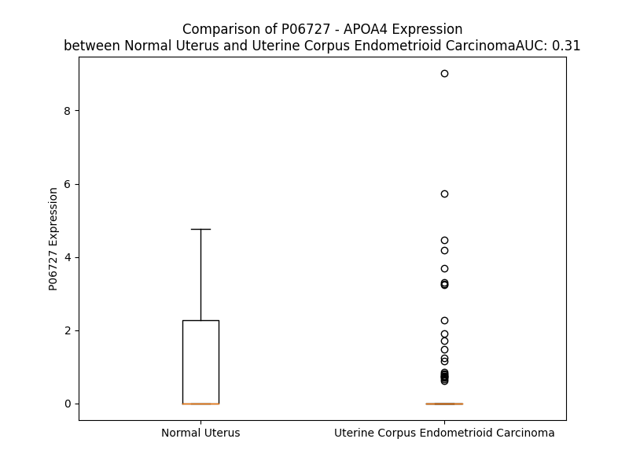

# Detailed Data for P06727

## Introduction to the Detailed Summary

### How to Interpret the Results

- **Summary & Metrics**: This section provides a quick reference to essential protein attributes, including expression changes, family classification, and biomarker applications. Regulation status (upregulated/downregulated) indicates the protein's behavior in a disease context. Some information comes from the original excel file with the proteins selected from literature, while others are derived from the analyses.
- **Expression Comparison**: A visual representation comparing protein expression between normal and disease states. It highlights significant changes in expression levels that might indicate diagnostic or therapeutic relevance. This is data coming from transcriptomics experiments and could not translate similarly to protein levels.
- **Isoform Alignment**: An interactive view of isoform alignments, revealing structural and functional differences between variants of the protein.
- **Interactors & Homologs**: Tables listing known interaction partners and homologous proteins, the more interactors and homologs, the more complex the protein is to design an antibody for.
- **Biological Assemblies**: Information about the structural arrangement of the protein in different assemblies, providing insights into its functional state but also the complexity of the protein to develop antibodies.
- **Combined Per-Residue Information**: A detailed table summarizing residue-level data. This includes predictions for epitope regions, aggregation tendencies, and modifications that might impact the protein's function. Each row corresponds to a residue in the protein, providing insights into specific sites that may be important for research or drug development.
## Summary & Metrics

- **UniProt Accession**: P06727
- **Gene Name**: APOA4
- **Protein Name**: apolipoprotein A-IV precursor
- **Swiss Prot**: APOA4_HUMAN
- **Family**: transporter
- **Biomarker Application**: unspecified application
- **Number of Isoforms**: 0
- **Regulation**: -1
- **(transcriptomics) AUC**: 0.31
- **(transcriptomics) Fold Change**: 4.38
- **(transcriptomics) Regulation**: Downregulated
- **Discotope Epitope Count**: 48
- **Max n_uniprots (Homo)**: 2
- **Max n_uniprots (Hetero)**: N/A

## Expression Comparison

## Interactors

| preferredName_A   | preferredName_B   |   score |
|:------------------|:------------------|--------:|
| APOA4             | APOC3             |   0.999 |
| APOA4             | APOE              |   0.995 |
| APOA4             | APOA2             |   0.994 |
| APOA4             | APOB              |   0.992 |
| APOA4             | APOA1             |   0.989 |
| APOA4             | APOC2             |   0.987 |
| APOA4             | CLU               |   0.976 |
| APOA4             | APOC1             |   0.969 |
| APOA4             | APOM              |   0.949 |
| APOA4             | APOH              |   0.938 |
| APOA4             | CETP              |   0.937 |
| APOA4             | APOL1             |   0.928 |
| APOA4             | PON1              |   0.927 |
| APOA4             | APOA5             |   0.918 |
| APOA4             | APOF              |   0.909 |

## Homologs

| uniprot_id   | gene_id   |
|:-------------|:----------|
| A0A0B4RUS7   | APOA5     |
| E7ERP7       | APOE      |
| P02647       | APOA1     |

## Biological Assemblies

|   Unnamed: 0 |   assembly |   n_uniprots | composition   | crystal_id   |
|-------------:|-----------:|-------------:|:--------------|:-------------|
|            0 |          1 |            2 | Homo          | 3s84         |

## Combined Per-Residue Information

|   res | aa   |   epitope_score | epitope   |   relative_surface_accessibility |   modeling_confidence |   Aggregation | modification   |
|------:|:-----|----------------:|:----------|---------------------------------:|----------------------:|--------------:|:---------------|
|     1 | M    |         0.06407 | False     |                          1.14434 |                 47.1  |         0     | N/A            |
|     2 | F    |         0.08768 | False     |                          0.8949  |                 51.01 |         0     | N/A            |
|     3 | L    |         0.04555 | False     |                          0.73703 |                 43.85 |         0     | N/A            |
|     4 | K    |         0.08601 | False     |                          0.7786  |                 46.68 |         0     | N/A            |
|     5 | A    |         0.04881 | False     |                          0.46793 |                 56.14 |        40.069 | N/A            |
|     6 | V    |         0.02506 | False     |                          0.46556 |                 58.56 |        87.453 | N/A            |
|     7 | V    |         0.05553 | False     |                          0.66306 |                 58.13 |        98.474 | N/A            |
|     8 | L    |         0.07381 | False     |                          0.66092 |                 54.81 |        99.409 | N/A            |
|     9 | T    |         0.04446 | False     |                          0.56732 |                 56.2  |        99.58  | N/A            |
|    10 | L    |         0.03713 | False     |                          0.61769 |                 55.34 |        99.846 | N/A            |
|    11 | A    |         0.04139 | False     |                          0.47529 |                 56.15 |        99.817 | N/A            |
|    12 | L    |         0.05833 | False     |                          0.69763 |                 53.21 |        99.77  | N/A            |
|    13 | V    |         0.03817 | False     |                          0.597   |                 54.41 |        99.366 | N/A            |
|    14 | A    |         0.05188 | False     |                          0.83561 |                 53.82 |        94.591 | N/A            |
|    15 | V    |         0.09925 | False     |                          0.92344 |                 51.92 |        90.541 | N/A            |
|    16 | A    |         0.09886 | False     |                          0.59191 |                 45.16 |        42.844 | N/A            |
|    17 | G    |         0.13817 | False     |                          1.0754  |                 35.34 |         2.482 | N/A            |
|    18 | A    |         0.09298 | False     |                          0.75175 |                 40.09 |         1.158 | N/A            |
|    19 | R    |         0.17136 | True      |                          1.03056 |                 39.98 |         0.037 | N/A            |
|    20 | A    |         0.09665 | False     |                          0.73133 |                 47.91 |         0.037 | N/A            |
|    21 | E    |         0.11724 | False     |                          0.89992 |                 43.81 |         0.037 | N/A            |
|    22 | V    |         0.06597 | False     |                          0.48714 |                 49.93 |         0.035 | N/A            |
|    23 | S    |         0.12637 | False     |                          0.38547 |                 57.05 |         0.011 | N/A            |
|    24 | A    |         0.08923 | False     |                          0.83517 |                 59.54 |         0     | N/A            |
|    25 | D    |         0.0986  | False     |                          0.66272 |                 67.76 |         0     | N/A            |
|    26 | Q    |         0.09169 | False     |                          0.50969 |                 63.66 |         0     | N/A            |
|    27 | V    |         0.04258 | False     |                          0.46461 |                 61.45 |         3.338 | N/A            |
|    28 | A    |         0.0454  | False     |                          0.54045 |                 68.76 |         3.962 | N/A            |
|    29 | T    |         0.18159 | True      |                          0.55232 |                 73.12 |         3.962 | N/A            |
|    30 | V    |         0.04801 | False     |                          0.60895 |                 67.51 |         3.962 | N/A            |
|    31 | M    |         0.08406 | False     |                          0.58716 |                 64.22 |         3.962 | N/A            |
|    32 | W    |         0.13882 | False     |                          0.82143 |                 74.53 |         3.306 | N/A            |
|    33 | D    |         0.0975  | False     |                          0.55663 |                 73.46 |         0     | N/A            |
|    34 | Y    |         0.04875 | False     |                          0.5082  |                 67.83 |         0     | N/A            |
|    35 | F    |         0.07457 | False     |                          0.64321 |                 67.71 |         0     | N/A            |
|    36 | S    |         0.08297 | False     |                          0.30159 |                 72.89 |         0     | N/A            |
|    37 | Q    |         0.09591 | False     |                          0.63516 |                 70.62 |         0     | N/A            |
|    38 | L    |         0.06131 | False     |                          0.60588 |                 69.52 |         0     | N/A            |
|    39 | S    |         0.09117 | False     |                          0.53007 |                 67.1  |         0     | N/A            |
|    40 | N    |         0.08819 | False     |                          0.58992 |                 69.41 |         0     | N/A            |
|    41 | N    |         0.04686 | False     |                          0.59533 |                 66.25 |         0     | N/A            |
|    42 | A    |         0.04059 | False     |                          0.49593 |                 61.52 |         0     | N/A            |
|    43 | K    |         0.08502 | False     |                          0.67318 |                 57.97 |         0     | N/A            |
|    44 | E    |         0.06672 | False     |                          0.67721 |                 60.51 |         0     | N/A            |
|    45 | A    |         0.04547 | False     |                          0.50859 |                 61.19 |         0     | N/A            |
|    46 | V    |         0.05917 | False     |                          0.58312 |                 58.29 |         0     | N/A            |
|    47 | E    |         0.08919 | False     |                          0.63859 |                 58.81 |         0     | N/A            |
|    48 | H    |         0.10708 | False     |                          0.93333 |                 55.95 |         0     | N/A            |
|    49 | L    |         0.04659 | False     |                          0.32142 |                 54.58 |         0     | N/A            |
|    50 | Q    |         0.17596 | True      |                          0.68967 |                 53.63 |         0     | N/A            |
|    51 | K    |         0.14693 | False     |                          0.98504 |                 52.9  |         0     | N/A            |
|    52 | S    |         0.0753  | False     |                          0.47753 |                 55.99 |         0     | N/A            |
|    53 | E    |         0.12494 | False     |                          0.83888 |                 55.62 |         0     | N/A            |
|    54 | L    |         0.08097 | False     |                          0.45662 |                 52.81 |         0     | N/A            |
|    55 | T    |         0.04772 | False     |                          0.49232 |                 51.21 |         0     | N/A            |
|    56 | Q    |         0.0833  | False     |                          0.77075 |                 58.13 |         0     | N/A            |
|    57 | Q    |         0.07583 | False     |                          0.65537 |                 59.23 |         0     | N/A            |
|    58 | L    |         0.03945 | False     |                          0.28005 |                 57.22 |         0.279 | N/A            |
|    59 | N    |         0.05124 | False     |                          0.66699 |                 57.39 |         0.279 | N/A            |
|    60 | A    |         0.06537 | False     |                          0.63726 |                 66.13 |         0.279 | N/A            |
|    61 | L    |         0.05494 | False     |                          0.65961 |                 66.39 |         0.279 | N/A            |
|    62 | F    |         0.03259 | False     |                          0.57664 |                 60.09 |         0.279 | N/A            |
|    63 | Q    |         0.07599 | False     |                          0.69792 |                 68.11 |         0     | N/A            |
|    64 | D    |         0.04695 | False     |                          0.52589 |                 72.48 |         0     | N/A            |
|    65 | K    |         0.04338 | False     |                          0.44494 |                 64.41 |         0     | N/A            |
|    66 | L    |         0.02175 | False     |                          0.59708 |                 67.26 |         0     | N/A            |
|    67 | G    |         0.02363 | False     |                          0.4278  |                 72.32 |         0     | N/A            |
|    68 | E    |         0.03001 | False     |                          0.43796 |                 72.09 |         0     | N/A            |
|    69 | V    |         0.02195 | False     |                          0.61264 |                 66.47 |         0     | N/A            |
|    70 | N    |         0.03047 | False     |                          0.66647 |                 68.7  |         0     | N/A            |
|    71 | T    |         0.04205 | False     |                          0.6261  |                 76.69 |         0     | N/A            |
|    72 | Y    |         0.0399  | False     |                          0.68842 |                 70.21 |         0     | N/A            |
|    73 | A    |         0.02939 | False     |                          0.46848 |                 67.17 |         0     | N/A            |
|    74 | G    |         0.02163 | False     |                          0.29319 |                 74.52 |         0     | N/A            |
|    75 | D    |         0.0529  | False     |                          0.41451 |                 76.43 |         0     | N/A            |
|    76 | L    |         0.03144 | False     |                          0.47472 |                 70.99 |         0     | N/A            |
|    77 | Q    |         0.04003 | False     |                          0.5944  |                 71.56 |         0     | N/A            |
|    78 | K    |         0.04259 | False     |                          0.73192 |                 76.33 |         0     | N/A            |
|    79 | K    |         0.07518 | False     |                          0.73493 |                 76.31 |         0     | N/A            |
|    80 | L    |         0.07547 | False     |                          0.53905 |                 70.36 |         0     | N/A            |
|    81 | V    |         0.03572 | False     |                          0.64426 |                 76.67 |         0     | N/A            |
|    82 | P    |         0.13716 | False     |                          0.55024 |                 80.68 |         0     | N/A            |
|    83 | F    |         0.03327 | False     |                          0.56462 |                 77.74 |         0     | N/A            |
|    84 | A    |         0.02334 | False     |                          0.54689 |                 72.23 |         0     | N/A            |
|    85 | T    |         0.02727 | False     |                          0.50273 |                 80.59 |         0     | N/A            |
|    86 | E    |         0.01872 | False     |                          0.41209 |                 81.09 |         0     | N/A            |
|    87 | L    |         0.02744 | False     |                          0.45705 |                 78.62 |         0     | N/A            |
|    88 | H    |         0.02999 | False     |                          0.71375 |                 75.46 |         0     | N/A            |
|    89 | E    |         0.03354 | False     |                          0.57836 |                 81.82 |         0     | N/A            |
|    90 | R    |         0.04107 | False     |                          0.56152 |                 81.04 |         0     | N/A            |
|    91 | L    |         0.02165 | False     |                          0.69136 |                 79.2  |         0     | N/A            |
|    92 | A    |         0.02004 | False     |                          0.47078 |                 83.01 |         0     | N/A            |
|    93 | K    |         0.03845 | False     |                          0.7631  |                 86.27 |         0     | N/A            |
|    94 | D    |         0.02502 | False     |                          0.51451 |                 85.98 |         0     | N/A            |
|    95 | S    |         0.01201 | False     |                          0.52005 |                 79.57 |         0     | N/A            |
|    96 | E    |         0.01663 | False     |                          0.46624 |                 86.94 |         0     | N/A            |
|    97 | K    |         0.03493 | False     |                          0.58402 |                 87.45 |         0     | N/A            |
|    98 | L    |         0.02573 | False     |                          0.62781 |                 86.2  |         0     | N/A            |
|    99 | K    |         0.02334 | False     |                          0.64396 |                 86.57 |         0     | N/A            |
|   100 | E    |         0.01771 | False     |                          0.62461 |                 89.93 |         0     | N/A            |
|   101 | E    |         0.02216 | False     |                          0.3993  |                 88.44 |         0     | N/A            |
|   102 | I    |         0.02341 | False     |                          0.6179  |                 87.81 |         0     | N/A            |
|   103 | G    |         0.01433 | False     |                          0.34953 |                 89.76 |         0     | N/A            |
|   104 | K    |         0.02766 | False     |                          0.64698 |                 90.52 |         0     | N/A            |
|   105 | E    |         0.01703 | False     |                          0.63208 |                 90.82 |         0     | N/A            |
|   106 | L    |         0.02387 | False     |                          0.69473 |                 89.49 |         0     | N/A            |
|   107 | E    |         0.02802 | False     |                          0.47495 |                 89.39 |         0     | N/A            |
|   108 | E    |         0.03722 | False     |                          0.36727 |                 91.54 |         0     | N/A            |
|   109 | L    |         0.03377 | False     |                          0.55244 |                 90.46 |         0     | N/A            |
|   110 | R    |         0.06034 | False     |                          0.603   |                 89.14 |         0     | N/A            |
|   111 | A    |         0.06545 | False     |                          0.59992 |                 89.1  |         0     | N/A            |
|   112 | R    |         0.11163 | False     |                          0.71285 |                 89.3  |         0     | N/A            |
|   113 | L    |         0.08128 | False     |                          0.36506 |                 90.11 |         0     | N/A            |
|   114 | L    |         0.10241 | False     |                          0.73379 |                 85.25 |         0     | N/A            |
|   115 | P    |         0.14351 | False     |                          0.80148 |                 90.46 |         0     | N/A            |
|   116 | H    |         0.16464 | True      |                          0.49851 |                 91.31 |         0     | N/A            |
|   117 | A    |         0.08264 | False     |                          0.45209 |                 86.44 |         0     | N/A            |
|   118 | N    |         0.15291 | False     |                          0.8319  |                 87.37 |         0     | N/A            |
|   119 | E    |         0.13831 | False     |                          0.49532 |                 90.05 |         0     | N/A            |
|   120 | V    |         0.03836 | False     |                          0.25515 |                 90.61 |         0     | N/A            |
|   121 | S    |         0.06137 | False     |                          0.56334 |                 90.14 |         0     | N/A            |
|   122 | Q    |         0.12931 | False     |                          0.59186 |                 92.01 |         0     | N/A            |
|   123 | K    |         0.1017  | False     |                          0.67695 |                 90.66 |         0     | N/A            |
|   124 | I    |         0.03906 | False     |                          0.66651 |                 91.7  |         0     | N/A            |
|   125 | G    |         0.03472 | False     |                          0.32574 |                 92.45 |         0     | N/A            |
|   126 | D    |         0.05932 | False     |                          0.35202 |                 93.29 |         0     | N/A            |
|   127 | N    |         0.02814 | False     |                          0.59858 |                 91.79 |         0     | N/A            |
|   128 | L    |         0.04122 | False     |                          0.60355 |                 92.15 |         0     | N/A            |
|   129 | R    |         0.08225 | False     |                          0.57602 |                 92.89 |         0     | N/A            |
|   130 | E    |         0.05601 | False     |                          0.39152 |                 92.13 |         0     | N/A            |
|   131 | L    |         0.03927 | False     |                          0.56245 |                 91.98 |         0     | N/A            |
|   132 | Q    |         0.03766 | False     |                          0.54746 |                 89.66 |         0     | N/A            |
|   133 | Q    |         0.09708 | False     |                          0.62857 |                 92.69 |         0     | N/A            |
|   134 | R    |         0.07685 | False     |                          0.61896 |                 90.86 |         0     | N/A            |
|   135 | L    |         0.05808 | False     |                          0.59142 |                 93.23 |         0     | N/A            |
|   136 | E    |         0.05362 | False     |                          0.54947 |                 91.91 |         0     | N/A            |
|   137 | P    |         0.13804 | False     |                          0.55356 |                 93.96 |         0     | N/A            |
|   138 | Y    |         0.08286 | False     |                          0.68045 |                 90.37 |         0     | N/A            |
|   139 | A    |         0.03128 | False     |                          0.58292 |                 90.21 |         0     | N/A            |
|   140 | D    |         0.06354 | False     |                          0.5076  |                 93.92 |         0     | N/A            |
|   141 | Q    |         0.04167 | False     |                          0.58384 |                 94.25 |         0     | N/A            |
|   142 | L    |         0.05573 | False     |                          0.69635 |                 91.73 |         0     | N/A            |
|   143 | R    |         0.0532  | False     |                          0.76945 |                 92.8  |         0     | N/A            |
|   144 | T    |         0.03966 | False     |                          0.60732 |                 95.12 |         0     | N/A            |
|   145 | Q    |         0.02244 | False     |                          0.43316 |                 94.16 |         0     | N/A            |
|   146 | V    |         0.02184 | False     |                          0.614   |                 93.12 |         0     | N/A            |
|   147 | S    |         0.03693 | False     |                          0.55078 |                 94.16 |         0     | N/A            |
|   148 | T    |         0.04291 | False     |                          0.55161 |                 94.93 |         0     | N/A            |
|   149 | Q    |         0.0451  | False     |                          0.5115  |                 93.1  |         0     | N/A            |
|   150 | A    |         0.03821 | False     |                          0.55514 |                 92.8  |         0     | N/A            |
|   151 | E    |         0.03976 | False     |                          0.37604 |                 95.44 |         0     | N/A            |
|   152 | Q    |         0.04269 | False     |                          0.49378 |                 95.04 |         0     | N/A            |
|   153 | L    |         0.03152 | False     |                          0.61368 |                 93.13 |         0     | N/A            |
|   154 | R    |         0.04799 | False     |                          0.68546 |                 93.38 |         0     | N/A            |
|   155 | R    |         0.09044 | False     |                          0.66316 |                 94.8  |         0     | N/A            |
|   156 | Q    |         0.05397 | False     |                          0.51233 |                 93.33 |         0     | N/A            |
|   157 | L    |         0.07684 | False     |                          0.62218 |                 92.82 |         0     | N/A            |
|   158 | T    |         0.03286 | False     |                          0.42509 |                 94.38 |         0     | N/A            |
|   159 | P    |         0.15953 | True      |                          0.52574 |                 95.85 |         0     | N/A            |
|   160 | Y    |         0.06804 | False     |                          0.64272 |                 93.64 |         0     | N/A            |
|   161 | A    |         0.03559 | False     |                          0.59461 |                 93.18 |         0     | N/A            |
|   162 | Q    |         0.09414 | False     |                          0.51537 |                 96    |         0     | N/A            |
|   163 | R    |         0.09055 | False     |                          0.64928 |                 96.29 |         0     | N/A            |
|   164 | M    |         0.06699 | False     |                          0.74569 |                 94.9  |         0     | N/A            |
|   165 | E    |         0.0537  | False     |                          0.46213 |                 94.95 |         0     | N/A            |
|   166 | R    |         0.10238 | False     |                          0.57482 |                 96.32 |         0     | N/A            |
|   167 | V    |         0.03654 | False     |                          0.48175 |                 96.18 |         0     | N/A            |
|   168 | L    |         0.06665 | False     |                          0.78918 |                 92.69 |         0     | N/A            |
|   169 | R    |         0.07221 | False     |                          0.58004 |                 92.89 |         0     | N/A            |
|   170 | E    |         0.07722 | False     |                          0.49423 |                 95.03 |         0     | N/A            |
|   171 | N    |         0.05237 | False     |                          0.5564  |                 93.01 |         0     | N/A            |
|   172 | A    |         0.06708 | False     |                          0.48417 |                 91.71 |         0     | N/A            |
|   173 | D    |         0.06152 | False     |                          0.57354 |                 92.21 |         0     | N/A            |
|   174 | S    |         0.06306 | False     |                          0.48965 |                 94.44 |         0     | N/A            |
|   175 | L    |         0.05064 | False     |                          0.4739  |                 92.37 |         0     | N/A            |
|   176 | Q    |         0.0628  | False     |                          0.24948 |                 92.85 |         0     | N/A            |
|   177 | A    |         0.09639 | False     |                          0.63082 |                 93.51 |         0     | N/A            |
|   178 | S    |         0.05836 | False     |                          0.50338 |                 95    |         0     | N/A            |
|   179 | L    |         0.06278 | False     |                          0.27257 |                 93.73 |         0     | N/A            |
|   180 | R    |         0.21902 | True      |                          0.46018 |                 94.03 |         0     | N/A            |
|   181 | P    |         0.16131 | True      |                          0.56701 |                 96.28 |         0     | N/A            |
|   182 | H    |         0.10634 | False     |                          0.62392 |                 95.21 |         0     | N/A            |
|   183 | A    |         0.02266 | False     |                          0.04212 |                 93.78 |         0     | N/A            |
|   184 | D    |         0.0878  | False     |                          0.31414 |                 95.15 |         0     | N/A            |
|   185 | E    |         0.07084 | False     |                          0.47479 |                 96.55 |         0     | N/A            |
|   186 | L    |         0.02616 | False     |                          0.24508 |                 95.06 |         0     | N/A            |
|   187 | K    |         0.06957 | False     |                          0.34651 |                 94.85 |         0     | N/A            |
|   188 | A    |         0.08242 | False     |                          0.5573  |                 96.76 |         0     | N/A            |
|   189 | K    |         0.08849 | False     |                          0.45164 |                 95.58 |         0     | N/A            |
|   190 | I    |         0.02704 | False     |                          0.06708 |                 94.87 |         0     | N/A            |
|   191 | D    |         0.08922 | False     |                          0.21565 |                 95.71 |         0     | N/A            |
|   192 | Q    |         0.15488 | False     |                          0.51185 |                 96.86 |         0     | N/A            |
|   193 | N    |         0.06654 | False     |                          0.52571 |                 94.69 |         0     | N/A            |
|   194 | V    |         0.02066 | False     |                          0.04284 |                 94.89 |         0     | N/A            |
|   195 | E    |         0.09892 | False     |                          0.35805 |                 94.77 |         0     | N/A            |
|   196 | E    |         0.0519  | False     |                          0.39869 |                 93.5  |         0     | N/A            |
|   197 | L    |         0.02188 | False     |                          0.30867 |                 91.12 |         0     | N/A            |
|   198 | K    |         0.05655 | False     |                          0.27115 |                 91.41 |         0     | N/A            |
|   199 | G    |         0.10062 | False     |                          0.49766 |                 91.56 |         0     | N/A            |
|   200 | R    |         0.16577 | True      |                          0.58872 |                 88.61 |         0     | N/A            |
|   201 | L    |         0.02324 | False     |                          0.01814 |                 86.19 |         0     | N/A            |
|   202 | T    |         0.06179 | False     |                          0.12838 |                 88.02 |         0     | N/A            |
|   203 | P    |         0.2257  | True      |                          0.50268 |                 88.27 |         0     | N/A            |
|   204 | Y    |         0.09184 | False     |                          0.30646 |                 81.93 |         0     | N/A            |
|   205 | A    |         0.00868 | False     |                          0.0062  |                 87.33 |         0     | N/A            |
|   206 | D    |         0.17966 | True      |                          0.30883 |                 89.79 |         0     | N/A            |
|   207 | E    |         0.11775 | False     |                          0.45289 |                 87.31 |         0     | N/A            |
|   208 | F    |         0.00896 | False     |                          0.04871 |                 86.31 |         0     | N/A            |
|   209 | K    |         0.11836 | False     |                          0.27175 |                 90.86 |         0     | N/A            |
|   210 | V    |         0.19838 | True      |                          0.58267 |                 90.71 |         0     | N/A            |
|   211 | K    |         0.07251 | False     |                          0.24808 |                 85.58 |         0     | N/A            |
|   212 | I    |         0.00753 | False     |                          0.0008  |                 88.2  |         0     | N/A            |
|   213 | D    |         0.16279 | True      |                          0.36577 |                 91.21 |         0     | N/A            |
|   214 | Q    |         0.11357 | False     |                          0.44924 |                 88.8  |         0     | N/A            |
|   215 | T    |         0.02364 | False     |                          0.02937 |                 82.64 |         0     | N/A            |
|   216 | V    |         0.02164 | False     |                          0.0676  |                 87.64 |         0     | N/A            |
|   217 | E    |         0.17191 | True      |                          0.28584 |                 89.62 |         0     | N/A            |
|   218 | E    |         0.07138 | False     |                          0.49411 |                 85.96 |         0     | N/A            |
|   219 | L    |         0.01767 | False     |                          0.02038 |                 84.69 |         0     | N/A            |
|   220 | R    |         0.11452 | False     |                          0.30555 |                 87.85 |         0     | N/A            |
|   221 | R    |         0.34204 | True      |                          0.60064 |                 87.84 |         0     | N/A            |
|   222 | S    |         0.09795 | False     |                          0.17293 |                 84.73 |         0     | N/A            |
|   223 | L    |         0.06877 | False     |                          0.03627 |                 83.57 |         0     | N/A            |
|   224 | A    |         0.08286 | False     |                          0.30149 |                 85.78 |         0     | N/A            |
|   225 | P    |         0.19277 | True      |                          0.64513 |                 84.15 |         0     | N/A            |
|   226 | Y    |         0.29706 | True      |                          0.55535 |                 80.91 |         0     | N/A            |
|   227 | A    |         0.07538 | False     |                          0.11606 |                 80.91 |         0     | N/A            |
|   228 | Q    |         0.28692 | True      |                          0.74541 |                 78.91 |         0     | N/A            |
|   229 | D    |         0.23911 | True      |                          0.90908 |                 79.2  |         0     | N/A            |
|   230 | T    |         0.25822 | True      |                          0.51363 |                 83.35 |         0     | N/A            |
|   231 | Q    |         0.20157 | True      |                          0.43637 |                 85.34 |         0     | N/A            |
|   232 | E    |         0.17334 | True      |                          0.78912 |                 88.15 |         0     | N/A            |
|   233 | K    |         0.23956 | True      |                          0.7155  |                 86.36 |         0     | N/A            |
|   234 | L    |         0.04793 | False     |                          0.06726 |                 85.67 |         0     | N/A            |
|   235 | N    |         0.12698 | False     |                          0.29727 |                 89.8  |         0     | N/A            |
|   236 | H    |         0.2395  | True      |                          0.68542 |                 90.56 |         0     | N/A            |
|   237 | Q    |         0.22343 | True      |                          0.28388 |                 87.44 |         0     | N/A            |
|   238 | L    |         0.02661 | False     |                          0.02308 |                 90.09 |         0     | N/A            |
|   239 | E    |         0.14139 | False     |                          0.58871 |                 93.53 |         0     | N/A            |
|   240 | G    |         0.113   | False     |                          0.40857 |                 92.4  |         0     | N/A            |
|   241 | L    |         0.03765 | False     |                          0.08234 |                 90.4  |         0     | N/A            |
|   242 | T    |         0.04019 | False     |                          0.15455 |                 92.69 |         0     | N/A            |
|   243 | F    |         0.14903 | False     |                          0.68152 |                 94.74 |         0     | N/A            |
|   244 | Q    |         0.10434 | False     |                          0.42792 |                 93.33 |         0     | N/A            |
|   245 | M    |         0.00373 | False     |                          0.00067 |                 91.04 |         0     | N/A            |
|   246 | K    |         0.06709 | False     |                          0.28353 |                 93.36 |         0     | N/A            |
|   247 | K    |         0.13134 | False     |                          0.58346 |                 94.93 |         0     | N/A            |
|   248 | N    |         0.07793 | False     |                          0.18398 |                 92.24 |         0     | N/A            |
|   249 | A    |         0.00719 | False     |                          0.00202 |                 91.87 |         0     | N/A            |
|   250 | E    |         0.14171 | False     |                          0.38462 |                 94.77 |         0     | N/A            |
|   251 | E    |         0.15135 | False     |                          0.39076 |                 94.2  |         0     | N/A            |
|   252 | L    |         0.02616 | False     |                          0.0397  |                 91.82 |         0     | N/A            |
|   253 | K    |         0.06455 | False     |                          0.28583 |                 93.35 |         0     | N/A            |
|   254 | A    |         0.10112 | False     |                          0.56443 |                 95.67 |         0     | N/A            |
|   255 | R    |         0.13273 | False     |                          0.45459 |                 94.6  |         0     | N/A            |
|   256 | I    |         0.00858 | False     |                          0.0048  |                 91.87 |         0     | N/A            |
|   257 | S    |         0.07738 | False     |                          0.2614  |                 95.19 |         0     | N/A            |
|   258 | A    |         0.09999 | False     |                          0.60725 |                 96.36 |         0     | N/A            |
|   259 | S    |         0.04352 | False     |                          0.05201 |                 95.13 |         0     | N/A            |
|   260 | A    |         0.00577 | False     |                          0.00255 |                 95.02 |         0     | N/A            |
|   261 | E    |         0.08007 | False     |                          0.36422 |                 96.54 |         0     | N/A            |
|   262 | E    |         0.07952 | False     |                          0.28936 |                 96.62 |         0     | N/A            |
|   263 | L    |         0.01918 | False     |                          0.03887 |                 96.8  |         0     | N/A            |
|   264 | R    |         0.09586 | False     |                          0.27334 |                 96.53 |         0     | N/A            |
|   265 | Q    |         0.16644 | True      |                          0.57236 |                 96.78 |         0     | N/A            |
|   266 | R    |         0.18089 | True      |                          0.33668 |                 97.01 |         0     | N/A            |
|   267 | L    |         0.02163 | False     |                          0.05688 |                 96.72 |         0     | N/A            |
|   268 | A    |         0.05215 | False     |                          0.23958 |                 95.6  |         0     | N/A            |
|   269 | P    |         0.19769 | True      |                          0.54781 |                 96.16 |         0     | N/A            |
|   270 | L    |         0.0901  | False     |                          0.19179 |                 95.33 |         0     | N/A            |
|   271 | A    |         0.01081 | False     |                          0.00888 |                 94.42 |         0     | N/A            |
|   272 | E    |         0.08971 | False     |                          0.35178 |                 93.92 |         0     | N/A            |
|   273 | D    |         0.08365 | False     |                          0.44604 |                 94.15 |         0     | N/A            |
|   274 | V    |         0.02131 | False     |                          0.04856 |                 93.62 |         0     | N/A            |
|   275 | R    |         0.16341 | True      |                          0.35025 |                 92.79 |         0     | N/A            |
|   276 | G    |         0.1424  | False     |                          0.56132 |                 92.49 |         0     | N/A            |
|   277 | N    |         0.08323 | False     |                          0.19387 |                 93.8  |         0     | N/A            |
|   278 | L    |         0.0872  | False     |                          0.09574 |                 90.17 |         0     | N/A            |
|   279 | R    |         0.23444 | True      |                          0.72013 |                 81.69 |         0     | N/A            |
|   280 | G    |         0.22861 | True      |                          1.023   |                 74.16 |         0     | N/A            |
|   281 | N    |         0.16511 | True      |                          0.4597  |                 82.86 |         0     | N/A            |
|   282 | T    |         0.13282 | False     |                          0.67327 |                 88.23 |         0     | N/A            |
|   283 | E    |         0.12296 | False     |                          0.71676 |                 91.08 |         0     | N/A            |
|   284 | G    |         0.06182 | False     |                          0.16695 |                 92.65 |         0     | N/A            |
|   285 | L    |         0.03819 | False     |                          0.06677 |                 93.36 |         0     | N/A            |
|   286 | Q    |         0.09253 | False     |                          0.66254 |                 93.49 |         0     | N/A            |
|   287 | K    |         0.22058 | True      |                          0.6224  |                 94.94 |         0     | N/A            |
|   288 | S    |         0.04064 | False     |                          0.09119 |                 94.63 |         0     | N/A            |
|   289 | L    |         0.08291 | False     |                          0.49319 |                 94.44 |         0     | N/A            |
|   290 | A    |         0.15771 | True      |                          0.78562 |                 95.85 |         0     | N/A            |
|   291 | E    |         0.10112 | False     |                          0.3635  |                 95.67 |         0     | N/A            |
|   292 | L    |         0.02983 | False     |                          0.15663 |                 95.39 |         0     | N/A            |
|   293 | G    |         0.09648 | False     |                          0.46491 |                 93.62 |         0     | N/A            |
|   294 | G    |         0.13409 | False     |                          0.58226 |                 95.73 |         0     | N/A            |
|   295 | H    |         0.10141 | False     |                          0.37939 |                 96.17 |         0     | N/A            |
|   296 | L    |         0.02844 | False     |                          0.2506  |                 94.88 |         0     | N/A            |
|   297 | D    |         0.13321 | False     |                          0.58269 |                 93.96 |         0     | N/A            |
|   298 | Q    |         0.20162 | True      |                          0.46838 |                 96    |         0     | N/A            |
|   299 | Q    |         0.05194 | False     |                          0.12535 |                 95.84 |         0     | N/A            |
|   300 | V    |         0.09445 | False     |                          0.49222 |                 93.4  |         0     | N/A            |
|   301 | E    |         0.13367 | False     |                          0.30081 |                 91.52 |         0     | N/A            |
|   302 | E    |         0.13868 | False     |                          0.29797 |                 93.11 |         0     | N/A            |
|   303 | F    |         0.0417  | False     |                          0.1094  |                 93.13 |         0     | N/A            |
|   304 | R    |         0.08247 | False     |                          0.41641 |                 89.56 |         0     | N/A            |
|   305 | R    |         0.24795 | True      |                          0.69835 |                 90.43 |         0     | N/A            |
|   306 | R    |         0.20582 | True      |                          0.34056 |                 92.33 |         0     | N/A            |
|   307 | V    |         0.02822 | False     |                          0.07236 |                 88.88 |         0     | N/A            |
|   308 | E    |         0.09857 | False     |                          0.40176 |                 84.72 |         0     | N/A            |
|   309 | P    |         0.22748 | True      |                          0.38272 |                 89.23 |         0     | N/A            |
|   310 | Y    |         0.12337 | False     |                          0.12531 |                 89.62 |         0     | N/A            |
|   311 | G    |         0.01093 | False     |                          0.00296 |                 81.54 |         0     | N/A            |
|   312 | E    |         0.08827 | False     |                          0.55219 |                 84.46 |         0     | N/A            |
|   313 | N    |         0.11715 | False     |                          0.4355  |                 89.92 |         0     | N/A            |
|   314 | F    |         0.0137  | False     |                          0.04452 |                 88.28 |         0     | N/A            |
|   315 | N    |         0.033   | False     |                          0.07481 |                 84.57 |         0     | N/A            |
|   316 | K    |         0.14363 | False     |                          0.59663 |                 89.44 |         0     | N/A            |
|   317 | A    |         0.05405 | False     |                          0.27004 |                 91.3  |         0     | N/A            |
|   318 | L    |         0.00639 | False     |                          0.01801 |                 85.06 |         0     | N/A            |
|   319 | V    |         0.03623 | False     |                          0.32435 |                 85.23 |         0     | N/A            |
|   320 | Q    |         0.08953 | False     |                          0.58043 |                 90.8  |         0     | N/A            |
|   321 | Q    |         0.04754 | False     |                          0.12306 |                 88.11 |         0     | N/A            |
|   322 | M    |         0.01609 | False     |                          0.02767 |                 82.74 |         0     | N/A            |
|   323 | E    |         0.07212 | False     |                          0.28982 |                 85.79 |         0     | N/A            |
|   324 | Q    |         0.0984  | False     |                          0.53325 |                 87.72 |         0     | N/A            |
|   325 | L    |         0.02261 | False     |                          0.03864 |                 84.72 |         0     | N/A            |
|   326 | R    |         0.10041 | False     |                          0.37452 |                 82.48 |         0     | N/A            |
|   327 | Q    |         0.13998 | False     |                          0.62952 |                 84.89 |         0     | N/A            |
|   328 | K    |         0.1229  | False     |                          0.72586 |                 81.46 |         0     | N/A            |
|   329 | L    |         0.10421 | False     |                          0.24552 |                 77.73 |         0     | N/A            |
|   330 | G    |         0.141   | False     |                          0.31843 |                 73.18 |         0     | N/A            |
|   331 | P    |         0.24297 | True      |                          1.00024 |                 66.37 |         0     | N/A            |
|   332 | H    |         0.26038 | True      |                          0.78953 |                 63.24 |         0     | N/A            |
|   333 | A    |         0.07052 | False     |                          0.09821 |                 61    |         0     | N/A            |
|   334 | G    |         0.21306 | True      |                          0.64779 |                 63.47 |         0     | N/A            |
|   335 | D    |         0.15513 | False     |                          0.60079 |                 66.34 |         0     | N/A            |
|   336 | V    |         0.04037 | False     |                          0.01999 |                 70.03 |         0     | N/A            |
|   337 | E    |         0.13094 | False     |                          0.38951 |                 75.13 |         0     | N/A            |
|   338 | G    |         0.09672 | False     |                          0.6677  |                 77.2  |         0     | N/A            |
|   339 | H    |         0.16291 | True      |                          0.47979 |                 73.06 |         0     | N/A            |
|   340 | L    |         0.03284 | False     |                          0.04327 |                 74.46 |         0     | N/A            |
|   341 | S    |         0.12576 | False     |                          0.45576 |                 80.35 |         0     | N/A            |
|   342 | F    |         0.13834 | False     |                          0.68165 |                 79.89 |         0     | N/A            |
|   343 | L    |         0.02573 | False     |                          0.04122 |                 74.1  |         0     | N/A            |
|   344 | E    |         0.07359 | False     |                          0.31603 |                 81.07 |         0     | N/A            |
|   345 | K    |         0.12006 | False     |                          0.6324  |                 86.09 |         0     | N/A            |
|   346 | D    |         0.06531 | False     |                          0.24403 |                 79.76 |         0     | N/A            |
|   347 | L    |         0.01753 | False     |                          0.0309  |                 75.79 |         0     | N/A            |
|   348 | R    |         0.10391 | False     |                          0.50987 |                 82.96 |         0     | N/A            |
|   349 | D    |         0.1012  | False     |                          0.43142 |                 84.32 |         0     | N/A            |
|   350 | K    |         0.12229 | False     |                          0.32139 |                 75.57 |         0     | N/A            |
|   351 | V    |         0.01979 | False     |                          0.01428 |                 76.46 |         4.049 | N/A            |
|   352 | N    |         0.16046 | True      |                          0.42634 |                 80.43 |         4.049 | N/A            |
|   353 | S    |         0.13774 | False     |                          0.52971 |                 77.91 |         6.286 | N/A            |
|   354 | F    |         0.05761 | False     |                          0.0528  |                 71.02 |        24.322 | N/A            |
|   355 | F    |         0.12004 | False     |                          0.12573 |                 71.74 |        24.322 | N/A            |
|   356 | S    |         0.11543 | False     |                          0.35994 |                 71.59 |        23.194 | N/A            |
|   357 | T    |         0.0791  | False     |                          0.44584 |                 67.35 |        23.055 | N/A            |
|   358 | F    |         0.08845 | False     |                          0.44156 |                 62.77 |        23.055 | N/A            |
|   359 | K    |         0.17249 | True      |                          0.55831 |                 60.17 |         0     | N/A            |
|   360 | E    |         0.11056 | False     |                          0.62034 |                 54.41 |         0     | N/A            |
|   361 | K    |         0.12521 | False     |                          0.65878 |                 50.87 |         0     | N/A            |
|   362 | E    |         0.0955  | False     |                          0.36726 |                 45.62 |         0     | N/A            |
|   363 | S    |         0.09545 | False     |                          0.55634 |                 41.35 |         0     | N/A            |
|   364 | Q    |         0.10479 | False     |                          0.63116 |                 43.91 |         0     | N/A            |
|   365 | D    |         0.17405 | True      |                          0.62907 |                 47.63 |         0     | N/A            |
|   366 | K    |         0.14485 | False     |                          0.77445 |                 44.05 |         0     | N/A            |
|   367 | T    |         0.10859 | False     |                          0.71133 |                 37.85 |         0     | N/A            |
|   368 | L    |         0.11772 | False     |                          0.66697 |                 40.44 |         0     | N/A            |
|   369 | S    |         0.10072 | False     |                          0.46899 |                 44    |         0     | N/A            |
|   370 | L    |         0.1133  | False     |                          0.76805 |                 47.39 |         0     | N/A            |
|   371 | P    |         0.14893 | False     |                          0.5097  |                 50.12 |         0     | N/A            |
|   372 | E    |         0.15924 | True      |                          0.57252 |                 52.72 |         0     | N/A            |
|   373 | L    |         0.07101 | False     |                          0.71127 |                 52.57 |         0     | N/A            |
|   374 | E    |         0.05137 | False     |                          0.55808 |                 55.98 |         0     | N/A            |
|   375 | Q    |         0.12    | False     |                          0.57335 |                 62.93 |         0     | N/A            |
|   376 | Q    |         0.10763 | False     |                          0.59425 |                 62.68 |         0     | N/A            |
|   377 | Q    |         0.08278 | False     |                          0.57958 |                 65.49 |         0     | N/A            |
|   378 | E    |         0.06578 | False     |                          0.58337 |                 72.61 |         0     | N/A            |
|   379 | Q    |         0.109   | False     |                          0.60285 |                 73.67 |         0     | N/A            |
|   380 | Q    |         0.10264 | False     |                          0.59797 |                 72.53 |         0     | N/A            |
|   381 | Q    |         0.1028  | False     |                          0.60793 |                 73.62 |         0     | N/A            |
|   382 | E    |         0.07455 | False     |                          0.5939  |                 75.84 |         0     | N/A            |
|   383 | Q    |         0.11072 | False     |                          0.59908 |                 74.57 |         0     | N/A            |
|   384 | Q    |         0.09744 | False     |                          0.60785 |                 71.77 |         0     | N/A            |
|   385 | Q    |         0.09878 | False     |                          0.64591 |                 71.6  |         0     | N/A            |
|   386 | E    |         0.11358 | False     |                          0.58258 |                 70.34 |         0     | N/A            |
|   387 | Q    |         0.10615 | False     |                          0.56383 |                 65.08 |         0     | N/A            |
|   388 | V    |         0.08883 | False     |                          0.77623 |                 64.96 |         0     | N/A            |
|   389 | Q    |         0.15042 | False     |                          0.7616  |                 62.47 |         0     | N/A            |
|   390 | M    |         0.18356 | True      |                          0.81038 |                 59.87 |         0     | N/A            |
|   391 | L    |         0.20443 | True      |                          0.89897 |                 55.95 |         0     | N/A            |
|   392 | A    |         0.1066  | False     |                          0.6055  |                 58.55 |         0     | N/A            |
|   393 | P    |         0.16359 | True      |                          0.79276 |                 52.35 |         0     | N/A            |
|   394 | L    |         0.14754 | False     |                          1.11093 |                 53.5  |         0     | N/A            |
|   395 | E    |         0.09632 | False     |                          0.84505 |                 45.21 |         0     | N/A            |
|   396 | S    |         0.08865 | False     |                          1.29808 |                 50.56 |         0     | N/A            |

