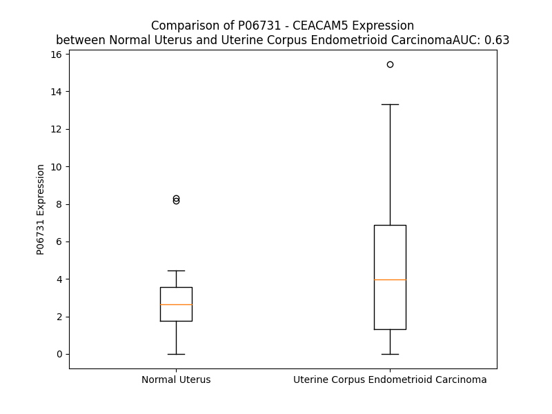

# Detailed Data for P06731

## Introduction to the Detailed Summary

### How to Interpret the Results

- **Summary & Metrics**: This section provides a quick reference to essential protein attributes, including expression changes, family classification, and biomarker applications. Regulation status (upregulated/downregulated) indicates the protein's behavior in a disease context. Some information comes from the original excel file with the proteins selected from literature, while others are derived from the analyses.
- **Expression Comparison**: A visual representation comparing protein expression between normal and disease states. It highlights significant changes in expression levels that might indicate diagnostic or therapeutic relevance. This is data coming from transcriptomics experiments and could not translate similarly to protein levels.
- **Isoform Alignment**: An interactive view of isoform alignments, revealing structural and functional differences between variants of the protein.
- **Interactors & Homologs**: Tables listing known interaction partners and homologous proteins, the more interactors and homologs, the more complex the protein is to design an antibody for.
- **Biological Assemblies**: Information about the structural arrangement of the protein in different assemblies, providing insights into its functional state but also the complexity of the protein to develop antibodies.
- **Combined Per-Residue Information**: A detailed table summarizing residue-level data. This includes predictions for epitope regions, aggregation tendencies, and modifications that might impact the protein's function. Each row corresponds to a residue in the protein, providing insights into specific sites that may be important for research or drug development.
## Summary & Metrics

- **UniProt Accession**: P06731
- **Gene Name**: CEACAM5 (CEA)
- **Protein Name**: Carcinoembryonic antigen-related cell adhesion molecule 5
- **Swiss Prot**: CEAM5_HUMAN
- **Family**: other
- **Biomarker Application**: diagnosis,disease progression
- **Number of Isoforms**: 2
- **Regulation**: 2
- **(transcriptomics) AUC**: 0.53
- **(transcriptomics) Fold Change**: 1.32
- **(transcriptomics) Regulation**: Upregulated
- **Discotope Epitope Count**: 157
- **Max n_uniprots (Homo)**: 2
- **Max n_uniprots (Hetero)**: 2

## Expression Comparison

## Isoform Alignment

<pre style='font-size:14px; font-family:monospace;'>P06731-1 MESPSAPPHRWCIPWQRLLLTASLLTFWNPPTTAKLTIESTPFNVAEGKEVLLLVHNLPQHLFGYSWYKGERVDGNRQIIGYVIGTQQATPGPAYSGREIIYPNASLLIQNIIQNDTGFYTLHVIKSDLVNEEATGQFRVYPELPKPSISSNNSKPVEDKDAVAFTCEPETQDATYLWWVNNQSLPVSPRLQLSNGNRTLTLFNVTRNDTASYKCETQNPVSARRSDSVILNVLYGPDAPTISPLNTSYRSGENLNLSCHAASNPPAQYSWFVNGTFQQSTQELFIPNITVNNSGSYTCQAHNSDTGLNRTTVTTITVYAEPPKPFITSNNSNPVEDEDAVALTCEPEIQNTTYLWWVNNQSLPVSPRLQLSNDNRTLTLLSVTRNDVGPYECGIQNELSVDHSDPVILNVLYGPDDPTISPSYTYYRPGVNLSLSCHAASNPPAQYSWLIDGNIQQHTQELFISNITEKNSGLYTCQANNSASGHSRTTVKTITVSAELPKPSISSNNSKPVEDKDAVAFTCEPEAQNTTYLWWVNGQSLPVSPRLQLSNGNRTLTLFNVTRNDARAYVCGIQNSVSANRSDPVTLDVLYGPDTPIISPPDSSYLSGANLNLSCHSASNPSPQYSWRINGIPQQHTQVLFIAKITPNNNGTYACFVSNLATGRNNSIVKSITVSASGTSPGLSAGATVGIMIGVLVGVALI
P06731-2 MESPSAPPHRWCIPWQRLLLTASLLTFWNPPTTAKLTIESTPFNVAEGKEVLLLVHNLPQHLFGYSWYKGERVDGNRQIIGYVIGTQQATPGPAYSGREIIYPNASLLIQNIIQNDTGFYTLHVIKSDLVNEEATGQFRVYPELPKPSISSNNSKPVEDKDAVAFTCEPETQDATYLWWVNNQSLPVSPRLQLSNGNRTLTLFNVTRNDTASYKCETQNPVSARRSDSVILNVLYGPDAPTISPLNTSYRSGENLNLSCHAASNPPAQYSWFVNGTFQQSTQELFIPNITVNNSGSYTCQAHNSDTGLNRTTVTTITVY-EPPKPFITSNNSNPVEDEDAVALTCEPEIQNTTYLWWVNNQSLPVSPRLQLSNDNRTLTLLSVTRNDVGPYECGIQNELSVDHSDPVILNVLYGPDDPTISPSYTYYRPGVNLSLSCHAASNPPAQYSWLIDGNIQQHTQELFISNITEKNSGLYTCQANNSASGHSRTTVKTITVSAELPKPSISSNNSKPVEDKDAVAFTCEPEAQNTTYLWWVNGQSLPVSPRLQLSNGNRTLTLFNVTRNDARAYVCGIQNSVSANRSDPVTLDVLYGPDTPIISPPDSSYLSGANLNLSCHSASNPSPQYSWRINGIPQQHTQVLFIAKITPNNNGTYACFVSNLATGRNNSIVKSITVSASGTSPGLSAGATVGIMIGVLVGVALI
</pre>

## Interactors

| preferredName_A   | preferredName_B   |   score |
|:------------------|:------------------|--------:|
| CEACAM5           | AFP               |   0.941 |
| CEACAM5           | MUC1              |   0.925 |
| CEACAM5           | ENO2              |   0.919 |
| CEACAM5           | CD209             |   0.916 |
| CEACAM5           | CEACAM1           |   0.909 |

## Homologs

| uniprot_id   | gene_id   |
|:-------------|:----------|
| A8MXK1       | VSTM5     |
| A0A994J4I1   | HEPACAM   |
| A8MVW5       | HEPACAM2  |
| Q7Z692       | CEACAM19  |
| M0R2K4       | CEACAM1   |
| B7Z5B4       | CEACAM3   |
| P40199       | CEACAM6   |
| A0A0A0MTT6   | CEACAM7   |
| P31997       | CEACAM8   |
| P11465       | PSG2      |
| M0QYP3       | PSG8      |
| Q9UQ72       | PSG11     |
| A0A087WT09   | PSG7      |
| G3XAA7       | PSG9      |
| E7EQY3       | PSG5      |
| M0R235       | PSG1      |
| Q00889       | PSG6      |
| Q16557       | PSG3      |
| M0R0B3       | PSG4      |
| M0R363       | CEACAM4   |
| A0A0B4J1W4   | CEACAM21  |
| Q2WEN9       | CEACAM16  |
| A8MTB9       | CEACAM18  |
| Q6UY09       | CEACAM20  |

## Biological Assemblies

|   Unnamed: 0 |   assembly |   n_uniprots | composition   | crystal_id   |
|-------------:|-----------:|-------------:|:--------------|:-------------|
|            0 |          1 |            1 | Homo          | 1e07         |
|            0 |          1 |            1 | Homo          | 2qst         |
|            1 |          2 |            1 | Homo          | 2qst         |
|            0 |          1 |            1 | Homo          | 8bw0         |
|            0 |          1 |            2 | Homo          | 2qsq         |
|            0 |          1 |            2 | Hetero        | 2ver         |

## Combined Per-Residue Information

|   res | aa   |   epitope_score | epitope   |   relative_surface_accessibility |   modeling_confidence |   Aggregation | modification   | glycosylation                   |
|------:|:-----|----------------:|:----------|---------------------------------:|----------------------:|--------------:|:---------------|:--------------------------------|
|     1 | M    |         0.18462 | True      |                          1.346   |                 35.11 |         0     | N/A            | N/A                             |
|     2 | E    |         0.18795 | True      |                          0.8939  |                 30.62 |         0     | N/A            | N/A                             |
|     3 | S    |         0.14905 | True      |                          0.80036 |                 33.71 |         0     | N/A            | N/A                             |
|     4 | P    |         0.18082 | True      |                          0.89223 |                 38.38 |         0     | N/A            | N/A                             |
|     5 | S    |         0.12083 | True      |                          0.92638 |                 32.58 |         0     | N/A            | N/A                             |
|     6 | A    |         0.07417 | False     |                          0.89448 |                 35.5  |         0     | N/A            | N/A                             |
|     7 | P    |         0.1073  | False     |                          0.7922  |                 34.28 |         0     | N/A            | N/A                             |
|     8 | P    |         0.14868 | True      |                          1.00559 |                 40.02 |         0     | N/A            | N/A                             |
|     9 | H    |         0.18151 | True      |                          0.89363 |                 35.3  |         0     | N/A            | N/A                             |
|    10 | R    |         0.1897  | True      |                          0.79108 |                 29.95 |         0     | N/A            | N/A                             |
|    11 | W    |         0.13376 | True      |                          1.07616 |                 30.67 |         0     | N/A            | N/A                             |
|    12 | C    |         0.08994 | False     |                          0.84798 |                 29.98 |         0     | N/A            | N/A                             |
|    13 | I    |         0.11789 | True      |                          0.84065 |                 35.61 |         0     | N/A            | N/A                             |
|    14 | P    |         0.10154 | False     |                          0.83373 |                 34.68 |         0     | N/A            | N/A                             |
|    15 | W    |         0.13405 | True      |                          1.09397 |                 34.78 |         0     | N/A            | N/A                             |
|    16 | Q    |         0.17826 | True      |                          0.90251 |                 34.9  |         0     | N/A            | N/A                             |
|    17 | R    |         0.19166 | True      |                          0.87306 |                 35.97 |         0     | N/A            | N/A                             |
|    18 | L    |         0.14265 | True      |                          0.97531 |                 33.03 |        51.679 | N/A            | N/A                             |
|    19 | L    |         0.11941 | True      |                          1.06616 |                 36.05 |        61.072 | N/A            | N/A                             |
|    20 | L    |         0.11495 | False     |                          0.91401 |                 33.75 |        65.762 | N/A            | N/A                             |
|    21 | T    |         0.10449 | False     |                          0.94152 |                 35.63 |        66.586 | N/A            | N/A                             |
|    22 | A    |         0.10558 | False     |                          0.71058 |                 32.46 |        67.972 | N/A            | N/A                             |
|    23 | S    |         0.1025  | False     |                          0.81025 |                 34.06 |        69.257 | N/A            | N/A                             |
|    24 | L    |         0.12527 | True      |                          0.88126 |                 33.87 |        79.853 | N/A            | N/A                             |
|    25 | L    |         0.12419 | True      |                          0.93287 |                 39.21 |        79.569 | N/A            | N/A                             |
|    26 | T    |         0.10742 | False     |                          0.69915 |                 34.1  |        77.901 | N/A            | N/A                             |
|    27 | F    |         0.12996 | True      |                          0.87225 |                 38.22 |        76.908 | N/A            | N/A                             |
|    28 | W    |         0.18796 | True      |                          1.06899 |                 33.08 |        63.991 | N/A            | N/A                             |
|    29 | N    |         0.20972 | True      |                          0.76088 |                 32.38 |         0     | N/A            | N/A                             |
|    30 | P    |         0.14151 | True      |                          0.77209 |                 35.13 |         0     | N/A            | N/A                             |
|    31 | P    |         0.14706 | True      |                          1.00416 |                 38.48 |         0     | N/A            | N/A                             |
|    32 | T    |         0.17353 | True      |                          0.74874 |                 41.67 |         0     | N/A            | N/A                             |
|    33 | T    |         0.169   | True      |                          0.87972 |                 54.03 |         0     | N/A            | N/A                             |
|    34 | A    |         0.11183 | False     |                          0.61422 |                 67.12 |         0     | N/A            | N/A                             |
|    35 | K    |         0.10302 | False     |                          0.79646 |                 83.67 |         0     | N/A            | N/A                             |
|    36 | L    |         0.03319 | False     |                          0.08234 |                 91.89 |         0     | N/A            | N/A                             |
|    37 | T    |         0.04344 | False     |                          0.45644 |                 93.4  |         0     | N/A            | N/A                             |
|    38 | I    |         0.04251 | False     |                          0.13795 |                 94.55 |         0     | N/A            | N/A                             |
|    39 | E    |         0.07684 | False     |                          0.42732 |                 94.71 |         0     | N/A            | N/A                             |
|    40 | S    |         0.05621 | False     |                          0.11919 |                 95.29 |         0     | N/A            | N/A                             |
|    41 | T    |         0.1125  | False     |                          0.34677 |                 93.09 |         0     | N/A            | N/A                             |
|    42 | P    |         0.09968 | False     |                          0.53383 |                 93.42 |         0     | N/A            | N/A                             |
|    43 | F    |         0.11529 | False     |                          0.46042 |                 94.08 |         0     | N/A            | N/A                             |
|    44 | N    |         0.10654 | False     |                          0.32805 |                 93.25 |         0     | N/A            | N/A                             |
|    45 | V    |         0.00733 | False     |                          0.01333 |                 92.72 |         0     | N/A            | N/A                             |
|    46 | A    |         0.01742 | False     |                          0.12378 |                 92.15 |         0     | N/A            | N/A                             |
|    47 | E    |         0.05173 | False     |                          0.37233 |                 91.18 |         0     | N/A            | N/A                             |
|    48 | G    |         0.06828 | False     |                          0.49672 |                 91.59 |         0     | N/A            | N/A                             |
|    49 | K    |         0.10487 | False     |                          0.56769 |                 93.41 |         0.033 | N/A            | N/A                             |
|    50 | E    |         0.12339 | True      |                          0.4577  |                 94.48 |         0.033 | N/A            | N/A                             |
|    51 | V    |         0.00625 | False     |                          0.00286 |                 95.59 |        97.353 | N/A            | N/A                             |
|    52 | L    |         0.09547 | False     |                          0.29513 |                 96.64 |        97.361 | N/A            | N/A                             |
|    53 | L    |         0.0066  | False     |                          0       |                 96.77 |        97.361 | N/A            | N/A                             |
|    54 | L    |         0.06008 | False     |                          0.30006 |                 96.22 |        97.361 | N/A            | N/A                             |
|    55 | V    |         0.0363  | False     |                          0.0943  |                 94.91 |        97.361 | N/A            | N/A                             |
|    56 | H    |         0.09212 | False     |                          0.37543 |                 92.98 |         0.751 | N/A            | N/A                             |
|    57 | N    |         0.06067 | False     |                          0.46399 |                 91.18 |         0.028 | N/A            | N/A                             |
|    58 | L    |         0.04068 | False     |                          0.3359  |                 89.35 |         0     | N/A            | N/A                             |
|    59 | P    |         0.02853 | False     |                          0.19207 |                 85.64 |         0     | N/A            | N/A                             |
|    60 | Q    |         0.08232 | False     |                          0.76763 |                 82.31 |         0     | N/A            | N/A                             |
|    61 | H    |         0.12889 | True      |                          0.78008 |                 86.03 |         0     | N/A            | N/A                             |
|    62 | L    |         0.07021 | False     |                          0.1474  |                 89.52 |         3.621 | N/A            | N/A                             |
|    63 | F    |         0.14183 | True      |                          0.59301 |                 90.61 |         4.181 | N/A            | N/A                             |
|    64 | G    |         0.05057 | False     |                          0.04346 |                 93.09 |         4.181 | N/A            | N/A                             |
|    65 | Y    |         0.02056 | False     |                          0.01626 |                 95.23 |         4.181 | N/A            | N/A                             |
|    66 | S    |         0.06775 | False     |                          0.111   |                 95.77 |         4.181 | N/A            | N/A                             |
|    67 | W    |         0.01133 | False     |                          0       |                 97.35 |         4.047 | N/A            | N/A                             |
|    68 | Y    |         0.05294 | False     |                          0.07742 |                 97.36 |         3.615 | N/A            | N/A                             |
|    69 | K    |         0.05894 | False     |                          0.29713 |                 94.89 |         0     | N/A            | N/A                             |
|    70 | G    |         0.0274  | False     |                          0.17543 |                 93.69 |         0     | N/A            | N/A                             |
|    71 | E    |         0.15548 | True      |                          0.54947 |                 92.58 |         0     | N/A            | N/A                             |
|    72 | R    |         0.21303 | True      |                          0.76318 |                 91.59 |         0     | N/A            | N/A                             |
|    73 | V    |         0.11699 | True      |                          0.39071 |                 92.7  |         0     | N/A            | N/A                             |
|    74 | D    |         0.15524 | True      |                          0.34182 |                 92.13 |         0     | N/A            | N/A                             |
|    75 | G    |         0.25282 | True      |                          0.61306 |                 89.79 |         0     | N/A            | N/A                             |
|    76 | N    |         0.26762 | True      |                          0.77195 |                 93.61 |         0     | N/A            | N/A                             |
|    77 | R    |         0.12044 | True      |                          0.5199  |                 94.59 |         0     | N/A            | N/A                             |
|    78 | Q    |         0.09095 | False     |                          0.21024 |                 96.55 |         1.89  | N/A            | N/A                             |
|    79 | I    |         0.01357 | False     |                          0.0096  |                 96.64 |        50.288 | N/A            | N/A                             |
|    80 | I    |         0.06361 | False     |                          0.0472  |                 96.23 |        61.542 | N/A            | N/A                             |
|    81 | G    |         0.06941 | False     |                          0.05447 |                 94.47 |        61.624 | N/A            | N/A                             |
|    82 | Y    |         0.07675 | False     |                          0.11411 |                 95.05 |        62.159 | N/A            | N/A                             |
|    83 | V    |         0.09011 | False     |                          0.37988 |                 92.54 |        62.159 | N/A            | N/A                             |
|    84 | I    |         0.07421 | False     |                          0.38364 |                 89.89 |        58.438 | N/A            | N/A                             |
|    85 | G    |         0.18896 | True      |                          0.89569 |                 86.58 |         7.946 | N/A            | N/A                             |
|    86 | T    |         0.18895 | True      |                          0.66683 |                 90.48 |         3.321 | N/A            | N/A                             |
|    87 | Q    |         0.2235  | True      |                          0.71582 |                 90.19 |         0.082 | N/A            | N/A                             |
|    88 | Q    |         0.22442 | True      |                          0.54289 |                 92.34 |         0     | N/A            | N/A                             |
|    89 | A    |         0.19814 | True      |                          0.40308 |                 93.46 |         0     | N/A            | N/A                             |
|    90 | T    |         0.21097 | True      |                          0.44786 |                 93.82 |         0     | N/A            | N/A                             |
|    91 | P    |         0.14154 | True      |                          0.65861 |                 95.48 |         0     | N/A            | N/A                             |
|    92 | G    |         0.0551  | False     |                          0.19071 |                 94.56 |         0     | N/A            | N/A                             |
|    93 | P    |         0.18409 | True      |                          0.76618 |                 95.23 |         0     | N/A            | N/A                             |
|    94 | A    |         0.05063 | False     |                          0.27582 |                 94.17 |         0     | N/A            | N/A                             |
|    95 | Y    |         0.13836 | True      |                          0.35751 |                 95.08 |         0     | N/A            | N/A                             |
|    96 | S    |         0.12146 | True      |                          0.47462 |                 93.12 |         0     | N/A            | N/A                             |
|    97 | G    |         0.20528 | True      |                          0.64301 |                 93.16 |         0     | N/A            | N/A                             |
|    98 | R    |         0.10979 | False     |                          0.19194 |                 94.55 |         0     | N/A            | N/A                             |
|    99 | E    |         0.10583 | False     |                          0.05306 |                 95.57 |         0     | N/A            | N/A                             |
|   100 | I    |         0.15084 | True      |                          0.46158 |                 94.44 |         0     | N/A            | N/A                             |
|   101 | I    |         0.08379 | False     |                          0.10824 |                 94.48 |         0     | N/A            | N/A                             |
|   102 | Y    |         0.09655 | False     |                          0.38218 |                 93    |         0     | N/A            | N/A                             |
|   103 | P    |         0.08675 | False     |                          0.74014 |                 88.33 |         0     | N/A            | N/A                             |
|   104 | N    |         0.11183 | False     |                          0.47395 |                 91.06 |         0     | N/A            | N-linked (GlcNAc...) asparagine |
|   105 | A    |         0.00248 | False     |                          0       |                 93.61 |         2.243 | N/A            | N/A                             |
|   106 | S    |         0.02478 | False     |                          0.00624 |                 95.83 |         2.65  | N/A            | N/A                             |
|   107 | L    |         0.00626 | False     |                          0       |                 96.41 |         6.234 | N/A            | N/A                             |
|   108 | L    |         0.07158 | False     |                          0.11459 |                 96.6  |         6.84  | N/A            | N/A                             |
|   109 | I    |         0.00695 | False     |                          0.0072  |                 96.08 |         6.84  | N/A            | N/A                             |
|   110 | Q    |         0.09786 | False     |                          0.35969 |                 95.51 |         4.941 | N/A            | N/A                             |
|   111 | N    |         0.06347 | False     |                          0.57745 |                 93.89 |         4.941 | N/A            | N/A                             |
|   112 | I    |         0.00467 | False     |                          0.00118 |                 93.7  |         4.941 | N/A            | N/A                             |
|   113 | I    |         0.07613 | False     |                          0.48238 |                 92.92 |         4.64  | N/A            | N/A                             |
|   114 | Q    |         0.0681  | False     |                          0.53449 |                 89.03 |         0     | N/A            | N/A                             |
|   115 | N    |         0.12251 | True      |                          0.76453 |                 90.72 |         0     | N/A            | N-linked (GlcNAc...) asparagine |
|   116 | D    |         0.02106 | False     |                          0.02391 |                 93.72 |         0     | N/A            | N/A                             |
|   117 | T    |         0.03881 | False     |                          0.43344 |                 94    |         2.961 | N/A            | N/A                             |
|   118 | G    |         0.02821 | False     |                          0.25268 |                 93.59 |         7.939 | N/A            | N/A                             |
|   119 | F    |         0.12288 | True      |                          0.38227 |                 96.37 |        15.15  | N/A            | N/A                             |
|   120 | Y    |         0.02244 | False     |                          0.02165 |                 96.47 |        15.679 | N/A            | N/A                             |
|   121 | T    |         0.01703 | False     |                          0.00476 |                 96.58 |        15.679 | N/A            | N/A                             |
|   122 | L    |         0.00473 | False     |                          0       |                 96.26 |        15.679 | N/A            | N/A                             |
|   123 | H    |         0.08764 | False     |                          0.11957 |                 95.38 |        15.315 | N/A            | N/A                             |
|   124 | V    |         0.00364 | False     |                          0       |                 93.67 |        15.177 | N/A            | N/A                             |
|   125 | I    |         0.05102 | False     |                          0.29359 |                 92.76 |        13.948 | N/A            | N/A                             |
|   126 | K    |         0.06757 | False     |                          0.20372 |                 90.3  |         0     | N/A            | N/A                             |
|   127 | S    |         0.06759 | False     |                          0.58151 |                 86.51 |         0     | N/A            | N/A                             |
|   128 | D    |         0.15445 | True      |                          0.58872 |                 87.93 |         0     | N/A            | N/A                             |
|   129 | L    |         0.17323 | True      |                          0.82818 |                 85.15 |         0     | N/A            | N/A                             |
|   130 | V    |         0.17277 | True      |                          0.53411 |                 89.88 |         0     | N/A            | N/A                             |
|   131 | N    |         0.20077 | True      |                          0.51566 |                 89.25 |         0     | N/A            | N/A                             |
|   132 | E    |         0.12735 | True      |                          0.2894  |                 91.41 |         0     | N/A            | N/A                             |
|   133 | E    |         0.20931 | True      |                          0.51211 |                 94.11 |         0     | N/A            | N/A                             |
|   134 | A    |         0.031   | False     |                          0.10076 |                 94.48 |         0     | N/A            | N/A                             |
|   135 | T    |         0.13955 | True      |                          0.42753 |                 95.64 |         0     | N/A            | N/A                             |
|   136 | G    |         0.04115 | False     |                          0.07243 |                 93.74 |         0     | N/A            | N/A                             |
|   137 | Q    |         0.10685 | False     |                          0.36587 |                 95.84 |         0     | N/A            | N/A                             |
|   138 | F    |         0.00796 | False     |                          0.00507 |                 95.63 |         0     | N/A            | N/A                             |
|   139 | R    |         0.12292 | True      |                          0.51976 |                 94.06 |         0     | N/A            | N/A                             |
|   140 | V    |         0.02762 | False     |                          0.06359 |                 92.67 |         0     | N/A            | N/A                             |
|   141 | Y    |         0.04545 | False     |                          0.12328 |                 91.63 |         0     | N/A            | N/A                             |
|   142 | P    |         0.05817 | False     |                          0.34765 |                 89.82 |         0     | N/A            | N/A                             |
|   143 | E    |         0.11158 | False     |                          0.5555  |                 88.46 |         0     | N/A            | N/A                             |
|   144 | L    |         0.01102 | False     |                          0.01829 |                 91.34 |         0     | N/A            | N/A                             |
|   145 | P    |         0.08116 | False     |                          0.53013 |                 90.74 |         0     | N/A            | N/A                             |
|   146 | K    |         0.06529 | False     |                          0.4985  |                 93.78 |         0     | N/A            | N/A                             |
|   147 | P    |         0.00714 | False     |                          0.03838 |                 95.22 |         0     | N/A            | N/A                             |
|   148 | S    |         0.03778 | False     |                          0.46982 |                 95.61 |         0     | N/A            | N/A                             |
|   149 | I    |         0.06023 | False     |                          0.14217 |                 95.05 |         0     | N/A            | N/A                             |
|   150 | S    |         0.04655 | False     |                          0.39508 |                 94    |         0     | N/A            | N/A                             |
|   151 | S    |         0.07803 | False     |                          0.37529 |                 93.85 |         0     | N/A            | N/A                             |
|   152 | N    |         0.14685 | True      |                          0.68726 |                 93.39 |         0     | N/A            | N-linked (GlcNAc...) asparagine |
|   153 | N    |         0.05472 | False     |                          0.23922 |                 91.27 |         0     | N/A            | N/A                             |
|   154 | S    |         0.16302 | True      |                          0.74963 |                 86.66 |         0     | N/A            | N/A                             |
|   155 | K    |         0.07229 | False     |                          0.64168 |                 89.05 |         0     | N/A            | N/A                             |
|   156 | P    |         0.00236 | False     |                          0       |                 93.87 |         0     | N/A            | N/A                             |
|   157 | V    |         0.02285 | False     |                          0.11901 |                 92.77 |         0     | N/A            | N/A                             |
|   158 | E    |         0.09345 | False     |                          0.17514 |                 92.53 |         0     | N/A            | N/A                             |
|   159 | D    |         0.16033 | True      |                          0.6494  |                 87.98 |         0     | N/A            | N/A                             |
|   160 | K    |         0.1184  | True      |                          0.74974 |                 87.48 |         0     | N/A            | N/A                             |
|   161 | D    |         0.05887 | False     |                          0.21627 |                 91.37 |         0     | N/A            | N/A                             |
|   162 | A    |         0.06853 | False     |                          0.38229 |                 92.69 |         3.852 | N/A            | N/A                             |
|   163 | V    |         0.00248 | False     |                          0       |                 94.29 |         3.852 | N/A            | N/A                             |
|   164 | A    |         0.03243 | False     |                          0.18137 |                 94.03 |         3.852 | N/A            | N/A                             |
|   165 | F    |         0.00578 | False     |                          0.00764 |                 94.95 |         3.852 | N/A            | N/A                             |
|   166 | T    |         0.03614 | False     |                          0.16935 |                 95.42 |         3.852 | N/A            | N/A                             |
|   167 | C    |         0.00172 | False     |                          0       |                 95.17 |         0.67  | N/A            | N/A                             |
|   168 | E    |         0.03456 | False     |                          0.27415 |                 93.84 |         0     | N/A            | N/A                             |
|   169 | P    |         0.18781 | True      |                          0.52833 |                 92.81 |         0     | N/A            | N/A                             |
|   170 | E    |         0.08809 | False     |                          0.65815 |                 90.81 |         0     | N/A            | N/A                             |
|   171 | T    |         0.0606  | False     |                          0.19651 |                 86.76 |         0     | N/A            | N/A                             |
|   172 | Q    |         0.09407 | False     |                          0.82842 |                 82.76 |         0     | N/A            | N/A                             |
|   173 | D    |         0.10182 | False     |                          0.68707 |                 83.43 |         0     | N/A            | N/A                             |
|   174 | A    |         0.02195 | False     |                          0.16816 |                 89.6  |        12.339 | N/A            | N/A                             |
|   175 | T    |         0.03829 | False     |                          0.60809 |                 93.09 |        26.673 | N/A            | N/A                             |
|   176 | Y    |         0.03151 | False     |                          0.06132 |                 93.62 |        87.59  | N/A            | N/A                             |
|   177 | L    |         0.05139 | False     |                          0.45587 |                 92.82 |        87.899 | N/A            | N/A                             |
|   178 | W    |         0.01779 | False     |                          0.04033 |                 93.3  |        87.899 | N/A            | N/A                             |
|   179 | W    |         0.11221 | False     |                          0.2142  |                 92    |        87.677 | N/A            | N/A                             |
|   180 | V    |         0.03552 | False     |                          0.19273 |                 90.08 |        85.679 | N/A            | N/A                             |
|   181 | N    |         0.11652 | True      |                          0.60457 |                 87.91 |         3.629 | N/A            | N/A                             |
|   182 | N    |         0.2433  | True      |                          0.60129 |                 83.31 |         0.125 | N/A            | N-linked (GlcNAc...) asparagine |
|   183 | Q    |         0.16339 | True      |                          0.65301 |                 87.99 |         0     | N/A            | N/A                             |
|   184 | S    |         0.16592 | True      |                          0.65668 |                 81.65 |         0     | N/A            | N/A                             |
|   185 | L    |         0.05511 | False     |                          0.12671 |                 78.13 |         0     | N/A            | N/A                             |
|   186 | P    |         0.08177 | False     |                          0.68699 |                 71.43 |         0     | N/A            | N/A                             |
|   187 | V    |         0.11799 | True      |                          0.70129 |                 74.35 |         0     | N/A            | N/A                             |
|   188 | S    |         0.10461 | False     |                          0.34777 |                 77.83 |         0     | N/A            | N/A                             |
|   189 | P    |         0.17718 | True      |                          0.89588 |                 79.77 |         0     | N/A            | N/A                             |
|   190 | R    |         0.14289 | True      |                          0.41727 |                 86.02 |         0     | N/A            | N/A                             |
|   191 | L    |         0.09224 | False     |                          0.12777 |                 86.14 |         0     | N/A            | N/A                             |
|   192 | Q    |         0.10919 | False     |                          0.41887 |                 88.5  |         0     | N/A            | N/A                             |
|   193 | L    |         0.04631 | False     |                          0.31512 |                 90.52 |         0     | N/A            | N/A                             |
|   194 | S    |         0.07537 | False     |                          0.35463 |                 91.21 |         0     | N/A            | N/A                             |
|   195 | N    |         0.13734 | True      |                          1.02535 |                 84.12 |         0     | N/A            | N/A                             |
|   196 | G    |         0.05222 | False     |                          0.63123 |                 86.67 |         0     | N/A            | N/A                             |
|   197 | N    |         0.09853 | False     |                          0.36325 |                 91.73 |         0     | N/A            | N-linked (GlcNAc...) asparagine |
|   198 | R    |         0.09064 | False     |                          0.23673 |                 93.11 |         0     | N/A            | N/A                             |
|   199 | T    |         0.04275 | False     |                          0.19608 |                 94.06 |         3.368 | N/A            | N/A                             |
|   200 | L    |         0.00271 | False     |                          0       |                 93.39 |         4.738 | N/A            | N/A                             |
|   201 | T    |         0.04059 | False     |                          0.2023  |                 93.13 |         5.343 | N/A            | N/A                             |
|   202 | L    |         0.01979 | False     |                          0.02391 |                 91.91 |         5.722 | N/A            | N/A                             |
|   203 | F    |         0.07621 | False     |                          0.42948 |                 90.28 |         5.722 | N/A            | N/A                             |
|   204 | N    |         0.05937 | False     |                          0.57815 |                 88.17 |         3.061 | N/A            | N-linked (GlcNAc...) asparagine |
|   205 | V    |         0.00403 | False     |                          0.0019  |                 91.52 |         2.887 | N/A            | N/A                             |
|   206 | T    |         0.11559 | True      |                          0.1838  |                 92.42 |         1.314 | N/A            | N/A                             |
|   207 | R    |         0.1762  | True      |                          0.30215 |                 91.46 |         0     | N/A            | N/A                             |
|   208 | N    |         0.18208 | True      |                          0.864   |                 89.17 |         0     | N/A            | N-linked (GlcNAc...) asparagine |
|   209 | D    |         0.05311 | False     |                          0.17592 |                 89.11 |         0     | N/A            | N/A                             |
|   210 | T    |         0.09702 | False     |                          0.46883 |                 89.96 |         0     | N/A            | N/A                             |
|   211 | A    |         0.03294 | False     |                          0.10586 |                 89.41 |         0     | N/A            | N/A                             |
|   212 | S    |         0.06485 | False     |                          0.23273 |                 92.59 |         0     | N/A            | N/A                             |
|   213 | Y    |         0.01759 | False     |                          0.01528 |                 92.89 |         0     | N/A            | N/A                             |
|   214 | K    |         0.09253 | False     |                          0.20678 |                 94.9  |         0     | N/A            | N/A                             |
|   215 | C    |         0.00139 | False     |                          0       |                 94.53 |         0     | N/A            | N/A                             |
|   216 | E    |         0.07438 | False     |                          0.07901 |                 94.29 |         0     | N/A            | N/A                             |
|   217 | T    |         0.01139 | False     |                          0.0222  |                 94.57 |         0     | N/A            | N/A                             |
|   218 | Q    |         0.0767  | False     |                          0.36916 |                 93.52 |         0     | N/A            | N/A                             |
|   219 | N    |         0.02338 | False     |                          0.06657 |                 91.69 |         0     | N/A            | N/A                             |
|   220 | P    |         0.09392 | False     |                          0.57623 |                 91.82 |         0     | N/A            | N/A                             |
|   221 | V    |         0.05265 | False     |                          0.3469  |                 90.2  |         0     | N/A            | N/A                             |
|   222 | S    |         0.05279 | False     |                          0.13026 |                 91.18 |         0     | N/A            | N/A                             |
|   223 | A    |         0.20037 | True      |                          0.56101 |                 93.38 |         0     | N/A            | N/A                             |
|   224 | R    |         0.12327 | True      |                          0.40575 |                 94.16 |         0     | N/A            | N/A                             |
|   225 | R    |         0.14102 | True      |                          0.41648 |                 94.04 |         0     | N/A            | N/A                             |
|   226 | S    |         0.00868 | False     |                          0.0459  |                 95.46 |         0     | N/A            | N/A                             |
|   227 | D    |         0.1186  | True      |                          0.58393 |                 94.65 |         0     | N/A            | N/A                             |
|   228 | S    |         0.17418 | True      |                          0.42354 |                 93.25 |         6.397 | N/A            | N/A                             |
|   229 | V    |         0.04951 | False     |                          0.31323 |                 92.45 |        57.973 | N/A            | N/A                             |
|   230 | I    |         0.16346 | True      |                          0.75702 |                 91.78 |        69.486 | N/A            | N/A                             |
|   231 | L    |         0.0359  | False     |                          0.03545 |                 91.73 |        70.304 | N/A            | N/A                             |
|   232 | N    |         0.098   | False     |                          0.46779 |                 91.68 |        70.304 | N/A            | N/A                             |
|   233 | V    |         0.00272 | False     |                          0       |                 93.61 |        70.304 | N/A            | N/A                             |
|   234 | L    |         0.05252 | False     |                          0.0676  |                 94.55 |        68.002 | N/A            | N/A                             |
|   235 | Y    |         0.07483 | False     |                          0.21066 |                 93.9  |        52.898 | N/A            | N/A                             |
|   236 | G    |         0.0642  | False     |                          0.05732 |                 92.22 |         0     | N/A            | N/A                             |
|   237 | P    |         0.02431 | False     |                          0.02866 |                 95.15 |         0     | N/A            | N/A                             |
|   238 | D    |         0.07861 | False     |                          0.31253 |                 94.21 |         0     | N/A            | N/A                             |
|   239 | A    |         0.08    | False     |                          0.77577 |                 94.12 |         0     | N/A            | N/A                             |
|   240 | P    |         0.01386 | False     |                          0.06146 |                 95.31 |         0     | N/A            | N/A                             |
|   241 | T    |         0.04225 | False     |                          0.60145 |                 95.6  |         0     | N/A            | N/A                             |
|   242 | I    |         0.07889 | False     |                          0.10013 |                 95.62 |         0     | N/A            | N/A                             |
|   243 | S    |         0.09084 | False     |                          0.44721 |                 93.97 |         0     | N/A            | N/A                             |
|   244 | P    |         0.17728 | True      |                          0.45594 |                 93.01 |         0     | N/A            | N/A                             |
|   245 | L    |         0.13232 | True      |                          1.00632 |                 90.41 |         0     | N/A            | N/A                             |
|   246 | N    |         0.10588 | False     |                          0.5782  |                 86.91 |         0     | N/A            | N-linked (GlcNAc...) asparagine |
|   247 | T    |         0.06618 | False     |                          0.4714  |                 89.9  |         0     | N/A            | N/A                             |
|   248 | S    |         0.06047 | False     |                          0.20931 |                 90.31 |         0     | N/A            | N/A                             |
|   249 | Y    |         0.0225  | False     |                          0.09831 |                 90.18 |         0     | N/A            | N/A                             |
|   250 | R    |         0.05939 | False     |                          0.48072 |                 88.36 |         0     | N/A            | N/A                             |
|   251 | S    |         0.03906 | False     |                          0.39236 |                 89.33 |         0     | N/A            | N/A                             |
|   252 | G    |         0.05167 | False     |                          0.50532 |                 89.88 |         0     | N/A            | N/A                             |
|   253 | E    |         0.07962 | False     |                          0.3707  |                 91.1  |         0     | N/A            | N/A                             |
|   254 | N    |         0.09184 | False     |                          0.57482 |                 93.99 |         0     | N/A            | N/A                             |
|   255 | L    |         0.00158 | False     |                          0       |                 94.43 |         0     | N/A            | N/A                             |
|   256 | N    |         0.1507  | True      |                          0.50347 |                 94.76 |         0     | N/A            | N-linked (GlcNAc...) asparagine |
|   257 | L    |         0.00333 | False     |                          0.00247 |                 96.03 |         0     | N/A            | N/A                             |
|   258 | S    |         0.08137 | False     |                          0.24694 |                 96.4  |         0     | N/A            | N/A                             |
|   259 | C    |         0.00223 | False     |                          0       |                 95.77 |         0     | N/A            | N/A                             |
|   260 | H    |         0.0764  | False     |                          0.57785 |                 94.91 |         0     | N/A            | N/A                             |
|   261 | A    |         0.02949 | False     |                          0.063   |                 95.66 |         0     | N/A            | N/A                             |
|   262 | A    |         0.07415 | False     |                          0.3916  |                 95.06 |         0     | N/A            | N/A                             |
|   263 | S    |         0.03827 | False     |                          0.13546 |                 94.75 |         0     | N/A            | N/A                             |
|   264 | N    |         0.06622 | False     |                          0.22892 |                 94.3  |         0     | N/A            | N/A                             |
|   265 | P    |         0.15484 | True      |                          0.31711 |                 93.32 |         0     | N/A            | N/A                             |
|   266 | P    |         0.11898 | True      |                          0.86347 |                 94.37 |         0     | N/A            | N/A                             |
|   267 | A    |         0.02349 | False     |                          0.10337 |                 94.95 |         0.771 | N/A            | N/A                             |
|   268 | Q    |         0.06918 | False     |                          0.61544 |                 95.47 |         1.682 | N/A            | N/A                             |
|   269 | Y    |         0.02662 | False     |                          0.11582 |                 96.49 |        26.457 | N/A            | N/A                             |
|   270 | S    |         0.05966 | False     |                          0.1467  |                 96.49 |        26.579 | N/A            | N/A                             |
|   271 | W    |         0.01006 | False     |                          0       |                 97.32 |        27.227 | N/A            | N/A                             |
|   272 | F    |         0.05439 | False     |                          0.25798 |                 96.31 |        27.386 | N/A            | N/A                             |
|   273 | V    |         0.04047 | False     |                          0.14232 |                 94.94 |        27.386 | N/A            | N/A                             |
|   274 | N    |         0.14382 | True      |                          0.55677 |                 92.99 |         2.43  | N/A            | N-linked (GlcNAc...) asparagine |
|   275 | G    |         0.16773 | True      |                          0.74822 |                 91.46 |         1.401 | N/A            | N/A                             |
|   276 | T    |         0.13374 | True      |                          0.60187 |                 94.06 |         1.401 | N/A            | N/A                             |
|   277 | F    |         0.18394 | True      |                          0.54083 |                 95.41 |         1.401 | N/A            | N/A                             |
|   278 | Q    |         0.14285 | True      |                          0.41949 |                 92.73 |         0     | N/A            | N/A                             |
|   279 | Q    |         0.15877 | True      |                          0.3016  |                 92.57 |         0     | N/A            | N/A                             |
|   280 | S    |         0.15154 | True      |                          0.62641 |                 94.34 |         0     | N/A            | N/A                             |
|   281 | T    |         0.06928 | False     |                          0.45033 |                 94.32 |         0     | N/A            | N/A                             |
|   282 | Q    |         0.1178  | True      |                          0.40524 |                 94.83 |         0     | N/A            | N/A                             |
|   283 | E    |         0.1049  | False     |                          0.51314 |                 95.54 |         0     | N/A            | N/A                             |
|   284 | L    |         0.02824 | False     |                          0.0272  |                 95.6  |         0     | N/A            | N/A                             |
|   285 | F    |         0.11228 | False     |                          0.57171 |                 95.11 |         0     | N/A            | N/A                             |
|   286 | I    |         0.065   | False     |                          0.19279 |                 94.51 |         0     | N/A            | N/A                             |
|   287 | P    |         0.26674 | True      |                          0.56641 |                 94    |         0     | N/A            | N/A                             |
|   288 | N    |         0.06695 | False     |                          0.64787 |                 92.97 |         0     | N/A            | N-linked (GlcNAc...) asparagine |
|   289 | I    |         0.01577 | False     |                          0.00637 |                 94.06 |         0     | N/A            | N/A                             |
|   290 | T    |         0.04338 | False     |                          0.43218 |                 92.91 |         0     | N/A            | N/A                             |
|   291 | V    |         0.0458  | False     |                          0.53934 |                 89.25 |         0     | N/A            | N/A                             |
|   292 | N    |         0.07399 | False     |                          0.85548 |                 91.22 |         0     | N/A            | N-linked (GlcNAc...) asparagine |
|   293 | N    |         0.05001 | False     |                          0.24718 |                 93.41 |         0     | N/A            | N/A                             |
|   294 | S    |         0.06087 | False     |                          0.2877  |                 92.61 |         0     | N/A            | N/A                             |
|   295 | G    |         0.0238  | False     |                          0.18236 |                 93.53 |         0     | N/A            | N/A                             |
|   296 | S    |         0.05398 | False     |                          0.3036  |                 96.16 |         0     | N/A            | N/A                             |
|   297 | Y    |         0.00566 | False     |                          0       |                 96.42 |         0     | N/A            | N/A                             |
|   298 | T    |         0.0512  | False     |                          0.22369 |                 96.79 |         0     | N/A            | N/A                             |
|   299 | C    |         0.00255 | False     |                          0       |                 96.24 |         0     | N/A            | N/A                             |
|   300 | Q    |         0.10002 | False     |                          0.24627 |                 96.1  |         0     | N/A            | N/A                             |
|   301 | A    |         0.00239 | False     |                          0       |                 96.75 |         0     | N/A            | N/A                             |
|   302 | H    |         0.09794 | False     |                          0.34719 |                 95.1  |         0     | N/A            | N/A                             |
|   303 | N    |         0.02473 | False     |                          0.01823 |                 94.49 |         0     | N/A            | N/A                             |
|   304 | S    |         0.12807 | True      |                          0.59972 |                 91.92 |         0     | N/A            | N/A                             |
|   305 | D    |         0.08121 | False     |                          0.40906 |                 90.21 |         0     | N/A            | N/A                             |
|   306 | T    |         0.05392 | False     |                          0.10619 |                 91.53 |         0     | N/A            | N/A                             |
|   307 | G    |         0.18392 | True      |                          0.69181 |                 90.21 |         0     | N/A            | N/A                             |
|   308 | L    |         0.07672 | False     |                          0.49131 |                 92.59 |         0     | N/A            | N/A                             |
|   309 | N    |         0.17597 | True      |                          0.60086 |                 93.36 |         0     | N/A            | N-linked (GlcNAc...) asparagine |
|   310 | R    |         0.16935 | True      |                          0.53981 |                 95.67 |         0     | N/A            | N/A                             |
|   311 | T    |         0.22034 | True      |                          0.61099 |                 95.47 |        23.866 | N/A            | N/A                             |
|   312 | T    |         0.08319 | False     |                          0.2443  |                 96.01 |        63.992 | N/A            | N/A                             |
|   313 | V    |         0.1659  | True      |                          0.66198 |                 95.28 |        76.916 | N/A            | N/A                             |
|   314 | T    |         0.04925 | False     |                          0.19193 |                 94.92 |        77.987 | N/A            | N/A                             |
|   315 | T    |         0.08513 | False     |                          0.59555 |                 95.03 |        79.246 | N/A            | N/A                             |
|   316 | I    |         0.00449 | False     |                          0.00414 |                 93.69 |        80.216 | N/A            | N/A                             |
|   317 | T    |         0.02448 | False     |                          0.34795 |                 90.88 |        80.027 | N/A            | N/A                             |
|   318 | V    |         0.00867 | False     |                          0.03614 |                 89.92 |        79.59  | N/A            | N/A                             |
|   319 | Y    |         0.05434 | False     |                          0.18051 |                 84.87 |        74.131 | N/A            | N/A                             |
|   320 | A    |         0.0566  | False     |                          0.47613 |                 81.47 |        34.487 | N/A            | N/A                             |
|   321 | E    |         0.08723 | False     |                          0.73105 |                 77.5  |         0     | N/A            | N/A                             |
|   322 | P    |         0.02977 | False     |                          0.0842  |                 78.5  |         0     | N/A            | N/A                             |
|   323 | P    |         0.11252 | False     |                          0.54759 |                 85.31 |         0     | N/A            | N/A                             |
|   324 | K    |         0.06735 | False     |                          0.54463 |                 88.89 |         0     | N/A            | N/A                             |
|   325 | P    |         0.00569 | False     |                          0.02131 |                 93.76 |         0     | N/A            | N/A                             |
|   326 | F    |         0.04603 | False     |                          0.56452 |                 94.67 |         0     | N/A            | N/A                             |
|   327 | I    |         0.0214  | False     |                          0.10286 |                 94.86 |         0     | N/A            | N/A                             |
|   328 | T    |         0.04748 | False     |                          0.40385 |                 94.4  |         0     | N/A            | N/A                             |
|   329 | S    |         0.05243 | False     |                          0.32675 |                 93.74 |         0     | N/A            | N/A                             |
|   330 | N    |         0.14693 | True      |                          0.69223 |                 93.81 |         0     | N/A            | N-linked (GlcNAc...) asparagine |
|   331 | N    |         0.04887 | False     |                          0.25372 |                 91.53 |         0     | N/A            | N/A                             |
|   332 | S    |         0.14911 | True      |                          0.60259 |                 85.38 |         0     | N/A            | N/A                             |
|   333 | N    |         0.08307 | False     |                          0.47907 |                 89.43 |         0     | N/A            | N/A                             |
|   334 | P    |         0.00196 | False     |                          0       |                 93.37 |         0     | N/A            | N/A                             |
|   335 | V    |         0.01997 | False     |                          0.13043 |                 93.37 |         0     | N/A            | N/A                             |
|   336 | E    |         0.07    | False     |                          0.15089 |                 92.8  |         0     | N/A            | N/A                             |
|   337 | D    |         0.14457 | True      |                          0.60027 |                 90.19 |         0     | N/A            | N/A                             |
|   338 | E    |         0.08022 | False     |                          0.58941 |                 89.3  |         0     | N/A            | N/A                             |
|   339 | D    |         0.04406 | False     |                          0.27881 |                 92.43 |         0     | N/A            | N/A                             |
|   340 | A    |         0.0435  | False     |                          0.44599 |                 93.26 |         0     | N/A            | N/A                             |
|   341 | V    |         0.00446 | False     |                          0.00321 |                 94.59 |         0     | N/A            | N/A                             |
|   342 | A    |         0.04318 | False     |                          0.20311 |                 94.44 |         0     | N/A            | N/A                             |
|   343 | L    |         0.00404 | False     |                          0.00247 |                 94.86 |         0     | N/A            | N/A                             |
|   344 | T    |         0.03179 | False     |                          0.19235 |                 95.71 |         0     | N/A            | N/A                             |
|   345 | C    |         0.00124 | False     |                          0       |                 95.45 |         0     | N/A            | N/A                             |
|   346 | E    |         0.03083 | False     |                          0.18145 |                 94.49 |         0     | N/A            | N/A                             |
|   347 | P    |         0.11847 | True      |                          0.32009 |                 93.23 |         0     | N/A            | N/A                             |
|   348 | E    |         0.08777 | False     |                          0.53485 |                 90.73 |         0     | N/A            | N/A                             |
|   349 | I    |         0.06277 | False     |                          0.24747 |                 85.84 |         0.092 | N/A            | N/A                             |
|   350 | Q    |         0.0776  | False     |                          0.70635 |                 81.47 |         0.092 | N/A            | N/A                             |
|   351 | N    |         0.11054 | False     |                          0.91665 |                 78.47 |         0.765 | N/A            | N-linked (GlcNAc...) asparagine |
|   352 | T    |         0.04832 | False     |                          0.20002 |                 83.31 |        18.062 | N/A            | N/A                             |
|   353 | T    |         0.05969 | False     |                          0.46714 |                 90.16 |        46.616 | N/A            | N/A                             |
|   354 | Y    |         0.02293 | False     |                          0.04444 |                 92.48 |        90.991 | N/A            | N/A                             |
|   355 | L    |         0.06759 | False     |                          0.33386 |                 92.43 |        91.215 | N/A            | N/A                             |
|   356 | W    |         0.02445 | False     |                          0.05554 |                 93.19 |        91.215 | N/A            | N/A                             |
|   357 | W    |         0.14123 | True      |                          0.2185  |                 91.79 |        90.893 | N/A            | N/A                             |
|   358 | V    |         0.07867 | False     |                          0.1775  |                 89.48 |        87.403 | N/A            | N/A                             |
|   359 | N    |         0.11454 | False     |                          0.61063 |                 85.26 |         3.611 | N/A            | N/A                             |
|   360 | N    |         0.13371 | True      |                          0.79854 |                 81.77 |         0.126 | N/A            | N-linked (GlcNAc...) asparagine |
|   361 | Q    |         0.11794 | True      |                          0.64275 |                 87.07 |         0     | N/A            | N/A                             |
|   362 | S    |         0.12367 | True      |                          0.66403 |                 84.75 |         0     | N/A            | N/A                             |
|   363 | L    |         0.04331 | False     |                          0.1191  |                 78.4  |         0     | N/A            | N/A                             |
|   364 | P    |         0.10011 | False     |                          0.66823 |                 70.8  |         0     | N/A            | N/A                             |
|   365 | V    |         0.13098 | True      |                          0.7337  |                 74.97 |         0     | N/A            | N/A                             |
|   366 | S    |         0.07667 | False     |                          0.3079  |                 81.37 |         0     | N/A            | N/A                             |
|   367 | P    |         0.14519 | True      |                          0.89243 |                 83.33 |         0     | N/A            | N/A                             |
|   368 | R    |         0.08611 | False     |                          0.3499  |                 88.68 |         0     | N/A            | N/A                             |
|   369 | L    |         0.05826 | False     |                          0.14982 |                 88.84 |         0     | N/A            | N/A                             |
|   370 | Q    |         0.07723 | False     |                          0.41659 |                 90.26 |         0     | N/A            | N/A                             |
|   371 | L    |         0.05239 | False     |                          0.32452 |                 92.04 |         0     | N/A            | N/A                             |
|   372 | S    |         0.05354 | False     |                          0.31268 |                 93.07 |         0     | N/A            | N/A                             |
|   373 | N    |         0.14007 | True      |                          1.07234 |                 90.65 |         0     | N/A            | N/A                             |
|   374 | D    |         0.06721 | False     |                          0.52807 |                 90.11 |         0     | N/A            | N/A                             |
|   375 | N    |         0.04506 | False     |                          0.32134 |                 91.87 |         0     | N/A            | N-linked (GlcNAc...) asparagine |
|   376 | R    |         0.06335 | False     |                          0.17051 |                 93.73 |         0     | N/A            | N/A                             |
|   377 | T    |         0.04228 | False     |                          0.22341 |                 94.48 |         2.311 | N/A            | N/A                             |
|   378 | L    |         0.00412 | False     |                          0       |                 93.98 |         4.234 | N/A            | N/A                             |
|   379 | T    |         0.02151 | False     |                          0.26358 |                 93.86 |         5.088 | N/A            | N/A                             |
|   380 | L    |         0.01537 | False     |                          0.01484 |                 92.91 |         5.623 | N/A            | N/A                             |
|   381 | L    |         0.05132 | False     |                          0.42325 |                 90.72 |         5.623 | N/A            | N/A                             |
|   382 | S    |         0.03774 | False     |                          0.33839 |                 90.44 |         4.45  | N/A            | N/A                             |
|   383 | V    |         0.00455 | False     |                          0.00095 |                 92.2  |         4.06  | N/A            | N/A                             |
|   384 | T    |         0.0971  | False     |                          0.20513 |                 92.28 |         1.85  | N/A            | N/A                             |
|   385 | R    |         0.21201 | True      |                          0.30991 |                 90.6  |         0     | N/A            | N/A                             |
|   386 | N    |         0.17202 | True      |                          0.85794 |                 88.7  |         0     | N/A            | N/A                             |
|   387 | D    |         0.04811 | False     |                          0.12801 |                 88.96 |         0     | N/A            | N/A                             |
|   388 | V    |         0.0703  | False     |                          0.51019 |                 86.5  |         0     | N/A            | N/A                             |
|   389 | G    |         0.02001 | False     |                          0.02874 |                 75.02 |         0     | N/A            | N/A                             |
|   390 | P    |         0.0396  | False     |                          0.32627 |                 91.53 |         0     | N/A            | N/A                             |
|   391 | Y    |         0.01189 | False     |                          0.01399 |                 92.5  |         0     | N/A            | N/A                             |
|   392 | E    |         0.07675 | False     |                          0.15505 |                 94.32 |         0     | N/A            | N/A                             |
|   393 | C    |         0.00216 | False     |                          0       |                 93.84 |         0     | N/A            | N/A                             |
|   394 | G    |         0.00728 | False     |                          0       |                 92.37 |         0     | N/A            | N/A                             |
|   395 | I    |         0.00382 | False     |                          0       |                 91.55 |         0     | N/A            | N/A                             |
|   396 | Q    |         0.07895 | False     |                          0.33616 |                 87.84 |         0     | N/A            | N/A                             |
|   397 | N    |         0.0279  | False     |                          0.09216 |                 80.42 |         0     | N/A            | N/A                             |
|   398 | K    |         0.11392 | False     |                          0.78583 |                 78.75 |         0     | N/A            | N/A                             |
|   399 | L    |         0.12192 | True      |                          0.33122 |                 76.66 |         0     | N/A            | N/A                             |
|   400 | S    |         0.08225 | False     |                          0.1744  |                 76.28 |         0     | N/A            | N/A                             |
|   401 | V    |         0.1539  | True      |                          0.43713 |                 83.5  |         0     | N/A            | N/A                             |
|   402 | D    |         0.1041  | False     |                          0.29271 |                 86.61 |         0     | N/A            | N/A                             |
|   403 | H    |         0.07779 | False     |                          0.39699 |                 90.29 |         0     | N/A            | N/A                             |
|   404 | S    |         0.00752 | False     |                          0.04469 |                 93.63 |         0     | N/A            | N/A                             |
|   405 | D    |         0.14275 | True      |                          0.55253 |                 92.65 |         0     | N/A            | N/A                             |
|   406 | P    |         0.06114 | False     |                          0.5649  |                 92.86 |         0.645 | N/A            | N/A                             |
|   407 | V    |         0.04425 | False     |                          0.33608 |                 91.47 |        55.376 | N/A            | N/A                             |
|   408 | I    |         0.11244 | False     |                          0.73479 |                 91.4  |        67.606 | N/A            | N/A                             |
|   409 | L    |         0.01311 | False     |                          0.03029 |                 89.77 |        68.474 | N/A            | N/A                             |
|   410 | N    |         0.10306 | False     |                          0.41105 |                 90.91 |        68.474 | N/A            | N/A                             |
|   411 | V    |         0.00291 | False     |                          0.00223 |                 93.69 |        68.474 | N/A            | N/A                             |
|   412 | L    |         0.03377 | False     |                          0.10222 |                 94.3  |        66.298 | N/A            | N/A                             |
|   413 | Y    |         0.07813 | False     |                          0.21313 |                 93.65 |        51.588 | N/A            | N/A                             |
|   414 | G    |         0.05647 | False     |                          0.09942 |                 92.01 |         0     | N/A            | N/A                             |
|   415 | P    |         0.04474 | False     |                          0.04703 |                 95.24 |         0     | N/A            | N/A                             |
|   416 | D    |         0.08798 | False     |                          0.30719 |                 94.45 |         0     | N/A            | N/A                             |
|   417 | D    |         0.07562 | False     |                          0.66118 |                 94.27 |         0     | N/A            | N/A                             |
|   418 | P    |         0.01497 | False     |                          0.0708  |                 95.11 |         0     | N/A            | N/A                             |
|   419 | T    |         0.04671 | False     |                          0.59007 |                 95.18 |         0     | N/A            | N/A                             |
|   420 | I    |         0.05703 | False     |                          0.14079 |                 95.79 |         0     | N/A            | N/A                             |
|   421 | S    |         0.08541 | False     |                          0.50016 |                 94.41 |         0     | N/A            | N/A                             |
|   422 | P    |         0.15312 | True      |                          0.3529  |                 93.45 |         0     | N/A            | N/A                             |
|   423 | S    |         0.12923 | True      |                          0.73408 |                 91.15 |         0     | N/A            | N/A                             |
|   424 | Y    |         0.12057 | True      |                          0.68495 |                 89.76 |         0     | N/A            | N/A                             |
|   425 | T    |         0.07887 | False     |                          0.30574 |                 92.33 |         0     | N/A            | N/A                             |
|   426 | Y    |         0.04037 | False     |                          0.55043 |                 90.46 |         0     | N/A            | N/A                             |
|   427 | Y    |         0.01952 | False     |                          0.14239 |                 90.68 |         0     | N/A            | N/A                             |
|   428 | R    |         0.11223 | False     |                          0.45872 |                 89.23 |         0     | N/A            | N/A                             |
|   429 | P    |         0.05536 | False     |                          0.39868 |                 91.35 |         0     | N/A            | N/A                             |
|   430 | G    |         0.043   | False     |                          0.56997 |                 90.3  |         0     | N/A            | N/A                             |
|   431 | V    |         0.12943 | True      |                          0.43414 |                 91.39 |         0     | N/A            | N/A                             |
|   432 | N    |         0.10013 | False     |                          0.56987 |                 94.14 |         0     | N/A            | N-linked (GlcNAc...) asparagine |
|   433 | L    |         0.00359 | False     |                          0       |                 94.08 |         0     | N/A            | N/A                             |
|   434 | S    |         0.07157 | False     |                          0.47231 |                 94.69 |         0     | N/A            | N/A                             |
|   435 | L    |         0.00261 | False     |                          0.00143 |                 95.76 |         0     | N/A            | N/A                             |
|   436 | S    |         0.08502 | False     |                          0.28976 |                 96.11 |         0     | N/A            | N/A                             |
|   437 | C    |         0.00185 | False     |                          0       |                 95.41 |         0     | N/A            | N/A                             |
|   438 | H    |         0.10069 | False     |                          0.59267 |                 94.51 |         0     | N/A            | N/A                             |
|   439 | A    |         0.03275 | False     |                          0.07026 |                 95.28 |         0     | N/A            | N/A                             |
|   440 | A    |         0.09329 | False     |                          0.38449 |                 94.91 |         0     | N/A            | N/A                             |
|   441 | S    |         0.03377 | False     |                          0.12599 |                 94.5  |         0     | N/A            | N/A                             |
|   442 | N    |         0.05263 | False     |                          0.25205 |                 93.99 |         0     | N/A            | N/A                             |
|   443 | P    |         0.1765  | True      |                          0.39862 |                 93.83 |         0     | N/A            | N/A                             |
|   444 | P    |         0.12904 | True      |                          0.87237 |                 94.1  |         0     | N/A            | N/A                             |
|   445 | A    |         0.0167  | False     |                          0.09193 |                 94.93 |         0.156 | N/A            | N/A                             |
|   446 | Q    |         0.06207 | False     |                          0.64546 |                 95.14 |         0.34  | N/A            | N/A                             |
|   447 | Y    |         0.02278 | False     |                          0.10587 |                 95.83 |         5.041 | N/A            | N/A                             |
|   448 | S    |         0.06929 | False     |                          0.12525 |                 95.28 |         5.041 | N/A            | N/A                             |
|   449 | W    |         0.00815 | False     |                          0       |                 96.43 |         5.041 | N/A            | N/A                             |
|   450 | L    |         0.04472 | False     |                          0.18878 |                 95.2  |         5.041 | N/A            | N/A                             |
|   451 | I    |         0.03809 | False     |                          0.15064 |                 94.08 |         5.041 | N/A            | N/A                             |
|   452 | D    |         0.11708 | True      |                          0.50126 |                 91.88 |         0     | N/A            | N/A                             |
|   453 | G    |         0.14793 | True      |                          0.6976  |                 89.77 |         0     | N/A            | N/A                             |
|   454 | N    |         0.11043 | False     |                          0.61557 |                 91.92 |         0     | N/A            | N/A                             |
|   455 | I    |         0.13144 | True      |                          0.63197 |                 88.77 |         0     | N/A            | N/A                             |
|   456 | Q    |         0.11256 | False     |                          0.42662 |                 87.29 |         0     | N/A            | N/A                             |
|   457 | Q    |         0.13687 | True      |                          0.38389 |                 87.51 |         0     | N/A            | N/A                             |
|   458 | H    |         0.13268 | True      |                          0.77912 |                 92.4  |         0     | N/A            | N/A                             |
|   459 | T    |         0.0731  | False     |                          0.42558 |                 93.05 |         0     | N/A            | N/A                             |
|   460 | Q    |         0.10784 | False     |                          0.39127 |                 94.09 |         0     | N/A            | N/A                             |
|   461 | E    |         0.14771 | True      |                          0.57901 |                 94.39 |         0     | N/A            | N/A                             |
|   462 | L    |         0.01824 | False     |                          0.01401 |                 94.72 |         1.664 | N/A            | N/A                             |
|   463 | F    |         0.07842 | False     |                          0.57315 |                 94.31 |         1.913 | N/A            | N/A                             |
|   464 | I    |         0.05953 | False     |                          0.20879 |                 93.97 |         1.913 | N/A            | N/A                             |
|   465 | S    |         0.0936  | False     |                          0.5358  |                 93.49 |         1.913 | N/A            | N/A                             |
|   466 | N    |         0.09153 | False     |                          0.63279 |                 93.07 |         1.913 | N/A            | N-linked (GlcNAc...) asparagine |
|   467 | I    |         0.02196 | False     |                          0.00557 |                 94.16 |         1.913 | N/A            | N/A                             |
|   468 | T    |         0.07623 | False     |                          0.47418 |                 92.55 |         1.607 | N/A            | N/A                             |
|   469 | E    |         0.05021 | False     |                          0.49669 |                 88.73 |         0     | N/A            | N/A                             |
|   470 | K    |         0.09996 | False     |                          0.95556 |                 89.82 |         0     | N/A            | N/A                             |
|   471 | N    |         0.06988 | False     |                          0.22884 |                 92.65 |         0     | N/A            | N/A                             |
|   472 | S    |         0.03966 | False     |                          0.31927 |                 91.98 |         0     | N/A            | N/A                             |
|   473 | G    |         0.01883 | False     |                          0.15868 |                 92.85 |         0     | N/A            | N/A                             |
|   474 | L    |         0.05216 | False     |                          0.5449  |                 95.42 |         0     | N/A            | N/A                             |
|   475 | Y    |         0.00511 | False     |                          0.00046 |                 95.86 |         0     | N/A            | N/A                             |
|   476 | T    |         0.05214 | False     |                          0.16881 |                 96.11 |         0     | N/A            | N/A                             |
|   477 | C    |         0.00221 | False     |                          0       |                 95.38 |         0     | N/A            | N/A                             |
|   478 | Q    |         0.05687 | False     |                          0.3229  |                 95.29 |         0     | N/A            | N/A                             |
|   479 | A    |         0.00182 | False     |                          0       |                 96.2  |         0     | N/A            | N/A                             |
|   480 | N    |         0.05675 | False     |                          0.36492 |                 94.9  |         0     | N/A            | N-linked (GlcNAc...) asparagine |
|   481 | N    |         0.02096 | False     |                          0.0216  |                 94.84 |         0     | N/A            | N/A                             |
|   482 | S    |         0.12141 | True      |                          0.73563 |                 92.21 |         0     | N/A            | N/A                             |
|   483 | A    |         0.05442 | False     |                          0.40703 |                 89.94 |         0     | N/A            | N/A                             |
|   484 | S    |         0.04033 | False     |                          0.07201 |                 90.64 |         0     | N/A            | N/A                             |
|   485 | G    |         0.08469 | False     |                          0.76081 |                 90.85 |         0     | N/A            | N/A                             |
|   486 | H    |         0.07224 | False     |                          0.40393 |                 92.3  |         0     | N/A            | N/A                             |
|   487 | S    |         0.0849  | False     |                          0.40105 |                 93.26 |         0     | N/A            | N/A                             |
|   488 | R    |         0.14446 | True      |                          0.53045 |                 95.55 |         0     | N/A            | N/A                             |
|   489 | T    |         0.1639  | True      |                          0.59435 |                 95.07 |         0     | N/A            | N/A                             |
|   490 | T    |         0.07311 | False     |                          0.21919 |                 95.63 |         0     | N/A            | N/A                             |
|   491 | V    |         0.11042 | False     |                          0.62972 |                 95.2  |         0     | N/A            | N/A                             |
|   492 | K    |         0.0637  | False     |                          0.11013 |                 94.62 |         0     | N/A            | N/A                             |
|   493 | T    |         0.05893 | False     |                          0.51126 |                 94.97 |         1.675 | N/A            | N/A                             |
|   494 | I    |         0.00587 | False     |                          0.00473 |                 93.44 |         2.965 | N/A            | N/A                             |
|   495 | T    |         0.04049 | False     |                          0.29278 |                 91.09 |         2.965 | N/A            | N/A                             |
|   496 | V    |         0.0073  | False     |                          0.03237 |                 90.82 |         2.965 | N/A            | N/A                             |
|   497 | S    |         0.05134 | False     |                          0.17601 |                 87.47 |         2.965 | N/A            | N/A                             |
|   498 | A    |         0.05357 | False     |                          0.45208 |                 84.71 |         2.057 | N/A            | N/A                             |
|   499 | E    |         0.13929 | True      |                          0.53518 |                 84.54 |         0     | N/A            | N/A                             |
|   500 | L    |         0.04244 | False     |                          0.11788 |                 87.71 |         0     | N/A            | N/A                             |
|   501 | P    |         0.08356 | False     |                          0.49576 |                 89.37 |         0     | N/A            | N/A                             |
|   502 | K    |         0.05335 | False     |                          0.60782 |                 92.54 |         0     | N/A            | N/A                             |
|   503 | P    |         0.00743 | False     |                          0.03013 |                 95.11 |         0     | N/A            | N/A                             |
|   504 | S    |         0.0407  | False     |                          0.4682  |                 95.23 |         0     | N/A            | N/A                             |
|   505 | I    |         0.03621 | False     |                          0.13037 |                 95.25 |         0     | N/A            | N/A                             |
|   506 | S    |         0.03152 | False     |                          0.31772 |                 93.64 |         0     | N/A            | N/A                             |
|   507 | S    |         0.06007 | False     |                          0.3415  |                 92.94 |         0     | N/A            | N/A                             |
|   508 | N    |         0.11832 | True      |                          0.69804 |                 92.98 |         0     | N/A            | N-linked (GlcNAc...) asparagine |
|   509 | N    |         0.05097 | False     |                          0.2581  |                 90.69 |         0     | N/A            | N/A                             |
|   510 | S    |         0.11289 | False     |                          0.59002 |                 86    |         0     | N/A            | N/A                             |
|   511 | K    |         0.14945 | True      |                          0.56333 |                 90.45 |         0     | N/A            | N/A                             |
|   512 | P    |         0.00218 | False     |                          0       |                 93.4  |         0     | N/A            | N/A                             |
|   513 | V    |         0.0335  | False     |                          0.10092 |                 92.94 |         0     | N/A            | N/A                             |
|   514 | E    |         0.05434 | False     |                          0.06955 |                 92.27 |         0     | N/A            | N/A                             |
|   515 | D    |         0.11242 | False     |                          0.53958 |                 88.3  |         0     | N/A            | N/A                             |
|   516 | K    |         0.08556 | False     |                          0.75742 |                 88.16 |         0     | N/A            | N/A                             |
|   517 | D    |         0.04382 | False     |                          0.19863 |                 91.62 |         0     | N/A            | N/A                             |
|   518 | A    |         0.0607  | False     |                          0.39485 |                 92.95 |         3.848 | N/A            | N/A                             |
|   519 | V    |         0.00477 | False     |                          0.0016  |                 94.5  |         3.848 | N/A            | N/A                             |
|   520 | A    |         0.03712 | False     |                          0.21241 |                 94.32 |         3.848 | N/A            | N/A                             |
|   521 | F    |         0.00139 | False     |                          0       |                 95.08 |         3.848 | N/A            | N/A                             |
|   522 | T    |         0.03024 | False     |                          0.18223 |                 95.59 |         3.848 | N/A            | N/A                             |
|   523 | C    |         0.0015  | False     |                          0.001   |                 95.41 |         0.67  | N/A            | N/A                             |
|   524 | E    |         0.07148 | False     |                          0.33854 |                 93.67 |         0     | N/A            | N/A                             |
|   525 | P    |         0.20602 | True      |                          0.4702  |                 92.65 |         0     | N/A            | N/A                             |
|   526 | E    |         0.11439 | False     |                          0.60071 |                 90.59 |         0     | N/A            | N/A                             |
|   527 | A    |         0.05132 | False     |                          0.19381 |                 84.74 |         0     | N/A            | N/A                             |
|   528 | Q    |         0.08488 | False     |                          0.75919 |                 80.25 |         0     | N/A            | N/A                             |
|   529 | N    |         0.04435 | False     |                          0.95081 |                 80.8  |         0.668 | N/A            | N-linked (GlcNAc...) asparagine |
|   530 | T    |         0.01323 | False     |                          0.16395 |                 87.12 |        17.88  | N/A            | N/A                             |
|   531 | T    |         0.0218  | False     |                          0.4655  |                 92.63 |        46.294 | N/A            | N/A                             |
|   532 | Y    |         0.02782 | False     |                          0.05922 |                 93.82 |        90.458 | N/A            | N/A                             |
|   533 | L    |         0.0421  | False     |                          0.38558 |                 93.72 |        90.702 | N/A            | N/A                             |
|   534 | W    |         0.01765 | False     |                          0.03189 |                 94.57 |        90.702 | N/A            | N/A                             |
|   535 | W    |         0.0956  | False     |                          0.16579 |                 93.69 |        90.381 | N/A            | N/A                             |
|   536 | V    |         0.01682 | False     |                          0.08912 |                 90.72 |        86.916 | N/A            | N/A                             |
|   537 | N    |         0.081   | False     |                          0.70664 |                 87.19 |         3.772 | N/A            | N/A                             |
|   538 | G    |         0.11941 | True      |                          0.7952  |                 84.25 |         0.31  | N/A            | N/A                             |
|   539 | Q    |         0.09336 | False     |                          0.68807 |                 87.91 |         0     | N/A            | N/A                             |
|   540 | S    |         0.11593 | True      |                          0.67794 |                 84.58 |         0     | N/A            | N/A                             |
|   541 | L    |         0.02605 | False     |                          0.11746 |                 79.75 |         0     | N/A            | N/A                             |
|   542 | P    |         0.10012 | False     |                          0.68928 |                 72.02 |         0     | N/A            | N/A                             |
|   543 | V    |         0.05572 | False     |                          0.68395 |                 78.78 |         0     | N/A            | N/A                             |
|   544 | S    |         0.06439 | False     |                          0.33011 |                 85.83 |         0     | N/A            | N/A                             |
|   545 | P    |         0.1423  | True      |                          0.87727 |                 86.23 |         0     | N/A            | N/A                             |
|   546 | R    |         0.09916 | False     |                          0.3694  |                 90.17 |         0     | N/A            | N/A                             |
|   547 | L    |         0.04606 | False     |                          0.10964 |                 89.49 |         0     | N/A            | N/A                             |
|   548 | Q    |         0.05979 | False     |                          0.39599 |                 91.52 |         0     | N/A            | N/A                             |
|   549 | L    |         0.04029 | False     |                          0.308   |                 92.92 |         0     | N/A            | N/A                             |
|   550 | S    |         0.04234 | False     |                          0.35213 |                 93.04 |         0     | N/A            | N/A                             |
|   551 | N    |         0.08707 | False     |                          1.05406 |                 84.95 |         0     | N/A            | N/A                             |
|   552 | G    |         0.06925 | False     |                          0.6209  |                 89.03 |         0     | N/A            | N/A                             |
|   553 | N    |         0.04575 | False     |                          0.3572  |                 92.6  |         0     | N/A            | N-linked (GlcNAc...) asparagine |
|   554 | R    |         0.05815 | False     |                          0.25169 |                 94.03 |         0     | N/A            | N/A                             |
|   555 | T    |         0.04021 | False     |                          0.2133  |                 94.45 |         3.365 | N/A            | N/A                             |
|   556 | L    |         0.00184 | False     |                          0       |                 94.28 |         4.728 | N/A            | N/A                             |
|   557 | T    |         0.02142 | False     |                          0.22146 |                 93.98 |         5.33  | N/A            | N/A                             |
|   558 | L    |         0.0127  | False     |                          0.01237 |                 92.78 |         5.708 | N/A            | N/A                             |
|   559 | F    |         0.0595  | False     |                          0.39234 |                 91.94 |         5.708 | N/A            | N/A                             |
|   560 | N    |         0.0499  | False     |                          0.61617 |                 90.45 |         3.047 | N/A            | N-linked (GlcNAc...) asparagine |
|   561 | V    |         0.00124 | False     |                          0       |                 92.76 |         2.873 | N/A            | N/A                             |
|   562 | T    |         0.05367 | False     |                          0.21628 |                 92.62 |         1.307 | N/A            | N/A                             |
|   563 | R    |         0.09561 | False     |                          0.30409 |                 90.8  |         0     | N/A            | N/A                             |
|   564 | N    |         0.11736 | True      |                          0.68299 |                 88.9  |         0     | N/A            | N/A                             |
|   565 | D    |         0.03956 | False     |                          0.10689 |                 90.05 |         0     | N/A            | N/A                             |
|   566 | A    |         0.06139 | False     |                          0.50431 |                 89.83 |         0     | N/A            | N/A                             |
|   567 | R    |         0.05649 | False     |                          0.48635 |                 88.06 |         0     | N/A            | N/A                             |
|   568 | A    |         0.03831 | False     |                          0.28038 |                 91.91 |         0.143 | N/A            | N/A                             |
|   569 | Y    |         0.01172 | False     |                          0.00926 |                 93.37 |         0.312 | N/A            | N/A                             |
|   570 | V    |         0.05947 | False     |                          0.17137 |                 95.33 |         0.312 | N/A            | N/A                             |
|   571 | C    |         0.0013  | False     |                          0       |                 94.78 |         0.312 | N/A            | N/A                             |
|   572 | G    |         0.03512 | False     |                          0.01559 |                 94.15 |         0.312 | N/A            | N/A                             |
|   573 | I    |         0.01999 | False     |                          0.00979 |                 94.18 |         0.312 | N/A            | N/A                             |
|   574 | Q    |         0.05927 | False     |                          0.34589 |                 92.25 |         0     | N/A            | N/A                             |
|   575 | N    |         0.02147 | False     |                          0.20871 |                 87.56 |         0     | N/A            | N/A                             |
|   576 | S    |         0.12321 | True      |                          0.48488 |                 83.98 |         0     | N/A            | N/A                             |
|   577 | V    |         0.03605 | False     |                          0.17255 |                 80.77 |         0     | N/A            | N/A                             |
|   578 | S    |         0.04618 | False     |                          0.14296 |                 85.53 |         0     | N/A            | N/A                             |
|   579 | A    |         0.06986 | False     |                          0.70115 |                 91.33 |         0     | N/A            | N/A                             |
|   580 | N    |         0.04843 | False     |                          0.31479 |                 92.72 |         0     | N/A            | N-linked (GlcNAc...) asparagine |
|   581 | R    |         0.12952 | True      |                          0.58234 |                 94.36 |         0     | N/A            | N/A                             |
|   582 | S    |         0.00983 | False     |                          0.06869 |                 95.41 |         0     | N/A            | N/A                             |
|   583 | D    |         0.06406 | False     |                          0.54751 |                 94.27 |         0     | N/A            | N/A                             |
|   584 | P    |         0.06199 | False     |                          0.63795 |                 94.11 |         0     | N/A            | N/A                             |
|   585 | V    |         0.02227 | False     |                          0.31609 |                 92.57 |         0     | N/A            | N/A                             |
|   586 | T    |         0.05406 | False     |                          0.65091 |                 91.63 |         0     | N/A            | N/A                             |
|   587 | L    |         0.01469 | False     |                          0.05862 |                 90.04 |         0     | N/A            | N/A                             |
|   588 | D    |         0.02961 | False     |                          0.35692 |                 90.72 |         0     | N/A            | N/A                             |
|   589 | V    |         0.00841 | False     |                          0.0328  |                 94.02 |         0     | N/A            | N/A                             |
|   590 | L    |         0.01967 | False     |                          0.13355 |                 94.15 |         0     | N/A            | N/A                             |
|   591 | Y    |         0.03723 | False     |                          0.22753 |                 93.61 |         0     | N/A            | N/A                             |
|   592 | G    |         0.01909 | False     |                          0.01288 |                 91.05 |         0     | N/A            | N/A                             |
|   593 | P    |         0.02693 | False     |                          0.04776 |                 94.37 |         0     | N/A            | N/A                             |
|   594 | D    |         0.05255 | False     |                          0.29992 |                 93.78 |         0     | N/A            | N/A                             |
|   595 | T    |         0.05833 | False     |                          0.66    |                 93.2  |         0     | N/A            | N/A                             |
|   596 | P    |         0.00281 | False     |                          0.00147 |                 94.41 |         0     | N/A            | N/A                             |
|   597 | I    |         0.04779 | False     |                          0.64317 |                 94.24 |         0     | N/A            | N/A                             |
|   598 | I    |         0.02896 | False     |                          0.09841 |                 94.24 |         0     | N/A            | N/A                             |
|   599 | S    |         0.03079 | False     |                          0.34617 |                 93.1  |         0     | N/A            | N/A                             |
|   600 | P    |         0.1298  | True      |                          0.33202 |                 91.65 |         0     | N/A            | N/A                             |
|   601 | P    |         0.128   | True      |                          0.84535 |                 89.59 |         0     | N/A            | N/A                             |
|   602 | D    |         0.10387 | False     |                          0.49131 |                 89.96 |         0     | N/A            | N/A                             |
|   603 | S    |         0.12929 | True      |                          0.43058 |                 92.07 |         0     | N/A            | N/A                             |
|   604 | S    |         0.08881 | False     |                          0.642   |                 91.42 |         0     | N/A            | N/A                             |
|   605 | Y    |         0.02151 | False     |                          0.14956 |                 91.21 |         0     | N/A            | N/A                             |
|   606 | L    |         0.05364 | False     |                          0.72134 |                 90.3  |         0     | N/A            | N/A                             |
|   607 | S    |         0.07174 | False     |                          0.30331 |                 90.67 |         0     | N/A            | N/A                             |
|   608 | G    |         0.02675 | False     |                          0.55676 |                 88.39 |         0     | N/A            | N/A                             |
|   609 | A    |         0.05973 | False     |                          0.3435  |                 90.64 |         0     | N/A            | N/A                             |
|   610 | N    |         0.09703 | False     |                          0.57283 |                 92.1  |         0     | N/A            | N/A                             |
|   611 | L    |         0.00221 | False     |                          0.00247 |                 91.94 |         0     | N/A            | N/A                             |
|   612 | N    |         0.05941 | False     |                          0.48975 |                 93.04 |         0     | N/A            | N-linked (GlcNAc...) asparagine |
|   613 | L    |         0.00209 | False     |                          0       |                 94.28 |         0     | N/A            | N/A                             |
|   614 | S    |         0.05096 | False     |                          0.1753  |                 94.98 |         0     | N/A            | N/A                             |
|   615 | C    |         0.00124 | False     |                          0       |                 94.51 |         0     | N/A            | N/A                             |
|   616 | H    |         0.05147 | False     |                          0.40106 |                 94.61 |         0     | N/A            | N/A                             |
|   617 | S    |         0.03066 | False     |                          0.13011 |                 94.54 |         0     | N/A            | N/A                             |
|   618 | A    |         0.04961 | False     |                          0.49861 |                 93.96 |         0     | N/A            | N/A                             |
|   619 | S    |         0.02418 | False     |                          0.13521 |                 94.14 |         0     | N/A            | N/A                             |
|   620 | N    |         0.02064 | False     |                          0.25221 |                 94.08 |         0     | N/A            | N/A                             |
|   621 | P    |         0.14961 | True      |                          0.47616 |                 93.19 |         0     | N/A            | N/A                             |
|   622 | S    |         0.07385 | False     |                          0.74685 |                 92.27 |         0     | N/A            | N/A                             |
|   623 | P    |         0.01818 | False     |                          0.12287 |                 93.89 |         0     | N/A            | N/A                             |
|   624 | Q    |         0.03204 | False     |                          0.52312 |                 94.27 |         0     | N/A            | N/A                             |
|   625 | Y    |         0.03925 | False     |                          0.1457  |                 94.57 |         0     | N/A            | N/A                             |
|   626 | S    |         0.02794 | False     |                          0.2193  |                 93.95 |         0     | N/A            | N/A                             |
|   627 | W    |         0.00922 | False     |                          0.00639 |                 94.78 |         0     | N/A            | N/A                             |
|   628 | R    |         0.08758 | False     |                          0.40687 |                 94.26 |         0     | N/A            | N/A                             |
|   629 | I    |         0.05243 | False     |                          0.15794 |                 93.25 |         0     | N/A            | N/A                             |
|   630 | N    |         0.09288 | False     |                          0.51003 |                 90.37 |         0     | N/A            | N/A                             |
|   631 | G    |         0.10254 | False     |                          0.60599 |                 88.4  |         0     | N/A            | N/A                             |
|   632 | I    |         0.09325 | False     |                          0.67757 |                 91.38 |         0     | N/A            | N/A                             |
|   633 | P    |         0.08482 | False     |                          0.64959 |                 91.64 |         0     | N/A            | N/A                             |
|   634 | Q    |         0.06441 | False     |                          0.31256 |                 89.34 |         0     | N/A            | N/A                             |
|   635 | Q    |         0.08323 | False     |                          0.66796 |                 80.12 |         0     | N/A            | N/A                             |
|   636 | H    |         0.11845 | True      |                          0.81948 |                 89.38 |         0     | N/A            | N/A                             |
|   637 | T    |         0.05048 | False     |                          0.40007 |                 91.69 |         2.953 | N/A            | N/A                             |
|   638 | Q    |         0.07491 | False     |                          0.36299 |                 93.22 |         7.324 | N/A            | N/A                             |
|   639 | V    |         0.07065 | False     |                          0.48444 |                 93.45 |        64.568 | N/A            | N/A                             |
|   640 | L    |         0.01841 | False     |                          0.07666 |                 93.02 |        64.568 | N/A            | N/A                             |
|   641 | F    |         0.06354 | False     |                          0.61062 |                 93.15 |        64.568 | N/A            | N/A                             |
|   642 | I    |         0.10238 | False     |                          0.21199 |                 92.04 |        64.215 | N/A            | N/A                             |
|   643 | A    |         0.09248 | False     |                          0.54155 |                 91.81 |        60.438 | N/A            | N/A                             |
|   644 | K    |         0.08635 | False     |                          0.77028 |                 90.34 |         0     | N/A            | N/A                             |
|   645 | I    |         0.0065  | False     |                          0.00278 |                 92.4  |         0     | N/A            | N/A                             |
|   646 | T    |         0.04715 | False     |                          0.41013 |                 90.97 |         0     | N/A            | N/A                             |
|   647 | P    |         0.08947 | False     |                          0.45959 |                 89.07 |         0     | N/A            | N/A                             |
|   648 | N    |         0.12346 | True      |                          0.89399 |                 88.81 |         0     | N/A            | N/A                             |
|   649 | N    |         0.05526 | False     |                          0.25203 |                 90.93 |         0     | N/A            | N/A                             |
|   650 | N    |         0.10221 | False     |                          0.3776  |                 91.33 |         0     | N/A            | N-linked (GlcNAc...) asparagine |
|   651 | G    |         0.02178 | False     |                          0.22414 |                 91.87 |         0.23  | N/A            | N/A                             |
|   652 | T    |         0.03519 | False     |                          0.43127 |                 94.71 |         3.358 | N/A            | N/A                             |
|   653 | Y    |         0.00651 | False     |                          0       |                 94.5  |         8.36  | N/A            | N/A                             |
|   654 | A    |         0.02445 | False     |                          0.11224 |                 94.46 |         8.519 | N/A            | N/A                             |
|   655 | C    |         0.00178 | False     |                          0       |                 94.48 |         8.519 | N/A            | N/A                             |
|   656 | F    |         0.04837 | False     |                          0.35401 |                 94.67 |         8.873 | N/A            | N/A                             |
|   657 | V    |         0.01445 | False     |                          0.00878 |                 95.48 |         8.651 | N/A            | N/A                             |
|   658 | S    |         0.05764 | False     |                          0.27357 |                 94.72 |         1.485 | N/A            | N/A                             |
|   659 | N    |         0.01085 | False     |                          0.02415 |                 93.97 |         0.468 | N/A            | N/A                             |
|   660 | L    |         0.11403 | False     |                          0.88741 |                 91.01 |         0.468 | N/A            | N/A                             |
|   661 | A    |         0.03911 | False     |                          0.43037 |                 89.69 |         0.162 | N/A            | N/A                             |
|   662 | T    |         0.02428 | False     |                          0.11005 |                 90.81 |         0     | N/A            | N/A                             |
|   663 | G    |         0.06272 | False     |                          0.79023 |                 90.04 |         0     | N/A            | N/A                             |
|   664 | R    |         0.05438 | False     |                          0.35752 |                 91.88 |         0     | N/A            | N/A                             |
|   665 | N    |         0.09352 | False     |                          0.75802 |                 93.86 |         0     | N/A            | N-linked (GlcNAc...) asparagine |
|   666 | N    |         0.02849 | False     |                          0.30954 |                 94.03 |         0     | N/A            | N/A                             |
|   667 | S    |         0.08997 | False     |                          0.37879 |                 94.2  |         0     | N/A            | N/A                             |
|   668 | I    |         0.08124 | False     |                          0.30799 |                 94.48 |         0     | N/A            | N/A                             |
|   669 | V    |         0.06698 | False     |                          0.64253 |                 93.88 |         0     | N/A            | N/A                             |
|   670 | K    |         0.0506  | False     |                          0.12069 |                 93.02 |         0     | N/A            | N/A                             |
|   671 | S    |         0.04865 | False     |                          0.54455 |                 93.87 |         0     | N/A            | N/A                             |
|   672 | I    |         0.00812 | False     |                          0.0209  |                 93.27 |         0.171 | N/A            | N/A                             |
|   673 | T    |         0.03164 | False     |                          0.51469 |                 91.93 |         0.171 | N/A            | N/A                             |
|   674 | V    |         0.00814 | False     |                          0.03403 |                 90.17 |         0.171 | N/A            | N/A                             |
|   675 | S    |         0.0462  | False     |                          0.423   |                 85.23 |         0.171 | N/A            | N/A                             |
|   676 | A    |         0.06515 | False     |                          0.71529 |                 75.38 |         0.171 | N/A            | N/A                             |
|   677 | S    |         0.12072 | True      |                          0.68969 |                 59.78 |         0     | N/A            | N/A                             |
|   678 | G    |         0.09729 | False     |                          0.85905 |                 51.32 |         0     | N/A            | N/A                             |
|   679 | T    |         0.15485 | True      |                          0.95703 |                 35.79 |         0     | N/A            | N/A                             |
|   680 | S    |         0.10515 | False     |                          0.80204 |                 33.05 |         0     | N/A            | N/A                             |
|   681 | P    |         0.12371 | True      |                          0.95081 |                 35.47 |         0     | N/A            | N/A                             |
|   682 | G    |         0.14078 | True      |                          0.76679 |                 33.63 |         0.019 | N/A            | N/A                             |
|   683 | L    |         0.08202 | False     |                          1.07337 |                 32.46 |         0.291 | N/A            | N/A                             |
|   684 | S    |         0.09132 | False     |                          0.71295 |                 35.47 |         0.426 | N/A            | N/A                             |
|   685 | A    |         0.12271 | True      |                          1.05561 |                 31.26 |         1.525 | N/A            | N/A                             |
|   686 | G    |         0.13615 | True      |                          0.85164 |                 34.38 |         2.824 | N/A            | N/A                             |
|   687 | A    |         0.12434 | True      |                          0.93568 |                 29.91 |        17.269 | N/A            | N/A                             |
|   688 | T    |         0.09557 | False     |                          0.89411 |                 34.95 |        34.352 | N/A            | N/A                             |
|   689 | V    |         0.07711 | False     |                          0.97046 |                 32.05 |        63.063 | N/A            | N/A                             |
|   690 | G    |         0.05238 | False     |                          0.92723 |                 35.53 |        65.498 | N/A            | N/A                             |
|   691 | I    |         0.09212 | False     |                          0.78966 |                 34.58 |        92.55  | N/A            | N/A                             |
|   692 | M    |         0.07841 | False     |                          0.99757 |                 36.12 |        95.018 | N/A            | N/A                             |
|   693 | I    |         0.1332  | True      |                          0.81185 |                 35.63 |        97.151 | N/A            | N/A                             |
|   694 | G    |         0.07444 | False     |                          0.93679 |                 36.32 |        97.188 | N/A            | N/A                             |
|   695 | V    |         0.09196 | False     |                          0.8011  |                 33.42 |        99.013 | N/A            | N/A                             |
|   696 | L    |         0.11837 | True      |                          1.02361 |                 37.99 |        98.938 | N/A            | N/A                             |
|   697 | V    |         0.04576 | False     |                          0.83434 |                 40.62 |        97.817 | N/A            | N/A                             |
|   698 | G    |         0.10975 | False     |                          0.76145 |                 34.68 |        84.057 | N/A            | N/A                             |
|   699 | V    |         0.1302  | True      |                          0.89809 |                 39.28 |        82.817 | N/A            | N/A                             |
|   700 | A    |         0.11031 | False     |                          0.93536 |                 35.19 |        67.886 | N/A            | N/A                             |
|   701 | L    |         0.14944 | True      |                          0.89972 |                 40.67 |        63.264 | N/A            | N/A                             |
|   702 | I    |         0.13761 | True      |                          1.35108 |                 40.93 |         0.006 | N/A            | N/A                             |

