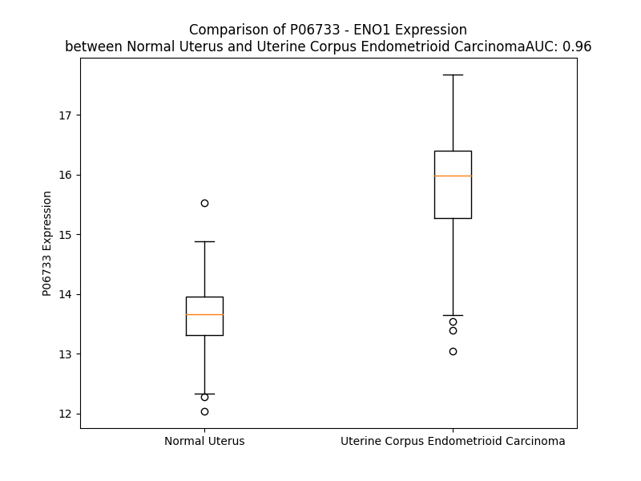

# Detailed Data for P06733

## Introduction to the Detailed Summary

### How to Interpret the Results

- **Summary & Metrics**: This section provides a quick reference to essential protein attributes, including expression changes, family classification, and biomarker applications. Regulation status (upregulated/downregulated) indicates the protein's behavior in a disease context. Some information comes from the original excel file with the proteins selected from literature, while others are derived from the analyses.
- **Expression Comparison**: A visual representation comparing protein expression between normal and disease states. It highlights significant changes in expression levels that might indicate diagnostic or therapeutic relevance. This is data coming from transcriptomics experiments and could not translate similarly to protein levels.
- **Isoform Alignment**: An interactive view of isoform alignments, revealing structural and functional differences between variants of the protein.
- **Interactors & Homologs**: Tables listing known interaction partners and homologous proteins, the more interactors and homologs, the more complex the protein is to design an antibody for.
- **Biological Assemblies**: Information about the structural arrangement of the protein in different assemblies, providing insights into its functional state but also the complexity of the protein to develop antibodies.
- **Combined Per-Residue Information**: A detailed table summarizing residue-level data. This includes predictions for epitope regions, aggregation tendencies, and modifications that might impact the protein's function. Each row corresponds to a residue in the protein, providing insights into specific sites that may be important for research or drug development.
## Summary & Metrics

- **UniProt Accession**: P06733
- **Gene Name**: ENO1
- **Protein Name**: Alpha-enolase
- **Swiss Prot**: ENOA_HUMAN
- **Family**: enzyme
- **Biomarker Application**: diagnosis
- **Number of Isoforms**: 0
- **Regulation**: 2
- **(transcriptomics) AUC**: 0.99
- **(transcriptomics) Fold Change**: 1.16
- **(transcriptomics) Regulation**: Upregulated
- **Discotope Epitope Count**: 61
- **Max n_uniprots (Homo)**: 2
- **Max n_uniprots (Hetero)**: 3

## Expression Comparison

## Interactors

| preferredName_A   | preferredName_B   |   score |
|:------------------|:------------------|--------:|
| ENO1              | GAPDH             |   0.998 |
| ENO1              | TPI1              |   0.998 |
| ENO1              | PLG               |   0.997 |
| ENO1              | PKM               |   0.997 |
| ENO1              | PGAM1             |   0.996 |
| ENO1              | PGK1              |   0.996 |
| ENO1              | GPI               |   0.994 |
| ENO1              | PGAM4             |   0.992 |
| ENO1              | ALDOA             |   0.988 |
| ENO1              | PKLR              |   0.983 |
| ENO1              | PGAM2             |   0.98  |
| ENO1              | BPGM              |   0.977 |
| ENO1              | TALDO1            |   0.968 |
| ENO1              | TKT               |   0.967 |
| ENO1              | PCK2              |   0.963 |
| ENO1              | PCK1              |   0.962 |
| ENO1              | ENO2              |   0.954 |
| ENO1              | ALDOC             |   0.951 |
| ENO1              | TKTL2             |   0.95  |
| ENO1              | H6PD              |   0.948 |
| ENO1              | TKTL1             |   0.948 |
| ENO1              | GLYCTK            |   0.945 |
| ENO1              | HLA-DRB1          |   0.942 |
| ENO1              | PGK2              |   0.937 |
| ENO1              | ALDOB             |   0.936 |
| ENO1              | EGFR              |   0.928 |
| ENO1              | PGM1              |   0.927 |
| ENO1              | ENO3              |   0.925 |
| ENO1              | LDHA              |   0.924 |
| ENO1              | CSTF3             |   0.91  |
| ENO1              | HLA-DRA           |   0.906 |
| ENO1              | LOC112694756      |   0.904 |
| ENO1              | PGD               |   0.903 |
| ENO1              | G6PD              |   0.903 |

## Homologs

| uniprot_id   | gene_id   |
|:-------------|:----------|
| Q6FHV6       | ENO2      |
| E5RJH5       | ENO3      |
| A6NNW6       | ENO4      |

## Biological Assemblies

|   Unnamed: 0 |   assembly |   n_uniprots | composition   | crystal_id   |
|-------------:|-----------:|-------------:|:--------------|:-------------|
|            0 |          1 |            3 | Hetero        | 5lax         |
|            1 |          2 |            3 | Hetero        | 5lax         |
|            0 |          1 |            2 | Homo          | 2psn         |
|            1 |          2 |            2 | Homo          | 2psn         |
|            0 |          1 |            3 | Hetero        | 5ock         |
|            0 |          1 |            3 | Hetero        | 5jlz         |
|            1 |          2 |            3 | Hetero        | 5jlz         |
|            0 |          1 |            3 | Hetero        | 5ni9         |
|            0 |          1 |            2 | Homo          | 3b97         |
|            1 |          2 |            2 | Homo          | 3b97         |
|            0 |          1 |            3 | Hetero        | 5nig         |

## Combined Per-Residue Information

|   res | aa   |   epitope_score | epitope   |   relative_surface_accessibility |   modeling_confidence |   Aggregation | modification                              |
|------:|:-----|----------------:|:----------|---------------------------------:|----------------------:|--------------:|:------------------------------------------|
|     1 | M    |         0.04574 | False     |                          0.22588 |                 82.76 |         0     | N/A                                       |
|     2 | S    |         0.0621  | False     |                          0.31817 |                 87.39 |         0     | N-acetylserine                            |
|     3 | I    |         0.05159 | False     |                          0.02607 |                 97.14 |         0     | N/A                                       |
|     4 | L    |         0.15068 | False     |                          0.6473  |                 97.65 |         0     | N/A                                       |
|     5 | K    |         0.11999 | False     |                          0.55519 |                 98.2  |         0     | N6-acetyllysine                           |
|     6 | I    |         0.03143 | False     |                          0.05576 |                 98.72 |         0     | N/A                                       |
|     7 | H    |         0.10099 | False     |                          0.3717  |                 98.81 |         0     | N/A                                       |
|     8 | A    |         0.01581 | False     |                          0.01508 |                 98.89 |         0     | N/A                                       |
|     9 | R    |         0.19943 | True      |                          0.30214 |                 98.87 |         0     | N/A                                       |
|    10 | E    |         0.09795 | False     |                          0.24216 |                 98.72 |         0     | N/A                                       |
|    11 | I    |         0.12523 | False     |                          0.18159 |                 98.78 |         0     | N/A                                       |
|    12 | F    |         0.22469 | True      |                          0.564   |                 98.71 |         0     | N/A                                       |
|    13 | D    |         0.04585 | False     |                          0.05432 |                 98.64 |         0     | N/A                                       |
|    14 | S    |         0.10117 | False     |                          0.20902 |                 98.19 |         0     | N/A                                       |
|    15 | R    |         0.18897 | True      |                          0.2674  |                 96.78 |         0     | N/A                                       |
|    16 | G    |         0.23237 | True      |                          0.55967 |                 97.79 |         0     | N/A                                       |
|    17 | N    |         0.12163 | False     |                          0.17838 |                 98.25 |         0     | N/A                                       |
|    18 | P    |         0.01626 | False     |                          0.00497 |                 98.52 |         0     | N/A                                       |
|    19 | T    |         0.00884 | False     |                          0.01375 |                 98.86 |         0     | N/A                                       |
|    20 | V    |         0.00254 | False     |                          0       |                 98.82 |         0     | N/A                                       |
|    21 | E    |         0.04012 | False     |                          0.08413 |                 98.93 |         0     | N/A                                       |
|    22 | V    |         0.00457 | False     |                          0       |                 98.93 |         0     | N/A                                       |
|    23 | D    |         0.01951 | False     |                          0.01513 |                 98.87 |         0     | N/A                                       |
|    24 | L    |         0.00819 | False     |                          0       |                 98.76 |         0     | N/A                                       |
|    25 | F    |         0.06914 | False     |                          0.3161  |                 98.51 |         0     | N/A                                       |
|    26 | T    |         0.0303  | False     |                          0.05278 |                 98.12 |         0     | N/A                                       |
|    27 | S    |         0.17544 | False     |                          0.66588 |                 97.08 |         0     | Phosphoserine                             |
|    28 | K    |         0.28352 | True      |                          0.63224 |                 97.37 |         0     | N/A                                       |
|    29 | G    |         0.10473 | False     |                          0.39665 |                 97.72 |         0     | N/A                                       |
|    30 | L    |         0.14645 | False     |                          0.48003 |                 98.37 |         0     | N/A                                       |
|    31 | F    |         0.10206 | False     |                          0.08585 |                 98.71 |         0     | N/A                                       |
|    32 | R    |         0.08003 | False     |                          0.45514 |                 98.85 |         0     | N/A                                       |
|    33 | A    |         0.00645 | False     |                          0.00383 |                 98.85 |         0     | N/A                                       |
|    34 | A    |         0.02649 | False     |                          0.05326 |                 98.8  |         0     | N/A                                       |
|    35 | V    |         0.01141 | False     |                          0.01428 |                 98.74 |         0     | N/A                                       |
|    36 | P    |         0.03552 | False     |                          0.0931  |                 98.35 |         0     | N/A                                       |
|    37 | S    |         0.03421 | False     |                          0.02318 |                 95.66 |         0     | N/A                                       |
|    38 | G    |         0.08411 | False     |                          0.13834 |                 84.39 |         0     | N/A                                       |
|    39 | A    |         0.22386 | True      |                          0.40697 |                 79.48 |         0     | N/A                                       |
|    40 | S    |         0.09463 | False     |                          0.08558 |                 74.48 |         0     | N/A                                       |
|    41 | T    |         0.13525 | False     |                          0.50014 |                 80.42 |         0     | N/A                                       |
|    42 | G    |         0.08946 | False     |                          0.05885 |                 81.23 |         0     | N/A                                       |
|    43 | I    |         0.22128 | True      |                          0.73207 |                 91.41 |         0     | N/A                                       |
|    44 | Y    |         0.16032 | False     |                          0.36814 |                 94.85 |         0     | Phosphotyrosine                           |
|    45 | E    |         0.10454 | False     |                          0.1291  |                 95.71 |         0     | N/A                                       |
|    46 | A    |         0.04578 | False     |                          0.10059 |                 96.53 |         0     | N/A                                       |
|    47 | L    |         0.17267 | False     |                          0.45999 |                 97.23 |         0     | N/A                                       |
|    48 | E    |         0.10216 | False     |                          0.25046 |                 97.59 |         0     | N/A                                       |
|    49 | L    |         0.08525 | False     |                          0.16982 |                 97.99 |         0     | N/A                                       |
|    50 | R    |         0.16506 | False     |                          0.15487 |                 98.03 |         0     | N/A                                       |
|    51 | D    |         0.15056 | False     |                          0.0705  |                 98.09 |         0     | N/A                                       |
|    52 | N    |         0.3075  | True      |                          0.74761 |                 96.87 |         0     | N/A                                       |
|    53 | D    |         0.20262 | True      |                          0.37559 |                 97.65 |         0     | N/A                                       |
|    54 | K    |         0.39202 | True      |                          0.88752 |                 96.55 |         0     | N/A                                       |
|    55 | T    |         0.33099 | True      |                          0.93403 |                 97.43 |         0     | N/A                                       |
|    56 | R    |         0.15099 | False     |                          0.33964 |                 97.62 |         0     | N/A                                       |
|    57 | Y    |         0.31426 | True      |                          0.42514 |                 96.87 |         0     | N/A                                       |
|    58 | M    |         0.43419 | True      |                          0.87938 |                 96.32 |         0     | N/A                                       |
|    59 | G    |         0.16942 | False     |                          0.09161 |                 97.41 |         0     | N/A                                       |
|    60 | K    |         0.17292 | False     |                          0.40395 |                 98.02 |         0     | N6-acetyllysine; alternate                |
|    60 | K    |         0.17292 | False     |                          0.40395 |                 98.02 |         0     | N6-succinyllysine; alternate              |
|    61 | G    |         0.00562 | False     |                          0.00138 |                 98.43 |         0     | N/A                                       |
|    62 | V    |         0.00944 | False     |                          0.00286 |                 98.69 |         0     | N/A                                       |
|    63 | S    |         0.08507 | False     |                          0.41024 |                 98.44 |         0     | N/A                                       |
|    64 | K    |         0.09913 | False     |                          0.47721 |                 98.59 |         0     | N6-acetyllysine                           |
|    65 | A    |         0.00215 | False     |                          0       |                 98.7  |         0     | N/A                                       |
|    66 | V    |         0.03474 | False     |                          0.13615 |                 98.81 |         0     | N/A                                       |
|    67 | E    |         0.11151 | False     |                          0.42162 |                 98.76 |         0     | N/A                                       |
|    68 | H    |         0.10069 | False     |                          0.28001 |                 98.77 |         0     | N/A                                       |
|    69 | I    |         0.00444 | False     |                          0       |                 98.84 |         0     | N/A                                       |
|    70 | N    |         0.13129 | False     |                          0.29252 |                 98.86 |         0     | N/A                                       |
|    71 | K    |         0.22177 | True      |                          0.70524 |                 98.63 |         0     | N6-acetyllysine                           |
|    72 | T    |         0.22161 | True      |                          0.38341 |                 98.56 |         0     | N/A                                       |
|    73 | I    |         0.00746 | False     |                          0       |                 98.61 |         0     | N/A                                       |
|    74 | A    |         0.02482 | False     |                          0.06189 |                 98.52 |         0     | N/A                                       |
|    75 | P    |         0.1245  | False     |                          0.53069 |                 98.13 |         0     | N/A                                       |
|    76 | A    |         0.08952 | False     |                          0.23633 |                 97.85 |         0     | N/A                                       |
|    77 | L    |         0.00764 | False     |                          0.00552 |                 98    |         0     | N/A                                       |
|    78 | V    |         0.0496  | False     |                          0.33766 |                 97.78 |         0     | N/A                                       |
|    79 | S    |         0.172   | False     |                          0.59982 |                 97.25 |         0     | N/A                                       |
|    80 | K    |         0.19109 | True      |                          0.60405 |                 96.01 |         0     | N/A                                       |
|    81 | K    |         0.29295 | True      |                          0.78152 |                 93.79 |         0     | N/A                                       |
|    82 | L    |         0.08925 | False     |                          0.23047 |                 94.93 |         0     | N/A                                       |
|    83 | N    |         0.06583 | False     |                          0.31454 |                 96.66 |         0     | N/A                                       |
|    84 | V    |         0.00218 | False     |                          0       |                 97.9  |         0     | N/A                                       |
|    85 | T    |         0.05991 | False     |                          0.24949 |                 97.9  |         0     | N/A                                       |
|    86 | E    |         0.04509 | False     |                          0.26391 |                 97.94 |         0     | N/A                                       |
|    87 | Q    |         0.01961 | False     |                          0.01162 |                 98.66 |         0     | N/A                                       |
|    88 | E    |         0.05733 | False     |                          0.56841 |                 98.4  |         0     | N/A                                       |
|    89 | K    |         0.08388 | False     |                          0.57686 |                 98.23 |         0     | N6-acetyllysine; alternate                |
|    89 | K    |         0.08388 | False     |                          0.57686 |                 98.23 |         0     | N6-succinyllysine; alternate              |
|    90 | I    |         0.00671 | False     |                          0.0008  |                 98.62 |         0     | N/A                                       |
|    91 | D    |         0.00481 | False     |                          0       |                 98.72 |         0     | N/A                                       |
|    92 | K    |         0.09497 | False     |                          0.59321 |                 98.39 |         0     | N6-acetyllysine                           |
|    93 | L    |         0.08629 | False     |                          0.20221 |                 98.35 |         0     | N/A                                       |
|    94 | M    |         0.00839 | False     |                          0       |                 98.67 |         0     | N/A                                       |
|    95 | I    |         0.06188 | False     |                          0.27209 |                 98.43 |         0     | N/A                                       |
|    96 | E    |         0.12228 | False     |                          0.55296 |                 98.39 |         0     | N/A                                       |
|    97 | M    |         0.13163 | False     |                          0.22334 |                 98.43 |         0     | N/A                                       |
|    98 | D    |         0.04891 | False     |                          0.02128 |                 98.64 |         0     | N/A                                       |
|    99 | G    |         0.20924 | True      |                          0.75358 |                 98.11 |         0     | N/A                                       |
|   100 | T    |         0.14065 | False     |                          0.33921 |                 98.18 |         0     | N/A                                       |
|   101 | E    |         0.14588 | False     |                          0.72761 |                 95.28 |         0     | N/A                                       |
|   102 | N    |         0.15242 | False     |                          0.40746 |                 96.39 |         0     | N/A                                       |
|   103 | K    |         0.01719 | False     |                          0.01963 |                 98.27 |         0     | N/A                                       |
|   104 | S    |         0.17464 | False     |                          0.33832 |                 97.58 |         0     | N/A                                       |
|   105 | K    |         0.16019 | False     |                          0.53316 |                 98.25 |         0     | N/A                                       |
|   106 | F    |         0.05272 | False     |                          0.02484 |                 98.45 |         0.088 | N/A                                       |
|   107 | G    |         0.00627 | False     |                          0       |                 98.27 |         0.088 | N/A                                       |
|   108 | A    |         0.00941 | False     |                          0.01403 |                 98.43 |         0.31  | N/A                                       |
|   109 | N    |         0.00844 | False     |                          0.02795 |                 98.58 |         0.665 | N/A                                       |
|   110 | A    |         0.00075 | False     |                          0       |                 98.77 |        14.085 | N/A                                       |
|   111 | I    |         0.00207 | False     |                          0       |                 98.82 |        27.163 | N/A                                       |
|   112 | L    |         0.00182 | False     |                          0       |                 98.87 |        28.333 | N/A                                       |
|   113 | G    |         0.00143 | False     |                          0       |                 98.78 |        28.468 | N/A                                       |
|   114 | V    |         0.00121 | False     |                          0       |                 98.87 |        30.221 | N/A                                       |
|   115 | S    |         0.00658 | False     |                          0       |                 98.91 |        27.756 | N/A                                       |
|   116 | L    |         0.00841 | False     |                          0.01731 |                 98.89 |        27.114 | N/A                                       |
|   117 | A    |         0.0004  | False     |                          0       |                 98.84 |        23.429 | N/A                                       |
|   118 | V    |         0.00165 | False     |                          0       |                 98.81 |        20.54  | N/A                                       |
|   119 | C    |         0.00097 | False     |                          0       |                 98.82 |         2.863 | N/A                                       |
|   120 | K    |         0.0145  | False     |                          0.18812 |                 98.86 |         0     | N/A                                       |
|   121 | A    |         0.00126 | False     |                          0       |                 98.74 |         0     | N/A                                       |
|   122 | G    |         0.00223 | False     |                          0       |                 98.66 |         0     | N/A                                       |
|   123 | A    |         0.00612 | False     |                          0.02678 |                 98.68 |         0     | N/A                                       |
|   124 | V    |         0.0714  | False     |                          0.48328 |                 98.36 |         0     | N/A                                       |
|   125 | E    |         0.0431  | False     |                          0.26288 |                 97.82 |         0     | N/A                                       |
|   126 | K    |         0.14036 | False     |                          0.41596 |                 97.56 |         0     | N6-acetyllysine                           |
|   127 | G    |         0.18492 | True      |                          0.80938 |                 97.8  |         0     | N/A                                       |
|   128 | V    |         0.11771 | False     |                          0.31608 |                 98.45 |         0     | N/A                                       |
|   129 | P    |         0.07427 | False     |                          0.36909 |                 98.57 |         0     | N/A                                       |
|   130 | L    |         0.04243 | False     |                          0.16388 |                 98.86 |         0     | N/A                                       |
|   131 | Y    |         0.05091 | False     |                          0.05676 |                 98.79 |         0     | N/A                                       |
|   132 | R    |         0.10919 | False     |                          0.23398 |                 98.67 |         0     | N/A                                       |
|   133 | H    |         0.0078  | False     |                          0       |                 98.74 |         0     | N/A                                       |
|   134 | I    |         0.00234 | False     |                          0       |                 98.86 |         0     | N/A                                       |
|   135 | A    |         0.00346 | False     |                          0       |                 98.59 |         0     | N/A                                       |
|   136 | D    |         0.08961 | False     |                          0.40766 |                 98.32 |         0     | N/A                                       |
|   137 | L    |         0.07774 | False     |                          0.27158 |                 98.5  |         0     | N/A                                       |
|   138 | A    |         0.02558 | False     |                          0.1011  |                 98    |         0     | N/A                                       |
|   139 | G    |         0.13994 | False     |                          0.78861 |                 97.2  |         0     | N/A                                       |
|   140 | N    |         0.09464 | False     |                          0.19866 |                 96.85 |         0     | N/A                                       |
|   141 | S    |         0.12002 | False     |                          0.79894 |                 95.25 |         0     | N/A                                       |
|   142 | E    |         0.09022 | False     |                          0.41219 |                 94.39 |         0     | N/A                                       |
|   143 | V    |         0.04013 | False     |                          0.10134 |                 97.83 |         0     | N/A                                       |
|   144 | I    |         0.03434 | False     |                          0.04    |                 98.37 |         0     | N/A                                       |
|   145 | L    |         0.00606 | False     |                          0.0033  |                 98.81 |         0     | N/A                                       |
|   146 | P    |         0.00196 | False     |                          0       |                 98.86 |         0     | N/A                                       |
|   147 | V    |         0.0011  | False     |                          0       |                 98.93 |         0     | N/A                                       |
|   148 | P    |         0.00361 | False     |                          0       |                 98.91 |         0     | N/A                                       |
|   149 | A    |         0.00384 | False     |                          0.00189 |                 98.93 |         3.335 | N/A                                       |
|   150 | F    |         0.0015  | False     |                          0       |                 98.9  |         3.483 | N/A                                       |
|   151 | N    |         0.01063 | False     |                          0.00947 |                 98.62 |         3.483 | N/A                                       |
|   152 | V    |         0.0014  | False     |                          0       |                 98.71 |         3.483 | N/A                                       |
|   153 | I    |         0.00238 | False     |                          0       |                 98.65 |         3.483 | N/A                                       |
|   154 | N    |         0.00495 | False     |                          0       |                 97.62 |         0.273 | N/A                                       |
|   155 | G    |         0.00367 | False     |                          0       |                 95.79 |         0     | N/A                                       |
|   156 | G    |         0.00923 | False     |                          0.01966 |                 94.98 |         0     | N/A                                       |
|   157 | S    |         0.1189  | False     |                          0.37495 |                 91.74 |         0     | N/A                                       |
|   158 | H    |         0.0565  | False     |                          0.06822 |                 86.07 |         0     | N/A                                       |
|   159 | A    |         0.0528  | False     |                          0.12427 |                 89.69 |         0     | N/A                                       |
|   160 | G    |         0.16062 | False     |                          1.12095 |                 91.23 |         0     | N/A                                       |
|   161 | N    |         0.06722 | False     |                          0.05832 |                 93.78 |         0     | N/A                                       |
|   162 | K    |         0.14062 | False     |                          0.4443  |                 95.14 |         0     | N/A                                       |
|   163 | L    |         0.0036  | False     |                          0       |                 96.23 |         0     | N/A                                       |
|   164 | A    |         0.00819 | False     |                          0.01037 |                 97.14 |         0     | N/A                                       |
|   165 | M    |         0.00922 | False     |                          0       |                 97.97 |         0     | N/A                                       |
|   166 | Q    |         0.01314 | False     |                          0.04117 |                 97.52 |         0     | N/A                                       |
|   167 | E    |         0.01543 | False     |                          0.01807 |                 98.52 |         0     | N/A                                       |
|   168 | F    |         0.00427 | False     |                          0       |                 98.76 |         0.141 | N/A                                       |
|   169 | M    |         0.00835 | False     |                          0.01151 |                 98.87 |         0.141 | N/A                                       |
|   170 | I    |         0.00483 | False     |                          0.0016  |                 98.9  |         0.141 | N/A                                       |
|   171 | L    |         0.00305 | False     |                          0.00165 |                 98.89 |         0.141 | N/A                                       |
|   172 | P    |         0.00289 | False     |                          0.00199 |                 98.86 |         0.141 | N/A                                       |
|   173 | V    |         0.0319  | False     |                          0.04102 |                 98.78 |         0     | N/A                                       |
|   174 | G    |         0.04263 | False     |                          0.25958 |                 98.67 |         0     | N/A                                       |
|   175 | A    |         0.03356 | False     |                          0.07919 |                 98.76 |         0     | N/A                                       |
|   176 | A    |         0.16399 | False     |                          0.78248 |                 98.31 |         0     | N/A                                       |
|   177 | N    |         0.06825 | False     |                          0.39371 |                 98.72 |         0     | N/A                                       |
|   178 | F    |         0.00151 | False     |                          0       |                 98.86 |         0     | N/A                                       |
|   179 | R    |         0.11851 | False     |                          0.55538 |                 98.81 |         0     | N/A                                       |
|   180 | E    |         0.07137 | False     |                          0.16613 |                 98.86 |         0     | N/A                                       |
|   181 | A    |         0.00144 | False     |                          0       |                 98.91 |         0     | N/A                                       |
|   182 | M    |         0.02195 | False     |                          0.09921 |                 98.85 |         0     | N/A                                       |
|   183 | R    |         0.13405 | False     |                          0.47081 |                 98.9  |         0     | N/A                                       |
|   184 | I    |         0.01424 | False     |                          0.0008  |                 98.88 |         0     | N/A                                       |
|   185 | G    |         0.00266 | False     |                          0.00161 |                 98.86 |         0     | N/A                                       |
|   186 | A    |         0.04612 | False     |                          0.26146 |                 98.86 |         0     | N/A                                       |
|   187 | E    |         0.06953 | False     |                          0.30015 |                 98.91 |         0     | N/A                                       |
|   188 | V    |         0.00271 | False     |                          0       |                 98.9  |         0     | N/A                                       |
|   189 | Y    |         0.03195 | False     |                          0.04842 |                 98.91 |         0     | N/A                                       |
|   190 | H    |         0.12309 | False     |                          0.58891 |                 98.84 |         0     | N/A                                       |
|   191 | N    |         0.08953 | False     |                          0.24592 |                 98.82 |         0     | N/A                                       |
|   192 | L    |         0.00291 | False     |                          0       |                 98.82 |         0     | N/A                                       |
|   193 | K    |         0.10798 | False     |                          0.43934 |                 98.75 |         0     | N6-acetyllysine                           |
|   194 | N    |         0.30639 | True      |                          0.57029 |                 98.59 |         0     | N/A                                       |
|   195 | V    |         0.07265 | False     |                          0.06801 |                 98.58 |         0     | N/A                                       |
|   196 | I    |         0.01298 | False     |                          0       |                 98.59 |         0     | N/A                                       |
|   197 | K    |         0.27185 | True      |                          0.55787 |                 98.32 |         0     | N/A                                       |
|   198 | E    |         0.50725 | True      |                          0.70121 |                 98.05 |         0     | N/A                                       |
|   199 | K    |         0.37823 | True      |                          0.56538 |                 97.9  |         0     | N6-acetyllysine                           |
|   200 | Y    |         0.39394 | True      |                          0.34847 |                 97.4  |         0     | N/A                                       |
|   201 | G    |         0.18799 | True      |                          0.38934 |                 97.26 |         0     | N/A                                       |
|   202 | K    |         0.29583 | True      |                          0.72032 |                 96.54 |         0     | N6-acetyllysine; alternate                |
|   203 | D    |         0.24605 | True      |                          0.65546 |                 95.67 |         0     | N/A                                       |
|   204 | A    |         0.07535 | False     |                          0.10059 |                 97.05 |         0     | N/A                                       |
|   205 | T    |         0.12192 | False     |                          0.12914 |                 97.61 |         0     | N/A                                       |
|   206 | N    |         0.31402 | True      |                          0.63733 |                 97.39 |         0     | N/A                                       |
|   207 | V    |         0.23738 | True      |                          0.39565 |                 97.96 |         0     | N/A                                       |
|   208 | G    |         0.12401 | False     |                          0.09106 |                 95.71 |         0     | N/A                                       |
|   209 | D    |         0.14074 | False     |                          0.2264  |                 94.67 |         0     | N/A                                       |
|   210 | E    |         0.02391 | False     |                          0.01185 |                 97.87 |         0     | N/A                                       |
|   211 | G    |         0.00575 | False     |                          0       |                 98.16 |         0     | N/A                                       |
|   212 | G    |         0.00292 | False     |                          0       |                 98.43 |         0     | N/A                                       |
|   213 | F    |         0.00823 | False     |                          0.00637 |                 98.59 |         0     | N/A                                       |
|   214 | A    |         0.11022 | False     |                          0.2374  |                 97.76 |         0     | N/A                                       |
|   215 | P    |         0.00926 | False     |                          0       |                 96.96 |         0     | N/A                                       |
|   216 | N    |         0.15384 | False     |                          0.72929 |                 93.25 |         0     | N/A                                       |
|   217 | I    |         0.10566 | False     |                          0.04615 |                 95.24 |         0     | N/A                                       |
|   218 | L    |         0.17138 | False     |                          0.41645 |                 94.11 |         0     | N/A                                       |
|   219 | E    |         0.13295 | False     |                          0.59207 |                 95.62 |         0     | N/A                                       |
|   220 | N    |         0.01758 | False     |                          0.03993 |                 95.9  |         0     | N/A                                       |
|   221 | K    |         0.08704 | False     |                          0.47481 |                 97.07 |         0     | N/A                                       |
|   222 | E    |         0.06527 | False     |                          0.16637 |                 97.64 |         0     | N/A                                       |
|   223 | G    |         0.00247 | False     |                          0       |                 97.9  |         0     | N/A                                       |
|   224 | L    |         0.00421 | False     |                          0       |                 98.56 |         0.372 | N/A                                       |
|   225 | E    |         0.15968 | False     |                          0.30676 |                 98.38 |         0.372 | N/A                                       |
|   226 | L    |         0.03026 | False     |                          0.02297 |                 98.48 |         0.372 | N/A                                       |
|   227 | L    |         0.00159 | False     |                          0       |                 98.61 |         0.372 | N/A                                       |
|   228 | K    |         0.08847 | False     |                          0.50786 |                 98.37 |         0.372 | N6-(2-hydroxyisobutyryl)lysine; alternate |
|   228 | K    |         0.08847 | False     |                          0.50786 |                 98.37 |         0.372 | N6-acetyllysine; alternate                |
|   228 | K    |         0.08847 | False     |                          0.50786 |                 98.37 |         0.372 | N6-succinyllysine; alternate              |
|   229 | T    |         0.12838 | False     |                          0.40397 |                 98.5  |         0.372 | N/A                                       |
|   230 | A    |         0.00263 | False     |                          0       |                 98.76 |         0.372 | N/A                                       |
|   231 | I    |         0.0446  | False     |                          0.0312  |                 98.79 |         0.372 | N/A                                       |
|   232 | G    |         0.21247 | True      |                          0.46431 |                 98.63 |         0     | N/A                                       |
|   233 | K    |         0.18563 | True      |                          0.56657 |                 98.54 |         0     | N6-acetyllysine; alternate                |
|   233 | K    |         0.18563 | True      |                          0.56657 |                 98.54 |         0     | N6-malonyllysine; alternate               |
|   234 | A    |         0.10097 | False     |                          0.18746 |                 98.62 |         0     | N/A                                       |
|   235 | G    |         0.26794 | True      |                          0.67218 |                 98.64 |         0     | N/A                                       |
|   236 | Y    |         0.11082 | False     |                          0.10707 |                 98.69 |         0.292 | N/A                                       |
|   237 | T    |         0.16364 | False     |                          0.73249 |                 98.38 |         0.292 | N/A                                       |
|   238 | D    |         0.25275 | True      |                          0.63031 |                 97.86 |         0.435 | N/A                                       |
|   239 | K    |         0.12705 | False     |                          0.27737 |                 98.65 |         0.435 | N/A                                       |
|   240 | V    |         0.01726 | False     |                          0.01434 |                 98.86 |         9.49  | N/A                                       |
|   241 | V    |         0.04199 | False     |                          0.14281 |                 98.81 |         9.49  | N/A                                       |
|   242 | I    |         0.00404 | False     |                          0       |                 98.87 |         9.49  | N/A                                       |
|   243 | G    |         0.01405 | False     |                          0.00322 |                 98.84 |         9.055 | N/A                                       |
|   244 | M    |         0.00271 | False     |                          0.00159 |                 98.79 |         9.055 | N/A                                       |
|   245 | D    |         0.01799 | False     |                          0.00935 |                 98.63 |         0     | N/A                                       |
|   246 | V    |         0.0055  | False     |                          0.00141 |                 98.51 |         0     | N/A                                       |
|   247 | A    |         0.04683 | False     |                          0.04303 |                 97.55 |         0     | N/A                                       |
|   248 | A    |         0.00196 | False     |                          0       |                 98.32 |         0     | N/A                                       |
|   249 | S    |         0.10291 | False     |                          0.14002 |                 97.73 |         0     | N/A                                       |
|   250 | E    |         0.12    | False     |                          0.25622 |                 96.29 |         0     | N/A                                       |
|   251 | F    |         0.01405 | False     |                          0.00127 |                 97.19 |         0     | N/A                                       |
|   252 | F    |         0.14783 | False     |                          0.29163 |                 97.86 |         0     | N/A                                       |
|   253 | R    |         0.40101 | True      |                          0.34657 |                 97.05 |         0     | N/A                                       |
|   254 | S    |         0.37278 | True      |                          0.8715  |                 94.41 |         0     | Phosphoserine                             |
|   255 | G    |         0.19105 | True      |                          0.49214 |                 97.05 |         0     | N/A                                       |
|   256 | K    |         0.2769  | True      |                          0.44235 |                 98.45 |         0     | N6-acetyllysine                           |
|   257 | Y    |         0.02228 | False     |                          0       |                 98.61 |         0     | N/A                                       |
|   258 | D    |         0.04825 | False     |                          0.01198 |                 98.18 |         0     | N/A                                       |
|   259 | L    |         0.12061 | False     |                          0.21756 |                 97.72 |         0     | N/A                                       |
|   260 | D    |         0.10562 | False     |                          0.12985 |                 96.82 |         0     | N/A                                       |
|   261 | F    |         0.23468 | True      |                          0.20376 |                 96.28 |         0     | N/A                                       |
|   262 | K    |         0.13312 | False     |                          0.34344 |                 94.95 |         0     | N/A                                       |
|   263 | S    |         0.14728 | False     |                          0.13359 |                 95.26 |         0     | Phosphoserine                             |
|   264 | P    |         0.33662 | True      |                          0.90952 |                 96.01 |         0     | N/A                                       |
|   265 | D    |         0.42467 | True      |                          0.63753 |                 95.71 |         0     | N/A                                       |
|   266 | D    |         0.25824 | True      |                          0.3747  |                 96.91 |         0     | N/A                                       |
|   267 | P    |         0.39417 | True      |                          0.64644 |                 96.52 |         0     | N/A                                       |
|   268 | S    |         0.44192 | True      |                          0.78242 |                 96.93 |         0     | N/A                                       |
|   269 | R    |         0.20789 | True      |                          0.25572 |                 96.33 |         0     | N/A                                       |
|   270 | Y    |         0.15751 | False     |                          0.11149 |                 98.1  |         0     | N/A                                       |
|   271 | I    |         0.19436 | True      |                          0.21839 |                 98.5  |         0     | N/A                                       |
|   272 | S    |         0.19911 | True      |                          0.26489 |                 98.49 |         0     | Phosphoserine                             |
|   273 | P    |         0.05151 | False     |                          0.23733 |                 98.47 |         0     | N/A                                       |
|   274 | D    |         0.19927 | True      |                          0.48904 |                 98.37 |         0     | N/A                                       |
|   275 | Q    |         0.22305 | True      |                          0.52211 |                 98.47 |         0     | N/A                                       |
|   276 | L    |         0.00498 | False     |                          0       |                 98.56 |         0.135 | N/A                                       |
|   277 | A    |         0.03719 | False     |                          0.09183 |                 98.63 |         0.135 | N/A                                       |
|   278 | D    |         0.25622 | True      |                          0.49777 |                 98.28 |         0.135 | N/A                                       |
|   279 | L    |         0.09874 | False     |                          0.32175 |                 98.24 |         0.135 | N/A                                       |
|   280 | Y    |         0.00376 | False     |                          0       |                 98.63 |         0.135 | N/A                                       |
|   281 | K    |         0.15719 | False     |                          0.40678 |                 98.4  |         0.135 | N6-(2-hydroxyisobutyryl)lysine; alternate |
|   281 | K    |         0.15719 | False     |                          0.40678 |                 98.4  |         0.135 | N6-acetyllysine; alternate                |
|   282 | S    |         0.17226 | False     |                          0.325   |                 98.11 |         0.135 | N/A                                       |
|   283 | F    |         0.02169 | False     |                          0.01083 |                 98.54 |         0.135 | N/A                                       |
|   284 | I    |         0.17198 | False     |                          0.23805 |                 98.4  |         0.135 | N/A                                       |
|   285 | K    |         0.25912 | True      |                          0.85547 |                 97.97 |         0     | N6-acetyllysine                           |
|   286 | D    |         0.28101 | True      |                          0.41362 |                 97.98 |         0     | N/A                                       |
|   287 | Y    |         0.10252 | False     |                          0.04416 |                 98.41 |         0     | Phosphotyrosine                           |
|   288 | P    |         0.06954 | False     |                          0.43456 |                 98.05 |         0     | N/A                                       |
|   289 | V    |         0.02731 | False     |                          0.02745 |                 98.76 |         0     | N/A                                       |
|   290 | V    |         0.06175 | False     |                          0.27151 |                 98.74 |         0     | N/A                                       |
|   291 | S    |         0.01656 | False     |                          0.01577 |                 98.91 |         0     | Phosphoserine                             |
|   292 | I    |         0.008   | False     |                          0       |                 98.89 |         0     | N/A                                       |
|   293 | E    |         0.01039 | False     |                          0.0056  |                 98.9  |         0     | N/A                                       |
|   294 | D    |         0.07041 | False     |                          0.01126 |                 98.61 |         0     | N/A                                       |
|   295 | P    |         0.00261 | False     |                          0       |                 98.76 |         0     | N/A                                       |
|   296 | F    |         0.00601 | False     |                          0.00407 |                 98.81 |         0     | N/A                                       |
|   297 | D    |         0.10081 | False     |                          0.07332 |                 98.51 |         0     | N/A                                       |
|   298 | Q    |         0.08804 | False     |                          0.08533 |                 98.08 |         0     | N/A                                       |
|   299 | D    |         0.16427 | False     |                          0.37211 |                 98.18 |         0     | N/A                                       |
|   300 | D    |         0.08277 | False     |                          0.17445 |                 97.95 |         0     | N/A                                       |
|   301 | W    |         0.12269 | False     |                          0.11589 |                 98.37 |         0     | N/A                                       |
|   302 | G    |         0.21139 | True      |                          0.48483 |                 98.12 |         0     | N/A                                       |
|   303 | A    |         0.05025 | False     |                          0.0744  |                 98.59 |         0     | N/A                                       |
|   304 | W    |         0.00597 | False     |                          0.00111 |                 98.8  |         0     | N/A                                       |
|   305 | Q    |         0.10494 | False     |                          0.33331 |                 98.46 |         0     | N/A                                       |
|   306 | K    |         0.13384 | False     |                          0.63424 |                 98.2  |         0     | N/A                                       |
|   307 | F    |         0.01516 | False     |                          0.00681 |                 98.66 |         0.575 | N/A                                       |
|   308 | T    |         0.02331 | False     |                          0.16865 |                 98.66 |         0.575 | N/A                                       |
|   309 | A    |         0.11474 | False     |                          0.87438 |                 98.32 |         0.575 | N/A                                       |
|   310 | S    |         0.13845 | False     |                          0.53585 |                 97.44 |         0.575 | N/A                                       |
|   311 | A    |         0.05116 | False     |                          0.08568 |                 97.52 |         0.575 | N/A                                       |
|   312 | G    |         0.20084 | True      |                          0.87935 |                 96.75 |         0.575 | N/A                                       |
|   313 | I    |         0.10216 | False     |                          0.11801 |                 98.58 |         0.575 | N/A                                       |
|   314 | Q    |         0.008   | False     |                          0.00252 |                 98.84 |         0.575 | N/A                                       |
|   315 | V    |         0.00658 | False     |                          0.00381 |                 98.89 |         0.575 | N/A                                       |
|   316 | V    |         0.01259 | False     |                          0.00381 |                 98.91 |         0.575 | N/A                                       |
|   317 | G    |         0.00298 | False     |                          0       |                 98.7  |         0     | N/A                                       |
|   318 | D    |         0.01861 | False     |                          0.04162 |                 98.37 |         0     | N/A                                       |
|   319 | D    |         0.01209 | False     |                          0.02927 |                 97.29 |         0     | N/A                                       |
|   320 | L    |         0.00462 | False     |                          0.00071 |                 98.37 |         0     | N/A                                       |
|   321 | T    |         0.00466 | False     |                          0       |                 98.54 |         0     | N/A                                       |
|   322 | V    |         0.00289 | False     |                          0.00095 |                 97.71 |         0     | N/A                                       |
|   323 | T    |         0.00288 | False     |                          0       |                 98.35 |         0     | N/A                                       |
|   324 | N    |         0.07613 | False     |                          0.19804 |                 97.16 |         0     | N/A                                       |
|   325 | P    |         0.07759 | False     |                          0.30391 |                 95.44 |         0     | N/A                                       |
|   326 | K    |         0.17214 | False     |                          0.69069 |                 96.34 |         0     | N/A                                       |
|   327 | R    |         0.12375 | False     |                          0.12615 |                 98.2  |         0     | N/A                                       |
|   328 | I    |         0.00526 | False     |                          0       |                 98.61 |         0     | N/A                                       |
|   329 | A    |         0.07041 | False     |                          0.36632 |                 98.14 |         0     | N/A                                       |
|   330 | K    |         0.1826  | True      |                          0.40884 |                 98.48 |         0     | N/A                                       |
|   331 | A    |         0.00265 | False     |                          0       |                 98.74 |         0     | N/A                                       |
|   332 | V    |         0.1378  | False     |                          0.20553 |                 98.36 |         0     | N/A                                       |
|   333 | N    |         0.24431 | True      |                          0.78235 |                 98.18 |         0     | N/A                                       |
|   334 | E    |         0.09087 | False     |                          0.2616  |                 97.97 |         0     | N/A                                       |
|   335 | K    |         0.11431 | False     |                          0.7511  |                 98.21 |         0     | N6-acetyllysine                           |
|   336 | S    |         0.00455 | False     |                          0       |                 98.61 |         0     | N/A                                       |
|   337 | C    |         0.01566 | False     |                          0.02221 |                 98.79 |         0     | N/A                                       |
|   338 | N    |         0.09    | False     |                          0.23954 |                 98.73 |         0     | N/A                                       |
|   339 | C    |         0.00343 | False     |                          0       |                 98.88 |         0     | N/A                                       |
|   340 | L    |         0.00244 | False     |                          0       |                 98.85 |         0     | N/A                                       |
|   341 | L    |         0.00624 | False     |                          0       |                 98.83 |         0     | N/A                                       |
|   342 | L    |         0.00219 | False     |                          0.00183 |                 98.82 |         0     | N/A                                       |
|   343 | K    |         0.0699  | False     |                          0.0786  |                 98.72 |         0     | N6-acetyllysine                           |
|   344 | V    |         0.01553 | False     |                          0.03619 |                 98.35 |         0     | N/A                                       |
|   345 | N    |         0.04669 | False     |                          0.08443 |                 97.77 |         0     | N/A                                       |
|   346 | Q    |         0.00947 | False     |                          0.00555 |                 97.84 |         0     | N/A                                       |
|   347 | I    |         0.06163 | False     |                          0.0696  |                 98.16 |         0     | N/A                                       |
|   348 | G    |         0.00505 | False     |                          0       |                 98.13 |         0     | N/A                                       |
|   349 | S    |         0.01068 | False     |                          0       |                 98.76 |         0     | N/A                                       |
|   350 | V    |         0.00174 | False     |                          0.00286 |                 98.81 |         0     | N/A                                       |
|   351 | T    |         0.03399 | False     |                          0.10482 |                 98.72 |         0     | N/A                                       |
|   352 | E    |         0.03053 | False     |                          0.14917 |                 98.6  |         0     | N/A                                       |
|   353 | S    |         0.00194 | False     |                          0.00104 |                 98.69 |         0     | N/A                                       |
|   354 | L    |         0.03392 | False     |                          0.06265 |                 98.44 |         0     | N/A                                       |
|   355 | Q    |         0.07672 | False     |                          0.41951 |                 98.05 |         0     | N/A                                       |
|   356 | A    |         0.00169 | False     |                          0       |                 98.6  |         0     | N/A                                       |
|   357 | C    |         0.00277 | False     |                          0.00094 |                 98.36 |         0     | N/A                                       |
|   358 | K    |         0.08806 | False     |                          0.43896 |                 97.13 |         0     | N/A                                       |
|   359 | L    |         0.09364 | False     |                          0.32669 |                 97.92 |         0     | N/A                                       |
|   360 | A    |         0.00294 | False     |                          0       |                 98.35 |         0     | N/A                                       |
|   361 | Q    |         0.07271 | False     |                          0.31494 |                 96.9  |         0     | N/A                                       |
|   362 | A    |         0.11655 | False     |                          0.84345 |                 96.41 |         0     | N/A                                       |
|   363 | N    |         0.13474 | False     |                          0.41433 |                 97.28 |         0     | N/A                                       |
|   364 | G    |         0.09838 | False     |                          0.6856  |                 96.42 |         0.321 | N/A                                       |
|   365 | W    |         0.1012  | False     |                          0.08331 |                 98.31 |         4.055 | N/A                                       |
|   366 | G    |         0.01233 | False     |                          0.04513 |                 98.54 |         4.055 | N/A                                       |
|   367 | V    |         0.00627 | False     |                          0.00736 |                 98.84 |         4.055 | N/A                                       |
|   368 | M    |         0.01834 | False     |                          0.00647 |                 98.91 |         4.055 | N/A                                       |
|   369 | V    |         0.00213 | False     |                          0       |                 98.88 |         4.055 | N/A                                       |
|   370 | S    |         0.04218 | False     |                          0.02614 |                 98.82 |         0.161 | N/A                                       |
|   371 | H    |         0.02514 | False     |                          0.01719 |                 98.39 |         0     | N/A                                       |
|   372 | R    |         0.03753 | False     |                          0.02729 |                 97.5  |         0     | N/A                                       |
|   373 | S    |         0.03862 | False     |                          0.03355 |                 94.24 |         0     | N/A                                       |
|   374 | G    |         0.00936 | False     |                          0       |                 96.58 |         0     | N/A                                       |
|   375 | E    |         0.03858 | False     |                          0.02861 |                 98.38 |         0     | N/A                                       |
|   376 | T    |         0.03298 | False     |                          0.02883 |                 98.79 |         0     | N/A                                       |
|   377 | E    |         0.12226 | False     |                          0.62674 |                 98.68 |         0     | N/A                                       |
|   378 | D    |         0.04619 | False     |                          0.11766 |                 98.82 |         0     | N/A                                       |
|   379 | T    |         0.06924 | False     |                          0.25194 |                 98.88 |         0     | N/A                                       |
|   380 | F    |         0.01524 | False     |                          0.03153 |                 98.94 |         0     | N/A                                       |
|   381 | I    |         0.04144 | False     |                          0.05795 |                 98.87 |         0     | N/A                                       |
|   382 | A    |         0.00188 | False     |                          0       |                 98.93 |         0     | N/A                                       |
|   383 | D    |         0.01173 | False     |                          0.02985 |                 98.92 |         0     | N/A                                       |
|   384 | L    |         0.00202 | False     |                          0.00165 |                 98.91 |         9.984 | N/A                                       |
|   385 | V    |         0.0018  | False     |                          0       |                 98.87 |        10.432 | N/A                                       |
|   386 | V    |         0.00268 | False     |                          0       |                 98.85 |        10.432 | N/A                                       |
|   387 | G    |         0.00165 | False     |                          0       |                 98.65 |        10.432 | N/A                                       |
|   388 | L    |         0.01079 | False     |                          0.01029 |                 98.58 |        10.432 | N/A                                       |
|   389 | C    |         0.00726 | False     |                          0.00635 |                 98.23 |         3.156 | N/A                                       |
|   390 | T    |         0.00512 | False     |                          0.00873 |                 98.59 |         1.342 | N/A                                       |
|   391 | G    |         0.00245 | False     |                          0       |                 98.65 |         0.262 | N/A                                       |
|   392 | Q    |         0.00588 | False     |                          0.00068 |                 98.88 |         0.262 | N/A                                       |
|   393 | I    |         0.00285 | False     |                          0       |                 98.92 |         0.262 | N/A                                       |
|   394 | K    |         0.0286  | False     |                          0.0181  |                 98.85 |         0     | N/A                                       |
|   395 | T    |         0.00262 | False     |                          0       |                 98.82 |         0     | N/A                                       |
|   396 | G    |         0.00882 | False     |                          0.00415 |                 98.6  |         0     | N/A                                       |
|   397 | A    |         0.00222 | False     |                          0       |                 98.73 |         0     | N/A                                       |
|   398 | P    |         0.03911 | False     |                          0.1151  |                 98.77 |         0     | N/A                                       |
|   399 | C    |         0.07366 | False     |                          0.24659 |                 98.71 |         0     | N/A                                       |
|   400 | R    |         0.15748 | False     |                          0.29988 |                 98.36 |         0     | N/A                                       |
|   401 | S    |         0.22155 | True      |                          0.65194 |                 98.76 |         0     | N/A                                       |
|   402 | E    |         0.04935 | False     |                          0.10853 |                 98.71 |         0     | N/A                                       |
|   403 | R    |         0.00394 | False     |                          0       |                 98.77 |         0     | N/A                                       |
|   404 | L    |         0.08318 | False     |                          0.30831 |                 98.87 |         0     | N/A                                       |
|   405 | A    |         0.03905 | False     |                          0.20299 |                 98.87 |         0     | N/A                                       |
|   406 | K    |         0.00444 | False     |                          0.00198 |                 98.91 |         0     | N6-acetyllysine                           |
|   407 | Y    |         0.00585 | False     |                          0       |                 98.91 |         0     | N/A                                       |
|   408 | N    |         0.12396 | False     |                          0.36297 |                 98.93 |         0     | N/A                                       |
|   409 | Q    |         0.03005 | False     |                          0.17947 |                 98.91 |         0     | N/A                                       |
|   410 | L    |         0.0041  | False     |                          0       |                 98.94 |         0     | N/A                                       |
|   411 | L    |         0.09109 | False     |                          0.28512 |                 98.89 |         0     | N/A                                       |
|   412 | R    |         0.21482 | True      |                          0.55496 |                 98.92 |         0     | N/A                                       |
|   413 | I    |         0.0301  | False     |                          0.0168  |                 98.87 |         0     | N/A                                       |
|   414 | E    |         0.05125 | False     |                          0.08836 |                 98.81 |         0     | N/A                                       |
|   415 | E    |         0.22547 | True      |                          0.63445 |                 98.74 |         0     | N/A                                       |
|   416 | E    |         0.20495 | True      |                          0.55195 |                 98.6  |         0     | N/A                                       |
|   417 | L    |         0.08992 | False     |                          0.14889 |                 98.32 |         0     | N/A                                       |
|   418 | G    |         0.16501 | False     |                          0.50832 |                 97.98 |         0     | N/A                                       |
|   419 | S    |         0.20023 | True      |                          0.97578 |                 96.7  |         0     | N/A                                       |
|   420 | K    |         0.22008 | True      |                          0.78782 |                 96.49 |         0     | N6-acetyllysine; alternate                |
|   420 | K    |         0.22008 | True      |                          0.78782 |                 96.49 |         0     | N6-malonyllysine; alternate               |
|   420 | K    |         0.22008 | True      |                          0.78782 |                 96.49 |         0     | N6-succinyllysine; alternate              |
|   421 | A    |         0.08724 | False     |                          0.31285 |                 97.44 |         0     | N/A                                       |
|   422 | K    |         0.09984 | False     |                          0.48789 |                 97.79 |         0     | N/A                                       |
|   423 | F    |         0.06713 | False     |                          0.17718 |                 98.48 |         0     | N/A                                       |
|   424 | A    |         0.0187  | False     |                          0.08102 |                 98.5  |         0     | N/A                                       |
|   425 | G    |         0.02207 | False     |                          0.09335 |                 98.48 |         0     | N/A                                       |
|   426 | R    |         0.13747 | False     |                          0.61853 |                 97.89 |         0     | N/A                                       |
|   427 | N    |         0.09028 | False     |                          0.61059 |                 97.99 |         0     | N/A                                       |
|   428 | F    |         0.08077 | False     |                          0.05414 |                 98.51 |         0     | N/A                                       |
|   429 | R    |         0.10509 | False     |                          0.31781 |                 98.34 |         0     | N/A                                       |
|   430 | N    |         0.09168 | False     |                          0.48637 |                 96.6  |         0     | N/A                                       |
|   431 | P    |         0.04229 | False     |                          0.18862 |                 96.06 |         0     | N/A                                       |
|   432 | L    |         0.12626 | False     |                          0.53672 |                 90.5  |         0     | N/A                                       |
|   433 | A    |         0.1121  | False     |                          0.70774 |                 81.39 |         0     | N/A                                       |
|   434 | K    |         0.13704 | False     |                          1.29642 |                 58    |         0     | N/A                                       |

