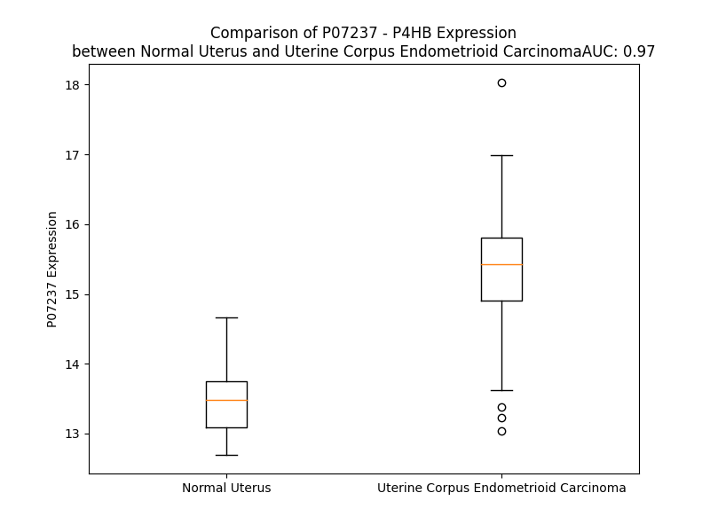

# Detailed Data for P07237

## Introduction to the Detailed Summary

### How to Interpret the Results

- **Summary & Metrics**: This section provides a quick reference to essential protein attributes, including expression changes, family classification, and biomarker applications. Regulation status (upregulated/downregulated) indicates the protein's behavior in a disease context. Some information comes from the original excel file with the proteins selected from literature, while others are derived from the analyses.
- **Expression Comparison**: A visual representation comparing protein expression between normal and disease states. It highlights significant changes in expression levels that might indicate diagnostic or therapeutic relevance. This is data coming from transcriptomics experiments and could not translate similarly to protein levels.
- **Isoform Alignment**: An interactive view of isoform alignments, revealing structural and functional differences between variants of the protein.
- **Interactors & Homologs**: Tables listing known interaction partners and homologous proteins, the more interactors and homologs, the more complex the protein is to design an antibody for.
- **Biological Assemblies**: Information about the structural arrangement of the protein in different assemblies, providing insights into its functional state but also the complexity of the protein to develop antibodies.
- **Combined Per-Residue Information**: A detailed table summarizing residue-level data. This includes predictions for epitope regions, aggregation tendencies, and modifications that might impact the protein's function. Each row corresponds to a residue in the protein, providing insights into specific sites that may be important for research or drug development.
## Summary & Metrics

- **UniProt Accession**: P07237
- **Gene Name**: P4HB
- **Protein Name**: Protein disulfide-isomerase / prolyl 4-hydroxylase, beta polypeptide 
- **Swiss Prot**: PDIA1_HUMAN
- **Family**: enzyme
- **Biomarker Application**:  
- **Number of Isoforms**: 0
- **Regulation**: 1
- **(transcriptomics) AUC**: 0.97
- **(transcriptomics) Fold Change**: 1.14
- **(transcriptomics) Regulation**: Upregulated
- **Discotope Epitope Count**: 137
- **Max n_uniprots (Homo)**: 2
- **Max n_uniprots (Hetero)**: 2

## Expression Comparison

## Interactors

| preferredName_A   | preferredName_B   |   score |
|:------------------|:------------------|--------:|
| P4HB              | P4HA2             |   0.999 |
| P4HB              | HSPA5             |   0.996 |
| P4HB              | MTTP              |   0.996 |
| P4HB              | ERO1A             |   0.996 |
| P4HB              | CALR              |   0.994 |
| P4HB              | P4HA1             |   0.993 |
| P4HB              | ERO1B             |   0.986 |
| P4HB              | HSP90B1           |   0.983 |
| P4HB              | P4HA3             |   0.98  |
| P4HB              | CANX              |   0.966 |
| P4HB              | PPIB              |   0.966 |
| P4HB              | EGF               |   0.938 |
| P4HB              | OS9               |   0.924 |
| P4HB              | PDIA6             |   0.914 |

## Homologs

| uniprot_id   | gene_id   |
|:-------------|:----------|
| Q14554       | PDIA5     |
| A0A8I5KS72   | PDIA3     |
| E9PIU6       | TMX4      |
| Q6PKC3       | TXNDC11   |
| Q8NBS9       | TXNDC5    |
| A0A090N8Y2   | ERP70     |
| Q9H3N1       | TMX1      |
| I3L1W7       | PDILT     |
| F5GYS6       | ERP27     |
| A0A8I5KVZ0   | ERP44     |
| Q15084       | PDIA6     |
| H3BVI1       | TMX3      |
| Q4TT65       | PDIA2     |

## Biological Assemblies

|   Unnamed: 0 |   assembly |   n_uniprots | composition   | crystal_id   |
|-------------:|-----------:|-------------:|:--------------|:-------------|
|            0 |          1 |            2 | Hetero        | 8eoj         |
|            0 |          1 |            1 | Homo          | 3uem         |
|            0 |          1 |            1 | Homo          | 4el1         |
|            1 |          2 |            1 | Homo          | 4el1         |
|            0 |          1 |            2 | Hetero        | 7zsc         |
|            1 |          2 |            2 | Hetero        | 7zsc         |
|            0 |          1 |            1 | Homo          | 8gdy         |
|            1 |          2 |            1 | Homo          | 8gdy         |
|            0 |          1 |            1 | Homo          | 1x5c         |
|            0 |          1 |            1 | Homo          | 3bj5         |
|            0 |          1 |            1 | Homo          | 4ekz         |
|            0 |          1 |            1 | Homo          | 1mek         |
|            0 |          1 |            2 | Hetero        | 6i7s         |
|            1 |          2 |            2 | Hetero        | 6i7s         |
|            0 |          1 |            2 | Homo          | 4ju5         |
|            0 |          1 |            1 | Homo          | 1bjx         |
|            0 |          1 |            1 | Homo          | 2bjx         |
|            0 |          1 |            1 | Homo          | 2k18         |

## Combined Per-Residue Information

|   res | aa   |   epitope_score | epitope   |   relative_surface_accessibility |   modeling_confidence |   Aggregation | modification             |
|------:|:-----|----------------:|:----------|---------------------------------:|----------------------:|--------------:|:-------------------------|
|     1 | M    |         0.1273  | False     |                          1.26751 |                 40.81 |         0     | N/A                      |
|     2 | L    |         0.18798 | True      |                          1.10417 |                 36.11 |         0     | N/A                      |
|     3 | R    |         0.1432  | False     |                          0.98287 |                 37.23 |         0     | N/A                      |
|     4 | R    |         0.19254 | True      |                          0.94675 |                 39.65 |         0     | N/A                      |
|     5 | A    |         0.1503  | False     |                          0.93378 |                 40.73 |         9.643 | N/A                      |
|     6 | L    |         0.14354 | False     |                          1.00423 |                 38.52 |        40.783 | N/A                      |
|     7 | L    |         0.10703 | False     |                          0.97776 |                 37.42 |        56.333 | N/A                      |
|     8 | C    |         0.07931 | False     |                          0.82789 |                 33.54 |        59.044 | N/A                      |
|     9 | L    |         0.11268 | False     |                          0.8945  |                 35.23 |        74.3   | N/A                      |
|    10 | A    |         0.09906 | False     |                          0.92488 |                 35.77 |        76.962 | N/A                      |
|    11 | V    |         0.09806 | False     |                          0.88754 |                 36.52 |        79.341 | N/A                      |
|    12 | A    |         0.10191 | False     |                          0.82401 |                 37.92 |        76.635 | N/A                      |
|    13 | A    |         0.09892 | False     |                          0.80237 |                 34.26 |        74.23  | N/A                      |
|    14 | L    |         0.09573 | False     |                          0.97682 |                 35.67 |        71.731 | N/A                      |
|    15 | V    |         0.10189 | False     |                          0.96126 |                 36.24 |        66.315 | N/A                      |
|    16 | R    |         0.14474 | False     |                          0.85114 |                 41.33 |         0.03  | N/A                      |
|    17 | A    |         0.09353 | False     |                          0.56094 |                 48.13 |         0.03  | N/A                      |
|    18 | D    |         0.18957 | True      |                          0.84742 |                 54.79 |         0.03  | N/A                      |
|    19 | A    |         0.08123 | False     |                          0.82427 |                 61.7  |         0     | N/A                      |
|    20 | P    |         0.07732 | False     |                          0.21948 |                 70.52 |         0     | N/A                      |
|    21 | E    |         0.1155  | False     |                          0.63933 |                 84.51 |         0     | N/A                      |
|    22 | E    |         0.05678 | False     |                          0.36772 |                 92.61 |         0     | N/A                      |
|    23 | E    |         0.15234 | True      |                          0.48171 |                 93.73 |         0     | N/A                      |
|    24 | D    |         0.20823 | True      |                          0.67289 |                 95.22 |         0     | N/A                      |
|    25 | H    |         0.12198 | False     |                          0.40709 |                 96.37 |        12.653 | N/A                      |
|    26 | V    |         0.01527 | False     |                          0.04665 |                 98.04 |        12.653 | N/A                      |
|    27 | L    |         0.02471 | False     |                          0.04534 |                 97.64 |        12.653 | N/A                      |
|    28 | V    |         0.01974 | False     |                          0.13234 |                 97.82 |        12.653 | N/A                      |
|    29 | L    |         0.00627 | False     |                          0.01097 |                 97.53 |        12.653 | N/A                      |
|    30 | R    |         0.19624 | True      |                          0.39225 |                 96.77 |         0     | N/A                      |
|    31 | K    |         0.12918 | False     |                          0.59482 |                 94.74 |         0     | N/A                      |
|    32 | S    |         0.10281 | False     |                          0.82319 |                 94.78 |         0     | N/A                      |
|    33 | N    |         0.05282 | False     |                          0.15668 |                 96.01 |         0     | N/A                      |
|    34 | F    |         0.05757 | False     |                          0.0417  |                 96.35 |         0     | N/A                      |
|    35 | A    |         0.1219  | False     |                          0.72133 |                 94.81 |         0     | N/A                      |
|    36 | E    |         0.06794 | False     |                          0.4641  |                 95.38 |         0     | N/A                      |
|    37 | A    |         0.01503 | False     |                          0.02479 |                 95.95 |         0.46  | N/A                      |
|    38 | L    |         0.03572 | False     |                          0.03595 |                 95.55 |         1.005 | N/A                      |
|    39 | A    |         0.17616 | True      |                          0.86833 |                 94.43 |         1.277 | N/A                      |
|    40 | A    |         0.08487 | False     |                          0.69202 |                 95.01 |         1.599 | N/A                      |
|    41 | H    |         0.09791 | False     |                          0.21679 |                 94.95 |         1.98  | N/A                      |
|    42 | K    |         0.07014 | False     |                          0.43159 |                 93.13 |        10.326 | N/A                      |
|    43 | Y    |         0.03968 | False     |                          0.07482 |                 96.3  |        10.326 | N/A                      |
|    44 | L    |         0.00175 | False     |                          0       |                 97.84 |        10.326 | N/A                      |
|    45 | L    |         0.00278 | False     |                          0.00082 |                 98.46 |        10.326 | N/A                      |
|    46 | V    |         0.00218 | False     |                          0       |                 98.54 |        10.326 | N/A                      |
|    47 | E    |         0.0204  | False     |                          0.03688 |                 98.52 |        10.326 | N/A                      |
|    48 | F    |         0.00267 | False     |                          0       |                 98.41 |        10.172 | N/A                      |
|    49 | Y    |         0.06939 | False     |                          0.1898  |                 97.64 |         8.288 | N/A                      |
|    50 | A    |         0.01471 | False     |                          0       |                 94.36 |         0     | N/A                      |
|    51 | P    |         0.22835 | True      |                          0.49682 |                 93    |         0     | N/A                      |
|    52 | W    |         0.34752 | True      |                          0.7636  |                 90.13 |         0     | N/A                      |
|    53 | C    |         0.06964 | False     |                          0.0978  |                 90.78 |         0     | N/A                      |
|    54 | G    |         0.27831 | True      |                          0.61796 |                 91.62 |         0     | N/A                      |
|    55 | H    |         0.18991 | True      |                          0.60275 |                 93.11 |         0     | N/A                      |
|    56 | C    |         0.15738 | True      |                          0.04188 |                 94.32 |         0     | N/A                      |
|    57 | K    |         0.23969 | True      |                          0.63234 |                 94.35 |         0     | N/A                      |
|    58 | A    |         0.27719 | True      |                          0.67099 |                 95.77 |         0     | N/A                      |
|    59 | L    |         0.03118 | False     |                          0.02179 |                 97    |         0     | N/A                      |
|    60 | A    |         0.09531 | False     |                          0.48604 |                 96.35 |         0     | N/A                      |
|    61 | P    |         0.22113 | True      |                          0.6099  |                 97.88 |         0     | N/A                      |
|    62 | E    |         0.07127 | False     |                          0.22621 |                 98.34 |         0     | N/A                      |
|    63 | Y    |         0.02168 | False     |                          0.01218 |                 98.28 |         0     | N/A                      |
|    64 | A    |         0.03667 | False     |                          0.19388 |                 98.2  |         0     | N/A                      |
|    65 | K    |         0.09624 | False     |                          0.46797 |                 98.31 |         0     | N/A                      |
|    66 | A    |         0.00327 | False     |                          0       |                 98.23 |         0     | N/A                      |
|    67 | A    |         0.01338 | False     |                          0.04081 |                 98.19 |         0     | N/A                      |
|    68 | G    |         0.08578 | False     |                          0.21269 |                 97.83 |         0     | N/A                      |
|    69 | K    |         0.12523 | False     |                          0.32893 |                 97.74 |         0     | N/A                      |
|    70 | L    |         0.01023 | False     |                          0.00577 |                 96.27 |         0     | N/A                      |
|    71 | K    |         0.07509 | False     |                          0.4872  |                 94.42 |         0     | N/A                      |
|    72 | A    |         0.18942 | True      |                          0.88976 |                 95.9  |         0     | N/A                      |
|    73 | E    |         0.21082 | True      |                          0.54161 |                 94.31 |         0     | N/A                      |
|    74 | G    |         0.16799 | True      |                          0.79161 |                 93.22 |         0     | N/A                      |
|    75 | S    |         0.11128 | False     |                          0.28252 |                 93.13 |         0     | N/A                      |
|    76 | E    |         0.11177 | False     |                          0.65875 |                 94.07 |         0     | N/A                      |
|    77 | I    |         0.04691 | False     |                          0.05158 |                 96.98 |         0     | N/A                      |
|    78 | R    |         0.10001 | False     |                          0.16467 |                 97.75 |         0     | N/A                      |
|    79 | L    |         0.0066  | False     |                          0.00873 |                 98.44 |         0     | N/A                      |
|    80 | A    |         0.00207 | False     |                          0       |                 98.54 |         0     | N/A                      |
|    81 | K    |         0.03591 | False     |                          0.18546 |                 98.39 |         0     | N/A                      |
|    82 | V    |         0.0042  | False     |                          0       |                 98.4  |         0     | N/A                      |
|    83 | D    |         0.03959 | False     |                          0.12493 |                 97.75 |         0     | N/A                      |
|    84 | A    |         0.05112 | False     |                          0.05501 |                 95.9  |         0     | N/A                      |
|    85 | T    |         0.18997 | True      |                          0.50883 |                 92.78 |         0     | N/A                      |
|    86 | E    |         0.23182 | True      |                          0.69769 |                 95.79 |         0     | N/A                      |
|    87 | E    |         0.07849 | False     |                          0.13502 |                 96.33 |         0     | N/A                      |
|    88 | S    |         0.22582 | True      |                          0.54106 |                 93.46 |         0     | N/A                      |
|    89 | D    |         0.14031 | False     |                          0.48767 |                 95.35 |         0     | N/A                      |
|    90 | L    |         0.05205 | False     |                          0.03533 |                 95.58 |         0     | N/A                      |
|    91 | A    |         0.03087 | False     |                          0.04719 |                 95.8  |         0     | N/A                      |
|    92 | Q    |         0.25933 | True      |                          0.71869 |                 94.57 |         0     | N/A                      |
|    93 | Q    |         0.33632 | True      |                          0.62345 |                 95.5  |         0     | N/A                      |
|    94 | Y    |         0.09057 | False     |                          0.10065 |                 95.41 |         0     | N/A                      |
|    95 | G    |         0.20724 | True      |                          0.65154 |                 93.64 |         0     | N/A                      |
|    96 | V    |         0.08498 | False     |                          0.11053 |                 93.66 |         0     | N/A                      |
|    97 | R    |         0.26443 | True      |                          0.83124 |                 90.2  |         0     | N/A                      |
|    98 | G    |         0.21802 | True      |                          0.41002 |                 89.96 |         0     | N/A                      |
|    99 | Y    |         0.37201 | True      |                          0.30292 |                 93.13 |         0     | N/A                      |
|   100 | P    |         0.29317 | True      |                          0.14934 |                 96.62 |         0     | N/A                      |
|   101 | T    |         0.04778 | False     |                          0.12697 |                 97.57 |         0     | N/A                      |
|   102 | I    |         0.02714 | False     |                          0.04847 |                 98.36 |         0     | N/A                      |
|   103 | K    |         0.04573 | False     |                          0.11273 |                 97.84 |         0     | N/A                      |
|   104 | F    |         0.02142 | False     |                          0.03042 |                 97.29 |         0     | N/A                      |
|   105 | F    |         0.00931 | False     |                          0.00513 |                 96.5  |         0     | N/A                      |
|   106 | R    |         0.05155 | False     |                          0.16758 |                 91.96 |         0     | N/A                      |
|   107 | N    |         0.08544 | False     |                          0.62861 |                 90.8  |         0     | N/A                      |
|   108 | G    |         0.0552  | False     |                          0.25308 |                 91.84 |         0     | N/A                      |
|   109 | D    |         0.06154 | False     |                          0.36274 |                 88.89 |         0     | N/A                      |
|   110 | T    |         0.11018 | False     |                          0.47067 |                 93.64 |         0     | N/A                      |
|   111 | A    |         0.2347  | True      |                          0.90899 |                 89.48 |         0     | N/A                      |
|   112 | S    |         0.08032 | False     |                          0.51387 |                 85.69 |         0     | N/A                      |
|   113 | P    |         0.05335 | False     |                          0.24771 |                 93.7  |         0     | N/A                      |
|   114 | K    |         0.0604  | False     |                          0.32375 |                 91.81 |         0     | N/A                      |
|   115 | E    |         0.16552 | True      |                          0.41682 |                 93.81 |         0     | N/A                      |
|   116 | Y    |         0.09963 | False     |                          0.0614  |                 95.17 |         0     | N/A                      |
|   117 | T    |         0.29921 | True      |                          0.83854 |                 90.91 |         0     | N/A                      |
|   118 | A    |         0.12685 | False     |                          0.42229 |                 91.61 |         0     | N/A                      |
|   119 | G    |         0.09133 | False     |                          0.39845 |                 91.97 |         0     | N/A                      |
|   120 | R    |         0.23744 | True      |                          0.47672 |                 93.78 |         0     | N/A                      |
|   121 | E    |         0.20071 | True      |                          0.59726 |                 96.81 |         0     | N/A                      |
|   122 | A    |         0.01921 | False     |                          0.00329 |                 96.87 |         0     | N/A                      |
|   123 | D    |         0.18567 | True      |                          0.46516 |                 96.21 |         0     | N/A                      |
|   124 | D    |         0.09401 | False     |                          0.30429 |                 95.42 |         0     | N/A                      |
|   125 | I    |         0.00375 | False     |                          0.0016  |                 97.69 |        33.902 | N/A                      |
|   126 | V    |         0.04571 | False     |                          0.06284 |                 96.68 |        33.902 | N/A                      |
|   127 | N    |         0.22211 | True      |                          0.59072 |                 93.68 |        33.902 | N/A                      |
|   128 | W    |         0.04525 | False     |                          0.12108 |                 94.26 |        33.902 | N/A                      |
|   129 | L    |         0.00503 | False     |                          0       |                 94.64 |        33.902 | N/A                      |
|   130 | K    |         0.12227 | False     |                          0.43287 |                 90.49 |         0     | N/A                      |
|   131 | K    |         0.09608 | False     |                          0.79644 |                 87.74 |         0     | N/A                      |
|   132 | R    |         0.06047 | False     |                          0.26197 |                 88.77 |         0     | N/A                      |
|   133 | T    |         0.03695 | False     |                          0.1671  |                 88.71 |         0     | N/A                      |
|   134 | G    |         0.05979 | False     |                          0.2962  |                 84.04 |         0     | N/A                      |
|   135 | P    |         0.20766 | True      |                          0.84655 |                 86.33 |         0     | N/A                      |
|   136 | A    |         0.03238 | False     |                          0.26474 |                 91.7  |         0     | N/A                      |
|   137 | A    |         0.01093 | False     |                          0.02551 |                 95.75 |         0     | N/A                      |
|   138 | T    |         0.04446 | False     |                          0.52236 |                 95.35 |         0     | N/A                      |
|   139 | T    |         0.07541 | False     |                          0.69765 |                 97.79 |         0     | N/A                      |
|   140 | L    |         0.023   | False     |                          0.03505 |                 98.06 |         0     | N/A                      |
|   141 | P    |         0.14163 | False     |                          0.64581 |                 97.26 |         0     | N/A                      |
|   142 | D    |         0.07313 | False     |                          0.39352 |                 98.15 |         0     | N/A                      |
|   143 | G    |         0.12672 | False     |                          0.17236 |                 97.3  |         0     | N/A                      |
|   144 | A    |         0.104   | False     |                          0.65786 |                 97.88 |         0     | N/A                      |
|   145 | A    |         0.07549 | False     |                          0.28063 |                 98.07 |         0     | N/A                      |
|   146 | A    |         0.00281 | False     |                          0       |                 97.89 |         0     | N/A                      |
|   147 | E    |         0.15428 | True      |                          0.46228 |                 97.85 |         0     | N/A                      |
|   148 | S    |         0.15867 | True      |                          0.56545 |                 97.81 |         0     | N/A                      |
|   149 | L    |         0.03247 | False     |                          0.13862 |                 96.49 |         0     | N/A                      |
|   150 | V    |         0.08581 | False     |                          0.22957 |                 96.81 |         0     | N/A                      |
|   151 | E    |         0.21612 | True      |                          0.60894 |                 95.97 |         0     | N/A                      |
|   152 | S    |         0.22416 | True      |                          0.64717 |                 93.89 |         0     | N/A                      |
|   153 | S    |         0.09233 | False     |                          0.21133 |                 92.59 |         0     | N/A                      |
|   154 | E    |         0.12287 | False     |                          0.57107 |                 92.9  |         0.054 | N/A                      |
|   155 | V    |         0.0223  | False     |                          0.1018  |                 95.81 |        72.324 | N/A                      |
|   156 | A    |         0.00223 | False     |                          0.00566 |                 98.05 |        78.451 | N/A                      |
|   157 | V    |         0.00083 | False     |                          0       |                 98.59 |        94.655 | N/A                      |
|   158 | I    |         0.00352 | False     |                          0       |                 98.71 |        94.655 | N/A                      |
|   159 | G    |         0.00373 | False     |                          0       |                 98.61 |        94.655 | N/A                      |
|   160 | F    |         0.00207 | False     |                          0       |                 98.6  |        94.512 | N/A                      |
|   161 | F    |         0.00712 | False     |                          0.00064 |                 98.42 |        80.277 | N/A                      |
|   162 | K    |         0.16341 | True      |                          0.50962 |                 97.12 |         0.272 | N/A                      |
|   163 | D    |         0.2345  | True      |                          0.48737 |                 97.22 |         0.218 | N/A                      |
|   164 | V    |         0.11605 | False     |                          0.42407 |                 95.64 |         0.205 | N/A                      |
|   165 | E    |         0.18256 | True      |                          0.59457 |                 95.67 |         0     | N/A                      |
|   166 | S    |         0.0641  | False     |                          0.23374 |                 97.22 |         0     | N/A                      |
|   167 | D    |         0.11072 | False     |                          0.66618 |                 97.4  |         0     | N/A                      |
|   168 | S    |         0.07177 | False     |                          0.29777 |                 97.82 |         0     | N/A                      |
|   169 | A    |         0.00321 | False     |                          0       |                 98.1  |         0     | N/A                      |
|   170 | K    |         0.16128 | True      |                          0.48253 |                 97.28 |         0     | N/A                      |
|   171 | Q    |         0.04528 | False     |                          0.22125 |                 98.08 |         0     | N/A                      |
|   172 | F    |         0.00318 | False     |                          0.00191 |                 98.47 |         0.314 | N/A                      |
|   173 | L    |         0.02276 | False     |                          0.30666 |                 96.77 |         0.314 | N/A                      |
|   174 | Q    |         0.09166 | False     |                          0.4556  |                 94.25 |         0.314 | N/A                      |
|   175 | A    |         0.00351 | False     |                          0.00128 |                 95.7  |         0.314 | N/A                      |
|   176 | A    |         0.0114  | False     |                          0.04997 |                 95.49 |         0.314 | N/A                      |
|   177 | E    |         0.06834 | False     |                          0.34913 |                 91.05 |         0     | N/A                      |
|   178 | A    |         0.07505 | False     |                          0.33948 |                 89.72 |         0     | N/A                      |
|   179 | I    |         0.06642 | False     |                          0.18856 |                 89.03 |         0     | N/A                      |
|   180 | D    |         0.09128 | False     |                          0.37848 |                 82.55 |         0     | N/A                      |
|   181 | D    |         0.13724 | False     |                          0.52635 |                 84.06 |         0     | N/A                      |
|   182 | I    |         0.03647 | False     |                          0.06705 |                 92.83 |         0     | N/A                      |
|   183 | P    |         0.03653 | False     |                          0.2934  |                 94.72 |         0     | N/A                      |
|   184 | F    |         0.01103 | False     |                          0.04092 |                 97.97 |         0     | N/A                      |
|   185 | G    |         0.0027  | False     |                          0       |                 98.14 |         0     | N/A                      |
|   186 | I    |         0.01618 | False     |                          0.05099 |                 98.64 |         0     | N/A                      |
|   187 | T    |         0.01037 | False     |                          0.00952 |                 98.54 |         0     | N/A                      |
|   188 | S    |         0.11525 | False     |                          0.44163 |                 97.96 |         0     | N/A                      |
|   189 | N    |         0.15944 | True      |                          0.30409 |                 97.7  |         0     | N/A                      |
|   190 | S    |         0.10113 | False     |                          0.506   |                 96.44 |         0     | N/A                      |
|   191 | D    |         0.10918 | False     |                          0.62925 |                 97.07 |         0     | N/A                      |
|   192 | V    |         0.00513 | False     |                          0       |                 97.87 |         0     | N/A                      |
|   193 | F    |         0.03245 | False     |                          0.01765 |                 98.24 |         0     | N/A                      |
|   194 | S    |         0.23007 | True      |                          0.60923 |                 96.94 |         0     | N/A                      |
|   195 | K    |         0.15953 | True      |                          0.37985 |                 96.83 |         0     | N/A                      |
|   196 | Y    |         0.18277 | True      |                          0.10669 |                 96.65 |         0     | N/A                      |
|   197 | Q    |         0.27122 | True      |                          0.66785 |                 96.57 |         0     | N/A                      |
|   198 | L    |         0.15033 | False     |                          0.20918 |                 95.89 |         0     | N/A                      |
|   199 | D    |         0.14269 | False     |                          0.81334 |                 89.11 |         0     | N/A                      |
|   200 | K    |         0.18154 | True      |                          0.70472 |                 94.57 |         0     | N6-acetyllysine          |
|   201 | D    |         0.13299 | False     |                          0.32499 |                 97.77 |         0     | N/A                      |
|   202 | G    |         0.03117 | False     |                          0.11427 |                 97.52 |        14.836 | N/A                      |
|   203 | V    |         0.00773 | False     |                          0.01467 |                 98.65 |        14.836 | N/A                      |
|   204 | V    |         0.00984 | False     |                          0.00095 |                 98.59 |        14.836 | N/A                      |
|   205 | L    |         0.01006 | False     |                          0       |                 98.43 |        14.836 | N/A                      |
|   206 | F    |         0.05872 | False     |                          0.06529 |                 98.3  |        14.836 | N/A                      |
|   207 | K    |         0.0475  | False     |                          0.06206 |                 96.17 |         0     | N/A                      |
|   208 | K    |         0.27675 | True      |                          0.55251 |                 94.96 |         0     | N/A                      |
|   209 | F    |         0.12217 | False     |                          0.16756 |                 91.05 |         0     | N/A                      |
|   210 | D    |         0.11183 | False     |                          0.34543 |                 89.7  |         0     | N/A                      |
|   211 | E    |         0.17522 | True      |                          0.55521 |                 91.22 |         0     | N/A                      |
|   212 | G    |         0.2679  | True      |                          0.33868 |                 95.3  |         0     | N/A                      |
|   213 | R    |         0.13181 | False     |                          0.25364 |                 96.67 |         0     | N/A                      |
|   214 | N    |         0.09322 | False     |                          0.17745 |                 96.83 |         0     | N/A                      |
|   215 | N    |         0.24631 | True      |                          0.46611 |                 97.49 |         0     | N/A                      |
|   216 | F    |         0.12883 | False     |                          0.13236 |                 97.75 |         0     | N/A                      |
|   217 | E    |         0.20686 | True      |                          0.80347 |                 95.17 |         0     | N/A                      |
|   218 | G    |         0.19755 | True      |                          0.80125 |                 94.77 |         0     | N/A                      |
|   219 | E    |         0.27512 | True      |                          0.67796 |                 96.74 |         0     | N/A                      |
|   220 | V    |         0.06369 | False     |                          0.17309 |                 97.88 |         0     | N/A                      |
|   221 | T    |         0.07004 | False     |                          0.19945 |                 97.98 |         0     | N/A                      |
|   222 | K    |         0.08664 | False     |                          0.34615 |                 96.42 |         0     | N6-succinyllysine        |
|   223 | E    |         0.13105 | False     |                          0.55066 |                 95.91 |         0     | N/A                      |
|   224 | N    |         0.08511 | False     |                          0.38797 |                 97.06 |         0     | N/A                      |
|   225 | L    |         0.00658 | False     |                          0.0033  |                 97.97 |         0.144 | N/A                      |
|   226 | L    |         0.0613  | False     |                          0.29989 |                 94.34 |         0.144 | N/A                      |
|   227 | D    |         0.12099 | False     |                          0.51425 |                 91.34 |         0.144 | N/A                      |
|   228 | F    |         0.0847  | False     |                          0.1336  |                 95.03 |         0.144 | N/A                      |
|   229 | I    |         0.01561 | False     |                          0.0136  |                 94.28 |         0.144 | N/A                      |
|   230 | K    |         0.05047 | False     |                          0.39397 |                 86.92 |         0.144 | N/A                      |
|   231 | H    |         0.12378 | False     |                          0.58322 |                 84.9  |         0     | N/A                      |
|   232 | N    |         0.03871 | False     |                          0.14656 |                 90.21 |         0     | N/A                      |
|   233 | Q    |         0.05937 | False     |                          0.17662 |                 89.32 |         0     | N/A                      |
|   234 | L    |         0.03387 | False     |                          0.23208 |                 85.59 |         0     | N/A                      |
|   235 | P    |         0.05785 | False     |                          0.24869 |                 91.38 |         0     | N/A                      |
|   236 | L    |         0.0251  | False     |                          0.16112 |                 92.51 |         0     | N/A                      |
|   237 | V    |         0.03259 | False     |                          0.1229  |                 94.71 |         0     | N/A                      |
|   238 | I    |         0.00495 | False     |                          0.0056  |                 94.28 |         0     | N/A                      |
|   239 | E    |         0.0766  | False     |                          0.28372 |                 95.07 |         0     | N/A                      |
|   240 | F    |         0.08056 | False     |                          0.1389  |                 94.89 |         0     | N/A                      |
|   241 | T    |         0.13683 | False     |                          0.36552 |                 89.84 |         0     | N/A                      |
|   242 | E    |         0.34983 | True      |                          0.76919 |                 82.86 |         0     | N/A                      |
|   243 | Q    |         0.17316 | True      |                          0.78816 |                 83.07 |         0     | N/A                      |
|   244 | T    |         0.08023 | False     |                          0.21898 |                 88.35 |         0     | N/A                      |
|   245 | A    |         0.10801 | False     |                          0.15815 |                 87.24 |         0     | N/A                      |
|   246 | P    |         0.20843 | True      |                          0.68119 |                 84.17 |         0     | N/A                      |
|   247 | K    |         0.06498 | False     |                          0.38818 |                 83.25 |         0     | N/A                      |
|   248 | I    |         0.02139 | False     |                          0.00696 |                 88.27 |         0     | N/A                      |
|   249 | F    |         0.12801 | False     |                          0.56827 |                 82.93 |         0     | N/A                      |
|   250 | G    |         0.10356 | False     |                          0.64826 |                 79.79 |         0     | N/A                      |
|   251 | G    |         0.05363 | False     |                          0.17329 |                 80.12 |         0     | N/A                      |
|   252 | E    |         0.09403 | False     |                          0.57038 |                 83.01 |         0     | N/A                      |
|   253 | I    |         0.08807 | False     |                          0.21066 |                 88.48 |         0     | N/A                      |
|   254 | K    |         0.16337 | True      |                          0.40081 |                 90.64 |         0     | N/A                      |
|   255 | T    |         0.0325  | False     |                          0.15402 |                 94.83 |         0.385 | N/A                      |
|   256 | H    |         0.01915 | False     |                          0.01949 |                 96.37 |         1.031 | N/A                      |
|   257 | I    |         0.00369 | False     |                          0       |                 97.68 |         7.012 | N/A                      |
|   258 | L    |         0.02708 | False     |                          0.07007 |                 97.69 |         7.292 | N/A                      |
|   259 | L    |         0.00477 | False     |                          0.00495 |                 98.21 |         7.292 | N/A                      |
|   260 | F    |         0.0022  | False     |                          0       |                 97.65 |         7.292 | N/A                      |
|   261 | L    |         0.00607 | False     |                          0.00061 |                 97.52 |         6.26  | N/A                      |
|   262 | P    |         0.06791 | False     |                          0.07356 |                 96.7  |         3.328 | N/A                      |
|   263 | K    |         0.18441 | True      |                          0.5006  |                 95.73 |         0     | N/A                      |
|   264 | S    |         0.32944 | True      |                          0.73371 |                 95.57 |         0     | N/A                      |
|   265 | V    |         0.23646 | True      |                          0.19979 |                 95.94 |         0     | N/A                      |
|   266 | S    |         0.26905 | True      |                          0.69126 |                 95.32 |         0     | N/A                      |
|   267 | D    |         0.18797 | True      |                          0.60991 |                 95.8  |         0     | N/A                      |
|   268 | Y    |         0.16074 | True      |                          0.17927 |                 96.97 |         0     | N/A                      |
|   269 | D    |         0.33149 | True      |                          0.67411 |                 95.99 |         0     | N/A                      |
|   270 | G    |         0.13478 | False     |                          0.30133 |                 96.94 |         0     | N/A                      |
|   271 | K    |         0.07485 | False     |                          0.21446 |                 97.22 |         0     | N6-succinyllysine        |
|   272 | L    |         0.06401 | False     |                          0.19949 |                 97.05 |         0     | N/A                      |
|   273 | S    |         0.13149 | False     |                          0.48366 |                 96.49 |         0     | N/A                      |
|   274 | N    |         0.07459 | False     |                          0.31289 |                 97.59 |         0     | N/A                      |
|   275 | F    |         0.00202 | False     |                          0       |                 97.93 |         0     | N/A                      |
|   276 | K    |         0.0518  | False     |                          0.25855 |                 96.15 |         0     | N/A                      |
|   277 | T    |         0.10101 | False     |                          0.50579 |                 96.7  |         0     | N/A                      |
|   278 | A    |         0.01064 | False     |                          0.00893 |                 97.58 |         0     | N/A                      |
|   279 | A    |         0.00911 | False     |                          0.00882 |                 96.75 |         0     | N/A                      |
|   280 | E    |         0.09809 | False     |                          0.59458 |                 93.24 |         0     | N/A                      |
|   281 | S    |         0.18963 | True      |                          0.50675 |                 94.3  |         0     | N/A                      |
|   282 | F    |         0.02408 | False     |                          0.01601 |                 95.3  |         0     | N/A                      |
|   283 | K    |         0.04928 | False     |                          0.52081 |                 87.05 |         0     | N/A                      |
|   284 | G    |         0.08574 | False     |                          0.51174 |                 86.16 |         0.014 | N/A                      |
|   285 | K    |         0.13439 | False     |                          0.61604 |                 92.05 |         0.168 | N/A                      |
|   286 | I    |         0.03353 | False     |                          0.03075 |                 95.65 |        92.234 | N/A                      |
|   287 | L    |         0.01101 | False     |                          0.13025 |                 95.04 |        99.953 | N/A                      |
|   288 | F    |         0.0063  | False     |                          0.01113 |                 97.65 |        99.953 | N/A                      |
|   289 | I    |         0.01162 | False     |                          0.0184  |                 97.7  |        99.953 | N/A                      |
|   290 | F    |         0.0607  | False     |                          0.07898 |                 97.79 |        99.953 | N/A                      |
|   291 | I    |         0.01125 | False     |                          0       |                 97.25 |        92.234 | N/A                      |
|   292 | D    |         0.01808 | False     |                          0.11561 |                 97.3  |         0.168 | N/A                      |
|   293 | S    |         0.01186 | False     |                          0.00834 |                 95.83 |         0.019 | N/A                      |
|   294 | D    |         0.2005  | True      |                          0.33706 |                 95.23 |         0     | N/A                      |
|   295 | H    |         0.28352 | True      |                          0.49304 |                 94    |         0     | N/A                      |
|   296 | T    |         0.2844  | True      |                          0.6766  |                 91.87 |         0     | N/A                      |
|   297 | D    |         0.27129 | True      |                          0.58347 |                 89.91 |         0     | N/A                      |
|   298 | N    |         0.08248 | False     |                          0.08674 |                 91.92 |         0     | N/A                      |
|   299 | Q    |         0.15649 | True      |                          0.42249 |                 88.7  |         0     | N/A                      |
|   300 | R    |         0.45887 | True      |                          0.79848 |                 85.57 |         0.447 | N/A                      |
|   301 | I    |         0.08374 | False     |                          0.21359 |                 89.11 |         1.136 | N/A                      |
|   302 | L    |         0.02507 | False     |                          0.01731 |                 90.47 |         1.136 | N/A                      |
|   303 | E    |         0.15523 | True      |                          0.46922 |                 86.18 |         1.136 | N/A                      |
|   304 | F    |         0.12268 | False     |                          0.36933 |                 84.03 |         1.136 | N/A                      |
|   305 | F    |         0.01577 | False     |                          0.03349 |                 88.01 |         1.136 | N/A                      |
|   306 | G    |         0.06008 | False     |                          0.44265 |                 84.4  |         0.689 | N/A                      |
|   307 | L    |         0.05107 | False     |                          0.05486 |                 88.06 |         0.689 | N/A                      |
|   308 | K    |         0.17441 | True      |                          0.65952 |                 87.95 |         0.689 | N/A                      |
|   309 | K    |         0.11558 | False     |                          0.42001 |                 90.62 |         0     | N/A                      |
|   310 | E    |         0.1985  | True      |                          0.70524 |                 90.07 |         0     | N/A                      |
|   311 | E    |         0.12333 | False     |                          0.49223 |                 90.54 |         0     | N/A                      |
|   312 | C    |         0.03975 | False     |                          0.11283 |                 94.69 |         0     | N/A                      |
|   313 | P    |         0.10702 | False     |                          0.27597 |                 96.18 |         0     | N/A                      |
|   314 | A    |         0.01459 | False     |                          0.05484 |                 96.08 |         0     | N/A                      |
|   315 | V    |         0.01044 | False     |                          0.02071 |                 97.14 |         0     | N/A                      |
|   316 | R    |         0.06044 | False     |                          0.10052 |                 95.51 |         0     | N/A                      |
|   317 | L    |         0.00424 | False     |                          0       |                 95.74 |         0     | N/A                      |
|   318 | I    |         0.04064 | False     |                          0.036   |                 93.22 |         0     | N/A                      |
|   319 | T    |         0.04799 | False     |                          0.16896 |                 91.6  |         0     | N/A                      |
|   320 | L    |         0.0842  | False     |                          0.25258 |                 84.74 |         0     | N/A                      |
|   321 | E    |         0.11636 | False     |                          0.61309 |                 78.36 |         0     | N/A                      |
|   322 | E    |         0.15303 | True      |                          0.83088 |                 64.97 |         0     | N/A                      |
|   323 | E    |         0.1401  | False     |                          0.58174 |                 67.03 |         0     | N/A                      |
|   324 | M    |         0.09285 | False     |                          0.5869  |                 80.87 |         0     | N/A                      |
|   325 | T    |         0.02547 | False     |                          0.09902 |                 85    |         0     | N/A                      |
|   326 | K    |         0.03286 | False     |                          0.04086 |                 90.81 |         0     | N/A                      |
|   327 | Y    |         0.02904 | False     |                          0.13096 |                 93.41 |         0     | N/A                      |
|   328 | K    |         0.076   | False     |                          0.33487 |                 92.8  |         0     | N/A                      |
|   329 | P    |         0.02944 | False     |                          0.13481 |                 91.67 |         0     | N/A                      |
|   330 | E    |         0.10652 | False     |                          0.65572 |                 85.63 |         0     | N/A                      |
|   331 | S    |         0.09568 | False     |                          0.23044 |                 84.25 |         0     | Phosphoserine            |
|   332 | E    |         0.1475  | False     |                          0.70962 |                 84.4  |         0     | N/A                      |
|   333 | E    |         0.1574  | True      |                          0.52188 |                 90.07 |         0     | N/A                      |
|   334 | L    |         0.05308 | False     |                          0.16221 |                 93.51 |         0     | N/A                      |
|   335 | T    |         0.11317 | False     |                          0.41302 |                 96.25 |         0     | N/A                      |
|   336 | A    |         0.0501  | False     |                          0.2248  |                 97.16 |         0     | N/A                      |
|   337 | E    |         0.21655 | True      |                          0.70238 |                 97.01 |         0     | N/A                      |
|   338 | R    |         0.12643 | False     |                          0.3754  |                 96.76 |         0     | N/A                      |
|   339 | I    |         0.01957 | False     |                          0.03189 |                 97.74 |         0     | N/A                      |
|   340 | T    |         0.06905 | False     |                          0.24074 |                 97.77 |         0     | N/A                      |
|   341 | E    |         0.0983  | False     |                          0.44377 |                 97.05 |         0     | N/A                      |
|   342 | F    |         0.03789 | False     |                          0.04133 |                 97.56 |         0     | N/A                      |
|   343 | C    |         0.00254 | False     |                          0       |                 97.71 |         0     | N/A                      |
|   344 | H    |         0.16371 | True      |                          0.48078 |                 97.31 |         0     | N/A                      |
|   345 | R    |         0.1393  | False     |                          0.28273 |                 96.97 |         0     | N/A                      |
|   346 | F    |         0.05547 | False     |                          0.12927 |                 96.08 |         0     | N/A                      |
|   347 | L    |         0.17263 | True      |                          0.52152 |                 95.12 |         0     | N/A                      |
|   348 | E    |         0.17806 | True      |                          0.5083  |                 96.02 |         0     | N/A                      |
|   349 | G    |         0.12504 | False     |                          0.81198 |                 93.1  |         0     | N/A                      |
|   350 | K    |         0.21794 | True      |                          0.60555 |                 94.48 |         0     | N/A                      |
|   351 | I    |         0.03794 | False     |                          0.10165 |                 92.71 |         0     | N/A                      |
|   352 | K    |         0.10005 | False     |                          0.88052 |                 88.62 |         0     | N/A                      |
|   353 | P    |         0.06718 | False     |                          0.48702 |                 86.94 |         0     | N/A                      |
|   354 | H    |         0.05423 | False     |                          0.25394 |                 83.28 |         0     | N/A                      |
|   355 | L    |         0.08154 | False     |                          0.41027 |                 80.72 |         0     | N/A                      |
|   356 | M    |         0.08276 | False     |                          0.06847 |                 80.5  |         0     | N/A                      |
|   357 | S    |         0.08891 | False     |                          0.31944 |                 86.58 |         0     | Phosphoserine; by FAM20C |
|   358 | Q    |         0.10534 | False     |                          0.39637 |                 87.19 |         0     | N/A                      |
|   359 | E    |         0.17073 | True      |                          0.68873 |                 90.66 |         0     | N/A                      |
|   360 | L    |         0.12586 | False     |                          0.42274 |                 93.24 |         0     | N/A                      |
|   361 | P    |         0.10338 | False     |                          0.34862 |                 93.25 |         0     | N/A                      |
|   362 | E    |         0.18967 | True      |                          0.94792 |                 94.92 |         0     | N/A                      |
|   363 | D    |         0.13788 | False     |                          0.48739 |                 95.02 |         0     | N/A                      |
|   364 | W    |         0.13266 | False     |                          0.26151 |                 97.17 |         0     | N/A                      |
|   365 | D    |         0.10171 | False     |                          0.44769 |                 96.08 |         0     | N/A                      |
|   366 | K    |         0.18453 | True      |                          0.74984 |                 95.5  |         0     | N/A                      |
|   367 | Q    |         0.21592 | True      |                          0.51886 |                 96.6  |         0     | N/A                      |
|   368 | P    |         0.08494 | False     |                          0.2885  |                 97.83 |         0     | N/A                      |
|   369 | V    |         0.02328 | False     |                          0.04186 |                 98.42 |         0     | N/A                      |
|   370 | K    |         0.05378 | False     |                          0.24121 |                 98.27 |         0     | N/A                      |
|   371 | V    |         0.04429 | False     |                          0.32846 |                 98.05 |         0     | N/A                      |
|   372 | L    |         0.00227 | False     |                          0.00731 |                 98.02 |         0     | N/A                      |
|   373 | V    |         0.02216 | False     |                          0.01428 |                 95.58 |         0     | N/A                      |
|   374 | G    |         0.02848 | False     |                          0.25191 |                 92.02 |         0     | N/A                      |
|   375 | K    |         0.1041  | False     |                          0.55925 |                 91.2  |         0     | N/A                      |
|   376 | N    |         0.04462 | False     |                          0.05683 |                 96.06 |         0     | N/A                      |
|   377 | F    |         0.01045 | False     |                          0.00456 |                 96.28 |         0     | N/A                      |
|   378 | E    |         0.08256 | False     |                          0.3962  |                 93.63 |         0     | N/A                      |
|   379 | D    |         0.13824 | False     |                          0.69902 |                 94.83 |         0     | N/A                      |
|   380 | V    |         0.0451  | False     |                          0.15535 |                 96.57 |         0     | N/A                      |
|   381 | A    |         0.00531 | False     |                          0.01414 |                 96.82 |         0     | N/A                      |
|   382 | F    |         0.04793 | False     |                          0.14737 |                 96.11 |         0     | N/A                      |
|   383 | D    |         0.08498 | False     |                          0.3121  |                 96.09 |         0     | N/A                      |
|   384 | E    |         0.10083 | False     |                          0.63558 |                 95.14 |         0     | N/A                      |
|   385 | K    |         0.13468 | False     |                          0.78907 |                 96.29 |         0     | N/A                      |
|   386 | K    |         0.12801 | False     |                          0.31463 |                 97.34 |         1.552 | N/A                      |
|   387 | N    |         0.03421 | False     |                          0.1809  |                 97.8  |         1.552 | N/A                      |
|   388 | V    |         0.00123 | False     |                          0       |                 98.38 |         1.552 | N/A                      |
|   389 | F    |         0.00396 | False     |                          0       |                 98.44 |         1.552 | N/A                      |
|   390 | V    |         0.00348 | False     |                          0       |                 98.48 |         1.552 | N/A                      |
|   391 | E    |         0.03525 | False     |                          0.02841 |                 98.24 |         1.552 | N/A                      |
|   392 | F    |         0.00302 | False     |                          0.00064 |                 96.77 |         1.552 | N/A                      |
|   393 | Y    |         0.12412 | False     |                          0.23689 |                 93.74 |         1.204 | N/A                      |
|   394 | A    |         0.01413 | False     |                          0.00377 |                 87.19 |         0     | N/A                      |
|   395 | P    |         0.21753 | True      |                          0.46122 |                 85.29 |         0     | N/A                      |
|   396 | W    |         0.27779 | True      |                          0.74717 |                 79.25 |         0     | N/A                      |
|   397 | C    |         0.08751 | False     |                          0.1464  |                 85.91 |         0     | N/A                      |
|   398 | G    |         0.18137 | True      |                          0.50008 |                 85.27 |         0     | N/A                      |
|   399 | H    |         0.20981 | True      |                          0.55779 |                 89.12 |         0     | N/A                      |
|   400 | C    |         0.0973  | False     |                          0.0451  |                 92.91 |         0     | N/A                      |
|   401 | K    |         0.25621 | True      |                          0.64883 |                 91.86 |         0     | N/A                      |
|   402 | Q    |         0.23698 | True      |                          0.62113 |                 93.61 |         0     | N/A                      |
|   403 | L    |         0.02237 | False     |                          0.02944 |                 96.87 |         0     | N/A                      |
|   404 | A    |         0.08894 | False     |                          0.37625 |                 96.24 |         0     | N/A                      |
|   405 | P    |         0.29693 | True      |                          0.64379 |                 97.75 |         0     | N/A                      |
|   406 | I    |         0.11907 | False     |                          0.30799 |                 98.27 |         0     | N/A                      |
|   407 | W    |         0.0166  | False     |                          0.00574 |                 98.34 |         0     | N/A                      |
|   408 | D    |         0.09089 | False     |                          0.44208 |                 98.05 |         0     | N/A                      |
|   409 | K    |         0.2154  | True      |                          0.62194 |                 98.09 |         0     | N/A                      |
|   410 | L    |         0.00621 | False     |                          0       |                 98.31 |         0     | N/A                      |
|   411 | G    |         0.00667 | False     |                          0.00714 |                 98.3  |         0     | N/A                      |
|   412 | E    |         0.13748 | False     |                          0.43004 |                 98.08 |         0     | N/A                      |
|   413 | T    |         0.21387 | True      |                          0.48298 |                 97.75 |         0     | N/A                      |
|   414 | Y    |         0.09039 | False     |                          0.09089 |                 97.35 |         0     | N/A                      |
|   415 | K    |         0.17119 | True      |                          0.56212 |                 96.22 |         0     | N/A                      |
|   416 | D    |         0.21747 | True      |                          0.78935 |                 95.6  |         0     | N/A                      |
|   417 | H    |         0.09464 | False     |                          0.46934 |                 96.34 |         0     | N/A                      |
|   418 | E    |         0.23425 | True      |                          0.80886 |                 95    |         0     | N/A                      |
|   419 | N    |         0.12746 | False     |                          0.34149 |                 95.86 |         6.721 | N/A                      |
|   420 | I    |         0.05033 | False     |                          0.10749 |                 97.85 |         6.721 | N/A                      |
|   421 | V    |         0.04565 | False     |                          0.17518 |                 98.3  |         6.721 | N/A                      |
|   422 | I    |         0.01375 | False     |                          0.02438 |                 98.7  |         6.721 | N/A                      |
|   423 | A    |         0.00128 | False     |                          0       |                 98.62 |         6.721 | N/A                      |
|   424 | K    |         0.03535 | False     |                          0.26788 |                 98.35 |         0     | N/A                      |
|   425 | M    |         0.01602 | False     |                          0.01079 |                 97.08 |         0     | N/A                      |
|   426 | D    |         0.01433 | False     |                          0.10602 |                 93.55 |         0     | N/A                      |
|   427 | S    |         0.02998 | False     |                          0.13615 |                 90.41 |         0     | Phosphoserine            |
|   428 | T    |         0.05745 | False     |                          0.11085 |                 80.88 |         0     | N/A                      |
|   429 | A    |         0.03559 | False     |                          0.20789 |                 85.48 |         0     | N/A                      |
|   430 | N    |         0.04558 | False     |                          0.01474 |                 88.31 |         0     | N/A                      |
|   431 | E    |         0.02902 | False     |                          0.18989 |                 84.78 |         0     | N/A                      |
|   432 | V    |         0.03805 | False     |                          0.07735 |                 84.46 |         0     | N/A                      |
|   433 | E    |         0.19439 | True      |                          0.7648  |                 82.29 |         0     | N/A                      |
|   434 | A    |         0.09497 | False     |                          0.36792 |                 83.88 |         0     | N/A                      |
|   435 | V    |         0.04696 | False     |                          0.05824 |                 85.11 |         0     | N/A                      |
|   436 | K    |         0.06897 | False     |                          0.33684 |                 75.85 |         0     | N/A                      |
|   437 | V    |         0.08178 | False     |                          0.27383 |                 82.72 |         0     | N/A                      |
|   438 | H    |         0.15433 | True      |                          0.66074 |                 75.28 |         0     | N/A                      |
|   439 | S    |         0.20769 | True      |                          0.44223 |                 82.76 |         0     | N/A                      |
|   440 | F    |         0.27934 | True      |                          0.3147  |                 88.2  |         0     | N/A                      |
|   441 | P    |         0.14037 | False     |                          0.03186 |                 94.28 |         0     | N/A                      |
|   442 | T    |         0.0281  | False     |                          0.13768 |                 95.04 |         0     | N/A                      |
|   443 | L    |         0.03147 | False     |                          0.0439  |                 96.7  |         0     | N/A                      |
|   444 | K    |         0.07821 | False     |                          0.13265 |                 96.75 |         0     | N/A                      |
|   445 | F    |         0.00666 | False     |                          0.00701 |                 97.23 |         0     | N/A                      |
|   446 | F    |         0.01173 | False     |                          0.01319 |                 96.89 |         0     | N/A                      |
|   447 | P    |         0.04895 | False     |                          0.17077 |                 96.15 |         0     | N/A                      |
|   448 | A    |         0.05871 | False     |                          0.25725 |                 95.35 |         0     | N/A                      |
|   449 | S    |         0.21379 | True      |                          0.77745 |                 92.33 |         0     | N/A                      |
|   450 | A    |         0.16265 | True      |                          0.30315 |                 90.6  |         0     | N/A                      |
|   451 | D    |         0.24215 | True      |                          0.80107 |                 88.33 |         0     | N/A                      |
|   452 | R    |         0.28491 | True      |                          0.52072 |                 91.05 |         0     | N/A                      |
|   453 | T    |         0.23029 | True      |                          0.47053 |                 92.65 |         0     | N/A                      |
|   454 | V    |         0.05882 | False     |                          0.35454 |                 94.3  |         0     | N/A                      |
|   455 | I    |         0.06588 | False     |                          0.21919 |                 94.04 |         0     | N/A                      |
|   456 | D    |         0.08397 | False     |                          0.24376 |                 93.22 |         0     | N/A                      |
|   457 | Y    |         0.07482 | False     |                          0.06993 |                 94.65 |         0     | N/A                      |
|   458 | N    |         0.06086 | False     |                          0.29817 |                 89.95 |         0     | N/A                      |
|   459 | G    |         0.05785 | False     |                          0.31113 |                 90.86 |         0     | N/A                      |
|   460 | E    |         0.1694  | True      |                          0.67876 |                 91.37 |         0     | N/A                      |
|   461 | R    |         0.11643 | False     |                          0.43908 |                 95.1  |         0     | N/A                      |
|   462 | T    |         0.08234 | False     |                          0.41229 |                 95.63 |         0     | N/A                      |
|   463 | L    |         0.07376 | False     |                          0.21154 |                 96.02 |         0     | N/A                      |
|   464 | D    |         0.16766 | True      |                          0.58047 |                 95.35 |         0     | N/A                      |
|   465 | G    |         0.08482 | False     |                          0.17906 |                 95.55 |         0     | N/A                      |
|   466 | F    |         0.00412 | False     |                          0       |                 97.49 |         0     | N/A                      |
|   467 | K    |         0.10122 | False     |                          0.28389 |                 96.63 |         0     | N/A                      |
|   468 | K    |         0.09621 | False     |                          0.63277 |                 95.27 |         0     | N/A                      |
|   469 | F    |         0.00454 | False     |                          0       |                 96.67 |         0     | N/A                      |
|   470 | L    |         0.0228  | False     |                          0.05588 |                 96.02 |         0     | N/A                      |
|   471 | E    |         0.12302 | False     |                          0.70845 |                 93.4  |         0     | N/A                      |
|   472 | S    |         0.13718 | False     |                          0.32138 |                 93.14 |         0     | N/A                      |
|   473 | G    |         0.04431 | False     |                          0.47961 |                 90.31 |         0     | N/A                      |
|   474 | G    |         0.01213 | False     |                          0.01903 |                 86.18 |         0     | N/A                      |
|   475 | Q    |         0.2013  | True      |                          0.78189 |                 81.71 |         0     | N/A                      |
|   476 | D    |         0.17861 | True      |                          0.53074 |                 72.37 |         0     | N/A                      |
|   477 | G    |         0.09624 | False     |                          0.30655 |                 69.62 |         0     | N/A                      |
|   478 | A    |         0.11139 | False     |                          0.48178 |                 67.8  |         0     | N/A                      |
|   479 | G    |         0.08164 | False     |                          0.31111 |                 55.71 |         0     | N/A                      |
|   480 | D    |         0.26545 | True      |                          0.74515 |                 45.85 |         0     | N/A                      |
|   481 | D    |         0.18577 | True      |                          0.75184 |                 46.01 |         0     | N/A                      |
|   482 | D    |         0.33805 | True      |                          0.79178 |                 37.39 |         0     | N/A                      |
|   483 | D    |         0.12737 | False     |                          0.47724 |                 39.15 |         0     | N/A                      |
|   484 | L    |         0.19649 | True      |                          0.61358 |                 40.54 |         0     | N/A                      |
|   485 | E    |         0.26395 | True      |                          0.79162 |                 36.25 |         0     | N/A                      |
|   486 | D    |         0.30439 | True      |                          0.71373 |                 34.33 |         0     | N/A                      |
|   487 | L    |         0.21568 | True      |                          0.7234  |                 36.02 |         0     | N/A                      |
|   488 | E    |         0.3055  | True      |                          0.8522  |                 38.82 |         0     | N/A                      |
|   489 | E    |         0.2877  | True      |                          0.82698 |                 33.05 |         0     | N/A                      |
|   490 | A    |         0.21488 | True      |                          0.79845 |                 30.26 |         0     | N/A                      |
|   491 | E    |         0.26979 | True      |                          0.86142 |                 31.26 |         0     | N/A                      |
|   492 | E    |         0.20498 | True      |                          0.68447 |                 33.88 |         0     | N/A                      |
|   493 | P    |         0.21102 | True      |                          0.77106 |                 31.62 |         0     | N/A                      |
|   494 | D    |         0.22165 | True      |                          0.89766 |                 34.36 |         0     | N/A                      |
|   495 | M    |         0.19715 | True      |                          0.90833 |                 35.26 |         0     | N/A                      |
|   496 | E    |         0.2474  | True      |                          0.85882 |                 34.57 |         0     | N/A                      |
|   497 | E    |         0.23147 | True      |                          0.8874  |                 37.34 |         0     | N/A                      |
|   498 | D    |         0.20034 | True      |                          0.87217 |                 34.84 |         0     | N/A                      |
|   499 | D    |         0.21371 | True      |                          0.77173 |                 34.56 |         0     | N/A                      |
|   500 | D    |         0.16531 | True      |                          0.71833 |                 34.95 |         0     | N/A                      |
|   501 | Q    |         0.13226 | False     |                          0.80528 |                 35.32 |         0     | N/A                      |
|   502 | K    |         0.11747 | False     |                          0.83027 |                 34.21 |         0     | N/A                      |
|   503 | A    |         0.15455 | True      |                          0.8895  |                 34.55 |         0     | N/A                      |
|   504 | V    |         0.1174  | False     |                          0.91778 |                 35.62 |         0     | N/A                      |
|   505 | K    |         0.12968 | False     |                          0.91941 |                 36.7  |         0     | N/A                      |
|   506 | D    |         0.16675 | True      |                          0.81762 |                 44.09 |         0     | N/A                      |
|   507 | E    |         0.14873 | False     |                          0.86787 |                 39.64 |         0     | N/A                      |
|   508 | L    |         0.17795 | True      |                          1.4717  |                 44.44 |         0     | N/A                      |

